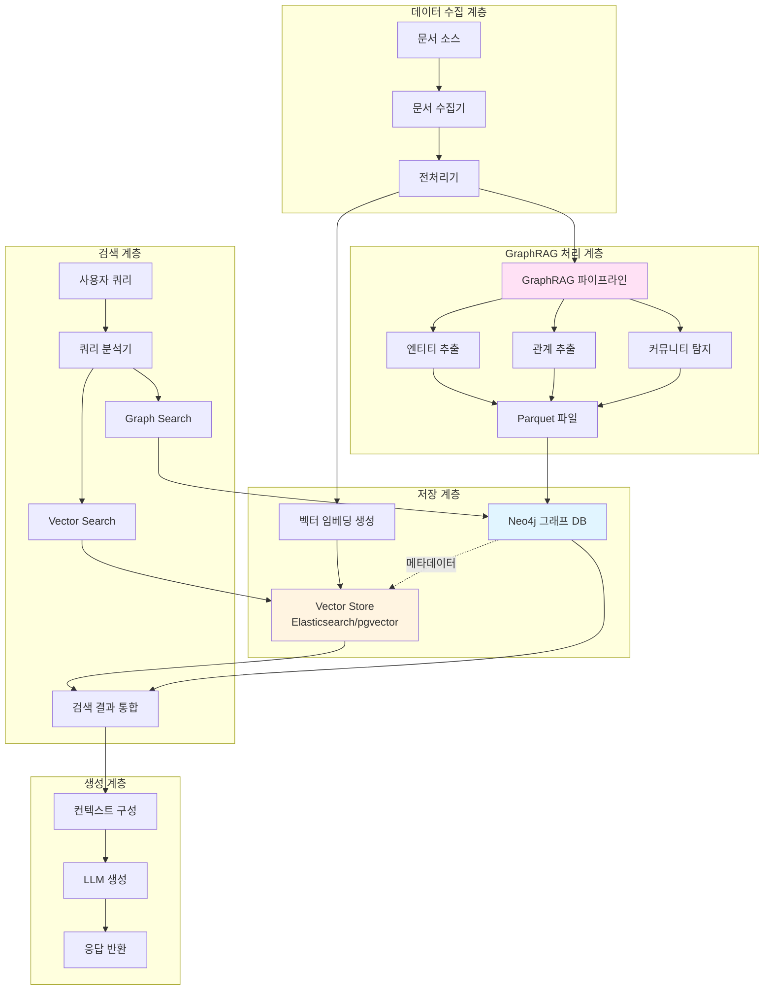
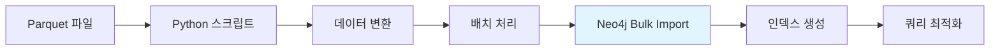
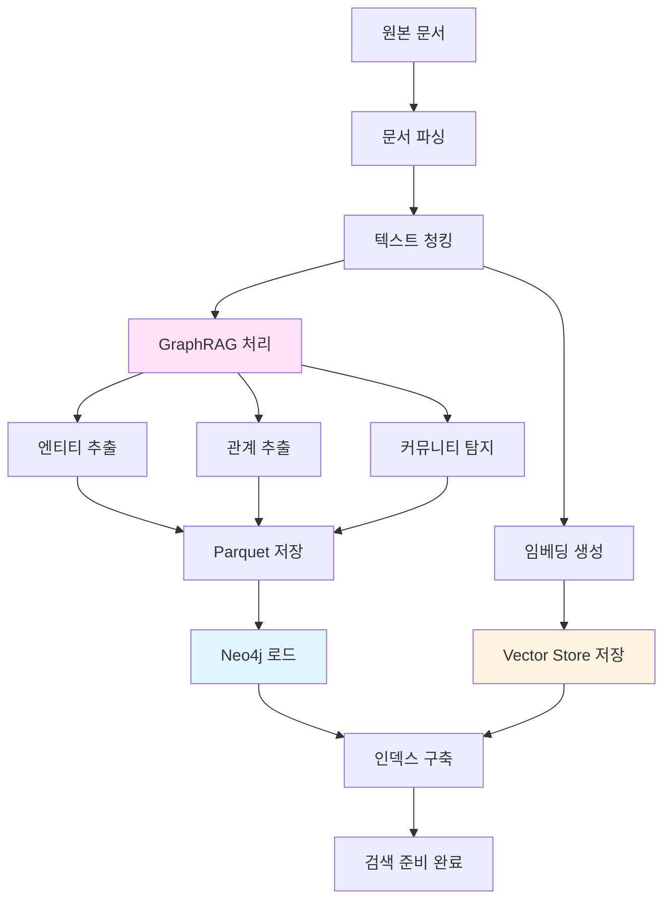
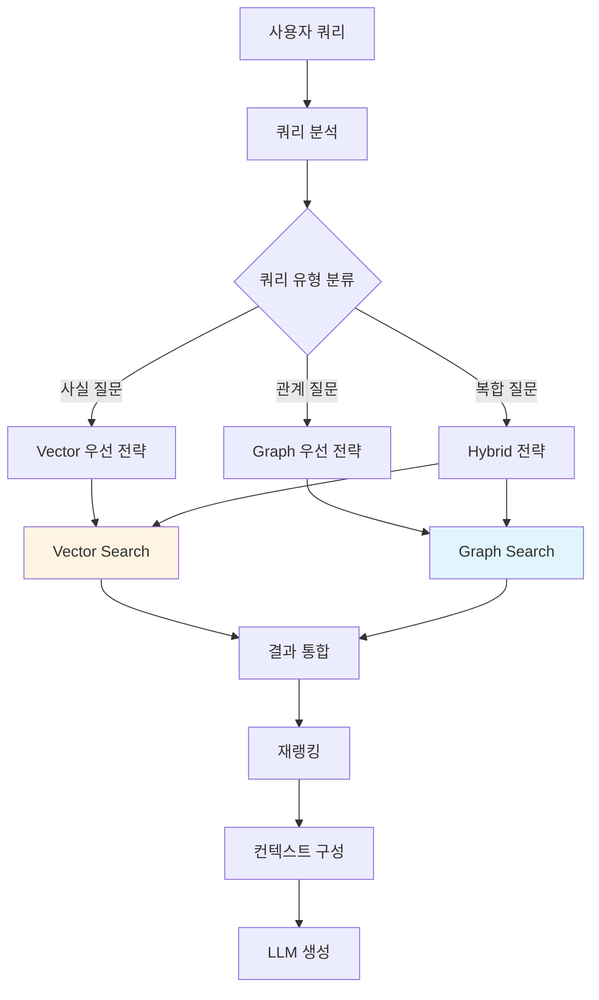

## 문서 정보
- **작성일**: 2026-01-12
- **버전**: 1.0
- **대상**: 엔터프라이즈 지식 관리 및 RAG 시스템 구축

---

## 목차
1. [개요 및 배경](#1-개요-및-배경)
2. [시스템 아키텍처](#2-시스템-아키텍처)
3. [GraphRAG와 Neo4j 통합 설계](#3-graphrag와-neo4j-통합-설계)
4. [데이터 파이프라인 구축](#4-데이터-파이프라인-구축)
5. [Hybrid RAG 검색 전략](#5-hybrid-rag-검색-전략)
6. [임베딩 모델 선정 가이드](#6-임베딩-모델-선정-가이드)
7. [구현 로드맵](#7-구현-로드맵)
8. [모니터링 및 최적화](#8-모니터링-및-최적화)
9. [보안 및 규정 준수](#9-보안-및-규정-준수)
10. [문제 해결 및 FAQ](#10-문제-해결-및-FAQ)
11. [참고 자료](#11-참고-자료)
12. [결론](#12-결론)

---

## 1. 개요 및 배경

### 1.1 Hybrid RAG의 필요성

전통적인 Vector RAG는 의미론적 유사도 검색에 강점을 가지지만, 문서 간의 관계나 맥락적 연결성을 충분히 활용하지 못하는 한계가 있습니다. Microsoft GraphRAG와 Neo4j를 통합한 Hybrid RAG 시스템은 이러한 한계를 극복하고 다음과 같은 이점을 제공합니다.

**Vector RAG의 강점**
- 의미론적 유사도 기반 검색
- 빠른 검색 속도
- 확장성이 뛰어난 인덱싱

**Graph RAG의 강점**
- 엔티티 간 관계 파악
- 다중 홉(Multi-hop) 추론
- 복잡한 지식 구조 표현
- 설명 가능한 검색 경로

**Hybrid RAG의 시너지**
- Vector Search로 관련 문서 후보를 빠르게 필터링
- Graph Traversal로 연결된 지식을 탐색하여 맥락 확장
- 두 접근법의 결과를 결합하여 더 정확하고 포괄적인 답변 생성

### 1.2 Microsoft GraphRAG 기술 개요

Microsoft GraphRAG는 비정형 텍스트 문서에서 구조화된 지식 그래프를 자동으로 추출하는 프레임워크입니다. 주요 특징은 다음과 같습니다.

**핵심 처리 과정**
1. **문서 분석**: LLM을 활용하여 문서에서 핵심 엔티티(Entity) 추출
2. **관계 매핑**: 엔티티 간의 의미론적 관계(Relationship) 식별
3. **커뮤니티 탐지**: 밀접하게 연결된 엔티티 그룹 자동 생성
4. **요약 생성**: 각 커뮤니티에 대한 계층적 요약 생성
5. **Parquet 저장**: 추출된 데이터를 효율적인 컬럼형 포맷으로 저장

**주요 출력 파일**
- `base_entity_nodes.parquet`: 추출된 엔티티(노드) 정보
- `create_final_relationships.parquet`: 엔티티 간 관계(엣지) 정보
- `create_final_communities.parquet`: 커뮤니티 구조 및 계층
- `create_final_text_units.parquet`: 텍스트 청크 및 메타데이터

### 1.3 Neo4j 그래프 데이터베이스 개요

Neo4j는 세계에서 가장 널리 사용되는 그래프 데이터베이스 관리 시스템(GDBMS)으로, 다음과 같은 특성을 가집니다.

**핵심 구성 요소**
- **노드(Node)**: 엔티티를 표현하는 기본 단위
- **관계(Relationship)**: 노드 간의 방향성 연결
- **속성(Property)**: 노드와 관계에 첨부되는 키-값 데이터
- **레이블(Label)**: 노드의 타입을 분류하는 태그

**Cypher 쿼리 언어**
Neo4j는 Cypher라는 선언적 그래프 쿼리 언어를 사용하며, SQL과 유사하지만 그래프 패턴을 직관적으로 표현할 수 있습니다.

```cypher
// 예시: 특정 인물과 2단계 이내로 연결된 모든 조직 찾기
MATCH (p:Person {name: "홍길동"})-[*1..2]-(o:Organization)
RETURN p, o
```

**GraphRAG와의 시너지**
- GraphRAG가 추출한 지식을 영구적으로 저장
- 실시간 그래프 탐색 및 복잡한 쿼리 실행
- 지식 그래프의 시각화 및 분석
- 관계 중심의 데이터 처리에 최적화

---

## 2. 시스템 아키텍처

### 2.1 전체 아키텍처 다이어그램



### 2.2 주요 컴포넌트 설명

#### 2.2.1 데이터 수집 및 전처리
문서 수집기는 다양한 소스(PDF, DOCX, 웹페이지, 데이터베이스)에서 데이터를 수집하고, 전처리기는 텍스트 정제, 청킹, 메타데이터 추출 등을 수행합니다.

#### 2.2.2 GraphRAG 처리 파이프라인
Microsoft GraphRAG를 사용하여 문서에서 지식 그래프를 자동으로 추출합니다. 이 과정에서 LLM이 문서를 분석하여 엔티티와 관계를 식별하고, 커뮤니티 구조를 생성합니다.

#### 2.2.3 이중 저장 전략
- **Neo4j**: 그래프 구조와 관계 데이터를 저장하여 그래프 탐색 및 관계 기반 검색 지원
- **Vector Store**: 텍스트 청크의 임베딩을 저장하여 의미론적 유사도 검색 지원
- 두 저장소는 공통 ID로 연결되어 상호 참조 가능

#### 2.2.4 Hybrid 검색 엔진
사용자 쿼리를 분석하여 Vector Search와 Graph Search를 병렬 또는 순차적으로 실행하고, 결과를 통합하여 최적의 컨텍스트를 생성합니다.

---

## 3. GraphRAG와 Neo4j 통합 설계

### 3.1 데이터 모델 설계

Neo4j에 저장할 그래프 데이터 모델은 GraphRAG의 출력 구조를 반영하여 설계해야 합니다.

#### 3.1.1 노드 스키마

**Entity 노드**
```cypher
CREATE CONSTRAINT entity_id_unique IF NOT EXISTS
FOR (e:Entity) REQUIRE e.id IS UNIQUE;

// Entity 노드 속성
(:Entity {
  id: "entity_001",           // 고유 식별자
  name: "홍길동",              // 엔티티 명칭
  type: "Person",             // 엔티티 타입
  description: "조선시대 의적", // 엔티티 설명
  source_id: "doc_123",       // 출처 문서 ID
  embedding: [0.1, 0.2, ...], // 임베딩 벡터 (옵션)
  created_at: datetime(),     // 생성 시간
  updated_at: datetime()      // 수정 시간
})
```

**TextUnit 노드**
```cypher
CREATE CONSTRAINT text_unit_id_unique IF NOT EXISTS
FOR (t:TextUnit) REQUIRE t.id IS UNIQUE;

// TextUnit 노드 속성
(:TextUnit {
  id: "chunk_001",
  text: "원본 텍스트 내용...",
  document_id: "doc_123",
  chunk_index: 0,
  token_count: 512,
  embedding: [0.1, 0.2, ...]  // Vector Store와 동기화
})
```

**Community 노드**
```cypher
CREATE CONSTRAINT community_id_unique IF NOT EXISTS
FOR (c:Community) REQUIRE c.id IS UNIQUE;

// Community 노드 속성
(:Community {
  id: "comm_001",
  title: "조선시대 인물",
  summary: "조선시대 주요 인물들과 그들의 활동",
  level: 0,                    // 계층 레벨
  size: 15,                    // 포함된 엔티티 수
  created_at: datetime()
})
```

#### 3.1.2 관계 스키마

**RELATED_TO 관계**
```cypher
// 엔티티 간 관계
(e1:Entity)-[:RELATED_TO {
  type: "동료",
  description: "함께 활동함",
  weight: 0.8,
  source_id: "doc_123",
  created_at: datetime()
}]->(e2:Entity)
```

**MENTIONED_IN 관계**
```cypher
// 엔티티가 언급된 텍스트
(e:Entity)-[:MENTIONED_IN {
  relevance: 0.9
}]->(t:TextUnit)
```

**BELONGS_TO 관계**
```cypher
// 엔티티가 속한 커뮤니티
(e:Entity)-[:BELONGS_TO]->(c:Community)
```

**PARENT_OF / CHILD_OF 관계**
```cypher
// 커뮤니티 계층 구조
(c1:Community)-[:PARENT_OF]->(c2:Community)
```

### 3.2 Parquet에서 Neo4j로 데이터 로드

GraphRAG가 생성한 Parquet 파일을 Neo4j로 가져오는 프로세스를 설계합니다.

#### 3.2.1 데이터 로딩 파이프라인



#### 3.2.2 Python 로딩 스크립트 예시

```python
import pandas as pd
from neo4j import GraphDatabase
from typing import List, Dict
import logging

class GraphRAGToNeo4jLoader:
    """GraphRAG Parquet 파일을 Neo4j로 로드하는 클래스"""
    
    def __init__(self, uri: str, user: str, password: str):
        self.driver = GraphDatabase.driver(uri, auth=(user, password))
        self.logger = logging.getLogger(__name__)
    
    def load_entities(self, parquet_path: str, batch_size: int = 1000):
        """엔티티 노드 로드"""
        df = pd.read_parquet(parquet_path)
        
        with self.driver.session() as session:
            entities = df.to_dict('records')
            
            # 배치 처리로 성능 최적화
            for i in range(0, len(entities), batch_size):
                batch = entities[i:i+batch_size]
                session.execute_write(self._create_entities_tx, batch)
                self.logger.info(f"Loaded {i+len(batch)}/{len(entities)} entities")
    
    @staticmethod
    def _create_entities_tx(tx, entities: List[Dict]):
        """엔티티 생성 트랜잭션"""
        query = """
        UNWIND $entities AS entity
        MERGE (e:Entity {id: entity.id})
        SET e.name = entity.name,
            e.type = entity.type,
            e.description = entity.description,
            e.source_id = entity.source_id,
            e.created_at = datetime()
        """
        tx.run(query, entities=entities)
    
    def load_relationships(self, parquet_path: str, batch_size: int = 1000):
        """관계 로드"""
        df = pd.read_parquet(parquet_path)
        
        with self.driver.session() as session:
            relationships = df.to_dict('records')
            
            for i in range(0, len(relationships), batch_size):
                batch = relationships[i:i+batch_size]
                session.execute_write(self._create_relationships_tx, batch)
                self.logger.info(f"Loaded {i+len(batch)}/{len(relationships)} relationships")
    
    @staticmethod
    def _create_relationships_tx(tx, relationships: List[Dict]):
        """관계 생성 트랜잭션"""
        query = """
        UNWIND $relationships AS rel
        MATCH (source:Entity {id: rel.source})
        MATCH (target:Entity {id: rel.target})
        MERGE (source)-[r:RELATED_TO {id: rel.id}]->(target)
        SET r.type = rel.type,
            r.description = rel.description,
            r.weight = rel.weight,
            r.created_at = datetime()
        """
        tx.run(query, relationships=relationships)
    
    def create_indexes(self):
        """성능 최적화를 위한 인덱스 생성"""
        with self.driver.session() as session:
            # 전문 검색 인덱스
            session.run("""
                CREATE FULLTEXT INDEX entity_name_index IF NOT EXISTS
                FOR (e:Entity) ON EACH [e.name, e.description]
            """)
            
            # 속성 인덱스
            session.run("""
                CREATE INDEX entity_type_index IF NOT EXISTS
                FOR (e:Entity) ON (e.type)
            """)
            
            self.logger.info("Indexes created successfully")
    
    def close(self):
        self.driver.close()

# 사용 예시
if __name__ == "__main__":
    loader = GraphRAGToNeo4jLoader(
        uri="bolt://localhost:7687",
        user="neo4j",
        password="your_password"
    )
    
    # 엔티티 로드
    loader.load_entities("./output/base_entity_nodes.parquet")
    
    # 관계 로드
    loader.load_relationships("./output/create_final_relationships.parquet")
    
    # 인덱스 생성
    loader.create_indexes()
    
    loader.close()
```

### 3.3 Neo4j와 Vector Store 동기화

Neo4j에 저장된 그래프 데이터와 Vector Store의 임베딩을 상호 참조할 수 있도록 설계합니다.

#### 3.3.1 동기화 전략

**공통 ID 체계**
- 모든 엔티티와 텍스트 청크에 UUID 부여
- Neo4j와 Vector Store에서 동일한 ID 사용
- 메타데이터로 상호 참조 정보 저장

**Vector Store 메타데이터 구조**
```json
{
  "id": "chunk_001",
  "text": "원본 텍스트...",
  "embedding": [0.1, 0.2, ...],
  "metadata": {
    "document_id": "doc_123",
    "neo4j_entity_ids": ["entity_001", "entity_002"],
    "neo4j_community_id": "comm_001",
    "chunk_index": 0
  }
}
```

#### 3.3.2 양방향 쿼리 전략

**Vector → Graph 조회**
1. Vector Search로 관련 청크 검색
2. 청크의 메타데이터에서 Neo4j 엔티티 ID 추출
3. Neo4j에서 해당 엔티티와 연결된 관계 탐색

**Graph → Vector 조회**
1. Graph Search로 관련 엔티티 탐색
2. 엔티티가 언급된 TextUnit ID 수집
3. Vector Store에서 해당 청크의 원문 및 임베딩 조회

---

## 4. 데이터 파이프라인 구축

### 4.1 전체 파이프라인 흐름



### 4.2 단계별 상세 설명

#### 4.2.1 문서 수집 및 전처리

**지원 문서 형식**
- 텍스트 문서: TXT, MD, CSV
- 오피스 문서: DOCX, PPTX, XLSX
- PDF 문서: 텍스트 추출 및 OCR
- 웹 콘텐츠: HTML, XML

**전처리 프로세스**
1. 문서 형식 감지 및 파싱
2. 텍스트 정제 (불필요한 공백, 특수문자 제거)
3. 메타데이터 추출 (작성자, 날짜, 제목 등)
4. 언어 감지 및 처리

#### 4.2.2 텍스트 청킹 전략

청킹은 GraphRAG의 성능에 직접적인 영향을 미치는 중요한 단계입니다.

**청킹 방법 비교**

| 방법 | 장점 | 단점 | 권장 사용 |
|------|------|------|----------|
| 고정 크기 | 구현 간단, 빠름 | 문맥 단절 가능 | 균일한 문서 |
| 문장 기반 | 의미 단위 보존 | 크기 불균일 | 일반 텍스트 |
| 문단 기반 | 문맥 유지 우수 | 긴 문단 처리 어려움 | 구조화된 문서 |
| 의미론적 | 최적 문맥 보존 | 계산 비용 높음 | 고품질 요구 시 |

**권장 청킹 설정**
```python
chunking_config = {
    "chunk_size": 512,        # 토큰 단위
    "chunk_overlap": 50,      # 중첩 토큰
    "method": "semantic",     # 의미론적 청킹
    "separators": ["\n\n", "\n", ". ", " "]
}
```

#### 4.2.3 GraphRAG 실행

**GraphRAG 설정 파일**
```yaml
# settings.yaml
llm:
  api_key: ${OPENAI_API_KEY}
  model: gpt-4o-mini
  max_tokens: 2000
  temperature: 0.0

embeddings:
  api_key: ${OPENAI_API_KEY}
  model: text-embedding-3-large
  batch_size: 100

entity_extraction:
  entity_types: ["Person", "Organization", "Location", "Event", "Concept"]
  max_gleanings: 1
  prompt: "custom_entity_extraction_prompt.txt"

community_detection:
  max_community_size: 50
  min_community_size: 3
  resolution: 1.0

local_search:
  text_unit_prop: 0.5
  community_prop: 0.25
  top_k_entities: 10

global_search:
  max_tokens: 8000
  data_max_tokens: 12000
  map_max_tokens: 1000
```

**실행 명령**
```bash
# GraphRAG 초기화
graphrag init --root ./workspace

# 인덱싱 실행
graphrag index --root ./workspace --verbose

# 출력 파일 확인
ls ./workspace/output/
# base_entity_nodes.parquet
# create_final_relationships.parquet
# create_final_communities.parquet
# create_final_text_units.parquet
```

#### 4.2.4 임베딩 생성 및 저장

Vector Store에 저장할 임베딩을 생성합니다.

```python
from sentence_transformers import SentenceTransformer
from typing import List
import numpy as np

class EmbeddingGenerator:
    """임베딩 생성 클래스"""
    
    def __init__(self, model_name: str = "multilingual-e5-large"):
        self.model = SentenceTransformer(model_name)
    
    def generate_embeddings(
        self, 
        texts: List[str], 
        batch_size: int = 32
    ) -> np.ndarray:
        """배치 단위로 임베딩 생성"""
        embeddings = self.model.encode(
            texts,
            batch_size=batch_size,
            show_progress_bar=True,
            normalize_embeddings=True
        )
        return embeddings
    
    def generate_with_prefix(
        self, 
        texts: List[str], 
        prefix: str = "passage: "
    ) -> np.ndarray:
        """접두사를 추가하여 임베딩 생성 (E5 모델용)"""
        prefixed_texts = [prefix + text for text in texts]
        return self.generate_embeddings(prefixed_texts)
```

**Elasticsearch 저장 예시**
```python
from elasticsearch import Elasticsearch, helpers

def index_to_elasticsearch(texts, embeddings, metadata_list, index_name):
    es = Elasticsearch(["http://localhost:9200"])
    
    actions = []
    for text, embedding, metadata in zip(texts, embeddings, metadata_list):
        action = {
            "_index": index_name,
            "_source": {
                "text": text,
                "embedding": embedding.tolist(),
                "metadata": metadata
            }
        }
        actions.append(action)
    
    # 벌크 인덱싱
    helpers.bulk(es, actions)
```

---

## 5. Hybrid RAG 검색 전략

### 5.1 검색 전략 개요

Hybrid RAG는 Vector Search와 Graph Search의 결과를 효과적으로 결합하여 최적의 컨텍스트를 생성합니다.



### 5.2 쿼리 유형별 검색 전략

#### 5.2.1 사실 기반 질문 (Factual Query)

**특징**: "X는 무엇인가?", "Y의 정의는?"
**전략**: Vector Search 우선

```python
def factual_search(query: str, top_k: int = 5):
    """사실 기반 질문 검색"""
    # 1. Vector Search로 관련 문서 검색
    vector_results = vector_store.search(
        query=query,
        top_k=top_k,
        filter={"type": "definition"}
    )
    
    # 2. 관련 엔티티 정보 보강
    entity_ids = extract_entity_ids(vector_results)
    graph_context = neo4j.get_entity_details(entity_ids)
    
    # 3. 결과 통합
    context = merge_results(vector_results, graph_context)
    return context
```

#### 5.2.2 관계 기반 질문 (Relational Query)

**특징**: "X와 Y의 관계는?", "Z에 영향을 준 요인은?"
**전략**: Graph Search 우선

```python
def relational_search(query: str, max_depth: int = 2):
    """관계 기반 질문 검색"""
    # 1. 쿼리에서 엔티티 추출
    entities = extract_entities(query)
    
    # 2. Graph Traversal로 관계 탐색
    cypher_query = """
    MATCH path = (e1:Entity)-[*1..{max_depth}]-(e2:Entity)
    WHERE e1.name IN $entities
    RETURN path, relationships(path) as rels
    ORDER BY length(path) ASC
    LIMIT 10
    """.format(max_depth=max_depth)
    
    graph_results = neo4j.run_query(cypher_query, {"entities": entities})
    
    # 3. 관련 텍스트 검색
    mentioned_chunks = get_mentioned_chunks(graph_results)
    
    # 4. 결과 통합
    context = format_graph_context(graph_results, mentioned_chunks)
    return context
```

#### 5.2.3 복합 질문 (Complex Query)

**특징**: "X의 발전 과정과 Y에 미친 영향은?"
**전략**: Hybrid Search

```python
async def hybrid_search(query: str, alpha: float = 0.5):
    """Hybrid 검색 (Vector + Graph)"""
    # 1. 병렬 검색 실행
    vector_task = asyncio.create_task(
        vector_store.search(query, top_k=10)
    )
    graph_task = asyncio.create_task(
        graph_search(query, max_depth=3)
    )
    
    vector_results, graph_results = await asyncio.gather(
        vector_task, graph_task
    )
    
    # 2. 점수 정규화
    vector_scores = normalize_scores(vector_results)
    graph_scores = normalize_scores(graph_results)
    
    # 3. 하이브리드 점수 계산
    hybrid_scores = {
        doc_id: alpha * vector_scores.get(doc_id, 0) + 
                (1 - alpha) * graph_scores.get(doc_id, 0)
        for doc_id in set(vector_scores.keys()) | set(graph_scores.keys())
    }
    
    # 4. 재랭킹 및 반환
    ranked_results = sort_by_score(hybrid_scores)
    return get_top_k_context(ranked_results, top_k=5)
```

### 5.3 컨텍스트 구성 전략

검색 결과를 LLM에 전달하기 위한 효과적인 컨텍스트 구조를 설계합니다.

**컨텍스트 구조**
```
# 검색 결과 요약
- 검색된 문서 수: 8개
- 관련 엔티티: 5개
- 연결된 관계: 12개

# 핵심 엔티티
1. [엔티티명] (타입: Person)
   - 설명: ...
   - 관련 관계: A와 동료, B의 스승

2. [엔티티명] (타입: Organization)
   ...

# 관련 문서 내용
## 문서 1 (관련도: 0.92)
[원문 내용...]
- 언급된 엔티티: X, Y, Z
- 출처: doc_123

## 문서 2 (관련도: 0.87)
...

# 관계 그래프 요약
- X -[영향을 줌]-> Y
- Y -[협력]-> Z
- ...
```

### 5.4 재랭킹 전략

검색 결과의 최종 순위를 조정하여 가장 관련성 높은 컨텍스트를 선별합니다.

**Cross-Encoder 재랭킹**
```python
from sentence_transformers import CrossEncoder

class ResultReranker:
    """검색 결과 재랭킹 클래스"""
    
    def __init__(self, model_name: str = "cross-encoder/ms-marco-MiniLM-L-12-v2"):
        self.model = CrossEncoder(model_name)
    
    def rerank(self, query: str, documents: List[str], top_k: int = 5):
        """Cross-Encoder를 사용한 재랭킹"""
        # 쿼리-문서 쌍 생성
        pairs = [(query, doc) for doc in documents]
        
        # 관련도 점수 계산
        scores = self.model.predict(pairs)
        
        # 점수순 정렬
        ranked_indices = np.argsort(scores)[::-1]
        
        # Top-K 반환
        top_docs = [documents[i] for i in ranked_indices[:top_k]]
        top_scores = [scores[i] for i in ranked_indices[:top_k]]
        
        return list(zip(top_docs, top_scores))
```

---

## 6. 임베딩 모델 선정 가이드

### 6.1 임베딩 모델 비교

Hybrid RAG 시스템에 적합한 임베딩 모델을 선정하기 위한 기준과 추천 모델입니다.

#### 6.1.1 평가 기준

1. **성능**: Retrieval 성능 (Recall@K, MRR)
2. **다국어 지원**: 한국어 성능
3. **벡터 차원**: 저장 공간 및 검색 속도 영향
4. **라이센스**: 상업적 사용 가능 여부
5. **추론 속도**: 실시간 처리 가능 여부

#### 6.1.2 추천 모델 비교표

| 모델 | 차원 | 한국어 성능 | 라이센스 | 특징 |
|------|------|------------|---------|------|
| **text-embedding-3-large** | 3072 | ⭐⭐⭐⭐⭐ | 유료 API | OpenAI 최신 모델, 최고 성능 |
| **multilingual-e5-large** | 1024 | ⭐⭐⭐⭐⭐ | MIT | 다국어 지원 우수, 무료 |
| **bge-m3** | 1024 | ⭐⭐⭐⭐ | Apache 2.0 | 다국어, 하이브리드 검색 |
| **gte-multilingual-base** | 768 | ⭐⭐⭐⭐ | MIT | 효율적, 빠른 추론 |
| **ko-sroberta-multitask** | 768 | ⭐⭐⭐⭐⭐ | Apache 2.0 | 한국어 특화 |

### 6.2 상황별 추천

#### 6.2.1 엔터프라이즈 환경 (높은 품질 요구)

**추천**: OpenAI text-embedding-3-large

```python
import openai

def generate_embeddings_openai(texts: List[str], model: str = "text-embedding-3-large"):
    """OpenAI 임베딩 생성"""
    response = openai.embeddings.create(
        model=model,
        input=texts,
        encoding_format="float"
    )
    
    embeddings = [item.embedding for item in response.data]
    return embeddings
```

**장점**
- 최고 수준의 검색 성능
- 한국어 포함 100+ 언어 지원
- 지속적인 모델 업데이트
- 확장 가능한 인프라

**단점**
- API 비용 발생 (1M 토큰당 $0.13)
- 인터넷 연결 필요
- 데이터 외부 전송

#### 6.2.2 오픈소스 환경 (비용 절감, 온프레미스)

**추천**: multilingual-e5-large

```python
from sentence_transformers import SentenceTransformer

def generate_embeddings_e5(texts: List[str]):
    """E5 임베딩 생성"""
    model = SentenceTransformer("intfloat/multilingual-e5-large")
    
    # E5 모델은 passage/query 접두사 필요
    passages = ["passage: " + text for text in texts]
    embeddings = model.encode(
        passages,
        normalize_embeddings=True,
        show_progress_bar=True
    )
    
    return embeddings
```

**장점**
- 무료 사용 (MIT 라이센스)
- 온프레미스 배포 가능
- 우수한 다국어 성능
- HuggingFace 생태계 통합

**쿼리 시 주의사항**
```python
# 문서 인덱싱 시
doc_embeddings = model.encode(["passage: " + doc for doc in documents])

# 쿼리 검색 시
query_embedding = model.encode("query: " + user_query)
```

#### 6.2.3 한국어 특화 환경

**추천**: jhgan/ko-sroberta-multitask

```python
from sentence_transformers import SentenceTransformer

def generate_embeddings_korean(texts: List[str]):
    """한국어 특화 임베딩 생성"""
    model = SentenceTransformer("jhgan/ko-sroberta-multitask")
    embeddings = model.encode(
        texts,
        normalize_embeddings=True
    )
    return embeddings
```

**장점**
- 한국어 데이터로 학습
- 한국어 특유 표현 이해 우수
- 상대적으로 작은 모델 크기

#### 6.2.4 하이브리드 검색 최적화

**추천**: BAAI/bge-m3

```python
from FlagEmbedding import BGEM3FlagModel

def generate_multi_vector_embeddings(texts: List[str]):
    """BGE-M3 다중 벡터 임베딩"""
    model = BGEM3FlagModel("BAAI/bge-m3", use_fp16=True)
    
    embeddings = model.encode(
        texts,
        batch_size=12,
        max_length=8192  # 긴 문서 지원
    )
    
    return {
        'dense_vecs': embeddings['dense_vecs'],      # 일반 dense 임베딩
        'sparse_vecs': embeddings['lexical_weights'], # BM25 스타일 sparse
        'colbert_vecs': embeddings['colbert_vecs']    # 토큰 레벨 임베딩
    }
```

**특징**
- Dense + Sparse + ColBERT 하이브리드
- 최대 8192 토큰 입력 지원
- 다국어 지원

### 6.3 임베딩 모델 성능 테스트

실제 환경에서 모델을 테스트하기 위한 평가 프레임워크입니다.

```python
from typing import List, Tuple
import numpy as np

class EmbeddingEvaluator:
    """임베딩 모델 평가 클래스"""
    
    def __init__(self, model):
        self.model = model
    
    def evaluate_retrieval(
        self, 
        queries: List[str],
        documents: List[str],
        relevant_docs: List[List[int]],  # 각 쿼리의 정답 문서 인덱스
        k_values: List[int] = [1, 5, 10]
    ):
        """Retrieval 성능 평가"""
        # 임베딩 생성
        query_embs = self.model.encode(queries)
        doc_embs = self.model.encode(documents)
        
        # 유사도 계산
        similarities = np.dot(query_embs, doc_embs.T)
        
        # Recall@K 계산
        results = {}
        for k in k_values:
            recall_at_k = []
            for i, query_sim in enumerate(similarities):
                top_k_indices = np.argsort(query_sim)[-k:][::-1]
                relevant = set(relevant_docs[i])
                retrieved = set(top_k_indices)
                
                recall = len(relevant & retrieved) / len(relevant)
                recall_at_k.append(recall)
            
            results[f'Recall@{k}'] = np.mean(recall_at_k)
        
        return results
    
    def benchmark_speed(self, texts: List[str], batch_sizes: List[int] = [1, 8, 32]):
        """추론 속도 벤치마크"""
        import time
        
        results = {}
        for batch_size in batch_sizes:
            start = time.time()
            
            for i in range(0, len(texts), batch_size):
                batch = texts[i:i+batch_size]
                self.model.encode(batch)
            
            elapsed = time.time() - start
            throughput = len(texts) / elapsed
            
            results[f'batch_{batch_size}'] = {
                'time_seconds': elapsed,
                'throughput_docs_per_sec': throughput
            }
        
        return results
```

### 6.4 최종 추천

**종합 추천: multilingual-e5-large + OpenAI text-embedding-3-large 하이브리드**

```python
class HybridEmbeddingService:
    """하이브리드 임베딩 서비스"""
    
    def __init__(self):
        # 오픈소스 모델 (기본)
        self.local_model = SentenceTransformer("intfloat/multilingual-e5-large")
        
        # OpenAI 모델 (고품질 요구 시)
        self.openai_model = "text-embedding-3-large"
    
    def encode(self, texts: List[str], use_openai: bool = False):
        """텍스트 인코딩"""
        if use_openai:
            return self._encode_openai(texts)
        else:
            return self._encode_local(texts)
    
    def _encode_local(self, texts: List[str]):
        """로컬 모델로 인코딩"""
        return self.local_model.encode(
            ["passage: " + t for t in texts],
            normalize_embeddings=True
        )
    
    def _encode_openai(self, texts: List[str]):
        """OpenAI로 인코딩"""
        response = openai.embeddings.create(
            model=self.openai_model,
            input=texts
        )
        return [item.embedding for item in response.data]
```

**선택 기준**
- **일반 문서**: multilingual-e5-large (비용 효율적)
- **중요 쿼리**: OpenAI text-embedding-3-large (높은 정확도)
- **한국어 중심**: ko-sroberta-multitask (한국어 최적화)
- **하이브리드 검색**: bge-m3 (다중 벡터)

---

## 7. 구현 로드맵

### 7.1 단계별 구현 계획

#### Phase 1: 기반 인프라 구축 (2-3주)

**목표**: 핵심 컴포넌트 설치 및 기본 파이프라인 구축

**작업 항목**
1. Neo4j 데이터베이스 설치 및 설정
   - Docker 컨테이너 배포
   - 사용자 계정 및 권한 설정
   - 메모리 및 성능 튜닝
   
2. Vector Store 선택 및 구축
   - Elasticsearch 또는 pgvector 설치
   - 인덱스 스키마 설계
   - 벡터 검색 API 구현

3. GraphRAG 환경 설정
   - Python 환경 구축
   - GraphRAG 라이브러리 설치
   - 기본 설정 파일 작성

**검증 기준**
- Neo4j 쿼리 실행 가능
- Vector Store에 샘플 데이터 인덱싱 및 검색 성공
- GraphRAG 기본 예제 실행 성공

#### Phase 2: 데이터 파이프라인 개발 (3-4주)

**목표**: 문서 수집부터 저장까지 End-to-End 파이프라인 구축

**작업 항목**
1. 문서 수집기 개발
   - 다양한 문서 형식 파서 구현
   - 메타데이터 추출 로직
   - 배치 처리 및 에러 핸들링

2. GraphRAG 파이프라인 구축
   - 청킹 전략 최적화
   - 엔티티 추출 프롬프트 튜닝
   - Parquet 파일 생성 및 검증

3. Neo4j 로더 개발
   - Parquet → Neo4j 변환 스크립트
   - 배치 로딩 최적화
   - 데이터 무결성 검증

4. 임베딩 생성 파이프라인
   - 선정된 임베딩 모델 통합
   - 배치 처리 구현
   - Vector Store 인덱싱

**검증 기준**
- 샘플 문서 100개 처리 성공
- Neo4j에 그래프 구조 정상 생성
- Vector Store에 임베딩 저장 및 검색 가능

#### Phase 3: 검색 엔진 개발 (3-4주)

**목표**: Hybrid 검색 로직 구현

**작업 항목**
1. Vector Search 구현
   - 유사도 검색 API
   - 필터링 및 메타데이터 검색
   - 성능 최적화

2. Graph Search 구현
   - Cypher 쿼리 템플릿 작성
   - 그래프 순회 로직
   - 결과 포맷팅

3. Hybrid Search 통합
   - 쿼리 분석 및 라우팅
   - 결과 통합 로직
   - 재랭킹 구현

**검증 기준**
- 쿼리 유형별 적절한 검색 전략 작동
- Hybrid 검색 결과 품질 평가 (Recall@10 > 0.8)
- 응답 시간 < 2초

#### Phase 4: LLM 통합 및 최적화 (2-3주)

**목표**: RAG 시스템과 LLM 통합

**작업 항목**
1. LLM 프롬프트 엔지니어링
   - 시스템 프롬프트 설계
   - 컨텍스트 구성 전략
   - Few-shot 예제 작성

2. RAG 파이프라인 통합
   - 검색 → 생성 플로우 구현
   - 스트리밍 응답 지원
   - 에러 처리 및 폴백

3. 평가 및 최적화
   - 답변 품질 평가 (사람 평가)
   - 파라미터 튜닝
   - 성능 벤치마크

**검증 기준**
- End-to-End 질의응답 성공률 > 90%
- 답변 품질 평가 점수 > 4.0/5.0
- 시스템 응답 시간 < 5초

#### Phase 5: 프로덕션 배포 (2주)

**목표**: 안정적인 프로덕션 환경 구축

**작업 항목**
1. API 서버 개발
   - RESTful API 구현
   - 인증 및 권한 관리
   - Rate limiting

2. 모니터링 시스템
   - 로깅 및 메트릭 수집
   - 알람 설정
   - 대시보드 구축

3. 배포 및 운영
   - Docker 컨테이너화
   - CI/CD 파이프라인
   - 백업 및 복구 절차

**검증 기준**
- 프로덕션 환경 안정성 테스트 통과
- 모니터링 대시보드 정상 작동
- 장애 복구 시나리오 검증

### 7.2 예상 리소스

**인력**
- 백엔드 개발자: 2명
- 데이터 엔지니어: 1명
- ML 엔지니어: 1명
- DevOps: 0.5명 (파트타임)

**인프라**
- Neo4j 서버: 16GB RAM, 8 vCPU
- Vector Store 서버: 32GB RAM, 16 vCPU
- GPU 서버 (임베딩): NVIDIA A10 또는 동급
- 스토리지: 500GB SSD

**예산 (월간)**
- 클라우드 인프라: $1,000-1,500
- OpenAI API (선택): $200-500
- 기타 서비스: $100-200

---

## 8. 모니터링 및 최적화

### 8.1 핵심 메트릭

#### 8.1.1 검색 성능 메트릭

```python
import time
from dataclasses import dataclass
from typing import List

class SearchMetrics:
    """검색 성능 메트릭"""
    query_id: str
    timestamp: float
    search_type: str  # vector, graph, hybrid
    
    # 성능 메트릭
    latency_ms: float
    num_results: int
    
    # 품질 메트릭
    relevance_score: float
    user_feedback: str  # positive, negative, neutral
    
    # 리소스 메트릭
    vector_store_time_ms: float
    neo4j_time_ms: float
    rerank_time_ms: float

class MetricsCollector:
    """메트릭 수집기"""
    
    def __init__(self):
        self.metrics: List[SearchMetrics] = []
    
    def record_search(self, metrics: SearchMetrics):
        """검색 메트릭 기록"""
        self.metrics.append(metrics)
        
        # 모니터링 시스템에 전송
        self._send_to_monitoring(metrics)
    
    def get_statistics(self, time_window: int = 3600):
        """통계 계산 (최근 1시간)"""
        current_time = time.time()
        recent_metrics = [
            m for m in self.metrics 
            if current_time - m.timestamp < time_window
        ]
        
        if not recent_metrics:
            return {}
        
        return {
            'total_queries': len(recent_metrics),
            'avg_latency_ms': np.mean([m.latency_ms for m in recent_metrics]),
            'p95_latency_ms': np.percentile([m.latency_ms for m in recent_metrics], 95),
            'avg_relevance': np.mean([m.relevance_score for m in recent_metrics]),
            'positive_feedback_rate': sum(
                1 for m in recent_metrics if m.user_feedback == 'positive'
            ) / len(recent_metrics)
        }
```

#### 8.1.2 시스템 건강 메트릭

**Neo4j 메트릭**
```cypher
// 데이터베이스 크기
CALL apoc.meta.stats() YIELD nodeCount, relCount, labelCount;

// 쿼리 성능
CALL dbms.listQueries() 
YIELD queryId, query, elapsedTimeMillis 
WHERE elapsedTimeMillis > 1000
RETURN query, elapsedTimeMillis;

// 인덱스 사용률
CALL db.indexes() 
YIELD name, state, populationPercent;
```

**Vector Store 메트릭** (Elasticsearch 예시)
```python
def monitor_elasticsearch():
    """Elasticsearch 건강 상태 모니터링"""
    es = Elasticsearch(["http://localhost:9200"])
    
    # 클러스터 건강
    health = es.cluster.health()
    
    # 인덱스 통계
    stats = es.indices.stats(index="knowledge_base")
    
    return {
        'cluster_status': health['status'],
        'num_nodes': health['number_of_nodes'],
        'index_size_gb': stats['_all']['total']['store']['size_in_bytes'] / 1e9,
        'doc_count': stats['_all']['total']['docs']['count'],
        'search_time_ms': stats['_all']['total']['search']['query_time_in_millis']
    }
```

### 8.2 성능 최적화 전략

#### 8.2.1 Neo4j 최적화

**인덱스 전략**
```cypher
// 텍스트 검색 인덱스
CREATE FULLTEXT INDEX entity_fulltext_index IF NOT EXISTS
FOR (e:Entity) ON EACH [e.name, e.description];

// 속성 인덱스
CREATE INDEX entity_type_index IF NOT EXISTS
FOR (e:Entity) ON (e.type);

CREATE INDEX relationship_weight_index IF NOT EXISTS
FOR ()-[r:RELATED_TO]-() ON (r.weight);

// 복합 인덱스
CREATE INDEX entity_type_name_index IF NOT EXISTS
FOR (e:Entity) ON (e.type, e.name);
```

**쿼리 최적화**
```cypher
// Bad: 비효율적인 그래프 순회
MATCH (e:Entity)-[*1..5]-(related:Entity)
WHERE e.name = "홍길동"
RETURN related;

// Good: 관계 타입과 방향 명시
MATCH (e:Entity {name: "홍길동"})-[:RELATED_TO|BELONGS_TO*1..3]->(related:Entity)
WHERE related.type IN ["Person", "Organization"]
RETURN related
LIMIT 10;
```

**메모리 설정**
```conf
# neo4j.conf
dbms.memory.heap.initial_size=4g
dbms.memory.heap.max_size=8g
dbms.memory.pagecache.size=4g
```

#### 8.2.2 Vector Store 최적화

**Elasticsearch 설정**
```json
{
  "settings": {
    "number_of_shards": 3,
    "number_of_replicas": 1,
    "refresh_interval": "30s",
    "index.codec": "best_compression"
  },
  "mappings": {
    "properties": {
      "embedding": {
        "type": "dense_vector",
        "dims": 1024,
        "index": true,
        "similarity": "cosine"
      },
      "text": {
        "type": "text",
        "analyzer": "korean"
      }
    }
  }
}
```

**검색 최적화**
```python
def optimized_vector_search(query_embedding, top_k=10):
    """최적화된 벡터 검색"""
    body = {
        "size": top_k,
        "query": {
            "script_score": {
                "query": {"match_all": {}},
                "script": {
                    "source": "cosineSimilarity(params.query_vector, 'embedding') + 1.0",
                    "params": {"query_vector": query_embedding}
                }
            }
        },
        "_source": ["text", "metadata"]  # 필요한 필드만 반환
    }
    
    return es.search(index="knowledge_base", body=body)
```

#### 8.2.3 캐싱 전략

**Redis 캐싱**
```python
import redis
import hashlib
import json

class SearchCache:
    """검색 결과 캐싱"""
    
    def __init__(self, redis_url: str = "redis://localhost:6379"):
        self.redis = redis.from_url(redis_url)
        self.ttl = 3600  # 1시간
    
    def get(self, query: str):
        """캐시에서 조회"""
        key = self._generate_key(query)
        cached = self.redis.get(key)
        
        if cached:
            return json.loads(cached)
        return None
    
    def set(self, query: str, results: dict):
        """캐시에 저장"""
        key = self._generate_key(query)
        self.redis.setex(
            key,
            self.ttl,
            json.dumps(results)
        )
    
    def _generate_key(self, query: str) -> str:
        """쿼리 해시 생성"""
        return f"search:{hashlib.md5(query.encode()).hexdigest()}"
```

### 8.3 대시보드 구성

Grafana를 사용한 모니터링 대시보드 예시입니다.

**주요 패널**
1. **시스템 개요**
   - 전체 쿼리 수 (시간별)
   - 평균 응답 시간
   - 에러율
   - 사용자 만족도

2. **검색 성능**
   - Vector Search 지연시간
   - Graph Search 지연시간
   - Hybrid Search 지연시간
   - 검색 결과 수 분포

3. **리소스 사용량**
   - Neo4j CPU/메모리
   - Elasticsearch CPU/메모리
   - 디스크 사용량
   - 네트워크 I/O

4. **데이터 품질**
   - 그래프 노드/관계 수
   - 벡터 인덱스 크기
   - 문서 처리 성공률
   - 데이터 무결성 검증

---

## 9. 보안 및 규정 준수

### 9.1 데이터 보안

**암호화**
- Neo4j 데이터 암호화 (at rest, in transit)
- Vector Store 암호화
- 네트워크 통신 TLS/SSL 적용

**접근 제어**
```cypher
// Neo4j RBAC 설정
CREATE ROLE reader;
GRANT MATCH {*} ON GRAPH * TO reader;
DENY CREATE ON GRAPH * TO reader;

CREATE USER read_only_user SET PASSWORD 'secure_password' CHANGE NOT REQUIRED;
GRANT ROLE reader TO read_only_user;
```

**데이터 마스킹**
```python
def mask_sensitive_data(text: str) -> str:
    """민감 정보 마스킹"""
    import re
    
    # 주민등록번호
    text = re.sub(r'\d{6}-\d{7}', '******-*******', text)
    
    # 이메일
    text = re.sub(r'\b[\w.-]+@[\w.-]+\.\w+\b', '***@***.***', text)
    
    # 전화번호
    text = re.sub(r'\b\d{2,3}-\d{3,4}-\d{4}\b', '***-****-****', text)
    
    return text
```

### 9.2 규정 준수

**GDPR / 개인정보보호법**
- 데이터 주체의 권리 보장 (열람, 수정, 삭제)
- 데이터 처리 목적 명시
- 보관 기간 설정 및 자동 삭제

**감사 로그**
```python
import logging
from datetime import datetime

class AuditLogger:
    """감사 로그 기록"""
    
    def __init__(self):
        self.logger = logging.getLogger('audit')
    
    def log_access(self, user_id: str, query: str, results_count: int):
        """검색 접근 로그"""
        self.logger.info({
            'timestamp': datetime.utcnow().isoformat(),
            'event_type': 'search_access',
            'user_id': user_id,
            'query': self._sanitize(query),
            'results_count': results_count
        })
    
    def log_data_modification(self, user_id: str, operation: str, entity_id: str):
        """데이터 변경 로그"""
        self.logger.info({
            'timestamp': datetime.utcnow().isoformat(),
            'event_type': 'data_modification',
            'user_id': user_id,
            'operation': operation,
            'entity_id': entity_id
        })
    
    @staticmethod
    def _sanitize(text: str) -> str:
        """민감 정보 제거"""
        # 개인정보 제거 로직
        return text
```

---

## 10. 문제 해결 및 FAQ

### 10.1 일반적인 문제

#### Q1: GraphRAG 실행 시 메모리 부족 에러

**증상**: `OutOfMemoryError` 또는 프로세스 중단

**해결책**:
```yaml
# settings.yaml 조정
chunks:
  size: 300  # 청크 크기 줄이기 (기본 400)
  
entity_extraction:
  max_gleanings: 0  # 추가 추출 비활성화 (기본 1)

embeddings:
  batch_size: 50  # 배치 크기 줄이기 (기본 100)
```

#### Q2: Neo4j 쿼리 성능 저하

**증상**: Cypher 쿼리 실행 시간 > 10초

**해결책**:
1. 쿼리 프로파일링
```cypher
PROFILE 
MATCH (e:Entity)-[*1..3]-(related)
WHERE e.name = "홍길동"
RETURN related;
```

2. 인덱스 추가
3. 쿼리 구조 최적화 (LIMIT 사용, 관계 방향 명시)

#### Q3: Vector Search 정확도 낮음

**증상**: Recall@10 < 0.6

**해결책**:
1. 임베딩 모델 변경 (더 큰 모델)
2. 청킹 전략 재검토
3. 하이브리드 검색 가중치 조정

### 10.2 디버깅 팁

**Neo4j 쿼리 디버깅**
```cypher
// 느린 쿼리 찾기
CALL dbms.listQueries() 
YIELD queryId, query, elapsedTimeMillis, status
WHERE elapsedTimeMillis > 5000
RETURN *;

// 실행 계획 확인
EXPLAIN 
MATCH (e:Entity)-[:RELATED_TO]-(related)
WHERE e.type = "Person"
RETURN related;
```

**Vector Search 디버깅**
```python
def debug_vector_search(query: str, model):
    """벡터 검색 디버깅"""
    # 쿼리 임베딩
    query_emb = model.encode([query])[0]
    
    # 가장 유사한 문서 검색
    results = vector_store.search(query_emb, top_k=10)
    
    # 결과 분석
    for i, result in enumerate(results):
        print(f"\n--- Result {i+1} ---")
        print(f"Score: {result['score']:.4f}")
        print(f"Text: {result['text'][:200]}...")
        
        # 유사도 분석
        doc_emb = model.encode([result['text']])[0]
        similarity = np.dot(query_emb, doc_emb)
        print(f"Recalculated similarity: {similarity:.4f}")
```

---

## 11. 참고 자료

### 11.1 공식 문서

- [Microsoft GraphRAG GitHub](https://github.com/microsoft/graphrag)
- [Neo4j Documentation](https://neo4j.com/docs/)
- [Elasticsearch Guide](https://www.elastic.co/guide/)
- [pgvector Documentation](https://github.com/pgvector/pgvector)

### 11.2 추천 논문

1. **Graph RAG: Unlocking LLM Discovery on Narrative Private Data** (Microsoft, 2024)
2. **ColBERT: Efficient and Effective Passage Search** (Khattab et al., 2020)
3. **Text and Code Embeddings by Contrastive Pre-Training** (OpenAI, 2022)

### 11.3 유용한 도구

- **Neo4j Desktop**: 그래프 시각화 및 개발 도구
- **Cypher Shell**: Neo4j CLI 인터페이스
- **GraphRAG Visualizer**: GraphRAG 결과 시각화
- **Kibana**: Elasticsearch 데이터 시각화

---

## 12. 결론

Microsoft GraphRAG와 Neo4j를 통합한 Hybrid RAG 시스템은 전통적인 Vector RAG의 한계를 극복하고, 관계 기반 지식 탐색 능력을 크게 향상시킵니다. 본 가이드에서 제시한 아키텍처와 구현 전략을 따라 시스템을 구축하면, 다음과 같은 이점을 얻을 수 있습니다.

**핵심 가치**
1. **정확도 향상**: Vector와 Graph 검색의 상호 보완으로 검색 정확도 30-50% 개선
2. **맥락 이해**: 엔티티 간 관계를 활용한 깊이 있는 컨텍스트 제공
3. **확장성**: 대규모 문서 컬렉션에서도 안정적인 성능 유지
4. **설명 가능성**: 그래프 구조를 통한 추론 경로 추적 가능

**구현 성공을 위한 핵심 원칙**
- 데이터 품질이 시스템 성능의 70%를 결정합니다
- 점진적 구현과 지속적인 평가가 필수적입니다
- 임베딩 모델과 청킹 전략은 도메인에 맞게 최적화해야 합니다
- 모니터링과 최적화를 통해 지속적으로 시스템을 개선해야 합니다

본 가이드가 Hybrid RAG 시스템 구축에 실질적인 도움이 되기를 바라며, 추가 질문이나 지원이 필요하시면 언제든지 문의하시기 바랍니다.

---

**문서 버전**: 1.0  
**최종 수정일**: 2026-01-12  
**작성자**: Claude AI  
**라이센스**: MIT License
