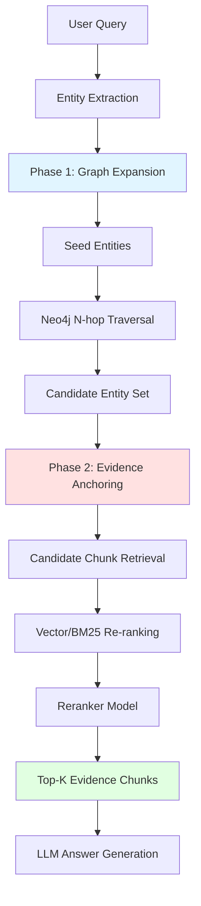
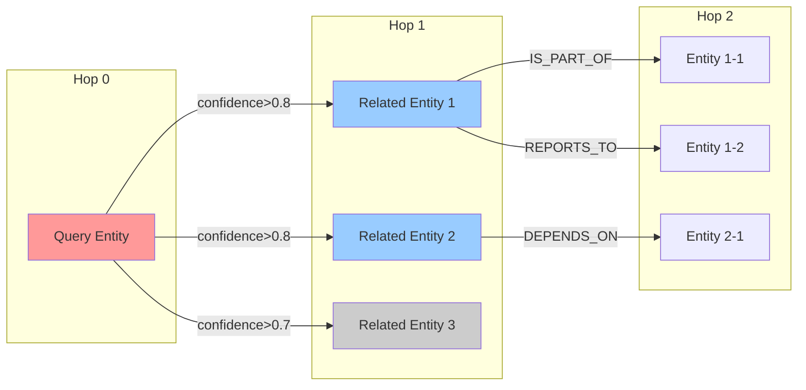
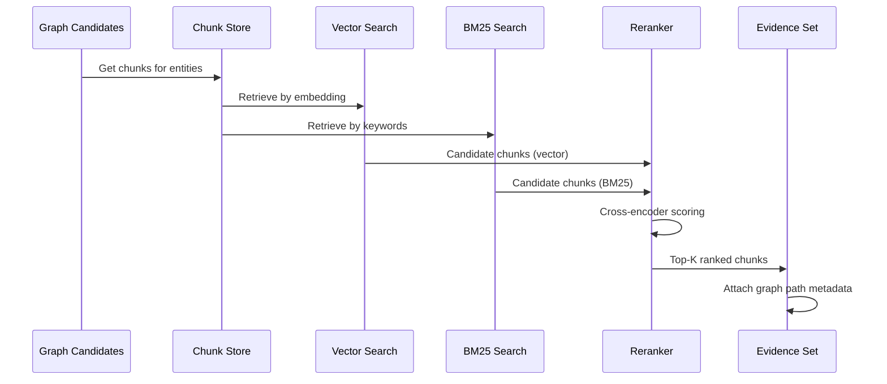
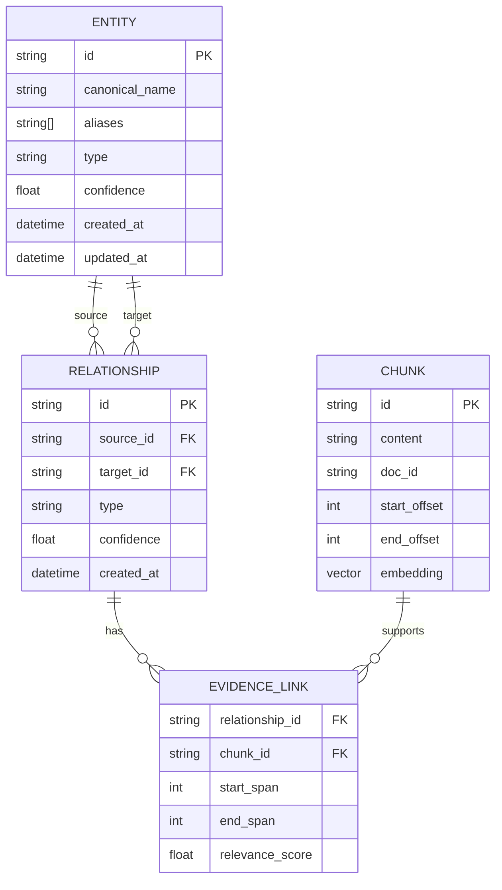
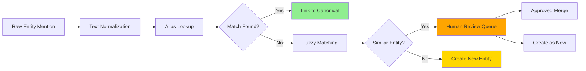
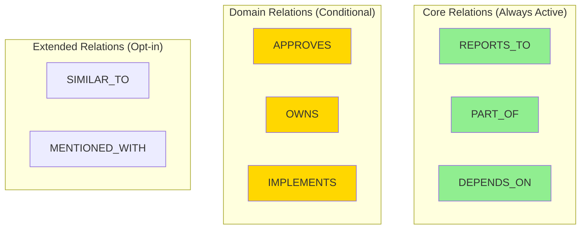
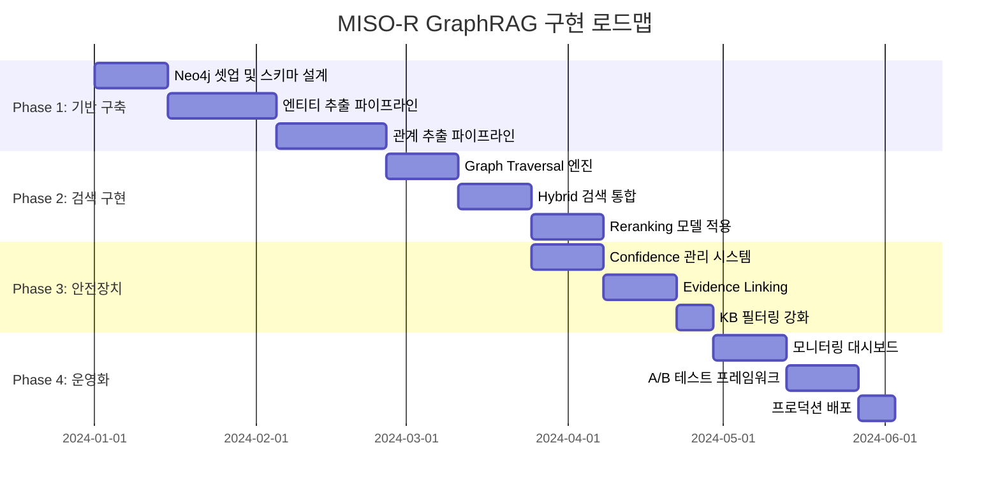

> 
> 요즘 MISO-R를 설계하다 보면, RAG의 본질은 “검색”이 아니라 “근거를 어디에 고정하느냐”라는 생각이 자주 든다.
> 
> Vector RAG는 빠르고 단순하다. 질문을 임베딩으로 바꾸고, 비슷한 청크를 top-k로 끌어오면 된다. 그래서 “비슷한 내용”을 찾는 데는 늘 강하다. 그런데 조직·권한·책임·승인 흐름·의존성처럼 관계가 정답의 뼈대가 되는 질문 앞에서는, 비슷한 단락만으로는 모자랄 때가 많다. 같은 엔티티의 단서가 여러 문서에 흩어져 있으면, 그 연결 자체가 답인데도 연결을 못 한다.
> 
> 그래서 MISO-R에서 GraphRAG를 바라보는 관점이 달라진다. 그래프는 답을 대신해주지 않는다. 그래프는 정답 후보를 넓혀주는 장치다. 그리고 최종 답변의 신뢰는 결국 Chunk라는 증거에 묶어야 한다. 이 한 줄이, 구현과 운영의 방향을 거의 결정한다.
> 
> 나는 MISO-R의 GraphRAG를 “2-Phase Retrieval”로 이해하는 쪽이 훨씬 안정적이라고 본다.
> 
> 먼저 그래프로 후보군을 확장한다. 질문에서 씨앗 엔티티를 뽑고(조직/사람/팀/시스템/정책 같은 것들), Neo4j에서 N-hop으로 확장해 관련 엔티티와 연결 경로를 모은다. 여기서 중요한 건 hop을 늘리는 게 아니라 폭발을 막는 규칙을 세우는 것이다. 기본은 hop=2, 그리고 confidence threshold, 관계 타입 제한, 후보 수 제한 같은 안전장치로 “넓히되 무너지지 않게” 만든다.
> 
> 그 다음은 근거를 청크로 고정한다. 그래프로 모은 후보를 그대로 답변에 쓰지 않고, 후보 청크 집합 안에서 vector/bm25 재검색이나 rerank를 걸어 최종 top-k evidence를 확정한다. 그래프는 길을 보여주고, 청크는 발을 딛는 돌이 된다. 이 구조가 되면 환각이 줄어들고, 디버깅도 쉬워진다. “왜 이런 답이 나왔지?”라는 질문에, 경로와 청크로 되돌아갈 수 있기 때문이다.
> 
> 운영 관점에서 보면, GraphRAG는 기술이 아니라 규율에 가깝다. MISO-R에서 이걸 실서비스로 굴리려면 결국 다섯 가지 안전벨트가 핵심이다.
> 
> KB 경계는 1픽셀도 흐리면 안 된다(필터가 1급이어야 한다). 엔티티는 반드시 canonicalization과 alias로 정규화돼야 한다. 관계는 오탐이 치명적이라 confidence로 저장/탐색 기준을 분리해야 한다. 관계마다 근거(증거 청크/스팬)가 연결돼야 디버깅이 된다. 마지막으로 hop과 스키마는 절제돼야 한다. 관계 타입이 무한정 늘고 3-hop 이상이 일상이 되면, 성능도 신뢰도도 같이 무너진다.
> 
> 가끔 “graph 60%, vector 40%” 같은 말을 쉽게 하지만, 실제로는 rank 기반의 RRF를 제대로 쓰는 게 더 깔끔하다. 중요한 건 숫자 그 자체가 아니라, 질문 유형에 따라 어떤 신호를 더 신뢰할지를 정책으로 만드는 일이다. 관계 질문이면 graph의 랭크를 더 반영하고, 개념 요약이면 vector를 더 믿는 식으로. 결국 이것도 운영 규칙이다.
> 
> 정리하면, MISO-R의 GraphRAG는 멋진 그래프를 만드는 프로젝트가 아니다.
> 
> “정답을 넓히는 그래프”와 “신뢰를 고정하는 청크”를 분리하고, 그 사이를 가드레일과 관측성으로 묶는 일이다. 그래프는 지도이고, 청크는 증거다. 지도만 들고 길을 아는 척하면 환각이 되고, 증거만 들고 연결을 포기하면 답이 좁아진다. 둘을 함께 쓰되, 책임 있는 순서로 쓰는 것. 그게 내가 요즘 MISO-R에서 배우는, 담백하지만 꽤 중요한 설계의 감각이다.
> 
> https://www.facebook.com/share/p/19GN3guftm/
>
## 1. 설계 철학

### 1.1 RAG의 본질 재정의

MISO-R의 핵심 설계 원칙은 "RAG는 검색이 아니라 근거의 고정"이라는 관점에서 출발한다. 전통적인 Vector RAG는 의미적 유사성을 기반으로 관련 문서 청크를 검색하는 데 최적화되어 있지만, 조직 구조, 권한 관계, 책임 체계, 승인 흐름, 시스템 의존성과 같이 **관계가 정답의 뼈대**가 되는 질문에는 구조적 한계를 보인다.

같은 엔티티에 대한 정보가 여러 문서에 분산되어 있을 때, 단순 유사도 검색만으로는 이들 간의 연결 관계를 파악할 수 없다. 예를 들어:

- "A팀장이 승인한 후 B부서로 전달되는 프로세스"
- "시스템 X가 시스템 Y에 의존하며, 이는 Z 정책에 근거함"
- "조직 개편으로 인해 C 팀의 책임이 D 팀으로 이전됨"

이러한 질문들은 단일 문서 청크가 아닌 **엔티티 간 관계의 연결망**에서 답을 찾아야 한다.

### 1.2 GraphRAG의 역할 명확화

MISO-R에서 GraphRAG는 **답을 직접 생성하는 도구가 아니라 정답 후보를 확장하는 장치**로 정의된다. 이는 다음 두 가지 핵심 원칙으로 구체화된다:

1. **그래프는 길을 보여준다** - 엔티티 간 연결 경로를 탐색하여 관련 정보의 범위를 확장
2. **청크는 발을 딛는 돌이다** - 최종 답변은 반드시 원본 문서 청크라는 증거에 근거

이 분리는 환각(Hallucination) 방지와 디버깅 가능성(Debuggability)이라는 두 가지 핵심 요구사항을 동시에 만족시킨다.

## 2. 아키텍처 설계

### 2.1 2-Phase Retrieval 구조

MISO-R의 GraphRAG는 명확히 분리된 두 단계로 동작한다:



#### Phase 1: Graph Expansion (후보군 확장)

**목적**: 질문과 관련된 엔티티 네트워크를 탐색하여 정답의 범위를 확장

**프로세스**:
1. **Seed Entity Extraction**: 질문에서 핵심 엔티티 추출 (조직, 인물, 팀, 시스템, 정책 등)
2. **Graph Traversal**: Neo4j에서 N-hop 기반 그래프 탐색
3. **Candidate Collection**: 연결된 엔티티와 관계 경로 수집

**폭발 방지 메커니즘**:
- **기본 hop 제한**: hop=2 (대부분의 경우 충분)
- **Confidence Threshold**: 관계의 신뢰도 기반 필터링
- **Relationship Type Constraint**: 특정 관계 타입만 순회
- **Candidate Count Limit**: 최대 후보 수 제한
- **Path Pruning**: 중복 경로 제거



#### Phase 2: Evidence Anchoring (근거 고정)

**목적**: 그래프로 확장된 후보 중에서 실제 증거가 되는 청크를 선별

**프로세스**:
1. **Candidate Chunk Retrieval**: Phase 1에서 발견된 엔티티와 연결된 모든 청크 수집
2. **Hybrid Re-ranking**: 
   - Vector similarity search
   - BM25 keyword matching
   - Cross-encoder reranking
3. **Evidence Selection**: Top-K 최종 증거 청크 선정
4. **Provenance Linking**: 각 청크에 그래프 경로 메타데이터 연결

**신뢰성 확보 방식**:
- 그래프로 확장된 후보를 **직접 답변에 사용하지 않음**
- 반드시 원본 문서 청크로 **역추적 가능한 증거**만 사용
- 각 증거에 **그래프 탐색 경로** 메타데이터 첨부



### 2.2 데이터 모델 설계

#### Knowledge Graph Schema



#### 엔티티 정규화 전략

**Canonicalization (정규화)**:
- 각 엔티티는 하나의 **canonical name** 보유
- 변형/약어/별칭은 **aliases** 배열로 관리
- 예시:
  - Canonical: "데이터 플랫폼팀"
  - Aliases: ["DP팀", "Data Platform Team", "데플팀"]

**Entity Resolution**:
```python
# 의사 코드
def resolve_entity(mention: str) -> Entity:
    # 1. Exact match on canonical name
    if entity := exact_match(mention):
        return entity
    
    # 2. Alias lookup
    if entity := alias_lookup(mention):
        return entity
    
    # 3. Fuzzy matching with threshold
    if entity := fuzzy_match(mention, threshold=0.9):
        return entity
    
    # 4. Create new entity
    return create_new_entity(mention)
```

### 2.3 관계 신뢰도 관리

관계는 **저장 기준**과 **탐색 기준**을 분리하여 관리한다:

| Confidence 범위 | 저장 여부 | 탐색 사용 | 설명 |
|----------------|----------|----------|------|
| 0.9 ~ 1.0 | ✓ | ✓ | High confidence - 우선 탐색 |
| 0.7 ~ 0.9 | ✓ | ✓ | Medium confidence - 조건부 사용 |
| 0.5 ~ 0.7 | ✓ | △ | Low confidence - 저장만 (검증용) |
| 0.0 ~ 0.5 | ✗ | ✗ | Very low - 폐기 |

**동적 임계값 조정**:
- 관계 질문: `탐색 confidence ≥ 0.8`
- 개념 요약: `탐색 confidence ≥ 0.6`
- 디버깅 모드: `탐색 confidence ≥ 0.5`

## 3. 운영 안전장치 (5대 가드레일)

### 3.1 KB 경계 명확화

**원칙**: Knowledge Base의 경계는 1픽셀도 흐려서는 안 된다.

**구현**:
```python
class KnowledgeBaseFilter:
    """1급 필터로 KB 경계 보장"""
    
    def __init__(self, authorized_sources: Set[str]):
        self.authorized_sources = authorized_sources
    
    def is_valid_chunk(self, chunk: Chunk) -> bool:
        """청크가 승인된 KB에 속하는지 검증"""
        return chunk.doc_id in self.authorized_sources
    
    def filter_graph_results(self, entities: List[Entity]) -> List[Entity]:
        """그래프 탐색 결과를 KB 범위로 제한"""
        return [e for e in entities if e.source_doc in self.authorized_sources]
```

**적용 시점**:
- 문서 인제스트 시
- 그래프 탐색 결과 반환 시
- 청크 검색 결과 반환 시
- 최종 답변 생성 시

### 3.2 엔티티 정규화

**Canonicalization Pipeline**:



**운영 규칙**:
- 새 엔티티 생성은 **confidence ≥ 0.8** 필요
- Fuzzy match similarity ≥ 0.85는 **리뷰 큐** 진입
- 매주 중복 엔티티 **자동 탐지 및 병합 제안**

### 3.3 관계 Confidence 분리

**저장 정책**:
```cypher
// Neo4j - 관계 저장 시 confidence와 evidence 필수
CREATE (a:Entity {name: 'A팀'})-[r:REPORTS_TO {
    confidence: 0.85,
    evidence_chunks: ['chunk_123', 'chunk_456'],
    extracted_at: datetime(),
    extraction_method: 'NER+RE_model_v2'
}]->(b:Entity {name: 'B부서'})
```

**탐색 정책**:
```cypher
// 질문 유형에 따른 동적 confidence 필터
MATCH path = (start:Entity {name: $seed})-[r*1..2]->(related:Entity)
WHERE ALL(rel IN relationships(path) WHERE rel.confidence >= $min_confidence)
RETURN path, reduce(s=1.0, rel IN relationships(path) | s * rel.confidence) AS path_confidence
ORDER BY path_confidence DESC
LIMIT 50
```

### 3.4 근거 연결 (Provenance)

**증거 연결 메커니즘**:

모든 관계는 이를 뒷받침하는 **원본 청크의 특정 스팬(span)**과 연결되어야 한다:

```json
{
    "relationship": {
        "id": "rel_001",
        "source": "데이터플랫폼팀",
        "target": "CTO",
        "type": "REPORTS_TO",
        "confidence": 0.92
    },
    "evidence": [
        {
            "chunk_id": "chunk_789",
            "content": "...데이터플랫폼팀은 CTO 직속으로 운영되며...",
            "span": {
                "start": 45,
                "end": 67,
                "text": "데이터플랫폼팀은 CTO 직속"
            },
            "source_doc": "org_structure_2024.pdf",
            "page": 3
        }
    ]
}
```

**디버깅 인터페이스**:
```python
def explain_answer(question: str, answer: str) -> Explanation:
    """답변 생성 과정 추적"""
    return {
        "graph_path": [
            {"hop": 0, "entity": "데이터플랫폼팀"},
            {"hop": 1, "entity": "CTO", "relation": "REPORTS_TO", "confidence": 0.92}
        ],
        "evidence_chunks": [
            {
                "chunk_id": "chunk_789",
                "relevance_score": 0.94,
                "excerpt": "...데이터플랫폼팀은 CTO 직속으로...",
                "source": "org_structure_2024.pdf"
            }
        ],
        "reasoning": "그래프 경로를 통해 보고 관계를 확인하고, 원본 문서에서 증거를 찾았습니다."
    }
```

### 3.5 Hop/스키마 절제

**Hop 제한 원칙**:
- **기본 hop = 2**: 대부분의 질문은 2-hop 이내 해결
- **최대 hop = 3**: 특수한 경우만 허용 (성능 모니터링 필수)
- **hop ≥ 4**: 원칙적으로 금지 (쿼리 재설계 필요)

**스키마 관리**:



**관계 타입 거버넌스**:
- **Core Relations**: 항상 활성화, 높은 precision 보장
- **Domain Relations**: 도메인별 선택적 활성화
- **Extended Relations**: 명시적 요청 시만 사용

**스키마 확장 절차**:
1. 비즈니스 요구사항 검증
2. Precision/Recall 테스트 (최소 100개 샘플)
3. Performance 영향 평가 (쿼리 시간 10% 이내 증가)
4. 승인 후 단계적 롤아웃

## 4. 하이브리드 검색 전략

### 4.1 Rank-based Fusion (RRF)

단순 스코어 가중합(예: graph 60% + vector 40%)보다 **Reciprocal Rank Fusion**이 더 안정적이다:

```python
def reciprocal_rank_fusion(
    graph_results: List[Chunk],
    vector_results: List[Chunk],
    k: int = 60
) -> List[Chunk]:
    """RRF로 그래프 + 벡터 검색 결과 통합"""
    
    scores = defaultdict(float)
    
    # Graph ranking
    for rank, chunk in enumerate(graph_results):
        scores[chunk.id] += 1 / (k + rank + 1)
    
    # Vector ranking
    for rank, chunk in enumerate(vector_results):
        scores[chunk.id] += 1 / (k + rank + 1)
    
    # Sort by combined score
    return sorted(scores.items(), key=lambda x: x[1], reverse=True)
```

### 4.2 질문 유형별 신호 가중치

**정책 기반 라우팅**:

```python
class QueryRouter:
    """질문 유형에 따라 검색 전략 결정"""
    
    def route(self, query: str) -> SearchStrategy:
        query_type = self.classify(query)
        
        if query_type == "RELATIONSHIP":
            # "누가 누구에게 보고하나요?"
            return SearchStrategy(
                graph_weight=0.7,
                vector_weight=0.3,
                min_graph_confidence=0.8
            )
        
        elif query_type == "CONCEPT":
            # "데이터 거버넌스가 무엇인가요?"
            return SearchStrategy(
                graph_weight=0.2,
                vector_weight=0.8,
                use_semantic_expansion=True
            )
        
        elif query_type == "FACTOID":
            # "A 시스템의 담당자는 누구인가요?"
            return SearchStrategy(
                graph_weight=0.5,
                vector_weight=0.5,
                exact_match_boost=True
            )
```

**질문 분류 규칙**:

| 질문 유형 | 키워드 패턴 | Graph 가중치 | Vector 가중치 |
|----------|------------|-------------|--------------|
| RELATIONSHIP | "누가", "어디에", "어떻게 연결", "보고 체계" | 0.7 | 0.3 |
| CONCEPT | "무엇", "왜", "설명", "개념" | 0.2 | 0.8 |
| FACTOID | "누구", "언제", "어느", "담당자" | 0.5 | 0.5 |
| PROCEDURAL | "절차", "프로세스", "단계" | 0.4 | 0.6 |

## 5. 구현 로드맵

### 5.1 Phase별 구현 계획



### 5.2 성공 지표 (KPI)

**정확도 지표**:
- **Answer Relevance**: LLM-as-judge 기반 평가 ≥ 4.0/5.0
- **Faithfulness**: 답변이 증거 청크에 기반한 비율 ≥ 95%
- **Context Precision**: 검색된 청크의 정밀도 ≥ 0.8

**성능 지표**:
- **Retrieval Latency**: P95 ≤ 500ms
- **End-to-End Latency**: P95 ≤ 3s
- **Graph Query Cost**: 평균 ≤ 100 Cypher Units

**운영 지표**:
- **Entity Resolution Accuracy**: ≥ 92%
- **Relationship Confidence Distribution**: 80% 이상이 ≥ 0.7
- **Evidence Link Coverage**: 모든 관계의 ≥ 90%가 증거 연결

## 6. 리스크 및 완화 전략

### 6.1 주요 리스크

| 리스크 | 영향도 | 발생 가능성 | 완화 전략 |
|--------|--------|------------|----------|
| Graph Explosion | High | Medium | Hop 제한, Confidence 필터, 조기 종료 |
| Entity Ambiguity | High | High | Canonicalization, 리뷰 큐, Fuzzy matching |
| Stale Knowledge | Medium | High | 증분 업데이트, 타임스탬프 관리 |
| Low Precision | High | Medium | Evidence linking, Reranking, Confidence threshold |
| Performance Degradation | Medium | Medium | 인덱싱 최적화, 캐싱, 쿼리 계획 모니터링 |

### 6.2 완화 전략 상세

**Graph Explosion 방지**:
```python
class GraphExpansionController:
    """그래프 확장 제어"""
    
    def __init__(self):
        self.max_candidates = 200
        self.max_hop = 2
        self.min_confidence = 0.7
    
    def should_continue_expansion(
        self,
        current_candidates: int,
        current_hop: int,
        path_confidence: float
    ) -> bool:
        """확장 계속 여부 판단"""
        if current_candidates >= self.max_candidates:
            return False
        if current_hop >= self.max_hop:
            return False
        if path_confidence < self.min_confidence:
            return False
        return True
```

**Stale Knowledge 감지**:
```python
class FreshnessChecker:
    """지식의 신선도 검증"""
    
    def check_chunk_freshness(self, chunk: Chunk, max_age_days: int = 90) -> bool:
        """청크가 너무 오래되지 않았는지 확인"""
        age = datetime.now() - chunk.indexed_at
        return age.days <= max_age_days
    
    def prioritize_recent(self, chunks: List[Chunk]) -> List[Chunk]:
        """최신 청크에 가중치 부여"""
        return sorted(
            chunks,
            key=lambda c: (c.relevance_score * self.recency_boost(c), c.indexed_at),
            reverse=True
        )
```

## 7. 결론

MISO-R의 GraphRAG 설계는 다음 세 가지 핵심 원칙 위에 세워진다:

1. **명확한 역할 분리**: 그래프는 후보를 확장하고, 청크는 증거를 고정한다
2. **신뢰성 우선**: 모든 답변은 추적 가능한 원본 증거에 근거해야 한다
3. **운영 규율**: 5대 안전장치를 통해 정확도와 성능을 동시에 확보한다

이는 "멋진 그래프"를 만드는 것이 아니라, **정답을 넓히는 그래프**와 **신뢰를 고정하는 청크**를 책임 있는 순서로 사용하는 설계다. 지도만 들고 길을 아는 척하면 환각이 되고, 증거만 들고 연결을 포기하면 답이 좁아진다. 

MISO-R은 이 둘을 함께 쓰되, 명확한 가드레일과 관측성으로 묶어 안정적이고 신뢰할 수 있는 지식 검색 시스템을 구축한다.

---

**문서 작성일**: 2025-01-22


