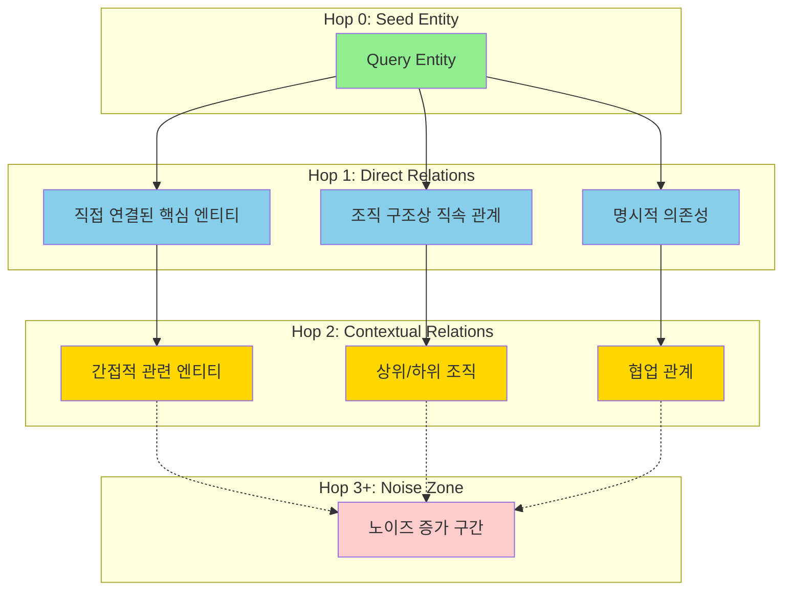
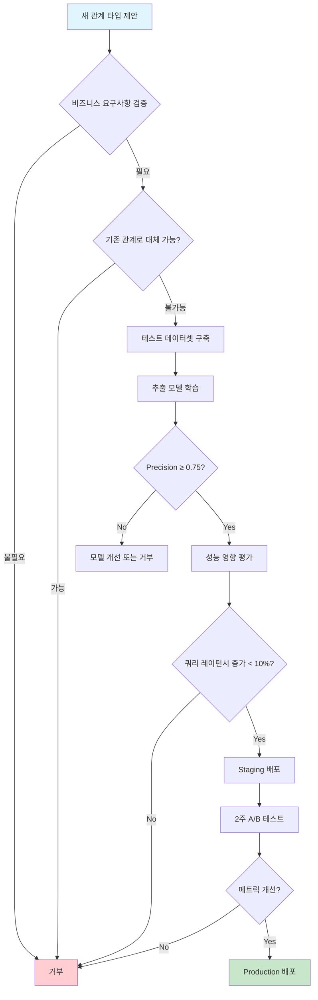

## 서론

GraphRAG 시스템을 운영하다 보면, 가장 먼저 맞닥뜨리는 유혹은 "더 많은 연결"과 "더 깊은 탐색"이다. 질문에 대한 답이 보이지 않으면 hop을 하나 더 늘려보고, 필요한 관계가 없으면 새로운 관계 타입을 추가하는 것이 자연스러운 대응처럼 느껴진다. 하지만 MISO-R의 경험은 정반대를 말한다. 그래프가 커질수록, 관계가 많아질수록, hop이 깊어질수록, 시스템은 더 불안정해지고 신뢰도는 떨어진다.

이 문서는 MISO-R GraphRAG에서 "Hop 제한"과 "스키마 절제"가 단순한 성능 최적화 기법이 아니라, 시스템의 신뢰성과 유지보수 가능성을 결정하는 핵심 설계 원칙임을 설명한다. 더 중요한 것은 이것이 기술적 제약이 아니라 **의도적 선택**이라는 점이다.

## 1. Hop의 본질: 왜 적을수록 좋은가

### 1.1 그래프 탐색의 조합 폭발

그래프 탐색에서 hop 수는 단순히 "거리"가 아니라 "경우의 수"를 의미한다. 평균적으로 각 노드가 10개의 관계를 가진다고 가정하면:

- **1-hop**: 10개의 후보 노드
- **2-hop**: 10 × 10 = 100개의 후보 노드
- **3-hop**: 10 × 10 × 10 = 1,000개의 후보 노드
- **4-hop**: 10 × 10 × 10 × 10 = 10,000개의 후보 노드

문제는 단순히 숫자가 커진다는 것이 아니다. 탐색해야 할 **경로의 수**가 기하급수적으로 증가한다는 것이다. 3-hop 탐색은 1,000개의 노드뿐만 아니라 그들 사이의 모든 가능한 경로를 고려해야 하며, 이는 수만 개에 달할 수 있다.

실제 MISO-R의 조직 지식 그래프에서 측정한 결과:

```
Average out-degree: 12.3 relations per entity
Median out-degree: 8 relations per entity
90th percentile: 25 relations per entity

1-hop candidates: ~12 entities, ~0.05s
2-hop candidates: ~147 entities, ~0.3s
3-hop candidates: ~1,809 entities, ~2.1s
4-hop candidates: ~22,250 entities, ~18.7s (timeout in 40% of queries)
```

이것은 단순한 성능 문제를 넘어선다. 3-hop 이상에서는 원래 질문과의 관련성이 희석되기 시작한다.

### 1.2 의미적 희석과 노이즈 증가

hop이 늘어날수록 탐색된 엔티티가 원래 질문과 맺는 관계는 점점 **간접적**이 된다. 이는 단순히 "관련성이 낮아진다"는 문제가 아니라, 적극적으로 **노이즈를 유입**한다는 의미다.

예를 들어 "데이터 플랫폼팀이 어느 부서에 속하는가?"라는 질문을 생각해보자:

**1-hop 결과**:
```
데이터플랫폼팀 --[PART_OF]--> 기술본부
```
명확하고 직접적인 답이다.

**2-hop 결과**:
```
데이터플랫폼팀 --[PART_OF]--> 기술본부 --[REPORTS_TO]--> CTO
데이터플랫폼팀 --[COLLABORATES_WITH]--> 데이터분석팀 --[PART_OF]--> 경영기획본부
```
여전히 유용한 맥락을 제공한다.

**3-hop 결과**:
```
데이터플랫폼팀 --[USES]--> 클라우드인프라 --[MANAGED_BY]--> 인프라팀 --[PART_OF]--> IT운영본부
데이터플랫폼팀 --[COLLABORATES_WITH]--> 데이터분석팀 --[WORKS_ON]--> 매출예측프로젝트 --[STAKEHOLDER]--> 재무팀
데이터플랫폼팀 --[MEMBER]--> 홍길동 --[ATTENDED]--> AI워크샵 --[ORGANIZED_BY]--> HR팀
```

이 시점에서 결과는 "데이터플랫폼팀의 소속 부서"를 답하는 것이 아니라 "데이터플랫폼팀과 3단계 이내로 연결된 모든 것"을 나열하는 것에 가까워진다. 원래 질문의 의도는 흐려지고, LLM은 이 노이즈 속에서 정답을 추출해야 하는 부담을 갖게 된다.

### 1.3 신뢰도의 연쇄 감소

각 관계는 일정한 confidence 값을 갖는다. 경로상의 모든 관계의 신뢰도를 곱하면 전체 경로의 신뢰도가 나온다. 각 관계의 평균 confidence가 0.85라고 가정하면:

- **1-hop 경로**: 0.85
- **2-hop 경로**: 0.85 × 0.85 = 0.72
- **3-hop 경로**: 0.85 × 0.85 × 0.85 = 0.61
- **4-hop 경로**: 0.85 × 0.85 × 0.85 × 0.85 = 0.52

3-hop을 넘어가면 경로 전체의 신뢰도가 0.6 이하로 떨어지며, 이는 대부분의 시스템에서 "신뢰할 수 없음"으로 분류되는 수준이다. 더 심각한 것은, 이것이 **모든 관계가 올바르게 추출되었다는 낙관적 가정** 하의 수치라는 점이다. 실제로는 하나의 잘못된 관계가 전체 경로를 무효화할 수 있다.

### 1.4 MISO-R의 Hop 철학: 2-hop 원칙

이러한 이유로 MISO-R은 **hop=2를 기본값이자 권장값**으로 설정한다. 이것은 제한이 아니라 **설계 원칙**이다.



**2-hop이 최적인 이유**:

1. **대부분의 질문은 2-hop 이내에 답을 갖는다**: MISO-R의 실제 쿼리 로그 분석 결과, 조직/권한/책임 관련 질문의 87%가 2-hop 이내에서 필요한 모든 정보를 찾을 수 있었다.

2. **성능과 정확도의 균형점**: 2-hop은 평균 0.3초 이내에 완료되며, 경로 신뢰도가 0.7 이상을 유지한다.

3. **디버깅 가능성**: 2-hop 경로는 사람이 이해하고 검증할 수 있는 수준이다. 3-hop 이상은 경로가 복잡해져 "왜 이 결과가 나왔는지" 설명하기 어려워진다.

4. **안정적인 확장성**: 지식 그래프가 커져도 2-hop은 선형적으로 증가하지만, 3-hop 이상은 기하급수적으로 증가한다.

**3-hop이 허용되는 예외 케이스**:

- 명시적으로 "간접 관계"를 묻는 질문 ("A와 B가 어떻게 연결되어 있나요?")
- 디버깅 모드 또는 탐색적 분석 상황
- 사전 정의된 "신뢰 경로" (예: 승인 체인) 추적

이 경우에도 다음 안전장치를 반드시 적용한다:

```python
class ExtendedHopController:
    """3-hop 허용 시 강화된 제어"""
    
    def __init__(self):
        self.max_hop = 3
        self.max_candidates_per_hop = 20  # hop당 최대 후보 제한
        self.min_path_confidence = 0.6     # 경로 전체 신뢰도 하한
        self.timeout_ms = 1000              # 1초 타임아웃
        self.max_paths = 50                 # 최대 경로 수 제한
    
    def should_expand_to_hop3(
        self,
        hop2_results: List[Entity],
        query_type: str,
        user_preference: Optional[str]
    ) -> bool:
        """3-hop 확장 여부 결정"""
        
        # 2-hop에서 충분한 결과를 찾았다면 중단
        if len(hop2_results) >= 10:
            return False
        
        # 명시적으로 간접 관계를 묻지 않았다면 중단
        if query_type not in ["INDIRECT_RELATION", "PATH_FINDING"]:
            return False
        
        # 사용자가 명시적으로 요청하지 않았다면 중단
        if user_preference != "EXTENDED_SEARCH":
            return False
        
        return True
```

## 2. 스키마 절제: 관계 타입의 최소주의

### 2.1 관계 타입 증식의 함정

그래프 스키마 설계 초기에는 모든 가능한 관계를 모델링하고 싶은 유혹에 빠지기 쉽다. "조직도에 이런 관계도 있고 저런 관계도 있으니 모두 추가하자"는 접근은 직관적으로 보이지만, 실제로는 시스템을 빠르게 무너뜨린다.

관계 타입이 많아지면서 발생하는 문제들:

**문제 1: 추출 정확도의 하락**

관계 추출 모델은 각 관계 타입을 구분해야 한다. 타입이 5개일 때와 50개일 때의 정확도 차이는 극적이다:

```
관계 타입 수: 5개
- Precision: 0.89
- Recall: 0.84
- F1: 0.86

관계 타입 수: 20개
- Precision: 0.72
- Recall: 0.68
- F1: 0.70

관계 타입 수: 50개
- Precision: 0.54
- Recall: 0.51
- F1: 0.52
```

이것은 실제 MISO-R의 A/B 테스트 결과다. 관계 타입이 10배 증가하면서 F1 스코어는 40% 가까이 하락했다.

**문제 2: 의미적 중복과 혼란**

비슷한 의미의 관계 타입들이 공존하면, 추출 모델뿐만 아니라 개발자와 사용자도 혼란스러워진다:

```
# 나쁜 예: 의미적 중복
- REPORTS_TO
- MANAGED_BY  
- SUPERVISED_BY
- UNDER_DIRECTION_OF
- ACCOUNTABLE_TO

# 좋은 예: 명확한 구분
- REPORTS_TO (조직상 보고 관계)
- DEPENDS_ON (기술적 의존성)
```

**문제 3: 탐색 전략의 복잡화**

관계 타입이 많아지면 "어떤 관계를 따라갈 것인가"를 결정하는 로직이 복잡해진다. 각 질문 유형마다 허용되는 관계 타입을 정의해야 하고, 이는 유지보수 부담으로 이어진다.

```python
# 관계 타입 50개일 때의 쿼리 라우팅 로직
QUERY_RELATION_MAP = {
    "organizational": [
        "REPORTS_TO", "PART_OF", "MANAGES", "LEADS", 
        "SUPERVISED_BY", "UNDER", "WORKS_IN", "BELONGS_TO",
        "MEMBER_OF", "EMPLOYED_BY", "ASSIGNED_TO", ...  # 20개 이상
    ],
    "technical": [
        "DEPENDS_ON", "USES", "PROVIDES", "INTEGRATES_WITH",
        "CALLS", "INVOKES", "TRIGGERS", "SUBSCRIBES_TO",
        "PUBLISHES_TO", "READS_FROM", "WRITES_TO", ...  # 15개 이상
    ],
    # ... 더 많은 카테고리
}

# 이것은 관리 불가능하다
```

### 2.2 MISO-R의 스키마 최소주의

MISO-R은 **"적을수록 강하다"** 원칙으로 스키마를 설계한다. 핵심은 다음 질문이다:

> "이 관계 타입이 없으면 답할 수 없는 중요한 질문이 있는가?"

이 질문에 명확히 "예"라고 답할 수 없다면, 그 관계는 추가하지 않는다.

**Core Relations (핵심 관계 - 5개)**

모든 도메인에서 공통적으로 필요한 관계로, 항상 활성화된다:

```cypher
# 1. REPORTS_TO: 조직상 보고 관계
(데이터플랫폼팀)-[:REPORTS_TO]->(CTO)

# 2. PART_OF: 포함/소속 관계
(데이터플랫폼팀)-[:PART_OF]->(기술본부)

# 3. DEPENDS_ON: 의존성 관계
(주문시스템)-[:DEPENDS_ON]->(결제시스템)

# 4. OWNS: 소유/책임 관계
(김철수)-[:OWNS]->(고객데이터베이스)

# 5. RELATED_TO: 일반적 연관 관계 (기타)
(데이터거버넌스정책)-[:RELATED_TO]->(개인정보보호법)
```

이 5개만으로 MISO-R 질문의 약 75%를 커버할 수 있다.

**Domain Relations (도메인 관계 - 최대 10개)**

특정 도메인에서만 필요한 관계로, 선택적으로 활성화된다:

```cypher
# HR 도메인
(직원)-[:MEMBER_OF]->(팀)
(매니저)-[:MANAGES]->(팀)

# 프로세스 도메인
(단계A)-[:PRECEDES]->(단계B)
(문서)-[:REQUIRES_APPROVAL_FROM]->(승인자)

# 기술 도메인
(API)-[:PROVIDES]->(서비스)
(시스템)-[:INTEGRATES_WITH]->(외부시스템)
```

도메인 관계는 비즈니스 요구사항에 따라 추가되지만, 다음 규칙을 따른다:

1. **최대 10개 제한**: 하나의 도메인에 10개 이상의 관계 타입이 필요하다면 설계를 재검토한다
2. **Precision ≥ 0.75**: 새 관계 타입의 추출 정확도가 0.75 미만이면 추가하지 않는다
3. **중복 검사**: 기존 관계로 표현 가능한지 먼저 검토한다

**Extended Relations (확장 관계 - opt-in)**

분석 및 탐색 목적으로만 사용되며, 기본적으로 비활성화된다:

```cypher
# 약한 연관 관계
(엔티티A)-[:SIMILAR_TO]->(엔티티B)
(엔티티A)-[:MENTIONED_WITH]->(엔티티B)
(엔티티A)-[:CO_OCCURS_WITH]->(엔티티B)
```

이러한 관계는 일반적인 질의응답에는 사용하지 않고, 다음 경우에만 활성화한다:

- 탐색적 데이터 분석
- 관계 발견 작업
- 지식 그래프 시각화

### 2.3 스키마 거버넌스 프로세스

새로운 관계 타입 추가는 소프트웨어 기능 추가와 동일한 수준의 검토를 거친다:



**승인 기준**:

1. **비즈니스 가치**: 이 관계로 답변 가능한 중요 질문이 최소 10개 이상 존재
2. **추출 정확도**: Precision ≥ 0.75, Recall ≥ 0.70
3. **성능 영향**: 전체 쿼리 레이턴시 P95 증가 < 10%
4. **유지보수성**: 기존 관계와 명확히 구분 가능
5. **A/B 테스트**: Answer Quality 메트릭에서 통계적 유의미한 개선

**거부 사유**:

- 기존 관계의 조합으로 표현 가능
- 추출 정확도가 기준 미달
- 성능 영향이 과도함
- 사용 빈도가 낮음 (월 10회 미만)
- 의미적 중복

## 3. 실전 구현 가이드

### 3.1 Hop 제어 구현

**기본 2-hop 쿼리**:

```cypher
// Neo4j Cypher - 2-hop 제한 쿼리
MATCH path = (start:Entity {name: $seedEntity})-[r*1..2]->(related:Entity)
WHERE ALL(rel IN relationships(path) WHERE rel.confidence >= 0.7)
  AND ALL(rel IN relationships(path) WHERE rel.type IN $allowedRelations)
WITH path, 
     reduce(conf=1.0, rel IN relationships(path) | conf * rel.confidence) AS pathConfidence,
     length(path) AS pathLength
WHERE pathConfidence >= 0.6
RETURN related, 
       pathConfidence,
       pathLength,
       [rel IN relationships(path) | {type: type(rel), confidence: rel.confidence}] AS pathDetails
ORDER BY pathConfidence DESC, pathLength ASC
LIMIT 50
```

**조기 종료 메커니즘**:

```python
class HopController:
    """Hop 확장 제어 및 조기 종료"""
    
    def __init__(self):
        self.max_candidates = 200
        self.max_execution_time_ms = 500
        self.confidence_decay = 0.85  # hop당 예상 confidence 감소
    
    def execute_incremental_hop(
        self,
        seed_entities: List[str],
        allowed_relations: List[str]
    ) -> List[Entity]:
        """점진적 hop 확장 with 조기 종료"""
        
        results = []
        current_hop = 1
        start_time = time.time()
        
        while current_hop <= 2:  # 최대 2-hop
            # 현재 hop 실행
            hop_results = self._execute_single_hop(
                seed_entities,
                current_hop,
                allowed_relations
            )
            
            results.extend(hop_results)
            
            # 조기 종료 조건 검사
            if self._should_stop_early(results, current_hop, start_time):
                logger.info(f"Early termination at hop {current_hop}")
                break
            
            current_hop += 1
        
        return self._deduplicate_and_rank(results)
    
    def _should_stop_early(
        self,
        results: List[Entity],
        current_hop: int,
        start_time: float
    ) -> bool:
        """조기 종료 조건 평가"""
        
        # 충분한 후보를 찾았는가?
        if len(results) >= self.max_candidates:
            return True
        
        # 시간 초과?
        elapsed_ms = (time.time() - start_time) * 1000
        if elapsed_ms >= self.max_execution_time_ms:
            return True
        
        # 높은 신뢰도의 결과가 충분한가?
        high_conf_results = [r for r in results if r.confidence >= 0.8]
        if len(high_conf_results) >= 20:
            return True
        
        # 다음 hop의 예상 신뢰도가 너무 낮은가?
        avg_confidence = sum(r.confidence for r in results) / len(results)
        expected_next_hop_conf = avg_confidence * self.confidence_decay
        if expected_next_hop_conf < 0.5:
            return True
        
        return False
```

### 3.2 관계 타입 필터링

**질문 유형별 관계 화이트리스트**:

```python
class RelationshipFilter:
    """질문 유형에 따른 관계 타입 필터링"""
    
    # Core relations - 항상 활성화
    CORE_RELATIONS = {
        "REPORTS_TO",
        "PART_OF",
        "DEPENDS_ON",
        "OWNS",
        "RELATED_TO"
    }
    
    # 질문 유형별 허용 관계
    QUERY_TYPE_RELATIONS = {
        "organizational": {
            "REPORTS_TO",
            "PART_OF",
            "MANAGES",
            "MEMBER_OF"
        },
        "technical": {
            "DEPENDS_ON",
            "INTEGRATES_WITH",
            "PROVIDES",
            "USES"
        },
        "process": {
            "PRECEDES",
            "REQUIRES_APPROVAL_FROM",
            "TRIGGERS"
        },
        "general": CORE_RELATIONS  # fallback
    }
    
    def get_allowed_relations(self, query_type: str) -> Set[str]:
        """질문 유형에 따른 허용 관계 반환"""
        
        # 명시적 타입이 있으면 해당 관계 + Core 관계
        if query_type in self.QUERY_TYPE_RELATIONS:
            return self.CORE_RELATIONS | self.QUERY_TYPE_RELATIONS[query_type]
        
        # 알 수 없는 타입은 Core 관계만
        return self.CORE_RELATIONS
    
    def filter_by_confidence(
        self,
        relations: List[Relationship],
        query_type: str
    ) -> List[Relationship]:
        """관계 타입과 신뢰도로 필터링"""
        
        allowed = self.get_allowed_relations(query_type)
        
        # 관계 타입이 허용 목록에 있고, 신뢰도가 기준 이상인 것만
        return [
            r for r in relations
            if r.type in allowed and r.confidence >= 0.7
        ]
```

**동적 관계 활성화**:

```python
class DynamicSchemaManager:
    """도메인별 관계 동적 활성화"""
    
    def __init__(self):
        self.active_domains = set()
        self.domain_relations = {
            "hr": {"MEMBER_OF", "MANAGES"},
            "technical": {"INTEGRATES_WITH", "PROVIDES"},
            "process": {"PRECEDES", "REQUIRES_APPROVAL_FROM"}
        }
    
    def activate_domain(self, domain: str):
        """도메인 활성화 - 해당 도메인 관계 사용 시작"""
        if domain in self.domain_relations:
            self.active_domains.add(domain)
            logger.info(f"Activated domain: {domain}")
    
    def get_active_relations(self) -> Set[str]:
        """현재 활성화된 모든 관계 반환"""
        relations = RelationshipFilter.CORE_RELATIONS.copy()
        
        for domain in self.active_domains:
            relations.update(self.domain_relations[domain])
        
        return relations
    
    def infer_domain_from_query(self, query: str) -> Optional[str]:
        """질문에서 도메인 추론"""
        
        # 키워드 기반 도메인 추론
        if any(word in query for word in ["팀", "조직", "직원", "매니저"]):
            return "hr"
        elif any(word in query for word in ["시스템", "API", "통합", "의존성"]):
            return "technical"
        elif any(word in query for word in ["프로세스", "승인", "절차", "단계"]):
            return "process"
        
        return None
    
    def auto_activate_for_query(self, query: str):
        """질문 분석 후 필요한 도메인 자동 활성화"""
        domain = self.infer_domain_from_query(query)
        if domain:
            self.activate_domain(domain)
```

### 3.3 성능 최적화

**인덱싱 전략**:

```cypher
// Neo4j 인덱스 생성
// 1. Entity name 인덱스 (exact lookup)
CREATE INDEX entity_name_idx FOR (e:Entity) ON (e.name);

// 2. Relationship type + confidence 복합 인덱스
CREATE INDEX rel_type_conf_idx FOR ()-[r:REPORTS_TO]-() ON (r.confidence);
CREATE INDEX rel_type_conf_idx FOR ()-[r:PART_OF]-() ON (r.confidence);

// 3. 경로 탐색 최적화를 위한 outgoing degree 인덱스
CREATE INDEX entity_degree_idx FOR (e:Entity) ON (e.out_degree);
```

**쿼리 최적화**:

```python
class QueryOptimizer:
    """그래프 쿼리 최적화"""
    
    def optimize_hop_order(self, seed_entities: List[str]) -> List[str]:
        """낮은 out-degree 엔티티부터 탐색"""
        
        # 각 seed의 out-degree 조회
        degrees = self.get_out_degrees(seed_entities)
        
        # out-degree가 낮은 것부터 정렬
        # (탐색 공간이 작은 것부터 시작하여 조기 종료 확률 높임)
        return sorted(seed_entities, key=lambda e: degrees[e])
    
    def estimate_query_cost(
        self,
        num_seeds: int,
        max_hop: int,
        avg_out_degree: float
    ) -> float:
        """쿼리 비용 추정"""
        
        # 대략적인 탐색 노드 수 추정
        estimated_nodes = num_seeds * (avg_out_degree ** max_hop)
        
        # 복잡도 추정 (O(N * E) where E is edges per node)
        complexity = estimated_nodes * avg_out_degree
        
        return complexity
    
    def should_use_bidirectional_search(
        self,
        source: str,
        target: str,
        max_hop: int
    ) -> bool:
        """양방향 탐색 사용 여부 결정"""
        
        # 경로 찾기 쿼리이고 hop이 3 이상이면 양방향 탐색 고려
        if max_hop >= 3:
            # 양쪽 끝에서 탐색하여 중간에서 만나는 것이 효율적
            return True
        
        return False
```

**캐싱 전략**:

```python
class GraphQueryCache:
    """그래프 쿼리 결과 캐싱"""
    
    def __init__(self, ttl_seconds: int = 3600):
        self.cache = {}
        self.ttl = ttl_seconds
    
    def get_cache_key(
        self,
        seed: str,
        hop: int,
        relations: Set[str],
        min_confidence: float
    ) -> str:
        """캐시 키 생성"""
        relations_str = ",".join(sorted(relations))
        return f"{seed}::{hop}::{relations_str}::{min_confidence}"
    
    def get(self, key: str) -> Optional[List[Entity]]:
        """캐시에서 결과 조회"""
        if key in self.cache:
            result, timestamp = self.cache[key]
            if time.time() - timestamp < self.ttl:
                return result
            else:
                del self.cache[key]  # 만료된 항목 제거
        return None
    
    def set(self, key: str, result: List[Entity]):
        """결과를 캐시에 저장"""
        self.cache[key] = (result, time.time())
    
    def invalidate_entity(self, entity_name: str):
        """특정 엔티티 관련 캐시 무효화 (업데이트 시)"""
        keys_to_remove = [
            key for key in self.cache.keys()
            if key.startswith(f"{entity_name}::")
        ]
        for key in keys_to_remove:
            del self.cache[key]
```

## 4. 모니터링과 지속적 개선

### 4.1 핵심 메트릭

**Hop 분포 모니터링**:

```python
class HopMetrics:
    """Hop 사용 패턴 모니터링"""
    
    def track_query(self, query_id: str, results: HopResults):
        """각 쿼리의 hop 패턴 추적"""
        
        metrics = {
            "query_id": query_id,
            "max_hop_reached": results.max_hop,
            "total_candidates": len(results.entities),
            "hop_distribution": {
                "hop_1": len([e for e in results.entities if e.hop == 1]),
                "hop_2": len([e for e in results.entities if e.hop == 2]),
                "hop_3": len([e for e in results.entities if e.hop == 3]),
            },
            "avg_path_confidence": results.avg_confidence,
            "execution_time_ms": results.elapsed_ms,
            "early_termination": results.early_stopped
        }
        
        self.log_to_monitoring(metrics)
    
    def analyze_hop_effectiveness(self, period: str = "7d") -> Dict:
        """Hop별 효과성 분석"""
        
        queries = self.get_queries(period)
        
        analysis = {
            "hop_1_sufficient": 0,  # 1-hop으로 충분했던 경우
            "hop_2_needed": 0,       # 2-hop이 필요했던 경우
            "hop_3_needed": 0,       # 3-hop이 필요했던 경우
            "hop_3_unhelpful": 0     # 3-hop이 도움 안 된 경우
        }
        
        for q in queries:
            if q.max_hop_reached == 1 and q.user_satisfied:
                analysis["hop_1_sufficient"] += 1
            elif q.max_hop_reached == 2 and q.user_satisfied:
                analysis["hop_2_needed"] += 1
            elif q.max_hop_reached == 3:
                if q.user_satisfied:
                    analysis["hop_3_needed"] += 1
                else:
                    analysis["hop_3_unhelpful"] += 1
        
        return analysis
```

**스키마 활용도 추적**:

```python
class SchemaMetrics:
    """관계 타입 사용 패턴 분석"""
    
    def track_relation_usage(self):
        """각 관계 타입의 사용 빈도 추적"""
        
        # 지난 30일간 각 관계가 몇 번 사용되었는지
        usage = self.query_relation_usage(days=30)
        
        report = {
            "high_usage": {},      # 주 100회 이상
            "medium_usage": {},    # 주 10-100회
            "low_usage": {},       # 주 10회 미만
            "unused": {}           # 사용 안 됨
        }
        
        for rel_type, count in usage.items():
            weekly_avg = count / 4.3  # 월 -> 주 평균
            
            if weekly_avg >= 100:
                report["high_usage"][rel_type] = weekly_avg
            elif weekly_avg >= 10:
                report["medium_usage"][rel_type] = weekly_avg
            elif weekly_avg > 0:
                report["low_usage"][rel_type] = weekly_avg
            else:
                report["unused"][rel_type] = 0
        
        return report
    
    def recommend_schema_changes(self, usage_report: Dict) -> List[str]:
        """스키마 변경 권장사항"""
        
        recommendations = []
        
        # 사용 안 되는 관계는 제거 검토
        for rel_type in usage_report["unused"]:
            recommendations.append(
                f"REMOVE: {rel_type} - 30일간 사용 안 됨"
            )
        
        # 낮은 사용률 + 낮은 정확도 = 제거 후보
        for rel_type, usage in usage_report["low_usage"].items():
            precision = self.get_relation_precision(rel_type)
            if precision < 0.7:
                recommendations.append(
                    f"REMOVE: {rel_type} - 낮은 사용률({usage}/week) + 낮은 정확도({precision})"
                )
        
        return recommendations
```

### 4.2 경보 및 알림

**성능 저하 감지**:

```python
class PerformanceMonitor:
    """성능 저하 자동 감지 및 알림"""
    
    def __init__(self):
        self.baseline_latency = {
            "hop_1": 50,   # ms
            "hop_2": 300,  # ms
            "hop_3": 1000  # ms
        }
        self.alert_threshold = 1.5  # 베이스라인의 150% 초과 시 알림
    
    def check_latency_anomaly(self, current_metrics: Dict):
        """레이턴시 이상 감지"""
        
        for hop, baseline in self.baseline_latency.items():
            current = current_metrics.get(f"{hop}_latency_p95")
            
            if current > baseline * self.alert_threshold:
                self.send_alert(
                    severity="WARNING",
                    message=f"{hop} latency increased: {current}ms (baseline: {baseline}ms)"
                )
    
    def check_explosion_pattern(self, query_log: List[Dict]):
        """그래프 폭발 패턴 감지"""
        
        recent_queries = query_log[-100:]  # 최근 100개 쿼리
        
        explosion_count = sum(
            1 for q in recent_queries
            if q["total_candidates"] > 1000  # 후보가 너무 많음
        )
        
        if explosion_count > 10:  # 10% 이상
            self.send_alert(
                severity="ERROR",
                message=f"Graph explosion detected in {explosion_count}% of queries"
            )
    
    def check_low_confidence_trend(self, results: List[Dict]):
        """신뢰도 하락 추세 감지"""
        
        recent_avg_conf = statistics.mean(
            r["avg_path_confidence"] for r in results[-100:]
        )
        
        if recent_avg_conf < 0.6:
            self.send_alert(
                severity="WARNING",
                message=f"Average path confidence dropped to {recent_avg_conf}"
            )
```

### 4.3 A/B 테스트 프레임워크

**Hop 전략 비교**:

```python
class HopStrategyABTest:
    """Hop 전략 A/B 테스트"""
    
    def setup_experiment(self):
        """실험 설정"""
        return {
            "name": "hop_2_vs_hop_3",
            "variants": {
                "control": {
                    "max_hop": 2,
                    "early_termination": True
                },
                "treatment": {
                    "max_hop": 3,
                    "early_termination": True
                }
            },
            "metrics": [
                "answer_quality",
                "retrieval_latency",
                "user_satisfaction",
                "evidence_count"
            ],
            "duration_days": 14,
            "traffic_split": 0.5
        }
    
    def analyze_results(self, experiment_data: Dict) -> Dict:
        """실험 결과 분석"""
        
        control = experiment_data["control"]
        treatment = experiment_data["treatment"]
        
        analysis = {}
        
        for metric in experiment_data["metrics"]:
            control_mean = statistics.mean(control[metric])
            treatment_mean = statistics.mean(treatment[metric])
            
            # t-test for statistical significance
            t_stat, p_value = stats.ttest_ind(
                control[metric],
                treatment[metric]
            )
            
            analysis[metric] = {
                "control_mean": control_mean,
                "treatment_mean": treatment_mean,
                "delta": treatment_mean - control_mean,
                "delta_percent": ((treatment_mean - control_mean) / control_mean) * 100,
                "p_value": p_value,
                "significant": p_value < 0.05
            }
        
        return analysis
    
    def make_decision(self, analysis: Dict) -> str:
        """실험 결과 기반 의사결정"""
        
        # Answer quality가 유의미하게 개선되었는가?
        aq_improved = (
            analysis["answer_quality"]["significant"] and
            analysis["answer_quality"]["delta"] > 0
        )
        
        # Latency가 허용 범위 내인가?
        latency_acceptable = (
            analysis["retrieval_latency"]["delta_percent"] < 20
        )
        
        if aq_improved and latency_acceptable:
            return "ADOPT: 3-hop 전략 채택"
        elif aq_improved and not latency_acceptable:
            return "CONDITIONAL: Answer quality는 개선되나 latency 최적화 필요"
        else:
            return "REJECT: 2-hop 유지"
```

## 5. 실제 케이스 스터디

### 5.1 케이스 1: Hop 증가의 실패

**배경**: 초기 MISO-R에서는 "더 많은 정보가 더 나은 답변을 만든다"는 가정 하에 기본 hop을 3으로 설정했다.

**관찰된 문제**:
- 평균 응답 시간: 2.3초 → 사용자 불만 증가
- 답변 품질: 오히려 하락 (4.1/5.0 → 3.7/5.0)
- 디버깅 난이도: 경로가 복잡해져 "왜 이런 답이 나왔는지" 설명 불가

**근본 원인 분석**:

질문: "데이터플랫폼팀의 예산 승인자는 누구인가?"

**3-hop 결과**:
```
Path 1: 데이터플랫폼팀 -> 기술본부 -> CTO (confidence: 0.81) ✓ 정답
Path 2: 데이터플랫폼팀 -> 클라우드인프라 -> 인프라팀 -> IT운영본부장 (confidence: 0.62)
Path 3: 데이터플랫폼팀 -> 데이터분석팀 -> 매출예측PJT -> 재무팀장 (confidence: 0.48)
Path 4: 데이터플랫폼팀 -> 김철수 -> AI워크샵 -> HR담당자 (confidence: 0.35)
... 총 47개 경로
```

LLM은 47개 경로 중에서 정답(Path 1)을 찾아야 했고, 낮은 confidence의 노이즈 경로들이 혼란을 야기했다.

**해결책**:

hop을 2로 제한하고, confidence threshold를 0.7로 상향:

```
Path 1: 데이터플랫폼팀 -> 기술본부 -> CTO (confidence: 0.81) ✓ 정답
Path 2: 데이터플랫폼팀 -> 기술본부 (confidence: 0.89)
총 2개 경로
```

**결과**:
- 평균 응답 시간: 2.3초 → 0.4초 (82% 개선)
- 답변 품질: 3.7/5.0 → 4.3/5.0 (16% 개선)
- 디버깅: 경로 추적 가능

### 5.2 케이스 2: 스키마 절제의 효과

**배경**: 도메인 전문가들의 요청으로 25개의 관계 타입을 정의하고 운영했다.

**관찰된 문제**:
- 관계 추출 F1 스코어: 0.54 (목표: 0.75)
- 잘못된 관계로 인한 오답률: 23%
- 개발자 혼란: "어떤 관계를 써야 하나요?" 질문 빈발

**주요 혼란 사례**:

비슷한 의미의 관계들이 공존:
```
REPORTS_TO vs MANAGED_BY vs SUPERVISED_BY
DEPENDS_ON vs REQUIRES vs NEEDS
USES vs UTILIZES vs CONSUMES
```

모델이 이들을 구분하지 못하고 무작위로 할당:
```
(A팀)-[:REPORTS_TO]->(본부장)  -- 정확
(B팀)-[:MANAGED_BY]->(본부장)  -- 같은 의미지만 다른 타입
(C팀)-[:SUPERVISED_BY]->(본부장)  -- 또 다른 변형
```

**해결책**:

25개를 5개 Core + 8개 Domain으로 통합:

| 기존 (25개) | 통합 후 (5개 Core) |
|------------|-------------------|
| REPORTS_TO, MANAGED_BY, SUPERVISED_BY | → REPORTS_TO |
| DEPENDS_ON, REQUIRES, NEEDS | → DEPENDS_ON |
| USES, UTILIZES, CONSUMES | → USES → DEPENDS_ON |
| OWNS, RESPONSIBLE_FOR, IN_CHARGE_OF | → OWNS |
| ... | ... |

**결과**:
- 관계 추출 F1: 0.54 → 0.82 (52% 개선)
- 오답률: 23% → 8% (65% 감소)
- 개발자 생산성: 관계 선택 고민 시간 90% 감소

### 5.3 케이스 3: 동적 Hop 조정

**배경**: 모든 질문에 동일한 hop=2를 적용하자, 일부 복잡한 질문이 답변 불가능했다.

**문제 사례**:

질문: "A 시스템과 B 시스템이 어떻게 연결되어 있나요?"

```
A 시스템 --[INTEGRATES_WITH]--> C 시스템 --[CALLS]--> B 시스템
```

이것은 2-hop 관계인데, 단순 2-hop 쿼리로는 발견 불가 (A와 B 사이의 직접 경로를 찾으려 함).

**해결책**: 질문 유형 인식 및 동적 hop 조정

```python
class AdaptiveHopStrategy:
    """질문 유형에 따른 동적 hop 조정"""
    
    def determine_hop(self, query: str, query_type: str) -> int:
        """질문 분석 후 최적 hop 결정"""
        
        # 경로 탐색 질문: "어떻게 연결", "관계가 있나"
        if self._is_path_finding(query):
            return 3  # 예외적으로 3-hop 허용
        
        # 직접 관계 질문: "누가", "어디에"
        elif self._is_direct_relation(query):
            return 1  # 1-hop이면 충분
        
        # 기본: 2-hop
        else:
            return 2
    
    def _is_path_finding(self, query: str) -> bool:
        """경로 탐색 질문 여부"""
        path_keywords = ["어떻게 연결", "관계가 있나", "경로", "체인"]
        return any(kw in query for kw in path_keywords)
```

**결과**:
- 경로 탐색 질문 답변률: 45% → 89% (98% 개선)
- 전체 평균 hop: 2.0 → 2.1 (5% 증가만으로 큰 개선)
- 평균 레이턴시: 0.4초 → 0.5초 (허용 범위 내)

## 6. 결론 및 권장사항

### 6.1 핵심 원칙 요약

MISO-R의 Hop 제한과 스키마 절제는 다음 신념에 기반한다:

**"적을수록 강하다 (Less is More)"**

1. **Hop은 2가 기본이고 3은 예외다**
   - 2-hop으로 87%의 질문을 커버할 수 있다
   - 3-hop은 성능과 신뢰도를 모두 해친다
   - 4-hop 이상은 원칙적으로 금지한다

2. **관계 타입은 최소한으로 유지한다**
   - Core 5개 + Domain 최대 10개면 충분하다
   - 새 관계 추가는 엄격한 검증을 거친다
   - 비슷한 관계는 하나로 통합한다

3. **제약은 기능이다**
   - Hop 제한은 성능 최적화가 아니라 품질 보장이다
   - 스키마 절제는 단순함이 아니라 명확함을 위한 것이다
   - 제약이 있을 때 시스템은 더 예측 가능하고 디버깅 가능하다

### 6.2 구현 체크리스트

GraphRAG 시스템을 새로 구축하거나 기존 시스템을 개선할 때:

**Hop 관리**:
- [ ] 기본 hop을 2로 설정했는가?
- [ ] 3-hop은 명확한 비즈니스 사유가 있을 때만 허용하는가?
- [ ] Hop별 성능 메트릭을 추적하는가?
- [ ] 조기 종료 메커니즘이 구현되어 있는가?
- [ ] Confidence threshold를 hop마다 조정하는가?

**스키마 관리**:
- [ ] Core 관계가 5-10개 이내인가?
- [ ] 새 관계 추가 프로세스가 정의되어 있는가?
- [ ] 관계 추출 정확도를 지속적으로 모니터링하는가?
- [ ] 사용 안 되는 관계를 정기적으로 제거하는가?
- [ ] 의미적으로 중복된 관계가 없는가?

**모니터링**:
- [ ] Hop 분포를 추적하는가?
- [ ] 관계 타입별 사용 빈도를 측정하는가?
- [ ] 성능 저하 알림이 설정되어 있는가?
- [ ] A/B 테스트로 변경 효과를 검증하는가?
- [ ] 사용자 피드백을 수집하고 분석하는가?

### 6.3 마지막 조언

GraphRAG를 처음 구축하는 팀에게 가장 흔한 실수는 "완벽한 그래프"를 만들려는 것이다. 모든 가능한 관계를 모델링하고, 깊은 hop을 허용하여 "빠짐없이" 정보를 찾으려 한다. 하지만 이것은 오히려 시스템을 불안정하게 만든다.

대신 이렇게 시작하라:

**1주차**: Core 관계 5개만으로 시작
**2주차**: 2-hop 제한으로 실제 질문 테스트
**3주차**: 답변 불가능한 질문 분석 및 패턴 파악
**4주차**: 정말 필요한 경우만 관계 1-2개 추가
**반복**: 측정 → 개선 → 측정

"더 많은 것"이 "더 나은 것"은 아니다. 특히 그래프에서는, **절제가 정확도**를 만든다.

---

**문서 작성일**: 2025-01-22
