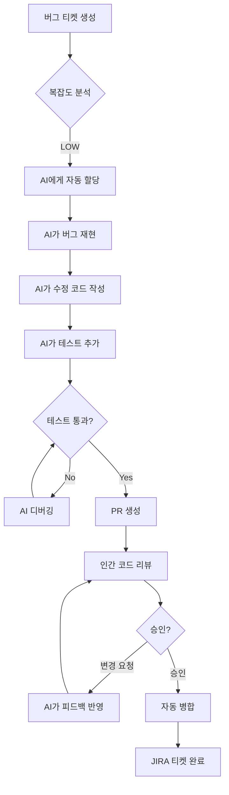

## 인간 개발자와 Claude Code AI 에이전트의 효과적인 협업 전략

---

## 들어가며: 새로운 팀 구성의 시대

2026년 현재, 소프트웨어 개발 조직은 역사상 가장 극적인 변화를 경험하고 있습니다. Claude Code, Cursor, GitHub Copilot 같은 AI 코딩 도구들이 단순한 자동완성 수준을 넘어, 이제는 완전한 기능을 독립적으로 구현할 수 있는 자율 에이전트로 진화했습니다. Anthropic의 통계에 따르면, Claude Code 자체 코드의 90%가 Claude Code에 의해 작성될 정도로 AI 에이전트의 능력은 실용적 수준에 도달했습니다.

그러나 이러한 기술적 진보가 자동으로 생산성 향상으로 이어지는 것은 아닙니다. 많은 조직들이 AI 도구를 도입했음에도 불구하고, 오히려 프로젝트 관리의 복잡성이 증가하고 출시 일정이 지연되는 역설적 상황에 직면하고 있습니다. 그 핵심 원인은 기존 프로젝트 관리 방식이 "인간만으로 구성된 팀"을 전제로 설계되었기 때문입니다.

이 문서는 **인간 개발자와 Claude Code AI 에이전트가 함께 일하는 하이브리드 팀**에서 JIRA를 어떻게 효과적으로 활용할 수 있는지에 대한 실용적 가이드입니다. 이상적으로는 완전히 새로운 관리 도구가 필요할 수 있지만, 현실에서 수많은 조직이 이미 JIRA에 상당한 투자를 했고, 기존 워크플로우와 통합되어 있습니다. 따라서 우리는 JIRA의 한계를 인정하면서도, AI 시대에 맞게 재구성하는 현실적 접근이 필요합니다.

---

## 1장: 하이브리드 팀의 본질적 특성 이해하기

### 1.1 하이브리드 팀이란 무엇인가

하이브리드 개발팀은 인간 개발자와 AI 에이전트가 동등한 기여자로서 협업하는 새로운 형태의 조직입니다. 이것은 단순히 개발자가 AI 도구를 "사용"하는 것과 본질적으로 다릅니다.

**전통적 AI 도구 사용 vs 하이브리드 팀:**

전통적 방식에서는 개발자가 GitHub Copilot이나 ChatGPT를 활용하여 코드를 작성하지만, 모든 작업은 여전히 개발자의 이름으로 수행됩니다. 반면 하이브리드 팀에서는 AI 에이전트가 JIRA 티켓을 직접 할당받고, 독립적으로 코드를 작성하며, Pull Request를 생성하고, 심지어 리뷰 코멘트에 자율적으로 응답합니다.

**실제 사례: deepsense.ai의 AI Teammate**

폴란드 AI 기업 deepsense.ai는 Claude를 기반으로 한 "AI Teammate"를 개발하여, JIRA 티켓부터 PR까지 전체 개발 프로세스를 자동화했습니다. 이들의 워크플로우는 다음과 같습니다:

1. PM이나 비개발자가 JIRA에서 티켓을 생성하거나 코멘트를 추가
2. AI Teammate가 자동으로 할당받아 티켓 내용 분석
3. 코드 저장소를 검토하고 필요한 변경사항 파악
4. 새로운 Git 브랜치에 코드 구현
5. 테스트 자동 생성 및 실행
6. 테스트 실패 시 자동으로 디버깅 및 수정 반복
7. 모든 테스트 통과 후 PR 생성 및 JIRA 티켓 업데이트
8. 리뷰어의 코멘트에 자율적으로 응답하고 코드 수정

이 전체 프로세스가 인간의 코드 작성 없이 이루어지며, 개발자들은 리뷰와 전략적 의사결정에 집중할 수 있게 됩니다. 놀라운 점은 이 시스템 자체가 AI Teammate를 사용하여 2주 만에 구축되었다는 것입니다.

### 1.2 하이브리드 팀의 핵심 도전 과제

**도전 1: 누가 무엇을 담당하는가? (책임 분담의 모호성)**

기존 JIRA 워크플로우는 모든 작업이 특정 인간 개발자에게 할당됨을 전제합니다. 그러나 하이브리드 팀에서는 다음과 같은 질문들이 생깁니다:

- AI 에이전트에게 티켓을 직접 할당할 수 있는가?
- AI가 작성한 코드의 책임은 누구에게 있는가?
- AI가 생성한 PR은 누가 리뷰하는가?
- AI의 작업이 실패했을 때 누가 개입하는가?

**도전 2: 서로 다른 작업 속도와 패턴**

인간 개발자는 하루 8시간 일하며, 몰입 상태에 들어가기까지 시간이 필요하고, 회의와 다른 업무로 인해 중단됩니다. 반면 Claude Code 같은 AI 에이전트는 24시간 작동 가능하며, 여러 작업을 병렬로 처리하고, 즉각적으로 컨텍스트를 전환할 수 있습니다.

이러한 비대칭성은 프로젝트 계획과 일정 산정을 복잡하게 만듭니다. "이 기능은 3일 걸립니다"라는 추정이 인간 개발자 기준인지, AI 에이전트 기준인지, 아니면 둘의 협업 기준인지 명확하지 않습니다.

**도전 3: 추적과 가시성의 문제**

AI 에이전트는 사람처럼 JIRA에 로그인하여 티켓을 업데이트하지 않습니다. 대신 Git commit, API 호출, 로그 파일 등 구조화된 데이터를 남깁니다. 기존 JIRA 워크플로우는 "인간의 수동 입력"을 전제로 설계되었기 때문에, AI의 작업을 자동으로 추적하고 가시화하는 메커니즘이 필요합니다.

**도전 4: 품질 보증과 검증**

Google의 엔지니어 Addy Osmani는 자신의 2026년 AI 코딩 워크플로우에서 중요한 원칙을 강조합니다: "AI가 생성한 모든 코드를 주니어 개발자가 작성한 것처럼 취급하라. 읽고, 실행하고, 테스트해야 한다."

이것은 AI 에이전트가 아무리 발전해도, 인간의 검증이 여전히 필수적임을 의미합니다. 그러나 기존 JIRA 워크플로우는 "개발자가 작성한 코드는 신뢰할 수 있다"는 암묵적 가정을 가지고 있어, AI 생성 코드에 대한 체계적인 검증 프로세스가 부족합니다.

### 1.3 하이브리드 팀의 핵심 원칙

성공적인 하이브리드 팀 운영을 위해서는 다음 원칙들을 명확히 해야 합니다:

**원칙 1: 명확한 역할 분담**

- **인간의 영역**: 아키텍처 설계, 요구사항 분석, 전략적 의사결정, 최종 코드 검증, 보안 리뷰, 사용자 경험 설계
- **AI의 영역**: 반복적 코드 작성, 테스트 생성, 문서화, 리팩토링, 버그 수정, 초기 프로토타입 작성
- **협업 영역**: 코드 리뷰, 디버깅, 성능 최적화, API 설계

**원칙 2: AI는 자율적이되 투명하게**

AI 에이전트는 독립적으로 작업하지만, 모든 의사결정과 변경사항은 투명하게 기록되고 추적 가능해야 합니다. "블랙박스" 방식의 AI 작업은 신뢰 문제를 야기합니다.

**원칙 3: Human-in-the-Loop는 필수**

완전 자율 AI 개발은 아직 신뢰할 수 없습니다. 중요한 결정 지점마다 인간의 승인과 검증이 필요합니다. 이것은 AI의 한계가 아니라, 품질과 안전을 위한 설계 원칙입니다.

**원칙 4: 점진적 자율성 확대**

처음부터 AI에게 복잡한 기능 전체를 맡기는 것은 위험합니다. 작고 명확한 작업부터 시작하여, 팀이 AI의 성능과 한계를 파악한 후 점진적으로 책임 범위를 확대해야 합니다.

---

## 2장: JIRA와 Claude Code 통합의 기술적 구현

### 2.1 Model Context Protocol (MCP): 통합의 핵심 기술

2026년 현재, Claude Code와 JIRA의 통합은 Model Context Protocol (MCP)을 통해 이루어집니다. Anthropic이 정의한 MCP는 "AI 애플리케이션을 위한 USB-C 포트"로 비유됩니다. USB-C가 모든 주변기기를 표준화된 방식으로 연결하듯, MCP는 AI 모델이 다양한 데이터 소스와 도구에 표준화된 방식으로 접근할 수 있게 합니다.

**MCP의 작동 방식:**

1. **클라이언트 (Client)**: Claude Code CLI 또는 IDE 플러그인
2. **서버 (Server)**: Jira MCP Server - JIRA API를 MCP 프로토콜로 노출
3. **프로토콜**: JSON 기반의 표준화된 메시지 교환

사용자가 Claude Code에 "JIRA 보드 67의 모든 작업 목록을 보여줘"라고 요청하면:
1. 요청이 JSON 객체로 변환
2. Jira MCP Server로 전송
3. 서버가 JIRA API를 호출하여 데이터 조회
4. 결과를 표준 포맷으로 Claude에 반환
5. Claude가 자연어로 결과 제시

### 2.2 JIRA-Claude Code 통합 구현 방법

**방법 1: Composio Jira MCP (권장)**

Composio는 가장 성숙한 JIRA MCP 구현체로, Claude Code, Cursor, Windsurf 등 주요 AI 개발 도구를 지원합니다.

**설치 과정:**

```bash
# 1. Composio Jira MCP 설정 명령 생성 및 실행
npx @composio/mcp@latest setup "https://mcp.composio.dev/partner/composio/jira/mcp?customerId=[your-customer-id]" "jira-server-name" --client

# 2. 프로젝트 디렉토리에 .mcp.json 설정 파일 생성 (로컬 설정)
# 또는 글로벌 설정을 위해 -s user 플래그 사용

# 3. Claude Code에서 MCP 확인
claude
/mcp  # 사용 가능한 MCP 서버 목록 확인

# 4. JIRA 작업 시작
"JIRA 프로젝트 XYZ의 모든 진행 중인 티켓을 요약해줘"
```

**Composio의 주요 기능:**

- **티켓 생성 및 업데이트**: 자연어로 티켓 생성, 필드 자동 채우기
- **스프린트 관리**: 스프린트 생성, 티켓 할당, 백로그 정리
- **자동 라벨링**: 티켓 내용 분석 후 자동으로 적절한 라벨 부여
- **의존성 관리**: 티켓 간 의존 관계 추적 및 관리
- **리포팅**: 번다운 차트, 속도 분석 등 프로젝트 메트릭 생성

**방법 2: Atlassian Marketplace의 AI Developer 앱**

Atlassian 공식 마켓플레이스에는 Claude Code를 JIRA에 직접 통합하는 "AI Developer" 앱이 있습니다. 이것은 JIRA 내에서 작동하는 완전한 자율 개발 에이전트입니다.

**작동 방식:**

1. JIRA 티켓을 AI Developer에게 할당
2. AI Developer가 티켓 분석 후 보안 격리된 환경에서 작업 시작
3. Claude Code를 사용하여 Git 저장소에서 코드 작성
4. 전용 브랜치에 코드 푸시
5. JIRA 티켓에 코멘트로 구현 내용 보고

**장점:**
- JIRA 네이티브 통합으로 별도 설정 불필요
- 웹훅 기반 자동 트리거
- 보안 격리 환경에서 실행
- 모든 활동이 JIRA 내에서 추적 가능

**단점:**
- Anthropic Claude API 키 별도 필요
- 클라우드 컴퓨팅 비용 포함된 가격 정책
- JIRA에서만 작동 (로컬 개발 환경 제한)

**방법 3: n8n 워크플로우 자동화**

복잡한 자동화가 필요한 경우, n8n 같은 워크플로우 플랫폼을 사용할 수 있습니다.

**예시 워크플로우:**

```
트리거: JIRA 티켓 상태가 "Ready for Development"로 변경
↓
액션 1: Claude API로 티켓 내용 분석 및 구현 계획 생성
↓
액션 2: GitHub에서 새 브랜치 생성
↓
액션 3: Claude Code를 통해 코드 생성
↓
액션 4: 생성된 코드를 GitHub에 커밋
↓
액션 5: PR 생성
↓
액션 6: JIRA 티켓에 PR 링크 추가 및 상태를 "In Review"로 변경
↓
액션 7: Slack으로 리뷰 요청 메시지 발송
```

**방법 4: 직접 API 통합 (엔터프라이즈급)**

대규모 조직이나 특수한 요구사항이 있는 경우, JIRA REST API와 Claude API를 직접 통합할 수 있습니다.

**핵심 컴포넌트:**

```python
# 의사코드 예시
class HybridTeamOrchestrator:
    def __init__(self):
        self.jira_client = JiraClient(api_key)
        self.claude_client = ClaudeClient(api_key)
        self.git_client = GitClient(token)
    
    def handle_ticket_assignment(self, ticket_id):
        # JIRA 웹훅으로부터 티켓 할당 이벤트 수신
        ticket = self.jira_client.get_ticket(ticket_id)
        
        # 티켓이 AI에게 할당되었는지 확인
        if ticket.assignee == "ai-agent":
            # Claude로 티켓 분석
            analysis = self.claude_client.analyze_ticket(ticket.description)
            
            # 구현 가능 여부 판단
            if analysis.is_feasible:
                # Git 브랜치 생성
                branch = self.git_client.create_branch(f"ai/{ticket.key}")
                
                # Claude Code 에이전트 시작
                self.start_ai_development(ticket, branch)
            else:
                # 인간 개발자에게 재할당
                self.reassign_to_human(ticket, analysis.reason)
    
    def start_ai_development(self, ticket, branch):
        # Claude Code 세션 시작
        session = self.claude_client.create_code_session(
            ticket=ticket,
            repository=self.git_client.repo,
            branch=branch
        )
        
        # 주기적으로 진행 상황 JIRA에 업데이트
        while not session.is_complete:
            progress = session.get_progress()
            self.jira_client.add_comment(ticket.id, progress)
            time.sleep(300)  # 5분마다 업데이트
        
        # 완료 후 PR 생성
        pr = self.git_client.create_pull_request(
            branch=branch,
            title=f"[AI] {ticket.summary}",
            description=session.get_summary()
        )
        
        # JIRA 티켓 업데이트
        self.jira_client.update_ticket(
            ticket.id,
            status="In Review",
            pr_link=pr.url
        )
```

### 2.3 실제 구현 시 고려사항

**보안과 권한 관리**

AI 에이전트가 JIRA와 Git에 접근하려면 적절한 권한이 필요합니다. 그러나 AI에게 관리자 권한을 주는 것은 위험합니다.

**권장 권한 설정:**

- **JIRA**: 읽기 전체 + 티켓 생성/업데이트 + 코멘트 작성 (관리 기능 제외)
- **Git**: 브랜치 생성 + 커밋/푸시 + PR 생성 (메인 브랜치 직접 푸시 금지)
- **슬랙**: 메시지 전송 권한만

**전용 서비스 계정 생성:**

AI 에이전트를 위한 별도 JIRA/Git 계정을 만들어 활동을 명확히 구분합니다.
- 사용자명: `ai-agent@company.com` 또는 `claude-code-bot`
- 표시 이름: `🤖 AI Developer (Claude Code)`
- 아바타: AI임을 명확히 표시하는 이미지

**비용 관리**

Claude API는 사용량에 따라 과금됩니다. AI 에이전트가 무제한으로 작동하면 예상치 못한 비용이 발생할 수 있습니다.

**비용 통제 전략:**

1. **일일 API 호출 제한**: 팀당 하루 1000회 등
2. **토큰 사용량 모니터링**: 티켓당 평균 토큰 사용량 추적
3. **작업 복잡도 필터링**: 너무 복잡한 티켓은 자동으로 인간에게 할당
4. **예산 알림**: 월 예산의 80% 도달 시 알림

**에러 처리와 폴백**

AI 에이전트는 실패할 수 있습니다. 실패 시 자동 복구 메커니즘이 필요합니다.

**폴백 전략:**

```
AI 작업 시작
  ↓
30분 후에도 진행 없음 → 인간 개발자에게 알림
  ↓
테스트 3회 연속 실패 → 작업 중단하고 인간에게 에스컬레이션
  ↓
코드 리뷰에서 심각한 문제 발견 → AI 학습 데이터로 기록 후 재시도 금지
```

---

## 3장: 하이브리드 팀을 위한 JIRA 워크플로우 재설계

기존 JIRA 워크플로우는 "할당 → 진행 중 → 리뷰 → 완료"라는 단순한 흐름을 가정합니다. 그러나 하이브리드 팀에서는 인간과 AI의 작업이 교차하고 병렬로 진행되므로, 더 정교한 워크플로우가 필요합니다.

### 3.1 하이브리드 팀 워크플로우 설계 원칙

**원칙 1: 작업의 복잡도와 위험도 기반 라우팅**

모든 티켓을 동일하게 취급하지 않습니다. 간단하고 위험도가 낮은 작업은 AI에게, 복잡하고 중요한 작업은 인간에게 우선 할당합니다.

**복잡도 평가 기준:**

- **낮음 (AI 우선)**: 버그 수정, 단위 테스트 추가, 리팩토링, 문서 업데이트, 스타일 수정
- **중간 (AI 초안 + 인간 검토)**: 신규 API 엔드포인트, 데이터베이스 마이그레이션, UI 컴포넌트
- **높음 (인간 우선)**: 아키텍처 변경, 보안 관련, 성능 크리티컬, 비즈니스 로직 핵심

**위험도 평가 기준:**

- **낮음**: 개발 환경에만 영향, 쉽게 롤백 가능, 사용자 미노출
- **중간**: 스테이징 환경 배포, 제한된 사용자 노출, 롤백 가능
- **높음**: 프로덕션 직접 영향, 금전/데이터 관련, 규제 컴플라이언스

**자동 분류 로직:**

```javascript
function assignTicketToAgent(ticket) {
  const complexity = calculateComplexity(ticket);
  const risk = calculateRisk(ticket);
  
  if (complexity === 'LOW' && risk === 'LOW') {
    return 'AI_AGENT';
  } else if (complexity === 'MEDIUM' && risk === 'LOW') {
    return 'AI_FIRST_DRAFT_THEN_HUMAN_REVIEW';
  } else {
    return 'HUMAN_DEVELOPER';
  }
}

function calculateComplexity(ticket) {
  const keywords = extractKeywords(ticket.description);
  const labels = ticket.labels;
  
  // 간단한 키워드 기반 분류
  if (keywords.includes('bug') && !keywords.includes('critical')) {
    return 'LOW';
  }
  if (labels.includes('architecture') || labels.includes('security')) {
    return 'HIGH';
  }
  return 'MEDIUM';
}
```

**원칙 2: 명시적인 검증 게이트**

AI가 작업한 모든 결과물은 반드시 인간의 검증을 거칩니다. 이를 워크플로우에 명시적으로 포함시킵니다.

**검증 게이트 설계:**

```
[AI 작업 완료]
    ↓
[자동 테스트 실행] ← 실패 시 AI가 자동 수정 시도 (최대 3회)
    ↓
[코드 정적 분석] ← 심각한 이슈 발견 시 인간에게 즉시 에스컬레이션
    ↓
[인간 코드 리뷰] ← 필수, 생략 불가
    ↓
[보안 스캔] ← 자동화
    ↓
[승인 및 병합]
```

**원칙 3: 투명한 진행 상황 추적**

AI의 작업 과정을 실시간으로 가시화합니다.

**상태 세분화:**

기존: `To Do → In Progress → Done`

하이브리드 팀용:
```
- To Do
- AI Analyzing (AI가 티켓 분석 중)
- AI Coding (AI가 코드 작성 중)
- AI Testing (AI가 테스트 실행 중)
- AI Debugging (테스트 실패로 디버깅 중)
- Ready for Human Review (인간 검토 대기)
- Human Reviewing (인간이 검토 중)
- Changes Requested (수정 요청됨 - AI 또는 인간이 처리)
- Approved (승인됨)
- Merged (병합 완료)
- Done
```

### 3.2 구체적인 워크플로우 시나리오

**시나리오 1: 단순 버그 수정 (AI 자율 작업)**



**실제 JIRA 설정:**

1. **자동화 규칙 생성:**

```yaml
트리거: 티켓이 "To Do"로 생성됨
조건: 
  - 라벨에 "bug" 포함
  - 우선순위가 "Minor" 또는 "Trivial"
  - 보안 관련 키워드 없음
액션:
  - 담당자를 "AI Agent"로 설정
  - 상태를 "AI Analyzing"으로 변경
  - 웹훅 트리거: AI 백엔드 서버로 티켓 정보 전송
```

2. **AI 백엔드 처리:**

```python
def handle_ticket_assignment():
    ticket_data = request.json
    ticket_id = ticket_data['issue']['key']
    
    # Claude Code 세션 시작
    async def process_ticket():
        # JIRA 상태 업데이트
        jira.transition_issue(ticket_id, 'AI Coding')
        
        # Claude Code로 버그 분석 및 수정
        result = await claude_code.fix_bug(
            ticket_id=ticket_id,
            description=ticket_data['issue']['fields']['description'],
            repository=get_repository_from_ticket(ticket_data)
        )
        
        # 결과를 JIRA에 코멘트로 추가
        jira.add_comment(ticket_id, f"""
        🤖 AI Agent가 버그를 분석하고 수정했습니다.
        
        **분석 결과:**
        {result.analysis}
        
        **수정 내용:**
        {result.changes}
        
        **테스트 결과:**
        {result.test_results}
        
        **PR:** {result.pr_url}
        """)
        
        # 상태를 "Ready for Human Review"로 변경
        jira.transition_issue(ticket_id, 'Ready for Human Review')
    
    # 비동기로 처리
    asyncio.create_task(process_ticket())
    
    return {'status': 'processing'}
```

**시나리오 2: 중간 복잡도 기능 구현 (AI-Human 협업)**

```
1단계: 기획자가 기능 티켓 생성
    ↓
2단계: 자동 분류 → "중간 복잡도" 판정
    ↓
3단계: AI가 초기 분석 및 설계 제안
    ↓
4단계: 인간 개발자가 설계 검토 및 승인
    ↓
5단계: AI가 승인된 설계 기반으로 코드 작성
    ↓
6단계: AI가 테스트 작성 및 실행
    ↓
7단계: 인간 개발자가 코드 리뷰
    ↓
8단계: 수정 사항이 있으면 AI가 자동 반영
    ↓
9단계: 최종 승인 후 병합
```

**JIRA 커스텀 필드 추가:**

하이브리드 팀에서는 추가 메타데이터가 필요합니다.

```
- AI Confidence Score (0-100): AI가 자신의 작업에 대해 평가한 신뢰도
- Human Review Required: Yes/No (필수 인간 리뷰 여부)
- AI Work Time: AI가 실제 작업에 소요한 시간 (분)
- Human Review Time: 인간 리뷰에 소요된 시간
- Iteration Count: AI가 수정을 반복한 횟수
- Test Coverage: 테스트 커버리지 %
- Code Quality Score: 정적 분석 점수
```

**시나리오 3: 복잡한 아키텍처 변경 (인간 주도 + AI 보조)**

```
1단계: 시니어 개발자가 아키텍처 변경 티켓 생성
    ↓
2단계: 자동으로 "인간 우선" 카테고리로 분류
    ↓
3단계: 시니어 개발자가 상세 설계 문서 작성
    ↓
4단계: 설계를 여러 하위 작업으로 분해
    ↓
5단계: 단순한 하위 작업은 AI에게 할당
    (예: 데이터 모델 클래스 생성, 마이그레이션 스크립트 작성)
    ↓
6단계: 복잡한 하위 작업은 인간 개발자가 직접 수행
    (예: 핵심 비즈니스 로직 변경)
    ↓
7단계: AI와 인간의 작업을 통합
    ↓
8단계: 통합 테스트 (AI가 자동화 테스트 작성)
    ↓
9단계: 시니어 개발자가 전체 리뷰 및 승인
```

### 3.3 JIRA 보드 구성

하이브리드 팀을 위한 칸반 보드는 인간과 AI의 작업을 동시에 가시화해야 합니다.

**추천 보드 레이아웃:**

```
┌─────────────┬──────────────┬──────────────┬──────────────┬─────────┐
│   Backlog   │  AI Working  │Human Working │    Review    │  Done   │
├─────────────┼──────────────┼──────────────┼──────────────┼─────────┤
│             │              │              │              │         │
│ 📋 USER-123 │ 🤖 USER-101  │ 👤 USER-105  │ 👁️ USER-110  │ ✅ ...  │
│ Priority: H │ AI Coding    │ In Progress  │ Human Review │         │
│             │ Progress:60% │              │ Waiting for  │         │
│             │              │              │ Developer    │         │
│             │              │              │              │         │
│ 📋 USER-124 │ 🤖 USER-102  │ 👤 USER-106  │ 👁️ USER-111  │         │
│ Priority: M │ AI Testing   │ In Progress  │ AI Revising  │         │
│             │ Tests: 8/10  │              │ Changes Req  │         │
│             │              │              │              │         │
└─────────────┴──────────────┴──────────────┴──────────────┴─────────┘

스윔레인 (Swimlanes):
- 🤖 AI Assigned: AI가 담당하는 티켓들
- 👤 Human Assigned: 인간이 담당하는 티켓들
- 🤝 Collaborative: AI와 인간이 협업하는 티켓들
- 🚨 Escalated: AI에서 인간으로 에스컬레이션된 티켓들
```

**필터와 대시보드:**

1. **AI 성과 대시보드:**
   - AI가 완료한 티켓 수 (일/주/월)
   - 평균 처리 시간
   - 1차 리뷰 통과율
   - 재작업이 필요했던 비율

2. **병목 지점 분석:**
   - "Ready for Human Review" 상태에 가장 오래 머무는 티켓
   - AI가 3회 이상 재시도한 티켓
   - 리뷰 대기 중인 티켓 수

3. **품질 메트릭:**
   - AI 생성 코드의 평균 테스트 커버리지
   - AI vs 인간 작업의 버그 발생률 비교
   - 코드 리뷰에서 발견된 이슈 수

---

## 4장: 자동화 전략: 수동 입력 최소화하기

앞서 살펴본 글에서 강조했듯이, JIRA의 가장 큰 문제는 "수동 입력 기반 관리"입니다. 하이브리드 팀에서는 이 문제를 해결하기 위해 최대한 많은 부분을 자동화해야 합니다.

### 4.1 Git-JIRA 양방향 동기화

Git 활동을 자동으로 JIRA에 반영하고, JIRA 변경사항을 Git에 반영합니다.

**Git → JIRA 자동 업데이트:**

```bash
# Git 커밋 메시지에 JIRA 티켓 키 포함
git commit -m "USER-123: Fix login bug in authentication service"

# 이 커밋이 푸시되면 자동으로:
# 1. JIRA 티켓 USER-123에 코멘트 추가
# 2. 커밋 정보 (해시, 메시지, 변경된 파일) 기록
# 3. "In Progress" 상태가 아니면 자동으로 상태 변경
```

**구현 방법: Git Hooks + JIRA API**

```bash
# .git/hooks/post-commit
#!/bin/bash

# 커밋 메시지에서 JIRA 티켓 키 추출
COMMIT_MSG=$(git log -1 --pretty=%B)
JIRA_KEY=$(echo "$COMMIT_MSG" | grep -oE '[A-Z]+-[0-9]+' | head -1)

if [ -n "$JIRA_KEY" ]; then
    # JIRA API로 코멘트 추가
    curl -X POST \
        -H "Authorization: Bearer $JIRA_TOKEN" \
        -H "Content-Type: application/json" \
        -d "{
            \"body\": \"Commit: $(git rev-parse HEAD)\\n\\nMessage: $COMMIT_MSG\\n\\nFiles changed: $(git diff-tree --no-commit-id --name-only -r HEAD)\"
        }" \
        "https://your-domain.atlassian.net/rest/api/3/issue/$JIRA_KEY/comment"
fi
```

**PR 생성 시 자동 JIRA 업데이트:**

```yaml
# GitHub Actions 워크플로우
name: Sync PR to JIRA

on:
  pull_request:
    types: [opened, synchronize, closed]

jobs:
  sync-to-jira:
    runs-on: ubuntu-latest
    steps:
      - name: Extract JIRA key from PR
        id: jira
        run: |
          JIRA_KEY=$(echo "${{ github.event.pull_request.title }}" | grep -oE '[A-Z]+-[0-9]+')
          echo "jira_key=$JIRA_KEY" >> $GITHUB_OUTPUT
      
      - name: Update JIRA ticket
        if: steps.jira.outputs.jira_key != ''
        run: |
          JIRA_KEY=${{ steps.jira.outputs.jira_key }}
          PR_URL="${{ github.event.pull_request.html_url }}"
          
          # PR 링크를 JIRA 티켓에 추가
          curl -X PUT \
            -H "Authorization: Bearer ${{ secrets.JIRA_TOKEN }}" \
            -H "Content-Type: application/json" \
            -d "{
              \"fields\": {
                \"customfield_10050\": \"$PR_URL\"
              }
            }" \
            "https://your-domain.atlassian.net/rest/api/3/issue/$JIRA_KEY"
          
          # 상태를 "In Review"로 변경
          if [ "${{ github.event.action }}" == "opened" ]; then
            curl -X POST \
              -H "Authorization: Bearer ${{ secrets.JIRA_TOKEN }}" \
              -H "Content-Type: application/json" \
              -d "{\"transition\": {\"id\": \"31\"}}" \
              "https://your-domain.atlassian.net/rest/api/3/issue/$JIRA_KEY/transitions"
          fi
          
          # PR이 병합되면 티켓 완료
          if [ "${{ github.event.action }}" == "closed" ] && [ "${{ github.event.pull_request.merged }}" == "true" ]; then
            curl -X POST \
              -H "Authorization: Bearer ${{ secrets.JIRA_TOKEN }}" \
              -H "Content-Type: application/json" \
              -d "{\"transition\": {\"id\": \"41\"}}" \
              "https://your-domain.atlassian.net/rest/api/3/issue/$JIRA_KEY/transitions"
          fi
```

### 4.2 테스트 결과 자동 보고

CI/CD 파이프라인의 테스트 결과를 JIRA에 자동으로 반영합니다.

```yaml
# .github/workflows/test-and-report.yml
name: Run Tests and Report to JIRA

on:
  push:
    branches: [ main, develop, 'feature/**' ]

jobs:
  test:
    runs-on: ubuntu-latest
    steps:
      - uses: actions/checkout@v3
      
      - name: Run tests
        id: test
        run: |
          npm test -- --coverage --json --outputFile=test-results.json
          echo "coverage=$(cat coverage/coverage-summary.json | jq '.total.lines.pct')" >> $GITHUB_OUTPUT
      
      - name: Extract JIRA key from branch
        id: jira
        run: |
          BRANCH="${{ github.ref_name }}"
          JIRA_KEY=$(echo "$BRANCH" | grep -oE '[A-Z]+-[0-9]+')
          echo "jira_key=$JIRA_KEY" >> $GITHUB_OUTPUT
      
      - name: Report to JIRA
        if: steps.jira.outputs.jira_key != ''
        run: |
          RESULTS=$(cat test-results.json)
          COVERAGE="${{ steps.test.outputs.coverage }}"
          
          curl -X POST \
            -H "Authorization: Bearer ${{ secrets.JIRA_TOKEN }}" \
            -H "Content-Type: application/json" \
            -d "{
              \"body\": \"🧪 **Test Results**\\n\\nCoverage: ${COVERAGE}%\\n\\nCommit: ${{ github.sha }}\\n\\n[View full report](${{ github.server_url }}/${{ github.repository }}/actions/runs/${{ github.run_id }})\"
            }" \
            "https://your-domain.atlassian.net/rest/api/3/issue/${{ steps.jira.outputs.jira_key }}/comment"
          
          # 테스트 커버리지를 커스텀 필드에 업데이트
          curl -X PUT \
            -H "Authorization: Bearer ${{ secrets.JIRA_TOKEN }}" \
            -H "Content-Type: application/json" \
            -d "{
              \"fields\": {
                \"customfield_10051\": ${COVERAGE}
              }
            }" \
            "https://your-domain.atlassian.net/rest/api/3/issue/${{ steps.jira.outputs.jira_key }}"
```

### 4.3 AI 작업 진행 상황 실시간 스트리밍

AI가 작업하는 동안 진행 상황을 JIRA에 실시간으로 업데이트합니다.

```python
class JiraProgressReporter:
    def __init__(self, jira_client, ticket_id):
        self.jira = jira_client
        self.ticket_id = ticket_id
        self.start_time = time.time()
        self.last_update = 0
    
    async def report_progress(self, step, details, progress_pct):
        """AI 작업의 각 단계를 JIRA에 실시간 보고"""
        
        # 5분마다 또는 중요한 마일스톤에서만 업데이트 (스팸 방지)
        now = time.time()
        if now - self.last_update < 300 and progress_pct % 25 != 0:
            return
        
        elapsed = now - self.start_time
        estimated_total = elapsed / (progress_pct / 100) if progress_pct > 0 else 0
        remaining = estimated_total - elapsed
        
        # JIRA 코멘트 업데이트 (기존 코멘트 편집)
        comment_body = f"""
🤖 **AI Agent Progress Update**

**Current Step:** {step}
**Progress:** {progress_pct}%
**Time Elapsed:** {self.format_time(elapsed)}
**Estimated Remaining:** {self.format_time(remaining)}

**Details:**
{details}

---
*Last updated: {datetime.now().strftime('%Y-%m-%d %H:%M:%S')}*
        """
        
        if not hasattr(self, 'progress_comment_id'):
            # 첫 업데이트: 새 코멘트 생성
            comment = self.jira.add_comment(self.ticket_id, comment_body)
            self.progress_comment_id = comment.id
        else:
            # 기존 코멘트 업데이트
            self.jira.update_comment(
                self.ticket_id, 
                self.progress_comment_id, 
                comment_body
            )
        
        # 커스텀 필드로 진행률 업데이트 (보드에서 시각화 가능)
        self.jira.update_issue_field(
            self.ticket_id,
            {'customfield_10052': progress_pct}  # AI Progress 필드
        )
        
        self.last_update = now
    
    def format_time(self, seconds):
        hours = int(seconds // 3600)
        minutes = int((seconds % 3600) // 60)
        if hours > 0:
            return f"{hours}h {minutes}m"
        return f"{minutes}m"


# Claude Code 작업 시 사용
async def ai_development_workflow(ticket_id):
    reporter = JiraProgressReporter(jira_client, ticket_id)
    
    await reporter.report_progress(
        "Analyzing ticket", 
        "Reading ticket description and requirements",
        5
    )
    
    # 티켓 분석
    analysis = await claude.analyze_ticket(ticket_id)
    
    await reporter.report_progress(
        "Planning implementation",
        f"Identified {len(analysis.tasks)} sub-tasks",
        15
    )
    
    # 코드 작성
    for i, task in enumerate(analysis.tasks):
        progress = 15 + (i / len(analysis.tasks)) * 60
        await reporter.report_progress(
            f"Implementing task {i+1}/{len(analysis.tasks)}",
            task.description,
            progress
        )
        await claude_code.implement_task(task)
    
    await reporter.report_progress(
        "Writing tests",
        "Generating unit and integration tests",
        80
    )
    
    # 테스트 작성 및 실행
    test_results = await claude_code.write_and_run_tests()
    
    await reporter.report_progress(
        "Creating pull request",
        f"Tests: {test_results.passed}/{test_results.total} passed",
        95
    )
    
    # PR 생성
    pr = await create_pull_request(ticket_id)
    
    await reporter.report_progress(
        "Complete",
        f"Ready for human review: {pr.url}",
        100
    )
```

### 4.4 Slack 통합으로 실시간 알림

JIRA의 변경사항을 Slack으로 알려 팀원들이 JIRA를 계속 확인하지 않아도 되게 합니다.

```python
# JIRA 웹훅 핸들러
def handle_jira_update():
    data = request.json
    issue_key = data['issue']['key']
    changelog = data['changelog']['items']
    
    for change in changelog:
        if change['field'] == 'status':
            # 상태 변경 시 Slack 알림
            if change['toString'] == 'Ready for Human Review':
                send_slack_notification(
                    channel='#code-review',
                    message=f"""
🤖 AI Agent가 작업을 완료했습니다!

**티켓:** <{get_jira_url(issue_key)}|{issue_key}>
**제목:** {data['issue']['fields']['summary']}
**PR:** {data['issue']['fields']['customfield_10050']}

누가 리뷰해주실 수 있나요? 🙏
                    """
                )
            
            elif change['toString'] == 'AI Debugging':
                # AI가 디버깅 중일 때는 자주 발생하므로 조용히 처리
                pass
            
            elif change['toString'] == 'Escalated to Human':
                # 에스컬레이션은 긴급 알림
                send_slack_notification(
                    channel='#dev-team',
                    message=f"""
⚠️ **AI Agent가 도움을 요청합니다**

**티켓:** <{get_jira_url(issue_key)}|{issue_key}>
**이유:** {data['issue']['fields']['customfield_10053']}

시니어 개발자의 검토가 필요합니다.
                    """,
                    urgent=True
                )
```

---

## 5장: 성과 측정과 지속적 개선

하이브리드 팀의 효율성을 측정하고 개선하기 위해서는 적절한 메트릭이 필요합니다.

### 5.1 핵심 성과 지표 (KPIs)

**AI 성능 메트릭:**

1. **작업 완료율 (Task Completion Rate)**
   - AI에게 할당된 티켓 중 인간 개입 없이 완료된 비율
   - 목표: 1개월 후 60%, 3개월 후 75%

2. **1차 리뷰 통과율 (First-Time Approval Rate)**
   - AI가 작성한 코드가 수정 없이 승인된 비율
   - 목표: 1개월 후 40%, 3개월 후 60%

3. **평균 작업 시간 (Average Time to Completion)**
   - AI가 티켓을 완료하는 데 걸린 평균 시간
   - 비교 대상: 동일 유형 작업의 인간 개발자 평균 시간

4. **재작업률 (Rework Rate)**
   - 리뷰 후 수정이 필요했던 비율
   - 하위 지표: 수정 횟수 분포 (1회, 2회, 3회 이상)

**팀 전체 생산성 메트릭:**

1. **스프린트 속도 (Velocity) 변화**
   - AI 도입 전후 비교
   - 스토리 포인트 기준 및 티켓 수 기준 모두 측정

2. **리드 타임 (Lead Time) 개선**
   - 티켓 생성부터 프로덕션 배포까지 시간
   - AI가 처리한 티켓 vs 인간이 처리한 티켓 비교

3. **병목 지점 분석**
   - 가장 오래 걸리는 단계 식별
   - AI 도입으로 해소된 병목 vs 새로 생긴 병목

**품질 메트릭:**

1. **버그 발생률**
   - AI 생성 코드 vs 인간 작성 코드의 프로덕션 버그 비율
   - 심각도별 분류 (Critical, Major, Minor)

2. **테스트 커버리지**
   - AI가 자동 생성한 테스트의 품질
   - 엣지 케이스 포착률

3. **코드 품질 점수**
   - 정적 분석 도구 (SonarQube 등) 점수
   - 복잡도, 중복, 코드 스멜 등

### 5.2 JIRA 대시보드 구성

**대시보드 1: AI 성과 모니터링**

```
┌─────────────────────────────────────────────────────────┐
│               AI Agent Performance Dashboard             │
├─────────────────────────────────────────────────────────┤
│                                                          │
│  This Week               This Month          All Time   │
│  ──────────              ───────────         ────────   │
│  ✅ Completed: 23        ✅ 87                ✅ 342     │
│  🔄 In Progress: 5       📊 Velocity: +35%   📈 +127%   │
│  ⚠️ Escalated: 2         🎯 Approval: 58%    🎯 62%     │
│                                                          │
│  ┌────────────────────────────────────────────────────┐ │
│  │       Task Completion Rate by Category             │ │
│  │                                                     │ │
│  │  Bug Fixes    ████████████████████░ 85%            │ │
│  │  Refactoring  █████████████████░░░░ 72%            │ │
│  │  New Features ████████████░░░░░░░░ 55%            │ │
│  │  Tests        ███████████████████░░ 81%            │ │
│  └────────────────────────────────────────────────────┘ │
│                                                          │
│  ┌────────────────────────────────────────────────────┐ │
│  │     Average Time to Completion (hours)             │ │
│  │                                                     │ │
│  │  Bug Fixes:     AI: 2.3h  👤: 4.7h  📉 -51%       │ │
│  │  Refactoring:   AI: 3.1h  👤: 5.2h  📉 -40%       │ │
│  │  New Features:  AI: 6.8h  👤: 12.4h 📉 -45%       │ │
│  └────────────────────────────────────────────────────┘ │
└─────────────────────────────────────────────────────────┘
```

**대시보드 2: 작업 흐름 분석**

```
┌─────────────────────────────────────────────────────────┐
│                  Workflow Analysis                       │
├─────────────────────────────────────────────────────────┤
│                                                          │
│  Current Bottlenecks:                                   │
│  ─────────────────                                      │
│  1. 🚨 Human Review Queue: 12 tickets (avg wait: 8.2h) │
│  2. ⚠️  AI Debugging Loop: 3 tickets (2+ retries)      │
│  3. 📝 Requirements Clarification: 5 tickets           │
│                                                          │
│  ┌────────────────────────────────────────────────────┐ │
│  │         Cycle Time Distribution                     │ │
│  │                                                     │ │
│  │  To Do → AI Analyzing      ░░░ 0.5h                │ │
│  │  AI Analyzing → AI Coding  ██ 2.1h                 │ │
│  │  AI Coding → AI Testing    ████ 3.7h               │ │
│  │  AI Testing → Review       ░ 0.3h                  │ │
│  │  Review → Approved         ████████ 8.2h ⚠️        │ │
│  │  Approved → Merged         ░ 0.4h                  │ │
│  └────────────────────────────────────────────────────┘ │
│                                                          │
│  💡 Recommendation: Increase human reviewer capacity   │
│     or implement automated pre-review checks            │
└─────────────────────────────────────────────────────────┘
```

**대시보드 3: 품질 트렌드**

```
┌─────────────────────────────────────────────────────────┐
│                    Quality Metrics                       │
├─────────────────────────────────────────────────────────┤
│                                                          │
│  Production Bugs (Last 30 Days):                        │
│  ────────────────────────────                           │
│  🤖 AI Code:    2 bugs (0.6 per 100 tickets)           │
│  👤 Human Code: 5 bugs (0.8 per 100 tickets)           │
│  📊 Difference: -25% (AI has fewer bugs!)              │
│                                                          │
│  ┌────────────────────────────────────────────────────┐ │
│  │         Test Coverage Trend                         │ │
│  │                                                     │ │
│  │  100% │                           ╱─────            │ │
│  │   90% │                     ╱────╱                  │ │
│  │   80% │               ╱────╱                        │ │
│  │   70% │         ╱────╱                              │ │
│  │   60% │   ─────╱                                    │ │
│  │       └───────────────────────────────────          │ │
│  │         Week 1  Week 2  Week 3  Week 4              │ │
│  │                                                     │ │
│  │  🤖 AI:    ─────  📈 85% → 92%                     │ │
│  │  👤 Human: ·····  📊 78% → 82%                     │ │
│  └────────────────────────────────────────────────────┘ │
└─────────────────────────────────────────────────────────┘
```

### 5.3 주간 리뷰와 개선 사이클

하이브리드 팀은 지속적인 학습과 개선이 필요합니다.

**주간 AI 성과 리뷰 미팅:**

```
목적: AI의 성과를 평가하고 개선 방향 도출

참석자: Tech Lead, Senior Developers, PM

안건:
1. 이번 주 AI 성과 리뷰
   - 완료된 작업 수 및 품질
   - 에스컬레이션된 케이스 분석
   
2. 실패 사례 분석
   - AI가 3회 이상 재시도한 티켓 심층 분석
   - 근본 원인 파악 (요구사항 모호성, 기술적 한계, 프롬프트 문제 등)
   
3. 성공 사례 공유
   - AI가 뛰어난 성과를 낸 케이스
   - 재현 가능한 패턴 도출
   
4. 프롬프트 및 설정 개선
   - Claude Code 시스템 프롬프트 업데이트
   - 자동 라우팅 규칙 조정
   
5. 다음 주 목표 설정
```

**실패 사례 학습 프로세스:**

```python
class FailureLearning:
    """AI 실패 사례를 분석하고 학습하는 시스템"""
    
    def analyze_failed_ticket(self, ticket_id):
        ticket = jira.get_issue(ticket_id)
        
        # 실패 패턴 분류
        failure_type = self.classify_failure(ticket)
        
        if failure_type == 'AMBIGUOUS_REQUIREMENTS':
            # 요구사항이 모호한 경우: 티켓 템플릿 개선
            self.suggest_template_improvement(ticket)
            
        elif failure_type == 'TECHNICAL_LIMITATION':
            # AI의 기술적 한계: 해당 유형은 향후 인간에게 라우팅
            self.add_to_human_only_patterns(ticket)
            
        elif failure_type == 'INSUFFICIENT_CONTEXT':
            # 컨텍스트 부족: 자동으로 추가 정보 요청하도록 개선
            self.improve_context_gathering(ticket)
        
        elif failure_type == 'PROMPT_ISSUE':
            # 프롬프트 문제: Claude Code 지시사항 개선
            self.suggest_prompt_refinement(ticket)
        
        # 학습 데이터로 저장
        self.save_to_learning_database(ticket, failure_type)
    
    def classify_failure(self, ticket):
        """실패 유형 자동 분류"""
        # Claude를 사용하여 실패 원인 분석
        analysis = claude.analyze(f"""
        다음 JIRA 티켓에서 AI가 작업에 실패했습니다.
        실패 원인을 분석해주세요.
        
        티켓 설명: {ticket.description}
        AI 작업 로그: {ticket.ai_work_log}
        에러 메시지: {ticket.error_messages}
        
        분류 카테고리:
        - AMBIGUOUS_REQUIREMENTS: 요구사항이 불명확
        - TECHNICAL_LIMITATION: AI의 기술적 한계
        - INSUFFICIENT_CONTEXT: 필요한 정보 부족
        - PROMPT_ISSUE: 프롬프트 설계 문제
        - ENVIRONMENTAL_ISSUE: 환경 설정 문제
        
        가장 적합한 카테고리 하나를 선택하고 이유를 설명하세요.
        """)
        
        return analysis.category
```

### 5.4 AI 모델 업데이트 관리

Claude는 지속적으로 업데이트됩니다. 새 버전이 나올 때마다 성능을 재평가해야 합니다.

**모델 버전 A/B 테스팅:**

```python
class ModelVersionTesting:
    """새로운 AI 모델 버전을 안전하게 테스트"""
    
    def __init__(self):
        self.current_model = "claude-sonnet-4-5-20250929"
        self.test_model = "claude-opus-4-5-20251101"  # 새 버전
        self.test_percentage = 10  # 10% 트래픽만 새 모델 사용
    
    def assign_model_for_ticket(self, ticket_id):
        """티켓에 사용할 모델 결정"""
        
        # 해시 기반으로 일관되게 할당
        hash_value = int(hashlib.md5(ticket_id.encode()).hexdigest(), 16)
        
        if hash_value % 100 < self.test_percentage:
            # 10%는 새 모델 사용
            model = self.test_model
            jira.add_label(ticket_id, 'ai-model-test')
        else:
            # 90%는 기존 모델 사용
            model = self.current_model
            jira.add_label(ticket_id, 'ai-model-current')
        
        return model
    
    def evaluate_test_results(self):
        """테스트 결과 평가"""
        
        # 지난 주 데이터 수집
        current_model_tickets = jira.search_issues(
            'labels = ai-model-current AND created >= -7d'
        )
        test_model_tickets = jira.search_issues(
            'labels = ai-model-test AND created >= -7d'
        )
        
        # 성과 비교
        current_metrics = self.calculate_metrics(current_model_tickets)
        test_metrics = self.calculate_metrics(test_model_tickets)
        
        report = f"""
        ## AI 모델 A/B 테스트 결과
        
        **테스트 기간:** 지난 7일
        **샘플 크기:** Current: {len(current_model_tickets)}, Test: {len(test_model_tickets)}
        
        ### 성과 비교
        
        | 지표 | Current Model | Test Model | 변화 |
        |------|---------------|------------|------|
        | 완료율 | {current_metrics.completion_rate}% | {test_metrics.completion_rate}% | {self.calculate_change(current_metrics.completion_rate, test_metrics.completion_rate)} |
        | 평균 시간 | {current_metrics.avg_time}h | {test_metrics.avg_time}h | {self.calculate_change(current_metrics.avg_time, test_metrics.avg_time)} |
        | 1차 승인률 | {current_metrics.approval_rate}% | {test_metrics.approval_rate}% | {self.calculate_change(current_metrics.approval_rate, test_metrics.approval_rate)} |
        | 버그율 | {current_metrics.bug_rate}% | {test_metrics.bug_rate}% | {self.calculate_change(current_metrics.bug_rate, test_metrics.bug_rate)} |
        
        ### 권장사항
        {self.generate_recommendation(current_metrics, test_metrics)}
        """
        
        # Slack으로 보고서 전송
        slack.send_message('#dev-team', report)
        
        return report
```

---

## 6장: 실제 구현 로드맵

이론은 충분히 살펴봤습니다. 이제 실제로 하이브리드 팀과 JIRA를 구축하는 단계별 로드맵을 제시합니다.

### Phase 1: 준비 및 파일럿 (2-4주)

**Week 1-2: 인프라 구축**

1. **Claude API 설정**
   - Anthropic Console에서 API 키 발급
   - 사용량 제한 및 예산 설정
   - 테스트 호출로 연결 확인

2. **JIRA 설정**
   - AI Agent 전용 사용자 계정 생성
   - 필요한 커스텀 필드 추가:
     * AI Confidence Score (숫자, 0-100)
     * AI Work Time (숫자, 분 단위)
     * Test Coverage (숫자, %)
     * Model Version (텍스트)
   - 새로운 워크플로우 생성 (AI 전용 상태 포함)

3. **Git 통합**
   - Webhook 설정
   - 자동 상태 업데이트 규칙 생성
   - 커밋 메시지 규칙 문서화

4. **MCP 설치**
   - Composio Jira MCP 또는 선호하는 방법으로 설치
   - Claude Code에서 JIRA 접근 테스트
   - 기본 명령어 (티켓 조회, 생성, 업데이트) 검증

**Week 3-4: 파일럿 프로젝트**

1. **간단한 작업으로 시작**
   - 버그 수정 5-10개
   - 테스트 추가 작업 5개
   - 문서 업데이트 3-5개

2. **성공/실패 사례 수집**
   - 각 작업에 대해 상세 로그 기록
   - 팀원 피드백 수집
   - 개선점 도출

3. **프로세스 조정**
   - 파일럿 결과 기반으로 워크플로우 수정
   - 자동화 규칙 미세 조정
   - 팀 교육 자료 준비

### Phase 2: 점진적 확대 (1-2개월)

**Month 1: 정규 스프린트에 통합**

1. **작업 유형 확대**
   - 버그 수정 (100% AI 시도)
   - 리팩토링 (80% AI, 20% 인간)
   - 소규모 기능 (50% AI 초안, 100% 인간 리뷰)

2. **팀원 역할 조정**
   - 시니어 개발자: AI 작업 감독 및 복잡한 작업 전담
   - 주니어 개발자: AI와 페어 프로그래밍, 리뷰 학습

3. **메트릭 수집 시작**
   - 대시보드 구축
   - 주간 성과 리뷰 미팅 시작

**Month 2: 최적화 및 자동화**

1. **병목 지점 해소**
   - 데이터 기반으로 가장 느린 단계 개선
   - 자동화 추가 (예: 자동 테스트 실행, 자동 PR 생성)

2. **품질 게이트 강화**
   - 자동 코드 리뷰 도구 통합
   - 보안 스캔 자동화
   - 성능 테스트 자동화

3. **AI 성능 개선**
   - 실패 사례 분석 기반 프롬프트 개선
   - 컨텍스트 제공 방식 최적화

### Phase 3: 성숙 단계 (3-6개월)

**Advanced Workflows:**

1. **멀티 에이전트 협업**
   - 설계 에이전트 + 구현 에이전트 + 테스트 에이전트
   - 각 에이전트가 특화된 역할 수행

2. **자율적 백로그 관리**
   - AI가 비슷한 티켓 자동 그룹화
   - 우선순위 제안
   - 의존성 자동 감지

3. **코드베이스 학습**
   - AI가 프로젝트의 아키텍처와 코딩 스타일 학습
   - 프로젝트별 커스텀 가이드라인 자동 적용

### Phase 4: 조직 전체 확산 (6개월+)

1. **다른 팀으로 확대**
   - 성공 사례 공유
   - 베스트 프랙티스 문서화
   - 표준화된 설정 패키지 제공

2. **엔터프라이즈 거버넌스**
   - AI 사용 정책 수립
   - 보안 및 컴플라이언스 검증
   - 비용 최적화 전략

---

## 7장: 주요 도전과 해결 전략

### 7.1 팀원의 저항

**도전: "AI가 내 일자리를 빼앗는 것 아닌가?"**

**해결 전략:**

1. **투명한 커뮤니케이션**
   - AI의 역할을 명확히: "대체"가 아닌 "협업"
   - 데이터로 입증: AI 도입 후 실제로 더 흥미로운 작업에 집중 가능함

2. **역할 재정의**
   - 개발자 → AI 오케스트레이터 + 아키텍트 + 리뷰어
   - 단순 반복 작업 감소 = 창의적 작업 증가

3. **교육 프로그램**
   - AI 도구 사용법 워크숍
   - AI와 효과적으로 협업하는 방법
   - 프롬프트 엔지니어링 기초

### 7.2 품질에 대한 우려

**도전: "AI가 작성한 코드를 어떻게 신뢰하나?"**

**해결 전략:**

1. **강력한 검증 프로세스**
   - 모든 AI 코드는 100% 인간 리뷰
   - 자동화된 테스트 커버리지 최소 80% 강제
   - 정적 분석 도구로 품질 기준 자동 검증

2. **점진적 신뢰 구축**
   - 간단한 작업부터 시작
   - 성공 데이터 누적
   - 검증된 패턴은 점진적으로 자율성 확대

3. **투명성 확보**
   - AI의 모든 결정 과정 로그 기록
   - 언제든 "왜 이렇게 했는지" 설명 가능
   - 문제 발생 시 추적 가능한 감사 기록

### 7.3 기술적 한계

**도전: "AI가 처리하지 못하는 작업은?"**

**해결 전략:**

1. **명확한 경계 설정**
   - AI가 잘하는 것: 반복적 코드, 테스트, 문서화, 표준 패턴 구현
   - AI가 어려운 것: 창의적 아키텍처, 비즈니스 전략, 모호한 요구사항

2. **하이브리드 접근**
   - 복잡한 작업을 AI가 처리 가능한 작은 단위로 분해
   - 인간이 설계, AI가 구현, 인간이 검증

3. **지속적 학습**
   - 실패 사례 분석하여 AI 능력 한계 파악
   - 한계 영역은 인간 전담으로 명확히 분류

### 7.4 비용 관리

**도전: "API 사용 비용이 너무 높지 않을까?"**

**해결 전략:**

1. **ROI 계산**
   ```
   월간 AI API 비용: $500
   절감된 개발자 시간: 40시간
   시간당 개발자 비용: $50
   
   절감 금액: 40 × $50 = $2,000
   순이익: $2,000 - $500 = $1,500
   ROI: 300%
   ```

2. **비용 최적화**
   - 캐싱 활용: 비슷한 요청 재사용
   - 모델 선택: 간단한 작업은 Haiku, 복잡한 작업은 Opus
   - 배치 처리: 여러 작업 한 번에 처리

3. **예산 통제**
   - 팀별 월간 한도 설정
   - 사용량 모니터링 및 알림
   - 비정상적 사용 패턴 자동 감지

---

## 결론: 하이브리드 팀의 미래

2026년 현재, 우리는 소프트웨어 개발의 근본적인 변화를 목격하고 있습니다. Claude Code 같은 AI 에이전트는 더 이상 단순한 도구가 아니라, 팀의 실제 구성원으로 기능하기 시작했습니다. 이 변화에 성공적으로 적응하는 조직과 그렇지 못한 조직 간의 격차는 점점 더 벌어질 것입니다.

JIRA는 완벽한 도구가 아닙니다. 앞서 살펴본 글에서 지적했듯이, 입력 기반 관리의 한계는 분명합니다. 그러나 현실에서 수많은 조직이 이미 JIRA에 상당한 투자를 했고, 완전히 새로운 시스템으로 전환하는 것은 쉽지 않습니다.

이 문서에서 제시한 방법론의 핵심은 **JIRA를 AI 시대에 맞게 재구성**하는 것입니다:

1. **자동화를 통한 입력 최소화**: Git, CI/CD, Slack과의 통합으로 수동 입력 제거
2. **명확한 역할 분담**: 인간과 AI가 각자 잘하는 영역에 집중
3. **투명한 프로세스**: 모든 AI 작업이 추적 가능하고 검증 가능
4. **지속적 개선**: 데이터 기반 의사결정과 학습 사이클

**실용적 시작 단계:**

만약 지금 당장 시작하고 싶다면:

1. **이번 주**: Composio Jira MCP 설치하고 Claude Code에서 JIRA 티켓 조회해보기
2. **다음 주**: 간단한 버그 수정 티켓 하나를 AI에게 할당하고 전체 프로세스 테스트
3. **한 달 후**: 파일럿 결과를 팀과 공유하고 정규 스프린트에 통합 여부 결정

**마지막 당부:**

하이브리드 팀은 완전히 새로운 조직 형태이며, 아직 베스트 프랙티스가 확립되지 않았습니다. 이 문서의 방법론도 하나의 제안일 뿐, 여러분 조직의 상황에 맞게 조정해야 합니다.

가장 중요한 것은 **실험하고, 측정하고, 학습하는 태도**입니다. AI 기술은 빠르게 발전하고 있으며, 오늘의 한계가 내일은 해결될 수 있습니다. 열린 마음으로 새로운 가능성을 탐구하되, 품질과 안전에 대한 기준은 결코 낮추지 마세요.

인간과 AI가 진정으로 협업하는 개발 조직. 그것은 더 이상 SF가 아닌 우리의 현실입니다.

---

**작성 일자**: 2026-01-22