> AI Agent 기반 개발 환경 이해와 실전 활용법 | PPT 변환용 구조화 문서

---

# 1. Artifacts & 실행 모드

---

## 1-1. Artifacts란?

### 정의

**Artifact = AI Agent가 생성한 검증 가능한 산출물**

AI Agent와 함께 작업할 때 가장 중요한 개념 중 하나가 바로 "Artifacts"입니다. Artifact는 단순히 Agent가 생성한 결과물을 의미하는 것이 아니라, **사람이 직접 확인하고 검증할 수 있는 형태로 제공되는 모든 산출물**을 포괄합니다.

전통적인 AI 챗봇은 "이렇게 수정하세요"라는 텍스트 조언만 제공했습니다. 하지만 Agent 시스템은 **실제로 작업을 수행하고 그 결과를 검증 가능한 형태로 제시**합니다. 이것이 바로 Artifact의 핵심입니다.

### 핵심 포인트

Artifacts가 중요한 이유는 다음과 같습니다:

- **투명성**: Agent가 "무엇을 했는지" 명확하게 보여주는 **증거물**입니다. 블랙박스가 아닌 화이트박스 시스템을 만듭니다.
- **검증 가능성**: 사람이 검토하고 피드백할 수 있는 형태로 제공됩니다. 단순히 믿는 것이 아니라 확인할 수 있습니다.
- **신뢰 구축**: AI Agent와의 협업에서 신뢰를 쌓는 핵심 메커니즘입니다. 결과를 보여주므로 Agent의 능력을 객관적으로 평가할 수 있습니다.

### Artifact 종류

AI Agent가 생성하는 Artifacts는 다양한 형태로 제공됩니다:

| 유형 | 설명 | 예시 | 활용 상황 |
|------|------|------|----------|
| **계획서** | 작업 수행 전 전략 문서 | 구현 계획, 단계별 체크리스트, 아키텍처 다이어그램 | Plan Mode에서 사용자 승인 전 검토용 |
| **코드** | 생성/수정된 소스코드 | .py, .tsx, .js 파일 전체 | 실제 구현 결과물 |
| **diff** | 변경 사항 비교 | 수정 전/후 차이점, Git diff 형식 | 기존 코드 수정 시 변경 내역 확인 |
| **스크린샷** | 실행 결과 캡처 | UI 화면, 테스트 결과, 에러 메시지 | 브라우저 자동화 결과 시각적 확인 |
| **녹화** | 브라우저 자동화 기록 | E2E 테스트 영상, 사용자 플로우 시연 | 복잡한 상호작용 과정 재현 |

### 왜 중요한가?

Artifacts의 중요성을 이해하기 위해 기존 AI 챗봇과 Agent 시스템을 비교해보겠습니다.

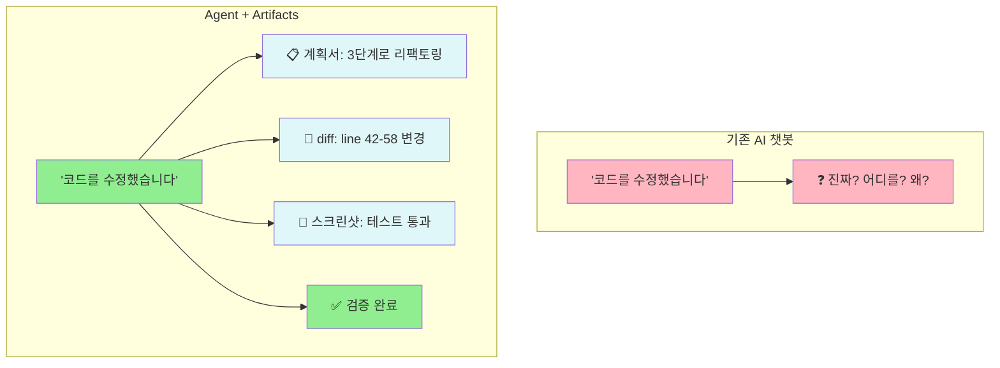
```mermaid
graph TB
    subgraph "기존 AI 챗봇"
        A1["'코드를 수정했습니다'"] --> A2["❓ 진짜? 어디를? 왜?"]
        style A1 fill:#FFB6C1
        style A2 fill:#FFB6C1
    end
    
    subgraph "Agent + Artifacts"
        B1["'코드를 수정했습니다'"] --> B2["📋 계획서: 3단계로 리팩토링"]
        B1 --> B3["📝 diff: line 42-58 변경"]
        B1 --> B4["📸 스크린샷: 테스트 통과"]
        B1 --> B5["✅ 검증 완료"]
        style B1 fill:#90EE90
        style B2 fill:#E0F7FA
        style B3 fill:#E0F7FA
        style B4 fill:#E0F7FA
        style B5 fill:#90EE90
    end
```

**기존 AI 챗봇의 문제점:**
- 말로만 "수정했습니다"라고 하지만 실제로 아무것도 하지 않음
- 사용자가 직접 복사/붙여넣기/실행해야 함
- 결과 확인이 어렵고 신뢰도가 낮음

**Agent + Artifacts의 장점:**
- 계획서로 **무엇을 할 것인지** 사전 확인
- diff로 **정확히 어디를 수정했는지** 명확히 표시
- 스크린샷으로 **실행 결과를 시각적으로** 확인
- 모든 단계가 검증 가능하여 **신뢰도가 높음**

Artifacts는 AI Agent가 단순한 조언자에서 **실제 작업을 수행하는 파트너**로 진화하는 데 핵심적인 역할을 합니다.

### 슬라이드 요약

> **Artifact = Agent의 작업 증거물**
> 
> 계획서, 코드, diff, 스크린샷, 녹화 등
> 
> "믿어달라"가 아닌 "확인해보세요"

---

## 1-2. Fast Mode vs Plan Mode

### 한 줄 정의

AI Agent는 작업의 복잡도와 위험도에 따라 두 가지 실행 모드를 제공합니다:

| 모드 | 한 줄 요약 | 철학 |
|------|-----------|------|
| **Fast Mode** | 즉시 실행 (승인 없음) | "빠르게, 간단하게" |
| **Plan Mode** | 계획 먼저 → 승인 → 실행 | "신중하게, 확실하게" |

Fast Mode는 간단하고 위험도가 낮은 작업에 적합하며, Plan Mode는 복잡하거나 중요한 작업에 사용됩니다.

### 비교 다이어그램

두 모드의 실행 흐름을 시각적으로 비교하면 다음과 같습니다:

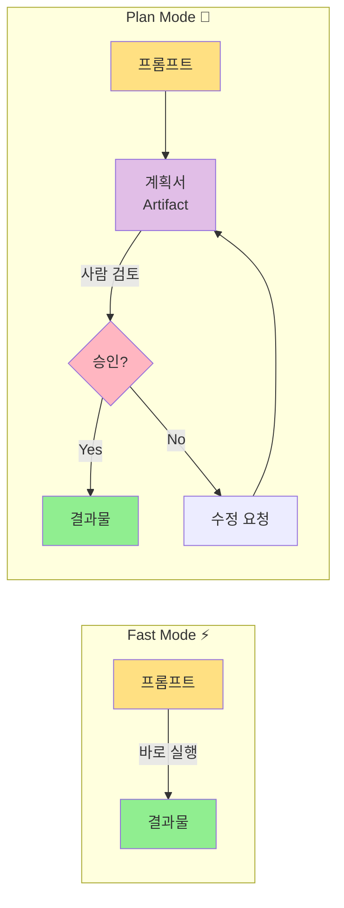
```mermaid
graph LR
    subgraph "Fast Mode ⚡"
        F1[프롬프트] -->|바로 실행| F2[결과물]
        style F1 fill:#FFE082
        style F2 fill:#90EE90
    end
    
    subgraph "Plan Mode 🎯"
        P1[프롬프트] --> P2[계획서<br/>Artifact]
        P2 -->|사람 검토| P3{승인?}
        P3 -->|Yes| P4[결과물]
        P3 -->|No| P5[수정 요청]
        P5 --> P2
        style P1 fill:#FFE082
        style P2 fill:#E1BEE7
        style P3 fill:#FFB6C1
        style P4 fill:#90EE90
    end
```

**Fast Mode의 특징:**
- 프롬프트를 입력하면 Agent가 즉시 작업을 시작하고 완료합니다
- 중간 확인 단계 없이 바로 결과물을 받습니다
- 속도가 빠르지만 통제력은 낮습니다

**Plan Mode의 특징:**
- 프롬프트 입력 후 Agent가 먼저 **계획서**를 작성합니다
- 계획서를 사람이 검토하고 승인/거부/수정 요청할 수 있습니다
- 승인 후에야 실제 작업을 수행합니다
- 속도는 느리지만 통제력과 정확도가 높습니다

### 상세 비교

두 모드를 여러 측면에서 비교하면 다음과 같습니다:

| 항목 | Fast Mode | Plan Mode | 설명 |
|------|-----------|-----------|------|
| **속도** | ⚡ 빠름 (수초~수분) | 🐢 느림 (검토 시간 포함) | Fast는 즉시, Plan은 검토 단계 추가 |
| **제어** | 낮음 | 높음 | Plan Mode는 사전 계획 수정 가능 |
| **Artifact** | 결과물만 | 계획서 + 결과물 | Plan Mode는 2단계 산출물 |
| **수정 기회** | 사후 수정 | 사전 조정 가능 | Plan은 실행 전 방향 조정 가능 |
| **토큰 사용** | 적음 | 많음 | 계획서 작성에 추가 토큰 필요 |
| **실수 복구** | 어려움 | 쉬움 | Plan은 실행 전 오류 발견 |

### 언제 어떤 모드를 사용할까?

작업의 특성에 따라 적절한 모드를 선택하는 것이 중요합니다:

**Fast Mode 추천 상황:**
- **오타 수정**: 간단한 텍스트 변경
- **CSS 색상 변경**: 시각적 스타일 조정
- **주석 추가**: 코드 설명 보강
- **변수명 변경**: 단순 리네이밍
- **로그 추가**: 디버깅용 로그 삽입

이런 작업들은 **위험도가 낮고**, **되돌리기가 쉬우며**, **영향 범위가 제한적**입니다.

**Plan Mode 추천 상황:**
- **새 기능 추가**: 여러 파일에 걸친 구조적 변경
- **DB 스키마 변경**: 실수 시 데이터 손실 위험
- **전체 리팩토링**: 광범위한 코드 재구성
- **API 엔드포인트 추가**: 인터페이스 변경
- **보안 관련 수정**: 인증/인가 로직 변경

이런 작업들은 **위험도가 높고**, **되돌리기가 어려우며**, **영향 범위가 넓습니다**.

### 의사결정 트리

```
작업 요청
   │
   ▼
위험도 평가
   │
   ├─ 낮음 → Fast Mode
   │
   ├─ 중간 → 상황 판단
   │        ├─ 시간 여유 있음 → Plan Mode
   │        └─ 빠른 피드백 필요 → Fast Mode
   │
   └─ 높음 → Plan Mode
```

### 실전 팁

1. **처음에는 Plan Mode**: 익숙하지 않은 프로젝트나 도구를 사용할 때는 Plan Mode로 시작하세요
2. **반복 작업은 Fast Mode**: 비슷한 작업을 여러 번 할 때는 Fast Mode로 속도를 높이세요
3. **중요한 건 항상 Plan**: 프로덕션 환경이나 중요 기능은 항상 Plan Mode를 사용하세요

### 슬라이드 요약

> **Fast Mode** = 간단한 작업, 즉시 실행
> 
> **Plan Mode** = 복잡한 작업, 계획 → 승인 → 실행
> 
> 💡 **위험도가 높을수록 Plan Mode**

---

# 2. Agent 비교: Claude Code vs Antigravity

---

## 2-1. Agent란?

### 정의

**Agent = 자율적으로 계획-실행-검증하는 AI 시스템**

AI Agent는 단순한 챗봇을 넘어서 **스스로 생각하고 행동하는 AI 시스템**입니다. 전통적인 AI 챗봇이 "조언자" 역할에 머물렀다면, Agent는 "실행자" 역할을 수행합니다.

Agent의 핵심은 **자율성(Autonomy)**입니다. 사람이 최종 목표만 제시하면, Agent가 스스로:
1. 문제를 분석하고
2. 해결 계획을 수립하며
3. 실제로 작업을 실행하고
4. 결과를 검증하여 보고합니다

### 기존 AI vs Agent

전통적인 AI 챗봇과 Agent의 차이를 실제 작업 흐름으로 비교해보겠습니다.

**시나리오: 코드에 버그가 있어서 수정이 필요한 상황**

#### 기존 AI 챗봇 방식

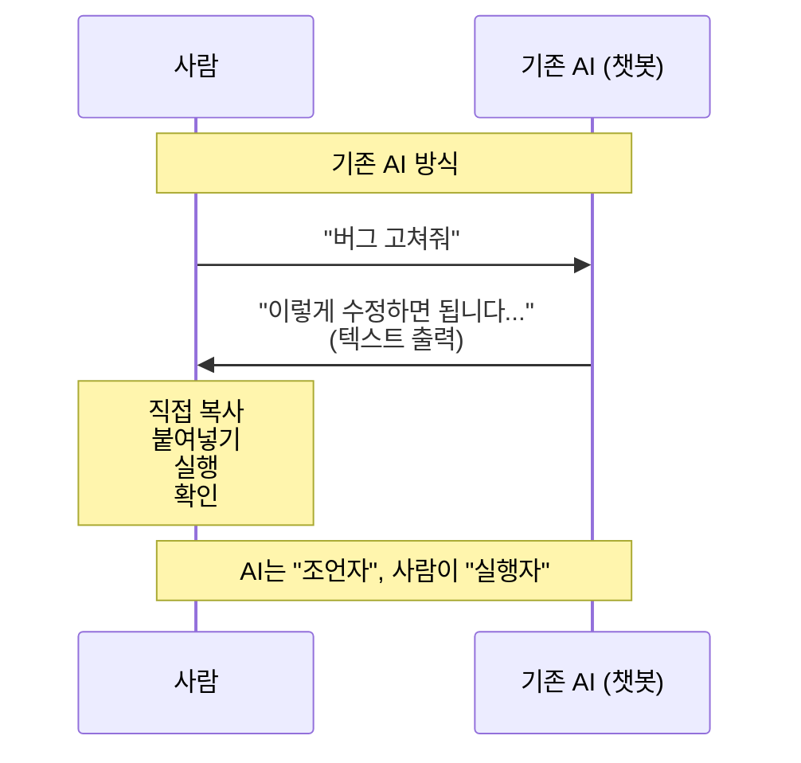
```mermaid
sequenceDiagram
    participant U as 사람
    participant AI as 기존 AI (챗봇)
    
    Note over U,AI: 기존 AI 방식
    U->>AI: "버그 고쳐줘"
    AI->>U: "이렇게 수정하면 됩니다..."<br/>(텍스트 출력)
    Note over U: 직접 복사<br/>붙여넣기<br/>실행<br/>확인
    Note over U,AI: AI는 "조언자", 사람이 "실행자"
```

**문제점:**
- AI는 텍스트 조언만 제공
- 사용자가 직접 모든 작업 수행
- 복사/붙여넣기 과정에서 오류 가능
- 반복적이고 수동적인 프로세스

#### Agent 방식

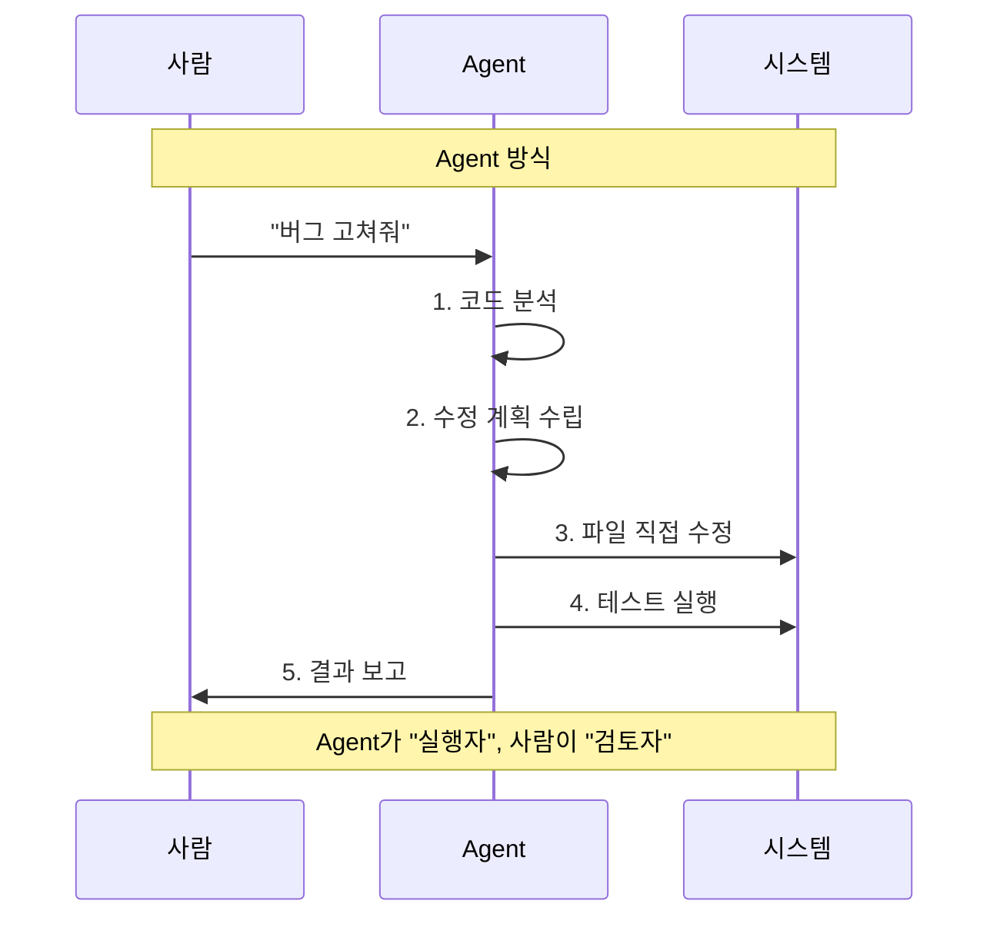
```mermaid
sequenceDiagram
    participant U as 사람
    participant A as Agent
    participant S as 시스템
    
    Note over U,S: Agent 방식
    U->>A: "버그 고쳐줘"
    A->>A: 1. 코드 분석
    A->>A: 2. 수정 계획 수립
    A->>S: 3. 파일 직접 수정
    A->>S: 4. 테스트 실행
    A->>U: 5. 결과 보고
    Note over U,S: Agent가 "실행자", 사람이 "검토자"
```

**장점:**
- Agent가 실제로 파일을 수정
- 테스트까지 자동으로 실행
- 사람은 최종 검토만 수행
- 자동화되고 효율적인 프로세스

### Agent의 3요소

Agent가 자율적으로 작업을 수행하기 위해서는 세 가지 핵심 요소가 필요합니다:

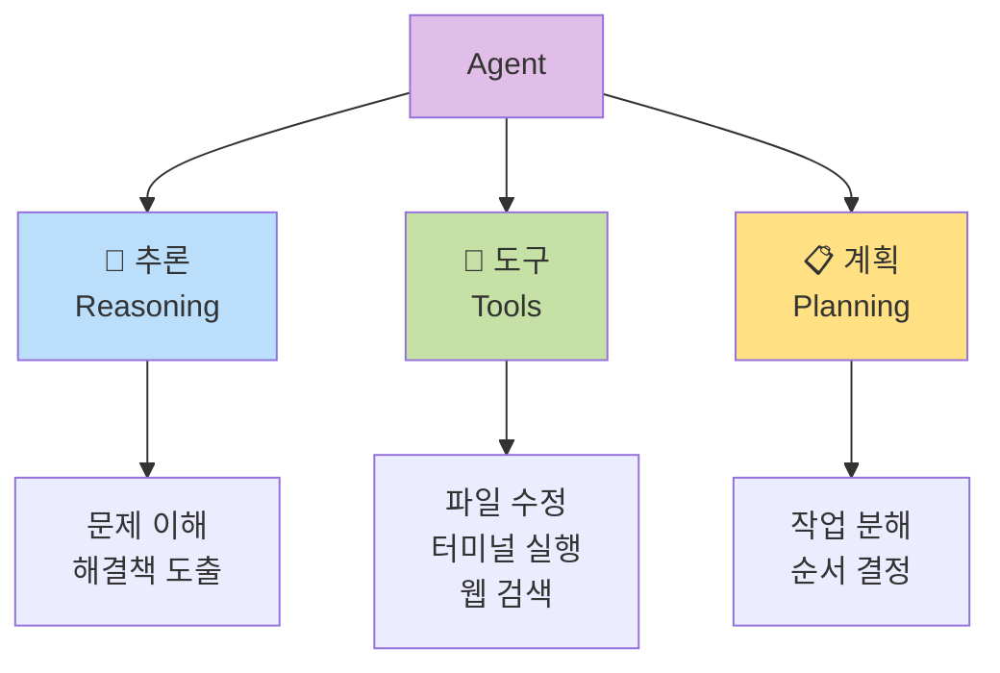
```mermaid
graph TB
    A[Agent] --> B[🧠 추론<br/>Reasoning]
    A --> C[🔧 도구<br/>Tools]
    A --> D[📋 계획<br/>Planning]
    
    B --> B1["문제 이해<br/>해결책 도출"]
    C --> C1["파일 수정<br/>터미널 실행<br/>웹 검색"]
    D --> D1["작업 분해<br/>순서 결정"]
    
    style A fill:#E1BEE7
    style B fill:#BBDEFB
    style C fill:#C5E1A5
    style D fill:#FFE082
```

#### 1. 추론 (Reasoning) 🧠

추론은 Agent의 "두뇌"에 해당합니다. 대규모 언어 모델(LLM)의 능력을 활용하여:
- **문제를 이해**합니다: 사용자의 요청을 분석하고 맥락을 파악합니다
- **해결책을 도출**합니다: 여러 접근 방법 중 최적의 방법을 선택합니다
- **상황을 판단**합니다: 예외 상황이나 오류를 인지하고 대응합니다

예: "버그 고쳐줘"라는 요청을 받으면, Agent는 어떤 버그인지, 어디를 수정해야 하는지, 어떤 방법이 최선인지 추론합니다.

#### 2. 도구 (Tools) 🔧

도구는 Agent의 "손"에 해당합니다. 실제로 작업을 수행하는 능력:
- **파일 수정**: 코드 파일을 읽고 쓰고 수정합니다
- **터미널 실행**: 명령어를 실행하고 결과를 확인합니다
- **웹 검색**: 필요한 정보를 인터넷에서 찾습니다
- **API 호출**: 외부 서비스와 연동합니다

예: 버그를 수정하기 위해 `edit_file()` 도구를 사용하고, `run_tests()` 도구로 테스트를 실행합니다.

#### 3. 계획 (Planning) 📋

계획은 Agent의 "전략"에 해당합니다. 복잡한 작업을 체계적으로 수행:
- **작업 분해**: 큰 작업을 작은 단계로 나눕니다
- **순서 결정**: 어떤 순서로 작업을 진행할지 정합니다
- **의존성 관리**: 선행 작업이 완료되어야 다음 작업을 시작합니다

예: 버그 수정 작업을 "코드 분석 → 수정 계획 → 파일 수정 → 테스트 실행 → 결과 확인" 순서로 분해합니다.

### 역할의 변화

Agent 시스템 도입으로 개발자의 역할이 변화합니다:

**전통적 개발:**
- 개발자 = **코더** (직접 타이핑)
- AI = 보조 도구 (자동완성)

**Agent 기반 개발:**
- 개발자 = **아키텍트** + **매니저** (방향 설정, 검토)
- Agent = 실행자 (실제 코딩)

이는 개발자가 더 높은 수준의 사고와 의사결정에 집중할 수 있게 해줍니다.

### 슬라이드 요약

> **Agent = 스스로 생각하고 행동하는 AI**
> 
> 기존 AI: 조언 → 사람이 실행
> 
> Agent: 계획 → 실행 → 검증 (사람은 감독)

---

## 2-2. Claude Code Agent

### 개요

Claude Code는 Anthropic에서 개발한 **CLI(Command Line Interface) 기반의 AI Agent**입니다. 터미널에서 직접 실행되며, 개발자 친화적인 환경을 제공합니다.

| 항목 | 내용 | 설명 |
|------|------|------|
| **제작사** | Anthropic | Claude 모델 개발사 |
| **인터페이스** | CLI (터미널) | 명령줄에서 `claude` 명령으로 실행 |
| **모델** | Claude Sonnet / Opus | 최신 Claude 4.5 모델 사용 |
| **비용** | Pro $20/월 필요 | 무료 체험 없음, 유료 구독 필수 |
| **출시** | 2025년 2월 | 비교적 최근 출시 |

### 왜 CLI인가?

Claude Code가 GUI가 아닌 CLI를 선택한 이유:

1. **개발자 워크플로우 통합**: 개발자는 이미 터미널을 많이 사용합니다. Git, npm, pip 등 대부분의 도구가 CLI 기반입니다.
2. **자동화 가능성**: CLI 도구는 스크립트로 자동화하기 쉽습니다.
3. **경량화**: GUI 오버헤드 없이 빠르게 실행됩니다.
4. **원격 작업**: SSH로 원격 서버에서도 동일하게 사용 가능합니다.

### 핵심 강점

Claude Code의 주요 강점을 살펴보겠습니다:

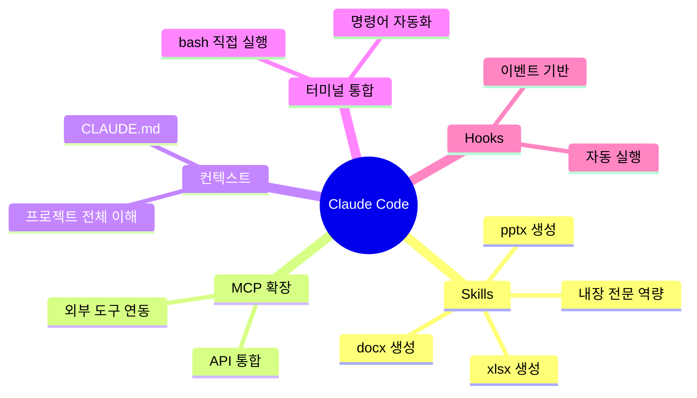
```mermaid
mindmap
  root((Claude Code))
    Skills
      docx 생성
      pptx 생성
      xlsx 생성
      내장 전문 역량
    MCP 확장
      외부 도구 연동
      API 통합
    컨텍스트
      프로젝트 전체 이해
      CLAUDE.md
    터미널 통합
      bash 직접 실행
      명령어 자동화
    Hooks
      이벤트 기반
      자동 실행
```

#### 1. Skills - 전문 역량

Claude Code는 다양한 "Skills"를 내장하고 있습니다:

- **문서 생성**: docx, pptx, xlsx 파일을 프로그래밍 방식으로 생성
- **코드 리뷰**: Best practice에 따른 체계적인 코드 리뷰
- **테스트 생성**: 자동으로 단위 테스트 코드 작성
- **문서화**: README, API 문서 자동 생성

예: "이 프로젝트의 API 문서를 Word로 만들어줘"라고 하면, Claude Code의 docx Skill을 활용하여 전문적인 문서를 생성합니다.

#### 2. MCP 확장성

MCP(Model Context Protocol)는 Claude Code의 가장 강력한 기능입니다:

- **표준 프로토콜**: 외부 도구/API를 표준화된 방식으로 연결
- **무한 확장**: 새로운 도구를 MCP 서버로 만들어 추가 가능
- **네이티브 지원**: Claude Code는 MCP를 기본적으로 지원

예: 날씨 API, Slack API, 데이터베이스 등을 MCP 서버로 만들면 Claude가 자유롭게 활용할 수 있습니다.

#### 3. 프로젝트 컨텍스트

Claude Code는 CLAUDE.md 파일을 통해 프로젝트 전체를 이해합니다:

- **전체 구조 파악**: 파일 간 관계, 의존성 이해
- **컨벤션 준수**: 프로젝트의 코딩 스타일 자동 적용
- **일관성 유지**: 기존 패턴을 따르는 코드 생성

#### 4. 터미널 통합

bash 명령을 직접 실행할 수 있습니다:

- **자동화**: 반복적인 명령어 시퀀스를 자동화
- **검증**: 명령 실행 결과를 확인하고 대응
- **워크플로우**: 복잡한 개발 워크플로우를 구성

예: "테스트 실행하고, 통과하면 커밋하고, 푸시해줘"

#### 5. Hooks - 이벤트 기반

Hooks는 특정 이벤트 발생 시 자동으로 작업을 실행합니다:

- **git commit 전**: 자동 린트, 테스트 실행
- **파일 저장 시**: 자동 포맷팅
- **에러 발생 시**: 자동 로그 분석

### 적합한 사용자

Claude Code는 다음과 같은 사용자에게 적합합니다:

- **CLI를 선호하는 개발자**: vim, tmux 사용자
- **자동화를 중시하는 팀**: CI/CD 파이프라인 통합
- **MCP 서버 개발자**: 도구 확장에 관심 있는 개발자
- **문서 자동화**: 기술 문서를 자주 작성하는 팀

### 슬라이드 요약

> **Claude Code = 터미널 기반 AI Agent**
> 
> 강점: Skills, MCP 확장, 프로젝트 전체 이해
> 
> 적합: 자동화, 도구 확장, CLI 선호 개발자

---

## 2-3. Antigravity Agent

### 개요

Antigravity는 Google에서 개발한 **GUI(Graphical User Interface) 기반의 AI Agent IDE**입니다. VS Code와 유사한 인터페이스를 제공하며, 초보자도 쉽게 접근할 수 있습니다.

| 항목 | 내용 | 설명 |
|------|------|------|
| **제작사** | Google | Gemini 모델 개발사 |
| **인터페이스** | GUI (IDE) | 그래픽 기반 통합 개발 환경 |
| **모델** | Gemini 3 Pro (+ Claude, GPT 선택 가능) | 다양한 모델 지원 |
| **비용** | 무료 (주간 quota) | 관대한 무료 사용량 제공 |
| **출시** | 2025년 11월 | 가장 최근 출시된 도구 |

### 왜 GUI인가?

Antigravity가 GUI를 선택한 이유:

1. **접근성**: 프로그래밍 초보자도 쉽게 사용 가능
2. **시각화**: 복잡한 Multi-Agent 작업을 시각적으로 관리
3. **직관성**: 마우스 클릭으로 대부분의 작업 수행
4. **친숙함**: VS Code 사용자라면 즉시 적응 가능

### 특징: Dual View

Antigravity의 가장 독특한 특징은 **두 가지 뷰를 제공**한다는 점입니다:

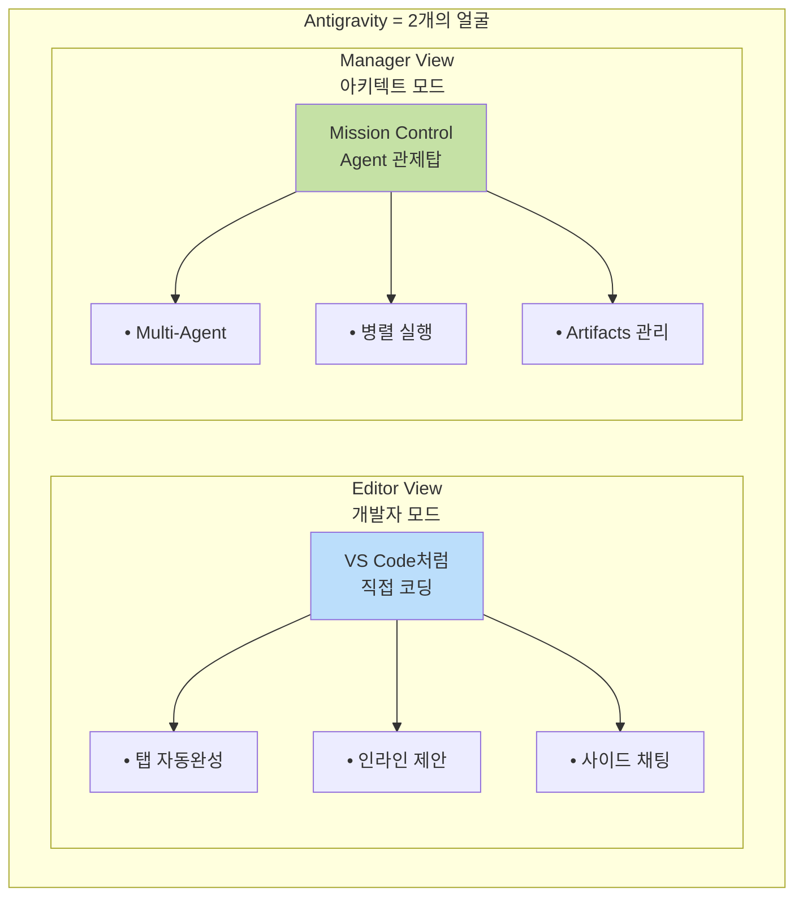
```mermaid
graph TB
    subgraph "Antigravity = 2개의 얼굴"
        subgraph "Editor View<br/>개발자 모드"
            E1["VS Code처럼<br/>직접 코딩"]
            E2["• 탭 자동완성"]
            E3["• 인라인 제안"]
            E4["• 사이드 채팅"]
            E1 --> E2
            E1 --> E3
            E1 --> E4
        end
        
        subgraph "Manager View<br/>아키텍트 모드"
            M1["Mission Control<br/>Agent 관제탑"]
            M2["• Multi-Agent"]
            M3["• 병렬 실행"]
            M4["• Artifacts 관리"]
            M1 --> M2
            M1 --> M3
            M1 --> M4
        end
    end
    
    style E1 fill:#BBDEFB
    style M1 fill:#C5E1A5
```

#### Editor View - 개발자 모드

전통적인 IDE처럼 직접 코드를 작성하는 모드입니다:

- **VS Code 스타일**: 익숙한 인터페이스로 빠른 적응
- **탭 자동완성**: Copilot처럼 코드 제안
- **인라인 제안**: 커서 위치에서 즉시 수정 제안
- **사이드 채팅**: 코딩하면서 AI와 대화

**사용 상황**: 세부적인 코드 수정, 디버깅, 정밀한 작업

#### Manager View - 아키텍트 모드

여러 Agent를 오케스트레이션하는 모드입니다:

- **Mission Control**: 모든 Agent를 한 화면에서 관리
- **Multi-Agent**: 3-5개 Agent를 동시에 실행
- **병렬 처리**: 독립적인 작업을 동시에 수행
- **Artifacts 통합**: 각 Agent의 산출물을 중앙에서 관리

**사용 상황**: 프로젝트 초기 설정, 대규모 리팩토링, 복잡한 기능 개발

### 핵심 강점

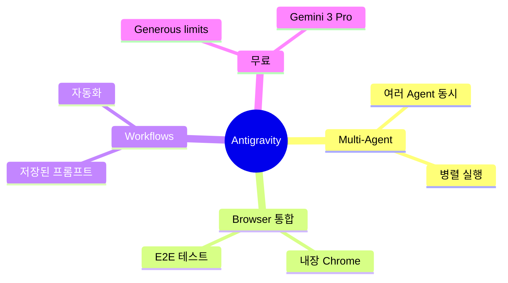
```mermaid
mindmap
  root((Antigravity))
    Multi-Agent
      여러 Agent 동시
      병렬 실행
    Browser 통합
      내장 Chrome
      E2E 테스트
    Workflows
      저장된 프롬프트
      자동화
    무료
      Generous limits
      Gemini 3 Pro
```

#### 1. Multi-Agent - 동시 작업

Antigravity의 킬러 기능은 **여러 Agent를 동시에 실행**하는 것입니다:

**예시 시나리오: Todo 앱 개발**
- **Agent 1**: UI 컴포넌트 작성 (React)
- **Agent 2**: 백엔드 API 개발 (FastAPI)
- **Agent 3**: 테스트 코드 작성 (Jest)
- **Agent 4**: 문서화 (README)

이 4개 작업이 **동시에 진행**되어 개발 시간을 크게 단축합니다.

#### 2. Browser 통합

내장 Chrome 브라우저로 웹 앱을 자동으로 테스트합니다:

- **자동 실행**: Agent가 직접 브라우저를 조작
- **스크린샷**: 각 단계별 화면 캡처
- **E2E 테스트**: 사용자 플로우 자동 검증
- **녹화 기능**: 전체 과정을 영상으로 기록

예: "로그인 → 할 일 추가 → 완료 체크 → 삭제" 플로우를 Agent가 자동으로 테스트

#### 3. Workflows - 재사용 가능한 자동화

자주 사용하는 작업을 Workflow로 저장합니다:

- **저장**: 프롬프트와 설정을 파일로 저장
- **호출**: `/workflow-name` 명령으로 즉시 실행
- **공유**: 팀원과 Workflow 공유 가능
- **체이닝**: 여러 Workflow를 순차 실행

예: `/korean-component`를 실행하면 "한국어 주석 + Tailwind CSS + TypeScript"로 컴포넌트 자동 생성

#### 4. 무료 - 관대한 Quota

Google은 Antigravity를 **무료로 제공**하며 quota가 매우 관대합니다:

- **주간 기준**: 매주 quota 리셋
- **Gemini 3 Pro**: 무료로 최신 모델 사용
- **Claude/GPT 선택**: 필요시 다른 모델도 사용 가능

초보자나 개인 개발자가 부담 없이 시작할 수 있습니다.

### 적합한 사용자

Antigravity는 다음과 같은 사용자에게 적합합니다:

- **프로그래밍 초보자**: GUI로 쉽게 시작
- **팀 협업**: Workflow 공유로 일관성 유지
- **웹 개발자**: Browser 통합으로 E2E 테스트
- **비용 민감**: 무료로 시작하고 싶은 사용자

### 슬라이드 요약

> **Antigravity = GUI 기반 Multi-Agent IDE**
> 
> 강점: Multi-Agent, Browser 통합, Workflows
> 
> 적합: 복잡한 프로젝트, 팀 협업, 초보자

---

## 2-4. Claude Code vs Antigravity 비교

### 한눈에 비교

두 도구의 핵심 차이점을 표로 정리하면:

| 항목 | Claude Code | Antigravity | 선택 기준 |
|------|-------------|-------------|----------|
| **인터페이스** | CLI (터미널) | GUI (IDE) | CLI 선호 vs GUI 선호 |
| **제작사** | Anthropic | Google | 모델 선호도 |
| **기본 모델** | Claude | Gemini 3 Pro | 성능/품질 요구사항 |
| **비용** | Pro $20/월 | 무료 (quota) | 예산 고려 |
| **Agent 수** | 1개 + Subagents | Multi-Agent (3-5개) | 병렬 작업 필요성 |
| **Browser** | ❌ | ✅ 내장 | 웹 앱 개발 여부 |
| **Skills** | ✅ 강력 | ✅ 지원 | 문서 자동화 필요 |
| **MCP** | ✅ 네이티브 | ✅ 지원 | 도구 확장 계획 |
| **Hooks** | ✅ | ❌ | 이벤트 기반 자동화 |
| **학습 곡선** | 높음 (CLI 경험 필요) | 낮음 (GUI) | 개발 경험 수준 |

### 선택 가이드

어떤 도구를 선택해야 할까요? 다음 플로우차트를 참고하세요:

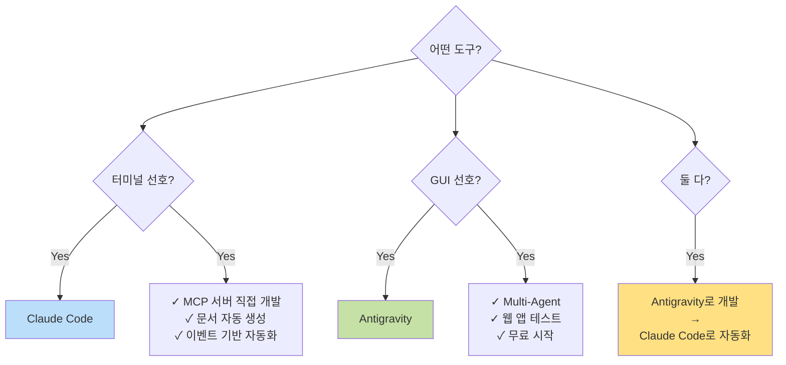
```mermaid
graph TD
    A{어떤 도구?} --> B{터미널 선호?}
    A --> C{GUI 선호?}
    
    B -->|Yes| D[Claude Code]
    B -->|Yes| D1["✓ MCP 서버 직접 개발<br/>✓ 문서 자동 생성<br/>✓ 이벤트 기반 자동화"]
    
    C -->|Yes| E[Antigravity]
    C -->|Yes| E1["✓ Multi-Agent<br/>✓ 웹 앱 테스트<br/>✓ 무료 시작"]
    
    A --> F{둘 다?}
    F -->|Yes| G["Antigravity로 개발<br/>→<br/>Claude Code로 자동화"]
    
    style D fill:#BBDEFB
    style E fill:#C5E1A5
    style G fill:#FFE082
```

### 사용 시나리오별 추천

#### 시나리오 1: 프로젝트 초기 개발

**추천: Antigravity**

- Multi-Agent로 UI, API, 테스트를 동시 개발
- Browser로 즉시 결과 확인
- 무료로 빠르게 프로토타입 제작

#### 시나리오 2: 문서 자동화

**추천: Claude Code**

- docx/pptx Skill로 전문 문서 생성
- Hooks로 커밋 시 자동 문서 업데이트
- MCP로 외부 데이터 소스 연동

#### 시나리오 3: E2E 테스트 자동화

**추천: Antigravity**

- 내장 Browser로 실제 사용자 플로우 테스트
- 스크린샷과 녹화로 버그 재현
- Workflow로 테스트 시나리오 재사용

#### 시나리오 4: MCP 서버 개발

**추천: Claude Code**

- MCP 네이티브 지원으로 빠른 개발
- 터미널에서 즉시 테스트
- Subagents로 복잡한 서버 로직 구현

### 병행 사용 전략

**최강의 조합**: 두 도구를 함께 사용하는 것입니다.

1. **개발 단계**: Antigravity
   - 빠른 프로토타이핑
   - Multi-Agent로 병렬 개발
   - Browser로 즉시 검증

2. **자동화 단계**: Claude Code
   - Hooks로 품질 관리 자동화
   - 문서 자동 생성
   - MCP 서버로 도구 확장

3. **유지보수**: 상황에 따라 선택
   - 간단한 수정: Antigravity (GUI)
   - 대규모 변경: Claude Code (자동화)

### 전환 비용

한 도구에서 다른 도구로 전환하는 비용은 낮습니다:

- **Workflows**: 양쪽 모두 유사한 형식
- **Skills**: 오픈 스탠다드로 호환
- **MCP**: 표준 프로토콜로 동일하게 작동
- **코드**: 도구와 무관하게 Git으로 관리

### 슬라이드 요약

> **Claude Code** = CLI, Skills 강력, MCP 네이티브
> 
> **Antigravity** = GUI, Multi-Agent, 무료
> 
> 💡 **둘 다 쓰는 게 최강** (개발 + 자동화)

---

# 3. Slash Commands, Workflows, Skills의 이해

---

## 3-1. 세 개념의 핵심 차이

### 정의

AI Agent 개발 도구에서 가장 헷갈리는 개념이 바로 **Slash Commands**, **Workflows**, **Skills**입니다. 이 세 가지는 언뜻 비슷해 보이지만, **호출 주체**에서 결정적인 차이가 있습니다.

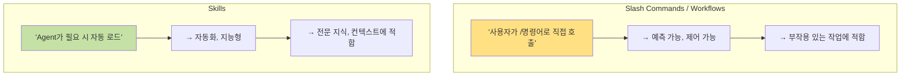
```mermaid
graph TB
    subgraph "Slash Commands / Workflows"
        SC1["'사용자가 /명령어로 직접 호출'"]
        SC2["→ 예측 가능, 제어 가능"]
        SC3["→ 부작용 있는 작업에 적합"]
        SC1 --> SC2
        SC2 --> SC3
        style SC1 fill:#FFE082
    end
    
    subgraph "Skills"
        SK1["'Agent가 필요 시 자동 로드'"]
        SK2["→ 자동화, 지능형"]
        SK3["→ 전문 지식, 컨텍스트에 적합"]
        SK1 --> SK2
        SK2 --> SK3
        style SK1 fill:#C5E1A5
    end
```

### 핵심 차이점

**가장 중요한 구분 기준은 "누가 호출하는가?"입니다:**

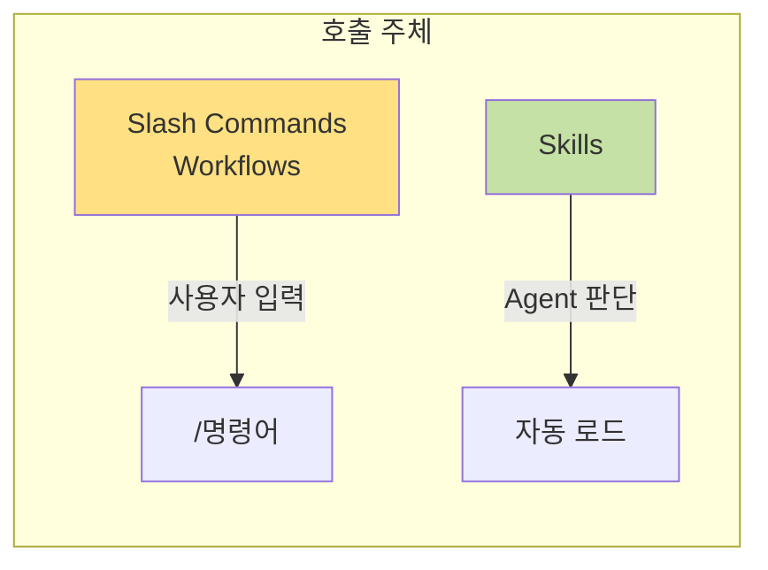
```mermaid
graph LR
    subgraph "호출 주체"
        A[Slash Commands<br/>Workflows] -->|사용자 입력| B["/명령어"]
        C[Skills] -->|Agent 판단| D["자동 로드"]
    end
    
    style A fill:#FFE082
    style C fill:#C5E1A5
```

| 구분 | Slash Commands / Workflows | Skills |
|------|---------------------------|--------|
| **호출 주체** | **👤 사용자** | **🤖 Agent** |
| **호출 방식** | `/명령어` 입력 | Agent가 상황 판단하여 자동 로드 |
| **예측 가능성** | 높음 (언제 실행될지 명확) | 낮음 (Agent 판단에 따라) |
| **용도** | 반복 작업, 부작용 있는 작업 | 전문 지식, Best Practice |
| **예시** | `/deploy`, `/commit`, `/review` | docx 생성, code-review |
| **트리거** | 사용자 의도적 실행 | 작업 필요성에 따라 자동 |

### 구체적인 예시

#### 상황 1: 코드 리뷰

**Workflow 방식 (사용자 호출):**
```
사용자: /review
→ Workflow가 실행되어 코드 리뷰 수행
→ 예측 가능, 언제 리뷰할지 사용자가 결정
```

**Skill 방식 (Agent 자동):**
```
사용자: 이 PR을 검토해줘
→ Agent가 code-review Skill이 필요하다고 판단
→ 자동으로 Skill 로드하여 리뷰 수행
→ Agent가 알아서 판단
```

#### 상황 2: 배포

**Workflow 방식:**
```
사용자: /deploy
→ 테스트 → 빌드 → 배포 순차 실행
→ 사용자가 명시적으로 배포 시작
```

**Skills는 배포에 사용 안 함:**
- 배포는 **부작용이 큰** 작업
- Agent가 임의로 판단하면 위험
- 반드시 사용자가 명시적으로 실행해야 함

### 왜 구분이 중요한가?

**1. 안전성:**
- 부작용 있는 작업(배포, 삭제, DB 변경)은 Workflows로
- Agent가 자동 실행하면 안 되는 작업을 보호

**2. 효율성:**
- 전문 지식(문서 작성법, 코딩 패턴)은 Skills로
- Agent가 자동으로 활용하여 품질 향상

**3. 명확성:**
- 언제 실행될지 알아야 하는 작업은 Workflows로
- 백그라운드에서 자동 처리되어도 되는 작업은 Skills로

### 슬라이드 요약

> **Slash Commands/Workflows** = 사용자 호출
> 
> **Skills** = Agent 자동 로드
> 
> 💡 **호출 주체가 핵심 차이**

---

## 3-2. Slash Commands (Claude Code)

### 정의

**Slash Commands = 사용자가 `/명령어`로 직접 호출하는 자동화 템플릿**

Claude Code에서 Slash Commands는 반복적인 작업을 자동화하는 강력한 도구입니다. `/`로 시작하는 명령어를 입력하면, 미리 정의된 작업이 실행됩니다.

### 파일 위치

Slash Commands는 마크다운 파일로 정의되며, 두 위치에 저장할 수 있습니다:

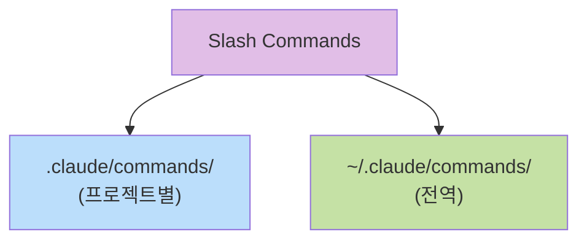
```mermaid
graph TB
    A[Slash Commands] --> B[".claude/commands/<br/>(프로젝트별)"]
    A --> C["~/.claude/commands/<br/>(전역)"]
    
    style A fill:#E1BEE7
    style B fill:#BBDEFB
    style C fill:#C5E1A5
```

**프로젝트별 vs 전역:**

- **프로젝트별** (`.claude/commands/`):
  - 특정 프로젝트에서만 사용
  - Git으로 팀과 공유 가능
  - 프로젝트 특화 작업에 적합
  - 예: `/run-tests` (이 프로젝트의 테스트 실행)

- **전역** (`~/.claude/commands/`):
  - 모든 프로젝트에서 사용
  - 개인 워크플로우
  - 일반적인 작업에 적합
  - 예: `/commit-conventional` (Conventional Commits 스타일)

**우선순위**: 프로젝트별 > 전역 (같은 이름이면 프로젝트별이 우선)

### Frontmatter 옵션

Slash Commands는 YAML frontmatter로 세밀하게 제어할 수 있습니다:

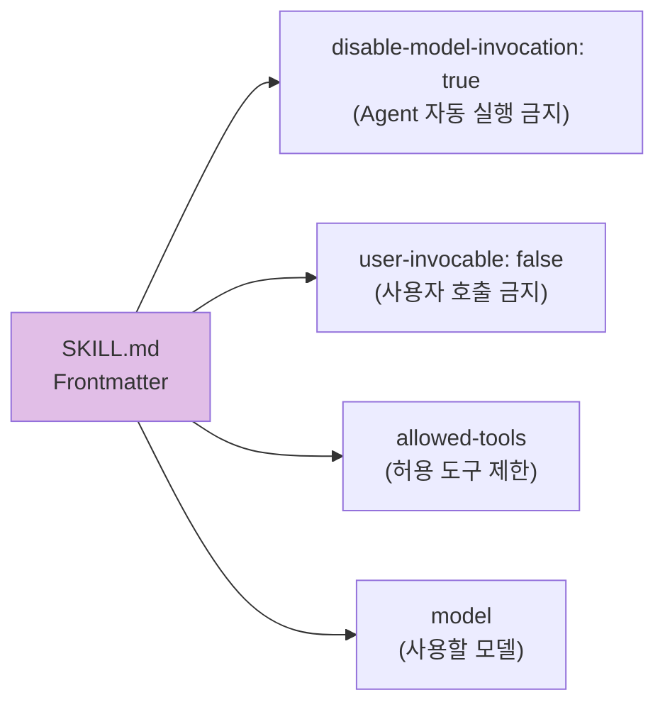
```mermaid
graph LR
    A[SKILL.md<br/>Frontmatter] --> B["disable-model-invocation: true<br/>(Agent 자동 실행 금지)"]
    A --> C["user-invocable: false<br/>(사용자 호출 금지)"]
    A --> D["allowed-tools<br/>(허용 도구 제한)"]
    A --> E["model<br/>(사용할 모델)"]
    
    style A fill:#E1BEE7
```

**주요 옵션 설명:**

1. **disable-model-invocation: true**
   - Agent가 자동으로 이 명령을 실행하지 못하게 함
   - 부작용 있는 작업(배포, 삭제)에 필수
   - 사용자가 명시적으로 `/명령어`를 입력해야만 실행

2. **user-invocable: false**
   - 사용자가 직접 호출할 수 없음
   - Skills 전용 (Agent만 사용)
   - 일반적으로 Slash Commands에서는 사용 안 함

3. **allowed-tools**
   - 이 명령이 사용할 수 있는 도구 제한
   - 보안 강화 (예: `Bash(git*)` - git 명령만 허용)

4. **model**
   - 사용할 LLM 모델 지정
   - 예: `haiku` (빠르고 저렴), `sonnet` (균형), `opus` (고품질)

### 파일 구조 예시

```markdown
---
name: review
description: Code review with security focus
disable-model-invocation: true
allowed-tools: Bash(git*)
model: sonnet
---

# Code Review

다음 관점에서 코드를 리뷰해주세요:

1. **보안**: 인젝션, XSS, 인증
2. **버그**: 런타임 에러 가능성
3. **성능**: N+1 쿼리, 불필요한 연산
4. **가독성**: 네이밍, 복잡도

$ARGUMENTS
```

**$ARGUMENTS 변수:**
- 사용자가 입력한 추가 인자를 받습니다
- 예: `/review auth.ts` → `$ARGUMENTS`에 "auth.ts"가 들어감

### 실전 예시

**1. 배포 명령 (`deploy.md`)**

```markdown
---
name: deploy
description: Deploy to production
disable-model-invocation: true
allowed-tools: Bash(npm*, git*, vercel*)
---

# Production Deployment

다음 순서로 배포를 진행해줘:

1. 테스트 실행: `npm test`
2. 빌드: `npm run build`
3. Git 태그 생성: 현재 버전으로
4. Vercel 배포: `vercel --prod`

각 단계 완료 후 결과를 보고해줘.
```

**2. 커밋 명령 (`commit.md`)**

```markdown
---
name: commit
description: Conventional commits
disable-model-invocation: true
allowed-tools: Bash(git*)
model: haiku
---

# Conventional Commit

변경 사항을 Conventional Commits 형식으로 커밋해줘.

형식: `type(scope): description`

Types: feat, fix, docs, style, refactor, test, chore

$ARGUMENTS
```

### 사용 방법

```bash
# Claude Code 실행
$ claude

# Slash Command 사용
> /review src/auth/login.ts

# Agent가 review.md를 로드하여 실행
# src/auth/login.ts 파일을 리뷰
```

### 슬라이드 요약

> **Slash Commands** = 사용자가 `/명령어`로 호출
> 
> frontmatter로 세밀한 제어 가능
> 
> 💡 **부작용 있는 작업에 적합**

---

## 3-3. Workflows (Antigravity)

### 정의

**Workflows = 사용자가 `/명령어`로 직접 호출하는 단계별 작업 가이드**

**핵심**: Claude Code의 Slash Commands와 **동일한 개념**입니다. Antigravity에서는 "Workflows"라고 부를 뿐입니다.

Workflows는 복잡한 작업을 단계별로 나누어 Agent가 체계적으로 수행하도록 가이드합니다.

### 파일 위치

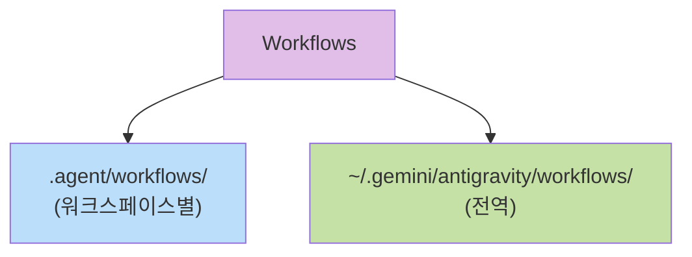
```mermaid
graph TB
    A[Workflows] --> B[".agent/workflows/<br/>(워크스페이스별)"]
    A --> C["~/.gemini/antigravity/workflows/<br/>(전역)"]
    
    style A fill:#E1BEE7
    style B fill:#BBDEFB
    style C fill:#C5E1A5
```

**주의**: Antigravity는 `.antigravity/`가 아니라 **`.agent/`** 디렉토리를 사용합니다.

### 파일 구조

Workflows는 마크다운 형식으로 작성되며, 명확한 단계 구조를 가집니다:

~~~markdown
# 배포 워크플로우

## 설명
프로덕션 배포를 위한 단계별 가이드

## 단계

### 1단계: 테스트 실행
모든 테스트가 통과하는지 확인합니다.
```bash
npm run test
```

### 2단계: 빌드
프로덕션 빌드를 생성합니다.
```bash
npm run build
```

### 3단계: 배포
Vercel에 배포합니다.
```bash
vercel --prod
```
~~~

**구조 설명:**
1. **제목**: Workflow의 이름
2. **설명**: 이 Workflow가 하는 일
3. **단계**: 순차적으로 실행할 작업들
4. **코드 블록**: 실행할 명령어

### 워크플로우 체이닝

Workflows의 강력한 기능은 **다른 Workflow를 호출**할 수 있다는 것입니다:

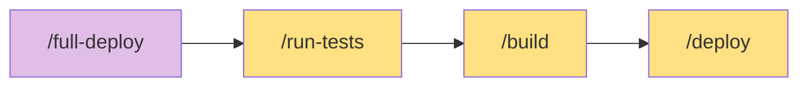
```mermaid
flowchart LR
    A["/full-deploy"] --> B["/run-tests"]
    B --> C["/build"]
    C --> D["/deploy"]
    
    style A fill:#E1BEE7
    style B fill:#FFE082
    style C fill:#FFE082
    style D fill:#FFE082
```

**예시:**

```markdown
# Full Deployment

## 단계

### 1단계: 테스트
워크플로우 실행: /run-tests

### 2단계: 빌드
워크플로우 실행: /build

### 3단계: 배포
워크플로우 실행: /deploy
```

이렇게 하면:
- 각 단계를 별도 Workflow로 재사용 가능
- 전체 프로세스를 하나의 명령으로 실행
- 단계별로 Artifact 생성되어 검증 용이

### Agent-Generated Workflows

Antigravity의 독특한 기능은 **Agent가 Workflow를 자동 생성**할 수 있다는 것입니다:

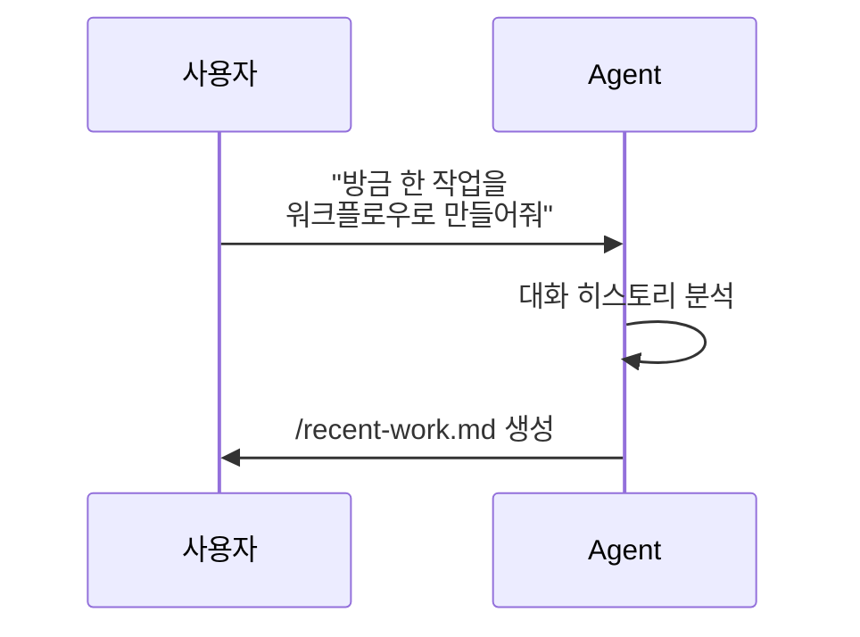
```mermaid
sequenceDiagram
    participant U as 사용자
    participant A as Agent
    
    U->>A: "방금 한 작업을<br/>워크플로우로 만들어줘"
    A->>A: 대화 히스토리 분석
    A->>U: /recent-work.md 생성
```

**시나리오:**

1. 사용자가 복잡한 작업을 Agent와 함께 수행
2. 작업이 완료된 후: "이 과정을 Workflow로 저장해줘"
3. Agent가 대화 히스토리를 분석하여 단계를 추출
4. `.agent/workflows/recent-work.md` 파일 생성
5. 다음부터는 `/recent-work` 명령으로 즉시 재실행 가능

### 실전 예시

**1. 한국어 컴포넌트 생성 Workflow**

```markdown
# Korean React Component

## 설명
한국어 주석과 Tailwind CSS를 사용하는 React 컴포넌트를 생성합니다.

## 규칙
- TypeScript 사용
- Tailwind CSS 스타일링
- 모든 주석은 한국어로
- Props는 interface로 정의

## 프롬프트

다음 요구사항에 맞는 React 컴포넌트를 만들어줘:

{user_input}

필수 사항:
1. TypeScript + Tailwind CSS
2. 한국어 주석으로 각 섹션 설명
3. Props interface 정의
4. 반응형 디자인 (mobile-first)
5. 접근성 고려 (aria-label 등)
```

**사용:**
```
/korean-component 로그인 폼 만들어줘
```

**2. Git 작업 Workflow**

~~~markdown
# Git Feature Branch

## 설명
기능 개발을 위한 Git 브랜치 생성 및 초기 설정

## 단계

### 1단계: 브랜치 생성
```bash
git checkout -b feature/{feature_name}
```

### 2단계: 초기 커밋
```bash
git commit --allow-empty -m "chore: start {feature_name}"
```

### 3단계: 푸시
```bash
git push -u origin feature/{feature_name}
```
~~~

### 슬라이드 요약

> **Workflows** = Slash Commands와 동일 개념
> 
> 단계별 작업 가이드, 체이닝 가능
> 
> 💡 **Agent가 워크플로우 자동 생성 가능**

---

## 3-4. Skills (공통 표준)

### 정의

**Skills = Agent가 필요 시 자동으로 로드하는 전문 지식 패키지**

**핵심**: Agent Skills는 **오픈 스탠다드**입니다. Claude Code, Antigravity, 그리고 향후 등장할 다른 AI 도구들에서 모두 호환됩니다.

### 왜 Skills가 필요한가?

Workflows는 사용자가 명시적으로 호출하지만, Skills는 **Agent가 상황을 판단하여 자동으로 활용**합니다.

**예시 상황:**

```
사용자: "이 데이터를 Excel 파일로 만들어줘"

Agent 내부 프로세스:
1. "Excel 파일 생성"이 필요함을 인식
2. 사용 가능한 Skills 검색
3. "xlsx" Skill 발견
4. 자동으로 로드하여 Best Practice 확인
5. Skill 가이드에 따라 Excel 파일 생성
```

사용자는 `/xlsx` 같은 명령을 입력하지 않았지만, Agent가 알아서 필요한 Skill을 활용했습니다.

### 파일 위치

Skills는 양쪽 도구 모두에서 호환됩니다:

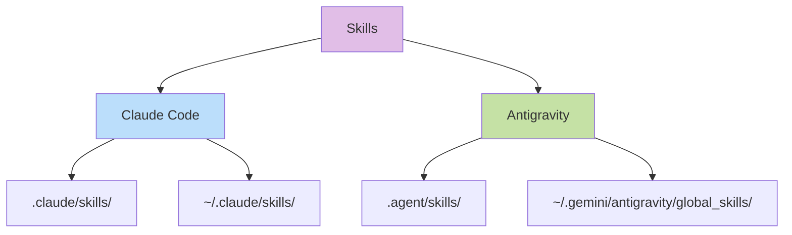
```mermaid
graph TB
    A[Skills] --> B[Claude Code]
    A --> C[Antigravity]
    
    B --> B1[".claude/skills/"]
    B --> B2["~/.claude/skills/"]
    
    C --> C1[".agent/skills/"]
    C --> C2["~/.gemini/antigravity/global_skills/"]
    
    style A fill:#E1BEE7
    style B fill:#BBDEFB
    style C fill:#C5E1A5
```

**중요**: Skills는 **동일한 SKILL.md 형식**을 사용하므로, 한 번 작성하면 양쪽 도구에서 모두 사용 가능합니다.

### SKILL.md 구조

```markdown
---
name: code-review
description: Reviews code for bugs, style, and best practices.
             Use when reviewing PRs or checking code quality.
---

# Code Review Skill

When reviewing code, follow these steps:

## Review Checklist

1. **Correctness**: Does it work?
2. **Edge cases**: Error handling?
3. **Style**: Follows conventions?
4. **Performance**: Obvious inefficiencies?

## Feedback Guidelines

- Be specific
- Explain why, not just what
- Suggest alternatives
```

**Frontmatter:**
- `name`: Skill 이름 (고유 식별자)
- `description`: **매우 중요!** Agent가 이 설명을 보고 Skill을 선택합니다

**본문:**
- Agent가 참고할 가이드라인
- 체크리스트, 패턴, Best Practice 등

### Progressive Disclosure

Skills의 핵심 메커니즘은 **Progressive Disclosure**(점진적 공개)입니다:

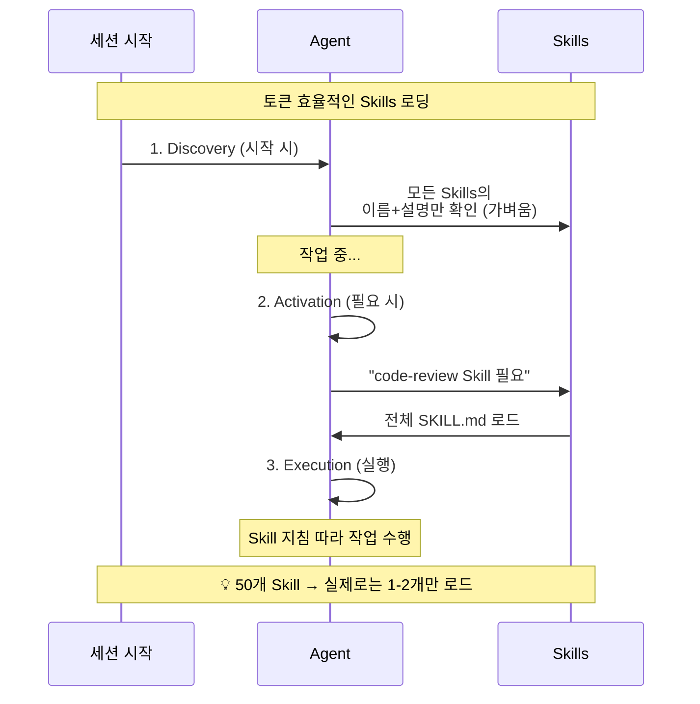
```mermaid
sequenceDiagram
    participant S as 세션 시작
    participant A as Agent
    participant SK as Skills
    
    Note over S,SK: 토큰 효율적인 Skills 로딩
    
    S->>A: 1. Discovery (시작 시)
    A->>SK: 모든 Skills의<br/>이름+설명만 확인 (가벼움)
    
    Note over A: 작업 중...
    
    A->>A: 2. Activation (필요 시)
    A->>SK: "code-review Skill 필요"
    SK->>A: 전체 SKILL.md 로드
    
    A->>A: 3. Execution (실행)
    Note over A: Skill 지침 따라 작업 수행
    
    Note over S,SK: 💡 50개 Skill → 실제로는 1-2개만 로드
```

**작동 방식:**

1. **Discovery (발견)**: 세션 시작 시 모든 Skills의 이름과 설명만 로드
   - 토큰 사용량: 매우 적음 (각 Skill당 ~50 토큰)
   - 50개 Skill이 있어도 빠름

2. **Activation (활성화)**: 필요한 Skill만 전체 로드
   - Agent가 작업을 분석하여 필요한 Skill 판단
   - 해당 Skill의 전체 SKILL.md 파일을 컨텍스트에 추가

3. **Execution (실행)**: Skill 가이드에 따라 작업 수행
   - Skill의 체크리스트, 패턴 등을 따름

**장점:**
- 많은 Skills가 있어도 토큰 낭비 없음
- 필요한 전문 지식만 선택적으로 활용
- 확장성이 뛰어남

### Skills 예시

**1. docx Skill**

```markdown
---
name: docx
description: Creates professional Word documents (.docx)
             Use when user asks for reports, documents, or Word files.
---

# Word Document Creation

## Library
Use python-docx library

## Page Setup
- Size: Letter (8.5" x 11") or A4
- Margins: 1 inch on all sides

## Formatting
- Headings: Use styles (Heading 1, 2, 3)
- Body text: 11pt or 12pt
- Font: Professional fonts (Calibri, Arial, Times New Roman)

## Common Patterns
- Title page: Center-aligned, large font
- Table of contents: Use built-in TOC
- Images: Inline or floating

## Error Handling
- Check file path writable
- Handle encoding issues (UTF-8)
```

**2. api-design Skill**

~~~markdown
---
name: api-design
description: Designs REST API endpoints following best practices.
             Use when creating or modifying API routes.
---

# REST API Design

## Naming Conventions
- Use nouns for resources: /users, /products
- Use HTTP methods: GET, POST, PUT, DELETE
- Plural for collections: /users (not /user)

## URL Structure
Good: GET /users/123/orders
Bad: GET /getUserOrders?userId=123

## Response Format
```json
{
  "data": {...},
  "error": null,
  "meta": { "page": 1, "total": 100 }
}
```

## Status Codes
- 200: Success
- 201: Created
- 400: Bad Request
- 404: Not Found
- 500: Server Error
~~~

### 슬라이드 요약

> **Skills** = Agent 자동 로드 전문 지식
> 
> 오픈 스탠다드, Progressive Disclosure
> 
> 💡 **여러 도구에서 재사용 가능**

---

## 3-5. 개념 통합 비교

### Claude Code 아키텍처

Claude Code의 전체 구조를 살펴보겠습니다:

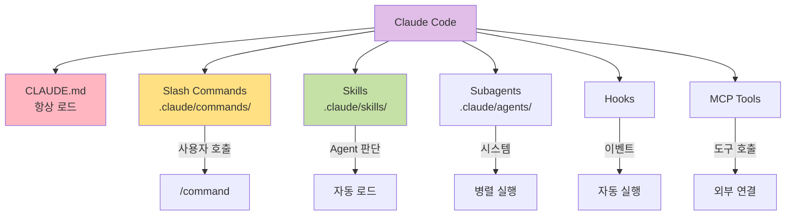
```mermaid
graph TB
    A[Claude Code] --> B[CLAUDE.md<br/>항상 로드]
    
    A --> C[Slash Commands<br/>.claude/commands/]
    A --> D[Skills<br/>.claude/skills/]
    A --> E[Subagents<br/>.claude/agents/]
    A --> F[Hooks]
    A --> G[MCP Tools]
    
    C -->|사용자 호출| C1["/command"]
    D -->|Agent 판단| D1["자동 로드"]
    E -->|시스템| E1["병렬 실행"]
    F -->|이벤트| F1["자동 실행"]
    G -->|도구 호출| G1["외부 연결"]
    
    style A fill:#E1BEE7
    style B fill:#FFB6C1
    style C fill:#FFE082
    style D fill:#C5E1A5
```

**각 레이어 설명:**

1. **CLAUDE.md**: 프로젝트의 메타 정보, 항상 로드됨
2. **Slash Commands**: 사용자가 `/명령어`로 직접 호출
3. **Skills**: Agent가 필요 시 자동 로드
4. **Subagents**: 복잡한 작업을 여러 Agent로 분산
5. **Hooks**: 이벤트 발생 시 자동 실행 (git commit, 파일 저장 등)
6. **MCP Tools**: 외부 도구/API 연결

### Antigravity 아키텍처

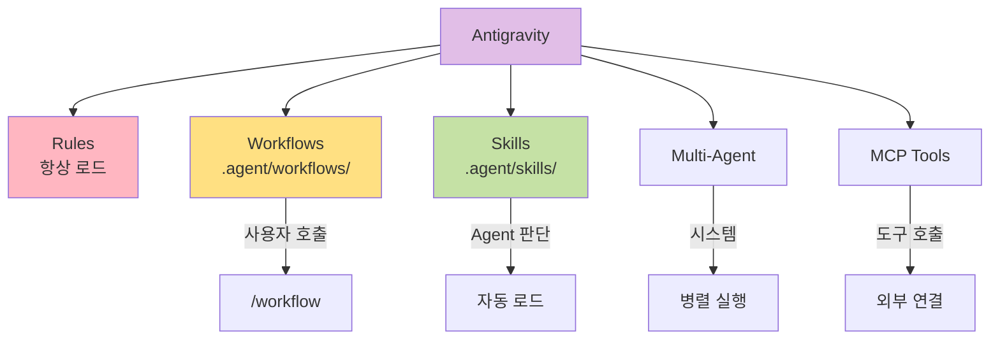
```mermaid
graph TB
    A[Antigravity] --> B[Rules<br/>항상 로드]
    
    A --> C[Workflows<br/>.agent/workflows/]
    A --> D[Skills<br/>.agent/skills/]
    A --> E[Multi-Agent]
    A --> F[MCP Tools]
    
    C -->|사용자 호출| C1["/workflow"]
    D -->|Agent 판단| D1["자동 로드"]
    E -->|시스템| E1["병렬 실행"]
    F -->|도구 호출| F1["외부 연결"]
    
    style A fill:#E1BEE7
    style B fill:#FFB6C1
    style C fill:#FFE082
    style D fill:#C5E1A5
```

**각 레이어 설명:**

1. **Rules**: 프로젝트 규칙, 항상 로드됨 (CLAUDE.md와 유사)
2. **Workflows**: 사용자가 `/명령어`로 직접 호출 (Slash Commands와 동일)
3. **Skills**: Agent가 필요 시 자동 로드 (동일)
4. **Multi-Agent**: 여러 Agent를 동시에 실행
5. **MCP Tools**: 외부 도구/API 연결 (동일)

### 정확한 매핑표

| 역할 | Claude Code | Antigravity | 호출 방식 | 용도 |
|------|-------------|-------------|----------|------|
| **프로젝트 규칙** | CLAUDE.md | Rules (GEMINI.md) | 자동 로드 | 코딩 스타일, 제약사항 |
| **사용자 호출** | **Slash Commands** | **Workflows** | `/명령어` | 배포, 테스트, 리뷰 등 |
| **Agent 자동 로드** | **Skills** | **Skills** | Agent 판단 | 전문 지식, Best Practice |
| **외부 도구** | MCP Tools | MCP Tools | 도구 호출 | API, DB, 서비스 연동 |
| **병렬 실행** | Subagents | Multi-Agent | 시스템 자동 | 복잡한 작업 분산 |
| **이벤트 기반** | Hooks | - | 이벤트 발생 | Git, 파일 변경 감지 |

**핵심 포인트:**
- **Slash Commands = Workflows** (이름만 다름, 기능 동일)
- **Skills** (양쪽 동일, 오픈 스탠다드)
- **MCP** (양쪽 동일, 표준 프로토콜)

### 계층 구조

모든 AI Agent 도구는 비슷한 계층 구조를 따릅니다:

```mermaid
graph TB
    L1["Rules / CLAUDE.md<br/>'항상 이 규칙 따라라'<br/>→ 모든 대화에 자동 적용"]
    
    L2["Slash Commands / Workflows<br/>'내가 시키면 이 작업 해라'<br/>→ 사용자가 /명령어로 호출<br/>→ 부작용 있는 작업"]
    
    L3["Skills<br/>'필요하면 이 지식 참고해라'<br/>→ Agent가 자동 판단하여 로드<br/>→ 전문 지식, Best Practice"]
    
    L4["MCP Tools<br/>'실제 실행 함수'<br/>→ 파일 읽기, DB 쿼리, API 호출"]
    
    L1 --> L2
    L2 --> L3
    L3 --> L4
    
    style L1 fill:#FFB6C1
    style L2 fill:#FFE082
    style L3 fill:#C5E1A5
    style L4 fill:#BBDEFB
```

**계층별 특징:**

1. **최상위 (Rules)**: 절대적인 규칙, 예외 없이 항상 적용
2. **2단계 (Commands/Workflows)**: 명시적 호출, 예측 가능
3. **3단계 (Skills)**: 자동 로드, 유연함
4. **최하위 (MCP Tools)**: 실제 실행, 도구의 "손"

### 실전 조합 예시

**시나리오: 프로덕션 배포**

```
1. Rules (자동 적용)
   - "배포 전 반드시 테스트 통과"
   - "main 브랜치에만 배포 가능"

2. Workflow (사용자 호출)
   - /deploy → 배포 프로세스 시작

3. Skills (자동 로드)
   - git Skill: Conventional Commits 확인
   - testing Skill: 테스트 커버리지 검증
   - deployment Skill: 배포 Best Practice

4. MCP Tools (실제 실행)
   - bash: npm run test
   - git: git push origin main
   - vercel API: vercel --prod
```

### 슬라이드 요약

> **Slash Commands = Workflows** (같은 개념)
> 
> **Skills** = 별도 개념 (Agent 자동 로드)
> 
> 💡 **MCP는 공통 표준**

---

# 4. Agent Skills 표준 아키텍처

---

## 4-1. 왜 표준이 필요했나?

### 문제 상황 (2023년)

2023년까지 AI 도구들은 각자 다른 방식으로 외부 도구와 연동했습니다:

```mermaid
graph TB
    subgraph "AI 도구 난립"
        A1[ChatGPT] --> A2[독자 API]
        B1[Claude] --> B2[독자 API]
        C1[Gemini] --> C2[독자 API]
        D1[Copilot] --> D2[독자 API]
    end
    
    E["😫 문제점"] --> F["도구마다 다른<br/>연동 방식"]
    E --> G["플러그인<br/>중복 개발"]
    E --> H["벤더 종속<br/>(Lock-in)"]
    E --> I["호환성 없음"]
    
    style E fill:#FFB6C1
```

**구체적인 문제들:**

1. **중복 개발**: Notion 연동을 ChatGPT, Claude, Gemini 각각 따로 개발
2. **벤더 종속**: ChatGPT용으로 만든 플러그인은 Claude에서 사용 불가
3. **유지보수 악몽**: AI 도구가 업데이트되면 모든 플러그인을 다시 수정
4. **학습 비용**: 도구마다 다른 API를 배워야 함

### USB 비유

이 문제는 USB 등장 이전의 컴퓨터 주변기기 상황과 유사합니다:

```mermaid
graph LR
    subgraph "USB 이전 😫"
        P1[프린터] --> C1[프린터 케이블]
        S1[스캐너] --> C2[스캐너 케이블]
        M1[마우스] --> C3[PS/2 포트]
        K1[키보드] --> C4[DIN 포트]
    end
    
    subgraph "USB 이후 😊"
        E1[프린터] --> F[USB]
        E2[스캐너] --> F
        E3[마우스] --> F
        E4[키보드] --> F
    end
    
    style F fill:#90EE90
```

**USB 이전:**
- 각 기기마다 다른 포트, 다른 케이블
- 호환성 없음
- 확장성 제한

**USB 이후:**
- 하나의 표준 인터페이스
- 모든 기기가 호환
- 무한 확장 가능

### MCP = AI의 USB

```mermaid
graph TB
    A["MCP = AI 세계의 USB"] --> B["모든 AI"]
    B --> C[MCP<br/>표준 프로토콜]
    C --> D["모든 도구"]
    
    style C fill:#90EE90
```

MCP(Model Context Protocol)는 이 문제를 해결하기 위해 탄생했습니다:

- **2024년 11월**: Anthropic이 MCP를 오픈소스로 공개
- **2025년 초**: 주요 AI 플랫폼들이 채택 시작
- **2025년 12월**: Linux Foundation에 기부, AAIF 설립

**MCP의 약속:**
> "한 번 만들면 모든 AI 도구에서 사용 가능"

### 슬라이드 요약

> **문제: AI마다 다른 연동 방식**
> 
> 중복 개발, 벤더 종속, 호환성 없음
> 
> **해결: MCP = AI 세계의 USB**

---

## 4-2. MCP (Model Context Protocol)

### 정의

**MCP = AI Agent가 외부 도구/데이터에 접근하는 표준 프로토콜**

MCP는 AI와 외부 세계를 연결하는 "다리" 역할을 합니다. AI가 파일 시스템, 데이터베이스, API, 서비스 등과 상호작용할 수 있게 해주는 표준화된 방법입니다.

### 아키텍처

MCP의 기본 구조를 이해해봅시다:

```mermaid
graph TB
    subgraph "MCP 아키텍처"
        A["AI 호스트<br/>(Claude Desktop, Antigravity, VS Code 등)"]
        
        A -->|MCP Protocol| B[MCP Server<br/>날씨]
        A -->|MCP Protocol| C[MCP Server<br/>Slack]
        A -->|MCP Protocol| D[MCP Server<br/>DB]
        
        B --> B1[Weather API]
        C --> C1[Slack API]
        D --> D1[Database]
    end
    
    style A fill:#E1BEE7
    style B fill:#BBDEFB
    style C fill:#BBDEFB
    style D fill:#BBDEFB
```

**구성 요소:**

1. **AI 호스트**: Claude Desktop, Antigravity 등 AI를 실행하는 프로그램
2. **MCP Protocol**: 표준화된 통신 방식 (JSON-RPC 기반)
3. **MCP Server**: 실제 작업을 수행하는 서버 (개발자가 만듦)
4. **외부 서비스**: Weather API, Slack, DB 등

**작동 방식:**

1. AI가 날씨 정보가 필요함을 인식
2. MCP Protocol로 "날씨" MCP Server에 요청
3. MCP Server가 Weather API 호출
4. 결과를 MCP Protocol로 AI에게 전달
5. AI가 결과를 사용자에게 자연어로 설명

### MCP가 제공하는 것

MCP Server는 세 가지 유형의 기능을 제공합니다:

```mermaid
mindmap
  root((MCP))
    Tools
      AI가 호출하는 함수
      get_weather
      send_message
    Resources
      AI가 읽는 데이터
      파일 내용
      DB 스키마
    Prompts
      재사용 템플릿
      코드 리뷰 양식
```

#### 1. Tools - 실행 가능한 함수

Tools는 AI가 "행동"할 수 있게 해줍니다:

```python
# Weather MCP Server 예시
async def get_weather(city: str) -> str:
    """특정 도시의 현재 날씨를 조회합니다."""
    # Weather API 호출
    response = await weather_api.get(city)
    return f"{city}의 현재 날씨: {response.temp}°C, {response.condition}"
```

**특징:**
- 함수처럼 호출 가능
- 매개변수와 반환값 정의
- AI가 상황에 맞게 선택하여 실행

#### 2. Resources - 읽기 전용 데이터

Resources는 AI가 "참고"할 수 있는 정보입니다:

```python
async def read_file(path: str) -> str:
    """파일 내용을 반환합니다."""
    with open(path, 'r') as f:
        return f.read()
```

**특징:**
- 데이터 소스에 대한 읽기 접근
- URI 형식으로 식별 (`file://`, `db://` 등)
- AI가 필요한 정보를 찾아 읽을 수 있음

#### 3. Prompts - 재사용 가능한 템플릿

Prompts는 일관된 작업을 위한 템플릿입니다:

```python
async def code_review_prompt(file: str) -> str:
    """코드 리뷰 프롬프트를 반환합니다."""
    return f"""
    다음 관점에서 {file}을 리뷰해주세요:
    1. 보안 취약점
    2. 성능 이슈
    3. 코드 품질
    """
```

**특징:**
- 미리 정의된 프롬프트 템플릿
- 일관성 있는 작업 수행
- 팀 전체가 동일한 품질 기준 적용

### 2026년 현재 상황

MCP는 빠르게 성장하고 있습니다:

```mermaid
graph TB
    A[MCP 생태계] --> B["✅ 10,000개+<br/>활성 MCP 서버"]
    A --> C["✅ 9,700만+<br/>월간 SDK 다운로드"]
    A --> D["✅ 모든 주요<br/>AI 플랫폼 지원"]
    A --> E["✅ Linux Foundation<br/>기부 (AAIF 설립)"]
    
    style A fill:#90EE90
```

**주요 MCP Server 예시:**
- **파일 시스템**: 로컬 파일 읽기/쓰기
- **Git**: 저장소 관리, 커밋, 푸시
- **Slack**: 메시지 전송, 채널 관리
- **PostgreSQL**: 데이터베이스 쿼리
- **Google Drive**: 문서 접근
- **GitHub**: 이슈, PR 관리
- **날씨**: 기상 정보 조회

### 왜 중요한가?

MCP가 AI Agent 생태계에 미치는 영향:

1. **개발자 입장**:
   - 한 번 만들면 모든 AI에서 사용 가능
   - 기존 API를 MCP로 래핑하기만 하면 됨
   - 표준 SDK 제공으로 개발 쉬움

2. **사용자 입장**:
   - AI가 할 수 있는 일이 폭발적으로 증가
   - 자신의 데이터/서비스를 AI와 안전하게 연결
   - 벤더 종속 없이 자유롭게 도구 선택

3. **생태계 입장**:
   - 커뮤니티 기여로 빠른 성장
   - 표준화로 품질 향상
   - 상호운용성으로 혁신 가속

### 슬라이드 요약

> **MCP = AI ↔ 외부 세계 표준 인터페이스**
> 
> Tools (함수) + Resources (데이터) + Prompts (템플릿)
> 
> 💡 **한 번 만들면 모든 AI에서 사용**

---

## 4-3. Skills가 표준이 된 이유

### MCP vs Skills

MCP와 Skills는 서로 다른 역할을 합니다:

```mermaid
graph LR
    subgraph "MCP = 공구 (Tools)"
        A["망치, 드라이버, 톱..."] --> A1["'무엇으로<br/>작업할 수 있는가'"]
    end
    
    subgraph "Skills = 기술 (Techniques)"
        B["못 박는 방법,<br/>작업 순서..."] --> B1["'어떻게<br/>잘 작업하는가'"]
    end
    
    style A fill:#BBDEFB
    style B fill:#C5E1A5
```

**비유로 이해하기:**

- **MCP = 연장 (도구)**:
  - 망치, 드라이버, 톱이 있습니다
  - 하지만 어떻게 사용하는지는 알려주지 않습니다
  - "무엇으로" 작업할 수 있는가

- **Skills = 기술 (노하우)**:
  - 못을 똑바로 박는 방법
  - 나사를 풀 때 순서
  - 목재를 자를 때 주의사항
  - "어떻게" 잘 작업하는가

### 이유 1: 재사용성

Skills가 없다면 매번 같은 설명을 반복해야 합니다:

```mermaid
graph TB
    subgraph "Skills 없이 😫"
        P1[프로젝트 A] --> E1["Word 문서<br/>만드는 법 설명..."]
        P2[프로젝트 B] --> E2["Word 문서<br/>만드는 법 설명... ← 반복!"]
        P3[프로젝트 C] --> E3["Word 문서<br/>만드는 법 설명... ← 반복!"]
        style E1 fill:#FFB6C1
        style E2 fill:#FFB6C1
        style E3 fill:#FFB6C1
    end
    
    subgraph "Skills 사용 😊"
        D["SKILL.md<br/>(한 번 정의)"] --> F[프로젝트 A: '문서 만들어줘' ✅]
        D --> G[프로젝트 B: '문서 만들어줘' ✅]
        D --> H[프로젝트 C: '문서 만들어줘' ✅]
        style D fill:#90EE90
        style F fill:#C5E1A5
        style G fill:#C5E1A5
        style H fill:#C5E1A5
    end
```

**Skills 없이:**
- 프로젝트마다 "Word 문서 만들 때는 docx-js 라이브러리 사용하고, 페이지 크기는 Letter로..." 반복
- 일관성 없음 (프로젝트마다 다른 방법 사용)
- 유지보수 어려움 (한 곳 수정하면 모든 곳 수정 필요)

**Skills 사용:**
- docx Skill 하나만 정의
- 모든 프로젝트에서 재사용
- 일관된 품질
- 한 곳만 수정하면 모든 곳에 적용

### 이유 2: 전문성 캡슐화

복잡한 전문 지식을 Skill로 패키징할 수 있습니다:

```mermaid
graph TB
    A["docx SKILL"] --> B["• docx-js 라이브러리 사용법"]
    A --> C["• 페이지 크기 설정<br/>(Letter vs A4)"]
    A --> D["• 표 만들 때 주의사항"]
    A --> E["• 이미지 삽입 방법"]
    A --> F["• 흔한 오류와 해결법"]
    
    G["→ 이 모든 지식이<br/>SKILL.md 하나에!"] --> H["AI는 매번 새로 배우지 않고,<br/>Skill만 읽으면 됨"]
    
    style A fill:#E1BEE7
    style G fill:#FFE082
    style H fill:#90EE90
```

**docx Skill 예시:**

```markdown
---
name: docx
description: Professional Word document creation
---

# Word Document Skill

## Library Selection
- Use python-docx for .docx files
- Install: pip install python-docx

## Page Setup
- Default: Letter size (8.5" x 11")
- Europe: A4 size
- Margins: 1 inch all sides

## Common Pitfalls
- ❌ Don't use docx.Document() without template
- ✅ Do use add_paragraph() for text
- ❌ Don't forget to call save()

## Table Best Practices
- Always set table style
- Use autofit for column widths
- Add borders for readability
```

**장점:**
- 전문가의 노하우를 코드화
- Best Practice 강제
- 실수 방지

### 이유 3: 생태계 확장

Skills는 커뮤니티 기여를 활성화합니다:

```mermaid
graph TB
    A[AI Agent] --> B[Skill A<br/>내장]
    A --> C[Skill B<br/>커뮤니티]
    A --> D[Skill C<br/>기업]
    
    B --> E[MCP Server]
    C --> F[MCP Server]
    D --> G[MCP Server]
    
    H["누구나 Skill을<br/>만들고 공유"] --> I["무한 확장 가능한<br/>생태계"]
    
    style A fill:#E1BEE7
    style H fill:#FFE082
    style I fill:#90EE90
```

**생태계 예시:**

1. **Official Skills** (제공사):
   - docx, pptx, xlsx - Microsoft Office
   - pdf - PDF 처리
   - web-search - 웹 검색

2. **Community Skills** (커뮤니티):
   - notion-integration - Notion 연동
   - figma-to-code - Figma 디자인 → 코드
   - jira-automation - JIRA 자동화
   - translation - 다국어 번역

3. **Enterprise Skills** (기업 내부):
   - company-erp - 사내 ERP 연동
   - security-policy - 보안 정책 준수
   - compliance-check - 규정 준수 검사

**마켓플레이스 예상:**
- 앱스토어처럼 Skill을 검색, 설치, 평가
- 무료/유료 Skill 공존
- 품질 인증 시스템

### 슬라이드 요약

> **Skills가 표준이 된 3가지 이유**
> 
> 1. **재사용성**: 한 번 정의, 어디서나 사용
> 2. **전문성**: 복잡한 지식을 패키징
> 3. **확장성**: 누구나 만들고 공유

---

## 4-4. MCP + Skills 통합 아키텍처

### 완전한 구조

MCP와 Skills가 어떻게 협력하는지 살펴봅시다:

```mermaid
graph TB
    A[AI Agent] --> B[Skill<br/>docx]
    A --> C[Skill<br/>xlsx]
    A --> D[Skill<br/>custom]
    
    B -->|"'어떻게'"| E[MCP<br/>파일]
    C -->|"'어떻게'"| F[MCP<br/>DB]
    D -->|"'어떻게'"| G[MCP<br/>Slack]
    
    E -->|"'무엇에'"| H[파일 시스템]
    F -->|"'무엇에'"| I[데이터베이스]
    G -->|"'무엇에'"| J[Slack API]
    
    style A fill:#E1BEE7
    style B fill:#C5E1A5
    style C fill:#C5E1A5
    style D fill:#C5E1A5
    style E fill:#BBDEFB
    style F fill:#BBDEFB
    style G fill:#BBDEFB
```

**역할 분담:**

- **Skills**: "어떻게" 처리할지 알려줌
  - docx Skill: "Word 문서는 이렇게 만들어"
  - xlsx Skill: "Excel은 이런 패턴으로"
  
- **MCP**: "무엇에" 접근할지 제공
  - 파일 시스템 MCP: 실제로 파일 저장
  - DB MCP: 실제로 데이터 쿼리

### 실제 예시

사용자 요청부터 완료까지의 전체 흐름:

```mermaid
sequenceDiagram
    participant U as 사용자
    participant A as Agent
    participant S as xlsx Skill
    participant M as 파일 시스템 MCP
    
    U->>A: "이 데이터를<br/>Excel 파일로 만들어줘"
    
    A->>A: xlsx Skill 필요 판단
    A->>S: Skill 로드
    S->>A: "어떻게" Excel을<br/>잘 만드는지 학습
    
    A->>A: Skill 지침에<br/>따라 코드 생성
    Note over A: 표 구조, 스타일링,<br/>수식 등
    
    A->>M: 파일 저장 요청
    M->>U: "무엇에" 접근<br/>(파일 경로)
    
    Note over U: Artifact로<br/>결과 전달
```

**단계별 설명:**

1. **사용자 요청**: "이 데이터를 Excel로 만들어줘"
2. **Skill 판단**: Agent가 xlsx Skill이 필요하다고 인식
3. **Skill 로드**: xlsx Skill의 SKILL.md 파일 읽기
4. **지침 학습**: 
   - 어떤 라이브러리 사용? (openpyxl)
   - 표는 어떻게? (헤더 스타일, 자동 너비)
   - 수식은? (SUM, AVERAGE 패턴)
5. **코드 생성**: Skill 가이드에 따라 Python 코드 작성
6. **MCP 호출**: 파일 시스템 MCP로 실제 저장
7. **결과 전달**: 생성된 Excel 파일을 Artifact로 제공

### 실제 코드 예시

**xlsx Skill (SKILL.md):**

```markdown
---
name: xlsx
description: Professional Excel spreadsheet creation
---

# Excel Skill

## Library
Use openpyxl for .xlsx files

## Table Structure
- Always include headers
- Apply header style (bold, background color)
- Auto-fit column widths

## Formulas
- SUM: =SUM(A1:A10)
- AVERAGE: =AVERAGE(B1:B10)
- Always use cell references, not hardcoded values
```

**Agent가 생성하는 코드:**

```python
from openpyxl import Workbook
from openpyxl.styles import Font, PatternFill

# xlsx Skill 가이드 따름
wb = Workbook()
ws = wb.active

# 헤더 추가 (Skill: "Always include headers")
headers = ["Name", "Score", "Grade"]
ws.append(headers)

# 헤더 스타일 (Skill: "Apply header style")
for cell in ws[1]:
    cell.font = Font(bold=True)
    cell.fill = PatternFill(start_color="CCCCCC", fill_type="solid")

# 데이터 추가
data = [["Alice", 95, "=B2/10"], ["Bob", 87, "=B3/10"]]
for row in data:
    ws.append(row)

# MCP를 통해 저장
wb.save("output.xlsx")
```

### 상호 보완 관계

MCP와 Skills는 **상호 보완적**입니다:

| 측면 | MCP | Skills | 결합 효과 |
|------|-----|--------|----------|
| **기능** | 도구 제공 | 사용법 제공 | 완전한 솔루션 |
| **확장** | 새 도구 추가 | 새 패턴 추가 | 무한 확장 가능 |
| **품질** | 접근 가능성 | Best Practice | 높은 품질 보장 |
| **학습** | API 문서 | 사용 가이드 | 빠른 학습 곡선 |

**둘 다 필요한 이유:**
- MCP만 있으면: 도구는 있지만 어떻게 쓸지 모름
- Skills만 있으면: 방법은 알지만 실행 불가
- MCP + Skills: **완벽한 조합**

### 슬라이드 요약

> **MCP + Skills = 완전한 아키텍처**
> 
> MCP: "무엇에 접근" / Skills: "어떻게 처리"
> 
> 💡 **상호 보완적 관계**

---

## 4-5. 미래 전망

### 현재 상황 (2026년 1월)

AI Agent 생태계는 빠르게 표준화되고 있습니다:

```mermaid
graph TB
    A[표준화 진행 중] --> B["✅ Claude Desktop<br/>MCP 네이티브"]
    A --> C["✅ Claude Code<br/>Skills 시스템"]
    A --> D["✅ Antigravity<br/>MCP + Skills"]
    A --> E["✅ VS Code<br/>MCP 확장"]
    A --> F["✅ MCP →<br/>Linux Foundation"]
    A --> G["🔄 Cursor, Windsurf<br/>확대 중"]
    
    style A fill:#90EE90
```

**타임라인:**
- **2024년 11월**: MCP 오픈소스 발표 (Anthropic)
- **2025년 2월**: Claude Code 출시 (Skills 시스템)
- **2025년 10월**: Agent Skills 오픈 스탠다드 선언
- **2025년 11월**: Antigravity 출시 (MCP + Skills 지원)
- **2025년 12월**: MCP → Linux Foundation 기부, AAIF 설립
- **2026년 1월**: Cursor, Windsurf 등 도구들이 적극 채택

### Skills 생태계 예상

앱스토어처럼 Skills 마켓플레이스가 등장할 것으로 예상됩니다:

```mermaid
mindmap
  root((Agent Skills<br/>Marketplace))
    Official Skills
      docx, pptx, xlsx
      pdf 처리
      웹 검색
      코드 분석
    Community Skills
      Notion 연동
      Figma 연동
      JIRA 자동화
      번역 Skill
      법률 문서 Skill
    Enterprise Skills
      사내 ERP 연동
      보안 정책 적용
      산업별 특화
```

**예상 시나리오:**

1. **검색 & 발견**:
   ```
   사용자: Skill Store에서 "Figma" 검색
   → Figma-to-React Skill 발견
   → 평점: 4.8/5.0, 다운로드: 50,000+
   ```

2. **설치 & 사용**:
   ```
   1. "Install" 버튼 클릭
   2. .agent/skills/figma-to-react/ 에 자동 설치
   3. Agent가 자동으로 인식
   4. "Figma 디자인을 React로 변환해줘" 즉시 가능
   ```

3. **업데이트 & 관리**:
   ```
   - 자동 업데이트 옵션
   - 버전 관리 (v1.2.3)
   - 의존성 자동 해결
   ```

### 개발자 준비 사항

AI Agent 시대를 준비하는 개발자가 익혀야 할 것들:

```mermaid
graph LR
    A[개발자 준비] --> B[MCP 이해<br/>표준 프로토콜 학습]
    A --> C[Skill 작성<br/>SKILL.md 형식 숙지]
    A --> D[도구 확장<br/>Custom MCP Server]
    A --> E[생태계 참여<br/>커뮤니티 Skill 기여]
    
    style A fill:#E1BEE7
```

**1. MCP 기초 학습**:
- MCP SDK 설치: `npm install @modelcontextprotocol/sdk`
- 간단한 MCP Server 만들기
- Tools, Resources, Prompts 이해

**2. Skill 작성법**:
- SKILL.md 형식 익히기
- Progressive Disclosure 원리
- Best Practice 문서화 방법

**3. 커스텀 도구 개발**:
- 자신의 API를 MCP Server로 래핑
- 사내 시스템 연동
- 테스트 및 배포

**4. 커뮤니티 참여**:
- GitHub에서 MCP Server 공유
- Skills를 오픈소스로 기여
- 다른 개발자 Skill 리뷰

### 예상되는 변화

**1년 후 (2027년):**
- Skills 마켓플레이스 정식 오픈
- 1,000개 이상의 검증된 Skills
- 기업용 Private Skills 시장 형성

**3년 후 (2029년):**
- AI Agent가 개발의 표준이 됨
- 모든 주요 IDE가 Agent 내장
- "No-Agent" 개발은 구시대 방식으로 간주

**5년 후 (2031년):**
- 대부분의 코딩이 자연어로
- 개발자는 아키텍트 역할에 집중
- Skills가 프로그래밍 언어처럼 학습 대상

### 슬라이드 요약

> **Agent Skills = AI 생태계의 핵심**
> 
> MCP 표준 위에 Skills 생태계 구축 중
> 
> 💡 **지금 배워두면 미래 경쟁력**

---

# 요약 슬라이드

---

## 핵심 정리

### 1. Artifacts & 모드

```mermaid
graph LR
    A[Artifact] --> A1["작업 증거물"]
    B[Fast Mode] --> B1["즉시 실행"]
    C[Plan Mode] --> C1["계획 → 승인 → 실행"]
    
    style A1 fill:#90EE90
    style B1 fill:#FFE082
    style C1 fill:#BBDEFB
```

- **Artifact**: 검증 가능한 산출물로 신뢰 구축
- **Fast Mode**: 간단한 작업에 적합, 빠르지만 통제력 낮음
- **Plan Mode**: 복잡한 작업에 적합, 느리지만 통제력 높음

### 2. Agent 도구 비교

```mermaid
graph TB
    subgraph "Claude Code"
        A1["CLI (터미널)"]
        A2["Skills 강력"]
        A3["Pro $20/월"]
    end
    
    subgraph "Antigravity"
        B1["GUI (IDE)"]
        B2["Multi-Agent"]
        B3["무료 quota"]
    end
    
    style A1 fill:#BBDEFB
    style B1 fill:#C5E1A5
```

- **Claude Code**: CLI 기반, Skills와 MCP 네이티브 지원, 자동화 강력
- **Antigravity**: GUI 기반, Multi-Agent 병렬 작업, 무료 시작 가능

### 3. 핵심 개념

```mermaid
graph TB
    A["Slash Commands<br/>Workflows"] -->|사용자 호출| A1["/명령어"]
    B[Skills] -->|Agent 자동| B1["전문 지식 로드"]
    C[MCP] -->|시스템| C1["외부 도구 연결"]
    
    style A fill:#FFE082
    style B fill:#C5E1A5
    style C fill:#BBDEFB
```

- **Slash Commands/Workflows**: 사용자가 직접 호출, 예측 가능
- **Skills**: Agent가 자동 판단, 전문 지식 제공
- **MCP**: 표준 프로토콜로 외부 세계 연결

### 4. 핵심 발견

```mermaid
graph TB
    A["중요한 발견"] --> B["1. Slash Commands<br/>= Workflows"]
    A --> C["2. Skills는<br/>오픈 스탠다드"]
    A --> D["3. 호출 주체가<br/>핵심 차이"]
    
    B --> B1["Claude Code와<br/>Antigravity 동일"]
    C --> C1["여러 도구에서<br/>재사용 가능"]
    D --> D1["사용자 vs Agent"]
    
    style A fill:#E1BEE7
    style B fill:#FFE082
    style C fill:#C5E1A5
    style D fill:#BBDEFB
```

### 5. 표준 아키텍처

```mermaid
graph LR
    A[MCP<br/>표준] --> C[확장 가능한<br/>AI 생태계]
    B[Skills<br/>전문성] --> C
    
    style A fill:#BBDEFB
    style B fill:#C5E1A5
    style C fill:#90EE90
```

- **MCP + Skills**: 상호 보완적 관계
- **MCP**: "무엇에" 접근 (도구)
- **Skills**: "어떻게" 처리 (노하우)

---

## 최종 메시지

```mermaid
mindmap
  root((핵심 Take-away))
    1. Agent
      스스로 계획-실행-검증
    2. Artifacts
      신뢰의 기반
      투명성
    3. Slash Commands/Workflows
      사용자 호출
      자동화
    4. Skills
      Agent 자동 로드
      전문 지식
    5. MCP
      AI 연동 표준
      USB처럼
    6. 호출 주체
      핵심 차이
      사용자 vs Agent
    7. 미래 경쟁력
      지금 배우기
```

**마지막 조언:**

1. **시작하세요**: Antigravity(무료)로 오늘 바로 시작
2. **실험하세요**: Fast/Plan Mode를 상황에 맞게 활용
3. **확장하세요**: MCP Server를 만들어 Agent의 능력 확장
4. **공유하세요**: Skills를 만들고 커뮤니티에 기여
5. **준비하세요**: AI Agent가 표준이 되는 미래를 대비

---

- *문서 작성일: 2026-01-24*
- *버전: 3.0 (설명 대폭 보강 + Mermaid 오류 수정)*
- *용도: PPT 변환용 교육 자료 - 완전판*
