## 관련글

[**Agentic AI Design Patterns(2026 Edition)**](https://medium.com/@dewasheesh.rana/agentic-ai-design-patterns-2026-ed-e3a5125162c5)

## 개요: 패러다임의 전환

Agentic AI는 단순한 기능이 아니라 근본적인 아키텍처 패러다임의 전환을 의미합니다. 2024년부터 2026년까지 프로덕션 환경에서 발생한 대부분의 AI 시스템 실패는 모델의 품질 문제가 아닌 아키텍처 설계의 구조적 결함에서 비롯되었습니다. 무제한적 자율성, 상태 제어 부재, 실패 복구 메커니즘 결여, 관찰 가능성 부족, 거버넌스 체계 미흡 등이 주요 원인으로 지적됩니다.

Agentic 패턴의 존재 이유는 단순히 추론 능력을 향상시키는 것이 아니라, 이러한 아키텍처 리스크를 체계적으로 해결하는 데 있습니다. 이는 마치 마이크로서비스 아키텍처가 모놀리식 시스템의 한계를 극복했던 것과 유사한 진화입니다.

## 멘탈 모델의 진화: LLM에서 시스템으로

### 기존의 단순한 관점

과거에는 AI 시스템을 다음과 같이 선형적으로 이해했습니다:

```
사용자 → 프롬프트 → LLM → 응답
```

### 2026년 아키텍트급 멘탈 모델

현대적인 Agentic 시스템은 다음과 같은 계층적 구조로 설계됩니다:

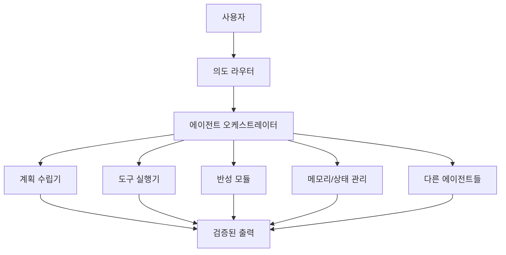

이러한 관점의 전환에서 중요한 것은:

- **LLM은 CPU**입니다: 기본적인 연산 단위
- **에이전트는 프로세스**입니다: 특정 목적을 위한 실행 단위
- **Agentic 프레임워크는 운영체제**입니다: 전체 시스템을 조율하고 관리하는 기반

## 8계층 Agentic AI 아키텍처

Agentic AI 시스템은 다음과 같이 8개의 논리적 계층으로 구성됩니다:

### Layer 1: Infrastructure Layer (인프라 계층)

최하위 계층으로 시스템의 물리적 기반을 제공합니다:

- **API 서비스**: REST API, GraphQL 등 통신 인터페이스
- **컴퓨팅 자원**: GPU, TPU, Cloud 인프라
- **데이터 센터**: 물리적 서버 및 네트워크
- **오케스트레이션 엔진**: Airflow, Prefect 등 워크플로우 관리
- **스토리지**: S3, GCS 등 대용량 저장소
- **로드 밸런서**: 트래픽 분산 및 고가용성 보장
- **CDN**: 콘텐츠 전송 네트워크
- **모니터링 도구**: Prometheus, Grafana 등

### Layer 2: Agent Internet Layer (에이전트 인터넷 계층)

에이전트 간 통신과 협업을 가능하게 하는 계층입니다:

- **자율 에이전트**: 독립적으로 작동하는 에이전트 인스턴스
- **멀티 에이전트 시스템**: 여러 에이전트의 협업 구조
- **통신 프로토콜**: 에이전트 간 메시지 교환 규약
- **에이전트 메모리**: 단기/장기 메모리 관리
- **임베딩 저장소**: Pinecone, Weaviate 등 벡터 데이터베이스
- **에이전트 메시 네트워크**: 분산된 에이전트 네트워크
- **실행 환경**: 에이전트가 동작하는 컨텍스트
- **도구 사용 모듈**: 에이전트가 활용할 수 있는 도구 세트

### Layer 3: Protocol Layer (프로토콜 계층)

에이전트 간 상호작용을 표준화하는 계층입니다:

- **A2A (Agent-to-Agent Protocol)**: 에이전트 간 직접 통신
- **MCP (Model Context Protocol)**: 모델 컨텍스트 공유
- **ACP (Agent Capability Protocol)**: 에이전트 능력 정의
- **ANP (Agent Negotiation Protocol)**: 에이전트 간 협상
- **AGORA**: 에이전트 그룹 조율 및 자원 할당
- **AGP (Agent Gateway Protocol)**: 에이전트 게이트웨이
- **TAP (Tool Abstraction Protocol)**: 도구 추상화
- **OAP (Open Agent Protocol)**: 개방형 에이전트 표준
- **FCP (Function Call Protocol)**: 함수 호출 규약

### Layer 4: Tooling Layer (도구 계층)

에이전트가 실제 작업을 수행하기 위한 도구들입니다:

- **RAG (Retrieval-Augmented Generation)**: 정보 검색 및 증강
- **Vector DBs**: Chroma, FAISS 등 벡터 데이터베이스
- **외부 도구 사용**: API 호출, 웹 스크래핑 등
- **함수 호출**: OpenAI Tools, LangChain Tools
- **환경 인터페이스**: 외부 시스템과의 연결
- **코드 실행 샌드박스**: 안전한 코드 실행 환경
- **브라우징 모듈**: 웹 탐색 및 정보 수집
- **계산기/Python REPL**: 수학적 계산 도구
- **지식 베이스**: 구조화된 지식 저장소
- **플러그인 통합 계층**: 다양한 플러그인 지원

### Layer 5: Cognition Layer (인지 계층)

에이전트의 사고 과정을 담당하는 계층입니다:

- **Planning (계획 수립)**: 작업 분해 및 순서 결정
- **Decision Making (의사결정)**: 최적의 행동 선택
- **Self-Improvement (자기 개선)**: 학습 및 성능 향상
- **Error Handling (오류 처리)**: 예외 상황 대응
- **Reasoning (추론)**: 논리적 사고 및 추론
- **Reactivity Adaptation (반응성 적응)**: 환경 변화에 대한 적응
- **Goal Management (목표 관리)**: 목표 설정 및 추적
- **Guardrails Ethics Engine (윤리 엔진)**: 윤리적 제약 준수
- **Feedback Loop (피드백 루프)**: 결과 평가 및 개선
- **Multi-Step Task Handling (다단계 작업 처리)**: 복잡한 작업 분할 실행

### Layer 6: Memory Layer (메모리 계층)

에이전트의 학습과 맥락 유지를 담당합니다:

- **Working Memory (작업 메모리)**: 현재 작업의 임시 정보
- **Long-Term Memory (장기 메모리)**: 영구 저장 정보
- **Identity Module (정체성 모듈)**: 에이전트 고유 특성
- **Preference Engine (선호도 엔진)**: 사용자 선호도 학습
- **Conversation History (대화 이력)**: 과거 대화 기록
- **Behavior Modeling (행동 모델링)**: 패턴 학습 및 예측
- **Emotional Context Storage (감정 컨텍스트 저장)**: 감정 상태 추적
- **Goal History Tracking (목표 이력 추적)**: 목표 달성 기록
- **Tool Usage History (도구 사용 이력)**: 도구 사용 패턴

### Layer 7: Application Layer (응용 계층)

실제 사용자 대면 애플리케이션들입니다:

- **개인 비서**: 일정 관리, 알림 등
- **AI 코드 어시스턴트**: 코드 생성, 디버깅 지원
- **엔터테인먼트 에이전트**: 게임, 음악, 스토리텔링
- **이커머스 에이전트**: 추천, 구매 지원
- **연구 에이전트**: 정보 수집 및 분석
- **스케줄링 자동화 봇**: 자동 일정 조율
- **학습 에이전트**: 교육 콘텐츠 제공
- **협업 문서 에이전트**: 문서 공동 작업
- **플랫폼 에이전트**: Slack, Discord, Notion 통합
- **보안 감시 에이전트**: 위협 탐지 및 대응

### Layer 8: Governance Layer (거버넌스 계층)

시스템의 안전성과 규정 준수를 보장합니다:

- **배포 파이프라인**: CI/CD 자동화
- **비용 최적화**: 리소스 사용량 모니터링
- **모니터링 도구**: 시스템 상태 추적
- **No-Code/Low-Code Builders**: 비개발자 친화적 도구
- **관찰 도구**: Observability Tools
- **거버넌스 정책 엔진**: 정책 자동 적용
- **데이터 프라이버시 강제**: GDPR, CCPA 준수
- **리소스 관리**: 할당량, 예산 관리
- **에이전트 레지스트리 디스커버리**: 에이전트 등록 및 검색
- **로깅 감사**: 모든 행동 기록
- **신뢰 프레임워크**: 신뢰성 검증 체계

## 정식 아키텍처 계층 모델

각 계층의 책임을 명확히 정의하면:

| 계층 | 책임 |
|------|------|
| Interface Layer | Chat, API, UI |
| Intent Layer | 분류 및 라우팅 |
| Agent Control Plane | 오케스트레이션 및 생명주기 관리 |
| Reasoning Layer | 계획 수립, 반성 |
| Execution Layer | 도구, API, 워크플로우 |
| Knowledge Layer | RAG, 메모리, 임베딩 |
| Governance Layer | 안전성, 제한, 감사 |
| Infra Layer | 스케일링, 재시도, 비용 관리 |

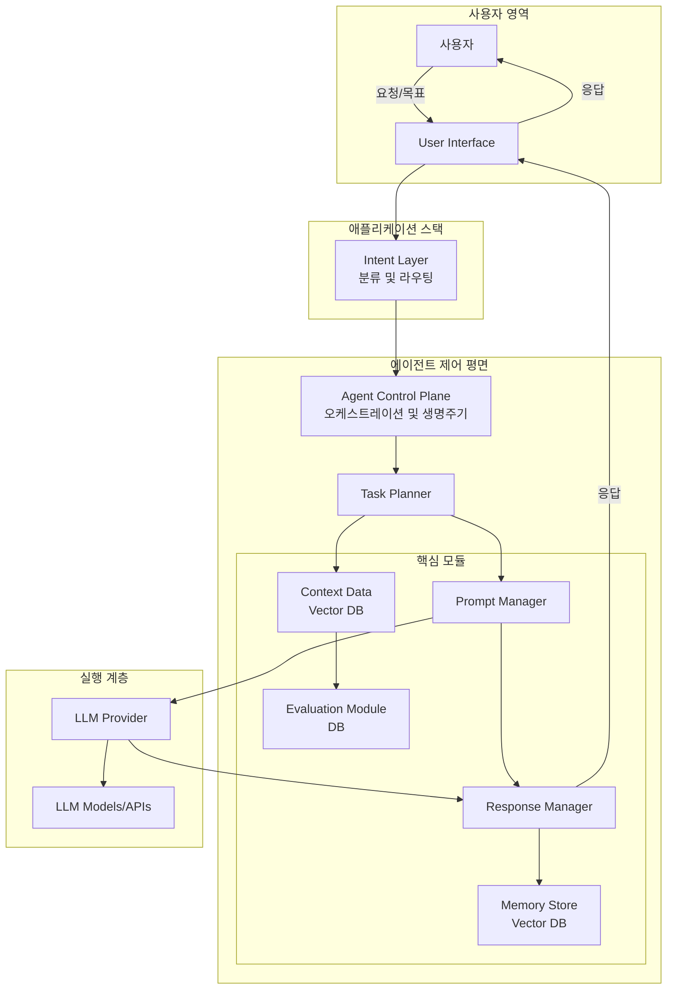

## 4가지 핵심 Agentic 디자인 패턴

### 1. Reflection 패턴: 품질 관리 패턴

Reflection은 지능을 높이기 위한 것이 아니라 **리스크를 줄이기 위한** 패턴입니다.

#### 아키텍처적 목적

| Reflection 없이 | Reflection과 함께 |
|-----------------|-------------------|
| 환각(Hallucination) | 자기 수정 |
| 조용한 오류 | 명시적 비평 |
| 비결정성 | 수렴하는 출력 |

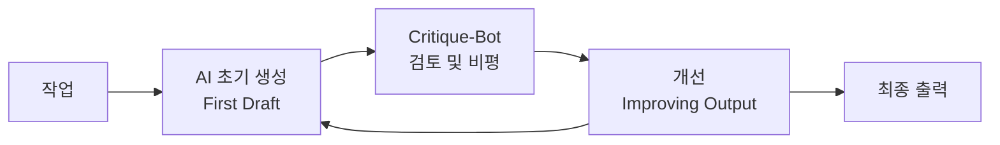

#### 반드시 사용해야 하는 경우

- **코드 생성**: 구문 오류, 논리 버그 검증
- **법률/규정 준수 텍스트**: 정확성이 필수적인 경우
- **RAG 답변**: 출처와 내용의 일치성 검증
- **금융 로직**: 계산 정확성 보장

#### 사용하지 말아야 하는 경우

- **실시간 지연 경로**: 응답 시간이 중요한 경우
- **결정론적 파이프라인**: 이미 검증된 프로세스
- **단순 데이터 변환**: 오버헤드가 불필요한 경우

#### 엔터프라이즈 패턴

Reflection을 내부 QA 에이전트로 구현합니다:

```
주 에이전트 생성 → QA 에이전트 검증 → 피드백 → 재생성 → 승인
```

이는 소프트웨어 개발의 코드 리뷰 프로세스와 유사한 구조입니다.

#### 프레임워크 지원

- **LangGraph**: `StateGraph`에서 반성 노드 구현
- **CrewAI**: 전용 Reviewer 에이전트 역할
- **AutoGen**: 멀티 에이전트 대화로 구현

### 2. Tool Use 패턴: 능력 확장 패턴

Tool Use는 LLM을 조언자에서 **운영자로 전환**시키는 패턴입니다.

#### 아키텍처적 목적

정확성이 중요한 경우, LLM은 직접 계산해서는 안 됩니다. 대신 적절한 도구를 호출해야 합니다.

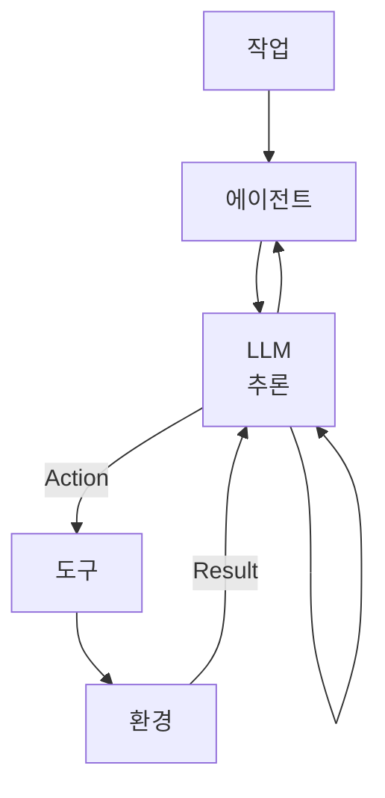

#### 도구를 사용해야 하는 작업

- **수학 계산**: Python, 계산기
- **검색**: Google Search, Wikipedia API
- **데이터베이스 쿼리**: SQL, NoSQL 인터페이스
- **인프라 작업**: Kubernetes, AWS CLI
- **파일 작업**: 읽기, 쓰기, 변환

#### 프로덕션 리스크 및 해결책

| 리스크 | 해결책 |
|--------|--------|
| 무한 루프 | 최대 반복 횟수 제한 설정 |
| 비용 폭발 | 도구 호출당 비용 추적 및 예산 설정 |
| 보안 위험 | 도구 실행 샌드박스 환경 구축 |
| 도구 실패 | 재시도 로직 및 대체 도구 준비 |

#### 아키텍트 규칙

정확성이 중요하면 LLM이 직접 계산하지 않고 도구를 사용해야 합니다. 이는 "측정하지 말고, 검증하라"는 원칙과 일맥상통합니다.

### 3. Planning 패턴: 인지 부하 관리 패턴

Planning은 **인지적 엔트로피를 줄이는** 패턴입니다.

#### 아키텍처적 관점

Planning은 다음과 동등합니다:

- **DAG(Directed Acyclic Graph) 생성**: 작업 의존성 그래프
- **워크플로우 정의**: 실행 순서 명시
- **상태 머신 생성**: 상태 전이 규칙 정의

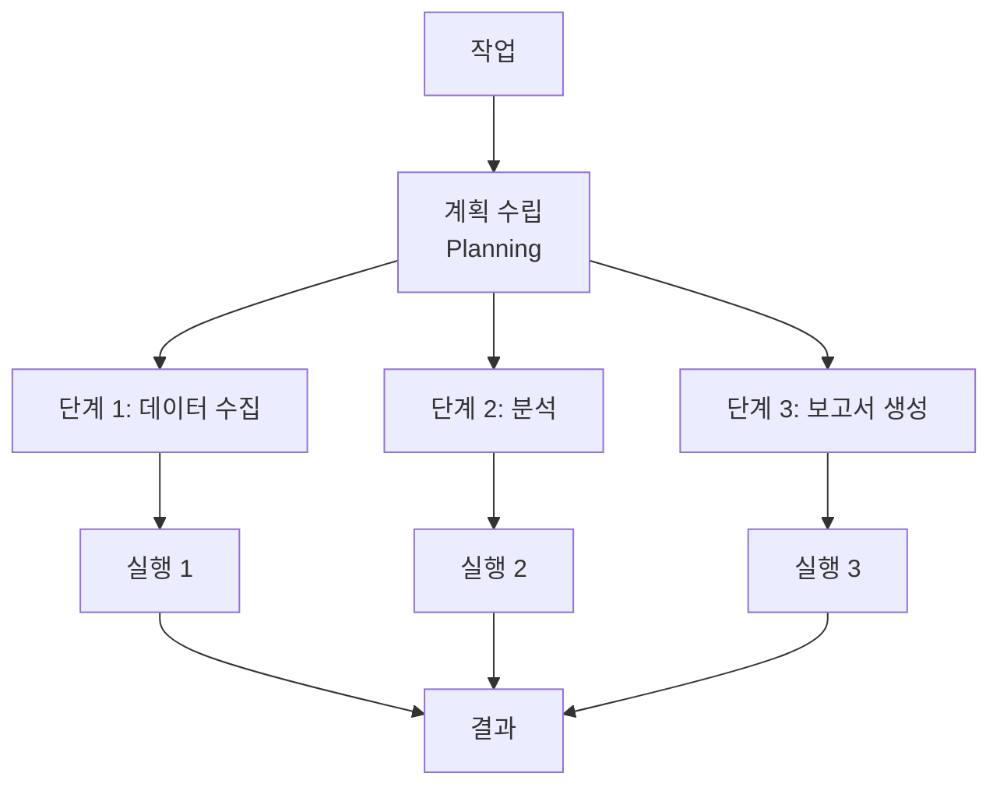

#### ReAct vs ReWOO 비교

| 특성 | ReAct | ReWOO |
|------|-------|-------|
| 초점 | 행동(Action) | 지식(Knowledge) |
| 최적 용도 | 실행 중심 작업 | 연구 중심 작업 |
| 리스크 | 방황(Thrashing) | 과도한 추론 |

**ReAct (Reasoning + Acting)**: 생각하고 행동하는 과정을 반복합니다.
```
사고 → 행동 → 관찰 → 사고 → 행동 → 관찰 → ...
```

**ReWOO (Reasoning WithOut Observation)**: 먼저 완전한 계획을 수립한 후 실행합니다.
```
전체 계획 수립 → 순차적 실행 → 결과 종합
```

#### 아키텍트 규칙

장기 실행 에이전트는 반드시 **명시적인 계획 객체**를 가져야 합니다. 이는 디버깅, 모니터링, 중단/재개를 가능하게 합니다.

### 4. Multi-Agent 패턴: 조직적 확장 패턴

Multi-Agent 시스템은 다음을 위해 존재합니다:

- **폭발 반경 축소(Blast Radius Reduction)**: 한 에이전트의 실패가 전체 시스템에 영향을 주지 않음
- **사고의 병렬화**: 여러 에이전트가 동시에 다른 측면을 처리
- **책임 격리**: 각 에이전트가 명확한 역할을 가짐

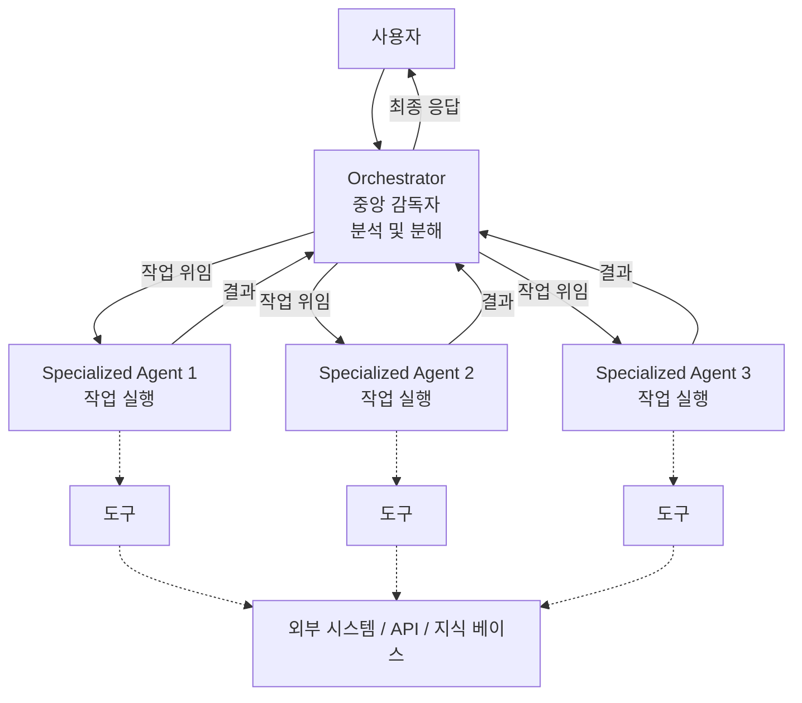

#### 골드 스탠다드 패턴 (2026)

```
슈퍼바이저 에이전트
 ├─ 도메인 에이전트 (금융)
 ├─ 도메인 에이전트 (법률)
 ├─ 도구 에이전트
 └─ 반성 에이전트
```

#### 이 패턴이 승리하는 이유

1. **디버깅 용이성**: 각 에이전트를 독립적으로 테스트 및 디버그
2. **거버넌스 용이성**: 에이전트별 권한 및 제약 설정
3. **확장 용이성**: 새로운 도메인 에이전트 추가가 간단

#### 멀티 에이전트 조율 패턴

**수평적 협업** vs **수직적 파이프라인**:

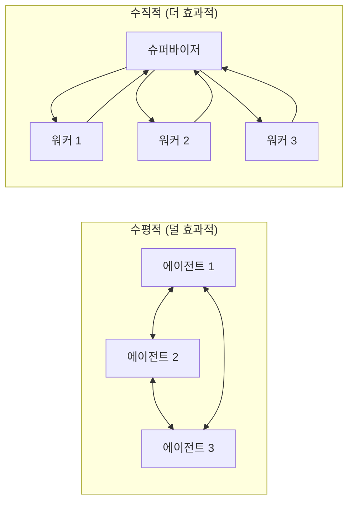

수직적 구조가 더 효과적인 이유:
- 명확한 제어 흐름
- 단일 조율 지점
- 충돌 방지
- 추적 가능성

## 프레임워크 매핑: 패턴을 실제 도구로

| 패턴 | LangGraph | CrewAI | AutoGen |
|------|-----------|--------|---------|
| Reflection | `StateGraph` 순환 엣지 | Reviewer 역할 | 멀티 턴 대화 |
| Tool Use | `@tool` 데코레이터 | `tools` 매개변수 | `register_function` |
| Planning | 그래프 구조 | 작업 분해 | 그룹 채팅 |
| Multi-Agent | 서브그래프 | Crew 개념 | `GroupChat` |

각 프레임워크의 강점:

**LangGraph**:
- 복잡한 상태 관리에 최적
- 그래프 기반 워크플로우
- 세밀한 제어 가능

**CrewAI**:
- 역할 기반 에이전트 조직
- 간단한 멀티 에이전트 설정
- 비즈니스 로직에 집중

**AutoGen**:
- 대화형 에이전트 패턴
- 다양한 에이전트 간 협상
- 유연한 메시지 흐름

## 2026년 1월 현재의 중요한 변화

### 모델 진화

- **GPT-5.2급 추론 모델**: 더 깊은 사고 능력
- **더 저렴하고 긴 컨텍스트**: 비용 효율성 향상
- **도구 우선 설계**: 네이티브 도구 통합

### 패러다임 전환

**워크플로우 품질 > 모델 품질**

모델 성능보다 시스템 설계가 더 중요해졌습니다. 좋은 아키텍처는 보통 모델로도 훌륭한 결과를 만들어냅니다.

### 새로운 모범 사례

1. **명시적 에이전트 생명주기**: 생성, 실행, 종료 명확화
2. **비용 인식 계획**: 토큰 사용량을 고려한 계획 수립
3. **에이전트 관찰 가능성**: 모든 행동을 추적하고 모니터링
4. **재생 가능한 실행**: 디버깅을 위한 실행 재현
5. **코드로서의 정책**: 거버넌스 규칙을 코드로 관리

## 에이전트 제어 평면: 런타임 거버넌스 아키텍처

Agent Control Plane은 에이전트의 행동을 런타임에서 제어하는 핵심 메커니즘입니다.

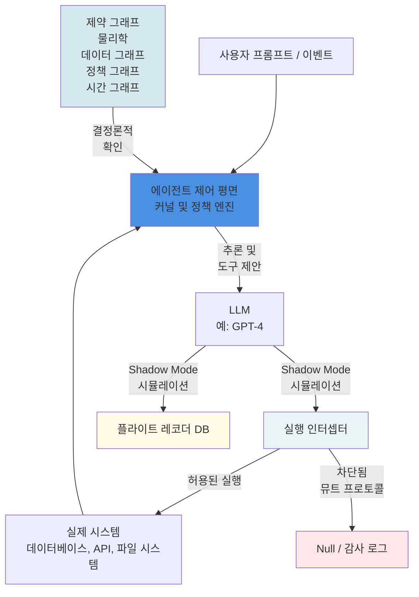

### 제어 평면의 핵심 구성 요소

1. **제약 그래프(Constraint Graphs)**: 
   - 데이터 그래프: 접근 가능한 데이터 범위
   - 정책 그래프: 준수해야 할 규칙
   - 시간 그래프: 시간 제약 조건
   
2. **실행 인터셉터(Execution Interceptor)**:
   - Shadow Mode로 위험한 작업 시뮬레이션
   - 허용된 작업만 실제 시스템에 전달
   - 차단된 작업은 감사 로그에 기록

3. **플라이트 레코더(Flight Recorder)**:
   - 모든 LLM 추론 과정 기록
   - 디버깅 및 감사를 위한 재생 기능

## 아키텍트 의사결정 매트릭스

올바른 패턴 선택은 프로젝트의 성공을 좌우합니다:

| 시나리오 | 추천 패턴 | 이유 |
|----------|-----------|------|
| 코드 생성 | Reflection + Tool Use | 구문 검증과 실행 필요 |
| 고객 지원 | Tool Use (RAG) | 지식 베이스 접근 필요 |
| 복잡한 연구 | Planning + Multi-Agent | 작업 분해 및 병렬 처리 |
| 데이터 분석 | Tool Use + Reflection | 계산 정확성과 검증 |
| 창의적 글쓰기 | Reflection | 품질 개선을 위한 반복 |
| 워크플로우 자동화 | Planning + Multi-Agent | 단계별 실행과 역할 분담 |
| 실시간 의사결정 | Tool Use만 | 지연 시간 최소화 |
| 규정 준수 검토 | Reflection + Multi-Agent | 다각도 검증 필요 |

### 의사결정 트리

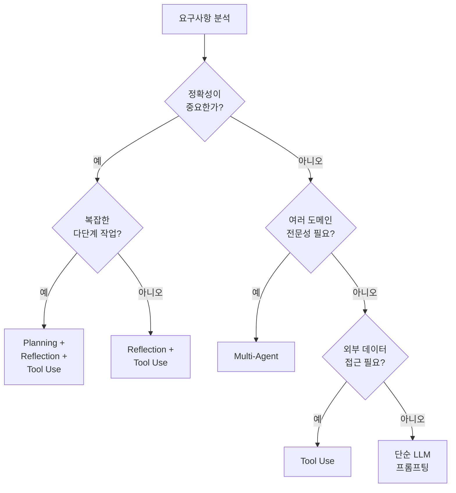

## 아키텍트의 황금률

다음 원칙들을 북마크하고 프로젝트 시작 시마다 검토하세요:

1. **절대로 단일 샷 답변을 신뢰하지 마세요**: 중요한 작업은 항상 검증이 필요합니다.

2. **상태가 프롬프트보다 중요합니다**: 잘 설계된 상태 관리가 긴 프롬프트보다 효과적입니다.

3. **도구가 토큰을 이깁니다**: 계산은 LLM이 아닌 도구가 수행해야 합니다.

4. **반성은 리스크를 줄입니다**: Reflection은 선택이 아닌 필수입니다.

5. **멀티 에이전트가 모놀리스를 이깁니다**: 복잡성은 분산으로 관리합니다.

6. **관찰 가능성은 필수입니다**: 볼 수 없으면 제어할 수 없습니다.

7. **자율성은 제한되어야 합니다**: 무제한 자율성은 재앙의 레시피입니다.

## 실제 구현 예시: 월간 급여 보고서 생성 시스템

멀티 에이전트 시스템의 실제 구현을 살펴보겠습니다:

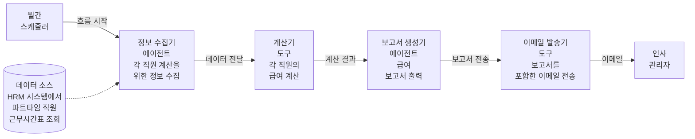

### 시스템 구성 요소

1. **월간 스케줄러**: 매월 자동으로 프로세스 시작
2. **정보 수집기 에이전트**: HRM 시스템에서 필요한 데이터 수집
3. **계산기 도구**: 정확한 급여 계산 (LLM이 아닌 도구 사용)
4. **보고서 생성기 에이전트**: 전문적인 보고서 작성
5. **이메일 발송기 도구**: 자동 이메일 전송

이 시스템은 다음 패턴을 조합합니다:
- **Planning**: 전체 워크플로우 정의
- **Tool Use**: 데이터 조회 및 계산
- **Multi-Agent**: 역할별 에이전트 분리

## AI 강화 반성적 자아(AI-Empowered Reflective Self)

현대적 Agentic 시스템은 다음 4가지 요소가 통합된 형태로 진화하고 있습니다:

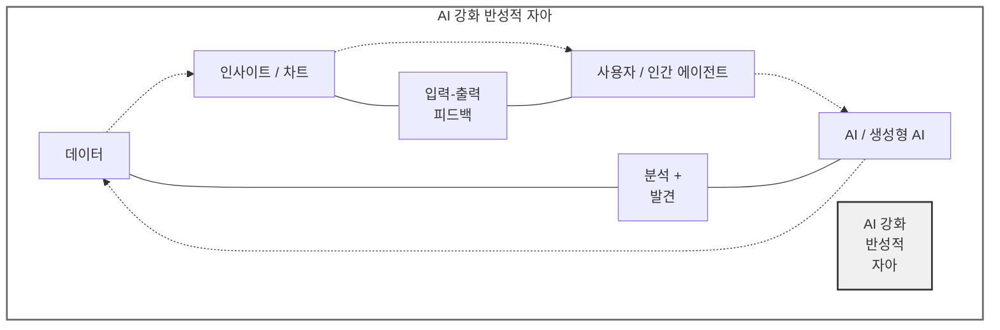

이 모델은 AI가 단순한 도구가 아니라 인간과 함께 학습하고 발전하는 파트너임을 보여줍니다.

## 최종 평결

Agentic AI는 GenAI에 있어서 마이크로서비스가 모놀리스에 했던 것과 같은 역할을 합니다.

2026년의 승자는:

❌ **아닌 것들**:
- 가장 큰 모델을 가진 자
- 가장 긴 프롬프트를 작성하는 자

✅ **될 것들**:
- **최고의 에이전트 아키텍처를 가진 자**
- 패턴을 이해하고 올바르게 조합하는 자
- 관찰 가능하고 거버넌스가 가능한 시스템을 구축하는 자

## 핵심 통찰

### 아키텍처가 모델보다 중요합니다

평범한 모델 + 훌륭한 아키텍처 > 최고의 모델 + 나쁜 아키텍처

### 패턴의 조합이 힘입니다

단일 패턴보다는 여러 패턴의 적절한 조합이 실제 문제를 해결합니다:

- **간단한 작업**: Tool Use만으로 충분
- **중간 복잡도**: Tool Use + Reflection
- **복잡한 작업**: Planning + Multi-Agent + Reflection + Tool Use

### 거버넌스는 선택이 아닌 필수입니다

프로덕션 환경에서는:
- 모든 행동이 추적되어야 합니다
- 자율성에는 명확한 경계가 있어야 합니다
- 실패 복구 메커니즘이 필수입니다
- 비용 모니터링이 실시간으로 이루어져야 합니다

### 시작은 단순하게, 필요에 따라 복잡하게

1. 단순한 LLM 프롬프팅으로 시작
2. 정확성이 필요하면 Tool Use 추가
3. 품질 보장이 필요하면 Reflection 추가
4. 복잡해지면 Planning 추가
5. 확장이 필요하면 Multi-Agent로 전환

---

**문서 작성 일자**: 2026-01-31
