## 서론: Vibe Coding의 시대

2026년 1월 현재, Claude Code는 단순한 코드 자동완성 도구를 넘어서 진정한 의미의 Agentic 코딩 플랫폼으로 자리잡았습니다. "Vibe Coding"이라는 용어로 대표되는 이 새로운 패러다임은 개발자가 자연어로 의도를 표현하면 AI 에이전트가 전체 코드베이스를 이해하고, 복잡한 다중 파일 변경을 계획하며, 이를 구현하고 검증까지 수행하는 것을 의미합니다.

Boris Cherny(Claude Code의 창시자)의 말처럼, "당신은 여전히 코드를 작성하지만, 기계적이고 반복적인 작업의 대부분은 AI가 보조합니다." 2026년 실무 개발자와 아키텍트가 직면한 실질적 과제는 더 이상 "AI를 사용해야 하는가"가 아니라 "어떻게 Claude Code를 SDLC 전체에 걸쳐 안전하게 통합하면서 아키텍처 통제권을 유지할 것인가"입니다.

## Claude Code의 핵심 아키텍처

### 전체 시스템 구조

Claude Code는 다층 아키텍처로 구성되어 있으며, 각 계층이 명확한 책임과 역할을 가지고 있습니다:

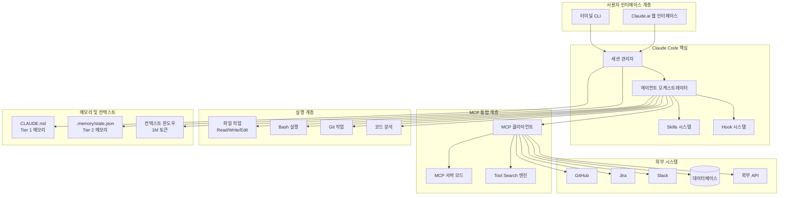
```mermaid
graph TB
    subgraph "사용자 인터페이스 계층"
        Terminal[터미널 CLI]
        WebUI[Claude.ai 웹 인터페이스]
    end
    
    subgraph "Claude Code 핵심"
        SessionManager[세션 관리자]
        AgentOrchestrator[에이전트 오케스트레이터]
        SkillSystem[Skills 시스템]
        HookSystem[Hook 시스템]
    end
    
    subgraph "MCP 통합 계층"
        MCPClient[MCP 클라이언트]
        MCPServer[MCP 서버 모드]
        ToolSearch[Tool Search 엔진]
    end
    
    subgraph "실행 계층"
        FileOps[파일 작업<br/>Read/Write/Edit]
        BashExec[Bash 실행]
        GitOps[Git 작업]
        CodeAnalysis[코드 분석]
    end
    
    subgraph "메모리 및 컨텍스트"
        CLAUDEmd[CLAUDE.md<br/>Tier 1 메모리]
        StateJSON[.memory/state.json<br/>Tier 2 메모리]
        ContextWindow[컨텍스트 윈도우<br/>1M 토큰]
    end
    
    subgraph "외부 시스템"
        GitHub[GitHub]
        Jira[Jira]
        Slack[Slack]
        Databases[(데이터베이스)]
        APIs[외부 API]
    end
    
    Terminal --> SessionManager
    WebUI --> SessionManager
    
    SessionManager --> AgentOrchestrator
    AgentOrchestrator --> SkillSystem
    AgentOrchestrator --> HookSystem
    AgentOrchestrator --> MCPClient
    
    MCPClient --> ToolSearch
    MCPClient --> MCPServer
    
    AgentOrchestrator --> FileOps
    AgentOrchestrator --> BashExec
    AgentOrchestrator --> GitOps
    AgentOrchestrator --> CodeAnalysis
    
    SessionManager --> CLAUDEmd
    SessionManager --> StateJSON
    AgentOrchestrator --> ContextWindow
    
    MCPClient --> GitHub
    MCPClient --> Jira
    MCPClient --> Slack
    MCPClient --> Databases
    MCPClient --> APIs
```

### 계층별 상세 분석

#### 1. 인터페이스 계층: 유연한 접근 방식

Claude Code는 두 가지 주요 인터페이스를 제공합니다:

**터미널 CLI 모드**:
- 로컬 개발 환경에서 직접 실행
- `claude` 명령어로 세션 시작
- 개발자의 워크플로우에 자연스럽게 통합
- 다중 세션 병렬 실행 가능
- Git 체크아웃을 통한 세션 격리

**웹 인터페이스(claude.ai/code)**:
- 브라우저 기반 접근
- `/teleport` 명령으로 로컬 ↔ 웹 간 세션 이동
- 협업 및 공유에 유리
- 디바이스 간 작업 전환 용이

Boris Cherny는 MacBook 터미널에서 5개, Anthropic 웹사이트에서 5-10개의 세션을 동시에 실행하며, 각 로컬 세션은 별도의 Git 체크아웃을 사용하여 충돌을 방지합니다. 이 중 10-20%는 예상치 못한 시나리오로 인해 포기되지만, 이러한 병렬성이 전체 생산성을 극대화합니다.

#### 2. 세션 관리 및 컨텍스트

**세션 생명주기**:

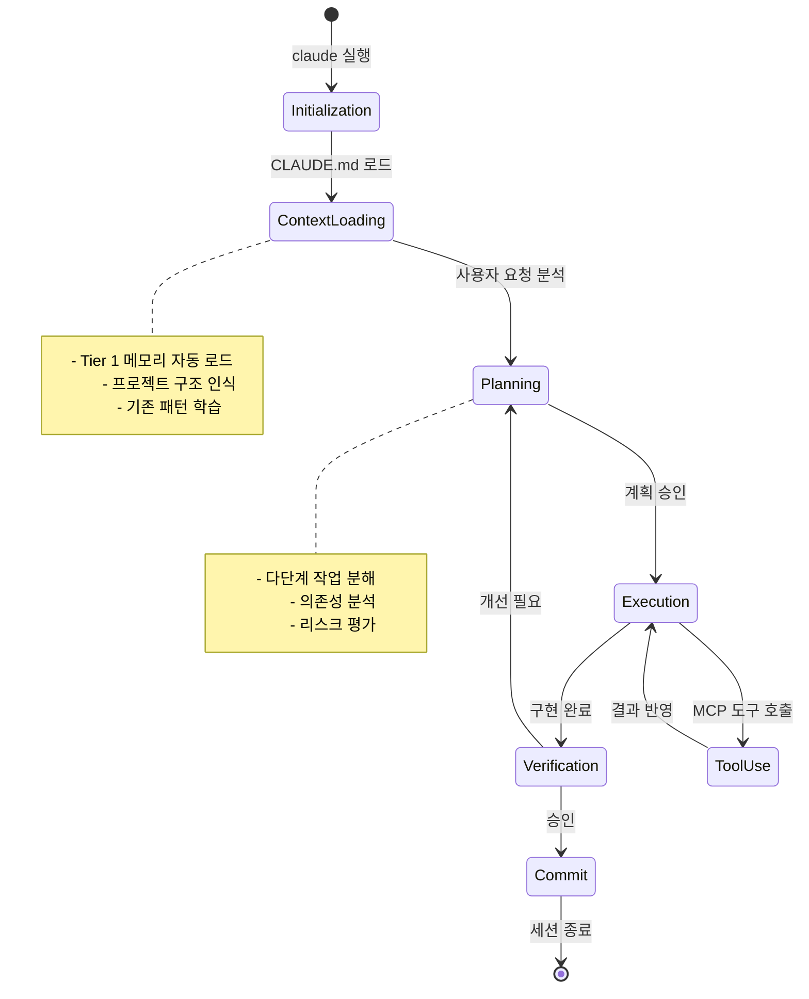
```mermaid
stateDiagram-v2
    [*] --> Initialization: claude 실행
    Initialization --> ContextLoading: CLAUDE.md 로드
    ContextLoading --> Planning: 사용자 요청 분석
    Planning --> Execution: 계획 승인
    Execution --> Verification: 구현 완료
    Verification --> Planning: 개선 필요
    Verification --> Commit: 승인
    Commit --> [*]: 세션 종료
    
    Execution --> ToolUse: MCP 도구 호출
    ToolUse --> Execution: 결과 반영
    
    note right of ContextLoading
        - Tier 1 메모리 자동 로드
        - 프로젝트 구조 인식
        - 기존 패턴 학습
    end note
    
    note right of Planning
        - 다단계 작업 분해
        - 의존성 분석
        - 리스크 평가
    end note
```

**컨텍스트 윈도우 관리**:

Claude Code는 1백만 토큰의 방대한 컨텍스트 윈도우를 활용하지만, 효율적인 관리가 필수적입니다:

- **자동 컴팩션(PreCompact Hook)**: 컨텍스트가 일정 수준 이상 차면 자동으로 중요하지 않은 정보 압축
- **선택적 로딩**: 필요한 파일만 컨텍스트에 포함
- **MCP Tool Search**: 도구 정의가 컨텍스트의 10% 이상을 차지하면 자동으로 온디맨드 로딩 방식으로 전환

#### 3. MCP(Model Context Protocol): 통합의 핵심

MCP는 Claude Code의 확장성을 담당하는 핵심 프로토콜입니다. USB-C가 전자기기의 표준 연결 방식이듯, MCP는 AI 애플리케이션과 외부 시스템을 연결하는 표준 방식입니다.

**MCP 아키텍처의 이중성**:

Claude Code는 동시에 MCP 클라이언트와 MCP 서버 역할을 수행합니다:

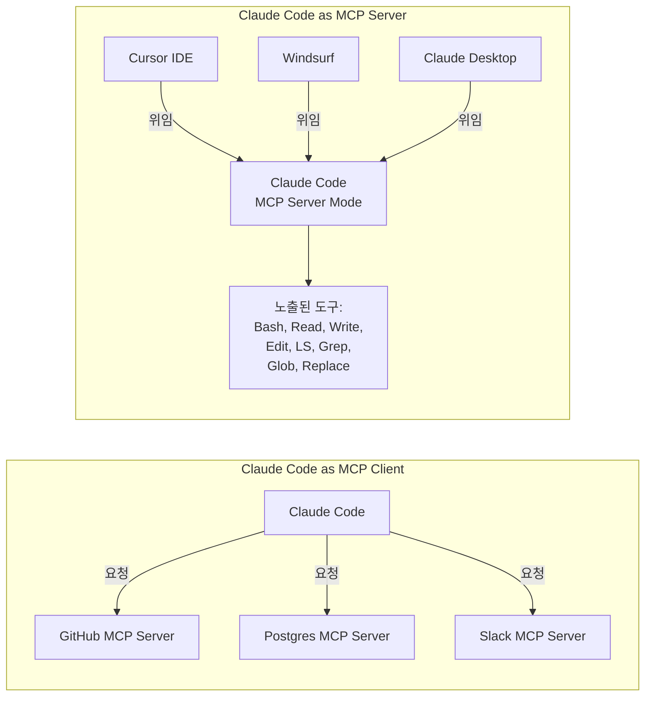
```mermaid
graph LR
    subgraph "Claude Code as MCP Client"
        CC1[Claude Code] -->|요청| GitHub[GitHub MCP Server]
        CC1 -->|요청| Postgres[Postgres MCP Server]
        CC1 -->|요청| Slack[Slack MCP Server]
    end
    
    subgraph "Claude Code as MCP Server"
        Cursor[Cursor IDE] -->|위임| CC2[Claude Code<br/>MCP Server Mode]
        Windsurf[Windsurf] -->|위임| CC2
        ClaudeDesktop[Claude Desktop] -->|위임| CC2
        
        CC2 --> Tools[노출된 도구:<br/>Bash, Read, Write,<br/>Edit, LS, Grep,<br/>Glob, Replace]
    end
```

이 이중 구조는 "에이전트를 돕는 에이전트" 패턴을 실현합니다. 다른 AI 도구들이 복잡한 코드 편집 작업을 Claude Code에 위임할 수 있으며, Claude Code 자체는 다른 전문화된 MCP 서버들을 활용합니다.

**MCP 통신 프로토콜**:

MCP는 JSON-RPC 2.0 기반으로 구축되어 있으며, 세 가지 전송 방식을 지원합니다:

1. **HTTP + SSE(Server-Sent Events)**:
   ```bash
   claude mcp add --transport http notion https://mcp.notion.com/mcp
   ```
   - 클라우드 기반 서비스에 권장
   - 가장 널리 지원되는 방식
   - Bearer 토큰 인증 지원

2. **Stdio (표준 입출력)**:
   ```json
   {
     "mcpServers": {
       "filesystem": {
         "command": "npx",
         "args": ["-y", "@modelcontextprotocol/server-filesystem", "/path/to/allowed/files"]
       }
     }
   }
   ```
   - 로컬 프로세스 통신
   - 낮은 지연 시간
   - 단순한 설정

3. **WebSocket**:
   - 양방향 실시간 통신
   - 스트리밍 데이터에 적합

**MCP Tool Search: 동적 도구 발견**:

많은 MCP 서버가 연결되면 도구 정의만으로도 컨텍스트 윈도우를 크게 소비합니다. Claude Code는 다음과 같이 해결합니다:

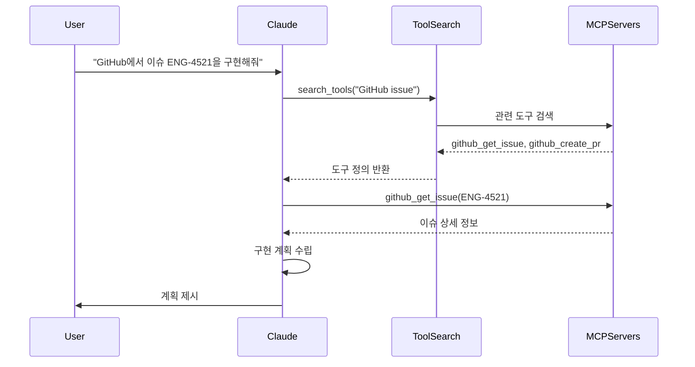
```mermaid
sequenceDiagram
    participant User
    participant Claude
    participant ToolSearch
    participant MCPServers
    
    User->>Claude: "GitHub에서 이슈 ENG-4521을 구현해줘"
    Claude->>ToolSearch: search_tools("GitHub issue")
    ToolSearch->>MCPServers: 관련 도구 검색
    MCPServers-->>ToolSearch: github_get_issue, github_create_pr
    ToolSearch-->>Claude: 도구 정의 반환
    Claude->>MCPServers: github_get_issue(ENG-4521)
    MCPServers-->>Claude: 이슈 상세 정보
    Claude->>Claude: 구현 계획 수립
    Claude->>User: 계획 제시
```

- 컨텍스트 윈도우의 10% 이상이 MCP 도구 정의로 차지되면 자동 활성화
- 필요한 도구만 온디맨드로 로드
- 사용자는 변화를 인지하지 못함 (투명한 동작)

#### 4. Skills 시스템: 재사용 가능한 전문 지식

Skills는 Claude에게 특정 작업 수행 방법을 가르치는 경량화된 지침 패키지입니다.

**Skills vs MCP의 차이점**:

| 측면 | MCP | Skills |
|------|-----|--------|
| 역할 | 인프라 - 무엇을 할 수 있는가 | 레시피 - 어떻게 해야 하는가 |
| 계층 | 시스템 레벨 | 지시 레벨 |
| 이식성 | 프로토콜 지원 필요 | Claude에 최적화, 텍스트 기반 |
| 보안 | 명시적 권한 게이트 | 샌드박스 내 실행 |
| 예시 | "GitHub API에 접근할 수 있다" | "PR 리뷰는 이렇게 해라" |

**Skills 구조 예시**:

```markdown
---
name: "Semantic Code Review"
description: "보안, 성능, 의미론적 네이밍 규칙에 초점을 맞춘 PR 리뷰"
author: "Engineering Team"
version: "1.2"
---

# Semantic Code Review Protocol

사용자가 `/review`를 호출하면 다음 절차를 엄격히 따르세요:

1. **컨텍스트 분석**:
   - `git_diff` 도구(MCP 경유)를 사용해 변경사항 가져오기
   - 변경사항이 `src/auth/`를 건드리는지 확인 (높은 보안 리스크)

2. **스타일 강제**:
   - Python은 `snake_case`, TypeScript는 `camelCase` 확인
   - 하드코딩된 비밀 정보가 없는지 확인 (정규식: `AKIA...`)

3. **성능 체크**:
   - 루프 내 데이터베이스 호출이 있으면 "N+1 쿼리 위험" 플래그

4. **출력 형식**:
   - Markdown 테이블 형식으로 리뷰 생성
```

**Skills의 실행 흐름**:

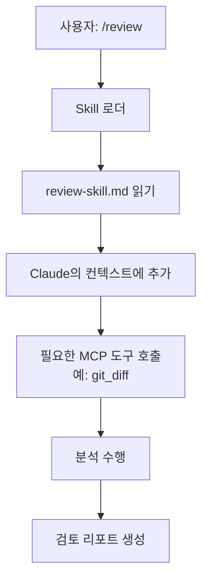
```mermaid
graph TD
    UserCommand[사용자: /review] --> SkillLoader[Skill 로더]
    SkillLoader --> SkillContent[review-skill.md 읽기]
    SkillContent --> ClaudeContext[Claude의 컨텍스트에 추가]
    ClaudeContext --> MCPTools[필요한 MCP 도구 호출<br/>예: git_diff]
    MCPTools --> Analysis[분석 수행]
    Analysis --> Output[검토 리포트 생성]
```

**Hot Reload 기능**:

Claude Code 2.1.0부터 Skills는 핫 리로드를 지원합니다:
- `~/.claude/skills` 또는 `.claude/skills`에 새 Skill 추가
- 세션 재시작 없이 즉시 사용 가능
- 실시간 반복 작업 가능

#### 5. Hook 시스템: 확장 가능한 이벤트 기반 아키텍처

Hooks는 Claude Code의 생명주기 특정 시점에 사용자 정의 로직을 실행할 수 있게 합니다:

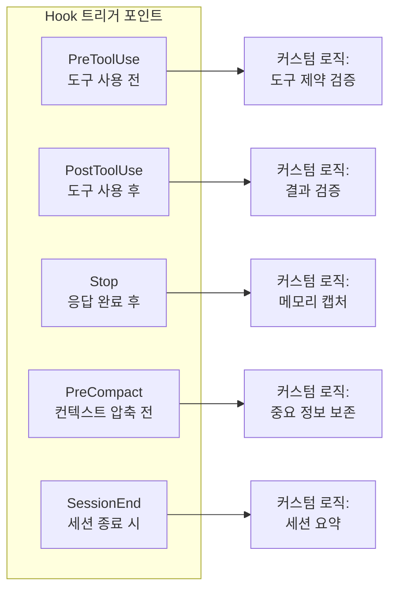
```mermaid
graph LR
    subgraph "Hook 트리거 포인트"
        PreToolUse[PreToolUse<br/>도구 사용 전]
        PostToolUse[PostToolUse<br/>도구 사용 후]
        Stop[Stop<br/>응답 완료 후]
        PreCompact[PreCompact<br/>컨텍스트 압축 전]
        SessionEnd[SessionEnd<br/>세션 종료 시]
    end
    
    PreToolUse --> CustomLogic1[커스텀 로직:<br/>도구 제약 검증]
    PostToolUse --> CustomLogic2[커스텀 로직:<br/>결과 검증]
    Stop --> CustomLogic3[커스텀 로직:<br/>메모리 캡처]
    PreCompact --> CustomLogic4[커스텀 로직:<br/>중요 정보 보존]
    SessionEnd --> CustomLogic5[커스텀 로직:<br/>세션 요약]
```

**실제 활용 사례 - Persistent Memory**:

memory-mcp 프로젝트는 Hook 시스템을 활용한 훌륭한 예시입니다:

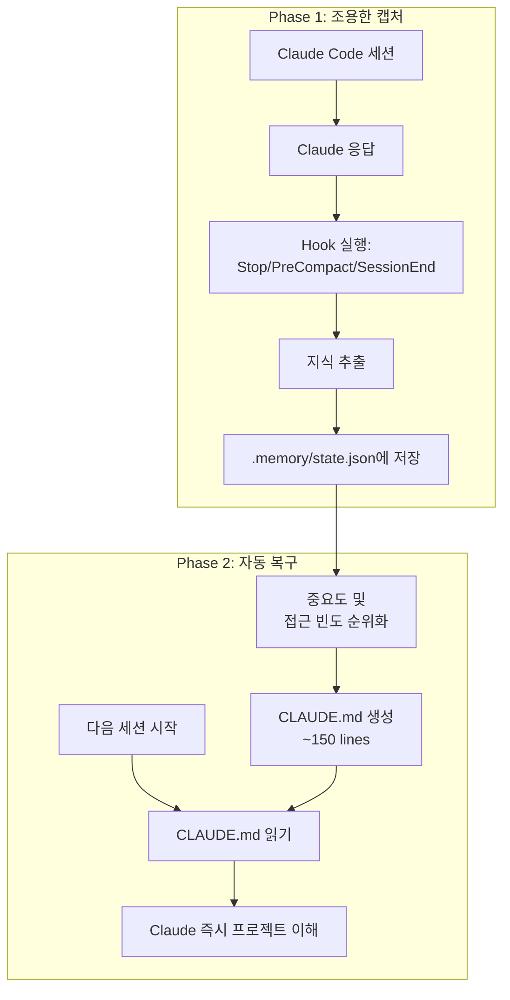
```mermaid
graph TB
    subgraph "Phase 1: 조용한 캡처"
        Session[Claude Code 세션] --> Response[Claude 응답]
        Response --> Hook[Hook 실행:<br/>Stop/PreCompact/SessionEnd]
        Hook --> Extract[지식 추출]
        Extract --> StateJSON[.memory/state.json에 저장]
    end
    
    subgraph "Phase 2: 자동 복구"
        NextSession[다음 세션 시작] --> ReadCLAUDE[CLAUDE.md 읽기]
        StateJSON --> Rank[중요도 및<br/>접근 빈도 순위화]
        Rank --> Generate[CLAUDE.md 생성<br/>~150 lines]
        Generate --> ReadCLAUDE
        ReadCLAUDE --> ClaudeReady[Claude 즉시 프로젝트 이해]
    end
```

**2단계 메모리 시스템**:

1. **Tier 1: CLAUDE.md (~150줄)**:
   - 가장 중요한 프로젝트 지식의 압축 브리핑
   - 신뢰도와 접근 빈도로 순위 결정
   - 세션 시작 시 자동 로드 (프롬프팅 불필요)
   - 80%의 세션에서 충분

2. **Tier 2: .memory/state.json (무제한)**:
   - 모든 사실, 결정, 관찰의 전체 저장소
   - 세션 중간에 MCP 도구를 통해 접근 가능
   - 키워드 검색, 태그 기반 쿼리, 자연어 질문
   - 20%의 복잡한 세션에서 사용

## Agentic 디자인 패턴의 구현

앞서 설명한 4가지 Agentic 패턴이 Claude Code에 어떻게 구현되어 있는지 살펴보겠습니다.

### 1. Reflection 패턴의 구현

Claude Code는 자체 검증 메커니즘을 내장하고 있습니다:

**구현 방식**:

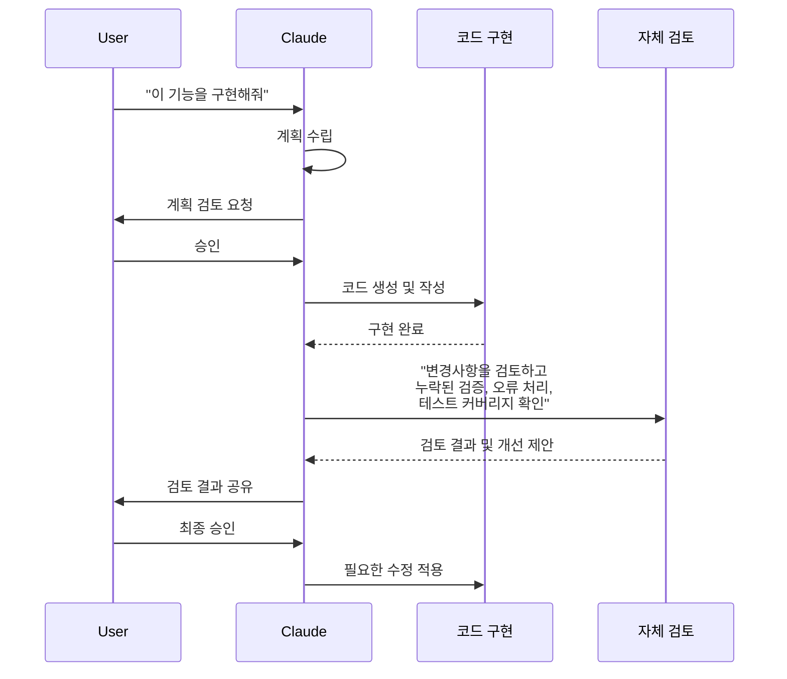
```mermaid
sequenceDiagram
    participant User
    participant Claude
    participant CodeImpl as 코드 구현
    participant SelfReview as 자체 검토
    
    User->>Claude: "이 기능을 구현해줘"
    Claude->>Claude: 계획 수립
    Claude->>User: 계획 검토 요청
    User->>Claude: 승인
    Claude->>CodeImpl: 코드 생성 및 작성
    CodeImpl-->>Claude: 구현 완료
    Claude->>SelfReview: "변경사항을 검토하고<br/>누락된 검증, 오류 처리,<br/>테스트 커버리지 확인"
    SelfReview-->>Claude: 검토 결과 및 개선 제안
    Claude->>User: 검토 결과 공유
    User->>Claude: 최종 승인
    Claude->>CodeImpl: 필요한 수정 적용
```

**실무 적용**:

Boris Cherny의 워크플로우는 Reflection의 실제 구현을 보여줍니다:

1. **계획 모드에서 시작**: 반복적으로 계획을 개선
2. **자동 편집 모드로 전환**: 좋은 계획이 있으면 보통 한 번에 성공
3. **검증 서브 에이전트**: 슬래시 커맨드로 검증 에이전트 실행

```bash
# 계획 수립 및 반복
claude
> /plan "사용자 인증 기능 추가"
[계획 생성 및 검토]
> /refine "보안 체크포인트 추가"
[계획 개선]

# 승인 후 자동 실행
> /auto-accept
[구현 시작]

# 자체 검증
> /verify "변경사항 검토하고 개선점 제안"
```

### 2. Tool Use 패턴의 구현

Claude Code의 도구 사용은 MCP를 통해 무한히 확장 가능합니다:

**핵심 내장 도구**:

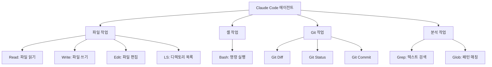
```mermaid
graph TB
    ClaudeCode[Claude Code 에이전트]
    
    ClaudeCode --> FileOps[파일 작업]
    ClaudeCode --> ShellOps[셸 작업]
    ClaudeCode --> GitOps[Git 작업]
    ClaudeCode --> AnalysisOps[분석 작업]
    
    FileOps --> Read[Read: 파일 읽기]
    FileOps --> Write[Write: 파일 쓰기]
    FileOps --> Edit[Edit: 파일 편집]
    FileOps --> LS[LS: 디렉토리 목록]
    
    ShellOps --> Bash[Bash: 명령 실행]
    
    GitOps --> GitDiff[Git Diff]
    GitOps --> GitStatus[Git Status]
    GitOps --> GitCommit[Git Commit]
    
    AnalysisOps --> Grep[Grep: 텍스트 검색]
    AnalysisOps --> Glob[Glob: 패턴 매칭]
```

**MCP를 통한 외부 도구 통합**:

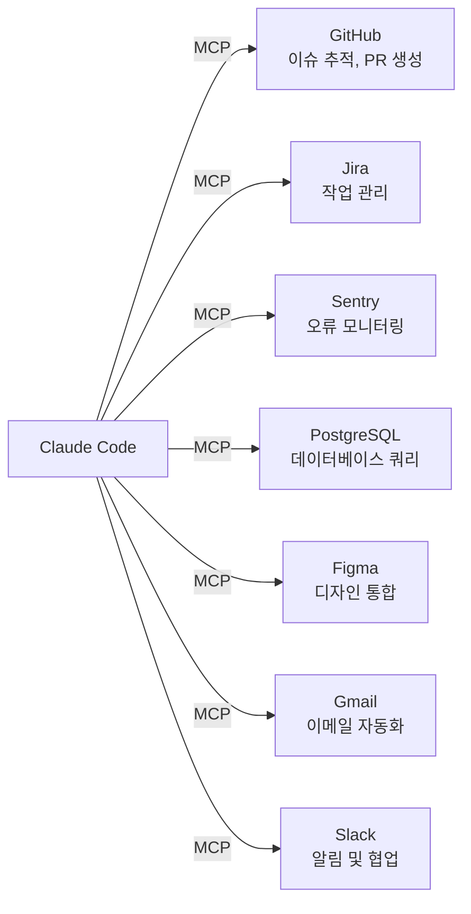
```mermaid
graph LR
    ClaudeCode[Claude Code]
    
    ClaudeCode -->|MCP| GitHub[GitHub<br/>이슈 추적, PR 생성]
    ClaudeCode -->|MCP| Jira[Jira<br/>작업 관리]
    ClaudeCode -->|MCP| Sentry[Sentry<br/>오류 모니터링]
    ClaudeCode -->|MCP| Postgres[PostgreSQL<br/>데이터베이스 쿼리]
    ClaudeCode -->|MCP| Figma[Figma<br/>디자인 통합]
    ClaudeCode -->|MCP| Gmail[Gmail<br/>이메일 자동화]
    ClaudeCode -->|MCP| Slack[Slack<br/>알림 및 협업]
```

**실제 워크플로우 예시**:

```
사용자: "Jira 이슈 ENG-4521에 설명된 기능을 구현하고 GitHub에 PR을 만들어줘"

Claude Code 실행 순서:
1. Jira MCP를 통해 이슈 ENG-4521 조회
2. 요구사항 분석 및 구현 계획 수립
3. 필요한 파일 읽기 (Read 도구)
4. 코드 변경사항 적용 (Edit 도구)
5. 테스트 실행 (Bash 도구)
6. Git 커밋 (Git 도구)
7. GitHub MCP를 통해 PR 생성
8. Slack MCP를 통해 팀에 알림
```

### 3. Planning 패턴의 구현

Claude Code의 계획 수립은 명시적이고 반복 가능합니다:

**계획 단계의 구조**:

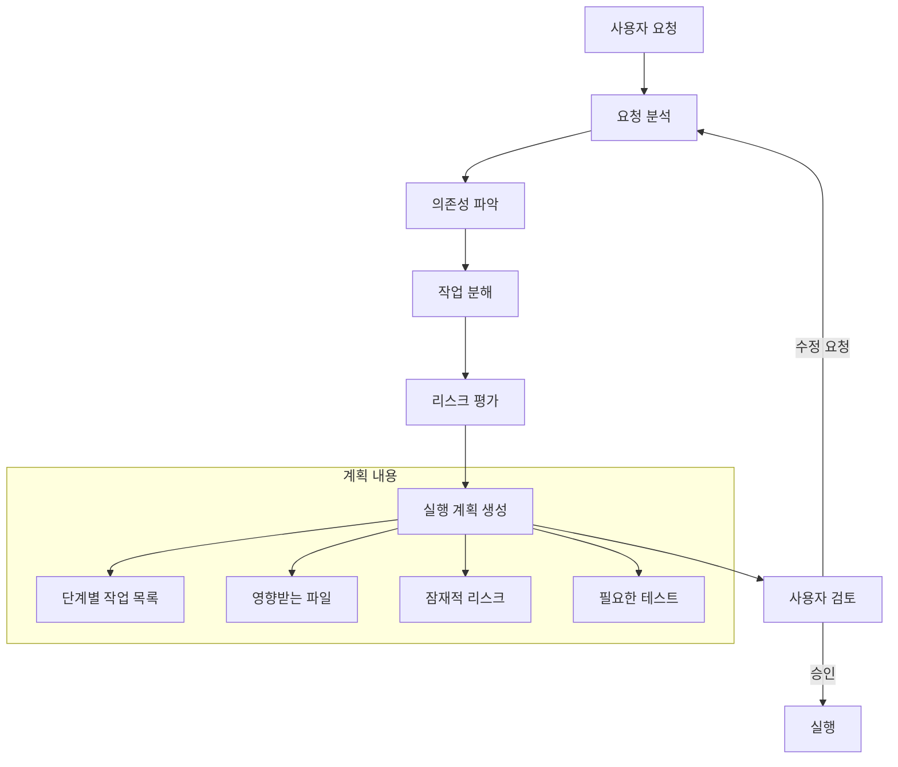
```mermaid
graph TB
    UserRequest[사용자 요청] --> Analyze[요청 분석]
    Analyze --> Dependencies[의존성 파악]
    Dependencies --> TaskDecomp[작업 분해]
    TaskDecomp --> RiskAssess[리스크 평가]
    RiskAssess --> Plan[실행 계획 생성]
    
    Plan --> UserReview[사용자 검토]
    UserReview -->|승인| Execute[실행]
    UserReview -->|수정 요청| Analyze
    
    subgraph "계획 내용"
        Plan --> Steps[단계별 작업 목록]
        Plan --> Files[영향받는 파일]
        Plan --> Risks[잠재적 리스크]
        Plan --> Tests[필요한 테스트]
    end
```

**실무 Best Practice (Boris Cherny)**:

> "만약 내 목표가 Pull Request를 작성하는 것이라면, 나는 Plan 모드를 사용하고 계획이 마음에 들 때까지 Claude와 주고받습니다. 거기서부터 자동 승인 편집 모드로 전환하면 Claude는 보통 한 번에 성공합니다. **좋은 계획이 정말 중요합니다!**"

**계획의 명시적 표현**:

```
계획: 사용자 인증 시스템 추가

1단계: 데이터베이스 스키마 업데이트
   - 파일: migrations/001_add_users_table.sql
   - 리스크: 기존 데이터 마이그레이션 필요
   - 테스트: 마이그레이션 롤백 검증

2단계: User 모델 생성
   - 파일: models/user.py
   - 의존성: ORM 설정 필요
   - 테스트: 유닛 테스트 작성

3단계: 인증 미들웨어 구현
   - 파일: middleware/auth.py
   - 리스크: 보안 취약점 검토 필요
   - 테스트: 통합 테스트 작성

4단계: API 엔드포인트 추가
   - 파일: routes/auth.py
   - 의존성: 2, 3단계 완료 후
   - 테스트: E2E 테스트 작성

예상 완료 시간: 2-3시간
주요 리스크: 보안, 성능
검토 필요 영역: 비밀번호 해싱, 세션 관리
```

### 4. Multi-Agent 패턴의 구현

Claude Code는 슬래시 커맨드를 통해 서브 에이전트를 생성합니다:

**서브 에이전트 구조**:

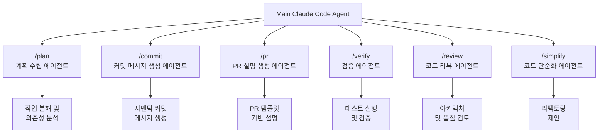
```mermaid
graph TB
    MainAgent["Main Claude Code Agent"]
    
    MainAgent --> PlanAgent["/plan
계획 수립 에이전트"]
    MainAgent --> CommitAgent["/commit
커밋 메시지 생성 에이전트"]
    MainAgent --> PRAgent["/pr
PR 설명 생성 에이전트"]
    MainAgent --> VerifyAgent["/verify
검증 에이전트"]
    MainAgent --> ReviewAgent["/review
코드 리뷰 에이전트"]
    MainAgent --> SimplifyAgent["/simplify
코드 단순화 에이전트"]
    
    PlanAgent --> TaskBreakdown["작업 분해 및
의존성 분석"]
    CommitAgent --> CommitMsg["시맨틱 커밋
메시지 생성"]
    PRAgent --> PRDesc["PR 템플릿
기반 설명"]
    VerifyAgent --> Validation["테스트 실행
및 검증"]
    ReviewAgent --> CodeReview["아키텍처
및 품질 검토"]
    SimplifyAgent --> Refactor["리팩토링
제안"]
```

**Anthropic 팀의 실제 사용 패턴**:

Anthropic의 각 팀은 Git에 CLAUDE.md를 유지하며, 다음을 문서화합니다:
- 실수 및 개선 사항
- 스타일 규칙
- 디자인 가이드라인
- PR 템플릿

Boris Cherny는 동료의 PR에 `@.claude` 태그를 달아 학습 내용을 CLAUDE.md에 추가하여 각 PR의 지식을 보존합니다. 현재 그들의 CLAUDE.md는 2,500 토큰 규모입니다.

**에이전트 계층 구조**:

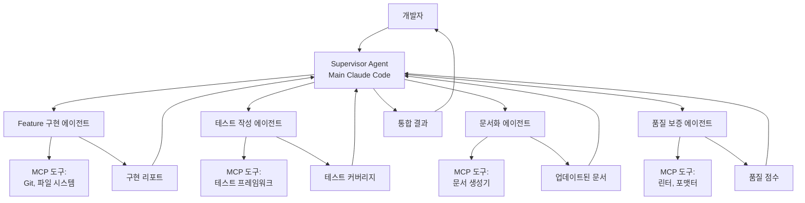
```mermaid
graph TD
    User[개발자] --> SupervisorAgent[Supervisor Agent<br/>Main Claude Code]
    
    SupervisorAgent --> FeatureAgent[Feature 구현 에이전트]
    SupervisorAgent --> TestAgent[테스트 작성 에이전트]
    SupervisorAgent --> DocAgent[문서화 에이전트]
    SupervisorAgent --> QAAgent[품질 보증 에이전트]
    
    FeatureAgent --> MCPTools1[MCP 도구:<br/>Git, 파일 시스템]
    TestAgent --> MCPTools2[MCP 도구:<br/>테스트 프레임워크]
    DocAgent --> MCPTools3[MCP 도구:<br/>문서 생성기]
    QAAgent --> MCPTools4[MCP 도구:<br/>린터, 포맷터]
    
    FeatureAgent --> Report1[구현 리포트]
    TestAgent --> Report2[테스트 커버리지]
    DocAgent --> Report3[업데이트된 문서]
    QAAgent --> Report4[품질 점수]
    
    Report1 --> SupervisorAgent
    Report2 --> SupervisorAgent
    Report3 --> SupervisorAgent
    Report4 --> SupervisorAgent
    
    SupervisorAgent --> FinalOutput[통합 결과]
    FinalOutput --> User
```

## 프로덕션 아키텍처 패턴

### 1. 12-Factor App 준수

Claude Code는 클라우드 네이티브 원칙을 따릅니다:

**환경 변수 기반 설정**:

```bash
# MCP 출력 토큰 제한
export MAX_MCP_OUTPUT_TOKENS=50000

# 디버그 모드
export MCP_CLAUDE_DEBUG=true

# 커스텀 Claude CLI 경로
export CLAUDE_CLI_NAME=/custom/path/to/claude

# 데모 모드 (이메일/조직 숨김)
export IS_DEMO=true
```

**무상태 설계**:
- 각 세션은 독립적
- 상태는 파일 시스템(CLAUDE.md, .memory/)에 영속화
- 프로세스 재시작 시에도 컨텍스트 복구 가능

**포트 바인딩**:
```bash
# MCP 서버 모드로 실행
claude mcp serve --port 8080
```

**빌드, 릴리스, 실행 분리**:
- 명확한 버전 관리 (현재 v2.1.0)
- 1,096 커밋의 집중적 개발
- 롤백 가능한 릴리스

### 2. 보안 아키텍처

**권한 관리**:

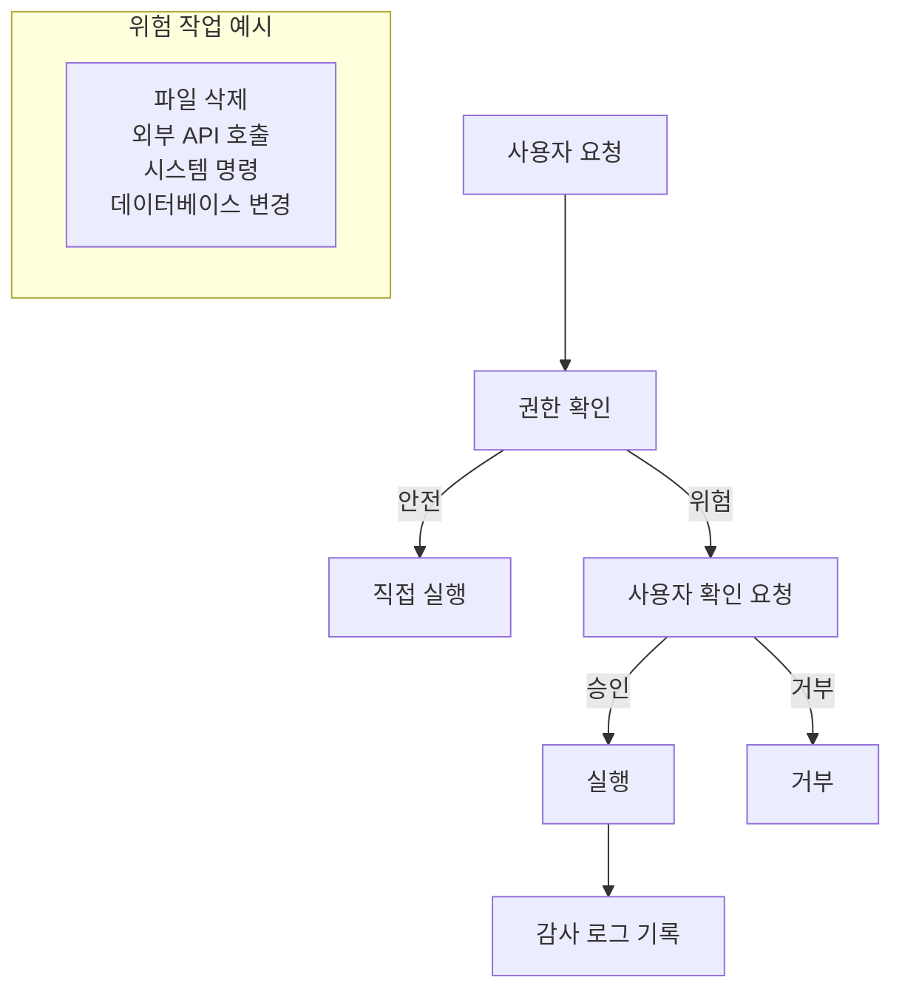
```mermaid
graph TB
    UserRequest[사용자 요청] --> PermCheck[권한 확인]
    
    PermCheck -->|안전| DirectExec[직접 실행]
    PermCheck -->|위험| UserConfirm[사용자 확인 요청]
    
    UserConfirm -->|승인| Execute[실행]
    UserConfirm -->|거부| Reject[거부]
    
    subgraph "위험 작업 예시"
        DangerOps[파일 삭제<br/>외부 API 호출<br/>시스템 명령<br/>데이터베이스 변경]
    end
    
    Execute --> AuditLog[감사 로그 기록]
```

**MCP 보안 게이트**:
- MCP 서버가 파일 시스템이나 인터넷에 접근할 때 명시적 승인 요청
- 각 도구의 범위 제한 설정 가능
- OAuth 자격증명 자체 관리 지원

**dangerously-skip-permissions 모드**:
- 신뢰할 수 있는 환경에서 자동화를 위해 사용
- 모든 권한 확인을 건너뜀
- 프로덕션 사용 시 극도의 주의 필요

```bash
# 위험: 모든 권한 자동 승인
claude --dangerously-skip-permissions
```

### 3. 관찰 가능성 및 디버깅

**실시간 사고 과정 표시**:

```bash
# Ctrl+O로 트랜스크립트 모드 활성화
# Claude의 추론 과정을 실시간으로 확인
```

```
[Thinking]
1. 사용자가 인증 기능 추가를 요청했습니다
2. 기존 코드베이스를 분석해보니 Flask를 사용 중입니다
3. 데이터베이스는 SQLAlchemy ORM을 사용합니다
4. 보안을 위해 bcrypt를 사용해야 합니다
5. 다음 파일들을 수정해야 합니다:
   - models/user.py (신규)
   - routes/auth.py (신규)
   - requirements.txt (bcrypt 추가)
6. 테스트 파일도 필요합니다:
   - tests/test_auth.py (신규)
[/Thinking]

[Plan]
1단계: User 모델 생성
2단계: 인증 라우트 추가
3단계: 테스트 작성
4단계: 의존성 업데이트
[/Plan]
```

**Progress Indicators**:

Claude Code 2.1.0은 실시간 진행 상황을 표시합니다:

```
🔧 Executing...
├─ [●●●●●○○○○○] Reading files (5/10)
├─ [●●●●○○○○○○] Analyzing code (4/10)
└─ [●●○○○○○○○○] Writing changes (2/10)

Tools in use:
├─ Read: user.py, auth.py
├─ Edit: routes/auth.py
└─ Bash: pytest tests/
```

**Flight Recorder**:
- 모든 LLM 추론 과정 기록
- 디버깅 및 감사를 위한 재생 기능
- 실패한 세션 분석 가능

### 4. 확장성 패턴

**병렬 세션 관리**:

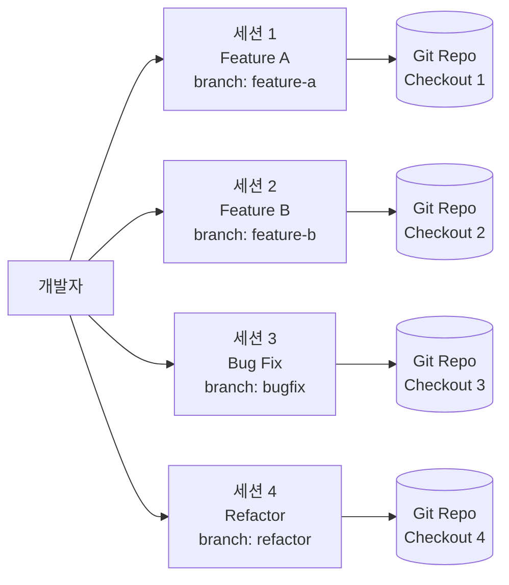
```mermaid
graph LR
    Developer[개발자]
    
    Developer --> Session1[세션 1<br/>Feature A<br/>branch: feature-a]
    Developer --> Session2[세션 2<br/>Feature B<br/>branch: feature-b]
    Developer --> Session3[세션 3<br/>Bug Fix<br/>branch: bugfix]
    Developer --> Session4[세션 4<br/>Refactor<br/>branch: refactor]
    
    Session1 --> GitRepo1[(Git Repo<br/>Checkout 1)]
    Session2 --> GitRepo2[(Git Repo<br/>Checkout 2)]
    Session3 --> GitRepo3[(Git Repo<br/>Checkout 3)]
    Session4 --> GitRepo4[(Git Repo<br/>Checkout 4)]
```

Boris Cherny의 접근:
- 5개 로컬 세션 + 5-10개 원격 세션
- 각 로컬 세션은 별도 Git 체크아웃
- `&`로 백그라운드 세션 시작
- `/teleport`로 로컬 ↔ 원격 전환

**세션 간 지식 공유**:

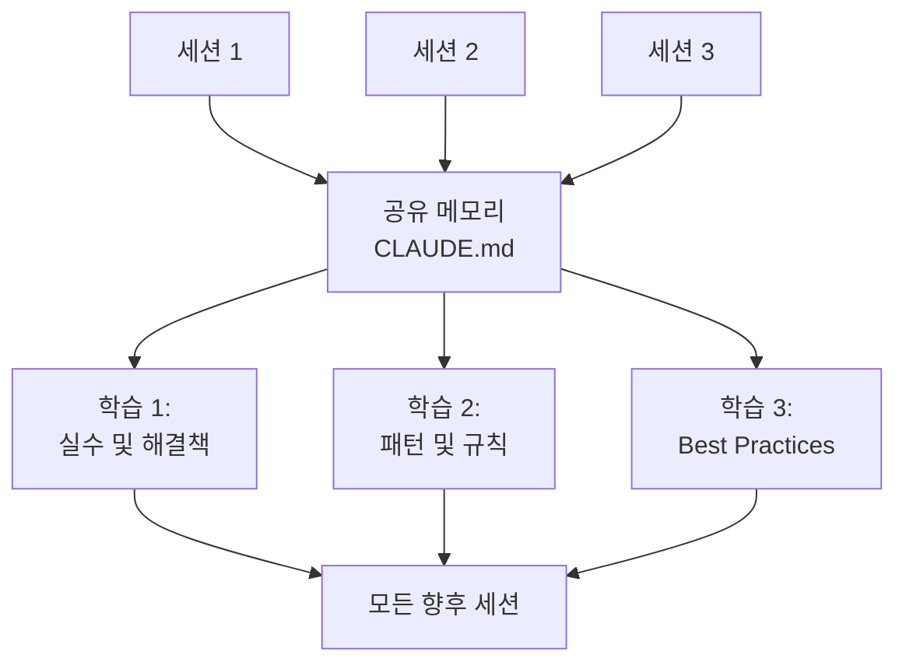
```mermaid
graph TB
    Session1[세션 1] --> SharedMemory[공유 메모리<br/>CLAUDE.md]
    Session2[세션 2] --> SharedMemory
    Session3[세션 3] --> SharedMemory
    
    SharedMemory --> Learning1[학습 1:<br/>실수 및 해결책]
    SharedMemory --> Learning2[학습 2:<br/>패턴 및 규칙]
    SharedMemory --> Learning3[학습 3:<br/>Best Practices]
    
    Learning1 --> AllSessions[모든 향후 세션]
    Learning2 --> AllSessions
    Learning3 --> AllSessions
```

## 엔터프라이즈 통합 패턴

### CI/CD 파이프라인 통합

```yaml
# .github/workflows/claude-code-review.yml
name: Claude Code Review

on:
  pull_request:
    types: [opened, synchronize]

jobs:
  claude-review:
    runs-on: ubuntu-latest
    steps:
      - uses: actions/checkout@v3
      
      - name: Install Claude Code
        run: curl -fsSL https://claude.ai/install.sh | bash
      
      - name: Run Claude Code Review
        env:
          CLAUDE_API_KEY: ${{ secrets.CLAUDE_API_KEY }}
        run: |
          claude --dangerously-skip-permissions << EOF
          /review
          이 PR의 변경사항을 검토하고 다음을 확인해주세요:
          1. 보안 취약점
          2. 성능 이슈
          3. 코드 품질
          4. 테스트 커버리지
          
          결과를 review-report.md에 저장해주세요.
          EOF
      
      - name: Post Review Comment
        uses: actions/github-script@v6
        with:
          script: |
            const fs = require('fs');
            const report = fs.readFileSync('review-report.md', 'utf8');
            github.rest.issues.createComment({
              issue_number: context.issue.number,
              owner: context.repo.owner,
              repo: context.repo.repo,
              body: report
            });
```

### 다중 에이전트 오케스트레이션 (Claude-Flow)

Claude-Flow 같은 프레임워크는 Claude Code를 다중 에이전트 시스템으로 변환합니다:

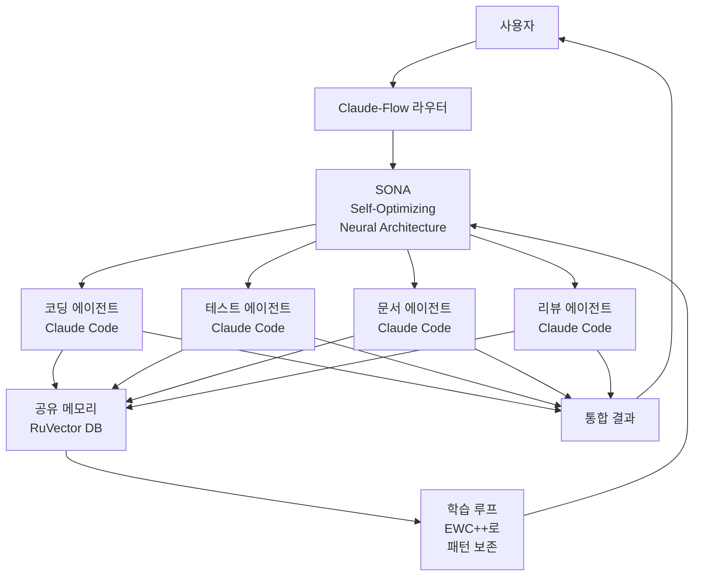
```mermaid
graph TB
    User[사용자] --> Router[Claude-Flow 라우터]
    
    Router --> SONA[SONA<br/>Self-Optimizing<br/>Neural Architecture]
    
    SONA --> Agent1[코딩 에이전트<br/>Claude Code]
    SONA --> Agent2[테스트 에이전트<br/>Claude Code]
    SONA --> Agent3[문서 에이전트<br/>Claude Code]
    SONA --> Agent4[리뷰 에이전트<br/>Claude Code]
    
    Agent1 --> Memory[공유 메모리<br/>RuVector DB]
    Agent2 --> Memory
    Agent3 --> Memory
    Agent4 --> Memory
    
    Memory --> Learning[학습 루프<br/>EWC++로<br/>패턴 보존]
    
    Learning --> SONA
    
    Agent1 --> Results[통합 결과]
    Agent2 --> Results
    Agent3 --> Results
    Agent4 --> Results
    
    Results --> User
```

**특징**:
- SONA: 어떤 에이전트가 어떤 작업에 최적인지 학습
- EWC++: 새로운 학습 시 기존 패턴 보존
- MoE (Mixture of Experts): 각 에이전트의 전문성 활용

## 실제 사용 사례

### 케이스 1: 전체 웹 앱 생성 (Figma → 코드)

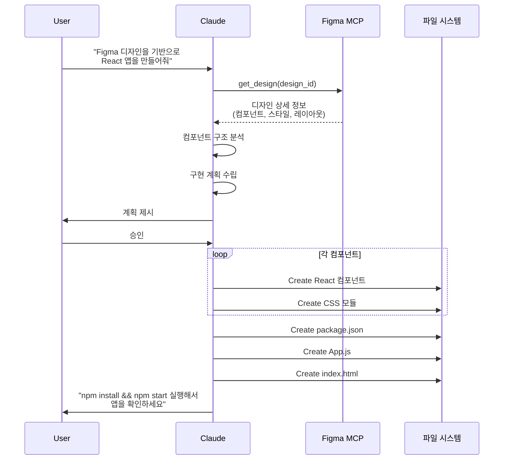
```mermaid
sequenceDiagram
    participant User
    participant Claude
    participant FigmaMCP as Figma MCP
    participant FileSystem as 파일 시스템
    
    User->>Claude: "Figma 디자인을 기반으로<br/>React 앱을 만들어줘"
    Claude->>FigmaMCP: get_design(design_id)
    FigmaMCP-->>Claude: 디자인 상세 정보<br/>(컴포넌트, 스타일, 레이아웃)
    
    Claude->>Claude: 컴포넌트 구조 분석
    Claude->>Claude: 구현 계획 수립
    Claude->>User: 계획 제시
    User->>Claude: 승인
    
    loop 각 컴포넌트
        Claude->>FileSystem: Create React 컴포넌트
        Claude->>FileSystem: Create CSS 모듈
    end
    
    Claude->>FileSystem: Create package.json
    Claude->>FileSystem: Create App.js
    Claude->>FileSystem: Create index.html
    
    Claude->>User: "npm install && npm start 실행해서<br/>앱을 확인하세요"
```

### 케이스 2: 이슈 → PR 자동화

```
개발자: "GitHub 이슈 #123을 구현하고 PR을 만들어줘"

Claude Code 실행:

1. [GitHub MCP] 이슈 #123 조회
   └─ 제목: "사용자 프로필 페이지 추가"
   └─ 요구사항: 프로필 보기, 편집, 아바타 업로드

2. [Planning] 작업 분해
   ├─ models/profile.py: Profile 모델 생성
   ├─ routes/profile.py: API 엔드포인트
   ├─ templates/profile.html: 프론트엔드
   ├─ static/js/profile.js: 클라이언트 로직
   └─ tests/test_profile.py: 테스트

3. [Implementation] 각 파일 생성 및 수정
   [████████████████████] 100%

4. [Verification] 자체 테스트
   ├─ 유닛 테스트: ✓ 통과
   ├─ 통합 테스트: ✓ 통과
   └─ 린터: ✓ 통과

5. [Git] 변경사항 커밋
   └─ Commit: "feat: Add user profile page (#123)"

6. [GitHub MCP] PR 생성
   ├─ 제목: "Add user profile page"
   ├─ 설명: PR 템플릿 기반 자동 생성
   ├─ 라벨: "feature", "ready-for-review"
   └─ PR #456 생성 완료

7. [Slack MCP] 팀 알림
   └─ "#engineering 채널에 PR 링크 전송"

완료! PR: https://github.com/company/repo/pull/456
```

### 케이스 3: 레거시 코드베이스 현대화

```
시니어 개발자: "이 레거시 Flask 앱을 FastAPI로 마이그레이션해줘"

Claude Code 분석 및 계획:

Phase 1: 아키텍처 분석
├─ 현재 구조 매핑
│  ├─ 30개 Flask 라우트
│  ├─ SQLAlchemy 모델 15개
│  ├─ Jinja2 템플릿 50개
│  └─ 의존성 분석
│
├─ FastAPI 설계
│  ├─ Pydantic 모델로 변환
│  ├─ 비동기 엔드포인트 설계
│  └─ 타입 힌트 추가
│
└─ 마이그레이션 전략
   ├─ 단계별 전환 (점진적)
   ├─ 병렬 실행 기간
   └─ 테스트 전략

Phase 2: 점진적 마이그레이션 (승인 받음)

Step 1: 새 FastAPI 프로젝트 구조
[●●●●●●●●●●] 완료

Step 2: Pydantic 모델 생성 (병렬)
[●●●●●●●○○○] 70%
├─ User 모델 ✓
├─ Post 모델 ✓
├─ Comment 모델 ✓
└─ ...

Step 3: API 엔드포인트 변환 (순차)
[●●●○○○○○○○] 30%
├─ /api/users/* ✓
├─ /api/posts/* (진행 중)
└─ ...

각 단계마다:
- 기존 Flask 코드 분석
- FastAPI 버전 생성
- 테스트 작성 및 실행
- 사용자 승인 대기
```

## 성능 및 최적화

### 컨텍스트 윈도우 최적화

**컴팩션 전략**:

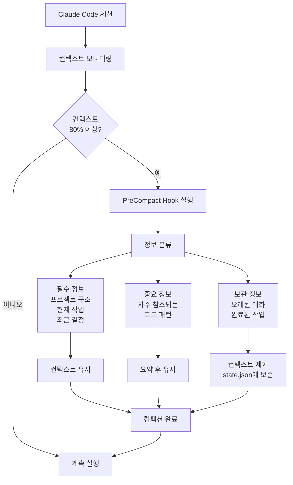
```mermaid
graph TB
    Session[Claude Code 세션] --> Monitor[컨텍스트 모니터링]
    
    Monitor --> Check{컨텍스트<br/>80% 이상?}
    Check -->|아니오| Continue[계속 실행]
    Check -->|예| PreCompact[PreCompact Hook 실행]
    
    PreCompact --> Categorize[정보 분류]
    
    Categorize --> Critical[필수 정보<br/>프로젝트 구조<br/>현재 작업<br/>최근 결정]
    Categorize --> Important[중요 정보<br/>자주 참조되는<br/>코드 패턴]
    Categorize --> Archive[보관 정보<br/>오래된 대화<br/>완료된 작업]
    
    Critical --> Keep[컨텍스트 유지]
    Important --> Summarize[요약 후 유지]
    Archive --> Remove[컨텍스트 제거<br/>state.json에 보존]
    
    Keep --> Compact[컴팩션 완료]
    Summarize --> Compact
    Remove --> Compact
    
    Compact --> Continue
```

### 도구 호출 최적화

**MCP Tool Search의 영리한 로딩**:

```python
# 개념적 구현
class MCPToolSearch:
    def __init__(self, threshold=0.1):
        self.threshold = threshold  # 컨텍스트의 10%
        self.loaded_tools = {}
        
    def should_defer_loading(self, all_tools, context_size):
        tool_definitions_size = sum(len(t.definition) for t in all_tools)
        return tool_definitions_size / context_size > self.threshold
    
    def search_relevant_tools(self, query, all_tools):
        """
        Claude가 작업에 관련된 도구만 검색하여 로드
        """
        # 임베딩 기반 유사도 검색
        relevant = similarity_search(query, all_tools)
        
        # 필요한 도구만 컨텍스트에 추가
        for tool in relevant[:5]:  # 상위 5개만
            if tool.id not in self.loaded_tools:
                self.load_tool_to_context(tool)
        
        return relevant[:5]
```

### 병렬 처리 패턴

**다중 세션의 효율적 활용**:

```bash
# 백그라운드 세션 시작
claude &  # 세션 1: Feature A
claude &  # 세션 2: Feature B
claude &  # 세션 3: 리팩토링
claude &  # 세션 4: 문서화
claude    # 세션 5: 대화형

# 세션 간 전환
fg %1  # 세션 1로 전환
# 작업 후
Ctrl+Z  # 백그라운드로

# 원격 세션으로 텔레포트
/teleport session-id-abc123
```

## 한계 및 Best Practices

### 현재의 한계점

1. **계획 없는 작업의 방황 위험**:
   - 복잡한 작업은 반드시 계획 단계부터 시작
   - "좋은 계획이 정말 중요합니다" (Boris Cherny)

2. **세션 간 컨텍스트 손실**:
   - 기본적으로 각 세션은 독립적
   - 해결책: memory-mcp 같은 도구 사용

3. **일부 세션의 실패율 (10-20%)**:
   - 예상치 못한 시나리오로 인한 세션 포기
   - 병렬 세션을 통한 리스크 분산

4. **비용 고려**:
   - Claude Opus 4.5는 높은 성능이지만 비용도 높음
   - 적절한 모델 선택 (Sonnet 4.5, Haiku 4.5)

### Best Practices

**1. 명확한 프로젝트 구조 유지**:

```
project/
├── .claude/
│   ├── skills/           # 프로젝트 전용 Skills
│   └── config.json       # 프로젝트 설정
├── .memory/
│   └── state.json        # 영속적 메모리
├── CLAUDE.md             # 프로젝트 컨텍스트 (~150 lines)
├── docs/
│   ├── architecture.md   # 아키텍처 문서
│   └── conventions.md    # 코딩 규칙
└── ...
```

**2. CLAUDE.md의 전략적 활용**:

```markdown
# 프로젝트: EcommerceAPI

## 아키텍처
- FastAPI + PostgreSQL + Redis
- 마이크로서비스 아키텍처
- 이벤트 주도 설계 (RabbitMQ)

## 코딩 규칙
- 모든 엔드포인트는 Pydantic 모델 사용
- 비즈니스 로직은 services/ 폴더에
- 데이터 접근은 repositories/ 폴더에
- 테스트 커버리지 최소 80%

## 자주 하는 실수
1. ❌ SQLAlchemy 모델을 직접 반환
   ✅ Pydantic 모델로 변환 후 반환
   
2. ❌ 동기 DB 호출
   ✅ 비동기 SQLAlchemy 사용

## 결정 기록
- 2025-12-15: Celery 대신 RabbitMQ 직접 사용
  이유: 더 세밀한 제어 필요
  
- 2026-01-10: 인증에 JWT 대신 Session 사용
  이유: 모바일 앱 요구사항

## 중요 파일
- config/settings.py: 모든 설정의 중앙 집중
- middleware/auth.py: 인증 로직
- utils/validators.py: 공통 검증 함수
```

**3. 반복적 개선 워크플로우**:

```
1. 계획 수립 → 승인 → 구현 → 검증 → 커밋
   ↑                                    ↓
   └──────────── 개선 필요 ───────────────┘
```

**4. 슬래시 커맨드 활용**:

| 커맨드 | 용도 | 시기 |
|--------|------|------|
| `/plan` | 계획 수립 | 복잡한 작업 시작 시 |
| `/refine` | 계획 개선 | 계획이 불완전할 때 |
| `/auto-accept` | 자동 편집 | 계획 승인 후 |
| `/verify` | 검증 | 구현 완료 후 |
| `/commit` | 커밋 메시지 생성 | 변경사항 저장 시 |
| `/pr` | PR 설명 생성 | PR 생성 시 |
| `/review` | 코드 리뷰 | PR 리뷰 시 |
| `/teleport` | 세션 이동 | 로컬 ↔ 웹 전환 |

**5. 팀 차원의 지식 축적**:

```bash
# PR 리뷰 시 학습 내용 태그
git commit -m "feat: Add caching layer

학습 내용:
- Redis 연결은 앱 시작 시 한 번만
- TTL은 데이터 특성에 따라 차등 적용
- 캐시 무효화 패턴 사용
"

# CLAUDE.md에 자동으로 추가됨
```

## 미래 전망 및 발전 방향

### 2026년 트렌드

1. **MCP 생태계의 급속한 성장**:
   - OpenAI (2025년 3월), Google (2025년 4월) MCP 채택
   - 수백 개의 MCP 서버 생태계
   - "에이전트를 돕는 에이전트" 패턴의 확산

2. **UI 프레임워크 통합**:
   - MCP UI Framework (2026년 1월 발표)
   - 채팅 창 내 인터랙티브 대시보드
   - 텍스트 명령을 넘어선 그래픽 인터페이스

3. **더 긴 실행 시간**:
   - Claude Opus 4.5: 30시간 연속 작업 집중
   - 다일 프로젝트도 단일 세션에서 완료 가능
   - 중단/재개 메커니즘 개선

4. **향상된 추론 능력**:
   - GPT-5.2급 추론 모델
   - 더 정확한 아키텍처 이해
   - "Vibe Coding"의 진화

### 예상되는 발전

**1. 완전 자율 개발 파이프라인**:


```mermaid
graph LR
    Idea[아이디어] --> Spec[요구사항 명세서 생성]
    Spec --> Design[아키텍처 설계]
    Design --> Impl[구현]
    Impl --> Test[테스트 작성 및 실행]
    Test --> Review[자체 코드 리뷰]
    Review --> Deploy[CI/CD 배포]
    Deploy --> Monitor[모니터링]
    
    Monitor -->|이슈 발견| Hotfix[자동 핫픽스]
    Hotfix --> Test
```

**2. 멀티 모달 통합**:

```
개발자: [Figma 디자인 스크린샷 업로드]
        "이 디자인을 구현하되, 우리 디자인 시스템을 따라줘"

Claude Code:
1. [Vision] 디자인 분석
2. [MCP] 내부 디자인 시스템 조회
3. [Planning] 컴포넌트 매핑
4. [Implementation] 코드 생성
5. [Verification] 시각적 검증
```

**3. 팀 협업 강화**:

```mermaid
graph TB
    TeamCLAUDE[팀 공유 CLAUDE.md] --> Dev1[개발자 1의<br/>Claude Code]
    TeamCLAUDE --> Dev2[개발자 2의<br/>Claude Code]
    TeamCLAUDE --> Dev3[개발자 3의<br/>Claude Code]
    
    Dev1 --> Learning1[새로운 패턴 발견]
    Dev2 --> Learning2[버그 수정 방법]
    Dev3 --> Learning3[성능 최적화]
    
    Learning1 --> TeamCLAUDE
    Learning2 --> TeamCLAUDE
    Learning3 --> TeamCLAUDE
```

## 결론: 새로운 소프트웨어 개발 패러다임

Claude Code는 단순한 도구를 넘어서 소프트웨어 개발의 패러다임 자체를 변화시키고 있습니다. 2026년 현재, 우리는 다음을 목격하고 있습니다:

### 핵심 변화

**1. 개발자 역할의 진화**:
- 코드 작성자 → 아키텍트 및 감독자
- 세부 구현 → 고수준 의도 표현
- 개별 작업 → 에이전트 오케스트레이션

**2. 품질과 속도의 동시 향상**:
- Reflection 패턴으로 코드 품질 보장
- Planning 패턴으로 복잡성 관리
- Multi-Agent 패턴으로 병렬 처리
- Tool Use 패턴으로 정확성 확보

**3. 지식의 축적과 공유**:
- CLAUDE.md를 통한 프로젝트 메모리
- 팀 차원의 학습 공유
- 실수의 자동 문서화
- Best Practice의 지속적 개선

### 실무 적용 가이드

**시작 단계**:
1. Claude Code 설치 및 기본 사용
2. CLAUDE.md 작성 시작
3. 간단한 작업부터 위임
4. Skills 및 MCP 서버 추가

**성숙 단계**:
1. 팀 CLAUDE.md 공유
2. 다중 세션 병렬 운영
3. CI/CD 통합
4. 커스텀 Skills 개발

**전문가 단계**:
1. 멀티 에이전트 오케스트레이션
2. 프로덕션 워크플로우 완전 자동화
3. MCP 서버 자체 개발
4. 조직 차원의 지식 베이스 구축

### 최종 평가

Claude Code의 아키텍처는 다음 원칙들을 훌륭하게 구현하고 있습니다:

- **모듈성**: MCP를 통한 무한 확장 가능
- **관찰 가능성**: 실시간 추론 과정 표시
- **안전성**: 명시적 권한 관리
- **학습**: 지속적 개선 메커니즘
- **협업**: 팀 지식 공유

2026년의 소프트웨어 개발은 "AI를 사용할 것인가"가 아니라 "AI와 어떻게 효과적으로 협업할 것인가"에 관한 것입니다. Claude Code는 그 협업의 가장 성숙한 형태를 보여주고 있으며, 앞서 살펴본 Agentic 디자인 패턴들이 실제 프로덕션 환경에서 어떻게 작동하는지 입증하고 있습니다.

"당신은 여전히 설계 결정권을 가지고 있습니다. Claude Code는 그 결정을 실행하는 강력한 파트너일 뿐입니다." - 이것이 2026년 Agentic 개발의 본질입니다.

---

**문서 작성 일자**: 2026-01-31
