## 서론: 코딩이 아니라 문제 해결부터

2024년 4월, GitHub Next는 Copilot Workspace를 발표하며 소프트웨어 개발의 근본적인 질문을 던졌습니다: **"왜 우리는 여전히 빈 파일에서 시작하는가?"**

전통적인 개발은 이렇게 시작됩니다:
1. 이슈를 읽고 이해한다
2. IDE를 연다
3. 빈 파일을 만든다
4. 코드를 작성한다

Copilot Workspace는 이 흐름을 완전히 뒤집었습니다:
1. 이슈에서 직접 시작한다
2. AI가 사양(Spec)을 생성한다
3. AI가 계획(Plan)을 수립한다
4. AI가 코드를 구현한다
5. 개발자는 검토하고 승인한다

**"아이디어에서 프로덕션 준비 코드까지"** - 이것이 Copilot Workspace가 추구하는 비전입니다. 2025년 5월 30일 기술 프리뷰가 종료되고 모든 유료 Copilot 고객에게 제공되면서, Workspace는 Microsoft의 Agentic 개발 전략의 핵심 축이 되었습니다.

## GitHub Copilot Workspace vs GitHub Copilot

먼저 혼동을 피하기 위해 명확히 구분해야 합니다:

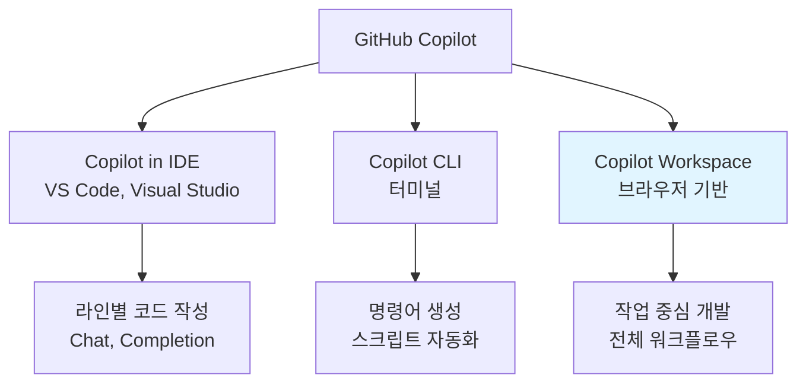

| 측면 | Copilot in IDE | Copilot CLI | Copilot Workspace |
|------|----------------|-------------|-------------------|
| **위치** | IDE 내부 | 터미널 | 브라우저 |
| **시작점** | 파일 편집기 | 명령 프롬프트 | GitHub 이슈/PR |
| **범위** | 파일 단위 | 명령어 단위 | 프로젝트 전체 |
| **워크플로우** | 동기적 | 동기적 | 비동기적 |
| **주요 사용** | 코드 작성 | 터미널 작업 | 작업 계획 및 구현 |
| **출력** | 코드 조각 | 명령어/스크립트 | PR 전체 |

## 전체 아키텍처 개요

### 워크플로우 전체 흐름

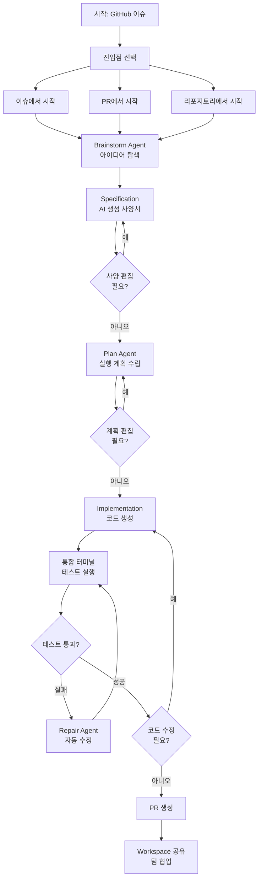

### 5단계 개발 파이프라인

Copilot Workspace의 핵심은 **Task → Spec → Plan → Code → PR**이라는 명확한 5단계 파이프라인입니다.

```mermaid
stateDiagram-v2
    [*] --> Task
    
    Task: 1. Task
    state Task {
        [*] --> IssueInput
        IssueInput --> NLDescription
        NLDescription: 자연어로 문제 설명
    }
    
    Task --> Spec
    
    Spec: 2. Specification
    state Spec {
        [*] --> AIGenerated
        AIGenerated --> UserReview
        UserReview --> AIGenerated: 재생성
        UserReview --> Approved: 승인
    }
    
    Spec --> Plan
    
    Plan: 3. Plan
    state Plan {
        [*] --> FileList
        FileList: 변경할 파일 목록
        FileList --> Actions
        Actions: 파일별 액션
        Actions --> UserReview2
        UserReview2 --> FileList: 재생성
        UserReview2 --> Approved2: 승인
    }
    
    Plan --> Code
    
    Code: 4. Code
    state Code {
        [*] --> Diff
        Diff: AI 생성 코드
        Diff --> InlineEdit
        InlineEdit: 직접 편집 가능
        InlineEdit --> Test
        Test --> Pass: 통과
        Test --> Repair: 실패
        Repair --> Diff
    }
    
    Code --> PR
    
    PR: 5. Pull Request
    state PR {
        [*] --> OneClick
        OneClick: 원클릭 PR 생성
        OneClick --> Review
        Review: 팀 코드 리뷰
    }
    
    PR --> [*]
```

## 핵심 아키텍처 구성 요소

### 1. Brainstorm Agent: 아이디어 탐색

Copilot Workspace의 첫 번째 독특한 특징은 **Brainstorm Agent**입니다. 구현에 들어가기 전에 문제를 깊이 탐구합니다.

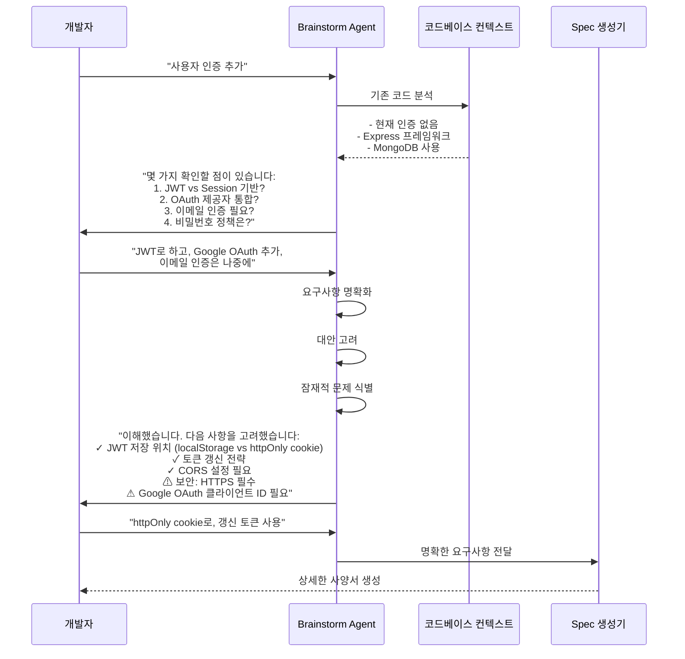

**Brainstorm의 역할**:

1. **모호성 제거**:
   - "인증 추가" → 구체적인 기술 선택
   - 암묵적 가정 명시화
   - 엣지 케이스 고려

2. **대안 탐색**:
   - 여러 접근법 제시
   - 장단점 비교
   - 프로젝트 컨텍스트에 맞는 추천

3. **리스크 식별**:
   - 보안 고려사항
   - 성능 영향
   - 호환성 문제

**실제 대화 예시**:

```
개발자: "이 앱에 결제 기능을 추가하고 싶어"

Brainstorm Agent:
"결제 기능 추가를 도와드리겠습니다. 먼저 몇 가지 확인하겠습니다:

1. 결제 제공자 선택:
   - Stripe (권장: 개발자 친화적, 풍부한 API)
   - PayPal (장점: 널리 사용됨)
   - Square (장점: 오프라인 통합)
   어떤 것을 선호하시나요?

2. 결제 흐름:
   - 일회성 결제인가요, 구독인가요?
   - 여러 통화 지원이 필요한가요?

3. 보안 고려사항:
   - PCI DSS 준수 필요 (카드 정보 직접 처리 시)
   - 권장: Stripe Checkout (호스팅된 결제 페이지)
   
4. 현재 코드베이스 분석:
   - Express + MongoDB 사용 중
   - Webhook 엔드포인트 추가 필요
   - 주문 상태 관리 로직 필요

이 정보를 바탕으로 구체적인 계획을 세우겠습니다."

개발자: "Stripe로 구독 결제, 단일 통화, Checkout 사용"

Brainstorm Agent:
"완벽합니다! 다음 구현 계획을 제안합니다:

✓ Stripe Checkout Session API 사용 (PCI 걱정 없음)
✓ Webhook으로 결제 상태 동기화
✓ MongoDB에 subscription 컬렉션 추가
⚠ 주의: Webhook 시그니처 검증 필수 (보안)
⚠ 주의: 멱등성 키 사용 (중복 처리 방지)

다음 단계로 진행할까요?"
```

### 2. Specification Generation: AI 생성 사양서

Brainstorm을 통해 명확해진 요구사항은 **Specification**으로 변환됩니다.

~~~markdown
# Specification: User Authentication with JWT and Google OAuth

## Overview
Implement a secure authentication system using JWT tokens and Google OAuth integration.

## Functional Requirements

### User Registration
- Users can register with email and password
- Password must meet security criteria:
  - Minimum 8 characters
  - At least one uppercase, lowercase, number, special char
- Email uniqueness validation
- Password hashing using bcrypt (cost factor: 12)

### User Login
- Email + password authentication
- Return JWT access token (15 min expiry)
- Return refresh token (7 days expiry)
- httpOnly cookie for refresh token

### Google OAuth
- OAuth 2.0 flow using passport-google-oauth20
- Create user account if first login
- Link to existing account if email matches

### Token Management
- Access token in response body
- Refresh token in httpOnly cookie
- Refresh endpoint: POST /auth/refresh
- Logout clears refresh token cookie

## Technical Specification

### Database Schema
```javascript
UserSchema = {
  _id: ObjectId,
  email: String (unique, indexed),
  password: String (hashed, optional for OAuth users),
  googleId: String (optional, indexed),
  createdAt: Date,
  updatedAt: Date
}

RefreshTokenSchema = {
  token: String (indexed),
  userId: ObjectId (ref: User),
  expiresAt: Date,
  createdAt: Date
}
```

### API Endpoints
- POST /auth/register - User registration
- POST /auth/login - Email/password login
- GET /auth/google - Initiate Google OAuth
- GET /auth/google/callback - OAuth callback
- POST /auth/refresh - Refresh access token
- POST /auth/logout - Logout (clear token)

### Security Measures
1. HTTPS only (redirect HTTP to HTTPS)
2. CORS configuration:
   - Allow: https://yourapp.com
   - Credentials: true
3. Rate limiting: 5 attempts/15 min per IP
4. JWT secret from environment variable
5. Refresh token rotation on use

### Dependencies
- jsonwebtoken: ^9.0.0
- bcrypt: ^5.1.0
- passport: ^0.6.0
- passport-google-oauth20: ^2.0.0
- express-rate-limit: ^6.7.0

## Non-Functional Requirements
- Response time: < 500ms for auth operations
- Token validation: < 50ms
- Concurrent users: 10,000+
- Availability: 99.9%

## Testing Strategy
- Unit tests for password hashing
- Integration tests for auth flows
- E2E tests for OAuth
- Security tests (SQL injection, XSS)
- Load tests (1000 req/sec)

## Implementation Priority
1. [High] JWT infrastructure
2. [High] Email/password auth
3. [Medium] Google OAuth
4. [Medium] Refresh token mechanism
5. [Low] Rate limiting
~~~

**Spec의 특징**:

- **편집 가능**: 모든 내용을 직접 수정 가능
- **재생성 가능**: 수정 후 "Regenerate" 클릭하면 하류 단계 자동 업데이트
- **버전 관리**: 변경 이력 자동 저장

### 3. Plan Generation: 실행 계획 수립

Specification이 승인되면 **Plan Agent**가 구체적인 실행 계획을 수립합니다.

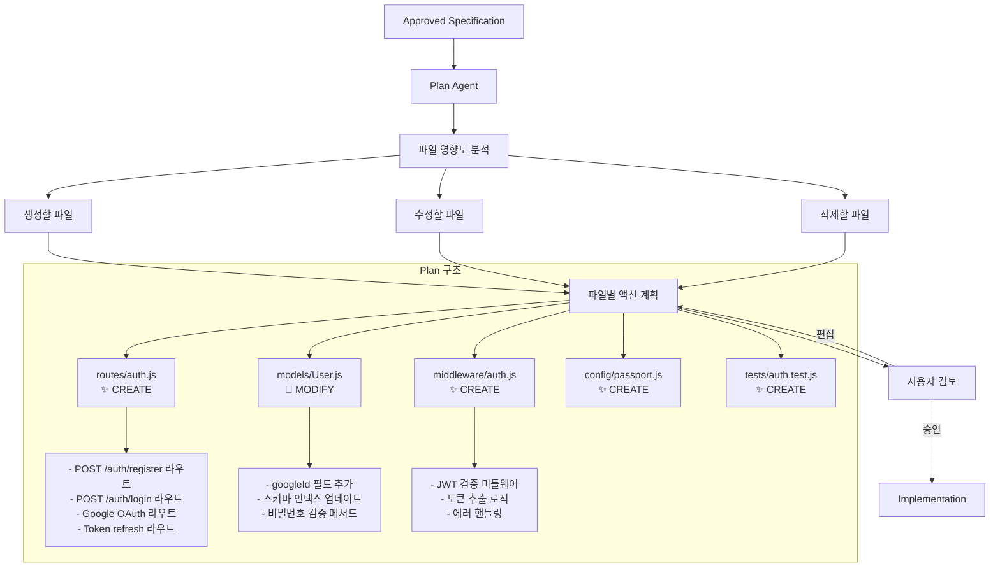

**Plan 예시**:

~~~markdown
# Implementation Plan

## Files to Create (5)

### ✨ routes/auth.js
- Create Express router for authentication
- Implement POST /auth/register endpoint
  - Validate email and password
  - Hash password with bcrypt
  - Create user document
  - Generate JWT access and refresh tokens
- Implement POST /auth/login endpoint
  - Validate credentials
  - Compare password hash
  - Generate tokens
- Implement GET /auth/google endpoint
  - Redirect to Google OAuth consent
- Implement GET /auth/google/callback endpoint
  - Exchange code for tokens
  - Create or link user account
  - Generate JWT tokens
- Implement POST /auth/refresh endpoint
  - Validate refresh token
  - Generate new access token
- Implement POST /auth/logout endpoint
  - Invalidate refresh token

### ✨ models/User.js
- Add googleId field (String, optional, indexed)
- Add validatePassword method
- Update schema to handle OAuth users (password optional)

### ✨ middleware/auth.js
- Create authenticateJWT middleware
  - Extract token from Authorization header
  - Verify JWT signature
  - Attach user to request object
  - Handle token expiration errors

### ✨ config/passport.js
- Configure Google OAuth strategy
- Set up callback URL
- Implement user serialization

### ✨ tests/auth.test.js
- Test user registration
- Test login with valid credentials
- Test login with invalid credentials
- Test token refresh
- Test Google OAuth flow
- Test logout

## Files to Modify (2)

### 📝 server.js
- Import auth routes
- Mount auth routes at /auth
- Add passport initialization

### 📝 package.json
- Add dependencies:
  - jsonwebtoken: ^9.0.0
  - bcrypt: ^5.1.0
  - passport: ^0.6.0
  - passport-google-oauth20: ^2.0.0
  - express-rate-limit: ^6.7.0

## Files to Delete (0)

## Dependency Graph
```
server.js
  └─ routes/auth.js
       ├─ models/User.js
       ├─ middleware/auth.js
       └─ config/passport.js
```

## Estimated Changes
- Total files: 7 (5 new, 2 modified)
- Estimated lines: ~600
- Complexity: Medium
- Estimated time: 4-6 hours
~~~

**Plan의 특징**:

1. **파일 순서 중요**:
   - 의존성 순서대로 나열
   - 테스트 파일은 마지막
   - 잘못된 순서 시 재정렬 가능

2. **액션의 세분성**:
   - 파일당 bullet point 리스트
   - 각 액션은 명확하고 실행 가능
   - 기술적 세부사항 포함

3. **유연한 편집**:
   - 파일 추가/제거 가능
   - 액션 수정 가능
   - 변경 시 자동 재생성

### 4. Code Implementation: AI 코드 생성

Plan이 승인되면 **Implementation 단계**에서 실제 코드가 생성됩니다.

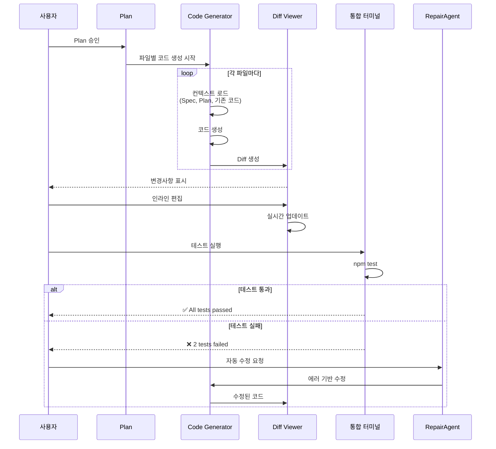

**생성된 코드 예시**:

```diff
diff --git a/routes/auth.js b/routes/auth.js
new file mode 100644
index 0000000..1234567
--- /dev/null
+++ b/routes/auth.js
+const express = require('express');
+const bcrypt = require('bcrypt');
+const jwt = require('jsonwebtoken');
+const User = require('../models/User');
+const { authenticateJWT } = require('../middleware/auth');
+
+const router = express.Router();
+
+// JWT 토큰 생성 헬퍼
+function generateAccessToken(userId) {
+  return jwt.sign({ userId }, process.env.JWT_SECRET, { 
+    expiresIn: '15m' 
+  });
+}
+
+function generateRefreshToken(userId) {
+  return jwt.sign({ userId }, process.env.JWT_REFRESH_SECRET, { 
+    expiresIn: '7d' 
+  });
+}
+
+// POST /auth/register - 사용자 등록
+router.post('/register', async (req, res) => {
+  try {
+    const { email, password } = req.body;
+    
+    // 이메일 중복 확인
+    const existingUser = await User.findOne({ email });
+    if (existingUser) {
+      return res.status(400).json({ error: 'Email already exists' });
+    }
+    
+    // 비밀번호 해싱
+    const hashedPassword = await bcrypt.hash(password, 12);
+    
+    // 사용자 생성
+    const user = new User({
+      email,
+      password: hashedPassword
+    });
+    
+    await user.save();
+    
+    // 토큰 생성
+    const accessToken = generateAccessToken(user._id);
+    const refreshToken = generateRefreshToken(user._id);
+    
+    // Refresh token을 httpOnly 쿠키로 설정
+    res.cookie('refreshToken', refreshToken, {
+      httpOnly: true,
+      secure: process.env.NODE_ENV === 'production',
+      sameSite: 'strict',
+      maxAge: 7 * 24 * 60 * 60 * 1000 // 7일
+    });
+    
+    res.status(201).json({ 
+      accessToken,
+      user: {
+        id: user._id,
+        email: user.email
+      }
+    });
+  } catch (error) {
+    res.status(500).json({ error: 'Server error' });
+  }
+});
+
+// POST /auth/login - 로그인
+router.post('/login', async (req, res) => {
+  // ... 구현
+});
+
+// POST /auth/refresh - 토큰 갱신
+router.post('/refresh', async (req, res) => {
+  // ... 구현
+});
+
+// POST /auth/logout - 로그아웃
+router.post('/logout', authenticateJWT, async (req, res) => {
+  // ... 구현
+});
+
+module.exports = router;
```

**Code Generation의 특징**:

1. **직접 편집 가능한 Diff**:
   - 생성된 코드를 바로 수정 가능
   - 실시간 구문 강조
   - 변경사항 즉시 반영

2. **컨텍스트 인식**:
   - 기존 코드 스타일 학습
   - 프로젝트 컨벤션 준수
   - import 문 자동 정리

3. **점진적 개선**:
   - Spec이나 Plan 수정 시 재생성
   - 부분 재생성 가능
   - 변경 이력 추적

### 5. Integrated Terminal: 테스트 및 검증

Copilot Workspace의 혁신적 기능 중 하나는 **통합 터미널**입니다.

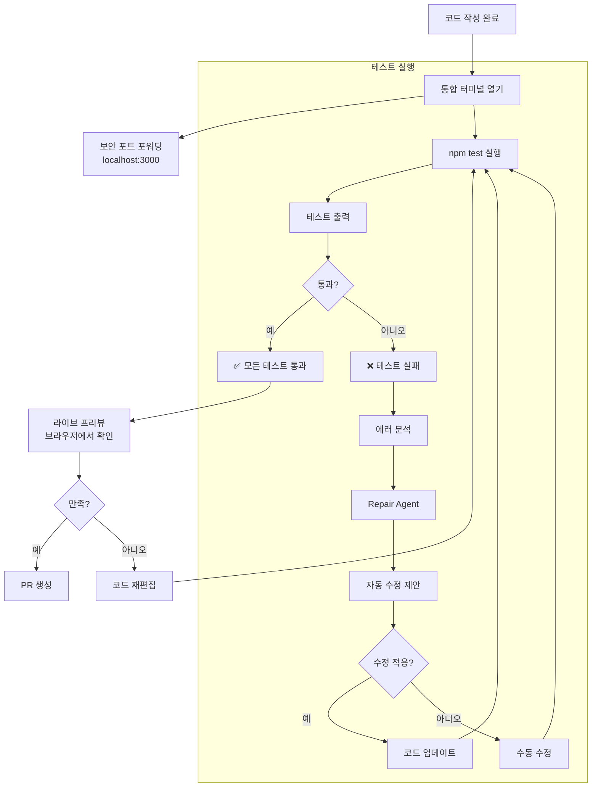

**Repair Agent 동작 예시**:

```
[터미널 출력]
$ npm test

  Auth Routes
    POST /auth/register
      ✓ should register a new user
      ✓ should reject duplicate email
      ✗ should reject weak password
        Expected status 400 but got 500
      
    POST /auth/login
      ✗ should login with valid credentials
        Error: JWT_SECRET is not defined

❌ 2 tests failed

[Repair Agent 분석]
문제를 분석했습니다:

1. 약한 비밀번호 검증 실패:
   - 원인: 비밀번호 검증 로직이 누락됨
   - 위치: routes/auth.js:22
   
2. JWT_SECRET 미정의:
   - 원인: 환경 변수 체크 로직 없음
   - 위치: routes/auth.js:10

자동 수정을 적용할까요? [예/아니오]

[사용자: 예]

[Repair Agent 수정 적용]
✓ 비밀번호 검증 로직 추가 (routes/auth.js)
✓ 환경 변수 체크 추가 (routes/auth.js)
✓ .env.example 파일 업데이트

재테스트를 실행할까요? [예/아니오]

[사용자: 예]

$ npm test

  Auth Routes
    POST /auth/register
      ✓ should register a new user
      ✓ should reject duplicate email
      ✓ should reject weak password
      
    POST /auth/login
      ✓ should login with valid credentials

✅ All tests passed (4 passing)
```

### 6. 원클릭 PR 생성

테스트가 통과하면 **원클릭으로 PR 생성**이 가능합니다.

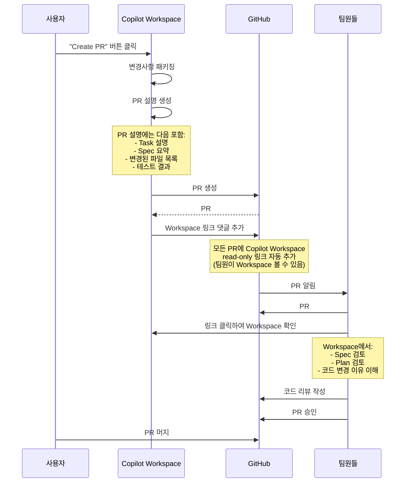

**자동 생성된 PR 설명 예시**:

```markdown
## 📋 Task
Add user authentication with JWT and Google OAuth

**Related Issue**: #456

## 📝 Specification Summary
Implemented a secure authentication system featuring:
- Email/password registration and login
- JWT-based token authentication (15min access, 7day refresh)
- Google OAuth 2.0 integration
- httpOnly cookies for refresh tokens
- Bcrypt password hashing (cost factor 12)

## 🛠️ Changes Made

### New Files (5)
- `routes/auth.js` - Authentication routes
- `models/User.js` - User model with OAuth support
- `middleware/auth.js` - JWT verification middleware
- `config/passport.js` - Google OAuth configuration
- `tests/auth.test.js` - Comprehensive test suite

### Modified Files (2)
- `server.js` - Mounted auth routes
- `package.json` - Added authentication dependencies

## ✅ Tests
All tests passing (4/4)
- ✓ User registration
- ✓ Duplicate email rejection
- ✓ Weak password rejection
- ✓ Valid login

## 🔐 Security Considerations
- Passwords hashed with bcrypt (cost factor 12)
- Refresh tokens in httpOnly cookies
- Rate limiting on auth endpoints
- HTTPS-only in production
- CORS properly configured

## 🎯 Next Steps
- [ ] Add email verification
- [ ] Implement password reset
- [ ] Add 2FA support

---

**Created with [Copilot Workspace](workspace-link-here)**
*View the full workspace context including spec and plan*
```

## 핵심 차별화 요소

### 1. 편집 가능성: 모든 단계가 수정 가능

Copilot Workspace의 가장 큰 차별점은 **"Everything is editable"** 철학입니다.

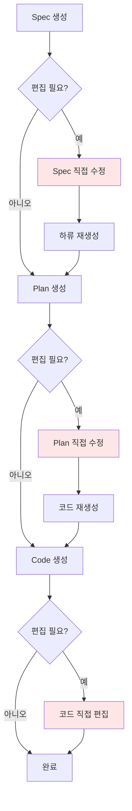

**vs 다른 플랫폼**:

| 플랫폼 | Spec 편집 | Plan 편집 | Code 편집 | 재생성 |
|--------|-----------|-----------|-----------|--------|
| **Copilot Workspace** | ✅ 직접 | ✅ 직접 | ✅ 직접 | ✅ 자동 |
| **Claude Code** | ❌ | ❌ | ✅ 제한적 | ❌ |
| **Antigravity** | ✅ Artifacts | ✅ Artifacts | ✅ 직접 | ✅ 수동 |
| **Cursor** | ❌ | ❌ | ✅ 직접 | ❌ |

### 2. 버전 관리: 자동 히스토리 추적

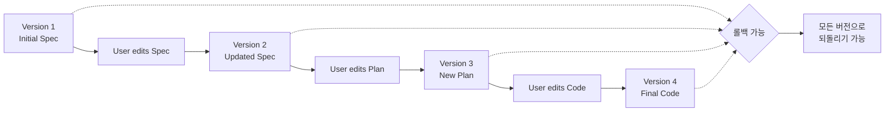

**특징**:
- 모든 변경사항 자동 저장
- 이전 버전으로 즉시 롤백
- 변경 이력 비교 가능
- 브랜치 개념 없이 선형 히스토리

### 3. 공유 및 협업: 스냅샷 기반

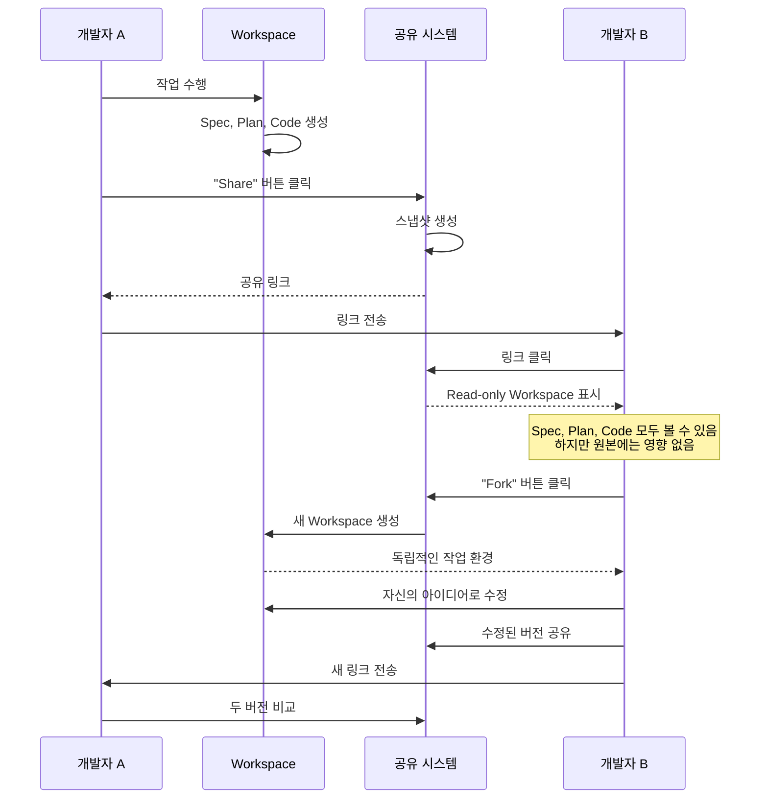

**공유 시나리오**:

1. **코드 리뷰**:
   - PR에 Workspace 링크 자동 추가
   - 리뷰어가 전체 컨텍스트 확인 가능
   - Spec과 Plan을 보고 의도 이해

2. **페어 프로그래밍**:
   - 동일 Workspace를 Fork하여 각자 탐색
   - 서로 다른 접근법 시도
   - 결과 비교 및 병합

3. **멘토링**:
   - 멘토가 Workspace 생성
   - 멘티가 Fork하여 직접 수정
   - 멘토가 변경사항 검토

### 4. 모바일 지원: 언제 어디서나

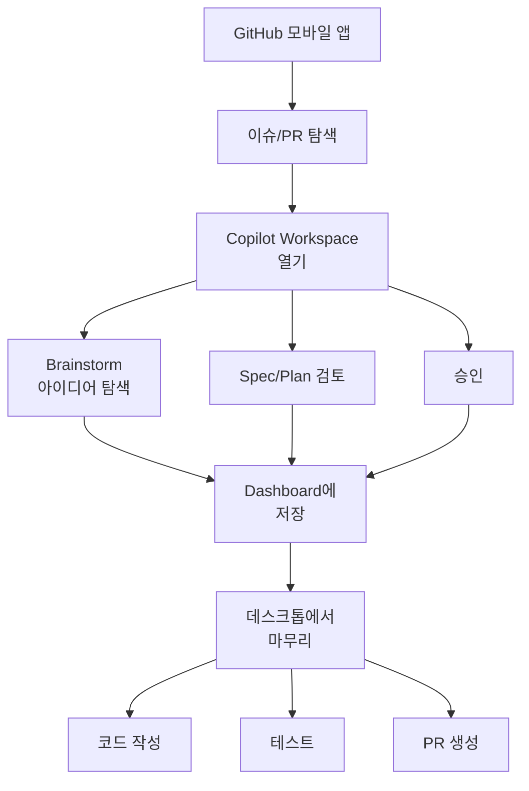

**사용 사례**:

```
시나리오: 출퇴근 시간 활용

[아침 지하철에서 - 모바일]
1. GitHub 앱에서 새 이슈 발견: "Add dark mode"
2. Copilot Workspace 열기
3. Brainstorm으로 요구사항 명확화
4. AI가 Spec 생성
5. Spec 검토 및 간단한 수정
6. "Save to Dashboard" 클릭

[저녁 책상에서 - 데스크톱]
1. Dashboard에서 저장된 Workspace 열기
2. Plan 검토 및 승인
3. 코드 생성 실행
4. 터미널에서 테스트
5. PR 생성

총 시간 절약: 30분 (Spec 작성 시간)
```

## 아키텍처 심층 분석

### Client-Server 아키텍처

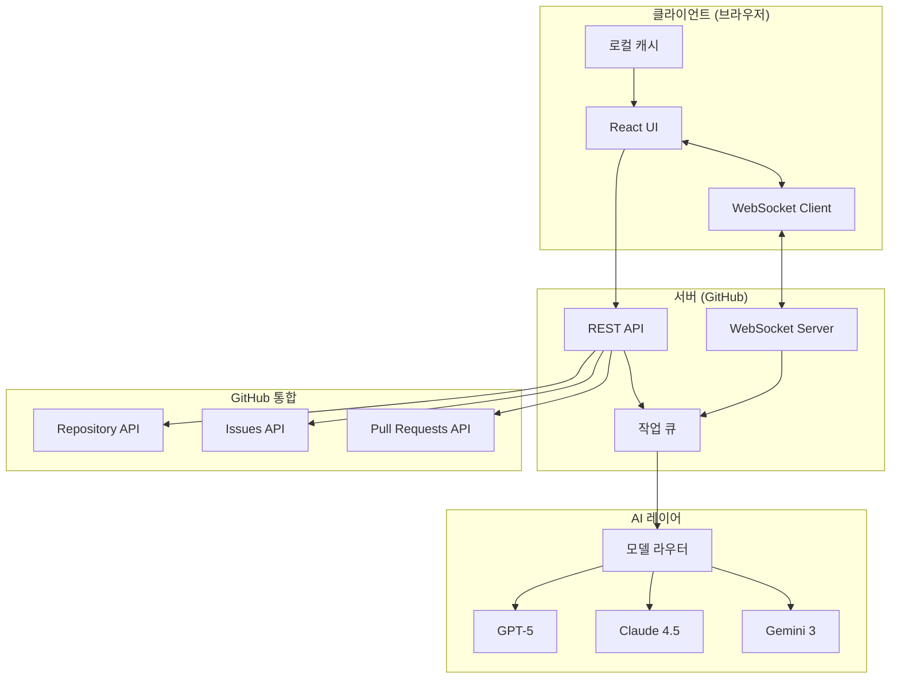

**데이터 흐름**:

1. **사용자 입력** (이슈 설명):
   - 클라이언트: 입력 캡처
   - WebSocket: 서버로 스트리밍
   - 서버: 작업 큐에 추가

2. **Spec 생성**:
   - 큐: Brainstorm 작업 디스패치
   - 라우터: GPT-5 선택 (빠른 생성)
   - GPT-5: Spec 생성
   - WebSocket: 스트리밍 결과 반환
   - 클라이언트: 실시간 렌더링

3. **Plan 생성**:
   - 큐: Plan 작업 디스패치
   - 라우터: Claude 4.5 선택 (정확성)
   - Claude: 파일 분석 및 Plan 생성
   - 결과 반환

4. **Code 생성**:
   - 큐: 각 파일별 작업 생성
   - 병렬 처리: 여러 파일 동시 생성
   - 라우터: 파일 타입에 따라 모델 선택
   - 결과 집계 및 반환

### 컨텍스트 관리

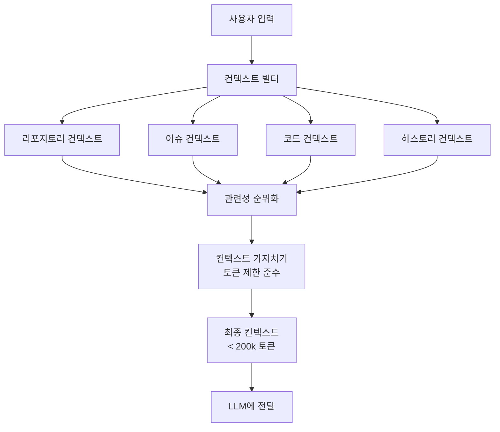

**컨텍스트 구성**:

```json
{
  "task": {
    "issue_number": 456,
    "title": "Add user authentication",
    "body": "We need JWT auth and Google OAuth...",
    "labels": ["enhancement", "security"],
    "created_by": "alice"
  },
  "repository": {
    "name": "my-app",
    "language": "JavaScript",
    "framework": "Express.js",
    "dependencies": {
      "express": "^4.18.0",
      "mongoose": "^7.0.0"
    }
  },
  "codebase": {
    "structure": [
      "routes/",
      "models/",
      "middleware/",
      "config/"
    ],
    "relevant_files": [
      {
        "path": "server.js",
        "lines": 50,
        "summary": "Main Express application setup"
      },
      {
        "path": "models/User.js",
        "lines": 30,
        "summary": "User model definition"
      }
    ]
  },
  "history": {
    "previous_specs": [],
    "previous_plans": [],
    "user_feedback": []
  }
}
```

### 모델 선택 전략

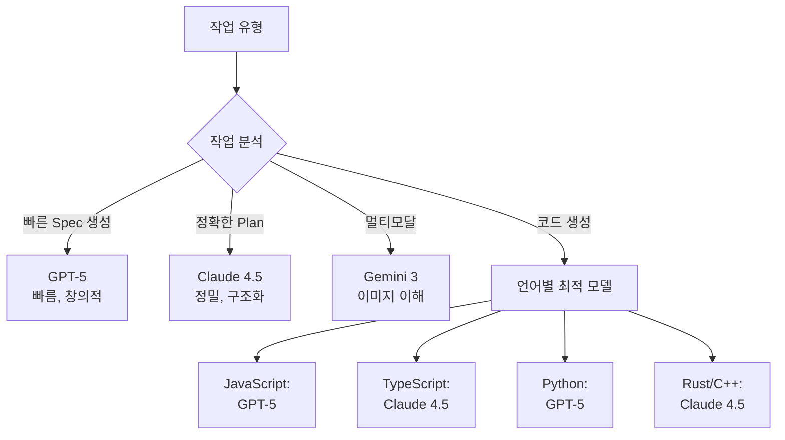

**모델별 사용**:

- **Brainstorm**: GPT-5 (창의적, 대화형)
- **Spec 생성**: GPT-5 (빠른 프로토타입)
- **Plan 생성**: Claude 4.5 (정밀한 파일 분석)
- **Code 생성**: 
  - JavaScript/Python: GPT-5
  - TypeScript/Rust: Claude 4.5
  - Java/C#: GPT-5
- **Repair**: Claude 4.5 (에러 분석)

## 실제 사용 사례

### 케이스 1: 풀스택 기능 추가 (30분 → 5분)

```
전통적 방법 (30분):
1. 이슈 읽기 (5분)
2. 아키텍처 설계 (10분)
3. 프론트엔드 코드 작성 (5분)
4. 백엔드 API 작성 (5분)
5. 테스트 작성 (5분)

Copilot Workspace (5분):
1. 이슈에서 Workspace 열기 (10초)
2. Brainstorm으로 요구사항 명확화 (1분)
3. Spec 검토 및 승인 (1분)
4. Plan 검토 및 승인 (1분)
5. 코드 생성 및 테스트 (1.5분)
6. PR 생성 (30초)

시간 절약: 25분 (83%)
```

**실제 워크플로우**:

```markdown
[Step 1: 이슈에서 시작]
Issue #789: Add product filtering by price range

[Step 2: Workspace 열기]
Copilot Workspace가 이슈를 분석 중...

[Step 3: Brainstorm]
AI: "가격 범위 필터링 기능을 추가하시는군요. 
     몇 가지 확인하겠습니다:
     
     1. UI는 슬라이더인가요, 입력 필드인가요?
     2. 최소/최대 가격 제한이 있나요?
     3. URL에 필터 상태를 저장할까요? (북마크 가능)
     4. 다른 필터와 함께 작동해야 하나요?"

개발자: "슬라이더로, 제한 없음, URL에 저장, 
         기존 카테고리 필터와 AND 조건"

[Step 4: Spec 생성]
✓ 자동 생성된 Spec:
  - 슬라이더 UI 컴포넌트 (Material-UI)
  - URL 쿼리 파라미터: ?minPrice=X&maxPrice=Y
  - 백엔드 API: GET /api/products?minPrice=X&maxPrice=Y&category=Z
  - 몽고DB 쿼리: $gte, $lte 연산자 사용
  
개발자: [Spec 승인]

[Step 5: Plan 생성]
✓ 자동 생성된 Plan:
  - components/PriceSlider.jsx (신규)
  - pages/ProductList.jsx (수정)
  - api/products.js (수정)
  - hooks/useQueryParams.js (신규)
  - tests/PriceSlider.test.jsx (신규)
  
개발자: [Plan 승인]

[Step 6: 코드 생성]
✓ 5개 파일 자동 생성
✓ 테스트 포함
✓ TypeScript 타입 정의

[Step 7: 테스트]
$ npm test
✅ All tests passed (8/8)

[Step 8: 라이브 프리뷰]
[브라우저에서 확인]
✓ 슬라이더 동작 확인
✓ URL 동기화 확인
✓ 다른 필터와 조합 확인

[Step 9: PR 생성]
✓ PR #790 created
✓ Workspace 링크 자동 추가
✓ 팀원에게 알림 전송

총 소요 시간: 5분 23초
```

### 케이스 2: 레거시 버그 수정 (1시간 → 10분)

```
시나리오: 복잡한 결제 버그

전통적 방법 (1시간):
1. 버그 리포트 읽기 (5분)
2. 관련 코드 찾기 (15분) ← 어려움
3. 원인 파악 (20분)
4. 수정 구현 (10분)
5. 테스트 (10분)

Copilot Workspace (10분):
1. 버그 이슈에서 Workspace 열기
2. Brainstorm: "어떤 시나리오에서 발생하나요?"
3. AI가 관련 파일 자동 식별 ← 핵심
4. Spec: 버그 원인 및 해결 방법
5. Plan: 수정할 파일 및 테스트
6. Code: 자동 수정
7. Repair Agent: 엣지 케이스 처리
8. PR 생성

시간 절약: 50분 (83%)
```

**실제 워크플로우**:

```markdown
[Issue #892: Payment fails for amounts over $1000]

Bug Report:
"고객이 $1000 이상 결제 시 500 에러 발생"

[Workspace Brainstorm]
AI: "이 버그를 이해하기 위해 몇 가지 질문하겠습니다:
     1. $999.99는 작동하나요? (경계값 확인)
     2. 특정 결제 방법에서만 발생하나요?
     3. 에러 로그가 있나요?"

개발자: "999.99는 OK, 모든 결제 방법, 
         로그: 'amount exceeds integer limit'"

AI: "아하! 정수 오버플로우 문제로 보입니다.
     센트 단위로 저장 시 $1000 = 100000 센트
     JavaScript Number.MAX_SAFE_INTEGER 초과 가능성"

[AI가 자동으로 관련 파일 탐색]
✓ 발견: payment/processor.js:45
  - 문제: Math.floor(amount * 100)
  - amount가 $1000일 때 오버플로우

✓ 발견: models/Order.js:12
  - 문제: amountCents: Number (32-bit)

[Spec 생성]
문제: 결제 금액을 센트로 변환 시 정수 타입 한계
해결: 
  1. BigInt 사용 또는
  2. Decimal.js 라이브러리 사용 (권장)
  3. 금액 타입을 String으로 저장

[Plan]
- payment/processor.js 수정
  - Decimal.js 사용
  - 안전한 센트 변환
- models/Order.js 수정
  - amountCents: String으로 변경
  - validation 추가
- tests/payment.test.js 추가
  - $1000 이상 테스트 케이스

[Code 자동 생성 및 테스트]
✅ 모든 테스트 통과
✅ $10,000 결제 성공 확인

[PR 생성]
✓ Bug fix: Handle payments over $1000
✓ Root cause 설명 포함
✓ 테스트 케이스 추가
```

### 케이스 3: 오픈소스 기여 (처음 → 20분)

```
시나리오: 생소한 코드베이스에 기여

전통적 방법 (수 시간):
1. README 읽기 (30분)
2. 코드베이스 탐색 (1시간)
3. 기여 가이드라인 확인 (20분)
4. 이슈 이해 (30분)
5. 코드 작성 (1시간)
6. PR 제출 (10분)

Copilot Workspace (20분):
1. "Good first issue" 선택
2. Workspace 열기
3. AI가 코드베이스 자동 분석 ← 핵심
4. Brainstorm으로 컨텍스트 파악
5. Spec/Plan/Code 자동 생성
6. 프로젝트 스타일 자동 준수
7. PR 제출

시간 절약: 2.5시간+
```

## 한계 및 과제

### 현재의 한계점

1. **사용량 제한** (프리뷰 기간):
   - 시간당 쿼터 제한
   - 일일 쿼터 제한
   - 복잡한 프로젝트 시 빠르게 소진

2. **파일 순서 문제**:
   - 때때로 잘못된 순서로 생성
   - 예: 테스트가 구현보다 먼저 생성
   - 결과물 품질 저하
   - 수동 재정렬 필요

3. **IDE 지원 제한**:
   - 현재 브라우저 및 VS Code만
   - Visual Studio, JetBrains 미지원
   - 일부 개발자는 워크플로우 전환 어려움

4. **오프라인 작업 불가**:
   - 완전한 클라우드 의존
   - 인터넷 없으면 사용 불가
   - 보안이 중요한 환경에서 제약

5. **복잡한 리팩토링 한계**:
   - 전체 아키텍처 변경은 여전히 어려움
   - 깊은 도메인 지식 필요한 작업 제한적
   - 레거시 코드 이해 한계

### 비교: Workspace vs 다른 플랫폼

| 측면 | Copilot Workspace | Claude Code | Antigravity |
|------|-------------------|-------------|-------------|
| **시작점** | GitHub 이슈/PR | 터미널/챗 | 이슈 또는 파일 |
| **워크플로우** | Task → Spec → Plan → Code | 대화 → 자동 편집 | Task → Plan → Code |
| **Brainstorm** | ✅ 전용 에이전트 | ❌ | 제한적 |
| **Plan 가시성** | ✅ 명시적, 편집 가능 | ❌ (내부) | ✅ Implementation Plan |
| **편집 가능성** | ✅ 모든 단계 | ✅ 코드만 | ✅ Artifacts |
| **테스트 통합** | ✅ 통합 터미널 | ✅ 자동 실행 | ✅ Agent로 실행 |
| **Repair** | ✅ 전용 에이전트 | ✅ 자동 | 제한적 |
| **PR 생성** | ✅ 원클릭 | ✅ 수동 | ✅ 원클릭 |
| **공유/협업** | ✅ 스냅샷 링크 | ❌ | ✅ Artifact 공유 |
| **모바일 지원** | ✅ GitHub 앱 | ❌ | ❌ |
| **가격** | Copilot 구독 포함 | Pro/Max | 무료 (preview) |

## Best Practices

### 1. 효과적인 이슈 작성

```markdown
❌ 나쁜 예:
"로그인 기능 추가"

✅ 좋은 예:
"사용자 로그인 기능 추가

**요구사항**:
- 이메일 + 비밀번호 인증
- JWT 토큰 사용
- Google OAuth 통합
- Remember me 기능

**기술 스택**:
- 백엔드: Express.js
- DB: PostgreSQL
- 프론트엔드: React

**보안 요구사항**:
- 비밀번호 해싱 (bcrypt)
- HTTPS only
- Rate limiting

**참고**:
- 기존 User 모델 확장
- `/api/auth/*` 엔드포인트 사용"
```

### 2. Brainstorm 활용

```
단계별 명확화:

1단계: 고수준 목표
"사용자 대시보드 개선"

2단계: Brainstorm 질문 답변
Q: "어떤 메트릭을 표시할까요?"
A: "활성 사용자, 매출, 전환율"

Q: "실시간 업데이트가 필요한가요?"
A: "예, WebSocket 사용"

Q: "모바일 반응형?"
A: "예"

3단계: 구체화된 Spec
→ 실시간 대시보드, 3개 메트릭, 반응형 UI
```

### 3. Plan 검토 체크리스트

- [ ] 모든 필요한 파일이 포함되었는가?
- [ ] 파일 순서가 논리적인가? (의존성 순)
- [ ] 테스트가 포함되었는가?
- [ ] 기존 코드와 충돌은 없는가?
- [ ] 액션이 충분히 구체적인가?

### 4. Code 생성 후 검증

```bash
# 체크리스트
✓ 린터 통과
✓ 포맷터 실행
✓ 타입 체크 (TypeScript)
✓ 유닛 테스트 통과
✓ 통합 테스트 통과
✓ 보안 스캔
✓ 성능 테스트
```

### 5. 팀 협업 패턴

```markdown
## 팀 워크플로우

### Phase 1: 계획 (PM/리드)
1. 이슈 생성 및 상세 요구사항 작성
2. Workspace에서 Spec 생성
3. Spec 팀 검토
4. 승인 후 Plan 생성

### Phase 2: 구현 (개발자)
1. 할당된 이슈의 Workspace 열기
2. Plan 확인 (이미 승인됨)
3. Code 생성
4. 로컬 테스트
5. PR 생성

### Phase 3: 리뷰 (시니어)
1. PR의 Workspace 링크 확인
2. Spec와 Plan 검토로 의도 파악
3. 코드 변경사항 리뷰
4. 피드백 제공
5. 승인 또는 수정 요청

### Phase 4: QA
1. PR 머지 후 staging 배포
2. Workspace의 테스트 케이스 참조
3. 추가 E2E 테스트
4. 프로덕션 배포
```

## 미래 전망

### 2026년 로드맵

1. **더 많은 IDE 지원**:
   - Visual Studio 통합
   - JetBrains IDEs 지원
   - Neovim 플러그인

2. **멀티 에이전트 협업**:
   - 여러 에이전트가 한 Workspace에서 작업
   - 에이전트 간 작업 분할
   - 자동 병합

3. **향상된 Repair Agent**:
   - 더 정확한 에러 진단
   - 성능 이슈 자동 탐지
   - 보안 취약점 자동 수정

4. **커스텀 워크플로우**:
   - 팀별 템플릿
   - 회사 코딩 표준 적용
   - CI/CD 통합

5. **오프라인 모드**:
   - 로컬 모델 지원
   - 기업 온프레미스 배포
   - 에어갭 환경 지원

## 결론: Task-Centric 개발의 미래

GitHub Copilot Workspace는 소프트웨어 개발의 패러다임을 근본적으로 바꾸고 있습니다:

### 핵심 가치

**1. Task-First 접근**:
- 코드가 아니라 문제에서 시작
- 자연어로 의도 표현
- AI가 구현 세부사항 처리

**2. 투명성과 제어**:
- 모든 단계 가시화 (Spec, Plan, Code)
- 모든 단계 편집 가능
- 블랙박스가 아닌 협력자

**3. 협업 중심**:
- Workspace 공유로 컨텍스트 전달
- 팀 전체가 AI의 사고 과정 이해
- 비동기 협업 가능

**4. 반복적 개선**:
- 버전 관리 내장
- 쉬운 롤백
- 지속적 refinement

### 적합한 사용자

**강력히 권장**:
- GitHub 중심 워크플로우 팀
- 빠른 프로토타이핑 필요
- 오픈소스 기여자
- 원격 협업 팀

**고려 필요**:
- IDE 전환 어려운 팀 (현재 브라우저/VS Code만)
- 오프라인 작업 필요 (클라우드 필수)
- 높은 보안 요구사항 (데이터 격리 필요)

### 최종 평가

Copilot Workspace는 **"무엇을 만들지"에서 "어떻게 만들지"로의 전환**을 대표합니다. 개발자는 더 이상 코드 타이핑에 시간을 쓰지 않고, 문제 정의, 아키텍처 결정, 품질 검증에 집중할 수 있습니다.

**"빈 파일에서 시작하는 시대는 끝났습니다. 이제 우리는 아이디어에서 시작합니다."**

---

**문서 작성 일자**: 2026-01-31
