## 서론: 개발의 중력에서 벗어나기

2025년 11월 18일, Google은 Gemini 3 모델 패밀리와 함께 Antigravity를 발표했습니다. 이름 자체가 의미심장합니다. "Antigravity(반중력)"는 전통적인 개발에서 개발자를 짓누르는 무거운 중력 - 환경 설정, 보일러플레이트 디버깅, 터미널-브라우저-에디터 간 끊임없는 전환 - 으로부터의 해방을 상징합니다.

Google의 공동 창업자 Sergey Brin이 직접 발표에 참여했을 정도로 이는 Google의 전략적 중요성을 보여줍니다. Antigravity는 단순한 코드 완성 도구가 아니라 개발자가 한 줄씩 타이핑하는 시대에서 자율 AI 에이전트를 오케스트레이션하는 시대로의 패러다임 전환을 대표합니다.

## Antigravity의 탄생 배경

### Windsurf 팀 인수

Antigravity의 이야기는 사실 2025년 7월로 거슬러 올라갑니다. Google은 Windsurf(또 다른 AI 기반 IDE)의 팀 전체를 인수했으며, CEO인 Varun Mohan을 포함한 핵심 인력을 영입했습니다. 인수 가격은 24억 달러로 알려져 있으며, 이는 기술 라이선싱을 포함한 금액입니다.

이는 단순한 인재 영입이 아니었습니다. Google은 자율 코딩에 대해 수년간 고민해온 팀을 Google의 무제한 리소스와 인프라 안으로 가져왔고, 스타트업 속도로 제품을 출시했습니다. Varun Mohan은 트위터에서 "이것은 우리 팀에서 나왔습니다"라고 밝혔으며, Antigravity는 Windsurf의 아키텍처와 철학을 Google 규모로 배포한 것임을 확인했습니다.

### VS Code 포크 전략

Antigravity는 Visual Studio Code의 포크를 기반으로 구축되었습니다(일부에서는 Windsurf를 거친 간접 포크로 추정). 이는 전략적 필연이었습니다:

- **시장 점유율**: VS Code는 70% 이상의 개발자가 사용하는 사실상의 표준
- **즉각적 친숙성**: Command Palette, File Explorer, Integrated Terminal 등 업계 표준 UI 컨벤션
- **확장 생태계**: 방대한 확장 프로그램 호환성 (단, Microsoft Marketplace 접근 불가)

그러나 이 선택에는 트레이드오프가 있습니다. 포크이기 때문에 공식 Microsoft Visual Studio Marketplace에 접근할 수 없어, Antigravity는 자체 확장 생태계를 구축해야 합니다.

## 전체 아키텍처 개요

### 이중 인터페이스 설계

Antigravity의 가장 독특한 특징은 두 가지 근본적으로 다른 작업 모드를 제공한다는 것입니다:

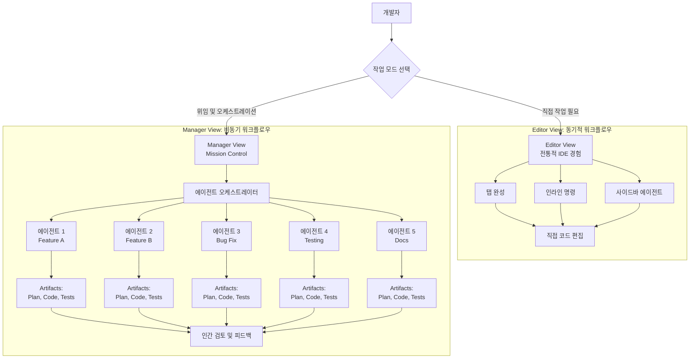

**Editor View**는 Cursor나 GitHub Copilot과 유사한 경험을 제공합니다:
- 전통적인 IDE 인터페이스
- 에이전트가 사이드바에 위치
- 동기적 워크플로우 (한 번에 한 작업)
- 직접적인 코드 편집

**Manager View**는 Antigravity의 진정한 혁신입니다:
- Mission Control 대시보드
- 여러 에이전트의 병렬 실행
- 비동기 작업 관리
- 높은 수준의 아키텍처 관점

## 핵심 아키텍처 구성 요소

### 1. Agent Manager: Mission Control

Agent Manager는 Antigravity의 두뇌입니다. 개발자를 타이피스트에서 아키텍트로 전환시키는 핵심 인터페이스입니다.

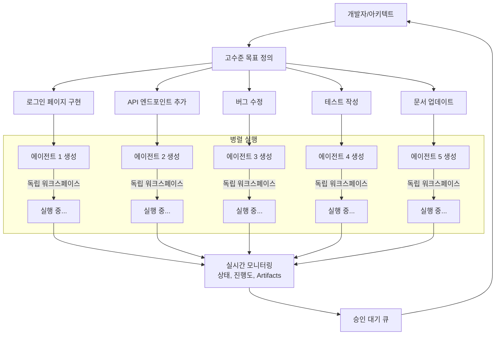

**주요 특징**:

1. **병렬 에이전트 생성**: 각 요청마다 전용 에이전트 인스턴스 생성
2. **독립 워크스페이스**: 에이전트 간 충돌 방지
3. **시각화**: 각 에이전트의 상태, 생성된 Artifacts, 승인 대기 요청 표시
4. **5-10배 생산성**: 5개의 에이전트가 동시에 5개의 기능/버그를 처리

이는 이전 IDE의 핵심 한계를 해결합니다. 챗봇 경험은 선형적이고 동기적이었지만, Antigravity는 진정한 병렬 실행을 제공합니다.

### 2. Artifacts: 신뢰 격차의 해소

에이전트가 "버그를 수정했습니다"라고 주장할 때, 이전에는 개발자가 코드를 직접 읽어 검증해야 했습니다. Antigravity에서 에이전트는 **Artifact를 생성하여 증명**합니다.

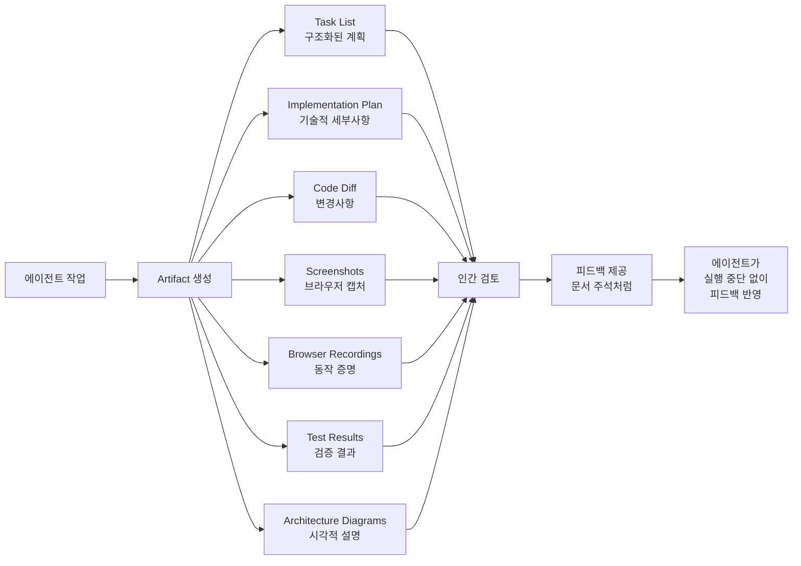

**Artifacts의 종류**:

1. **Task Lists (작업 목록)**:
   - 코드 작성 전 생성되는 구조화된 계획
   - 일반적으로 편집 불필요, 검토 가능
   - 필요시 주석으로 수정 요청

2. **Implementation Plan (구현 계획)**:
   - 코드베이스 내 변경사항 아키텍처 설계
   - 필요한 수정사항의 기술적 세부사항
   - Artifact Review Policy가 "Always Proceed"가 아니면 사용자 검토 필요

3. **Code Diffs (코드 차이)**:
   - 실제 변경사항의 명확한 시각화
   - Git diff 형식으로 표시
   - 라인별 변경 추적

4. **Screenshots & Browser Recordings (스크린샷 및 브라우저 녹화)**:
   - 웹 앱의 동작 증명
   - UI 변경사항 시각적 검증
   - 사용자 플로우 시연

5. **Test Results (테스트 결과)**:
   - 자동화된 테스트 실행 결과
   - 커버리지 리포트
   - 성능 벤치마크

6. **Architecture Diagrams (아키텍처 다이어그램)**:
   - 시스템 설계 시각화
   - 컴포넌트 관계도
   - 데이터 흐름도

**피드백 메커니즘**:

Artifacts에는 문서에 주석을 다는 것처럼 직접 피드백을 남길 수 있습니다:
- 에이전트는 실행 흐름을 중단하지 않고 피드백 통합
- 실시간 협업 경험
- 반복적 개선 프로세스

### 3. The Brain: 프로젝트 메모리 시스템

Antigravity의 가장 혁신적인 특징 중 하나는 `.gemini/antigravity/brain/` 디렉토리입니다.

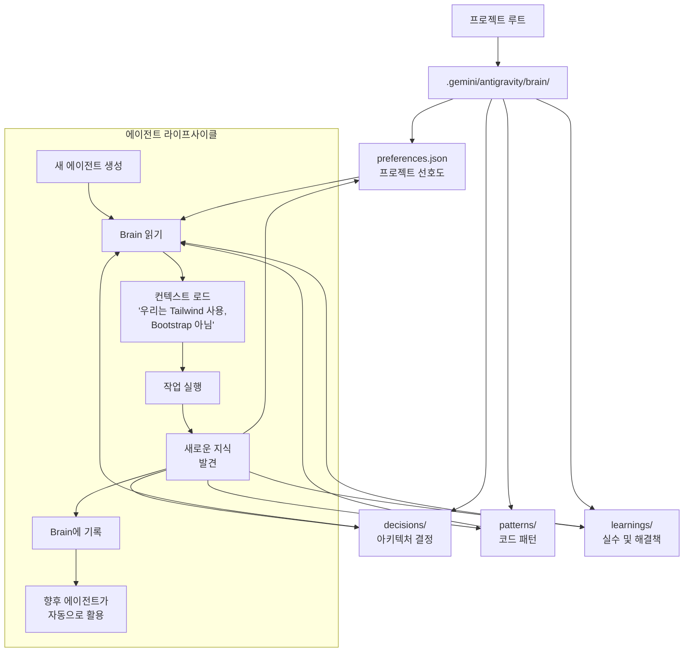

**Stateful Interaction Model**:

기존 IDE는 Stateless였습니다 - 모든 프롬프트마다 에이전트가 제로에서 시작했습니다. Brain 시스템은 이를 **Stateful 모델**로 전환합니다:

- AI가 제로에서 시작하지 않음
- 시간이 지남에 따라 프로젝트의 "Mental Model" 구축
- 수개월의 개발에 걸쳐 아키텍처 일관성 유지

**저장되는 정보**:

```json
// .gemini/antigravity/brain/preferences.json
{
  "ui_framework": "Tailwind CSS",
  "not_used": ["Bootstrap", "Material UI"],
  "database": {
    "primary": "PostgreSQL",
    "orm": "Prisma"
  },
  "testing": {
    "framework": "Jest",
    "coverage_minimum": 80
  },
  "code_style": {
    "typescript": "strict mode",
    "naming": "camelCase for variables, PascalCase for components"
  }
}
```

```json
// .gemini/antigravity/brain/decisions/auth-strategy.json
{
  "date": "2025-12-15",
  "decision": "JWT 대신 Session 기반 인증 사용",
  "rationale": "모바일 앱 요구사항과 보안 정책",
  "impact": "서버 측 세션 스토어 필요 (Redis)",
  "author": "agent-42",
  "approved_by": "human-developer"
}
```

이는 대규모 엔터프라이즈 애플리케이션에서 필수적입니다. 프로젝트가 커질수록 일관성 유지가 더욱 중요해집니다.

### 4. Gemini 3: 연료 시스템

Antigravity의 소프트웨어 아키텍처는 인상적이지만, 이를 구동하는 연료는 **Gemini 3**입니다.

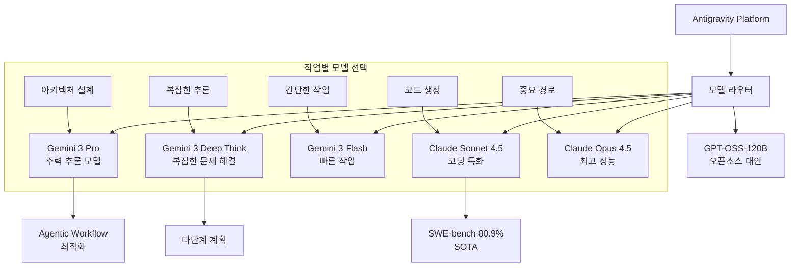

**Gemini 3의 특징**:

1. **Agentic Workflows를 위한 설계**:
   - 다단계 작업 분해 능력
   - 장기 컨텍스트 유지
   - 도구 사용 최적화

2. **모델 선택성 (Model Optionality)**:
   - Gemini 3 Pro에 대한 generous rate limits
   - Claude Sonnet 4.5 완전 지원 (SWE-bench 80.9%)
   - Claude Opus 4.5 사용 가능
   - GPT-OSS-120B 오픈소스 옵션

3. **Multimodal Reasoning**:
   - 코드, 텍스트, 이미지 동시 처리
   - 스크린샷 기반 UI 검증
   - 다이어그램 생성 및 해석

### 5. Skills, Rules, Workflows: 3단계 확장 시스템

Antigravity는 세 가지 구별되는 확장 메커니즘을 제공합니다:

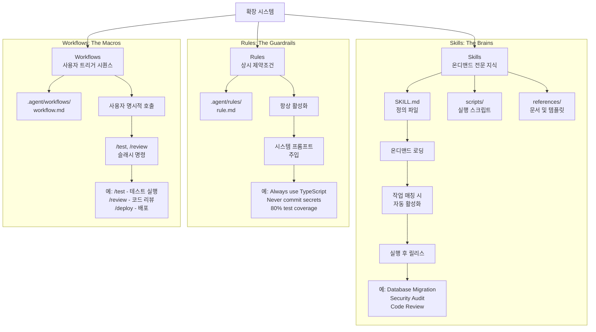

**비교표**:

| 측면 | Skills | Rules | Workflows |
|------|--------|-------|-----------|
| 활성화 | 에이전트가 자동 감지 | 항상 활성 | 사용자가 명시적 호출 |
| 용도 | 특정 작업 방법론 | 행동 제약 | 저장된 프롬프트/단계 |
| 범위 | Task-specific | Global/File-type | User-triggered |
| 예시 | DB Migration Skill | "Always use TS strict" | /test, /review |
| 위치 | ~/.gemini/.../skills/ | .agent/rules/ | .agent/workflows/ |
| 컨텍스트 | 필요시만 로드 | 항상 시스템 프롬프트에 | 호출 시 로드 |

**Skills의 구조**:

```
my-skill/
├── SKILL.md              # 정의 파일 (필수)
├── scripts/              # 실행 스크립트 (선택)
│   ├── run.py
│   └── util.sh
├── references/           # 문서 및 템플릿 (선택)
│   └── api-docs.md
└── assets/               # 정적 자산 (선택)
    └── logo.png
```

**SKILL.md 예시**:

```markdown
---
name: "Database Migration Skill"
description: "안전한 데이터베이스 스키마 마이그레이션 수행"
author: "Platform Team"
version: "2.1"
trigger_keywords: ["migration", "schema change", "alter table"]
---

# Database Migration Protocol

## When to Use
- ALTER TABLE, CREATE TABLE 등 스키마 변경 시
- 새로운 컬럼, 인덱스, 제약조건 추가 시
- 데이터 타입 변경 시

## Prerequisites
1. 현재 스키마 백업 확인
2. Staging 환경에서 먼저 테스트
3. Rollback 계획 수립

## Execution Steps
1. **Schema Analysis**
   - Use postgres_mcp tool: `get_table_schema(table_name)`
   - Identify dependencies and foreign keys
   
2. **Migration Script Generation**
   - Create forward migration (up.sql)
   - Create rollback migration (down.sql)
   - Add migration metadata
   
3. **Testing**
   - Execute in transaction: `BEGIN; ... ROLLBACK;`
   - Verify schema integrity
   - Check application compatibility
   
4. **Approval Gate**
   - Generate Implementation Plan Artifact
   - Request human approval before production

## Safety Rules
- NEVER run migrations directly in production
- ALWAYS test in staging first
- ALWAYS create rollback scripts
- NEVER drop columns without backup
```

**Skills vs MCP의 차이**:

| 측면 | Skills | MCP |
|------|--------|-----|
| 성격 | 경량, 임시적 | 중량, 영속적 |
| 아키텍처 | 서버리스, 파일 기반 | 클라이언트-서버 |
| 용도 | 방법론 (How) | 기능 (What) |
| 예시 | "마이그레이션 어떻게" | "PostgreSQL 접근" |
| 라이프사이클 | 작업 시작-종료 | 세션 지속 |
| 인프라 | 없음 | 실행 중인 서버 프로세스 |

**비유**:
- MCP는 주방과 재료 (도구와 인프라)
- Skills는 레시피 (방법론과 지침)

### 6. MCP 통합: 우주로의 연결

Antigravity의 MCP 통합은 Claude Code와 유사하지만, Google Cloud 생태계와의 긴밀한 통합이 특징입니다.

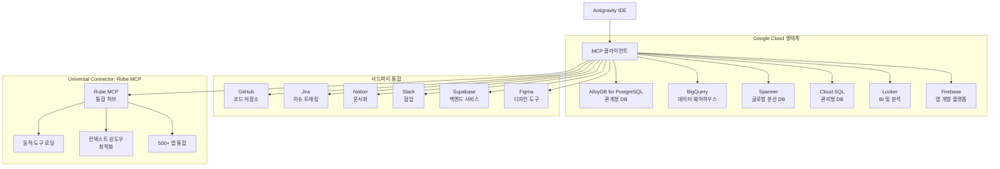

**MCP Store**: UI 기반 설치

Antigravity는 MCP 서버를 클릭 몇 번으로 설치할 수 있는 MCP Store를 제공합니다:

```
1. Editor View에서 "..." 클릭
2. "MCP Servers" 선택
3. MCP Store에서 원하는 서버 검색
   (예: "Firebase", "AlloyDB", "BigQuery")
4. "Install" 클릭
5. 필요한 인증 정보 입력
6. 즉시 사용 가능
```

**수동 설정: mcp_config.json**

```json
{
  "mcpServers": {
    "alloydb": {
      "command": "npx",
      "args": ["-y", "@google-cloud/alloydb-mcp-server"],
      "env": {
        "PROJECT_ID": "my-gcp-project",
        "REGION": "us-central1",
        "CLUSTER_ID": "my-cluster",
        "INSTANCE_ID": "my-instance"
      }
    },
    "bigquery": {
      "command": "npx",
      "args": ["-y", "@google-cloud/bigquery-mcp-server"],
      "env": {
        "PROJECT_ID": "my-gcp-project"
      }
    },
    "rube": {
      "transport": "http",
      "url": "https://api.composio.dev/v1/mcp/",
      "headers": {
        "X-API-Key": "YOUR_RUBE_API_KEY"
      }
    }
  }
}
```

**Rube MCP: 통합의 혁명**

Rube MCP는 Antigravity의 MCP 통합을 한 단계 더 발전시킵니다:

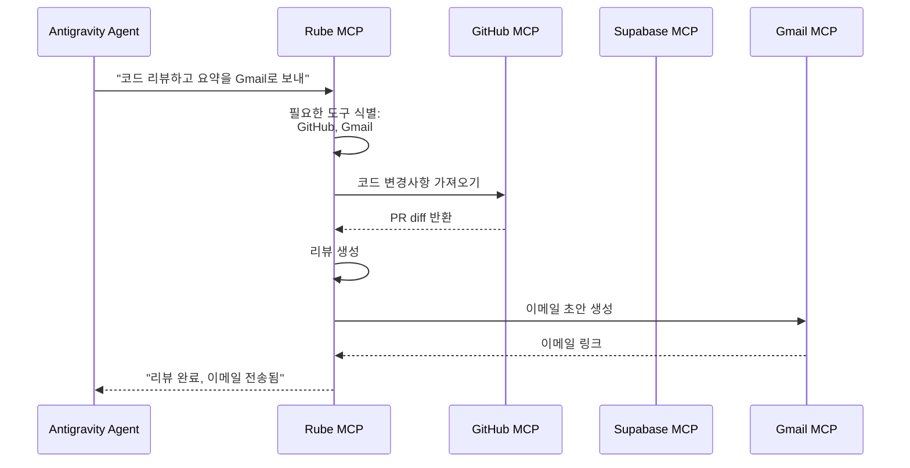

**Rube의 장점**:

1. **단일 구성**: 한 번 설정하면 500+ 앱 접근
2. **동적 로딩**: 필요한 도구만 컨텍스트에 로드
3. **컨텍스트 최적화**: 모든 도구를 미리 로드하지 않음
4. **스크립트 지원**: MCP 도구 외에도 커스텀 스크립트 실행

## Agentic 디자인 패턴의 구현

앞서 설명한 4가지 Agentic 패턴이 Antigravity에 어떻게 구현되어 있는지 살펴보겠습니다.

### 1. Reflection 패턴: Artifacts를 통한 검증

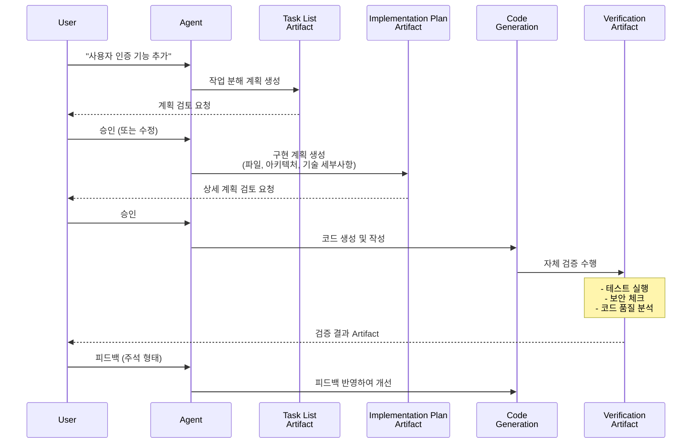

**Verification-First Approach**:

Antigravity의 Reflection은 단순히 코드를 다시 보는 것이 아니라, **검증을 작업의 핵심 부분**으로 만듭니다:

- 테스트 결과 Artifact
- 스크린샷으로 UI 검증
- 브라우저 녹화로 동작 증명
- 성능 벤치마크
- 보안 스캔 결과

### 2. Tool Use 패턴: MCP를 통한 무한 확장

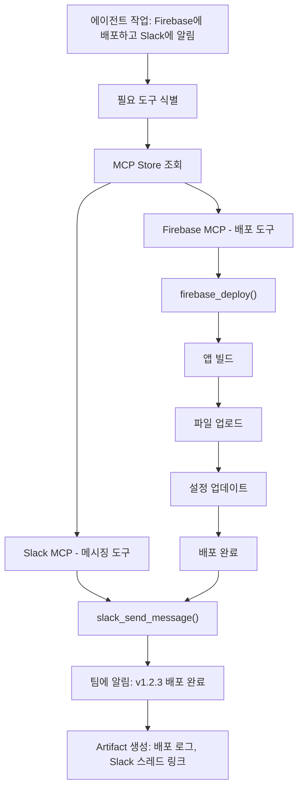

**Google Cloud 통합의 힘**:

```
개발자: "AlloyDB에서 활성 사용자 테이블 스키마를 확인하고,
        BigQuery로 사용자 행동 분석 쿼리를 작성해줘"

Antigravity 실행:
1. [AlloyDB MCP] 연결
   └─ list_tables() → users, sessions, analytics
   └─ get_table_schema('users') → 컬럼 구조 파악

2. [BigQuery MCP] 연결
   └─ 분석 쿼리 생성:
      SELECT user_id, COUNT(*) as actions, 
             AVG(session_duration) as avg_duration
      FROM `project.dataset.user_actions`
      GROUP BY user_id
      HAVING actions > 10
      ORDER BY avg_duration DESC
   
3. [Artifact] 생성:
   └─ AlloyDB 스키마 문서
   └─ BigQuery 쿼리 (실행 가능)
   └─ 분석 결과 시각화

완료! 결과를 Looker 대시보드로 내보낼까요?
```

### 3. Planning 패턴: Implementation Plan Artifacts

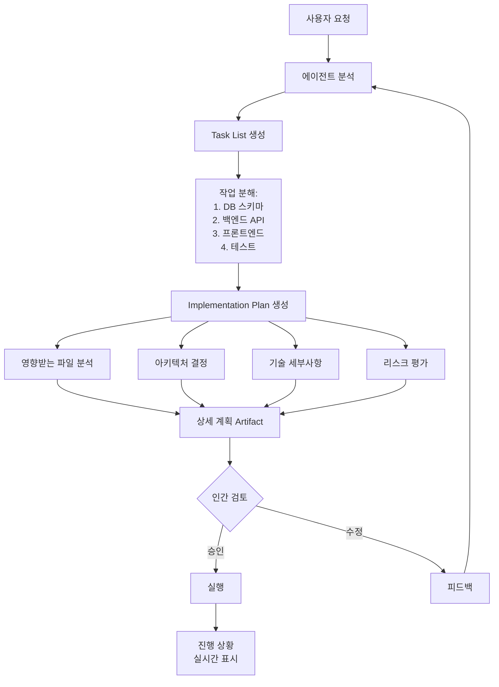

**Implementation Plan의 구조**:

```markdown
# Implementation Plan: 사용자 인증 시스템

## 목표
JWT 기반 사용자 인증 시스템 구현

## 영향받는 파일
1. `backend/models/user.py` (신규)
2. `backend/routes/auth.py` (신규)
3. `backend/middleware/jwt_validator.py` (신규)
4. `frontend/src/components/LoginForm.tsx` (신규)
5. `frontend/src/utils/auth.ts` (신규)
6. `backend/requirements.txt` (수정)

## 아키텍처 결정

### 인증 흐름
1. 사용자 로그인 → JWT 발급
2. 후속 요청 → JWT 검증
3. 만료 시 → Refresh Token 사용

### 기술 스택
- Backend: FastAPI + PyJWT
- Frontend: React + Axios
- Storage: Redis (Refresh Tokens)

## 단계별 구현

### Phase 1: 백엔드 기반 (2시간)
1. User 모델 생성 (30분)
   - 필드: id, email, password_hash, created_at
   - Prisma 마이그레이션 작성
   
2. JWT 유틸리티 (45분)
   - 토큰 생성 함수
   - 토큰 검증 함수
   - Refresh 로직

3. Auth 엔드포인트 (45분)
   - POST /auth/register
   - POST /auth/login
   - POST /auth/refresh

### Phase 2: 미들웨어 (1시간)
1. JWT 검증 미들웨어
2. 권한 체크 데코레이터
3. 에러 핸들링

### Phase 3: 프론트엔드 (2시간)
1. LoginForm 컴포넌트
2. Auth 컨텍스트
3. Protected Routes
4. Token 저장 로직

### Phase 4: 테스트 (1시간)
1. 유닛 테스트 (토큰 생성/검증)
2. 통합 테스트 (로그인 플로우)
3. E2E 테스트 (전체 사용자 여정)

## 리스크 및 고려사항

### 보안
⚠️ CRITICAL: 
- 비밀번호는 bcrypt로 해싱 (비용 계수 12)
- JWT 시크릿은 환경 변수로 관리
- HTTPS 필수

### 성능
- Redis로 Refresh Token 관리 (빠른 조회)
- JWT 검증 캐싱 (1분 TTL)

### 확장성
- 향후 OAuth 추가 고려
- 다중 디바이스 로그인 지원

## 예상 완료 시간
총 6시간 (실제 코딩 4.5시간 + 테스트 1.5시간)

## 승인 필요 사항
1. JWT 만료 시간 (제안: 15분)
2. Refresh Token 만료 시간 (제안: 7일)
3. 비밀번호 정책 (최소 길이, 복잡도)
```

### 4. Multi-Agent 패턴: Manager View의 병렬 실행

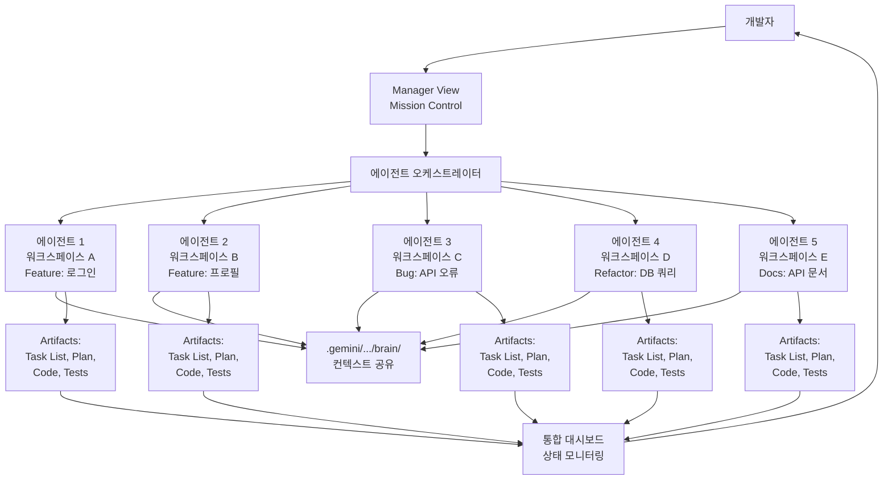

**실제 사용 시나리오**:

```
시나리오: E-commerce 앱 스프린트

개발자의 Manager View에서:

[에이전트 1] Feature/Checkout
상태: 🟢 실행 중 (75%)
작업: 결제 페이지 구현
마지막 Artifact: Implementation Plan (승인 대기)

[에이전트 2] Feature/Product-Search
상태: 🟡 피드백 필요
작업: 검색 기능 + 필터
마지막 Artifact: Code Diff (주석 2개)

[에이전트 3] Bug/Cart-Total
상태: ✅ 완료
작업: 장바구니 합계 계산 버그
마지막 Artifact: Test Results (모두 통과)

[에이전트 4] Refactor/DB-Queries
상태: 🟢 실행 중 (40%)
작업: N+1 쿼리 최적화
마지막 Artifact: Task List (진행 중)

[에이전트 5] Docs/API-Reference
상태: 🔵 대기 중
작업: API 엔드포인트 문서화
의존성: 에이전트 1, 2 완료 후 시작

전체 진행률: 58%
예상 완료: 2시간 15분
```

**에이전트 간 조율**:

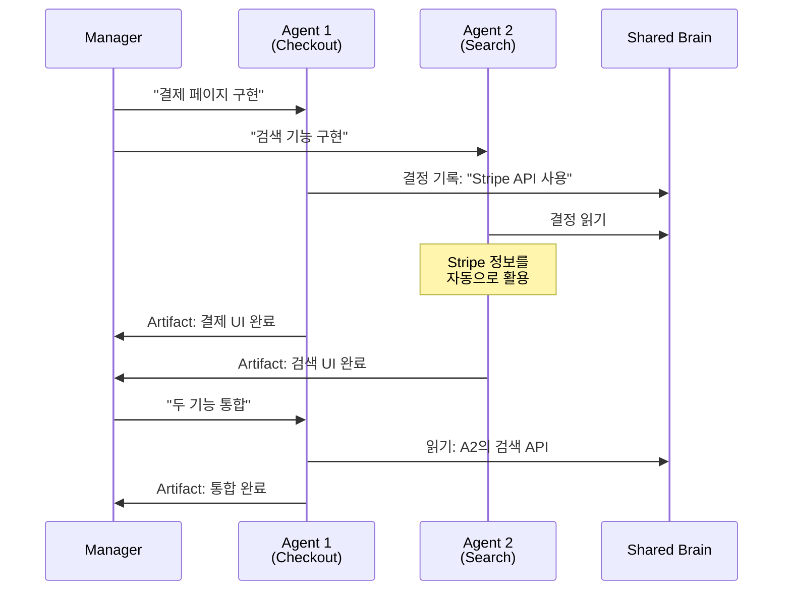

## R.A.P.S. 프레임워크: Antigravity 마스터하기

Antigravity를 챗봇처럼 사용하는 것을 멈추고 진정한 개발 팀처럼 사용하려면 R.A.P.S. 프레임워크를 따라야 합니다.

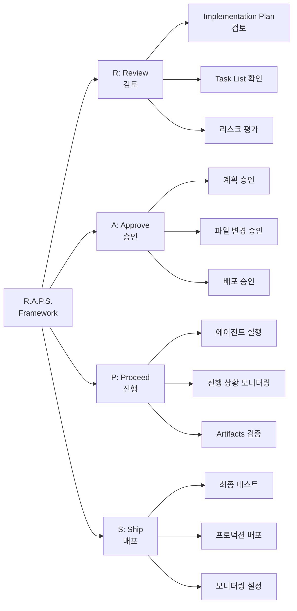

### R: Review (검토)

**항상 Implementation Plan을 읽으세요**:

```
❌ 나쁜 습관:
"로그인 페이지 만들어줘" → [에이전트가 바로 코딩 시작]

✅ 좋은 습관:
"로그인 페이지 만들어줘"
→ [에이전트가 Plan 생성]
→ [개발자가 Plan 검토]
   "아, JWT 대신 세션 사용해야 하는데?"
→ [피드백 제공]
→ [에이전트가 Plan 수정]
→ [개발자 승인]
→ [에이전트가 코딩 시작]
```

**검토 체크리스트**:

- [ ] 파일 변경사항이 적절한가?
- [ ] 아키텍처 결정이 프로젝트 표준에 맞는가?
- [ ] 리스크가 적절히 식별되었는가?
- [ ] 타임라인이 현실적인가?
- [ ] 테스트 전략이 포함되어 있는가?

### A: Approve (승인)

**전략적 승인 포인트**:

1. **계획 단계**: Implementation Plan
2. **실행 중**: 중요한 파일 변경
3. **완료 후**: 프로덕션 배포

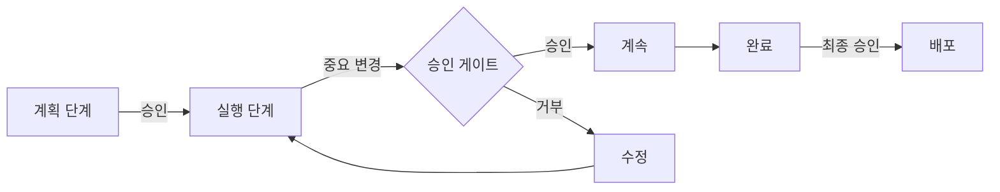

**Artifact Review Policy 설정**:

- **Always Proceed**: 에이전트가 자동으로 진행 (빠르지만 위험)
- **Review Before Execution**: 구현 전 검토 (권장)
- **Review After Execution**: 구현 후 검토 (학습용)

### P: Proceed (진행)

**점진적 실행**:

```
❌ 한 번에 모든 것:
"전체 앱을 만들어줘 - 인증, 프로필, 결제, 관리자 대시보드"

✅ 단계적 접근:
1. "사용자 인증 구현" → 완료 및 검증
2. "사용자 프로필 페이지 추가" → 완료 및 검증
3. "결제 시스템 통합" → 완료 및 검증
4. "관리자 대시보드 생성" → 완료 및 검증
```

**진행 상황 모니터링**:

Manager View의 실시간 대시보드를 통해:
- 각 에이전트의 상태
- 생성된 Artifacts
- 대기 중인 승인 요청
- 전체 완료율

### S: Ship (배포)

**배포 전 체크리스트**:

```markdown
## 배포 전 검증

### 코드 품질
- [ ] 모든 테스트 통과
- [ ] 코드 리뷰 완료
- [ ] 린터/포맷터 통과
- [ ] 보안 스캔 통과

### 기능 검증
- [ ] 모든 Artifacts 검토
- [ ] 브라우저 녹화로 동작 확인
- [ ] 성능 벤치마크 확인

### 인프라
- [ ] 환경 변수 설정
- [ ] 데이터베이스 마이그레이션 준비
- [ ] 롤백 계획 수립

### 모니터링
- [ ] 로그 설정
- [ ] 알림 설정
- [ ] 대시보드 준비
```

## 실제 구현 사례

### 케이스 1: "Subreddit Pulse" - 풀스택 앱을 분 단위로

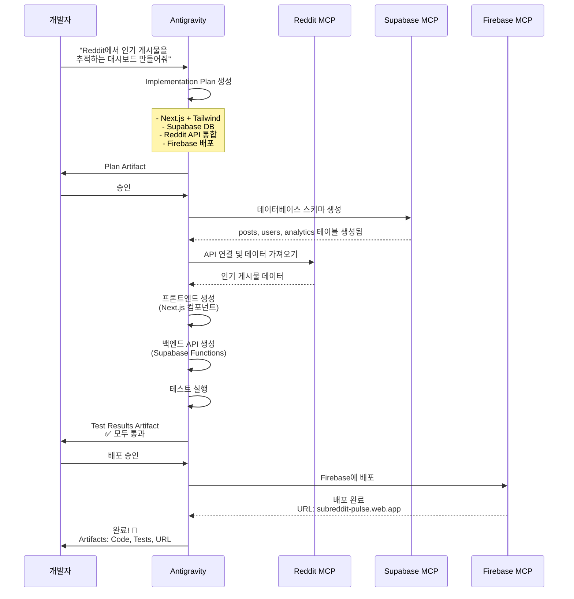

**소요 시간**: 약 15-20분 (전통적 방식: 2-3일)

**생성된 Artifacts**:
1. Task List (5개 주요 작업)
2. Implementation Plan (아키텍처 다이어그램 포함)
3. Database Schema (Supabase 테이블 정의)
4. Frontend Code (Next.js 컴포넌트)
5. Backend Functions (Supabase Edge Functions)
6. Test Results (유닛 + 통합 테스트)
7. Deployment Logs (Firebase 배포 기록)
8. Live URL (작동하는 앱)

### 케이스 2: Figma → 코드 자동화

```
개발자: "Figma 디자인을 기반으로 블로그 UI를 만들어줘"
        [Figma URL 제공]

Antigravity + Rube MCP 실행:

1. [Rube MCP] Figma 파일 가져오기
   └─ 레이어 구조 분석
   └─ 색상 팔레트 추출
   └─ 타이포그래피 설정 확인

2. [Implementation Plan] 생성
   └─ HTML 구조 (시맨틱 태그)
   └─ CSS 모듈 (Tailwind 기반)
   └─ 반응형 브레이크포인트
   └─ 접근성 고려사항

3. [코드 생성]
   blog-space/
   ├── index.html
   ├── styles.css
   ├── components/
   │   ├── header.html
   │   ├── article-card.html
   │   └── footer.html
   └── assets/
       └── extracted-from-figma/

4. [검증 Artifact]
   └─ 스크린샷: 원본 vs 구현
   └─ 반응형 테스트: Mobile, Tablet, Desktop
   └─ 접근성 점수: 95/100

완료! 픽셀 퍼펙트 구현 ✨
```

### 케이스 3: AlloyDB + BigQuery 통합 분석

~~~
시니어 데이터 엔지니어:
"AlloyDB의 사용자 데이터와 BigQuery의 행동 로그를 결합해서
 월별 리텐션 분석 대시보드를 만들어줘"

Antigravity 실행:

Phase 1: 데이터 탐색
├─ [AlloyDB MCP] 연결
│  └─ list_tables() → users, subscriptions
│  └─ get_table_schema('users')
│     ├─ user_id (UUID)
│     ├─ signup_date (TIMESTAMP)
│     ├─ subscription_tier (VARCHAR)
│
└─ [BigQuery MCP] 연결
   └─ list_datasets() → analytics, user_events
   └─ get_table_schema('user_events.activity_log')
      ├─ user_id (STRING)
      ├─ event_type (STRING)
      ├─ timestamp (TIMESTAMP)

Phase 2: 분석 쿼리 생성
[Artifact: SQL Query]
```sql
WITH monthly_cohorts AS (
  SELECT 
    user_id,
    DATE_TRUNC(signup_date, MONTH) as cohort_month
  FROM `project.alloydb_users.users`
),
user_activity AS (
  SELECT 
    user_id,
    DATE_TRUNC(timestamp, MONTH) as activity_month,
    COUNT(*) as events
  FROM `project.analytics.user_events`
  GROUP BY user_id, activity_month
)
SELECT 
  c.cohort_month,
  a.activity_month,
  DATE_DIFF(a.activity_month, c.cohort_month, MONTH) as months_since_signup,
  COUNT(DISTINCT a.user_id) as active_users,
  COUNT(DISTINCT a.user_id) / COUNT(DISTINCT c.user_id) as retention_rate
FROM monthly_cohorts c
LEFT JOIN user_activity a ON c.user_id = a.user_id
GROUP BY c.cohort_month, a.activity_month
ORDER BY c.cohort_month, months_since_signup
```

Phase 3: 대시보드 생성
├─ [React 컴포넌트] 생성
│  └─ RetentionChart (Recharts 라이브러리)
│  └─ CohortTable (데이터 그리드)
│
└─ [Looker MCP] 통합
   └─ 대시보드 생성
   └─ 스케줄링 설정 (매일 오전 9시 업데이트)

[Final Artifact: Live Dashboard]
- 인터랙티브 리텐션 히트맵
- 코호트별 드릴다운
- 자동 데이터 리프레시
~~~

## 아키텍처 비교: Antigravity vs Claude Code

| 측면 | Google Antigravity | Claude Code |
|------|-------------------|-------------|
| **기반** | VS Code 포크 | CLI + 웹 인터페이스 |
| **주력 모델** | Gemini 3 Pro/Deep Think/Flash | Claude Opus 4.5 / Sonnet 4.5 |
| **인터페이스** | Editor View + Manager View | 터미널 + claude.ai |
| **병렬 실행** | Manager View에서 5+ 에이전트 | 다중 세션 (별도 실행) |
| **메모리** | .gemini/antigravity/brain/ | CLAUDE.md + .memory/state.json |
| **확장 시스템** | Skills + Rules + Workflows | Skills + Hooks |
| **검증 방식** | Artifacts (Task List, Plan, etc) | 대화 중 검증 + 자체 리뷰 |
| **브라우저 통합** | 네이티브 (Artifacts에 녹화) | 제한적 |
| **MCP 통합** | MCP Store (UI 기반) | CLI 명령 (claude mcp add) |
| **Google Cloud** | 네이티브 통합 (AlloyDB, BigQuery) | 서드파티 MCP 필요 |
| **타겟 사용자** | 팀 협업, 풀스택 개발 | 개인 개발자, 코딩 집중 |
| **가격** | 무료 (현재 preview) | Pro/Max 플랜 |

## 한계 및 Best Practices

### 현재의 한계

1. **성능 변동성 (2026년 1월)**:
   - 사용자 보고: 성능 저하 경험
   - 지침 미준수
   - 계획 무시
   - 무단 리팩토링

2. **Microsoft Marketplace 접근 불가**:
   - VS Code 확장 생태계와 격리
   - 자체 확장 생태계 구축 필요

3. **학습 곡선**:
   - Skills vs Rules vs Workflows 구분
   - MCP 설정 복잡성
   - Artifact Review Policy 이해

4. **엔터프라이즈 마찰**:
   - Azure DevOps와의 통합 어려움
   - Microsoft 생태계 기업에 "Walled Garden" 문제

### Best Practices

**1. 작업 범위 제한**:

```
❌ 과도한 범위:
"전체 전자상거래 플랫폼을 만들어줘 - 
 인증, 제품 카탈로그, 장바구니, 결제, 
 주문 관리, 재고, 배송 추적, 관리자 대시보드"

✅ 적절한 범위:
"제품 카탈로그 페이지를 만들어줘 - 
 그리드 레이아웃, 필터링, 검색"
```

**2. 테스트 자동화 지양**:

```
중요: Implementation Plan에서 자동 테스트 실행 작업 제거

이유:
- 자동 테스트는 많은 토큰 소비
- 수동 테스트가 더 효율적 (초기 단계)
- 필요시 나중에 전용 에이전트로 실행
```

**3. Artifact Review Policy 전략적 설정**:

```
개발 단계별 정책:

프로토타입 단계:
└─ "Always Proceed"
   → 빠른 반복, 리스크 수용

개발 단계:
└─ "Review Before Execution"
   → 균형잡힌 속도와 품질

프로덕션 준비:
└─ "Review After Execution" + 수동 최종 검토
   → 최대 품질 보장
```

**4. Brain 활용 극대화**:

```bash
# 프로젝트 시작 시
"이 프로젝트를 장기 메모리에 완전히 온보딩해줘.
 순차적으로 수행:
 1. Structural Link (구조 연결)
 2. Stack Analysis (스택 분석)
 3. Architectural Analysis (아키텍처 분석)
 4. Style Analysis (스타일 분석)
 5. Exclusion Analysis (제외 항목 분석)"

# 결과: .gemini/antigravity/brain/에 모든 컨텍스트 저장
# 향후 에이전트들이 자동으로 프로젝트 이해
```

**5. Skills 체계적 구축**:

```
권장 Skills 우선순위:

1. Context-7: 최신 기술 스택 문서
2. Sequential Thinking: 구조화된 문제 해결
3. Database Migration: 안전한 스키마 변경
4. Security Audit: 보안 체크
5. Performance Profiling: 성능 분석
```

**6. MCP 전략적 통합**:

```
Rube MCP 사용 패턴:

1. 한 번 설정: Rube API 키
2. 필요한 앱만 활성화:
   - GitHub (코드 관리)
   - Supabase (데이터베이스)
   - Gmail (알림)
   - Slack (팀 협업)
3. 동적 로딩으로 컨텍스트 절약
```

## 사용 시기 가이드

### Antigravity를 사용해야 할 때

✅ **최적 사용 사례**:

1. **빠른 프로토타입**:
   - MVP 개발
   - 내부 도구
   - 실험적 프로젝트

2. **풀스택 웹 앱**:
   - 대시보드
   - CRUD 애플리케이션
   - SaaS 아이디어
   - 데이터 시각화

3. **자동화**:
   - 웹 스크래퍼
   - 데이터 파이프라인
   - 스케줄링 작업
   - API 통합

4. **학습 및 포트폴리오**:
   - 새 프레임워크 테스트
   - 아키텍처 실험
   - 포트폴리오 프로젝트

### Antigravity를 피해야 할 때

❌ **부적합한 사용 사례**:

1. **미션 크리티컬 시스템**:
   - 금융 시스템
   - 의료 시스템
   - 인프라 코드

2. **깊이 전문화된 도메인**:
   - 임베디드 시스템
   - 게임 엔진 개발
   - 고도의 최적화 필요 코드

3. **레거시/비표준 스택**:
   - 틈새 프레임워크
   - 독점 내부 도구
   - 레거시 유지보수

**이유**: AI는 표준 워크플로우에서 놀랍지만, 프로젝트가 비정상적이거나 고위험일수록 더 많은 수동 제어가 필요합니다.

## 미래 전망

### 2026년 트렌드

1. **MCP 생태계 폭발**:
   - 1,500+ MCP 서버 (현재)
   - 모든 주요 플랫폼 통합
   - 업계 표준으로 확립

2. **Agent-First가 표준으로**:
   - IDE의 진화: 편집기 → 오케스트레이터
   - 개발자 역할: 타이피스트 → 아키텍트
   - 팀 구성: 코더 감소, 시스템 사고자 증가

3. **AI 모델의 지속적 발전**:
   - Gemini 4 (예상)
   - 더 긴 컨텍스트 윈도우
   - 더 나은 코드 이해력

4. **엔터프라이즈 통합 강화**:
   - Azure DevOps 지원
   - Microsoft 생태계 통합
   - 엔터프라이즈 보안 기능

### 개발 패러다임의 근본적 변화

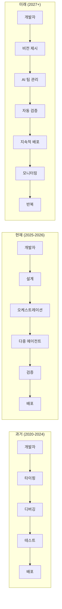

## 결론: 중력에서 벗어나 새로운 높이로

Google Antigravity는 단순한 AI 코딩 도구가 아닙니다. 그것은 소프트웨어 개발 방식의 근본적인 재구상입니다.

### 핵심 교훈

**1. 패러다임의 전환**:
- 한 줄씩 코딩 → 고수준 목표 설정
- 직렬 작업 → 병렬 오케스트레이션
- 개별 개발자 → AI 에이전트 팀

**2. 아키텍처의 중요성**:
- 이중 인터페이스 (Editor + Manager)
- Artifacts를 통한 신뢰 구축
- Brain 시스템을 통한 지속적 학습

**3. 올바른 도구 선택**:
- Antigravity: 빠른 프로토타입, 풀스택 앱
- Claude Code: 복잡한 코드 편집, 터미널 중심
- 하이브리드 접근: 작업에 맞는 도구 선택

**4. 개발자 역할의 진화**:
- 타이피스트 → 아키텍트
- 구현자 → 오케스트레이터
- 개별 기여자 → 팀 리더

### 실용적 조언

**시작하는 방법**:

1. **다운로드 및 설치**: antigravity.google/download
2. **간단한 프로젝트로 시작**: 작은 CRUD 앱이나 대시보드
3. **R.A.P.S. 따르기**: Review → Approve → Proceed → Ship
4. **Artifacts 활용**: 계획과 구현을 항상 검토
5. **Brain 구축**: 프로젝트 컨텍스트를 지속적으로 축적

**성공의 열쇠**:

1. **명확한 목표**: 에이전트에게 명확한 작업 정의
2. **적절한 범위**: 작업을 관리 가능한 크기로 분해
3. **지속적 검토**: Artifacts를 꼼꼼히 검토
4. **점진적 접근**: 한 번에 하나의 기능씩
5. **학습 마인드**: 실험하고 패턴 발견

### 최종 평가

Antigravity는 다음을 증명합니다:

- **속도**: 5-10배 생산성 향상 (병렬 에이전트)
- **품질**: Artifacts를 통한 검증 가능성
- **확장성**: MCP를 통한 무한 통합
- **학습**: Brain 시스템을 통한 지속적 개선

그러나 이것은 마법이 아닙니다. 여전히 다음이 필요합니다:

- **아키텍처 지식**: 좋은 설계를 만들려면
- **도메인 전문성**: 올바른 질문을 하려면
- **비판적 사고**: Artifacts를 평가하려면
- **시스템 사고**: 큰 그림을 보려면

**"Antigravity는 보일러플레이트를 사라지게 만듭니다. 하지만 시스템에 대해 생각하는 엔지니어를 대체하지 않습니다. 오히려 그런 엔지니어를 더욱 필수적으로 만듭니다."**

2026년의 소프트웨어 개발은 더 이상 "코드를 얼마나 빨리 작성하는가"가 아니라 "시스템을 얼마나 잘 설계하고, 에이전트를 얼마나 효과적으로 이끌며, 자율성으로 충분하지 않을 때 얼마나 현명한 판단을 내리는가"입니다.

중력에서 벗어나 새로운 높이로 비상할 준비가 되셨습니까? 🚀

---

**문서 작성 일자**: 2026-01-31
