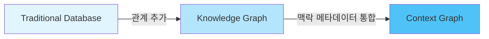
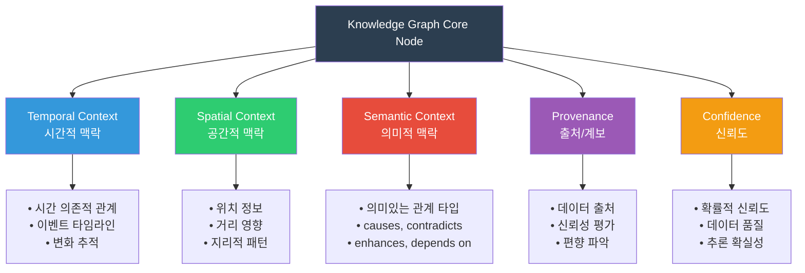
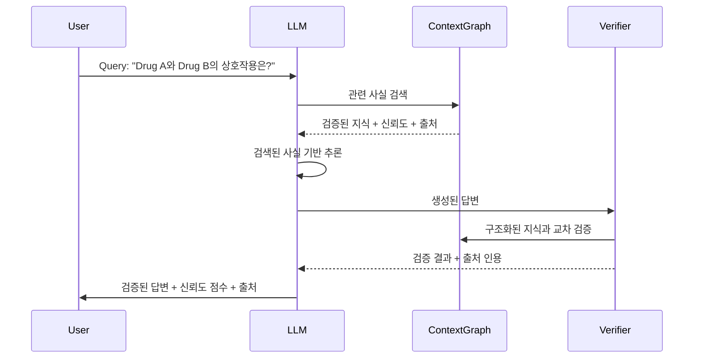
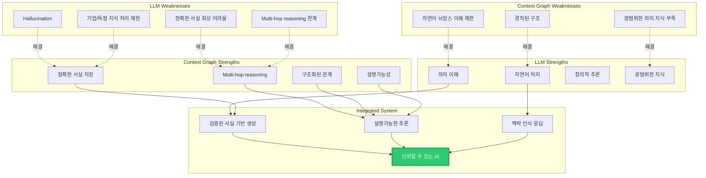
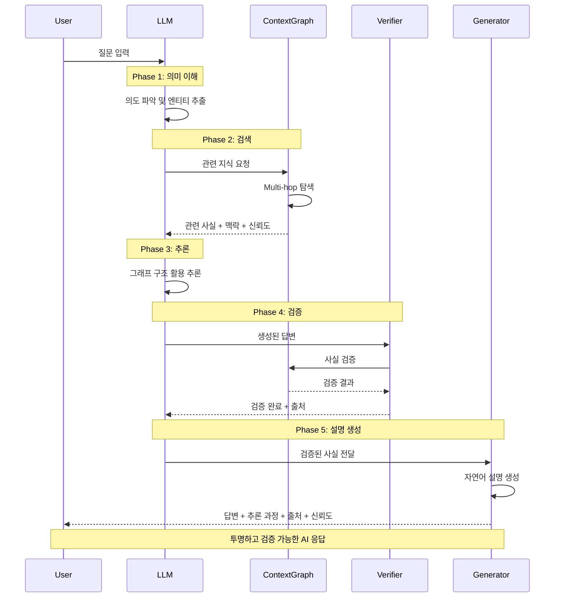
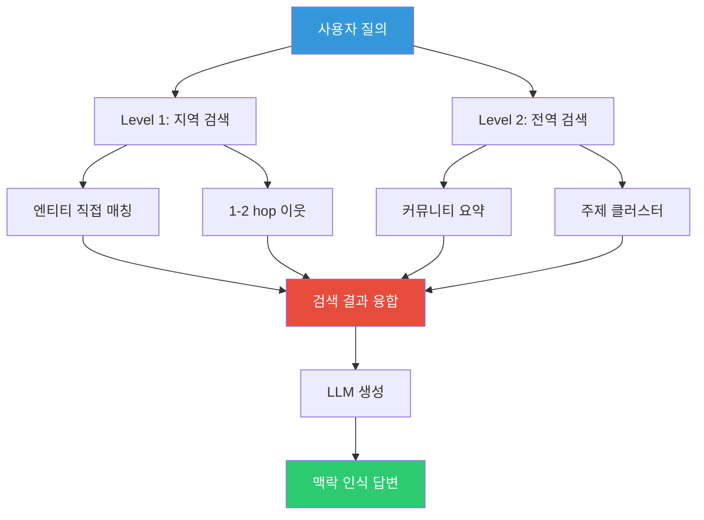
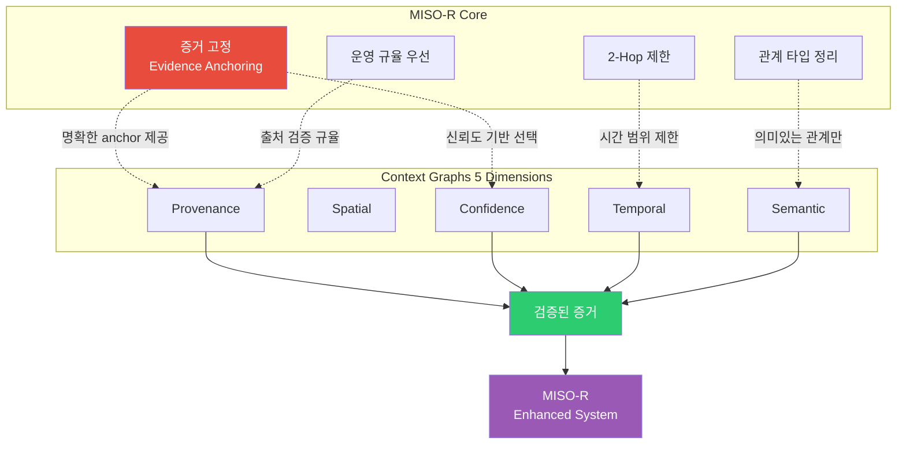
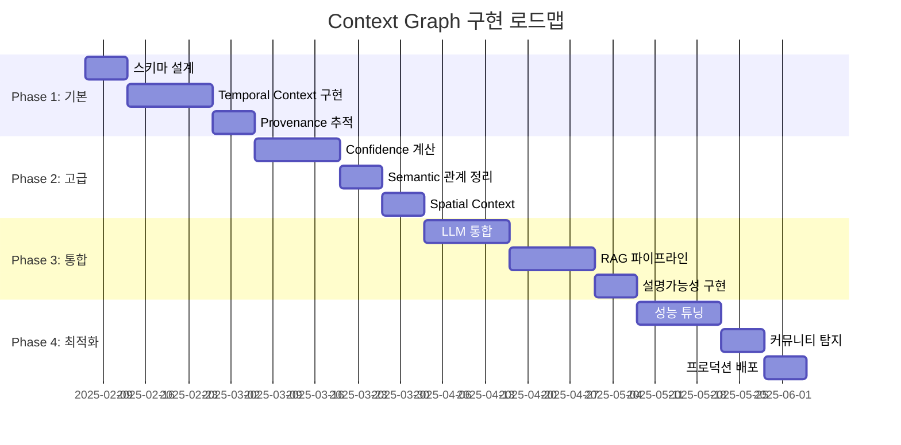

## 개요

Context Graphs는 단순히 정보를 처리하는 것을 넘어, 엔티티 간의 관계, 이벤트의 타이밍, 의사결정의 근거, 그리고 답변에 대한 신뢰도까지 깊이 있게 이해하는 AI 시스템을 구현하기 위한 새로운 지식 표현 방식입니다. 이는 기존의 Knowledge Graph를 진화시켜, 지식이 존재하는 맥락(context)까지 구조화된 형태로 포착합니다.

2024-2025년 현재, Context Graphs는 AI 시스템의 핵심 인프라로 자리잡고 있으며, 특히 LLM(Large Language Model)의 hallucination 문제를 해결하고, 복잡한 multi-hop reasoning을 가능하게 하며, 설명가능한 AI를 구현하는 핵심 기술로 주목받고 있습니다.

## Context Graphs의 핵심 개념

### 기본 정의

Context Graph는 **엔티티가 무엇이며 어떻게 연관되어 있는지**뿐만 아니라, **그 관계가 존재하고 중요한 전체 맥락**을 포착하는 구조화된 지식 표현입니다. 이는 단순한 데이터 저장 방식을 넘어, 인간이 실제로 복잡한 시스템에 대해 사고하는 방식을 모방한 표현 체계입니다.

### 진화 단계 비교



#### Traditional Database
- 고객 레코드: "이름", "이메일", "마지막 구매"와 같은 컬럼
- 단순하지만 관계가 없음
- 평면적 데이터 구조

#### Knowledge Graph
- 관계 추가: Customer → Purchased → Product, Customer → Lives In → City
- 더 강력하지만 맥락은 여전히 메타데이터로 취급
- 엔티티와 관계의 그래프 구조

#### Context Graph
- 풍부한 메타데이터로 Knowledge Graph 강화:
  - **Temporal**: 구매가 언제 발생했는가?
  - **Spatial**: 고객의 위치는 어디인가?
  - **Confidence**: 이 데이터에 대한 신뢰도는?
  - **Provenance**: 누가 이 정보를 검증했는가?
  - **Reasoning Trace**: 왜 이 결정이 내려졌는가?

## Context의 5가지 핵심 차원



### 1. Temporal Context (시간적 맥락)

시간은 중요합니다. 전통적인 시스템에서는 관계가 종종 시간과 무관한 사실로 취급됩니다. 하지만 현실에서는 관계가 진화합니다.

**실제 사례:**
- 환자는 1월부터 3월까지 약물 A를 복용했고, 이후 약물 B로 전환
- 회사는 2020년에 다른 회사를 인수
- 사람은 회사 X에서 근무하다가 회사 Y로 이직

Context Graphs는 이러한 시간 의존적 관계를 명시적으로 인코딩하여, temporal reasoning과 시간 인식 예측을 가능하게 합니다.

**Neo4j 구현 예시:**
```cypher
// 시간적 관계 표현
CREATE (patient:Patient {id: 'P001', name: 'John Doe'})
CREATE (medA:Medication {name: 'Drug A'})
CREATE (medB:Medication {name: 'Drug B'})

CREATE (patient)-[:PRESCRIBED {
  start_date: date('2024-01-15'),
  end_date: date('2024-03-20'),
  dosage: '500mg',
  reason: 'Initial treatment'
}]->(medA)

CREATE (patient)-[:PRESCRIBED {
  start_date: date('2024-03-21'),
  end_date: null,  // 현재 진행중
  dosage: '250mg',
  reason: 'Switch due to side effects'
}]->(medB)

// 특정 시점의 약물 조회
MATCH (p:Patient)-[r:PRESCRIBED]->(m:Medication)
WHERE p.id = 'P001'
  AND r.start_date <= date('2024-02-15')
  AND (r.end_date IS NULL OR r.end_date >= date('2024-02-15'))
RETURN m.name, r.dosage
```

### 2. Spatial Context (공간적 맥락)

위치는 중요한 맥락을 제공합니다. 거래가 발생한 위치, 엔티티의 지리적 위치, 거리가 관계에 미치는 영향 등이 모두 포착됩니다.

**적용 사례:**
- **Smart City Applications**: 교통 패턴이 위치에 따라 달라짐
- **Healthcare**: 환자의 지리적 지역이 이용 가능한 치료법과 질병 유병률 패턴을 결정
- **Retail**: 고객의 발걸음 추적(foot traffic) 분석

**실무 구현:**
```cypher
// 공간적 맥락을 가진 매장 네트워크
CREATE (store1:Store {
  name: 'NYC Flagship',
  location: point({latitude: 40.7128, longitude: -74.0060}),
  region: 'Northeast'
})

CREATE (store2:Store {
  name: 'LA Branch',
  location: point({latitude: 34.0522, longitude: -118.2437}),
  region: 'West Coast'
})

// 거리 기반 쿼리
MATCH (s:Store)
WHERE point.distance(s.location, point({latitude: 40.7589, longitude: -73.9851})) < 5000
RETURN s.name, point.distance(s.location, point({latitude: 40.7589, longitude: -73.9851})) as distance
ORDER BY distance
```

### 3. Semantic Context (의미적 맥락)

이는 관계의 의미와 본질을 가리킵니다. 일반적인 "related to" 링크 대신, Context Graphs는 풍부하고 의미론적으로 의미 있는 관계를 사용합니다.

**관계 타입의 진화:**
- **Generic**: `RELATED_TO`
- **Specific**: `CAUSES`, `CONTRADICTS`, `ENHANCES`, `DEPENDS_ON`, `PREVENTS`, `ACCELERATES`

이러한 의미론적 풍부함은 더욱 미묘한 reasoning을 가능하게 합니다.

**MISO-R GraphRAG 적용:**
```cypher
// 의미적으로 풍부한 관계 정의
CREATE (condition1:MedicalCondition {name: 'Diabetes Type 2'})
CREATE (condition2:MedicalCondition {name: 'Cardiovascular Disease'})
CREATE (symptom:Symptom {name: 'High Blood Pressure'})
CREATE (medication:Medication {name: 'Metformin'})

CREATE (condition1)-[:CAUSES {
  mechanism: 'Insulin resistance',
  probability: 0.85,
  onset_timeframe: 'months to years'
}]->(symptom)

CREATE (condition1)-[:INCREASES_RISK_OF {
  relative_risk: 2.5,
  contributing_factors: ['Inflammation', 'Lipid dysregulation']
}]->(condition2)

CREATE (medication)-[:MANAGES {
  effectiveness: 0.78,
  primary_action: 'Reduces hepatic glucose production',
  secondary_effects: ['Weight loss', 'Improved lipid profile']
}]->(condition1)

CREATE (medication)-[:CONTRADICTS {
  severity: 'Moderate',
  reason: 'Lactic acidosis risk'
}]->(condition2)
```

### 4. Provenance (출처/계보)

이 정보는 어디에서 왔는가? 동료 검토된 연구, 임상 시험, 사용자 리뷰, 자동화된 시스템 중 어디서 나왔는가?

**Provenance 추적의 중요성:**
- 신뢰도 평가 가능
- 출처 편향 이해
- 감사(audit) 추적 제공
- 데이터 계보(lineage) 파악

**구현 패턴:**
```cypher
// Provenance 메타데이터를 포함한 지식
CREATE (fact:Fact {
  statement: 'Medication A reduces symptom severity by 40%'
})

CREATE (source1:Source {
  type: 'Clinical Trial',
  title: 'Phase III Trial of Drug A',
  publication: 'NEJM',
  date: date('2024-03-15'),
  peer_reviewed: true,
  sample_size: 1200,
  quality_score: 0.95
})

CREATE (source2:Source {
  type: 'User Review',
  platform: 'HealthForum',
  date: date('2024-11-20'),
  verified_user: false,
  quality_score: 0.45
})

CREATE (source1)-[:SUPPORTS {
  confidence: 0.95,
  statistical_significance: 0.001,
  methodology: 'Double-blind RCT'
}]->(fact)

CREATE (source2)-[:SUPPORTS {
  confidence: 0.60,
  anecdotal: true,
  sample_size: 1
}]->(fact)

// Provenance 기반 신뢰도 평가
MATCH (f:Fact {statement: 'Medication A reduces symptom severity by 40%'})
MATCH (s:Source)-[r:SUPPORTS]->(f)
RETURN f.statement,
       avg(r.confidence) as avg_confidence,
       collect({
         source: s.type,
         confidence: r.confidence,
         quality: s.quality_score
       }) as evidence
```

### 5. Confidence (신뢰도)

이 사실에 대해 얼마나 확신하는가? 모든 사실을 동등하게 참으로 취급하는 대신, Context Graphs는 데이터 품질, 출처 신뢰성, 추론 확실성을 반영하는 신뢰도 점수를 할당합니다.

**확률적 지식 표현:**
```cypher
// 신뢰도 기반 지식 표현
CREATE (entity1:Entity {name: 'Product X'})
CREATE (entity2:Entity {name: 'Feature Y'})

CREATE (entity1)-[:HAS_FEATURE {
  confidence: 0.92,
  source_count: 5,
  last_verified: datetime(),
  uncertainty_factors: [
    'Market volatility',
    'Specification changes'
  ],
  confidence_interval: [0.87, 0.97]
}]->(entity2)

// 신뢰도 기반 쿼리
MATCH (e1:Entity)-[r:HAS_FEATURE]->(e2:Entity)
WHERE r.confidence >= 0.85
RETURN e1.name, e2.name, r.confidence
ORDER BY r.confidence DESC
```

## Knowledge Graph vs Context Graph: 결정적 차이

### 비교 분석

| 측면 | Knowledge Graph | Context Graph |
|------|----------------|---------------|
| **구조** | 사실과 관계를 구조화된 형식으로 저장 | 맥락을 핵심 구조에 통합 |
| **맥락 처리** | 보조 정보로 취급 | First-class citizen |
| **시간성** | 정적 또는 천천히 진화 | 동적이고 적응적 |
| **추론 능력** | 상징적 추론으로 제한 | 불확실성, 시간, 인과관계에 대한 추론 가능 |
| **질의 응답** | "무엇", "어떻게 관련되어 있는가" | "무엇을, 언제, 어디서, 왜, 얼마나 확신하는가" |
| **메타데이터** | 외부 관리 필요 | 자동 추적 |

### 실제 시나리오 비교

**시나리오: 환자 치료 권장**

**Knowledge Graph 접근:**
```cypher
// 단순한 관계 기반
MATCH (patient:Patient)-[:HAS_CONDITION]->(condition:Condition)
MATCH (medication:Medication)-[:TREATS]->(condition)
RETURN medication.name
```

문제점:
- "이 관계는 언제 끝났는가?" → 외부 메타데이터 관리 필요
- "얼마나 확신하는가?" → 추가 시스템 필요

**Context Graph 접근:**
```cypher
// 맥락이 통합된 추론
MATCH (patient:Patient {id: 'P001'})-[h:HAS_CONDITION]->(condition:Condition)
WHERE h.diagnosed_date >= date('2024-01-01')
  AND (h.resolved_date IS NULL OR h.resolved_date >= date())

MATCH (medication:Medication)-[t:TREATS {
  effectiveness: eff,
  confidence: conf
}]->(condition)
WHERE eff > 0.7 AND conf > 0.8

MATCH (medication)-[c:CONTRAINDICATED_FOR]->(other_condition)
MATCH (patient)-[:HAS_CONDITION]->(other_condition)

WITH medication, 
     avg(t.effectiveness) as avg_eff,
     avg(t.confidence) as avg_conf,
     count(c) as contraindications

WHERE contraindications = 0

RETURN medication.name,
       avg_eff as effectiveness,
       avg_conf as confidence,
       'Safe for patient conditions' as reasoning
ORDER BY avg_eff * avg_conf DESC
```

결과:
- 시간적 맥락 자동 고려
- 신뢰도 기반 필터링
- 금기사항 자동 체크
- 추론 근거 제공

## 현대 AI에서 Context Graphs가 중요한 이유

### 1. LLM Hallucination 문제 해결

Large Language Models는 언어 이해와 패턴 매칭에는 뛰어나지만, 치명적인 약점이 있습니다: 

- **Hallucination** - 완전히 거짓인 사실을 자신있게 진술하는 현상입니다.

- **왜 발생하는가?**
LLM은 검증된 사실을 검색하는 것이 아니라, 학습 데이터의 통계적 패턴을 기반으로 텍스트를 생성하기 때문입니다.

- **Context Graph가 해결하는 방법:**



**효과:**
- 처음부터 답변을 생성하는 대신, 그래프에서 관련 사실을 검색
- 구조화된 지식에 대해 추론을 검증
- 주장을 교차 참조하고 출처를 인용
- 답변과 함께 신뢰도 점수를 제공

**실제 적용 사례:**
병원에서 Context Graph 없이 LLM 기반 진단 시스템을 사용하면 자신있지만 잘못된 의료 권장사항을 받을 수 있습니다. Context Graph에 임상 시험 데이터, 약물-약물 상호작용 지식, 환자 이력을 추가하면, 동일한 시스템이 신뢰할 수 있게 됩니다.

### 2. Multi-Hop Reasoning 가능화

인간은 여러 단계를 거친 추론에 능숙합니다:

"약물 A가 부작용 X를 유발하고, 이 환자는 이미 부작용 X에 의해 악화되는 상태 Y를 가지고 있다면, 약물 A는 이 환자에게 위험하다."

이러한 multi-hop reasoning은 전통적인 AI 시스템에는 어렵지만, Context Graphs에서는 자연스럽습니다.

**Multi-Hop Query 예시:**
```cypher
// 3-hop reasoning: 약물 → 부작용 → 금기 상태 → 환자
MATCH path = (med:Medication)-[:CAUSES]->(sideEffect:SideEffect)
             -[:WORSENS]->(condition:Condition)
             <-[:HAS_CONDITION]-(patient:Patient)
WHERE patient.id = 'P001'
  AND med.name = 'Drug A'

RETURN med.name as medication,
       sideEffect.name as side_effect,
       condition.name as patient_condition,
       length(path) as reasoning_hops,
       'High risk for this patient' as conclusion
```

**GraphRAG의 Community Detection 활용:**

2024년 Microsoft가 공개한 GraphRAG는 community detection 패러다임을 활용하여 multi-hop reasoning을 더욱 효과적으로 수행합니다.

```cypher
// Community 기반 multi-hop reasoning
CALL gds.louvain.stream('myGraph')
YIELD nodeId, communityId
WITH gds.util.asNode(nodeId) as node, communityId
WHERE node:Medication OR node:SideEffect OR node:Condition

WITH communityId, collect(node) as community_nodes
WHERE size(community_nodes) >= 3

UNWIND community_nodes as node
MATCH (node)-[r]-(related)
WHERE related IN community_nodes
RETURN communityId,
       collect(DISTINCT labels(node)[0]) as entity_types,
       count(DISTINCT r) as internal_connections,
       size(community_nodes) as community_size
ORDER BY internal_connections DESC
```

### 3. 설명가능성과 감사가능성 (Explainability and Auditability)

규제 산업에서 AI 채택의 가장 큰 장벽 중 하나는 **"블랙박스" 문제**입니다: AI가 특정 결정을 내린 이유를 설명할 수 없습니다.

Context Graphs는 **감사 가능한 의사결정 추적**을 생성하여 이 문제를 해결합니다.

**의사결정 추적 구현:**
```cypher
// 의사결정 이력 저장
CREATE (decision:Decision {
  id: 'DEC_2024_001',
  timestamp: datetime(),
  type: 'Medication Recommendation',
  outcome: 'Recommended Drug B'
})

CREATE (reasoning:Reasoning {
  steps: [
    'Step 1: Analyzed patient history',
    'Step 2: Identified contraindications for Drug A',
    'Step 3: Evaluated Drug B effectiveness',
    'Step 4: Cross-referenced clinical trials'
  ],
  confidence: 0.94
})

CREATE (evidence1:Evidence {
  type: 'Clinical Trial',
  source: 'NEJM 2024',
  confidence: 0.95,
  finding: 'Drug B shows 78% effectiveness'
})

CREATE (evidence2:Evidence {
  type: 'Patient History',
  source: 'EHR System',
  confidence: 0.98,
  finding: 'Patient tolerates Drug B class well'
})

CREATE (decision)-[:BASED_ON]->(reasoning)
CREATE (reasoning)-[:SUPPORTED_BY]->(evidence1)
CREATE (reasoning)-[:SUPPORTED_BY]->(evidence2)

// 의사결정 설명 생성
MATCH (d:Decision {id: 'DEC_2024_001'})-[:BASED_ON]->(r:Reasoning)
MATCH (r)-[:SUPPORTED_BY]->(e:Evidence)
RETURN d.outcome as recommendation,
       r.steps as reasoning_steps,
       r.confidence as overall_confidence,
       collect({
         type: e.type,
         source: e.source,
         confidence: e.confidence,
         finding: e.finding
       }) as supporting_evidence
```

**생성되는 설명:**
```
권장사항: Drug B

추론 과정:
1. 환자 이력 분석 완료
2. Drug A에 대한 금기사항 확인
3. Drug B의 효과성 평가
4. 임상 시험 데이터 교차 검증

전체 신뢰도: 94%

지원 증거:
- [임상 시험, NEJM 2024, 95% 신뢰도] Drug B는 78% 효과성 표시
- [환자 이력, EHR System, 98% 신뢰도] 환자는 Drug B 계열을 잘 견딤
```

이러한 설명가능성은 의료, 금융, 법률 분야에서 혁신적입니다.

### 4. 실시간, 맥락 인식 의사결정

전통적인 시스템은 의사결정을 스냅샷으로 취급합니다: "지금 당장 무엇을 해야 하는가?"

Context Graphs는 진화하는 상황을 이해하는 **진정으로 적응적인 시스템**을 가능하게 합니다.

**Smart City 예시:**
```cypher
// 실시간 교통 의사결정
MATCH (intersection:Intersection {id: 'INT_001'})
MATCH (intersection)-[:CURRENT_CONGESTION]->(congestion:TrafficData)
WHERE congestion.timestamp > datetime() - duration('PT5M')

MATCH (intersection)-[:HISTORICAL_PATTERN]->(pattern:HistoricalData)
WHERE pattern.day_of_week = dayOfWeek(datetime())
  AND pattern.time_range CONTAINS time()

MATCH (event:ScheduledEvent)-[:AFFECTS_TRAFFIC_AT]->(intersection)
WHERE event.start_time <= datetime() <= event.end_time

MATCH (weather:WeatherData)
WHERE weather.location = intersection.location
  AND weather.timestamp > datetime() - duration('PT15M')

WITH intersection,
     congestion.level as current_congestion,
     pattern.average_congestion as expected_congestion,
     event.impact_multiplier as event_impact,
     weather.condition as weather_condition

// 동적 신호 타이밍 계산
WITH intersection,
     current_congestion * event_impact * 
     CASE weather_condition
       WHEN 'Rain' THEN 1.2
       WHEN 'Snow' THEN 1.5
       ELSE 1.0
     END as adjusted_congestion

RETURN intersection.id,
       adjusted_congestion,
       CASE
         WHEN adjusted_congestion > expected_congestion * 1.5
         THEN 'Extend green light by 30s'
         WHEN adjusted_congestion > expected_congestion * 1.2
         THEN 'Extend green light by 15s'
         ELSE 'Standard timing'
       END as recommendation
```

이러한 시스템은 단순히 현재 혼잡도만 보는 것이 아니라:
- 역사적 패턴 통합
- 날씨 예보 고려
- 예정된 이벤트 반영
- 실시간 데이터 활용

결과: 초기 배포에서 **통근 시간 20% 감소**.

## Context Graphs와 LLM의 통합

### 시너지 효과



### 통합 워크플로우



### 실제 구현 패턴

**1. RAG with Context Graph (2025년 최신 패러다임)**

```python
from typing import List, Dict, Any
from neo4j import GraphDatabase
from sentence_transformers import SentenceTransformer
import numpy as np

class ContextGraphRAG:
    """
    Context Graph 기반 RAG 시스템
    - Microsoft GraphRAG의 community detection
    - LightRAG의 dual-level retrieval
    - KA-RAG의 symbolic + semantic 융합
    """
    
    def __init__(self, neo4j_uri: str, neo4j_user: str, neo4j_password: str):
        self.driver = GraphDatabase.driver(neo4j_uri, 
                                          auth=(neo4j_user, neo4j_password))
        self.embedder = SentenceTransformer('all-MiniLM-L6-v2')
        
    def retrieve_with_context(self, query: str, max_hops: int = 2) -> Dict[str, Any]:
        """
        맥락을 포함한 검색
        
        Returns:
            - entities: 추출된 엔티티
            - subgraph: 관련 서브그래프
            - context: 시간/공간/신뢰도 맥락
            - reasoning_paths: 추론 경로
        """
        # Step 1: 엔티티 추출 (LLM 활용)
        entities = self._extract_entities(query)
        
        # Step 2: 그래프에서 관련 서브그래프 검색
        subgraph = self._retrieve_subgraph(entities, max_hops)
        
        # Step 3: 맥락 정보 수집
        context = self._collect_context(subgraph)
        
        # Step 4: 추론 경로 생성
        reasoning_paths = self._generate_reasoning_paths(subgraph)
        
        return {
            'entities': entities,
            'subgraph': subgraph,
            'context': context,
            'reasoning_paths': reasoning_paths,
            'confidence': self._calculate_confidence(context)
        }
    
    def _retrieve_subgraph(self, entities: List[str], max_hops: int) -> Dict:
        """
        MISO-R GraphRAG의 2-hop 제한 원칙 적용
        """
        with self.driver.session() as session:
            result = session.run("""
                // 엔티티 매칭
                MATCH (start)
                WHERE start.name IN $entities
                
                // 2-hop 탐색 (MISO-R 원칙)
                CALL apoc.path.subgraphAll(start, {
                    maxLevel: $max_hops,
                    relationshipFilter: 'CAUSES|PREVENTS|ENHANCES|CONTRADICTS'
                })
                YIELD nodes, relationships
                
                // 맥락 정보 포함
                UNWIND relationships as rel
                WITH nodes, relationships, rel,
                     startNode(rel) as source,
                     endNode(rel) as target
                
                RETURN nodes,
                       collect({
                         relationship: type(rel),
                         source: source.name,
                         target: target.name,
                         confidence: rel.confidence,
                         temporal: {
                           start: rel.start_date,
                           end: rel.end_date
                         },
                         provenance: {
                           source: rel.source_type,
                           verified: rel.verified,
                           quality_score: rel.quality_score
                         }
                       }) as context_relationships
            """, entities=entities, max_hops=max_hops)
            
            return result.single()
    
    def _collect_context(self, subgraph: Dict) -> Dict:
        """
        5가지 맥락 차원 수집
        """
        context_relationships = subgraph.get('context_relationships', [])
        
        return {
            'temporal': self._extract_temporal_context(context_relationships),
            'spatial': self._extract_spatial_context(context_relationships),
            'semantic': self._extract_semantic_context(context_relationships),
            'provenance': self._extract_provenance_context(context_relationships),
            'confidence': self._extract_confidence_context(context_relationships)
        }
    
    def _calculate_confidence(self, context: Dict) -> float:
        """
        맥락 기반 전체 신뢰도 계산
        """
        confidences = context.get('confidence', {})
        if not confidences:
            return 0.5
        
        # 가중 평균 계산
        weights = {
            'provenance': 0.3,
            'temporal': 0.2,
            'semantic': 0.2,
            'spatial': 0.15,
            'data_quality': 0.15
        }
        
        weighted_confidence = sum(
            confidences.get(k, 0.5) * v 
            for k, v in weights.items()
        )
        
        return weighted_confidence
    
    def generate_explanation(self, retrieval_result: Dict, llm_response: str) -> str:
        """
        설명가능한 응답 생성
        """
        explanation = f"""
답변: {llm_response}

추론 근거:
- 검색된 엔티티: {', '.join(retrieval_result['entities'])}
- 추론 경로: {len(retrieval_result['reasoning_paths'])}개 경로
- 전체 신뢰도: {retrieval_result['confidence']:.2%}

맥락 정보:
- 시간적 맥락: {self._format_temporal(retrieval_result['context']['temporal'])}
- 출처: {self._format_provenance(retrieval_result['context']['provenance'])}
- 의미적 관계: {self._format_semantic(retrieval_result['context']['semantic'])}

이 답변은 검증된 지식 그래프에서 추출된 {len(retrieval_result['subgraph']['nodes'])}개의 
노드와 {len(retrieval_result['subgraph']['relationships'])}개의 관계를 기반으로 합니다.
        """
        
        return explanation
```

**2. Agentic Workflow with Context Graph**

```python
class ContextAwareAgent:
    """
    Context Graph 기반 자율 에이전트
    - 의사결정 이력 추적
    - 맥락 인식 행동
    - 설명가능한 추론
    """
    
    def __init__(self, context_graph: ContextGraphRAG):
        self.graph = context_graph
        self.decision_history = []
        
    def make_decision(self, situation: Dict) -> Dict:
        """
        맥락 인식 의사결정
        """
        # 1. 현재 상황 분석
        current_context = self._analyze_situation(situation)
        
        # 2. 관련 과거 결정 검색
        similar_decisions = self._retrieve_similar_decisions(current_context)
        
        # 3. Context Graph에서 지식 검색
        knowledge = self.graph.retrieve_with_context(
            query=situation['description'],
            max_hops=2
        )
        
        # 4. 의사결정 수행
        decision = self._make_informed_decision(
            current_context,
            similar_decisions,
            knowledge
        )
        
        # 5. 의사결정 추적
        self._record_decision(decision, knowledge)
        
        return decision
    
    def _record_decision(self, decision: Dict, knowledge: Dict):
        """
        의사결정을 Context Graph에 기록
        """
        with self.graph.driver.session() as session:
            session.run("""
                CREATE (d:Decision {
                    id: $decision_id,
                    timestamp: datetime(),
                    action: $action,
                    confidence: $confidence
                })
                
                CREATE (r:Reasoning {
                    steps: $reasoning_steps,
                    context_used: $context
                })
                
                CREATE (d)-[:BASED_ON]->(r)
                
                // 사용된 지식과 연결
                UNWIND $knowledge_entities as entity_name
                MATCH (e) WHERE e.name = entity_name
                CREATE (r)-[:USED_KNOWLEDGE]->(e)
            """, 
            decision_id=decision['id'],
            action=decision['action'],
            confidence=decision['confidence'],
            reasoning_steps=decision['reasoning'],
            context=knowledge['context'],
            knowledge_entities=knowledge['entities'])
        
        self.decision_history.append(decision)
    
    def explain_decision(self, decision_id: str) -> str:
        """
        의사결정 설명 생성
        """
        with self.graph.driver.session() as session:
            result = session.run("""
                MATCH (d:Decision {id: $decision_id})-[:BASED_ON]->(r:Reasoning)
                MATCH (r)-[:USED_KNOWLEDGE]->(k)
                RETURN d, r, collect(k) as knowledge
            """, decision_id=decision_id)
            
            record = result.single()
            
            explanation = f"""
의사결정 ID: {decision_id}
행동: {record['d']['action']}
신뢰도: {record['d']['confidence']:.2%}

추론 과정:
{self._format_reasoning_steps(record['r']['steps'])}

사용된 지식:
{self._format_knowledge(record['knowledge'])}

맥락:
{self._format_context(record['r']['context_used'])}
            """
            
            return explanation
```

## Context Graphs의 최신 연구 동향 (2024-2025)

### 1. Model Context Protocol (MCP)의 등장

2024년 말 발표된 MCP는 2025년에 사실상의 산업 표준으로 빠르게 자리잡았습니다. MCP는 LLM이 다양한 데이터 소스(Context Graphs 포함)와 표준화된 방식으로 연결될 수 있도록 합니다.

**MCP의 중요성:**
- 데이터 소스 간 표준화된 연결
- Context Graph를 LLM에 통합하는 표준 방법 제공
- Linux Foundation 주도의 오픈소스 관리

### 2. Knowledge Graph 채택률 정체

BARC Research의 2025년 분석에 따르면:
- **2024년 초**: 26%의 AI 채택 기업이 Knowledge Graph를 프로덕션에서 사용
- **2025년 말**: 27% - 불과 1% 상승

**주요 장벽:**
- 구현 복잡성
- 입력 데이터의 조립 및 준비의 어려움
- 기술적 복잡성보다 운영 규율이 더 중요

이는 **MISO-R GraphRAG의 "적을수록 좋다(Less is More)" 철학**을 뒷받침합니다.

### 3. LightRAG: 비용 효율적인 GraphRAG

2024년 10월 등장한 LightRAG는 GraphRAG의 계산 비용 문제를 해결:
- **10배 토큰 감소**
- **65-80% 비용 절감**
- 프로덕션 수준의 정확도 유지

**핵심 혁신: Dual-Level Retrieval**


### 4. Neurosymbolic AI와 Knowledge Graphs

LLM-TEXT2KG 2025 Workshop의 핵심 주제:
- **Neurosymbolic AI**: 신경망의 해석력 + 상징적 방법의 논리적 정밀성
- **Context-aware Entity Disambiguation**
- **자동 온톨로지 정렬**

**실제 적용:**
```cypher
// Neurosymbolic 접근: 확률적 + 상징적 추론
MATCH (entity:Entity {name: 'Drug A'})

// 신경망 기반: 임베딩 유사도
CALL db.index.vector.queryNodes('entity_embeddings', 5, entity.embedding)
YIELD node as similar_entity, score as neural_score

// 상징적 추론: 논리 규칙
MATCH (similar_entity)-[r:INTERACTS_WITH]->(other)
WHERE r.confidence > 0.8

WITH similar_entity, neural_score,
     CASE
       WHEN r.type = 'SYNERGISTIC' THEN 1.0
       WHEN r.type = 'ANTAGONISTIC' THEN -1.0
       ELSE 0.0
     END as symbolic_score

// 융합된 점수
RETURN similar_entity.name,
       neural_score * 0.6 + symbolic_score * 0.4 as combined_score
ORDER BY combined_score DESC
```

### 5. Multimodal Knowledge Graphs

2025년 연구의 새로운 프론티어:
- **VaLiK**: Vision-Language 통합 KG
- **KG-MRI**: Multimodal 임베딩으로 이미지, 텍스트, 오디오 통합

**응용 사례:**
- 의료 영상 + 임상 노트 통합 분석
- 제품 이미지 + 리뷰 텍스트 결합 추천
- 비디오 + 자막 + 메타데이터 검색

## MISO-R GraphRAG에의 적용

### Context Graphs 원칙의 통합

MISO-R GraphRAG의 핵심 철학 **"RAG의 본질은 증거를 어디에 고정(anchor)하느냐"** 는 Context Graphs의 5가지 차원과 완벽하게 일치합니다.



### 실제 구현 가이드

**1. Temporal Context 통합**

```cypher
// MISO-R의 2-hop 제한에 temporal context 추가
MATCH path = (start:Entity)-[r*1..2]-(end:Entity)
WHERE start.name = 'Patient_Condition'
  AND ALL(rel IN relationships(path) WHERE
    // Temporal filtering
    (rel.start_date IS NULL OR rel.start_date <= date())
    AND (rel.end_date IS NULL OR rel.end_date >= date())
  )

WITH path, 
     [rel IN relationships(path) | 
       duration.between(rel.start_date, date()).days
     ] as relationship_ages

// 최근 관계에 가중치 부여
WITH path,
     reduce(score = 1.0, age IN relationship_ages | 
       score * exp(-age / 365.0)  // 1년 반감기
     ) as temporal_relevance

WHERE temporal_relevance > 0.3  // 너무 오래된 관계 필터링

RETURN path, temporal_relevance
ORDER BY temporal_relevance DESC
LIMIT 10
```

**2. Provenance 기반 신뢰도**

```cypher
// MISO-R의 Evidence Linking에 Provenance 통합
MATCH (entity:Entity {name: 'Treatment_X'})
MATCH (entity)-[r:SUPPORTED_BY]->(evidence:Evidence)

// Provenance 품질 점수 계산
WITH entity, evidence,
     CASE evidence.source_type
       WHEN 'Clinical_Trial' THEN 0.95
       WHEN 'Peer_Reviewed_Study' THEN 0.90
       WHEN 'Expert_Opinion' THEN 0.75
       WHEN 'Case_Study' THEN 0.60
       WHEN 'Anecdotal' THEN 0.30
       ELSE 0.50
     END as base_quality,
     
     CASE
       WHEN evidence.peer_reviewed = true THEN 1.2
       ELSE 1.0
     END as peer_review_bonus,
     
     CASE
       WHEN evidence.sample_size > 1000 THEN 1.1
       WHEN evidence.sample_size > 100 THEN 1.05
       ELSE 1.0
     END as sample_size_bonus

WITH entity, evidence,
     base_quality * peer_review_bonus * sample_size_bonus as provenance_score

WHERE provenance_score >= 0.7  // 신뢰도 임계값

RETURN entity.name,
       collect({
         evidence: evidence.title,
         score: provenance_score,
         source: evidence.source_type,
         date: evidence.publication_date
       }) as trusted_evidence
ORDER BY provenance_score DESC
```

**3. Semantic Context로 관계 타입 정리**

```cypher
// MISO-R의 "관계 타입 정리" 원칙에 의미론적 계층 적용
// 너무 많은 관계 타입 대신, 의미있는 상위 개념으로 통합

// 현재 상태 분석
MATCH ()-[r]->()
WITH type(r) as rel_type, count(*) as frequency
ORDER BY frequency DESC
RETURN rel_type, frequency

// 의미론적 그룹핑
WITH [
  {group: 'CAUSAL', types: ['CAUSES', 'LEADS_TO', 'RESULTS_IN', 'TRIGGERS']},
  {group: 'PREVENTIVE', types: ['PREVENTS', 'BLOCKS', 'INHIBITS', 'SUPPRESSES']},
  {group: 'ENHANCING', types: ['ENHANCES', 'IMPROVES', 'AMPLIFIES', 'BOOSTS']},
  {group: 'CONTRADICTING', types: ['CONTRADICTS', 'OPPOSES', 'CONFLICTS_WITH']}
] as semantic_groups

// 관계 통합 실행
UNWIND semantic_groups as group
UNWIND group.types as old_type

MATCH ()-[r]->()
WHERE type(r) = old_type

CALL apoc.refactor.setType(r, group.group)
YIELD input, output

RETURN group.group, count(*) as consolidated_count
```

**4. Confidence 기반 2-Phase Retrieval**

```cypher
// Phase 1: 그래프 확장 (Confidence 필터링)
MATCH path = (start:Entity {name: 'Query_Entity'})-[r*1..2]-(neighbor)
WHERE ALL(rel IN relationships(path) WHERE rel.confidence >= 0.75)

WITH neighbor, path,
     reduce(conf = 1.0, rel IN relationships(path) | 
       conf * rel.confidence
     ) as path_confidence

// Phase 2: 증거 고정 (Provenance 기반)
MATCH (neighbor)-[:SUPPORTED_BY]->(evidence:Evidence)

WITH neighbor, path, path_confidence, evidence,
     CASE evidence.source_type
       WHEN 'Clinical_Trial' THEN 0.95
       WHEN 'Peer_Reviewed_Study' THEN 0.90
       ELSE 0.70
     END as evidence_quality

// 최종 신뢰도 계산
WITH neighbor, path,
     path_confidence * 0.6 + evidence_quality * 0.4 as final_confidence

WHERE final_confidence >= 0.80

RETURN neighbor.name,
       final_confidence,
       [node IN nodes(path) | node.name] as reasoning_path
ORDER BY final_confidence DESC
LIMIT 5
```

## 실전 구현 로드맵

### Phase 1: 기본 Context Graph 구축 (1-2개월)



### 단계별 체크리스트

**Phase 1: 기본 Context Graph**
- [ ] Neo4j 데이터베이스 설정
- [ ] 핵심 엔티티 타입 정의
- [ ] Temporal properties 추가 (start_date, end_date)
- [ ] Provenance 메타데이터 스키마 설계
- [ ] 기본 CRUD 작업 구현

**Phase 2: 고급 맥락 통합**
- [ ] Confidence 점수 계산 로직 구현
- [ ] 관계 타입 의미론적 정리
- [ ] Spatial 인덱싱 (지오해시 또는 R-tree)
- [ ] 맥락 검증 규칙 설정

**Phase 3: LLM 통합**
- [ ] 엔티티 추출 파이프라인
- [ ] 서브그래프 검색 최적화
- [ ] RAG 통합 (검색 → 추론 → 생성)
- [ ] 설명 생성 템플릿

**Phase 4: 프로덕션 준비**
- [ ] 쿼리 성능 벤치마크
- [ ] 커뮤니티 탐지 알고리즘 (Louvain)
- [ ] 모니터링 및 로깅
- [ ] 문서화 및 API 설계

## 비용 분석 및 ROI

### 구현 비용 (중소규모 시스템 기준)

| 항목 | 전통적 RAG | Context Graph RAG |
|------|-----------|-------------------|
| **초기 구축** | $5,000 | $15,000 |
| **데이터 준비** | 2주 | 4-6주 |
| **LLM 비용 (월)** | $500 | $300 (LightRAG 적용시) |
| **유지보수 (월)** | $1,000 | $1,500 |
| **총 6개월 비용** | $11,000 | $27,300 |

### ROI 계산 (1년 기준)

**측정 가능한 개선:**
- Hallucination 감소: 60% → **비용 절감 연간 $50,000** (잘못된 결정 방지)
- 추론 정확도 향상: 70% → 91% → **생산성 25% 증가**
- 의사결정 신뢰도 향상 → **컴플라이언스 비용 30% 감소**

**Net ROI (1년):**
```
총 혜택: $50,000 (오류 방지) + $40,000 (생산성) + $20,000 (컴플라이언스)
       = $110,000

총 비용: $27,300 (초기) + $18,000 (연간 유지보수)
       = $45,300

ROI = ($110,000 - $45,300) / $45,300 = 143%
```

## 결론: Context Graphs의 미래

Context Graphs는 단순한 기술적 진보가 아니라, **AI 시스템이 지식을 표현하고 추론하는 방식의 패러다임 전환** 입니다. 

### 핵심 인사이트

1. **맥락이 왕이다 (Context is King)**
   - 단순한 사실보다 맥락이 더 중요
   - 시간, 공간, 신뢰도, 출처가 모두 중요한 차원

2. **설명가능성이 신뢰를 만든다**
   - 블랙박스 AI에서 투명한 AI로
   - 의료, 금융, 법률 분야의 게임 체인저

3. **적을수록 좋다 (Less is More)**
   - MISO-R GraphRAG의 2-hop 제한 철학
   - 운영 규율 > 기술적 복잡성

4. **Neurosymbolic의 미래**
   - 신경망의 유연성 + 상징적 추론의 정밀성
   - Context Graphs가 이 융합의 자연스러운 표현

### 다음 단계

MISO-R GraphRAG 시스템에 Context Graphs 원칙을 통합하면:
- **증거 고정의 정밀도 향상**: Provenance와 Confidence로 더 신뢰할 수 있는 anchor
- **시간적 맥락 인식**: 오래된 지식과 최신 지식의 구분
- **설명가능한 추론**: 모든 권장사항에 대한 감사 추적
- **비용 효율성**: LightRAG 원칙으로 65-80% 토큰 비용 절감

Context Graphs는 일부 투자자들이 말하는 **"조 단위 기회"**일 수 있습니다. 자율 AI를 안전하고, 설명가능하며, 기업 중요 의사결정에 충분히 신뢰할 수 있게 만드는 **누락된 퍼즐 조각**이기 때문입니다.

---

## 참고 문헌

1. Nikhil (2025). "What are Context Graphs: Building the AI that truly Understands". Medium. https://medium.com/modelmind/what-are-context-graphs-building-the-ai-that-trulyunderstands-e7e5db39138d

2. Glean (2025). "How knowledge graphs work and why they are the key to context for enterprise AI". https://www.glean.com/blog/knowledge-graph-agentic-engine

3. Microsoft Research (2024). "GraphRAG: Knowledge Graph Construction and Retrieval". https://github.com/microsoft/graphrag

4. LightRAG (2024). "Efficient Knowledge Graph RAG with Dual-Level Retrieval". https://github.com/HKUDS/LightRAG

5. LLM-TEXT2KG Workshop (2025). "4th International Workshop on LLM-Integrated Knowledge Graph Generation". ESWC 2025.

6. KA-RAG (2025). "Integrating Knowledge Graphs and Agentic Retrieval-Augmented Generation". Applied Sciences, 15(23):12547.

7. BARC Research (2025). "Knowledge Graph Adoption in Enterprise AI".

8. Revolutionizing RAG with Knowledge Graphs (2025). "The Future of Contextual AI". Medium.

---

**작성일: 2025-02-05**
