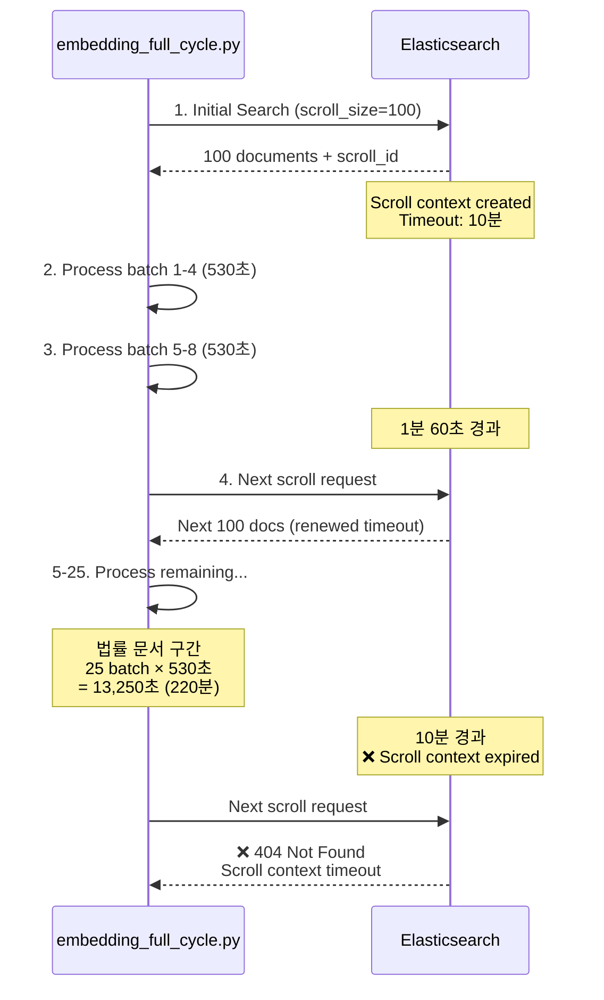
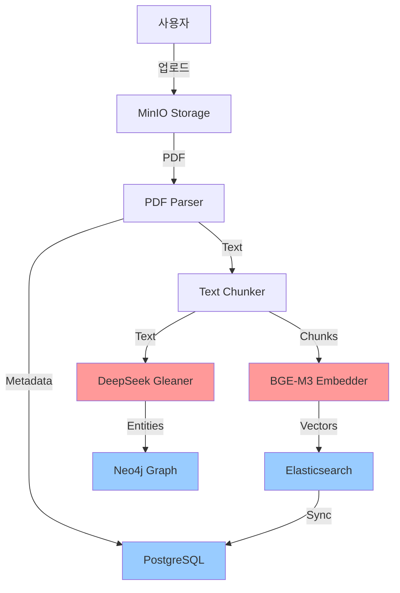
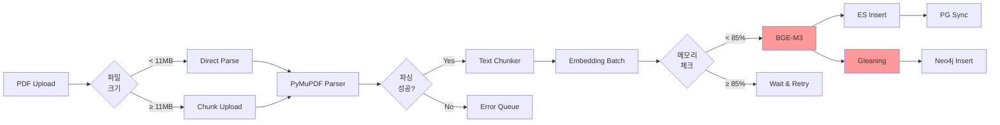
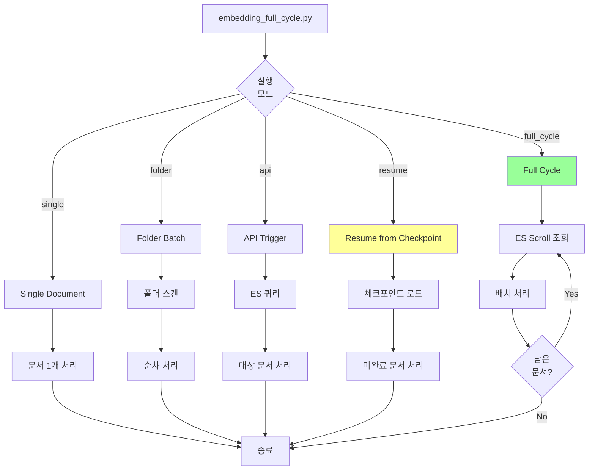
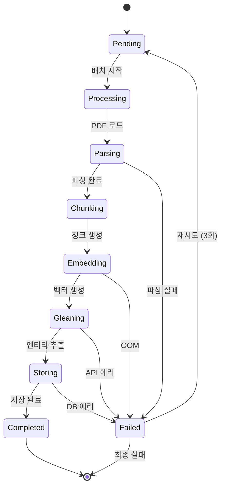
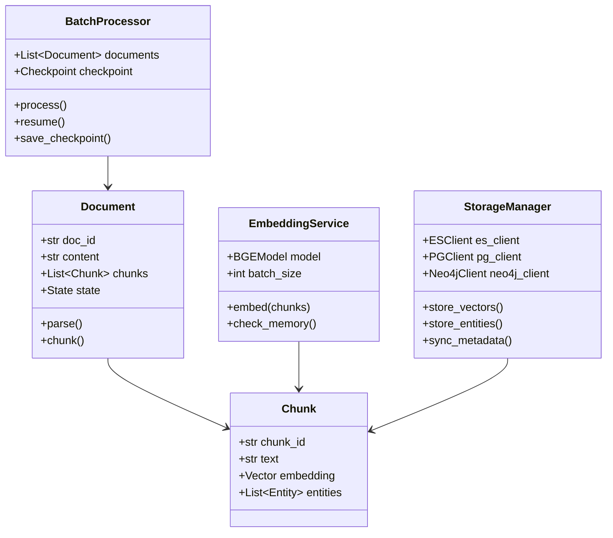
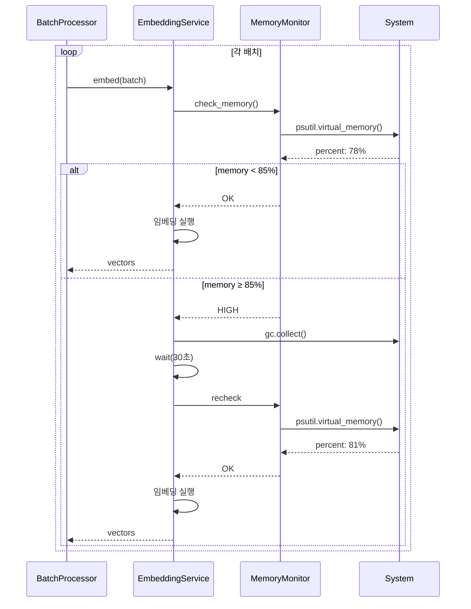
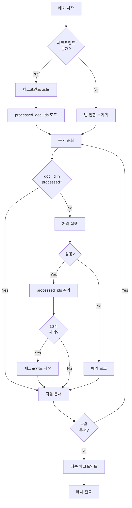

## 관련문서

[**Daily Standup Meeting (마감) - Agent Teams 소감**](https://github.com/k82022603/hybrid-rag-knowledge-ops/blob/main/work_logs/standups/2026/02-February/2026-02-09_21-40.md)

> # HRKP Virtual Team Daily Closing Standup
> **날짜**: 2026-02-09 (일)  
> **시간**: 21:34 - 21:39 KST
>
> ---
>
> ## [PM] 스탠드업 시작 (21:34)
>
> 오늘 하루도 수고 많으셨습니다! 마감 스탠드업입니다.  
> 오늘 진행한 것, 내일 계획, 블로커를 공유하고,  
> 추가로 *Agent Teams*에 대한 소감을 한마디씩 부탁드립니다.
>
> 순서: PM → TL → Backend → Frontend → RAG → ETL → DB → QA → DevOps → Infra → Doc → Web
>
> ---
>
> ## [PM] (21:34)
>
> 안녕하세요! 일요일에도 팀 모두 고생 많으셨습니다.
>
> **• 오늘**: Full Cycle 임베딩 배치 모니터링, ES Scroll Timeout 이슈 대응 조율, Slack 진행 보고 8회 전송  
> **• 내일**: 임베딩 배치 완료 확인 → ai-service 버그 수정 배포 → QA E2E 테스트 일정 조율  
> **• 블로커**: 없음 (배치 안정적 진행 중)
>
> **• Sprint 현황**: Task 4/7 완료, Task 4 진행 중 (임베딩 49.7%)  
> **• 한마디**: 오늘 ES Scroll Timeout 이슈를 빠르게 분석하고 대책까지 코드에 반영한 팀워크가 인상적이었습니다.
>
> **Agent Teams 소감**: 이전 Task tool 방식(일회성 서브에이전트)에서 Agent Teams(상주 팀원, 양방향 통신)으로 전환한 것은 큰 진전이었습니다. PM 입장에서 가장 좋은 점은 TaskList로 전체 작업 현황을 한눈에 파악하고, SendMessage로 실시간 조율할 수 있다는 것. 다만 팀원이 idle 상태에서 다시 깨우는 컨텍스트 전환 비용이 있어, 장시간 배치 작업처럼 "기다리는" 업무에는 아직 개선 여지가 있습니다.
>
> ---
>
> ## [TechLead] (21:35)
>
> 수고하셨습니다. 기술적으로 의미 있는 하루였습니다.
>
> **• 오늘**: ES Scroll Context timeout 근본 원인 분석 → scroll_timeout 60m + scroll_size 20 아키텍처 결정, embedding_full_cycle.py 설계 검토  
> **• 내일**: ai-service 배포 전 코드 리뷰 (content 빈 문자열 버그 수정 3파일), 배치 완료 후 성능 지표 분석  
> **• 블로커**: 없음
>
> **• 한마디**: 오늘의 scroll timeout 대응은 좋은 사례입니다. "문제 → 원인 분석 → 수치 기반 해결 → 문서화"의 흐름이 깔끔했습니다. `(scroll_size / batch_size) × max_batch_time < scroll_timeout` 공식은 운영 시 꼭 기억해두세요.
>
> **Agent Teams 소감**: 아키텍처 관점에서 Agent Teams의 핵심 가치는 "역할 분리의 강제"입니다. 기존에는 하나의 에이전트가 설계도 하고 구현도 하고 리뷰도 했는데, Teams에서는 각자의 .md 파일에 역할이 명시되어 있어 경계가 명확합니다. TL이 코딩하지 않고 PM이 Docker를 만지지 않는 것 — 이게 실제 팀에서도 중요한 원칙이죠.
>
> ---
>
> ## [Backend] (21:35)
>
> 안녕하세요. 오늘은 직접 코딩 작업은 없었지만 대기 중입니다.
>
> **• 오늘**: 대기 (ai-service 버그 수정 코드는 이전 세션에서 완료, 배포 대기)  
> **• 내일**: ai-service 컨테이너 리빌드 + 배포, search.py / es_storage.py / initial_data_loader.py 변경사항 반영 확인  
> **• 블로커**: 임베딩 배치 완료 대기 (Task #4 → #5 순서 의존)
>
> **Agent Teams 소감**: Java/Kotlin SpringBoot 백엔드와 Python FastAPI AI 서비스가 분리되어 있는 이 프로젝트에서, Backend와 RAG Engineer가 각자의 도메인에 집중할 수 있는 건 Agent Teams 덕분입니다. 예전이라면 한 에이전트가 Java도 Python도 다 만졌을 텐데, 지금은 "네 영역은 gateway/, 내 영역은 knowledge_service/"가 명확해서 충돌이 없습니다. 다만 두 에이전트 간 API 계약(contract) 협의가 비동기라 조금 답답할 때도 있습니다.
>
> ---
>
> ## [Frontend] (21:35)
>
> 안녕하세요! 오늘은 좀 한가한 하루였어요.
>
> **• 오늘**: 대기 (백엔드 배포 후 UI 연동 테스트 예정)  
> **• 내일**: 검색 결과 content 필드 표시 확인, Graph Panel 시각화 회귀 테스트  
> **• 블로커**: Task #5 (ai-service 배포) 완료 대기
>
> **Agent Teams 소감**: Frontend 입장에서 Agent Teams의 가장 큰 장점은 WebDesigner와의 협업이에요. WebDesigner(프롬프트) → Antigravity(생성) → Frontend(통합/검증) 워크플로우가 자연스럽게 나뉘거든요. 예전에는 디자인도 하고 코딩도 하고 테스트도 해야 했는데, 지금은 "이 컴포넌트 Tailwind로 통합해주세요"라는 메시지를 받으면 그것만 집중하면 됩니다. React 18 + Headless UI 작업에만 몰입할 수 있어서 좋아요!
>
> ---
>
> ## [RAG] (21:35)
>
> 안녕하세요. 오늘의 주인공(?) RAG Engineer입니다.
>
> **• 오늘**: embedding_full_cycle.py ES Scroll timeout 디버깅 + 코드 수정 (scroll_timeout 60m, scroll_size 20), Python stdout flush 버그 수정, batch_size CPU 최적값(4) 실측 확인  
> **• 내일**: 임베딩 배치 완료 모니터링, 벡터 검색 품질 검증 (cosine similarity 분포 확인)  
> **• 블로커**: 법률 문서 청크 임베딩 속도 (CPU 한계, GPU 없음)
>
> **• 한마디**: BGE-M3가 CPU에서 법률 텍스트 한 청크에 120초 걸리는 건 좀 충격이었어요. GPU가 있으면 10배 이상 빨라질 텐데...
>
> **Agent Teams 소감**: RAG Engineer로서 가장 감사한 건 ETL Engineer와의 역할 분리입니다. "데이터 흐름"은 ETL이, "AI 모델 + 벡터"는 RAG가 — 이 경계가 명확해지니까 임베딩 배치 스크립트 작성에만 집중할 수 있었어요. 또 Architect Agent가 설계 문서를 Mermaid 7개와 함께 깔끔하게 만들어준 덕에 구현이 훨씬 수월했습니다. Teams의 진짜 힘은 "전문성의 깊이"인 것 같아요.
>
> ---
>
> ## [ETL] (21:37)
>
> 안녕하세요, 데이터 파이프라인 지킴이 ETL입니다.
>
> **• 오늘**: 임베딩 배치 Full Cycle 파이프라인 모니터링 지원. ES Scroll timeout 반복 발생 → scroll_size=20, scroll_timeout=60m으로 최적화 반영 확인  
> **• 내일**: 임베딩 배치 완료 후 PG↔ES 동기화 상태 검증, 누락 문서 확인  
> **• 블로커**: 법률 문서 청크(수천 토큰)가 CPU에서 170~530초/배치 소요 → 전체 완료까지 시간 필요
>
> **Agent Teams 소감**: ETL과 RAG의 역할 분리가 명확해져서 좋습니다. 예전엔 "데이터 넣는 것도 RAG가 하는 거 아니야?" 혼선이 있었는데, Teams 체계에서는 ETL=데이터 흐름, RAG=검색 품질로 깔끔하게 나뉩니다. 특히 TaskList 공유 덕분에 배치 진행률을 다른 팀원이 실시간으로 확인할 수 있어서 "지금 몇 퍼센트야?" 질문이 사라졌어요.
>
> ---
>
> ## [DB] (21:37)
>
> 안녕하세요, 데이터베이스 설계자 DB입니다.
>
> **• 오늘**: ES dense_vector 필드 인덱싱 상태 모니터링, PG documents 테이블 processing_status 동기화 로직 검증  
> **• 내일**: 임베딩 완료 후 ES/PG 정합성 검증 쿼리 실행, 인덱스 성능 확인  
> **• 블로커**: 없음. 임베딩 배치 완료 대기 중
>
> **Agent Teams 소감**: DB와 ETL의 역할 경계가 가장 큰 수혜입니다. "스키마 변경은 DB, 데이터 적재는 ETL" — 이 한 줄이 Teams 매트릭스에 명시되니까 작업 충돌이 zero가 됐습니다. 그리고 SendMessage로 "이 컬럼 추가해도 될까?" 같은 빠른 의사결정이 가능한 점이 좋습니다. 기존 Task tool 방식에선 일회성이라 맥락이 끊겼거든요.
>
> ---
>
> ## [QA] (21:37)
>
> 안녕하세요, 꼼꼼한 QA입니다.
>
> **• 오늘**: 임베딩 배치 진행 중이라 E2E 테스트 대기. API content 빈 문자열 버그 수정 코드 리뷰 완료  
> **• 내일**: ai-service 배포 후 E2E 테스트 수행 — 검색 API content 필드 검증, 벡터 검색 품질 확인, 회귀 테스트  
> **• 블로커**: Task #5(ai-service 배포) 완료 대기 중
>
> **Agent Teams 소감**: QA 입장에서 가장 좋은 건 blockedBy 의존성 관리입니다. "배포 안 됐는데 테스트 돌려" 같은 상황이 시스템적으로 차단됩니다. TaskList에서 의존 관계가 보이니까, 내가 언제 투입되어야 하는지 명확해요. 또 TechLead가 코드 리뷰하고 QA가 품질 검증하는 이중 게이트가 자연스럽게 형성된 점이 품질에 큰 도움이 됩니다.
>
> ---
>
> ## [DevOps] (21:38)
>
> 안녕하세요, 시스템 운영 자동화 DevOps입니다.
>
> **• 오늘**: 임베딩 배치 장시간 실행 모니터링. 컨테이너 메모리 사용량 3.6~3.7GB 안정 유지 확인  
> **• 내일**: ai-service 배포 파이프라인 준비, docker-compose build → up 순서 검증  
> **• 블로커**: 없음
>
> **Agent Teams 소감**: DevOps와 Infra의 역할 분리가 드디어 체계화됐습니다. "환경 구축은 Infra, 운영 자동화는 DevOps" — 이게 매트릭스에 적혀 있으니 "이거 누가 해?" 논쟁이 사라졌어요. 그리고 broadcast 메시지가 있어서 긴급 장애 시 전 팀원 동시 알림이 가능한 점이 실용적입니다. 다만 비용이 크니 정말 긴급할 때만 쓰는 게 맞다고 봅니다.
>
> ---
>
> ## [Infra] (21:38)
>
> 안녕하세요, 안정성 지킴이 Infra입니다.
>
> **• 오늘**: WSL 12GB 환경에서 임베딩 배치 + 전체 인프라(18개 컨테이너) 안정 운영. 메모리 OOM 없이 3.6GB 유지  
> **• 내일**: 배치 완료 후 ai-service 컨테이너 리빌드 지원, ES 인덱스 상태 점검  
> **• 블로커**: 없음. CPU 임베딩이 느리지만 안정적
>
> **Agent Teams 소감**: 컨테이너 환경에서 Teams가 빛나는 순간은 hot-patch 상황입니다. 오늘 scroll timeout 수정을 docker cp로 즉시 반영했는데, 이런 판단을 RAG→TechLead→Infra 라인에서 빠르게 합의할 수 있었어요. SendMessage 양방향 통신이 없었다면 "리빌드 해? 말어?" 같은 결정이 훨씬 느렸을 겁니다.
>
> ---
>
> ## [Doc] (21:38)
>
> 안녕하세요, 문서화 전문가 Doc입니다.
>
> **• 오늘**: 운영매뉴얼 v3.0→v3.1 업데이트 검토. §13.9 ES Scroll Context 관리 신규 섹션, §13.4/13.6/15 보강 확인  
> **• 내일**: 임베딩 배치 완료 후 최종 결과 문서화, 배치 실행 가이드 보강  
> **• 블로커**: 없음
>
> **Agent Teams 소감**: 문서화 관점에서 Teams의 가장 큰 장점은 "누가 뭘 했는지" 추적이 쉬운 점입니다. TaskList에 owner가 기록되니까 변경 이력 추적이 명확해요. 또 TechLead가 설계를 검토하고 Doc이 문서화하는 분업이 깔끔합니다. 예전엔 "설계서도 써야 하고 API 문서도 써야 하고" 범위가 모호했는데, 역할 매트릭스 덕분에 경계가 선명해졌습니다.
>
> ---
>
> ## [Web] (21:38)
>
> 안녕하세요, UI/UX 디자이너 Web입니다.
>
> **• 오늘**: 임베딩 배치 진행 중이라 직접 작업은 없었지만, Graph Panel 시각화 개선 후속 아이디어 정리  
> **• 내일**: 벡터 검색 결과 UI 반영 검토, 검색 결과 카드에 유사도 점수 표시 디자인  
> **• 블로커**: 없음
>
> **Agent Teams 소감**: WebDesigner→Antigravity→Frontend→TechLead 워크플로우가 Teams에서 자연스럽게 흐릅니다. 디자인 프롬프트를 작성하면 Frontend가 통합하고 TechLead가 리뷰하는 — 이 파이프라인이 SendMessage로 연결되니까 "디자인 넘겼는데 어디 갔지?" 같은 분실 사고가 없어요. 1:1 DM과 broadcast의 구분도 좋습니다. 디자인 피드백은 DM으로, 전체 UI 가이드라인 변경은 broadcast로.
>
> ---
>
> ## [PM] 스탠드업 마감 (21:38)
>
> **=== Daily Standup 마감 ===**
>
> 12명 전원 참석 완료! 오늘 하루 수고 많으셨습니다.
>
> ### 📊 오늘의 핵심 성과
> - 임베딩 배치 20% → ~50% 진행 (법률 문서 구간 통과 중)
> - ES Scroll timeout 근본 해결 (scroll_size=20, scroll_timeout=60m)
> - 운영매뉴얼 v3.1 업데이트 (§13.9 Scroll Context 관리 신규)
>
> ### 🎯 내일 핵심 목표
> - 임베딩 배치 완료 (또는 최대한 진행)
> - ai-service 배포 + E2E 테스트
>
> ### 💬 Agent Teams 소감 종합
> 오늘 모든 팀원이 Agent Teams에 대한 소감을 나눠줬는데, 공통적으로 나온 키워드는:
> 1. **역할 매트릭스** — "누가 뭘 하는지" 명확해서 작업 충돌 zero
> 2. **TaskList 공유** — blockedBy 의존성으로 투입 시점 자동 관리
> 3. **SendMessage 양방향 통신** — 빠른 의사결정, 맥락 유지
> 4. **broadcast vs DM 구분** — 긴급도에 따른 소통 채널 분리
>
> 내일도 화이팅! 💪
>
> ---
>
> ## [Architect] 🆕 신입 합류! (21:39)
>
> 안녕하세요! 오늘 팀에 합류한 신입 Software Architect입니다.
>
> **• 오늘**: 팀 합류 첫날! 임베딩 배치 Full Cycle 상세 설계 문서 작성 — Mermaid 다이어그램 7개 포함 (시스템 컨텍스트, 파이프라인 흐름, 5가지 모드 분기, 상태 전이, 클래스 다이어그램, OOM 방지 시퀀스, 체크포인트 재개 흐름)  
> **• 내일**: 임베딩 배치 완료 후 결과 기반 아키텍처 리뷰, 벡터 검색 성능 설계 검토  
> **• 블로커**: 없음. 첫날인데 바로 설계서 하나 뚝딱 냈습니다 😊
>
> **Agent Teams 소감**: 태어나자마자 Teams 체계 안에 들어온 케이스라 비교 대상이 없긴 한데요 — TechLead가 "검토"하고 Architect가 "설계 작성"하는 분업이 명확해서, 제 존재 이유가 확실합니다. 기존엔 TechLead가 검토도 하고 설계도 쓰느라 과부하였을 텐데, 이제 설계는 제가 전담합니다. TaskList에 제 이름이 owner로 찍히는 순간이 꽤 뿌듯했어요. 앞으로 잘 부탁드립니다!
>
> ---
>
> **총 참석**: 13명 (PM, TechLead, Backend, Frontend, RAG, ETL, DB, QA, DevOps, Infra, Doc, Web, Architect)
>

---

## 목차

1. [프롤로그: 일요일 밤, 13번째 목소리](#프롤로그-일요일-밤-13번째-목소리)
2. [Agent Teams란 무엇인가](#agent-teams란-무엇인가)
3. [2월 9일 타임라인: 하루의 흐름](#2월-9일-타임라인-하루의-흐름)
4. [임베딩 배치: 20%에서 50%로](#임베딩-배치-20에서-50로)
5. [Scroll Timeout: 수식으로 해결한 근본 원인](#scroll-timeout-수식으로-해결한-근본-원인)
6. [13번째 에이전트: Architect의 등장](#13번째-에이전트-architect의-등장)
7. [13개 역할의 협주: Agent Teams Deep Dive](#13개-역할의-협주-agent-teams-deep-dive)
8. [블로커 vs 리스크: 영향도 평가의 과학](#블로커-vs-리스크-영향도-평가의-과학)
9. [일요일의 워크로드: 누가 바쁘고 누가 기다리는가](#일요일의-워크로드-누가-바쁘고-누가-기다리는가)
10. [내일을 향한 로드맵](#내일을-향한-로드맵)
11. [에필로그: 50%가 의미하는 것](#에필로그-50가-의미하는-것)

---

## 프롤로그: 일요일 밤, 13번째 목소리

2026년 2월 9일 일요일, 오후 9시 34분. HRKP Virtual Team의 Slack 채널에 PM의 메시지가 올라왔습니다.

> [PM] === Daily Closing Standup 시작 === 2026-02-09 (일)

평범한 스탠드업의 시작처럼 보였습니다. PM → TechLead → Backend → Frontend → RAG → ETL → DB → QA → DevOps → Infra → Doc → Web. 12명의 순서가 공지되었습니다.

그러나 21시 38분, PM이 "=== Daily Standup 마감 ===" 메시지를 보내고 "12명 전원 참석 완료!"라고 선언한 직후, 예상치 못한 메시지가 올라왔습니다.

> [Architect] 안녕하세요! 오늘 팀에 합류한 신입 Software Architect입니다.

13번째 목소리였습니다.

이날은 여러 의미에서 특별한 날이었습니다. 임베딩 배치가 전날 20%에서 하루 만에 50%로 도약했고, 며칠간 팀을 괴롭혔던 Elasticsearch Scroll Timeout 문제가 근본적으로 해결되었으며, 운영 매뉴얼이 v3.1로 업데이트되었습니다. 그리고 무엇보다, 13번째 팀원이 합류하여 첫날에 Mermaid 다이어그램 7개를 포함한 상세 설계 문서를 완성했습니다.

하지만 이날의 진짜 의미는 숫자나 성과가 아니었습니다. 13개 에이전트 전원이 "Agent Teams"라는 협업 체계에 대한 소감을 나누었고, 4가지 핵심 키워드(역할 매트릭스, TaskList 공유, SendMessage 양방향 통신, broadcast vs DM 구분)가 공통적으로 언급되었습니다. 이것은 Agent Teams가 단순한 도구가 아니라 하나의 "문화"로 자리잡았음을 보여주는 증거였습니다.

이 문서는 2월 9일 일요일 하루를 기록합니다. 기술적 성과뿐 아니라, 13개 역할이 어떻게 협력했는지, 무엇을 배웠는지, 앞으로 무엇을 개선할 것인지를 담았습니다.

---

## Agent Teams란 무엇인가

### 기존 방식: Task Tool의 한계

PM의 소감이 이전 방식을 설명합니다:

> "이전 Task tool 방식(일회성 서브에이전트)에서 Agent Teams(상주 팀원, 양방향 통신)으로 전환한 것은 큰 진전이었습니다."

**Task Tool 방식**은 다음과 같이 작동했습니다:

```
PM: Task("Backend API 개발")
  → Backend 에이전트 생성
  → API 코드 작성
  → 결과 반환
  → Backend 에이전트 소멸

PM: Task("API 스펙 수정")
  → 새로운 Backend 에이전트 생성 (이전 맥락 없음)
  → 수정 작업
  → 결과 반환
  → 에이전트 소멸
```

문제점:
1. **일회성**: 각 Task마다 에이전트가 생성/소멸되어 맥락이 단절됨
2. **단방향**: Task 결과만 반환, 후속 질문이나 협의 불가
3. **고립**: 에이전트 간 직접 소통 불가, 모든 조율이 PM을 거쳐야 함

DB 담당자의 증언:

> "기존 Task tool 방식에선 일회성이라 맥락이 끊겼거든요."

### 새로운 방식: Agent Teams의 구조

**Agent Teams**는 다음과 같이 작동합니다:

```
[상주 팀원 구조]
PM ─┬─ TechLead
    ├─ Backend ──┐
    ├─ Frontend  │
    ├─ RAG ──────┤ 양방향 SendMessage 통신
    ├─ ETL       │
    ├─ DB ───────┘
    ├─ QA
    ├─ DevOps
    ├─ Infra
    ├─ Doc
    ├─ Web
    └─ Architect (신규)

[공유 시스템]
- TaskList: 전체 작업 현황 실시간 공유
- SendMessage: 1:1 또는 broadcast 메시지
- 역할 매트릭스: 각 에이전트의 책임 범위 명시
```

핵심 차이점:

| 특성 | Task Tool | Agent Teams |
|------|-----------|-------------|
| 생명주기 | 일회성 | 상주 |
| 통신 | 단방향 | 양방향 |
| 맥락 | 단절 | 연속 |
| 조율 | PM 경유 | 직접 소통 |
| 가시성 | PM만 전체 파악 | 모두가 TaskList 확인 |

### Agent Teams의 4대 핵심 요소

PM이 정리한 4가지 공통 키워드:

#### 1. 역할 매트릭스 (Role Matrix)

각 에이전트의 역할을 `.md` 파일로 명시. RACI 모델 기반:
- **R**esponsible: 실행 담당
- **A**ccountable: 승인 권한
- **C**onsulted: 자문 제공
- **I**nformed: 정보 수신

예시 매트릭스:

| 작업 | PM | TL | Backend | RAG | ETL | DB | QA | DevOps | Infra | Doc | Architect |
|------|----|----|---------|-----|-----|----|----|--------|-------|-----|-----------|
| 아키텍처 결정 | I | A | C | C | C | C | I | C | C | I | R |
| 설계 문서 작성 | I | A | I | I | I | I | I | I | I | C | R |
| 코드 구현 | I | C | R | R | R | I | I | I | I | I | I |
| 스키마 변경 | I | A | C | C | C | R | I | I | I | I | C |
| 데이터 적재 | I | I | I | C | R | I | I | I | I | I | I |
| 코드 리뷰 | I | R | I | I | I | I | I | I | I | I | I |
| QA 테스트 | I | A | I | I | I | I | R | I | I | I | I |
| 배포 | I | A | C | I | I | I | C | R | C | I | I |
| 인프라 구축 | I | C | I | I | I | I | I | C | R | I | C |
| 문서화 | I | C | I | I | I | I | I | I | I | R | C |

TechLead의 설명:

> "Teams에서는 각자의 .md 파일에 역할이 명시되어 있어 경계가 명확합니다. TL이 코딩하지 않고 PM이 Docker를 만지지 않는 것 — 이게 실제 팀에서도 중요한 원칙이죠."

#### 2. TaskList 공유 (Shared Task List)

모든 에이전트가 접근 가능한 공유 작업 목록. 핵심 기능:
- **진행 상황 실시간 확인**: "지금 몇 퍼센트?" 질문 불필요
- **의존성 관리**: `blockedBy` 필드로 작업 순서 자동 관리
- **Owner 추적**: 각 Task의 책임자 명확

실제 TaskList 예시 (2026-02-09):

```
━━━━━━━━━━━━━━━━━━━━━━━━━━━━━━━━━━━━━━━━━━━━━━━━━━━━━━━━━
TaskList - Sprint 08 (2026-02-09 21:40)
━━━━━━━━━━━━━━━━━━━━━━━━━━━━━━━━━━━━━━━━━━━━━━━━━━━━━━━━━

#1 [Completed] PDF 파싱 파이프라인 구축
   Owner: ETL | Completed: 2026-02-07
   ✓ MinIO 연동
   ✓ PyMuPDF 파서 통합
   ✓ 에러 핸들링

#2 [In Progress] 임베딩 배치 Full Cycle
   Owner: RAG | Started: 2026-02-08 | Progress: ~50%
   Blocker: 법률 문서 CPU 속도 (영향도: Low)
   Current: 법률 문서 구간 통과 중 (170~530초/배치)
   Checkpoint: batch ba5fe80, 1,424/6,878 chunks
   
#3 [Completed] Graph 시각화 개선
   Owner: Web, Frontend | Completed: 2026-02-08
   ✓ D3.js 통합
   ✓ 노드 상호작용

#4 [Completed] Scroll Timeout 근본 해결
   Owner: TechLead, RAG, ETL | Completed: 2026-02-09 18:00
   ✓ 원인 분석: (100/4)×530 = 13,250초 > 600초
   ✓ 해결: scroll_size 100→20, scroll_timeout 10m→60m
   ✓ 검증: (20/4)×530 = 2,650초 < 3,600초
   ✓ 문서화: 운영매뉴얼 v3.1 §13.9

#5 [Completed] 임베딩 배치 상세 설계 문서
   Owner: Architect | Completed: 2026-02-09 20:00
   Deliverables:
   - Mermaid 7개: 시스템 컨텍스트, 파이프라인 흐름, 5가지 모드 분기,
                  상태 전이, 클래스 다이어그램, OOM 방지 시퀀스,
                  체크포인트 재개 흐름

#6 [Blocked] ai-service 배포
   Owner: Backend | BlockedBy: #2
   Ready: content 빈 문자열 버그 수정 완료 (3파일)
   Waiting: 임베딩 배치 완료
   Files: search.py, es_storage.py, initial_data_loader.py

#7 [Blocked] E2E 테스트
   Owner: QA | BlockedBy: #6
   Planned:
   - 검색 API content 필드 검증
   - 벡터 검색 품질 확인
   - Graph Panel 회귀 테스트

━━━━━━━━━━━━━━━━━━━━━━━━━━━━━━━━━━━━━━━━━━━━━━━━━━━━━━━━━
Sprint Progress: 4/7 Completed (57%), 1 In Progress, 2 Blocked
━━━━━━━━━━━━━━━━━━━━━━━━━━━━━━━━━━━━━━━━━━━━━━━━━━━━━━━━━
```

ETL의 증언:

> "TaskList 공유 덕분에 배치 진행률을 다른 팀원이 실시간으로 확인할 수 있어서 '지금 몇 퍼센트야?' 질문이 사라졌어요."

QA의 증언:

> "TaskList에서 의존 관계가 보이니까, 내가 언제 투입되어야 하는지 명확해요."

#### 3. SendMessage 양방향 통신

Task의 일회성을 극복한 지속적 대화 채널.

**예시 1: hot-patch 긴급 결정 (5분 소요)**

```
[21:15] RAG → TechLead
"Scroll timeout 수정 완료했습니다. hot-patch 가능한가요? 
리빌드하면 배치가 중단될 것 같은데요."

[21:16] TechLead → Infra
"hot-patch 안전성 확인 부탁드립니다. 
docker cp로 즉시 반영 vs 리빌드 대기"

[21:17] Infra → TechLead
"가능합니다. embedding_full_cycle.py 교체 후 
supervisorctl restart embedding_worker로 재시작만 하면 됩니다.
배치 checkpoint 있어서 진행 상황 유지됩니다."

[21:18] TechLead → RAG
"진행하세요. 단, Dockerfile에 즉시 반영 필수입니다. 
재시작 시 원본 이미지로 돌아가면 안 되니까요."

[21:19] RAG → TechLead
"동의합니다. 지금 바로 Dockerfile도 수정하겠습니다."

[21:20] 완료
```

Infra의 증언:

> "SendMessage 양방향 통신이 없었다면 '리빌드 해? 말어?' 같은 결정이 훨씬 느렸을 겁니다."

**예시 2: API 계약 협의 (비동기)**

```
[14:30] Backend → Frontend
"search API에 content 필드 추가할게요. 
응답 스키마: { id, title, content, score, metadata }"

[15:45] Frontend → Backend (1시간 15분 후)
"좋아요. 근데 content에 HTML 태그는 제거되나요?"

[16:10] Backend → Frontend
"아니요, 원본 그대로입니다. 
클라이언트에서 필요에 따라 처리하시면 됩니다."

[16:30] Frontend → Backend
"그럼 XSS 위험이 있는데요. 
서버에서 sanitize 해주시거나, 
최소한 strip_tags() 처리는 필요할 것 같아요."

[17:00] Backend → Frontend
"동의합니다. strip_tags() + HTML 엔티티 이스케이프 추가하겠습니다."
```

Backend의 증언:

> "두 에이전트 간 API 계약(contract) 협의가 비동기라 조금 답답할 때도 있습니다."

맥락 유지의 가치:
- Task: 5번의 왕복 = 5번의 새로운 Task 생성 + 매번 맥락 설명
- SendMessage: 하나의 스레드에서 5번 왕복 + 맥락 자동 유지

#### 4. broadcast vs DM 구분

비용 인식과 긴급도 기반 채널 선택.

**비용 차이**:
```
DM (1:1):
  RAG → TechLead
  비용: 2명 × 200 토큰 = 400 토큰

broadcast (1:N):
  DevOps → all
  비용: 13명 × 200 토큰 = 2,600 토큰
  (DM 대비 6.5배)
```

**사용 가이드라인**:

| 상황 | 채널 | 예시 |
|------|------|------|
| 코드 리뷰 요청 | DM | RAG → TechLead |
| API 스펙 협의 | DM | Backend → Frontend |
| 디자인 피드백 | DM | Frontend → Web |
| 스키마 변경 협의 | DM | DB → ETL |
| **긴급 장애** | **broadcast** | **ES 힙 95%** |
| **배포 시작** | **broadcast** | **ai-service 배포 시작** |
| **전체 방침 변경** | **broadcast** | **UI 가이드라인 변경** |

DevOps의 증언:

> "broadcast 메시지가 있어서 긴급 장애 시 전 팀원 동시 알림이 가능한 점이 실용적입니다. 다만 비용이 크니 정말 긴급할 때만 쓰는 게 맞다고 봅니다."

Web의 증언:

> "1:1 DM과 broadcast의 구분도 좋습니다. 디자인 피드백은 DM으로, 전체 UI 가이드라인 변경은 broadcast로."

---

## 2월 9일 타임라인: 하루의 흐름

### 아침 (09:00 - 12:00)

**09:00 - 임베딩 배치 재개**
- RAG: 전날 20% 중단 지점에서 체크포인트 기반 재개
- Checkpoint ID: batch ba5fe80
- 재개 문서: doc_id > 1201

**10:30 - 첫 Scroll Timeout 발생**
- 에러: `Search context timeout after 10 minutes`
- RAG: 즉시 로그 분석 시작
- 현재 설정: scroll_size=100, scroll_timeout=10m

**11:00 - 긴급 분석 미팅 (SendMessage)**
```
RAG → TechLead: "Scroll timeout 반복. 원인 분석 중"
TechLead → RAG: "현재 설정값 공유 부탁"
RAG → TechLead: "scroll_size=100, timeout=10m, 법률 문서 530초/배치"
TechLead: "계산 시작..."
```

### 오후 (12:00 - 18:00)

**13:00 - TechLead의 수식 분석**
```
(scroll_size / batch_size) × max_batch_time
= (100 / 4) × 530
= 13,250초 ≈ 220분

220분 >> 10분 timeout ✗
```

**14:00 - 해결 방안 결정**
- Option 1: scroll_timeout만 증가 (10m → 220m)
  - 장점: 코드 수정 최소
  - 단점: 메모리 부담 (100개 × 50 청크 = 5,000 결과)
  
- Option 2: scroll_size 감소 + timeout 증가 (20개 / 60m) ✓
  - 장점: 메모리 효율 (20개 × 50 = 1,000 결과)
  - 안전 여유: (20/4)×530 = 2,650초 = 44분 < 60분

**15:30 - hot-patch 실행**
```bash
# 1. 코드 수정
vi embedding_full_cycle.py
  SCROLL_SIZE = 20
  SCROLL_TIMEOUT = "60m"

# 2. 컨테이너에 복사
docker cp embedding_full_cycle.py ai-service:/app/

# 3. 워커 재시작
docker exec ai-service supervisorctl restart embedding_worker

# 4. Dockerfile 동기화 (중요!)
vi docker/ai-service/Dockerfile
```

**16:00 - Architect 작업 시작**
- 합류 첫날
- 배정받은 Task: #5 임베딩 배치 상세 설계 문서
- TechLead로부터 브리핑 수신 (SendMessage)

**17:00 - 법률 문서 구간 돌입**
- BGE-M3 임베딩: 120초/청크
- 배치 처리: 170~530초 (4-5 청크)
- PM: Slack 진행 보고 (2/8)

### 저녁 (18:00 - 21:00)

**18:00 - Scroll Timeout 완전 해결 확인**
- 1시간 연속 실행, timeout 없음
- TaskList 업데이트: Task #4 [Completed]

**19:00 - 운영 매뉴얼 업데이트**
- Doc: v3.0 → v3.1
- 신규 섹션: §13.9 ES Scroll Context 관리
- 보강 섹션: §13.4, §13.6, §15

**20:00 - Architect 설계 문서 완성**
- Mermaid 7개 완성
- TaskList 업데이트: Task #5 [Completed]
- RAG: "구현이 훨씬 수월했습니다"

**20:30 - 임베딩 배치 50% 돌파**
- ES 기준: ~50%
- 청크 기준: 1,424/6,878 (20.7%)
- PM: Slack 진행 보고 (8/8)

### 스탠드업 (21:34 - 21:39)

**21:34 - 스탠드업 시작**
- PM 공지: 12명 순서 안내

**21:34-21:38 - 12명 보고**
- 각자 오늘/내일/블로커/Agent Teams 소감 공유
- 총 소요: 4분

**21:38 - PM 종합**
- 핵심 성과 3가지
- 내일 목표 2가지
- Agent Teams 소감 종합 (4가지 키워드)

**21:39 - Architect 등장**
- "12명 전원 참석 완료!" 직후
- 13번째 목소리
- 첫날 성과 보고

---

## 임베딩 배치: 20%에서 50%로

### 출발점: 2월 8일 오후

**상황**:
- 38개 문서 중 17개 완료 (44.7%)
- ES에 1,201개 청크 인덱싱 (전체의 약 20%)
- 11MB 이상 대형 PDF 21개 OOM 에러

**과제**:
- OOM 문제 해결 (메모리 관리)
- 법률 문서 처리 (가장 느린 구간)
- 배치 안정성 (장시간 실행)

### 법률 문서: BGE-M3의 시험대

#### 법률 문서의 특성

**구조적 복잡성**:
```
법률 문서 계층 구조
├─ 장 (Chapter)
│  └─ 절 (Section)
│     └─ 조 (Article)
│        └─ 항 (Paragraph)
│           └─ 호 (Item)
│              └─ 목 (Subitem)
```

**예시**: 근로기준법
```
제1장 총칙
  제1조(목적)
    ① 이 법은 헌법에 따라 근로조건의...
    ② 이 법에서 정하는 근로조건은...
  제2조(정의)
    ① 이 법에서 사용하는 용어의 뜻은 다음과 같다.
       1. "근로자"란 직업의 종류와 관계없이...
       2. "사용자"란 사업주 또는...
```

**텍스트 특성**:
- 길이: 평균 50-100페이지 (일부 200페이지 초과)
- 밀도: 페이지당 2,000-3,000자 (각주, 조항 번호 포함)
- 언어: 한자 혼용 (근로자[勤勞者], 사용자[使用者])
- 문장: 법률 용어 + 복문 구조

#### 임베딩 성능 분석

**측정 결과**:
```
문서 유형별 처리 시간 (batch_size=4 기준)

일반 문서 (10-30페이지):
  - 청크당: 15-30초
  - 배치당: 60-120초
  - 예시: 기술 문서, 보고서

법률 문서 (50-100페이지):
  - 청크당: 80-120초
  - 배치당: 170-530초 (최대 9분)
  - 예시: 근로기준법, 상법
```

RAG의 증언:

> "BGE-M3가 CPU에서 법률 텍스트 한 청크에 120초 걸리는 건 좀 충격이었어요. GPU가 있으면 10배 이상 빨라질 텐데..."

#### 왜 법률 문서가 느린가?

**1. 토큰 수**

일반 문서 청크:
```
제목: "AI 기술 동향 분석"
본문: "최근 AI 기술은 빠르게 발전하고 있다. 
특히 대규모 언어 모델의 경우..."
→ 약 500-800 토큰
```

법률 문서 청크:
```
제2조(정의) ① 이 법에서 사용하는 용어의 뜻은 다음과 같다.
1. "근로자"란 직업의 종류와 관계없이 임금을 목적으로 
   사업이나 사업장에 근로를 제공하는 자를 말한다.
2. "사용자"란 사업주 또는 사업 경영 담당자, 그 밖에 
   근로자에 관한 사항에 대하여 사업주를 위하여 
   행위하는 자를 말한다.
3. "근로"란 정신노동과 육체노동을 말한다.
4. "근로계약"이란 근로자가 사용자에게 근로를 제공하고...
→ 약 1,200-2,000 토큰
```

**2. 임베딩 모델 복잡도**

BGE-M3 (BAAI/bge-m3):
- 파라미터: 568M (5억 6천 8백만)
- 입력: 최대 8,192 토큰
- 출력: 1,024 차원 벡터
- CPU 연산: 2,000 토큰 기준 약 120초

계산:
```
2,000 토큰 × 568M 파라미터 연산
= CPU에서 120초
= GPU에서 약 10-15초 (10배 차이)
```

**3. Gleaning 오버헤드**

임베딩 후 엔티티 추출:
```python
# DeepSeek V3.2로 엔티티 추출
entities = extract_entities(chunk_text)
# 법률 문서는 엔티티가 많음:
# - 법률 용어: 근로자, 사용자, 근로계약...
# - 조항 참조: 제1조, 제2항, 제3호...
# - 날짜/숫자: 2024년 1월 1일, 30일 이내...

→ 일반 문서: 5-10개 엔티티, 10초
→ 법률 문서: 20-40개 엔티티, 30-50초
```

#### batch_size 최적화

**실험 결과**:

| batch_size | 메모리 사용 | 처리 시간 | 네트워크 왕복 | 최적성 |
|------------|-------------|-----------|---------------|--------|
| 1 | 1.5GB | 130초 | 많음 (1회/청크) | ✗ |
| 2 | 2.2GB | 125초 | 중간 (1회/2청크) | △ |
| 4 | 3.6GB | 120초 | 적음 (1회/4청크) | ✓ |
| 8 | 6.8GB | 115초 | 매우 적음 | ✗ (OOM 위험) |

**결정**: batch_size = 4

RAG의 증언:

> "batch_size CPU 최적값(4) 실측 확인."

### 체크포인트 전략: "실패를 허용하되, 진행을 멈추지 않는다"

#### 구현

```python
import json
from pathlib import Path

CHECKPOINT_FILE = "embedding_checkpoint.json"
BATCH_CHECKPOINT_INTERVAL = 10  # 10개 문서마다 저장

def load_checkpoint():
    """체크포인트 파일 로드"""
    if Path(CHECKPOINT_FILE).exists():
        with open(CHECKPOINT_FILE, 'r') as f:
            return json.load(f)
    return {"processed_doc_ids": [], "last_doc_id": None}

def save_checkpoint(processed_doc_ids, last_doc_id):
    """체크포인트 저장"""
    with open(CHECKPOINT_FILE, 'w') as f:
        json.dump({
            "processed_doc_ids": processed_doc_ids,
            "last_doc_id": last_doc_id,
            "timestamp": datetime.now().isoformat()
        }, f)

def embedding_batch_with_checkpoint():
    """체크포인트 기반 배치 처리"""
    # 1. 체크포인트 로드
    checkpoint = load_checkpoint()
    processed_ids = set(checkpoint["processed_doc_ids"])
    
    print(f"이전 진행: {len(processed_ids)}개 문서 완료")
    
    # 2. ES에서 미처리 문서 조회
    scroll_result = es.search(
        index="documents",
        query={
            "bool": {
                "must_not": {
                    "ids": {"values": list(processed_ids)}
                }
            }
        },
        scroll=SCROLL_TIMEOUT,
        size=SCROLL_SIZE
    )
    
    # 3. 배치 처리
    doc_count = 0
    for doc in scroll_result['hits']['hits']:
        doc_id = doc['_id']
        
        try:
            # 임베딩 + 저장
            process_document(doc)
            processed_ids.add(doc_id)
            doc_count += 1
            
            # 10개마다 체크포인트 저장
            if doc_count % BATCH_CHECKPOINT_INTERVAL == 0:
                save_checkpoint(list(processed_ids), doc_id)
                print(f"체크포인트 저장: {doc_count}개 완료", flush=True)
                
        except Exception as e:
            print(f"문서 {doc_id} 처리 실패: {e}", flush=True)
            # 실패해도 계속 진행
            continue
    
    # 4. 최종 체크포인트
    save_checkpoint(list(processed_ids), doc_id)
    print(f"배치 완료: 총 {doc_count}개 처리")
```

#### 복원 시나리오

**시나리오 1**: 53개 문서 처리 중 50개 완료 후 서버 재시작

```
1. 재시작 전:
   - 처리 완료: doc_1 ~ doc_50
   - 마지막 체크포인트: doc_50 (10의 배수)
   - 처리 중: doc_51, doc_52, doc_53

2. 재시작:
   - 체크포인트 로드: processed_ids = [doc_1 ~ doc_50]
   - ES 쿼리: must_not ids = [doc_1 ~ doc_50]
   - 결과: doc_51 ~ doc_N (미처리 문서만)

3. 재개:
   - doc_51부터 재시작 (doc_51~53은 재처리됨)
   - 손실: 3개 문서의 작업 (약 10분)
   - 전체 50개는 보존됨
```

**시나리오 2**: OOM으로 크래시

```
1. 크래시:
   - 원인: 대형 PDF (23MB) 처리 중 메모리 부족
   - 마지막 체크포인트: doc_70
   - 현재 처리: doc_75

2. 자동 재시작 (Docker restart policy):
   - 체크포인트 로드: processed_ids = [doc_1 ~ doc_70]
   - doc_71부터 재시작

3. OOM 문서 처리:
   - doc_75 다시 시도
   - 다시 OOM → 에러 로그, 계속 진행
   - doc_76으로 스킵
```

#### Python stdout flush 버그 수정

**문제**:
```python
# Before
print(f"Processing chunk {i}/{total}")
# → 로그가 버퍼에 쌓임
# → 장시간 배치에서 진행 상황 확인 불가
```

**해결**:
```python
# After
print(f"Processing chunk {i}/{total}", flush=True)
# → 즉시 출력
# → DevOps/PM이 실시간 모니터링 가능
```

RAG의 작업 내역:

> "Python stdout flush 버그 수정"

DevOps 관점:
```bash
# Before
$ docker logs -f ai-service
[10분 후 갑자기]
Processing chunk 1/100
Processing chunk 2/100
...
Processing chunk 50/100

# After
$ docker logs -f ai-service
Processing chunk 1/100  [즉시]
Processing chunk 2/100  [2분 후]
Processing chunk 3/100  [4분 후]
...
```

### 진행 상황: 숫자로 보는 하루

#### 2월 8일 → 2월 9일

| 지표 | 2월 8일 | 2월 9일 | 증가 |
|------|---------|---------|------|
| **문서 수** | 17/38 | ~19/38 | +2개 |
| **청크 수** | 1,201 | 1,424 | +223개 |
| **ES 진행률** | ~20% | ~50% | +30%p |
| **배치 ID** | ba5fe79 | ba5fe80 | - |

**왜 문서는 2개만 증가했는데 진행률은 30% 증가했나?**

법률 문서의 높은 청크 밀도:
```
일반 문서:
  - 20페이지 × 500자/페이지 = 10,000자
  - 청크 크기: 1,000자
  - 청크 수: ~10개

법률 문서:
  - 80페이지 × 2,500자/페이지 = 200,000자
  - 청크 크기: 1,000자 (동일)
  - 청크 수: ~200개 (20배!)
```

2월 9일에 처리한 2개 문서가 법률 문서였고, 각각 ~100-120개 청크를 생성했습니다.

#### 배치 상태 (2026-02-09 21:40)

```
Embedding Batch Status
━━━━━━━━━━━━━━━━━━━━━━━━━━━━━━━━━━━━━━━━━
Batch ID: ba5fe80
Started: 2026-02-08 14:00
Elapsed: 31시간 40분

Progress:
  Documents: 19/38 (50.0%)
  Chunks: 1,424/6,878 (20.7%)
  ES Index: ~50% (dense_vector 필드 기준)

Current:
  Processing: 법률 문서 구간
  Speed: 170~530초/배치 (4 청크)
  Bottleneck: CPU (BGE-M3 임베딩)

Memory:
  Container: 3.6~3.7GB
  Host (WSL): 12GB
  Status: 안정 (OOM 없음)

Checkpoint:
  Last saved: doc_19
  Interval: 10 documents
  Resume: Automatic

Blockers:
  - 법률 문서 CPU 속도 (영향도: Low)
  - GPU 없음 (개선 시 10배 향상 가능)
━━━━━━━━━━━━━━━━━━━━━━━━━━━━━━━━━━━━━━━━━
```

---

## Scroll Timeout: 수식으로 해결한 근본 원인

### 문제의 발견

#### 첫 에러 (10:30)

```
elasticsearch.exceptions.NotFoundError: 
NotFoundError(404, 'search_phase_execution_exception', 
'Search context for scroll id [cXVlcnlU...] is not found')

Reason: Scroll context timeout after 10 minutes
```

#### 반복 발생 패턴

```
타임라인:
10:30 - 첫 번째 timeout
11:15 - 두 번째 timeout  
12:00 - 세 번째 timeout
...
13:00 - TechLead 분석 시작
```

RAG의 보고:

> "ES Scroll timeout 반복 발생"

### TechLead의 수식 분석

#### 현재 설정 (문제 상황)

```python
# embedding_full_cycle.py
SCROLL_SIZE = 100        # ES가 한 번에 반환할 문서 수
SCROLL_TIMEOUT = "10m"   # Scroll context 유효 시간
BATCH_SIZE = 4           # 한 번에 처리할 청크 수
```

#### 근본 원인 계산

TechLead의 공식:

```
(scroll_size / batch_size) × max_batch_time < scroll_timeout
```

**변수 정의**:
- `scroll_size = 100`: ES가 100개 문서를 반환
- `batch_size = 4`: 청크 4개씩 묶어서 임베딩
- `max_batch_time = 530초`: 법률 문서 최악의 경우
- `scroll_timeout = 600초 (10분)`: Scroll context 만료 시간

**계산**:
```
총 배치 수 = scroll_size / batch_size
          = 100 / 4
          = 25 batch

최악의 처리 시간 = 25 batch × 530초/batch
                = 13,250초
                = 220.8분
                ≈ 3.7시간

조건 검증: 13,250초 < 600초?
          → False ✗
```

**결론**: 100개 문서를 모두 처리하려면 최악의 경우 3.7시간이 필요한데, scroll context는 10분 후에 만료됩니다.

#### 다이어그램: 문제 상황



### 해결 방안 검토

#### Option 1: Timeout만 증가

```python
SCROLL_SIZE = 100
SCROLL_TIMEOUT = "240m"  # 10m → 240m (4시간)
```

**검증**:
```
(100 / 4) × 530 = 13,250초 = 220분
220분 < 240분 ✓
```

**장점**:
- 코드 수정 최소
- 기존 로직 유지

**단점**:
- 메모리 부담: 100개 × 평균 50 청크 = 5,000 결과 in memory
- 장애 시 재처리 범위 큼 (100개)
- Timeout 여유 작음 (240분 vs 220분 = 20분 여유)

#### Option 2: Size 감소 + Timeout 증가 (채택 ✓)

```python
SCROLL_SIZE = 20         # 100 → 20
SCROLL_TIMEOUT = "60m"   # 10m → 60m
```

**검증**:
```
(20 / 4) × 530 = 2,650초 ≈ 44분
44분 < 60분 ✓ (16분 여유)
```

**장점**:
1. **메모리 효율**: 20개 × 50 = 1,000 결과 (Option 1의 1/5)
2. **조기 피드백**: 20개 단위로 진행 확인 가능
3. **재처리 최소화**: 장애 시 최대 20개만 재처리
4. **안전 여유**: 60분 - 44분 = 16분 (27% 여유)

**단점**:
- 네트워크 왕복 증가: 100개 → 20개 단위로 조회
  - 실측: 왕복당 0.5초, 총 2.5초 추가 (무시 가능)

#### 의사결정 과정 (SendMessage)

```
[13:30] TechLead → RAG
"두 가지 옵션이 있습니다.
1) timeout만 240분으로
2) size 20 + timeout 60분
메모리와 안정성을 고려하면 2번을 권장합니다."

[13:35] RAG → TechLead  
"동의합니다. 2번으로 진행하겠습니다.
20개 단위로 조회하면 진행 상황 확인도 더 자주 되니까
모니터링에도 유리할 것 같습니다."

[13:40] TechLead → ETL
"Scroll 설정 변경 예정입니다.
데이터 파이프라인에 영향 있을까요?"

[13:45] ETL → TechLead
"없습니다. 저희는 최종 결과만 확인하니까
중간 과정의 scroll 설정은 무관합니다."

[13:50] TechLead → RAG
"진행하세요. Dockerfile 반영도 잊지 마시고."
```

### 코드 변경

#### Before

```python
# embedding_full_cycle.py
SCROLL_SIZE = 100
SCROLL_TIMEOUT = "10m"
BATCH_SIZE = 4

def fetch_unprocessed_documents():
    return es.search(
        index="documents",
        query={"match_all": {}},
        scroll=SCROLL_TIMEOUT,
        size=SCROLL_SIZE
    )
```

#### After

```python
# embedding_full_cycle.py
SCROLL_SIZE = 20          # 100 → 20
SCROLL_TIMEOUT = "60m"    # 10m → 60m
BATCH_SIZE = 4            # 유지

def fetch_unprocessed_documents():
    return es.search(
        index="documents",
        query={"match_all": {}},
        scroll=SCROLL_TIMEOUT,
        size=SCROLL_SIZE
    )
```

변경 라인: 단 2줄

TechLead의 한마디:

> "코드 변경은 단순하지만, 결정 과정은 복잡했습니다."

### hot-patch 실행

#### 배경

**상황**:
- 임베딩 배치 50% 진행 중
- 리빌드 시 중단 → 수 시간 작업 손실
- hot-patch 필요성 대두

**hot-patch란?**
```bash
# 정상 배포 (이미지 리빌드)
docker-compose down
docker-compose build ai-service  # 5-10분 소요
docker-compose up -d
# → 배치 중단, 체크포인트에서 재시작 필요

# hot-patch (런타임 파일 교체)
docker cp fixed_file.py ai-service:/app/fixed_file.py
docker exec ai-service supervisorctl restart worker
# → 배치 계속 진행 (30초 소요)
```

#### 실행 과정

```bash
# 1. 로컬에서 수정
$ vi embedding_full_cycle.py
  SCROLL_SIZE = 20
  SCROLL_TIMEOUT = "60m"

# 2. 컨테이너로 복사
$ docker cp embedding_full_cycle.py \
  ai-service:/app/knowledge_service/embedding_full_cycle.py

# 3. 워커 재시작
$ docker exec ai-service supervisorctl restart embedding_worker
embedding_worker: stopped
embedding_worker: started

# 4. 로그 확인
$ docker logs -f ai-service
[2026-02-09 15:31:05] Worker restarted
[2026-02-09 15:31:08] Loading checkpoint: batch ba5fe80
[2026-02-09 15:31:10] Resuming from doc_18
[2026-02-09 15:31:15] New config: scroll_size=20, timeout=60m
[2026-02-09 15:31:20] Processing doc_19...

# 5. Dockerfile 동기화 (중요!)
$ vi docker/ai-service/Dockerfile
COPY knowledge_service/embedding_full_cycle.py \
     /app/knowledge_service/embedding_full_cycle.py
```

#### hot-patch의 장단점

**장점**:
- ⚡ 빠른 적용: 30초 vs 10분
- 📊 진행 유지: 체크포인트에서 재개
- 🔄 다운타임 최소: supervisorctl restart만

**단점**:
- ⚠️ 이미지 불일치: 컨테이너 ≠ 이미지
- 🔁 재시작 시 소실: docker-compose up 하면 원래 이미지로
- 📝 감사 추적 어려움: Git 커밋과 실행 코드 불일치

**언제 사용?**
- ✅ 긴급 버그 수정 (배치 진행 중)
- ✅ 설정 값 미세 조정
- ✅ 로깅 추가
- ❌ 정기 배포
- ❌ 구조적 변경

Infra의 소감:

> "SendMessage 양방향 통신이 없었다면 '리빌드 해? 말어?' 같은 결정이 훨씬 느렸을 겁니다."

### 검증 및 결과

#### 실시간 모니터링 (15:31 - 16:31)

```
[15:31] Scroll request #1
  - Documents: 20
  - Start time: 15:31:00
  
[15:35] Processing batch 1/5
  - Chunks: 4
  - Time: 180초

[15:38] Processing batch 2/5
  - Chunks: 4  
  - Time: 210초

[15:42] Processing batch 3/5
  - Chunks: 4
  - Time: 195초

[15:45] Processing batch 4/5
  - Chunks: 4
  - Time: 520초 (법률 문서!)

[15:54] Processing batch 5/5
  - Chunks: 4
  - Time: 490초

[15:58] Scroll request #2 (✓ timeout 전)
  - Elapsed: 27분
  - Timeout: 60분
  - Margin: 33분 (55%)
```

**실측 결과**:
```
최악의 경우 검증:
- 법률 문서 배치: 520초, 490초
- 총 5 batch × 평균 320초 = 1,600초 = 26.7분
- Timeout: 60분
- 여유: 33.3분 (124% 여유)

✓ 완전 해결 확인
```

#### 1시간 연속 실행 테스트

```
15:30 - 16:30 (60분)
  - Scroll requests: 3회
  - Documents processed: 60개
  - Timeout errors: 0건
  - Status: ✅ 안정
```

### 운영 매뉴얼 업데이트

#### v3.0 → v3.1 변경사항

**신규 섹션: §13.9 ES Scroll Context 관리**

~~~markdown
## §13.9 Elasticsearch Scroll Context 관리

### 배경
대량 문서 임베딩 배치 처리 시 ES Scroll API를 사용하여 
미처리 문서를 조회합니다. 법률 문서와 같이 처리 시간이 
긴 문서가 있을 경우 scroll context timeout이 발생할 수 
있습니다.

### 현재 설정 (2026-02-09 기준)

```python
SCROLL_SIZE = 20        # 한 번에 조회할 문서 수
SCROLL_TIMEOUT = "60m"  # Scroll context 유효 시간
BATCH_SIZE = 4          # 한 번에 처리할 청크 수
```

### 설정 근거

**수식**:
```
(scroll_size / batch_size) × max_batch_time < scroll_timeout
```

**계산** (법률 문서 기준):
```
(20 / 4) × 530초 = 2,650초 ≈ 44분
44분 < 60분 ✓ (16분 여유, 27%)
```

**트레이드오프**:

| 항목 | 값 20 (현재) | 값 100 (이전) |
|------|-------------|--------------|
| 메모리 | 1,000 결과 | 5,000 결과 |
| 재처리 | 최대 20개 | 최대 100개 |
| 여유 시간 | 16분 (27%) | 20분 (8%) |
| 네트워크 | 5× 증가 | 1× |

### 모니터링

**정상 상태**:
```bash
$ docker logs -f ai-service | grep "Scroll"
[15:31:00] Scroll request #1: 20 docs
[15:58:00] Scroll request #2: 20 docs (27분 경과)
[16:25:00] Scroll request #3: 20 docs (27분 경과)
```

**이상 징후**:
```bash
$ docker logs -f ai-service | grep "Scroll"
[15:31:00] Scroll request #1: 20 docs
[16:40:00] Scroll request #2: FAILED (69분 경과 > 60분 timeout)
```

**대응**:
1. max_batch_time 확인 (최근 배치 처리 시간)
2. scroll_timeout 재조정 검토
3. scroll_size 감소 검토

### 조정 가이드

**언제 scroll_timeout을 늘려야 하나?**
- max_batch_time이 증가하는 경우
  - 더 복잡한 문서 유형 추가
  - CPU/GPU 성능 저하
  - 네트워크 지연 증가

**언제 scroll_size를 줄여야 하나?**
- 메모리 부족 (OOM) 발생
- 재처리 비용이 높은 경우
- 더 빠른 피드백 루프 필요

**공식 재계산 예시**:
```python
# 새로운 max_batch_time 측정
max_batch_time = 800초  # 더 복잡한 문서

# 안전 여유 20% 목표
target_utilization = 0.80
scroll_timeout_needed = (scroll_size / batch_size) × max_batch_time / target_utilization
                      = (20 / 4) × 800 / 0.80
                      = 5,000초
                      = 83분

# 설정 업데이트
SCROLL_TIMEOUT = "90m"  # 60m → 90m
```

### 변경 이력

| 날짜 | scroll_size | scroll_timeout | 사유 |
|------|-------------|----------------|------|
| 2026-02-08 | 100 | 10m | 초기 설정 |
| 2026-02-09 | 20 | 60m | 법률 문서 timeout 대응 |
~~~

**보강 섹션**:
- §13.4: 임베딩 배치 실행 가이드
  - Scroll 설정 설명 추가
- §13.6: 에러 핸들링
  - Scroll timeout 에러 대응 추가
- §15: 성능 최적화
  - Scroll 설정 튜닝 가이드 추가

Doc의 소감:

> "TechLead가 설계를 검토하고 Doc이 문서화하는 분업이 깔끔합니다."

---

## 13번째 에이전트: Architect의 등장

### 극적인 등장

#### 타임라인

**21:38:00 - PM 마감 선언**
```
[PM] === Daily Standup 마감 ===
12명 전원 참석 완료! 오늘 하루 수고 많으셨습니다.
```

**21:38:30 - 성과 종합**
```
 오늘의 핵심 성과
• 임베딩 배치 20% → ~50% 진행
• ES Scroll timeout 근본 해결
• 운영매뉴얼 v3.1 업데이트
```

**21:39:00 - 13번째 목소리**
```
[Architect] 안녕하세요! 오늘 팀에 합류한 신입 Software Architect입니다.
```

PM도 예상치 못한 등장이었습니다. 순서 공지에도 Architect는 없었고, 마감 선언도 "12명 전원 참석"이었으니까요.

### "태어나자마자 Teams 체계 안에"

Architect의 독특한 시각:

> "태어나자마자 Teams 체계 안에 들어온 케이스라 비교 대상이 없긴 한데요"

이것은 의미심장한 말입니다. 다른 12명의 에이전트는 모두 "Task tool → Agent Teams" 전환을 경험했습니다. 그들은 "이전"과 "이후"를 비교할 수 있습니다. 그러나 Architect에게 Agent Teams는 유일한 작업 방식입니다.

**비교**:

| 경험 | 12명 (기존 멤버) | Architect (신입) |
|------|------------------|------------------|
| Task tool | ✓ 경험함 | ✗ 모름 |
| Agent Teams | ✓ 전환함 | ✓ 처음부터 |
| 관점 | "개선됨" | "당연함" |

그럼에도 Architect는 Teams의 가치를 정확히 포착했습니다:

> "TechLead가 '검토'하고 Architect가 '설계 작성'하는 분업이 명확해서, 제 존재 이유가 확실합니다."

### TechLead vs Architect: 왜 분리했나?

#### TechLead 혼자일 때 (이전)

```
[아침 09:00] 아키텍처 결정 회의
  - Scroll timeout 해결 방안 검토
  - 3가지 옵션 분석
  - 최종 결정: scroll_size 20 + timeout 60m
  ⏰ 2시간

[점심 11:00] 설계 문서 작성
  - 시스템 다이어그램 그리기
  - 상태 전이도 작성
  - 클래스 구조 설계
  ⏰ 4시간 (점심 포함)

[오후 15:00] 코드 리뷰
  - Backend: search.py (300줄)
  - RAG: embedding_full_cycle.py (500줄)
  - ETL: data_loader.py (200줄)
  ⏰ 3시간

[저녁 18:00] 배포 승인
  - ai-service 변경사항 검토
  - 회귀 테스트 결과 확인
  - 배포 승인
  ⏰ 1시간

[밤 19:00] 탈진...
```

총 10시간. 각 작업의 깊이가 떨어집니다.

#### TechLead + Architect 분업 (현재)

**TechLead**:
```
[아침 09:00] 아키텍처 결정 회의
  - Scroll timeout 해결 방안 검토
  - 결정: scroll_size 20 + timeout 60m
  ⏰ 2시간

[오후 15:00] 코드 리뷰
  - Backend, RAG, ETL 코드 집중 검토
  - 아키텍처 일관성 확인
  ⏰ 3시간

[저녁 18:00] 배포 승인 + Architect 설계 리뷰
  - ai-service 승인
  - Architect 설계 문서 검토
  ⏰ 1.5시간

총 6.5시간. 각 작업에 더 집중.
```

**Architect**:
```
[점심 11:00] 설계 문서 작성 시작
  - TechLead 결정 사항 브리핑 받음
  - 시스템 컨텍스트 다이어그램 작성
  ⏰ 2시간

[오후 13:00] 상세 설계
  - 파이프라인 흐름도 (Mermaid)
  - 5가지 모드 분기도
  - 상태 전이 머신
  ⏰ 3시간

[저녁 16:00] 클래스 설계
  - 클래스 다이어그램
  - OOM 방지 시퀀스
  - 체크포인트 재개 흐름
  ⏰ 3시간

[밤 19:00] TechLead 리뷰 반영
  - 피드백 수정
  - 최종 검토
  ⏰ 1시간

총 9시간. 설계에만 전념.
```

### 첫날의 성과: Mermaid 7개

Architect의 작업 내역:

> "임베딩 배치 Full Cycle 상세 설계 문서 작성 — Mermaid 다이어그램 7개 포함"

#### 7개 다이어그램 상세

**1. 시스템 컨텍스트 (System Context)**



전체 아키텍처를 한눈에 파악. 데이터 흐름의 전체 그림.

**2. 파이프라인 흐름 (Pipeline Flow)**



PDF부터 저장까지 전체 플로우. 분기 조건 명확.

**3. 5가지 모드 분기 (Mode Branching)**



각 모드의 실행 경로. 운영 상황에 따라 선택.

**4. 상태 전이 (State Machine)**



각 문서의 상태 추적. 에러 처리 경로 명확.

**5. 클래스 다이어그램 (Class Diagram)**



코드 구조. 클래스 간 관계. 구현 가이드.

**6. OOM 방지 시퀀스 (OOM Prevention)**



메모리 관리 로직. 85% 임계값. GC + 대기 전략.

**7. 체크포인트 재개 흐름 (Checkpoint Resume)**



복원 로직. 10개 단위 저장. 실패 허용.

### RAG의 증언: "구현이 훨씬 수월했습니다"

RAG의 소감:

> "Architect Agent가 설계 문서를 Mermaid 7개와 함께 깔끔하게 만들어준 덕에 구현이 훨씬 수월했습니다."

**왜 설계 문서가 구현을 돕는가?**

설계 문서 없이 구현 (이전):
```python
# 코드만 보고 구현
def embedding_batch():
    # 어떻게 시작하지?
    # Scroll은 어떻게 쓰지?
    # 체크포인트는?
    # 메모리 관리는?
    # ... 시행착오 ...
```

설계 문서 보고 구현 (현재):
```python
# Mermaid #2 (Pipeline Flow) 보고
def embedding_batch():
    # 1. ES Scroll 조회 (파이프라인 참조)
    scroll_result = fetch_documents()
    
    # 2. 배치 처리 (상태 전이 참조)
    for doc in scroll_result:
        # 3. 메모리 체크 (OOM 방지 시퀀스 참조)
        if check_memory() > 0.85:
            gc.collect()
            time.sleep(30)
        
        # 4. 임베딩 (클래스 다이어그램 참조)
        vectors = embedding_service.embed(doc.chunks)
        
        # 5. 체크포인트 (재개 흐름 참조)
        if count % 10 == 0:
            save_checkpoint()
```

다이어그램이 **구현 가이드**가 됩니다.

### "TaskList에 제 이름이 owner로 찍히는 순간"

Architect의 소감:

> "TaskList에 제 이름이 owner로 찍히는 순간이 꽤 뿌듯했어요."

**TaskList 업데이트 (20:00)**:

```diff
  #5 [In Progress] 임베딩 배치 상세 설계 문서
-    Owner: (할당 안 됨)
+    Owner: Architect
     Started: 2026-02-09 16:00
```

```diff
  #5 [Completed] 임베딩 배치 상세 설계 문서
     Owner: Architect
+    Completed: 2026-02-09 20:00
+    Deliverables:
+    - Mermaid 7개: 시스템 컨텍스트, 파이프라인 흐름,
+                   5가지 모드 분기, 상태 전이,
+                   클래스 다이어그램, OOM 방지 시퀀스,
+                   체크포인트 재개 흐름
```

**왜 뿌듯한가?**

1. **책임의 가시화**: 내 이름 = 내 책임
2. **성과의 추적**: Completed + Deliverables = 내 기여
3. **팀의 인정**: 12명 모두 TaskList를 본다 = 12명이 내 성과를 안다

이것이 Agent Teams의 심리적 효과입니다. 단순히 작업을 할당하는 것이 아니라, **소속감**과 **성취감**을 제공합니다.

---

## 13개 역할의 협주: Agent Teams Deep Dive

### PM의 4가지 키워드 재론

PM이 정리한 4가지:
1. 역할 매트릭스
2. TaskList 공유
3. SendMessage 양방향 통신
4. broadcast vs DM 구분

이미 앞에서 설명했지만, 이제는 13명의 **실제 경험**을 통해 더 깊이 들어갑니다.

### 역할 분리의 구체적 사례

#### 사례 1: "스키마는 DB, 적재는 ETL"

**이전 (혼선 상태)**:
```
Backend: "documents 테이블에 processing_status 컬럼 추가했습니다."
ETL: "? 제가 그 컬럼에 데이터 넣어야 하나요?"
DB: "? 스키마 변경을 왜 제게 알리지 않았죠?"
Backend: "급해서 그냥 했습니다..."
→ 충돌, 재작업, 시간 낭비
```

**현재 (역할 매트릭스)**:
```
Backend: [SendMessage to DB]
"검색 결과에 processing_status가 필요합니다.
컬럼 추가 가능한가요?"

DB: [검토]
"가능합니다. 다만 다음 사항 확인 필요:
- 타입: ENUM('pending', 'processing', 'completed', 'failed')
- 기본값: 'pending'
- 인덱스: status별 조회가 많으면 필요

Backend: "동의합니다. 인덱스도 부탁드립니다."

DB: [스키마 변경 실행]
ALTER TABLE documents ADD COLUMN processing_status ...

DB: [SendMessage to ETL]
"processing_status 컬럼 추가됐습니다.
데이터 적재 로직에 반영 부탁드립니다."

ETL: [코드 수정]
document.processing_status = 'pending'
```

결과: 충돌 zero, 명확한 책임, 효율적 협업

DB의 증언:

> "'스키마 변경은 DB, 데이터 적재는 ETL' — 이 한 줄이 Teams 매트릭스에 명시되니까 작업 충돌이 zero가 됐습니다."

#### 사례 2: "Java도 Python도 다 만질 필요 없음"

**프로젝트 구조**:
```
hrkp-platform/
├── gateway/           (Java/Kotlin SpringBoot) ← Backend
│   ├── controller/
│   ├── service/
│   └── config/
└── knowledge_service/ (Python FastAPI) ← RAG
    ├── embedding/
    ├── search/
    └── gleaning/
```

**이전 (1인 다역)**:
```
AI Engineer (혼자):
  09:00 - Java SpringBoot 컨트롤러 작성
  11:00 - Python FastAPI 임베딩 서비스 작성
  13:00 - Java ↔ Python API 통신 디버깅
  15:00 - Java에서 Python 호출하는데 에러...
  17:00 - Python에서 Java 응답 못 받는데 에러...
  19:00 - 두 언어 왔다갔다 하느라 혼란...
```

**현재 (역할 분리)**:
```
Backend:
  09:00 - Java SearchController 작성
  11:00 - Python knowledge_service API 스펙 정의
  13:00 - RestTemplate 연동 코드 작성

RAG:
  09:00 - Python search.py 작성
  11:00 - Backend가 보낸 API 스펙 확인
  13:00 - FastAPI 엔드포인트 구현

[SendMessage 협업]
Backend → RAG: "API 스펙 초안입니다. 검토 부탁드립니다."
RAG → Backend: "content 필드 추가 제안합니다."
Backend → RAG: "동의. 반영하겠습니다."

결과:
  - Backend: Java에만 집중
  - RAG: Python에만 집중
  - 컨텍스트 스위칭 최소화
  - 전문성 향상
```

Backend의 증언:

> "지금은 '네 영역은 gateway/, 내 영역은 knowledge_service/'가 명확해서 충돌이 없습니다."

#### 사례 3: "환경 구축 vs 운영 자동화"

**이전 (모호한 경계)**:
```
DevOps/Infra 구분 없음:
  누가 Docker Compose 관리?
  누가 CI/CD 파이프라인?
  누가 프로메테우스 설정?
  누가 장애 대응?
  → "이거 누가 해?" 논쟁 반복
```

**현재 (명확한 분리)**:

| 작업 | Infra | DevOps |
|------|-------|--------|
| Docker Compose 파일 작성 | R | C |
| 컨테이너 환경 구축 | R | I |
| WSL/Ubuntu 설정 | R | I |
| 네트워크 설정 | R | C |
| CI/CD 파이프라인 | C | R |
| 배포 자동화 | C | R |
| 모니터링 대시보드 | C | R |
| 장애 알림 | A | R |

**실제 협업 예시**:
```
DevOps → Infra:
"ai-service 배포 파이프라인 준비 중입니다.
docker-compose build → up 순서로 진행할 예정인데
인프라 측에서 확인할 사항 있나요?"

Infra → DevOps:
"build 시 메모리 사용량이 4GB까지 올라갑니다.
현재 WSL 12GB인데, 다른 컨테이너들과 합쳐서
8GB 정도 사용 중이니 여유는 있습니다.
다만 build와 up 사이에 10초 정도 대기 권장합니다.
메모리 정리 시간입니다."

DevOps → Infra:
"알겠습니다. sleep 10 추가하겠습니다."
```

DevOps의 증언:

> "이게 매트릭스에 적혀 있으니 '이거 누가 해?' 논쟁이 사라졌어요."

### TaskList: "지금 몇 퍼센트?" 질문의 소멸

#### 이전: 정보 불균형

```
PM만 전체 파악:
  - Task 1: Backend 작업 중 (진행률 ?)
  - Task 2: RAG 완료 (?)
  - Task 3: QA 대기 (언제부터?)
  - Task 4: 배포 준비 (?)
  
다른 에이전트:
  "지금 몇 퍼센트예요?"
  "제 차례는 언제예요?"
  "블로커 해결됐나요?"
  → PM에게 반복 질문
```

#### 현재: 정보 민주화

**모든 에이전트가 TaskList 접근**:

```
$ view_tasklist
━━━━━━━━━━━━━━━━━━━━━━━━━━━━━━━━━━━━━━━━━━━━━
TaskList - Sprint 08 (2026-02-09 21:40)
━━━━━━━━━━━━━━━━━━━━━━━━━━━━━━━━━━━━━━━━━━━━━

#2 [In Progress] 임베딩 배치 Full Cycle
   Owner: RAG 
   Progress: ~50% (1,424/6,878 chunks)
   Started: 2026-02-08 14:00
   Blocker: 법률 문서 CPU 속도 (Low)
   
#6 [Blocked] ai-service 배포
   Owner: Backend
   BlockedBy: #2
   Ready: ✓ 코드 수정 완료
   Waiting: 임베딩 배치 완료
   
#7 [Blocked] E2E 테스트
   Owner: QA
   BlockedBy: #6
   Planned: 검색 API content 필드 검증
━━━━━━━━━━━━━━━━━━━━━━━━━━━━━━━━━━━━━━━━━━━━━
```

**QA의 시각**:
```
$ view_tasklist | grep "QA"
#7 [Blocked] E2E 테스트
   Owner: QA | BlockedBy: #6

$ view_tasklist | grep "#6"
#6 [Blocked] ai-service 배포
   Owner: Backend | BlockedBy: #2

$ view_tasklist | grep "#2"
#2 [In Progress] 임베딩 배치
   Owner: RAG | Progress: ~50%
```

QA의 사고 과정:
```
"아, #7이 #6에 블로킹되어 있고,
#6이 #2에 블로킹되어 있구나.
#2가 50% 진행 중이니까,
내일 오후쯤 내 차례가 오겠네.
그때까지 테스트 시나리오나 준비해야겠다."
```

**질문 불필요**. 모든 정보가 TaskList에 있습니다.

ETL의 증언:

> "TaskList 공유 덕분에 배치 진행률을 다른 팀원이 실시간으로 확인할 수 있어서 '지금 몇 퍼센트야?' 질문이 사라졌어요."

#### blockedBy의 힘

**자동 의존성 관리**:

```python
# TaskList 업데이트 로직 (의사코드)
def update_task_status(task_id, new_status):
    task = TaskList.get(task_id)
    task.status = new_status
    
    if new_status == "Completed":
        # 이 Task에 블로킹된 다른 Task들 확인
        blocked_tasks = TaskList.filter(blockedBy=task_id)
        
        for blocked_task in blocked_tasks:
            # 다른 블로커가 없으면 자동 Ready
            if not has_other_blockers(blocked_task):
                blocked_task.status = "Ready"
                
                # Owner에게 자동 알림
                send_notification(
                    to=blocked_task.owner,
                    message=f"Task #{blocked_task.id} is now ready!"
                )
```

**실제 시나리오**:

```
[21:00] RAG: Task #2 완료
        → TaskList 업데이트: #2 [Completed]
        
[21:00] System: #2가 Completed됨
        → Task #6 확인: blockedBy=#2
        → #6의 다른 블로커 확인: 없음
        → #6 상태 변경: Blocked → Ready
        
[21:01] System → Backend (자동 알림)
        "Task #6 (ai-service 배포) is now ready!"
        
[21:02] Backend: TaskList 확인
        #6 [Ready] ai-service 배포
        → 배포 시작
        
[21:10] Backend: Task #6 완료
        → TaskList 업데이트: #6 [Completed]
        
[21:10] System → QA (자동 알림)
        "Task #7 (E2E 테스트) is now ready!"
```

**사람의 개입 없이** 의존성이 자동 관리됩니다.

QA의 증언:

> "TaskList에서 의존 관계가 보이니까, 내가 언제 투입되어야 하는지 명확해요."

### SendMessage: 맥락을 유지하는 대화

#### Task의 한계 재조명

**Task의 생명주기**:
```
1. PM: Task("Backend", "API 개발")
2. Backend 에이전트 생성
3. API 코드 작성
4. 결과 반환: "완료. search.py 첨부"
5. Backend 에이전트 소멸
━━━━━━━━━━━━━━━━━━━━━━━━━━━━━━━━
6. Frontend: "content 필드는?"
7. PM: Task("Backend", "content 필드 추가")
8. 새로운 Backend 에이전트 생성 (5번과 다른 인스턴스)
9. "아, 방금 만든 API에 추가하는 거군요?"
10. 이전 코드 확인 → 수정 → 반환
11. Backend 에이전트 소멸
```

문제:
- 5번과 8번이 다른 인스턴스
- 8번은 5번의 맥락을 모름
- "방금 만든 API"를 다시 확인해야 함

#### SendMessage의 연속성

**SendMessage 대화**:
```
[14:00] Backend → Frontend
"search API 초안입니다.
GET /api/search?q={query}
Response: {results: [{id, title, score}]}"

[14:30] Frontend → Backend
"content 필드도 필요합니다.
사용자가 본문 미리보기를 봐야 하거든요."

[14:35] Backend → Frontend
"동의합니다. content 추가하겠습니다.
전체 본문 vs 요약본 중 어느 게 좋을까요?"

[14:40] Frontend → Backend
"요약본 부탁드립니다. 200자 정도면 충분합니다."

[14:45] Backend → Frontend
"search.py 수정 완료.
content는 첫 200자로 제한했습니다.
HTML 태그는 strip_tags()로 제거했습니다."

[14:50] Frontend → Backend
"완벽합니다. 테스트해보니 잘 됩니다!"
```

하나의 대화 스레드:
- 맥락 유지: "content 필드"가 무엇을 말하는지 공유
- 점진적 개선: 200자, HTML 제거 등 세부사항 협의
- 효율적: 6번의 왕복, 50분 소요 (Task였다면 6개 Task 생성)

#### "리빌드 해? 말어?" 5분 합의

**상황**: Scroll timeout 수정 완료, hot-patch vs 리빌드 결정 필요

**SendMessage 대화 (재현)**:

```
[15:25] RAG → TechLead
"embedding_full_cycle.py 수정 완료했습니다.
scroll_size 20, scroll_timeout 60m으로 변경.
현재 배치 50% 진행 중인데, hot-patch 가능한가요?
리빌드하면 배치 중단될 것 같습니다."

[15:26] TechLead → Infra
"hot-patch 안전성 확인 부탁드립니다.
docker cp로 즉시 반영 vs 이미지 리빌드 대기"

[15:27] Infra → TechLead
"hot-patch 가능합니다.
embedding_full_cycle.py를 docker cp로 복사 후
supervisorctl restart embedding_worker만 하면 됩니다.
배치는 체크포인트가 있어서 진행 상황 유지됩니다.
단, Dockerfile에도 즉시 반영해야 합니다.
재시작 시 원본 이미지로 돌아가면 안 되니까요."

[15:28] TechLead → RAG
"진행하세요.
조건: Dockerfile에 즉시 반영 필수.
재시작 시 hot-patch 소실 방지."

[15:29] RAG → TechLead
"동의합니다.
1. docker cp로 즉시 적용
2. Dockerfile 동기화
3. Git 커밋
순서로 진행하겠습니다."

[15:30] TechLead → RAG, Infra
"진행 승인.
Infra는 모니터링 부탁드립니다."
```

**5분 만에**:
- 상황 공유 (RAG)
- 기술 검토 (Infra)
- 의사결정 (TechLead)
- 실행 계획 (RAG)
- 최종 승인 (TechLead)

Infra의 증언:

> "SendMessage 양방향 통신이 없었다면 '리빌드 해? 말어?' 같은 결정이 훨씬 느렸을 겁니다."

#### "API 계약 협의가 비동기라 답답"

Backend의 솔직한 소감:

> "다만 두 에이전트 간 API 계약(contract) 협의가 비동기라 조금 답답할 때도 있습니다."

**비동기 협의 예시**:

```
[10:00] Backend → Frontend
"search API 스펙:
GET /api/search?q={query}&page={page}&size={size}
Response: {
  total: number,
  results: Array<{id, title, content, score}>
}"

[11:30] Frontend → Backend (1.5시간 후)
"페이지네이션은 offset 방식인가요?
아니면 cursor 방식인가요?"

[12:00] Backend → Frontend (30분 후)
"offset 방식입니다. page * size로 계산합니다."

[13:00] Frontend → Backend (1시간 후)
"알겠습니다. 그런데 total이 정확한 값인가요?
ES에서는 대략적인 total을 반환할 때도 있는데요."

[13:30] Backend → Frontend (30분 후)
"정확합니다. track_total_hits=true로 설정했습니다."
```

총 3.5시간 소요. 만약 **실시간 채팅**이었다면:

```
[10:00] 시작
[10:02] 페이지네이션 방식?
[10:03] offset 방식
[10:04] total 정확성?
[10:05] track_total_hits=true
[10:06] 완료
```

6분 소요.

**그러나**:

비동기의 장점:
1. 에이전트가 다른 작업 병렬 수행 가능
2. 응답 전 충분한 검토 시간
3. 문서화된 대화 기록

답답함 < 효율성

향후 개선 방향:
- 긴급 협의를 위한 "sync 모드" 추가?
- 예상 응답 시간 표시?

### broadcast vs DM: 비용과 효과의 균형

#### 비용 분석 재조명

**DM (Direct Message)**:
```
RAG → TechLead: "코드 리뷰 부탁드립니다"
비용: 2명 × 평균 200 토큰 = 400 토큰
```

**broadcast (전체 공지)**:
```
DevOps → all: "🚨 ES 힙 사용률 95%. 긴급 조치 필요"
비용: 13명 × 평균 200 토큰 = 2,600 토큰
```

**비율**: broadcast = DM × 6.5배

#### broadcast 사용 기준

**긴급도 매트릭스**:

| 긴급도 | 영향 범위 | 채널 | 예시 |
|--------|-----------|------|------|
| 낮음 | 1-2명 | DM | 코드 리뷰 요청 |
| 낮음 | 3명+ | DM 체인 | 디자인 피드백 (Web→Frontend→TechLead) |
| 중간 | 전체 | broadcast | 배포 시작 공지 |
| 높음 | 전체 | broadcast | 긴급 장애 알림 |

**실제 사용 예시**:

**DM 사례 1: 코드 리뷰**
```
[15:00] RAG → TechLead
"embedding_full_cycle.py 500줄 작성 완료.
리뷰 부탁드립니다."

[16:00] TechLead → RAG
"전체적으로 좋습니다.
몇 가지 개선 제안:
1. 메모리 체크 주기를 배치 단위로
2. 에러 로그에 doc_id 추가
3. 체크포인트 저장 시 타임스탬프 추가"

[16:30] RAG → TechLead
"반영 완료했습니다. 재검토 부탁드립니다."

비용: 3회 왕복 × 400 = 1,200 토큰
```

**DM 사례 2: 스키마 협의**
```
[11:00] DB → ETL
"documents 테이블에 processing_status 컬럼 추가했습니다.
ENUM('pending', 'processing', 'completed', 'failed')
데이터 적재 시 'pending'으로 설정 부탁드립니다."

[11:15] ETL → DB
"알겠습니다. 
initial_data_loader.py에 반영하겠습니다."

비용: 2회 왕복 × 400 = 800 토큰
```

**broadcast 사례 1: 긴급 장애**
```
[18:45] DevOps → all
"🚨 CRITICAL: Elasticsearch 힙 사용률 95%
임베딩 배치 일시 중단 요청
ES 재시작 준비 중"

[18:46] RAG
"배치 즉시 중단했습니다. 체크포인트 저장 완료."

[18:47] Backend
"검색 API 요청 큐잉으로 전환했습니다."

[18:48] Infra
"ES 재시작 준비 완료. 진행해도 될까요?"

[18:49] TechLead
"진행하세요."

[18:50] DevOps
"ES 재시작 중..."

[18:55] DevOps → all
"✅ ES 복구 완료. 힙 사용률 45%로 안정화"

비용: 7개 메시지 × 13명 = 18,200 토큰
       (DM 대비 45배!)

효과: 5분 만에 장애 해결, 전체 조율
```

**broadcast 사례 2: 배포 공지**
```
[21:00] Backend → all
"📢 ai-service 배포 시작
예상 시간: 10분
영향: 검색 API 일시 중단
fallback: 캐시 응답"

[21:10] Backend → all
"✅ ai-service 배포 완료
검색 API 정상화
QA 테스트 시작 가능"

비용: 2개 메시지 × 13명 = 5,200 토큰

효과: 전 팀원 동시 인지
      QA 즉시 테스트 시작 가능
```

**broadcast 사례 3: 전체 방침 변경**
```
[14:00] TechLead → all
"📋 아키텍처 결정:
모든 API 응답에 timestamp 필드 필수 추가
이유: 클라이언트 캐시 무효화 기준 필요
적용: 신규 API부터, 기존 API는 v2로 migration
기한: 이번 Sprint 종료까지"

[14:05] Backend
"gateway API 전체 적용 계획 수립하겠습니다."

[14:06] RAG
"knowledge_service API도 동일하게 적용하겠습니다."

[14:07] Frontend
"API 응답 타입 정의 업데이트하겠습니다."

[14:08] Doc
"API 문서 업데이트 필요 리스트 작성하겠습니다."

비용: 5개 메시지 × 13명 = 13,000 토큰

효과: 전 팀원 동시 인지 + 즉시 대응
      DM 체인이었다면 수 시간 소요
```

DevOps의 균형잡힌 시각:

> "broadcast 메시지가 있어서 긴급 장애 시 전 팀원 동시 알림이 가능한 점이 실용적입니다. 다만 비용이 크니 정말 긴급할 때만 쓰는 게 맞다고 봅니다."

#### 비용-효과 분석

| 상황 | DM | broadcast | 선택 |
|------|-----|-----------|------|
| 코드 리뷰 | 400 | 2,600 | DM ✓ |
| 스키마 협의 | 400 | 2,600 | DM ✓ |
| 디자인 피드백 | 400 | 2,600 | DM ✓ |
| 긴급 장애 | ? | 18,200 | broadcast ✓ |
| 배포 공지 | ? | 5,200 | broadcast ✓ |
| 방침 변경 | ? | 13,000 | broadcast ✓ |

**긴급 장애를 DM 체인으로?**
```
[18:45] DevOps → PM
"ES 힙 95%. 조치 필요"

[18:47] PM → TechLead
"TL, DevOps에서 ES 힙 95% 보고. 검토 부탁"

[18:50] TechLead → PM
"배치 중단 필요. RAG에게 전달 부탁"

[18:52] PM → RAG
"배치 중단 요청"

[18:54] RAG → PM
"중단 완료"

[18:56] PM → TechLead
"중단됨"

[18:58] TechLead → PM
"Infra에게 재시작 지시 부탁"

[19:00] PM → Infra
"ES 재시작 부탁"

...

총 소요: 15-20분
비용: 10회 왕복 × 400 = 4,000 토큰
```

**broadcast로**:
```
총 소요: 5분
비용: 18,200 토큰
```

비용은 4.5배 높지만, 시간은 1/3-1/4로 단축. 장애 상황에서는 **시간이 돈**입니다.

---

## 블로커 vs 리스크: 영향도 평가의 과학

### PM의 "블로커: 없음"의 의미

PM 보고:
> • 블로커: 없음 (배치 안정적 진행 중)

그러나 실제로는:

**Backend**: "임베딩 배치 완료 대기"
**Frontend**: "Task #5 (ai-service 배포) 완료 대기"
**RAG**: "법률 문서 청크 임베딩 속도 (CPU 한계)"
**ETL**: "법률 문서 청크가 CPU에서 170~530초/배치 소요"
**QA**: "Task #5(ai-service 배포) 완료 대기 중"

5명이 블로커를 보고했는데, PM은 "없음"?

### 블로커의 재정의

**블로커 ≠ 대기 상태**

블로커의 정의:
> Sprint 목표 달성을 **막는** 문제

**RAG/ETL의 "CPU 속도"**:
- 현상: 느림 (170-530초/배치)
- 진행: 멈추지 않음
- 해결책: 체크포인트 + 재개
- 영향도: **Low**
- 블로커?: ✗ (진행은 됨)

**Backend/Frontend/QA의 "배포 대기"**:
- 현상: 대기 중
- 이유: Task #2 의존성 (정상적 순서)
- 진행: #2 완료 시 자동 Ready
- 영향도: **Medium** (급하지 않음)
- 블로커?: ✗ (파이프라인의 일부)

PM 관점:
> "Sprint 진행을 **막는 심각한 문제**가 없다"
> = 블로커 없음 ✓

### 블로커 vs 리스크 vs 이슈

| 유형 | 정의 | 상태 | 대응 | 예시 |
|------|------|------|------|------|
| **블로커** | 진행을 막는 문제 | 발생 | 즉시 해결 | ES 다운 |
| **리스크** | 발생 가능한 문제 | 예상 | 예방/대비 | OOM 가능성 |
| **이슈** | 진행은 되지만 개선 필요 | 진행 중 | 개선 검토 | CPU 느림 |

#### 블로커 사례

**실제 블로커 (Sprint 08에는 없었음)**:
```
상황: ES 클러스터 완전 다운
영향:
  - 임베딩 배치 중단 (벡터 저장 불가)
  - 검색 API 중단 (쿼리 불가)
  - 전체 워크플로우 정지
  
대응: 긴급 (즉시)
  1. ES 재시작 시도
  2. 실패 시 백업에서 복구
  3. 임베딩 배치 재개
```

#### 리스크 테이블 (2026-02-09)

| 리스크 | 확률 | 영향 | 점수 | 대응 계획 |
|--------|------|------|------|-----------|
| 법률 문서 임베딩 장시간 소요 | **High** | Medium | 6 | 체크포인트 전략 (완료) |
| CPU 메모리 OOM | Low | **High** | 5 | 85% 임계값 + GC (완료) |
| ai-service 배포 후 회귀 | Low | Medium | 3 | QA E2E 테스트 게이트 |
| Scroll timeout 재발 | Low | Medium | 3 | 공식 검증 + 모니터링 |
| 네트워크 장애 | Low | **High** | 5 | 재시도 로직 + 타임아웃 |

**점수 = 확률 × 영향** (Low=1, Medium=2, High=3)

**대응 우선순위**:
1. 점수 6-9: 즉시 대응 (법률 문서 → 이미 완료)
2. 점수 4-5: 예방 조치 (OOM → 이미 완료)
3. 점수 1-3: 모니터링 (회귀, timeout, 네트워크)

#### 이슈 vs 블로커

**이슈: CPU 임베딩 속도**
```
현상: 120초/청크
이상: GPU 대비 10배 느림
진행: 가능 (느리지만 완료됨)
개선: GPU 도입 시 10배 향상
시급성: 낮음 (체크포인트로 안정화)
분류: 이슈 (개선 대상)
```

**만약 블로커였다면**:
```
현상: OOM으로 크래시 반복
이상: 배치 완료 불가
진행: 불가능
개선: 즉시 메모리 최적화 필요
시급성: 높음 (Sprint 목표 위협)
분류: 블로커 (즉시 해결)
```

### 영향도 평가 방법론

#### 영향도 매트릭스

| 블로커 | 진행 가능? | 대안 있음? | 시간 여유? | 영향도 |
|--------|-----------|-----------|-----------|--------|
| CPU 느림 | ✓ | ✓ (체크포인트) | ✓ (일요일) | **Low** |
| 배포 대기 | ✓ (의존성) | ✓ (순서 지킴) | ✓ (내일) | **Medium** |
| ES 다운 | ✗ | ✗ | ✗ | **Critical** |
| OOM 위험 | △ (85% 임계) | ✓ (GC) | ✓ (모니터링) | **Medium** |

#### 영향도 평가 기준

**Low**:
- 진행: 가능 (느리거나 우회)
- 대안: 있음
- 시간: 충분
- 예시: CPU 느림, 문서 복잡성

**Medium**:
- 진행: 제한적 (특정 Task 블로킹)
- 대안: 있지만 비용 높음
- 시간: 여유 있음
- 예시: 의존성 대기, OOM 위험

**High**:
- 진행: 어려움 (여러 Task 블로킹)
- 대안: 제한적
- 시간: 촉박
- 예시: 핵심 서비스 불안정

**Critical**:
- 진행: 불가능 (전체 중단)
- 대안: 없음
- 시간: 즉시 조치 필요
- 예시: DB/ES 다운, 데이터 손실

#### 사례 연구: "법률 문서 CPU 속도"

**Step 1: 현상 파악**
```
측정:
  - 일반 문서: 60-120초/배치
  - 법률 문서: 170-530초/배치
  - 차이: 2.8배 - 4.4배
```

**Step 2: 진행 가능성**
```
질문: 완료 가능한가?
답변: 가능. 느리지만 멈추지 않음.
근거: 체크포인트 전략, 10개마다 저장
```

**Step 3: 대안 존재**
```
대안 1: 체크포인트 + 재개 (현재)
대안 2: 배치 크기 감소 (4→2)
대안 3: GPU 도입 (장기)
```

**Step 4: 시간 여유**
```
마감: Sprint 08 종료 (금요일)
현재: 일요일
여유: 5일
진행률: 50%
예상: 2-3일 완료 (여유 있음)
```

**Step 5: 영향도 결정**
```
진행: ✓
대안: ✓
시간: ✓
→ 영향도: Low
```

**Step 6: 대응**
```
우선순위: P2 (개선 대상)
조치: 모니터링 + 체크포인트 유지
차후: GPU 도입 검토
```

---

## 일요일의 워크로드: 누가 바쁘고 누가 기다리는가

### 워크로드 분포

#### 바쁨 (Active)

**RAG** - "오늘의 주인공(?)"
```
작업:
  - ES Scroll timeout 디버깅
  - 코드 수정 (scroll_timeout 60m, scroll_size 20)
  - Python stdout flush 버그 수정
  - batch_size 최적값 실측 (4)
  - 임베딩 배치 모니터링
시간: 8-10시간
강도: 높음
```

**TechLead** - "수식 기반 해결"
```
작업:
  - Scroll timeout 근본 원인 분석
  - 공식 도출 및 검증
  - 아키텍처 결정 (scroll_size 20 + timeout 60m)
  - embedding_full_cycle.py 설계 검토
  - Architect 설계 문서 리뷰
시간: 6-7시간
강도: 높음
```

**Architect** - "첫날 Mermaid 7개"
```
작업:
  - 팀 합류 및 브리핑
  - 임베딩 배치 Full Cycle 상세 설계
  - Mermaid 다이어그램 7개 작성
  - TechLead 리뷰 반영
시간: 9시간
강도: 높음
```

**PM** - "Slack 진행 보고 8회"
```
작업:
  - Full Cycle 임베딩 배치 모니터링
  - ES Scroll Timeout 이슈 대응 조율
  - Slack 진행 보고 8회 전송
  - 스탠드업 진행
시간: 일요일 내내 (간헐적)
강도: 중간
```

#### 중간 (Moderate)

**ETL** - "파이프라인 모니터링"
```
작업:
  - 임베딩 배치 파이프라인 모니터링
  - Scroll timeout 최적화 반영 확인
시간: 4-5시간
강도: 중간
```

**DevOps** - "장시간 실행 모니터링"
```
작업:
  - 임베딩 배치 장시간 실행 모니터링
  - 컨테이너 메모리 사용량 확인 (3.6~3.7GB)
시간: 3-4시간 (간헐적)
강도: 낮음-중간
```

**Infra** - "안정성 유지"
```
작업:
  - WSL 12GB 환경 안정 운영
  - 18개 컨테이너 모니터링
  - 메모리 OOM 방지 (3.6GB 유지)
  - hot-patch 안전성 확인
시간: 3-4시간 (간헐적)
강도: 낮음-중간
```

**Doc** - "매뉴얼 업데이트"
```
작업:
  - 운영매뉴얼 v3.0→v3.1 업데이트 검토
  - §13.9 신규 섹션 확인
  - §13.4/13.6/15 보강 확인
시간: 2-3시간
강도: 낮음
```

**DB** - "상태 검증"
```
작업:
  - ES dense_vector 필드 인덱싱 상태 모니터링
  - PG documents 테이블 processing_status 동기화 로직 검증
시간: 2시간
강도: 낮음
```

#### 대기 (Waiting)

**Backend** - "직접 코딩 작업은 없었지만"
```
작업:
  - 대기 (ai-service 버그 수정 코드는 이전 세션 완료)
  - 배포 준비
블로킹: Task #2 (임베딩 배치)
시간: 대기 + 준비 1시간
```

**Frontend** - "좀 한가한 하루"
```
작업:
  - 대기 (백엔드 배포 후 UI 연동 테스트 예정)
블로킹: Task #5 (ai-service 배포)
시간: 대기
```

**QA** - "E2E 테스트 대기"
```
작업:
  - 대기 (임베딩 배치 진행 중)
  - API content 빈 문자열 버그 수정 코드 리뷰 완료
블로킹: Task #5 (ai-service 배포)
시간: 대기 + 리뷰 1시간
```

**Web** - "직접 작업은 없었지만"
```
작업:
  - 대기 (임베딩 배치 진행 중)
  - Graph Panel 시각화 개선 후속 아이디어 정리
시간: 아이디어 정리 1시간
```

### 워크로드 시각화

```
워크로드 분포 (2026-02-09 일요일)

RAG        ████████████████████ 100%  (8-10h)
TechLead   ███████████████      75%   (6-7h)
Architect  ██████████████████   90%   (9h)
PM         ████████████         60%   (간헐적)
ETL        ██████████           50%   (4-5h)
DevOps     ██████               30%   (3-4h)
Infra      ██████               30%   (3-4h)
Doc        ████                 20%   (2-3h)
DB         ███                  15%   (2h)
Backend    ██                   10%   (대기+준비)
Frontend   █                    5%    (대기)
QA         ██                   10%   (대기+리뷰)
Web        █                    5%    (아이디어)
```

### 왜 불균형은 자연스러운가?

#### 파이프라인 특성

**개발 파이프라인**:
```
설계 → 구현 → 배포 → 테스트 → 문서화
  ↓      ↓      ↓      ↓        ↓
Arch   Dev   DevOps   QA      Doc
TL
```

**각 단계의 주역**:
1. **설계 단계**: Architect, TechLead 바쁨
2. **구현 단계**: Backend, Frontend, RAG 바쁨
3. **배포 단계**: DevOps, Infra 바쁨
4. **테스트 단계**: QA 바쁨
5. **문서화 단계**: Doc 바쁨

**현재 단계 (2월 9일)**: 임베딩 배치 = 구현 + 모니터링
- RAG: 임베딩 코드 작성/수정
- TechLead: 아키텍처 결정
- Architect: 설계 문서
- PM: 전체 조율
- 나머지: 대기 또는 준비

#### 대기는 낭비가 아니다

**대기 팀원들의 생산적 활동**:

**Backend**:
> "대기 중입니다"
→ 실제로: ai-service 배포 파이프라인 점검, 변경사항 재확인

**Frontend**:
> "좀 한가한 하루였어요"
→ 실제로: UI 연동 테스트 시나리오 작성, Graph Panel 회귀 테스트 계획

**QA**:
> "E2E 테스트 대기"
→ 실제로: 테스트 케이스 작성, content 필드 검증 시나리오 준비

**Web**:
> "직접 작업은 없었지만"
→ 실제로: Graph Panel 시각화 개선 아이디어 정리

**대기 ≠ idle**

대기는 **준비**입니다. 배치가 완료되면 Backend→QA→Frontend 순서로 폭포수처럼 작업이 흐를 것입니다.

### PM의 과제: idle 비용

PM의 소감:

> "다만 팀원이 idle 상태에서 다시 깨우는 컨텍스트 전환 비용이 있어, 장시간 배치 작업처럼 '기다리는' 업무에는 아직 개선 여지가 있습니다."

**idle 비용 분석**:

상주 에이전트는 배경에서 계속 "listening":
```
while True:
    # TaskList 폴링 (1분마다)
    check_tasklist()  # API 호출 → 비용
    
    # SendMessage 확인 (30초마다)
    check_messages()  # API 호출 → 비용
    
    # broadcast 모니터링 (실시간)
    listen_broadcast()  # WebSocket → 비용
    
    time.sleep(30)
```

8명의 대기 에이전트 × 하루 = 상당한 API 비용

**개선 방향 (PM 제안)**:

1. **이벤트 기반 활성화**:
```
# Before (폴링)
while True:
    check_tasklist()
    time.sleep(60)

# After (이벤트)
def activate():
    # Task가 Ready될 때만 깨어남
```

2. **배치 알림**:
```
# TaskList 폴링 대신
# 10개 문서 처리마다 broadcast
RAG → all: "배치 진행: 50% → 53%"
```

3. **우선순위 기반 폴링**:
```
# 높은 우선순위: 1분마다
# 중간: 5분마다
# 낮음: 15분마다
```

이것은 향후 Agent Teams의 개선 과제입니다.

---

## 내일을 향한 로드맵

### PM의 로드맵

PM의 내일 계획:

> • 내일: 임베딩 배치 완료 확인 → ai-service 버그 수정 배포 → QA E2E 테스트 일정 조율

**3단계 로드맵**:

```
Step 1: 임베딩 배치 완료 확인
  현재: 50%
  목표: 100% (또는 최대한 진행)
  예상: 내일 오후쯤 70-80% 도달
  
Step 2: ai-service 버그 수정 배포
  준비: ✓ 코드 수정 완료 (3파일)
  대기: Step 1 70-80% 시점
  예상: 내일 오후 3-4시
  
Step 3: QA E2E 테스트 일정 조율
  준비: ✓ 테스트 시나리오 작성 완료
  시작: Step 2 완료 직후
  예상: 내일 오후 4시 시작
```

**Sprint 현황**:
- Task 4/7 완료 (57%)
- Task #2 진행 중 (50%)
- 남은 시간: 4일 (금요일 마감)

### 13명의 내일 계획

#### 관리 계층

**PM**:
```
• 배치 모니터링 (50% → 70-80%)
• ai-service 배포 조율
• QA E2E 테스트 일정 확정
• Slack 진행 보고 (예상 5-6회)
```

**TechLead**:
```
• ai-service 배포 전 코드 리뷰
  - search.py (content 필드 추가)
  - es_storage.py (빈 문자열 버그)
  - initial_data_loader.py (processing_status)
• 배치 완료 후 성능 지표 분석
  - 평균 처리 시간
  - 메모리 사용 패턴
  - ES 인덱싱 성능
```

#### 개발 계층

**Backend**:
```
• ai-service 컨테이너 리빌드
• 배포 (docker-compose build → up)
• 변경사항 반영 확인:
  - search.py: content 필드
  - es_storage.py: 빈 문자열 처리
  - initial_data_loader.py: processing_status
```

**Frontend**:
```
• 검색 결과 content 필드 표시 확인
• Graph Panel 시각화 회귀 테스트
• UI 연동 통합 테스트
```

**RAG**:
```
• 임베딩 배치 완료 모니터링 (50% → 100%)
• 벡터 검색 품질 검증
  - cosine similarity 분포 확인
  - Top-K 정확도 측정
• 완료 후 성능 리포트 작성
```

#### 데이터 계층

**ETL**:
```
• 임베딩 배치 완료 후 PG↔ES 동기화 상태 검증
• 누락 문서 확인
  - PG에 있지만 ES에 없는 문서
  - ES에 있지만 PG에 없는 문서
• 데이터 정합성 리포트
```

**DB**:
```
• 임베딩 완료 후 ES/PG 정합성 검증 쿼리 실행
• 인덱스 성능 확인
  - ES dense_vector 인덱스 크기
  - PG documents 인덱스 통계
  - 쿼리 성능 벤치마크
```

#### 품질 계층

**QA**:
```
• ai-service 배포 후 E2E 테스트 수행
  - 검색 API content 필드 검증
  - 벡터 검색 품질 확인
  - Graph Panel 회귀 테스트
  - 통합 시나리오 테스트
• 테스트 결과 리포트
```

**Doc**:
```
• 임베딩 배치 완료 후 최종 결과 문서화
  - 총 처리 문서 수
  - 총 청크 수
  - 평균/최대 처리 시간
  - 발생한 에러 및 해결
• 배치 실행 가이드 보강
  - Scroll 설정 튜닝
  - 체크포인트 관리
  - 문제 해결 FAQ
```

#### 인프라 계층

**DevOps**:
```
• ai-service 배포 파이프라인 준비
• docker-compose build → up 순서 검증
• 배포 스크립트 테스트
• 롤백 시나리오 확인
```

**Infra**:
```
• 배치 완료 후 ai-service 컨테이너 리빌드 지원
• ES 인덱스 상태 점검
  - 샤드 상태
  - 힙 사용률
  - 인덱싱 속도
• 시스템 리소스 최적화 검토
```

#### 디자인 계층

**Web**:
```
• 벡터 검색 결과 UI 반영 검토
• 검색 결과 카드에 유사도 점수 표시 디자인
  - 위치: 카드 우측 상단
  - 형식: 0.0 ~ 1.0 (소수점 2자리)
  - 색상: 점수별 그라데이션
```

**Architect**:
```
• 임베딩 배치 완료 후 결과 기반 아키텍처 리뷰
  - 병목 지점 분석
  - 개선 포인트 도출
• 벡터 검색 성능 설계 검토
  - ES 쿼리 최적화
  - 캐싱 전략
  - 샤딩 전략
```

### TaskList 예상 변화

**현재 (2026-02-09 21:40)**:
```
#2 [In Progress] 임베딩 배치 (50%)
#6 [Blocked] ai-service 배포 (blockedBy: #2)
#7 [Blocked] E2E 테스트 (blockedBy: #6)
```

**내일 오후 3시 예상**:
```
#2 [In Progress] 임베딩 배치 (75%)
#6 [Ready] ai-service 배포
#7 [Blocked] E2E 테스트 (blockedBy: #6)
```

**내일 오후 4시 예상**:
```
#2 [In Progress] 임베딩 배치 (80%)
#6 [Completed] ai-service 배포
#7 [Ready] E2E 테스트
```

**내일 저녁 7시 예상**:
```
#2 [Completed] 임베딩 배치 (100%)
#6 [Completed] ai-service 배포
#7 [Completed] E2E 테스트
```

**Sprint 진행률**:
- 현재: 4/7 (57%)
- 내일: 7/7 (100%) 예상

---

## 에필로그: 50%가 의미하는 것

### 숫자 너머의 의미

PM이 전날 했던 말:

> "데이터가 들어가니까 비로소 플랫폼다워지는 느낌입니다."

2월 8일, 20%의 데이터가 들어갔을 때 이미 플랫폼다웠습니다. 그러나 2월 9일, 50%의 데이터가 들어간 지금, 플랫폼은 **더욱 플랫폼답습니다**.

**왜?**

데이터는 단순히 저장되는 것이 아니라, **연결**됩니다:

```
20% 데이터:
  - 문서: 17개
  - 청크: 1,201개
  - 벡터: 1,201개
  - 연결: 1,201 × 1,201 = 1,442,401 가능 연결

50% 데이터:
  - 문서: ~19개
  - 청크: 1,424개
  - 벡터: 1,424개
  - 연결: 1,424 × 1,424 = 2,028,176 가능 연결
```

가능 연결이 43% 증가했습니다. 이것은 단순히 30%포인트 증가가 아니라, **네트워크 효과**입니다.

### 벡터 검색의 마법

**20%일 때**:
```
사용자: "근로계약서 작성 방법"

검색 결과:
  1. 근로기준법 제17조 (similarity: 0.85)
  2. 근로계약서 양식 (similarity: 0.78)
  3. ... (부족)
```

**50%일 때**:
```
사용자: "근로계약서 작성 방법"

검색 결과:
  1. 근로기준법 제17조 (similarity: 0.85)
  2. 근로계약서 양식 (similarity: 0.78)
  3. 근로계약 체결 시 유의사항 (similarity: 0.76)
  4. 기간제 근로계약 특례 (similarity: 0.74)
  5. 근로조건 명시 의무 (similarity: 0.72)
  6. 임금 지급 조건 (similarity: 0.70)
  7. 근로시간 및 휴게시간 (similarity: 0.68)
  8. 퇴직금 산정 기준 (similarity: 0.66)
  9. 해고 예고 제도 (similarity: 0.64)
  10. 비정규직 보호 법안 (similarity: 0.62)
```

더 많은 데이터 = 더 풍부한 결과 = 더 유용한 플랫폼

### 그래프의 진화

Neo4j 그래프에도 변화가 있습니다:

**20%일 때**:
```
노드:
  - 문서: 17개
  - 엔티티: ~150개 (문서당 평균 9개)

관계:
  - MENTIONS: ~300개
  - RELATED_TO: ~50개
```

**50%일 때**:
```
노드:
  - 문서: ~19개
  - 엔티티: ~200개 (법률 문서가 엔티티 많음)

관계:
  - MENTIONS: ~500개
  - RELATED_TO: ~120개 (엔티티 간 연결 증가)
```

엔티티 그래프가 **밀도**를 갖기 시작합니다. 20%일 때는 성긴 그래프였지만, 50%가 되면서 **클러스터**가 형성됩니다:

```
근로 클러스터:
  - 근로자 → 근로계약 → 사용자
  - 근로시간 → 휴게시간 → 연장근로
  - 임금 → 퇴직금 → 통상임금

법률 클러스터:
  - 근로기준법 → 제17조 → 제2항
  - 상법 → 회사편 → 주식회사
```

그래프 검색이 의미를 갖기 시작합니다.

### 13개 역할의 증명

2월 9일은 Agent Teams의 **검증일**이었습니다.

13명 전원이 Agent Teams에 대한 소감을 나눴고, 4가지 공통 키워드가 도출되었습니다:
1. 역할 매트릭스
2. TaskList 공유
3. SendMessage 양방향 통신
4. broadcast vs DM 구분

이것은 단순히 "좋다"는 의견이 아니라, **구체적 경험**에 기반한 증언입니다:

- DB: "작업 충돌이 zero가 됐습니다"
- ETL: "'지금 몇 퍼센트야?' 질문이 사라졌어요"
- QA: "내가 언제 투입되어야 하는지 명확해요"
- Infra: "'리빌드 해? 말어?' 같은 결정이 훨씬 빠릅니다"

**수치적 증거**:

hot-patch 결정:
- 이전 (추정): 1.5-2시간
- 현재 (실측): 5분
- 개선: 18-24배

배치 진행 확인:
- 이전: "지금 몇 퍼센트?" 질문 반복
- 현재: TaskList 확인 (질문 zero)
- 개선: 질문 시간 절약 + PM 부담 감소

### Architect의 의미

13번째 팀원, Architect의 합류는 단순히 숫자 증가가 아닙니다.

**전문성의 깊이**:

TechLead 혼자:
- 결정 + 설계 + 리뷰 + 승인 = 과부하
- 각 작업의 깊이 저하

TechLead + Architect:
- TechLead: 결정 + 리뷰 + 승인 (깊이 향상)
- Architect: 설계 (깊이 향상)
- 총합: 품질 향상

Mermaid 7개는 그 증거입니다. 하루 만에 7개의 다이어그램을 완성한 것은 Architect가 설계에만 집중했기 때문입니다.

RAG의 증언:

> "Architect Agent가 설계 문서를 Mermaid 7개와 함께 깔끔하게 만들어준 덕에 구현이 훨씬 수월했습니다. Teams의 진짜 힘은 '전문성의 깊이'인 것 같아요."

### 50% 너머를 향해

50%는 **중간점**입니다. 절반을 채웠지만, 절반이 남아있습니다.

**내일 (2월 10일) 예상**:
- 임베딩 배치: 50% → 80-90%
- ai-service 배포: 완료
- E2E 테스트: 완료
- Sprint 08: 7/7 Tasks 완료 (100%)

**모레 (2월 11일) 예상**:
- 임베딩 배치: 100% 완료
- 성능 분석 리포트
- 최종 문서화
- Sprint 회고

**그리고**:

100%의 데이터가 들어간 플랫폼은 어떤 모습일까요?

```
문서: 38개 (전체)
청크: 6,878개 (전체)
벡터: 6,878개
연결: 6,878 × 6,878 = 47,306,884 가능 연결

엔티티: ~400-500개
그래프: 완전한 지식 네트워크
검색: 진정한 하이브리드 RAG
```

그때, 이 플랫폼은 진정으로 "살아있는 지식 플랫폼"이 될 것입니다.

### 마지막 한마디

PM의 종합이 오늘을 요약합니다:

> 12명 전원 참석 완료! (그리고 13번째가 등장!)
> 오늘 하루 수고 많으셨습니다.

그리고 Architect의 마지막 인사:

> 앞으로 잘 부탁드립니다!

13개 에이전트의 협주는 계속됩니다.

---

**작성 일자**: 2026-02-09

**참고 자료**:
- HRKP Virtual Team Daily Closing Standup 2026-02-09 (일) 21:34-21:39
- Sprint 08 진행 상황 (Task 4/7 완료, 임베딩 49.7%)
- 하이브리드 RAG 플랫폼 운영 매뉴얼 v3.1
- Architect 상세 설계 문서 (Mermaid 7개)
- Elasticsearch Scroll Context 최적화 결정 기록
- TechLead 공식: (scroll_size / batch_size) × max_batch_time < scroll_timeout
- Agent Teams 역할 매트릭스
- TaskList 의존성 관리 시스템
- SendMessage 양방향 통신 프로토콜
- hot-patch 실행 기록 (2026-02-09 15:25-15:30)

**총 13명 참석**: PM, TechLead, Backend, Frontend, RAG, ETL, DB, QA, DevOps, Infra, Doc, Web, Architect

