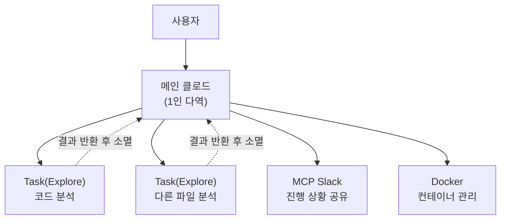
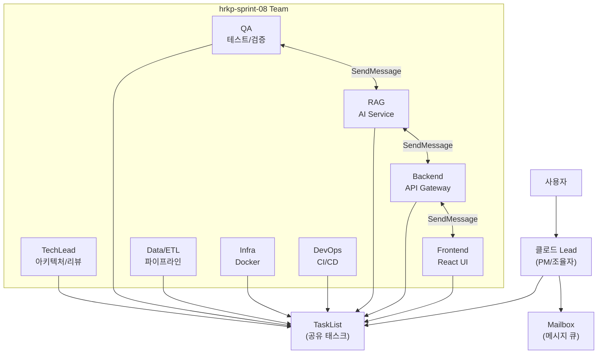
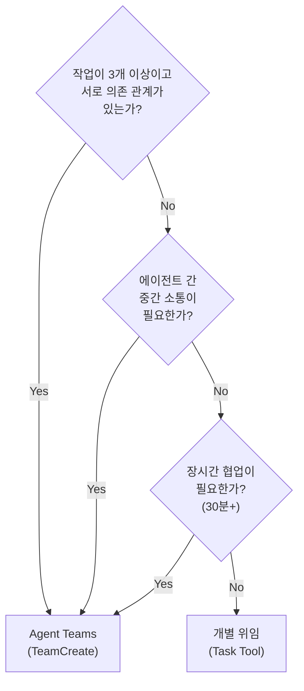
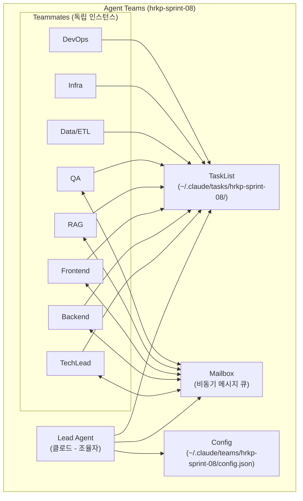
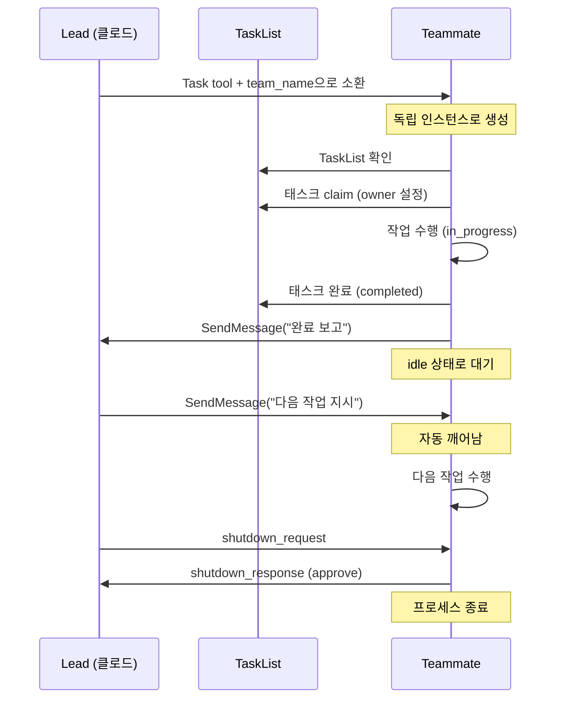
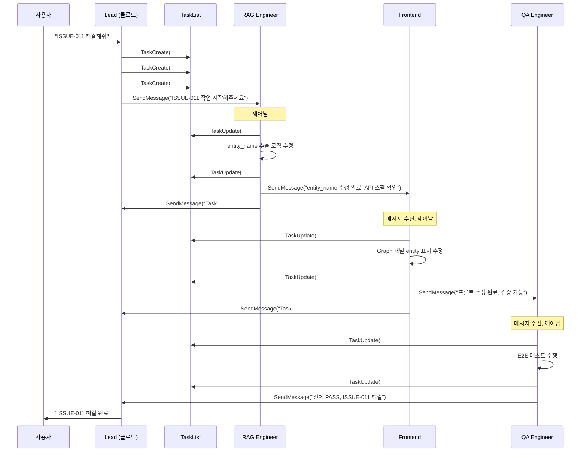
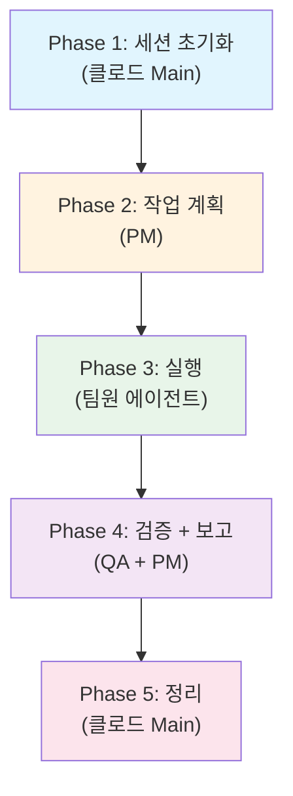
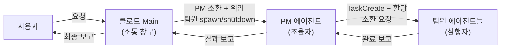
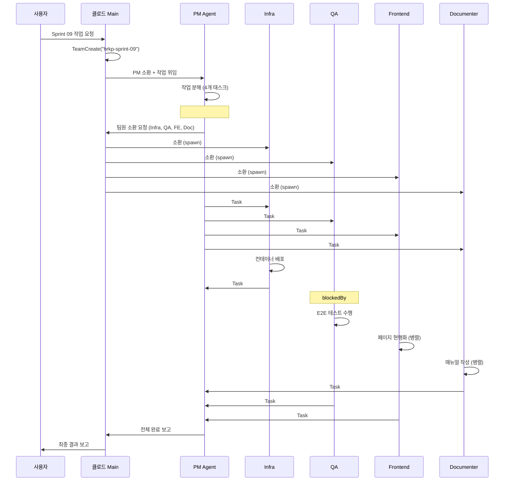

---

> **현행화 정보**
> - **최종 현행화**: 2026-02-20
> - **프로젝트 상태**: 종료 (2026-02-18)
> - **문서 상태**: 현행 (v3.1이 최신 — 모델 티어링, 협업 프로세스 완전 반영)
> - **주요 변경사항**: 없음. 이 문서는 프로젝트 마지막 작업일(2026-02-18)에 최종 업데이트되었으며, 13개 에이전트(Opus 4.6: 2개, Sonnet 4.6: 11개) 및 세션 표준 프로세스(5 Phases)가 정확히 반영되어 있음.

---

## 문서 정보

| 항목 | 내용 |
|------|------|
| **문서명** | Agent Teams 활용 가이드 |
| **버전** | 3.1 |
| **작성일** | 2026-02-06 |
| **최종 수정** | 2026-02-18 |
| **작성자** | Claude Code (Opus 4.6) |
| **대상** | 프로젝트 관리자, 개발자, AI 에이전트 운영자 |
| **목적** | Agent Teams 기능의 이해와 프로젝트 적용 가이드 |

---

## 변경 이력

| 버전 | 일자 | 작성자 | 변경 내용 |
|------|------|--------|----------|
| 1.0 | 2026-02-06 | Claude Code | 초안 작성 - Opus 4.6 Agent Teams 도입 |
| 2.0 | 2026-02-08 | Claude Code | **전면 개편** - As-Is/To-Be 분석, TeamCreate 실적용, 팀 구성 문서화 |
| 3.0 | 2026-02-11 | Code Documenter | **협업 프로세스 매뉴얼 통합** - 세션 표준 프로세스, 역할 정의, 안티패턴, Sprint 09 사례 |
| 3.1 | 2026-02-18 | Claude Code | **모델 티어링 최적화** - Sonnet 4.6 출시 반영, 11개 에이전트 Sonnet 4.6 전환, 비용 73% 절감 |

---

## 목차

### Part 1: 개념 및 도구 (v2.0)

1. [개요](#1-개요)
2. [As-Is vs To-Be 비교](#2-as-is-vs-to-be-비교) (+ Agent Teams vs 개별 위임 비교)
3. [활성화 방법](#3-활성화-방법)
4. [아키텍처](#4-아키텍처)
5. [팀 구성 (To-Be)](#5-팀-구성-to-be)
6. [Agent Teams 핵심 도구](#6-agent-teams-핵심-도구)
7. [사용 시나리오](#7-사용-시나리오)
8. [디스플레이 모드](#8-디스플레이-모드)
9. [베스트 프랙티스](#9-베스트-프랙티스)
10. [비용 가이드](#10-비용-가이드)
11. [제한사항 및 트러블슈팅](#11-제한사항-및-트러블슈팅)
12. [관련 문서](#12-관련-문서)

### Part 2: 협업 프로세스 매뉴얼 (v3.1)

13. [세션 표준 프로세스 (5 Phases)](#13-세션-표준-프로세스)
14. [역할 정의 및 권한](#14-역할-정의-및-권한)
15. [안티패턴](#15-안티패턴)
16. [실제 사례: Sprint 09 (2026-02-11)](#16-실제-사례-sprint-09)
17. [CLAUDE.md 삽입용 요약](#17-claudemd-삽입용-요약)

---

## 1. 개요

### 1.1 Agent Teams란?

Agent Teams는 Claude Code Opus 4.6에서 도입된 **실험적 멀티-에이전트 협업 시스템**입니다.

기존 서브에이전트(Task 도구)가 "심부름꾼"이라면, Agent Teams의 팀원은 "상주 동료"입니다.

```
기존 서브에이전트: 호출 → 결과 반환 → 즉시 소멸 (일회성)
Agent Teams:      소환 → 상주 → 메시지 교환 → 자율 작업 → shutdown 시 종료
```

### 1.2 핵심 차이점 요약

| 구분 | 기존 멀티 에이전트 (Subagent) | Agent Teams |
|------|------------------------------|-------------|
| **팀원 생명주기** | 호출 시 생성 → 결과 반환 → 소멸 | 소환 시 생성 → 상주 → shutdown 시 종료 |
| **통신 방향** | 단방향 (Lead → Teammate → Lead) | 양방향 (에이전트 간 자유로운 메시지) |
| **팀원 간 통신** | 불가능 (서로의 존재를 모름) | 가능 (SendMessage로 직접 대화) |
| **작업 조정** | 호출자가 모든 것을 지시 | 공유 TaskList에서 각자 태스크 pick |
| **상태 유지** | 없음 (매번 새 컨텍스트) | 세션 내 컨텍스트 누적 |
| **자율성** | 없음 (지시 받은 것만 수행) | 있음 (태스크 자율 선택 및 수행) |
| **비용** | 호출당 과금 (효율적) | 인스턴스당 과금 (N배) |

---

## 2. As-Is vs To-Be 비교

### 2.1 As-Is: 기존 운영 방식 (v1.0 이전)



**문제점**:

| 문제 | 설명 |
|------|------|
| **1인 다역** | 메인 클로드가 PM/TechLead/Backend/Frontend/QA 모든 역할 수행 |
| **역할극 시뮬레이션** | 스탠드업에서 9명이 인사하지만, 실제로는 메인 클로드 1명이 작성 |
| **서브에이전트 일회성** | Task tool로 호출 → 결과 반환 → 즉시 소멸 (연속성 없음) |
| **팀원 간 통신 불가** | Backend와 Frontend가 직접 대화할 수 없음 |
| **자율성 부재** | 모든 작업을 메인 클로드가 직접 지시해야 함 |
| **진짜 병렬 부재** | 탐색(Explore)만 병렬, 코드 수정은 순차 |

**실제 동작 예시 (As-Is)**:
```
사용자: "ISSUE-011 해결해줘"

[실제 동작]
메인 클로드가 직접:
  1. 코드 분석 (RAG 역할)
  2. 코드 수정 (Backend 역할)
  3. Frontend 수정 (Frontend 역할)
  4. 테스트 (QA 역할)
  5. Slack 알림 (PM 역할)
→ 1명이 5개 역할을 순차 수행
```

### 2.2 To-Be: Agent Teams 운영 방식 (v2.0)



**개선점**:

| 개선 | 설명 |
|------|------|
| **실제 독립 인스턴스** | 각 팀원이 자체 컨텍스트를 가진 독립 Claude 인스턴스 |
| **양방향 통신** | Backend↔Frontend 직접 메시지 교환 가능 |
| **자율적 태스크 수행** | 공유 TaskList에서 각자 태스크를 claim하여 수행 |
| **Lead는 조율만** | 메인 클로드가 직접 코드를 쓰지 않고, 팀원에게 위임 |
| **진짜 병렬 작업** | 여러 팀원이 동시에 서로 다른 파일을 수정 |
| **상주 팀원** | 팀원이 idle 상태로 대기하다 메시지 오면 깨어남 |

**실제 동작 예시 (To-Be)**:
```
사용자: "ISSUE-011 해결해줘"

[Agent Teams 동작]
Lead (클로드):
  → TaskCreate("entity_name 추출 로직 수정", owner: RAG)
  → TaskCreate("Graph 패널 entity 표시", owner: Frontend, blockedBy: #1)
  → TaskCreate("E2E 검증", owner: QA, blockedBy: #1, #2)

RAG: TaskList 확인 → #1 claim → 코드 수정 → completed
  → SendMessage(Frontend, "entity_name 수정 완료, API 스펙 확인해줘")

Frontend: 메시지 수신 → 깨어남 → #2 claim → UI 수정 → completed
  → SendMessage(QA, "프론트엔드 수정 완료, 검증 가능")

QA: 메시지 수신 → 깨어남 → #3 claim → E2E 테스트 → completed
  → SendMessage(Lead, "전체 PASS, ISSUE-011 해결됨")

Lead: Slack 알림, 최종 보고
```

### 2.3 전환 체크리스트

| 단계 | 상태 | 설명 |
|------|------|------|
| Agent Teams 환경변수 설정 | ✅ 완료 | `CLAUDE_CODE_EXPERIMENTAL_AGENT_TEAMS=1` |
| 에이전트 정의 파일 (13개) | ✅ 완료 | `.claude/agents/*.md` |
| TeamCreate 실행 | ✅ 완료 | `hrkp-sprint-08` 팀 생성 (2026-02-08) |
| 공유 TaskList 활성화 | ✅ 완료 | 태스크 5건 생성, 의존성 설정 |
| 팀원 소환 (Task + team_name) | 🔄 필요시 | 작업 시 필요한 팀원만 소환 |
| SendMessage 통신 테스트 | ⬜ 대기 | 첫 실전 작업에서 검증 |
| 가이드 문서 v2.0 | ✅ 완료 | 이 문서 |

### 2.4 Agent Teams vs 개별 위임 (Task Tool) 상세 비교

Agent Teams와 개별 Task 위임은 모두 서브에이전트를 활용하지만, 동작 방식과 적합한 상황이 완전히 다릅니다.

#### 핵심 차이

```
[개별 위임 (Task Tool)]
Main Claude ─→ Task(RAG, "ISSUE-011 수정") ─→ 결과 반환 ─→ 소멸
             ─→ Task(DevOps, "매뉴얼 작성")  ─→ 결과 반환 ─→ 소멸
             (각 에이전트는 독립적, 서로 모름)

[Agent Teams (TeamCreate)]
Main Claude ─→ TeamCreate("sprint-08")
             ─→ Task(RAG, team_name: "sprint-08")   ─→ 상주 (idle/active)
             ─→ Task(Frontend, team_name: "sprint-08") ─→ 상주 (idle/active)
             ─→ Task(QA, team_name: "sprint-08")     ─→ 상주 (idle/active)
             (팀원 간 SendMessage 가능, 공유 TaskList)
```

#### 비교표

| 항목 | 개별 위임 (Task Tool) | Agent Teams (TeamCreate) |
|------|----------------------|-------------------------|
| **생명주기** | 작업 완료 후 즉시 소멸 | 팀 해산(shutdown)까지 상주 |
| **에이전트 간 통신** | 불가 (각각 독립) | SendMessage로 직접 대화 가능 |
| **태스크 공유** | 불가 (각자 1개 작업만) | 공유 TaskList에서 claim/complete |
| **태스크 의존성** | 불가 | blockedBy/blocks로 의존 관계 설정 |
| **컨텍스트 유지** | 없음 (매번 새로 시작) | 팀 존속 기간 동안 유지 |
| **병렬 작업** | 가능 (독립적) | 가능 (조율된 병렬) |
| **비용** | 작업당 과금 | 상주 비용 + 작업 과금 |
| **설정 복잡도** | 낮음 (Task 호출만) | 높음 (TeamCreate + 태스크 + 메시지) |
| **관리 오버헤드** | 없음 | shutdown 관리, idle 상태 모니터링 필요 |

#### 사용 시나리오별 권장 방식

| 시나리오 | 권장 | 이유 |
|---------|------|------|
| **독립 문서 1개 작성** | 개별 위임 | 다른 에이전트와 소통 불필요, 단발 작업 |
| **시스템 점검** | 개별 위임 | 읽기 전용, 독립적 확인 작업 |
| **코드 리뷰** | 개별 위임 | TechLead 1명이 독립적으로 수행 |
| **2-3개 독립 작업 병렬 처리** | 개별 위임 | 서로 의존 없는 작업은 개별이 효율적 |
| **ISSUE 해결 (다수 파일 연쇄 수정)** | Agent Teams | RAG→Frontend→QA 순차 의존, 중간 소통 필요 |
| **Sprint 작업 (5개+ 연관 태스크)** | Agent Teams | 공유 TaskList, 의존성 관리, 장기 협업 |
| **E2E 기능 개발** | Agent Teams | Backend↔Frontend 양방향 소통 필수 |
| **대규모 리팩토링** | Agent Teams | 여러 파일 동시 수정, 충돌 방지 조율 |

#### 실제 프로젝트 적용 사례 (2026-02-08)

**Agent Teams 사용 (Sprint 08 Day 3 메인 작업)**:
```
TeamCreate("hrkp-sprint-08")
├── RAG Agent: ISSUE-011 entity_name 수정 + Graph Search 튜닝
├── Frontend Agent: Graph 패널 UX 개선
├── Backend Agent: Gateway 라우팅 검증 스크립트
└── QA Agent: E2E 테스트 54건 작성
→ 5개 태스크, 의존성 있음, 장시간 협업, 팀원 간 소통 활발
→ 결과: 5/5 완료, ISSUE-011 해결
```

**개별 위임 사용 (마무리 작업)**:
```
Task(DevOps, "BuildKit 빌드 가이드 작성")  → 독립 문서 작업
Task(Infra, "UAT 준비 상태 점검")           → 독립 점검 작업
→ 서로 의존 없는 2개 독립 작업, 팀 구성 불필요
→ 결과: 둘 다 완료 (빠르고 효율적)
```

#### 결정 플로우차트



#### 비용 효율성 가이드

```
[개별 위임의 비용 구조]
  Task 호출 → 작업 수행 → 결과 반환 → 종료
  과금: 작업 시간만 (idle 비용 없음)
  적합: 10분 미만 단발 작업

[Agent Teams의 비용 구조]
  TeamCreate → 팀원 소환 → 작업 수행 → idle 대기 → 추가 작업 → shutdown
  과금: 작업 시간 + idle 대기 시간 (idle은 API 비용 없으나 프로세스 유지)
  적합: 여러 태스크를 30분+ 연속 처리할 때

[혼합 전략 (권장)]
  Sprint 메인 작업 → Agent Teams (팀 협업)
  독립 부가 작업 → 개별 위임 (빠른 처리)
  문서/점검 → 개별 위임 (단발 완결)
```

---

## 3. 활성화 방법

### 3.1 설정 파일 (이미 적용됨)

`.claude/settings.json`:

```json
{
  "env": {
    "CLAUDE_CODE_EXPERIMENTAL_AGENT_TEAMS": "1"
  }
}
```

### 3.2 환경변수 방식

```bash
export CLAUDE_CODE_EXPERIMENTAL_AGENT_TEAMS=1
claude
```

### 3.3 확인 방법

활성화 후 새 세션을 시작하면, 다음 도구들이 사용 가능합니다:
- `TeamCreate` / `TeamDelete` - 팀 생성/삭제
- `SendMessage` - 에이전트 간 메시지 전송
- `TaskList` / `TaskCreate` / `TaskGet` / `TaskUpdate` - 공유 태스크 관리

---

## 4. 아키텍처

### 4.1 핵심 구성 요소



### 4.2 역할 설명

| 역할 | 설명 |
|------|------|
| **Lead (클로드)** | 작업을 분할하고 Teammate에게 할당. 전체 진행 상황을 모니터링. 사용자와의 인터페이스 |
| **Teammate** | 할당받은 작업을 자율적으로 수행. 완료 시 Lead에게 보고. 다른 Teammate와 직접 통신 |
| **TaskList** | 모든 에이전트가 공유하는 태스크 목록. 상태/의존성/소유자 추적 |
| **Mailbox** | 에이전트 간 비동기 메시지 전달 시스템. idle 팀원도 메시지 수신 시 깨어남 |
| **Config** | 팀 구성 정보 (멤버 목록, 이름, 에이전트 타입) |

### 4.3 팀원 생명주기



### 4.4 실행 흐름 (Full Cycle)



---

## 5. 팀 구성 (To-Be)

### 5.1 현재 팀 정보

| 항목 | 값 |
|------|-----|
| **팀 이름** | `hrkp-sprint-08` |
| **생성일** | 2026-02-08 |
| **Lead** | 클로드 (project-manager) |
| **팀 설정 파일** | `~/.claude/teams/hrkp-sprint-08/config.json` |
| **태스크 디렉토리** | `~/.claude/tasks/hrkp-sprint-08/` |

### 5.2 팀원 구성 (13명)

| # | 에이전트명 | 약어 | subagent_type | 역할 | 소환 시점 |
|---|----------|------|---------------|------|----------|
| 1 | 클로드 | lead | - | **Lead**: 조율, 태스크 분배, 사용자 인터페이스 | 항상 (메인 세션) |
| 2 | TechLead | tl | `tech-lead` | 아키텍처 검토, 코드 리뷰, 기술 의사결정 | 설계/리뷰 시 |
| 3 | Backend | backend | `backend-developer` | SpringBoot API Gateway, 비즈니스 로직 | API 개발 시 |
| 4 | Frontend | frontend | `frontend-developer` | React 18 UI, Tailwind CSS, 컴포넌트 | UI 개발 시 |
| 5 | RAG | rag | `rag-engineer` | RAG 파이프라인, LangGraph, AI Service | AI/검색 작업 시 |
| 6 | Data | etl | `etl-engineer` | ETL 파이프라인, 데이터 품질, KG 운영 | 데이터 작업 시 |
| 7 | DB | db | `database-designer` | PostgreSQL/Neo4j/ES 스키마, 쿼리 최적화 | DB 변경 시 |
| 8 | Infra | infra | `infra-engineer` | Docker Compose 인프라 구축 | 인프라 변경 시 |
| 9 | DevOps | devops | `devops-engineer` | CI/CD, Observability | 배포/모니터링 시 |
| 10 | QA | qa | `qa-engineer` | 테스트, RAGAS 평가, 품질 검증 | 검증 시 |
| 11 | WebDesigner | web | `web-designer` | UI/UX 설계, 디자인 시스템 | 디자인 작업 시 |
| 12 | Architect | arch | `software-architect` | 시스템/기능 상세 설계, 기술 의사결정 | 설계 작업 시 |
| 13 | Doc | doc | `code-documenter` | API/코드/아키텍처 문서화 | 문서 작업 시 |

### 5.3 소환 방법

팀원은 **필요할 때만** 소환합니다 (비용 최적화):

```
# 팀원 소환 (Lead가 실행)
Task(
  subagent_type = "rag-engineer",      # .claude/agents/ 에이전트 타입
  team_name     = "hrkp-sprint-08",    # 팀 이름
  name          = "rag",               # 팀원 이름 (SendMessage에서 사용)
  prompt        = "Sprint 08 RAG Engineer입니다. TaskList를 확인하고 작업을 시작하세요.",
  mode          = "bypassPermissions"  # 또는 "default"
)
```

### 5.4 소환 전략: 작업별 최적 팀 구성

모든 팀원을 항상 소환하면 비용이 13배입니다. 작업 유형에 따라 필요한 팀원만 소환합니다:

| 작업 유형 | 소환 팀원 | 예상 인원 |
|----------|----------|----------|
| **기능 개발 (Full Stack)** | TechLead + Backend + Frontend + QA | 4명 |
| **RAG 파이프라인 개선** | TechLead + RAG + Data + QA | 4명 |
| **버그 수정** | 관련 개발자 + QA | 2~3명 |
| **인프라 변경** | Infra + DevOps | 2명 |
| **코드 리뷰** | TechLead + 대상 개발자 | 2~3명 |
| **문서 작업** | Doc + 관련 개발자 | 2명 |
| **UI/UX 개선** | WebDesigner + Frontend | 2명 |
| **전체 스프린트** | 전원 (비용 주의) | 8~12명 |

### 5.5 팀원 모델 선택 (2026-02-18 최적화 완료)

**Sonnet 4.6 출시** (2026-02-17)로 에이전트 모델 티어링을 최적화했습니다.
Sonnet 4.6은 Claude Code에서 Opus 4.5 대비 59% 선호, Sonnet 4.5 대비 70% 선호되는 성능을 보여,
대부분의 에이전트에서 Opus 급 품질을 5배 저렴한 가격으로 제공합니다.

| 티어 | 모델 | 가격 (in/out) | 대상 에이전트 | 근거 |
|------|------|:------------:|-------------|------|
| **Tier 1** (심층 추론) | `claude-opus-4-6` | $15/$75/M | tech-lead, software-architect | 아키텍처 결정, 코드 리뷰 정확도 |
| **Tier 2** (실행) | `claude-sonnet-4-6` | $3/$15/M | PM, Backend, Frontend, RAG, ETL, DB, Infra, DevOps, QA, Doc, Web (11개) | 코딩 우수, 지시 따르기 향상 |
| **Tier 3** (경량) | `claude-haiku-4-5` | $0.8/$4/M | 단순 검색, 문서 조회 (필요시) | 빠른 응답, 최소 비용 |

> **비용 효과**: 기존 전원 Opus 4.6 대비 **약 73% 비용 절감** (11/13 에이전트가 5배 저렴한 Sonnet 4.6 사용)

```
# 모델 지정 소환 (기본값: 에이전트 파일의 model 설정 사용)
Task(
  subagent_type = "backend-developer",
  team_name     = "hrkp-sprint-08",
  name          = "backend",
  model         = "sonnet",            # claude-sonnet-4-6 (기본 설정)
  prompt        = "..."
)
```

---

## 6. Agent Teams 핵심 도구

### 6.1 팀 관리 도구

| 도구 | 설명 | 사용자 |
|------|------|--------|
| `TeamCreate` | 팀 생성 (팀명, 설명, Lead 타입) | Lead만 |
| `TeamDelete` | 팀 삭제 (모든 멤버 shutdown 후) | Lead만 |

### 6.2 메시지 도구 (SendMessage)

| 메시지 타입 | 설명 | 사용 주의 |
|------------|------|----------|
| `message` | 1:1 메시지 (recipient 지정) | 일반 통신용 |
| `broadcast` | 전체 메시지 (모든 팀원에게) | 비용 N배 - 긴급 시만 |
| `shutdown_request` | 팀원 종료 요청 | 작업 완료 후 |
| `shutdown_response` | 종료 요청 승인/거부 | 팀원이 응답 |
| `plan_approval_response` | 계획 승인/거부 | plan 모드 팀원용 |

### 6.3 태스크 도구

| 도구 | 설명 | 사용자 |
|------|------|--------|
| `TaskCreate` | 새 태스크 생성 (subject, description, activeForm) | 모든 에이전트 |
| `TaskList` | 전체 태스크 조회 (status, owner, blockedBy) | 모든 에이전트 |
| `TaskGet` | 특정 태스크 상세 조회 | 모든 에이전트 |
| `TaskUpdate` | 태스크 상태/소유자/의존성 변경 | 모든 에이전트 |

### 6.4 Teammate 자율 동작 프로토콜

팀원이 소환되면 다음 프로토콜을 따릅니다:

```
1. TaskList 확인
2. owner가 자신이거나 미할당 + blockedBy 없는 태스크 찾기
3. TaskUpdate(owner: 자신, status: in_progress)
4. 작업 수행
5. TaskUpdate(status: completed)
6. SendMessage(Lead, "완료 보고")
7. TaskList 다시 확인 → 다음 태스크 있으면 반복
8. 없으면 idle 상태로 대기
```

---

## 7. 사용 시나리오

### 7.1 ISSUE-011 해결 (현재 Sprint 08)

```
Lead → TaskCreate(#1 entity_name 수정, owner: RAG)
Lead → TaskCreate(#2 Graph UI, owner: Frontend, blockedBy: #1)
Lead → TaskCreate(#3 E2E 검증, owner: QA, blockedBy: #1,#2)

Lead → Task(rag-engineer, team: hrkp-sprint-08, name: "rag")
Lead → Task(frontend-developer, team: hrkp-sprint-08, name: "frontend")
Lead → Task(qa-engineer, team: hrkp-sprint-08, name: "qa")

RAG → entity_name 로직 수정 → SendMessage(Frontend)
Frontend → Graph UI 수정 → SendMessage(QA)
QA → E2E 테스트 → SendMessage(Lead, "ALL PASS")
```

### 7.2 Full Stack 기능 개발

```
Lead → 태스크 분할 (DB → Backend → Frontend → QA)
Lead → 4명 소환 (db, backend, frontend, qa)

DB: 스키마 설계 → completed → SendMessage(Backend, "스키마 완료")
Backend: API 구현 → completed → SendMessage(Frontend, "API 스펙")
Frontend: UI 구현 → completed → SendMessage(QA, "검증 가능")
QA: 통합 테스트 → completed → SendMessage(Lead, "전체 PASS")
```

### 7.3 병렬 코드 리뷰

```
Lead → 3개 PR을 3명에게 분배
Lead → 소환 (techlead, backend, qa)

TechLead: PR #101 아키텍처 리뷰 → completed
Backend: PR #102 API 로직 리뷰 → completed
QA: PR #103 테스트 코드 리뷰 → completed

→ 3개 PR이 동시에 리뷰됨 (시간 1/3 절약)
```

### 7.4 복잡한 디버깅

```
Lead → 문제 영역별 조사 태스크 생성
Lead → 소환 (rag, etl, db, infra)

RAG: 임베딩/검색 로직 분석
ETL: 데이터 파이프라인 품질 확인
DB: 인덱스/쿼리 성능 분석
Infra: 컨테이너 리소스 확인

→ 각자 조사 후 Lead에게 보고
→ Lead가 종합하여 수정 방향 결정
```

---

## 8. 디스플레이 모드

### 8.1 In-Process 모드 (기본)

단일 터미널에서 모든 에이전트의 출력이 순차적으로 표시됩니다.

```
[Lead] 작업을 분할합니다...
[Backend] idle → 메시지 수신, 깨어남
[Backend] API 엔드포인트 구현 시작
[Frontend] idle → 메시지 수신, 깨어남
[Frontend] UI 컴포넌트 구현 시작
[Backend] ✅ 구현 완료
[Frontend] ✅ 구현 완료
[Lead] 모든 작업이 완료되었습니다.
```

### 8.2 Split-Pane 모드 (tmux)

tmux를 사용하여 각 에이전트를 별도 패인에서 실행합니다.

```
┌─────────────────────┬─────────────────────┐
│ [Lead]              │ [Backend]            │
│ 작업 조율 중...      │ API 구현 중...        │
│                     │                      │
├─────────────────────┼─────────────────────┤
│ [Frontend]          │ [QA]                 │
│ UI 구현 중...        │ 테스트 작성 중...      │
│                     │                      │
└─────────────────────┴─────────────────────┘
```

---

## 9. 베스트 프랙티스

### 9.1 파일 충돌 방지

**원칙**: 하나의 파일은 하나의 에이전트만 수정

```
✅ 올바른 할당:
  RAG      → knowledge_service/src/app/services/graph_search.py
  Backend  → gateway/src/main/resources/application.yml
  Frontend → frontend/src/components/GraphPanel.tsx
  QA       → knowledge_service/src/tests/e2e/test_graph_search.py

❌ 잘못된 할당:
  RAG      → knowledge_service/src/app/services/graph_search.py
  Backend  → knowledge_service/src/app/services/graph_search.py  ← 충돌!
```

### 9.2 태스크 사이징

| 크기 | 소요 시간 | 예시 | 권장 |
|------|----------|------|------|
| **Small** | 1-3분 | 단일 함수 수정, 설정 변경 | 서브에이전트로 충분 |
| **Medium** | 3-10분 | API 엔드포인트 1개, 컴포넌트 1개 | **Agent Teams 최적** |
| **Large** | 10분+ | 서비스 전체, 여러 파일 변경 | Medium으로 분할 |

### 9.3 커뮤니케이션 규칙

| 규칙 | 설명 |
|------|------|
| Lead → 완료 조건 명시 | 작업 시작 전 명확한 완료 기준 제시 |
| Teammate → 블로커 즉시 보고 | SendMessage(Lead, "블로커 발생: ...") |
| 완료 보고 시 변경 파일 포함 | "수정: graph_search.py:45-67" |
| broadcast는 긴급 시만 | 비용 N배 - 일반 통신은 message 사용 |

### 9.3.1 Slack 알림 규칙 (CRITICAL)

> **Agent Teams 전환 후에도 각 에이전트의 Slack 알림은 필수입니다!**

**알림 시점**:

| 시점 | 채널 | 필수 여부 |
|------|------|----------|
| 작업 시작 | `proj-hrkp-dev` (C0A9WGCD733) | ✅ 필수 |
| 작업 완료 | `proj-hrkp-dev` (C0A9WGCD733) | ✅ 필수 |
| 블로커/장애 발생 | `proj-hrkp-alerts` (C0A9WGEVB97) | ✅ 필수 |

**전송 방법**:

| 실행 주체 | 방법 | 예시 |
|----------|------|------|
| **Lead (메인 클로드)** | MCP Slack 도구 | `mcp__slack__slack_post_message(channel_id: "C0A9WGCD733", text: "*[클로드]* ...")` |
| **Teammate (소환된 팀원)** | Shell 스크립트 | `./scripts/send_slack.sh dev Backend "작업 시작: ISSUE-011"` |

**Teammate Slack 알림 예시**:

```bash
# 작업 시작
./scripts/send_slack.sh dev RAG "작업 시작: entity_name 추출 로직 수정 (ISSUE-011)"

# 작업 완료
./scripts/send_slack.sh dev RAG "작업 완료: entity_name 추출 로직 수정 - graph_search.py:45-67 수정"

# 장애/블로커
./scripts/send_slack.sh alerts RAG "블로커 발생: Neo4j 연결 실패"
```

**메시지 형식**: `*[에이전트명]* 작업 시작/완료: {작업 내용}`

**중요**: Teammate가 SendMessage로 Lead에게 보고하는 것과 **별도로** Slack 알림도 보내야 합니다. SendMessage는 팀 내부 통신, Slack은 외부(사용자) 가시성을 위한 것입니다.

### 9.4 의존성 관리

```
Lead가 태스크 설계 시 의존성을 명확히 설정:

TaskCreate(#1 "DB 스키마 설계")
TaskCreate(#2 "API 구현", blockedBy: [#1])
TaskCreate(#3 "UI 구현", blockedBy: [#2])
TaskCreate(#4 "E2E 테스트", blockedBy: [#2, #3])

→ blockedBy가 resolved되면 자동으로 작업 가능
→ 팀원은 TaskList에서 blockedBy 없는 태스크만 claim
```

---

## 10. 비용 가이드

### 10.1 비용 구조

```
Agent Teams 비용 = 팀원 수 × 각 인스턴스 토큰 소비

예시:
  Lead (1명)     : 기본 비용
  Teammates (4명) : 4 × 인스턴스 비용
  메시지 교환     : 추가 토큰 소비
  ─────────────────────────
  총 비용         : 약 5~6배 (단일 에이전트 대비)
```

### 10.2 비용 최적화 전략

| 전략 | 절약 효과 | 설명 |
|------|----------|------|
| **필요한 팀원만 소환** | 높음 | 12명 전원 대신 2~4명만 |
| **모델 차등 적용 (적용 완료)** | 높음 | TL/Arch=Opus 4.6, 나머지 11개=Sonnet 4.6 (73% 절감) |
| **작업 완료 후 즉시 shutdown** | 중간 | idle 상태도 비용 발생 |
| **태스크 적절 분할** | 낮음 | 너무 잘게 쪼개면 통신 오버헤드 |
| **단순 작업은 서브에이전트** | 높음 | 코드 검색 등은 Task(Explore)가 효율적 |

### 10.3 비용 비교 시나리오

| 시나리오 | 서브에이전트 비용 | Agent Teams 비용 | 시간 절약 |
|---------|-----------------|-----------------|----------|
| 단일 파일 수정 | 1x | 2x (비효율) | 없음 |
| 코드 검색/리서치 | 1x | 1x (동일) | 없음 |
| 3개 파일 병렬 수정 | 3x (순차) | 3x (병렬) | 3배 빠름 |
| Full Stack 기능 개발 | 4x (순차) | 5x (병렬+통신) | 2~3배 빠름 |
| 5개 PR 동시 리뷰 | 5x (순차) | 5x (병렬) | 5배 빠름 |

---

## 11. 제한사항 및 트러블슈팅

### 11.1 알려진 제한사항

| 제한사항 | 영향 | 대응 방안 |
|----------|------|----------|
| **실험적 기능** | API 변경 가능 | 주기적 문서 업데이트 |
| **MCP 접근 제한** | Teammate는 Slack/Jira MCP 직접 불가 | `send_slack.sh` 스크립트 우회 |
| **파일 동시 수정 불가** | Lock 없음, 마지막 쓰기가 덮어씀 | 1파일 1에이전트 원칙 |
| **컨텍스트 소비** | 팀원 많으면 통신 오버헤드 | 2~4명 권장, broadcast 자제 |
| **세션 재개 불가** | Teammate는 resume 불가 | 작업 단위를 작게 유지 |
| **중첩 팀 불가** | 팀 안에 팀 불가 | 단일 계층으로 구성 |

### 11.2 트러블슈팅

**Agent Teams가 활성화되지 않는 경우**:

```bash
# 1. 환경변수 확인
echo $CLAUDE_CODE_EXPERIMENTAL_AGENT_TEAMS  # 출력: 1

# 2. settings.json 확인
cat .claude/settings.json | grep AGENT_TEAMS

# 3. Claude Code 재시작 (새 터미널)
```

**Teammate가 응답하지 않는 경우**:

- 태스크가 너무 큰 경우 → 더 작은 단위로 분할
- 모델 요금 한도 초과 → 비용 최적화 모델로 전환
- 컨텍스트 오버플로 → 새 세션에서 재시작

**파일 충돌 발생**:

```bash
git diff  # 변경 사항 확인
# 충돌 파일 수동 병합 또는 해당 Teammate에게 재작업 요청
```

**Slack 알림 (Teammate)**:

```bash
# Teammate는 MCP Slack 직접 접근 불가 → Shell 스크립트 사용
./scripts/send_slack.sh dev Backend "작업 완료: API 엔드포인트 구현"
```

---

## 12. 관련 문서

| 문서 | 설명 |
|------|------|
| [CLAUDE.md](https://github.com/k82022603/hybrid-rag-knowledge-ops/blob/main/CLAUDE.md) | 프로젝트 개발 규칙 및 에이전트 목록 |
| [PLAN.md](https://github.com/k82022603/hybrid-rag-knowledge-ops/blob/main/PLAN.md) | 프로젝트 계획 및 현재 상태 |
| [developer_agent_guide.md](../knowledge_service/docs/05_development/01_developer_agent_guide.md) | 에이전트 도구 사용법 |
| [developer_integration_guide.md](https://github.com/k82022603/hybrid-rag-knowledge-ops/blob/main/knowledge_service/docs/05_development/01_developer_agent_guide.md) | MCP/Agent/Skills 설정 |
| [.claude/agents/](https://github.com/k82022603/hybrid-rag-knowledge-ops/tree/main/.claude/agents/) | 13개 에이전트 정의 파일 |
| [.claude/settings.json](https://github.com/k82022603/hybrid-rag-knowledge-ops/blob/main/.claude/settings.json) | Agent Teams 활성화 설정 |
| [Claude Code 공식 문서](https://code.claude.com/docs/en/agent-teams) | Agent Teams 공식 가이드 |

---

## 부록 A: 빠른 시작 가이드

### A.1 최소 구성으로 시작하기

```
# Step 1: 팀 생성 (Lead가 한 번만 실행)
TeamCreate("my-team", description="작업 설명")

# Step 2: 태스크 생성
TaskCreate("API 구현", description="...")
TaskCreate("UI 구현", description="...", blockedBy: [#1])

# Step 3: 팀원 소환 (필요한 만큼만)
Task(subagent_type="backend-developer", team_name="my-team", name="backend", ...)
Task(subagent_type="frontend-developer", team_name="my-team", name="frontend", ...)

# Step 4: 팀원이 자율적으로 작업 수행
# → TaskList 확인 → claim → 수행 → completed → 다음 태스크

# Step 5: 종료
SendMessage(type="shutdown_request", recipient="backend")
SendMessage(type="shutdown_request", recipient="frontend")
TeamDelete()
```

### A.2 체크리스트

- [x] `.claude/settings.json`에 `CLAUDE_CODE_EXPERIMENTAL_AGENT_TEAMS: "1"` 설정
- [x] 13개 에이전트 정의 파일 확인 (`.claude/agents/*.md`)
- [x] `TeamCreate("hrkp-sprint-08")` 실행 (2026-02-08)
- [x] 공유 TaskList에 태스크 등록
- [ ] 첫 실전 작업에서 팀원 소환 및 SendMessage 테스트
- [ ] 비용 모니터링 및 최적화

---

## 부록 B: As-Is에서의 교훈 (v1.0 후기)

> **작성자**: Claude Code (Opus 4.6) | **검증일**: 2026-02-08

### B.1 v1.0 기간(2026-01-21 ~ 2026-02-07)의 운영 방식

| 구분 | 실제 상태 |
|------|----------|
| **팀원 실체** | `.claude/agents/*.md` 파일만 존재 (독립 인스턴스 아님) |
| **스탠드업** | 메인 클로드가 9명 역할극 수행 (시뮬레이션) |
| **코드 작업** | 메인 클로드가 모든 역할을 순차 수행 |
| **병렬 처리** | Task(Explore)로 코드 분석만 병렬 |
| **팀원 통신** | 불가능 (서로의 존재를 모름) |
| **비용** | 1x (메인 인스턴스 1개) |

### B.2 v1.0에서 배운 것

1. **역할 정의는 잘 되어 있다**: 13개 에이전트의 역할 분담이 명확
2. **Slack 자동화는 효과적**: MCP + Shell 혼합 방식이 잘 작동
3. **서브에이전트 분석은 유용**: Task(Explore)로 병렬 코드 분석이 시간 절약
4. **하지만 1인 다역의 한계**: 복잡한 Full Stack 작업에서 순차 처리 병목

### B.3 v2.0에서 기대하는 것

1. **실제 병렬 코드 수정**: 3~4명이 동시에 서로 다른 파일 수정
2. **팀원 간 자율 조정**: 의존성 기반으로 알아서 순서 조정
3. **Lead 역할 경량화**: 직접 코드 수정 대신 조율과 모니터링에 집중
4. **현실적 비용 관리**: 필요한 팀원만 소환하여 비용 최적화

### B.4 솔직한 기대치

> Agent Teams는 "은총알"이 아닙니다.
>
> - 단순 작업은 여전히 서브에이전트(Task tool)가 더 효율적
> - 비용이 N배 증가하므로, 병렬 처리의 시간 절약 효과가 비용을 정당화할 때만 사용
> - 팀원 간 통신 오버헤드로 작은 작업에서는 오히려 비효율
> - **적합한 작업**: 여러 서비스에 걸친 기능 개발, 병렬 리뷰, 복잡한 디버깅
> - **부적합한 작업**: 단일 파일 수정, 순차 의존성이 강한 작업, 단순 조회

---

---

# Part 2: 협업 프로세스 매뉴얼

> 이 파트는 **매 세션에서 동일하게 따라야 할 표준 프로세스**를 정의합니다.
> Part 1이 "Agent Teams란 무엇인가?"라면, Part 2는 "매 세션에서 어떻게 하는가?"입니다.

---

## 13. 세션 표준 프로세스

모든 세션에서 아래 5단계를 동일하게 적용합니다.

### 전체 흐름



### Phase 1: 세션 초기화 (클로드 Main)

클로드(Main)는 사용자의 소통 창구입니다. 직접 코딩/배포/테스트를 하지 않습니다.

| 단계 | 행동 | 비고 |
|------|------|------|
| 1-1 | 사용자 요청 수신 및 파악 | 무엇을, 어디에, 왜 |
| 1-2 | TeamCreate 실행 | 세션당 1회 |
| 1-3 | PM 에이전트 소환 (항상 첫 번째) | `subagent_type: "project-manager"` |
| 1-4 | 사용자 요청을 PM에게 위임 | SendMessage로 전달 |
| 1-5 | PM의 팀 구성 요청에 따라 팀원 소환 | PM이 결정, 클로드가 spawn |
| 1-6 | Slack에 세션 시작 알림 (MCP) | `*[클로드]* 작업 시작: ...` |

```
# 예시
TeamCreate("hrkp-sprint-09")

# 1) PM 소환 (항상 첫 번째)
Task(subagent_type="project-manager", team_name="hrkp-sprint-09", name="pm",
     prompt="PM입니다. 다음 작업을 분석하고 팀을 조율하세요: {사용자 요청}")

# 2) PM이 팀 구성을 결정하면, 클로드(Main)가 팀원 소환
Task(subagent_type="infra-engineer", team_name="hrkp-sprint-09", name="infra", ...)
Task(subagent_type="qa-engineer", team_name="hrkp-sprint-09", name="qa", ...)
```

> **중요**: 에이전트 spawn/shutdown은 Task tool이 필요하므로 **클로드(Main)만 실행 가능**합니다.
> PM은 어떤 팀원이 필요한지 결정하고 클로드에게 요청합니다.

### Phase 2: 작업 계획 (PM)

PM이 백로그를 관리하고, 작업을 분해하여 팀원에게 할당합니다.

| 단계 | 행동 | 비고 |
|------|------|------|
| 2-1 | 사용자 요청 분석 | 영향 범위, Jira 이슈 확인 |
| 2-2 | 작업 분해 (Task Breakdown) | 1작업 = 1에이전트, 3~10분 단위 |
| 2-3 | TaskCreate + 의존성 설정 | blockedBy로 순서 제어 |
| 2-4 | 팀 구성 결정 → 클로드(Main)에 소환 요청 | 필요한 팀원만 (비용 최적화) |
| 2-5 | Slack 작업 시작 알림 | `send_slack.sh dev PM "..."` |

```
# 예시 (PM이 실행)
TaskCreate(subject="Backend 컨테이너 배포", description="...", activeForm="배포 중")
TaskCreate(subject="E2E 테스트", description="...", activeForm="E2E 테스트 중")
TaskUpdate(taskId="2", addBlockedBy=["1"])  # 배포 완료 후 테스트

# PM이 클로드(Main)에게 소환 요청 (PM은 Task tool 접근 불가)
SendMessage(recipient="team-lead", content="Infra, QA 에이전트 소환을 요청합니다")
```

> **중요**: 팀원 소환(spawn)은 클로드(Main)만 실행 가능합니다.
> PM은 어떤 팀원이 필요한지 결정하고 `SendMessage`로 클로드에게 요청합니다.

### Phase 3: 실행 (팀원 에이전트)

각 팀원은 할당된 태스크를 자율적으로 수행합니다.

| 단계 | 행동 | 비고 |
|------|------|------|
| 3-1 | Slack 작업 시작 알림 | `send_slack.sh dev {이름} "작업 시작: ..."` |
| 3-2 | TaskList 확인 → 내 태스크 claim | `TaskUpdate(status: "in_progress")` |
| 3-3 | 작업 수행 | Read, Edit, Write, Bash 등 |
| 3-4 | TaskUpdate → completed | 완료 처리 |
| 3-5 | PM에게 완료 보고 | `SendMessage(recipient: "pm", ...)` |
| 3-6 | Slack 작업 완료 알림 | `send_slack.sh dev {이름} "작업 완료: ..."` |
| 3-7 | 다음 태스크 확인 or idle | TaskList 재확인 |

**블로커 발생 시**: 즉시 PM에게 SendMessage + Slack alerts 채널 알림

### Phase 4: 검증 + 보고 (QA + PM)

| 단계 | 행동 | 비고 |
|------|------|------|
| 4-1 | QA가 테스트 수행 | `TEST_MODE=docker` 필수 |
| 4-2 | QA → PM 결과 보고 | SendMessage |
| 4-3 | PM이 전체 TaskList 검증 | 모든 태스크 completed 확인 |
| 4-4 | PM → 클로드(Main) 결과 보고 | SendMessage |
| 4-5 | 클로드(Main) → 사용자 최종 보고 | 변경 파일, 테스트 결과 포함 |

### Phase 5: 정리 (클로드 Main)

| 단계 | 행동 | 비고 |
|------|------|------|
| 5-1 | PM의 완료 보고 확인 | 모든 태스크 완료 여부 |
| 5-2 | 불필요한 팀원 shutdown | `SendMessage(type: "shutdown_request")` |
| 5-3 | Slack 완료 알림 (MCP) | dev 채널 |
| 5-4 | PM에게 Jira 업데이트 요청 (해당 시) | PM이 Jira 상태 전환 |

> **중요**: shutdown은 Task tool이 필요하므로 클로드(Main)가 실행합니다.
> PM은 어떤 팀원을 정리할지 결정하고 클로드에게 요청합니다.

### Phase별 체크리스트

```
Phase 1 (클로드 Main):
  [ ] TeamCreate 실행
  [ ] PM 소환 (항상 첫 번째)
  [ ] 사용자 요청을 PM에게 위임
  [ ] PM 요청에 따라 팀원 소환
  [ ] Slack 시작 알림 (MCP)

Phase 2 (PM):
  [ ] 작업 분해 완료 (3~10분 단위)
  [ ] TaskCreate + 의존성 설정 완료
  [ ] 1파일 = 1에이전트 원칙 준수
  [ ] 필요한 팀원 결정 → 클로드에게 소환 요청

Phase 3 (팀원):
  [ ] Slack 시작/완료 알림
  [ ] TaskUpdate (in_progress → completed)
  [ ] PM에게 완료 보고 (SendMessage)

Phase 4 (QA + PM):
  [ ] QA 테스트 완료 (TEST_MODE=docker)
  [ ] 모든 태스크 completed 확인
  [ ] 클로드(Main)에게 결과 보고

Phase 5 (클로드 Main):
  [ ] 팀원 shutdown
  [ ] Slack 완료 알림 (MCP)
```

---

## 14. 역할 정의 및 권한

### 14.1 3계층 구조



### 14.2 역할별 허용/금지

#### 클로드(Main) - 사용자 소통 창구

| 허용 | 금지 |
|------|------|
| 사용자 요청 수신 및 응답 | 소스코드 직접 수정 |
| TeamCreate / TeamDelete | Docker 컨테이너 조작 |
| 에이전트 spawn / shutdown (Task tool) | git commit / push |
| Slack 알림 (MCP) | 설정 파일 수정 |
| 최종 결과를 사용자에게 전달 | TaskCreate / 팀원 직접 할당 |

#### PM 에이전트 - 백로그 관리 + 팀 조율

| 허용 | 금지 |
|------|------|
| 작업 분해 (Task Breakdown) | 소스코드 직접 수정 |
| TaskCreate / TaskUpdate | Docker 빌드/배포 |
| 팀 구성 결정 + 클로드에게 소환 요청 | git commit / push |
| Slack 알림 (send_slack.sh) | 에이전트 spawn/shutdown (Task tool 없음) |
| Jira 상태 업데이트 | 설정 파일 수정 |
| 진행 모니터링 (TaskList) | DB 스키마 변경, API 구현 |

#### 개발자 에이전트 - 실행자

| 에이전트 | 담당 영역 | 작업 공간 |
|---------|----------|----------|
| Backend | SpringBoot API, Gateway | `backend/`, `gateway/` |
| Frontend | React UI, 컴포넌트 | `frontend/` |
| RAG | RAG 파이프라인, AI Service | `ai_service/`, `knowledge_service/` |
| ETL | ETL 파이프라인, 데이터 | `knowledge_service/src/app/services/` |
| DB | 스키마, 쿼리 최적화 | PostgreSQL/Neo4j/ES |
| Infra | Docker Compose | `infrastructure/` |
| DevOps | CI/CD, Observability | `.github/`, `scripts/` |

#### QA 에이전트 - 검증자

| 허용 | 금지 |
|------|------|
| 테스트 코드 작성/실행 | 프로덕션 코드 수정 |
| RAGAS 평가 | Docker 컨테이너 조작 |
| 품질 보고서 작성 | 설정 파일 수정 |
| `TEST_MODE=docker` 필수 | Mock 모드 테스트 절대 금지 |

### 14.3 작업 유형별 담당 결정표

| 작업 유형 | Primary | Secondary | PM 역할 |
|----------|---------|-----------|--------|
| API Gateway 변경 | Backend | Infra | 할당 + 모니터링 |
| React 컴포넌트 | Frontend | WebDesigner | 할당 + 모니터링 |
| Docker Compose | Infra | DevOps | 할당 + 모니터링 |
| CI/CD 파이프라인 | DevOps | Infra | 할당 + 모니터링 |
| DB 변경 | DB | Backend | 할당 + 모니터링 |
| RAG 파이프라인 | RAG | ETL | 할당 + 모니터링 |
| E2E 테스트 | QA | 해당 개발자 | 할당 + 모니터링 |
| 문서화 | Doc | 해당 개발자 | 할당 + 모니터링 |
| 설계서 | Architect | TechLead | 할당 + 모니터링 |
| 코드 리뷰 | TechLead | 피어 개발자 | 요청 + 결과 공유 |

---

## 15. 안티패턴

### 15.1 클로드(Main) 안티패턴

| 안티패턴 | 왜 문제인가 | 올바른 행동 |
|---------|-----------|-----------|
| 직접 코드 수정 | 역할 위반, 팀 구조 무시 | PM 소환 -> PM이 팀원에게 위임 |
| PM 없이 직접 팀원 할당 | PM 역할 침범 | PM을 먼저 소환하여 조율 위임 |
| 모든 팀원 동시 소환 | 비용 N배, 불필요 | PM 판단에 따라 필요한 팀원만 소환 |
| Slack 알림 미전송 | 사용자 가시성 부재 | 시작/완료 시 MCP로 전송 |

### 15.2 PM 안티패턴

| 안티패턴 | 왜 문제인가 | 올바른 행동 |
|---------|-----------|-----------|
| 직접 코드 수정 | 역할 위반 | 해당 에이전트에게 위임 |
| Docker 직접 조작 | 역할 위반 | Infra/DevOps에게 위임 |
| 직접 팀원 소환 시도 | Task tool 접근 불가 | 클로드(Main)에게 소환 요청 |
| broadcast 남용 | 비용 N배 | DM (message) 사용 |
| "~할까요?" 질문 | 불필요한 지연 | 판단 가능하면 즉시 실행 후 보고 |

### 15.3 팀원 안티패턴

| 안티패턴 | 왜 문제인가 | 올바른 행동 |
|---------|-----------|-----------|
| 다른 에이전트 담당 파일 수정 | 파일 충돌, 역할 침범 | 자기 담당 파일만 수정 |
| 블로커 미보고 | PM이 상황 파악 불가 | 즉시 SendMessage + Slack 보고 |
| Slack 알림 미전송 | 사용자 가시성 부재 | 시작/완료 시 필수 전송 |
| Mock 모드 테스트 | 의미 없는 수치 | `TEST_MODE=docker` 필수 |
| TaskUpdate 없이 작업 | 진행 상황 추적 불가 | in_progress -> completed 순서 |
| 완료 보고 시 파일 정보 누락 | 검증 불가 | 변경 파일 + 라인 번호 포함 |

### 15.4 공통 안티패턴

| 안티패턴 | 올바른 행동 |
|---------|-----------|
| API 키 하드코딩 | `os.getenv("KEY")` 사용 |
| 에러 발생 시 같은 방법 재시도 | 대안 즉시 시도 |
| 역할 경계 무시 (PM이 코딩 등) | 14.2 권한 매트릭스 준수 |

---

## 16. 실제 사례: Sprint 09 (2026-02-11)

### 16.1 사용자 요청

```
"Sprint 09 Day 1: Audit Log 기능 배포 + E2E 테스트 + 지식관리 페이지 현행화 + 프로세스 매뉴얼 작성"
```

### 16.2 프로세스 적용



### 16.3 실제 TaskList 상태

```
#1 [completed] Backend 컨테이너 배포 (AuditService IP 검증 복원) → Infra
#2 [completed] Audit Log 기능 E2E 테스트 → QA (blockedBy: #1)
#3 [completed] 지식관리 페이지 현행화 및 버그 수정 → Frontend
#4 [completed] Agent Teams 협업 프로세스 매뉴얼 작성 → Documenter
```

### 16.4 적용된 원칙 검증

| 원칙 | 적용 사례 | 준수 |
|------|----------|------|
| 클로드(Main)는 소통 + spawn | 요청 수신 -> PM 소환 -> 팀원 spawn -> 결과 보고 | O |
| PM이 조율 | 4개 태스크 생성, 의존성 설정, 팀원 결정 + 클로드에게 소환 요청 | O |
| 배포는 Infra | 컨테이너 배포를 Infra 에이전트가 수행 | O |
| 테스트는 QA | E2E 테스트를 QA 에이전트가 수행 | O |
| 병렬 처리 | Frontend + Doc 작업이 Infra 배포와 병렬 진행 | O |
| 순차 의존 | QA는 Infra 배포 완료 후 시작 (blockedBy) | O |
| Slack 알림 | 각 에이전트가 시작/완료 알림 전송 | O |

---

## 17. CLAUDE.md 삽입용 요약

> 아래 내용을 CLAUDE.md의 적절한 위치에 삽입하면, 모든 세션에서 동일한 프로세스가 적용됩니다.

```markdown
## Agent Teams 표준 프로세스 (모든 세션 필수)

> 상세: [Agent Teams 활용 가이드 v3.1](./docs/12_Agent_Teams_활용_가이드.md)

1. **클로드(Main) = 소통 + spawn/shutdown** - 사용자 창구, 팀원 소환/정리 (Task tool)
2. **매 세션**: TeamCreate → PM spawn → PM이 TaskCreate + 팀 구성 결정 → 클로드가 팀원 spawn
3. **PM 역할**: 백로그 관리, Jira/Slack, 작업 분해, 팀 조율 (코딩/spawn 금지)
4. **배포**: DevOps/Infra가 담당 | **테스트**: QA 필수 협업 (TEST_MODE=docker)
5. **소스코드 수정**: 해당 역할 에이전트만 수행 (1파일 = 1에이전트)
6. **Slack 필수**: 시작/완료 알림 (Main=MCP, PM/Teammate=send_slack.sh)
7. **능동적 실행**: "~할까요?" 금지, 판단 가능하면 즉시 실행 후 보고
```

---

*문서 끝 | Agent Teams 활용 가이드 v3.1 | 2026-02-18*

---

## 현행화 이력

| 일자 | 작성자 | 내용 |
|------|--------|------|
| 2026-02-20 | Claude (doc-agent) | 프로젝트 종료 후 현행화 — v3.1 내용이 현행과 일치 확인, 현행화 박스 추가 |