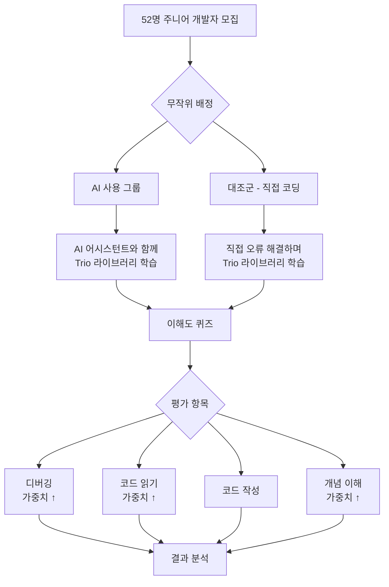
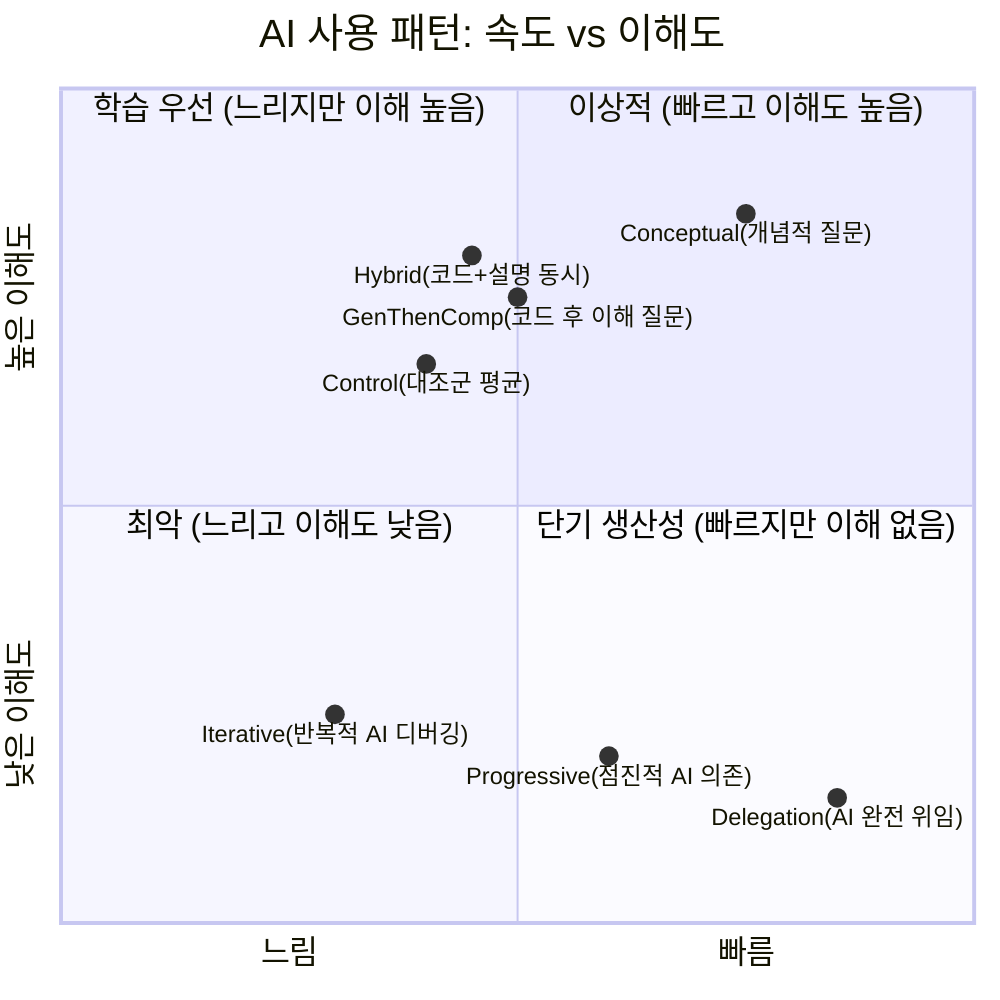
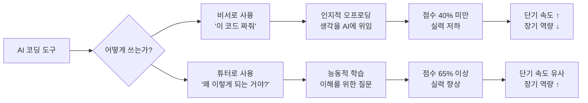
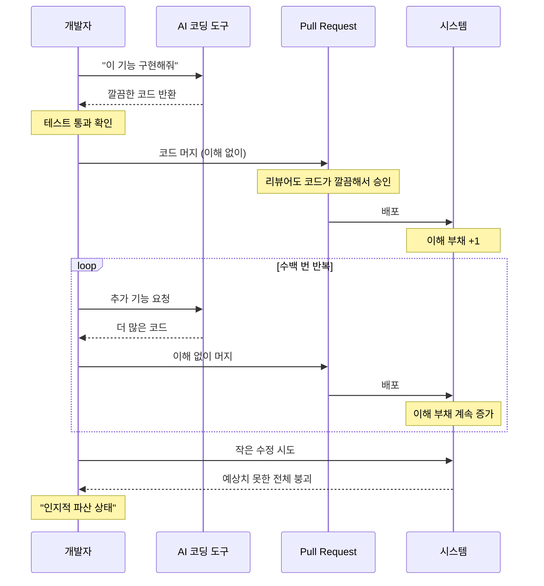
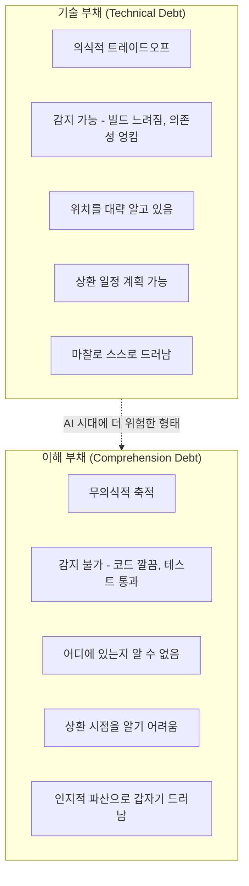
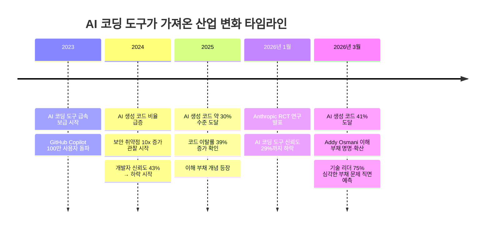
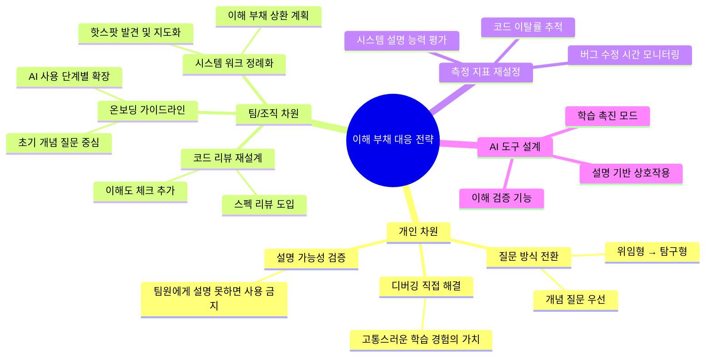

> **작성일**: 2026년 3월 22일  
> **원본 연구**: [How AI assistance impacts the formation of coding skills](https://www.anthropic.com/research/AI-assistance-coding-skills) — Anthropic (2026.01.29)  
> **논문**: [arXiv:2601.20245](https://arxiv.org/abs/2601.20245)  
> **저자**: Judy Hanwen Shen, Alex Tamkin
---

>Anthropic이 자기 제품이 개발자 실력을 깎는다는 연구를 직접 발표했어.
>
>52명 주니어 개발자한테 새 Python 라이브러리(Trio, 비동기 프로그래밍)를 배우게 했어. AI 쓴 그룹 퀴즈 점수 50%, 안 쓴 그룹 67%. 거의 두 등급 차이야. 특히 디버깅 문제에서 격차가 제일 컸어.
>
>속도는? AI 쓴 그룹이 2분 빨랐는데, 통계적으로 유의미하지 않았어. AI한테 질문하고 프롬프트 다듬는 데 세션 시간의 30%를 쓰고 있었거든.
>
>근데 논문을 끝까지 읽으면 결론이 달라.
>
>AI한테 "이 코드 짜줘"만 시킨 사람은 40% 미만. AI한테 "왜 이렇게 되는 거야?"를 물어본 사람은 65% 이상.
>
>성과 좋은 사용자 패턴 3가지: ① 개념적 질문만 하고 에러는 직접 해결 (7명) ② 코드 생성 + 설명 동시 요청 (3명) ③ 코드 먼저 받고 이해 질문 후속 (2명).
>
>위임하면 실력이 빠지고, 질문하면 실력이 는다는 얘기야. AI를 비서로 쓰느냐 튜터로 쓰느냐의 차이.
>
>다들 관심이 많아서 덧붙여 보면, 기술 부채(Technical Dept)의 하위 개념으로 볼 수 있는 이해 부채(Comprehension Dept)이라는 말도 있어.
>
>AI 코딩 도구가 생성한 대량의 코드를 인간이 검증하지 못한 채 병합하면서 이해 부채가 급증해. 
>
>겉보기에는 코드가 깨끗하고 테스트는 통과하는데, 정작 시스템의 구조적 설계 의도나 원리를 팀 내 누구도 완벽히 설명하지 못하는 상태가 되는 거야.
>
>그러다 보면 아주 작은 수정조차 전체 시스템의 붕괴를 초래하는 "인지적 파산 상태"가 된대
>
> [https://www.threads.com/@softdaddy_o/post/DWKoWKvk9iK](https://www.threads.com/@softdaddy_o/post/DWKoWKvk9iK)

---

## 목차

1. [왜 Anthropic이 스스로 이 연구를 했는가](#1-왜-anthropic이-스스로-이-연구를-했는가)
2. [연구 설계: 어떻게 실험했나](#2-연구-설계-어떻게-실험했나)
3. [핵심 결과: 숫자로 보는 실력 저하](#3-핵심-결과-숫자로-보는-실력-저하)
4. [AI 사용 패턴 분석: 어떻게 쓰느냐가 전부다](#4-ai-사용-패턴-분석-어떻게-쓰느냐가-전부다)
5. [이해 부채(Comprehension Debt): 더 큰 그림](#5-이해-부채comprehension-debt-더-큰-그림)
6. [기술 부채 vs 이해 부채 비교](#6-기술-부채-vs-이해-부채-비교)
7. [산업 전반의 위기 신호들](#7-산업-전반의-위기-신호들)
8. [실천 방안: 개인과 조직의 대응 전략](#8-실천-방안-개인과-조직의-대응-전략)
9. [결론: AI를 어떻게 써야 하는가](#9-결론-ai를-어떻게-써야-하는가)

---

## 1. 왜 Anthropic이 스스로 이 연구를 했는가

Anthropic은 자사 AI 모델 Claude의 개발사다. 그런 회사가 "AI 사용이 개발자 실력을 떨어뜨릴 수 있다"는 연구를 직접 수행하고 공개했다는 사실 자체가 이미 대단히 이례적이다. 기업 입장에서는 자사 제품의 부작용을 스스로 파헤치는 일이 상업적으로 불리할 수 있기 때문이다.

배경을 살펴보면 이 결정에는 명확한 이유가 있다. AI 도구가 업무 속도를 높인다는 것은 이미 여러 연구로 확인됐다. Anthropic의 별도 관찰 연구에서는 AI가 일부 작업의 처리 시간을 최대 80%까지 단축할 수 있다는 결과도 있었다. 문제는 이 생산성 향상이 장기적인 **기술 역량의 성장**과 양립하는가 하는 점이었다.

연구진이 주목한 현상은 '인지적 오프로딩(cognitive offloading)'이었다. 사람들이 AI를 쓰면 업무 참여도가 낮아지고, 스스로 생각하려는 노력을 줄인다는 연구들이 이미 나오고 있었다. 코딩 분야에서 이는 특히 위험할 수 있다. 왜냐하면 AI가 생성한 코드를 검토하고, 오류를 찾아내고, 전체 시스템을 이해하는 능력은 여전히 **인간에게 필요한 고급 역량**이기 때문이다. AI가 코딩을 자동화할수록, 남은 인간의 역할은 '더 많은 코드를 빨리 쓰는 것'이 아니라 '더 잘 이해하고 감독하는 것'이 되어야 한다. 그러므로 신입 개발자들이 AI에 의존하면서 바로 그 감독 역량을 기르지 못하게 된다면, 이는 업계 전체에 구조적 문제를 야기할 수 있다.

이 연구는 그 질문에 답하기 위한 최초의 **무작위 대조 시험(Randomized Controlled Trial, RCT)** 이다.

---

## 2. 연구 설계: 어떻게 실험했나

### 2.1 참가자 구성

- **총 참가자**: 52명 (대부분 주니어 소프트웨어 엔지니어)
- **Python 사용 경력**: 최소 주 1회 이상, 1년 이상
- **AI 도구 친숙도**: 어느 정도 AI 코딩 도구를 사용해 본 경험 있음
- **Trio 라이브러리 경험**: 전무 (실험의 핵심 조건)

참가자들은 AI 사용 그룹과 비사용 그룹(대조군)으로 **무작위 배정**되었다. 무작위 배정은 두 그룹 간의 사전 실력 차이를 통계적으로 상쇄하기 위한 핵심 설계 요소다.

### 2.2 실험 과제: Trio와 비동기 프로그래밍

실험에는 **Trio**라는 Python 비동기 프로그래밍 라이브러리가 사용됐다. Trio는 일반적으로 전문 현장에서 배우는 기술이며, 참가자들에게는 완전히 새로운 도메인이었다. 이렇게 설계한 이유는 AI가 생산성에 미치는 영향이 아니라, **새로운 기술을 습득하는 과정**에서의 영향을 측정하기 위해서다.

세션은 3단계로 구성되었다.

1. **워밍업(Warm-up)**: 도구 및 환경 적응
2. **메인 코딩 과제**: Trio를 사용해 두 가지 기능을 구현 (문제 설명, 시작 코드, Trio 개념 설명 제공)
3. **이해도 퀴즈**: 방금 사용한 개념들에 대한 평가

AI 그룹은 코딩 플랫폼의 사이드바에 내장된 AI 어시스턴트를 사용할 수 있었고, 이 AI는 참가자의 코드에 접근할 수 있었으며 원하면 정답 코드를 생성해줄 수 있었다. 참가자들에게는 퀴즈가 있다는 사실을 알려줬지만, 가능한 빠르게 작업하도록 독려했다.

### 2.3 평가 기준: 무엇을 테스트했나

연구진은 컴퓨터 과학 교육 분야의 선행 연구를 바탕으로, 코딩 역량을 평가하는 네 가지 유형의 문제를 설계했다.

| 유형 | 설명 | AI 시대 중요성 |
|------|------|----------------|
| **디버깅** | 코드에서 오류를 찾고 진단하는 능력 | AI 생성 코드의 잘못된 부분을 탐지하는 핵심 능력 |
| **코드 읽기** | 코드가 무엇을 하는지 이해하는 능력 | AI 작성 코드를 배포 전 검증하는 능력 |
| **코드 작성** | 올바른 접근법으로 코드를 쓰는 능력 | AI 통합 시대에는 저수준보다 고수준 설계가 중요 |
| **개념 이해** | 도구와 라이브러리의 핵심 원리 이해 | AI 코드가 올바른 소프트웨어 설계 패턴을 따르는지 판단하는 능력 |

평가의 비중은 디버깅, 코드 읽기, 개념 이해에 집중되었다. 이 세 가지가 AI 생성 코드를 감독하는 데 가장 중요한 역량이기 때문이다.

---

## 3. 핵심 결과: 숫자로 보는 실력 저하

### 3.1 퀴즈 점수: 거의 두 등급 차이

연구의 가장 충격적인 결과는 이해도 퀴즈 점수였다.

| 그룹 | 평균 점수 | 차이 |
|------|-----------|------|
| **AI 사용 그룹** | **50%** | — |
| **대조군 (직접 코딩)** | **67%** | **+17%p** |

통계적으로 이 차이는 유의미하다 (Cohen's d = 0.738, p = 0.01). Cohen's d 값 0.738은 "큰 효과 크기(large effect size)"에 해당하며, 단순히 통계적으로 의미 있는 게 아니라 **실질적으로도 의미 있는 차이**임을 뜻한다. 미국 학점 체계로 환산하면 거의 두 등급(letter grade) 차이다. 방금 전까지 직접 사용한 개념에 대한 테스트인데도 이런 결과가 나왔다는 점이 더욱 놀랍다.

### 3.2 완료 시간: 속도 향상은 미미했다

AI 그룹이 평균 2분 빠르게 과제를 마쳤지만, 이 차이는 **통계적으로 유의미하지 않았다**. 이유가 있었다. 질적 분석 결과, 일부 참가자들은 AI에게 최대 15개의 질문을 작성하는 데 **세션 시간의 30%(최대 11분)** 를 소비하고 있었다. AI와의 상호작용 자체가 상당한 시간을 소비했던 것이다.

이는 중요한 시사점을 준다. AI가 생산성을 크게 높이려면 반복적이거나 이미 숙지한 작업에 사용될 때 효과가 크고, 새로운 기술을 배우는 상황에서는 오히려 AI와의 상호작용 비용이 상당하다는 것이다.

### 3.3 문제 유형별 격차: 디버깅이 가장 크다

```mermaid
xychart-beta
    title "문제 유형별 점수 비교 (추정)"
    x-axis ["디버깅", "코드 읽기", "개념 이해", "코드 작성"]
    y-axis "점수 (%)" 0 --> 100
    bar [38, 48, 52, 58]
    bar [62, 65, 70, 72]
```

> *디버깅 영역에서 두 그룹 간 격차가 가장 컸다. 디버깅은 AI 생성 코드가 틀렸을 때 이를 감지하는 핵심 역량이라는 점에서 특히 우려스러운 결과다.*

대조군 참가자들은 더 많은 오류를 겪었다. 문법 오류뿐 아니라 Trio 개념 관련 오류도 있었는데, 바로 그 오류들을 스스로 해결하는 과정이 디버깅 능력을 향상시켰다는 것이 연구진의 가설이다. 즉, **고통스러운 경험이 학습의 원천**이었다.

---

## 4. AI 사용 패턴 분석: 어떻게 쓰느냐가 전부다

연구에서 가장 중요하고 희망적인 발견은 "AI를 쓰면 무조건 실력이 떨어진다"가 아니라는 점이다. AI를 **어떻게** 사용했느냐에 따라 결과가 극적으로 달랐다.

연구진은 화면 녹화를 수동으로 분석하여, AI 사용자들을 상호작용 방식에 따라 6가지 패턴으로 분류했다.

### 4.1 저점수 패턴: AI에 대한 과도한 의존

이 패턴들의 공통점은 **인지적 오프로딩**이다. 생각을 AI에 넘겨버린다. 평균 퀴즈 점수는 **40% 미만**이었다.

**① AI 완전 위임 (AI Delegation, n=4)**

이 그룹은 코드 작성의 모든 것을 AI에게 맡겼다. 덕분에 과제를 가장 빠르게 완료했고, 오류도 거의 없었다. 하지만 정작 퀴즈에서는 최저 점수를 받았다. 속도와 이해 사이의 극단적 트레이드오프를 보여주는 사례다.

**② 점진적 AI 의존 (Progressive AI Reliance, n=4)**

처음에는 한두 가지 질문을 하며 스스로 해보려 했지만, 점점 모든 코드 작성을 AI에 위임했다. 특히 두 번째 과제에서는 개념을 전혀 습득하지 못한 채로 진행했다. AI에 대한 의존이 서서히, 그러나 완전하게 이루어졌다.

**③ 반복적 AI 디버깅 (Iterative AI Debugging, n=4)**

이 그룹은 질문 수가 가장 많았다. 하지만 질문의 목적이 자신의 이해를 높이기 위함이 아니라, AI에게 문제를 해결해달라고 요청하는 방식이었다. 결과적으로 점수도 낮고, 속도도 느렸다.

### 4.2 고점수 패턴: AI를 이해의 도구로 활용

이 패턴들의 공통점은 AI를 **실행 도구**가 아닌 **학습 도구**로 사용했다는 점이다. 평균 퀴즈 점수는 **65% 이상**이었다.

**① 개념적 질문 (Conceptual Inquiry, n=7)**

가장 많은 인원이 속한 고점수 그룹. 이들은 코드 생성을 요청하지 않았다. 대신 "이 개념이 왜 이렇게 작동하나요?", "이 방식과 저 방식의 차이가 뭔가요?" 같은 **개념 이해를 위한 질문**만 했다. 그 이해를 바탕으로 직접 코드를 작성했고, 오류를 스스로 해결했다. 고점수 패턴 중 두 번째로 빠른 속도였으며, AI 완전 위임 다음으로 전체 2위의 속도를 기록했다.

**② 코드 + 설명 동시 요청 (Hybrid Code-Explanation, n=3)**

"이 코드를 짜줘, 그리고 왜 이렇게 되는지 설명해줘"라는 방식으로 요청했다. 설명을 읽고 이해하는 데 시간이 더 걸렸지만, 그 시간이 이해도 향상으로 이어졌다.

**③ 코드 생성 후 이해 질문 (Generation-then-Comprehension, n=2)**

먼저 코드를 생성받아 붙여넣은 후, AI에게 "이 코드가 왜 이렇게 작동하는지 설명해줘"라는 후속 질문을 했다. 겉보기에는 AI 완전 위임 그룹과 거의 동일해 보였지만, **자신의 이해를 점검하는 질문을 추가했다**는 점에서 결정적 차이가 있었다.

### 4.3 AI 상호작용 패턴 전체 요약

### 4.4 핵심 통찰: 비서 vs 튜터

이 결과를 가장 명확하게 요약하면 이렇다:

> **AI를 비서(실행자)로 쓰면 실력이 빠지고, AI를 튜터(설명자)로 쓰면 실력이 는다.**

코드 생성 요청(위임)은 학습을 방해하고, 개념 이해 질문(탐구)은 학습을 촉진한다. AI 도구의 능력은 동일하다. 차이를 만드는 것은 **사용자의 의도와 질문 방식**이다.

---

## 5. 이해 부채(Comprehension Debt): 더 큰 그림

Anthropic 연구가 개인 수준의 문제를 다뤘다면, '이해 부채(Comprehension Debt)'라는 개념은 이를 **조직 및 시스템 수준**으로 확장한다. 이 용어는 구글 Chrome 팀의 엔지니어링 리더 Addy Osmani가 2026년 초에 처음 명명한 개념으로, 빠르게 소프트웨어 업계의 핵심 담론으로 부상했다.

### 5.1 이해 부채란 무엇인가

이해 부채는 **시스템에 존재하는 코드의 양**과 **팀이 실제로 이해하는 코드의 양** 사이의 격차가 점점 벌어지는 현상을 말한다.

코드베이스를 빙산에 비유해보자. 수면 위로 보이는 부분은 코드 자체다. 하지만 그 코드가 **왜 그렇게 설계되었는지**, **어떤 의도로 만들어졌는지**, **시스템의 다른 부분과 어떻게 연결되는지**에 대한 이해는 수면 아래에 숨겨진 거대한 부분이다. AI가 대량의 코드를 생성하면서, 코드(수면 위)는 폭발적으로 늘어나지만 팀의 이해(수면 아래)는 그 속도를 따라가지 못한다. 

이것이 이해 부채다. 그리고 이 부채는 **아무도 눈치채지 못한 채로 쌓인다**.

### 5.2 왜 이해 부채가 기술 부채보다 위험한가

기술 부채(Technical Debt)는 불편하긴 하지만 감지할 수 있다. 빌드가 느려지고, 의존성이 얽히고, 특정 모듈에 손대기가 두려워진다. 개발자들은 "저기 부채가 있다"는 것을 느낄 수 있다.

이해 부채는 다르다. **겉보기에 아무 문제가 없어 보인다.** 코드는 깔끔하고, 테스트는 통과하고, 포맷은 완벽하다. 하지만 그 아래에서 팀의 시스템 이해는 조용히 비어가고 있다. 그러다 어느 날 아주 작은 수정 하나가 예상치 못한 전체 시스템의 붕괴를 초래한다.

연구자 Margaret-Anne Storey가 기록한 학생 팀 사례가 이를 잘 보여준다. 7주차에 이르자 그 팀은 더 이상 간단한 변경도 할 수 없게 되었다. 예상치 못한 곳에서 무언가가 계속 깨졌다. 문제는 코드가 지저분해서가 아니었다. 팀 내 누구도 왜 그런 설계 결정이 내려졌는지, 시스템의 각 부분이 어떻게 서로 맞물리는지 설명할 수 없었다. **시스템의 이론(theory)이 증발해 버린 것이다.**

### 5.3 이해 부채가 발생하는 메커니즘

AI 생성 코드가 PR 리뷰 프로세스의 핵심 피드백 루프를 망가뜨린다는 점도 중요하다. 기존에는 팀원이 작성한 코드를 리뷰하는 과정이 느리긴 해도 **교육적이고 생산적인 병목**이었다. PR을 읽으면서 숨겨진 가정을 발견하고, 6개월 전 아키텍처 결정과 충돌하는 설계를 포착하고, 코드베이스에 대한 지식이 팀 전체로 분산되었다. AI가 생성한 코드는 이 피드백 루프를 끊어버린다. 물량이 너무 많고, 표면적으로는 깔끔해 보이기 때문에 승인 버튼을 누르기가 쉽다.

### 5.4 특히 위험한 시나리오: 테스트도 같이 AI가 수정할 때

AI가 구현 동작을 변경하고, 변경된 동작에 맞게 수백 개의 테스트 케이스까지 자동으로 업데이트한다면 어떻게 될까? 이때 질문이 바뀐다. "이 코드가 올바른가?"가 아니라, "이 테스트 변경들이 모두 필요했는가? 내가 생각하지 못한 케이스를 테스트가 커버하고 있는가?"가 된다. 이 질문에 답할 수 있는 것은 테스트 결과가 아니라 **인간의 이해**뿐이다.

---

## 6. 기술 부채 vs 이해 부채 비교

| 특성 | 기술 부채 | 이해 부채 |
|------|----------|----------|
| **발생 방식** | 의식적 지름길 선택 | 무의식적 축적 |
| **감지 용이성** | 상대적으로 쉬움 (마찰 발생) | 매우 어려움 (겉보기 정상) |
| **코드 품질** | 종종 지저분하고 복잡 | 깔끔하고 잘 포맷됨 |
| **테스트 통과** | 종종 실패 가능 | 통과 (표면적 정확성) |
| **위기 도래 방식** | 점진적으로 악화 | 갑작스러운 전면 붕괴 |
| **책임 소재** | 명확한 의사결정자 존재 | 분산되어 있음 (모두의, 아무도의) |
| **상환 방법** | 리팩토링, 재작성 | 이해 복원, 문서화, 지식 재건 |

---

## 7. 산업 전반의 위기 신호들

Anthropic 연구와 이해 부채 개념이 이토록 주목받는 이유는, 개별적인 사례가 아니라 산업 전반의 패턴과 맞닿아 있기 때문이다.

### 7.1 코드 생성량의 폭발적 증가

2026년 기준으로 모든 새 상업 코드의 약 **41%가 AI가 생성**한 것으로 추정된다. 이 비율은 빠르게 증가하고 있다. 코드 작성 속도의 병목은 이미 해소되었다. 이제 병목은 **코드를 이해하는 것**으로 이동했다.

### 7.2 역설적인 신뢰-사용 간극

AI 코딩 도구에 대한 개발자 신뢰도는 18개월 만에 43%에서 29%로 하락했다. 그러나 같은 기간 사용률은 84%까지 올라갔다. **신뢰하지 않으면서 더 많이 쓴다.** 이 역설적 상황을 일부에서는 '인지 부채(cognitive debt)'라고 부른다.

### 7.3 코드 이탈률 증가

GitClear가 1억 줄 이상의 코드 변경을 분석한 결과, AI 코딩 도구를 많이 사용하는 프로젝트에서 코드 이탈률(작성 후 2주 내에 되돌려지거나 수정되는 비율)이 **39% 증가**했다. 코드가 빠르게 쓰이고, 빠르게 수정되거나 폐기된다.

### 7.4 경험 많은 개발자의 생산성 감소

스택오버플로우 분석에 따르면, 숙련된 개발자들은 AI 도구 사용 시 오히려 **19% 생산성 감소**를 보고했다. AI가 빠른 부분(코드 작성)을 더 빠르게 만들었지만, 느린 부분(이해, 디버깅, 수정)은 더 느려졌기 때문이다.

### 7.5 보안 취약점 증가

한 API 보안 회사에 따르면, 2024년 12월에서 2025년 6월 사이 포춘 50대 기업에서 보안 취약점 발견이 **월 기준 10배** 증가했다. AI가 기능적으로는 작동하지만 보안적으로 취약한 코드를 생성하는 경우가 많기 때문이다.

---

## 8. 실천 방안: 개인과 조직의 대응 전략

### 8.1 개인 개발자: 질문 방식을 바꿔라

Anthropic 연구의 결론은 명확하다. AI를 쓰되, 어떻게 쓰느냐를 의식적으로 선택해야 한다.

**하지 말아야 할 질문 (위임형)**
- "이 기능 구현해줘"
- "이 버그 고쳐줘"
- "이 코드 작동하게 만들어줘"

**해야 할 질문 (이해형)**
- "왜 이 방식이 저 방식보다 나은 거야?"
- "이 코드에서 문제가 생길 수 있는 부분이 어디야, 그리고 왜?"
- "이 라이브러리의 핵심 설계 철학이 뭐야?"
- "이 패턴을 쓰면 어떤 트레이드오프가 생겨?"
- "내 코드에서 내가 놓친 엣지 케이스가 뭐가 있을까?"

특히 디버깅은 직접 하는 것이 좋다. 불편하고 느리더라도, 오류를 스스로 해결하는 과정이 가장 강력한 학습 경험이다. Anthropic 연구에서 대조군이 더 많은 오류를 겪었지만 더 높은 점수를 받은 것이 이를 증명한다.

한 가지 검증 규칙도 도움이 된다. "이 코드를 팀원에게 설명할 수 없다면, 사용하지 않는다." 이해하지 못한 코드는 그 순간 레거시 코드가 된다.

### 8.2 조직/팀: 이해 부채 관리 프레임워크

**코드 리뷰 프로세스 재설계**: AI 생성 코드가 많아질수록, 리뷰의 기준을 '코드가 작동하는가'에서 '우리 팀이 이 코드를 이해하는가'로 전환해야 한다. PR에 자연어 스펙을 함께 첨부하고, 코드가 아닌 스펙을 리뷰하는 방식도 고려할 만하다.

**시스템 워크(System Walk) 정례화**: 정기적으로 팀원들이 전체 스택을 따라가며 각 레이어에서 무슨 일이 일어나는지, 왜 그렇게 되는지 설명하는 세션을 진행한다. 누군가 설명하지 못하는 부분이 나오면, 그곳이 이해 부채의 핫스팟이다. 지도로 표시하고 기술 부채처럼 상환 계획을 세운다.

**온보딩에서 AI 사용 가이드라인**: 주니어 개발자들에게 AI 도구를 무제한 허용하기보다, 초기에는 특정 유형의 질문만 허용하고 점차 확장하는 방식을 고려한다. 특히 새로운 기술을 배우는 초기 단계에서는 개념 이해 질문 중심으로 AI를 활용하도록 안내한다.

**측정 지표 재설정**: AI 도입 성과를 속도(velocity)나 AI 사용률로만 측정하면 이해 부채를 놓친다. 코드 이탈률, 버그 수정 시간, 팀의 시스템 설명 능력 등을 함께 추적해야 한다.

### 8.3 AI 제품 설계자들에게

Anthropic은 이 연구에서 AI 제품 자체의 설계도 언급했다. Claude Code의 학습·설명 모드나 ChatGPT의 Study Mode처럼, 이해를 촉진하는 방향으로 AI를 설계하는 것이 중요하다. AI가 단순히 코드를 생성해주는 것이 아니라, 사용자가 그 코드를 이해하도록 유도하는 방식으로 상호작용을 설계해야 한다.

---

## 9. 결론: AI를 어떻게 써야 하는가

Anthropic 연구는 AI 시대에 "어떻게 일해야 하는가"에 대한 가장 실증적인 데이터 중 하나를 제공했다. 결론은 단순하지 않다. "AI를 쓰지 말라"는 말이 아니다. "AI를 어떻게 쓰느냐가 당신의 성장과 역량을 결정한다"는 것이다.

이미 숙달된 기술에 AI를 사용하는 것은 생산성을 극적으로 높인다. Anthropic의 다른 연구에서 확인된 80% 시간 단축은 이 맥락에서 타당하다. 하지만 새로운 기술을 습득하는 과정에서 AI에 무분별하게 의존하면, 그 기술을 이해하는 능력 자체가 형성되지 않는다.

인지적 노력, 심지어 고통스럽게 막히는 경험은 학습의 핵심이다. 이것은 새로운 발견이 아니다. 인간의 학습이 항상 그래왔다. AI가 그 불편함을 제거해주지만, 그 불편함과 함께 학습의 기회도 제거된다.

이해 부채는 이 문제의 조직적 표현이다. 개인의 이해 회피가 수백 번, 수천 번 쌓이면 팀 전체가 자신들이 만든 시스템을 이해하지 못하는 상태에 이른다. 그 결과는 아주 작은 수정이 전체 시스템을 무너뜨리는 "인지적 파산 상태"다.

AI가 코드 작성의 병목을 없앴다. 이제 진짜 병목은 이해다. 그리고 그 이해는 여전히 인간만이, 올바른 방식으로 노력할 때만 획득할 수 있다.

> **"AI가 빠른 부분을 더 빠르게 만들었다. 그러나 느린 부분을 더 느리게 만들 수도 있다. 빠른 부분은 코드 작성이다. 느린 부분은 이해, 디버깅, 수정이다. AI는 코드 작성의 병목을 해소했다. 하지만 이해의 병목은 오히려 심화시킬 수 있다."**

---

## 참고 자료

- Anthropic Research: [How AI assistance impacts the formation of coding skills](https://www.anthropic.com/research/AI-assistance-coding-skills) (2026.01.29)
- arXiv 논문: [arXiv:2601.20245](https://arxiv.org/abs/2601.20245) — Shen & Tamkin (2026)
- Addy Osmani: [Comprehension Debt — the hidden cost of AI generated code](https://addyosmani.com/blog/comprehension-debt/) (2026.03)
- DEV Community: [AI Is Creating a New Kind of Tech Debt](https://dev.to/harsh2644/ai-is-creating-a-new-kind-of-tech-debt-and-nobody-is-talking-about-it-3pm6) (2026.03)
- Hugging Face Blog: [Beyond Technical Debt — Comprehension Debt in Indie Game Dev](https://huggingface.co/blog/zeenaz/beyond-technical-debt) (2025.10)
- jvaneyck: [Comprehension Debt: The Hidden Tax on AI-Generated Code](https://jvaneyck.wordpress.com/2026/03/21/comprehension-debt-the-hidden-tax-on-ai-generated-code/) (2026.03.21)

---

*이 문서는 2026년 3월 22일 기준으로 작성되었습니다.*
