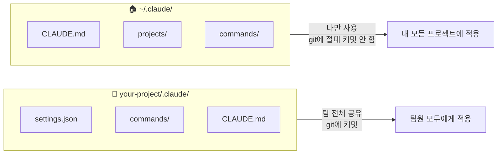
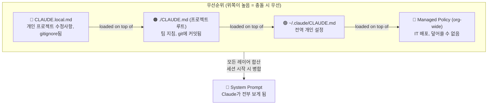
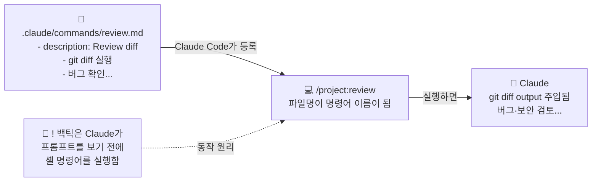
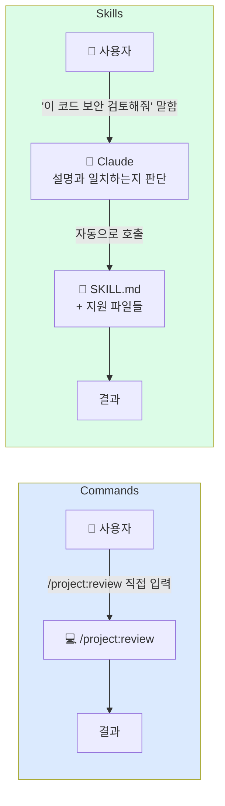
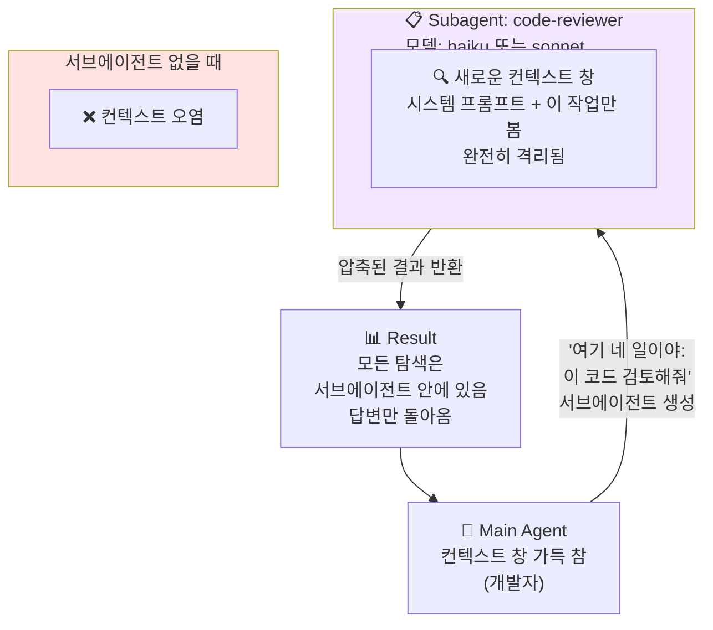
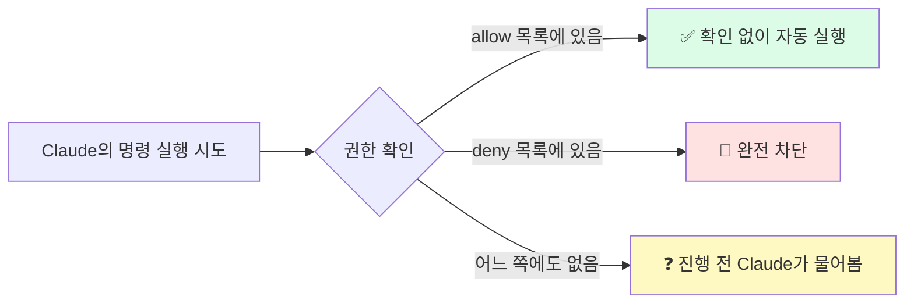
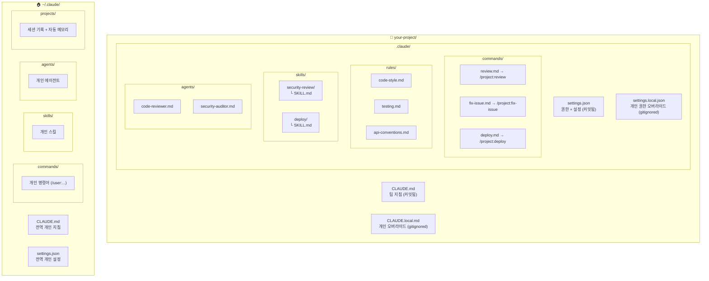
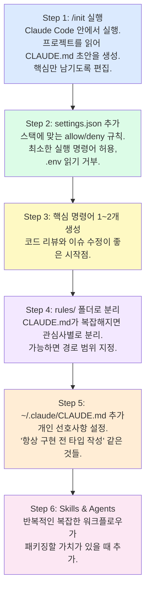

> Claude Code를 제대로 쓰는 개발자와 그렇지 않은 개발자를 가르는 결정적 차이

**원문 출처:** [@akshay_pachaar](https://x.com/akshay_pachaar/status/2035341800739877091) / 정리 [@Hesamation](https://x.com/hesamation/status/2035479614974275758)

---

## 목차

1. [왜 `.claude` 폴더인가?](#왜-claude-폴더인가)
2. [두 개의 폴더: 팀 설정 vs 개인 설정](#두-개의-폴더-팀-설정-vs-개인-설정)
3. [CLAUDE.md: Claude의 두뇌에 주입하는 명령서](#claudemd-claude의-두뇌에-주입하는-명령서)
4. [CLAUDE.md 로딩 우선순위 구조](#claudemd-로딩-우선순위-구조)
5. [rules/ 폴더: 모듈식 규칙 관리](#rules-폴더-모듈식-규칙-관리)
6. [commands/ 폴더: 나만의 슬래시 명령어](#commands-폴더-나만의-슬래시-명령어)
7. [skills/ 폴더: Claude가 스스로 호출하는 워크플로우](#skills-폴더-claude가-스스로-호출하는-워크플로우)
8. [commands vs skills: 결정적 차이](#commands-vs-skills-결정적-차이)
9. [agents/ 폴더: 전문 서브에이전트](#agents-폴더-전문-서브에이전트)
10. [settings.json: 권한과 제한 관리](#settingsjson-권한과-제한-관리)
11. [전역 ~/.claude/ 폴더](#전역-claude-폴더)
12. [전체 구조 한눈에 보기](#전체-구조-한눈에-보기)
13. [실전 셋업 가이드](#실전-셋업-가이드)

---

## 왜 `.claude` 폴더인가?

Claude Code를 사용하는 대부분의 개발자는 `.claude` 폴더를 **블랙박스**처럼 취급한다. 프로젝트 루트에 그 폴더가 생겼다는 것은 알고 있고, 심지어 본 적도 있지만, 실제로 열어보거나 그 안에 뭐가 있는지 이해한 사람은 드물다.

이건 엄청난 기회 손실이다.

`.claude` 폴더는 **Claude가 당신의 프로젝트에서 어떻게 행동할지를 결정하는 컨트롤 센터**다. 여기에는 다음 요소들이 담긴다:

- **명령 지침(Instructions):** Claude가 항상 따르는 규칙들
- **커스텀 명령어(Commands):** 당신이 정의한 슬래시 명령어
- **권한 정책(Permissions):** Claude가 실행할 수 있는 것과 없는 것
- **세션 메모리(Memory):** Claude가 세션 간에 기억하는 것들

이 폴더를 제대로 이해하고 설정하면, Claude Code를 **팀의 방식에 정확히 맞게** 동작시킬 수 있다.

---

## 두 개의 폴더: 팀 설정 vs 개인 설정

한 가지 중요한 사실부터: `.claude` 디렉토리는 하나가 아니라 **두 개**다.

```
your-project/.claude/     ← 프로젝트(팀) 설정
~/.claude/                ← 전역(개인) 설정
```



**프로젝트 레벨 폴더** (`your-project/.claude/`)는 팀 설정을 담는다. Git에 커밋되며, 팀 전체가 동일한 규칙, 동일한 커스텀 명령어, 동일한 권한 정책을 공유한다.

**전역 폴더** (`~/.claude/`)는 개인 설정과 머신 로컬 상태(세션 기록, 자동 메모리 등)를 담는다. 이 폴더는 절대 Git에 올라가지 않는다.

---

## CLAUDE.md: Claude의 두뇌에 주입하는 명령서

`CLAUDE.md`는 `.claude` 시스템 전체에서 가장 중요한 파일이다. Claude Code 세션을 시작하면, Claude가 **제일 먼저 읽는 파일**이 바로 이것이다. 이 파일은 시스템 프롬프트에 직접 로드되어 전체 대화 내내 Claude의 머릿속에 유지된다.

단순하게 말하자면: **CLAUDE.md에 적힌 것은 Claude가 따른다.**

예를 들어:
- "항상 구현 전에 테스트를 작성하라"고 적으면 → 실제로 그렇게 한다
- "에러 처리에 console.log를 절대 쓰지 말고, 커스텀 로거 모듈을 써라"고 적으면 → 매번 그렇게 한다

### CLAUDE.md 배치 위치

Claude는 여러 곳에 있는 `CLAUDE.md`를 **모두 읽고 합산**한다:

| 위치 | 용도 |
|------|------|
| `./CLAUDE.md` (프로젝트 루트) | 가장 일반적인 팀 설정 |
| `~/.claude/CLAUDE.md` | 모든 프로젝트에 적용되는 개인 전역 설정 |
| `./src/CLAUDE.md` (서브디렉토리) | 해당 디렉토리에만 적용되는 폴더별 규칙 |

### CLAUDE.md에 무엇을 써야 하는가

**써야 하는 것:**

- 빌드, 테스트, 린트 명령어 (`npm run test`, `make build` 등)
- 핵심 아키텍처 결정사항 ("우리는 Turborepo를 사용하는 모노레포다")
- 비직관적인 주의사항 ("TypeScript strict 모드가 켜져 있고, 미사용 변수는 에러다")
- import 컨벤션, 네이밍 패턴, 에러 처리 스타일
- 주요 모듈의 파일 및 폴더 구조

**쓰지 말아야 하는 것:**

- 린터나 포매터 설정에 이미 있는 내용
- 링크로 대체할 수 있는 전체 문서
- 이론 설명이 담긴 긴 단락들

> ⚠️ **중요:** `CLAUDE.md`는 **200줄 이하**로 유지하라. 그보다 길어지면 컨텍스트를 너무 많이 잡아먹고, Claude의 지시사항 준수율이 실제로 떨어진다.

### 실전 예시: 최소하지만 효과적인 CLAUDE.md

```markdown
# Project: Acme API

## Commands
npm run dev          # 개발 서버 시작
npm run test         # 테스트 실행 (Jest)
npm run lint         # ESLint + Prettier 검사
npm run build        # 프로덕션 빌드

## Architecture
- Express REST API, Node 20
- PostgreSQL via Prisma ORM
- 모든 핸들러는 src/handlers/에 위치
- 공유 타입은 src/types/에 위치

## Conventions
- 모든 핸들러에서 zod로 요청 유효성 검사
- 반환 형태는 항상 { data, error }
- 클라이언트에 스택 트레이스 절대 노출 금지
- console.log 대신 logger 모듈 사용

## Watch out for
- 테스트는 목(mock) 아닌 실제 로컬 DB 사용. 먼저 `npm run db:test:reset` 실행 필요
- Strict TypeScript: 미사용 import 절대 금지
```

약 20줄. Claude가 이 코드베이스에서 생산적으로 작업하는 데 필요한 모든 것이 담겨 있다.

---

## CLAUDE.md 로딩 우선순위 구조

모든 `CLAUDE.md` 파일들은 세션 시작 시 **하나의 시스템 프롬프트로 합쳐진다.** 충돌이 발생하면 우선순위가 높은 쪽이 이긴다.



| 레이어 | 파일 | 특징 |
|--------|------|------|
| 최고 우선순위 | `CLAUDE.local.md` | 개인 수정사항, gitignored |
| 두 번째 | `./CLAUDE.md` | 팀 지침, git 커밋 |
| 세 번째 | `~/.claude/CLAUDE.md` | 전역 개인 설정 |
| 최저 우선순위 | Managed Policy | 조직 전체 정책, 덮어쓸 수 없음 |

### CLAUDE.local.md: 개인 오버라이드

팀 전체가 아닌 자신에게만 적용되는 선호사항이 있을 수 있다. 다른 테스트 러너를 선호하거나, 특정 패턴으로 파일을 열고 싶을 때 등이다.

프로젝트 루트에 `CLAUDE.local.md`를 생성하면 된다. Claude는 이 파일을 메인 `CLAUDE.md`와 함께 읽는다. 그리고 **자동으로 gitignored**되므로, 개인 수정사항이 절대 저장소에 올라가지 않는다.

---

## rules/ 폴더: 모듈식 규칙 관리

`CLAUDE.md` 하나로 관리하는 것은 소규모 프로젝트에서는 잘 작동한다. 하지만 팀이 성장하면 300줄짜리 `CLAUDE.md`가 생기고, 아무도 관리하지 않으며 모두가 무시하는 상황이 온다.

`rules/` 폴더가 이 문제를 해결한다.

`.claude/rules/` 안의 모든 마크다운 파일은 `CLAUDE.md`와 함께 자동으로 로드된다. 하나의 거대한 파일 대신, 관심사별로 지침을 분리한다:

```
.claude/rules/
├── code-style.md        ← 코드 스타일 규칙
├── testing.md           ← 테스트 표준
├── api-conventions.md   ← API 설계 컨벤션
└── security.md          ← 보안 지침
```

각 파일은 집중되어 있고 업데이트하기 쉽다. API 컨벤션을 담당하는 팀원은 `api-conventions.md`를 편집한다. 테스트 표준을 담당하는 사람은 `testing.md`를 편집한다. 서로 충돌이 없다.

### 경로 범위 규칙 (Path-Scoped Rules)

`rules/` 폴더의 진짜 강점은 **경로 범위 규칙**이다. 규칙 파일에 YAML 프론트매터를 추가하면 일치하는 파일 작업 시에만 활성화된다:

```markdown
---
paths:
  - "src/api/**/*.ts"
  - "src/handlers/**/*.ts"
---
# API 설계 규칙

- 모든 핸들러는 { data, error } 형태를 반환
- 요청 본문 유효성 검사에 zod 사용
- 클라이언트에 내부 에러 상세 정보 절대 노출 금지
```

Claude는 React 컴포넌트를 편집할 때 이 파일을 로드하지 않는다. `src/api/` 또는 `src/handlers/` 내에서 작업할 때만 로드한다. `paths` 필드가 없는 규칙은 모든 세션에서 무조건 로드된다.

---

## commands/ 폴더: 나만의 슬래시 명령어

Claude Code에는 기본적으로 `/help`, `/compact` 같은 내장 슬래시 명령어가 있다. `commands/` 폴더를 사용하면 **직접 슬래시 명령어를 추가**할 수 있다.

`.claude/commands/`에 넣는 모든 마크다운 파일이 슬래시 명령어가 된다.

- `review.md` → `/project:review` 생성
- `fix-issue.md` → `/project:fix-issue` 생성



### 실전 예시: review.md

```markdown
---
description: 머지 전 현재 브랜치 diff 검토
---
## 검토할 변경사항

!`git diff --name-only main...HEAD`

## 상세 Diff

!`git diff main...HEAD`

위 변경사항을 다음 항목에 대해 검토하라:
1. 코드 품질 이슈
2. 보안 취약점
3. 누락된 테스트 커버리지
4. 성능 우려사항

파일별로 구체적이고 실행 가능한 피드백을 제공하라.
```

`/project:review`를 실행하면 Claude가 보기 전에 실제 git diff가 프롬프트에 자동 삽입된다. `!` 백틱 문법이 셸 명령을 실행하고 출력을 삽입한다. 이것이 이 명령어들을 단순한 저장된 텍스트가 아니라 **진짜 유용한 도구**로 만드는 핵심이다.

### 명령어에 인수 전달하기

`$ARGUMENTS`를 사용해 명령어 이름 뒤에 텍스트를 전달할 수 있다:

```markdown
---
description: GitHub 이슈 조사 및 수정
argument-hint: [issue-number]
---
이 저장소의 이슈 #$ARGUMENTS를 살펴봐라.

!`gh issue view $ARGUMENTS`

버그를 이해하고, 근본 원인을 추적하고, 수정한 다음,
이를 잡았을 테스트를 작성하라.
```

`/project:fix-issue 234`를 실행하면 이슈 234의 내용이 프롬프트에 직접 주입된다.

### 개인 vs 프로젝트 명령어

`.claude/commands/`의 프로젝트 명령어는 커밋되어 팀과 공유된다. 모든 프로젝트에서 사용할 개인 명령어는 `~/.claude/commands/`에 넣는다. 이것들은 `/user:command-name`으로 표시된다.

유용한 개인 명령어 예시:
- 일일 스탠드업 헬퍼
- 나만의 컨벤션을 따르는 커밋 메시지 생성기
- 빠른 보안 스캔

---

## skills/ 폴더: Claude가 스스로 호출하는 워크플로우

Skills는 표면적으로 Commands와 비슷해 보이지만, **트리거 방식이 근본적으로 다르다.**



**Commands:** 당신이 수동으로 트리거. 항상 단일 `.md` 파일. 반복 가능한 수동 워크플로우에 적합.

**Skills:** Claude가 자동으로 호출. 컨텍스트 인식 자동 워크플로우에 적합. 지원 파일을 함께 번들할 수 있다.

각 skill은 자체 서브디렉토리에 `SKILL.md` 파일과 함께 위치한다:

```
.claude/skills/
├── security-review/
│   ├── SKILL.md
│   └── DETAILED_GUIDE.md
└── deploy/
    ├── SKILL.md
    └── templates/
        └── release-notes.md
```

### SKILL.md 예시

```markdown
---
name: security-review
description: 종합적인 보안 감사. 취약점에 대한 코드 검토, 배포 전,
  또는 사용자가 보안을 언급할 때 사용.
allowed-tools: Read, Grep, Glob
---
코드베이스에서 보안 취약점을 분석하라:

1. SQL 인젝션 및 XSS 위험
2. 노출된 자격 증명 또는 비밀
3. 안전하지 않은 설정
4. 인증 및 권한 부여 갭

심각도 등급과 구체적인 수정 단계를 포함한 결과를 보고하라.

보안 표준에 대해서는 @DETAILED_GUIDE.md를 참조하라.
```

"이 PR에서 보안 이슈를 검토해줘"라고 말하면, Claude는 설명을 읽고, 일치한다고 인식하며, 자동으로 skill을 호출한다. `/security-review`로 명시적으로 호출할 수도 있다.

**Skills의 핵심 차이점:** Skills는 지원 파일을 함께 번들할 수 있다. 위의 `@DETAILED_GUIDE.md` 참조는 `SKILL.md` 바로 옆에 있는 상세 문서를 가져온다. Commands는 단일 파일이다. **Skills는 패키지**다.

---

## commands vs skills: 결정적 차이

> Commands는 당신을 기다린다. Skills는 적절한 순간을 지켜보다가 스스로 행동한다.

| 구분 | Commands | Skills |
|------|----------|--------|
| **트리거** | 사용자가 수동으로 입력 | Claude가 자동으로 감지 |
| **구조** | 항상 단일 `.md` 파일 | 폴더 + SKILL.md + 지원 파일들 |
| **적합한 용도** | 반복 가능한 수동 워크플로우 | 컨텍스트 인식 자동 워크플로우 |
| **호출 방식** | `/project:command-name` | 자동 (또는 명시적 호출 가능) |

---

## agents/ 폴더: 전문 서브에이전트

작업이 전문 전문가의 도움을 받을 만큼 복잡할 때, `.claude/agents/`에 서브에이전트 페르소나를 정의할 수 있다.



**핵심 원리:** 서브에이전트는 모든 지저분한 탐색을 흡수한다. 메인 에이전트는 답변만 받는다. 메인 세션은 수천 토큰의 중간 탐색으로 어지럽혀지지 않는다.

### code-reviewer.md 예시

```markdown
---
name: code-reviewer
description: 전문 코드 리뷰어. PR 검토, 버그 확인, 또는
  머지 전 구현 유효성 검사 시 PROACTIVELY 사용.
model: sonnet
tools: Read, Grep, Glob
---
당신은 정확성과 유지보수성에 집중하는 시니어 코드 리뷰어다.

코드 검토 시:
- 스타일 이슈가 아닌 버그를 지적하라
- 막연한 개선이 아닌 구체적인 수정을 제안하라
- 엣지 케이스와 에러 처리 갭을 확인하라
- 규모에서 중요할 때만 성능 우려사항을 언급하라
```

### agents/의 핵심 설계 원칙

**`tools` 필드로 에이전트가 할 수 있는 것을 제한한다.** 보안 감사자는 `Read`, `Grep`, `Glob`만 필요하다. 파일을 쓸 이유가 없다. 이 제한은 의도적이며 명시적으로 설정해야 한다.

**`model` 필드로 더 저렴하고 빠른 모델을 사용한다.** Haiku는 대부분의 읽기 전용 탐색을 잘 처리한다. 정말 필요한 작업에만 Sonnet과 Opus를 아껴라.

---

## settings.json: 권한과 제한 관리

`settings.json`은 Claude가 할 수 있는 것과 없는 것을 제어한다. 어떤 도구를 실행할 수 있는지, 어떤 파일을 읽을 수 있는지, 특정 명령을 실행하기 전에 확인을 구해야 하는지를 정의한다.

```json
{
  "$schema": "https://json.schemastore.org/claude-code-settings.json",
  "permissions": {
    "allow": [
      "Bash(npm run *)",
      "Bash(git status)",
      "Bash(git diff *)",
      "Read",
      "Write",
      "Edit"
    ],
    "deny": [
      "Bash(rm -rf *)",
      "Bash(curl *)",
      "Read(./.env)",
      "Read(./.env.*)"
    ]
  }
}
```



### 각 부분의 역할

**`$schema` 라인:** VS Code나 Cursor에서 자동완성과 인라인 유효성 검사를 활성화한다. 항상 포함하라.

**`allow` 목록:** Claude가 확인 없이 실행하는 명령들. 대부분의 프로젝트에서 좋은 allow 목록은 다음을 포함:
- `Bash(npm run *)` 또는 `Bash(make *)`: 스크립트 자유롭게 실행
- `Bash(git *)`: 읽기 전용 git 명령어
- `Read, Write, Edit, Glob, Grep`: 파일 작업

**`deny` 목록:** 무엇을 해도 완전히 차단되는 명령들. 합리적인 deny 목록:
- `rm -rf` 같은 파괴적 셸 명령
- `curl` 같은 직접 네트워크 명령
- `.env` 파일 읽기

어느 쪽 목록에도 없는 것은 Claude가 진행 전에 묻는다. 이 중간 지대는 의도적이다. 모든 가능한 명령을 미리 예상하지 않아도 되는 안전망을 제공한다.

### settings.local.json

`CLAUDE.local.md`와 동일한 개념. `.claude/settings.local.json`을 생성하면 커밋하고 싶지 않은 권한 변경사항을 담을 수 있다. 자동으로 gitignored된다.

---

## 전역 ~/.claude/ 폴더

이 폴더와 자주 상호작용하지는 않지만, 무엇이 있는지 알아두는 것이 유용하다.

```
~/.claude/
├── CLAUDE.md          # 모든 Claude Code 세션에 로드되는 개인 지침
├── settings.json      # 전역 권한 설정
├── commands/          # 모든 프로젝트에서 사용 가능한 개인 명령어
├── skills/            # 모든 프로젝트에서 사용 가능한 개인 스킬
├── agents/            # 모든 프로젝트에서 사용 가능한 개인 에이전트
└── projects/          # 세션 기록 + 자동 메모리 (프로젝트별)
```

`~/.claude/CLAUDE.md`는 **모든 Claude Code 세션에, 모든 프로젝트에서** 로드된다. 개인 코딩 원칙, 선호하는 스타일, 또는 어떤 저장소에 있든 Claude가 기억하길 원하는 것들을 여기에 넣기 좋다.

`~/.claude/projects/`는 프로젝트별로 세션 트랜스크립트와 자동 메모리를 저장한다. Claude Code는 작업하면서 자동으로 노트를 저장한다: 발견한 명령어, 관찰한 패턴, 아키텍처 통찰 등. 이것들은 세션 간에 유지된다. `/memory`로 탐색하고 편집할 수 있다.

---

## 전체 구조 한눈에 보기



```
your-project/
├── CLAUDE.md                  # 팀 지침 (커밋됨)
├── CLAUDE.local.md            # 개인 오버라이드 (gitignored)
│
└── .claude/
    ├── settings.json          # 권한 + 설정 (커밋됨)
    ├── settings.local.json    # 개인 권한 오버라이드 (gitignored)
    │
    ├── commands/              # 커스텀 슬래시 명령어
    │   ├── review.md          # → /project:review
    │   ├── fix-issue.md       # → /project:fix-issue
    │   └── deploy.md          # → /project:deploy
    │
    ├── rules/                 # 모듈식 지침 파일
    │   ├── code-style.md
    │   ├── testing.md
    │   └── api-conventions.md
    │
    ├── skills/                # 자동 호출 워크플로우
    │   ├── security-review/
    │   │   └── SKILL.md
    │   └── deploy/
    │       └── SKILL.md
    │
    └── agents/                # 전문 서브에이전트 페르소나
        ├── code-reviewer.md
        └── security-auditor.md

~/.claude/
├── CLAUDE.md                  # 전역 개인 지침
├── settings.json              # 전역 개인 설정
├── commands/                  # 개인 명령어 (모든 프로젝트)
├── skills/                    # 개인 스킬 (모든 프로젝트)
├── agents/                    # 개인 에이전트 (모든 프로젝트)
└── projects/                  # 세션 기록 + 자동 메모리
```

---

## 실전 셋업 가이드

처음 시작한다면, 다음 순서로 진행하면 잘 작동한다.



95%의 프로젝트에서 Step 5까지면 충분하다. Skills와 Agents는 패키징할 가치가 있는 반복적인 복잡한 워크플로우가 있을 때 추가한다.

---

## 핵심 인사이트

`.claude` 폴더는 결국 **Claude에게 당신이 누구인지, 당신의 프로젝트가 무엇인지, 어떤 규칙을 따라야 하는지를 알려주는 프로토콜**이다. 이를 더 명확하게 정의할수록, Claude를 수정하는 데 소비하는 시간이 줄어들고 Claude가 유용한 작업을 하는 시간이 늘어난다.

> **`CLAUDE.md`는 가장 높은 레버리지를 가진 파일이다. 먼저 이것을 제대로 작성하라. 나머지는 최적화다.**

이것을 프로젝트의 다른 인프라처럼 대하라: 제대로 설정하면 매일 복리로 이익을 가져다 주는 것.

---

*원문: [@akshay_pachaar](https://x.com/akshay_pachaar/status/2035341800739877091) | 정리 촉발: [@Hesamation](https://x.com/hesamation/status/2035479614974275758)*
