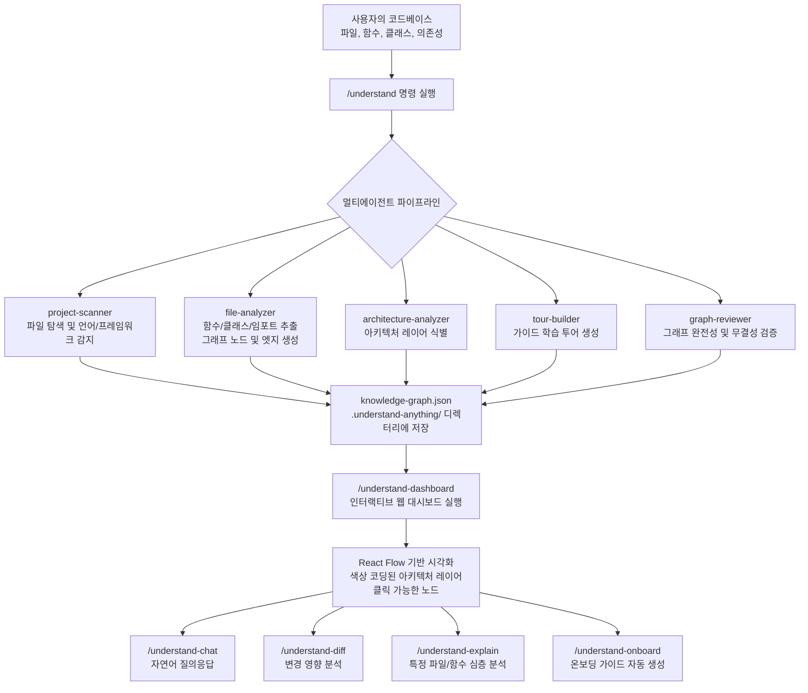
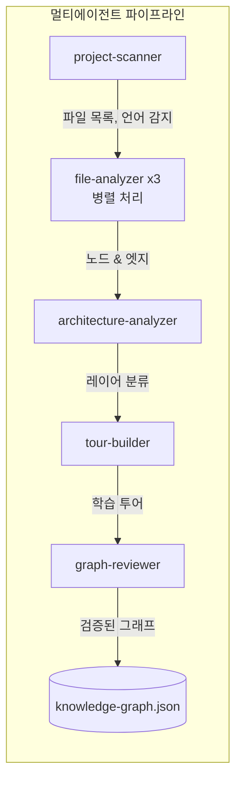
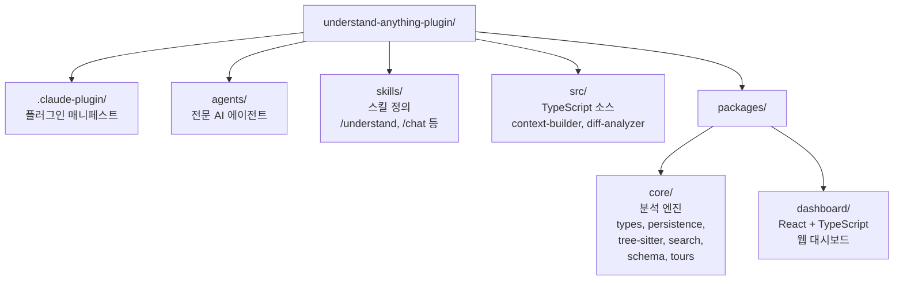
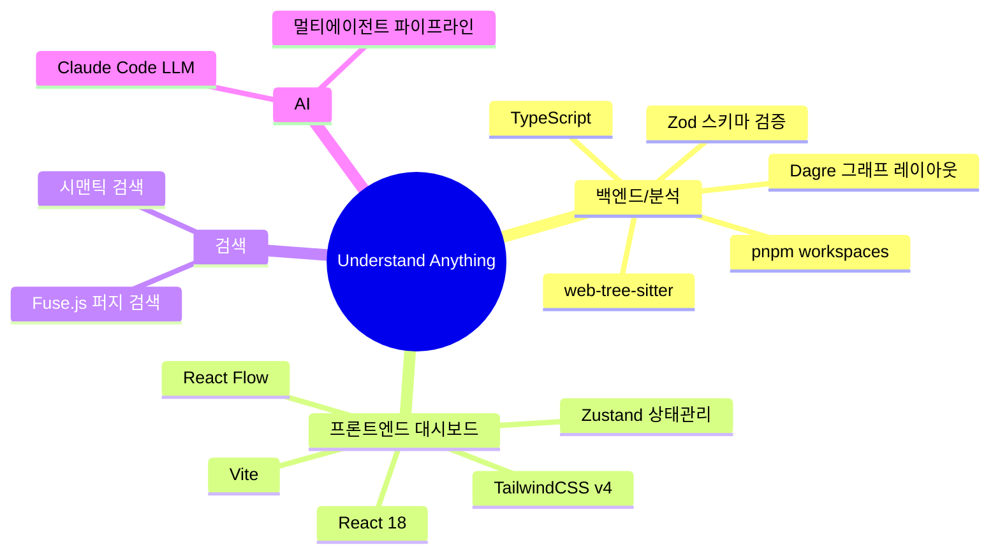
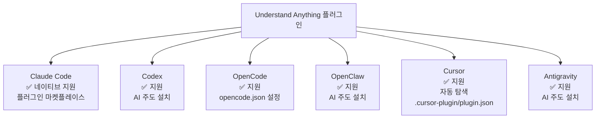
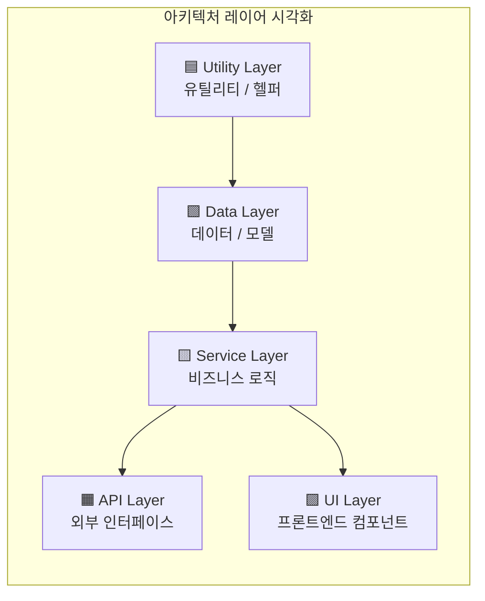
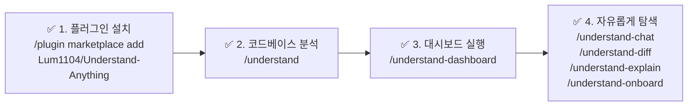
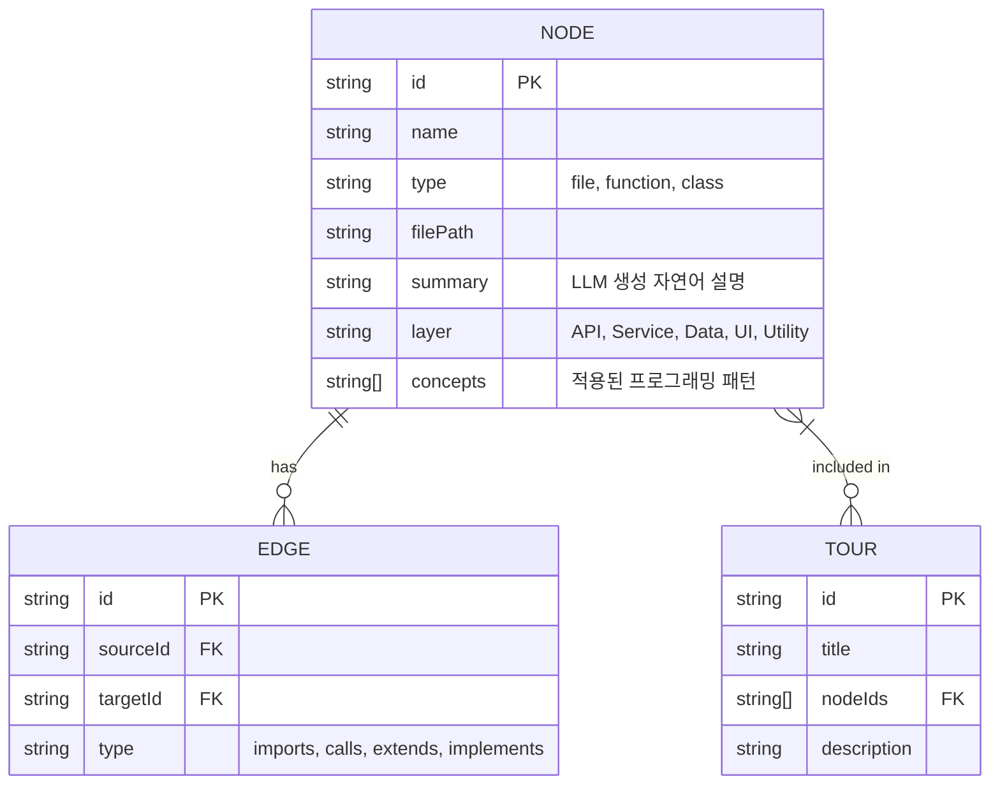

> **"코드를 읽는 시대는 끝났다. 이제는 코드베이스를 이해하는 시대다."**

---

## 📌 개요

**Understand Anything**은 Lum1104가 개발한 오픈소스 **Claude Code 플러그인**으로, 어떤 코드베이스든 **인터랙티브 지식 그래프(Interactive Knowledge Graph)** 로 변환해주는 도구입니다.

- 🔗 GitHub: https://github.com/Lum1104/Understand-Anything
- 📜 라이선스: MIT
- 💻 언어: TypeScript (98.4%), CSS (1.3%), HTML (0.3%)
- ⭐ Stars: 5 (2026년 3월 기준, 신규 프로젝트)

---

## 🎯 이 도구가 탄생한 배경

### 현실적인 문제

개발 현장에서 코드 이해는 항상 골칫거리였습니다.

> **"당신이 새 팀에 합류했습니다. 코드베이스는 200,000줄입니다. 어디서부터 시작하겠습니까?"**

이것이 Understand Anything이 해결하려는 핵심 문제입니다.

코드를 이해하는 것은 단순히 읽는 것 이상입니다. 전통적인 방식의 고통은 다음과 같습니다.

- **문서는 항상 오래됨**: 코드는 바뀌지만 문서는 따라가지 못합니다.
- **온보딩에 수 주 소요**: 신규 팀원이 프로젝트를 파악하는 데 보통 2~4주가 걸립니다.
- **새 기능 추가 = 고고학**: 기존 코드의 영향 범위를 파악하는 것이 마치 유물 발굴 같습니다.
- **LLM 도구의 맹점**: ChatGPT나 Claude에게 코드 질문을 해도 전체 맥락이 없어 답변이 부정확합니다.

### 해결책

Understand Anything은 **LLM 인텔리전스 + 정적 분석(Static Analysis)** 을 결합하여, 프로젝트의 살아있는 탐색 가능한 지도를 만들어냅니다. 모든 구성 요소에 자연어 설명이 포함됩니다.

---

## 🗺️ 전체 동작 흐름



---

## 🔧 핵심 명령어 완전 해설

### 1. `/understand` — 코드베이스 전체 분석

가장 기본이 되는 명령입니다. 실행하면 멀티에이전트 파이프라인이 가동되며 프로젝트 전체를 스캔합니다.

**처리 과정:**
- 모든 파일을 탐색하고 사용 언어 및 프레임워크를 자동 감지합니다.
- 각 파일에서 함수, 클래스, 임포트 구조를 추출합니다.
- 파일 분석기는 최대 3개가 병렬로 실행되어 처리 속도를 높입니다.
- 결과물은 `.understand-anything/knowledge-graph.json`에 저장됩니다.
- **증분 업데이트(Incremental Update)** 지원: 마지막 실행 이후 변경된 파일만 재분석하므로 대형 프로젝트에서도 빠릅니다.

### 2. `/understand-dashboard` — 인터랙티브 대시보드

지식 그래프를 시각적으로 탐색할 수 있는 웹 대시보드를 실행합니다.

**주요 기능:**
- **색상 코딩**: 아키텍처 레이어(API, Service, Data, UI, Utility)별로 색이 다릅니다.
- **클릭 탐색**: 노드를 클릭하면 해당 코드, 관계, 자연어 설명이 표시됩니다.
- **검색**: 이름 또는 의미로 퍼지 검색 및 시맨틱 검색 모두 지원합니다.
- **페르소나 적응형 UI**: 주니어 개발자, PM, 파워유저에 따라 상세 수준이 자동 조절됩니다.

### 3. `/understand-chat` — 자연어 질의응답

```
/understand-chat How does the payment flow work?
/understand-chat 인증 로직이 어디에 구현되어 있나요?
/understand-chat 이 서비스에서 데이터베이스 연결은 어떻게 관리되나요?
```

코드베이스 전반에 대해 자연어로 질문하면, LLM이 지식 그래프를 근거로 정확한 답변을 제공합니다. 일반적인 LLM과 달리, 실제 코드 구조에 기반한 답변이 가능합니다.

### 4. `/understand-diff` — 변경 영향 분석

현재 변경 사항이 시스템 전체에 어떤 영향을 미치는지 커밋 전에 미리 확인합니다.

**활용 시나리오:**
- 코드 리뷰 전 영향 범위 사전 파악
- 리팩토링 시 예상치 못한 사이드 이펙트 예방
- 의존성 체인을 따라 파급 효과(Ripple Effect) 시각화

### 5. `/understand-explain` — 특정 모듈 심층 분석

```
/understand-explain src/auth/login.ts
/understand-explain components/UserProfile.tsx
```

특정 파일이나 함수를 지정해 그 역할, 의존성, 사용 패턴을 상세히 설명받습니다.

### 6. `/understand-onboard` — 온보딩 가이드 자동 생성

신규 팀원을 위한 온보딩 문서를 자동으로 생성합니다. 아키텍처 개요부터 핵심 모듈 설명까지, 의존성 순서에 따라 학습 순서를 정렬해줍니다.

---

## 🏗️ 내부 아키텍처 심층 분석

### 멀티에이전트 파이프라인



| 에이전트 | 역할 | 주요 출력 |
|---------|------|----------|
| `project-scanner` | 파일 탐색, 언어/프레임워크 감지 | 파일 목록, 메타데이터 |
| `file-analyzer` | 함수, 클래스, 임포트 추출 | 그래프 노드 및 엣지 |
| `architecture-analyzer` | 아키텍처 레이어 식별 | 레이어 분류 정보 |
| `tour-builder` | 가이드 투어 생성 | 순서화된 학습 경로 |
| `graph-reviewer` | 완전성 및 무결성 검증 | 검증된 최종 그래프 |

### 프로젝트 구조



### 기술 스택



---

## 🎯 대상 사용자별 활용법

### 👩‍💻 주니어 개발자

**고통 포인트**: 낯선 코드에 압도되고, 어디서부터 시작해야 할지 모름.

**활용 방법:**
1. `/understand` 로 전체 스캔
2. `/understand-dashboard` 로 아키텍처 전체 그림 파악
3. `/understand-onboard` 로 단계별 학습 가이드 생성
4. 모르는 부분은 `/understand-explain 파일경로` 로 상세 설명 요청

### 📋 PM / 디자이너

**고통 포인트**: 코드를 읽지 않고도 시스템이 실제로 어떻게 동작하는지 이해하고 싶음.

**활용 방법:**
1. `/understand-chat "인증은 어떻게 동작하나요?"` 처럼 자연어로 질문
2. 대시보드에서 비기술적 설명(plain-English summaries)으로 시스템 파악
3. 기능 요청 전 `/understand-chat "이 기능을 추가하면 어떤 부분이 영향받나요?"` 확인

### 🤖 AI 활용 개발자

**고통 포인트**: AI 도구에 코드 맥락을 제대로 제공하지 못해 부정확한 답변을 받음.

**활용 방법:**
1. `/understand-diff` 로 코드 리뷰 전 영향 분석
2. `/understand-explain` 으로 특정 모듈 심층 이해
3. `/understand-chat` 으로 아키텍처 의사결정에 대한 질의응답

---

## 🌐 멀티플랫폼 지원

Understand Anything은 Claude Code에만 국한되지 않고 다양한 AI 코딩 플랫폼을 지원합니다.



### 플랫폼별 설치 방법

**Claude Code (네이티브)**
```bash
/plugin marketplace add Lum1104/Understand-Anything
/plugin install understand-anything
```

**Codex**
```
Fetch and follow instructions from 
https://raw.githubusercontent.com/Lum1104/Understand-Anything/refs/heads/main/.codex/INSTALL.md
```

**OpenCode** (`opencode.json` 수정)
```json
{
  "plugin": ["understand-anything@git+https://github.com/Lum1104/Understand-Anything.git"]
}
```

**Cursor**
- 저장소를 클론하면 `.cursor-plugin/plugin.json`을 통해 자동 탐색됨. 별도 설치 불필요.

**OpenClaw / Antigravity**
- 각 플랫폼의 INSTALL.md URL을 AI에게 전달하여 설치 진행.

---

## ✨ 주요 기능 상세

### 🗺️ 인터랙티브 지식 그래프

React Flow 기반으로 구현된 시각화 대시보드입니다. 파일, 함수, 클래스 및 그 관계가 그래프 형태로 표시됩니다. 노드를 클릭하면 해당 코드와 연결 관계, LLM이 생성한 자연어 설명이 함께 표시됩니다.

### 💬 자연어 설명 (Plain-English Summaries)

기술적이든 비기술적이든 누구나 이해할 수 있도록, 모든 코드 구성 요소에 LLM이 생성한 설명이 붙어 있습니다. "이 함수가 무엇을 하는가?" 같은 단순한 질문에도 즉시 답이 나옵니다.

### 🧭 가이드 투어

아키텍처의 의존성 순서에 따라 자동으로 학습 순서를 생성합니다. 핵심 기반 모듈부터 시작해 점진적으로 상위 레이어로 올라가며 코드베이스를 체계적으로 학습할 수 있습니다.

### 🔍 퍼지 & 시맨틱 검색

이름으로 검색(Fuse.js 기반 퍼지 검색)하거나 의미로 검색(시맨틱 검색)할 수 있습니다. `"auth 관련 부분이 어디 있지?"` 같은 자연어 검색도 지원합니다.

### 📊 Diff 영향 분석

현재 수정 중인 코드가 시스템 전체에 미치는 영향을 커밋 전에 미리 확인합니다. 파급 효과(Ripple Effect)를 그래프 위에 시각화해줍니다.

### 🎭 페르소나 적응형 UI

사용자 유형(주니어 개발자, PM, 파워유저)에 따라 대시보드의 상세 수준이 자동으로 조절됩니다. 같은 프로젝트라도 다른 시각으로 볼 수 있습니다.

### 🏗️ 레이어 시각화

코드를 자동으로 아키텍처 레이어로 분류합니다. API, Service, Data, UI, Utility 레이어를 색상으로 구분하여 전체 구조를 한눈에 파악할 수 있습니다.



### 📚 언어 개념 설명

제너릭(Generics), 클로저(Closures), 데코레이터(Decorators) 등 12가지 프로그래밍 패턴을 코드 문맥 안에서 설명해줍니다. 낯선 패턴을 만났을 때 즉시 개념을 이해할 수 있습니다.

---

## 🚀 빠른 시작 체크리스트



---

## 🔬 기술적 세부 사항

### 지식 그래프 구조



### 증분 업데이트 메커니즘

대규모 코드베이스에서 매번 전체를 재분석하는 것은 비효율적입니다. Understand Anything은 파일의 변경 타임스탬프를 추적하여 **마지막 실행 이후 변경된 파일만 재분석**합니다. 초기 분석 후 일상적인 개발 사이클에서는 매우 빠르게 지식 그래프를 최신 상태로 유지할 수 있습니다.

---

## 🆚 기존 도구들과의 비교

| 기능 | Understand Anything | 일반 문서 | IDE 코드 탐색 | 일반 LLM |
|-----|-----------------|---------|------------|---------|
| 전체 아키텍처 시각화 | ✅ | ❌ | ❌ | ❌ |
| 자연어 질의응답 | ✅ | ❌ | ❌ | ✅ (맥락 없음) |
| 코드 변경 영향 분석 | ✅ | ❌ | 부분적 | ❌ |
| 자동 온보딩 가이드 | ✅ | ❌ | ❌ | ❌ |
| 항상 최신 상태 유지 | ✅ (증분 업데이트) | ❌ | ✅ | N/A |
| 비기술 직군도 사용 가능 | ✅ | 부분적 | ❌ | 부분적 |

---

## 💡 실제 사용 시나리오

### 시나리오 1: 신규 팀원 온보딩

```
# 1. 전체 분석
/understand

# 2. 온보딩 가이드 생성  
/understand-onboard

# 3. 모르는 부분 질문
/understand-chat 이 프로젝트의 핵심 비즈니스 로직은 어디에 있나요?

# 4. 특정 모듈 심층 분석
/understand-explain src/core/engine.ts
```

### 시나리오 2: 버그 수정 전 영향 범위 파악

```
# 변경 사항을 만든 후
/understand-diff

# 영향받는 모듈 확인 후 관련 코드 이해
/understand-explain src/affected/module.ts
```

### 시나리오 3: 새 기능 설계

```
# 기존 아키텍처 파악
/understand-chat 현재 결제 시스템은 어떻게 구성되어 있나요?

# 추가할 위치 결정
/understand-chat 새 결제 수단을 추가하려면 어떤 파일을 수정해야 하나요?
```

---

## 📁 개발 환경 설정

```bash
# 저장소 클론
git clone https://github.com/Lum1104/Understand-Anything.git
cd Understand-Anything

# 의존성 설치
pnpm install

# 코어 패키지 빌드
pnpm --filter @understand-anything/core build

# 코어 테스트 실행
pnpm --filter @understand-anything/core test

# 플러그인 패키지 빌드
pnpm --filter @understand-anything/skill build

# 대시보드 빌드
pnpm --filter @understand-anything/dashboard build

# 대시보드 개발 서버 실행
pnpm dev:dashboard
```

---

## 🤝 기여 방법

1. 저장소를 Fork합니다.
2. 피처 브랜치를 생성합니다: `git checkout -b feature/my-feature`
3. 테스트를 실행합니다: `pnpm --filter @understand-anything/core test`
4. 변경 사항을 커밋하고 Pull Request를 엽니다.

주요 변경 사항은 사전에 Issue를 열어 논의하는 것을 권장합니다.

---

## 🔮 의의 및 전망

Understand Anything은 단순한 코드 분석 도구를 넘어, **코드베이스를 인간이 이해할 수 있는 지식으로 변환하는 새로운 패러다임**을 제시합니다.

- **AI 시대의 코드 이해**: LLM과 정적 분석의 결합으로 기존에 불가능했던 수준의 코드 이해가 가능해집니다.
- **민주화된 코드 접근성**: 개발자가 아닌 PM, 디자이너도 코드베이스를 이해할 수 있게 됩니다.
- **멀티플랫폼 확장성**: Claude Code 외에도 Codex, Cursor 등 다양한 플랫폼을 지원함으로써 광범위한 채택 가능성을 열어놓고 있습니다.

---

## 📎 참고 링크

- GitHub 저장소: https://github.com/Lum1104/Understand-Anything
- Claude Code 공식 문서: https://docs.anthropic.com/en/docs/claude-code
- 소개 트윗: https://x.com/_vmlops/status/2035174281475498139

---

*작성일: 2026년 3월 22일*  
*라이선스: MIT License © Lum1104*

> **"코드를 읽는 것을 멈추고, 모든 것을 이해하기 시작하세요."**
