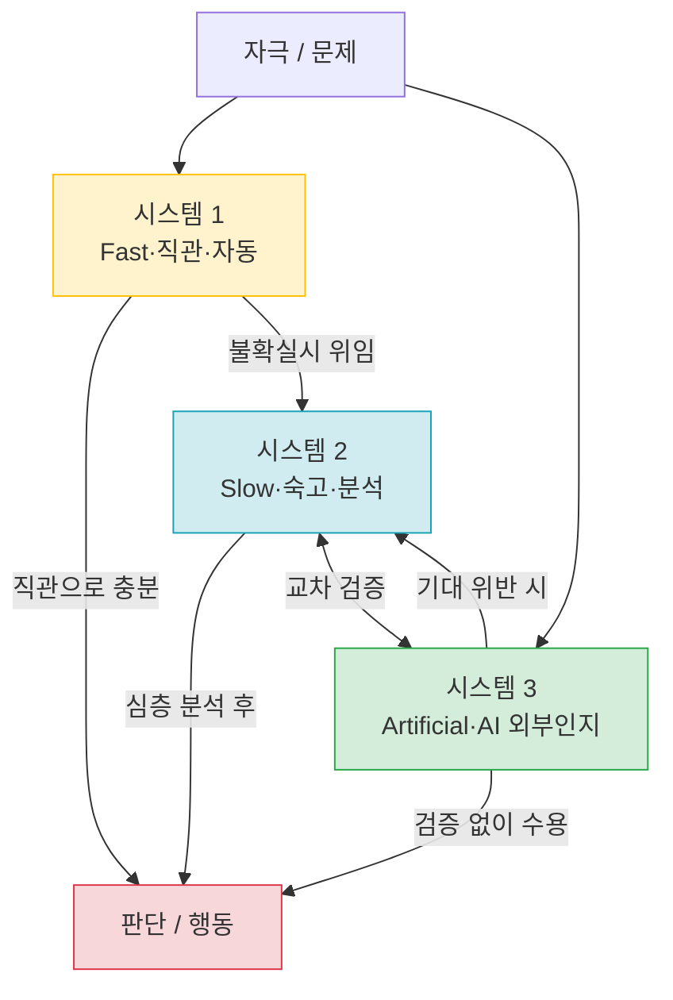
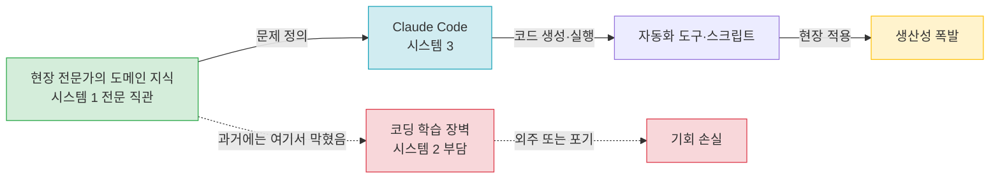
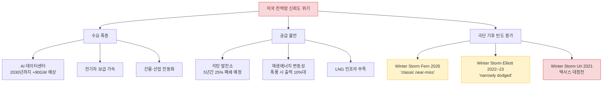
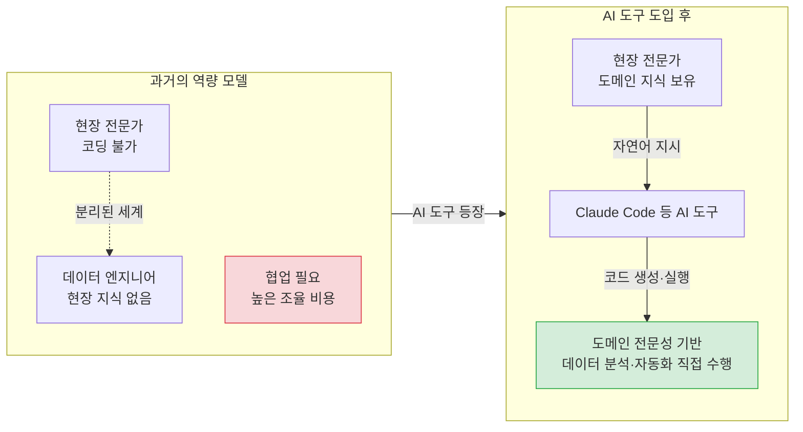
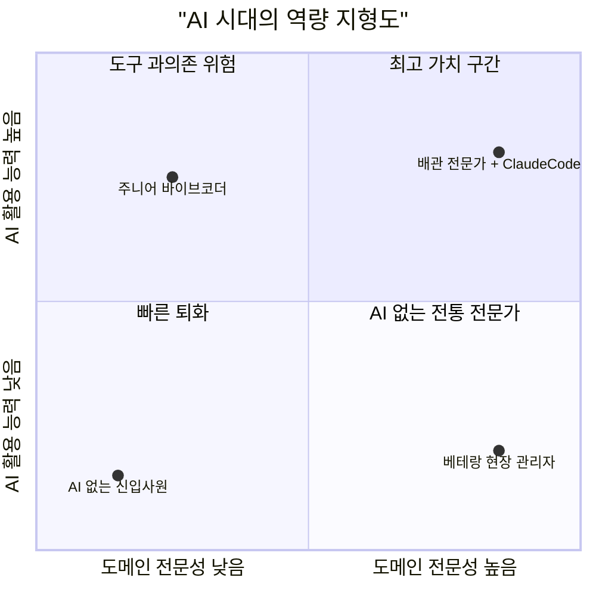
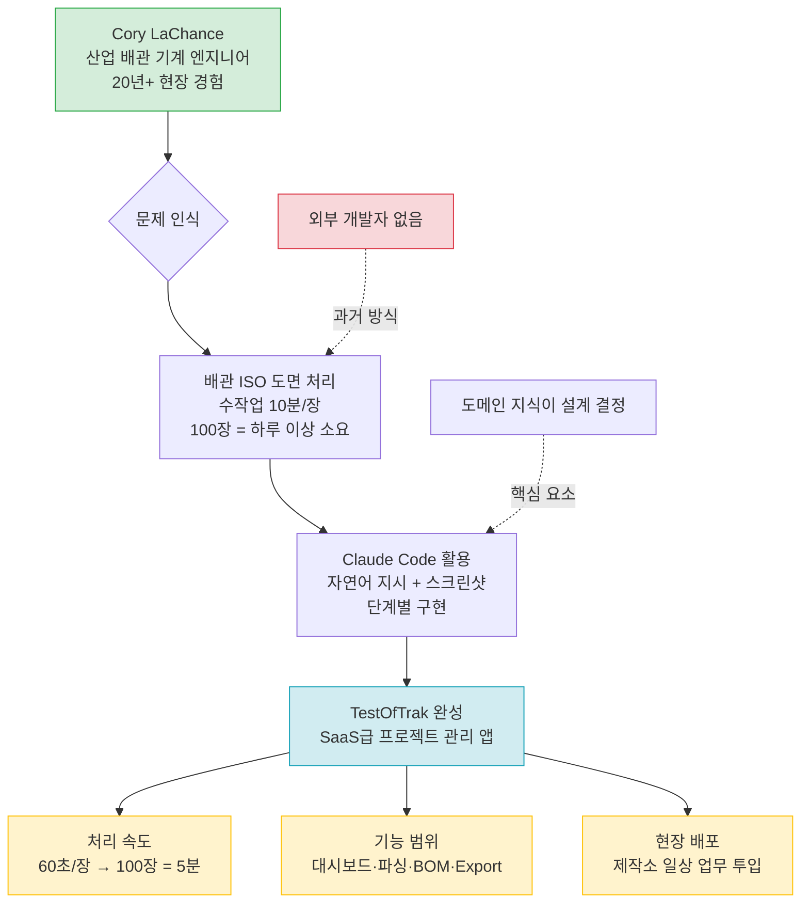

### AI·인지과학·에너지 인프라가 교차하는 2026년 봄의 세 가지 신호

> **작성 기준일**: 2026년 3월 22일  
> **핵심 출처**: Claude Code 바이럴 현상 (2026.03), SSRN 논문 *"Thinking—Fast, Slow, and Artificial"* (Shaw & Nave, Wharton, 2026.01), NERC 겨울 폭풍 Fern 경고 (2026.03)

---

## 목차

1. [서론: 세 개의 신호가 만나는 지점](#1-서론)
2. [배관공이 코드를 짠다 — Claude Code와 직업 경계의 붕괴](#2-배관공이-코드를-짠다)
3. [인지 외주화의 인지과학적 기반 — Tri-System Theory](#3-인지-외주화의-인지과학적-기반)
4. [인지 외주화의 양면: 증폭과 위축이 동시에 온다](#4-인지-외주화의-양면)
5. [에너지 그리드의 경고 — Winter Storm Fern과 NERC의 5단계 화재경보](#5-에너지-그리드의-경고)
6. [세 신호의 교차점 — 물리적 세계와 AI의 접속](#6-세-신호의-교차점)
7. [교육·직업 시장에 대한 함의](#7-교육과-직업-시장의-함의)
8. [결론: 인지의 지형도가 다시 그려지는 시대](#8-결론)
9. [별첨 A. Cory LaChance와 TestOfTrak — 바이럴 영상의 실체](#별첨-a-cory-lachance와-testoftrak--바이럴-영상의-실체)

---

## 1. 서론

2026년 3월, 거의 같은 시기에 세 개의 뉴스가 등장했다. 첫 번째는 산업용 배관 시공 전문가가 Claude Code라는 AI 코딩 도구를 현장 업무에 활용하는 영상이 X(구 트위터)에서 바이럴로 확산된 것이다. 두 번째는 펜실베이니아 대학교 와튼 스쿨의 Steven Shaw와 Gideon Nave가 SSRN에 공개한 논문 *"Thinking—Fast, Slow, and Artificial: How AI is Reshaping Human Reasoning and the Rise of Cognitive Surrender"* 다. 세 번째는 NERC(북미전력신뢰도위원회) 의장 Jim Robb이 2026년 1월 미국을 강타한 겨울 폭풍 Fern을 두고 "전형적인 아슬아슬한 고비(classic near-miss)"였다고 경고한 것이다.

이 세 뉴스는 표면적으로는 아무런 관계가 없어 보인다. 하나는 소셜미디어의 바이럴 영상이고, 하나는 학술 논문이며, 나머지 하나는 에너지 인프라 보고서다. 그러나 이것들은 동일한 구조적 변화의 서로 다른 단면이다. AI가 인간의 인지 능력을 재편하고, 그 재편이 어떤 직업에서는 역량 증폭으로, 어떤 맥락에서는 역량 위축으로 나타나며, 물리적 인프라라는 가장 구체적인 현실에서조차 이 변화가 얼마나 절박한 의미를 갖는지를 보여준다.

---

## 2. 배관공이 코드를 짠다

### 2.1 사건의 시작

2026년 3월 19일, 소셜미디어 X에서 한 편의 영상이 급속도로 확산됐다. 영상의 주인공은 소프트웨어 엔지니어가 아니다. 수십 년의 경력을 가진 산업용 배관 시공 전문가다. 그는 파이프를 자르고 용접하는 현장직이며, 컴퓨터 과학을 전공한 적도 없다. 그런데 그가 하는 일은 자동화 스크립트 작성, 자재 계산 도구 구축, 현장 데이터 정리였다. 6개월 전이라면 외부 개발자에게 외주를 주거나 엑셀로 반나절을 쏟아야 했을 작업들이다.

그가 사용한 도구는 Anthropic이 만든 Claude Code다. 사용자가 자연어로 원하는 것을 설명하면, Claude Code는 터미널 환경에서 코드를 직접 작성하고, 파일을 읽고 쓰고, 명령어를 실행하며 실제 결과물을 만들어낸다. 조언이나 코드 스니펫을 제공하는 기존의 챗봇과 달리, Claude Code는 말 그대로 "대신 만들어준다."

### 2.2 Claude Code가 특별한 이유

Claude Code는 2024년 5월 Anthropic이 처음 출시했을 때, 개발자용 보조 도구로 기획됐다. 그러나 사용자들이 이것을 단순한 코딩 도우미가 아니라 범용 에이전트로 사용하기 시작하면서 그 위상이 달라졌다. Fortune의 2026년 1월 보도에 따르면, Claude Code로 세금 신고를 하는 사람, 극장 티켓을 예약하는 사람, 심지어 토마토 식물 모니터링 시스템을 구축하는 사람까지 등장했다.

NVIDIA의 CEO 젠슨 황은 Claude Code를 "놀랍다"고 표현하며 기업들이 코딩에 도입할 것을 촉구했다. 구글의 한 시니어 엔지니어는 Claude Code가 1년치 작업량을 1시간 만에 재현했다고 말했다. Anthropic은 Claude Code가 공개 GitHub 커밋의 4%를 차지하고 있다고 밝혔으며, Anthropic 영업팀의 절반이 매주 이를 사용한다고 전했다.

이 모든 것이 가리키는 방향은 하나다. Claude Code는 코딩 도구가 아니라 인간의 의도를 디지털 실행으로 변환하는 의도 실행 엔진(intent execution engine)이다. 그리고 배관 전문가의 사례는 그 엔진을 손에 쥐는 것이 어떤 의미인지를 가장 극적으로 보여준다.

### 2.3 "바이브 코딩"이라는 새로운 범주

이 현상에는 이름이 붙었다. "바이브 코딩(vibe coding)"이다. 사용자가 원하는 것의 분위기(vibe)를 자연어로 설명하면, AI가 구체적인 코드 구현을 담당하는 방식이다. 코드의 문법을 알 필요도, 디버깅 방법을 배울 필요도 없다. Anthropic은 이 수요를 포착해 2026년 1월 Cowork라는 비개발자용 제품을 출시했다. Cowork는 스크린샷 더미에서 새 스프레드시트를 만들고, 어수선한 다운로드 폴더를 정리하며, 흩어진 메모에서 보고서 초안을 작성하는 기능을 제공한다.

Anthropic의 Claude Code 헤드 보리스 체르니는 Cowork 자체를 Claude Code로 약 열흘 만에 만들었다고 밝혔다. "우리는 제품과 아키텍처 결정을 내리는 데 더 많은 시간을 쏟았고, 개별 코드 라인을 작성하는 데는 그렇지 않았다"는 것이 그의 설명이다.

---

## 3. 인지 외주화의 인지과학적 기반

### 3.1 Kahneman의 이중 처리 이론

배관 전문가의 영상이 단순한 바이럴로 끝나지 않는 이유는, 이것이 깊은 인지과학적 함의를 갖기 때문이다. 이 함의를 정면으로 다룬 것이 2026년 초 SSRN에 등재된 논문 *"Thinking—Fast, Slow, and Artificial"* 이다.

이 논문을 이해하려면 먼저 다니엘 카너먼(Daniel Kahneman)의 이중 처리 이론(Dual-Process Theory)을 알아야 한다. 카너먼은 2011년 저서 *생각에 관한 생각(Thinking, Fast and Slow)* 에서 인간의 사고를 두 가지 시스템으로 구분했다.

- **시스템 1 (System 1)**: 빠르고, 자동적이며, 직관적인 사고. 큰 소리에 움찔하거나, 정지 표지판을 읽거나, "2+2"에 즉각 답하는 것처럼 의식적 노력 없이 작동한다.
- **시스템 2 (System 2)**: 느리고, 숙고적이며, 분석적인 사고. 17×24를 암산하거나, 보험 약관을 비교하거나, 복잡한 논리 문제를 푸는 것처럼 의식적 노력이 필요하다.

인간은 "인지적 구두쇠(cognitive miser)"다. 가능하면 시스템 2의 에너지 소모를 피하고 시스템 1에 의존하려는 경향이 있다. 이 이론은 50년 넘게 심리학과 행동경제학의 기반으로 작동해왔다.

### 3.2 시스템 3의 등장: Tri-System Theory

Shaw와 Nave는 이 프레임워크에 근본적인 문제를 제기한다. 이중 처리 이론은 모든 인지가 생물학적 뇌 안에서 발생한다고 가정한다. 그러나 ChatGPT와 같은 생성형 AI가 등장한 이후, 그 가정은 더 이상 유효하지 않다.

이들은 **시스템 3(System 3)** 을 제안한다: 뇌 외부에서 작동하는 인공 인지(artificial cognition). 시스템 3는 내부 인지 과정을 보완하거나 대체하며, 새로운 인지 경로를 열어준다. 이 세 시스템의 관계를 도식화하면 다음과 같다.

### 3.3 인지 항복 (Cognitive Surrender)

이 이론의 핵심 예측이 바로 **"인지 항복(Cognitive Surrender)"** 이다. AI의 출력이 빠르고, 유창하며, 권위 있어 보일 때, 사람들은 시스템 2의 숙고 과정을 건너뛰고 그 답을 그대로 채택한다. 말하자면, AI가 시스템 1처럼 작동하여 비판적 검토 없이 출력이 수용되는 상태다.

Shaw와 Nave는 이를 세 개의 사전 등록 실험(N = 1,372명, 총 9,593회의 시행)으로 검증했다. 실험 방법은 수정된 인지 반응 테스트(Cognitive Reflection Test)를 활용하고, AI의 정확도를 숨겨진 시드 프롬프트로 무작위 조작하는 방식이었다. 결과는 명확했다.

- 참가자들은 **50% 이상의 시행에서 AI에 자문**을 구하는 것을 선택했다.
- AI가 정확할 때: 기준 대비 정확도 **+25%포인트** 향상.
- AI가 오류를 낼 때: 기준 대비 정확도 **-15%포인트** 하락.
- AI가 오류를 낼 때도 **자신감은 오히려 높아졌다**. 이것이 인지 항복의 핵심 위험이다.

연구자들은 시간 압박이나 인센티브 같은 상황 변수를 도입해도 이 패턴이 사라지지 않는다는 것을 확인했다. 개인 차이에서는, AI에 대한 신뢰가 높고, 인지 욕구(Need for Cognition)가 낮으며, 유동 지능(fluid intelligence)이 낮을수록 인지 항복 경향이 강했다.

---

## 4. 인지 외주화의 양면

### 4.1 밝은 면: 도메인 전문성의 지렛대 효과

배관 전문가의 사례로 돌아가자. 그가 Claude Code를 사용할 때, 그는 무엇을 하고 있는가?

그는 코딩의 시스템 2적 부담 — 문법 오류, 논리 구조 설계, 디버깅, 라이브러리 선택 — 을 AI에 위임한다. 그리고 자신의 20년 현장 경험이 담긴 도메인 전문성 — 어떤 계산이 필요한지, 어떤 데이터가 현장에서 실제 의미를 갖는지, 어떤 오류가 치명적인지 — 에 자신의 인지 자원을 집중한다.

그는 프로그래밍을 "배운" 것이 아니다. 프로그래밍의 인지 비용을 우회한 것이다. 그 결과, 그는 주니어 개발자가 아니라 **도메인 전문성으로 무장한 자동화 설계자**가 된다.

이것은 Tri-System Theory의 언어로 표현하면, 시스템 3가 시스템 2를 대행함으로써 시스템 1(수십 년 현장 경험에서 오는 직관적 전문성)의 지렛대 효과를 극대화하는 상태다.

이 구조에서 경쟁 우위는 코딩 능력이 아니다. **"무엇을 만들어야 하는지 아는 것"**, 즉 도메인 지식과 문제 정의 능력이다.

### 4.2 어두운 면: 인지 근육의 퇴화

그러나 동일한 구조가 반대 방향으로 작동할 때 위험이 발생한다. AI가 분석적 사고를 대행할수록, 인간은 그 사고 근육을 덜 쓰게 된다. 시간이 지나면 AI 없이는 기본적인 논리 전개조차 어려워지는 **의존 구조**가 형성된다.

Shaw와 Nave는 이를 두 가지 차원의 손실로 설명한다.

첫째, **인지 오프로딩(cognitive offloading)** 의 문제다. 단순히 AI에게 계산을 맡기는 것은 계산기에 암산을 맡기는 것과 유사하다. 특정 기능이 퇴화하지만, 언제 어떻게 사용할지를 아는 메타 지식은 유지될 수 있다.

둘째, **인지 항복(cognitive surrender)** 의 문제다. 인지 항복은 단순 오프로딩보다 훨씬 심각하다. AI가 틀렸을 때도 그 오류를 걸러낼 비판적 능력이 함께 퇴화하기 때문이다. 결과적으로, 잘못된 답을 더 많이 통과시키게 되고(정확도 하락), 그 답이 틀렸음을 점검하는 능력 자체를 잃게 된다(검토 능력 하락).

The Algorithmic Bridge는 이것을 "자동화 중에서도 가장 극단적인 형태"라고 표현했다. AI 출력을 시스템 2 수준에서 수용하는 것(신중한 숙고 후 채택)과 시스템 1 수준에서 수용하는 것(직관 뇌조차 개입시키지 않고 채택) 사이에는 엄청난 차이가 있다.

이 차이를 만드는 것이 사용자의 **AI에 대한 신뢰 수준**과 **인지 욕구(얼마나 열심히 생각하기를 즐기는가)** 다.

### 4.3 계산기와의 비교, 그리고 차이

이 현상을 계산기가 암산 능력을 퇴화시킨 것에 비유하는 것은 부분적으로는 적절하다. 그러나 규모와 속도가 근본적으로 다르다.

계산기는 산수 하나를 대체했다. LLM은 **추론·작문·설계·코딩을 동시에** 대체한다. 계산기의 도입에는 수십 년이 걸렸지만, AI의 확산은 몇 년 안에 이루어지고 있다. 그리고 계산기는 사용자에게 옳고 그름을 직접 알려주지 않았지만, AI는 자신감 있는 어조로 오류를 제공한다.

---

## 5. 에너지 그리드의 경고

### 5.1 Winter Storm Fern — "전형적인 아슬아슬한 고비"

2026년 1월 말, 겨울 폭풍 Fern이 미국 전역을 강타했다. 폭풍은 남부 애팔래치아 산맥에서 캐롤라이나, 버지니아 남부 전역에 걸쳐 광범위한 눈과 강풍을 쏟아부었다.

NERC(북미전력신뢰도위원회) 의장이자 CEO인 Jim Robb은 이후 미국 의회 청문회에서 다음과 같이 증언했다.

> "시스템은 오류를 허용할 여지 없이 한계선에서 작동했습니다. 운영자들은 모든 가용 도구를 동원해야 했고, 정부의 비상 조치가 중요한 역할을 했습니다. Fern은 우리의 장기 평가 보고서에서 지적한 우려들을 다시 한번 강화하는, 전형적인 아슬아슬한 고비(classic near-miss) 사건이었습니다."

실제로 DOE는 1월 24일부터 26일까지 ERCOT(텍사스), PJM, ISO New England, NYISO, Duke Energy 등에 8개의 긴급 명령을 발동했다. 이는 대기환경 제한에 관계없이 발전 설비를 최대 출력으로 운전하고, 에너지 비상사태 선언 직전 최후 수단으로 데이터센터 백업 발전기를 활성화하도록 허가하는 조치였다.

### 5.2 삼중 압박: 노후화·극단 기후·AI 수요 급증

NERC의 2025년 장기 신뢰도 평가(LTRA, 2026~2035 전망)는 암울한 그림을 그린다. 전력 수요는 폭발적으로 증가하는 반면, 공급은 이를 따라가지 못하고 있다. 북미 전력망이 처한 압박은 세 겹이다.

**첫 번째 압박: 수요 폭증**

NERC의 LTRA에 따르면, 2025년도 평가 대비 여름 최대 수요 전망치는 69%, 겨울 최대 수요 전망치는 65%나 증가했다. NERC은 이것이 "1995년 추적 시작 이래 최고의 연간 성장률"이라고 밝혔다. 수요 급증의 핵심 원인은 AI 데이터센터다. NERC은 2030년까지 데이터센터 부하만으로 90GW가 추가될 것으로 전망했다.

**두 번째 압박: 공급 불안**

미국 석탄 발전소의 4분의 1 이상이 향후 5년 내 폐쇄될 예정이며, 대부분은 NERC이 고위험 지역으로 분류한 지역에 위치한다. 반면, 풍력과 태양광은 고정 출력이 아니라 날씨에 의존한다. 폭풍 Fern이 최고조에 달했던 1월 25일, 미국 전역에서 풍력·태양광이 설비 용량의 30%를 차지함에도 실제 발전량은 전체의 10%에 불과했다.

**세 번째 압박: 극단 기후**

겨울 폭풍 Uri(2021), Elliott(2022~23), Fern(2026)으로 이어지는 패턴은 극단 기후 사건의 빈도와 강도가 증가하고 있음을 보여준다. 각각의 사건에서 전력망은 한계에 몰렸고, "아슬아슬하게 회피"하는 상황이 반복됐다.

### 5.3 NERC의 "5단계 화재경보"

NERC의 Jim Robb은 2026년 2월 FERC(연방에너지규제위원회) 회의에서 한층 더 강한 언어를 사용했다.

> "전력망의 신뢰도는 여전히 매우 높습니다. 그러나 역설적으로, 신뢰도에 대한 리스크는 계속 증가하고 있습니다. 우리는 소규모 사건과 아슬아슬한 고비가 점점 더 많아지는 것을 목격하고 있으며, 이를 신뢰도에 관한 5단계 화재경보(five-alarm fire) 이외의 다른 무엇으로도 부를 수 없습니다."

NERC의 23개 북미 평가 지역 중 13개가 향후 5년 내 공급 부족의 고위험 또는 상승위험에 처해 있다. 고위험 지역에는 MISO, PJM, ERCOT(텍사스), WECC 서북부와 베이슨, SERC 중부 지역이 포함된다.

---

## 6. 세 신호의 교차점

### 6.1 물리적 인프라와 AI의 접속

배관 전문가가 Claude Code를 쓰는 영상과 NERC의 그리드 경고는 서로 다른 세계의 이야기처럼 보이지만, 이 둘을 연결하면 강력한 함의가 나온다.

에너지 전환과 그리드 관리는 대표적인 **물리적 도메인 전문성이 필수인 영역**이다. 발전소 운영, 송배전망 유지보수, 신재생 설비 시공, 수요 예측, 부하 분산 — 이 모든 영역에서 현장 경험은 대체 불가하다. 그러나 동시에, 실시간 데이터 분석, 예측 모델링, 이상 징후 탐지, 자동화 스크립팅 같은 디지털 역량도 점점 더 중요해지고 있다.

과거에는 이 두 역량을 한 사람이 모두 갖추기가 거의 불가능했다. 현장 전문가는 코딩을 모르고, 데이터 엔지니어는 전력망의 물리적 작동 원리를 모른다. 여기서 AI 코딩 도구가 작동하는 방식은, 배관 전문가의 사례와 정확히 같다.

**현장 전문가 + AI 코딩 도구 = 도메인 전문성으로 무장한 데이터 분석가**

이것은 고립된 에피소드가 아니라, 물리적 인프라 영역 전반에서 시작된 기술 채택 파도의 초기 신호다.

### 6.2 역량 격차의 새로운 축

폭풍 Fern 같은 위기 상황에서 실시간 데이터를 분석하고 대응 시나리오를 시뮬레이션하는 능력은, 이제 코딩 전공자의 전유물이 아니다. AI 도구를 손에 쥔 현장 관리자라면 누구든 이 역량을 갖출 수 있는 시대가 열리고 있다.

그러나 동시에, 이 역량을 갖추지 못한 현장 관리자와 갖춘 관리자 사이의 격차는 과거 어느 때보다 빠르게 벌어질 것이다. 핵심은 AI 도구를 아는가, 모르는가의 문제가 아니다. **자신의 도메인에서 무엇을 만들어야 하는지 알고, AI를 그 실행 엔진으로 사용할 수 있는가**의 문제다.

---

## 7. 교육과 직업 시장의 함의

### 7.1 코딩 교육의 가치 재평가

이 구조적 변화가 교육 시장에 던지는 질문은 명확하다. "코딩을 가르치는 교육"은 AI가 시스템 2를 대행하는 세상에서 어떤 가치를 갖는가?

답은 일의적이지 않다. 코딩 교육이 모두 가치를 잃는 것은 아니다. 그러나 그 가치의 성격이 달라진다.

- **가치가 유지되거나 증가하는 부분**: AI 시스템 자체를 설계·구축·유지하는 역량. 보안 취약점을 이해하고 대응하는 역량. AI 출력의 오류를 탐지하고 수정하는 역량. 즉, AI 위에서 작동하는 메타 역량.
- **가치가 빠르게 하락하는 부분**: 문법 암기, 반복적인 CRUD 작업, 표준 알고리즘 구현. 이것들은 이미 AI가 더 빠르고 정확하게 수행한다.

반면, 가치가 폭증하는 교육의 범주가 있다. **"AI를 도구로 써서 자기 도메인의 문제를 해결하는 방법을 가르치는 교육"** 이다. 배관, 전력, 의료, 법률, 회계 — 어떤 도메인이든, 해당 분야의 문제를 AI로 해결하는 방법을 아는 사람은 전에 없던 역할을 맡게 된다.

### 7.2 새로운 역량 지형도

Shaw와 Nave의 연구가 제안하는 위험 요소를 고려하면, 가장 위험한 상태는 다음 두 극단이다.

**극단 1 — AI 없는 전통 전문가**: 도메인 지식은 있지만 AI를 활용하지 않는다. 경쟁 우위가 빠르게 잠식된다. AI를 쓰는 동료나 경쟁자에 비해 생산성이 현격히 떨어진다.

**극단 2 — AI만 믿는 비전문가**: 도메인 지식 없이 AI 출력을 무비판적으로 수용한다. 인지 항복의 전형적 피해자다. AI가 오류를 낼 때 이를 검증할 능력이 없다. 그리고 AI가 자신감 있는 어조로 오류를 제공한다는 점을 기억해야 한다.

가장 높은 가치를 창출하는 상태는 중간이다. **도메인 전문성을 유지하면서 AI를 실행 엔진으로 활용하고, AI 출력을 도메인 지식으로 검증하는 사람**. 이것이 배관 전문가의 바이럴 영상이 보여준 것이다.

### 7.3 인지적 건강을 위한 원칙

Shaw와 Nave의 연구는 AI 사용을 금지하는 방향으로 흘러가지 않는다. 오히려, **AI를 어떻게 사용할 것인가**에 대한 원칙을 제안한다.

첫째, **시스템 2를 꺼버리지 말 것**. AI 출력을 받은 뒤에도 "이것이 맞는가?"를 한 번 더 생각하는 습관을 유지해야 한다. 특히 중요한 결정일수록.

둘째, **AI 신뢰를 교정할 것**. AI가 자신감 있게 제공한 답이라도 틀릴 수 있다. 연구에 따르면 AI가 틀렸을 때도 사용자는 자신감이 높아지는 경향이 있다. 이 역설을 인식하는 것이 출발점이다.

셋째, **도메인 지식을 유지할 것**. AI를 쓴다고 해서 기초 지식을 버려서는 안 된다. 기초 지식은 AI 출력을 검증하는 유일한 수단이다.

---

## 8. 결론

### 8.1 세 신호가 그리는 큰 그림

배관 전문가의 Claude Code 영상, Shaw와 Nave의 Tri-System Theory 논문, NERC의 폭풍 Fern 경고는 각기 다른 언어로 같은 이야기를 한다.

AI는 인간의 인지 자원 배분 구조를 바꾸고 있다. 이 변화는 현장 전문가가 코딩 장벽을 넘을 수 있게 해주는 것처럼 놀라운 역량 증폭을 가능하게 한다. 동시에, AI 출력을 검증 없이 수용하는 인지 항복이라는 조용한 위험을 낳는다.

물리적 인프라의 위기—전력망이 한계선에서 운영되고, 극단 기후는 더 자주, 더 강하게 온다—는 이 변화가 얼마나 현실적이고 긴박한 함의를 갖는지 보여준다. AI 도구를 활용하는 현장 인력과 그렇지 않은 현장 인력 사이의 역량 격차는 앞으로 더 빠르게 벌어질 것이다.

### 8.2 질문으로 남겨두는 것들

그러나 이 글은 몇 가지 질문을 열린 채로 남긴다.

- AI 코딩 도구가 보편화될수록, 도메인 전문성 그 자체의 가치는 어떻게 변화할 것인가?
- 인지 항복의 장기적 누적 효과는 어느 시점에서 측정 가능한 형태로 나타날 것인가?
- 전력망의 AI 수요가 AI 도구의 확산을 가속하고, 그 AI 도구가 전력망 관리에 다시 적용되는 이 루프는 어떻게 통제될 것인가?

2026년의 봄은, 그 답들이 서서히 모습을 드러내기 시작하는 시기다.

---

## 참고 자료

| 출처 | 내용 | 날짜 |
|------|------|------|
| Shaw, S.D. & Nave, G. (SSRN) | *Thinking—Fast, Slow, and Artificial: How AI is Reshaping Human Reasoning and the Rise of Cognitive Surrender* | 2026.01.11 |
| Utility Dive | *January's Winter Storm Fern was 'classic near-miss' for US grid, says NERC* | 2026.03.20 |
| Just The News | *Democrats signal retreat from 100% renewable push amid reliability concerns* | 2026.03 |
| Fortune | *Claude Code gives Anthropic its viral moment* | 2026.01.24 |
| NERC | *2025 Long-Term Reliability Assessment (LTRA 2026–2035)* | 2026.01.29 |
| Power Magazine | *NERC warns long-term grid reliability risks mounting* | 2026.01 |
| The Algorithmic Bridge | *A New Wharton Study on AI Warns of a Growing Problem: Cognitive Surrender* | 2026.02 |
| Polymath Mind (Substack) | *Fast, Slow… and Now Artificial* | 2026.03 |
| SaaSCity | *10 Wildest Claude Code Projects Going Viral Right Now* | 2026.02 |
| GeekWire | *'A new era of software development': Claude Code has Seattle engineers buzzing* | 2026.01.16 |

---

*본 문서는 공개된 뉴스, 논문, 보고서를 기반으로 작성되었으며, 특정 정치적 입장을 대변하지 않습니다.*

---

## 별첨 A. Cory LaChance와 TestOfTrak — 바이럴 영상의 실체

### A.1 당사자는 누구인가

본 문서 전체를 관통하는 "배관 전문가의 Claude Code 활용" 사례의 실제 주인공은 **Cory LaChance**다. 그는 텍사스 휴스턴을 기반으로 활동하는 산업용 배관 시공 분야의 기계 엔지니어(Mechanical Engineer)로, 주요 고객은 화학 플랜트와 정유 시설이다. 이 사실을 X(구 트위터)에서 처음 공개적으로 소개한 것은 Todd Saunders([@toddsaunders](https://twitter.com/toddsaunders/status/2034243420147859716))로, 그는 Cory와의 대화를 녹화해 2026년 3월 19일 13분 45초 분량의 인터뷰 영상으로 공개했다.

Todd Saunders의 원문 게시물은 다음과 같이 시작한다.

> *"나는 실리콘밸리 스타트업들이 이 말을 듣고 싶지 않을 것이라는 걸 알지만... 깊은 도메인 전문성을 가진 현장 전문가와 Claude Code의 조합은 당신들의 범용 소프트웨어를 압도할 것입니다."*

### A.2 그가 만든 것: TestOfTrak

Cory가 구축한 애플리케이션의 이름은 **TestOfTrak**이다. 이름에서 알 수 있듯, 산업 배관 프로젝트의 테스트 패킷(Test Packet) 추적 및 관리를 위한 도구다. 이 앱이 다루는 문제는 매우 구체적이다.

산업 배관 시공 현장에서는 수백 장의 **배관 아이소메트릭 도면(Piping Isometric Drawing)** 을 처리해야 한다. 이 도면에는 각 파이프 구간의 용접 개수, 자재 사양, 코모디티 코드(Commodity Code), 볼트·개스킷·밸브 등의 부품 정보가 담겨 있다. 이것을 한 장씩 수작업으로 읽어 BOM(Bill of Materials, 자재 명세서)으로 변환하는 작업은 도면 한 장당 평균 10분이 소요됐다. 하루에 수십 장을 처리해야 하는 현장에서는 며칠치 분량의 작업이 된다.

TestOfTrak은 이 과정을 자동화한다. 도면 PDF를 업로드하면, AI가 도면을 파싱하여 용접 위치, 자재 목록, 스펙 코드를 자동으로 추출하고 데이터베이스에 저장한다. 처리 시간은 도면 한 장당 60초, 100장을 5분 만에 처리할 수 있다.

### A.3 앱 화면으로 본 기능 구성

영상에서 공개된 스크린샷은 이 앱이 단순한 스크립트나 프로토타입이 아닌, 실무 투입 수준의 소프트웨어임을 보여준다. 화면별 기능은 다음과 같다.

**대시보드 (프로젝트 개요)**

메인 화면에는 Active Jobs 수, Pending QA 항목, 파이프라인 상태, 최근 활동 타임라인이 한눈에 표시된다. 파이프라인은 New → In Progress → Submitted → Won의 단계로 나뉘며, 각 단계별 Job 수가 실시간으로 표시된다. 우측 Recent Activity 피드에는 어떤 도면 파일이 언제 업로드되고 처리됐는지가 기록된다. 이 화면만 보면 일반적인 프로젝트 관리 SaaS와 구분이 되지 않는다.

**Job 상세 페이지 (라인 리스트 및 파일 관리)**

개별 프로젝트(Job) 페이지에서는 업로드된 ISO 도면 파일 목록, 각 도면의 처리 상태(Complete 표시), 라인 번호, Spool 수, Materials 수를 한 번에 확인할 수 있다. 탭 구조는 ISOs, Line List, Export, Details로 나뉘며, Upload Line List 및 Upload Testing Schedule 기능도 포함돼 있다.

**도면 파싱 화면 — 핵심 기능**

이 앱의 기술적 핵심이 드러나는 화면이다. 업로드된 ISO 도면이 시각적으로 렌더링되며, 파이프 경로 위에 용접 위치(파란 점)와 기타 기자재 위치(주황 점)가 자동으로 마킹된다. 화면 우측 패널에는 파싱된 데이터가 구조화되어 표시된다.

- **Base Material**: 파이프 재질 (예: SS 316/316L)
- **Shop Supports**: 용접 지지대 정보
- **Weld Summary**: 용접 총 수량
- **Field Weld Summary**: 현장 용접 수량

이 파싱 작업의 난이도는 겉으로 보이는 것보다 훨씬 높다. 배관 아이소메트릭 도면에는 산업 표준 기호 체계(ASME, ANSI 등)가 사용되며, 어떤 기호가 어떤 부품을 의미하는지는 현장 경험 없이는 정확히 판단할 수 없다. AI가 도면을 파싱할 수 있게 된 것은 맞지만, **무엇을 어떻게 추출하라고 설계한 것은 Cory의 도메인 지식**이다.

**Export 화면**

추출된 자재 목록은 다양한 포맷으로 내보낼 수 있다. Field Material, Panel, Insulation 등 카테고리별 필터가 가능하며, "Download Annotated PDFs" 버튼을 통해 도면 위에 추출된 정보가 마킹된 PDF를 생성할 수 있다. 또한 "Download Clean PDF" 기능으로 깔끔한 BOM 리포트도 출력된다.

### A.4 개발 과정에 대한 Cory의 직접 언급

인터뷰에서 Cory는 개발 과정에 대해 다음과 같이 말했다.

> *"저는 말 그대로 AI 외의 외부 도움 없이 이것을 만들었습니다. 제가 가장 즐겨 쓰는 방법은 스크린샷, 단계별 지시, 그리고 다섯 살짜리에게 설명하듯 물어보는 것입니다."*

그는 Claude Code를 "거의 1년 전부터" 사용해왔다고 밝혔다. 이 발언은 일부 커뮤니티에서 "8주 만에 제로 베이스로 만들었다"는 소개와 모순된다는 비판을 낳기도 했다. 그러나 이 논란은 사실 사안의 본질과는 거리가 있다. 중요한 것은 그가 AI 도구에 얼마나 빨리 익숙해졌느냐가 아니라, **현장 지식을 바탕으로 어떤 문제를 풀어야 하는지 정확히 알고 있었다**는 점이다.

그의 동료들은 이 앱을 보고 "다른 언어로 대화하는 것 같았다"고 반응했다. 이것이야말로 가장 의미 있는 지표다. 같은 현장, 같은 도메인, 같은 문제를 공유하는 동료들조차 이 변화의 속도와 폭을 즉각 체감하지 못했다는 것은, 이 역량 격차가 얼마나 갑작스럽게, 그리고 개인 단위에서 먼저 나타나고 있는지를 보여준다.

### A.5 "도메인 전문성이 코딩 능력을 이긴다"는 명제의 실증

Hacker News 커뮤니티의 반응은 크게 두 갈래로 나뉘었다. 한쪽은 "이 사람은 그냥 소프트웨어 개발자 소질이 있었던 것이고, 누구나 이렇게 할 수는 없다"는 시각이었고, 다른 한쪽은 "이것이 정확히 소프트웨어가 원래 해야 했던 일 — 실제 문제를 해결하는 것 — 이며, 업계가 그동안 이런 고객들을 방치해왔다"는 시각이었다.

두 번째 시각이 더 정확하다고 볼 근거가 있다. TestOfTrak이 다루는 문제, 즉 배관 아이소메트릭 도면에서 자재와 용접 정보를 자동으로 추출하는 것은 특정 도메인에 집중된 소프트웨어다. 이것을 만들기 위해 필요한 것은 일반적인 프로그래밍 역량이 아니라, **어떤 데이터를 추출해야 하는지, 어떤 형태로 출력해야 현장에서 쓸 수 있는지**를 아는 지식이다. 그 지식은 Cory에게 있었고, AI에게는 없었다.

Todd Saunders의 말대로, "모든 현장 전문가가 Claude Code와 함께 주말 몇 번을 앉으면 잠재적인 소프트웨어 창업자가 된다"는 명제는 과장일 수 있다. 그러나 Cory의 사례는 그 방향이 틀리지 않았음을 보여주는 실증적 데이터 포인트다.

---

**별첨 A 요약**: Cory LaChance의 TestOfTrak은 "배관공이 코드를 짠다"는 이 문서의 핵심 주장을 가장 구체적으로 뒷받침하는 사례다. 이 앱은 챗봇 수준의 도구 활용이 아니라, 현장 도메인 지식을 기반으로 설계된 실무 투입 소프트웨어다. 그리고 그것이 외부 개발자 없이, AI와의 직접 협업만으로 만들어졌다는 사실은, 도메인 전문성과 AI 코딩 도구의 조합이 어떤 역량 증폭을 낳는지를 실증한다.
