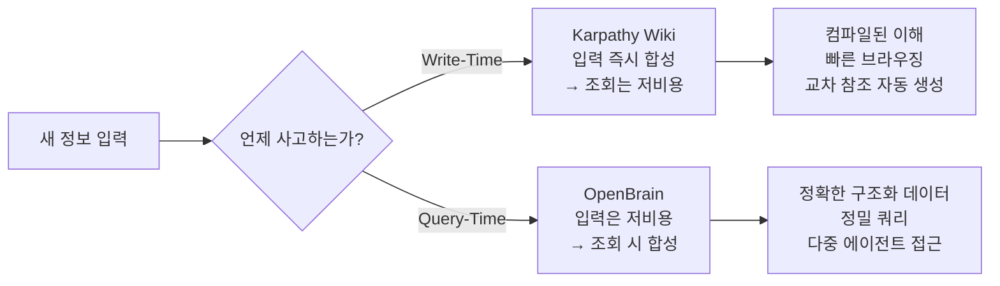
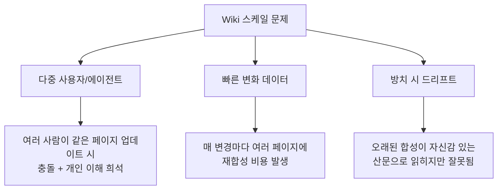
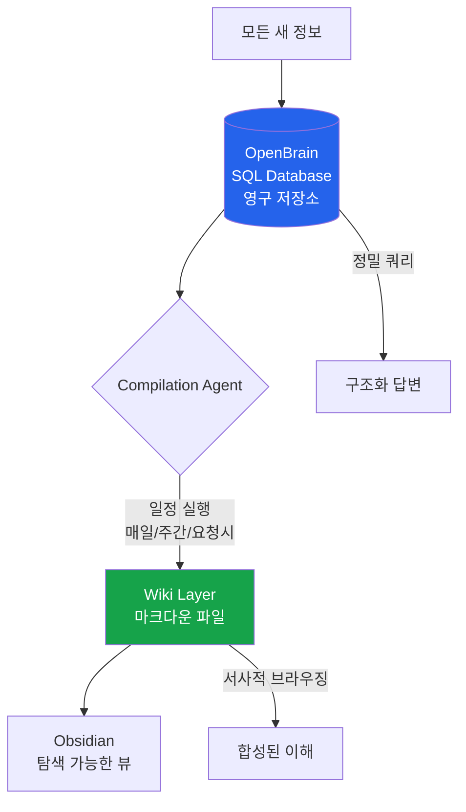
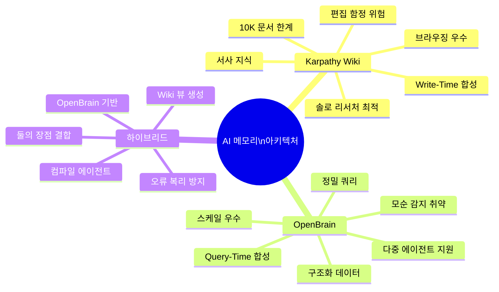

> **출처**: "I Tested Both Ways to Give AI a Brain. Only One Wins."  
> **채널**: AI News & Strategy Daily | Nate B Jones  
> **게시일**: 2026년 4월 22일 (Seattle)  
> **영상 링크**: https://www.youtube.com/watch?v=dxq7WtWxi44  
> **작성일**: 2026년 4월 23일

---

## 목차

1. [배경: 왜 이 논쟁이 폭발했는가](#1-배경-왜-이-논쟁이-폭발했는가)
2. [Karpathy의 LLM Wiki란 무엇인가](#2-karpathy의-llm-wiki란-무엇인가)
3. [AI가 인지 작업을 매번 버리는 문제](#3-ai가-인지-작업을-매번-버리는-문제)
4. [핵심 분기점: Write-Time vs Query-Time](#4-핵심-분기점-write-time-vs-query-time)
5. [OpenBrain이란 무엇인가](#5-openbrain이란-무엇인가)
6. [두 시스템의 비유: 학습 가이드 vs 도서관](#6-두-시스템의-비유-학습-가이드-vs-도서관)
7. [Wiki 시스템의 편집 함정 (Editorial Trap)](#7-wiki-시스템의-편집-함정-editorial-trap)
8. [각 시스템이 강한 영역](#8-각-시스템이-강한-영역)
9. [각 시스템이 무너지는 지점 (Scale Breakpoints)](#9-각-시스템이-무너지는-지점-scale-breakpoints)
10. [공통 원칙: 두 시스템이 동의하는 것들](#10-공통-원칙-두-시스템이-동의하는-것들)
11. [하이브리드 해법: OpenBrain Graph Plugin](#11-하이브리드-해법-openbrain-graph-plugin)
12. [의사결정 가이드: 나는 무엇을 선택해야 하는가](#12-의사결정-가이드-나는-무엇을-선택해야-하는가)
13. [Karpathy의 더 깊은 통찰: Oracle에서 Maintainer로](#13-karpathy의-더-깊은-통찰-oracle에서-maintainer로)
14. [최신 커뮤니티 반응 및 생태계 동향](#14-최신-커뮤니티-반응-및-생태계-동향)
15. [종합 평가 및 시사점](#15-종합-평가-및-시사점)

---

## 1. 배경: 왜 이 논쟁이 폭발했는가

2026년 4월, Andrej Karpathy(OpenAI 공동창업자, 전 Tesla AI 디렉터)가 GitHub Gist에 `llm-wiki.md`라는 파일을 올렸다. 이것은 새로운 제품도, 코드 라이브러리도 아니었다. 그는 이것을 **"idea file"** 이라 불렀다—Claude Code나 OpenAI Codex 같은 AI 에이전트에 붙여넣어서 개인 지식 베이스를 구축하는 패턴을 설명한 마크다운 문서였다.

결과는 놀라웠다. **41,000명**이 이 포스트를 북마크했다. AI 커뮤니티 전체가 들썩였다.

이 영상의 발표자 Nate B Jones는 OpenBrain이라는 유사 시스템을 이미 운영 중이었고, 수백 개의 DM과 이메일을 받았다: *"이것과 OpenBrain은 같은 건가요? OpenBrain이 이제 구식이 된 건가요?"*

Nate의 대답은 예상과 달랐다. 그는 두 시스템을 비교하고 각각이 어디서 강하고, 어디서 무너지는지 솔직하게 분석한 뒤, **하이브리드 해법**을 제안한다. 이 영상은 단순한 제품 비교가 아니라, **2026년 AI 시대에 자신의 Context Layer를 어떻게 설계할 것인가**라는 근본적인 질문에 대한 답변이다.

---

## 2. Karpathy의 LLM Wiki란 무엇인가

### 2.1 표면적 단순성

겉으로 보면 Karpathy의 아이디어는 황당할 정도로 단순하다.

- **폴더**와 **텍스트 파일(마크다운)** 이 전부다
- 복잡한 벡터 데이터베이스 없음
- RAG 파이프라인 없음
- 임베딩 없음

### 2.2 핵심 구조 (3계층 아키텍처)

```
📁 Raw Sources (불변)
   └── 논문, 기사, 회의록, 이미지 등 원본 자료
       LLM이 읽되 절대 수정하지 않음

📁 Wiki (LLM이 유지보수)
   └── 마크다운 파일들 (요약, 개념 페이지, 타임라인)
       완전히 LLM이 작성하고 관리

📄 Schema (규칙)
   └── CLAUDE.md - 에이전트에게 구조화 방식, 
       파일 ingestion 규칙, 답변 포맷을 지시하는 설정 파일
```

### 2.3 Karpathy의 작업 방식

Karpathy는 자신의 작업 환경을 이렇게 설명한다:

- **AI 에이전트** ← 한쪽에서 Wiki를 작성하고 업데이트
- **Obsidian** ← 반대편에서 결과를 실시간으로 탐색

> *"Obsidian은 IDE, LLM은 프로그래머, Wiki는 코드베이스다."* — Karpathy

즉, **Obsidian은 인간이 읽는 곳**이고, **AI는 노트 앱에 글을 쓰는 역할**을 담당한다. 입력되는 자료는 이전 대화의 원시 소스, 문서, AI가 만들어낸 합성 결과 등 다양하다.

### 2.4 컴파일 비유

Karpathy는 소프트웨어 엔지니어링 비유를 사용한다: **컴파일(Compilation)**.

대부분의 AI 도구는 쿼리마다 원시 문서를 재읽고 재합성한다 (인터프리터 방식). Karpathy의 Wiki는 새 소스가 들어올 때 **한 번 컴파일**하고, 이후 조회는 이미 컴파일된 이해를 참조한다.

> *"지식은 한 번 컴파일되고 최신 상태로 유지된다. 매 쿼리마다 재파생되지 않는다."* — Karpathy

---

## 3. AI가 인지 작업을 매번 버리는 문제

### 3.1 현재 AI 도구의 구조적 한계

오늘날 우리는 AI를 이렇게 사용한다:

- ChatGPT에 파일 업로드
- NotebookLM 사용
- Claude에 문서 첨부

결과? **지식이 여기저기 파편화**된다. AI는 질문마다 관련 문서 조각들을 새로 찾고, 다시 읽고, 다시 합성한다. **어제 한 합성이 오늘 아무런 도움도 되지 않는다.** 아무것도 저장되지 않았기 때문이다.

### 3.2 AI의 인지적 낭비

5개의 문서를 연결해야 하는 질문을 한다고 가정하자:

```
질문 → AI가 5개 문서 탐색
     → 6개 채팅 이력 읽기
     → 상호 관계 파악
     → 합성 생성
     → 답변 출력
     → 🗑️ 모든 작업 결과 폐기

내일 유사한 질문 → 처음부터 전부 다시...
```

Nate는 이를 이렇게 표현한다: *"AI는 실제 인지 작업을 수행했다가 즉시 전부 버려버린다."*

### 3.3 Karpathy의 근본적 질문

그렇다면 Karpathy가 던진 질문은 이것이었다:

> *"AI가 단순히 관련 청크를 찾아 답변하는 것이 아니라, 배운 것을 기록해두면 어떨까? 새 소스를 추가할 때마다 AI가 그것을 읽고 중요한 것을 파악한 뒤, 이전 소스에서 배운 모든 것이 담긴 정리된 노트를 업데이트한다면?"*

이것이 Wiki의 핵심이다: **AI의 진화하는 이해를 시간에 걸쳐 포착하는 영속적 아티팩트**.

---

## 4. 핵심 분기점: Write-Time vs Query-Time

모든 AI 지식 시스템은 반드시 다음 질문에 답해야 한다:

> **"AI가 언제 어려운 사고를 합니까? 정보가 들어올 때입니까, 아니면 정보에 대해 질문할 때입니까?"**

이 선택에서 모든 것이 갈린다.



### 4.1 Write-Time 시스템 (Karpathy Wiki)

새 소스가 도착하면 AI는 즉시 작동한다:

1. 소스 읽기
2. 중요한 것 추출
3. Wiki에 이해 기록
4. 토픽 페이지 업데이트
5. 관련 아이디어 간 링크 추가
6. 이전 주의 내용과 모순되는 신규 데이터 표시

**어려운 작업은 정보가 들어오는 순간 한 번 발생한다.** 이후에는 AI가 거의 작업 없이 브라우징만으로 이해를 얻을 수 있다.

### 4.2 Query-Time 시스템 (OpenBrain)

새 정보가 들어오면 OpenBrain은 충실히 저장한다:

1. 태그 붙이기
2. 카테고리화
3. 검색 가능하게 구조화

*아직 합성은 없다. 데이터는 구조화된 테이블에서 대기한다.*

쿼리 시점에 AI가 작동한다: 관련 항목을 읽고, 신선하게 사고하며, 즉석에서 답변을 생성한다.

**어려운 작업은 필요한 순간에 발생한다—미리 발생하지 않는다.**

---

## 5. OpenBrain이란 무엇인가

OpenBrain은 Nate B Jones가 구축한 **SQL 데이터베이스 기반의 개인 지식 관리 시스템**이다. (**관련글** : [OpenBrain 확장 가이드: AI 에이전트에게 손과 발을 부여하는 방법](https://k82022603.github.io/posts/openbrain-%ED%99%95%EC%9E%A5-%EA%B0%80%EC%9D%B4%EB%93%9C-ai-%EC%97%90%EC%9D%B4%EC%A0%84%ED%8A%B8%EC%97%90%EA%B2%8C-%EC%86%90%EA%B3%BC-%EB%B0%9C%EC%9D%84-%EB%B6%80%EC%97%AC%ED%95%98%EB%8A%94-%EB%B0%A9%EB%B2%95/))

### 5.1 핵심 설계 철학

- **쿼리 타임 합성**: 정보 저장은 게으르고 저렴하게, 합성은 쿼리 시점에
- **구조화된 데이터**: 행(row)과 열(column), 태그, 타임스탬프
- **다중 에이전트 지원**: 여러 AI 도구가 동시에 같은 데이터베이스에 접근
- **Headless 설계**: 특정 UI에 종속되지 않음 (Obsidian 플러그인으로 브라우징 가능)

### 5.2 OpenBrain의 데이터 처리 흐름

```
새 정보 입력
    ↓
행(Row) 작성 + 태그 + 카테고리 → 완료 (저비용)
    ↓
[이후 쿼리 시]
    ↓
AI가 관련 항목 읽기
    ↓
신선한 합성 + 정밀 답변 출력
```

### 5.3 OpenBrain이 잘 답하는 질문 유형

- "Q1에 가격 논의가 있었던 모든 회의 노트를 보여줘"
- "지난 3개의 경쟁사 업데이트를 비교해줘"
- "지난 2주 동안 나에게 배정된 모든 실행 항목을 찾아줘"

이것들은 본질적으로 **데이터베이스 쿼리**다—정확하고 필터링 가능한 결과가 필요한 경우.

---

## 6. 두 시스템의 비유: 학습 가이드 vs 도서관

Nate는 두 시스템의 차이를 아름다운 비유로 설명한다.

### 6.1 Karpathy Wiki = 훌륭한 튜터가 작성해주는 학습 가이드

```
새 주제 학습
    ↓
튜터가 가이드 업데이트
    ↓
새 섹션 추가, 이전 섹션 개정, 챕터 간 아이디어 연결
    ↓
시험일에는 가이드만 읽으면 됨 → 합격
```

이상적으로 **사고는 이미 당신을 위해 완료되어 있다.** 튜터가 모든 것을 완벽하게 준비해두었으므로 실패할 수 없다.

### 6.2 OpenBrain = 뛰어난 사서가 곁에 있는 완벽히 정리된 서류 캐비닛

```
모든 문서 → 파일링 + 색인 + 검색 가능
    ↓
질문 발생
    ↓
사서가 관련 파일 신속히 검색
    ↓
해당 파일 읽고 필요한 정보 정확히 짚어줌
```

파일링이 깔끔하기 때문에 사서는 매번 신선하고 효율적으로 사고할 수 있다—원하는 정확한 합성을 얻을 수 있다.

### 6.3 핵심 차이

| 차원 | Karpathy Wiki (학습 가이드) | OpenBrain (도서관) |
|------|--------------------------|-----------------|
| 사고 시점 | 입력 시 (미리) | 쿼리 시 (즉석) |
| 입력 비용 | 높음 (즉각 합성) | 낮음 (그냥 저장) |
| 쿼리 비용 | 낮음 (이미 합성됨) | 중-높음 (즉석 합성) |
| 세부 정밀도 | 낮을 수 있음 (합성 과정에서 손실 가능) | 높음 (원시 데이터 보존) |
| 브라우징성 | 탁월 (Obsidian 그래프 뷰) | 낮음 (기본적으로 headless) |

---

## 7. Wiki 시스템의 편집 함정 (Editorial Trap)

41,000명의 북마커 중 대부분이 아직 인식하지 못한 함정이 있다.

### 7.1 AI의 편집 결정

AI가 원시 소스를 Wiki 페이지로 변환할 때마다 **편집적 결정**을 내린다:

- 아이디어 간 연결을 어떻게 프레이밍할지
- 어떤 정보가 중요하고 어떤 것이 생략될지
- 모순을 어떻게 해석할지

이것은 인간의 결정이 아니라 **AI의 결정**이다. 몇 달 후에 중요해질 수 있는 미묘한 정보가 삭제될 수 있고, **당신은 절대 그것이 없어졌다는 것을 모른다.**

### 7.2 대시보드의 함정 비유

Nate는 이것을 데이터 분석의 대시보드 함정에 비유한다:

> "대시보드는 스프레드시트보다 훨씬 읽기 쉽지만, 데이터의 응축이다. 당신이 가장 필요로 하는 것을 숨길 수 있다—왜냐하면 현재 시점에 당신이 보고 싶어하는 것만 보여주기 때문이다."

Wiki도 마찬가지다. 깔끔하게 읽히기 때문에 오히려 위험하다.

### 7.3 오류 복리 효과 (Error Compounding)

```
AI가 Wiki에 약간 잘못된 내용 기록
    ↓
다음 답변이 그 잘못된 내용 위에 구축됨
    ↓
오류가 이해 속에 고착화
    ↓
Wiki는 자신 있는 잘 쓰인 산문으로 읽힘
    ↓
당신은 그 격차를 질문하지 않음 (왜냐면 보이지 않으니까)
```

Karpathy는 원시 소스를 건드리지 않는 자신의 아키텍처 덕분에 항상 원본으로 돌아갈 수 있다. 하지만 **대부분의 사람들은 그런 규율을 유지하지 않을 것이다.**

### 7.4 Wiki 신뢰의 역설

시간이 지남에 따라 Wiki는 진실의 원천이 되고, 원시 자료는 조용히 뒷전으로 밀려난다. Wiki가 80-90% 정확하더라도, 그 10-20%의 오류가 지식에 구워진다면—그리고 당신이 그것을 의심하지 않는다면—심각한 문제가 된다.

---

## 8. 각 시스템이 강한 영역

### 8.1 Karpathy Wiki가 압도하는 영역

**딥 리서치 모드**가 최적이다—Karpathy 자신이 하는 것처럼 몇 주에 걸쳐 10개의 논문을 읽는 경우:

- **5번째 논문을 읽을 때**: Wiki에 이미 처음 4개의 합성이 있다
- **모순은 입력 순간에 표시됨**: 즉각적으로 확인 가능
- **교차 참조가 자동 생성됨**: 연결이 이미 구축되어 있음
- **10번째 논문이 끝날 때**: 어려운 주제에 대한 현재 이해 상태를 나타내는 풍부하고 탐색 가능한 아티팩트 보유

추가적으로:
- **개인 지식이 수개월에 걸쳐 진화할 때** 그 성장을 실제로 볼 수 있음
- **건강, 자기계발, 경쟁 분석** 등 단일 소스보다 소스 간 연결에 가치가 있는 영역
- **솔로 리서처**에게 이상적: 복잡한 합성 문제를 이해하는 데 도움
- NotebookLM의 스테로이드 버전 같은 느낌

### 8.2 OpenBrain이 압도하는 영역

**정밀한 구조화 작업**이 필요할 때:

| 쿼리 유형 | 예시 |
|----------|------|
| 필터링 쿼리 | "Q1에서 $50,000 이상의 모든 거래를 끌어내줘" |
| 날짜 기반 조회 | "지난 2주 내 나에게 배정된 실행 항목 찾기" |
| 다중 필터 조합 | "클라이언트명으로 모든 미팅 필터링" |
| 비교 분석 | "최근 3개 경쟁사 업데이트 비교" |

텍스트 파일 폴더는 이런 쿼리를 키워드 검색으로 근사할 수 있지만 완벽하지 않다. 필터를 조합하거나 날짜별로 정렬하거나 수백 개의 항목을 처리할 때는 더욱 그렇다.

**다중 에이전트 접근**에서도 OpenBrain이 우세하다:
- Claude Code + ChatGPT + Cursor + 예약된 자동화가 동시에 같은 데이터 소스를 사용할 때
- 두 에이전트가 같은 마크다운 파일을 편집하면 완전한 혼란이 발생
- 데이터베이스는 동시 접근을 처리함; 파일 디렉토리는 그렇지 않음

**볼륨 측면에서도**:
- Karpathy 자신도 인정: 약 100~10,000개의 고품질 문서에서 가장 잘 작동
- 기업 수준의 메모리로는 적합하지 않음
- 10,000개 상한선에서 이미 관리 가능한 상태를 유지하기 위해 추가 검색 툴링이 필요

---

## 9. 각 시스템이 무너지는 지점 (Scale Breakpoints)

### 9.1 Wiki의 붕괴 지점



- **팀 환경**: 개인 A와 개인 B의 이해가 다르게 발전하면 Wiki는 깊은 개인적 이해를 반영하지 않는 이상한 병합처럼 보임
- **운영 데이터 환경**: 프로젝트 상태, 경쟁 포지셔닝, 라이브 딜 플로우에서는 매번 들어오는 변경으로 재합성 비용이 막대함 (Slack 메시지 속도가 아닌 논문/기사 속도를 위해 최적화됨)
- **방치된 Wiki**: 오래된 합성이 자신 있는 잘 쓰인 산문으로 여전히 읽히지만 실제로는 잘못된 정보 → **적극적인 오정보처럼 보임**

### 9.2 OpenBrain의 붕괴 지점

- **깊은 합성 품질**: 15개의 다른 사실을 동시에 합성하려고 하면 AI가 할 수는 있지만 이전에 어떻게 했는지 지도가 없어 예측 불가능하게 작동
- **브라우징성 부재**: 기본적으로 헤드리스 → 시각적 탐색 불가 (Obsidian 플러그인으로 해결 가능)
- **모순 자동 감지 없음**: 모순이 인접한 행에 조용히 존재할 수 있음 (올바른 쿼리를 하지 않으면 드러나지 않음)
- **방치된 데이터베이스**: 갭이 생기지만 오래된 사실은 여전히 사실 → **단순한 무지처럼 보임** (잘못된 정보가 아님)

### 9.3 방치 시의 결정적 차이

| 방치 시 결과 | Wiki | OpenBrain |
|-------------|------|-----------|
| 모양 | 적극적 오정보처럼 보임 | 단순한 정보 부재처럼 보임 |
| 신뢰도 | 자신감 있는 산문으로 읽혀 의심하지 않음 | 뭔가 빠진 것 같아 의심하게 됨 |
| 위험도 | 더 높음 | 더 낮음 |

---

## 10. 공통 원칙: 두 시스템이 동의하는 것들

표면적 차이에도 불구하고, 두 시스템은 깊은 수준의 핵심 원칙을 공유한다.

### 10.1 도구가 아닌 당신이 아티팩트를 소유한다

- Karpathy: 파일은 당신이 통제하는 폴더의 텍스트
- OpenBrain: 데이터는 당신이 소유하는 데이터베이스에
- 어느 쪽도 재가격 책정하거나 잠글 수 있는 플랫폼에 지식을 넘기지 않음
- Karpathy는 이것을 **"File over App"** 이라 부름
- Nate는 이것을 **"SaaS 중개자 없이 구축"** 이라 부름

> **같은 확신의 근원**: AI 시대에 우리는 자신의 Context Layer를 소유해야 한다.

### 10.2 인간의 역할: 큐레이션과 질문

- 어떤 소스가 들어갈지 결정 → 인간의 몫
- 어떤 질문을 할지 결정 → 인간의 몫
- 개인 Context Layer를 어떻게 구성할지 신중하게 생각하기 → 대체 불가

### 10.3 의도적 구조를 통한 메모리 복리 효과

```
단순한 무작위 축적 → 노이즈의 성장
의도적 구조 → 복리 자산
```

- Wiki: 구조는 마크다운 파일의 교차 참조와 링크에 있음
- OpenBrain: 구조는 스케일 가능한 SQL 데이터베이스에 있음

### 10.4 AI 에이전트가 1차 소비자

두 시스템 모두 지식 베이스의 주요 사용자가 브라우저에서 읽는 인간이 아니라 **당신을 대신해 작업하는 AI 에이전트**라고 가정한다.

> *인간 가독성은 보너스다. 에이전트 접근성이 실제 요구사항이다.*

---

## 11. 하이브리드 해법: OpenBrain Graph Plugin

Nate의 결론은 어느 한 쪽도 단독으로는 최선이 아니라는 것이다. 그는 **하이브리드 아키텍처**를 제안한다.

### 11.1 설계 원칙



### 11.2 작동 방식

1. **OpenBrain이 영구 저장소로 유지됨**: 회의 메모, 기사 클립, 연구 결과, 작업, 연락처 등 모든 것이 태그 지정되고 검색 가능하며 쿼리 가능
2. **Wiki Layer는 수요에 따른 컴파일된 뷰**: 일정에 따라 실행되는 컴파일 에이전트가 OpenBrain의 구조화된 데이터를 읽고 Wiki 페이지를 생성
3. **Wiki는 직접 편집되지 않음**: 오류가 있으면 소스 데이터를 수정하고 재생성 → 드리프트가 없음

### 11.3 하이브리드의 우월성

| 기능 | 순수 Wiki | 순수 OpenBrain | 하이브리드 |
|------|----------|--------------|----------|
| 정밀 쿼리 | ❌ | ✅ | ✅ |
| 브라우징 가능 | ✅ | ❌ | ✅ |
| 오류 수정 | 어려움 | 쉬움 | 쉬움 |
| 다중 에이전트 | ❌ | ✅ | ✅ |
| 대규모 스케일 | ❌ | ✅ | ✅ |
| 서사적 합성 | ✅ | 부분적 | ✅ |
| 모순 감지 | 자동 | 수동 | 플러그인으로 자동 |

### 11.4 Wiki 컴파일러 레시피 (Composable Workflow)

컴파일 에이전트는 다음을 수행한다:

- 관련 테이블 쿼리
- AI를 통한 페이지 합성
- 관계 네트워크 구축
- Wiki 디렉토리에 출력 작성
- 자동 일정으로 실행 (기반 데이터가 성장함에 따라 매 사이클마다 더 좋아짐)

### 11.5 모순 감지 플러그인

Nate는 별도의 플러그인도 발표했다: 팀이나 조직 데이터세트의 모순을 쉽게 매핑하고 감사를 실행하는 도구.

> "데이터베이스는 기본적으로 모순 인식이 없지만, AI 시대에는 OpenBrain 같은 것을 확장해 모순을 인식하도록 만드는 것이 상대적으로 쉽다."

---

## 12. 의사결정 가이드: 나는 무엇을 선택해야 하는가

### 12.1 Karpathy Wiki를 선택해야 할 때

다음 조건에 해당하면 직접적으로 Karpathy의 GitHub Gist Wiki를 사용하라:

- ✅ 단일 리서치 주제를 깊게 파고드는 경우
- ✅ 솔로 사용자 (팀이 아님)
- ✅ 정밀 쿼리가 필요하지 않음
- ✅ 다중 에이전트 접근이 필요하지 않음
- ✅ 읽고 브라우징하며 생각하고 싶음
- ✅ 인프라 없이 30분 안에 시작하고 싶음

### 12.2 OpenBrain으로 구축해야 할 때

다음 조건에 해당하면 OpenBrain을 선택하라:

- ✅ 여러 AI 도구가 같은 메모리에 접근해야 함
- ✅ 팀이 이 정보를 사용할 것임
- ✅ 많은 카테고리에 걸쳐 대량의 정보를 캡처
- ✅ 정보가 반드시 서사 기반이 아님 (숫자 기반)
- ✅ 구조화 쿼리가 필요함
- ✅ 자동화된 에이전트 워크플로우를 구축하는 경우
- ✅ 오랫동안 스케일할 필요가 있는 인프라로 생각함

### 12.3 Wiki 느낌 비유

> "Wiki가 느낌상 더 멋진 버전의 NotebookLM 같다—그것은 훌륭한 도구지만 전체 팀에 사용할 수 없는 도구다."

### 12.4 Nate의 최종 권고

> "지금은 둘 다 사용하라. OpenBrain을 실행하고, 브라우징 가능한 사전 합성 이해 레이어를 원한다면 그래프 플러그인을 추가하라. 그러면 어느 쪽도 다른 쪽을 대체하지 않고 둘 다의 이점을 얻는다."

---

## 13. Karpathy의 더 깊은 통찰: Oracle에서 Maintainer로

이 영상이 전달하는 가장 심오한 통찰은 시스템 비교가 아니다. 그것은 **AI의 역할 변화**에 관한 것이다.

### 13.1 Oracle 패러다임 (기존)

우리 대부분은 AI를 질문하는 대상으로 취급해왔다:

```
질문 → AI → 답변 → 잊혀짐
```

AI는 구름에서 내려오는 마법 같은 일회성 답변을 제공하는 Oracle이다.

### 13.2 Maintainer 패러다임 (Karpathy의 통찰)

Karpathy는 AI를 시간이 지남에 따라 더 좋아지는 지식 아티팩트를 유지 관리하는 **지속적인 직업**을 가진 존재로 올바르게 취급한다:

```
AI = 지식 시스템의 유지보수자
    → 지속적 작업
    → 복리 구축
    → 시간에 걸쳐 개선
```

### 13.3 Idea File as Publishing Format

Karpathy가 단순히 툴을 공개하지 않고 Idea File을 공개한 것은 새로운 기술 지식 공유 방식이다:

- **인간이 따라야 할 자세한 단계별 지침이 아님**
- **AI 에이전트가 실행할 수 있는 증명된 패턴**
- 독자의 주체성을 존중: 독자와 에이전트가 함께 세부 사항을 결정
- AI 에이전트가 빌드할 훌륭한 청사진

### 13.4 인간-AI 분업의 이상

> *"AI가 더 많은 잡무를 하고 인간 판단이 관련성을 갖는 AI 꿈속의 분업을 원하지 않았나? 그것이 꿈이었다. Andre Karpathy가 설명하는 것은 거기에 이르는 하나의 방법이다—특히 당신이 심층 솔로 리서치 프로젝트에 있다면."*

---

## 14. 최신 커뮤니티 반응 및 생태계 동향

### 14.1 즉각적 반응

Karpathy는 트위터에서 "최근 매우 유용하다고 생각하는 것: LLM을 사용해 다양한 리서치 관심 주제의 개인 지식 베이스 구축. 이 방식으로 최근 토큰 처리의 많은 부분이 코드 조작보다 지식 조작에 들어가고 있다"고 말했으며, 이틀 후 GitHub Gist를 공개했다.

### 14.2 기술적 배경

RAG(Retrieval-Augmented Generation)의 핵심 결함은 모델이 지식을 축적하지 않는다는 것이다. 복잡한 질문이 5개의 문서 합성을 요구하면 RAG는 그 한 번의 응답을 위해 조각들을 가져와 결합한다. 내일 같은 질문을 하면 전체 과정을 반복한다.

Karpathy의 3계층 아키텍처는 불변의 Raw Sources, LLM이 유지하는 Wiki(마크다운 파일), 그리고 에이전트에게 구조화 방식과 ingestion 규칙을 지시하는 Schema(CLAUDE.md 같은 설정 파일)로 구성된다.

### 14.3 파생 프로젝트 및 스핀오프

Karpathy의 Gist에서 영감을 받은 팀 중심 파생 프로젝트들이 등장했다. 예를 들어 Waykee Cortex는 Karpathy의 wiki가 평면 인덱싱에 의존하는 반면 팀에 초점을 맞춰 엄격한 계층적 상속 모델을 사용하며, 무엇이 존재하는지에 대한 "Knowledge" 레이어와 작업, 버그, 마일스톤을 포함하는 "Work" 레이어를 독특하게 결합한다.

### 14.4 효율성 주장

LLM Wiki 패턴은 벡터 데이터베이스 대신 평문 파일을 사용하며, RAG보다 70배 더 효율적이라고 보고된다.

### 14.5 한계 인식

커뮤니티에서는 LLM이 환각을 일으켜 Wiki의 핵심이 약하고 다른 지식 포인트를 모두 참조하지 않을 수 있다는 우려도 있으며, "RAG 킬러"보다는 "RAG 퍼실리테이터"라고 부르는 것이 더 적절하다는 의견도 있다.

### 14.6 미래 방향

Karpathy는 Wiki를 사용해 합성 훈련 데이터를 생성하고 LLM을 파인튜닝하여 컨텍스트 창이 아닌 가중치에 데이터를 "알게" 하는 미래 방향도 언급했다. 이것은 개인 지식 베이스를 개인화된 모델로 전환할 것이다.

---

## 15. 종합 평가 및 시사점

### 15.1 두 시스템의 본질적 정체성



### 15.2 핵심 교훈

**1. Context Layer 설계는 2026년 가장 중요한 결정 중 하나다.**
정보를 어떻게 구조화할지에 대한 명확한 구분과 결정은 개인이든 팀이든 대체 불가능하다.

**2. 모든 시스템은 특정 속도에 맞게 최적화된다.**
Wiki는 논문과 기사 속도(days/weeks)를 위해 최적화, Slack 메시지와 티켓 업데이트 속도(minutes/hours)에는 적합하지 않다.

**3. 방치 시의 실패 모드가 근본적으로 다르다.**
데이터베이스 방치 = 지식 부재처럼 보임 (안전)
Wiki 방치 = 적극적 오정보처럼 보임 (위험)

**4. 소유권 원칙은 협상 불가능하다.**
어떤 시스템을 선택하든, 플랫폼이 잠그거나 재가격 책정할 수 없는 방식으로 자신의 Context Layer를 소유해야 한다.

**5. AI는 Oracle이 아닌 Maintainer가 되어야 한다.**
일회성 답변 엔진에서 시간이 지남에 따라 성장하는 사고 시스템의 유지보수자로 AI의 역할을 재정의하는 것이 핵심 통찰이다.

### 15.3 개발자/아키텍트를 위한 실천적 함의

시스템 아키텍트 관점에서 이 논쟁은 오래된 설계 결정과 유사하다:

| AI 메모리 | 소프트웨어 유사점 |
|----------|----------------|
| Write-Time (Wiki) | 비정규화 / CQRS Read Model / Materialized View |
| Query-Time (OpenBrain) | 정규화 / 온디맨드 조인 / Fresh Query |
| 하이브리드 | CQRS 전체 패턴 / Event Sourcing |

올바른 선택은 워크로드 패턴에 달려 있다—소프트웨어 아키텍처와 정확히 같다.

### 15.4 시작을 위한 실용적 가이드

**즉시 시작 (Karpathy Wiki, 30분):**
1. Claude Code나 Cursor에 Karpathy의 Gist를 붙여넣기
2. 리서치 주제에 대해 말하기
3. 소스 파일 폴더에 투입하기
4. Obsidian으로 결과 탐색

**장기 인프라 구축 (OpenBrain 기반):**
1. OpenBrain GitHub에서 시작
2. 카테고리 구조 설계
3. 일관적인 입력 습관 구축
4. 그래프 플러그인으로 Wiki 레이어 추가

---

## 참고 자료

- [Karpathy의 LLM Wiki GitHub Gist](https://gist.github.com/karpathy/442a6bf555914893e9891c11519de94f)
- [OpenBrain (Nate B Jones)](https://natesnewsletter.substack.com/)
- [원본 영상: I Tested Both Ways to Give AI a Brain](https://www.youtube.com/watch?v=dxq7WtWxi44)
- [MindStudio: Karpathy LLM Wiki Pattern 구현 가이드](https://www.mindstudio.ai/blog/karpathy-llm-wiki-knowledge-base-pattern)
- [Analytics Vidhya: LLM Wiki 혁명](https://www.analyticsvidhya.com/blog/2026/04/llm-wiki-by-andrej-karpathy/)
- [DAIR.AI Academy: LLM Knowledge Bases](https://academy.dair.ai/blog/llm-knowledge-bases-karpathy)

---

*이 문서는 Nate B Jones의 YouTube 영상 트랜스크립트와 2026년 4월 최신 커뮤니티 정보를 바탕으로 작성되었습니다.*
