> 이 문서는 [`helm/templates/ingress.yaml`](https://github.com/k82022603/RummiArena/blob/main/helm/templates/ingress.yaml) 예시를 기반으로,  
> **왜 진입점이 필요한지**부터 시작해 **K8s Ingress**와 **Spring Cloud Gateway**의 개념·장단점·사용 방식,  
> 두 기술의 심층 비교, 함께 사용하는 패턴, 그리고 Best Practices까지 순서대로 설명합니다.

---

## 목차

- **Part 1.** [문제 정의 — 왜 진입점이 필요한가?](#part-1-문제-정의--왜-진입점이-필요한가)
- **Part 2.** [Kubernetes Ingress](#part-2-kubernetes-ingress)
  - 2.1 [핵심 개념](#21-핵심-개념)
  - 2.2 [장점과 단점](#22-장점과-단점)
  - 2.3 [예시 분석 — rummikub ingress.yaml](#23-예시-분석--rummikub-ingressyaml)
  - 2.4 [TLS / HTTPS 처리 방식](#24-tls--https-처리-방식)
- **Part 3.** [플랫폼별 Ingress 구현](#part-3-플랫폼별-ingress-구현)
  - 3.1 [K3s / 로컬 개발 — Traefik](#31-k3s--로컬-개발--traefik)
  - 3.2 [순수 Kubernetes — Nginx Ingress Controller](#32-순수-kubernetes--nginx-ingress-controller)
  - 3.3 [OpenShift — Route](#33-openshift--route)
  - 3.4 [AWS EKS — ALB Ingress Controller](#34-aws-eks--alb-ingress-controller)
  - 3.5 [Microsoft Azure AKS — AGIC](#35-microsoft-azure-aks--agic)
  - 3.6 [Ingress Controller 비교표](#36-ingress-controller-비교표)
- **Part 4.** [Spring Cloud Gateway](#part-4-spring-cloud-gateway)
  - 4.1 [왜 필요한가 — Ingress의 한계](#41-왜-필요한가--ingress의-한계)
  - 4.2 [핵심 개념 및 아키텍처](#42-핵심-개념-및-아키텍처)
  - 4.3 [장점과 단점](#43-장점과-단점)
  - 4.4 [예시 — Rummikub 라우팅 구현](#44-예시--rummikub-라우팅-구현)
  - 4.5 [주요 기능 상세](#45-주요-기능-상세)
  - 4.6 [Kubernetes 환경에서의 배포](#46-kubernetes-환경에서의-배포)
- **Part 5.** [비교와 선택](#part-5-비교와-선택)
  - 5.1 [레이어 비교](#51-레이어-비교)
  - 5.2 [기능 상세 비교표](#52-기능-상세-비교표)
  - 5.3 [SCG만 있으면 Ingress 없어도 되나?](#53-scg만-있으면-ingress-없어도-되나)
  - 5.4 [의사결정 가이드](#54-의사결정-가이드)
  - 5.5 [Rummikub 서비스에서의 선택 기준](#55-rummikub-서비스에서의-선택-기준)
- **Part 6.** [함께 사용하는 패턴 — Ingress + SCG](#part-6-함께-사용하는-패턴--ingress--scg)
  - 6.1 [권장 아키텍처와 역할 분담](#61-권장-아키텍처와-역할-분담)
  - 6.2 [완전한 예시 YAML](#62-완전한-예시-yaml)
  - 6.3 [전체 트래픽 흐름](#63-전체-트래픽-흐름)
- **Part 7.** [대안과 미래 방향](#part-7-대안과-미래-방향)
  - 7.1 [Gateway API — 차세대 K8s 표준](#71-gateway-api--차세대-k8s-표준)
  - 7.2 [Service Mesh — Istio와의 비교](#72-service-mesh--istio와의-비교)
  - 7.3 [진화 로드맵](#73-진화-로드맵)
- **Part 8.** [Best Practices](#part-8-best-practices)
  - 8.1 [Ingress 보안](#81-ingress-보안)
  - 8.2 [WebSocket 안정성](#82-websocket-안정성)
  - 8.3 [SCG 성능 튜닝](#83-scg-성능-튜닝)
  - 8.4 [모니터링](#84-모니터링)
  - 8.5 [멀티 네임스페이스 전략](#85-멀티-네임스페이스-전략)
  - 8.6 [Helm 환경별 설정 분리](#86-helm-환경별-설정-분리)
  - 8.7 [GraalVM Native Image로 SCG 콜드 스타트 개선](#87-graalvm-native-image로-scg-콜드-스타트-개선)
- [요약 마인드맵](#요약-마인드맵)

---

## Part 1. 문제 정의 — 왜 진입점이 필요한가?

마이크로서비스 아키텍처에서 외부 클라이언트(브라우저, 모바일 앱, 외부 API)가 내부 서비스에 접근하려면 반드시 **단일 진입점(Entry Point)** 이 필요합니다.

### 진입점 없이 발생하는 문제

Ingress 없이 여러 서비스를 모두 외부에 직접 노출하면 다음 구조가 됩니다.

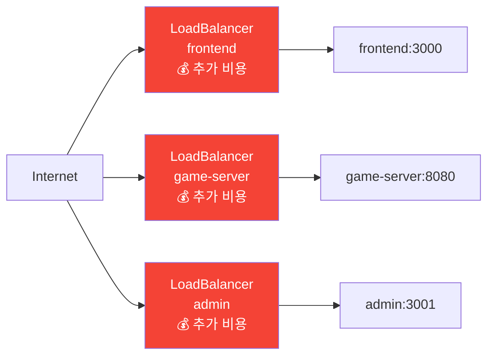

- 서비스 3개 = 클라우드 LoadBalancer 3개 → **비용 폭증**
- 각 서비스가 별도 IP/포트 → **TLS 인증서를 각각 관리**
- URL 기반 라우팅(`/api`, `/ws`) 불가능
- 도메인 기반 라우팅(`api.myapp.com`, `admin.myapp.com`) 불가능

### 진입점 전략 선택지

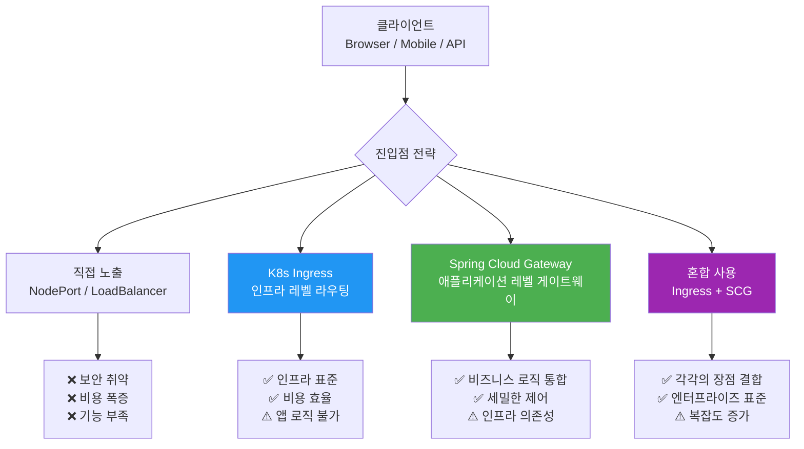

### 💡 Rummikub 프로젝트의 도입 타이밍 가이드

> **"현재 NodePort로 충분. 단일 도메인(rummikub.localhost) 통합 접근이 필요해지거나 클라우드 배포 시 도입"**

이 메모는 Ingress를 **언제 도입해야 하는가**에 대한 실용적인 가이드입니다.

**NodePort만으로 충분한 상황 (로컬 개발 초기)**

로컬 개발 환경에서는 각 서비스를 포트로 직접 접근합니다.

```
http://localhost:3000   → frontend
http://localhost:8080   → game-server (REST API)
ws://localhost:8080/ws  → game-server (WebSocket)
http://localhost:3001   → admin
```

각 서비스가 독립 포트를 쓰는 것이 개발 중엔 오히려 편리하며, Traefik 설치·TLS 인증서 발급·ingress.yaml 관리 같은 오버헤드를 감수할 이유가 없습니다.

**Traefik(Ingress) 도입이 필요해지는 시점**

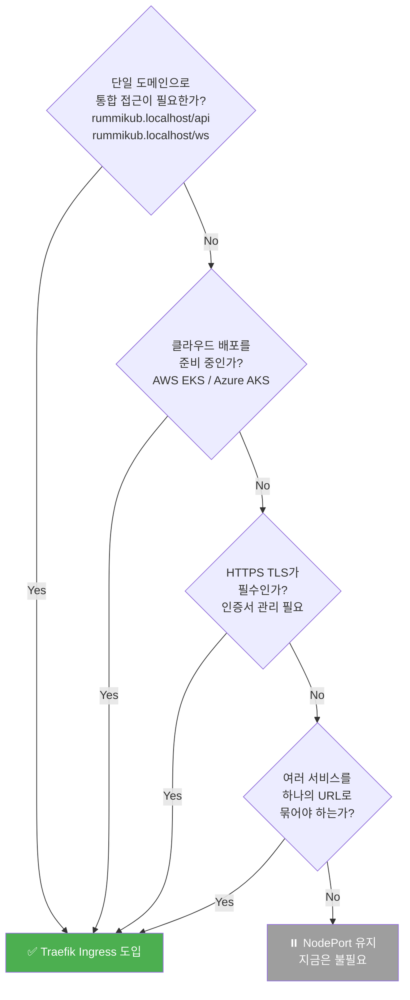

| 상황 | NodePort | Ingress (Traefik) |
|------|----------|-------------------|
| 로컬 개발, 포트별 접근 | ✅ 충분 | 오버엔지니어링 |
| `rummikub.localhost` 단일 도메인으로 통합 | ❌ 불가 | ✅ 필요 |
| HTTPS TLS 적용 | ❌ 복잡 | ✅ 자동 처리 |
| 클라우드(AWS/Azure) 배포 | ❌ 보안 취약 | ✅ 필수 |
| `/api`, `/ws`, `/admin` 경로 분기 | ❌ 불가 | ✅ 핵심 기능 |
| CI/CD 파이프라인·스테이징 환경 | ⚠️ 임시방편 | ✅ 권장 |

> **결론**: 지금의 `ingress.yaml`은 로컬 K3s 환경에서 `rummikub.localhost` 하나로 프론트엔드·API·WebSocket·관리자를 모두 묶기 위해 작성된 것입니다. 클라우드 배포 단계에서는 선택이 아닌 **필수**입니다.

---

## Part 2. Kubernetes Ingress

Kubernetes Ingress는 클러스터 외부 HTTP/HTTPS 트래픽을 내부 서비스로 라우팅하는 **인프라 레벨 진입점**입니다.

> #### 🏢 Ingress를 호텔 프런트에 비유하면
>
> 호텔(= 쿠버네티스 클러스터)에 들어오는 손님(= 외부 요청)은 반드시 **프런트 데스크(= Ingress Controller)**를 거칩니다.
>
> - 손님이 "레스토랑 가고 싶어요" → `/api` → **game-server** 로 안내
> - 손님이 "수영장 가고 싶어요" → `/ws` → **game-server** (WebSocket) 로 안내
> - 손님이 "사장님 찾아요" → `/admin` → **admin** 으로 안내
> - 그냥 들어온 손님 → `/` → **frontend** 로 안내
>
> **NodePort 방식**은 호텔 출입구가 서비스마다 따로 있는 것(정문 30080, 후문 30001, 비상구 30081...)이고,  
> **Ingress 방식**은 출입구 하나(`rummikub.localhost`)에서 프런트가 목적지에 따라 안내해 주는 것입니다.
>
> **Ingress Resource** = 프런트 데스크의 안내 규칙표 (어디서 오면 어디로 보내라)  
> **Ingress Controller** = 실제로 안내를 수행하는 프런트 직원 (Traefik, Nginx 등)  
> ⚠️ 규칙표(Resource)만 있고 직원(Controller)이 없으면 아무것도 동작하지 않습니다.

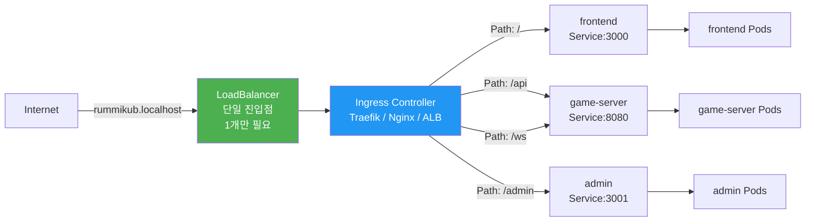

### 2.1 핵심 개념

#### 구성 요소 3가지

| 구성 요소 | 역할 |
|----------|------|
| **Ingress Resource** | 라우팅 규칙을 정의하는 Kubernetes 오브젝트 (YAML) |
| **Ingress Controller** | 실제 트래픽을 처리하는 프록시 서버 (Nginx, Traefik, HAProxy 등) |
| **IngressClass** | 어떤 Ingress Controller를 사용할지 지정 |

> ⚠️ **중요**: Ingress Resource만 배포한다고 동작하지 않습니다. 반드시 **Ingress Controller**가 클러스터에 설치되어 있어야 합니다.

#### 라우팅 유형

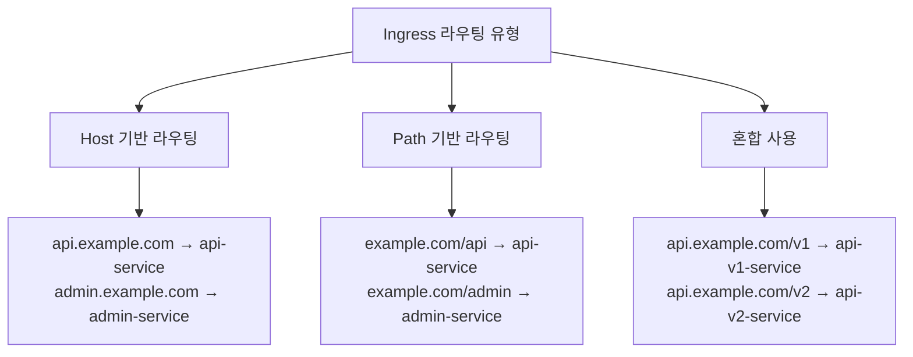

#### PathType 종류

| PathType | 동작 방식 | 예시 |
|----------|----------|------|
| `Prefix` | 지정된 경로로 시작하는 모든 요청 매칭 | `/api` → `/api`, `/api/users`, `/api/v2/...` 모두 매칭 |
| `Exact` | 정확히 일치하는 경로만 매칭 | `/api` → `/api`만 매칭, `/api/users`는 불일치 |
| `ImplementationSpecific` | Ingress Controller가 자체 규칙 적용 | 컨트롤러에 따라 다름 |

---

### 2.2 장점과 단점

#### 장점 ✅

**비용 절감**
```
LoadBalancer 방식:  서비스 N개 = 클라우드 LB N개 = 월 $N × LB단가
Ingress 방식:       서비스 N개 = 클라우드 LB 1개 = 월 $1 × LB단가
```

**중앙 집중식 TLS 관리**
- TLS 인증서를 Ingress 레벨에서 한 번에 관리
- `cert-manager` 연동으로 Let's Encrypt 자동 갱신 가능
- 각 Pod/Service에서 TLS를 처리할 필요 없음 (SSL Termination)

**유연한 라우팅**
- URL 경로 기반 라우팅 (`/api`, `/ws`, `/admin`)
- 호스트 기반 라우팅 (Virtual Hosting)
- 헤더, 쿠키 기반 라우팅 (컨트롤러에 따라 지원)
- Canary 배포, A/B 테스트 지원

**부가 기능 통합**
- Rate Limiting
- 인증/인가 (OAuth, Basic Auth)
- WAF(Web Application Firewall) 연동
- 요청/응답 헤더 조작
- 리다이렉션 및 리라이팅

#### 단점 ❌

**단일 장애점 (Single Point of Failure)**
- Ingress Controller가 다운되면 전체 외부 트래픽 차단
- → HA 구성(다중 레플리카)으로 완화 가능

**운영 복잡성 증가**
- Ingress Controller 자체를 설치/관리/업그레이드해야 함
- 컨트롤러마다 Annotation 문법이 다름 → 이식성 문제

**HTTP/HTTPS에 최적화**
- 기본적으로 L7(HTTP/HTTPS) 트래픽만 처리
- TCP/UDP 트래픽(예: 데이터베이스 포트)은 별도 처리 필요
  - Nginx: ConfigMap으로 TCP 스트림 설정
  - Traefik: `IngressRouteTCP` CRD 사용

**WebSocket 주의사항**
- WebSocket(`/ws`)은 일부 컨트롤러에서 별도 Annotation 필요
- 연결 유지(keep-alive) 타임아웃 설정 필요

**비즈니스 로직 부재**
- 인증 토큰 검증, 사용자 컨텍스트 주입, 동적 라우팅 등 **애플리케이션 레벨 로직 구현 불가**
- Annotation 기반 선언적 설정만 가능 → 복잡한 조건 처리 한계

**디버깅 어려움**
- 트래픽이 `외부 → LB → Ingress Controller → Service → Pod` 여러 레이어를 거침
- 문제 발생 시 어느 레이어 문제인지 추적이 복잡

---

### 2.3 예시 분석 — rummikub ingress.yaml

아래는 Rummikub 게임 서비스의 Ingress 설정입니다. 파일은 `helm/templates/ingress.yaml`에 생성되어 있지만, **현재는 NodePort로 운영 중**이라 아직 활성화하지 않은 상태입니다.

> #### 💡 Ingress를 아직 적용하지 않은 이유
>
> `kubectl apply`로 이 파일을 배포해도 Traefik이 자동으로 처리하지는 않습니다.  
> 실제로 `https://rummikub.localhost`가 동작하려면 아래 **4단계 준비**가 먼저 필요합니다.
>
> **Step 1. mkcert로 TLS Secret 생성**
> ```bash
> mkcert rummikub.localhost
> kubectl create secret tls rummikub-tls \
>   --cert=rummikub.localhost.pem \
>   --key=rummikub.localhost-key.pem \
>   -n rummikub
> ```
>
> **Step 2. `/etc/hosts`에 도메인 추가**
> ```bash
> # /etc/hosts
> 127.0.0.1  rummikub.localhost
> ```
>
> **Step 3. Traefik websecure entrypoint 활성화**
> ```yaml
> # helm/traefik/values.yaml 에서 websecure(443) entrypoint 활성화 확인
> ```
>
> **Step 4. frontend 환경변수 변경**
> ```bash
> # NodePort 방식 (현재)
> NEXT_PUBLIC_WS_URL=ws://localhost:30080/ws
>
> # Ingress 방식 (전환 후)
> NEXT_PUBLIC_WS_URL=wss://rummikub.localhost/ws
> ```
>
> **지금 당장 적용할 필요는 없습니다.** 클라우드 배포나 단일 도메인 통합이 필요한 시점에 위 4단계를 진행하면 됩니다.

```yaml
# helm/templates/ingress.yaml
apiVersion: networking.k8s.io/v1
kind: Ingress
metadata:
  name: rummikub-ingress
  namespace: rummikub
  annotations:
    traefik.ingress.kubernetes.io/router.entrypoints: websecure   # HTTPS 전용
    traefik.ingress.kubernetes.io/router.tls: "true"              # TLS 강제 활성화
spec:
  ingressClassName: traefik                                        # Traefik 컨트롤러 사용
  tls:
    - hosts:
        - rummikub.localhost
      secretName: rummikub-tls                                     # TLS 인증서 Secret
  rules:
    - host: rummikub.localhost
      http:
        paths:
          - path: /                 # 프론트엔드 (React/Next.js 등)
            pathType: Prefix
            backend:
              service:
                name: frontend
                port:
                  number: 3000
          - path: /api              # REST API 서버
            pathType: Prefix
            backend:
              service:
                name: game-server
                port:
                  number: 8080
          - path: /ws               # WebSocket (실시간 게임 통신)
            pathType: Prefix
            backend:
              service:
                name: game-server
                port:
                  number: 8080
          - path: /admin            # 관리자 페이지
            pathType: Prefix
            backend:
              service:
                name: admin
                port:
                  number: 3001
```

#### 트래픽 흐름 분석

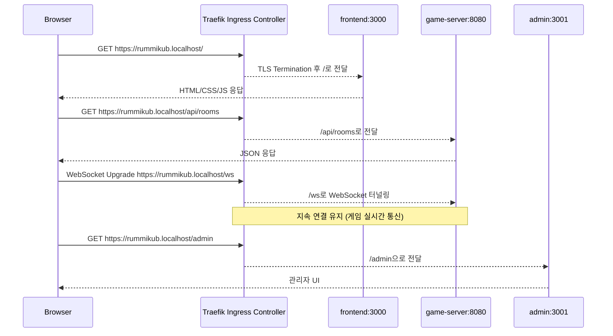

#### 경로 매칭 우선순위

```
요청 URL                매칭되는 규칙        백엔드 서비스
/                   →   path: /          →   frontend:3000
/game               →   path: /          →   frontend:3000  (Prefix 매칭)
/api                →   path: /api       →   game-server:8080
/api/rooms/1        →   path: /api       →   game-server:8080
/ws                 →   path: /ws        →   game-server:8080
/admin              →   path: /admin     →   admin:3001
/admin/users        →   path: /admin     →   admin:3001
```

> ⚠️ **Prefix 순서 주의**: 더 구체적인 경로(`/api`, `/ws`, `/admin`)를 먼저 정의해야 합니다.  
> Kubernetes는 **가장 긴 경로를 우선 매칭**합니다.

---

### 2.4 TLS / HTTPS 처리 방식

#### TLS Termination 모드 3가지

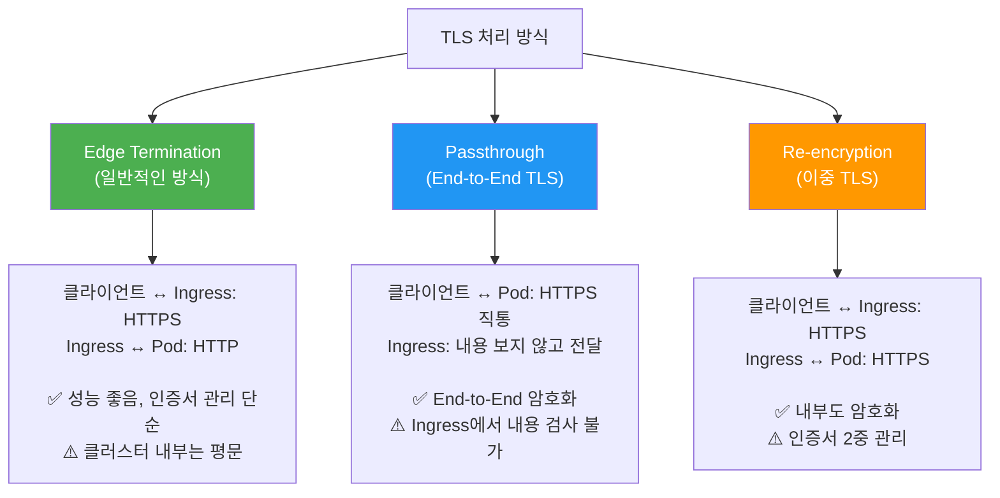

#### cert-manager와 자동 TLS 발급

```yaml
# cert-manager ClusterIssuer (Let's Encrypt)
apiVersion: cert-manager.io/v1
kind: ClusterIssuer
metadata:
  name: letsencrypt-prod
spec:
  acme:
    server: https://acme-v02.api.letsencrypt.org/directory
    email: admin@example.com
    privateKeySecretRef:
      name: letsencrypt-prod
    solvers:
      - http01:
          ingress:
            class: traefik   # 또는 nginx
---
# Ingress에서 cert-manager 사용
apiVersion: networking.k8s.io/v1
kind: Ingress
metadata:
  name: rummikub-ingress
  annotations:
    cert-manager.io/cluster-issuer: letsencrypt-prod   # 이 Annotation 하나로 자동 발급 및 갱신
spec:
  tls:
    - hosts:
        - rummikub.example.com
      secretName: rummikub-tls   # cert-manager가 자동으로 이 Secret에 인증서 저장
  rules:
    - host: rummikub.example.com
      # ...
```

---

## Part 3. 플랫폼별 Ingress 구현

같은 Ingress Resource라도 **어떤 Ingress Controller를 사용하느냐**에 따라 Annotation 문법과 아키텍처가 크게 달라집니다. 현재 예시의 Traefik부터 시작합니다.

### 3.1 K3s / 로컬 개발 — Traefik

현재 `helm/templates/ingress.yaml`이 바로 이 방식입니다. K3s는 Traefik을 기본으로 내장합니다.

```yaml
# 표준 Ingress 방식 (현재 예시 파일과 동일)
apiVersion: networking.k8s.io/v1
kind: Ingress
metadata:
  name: rummikub-ingress
  namespace: rummikub
  annotations:
    traefik.ingress.kubernetes.io/router.entrypoints: websecure
    traefik.ingress.kubernetes.io/router.tls: "true"
    # 미들웨어 체인 적용 (별도 Middleware CRD 정의 후 사용)
    # traefik.ingress.kubernetes.io/router.middlewares: rummikub-auth@kubernetescrd
spec:
  ingressClassName: traefik
  # ... (나머지 동일)
```

**Traefik 고유 기능 — IngressRoute CRD (더 강력한 네이티브 방식):**

표준 Ingress YAML보다 표현력이 풍부하며, Traefik을 사용한다면 이 방식을 권장합니다.

```yaml
apiVersion: traefik.io/v1alpha1
kind: IngressRoute
metadata:
  name: rummikub-route
  namespace: rummikub
spec:
  entryPoints:
    - websecure
  routes:
    - match: Host(`rummikub.localhost`) && PathPrefix(`/api`)
      kind: Rule
      services:
        - name: game-server
          port: 8080
    - match: Host(`rummikub.localhost`) && PathPrefix(`/ws`)
      kind: Rule
      services:
        - name: game-server
          port: 8080
          # WebSocket 자동 지원 (별도 설정 불필요)
    - match: Host(`rummikub.localhost`) && PathPrefix(`/admin`)
      kind: Rule
      services:
        - name: admin
          port: 3001
      middlewares:
        - name: admin-auth    # 인증 미들웨어 체인 적용
    - match: Host(`rummikub.localhost`)
      kind: Rule
      services:
        - name: frontend
          port: 3000
  tls:
    secretName: rummikub-tls
```

---

### 3.2 순수 Kubernetes — Nginx Ingress Controller

가장 널리 사용되는 표준 Ingress Controller입니다.

> ### 🚨 Ingress-NGINX 커뮤니티 OSS 지원 종료(EOL) 안내
>
> Kubernetes 커뮤니티는 **2025년 11월, `kubernetes/ingress-nginx`(커뮤니티 오픈소스)의 지원이 2026년 3월부로 공식 종료**된다고 발표했습니다.
>
> **배경:**
> - 수년간 소수 개발자(1~2명)가 야간·주말에 유지보수를 이어온 구조적 한계
> - 2025년 초 발생한 중대 보안 취약점 **IngressNightmare(CVE-2025-1974)** 대응 과정에서 프로젝트 리소스의 한계 노출
>
> **영향 범위:**
> - 지원 종료 이후 업데이트, 버그 수정, 보안 패치 **완전 중단**
> - 기존에 배포된 ingress-nginx는 계속 동작하지만 보안 패치 없는 운영은 **중대한 보안 리스크**
>
> ⚠️ **지원 종료 대상은 커뮤니티 OSS `kubernetes/ingress-nginx`** 이며, F5가 제공하는 **상용 NGINX Plus Ingress Controller**와는 **별개의 제품**입니다.
>
> **공식 권장 대안:**
>
> | 대안 | 특징 |
> |------|------|
> | **F5 NGINX Plus Ingress Controller** | 국내외 엔터프라이즈 레퍼런스 다수. 정기 보안 패치·SLA 지원. 기존 ingress-nginx에서 가장 매끄러운 전환 경로 |
> | **F5 NGINX Gateway Fabric** | Kubernetes 차세대 표준인 Gateway API 기반 신형 아키텍처. Ingress + 내부 트래픽 제어까지 확장 가능 |
> | **Traefik** | 오픈소스 무료. K3s 기본 내장. 활발한 커뮤니티 |
> | **AWS ALB / Azure AGIC** | 클라우드 네이티브 환경이라면 클라우드 관리형으로 전환 |
>
> 참고: [Ingress NGINX 은퇴 공지 (kubernetes.io)](https://kubernetes.io/blog/2025/11/11/ingress-nginx-retirement/)

```yaml
apiVersion: networking.k8s.io/v1
kind: Ingress
metadata:
  name: rummikub-ingress
  namespace: rummikub
  annotations:
    nginx.ingress.kubernetes.io/ssl-redirect: "true"
    nginx.ingress.kubernetes.io/use-regex: "true"
    # WebSocket 지원 (Nginx는 명시적으로 설정 필요)
    nginx.ingress.kubernetes.io/proxy-read-timeout: "3600"
    nginx.ingress.kubernetes.io/proxy-send-timeout: "3600"
    nginx.ingress.kubernetes.io/configuration-snippet: |
      proxy_set_header Upgrade $http_upgrade;
      proxy_set_header Connection "Upgrade";
    # Rate Limiting
    nginx.ingress.kubernetes.io/limit-rps: "100"
    # Basic Auth (선택사항)
    # nginx.ingress.kubernetes.io/auth-type: basic
    # nginx.ingress.kubernetes.io/auth-secret: basic-auth
spec:
  ingressClassName: nginx
  tls:
    - hosts:
        - rummikub.example.com
      secretName: rummikub-tls
  rules:
    - host: rummikub.example.com
      http:
        paths:
          - path: /
            pathType: Prefix
            backend:
              service:
                name: frontend
                port:
                  number: 3000
          - path: /api
            pathType: Prefix
            backend:
              service:
                name: game-server
                port:
                  number: 8080
          - path: /ws
            pathType: Prefix
            backend:
              service:
                name: game-server
                port:
                  number: 8080
          - path: /admin
            pathType: Prefix
            backend:
              service:
                name: admin
                port:
                  number: 3001
```

**설치 방법:**
```bash
helm repo add ingress-nginx https://kubernetes.github.io/ingress-nginx
helm install ingress-nginx ingress-nginx/ingress-nginx \
  --namespace ingress-nginx --create-namespace
```

---

### 3.3 OpenShift — Route

OpenShift는 Kubernetes 표준 Ingress 대신 자체 `Route` 오브젝트를 사용합니다.  
(OpenShift 4.x부터는 표준 Ingress도 지원하지만, Route가 더 OpenShift 네이티브합니다.)

```yaml
# OpenShift Route — 프론트엔드
apiVersion: route.openshift.io/v1
kind: Route
metadata:
  name: rummikub-frontend
  namespace: rummikub
spec:
  host: rummikub.apps.cluster.example.com
  path: /
  to:
    kind: Service
    name: frontend
    weight: 100
  port:
    targetPort: 3000
  tls:
    termination: edge           # edge: Ingress에서 TLS 종료
    insecureEdgeTerminationPolicy: Redirect
---
# REST API Route
apiVersion: route.openshift.io/v1
kind: Route
metadata:
  name: rummikub-api
  namespace: rummikub
spec:
  host: rummikub.apps.cluster.example.com
  path: /api
  to:
    kind: Service
    name: game-server
    weight: 100
  port:
    targetPort: 8080
  tls:
    termination: edge
    insecureEdgeTerminationPolicy: Redirect
---
# WebSocket Route (장기 연결 타임아웃 설정 필수)
apiVersion: route.openshift.io/v1
kind: Route
metadata:
  name: rummikub-ws
  namespace: rummikub
  annotations:
    haproxy.router.openshift.io/timeout: 1h
spec:
  host: rummikub.apps.cluster.example.com
  path: /ws
  to:
    kind: Service
    name: game-server
  port:
    targetPort: 8080
  tls:
    termination: edge
---
# Admin Route
apiVersion: route.openshift.io/v1
kind: Route
metadata:
  name: rummikub-admin
  namespace: rummikub
spec:
  host: rummikub.apps.cluster.example.com
  path: /admin
  to:
    kind: Service
    name: admin
  port:
    targetPort: 3001
  tls:
    termination: edge
    insecureEdgeTerminationPolicy: Redirect
```

**OpenShift IngressController 설정:**
```yaml
apiVersion: operator.openshift.io/v1
kind: IngressController
metadata:
  name: default
  namespace: openshift-ingress-operator
spec:
  replicas: 2
  domain: apps.cluster.example.com
  endpointPublishingStrategy:
    type: LoadBalancerService
```

**OpenShift vs 표준 Ingress 비교:**

| 항목 | OpenShift Route | 표준 Kubernetes Ingress |
|------|----------------|------------------------|
| TLS 종료 방식 | `edge` / `passthrough` / `reencrypt` | Secret 기반 |
| 자동 호스트명 | `.apps.cluster.domain` 자동 부여 | 수동 설정 |
| 내장 LB | HAProxy 내장 | 별도 설치 필요 |
| 이식성 | OpenShift 전용 | 표준 K8s 호환 |
| 경로별 Route | Route 1개당 경로 1개 | Ingress 1개에 다중 경로 |

---

### 3.4 AWS EKS — ALB Ingress Controller

AWS에서는 Ingress 리소스가 **Application Load Balancer(ALB)** 를 자동으로 생성합니다.

```yaml
apiVersion: networking.k8s.io/v1
kind: Ingress
metadata:
  name: rummikub-ingress
  namespace: rummikub
  annotations:
    kubernetes.io/ingress.class: alb
    alb.ingress.kubernetes.io/scheme: internet-facing
    alb.ingress.kubernetes.io/target-type: ip

    # TLS: ACM 인증서 ARN 지정 (자동 갱신)
    alb.ingress.kubernetes.io/certificate-arn: arn:aws:acm:ap-northeast-2:123456789:certificate/xxxx
    alb.ingress.kubernetes.io/listen-ports: '[{"HTTP":80},{"HTTPS":443}]'
    alb.ingress.kubernetes.io/ssl-redirect: "443"

    # 헬스체크
    alb.ingress.kubernetes.io/healthcheck-path: /healthz
    alb.ingress.kubernetes.io/success-codes: "200"

    # WebSocket — idle timeout 연장 필수
    alb.ingress.kubernetes.io/load-balancer-attributes: |
      idle_timeout.timeout_seconds=3600

    # WAF 연동 (선택사항)
    alb.ingress.kubernetes.io/wafv2-acl-arn: arn:aws:wafv2:ap-northeast-2:123456789:regional/webacl/...

    # 리소스 태그
    alb.ingress.kubernetes.io/tags: Environment=prod,Team=gaming
spec:
  ingressClassName: alb
  rules:
    - host: rummikub.example.com
      http:
        paths:
          - path: /
            pathType: Prefix
            backend:
              service:
                name: frontend
                port:
                  number: 3000
          - path: /api
            pathType: Prefix
            backend:
              service:
                name: game-server
                port:
                  number: 8080
          - path: /ws
            pathType: Prefix
            backend:
              service:
                name: game-server
                port:
                  number: 8080
          - path: /admin
            pathType: Prefix
            backend:
              service:
                name: admin
                port:
                  number: 3001
```

**AWS 아키텍처:**
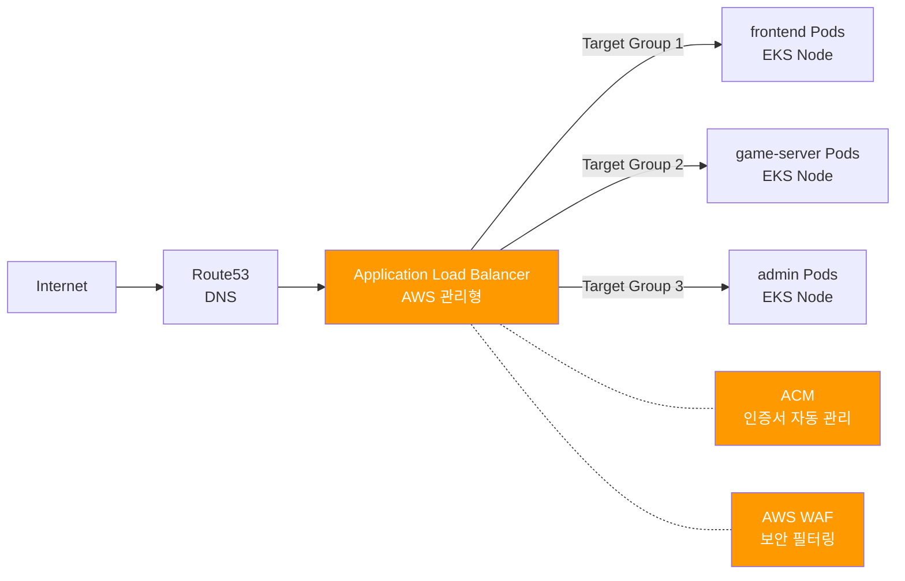

**EKS 설치:**
```bash
helm repo add eks https://aws.github.io/eks-charts
helm install aws-load-balancer-controller eks/aws-load-balancer-controller \
  -n kube-system \
  --set clusterName=my-cluster \
  --set serviceAccount.create=false \
  --set serviceAccount.name=aws-load-balancer-controller
```

---

### 3.5 Microsoft Azure AKS — AGIC

Azure에서는 **Application Gateway** 를 Ingress Controller로 사용합니다.

```yaml
apiVersion: networking.k8s.io/v1
kind: Ingress
metadata:
  name: rummikub-ingress
  namespace: rummikub
  annotations:
    kubernetes.io/ingress.class: azure/application-gateway

    # SSL (Key Vault 인증서 참조)
    appgw.ingress.kubernetes.io/ssl-redirect: "true"
    appgw.ingress.kubernetes.io/appgw-ssl-certificate: "rummikub-cert"

    # 백엔드 설정
    appgw.ingress.kubernetes.io/backend-protocol: "http"
    appgw.ingress.kubernetes.io/connection-draining: "true"
    appgw.ingress.kubernetes.io/connection-draining-timeout: "30"

    # WAF 정책 연동
    appgw.ingress.kubernetes.io/waf-policy-for-path: /subscriptions/.../applicationGatewayWebApplicationFirewallPolicies/myWafPolicy

    # 헬스체크
    appgw.ingress.kubernetes.io/health-probe-path: /healthz
    appgw.ingress.kubernetes.io/health-probe-status-codes: "200-399"

    # WebSocket 타임아웃
    appgw.ingress.kubernetes.io/request-timeout: "3600"
spec:
  ingressClassName: azure/application-gateway
  tls:
    - hosts:
        - rummikub.example.com
      secretName: rummikub-tls
  rules:
    - host: rummikub.example.com
      http:
        paths:
          - path: /
            pathType: Prefix
            backend:
              service:
                name: frontend
                port:
                  number: 3000
          - path: /api
            pathType: Prefix
            backend:
              service:
                name: game-server
                port:
                  number: 8080
          - path: /ws
            pathType: Prefix
            backend:
              service:
                name: game-server
                port:
                  number: 8080
          - path: /admin
            pathType: Prefix
            backend:
              service:
                name: admin
                port:
                  number: 3001
```

**Azure 아키텍처:**
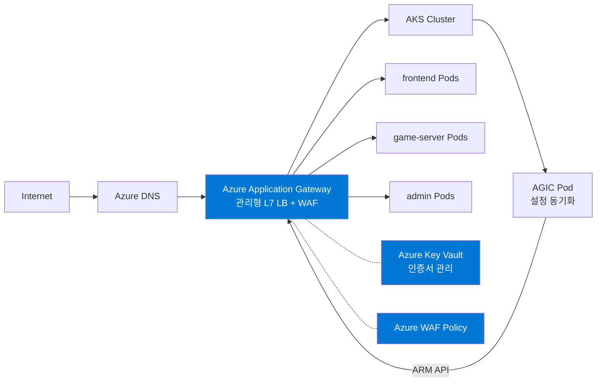

---

### 3.6 Ingress Controller 비교표

| 항목 | Nginx (OSS) | Traefik | AWS ALB | Azure AGIC | OpenShift HAProxy |
|------|-------------|---------|---------|------------|-------------------|
| **설치 복잡도** | 보통 | 낮음 | 낮음 (EKS) | 낮음 (AKS) | 없음 (내장) |
| **WebSocket 지원** | Annotation 필요 | 자동 | 자동 | Annotation 필요 | 자동 |
| **TLS 관리** | cert-manager 연동 | ACME 내장 | ACM 자동 | Key Vault 연동 | 자동 |
| **WAF 지원** | 별도 (ModSecurity) | 없음 (Enterprise 유료) | AWS WAF 연동 | Azure WAF 내장 | 없음 |
| **L4 TCP/UDP** | ConfigMap | IngressRouteTCP | NLB 별도 | 별도 | 별도 |
| **비용** | 무료 | 무료 (Enterprise 유료) | ALB 비용 | AppGW 비용 | 포함 |
| **이식성** | 높음 | 높음 | AWS 전용 | Azure 전용 | OpenShift 전용 |
| **성능** | 높음 | 높음 | 관리형 | 관리형 | 높음 |
| **Canary 배포** | Annotation 지원 | Middleware 지원 | 제한적 | 제한적 | 없음 |
| **대시보드** | 없음 | 내장 UI | AWS Console | Azure Portal | OpenShift Console |
| **지원 상태** | ⚠️ **EOL 2026.03** | ✅ 활발한 개발 | ✅ AWS 관리형 | ✅ Azure 관리형 | ✅ Red Hat 지원 |

> ⚠️ **Nginx OSS 컬럼 주의**: 위 표의 "Nginx"는 커뮤니티 OSS `kubernetes/ingress-nginx` 기준입니다. **2026년 3월부로 공식 EOL**이며, 신규 프로젝트라면 Traefik, 엔터프라이즈라면 **F5 NGINX Plus Ingress Controller** 또는 **NGINX Gateway Fabric**을 권장합니다.

---

## Part 4. Spring Cloud Gateway

### 4.1 왜 필요한가 — Ingress의 한계

K8s Ingress는 인프라 레벨 라우팅에 탁월하지만, **애플리케이션 레벨**의 복잡한 로직을 처리하는 데는 구조적 한계가 있습니다.

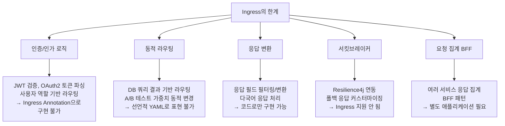

**Spring Cloud Gateway**는 Spring 생태계 기반의 **애플리케이션 레벨 API Gateway**로, 이러한 복잡한 요구사항을 Java/Kotlin 코드로 직접 구현할 수 있습니다.

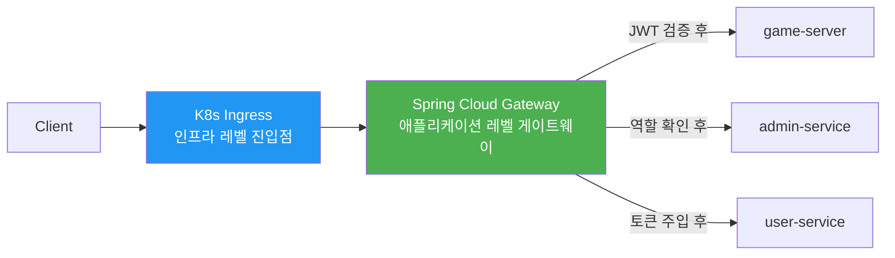

---

### 4.2 핵심 개념 및 아키텍처

Spring Cloud Gateway는 **Spring WebFlux** 기반의 **논블로킹(Non-Blocking) 리액티브** 게이트웨이입니다.

#### 3대 핵심 요소

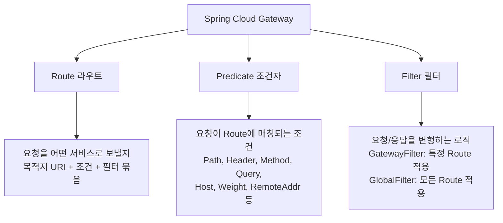

#### 요청 처리 파이프라인

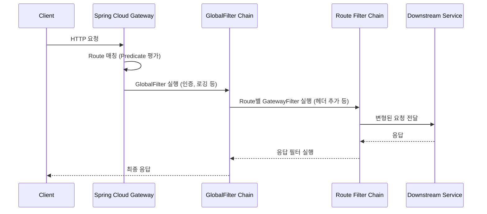

---

### 4.3 장점과 단점

#### 장점 ✅

**코드 기반의 세밀한 제어**
- Java/Kotlin으로 복잡한 비즈니스 로직 구현 가능
- 조건부 라우팅, 동적 필터 추가, 런타임 설정 변경

**Spring 생태계 완벽 통합**
- Spring Security로 OAuth2/JWT 인증/인가
- Spring Cloud LoadBalancer로 서비스 디스커버리
- Resilience4j로 서킷브레이커/Retry
- Micrometer + Prometheus로 메트릭
- Spring Boot Actuator로 헬스체크/관리

**리액티브 아키텍처**
- WebFlux 기반 논블로킹 처리
- 적은 스레드로 높은 동시성 처리
- 백프레셔(Backpressure) 지원

**플랫폼 독립성**
- K8s Ingress Controller 종류에 무관하게 동일한 동작
- 온프레미스/클라우드 모두 동일한 로직

**동적 라우팅**
- DB, Config Server, 환경 변수 기반 런타임 라우팅 변경
- DiscoveryClient 연동으로 서비스 자동 발견

#### 단점 ❌

**운영 부담 증가**
- 추가적인 마이크로서비스(SCG Pod) 관리 필요
- JVM 기반으로 메모리 사용량이 Nginx 대비 높음 (일반적으로 256MB~512MB+)
- 애플리케이션 배포/업그레이드 사이클 존재

**K8s 기능과 중복**
- Service Discovery, Load Balancing은 K8s가 이미 제공
- 단순 라우팅만 필요하면 오버엔지니어링

**Spring 의존성**
- Spring 생태계 지식 필요
- 비 Spring 프로젝트에서는 이질적

**학습 곡선**
- 리액티브 프로그래밍(WebFlux) 패러다임 이해 필요
- 필터 체인, Predicate 조합의 복잡성

---

### 4.4 예시 — Rummikub 라우팅 구현

Rummikub 게임 서비스와 동일한 라우팅을 Spring Cloud Gateway로 구현하는 예시입니다.

#### application.yml — 선언적 설정 방식

```yaml
# src/main/resources/application.yml
spring:
  application:
    name: rummikub-gateway
  cloud:
    gateway:
      # 글로벌 CORS 설정
      globalcors:
        cors-configurations:
          '[/**]':
            allowed-origins:
              - "https://rummikub.localhost"
            allowed-methods: ["GET", "POST", "PUT", "DELETE", "OPTIONS"]
            allowed-headers: ["*"]
            allow-credentials: true

      # 기본 필터 (모든 라우트에 적용)
      default-filters:
        - DedupeResponseHeader=Access-Control-Allow-Origin Access-Control-Allow-Credentials
        - name: RequestRateLimiter
          args:
            redis-rate-limiter.replenishRate: 100   # 초당 100 요청
            redis-rate-limiter.burstCapacity: 200
            key-resolver: "#{@userKeyResolver}"

      routes:
        # WebSocket 라우트 — 실시간 게임 통신 (필터 최소화)
        - id: game-websocket
          uri: ws://game-server:8080    # ws:// 스킴 사용
          predicates:
            - Path=/ws/**
          filters:
            - AddRequestHeader=X-Gateway-Source, rummikub-gateway

        # REST API 라우트 — game-server
        - id: game-api
          uri: http://game-server:8080
          predicates:
            - Path=/api/**
            - Method=GET,POST,PUT,DELETE,PATCH
          filters:
            - StripPrefix=0           # /api 경로 유지
            - name: CircuitBreaker
              args:
                name: gameServerCB
                fallbackUri: forward:/fallback/game
            - AddRequestHeader=X-Gateway-Source, rummikub-gateway
            - name: Retry
              args:
                retries: 3
                statuses: BAD_GATEWAY,SERVICE_UNAVAILABLE
                methods: GET
                backoff:
                  firstBackoff: 100ms
                  maxBackoff: 1000ms

        # 관리자 라우트 — 역할 기반 접근 제어
        - id: admin-panel
          uri: http://admin:3001
          predicates:
            - Path=/admin/**
          filters:
            - name: RequestHeaderToRequestUri
            # Spring Security에서 ROLE_ADMIN 검증 (별도 SecurityConfig에서 설정)

        # 프론트엔드 라우트 (나머지 모든 요청)
        - id: frontend
          uri: http://frontend:3000
          predicates:
            - Path=/**
          filters:
            - name: CircuitBreaker
              args:
                name: frontendCB
                fallbackUri: forward:/fallback/frontend

server:
  port: 8090

management:
  endpoints:
    web:
      exposure:
        include: health,info,gateway,metrics,prometheus
  metrics:
    export:
      prometheus:
        enabled: true
```

#### Java 코드 기반 설정 방식 (RouteLocatorBuilder)

```java
public class GatewayConfig {

    @Bean
    public RouteLocator rummikubRoutes(RouteLocatorBuilder builder,
                                       AuthenticationFilter authFilter,
                                       LoggingFilter loggingFilter) {
        return builder.routes()
            // WebSocket 라우트
            .route("game-websocket", r -> r
                .path("/ws/**")
                .filters(f -> f
                    .addRequestHeader("X-Gateway-Source", "rummikub-gateway")
                )
                .uri("ws://game-server:8080")         // WebSocket URI
            )

            // REST API 라우트
            .route("game-api", r -> r
                .path("/api/**")
                .and()
                .method(HttpMethod.GET, HttpMethod.POST, HttpMethod.PUT,
                        HttpMethod.DELETE, HttpMethod.PATCH)
                .filters(f -> f
                    .filter(loggingFilter)
                    .filter(authFilter)               // JWT 검증
                    .addRequestHeader("X-Gateway-Source", "rummikub-gateway")
                    .addRequestHeader("X-User-Id", "#{T(ThreadLocal).get()}")
                    .circuitBreaker(c -> c
                        .setName("gameServerCB")
                        .setFallbackUri("forward:/fallback/game"))
                    .retry(r2 -> r2
                        .setRetries(3)
                        .setStatuses(HttpStatus.BAD_GATEWAY,
                                     HttpStatus.SERVICE_UNAVAILABLE))
                )
                .uri("http://game-server:8080")
            )

            // 관리자 라우트 (ROLE_ADMIN 검증은 SecurityConfig에서)
            .route("admin-panel", r -> r
                .path("/admin/**")
                .filters(f -> f
                    .filter(authFilter)
                    .addRequestHeader("X-Admin-Request", "true")
                )
                .uri("http://admin:3001")
            )

            // 프론트엔드 (catch-all)
            .route("frontend", r -> r
                .path("/**")
                .filters(f -> f
                    .circuitBreaker(c -> c
                        .setName("frontendCB")
                        .setFallbackUri("forward:/fallback/frontend"))
                )
                .uri("http://frontend:3000")
            )
            .build();
    }
}
```

---

### 4.5 주요 기능 상세

#### JWT 인증 필터

```java
public class AuthenticationFilter implements GatewayFilter, Ordered {

    private final JwtTokenValidator jwtValidator;
    private static final List<String> PUBLIC_PATHS =
        List.of("/api/auth/login", "/api/auth/register", "/ws");

    @Override
    public Mono<Void> filter(ServerWebExchange exchange, GatewayFilterChain chain) {
        String path = exchange.getRequest().getURI().getPath();

        // 공개 경로는 인증 스킵
        if (PUBLIC_PATHS.stream().anyMatch(path::startsWith)) {
            return chain.filter(exchange);
        }

        String authHeader = exchange.getRequest()
            .getHeaders().getFirst(HttpHeaders.AUTHORIZATION);

        if (authHeader == null || !authHeader.startsWith("Bearer ")) {
            exchange.getResponse().setStatusCode(HttpStatus.UNAUTHORIZED);
            return exchange.getResponse().setComplete();
        }

        String token = authHeader.substring(7);
        return jwtValidator.validate(token)
            .flatMap(claims -> {
                // 검증된 사용자 정보를 헤더에 주입 → 다운스트림 서비스에서 활용
                ServerHttpRequest mutatedRequest = exchange.getRequest()
                    .mutate()
                    .header("X-User-Id", claims.getSubject())
                    .header("X-User-Roles", String.join(",", claims.getRoles()))
                    .build();
                return chain.filter(exchange.mutate()
                    .request(mutatedRequest).build());
            })
            .onErrorResume(e -> {
                exchange.getResponse().setStatusCode(HttpStatus.UNAUTHORIZED);
                return exchange.getResponse().setComplete();
            });
    }

    @Override
    public int getOrder() { return -100; } // 가장 먼저 실행
}
```

#### 서킷브레이커 + 폴백

```java
public class FallbackController {

    @GetMapping("/game")
    public Mono<Map<String, Object>> gameFallback(ServerWebExchange exchange) {
        return Mono.just(Map.of(
            "status", "degraded",
            "message", "게임 서버가 일시적으로 불안정합니다. 잠시 후 다시 시도해주세요.",
            "timestamp", Instant.now().toString()
        ));
    }

    @GetMapping("/frontend")
    public Mono<Void> frontendFallback(ServerWebExchange exchange) {
        exchange.getResponse().setStatusCode(HttpStatus.SERVICE_UNAVAILABLE);
        return exchange.getResponse().writeWith(
            Mono.just(exchange.getResponse().bufferFactory()
                .wrap("서비스 점검 중입니다.".getBytes()))
        );
    }
}
```

#### Rate Limiting (Redis 기반)

```java
public class RateLimiterConfig {

    // 사용자 ID 기반 Rate Limiting
    @Bean
    public KeyResolver userKeyResolver() {
        return exchange -> {
            String userId = exchange.getRequest()
                .getHeaders().getFirst("X-User-Id");
            return Mono.just(userId != null ? userId : "anonymous");
        };
    }

    // IP 기반 Rate Limiting (인증 전 단계)
    @Bean
    public KeyResolver ipKeyResolver() {
        return exchange -> Mono.just(
            Objects.requireNonNull(
                exchange.getRequest().getRemoteAddress()
            ).getAddress().getHostAddress()
        );
    }
}
```

#### 동적 라우팅 (런타임 변경)

```java
public class GatewayAdminController {

    private final RouteDefinitionWriter routeDefinitionWriter;
    private final ApplicationEventPublisher publisher;

    // 런타임에 새 라우트 추가 (재배포 불필요)
    @PostMapping("/routes")
    public Mono<ResponseEntity<String>> addRoute(
            @RequestBody RouteDefinition routeDefinition) {
        return routeDefinitionWriter
            .save(Mono.just(routeDefinition))
            .then(Mono.fromRunnable(() ->
                publisher.publishEvent(new RefreshRoutesEvent(this))))
            .thenReturn(ResponseEntity.ok("Route added: " + routeDefinition.getId()));
    }
}
```

---

### 4.6 Kubernetes 환경에서의 배포

Spring Cloud Gateway 자체가 K8s 위에서 동작하는 Pod입니다.

```yaml
# helm/templates/gateway-deployment.yaml
apiVersion: apps/v1
kind: Deployment
metadata:
  name: api-gateway
  namespace: rummikub
spec:
  replicas: 2                  # HA 구성
  selector:
    matchLabels:
      app: api-gateway
  template:
    metadata:
      labels:
        app: api-gateway
    spec:
      containers:
        - name: api-gateway
          image: rummikub/api-gateway:latest
          ports:
            - containerPort: 8090
          env:
            - name: SPRING_PROFILES_ACTIVE
              value: "kubernetes"
            - name: SPRING_REDIS_HOST
              value: "redis-service"    # Rate Limiter용 Redis
          resources:
            requests:
              memory: "256Mi"
              cpu: "250m"
            limits:
              memory: "512Mi"
              cpu: "500m"
          livenessProbe:
            httpGet:
              path: /actuator/health/liveness
              port: 8090
            initialDelaySeconds: 30
          readinessProbe:
            httpGet:
              path: /actuator/health/readiness
              port: 8090
---
apiVersion: v1
kind: Service
metadata:
  name: api-gateway
  namespace: rummikub
spec:
  selector:
    app: api-gateway
  ports:
    - port: 8090
      targetPort: 8090
```

**Ingress → SCG 연계 구조:**
```yaml
# Ingress가 SCG 하나만 바라보도록 단순화
apiVersion: networking.k8s.io/v1
kind: Ingress
metadata:
  name: rummikub-ingress
  namespace: rummikub
  annotations:
    traefik.ingress.kubernetes.io/router.entrypoints: websecure
    traefik.ingress.kubernetes.io/router.tls: "true"
spec:
  ingressClassName: traefik
  tls:
    - hosts:
        - rummikub.localhost
      secretName: rummikub-tls
  rules:
    - host: rummikub.localhost
      http:
        paths:
          - path: /              # 모든 트래픽을 SCG로 집중
            pathType: Prefix
            backend:
              service:
                name: api-gateway   # SCG Service
                port:
                  number: 8090
          # 정적 파일은 직접 frontend로 (선택사항 — 성능 최적화)
          # - path: /static
          #   backend:
          #     service:
          #       name: frontend
          #       port:
          #         number: 3000
```

---

## Part 5. 비교와 선택

### 5.1 레이어 비교

두 기술은 같은 L7 레이어에서 동작하지만, **누가 관리하고 어떤 방식으로 구성하는지**가 근본적으로 다릅니다.

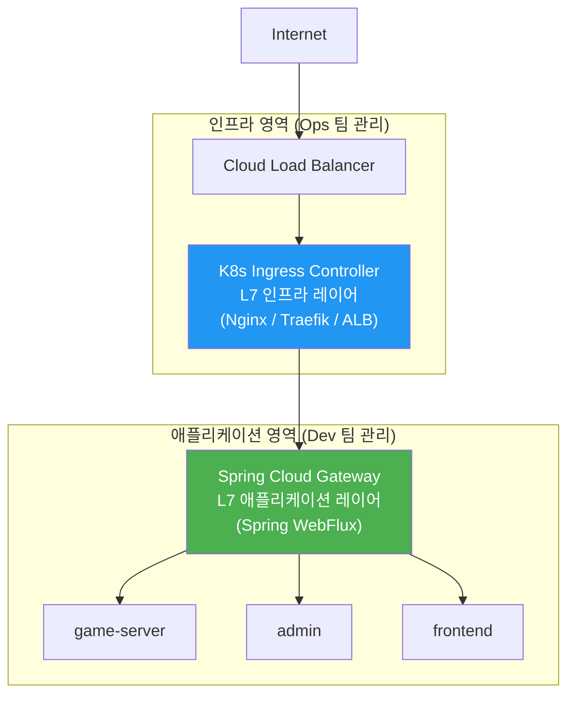

---

### 5.2 기능 상세 비교표

| 기능 | K8s Ingress | Spring Cloud Gateway |
|------|-------------|---------------------|
| **동작 레이어** | L7 인프라 (네트워크) | L7 애플리케이션 (코드) |
| **구성 방식** | YAML / Annotation (선언적) | YAML + Java/Kotlin 코드 |
| **경로 기반 라우팅** | ✅ 기본 지원 | ✅ 기본 지원 |
| **호스트 기반 라우팅** | ✅ 기본 지원 | ✅ 기본 지원 |
| **헤더/쿼리 기반 라우팅** | ⚠️ 일부 컨트롤러만 | ✅ 완전 지원 |
| **JWT 인증/인가** | ⚠️ 외부 플러그인 필요 | ✅ Spring Security 통합 |
| **비즈니스 로직 구현** | ❌ 불가 | ✅ 완전 지원 |
| **서킷브레이커** | ❌ 미지원 | ✅ Resilience4j 통합 |
| **Rate Limiting** | ⚠️ 컨트롤러 의존 (단순) | ✅ Redis 기반 정밀 제어 |
| **요청/응답 변환** | ⚠️ 헤더 조작만 가능 | ✅ Body 포함 완전 변환 |
| **BFF 패턴 (응답 집계)** | ❌ 불가 | ✅ 구현 가능 |
| **WebSocket** | ⚠️ 설정 필요 | ✅ 기본 지원 |
| **SSE (Server-Sent Events)** | ✅ 지원 | ✅ 지원 |
| **Canary 배포** | ⚠️ 컨트롤러별 제한 | ✅ Weight Predicate |
| **동적 라우팅** | ❌ 재배포 필요 | ✅ 런타임 변경 가능 |
| **서비스 디스커버리** | ✅ K8s Service 기반 | ✅ DiscoveryClient 연동 |
| **TLS 종료** | ✅ 클러스터 경계에서 | ⚠️ 내부 처리 (보통 Ingress에 위임) |
| **리소스 사용량** | 🟢 매우 낮음 (Nginx: ~50MB) | 🟡 보통~높음 (JVM: 256MB+) |
| **처리 성능** | 🟢 매우 높음 | 🟡 높음 (논블로킹이나 JVM 오버헤드) |
| **콜드 스타트** | 🟢 없음 | 🔴 JVM 기동 시간 (GraalVM으로 개선 가능) |
| **플랫폼 이식성** | ⚠️ 컨트롤러에 따라 다름 | ✅ JVM 어디서나 동일 |
| **관찰가능성** | ⚠️ 컨트롤러 기능에 의존 | ✅ Micrometer/Sleuth/Zipkin 통합 |
| **Spring 의존성** | ❌ 없음 | ✅ Spring 생태계 필요 |
| **학습 곡선** | 🟢 낮음 (YAML) | 🟡 중간 (리액티브 이해 필요) |

---

### 5.3 SCG만 있으면 Ingress 없어도 되나?

> **결론: 기술적으로는 가능합니다. 하지만 상황에 따라 트레이드오프가 있습니다.**

K8s Ingress의 본질적 역할은 **"외부 트래픽을 클러스터 내부로 끌어들이는 진입점"** 입니다.  
이 역할은 Ingress Controller 없이도 `LoadBalancer` 타입의 Service로 대체할 수 있습니다.

```mermaid
graph TD
    subgraph A["방식 1: Ingress + SCG (권장)"]
        direction LR
        I1[Internet] --> LB1[Cloud LB]
        LB1 --> IC["Ingress Controller<br/>TLS 종료 · 도메인 라우팅"]
        IC --> SCG1["Spring Cloud Gateway<br/>인증 · 서킷브레이커"]
        SCG1 --> SVC1[backend Services]
    end

    subgraph B["방식 2: SCG 단독 (LoadBalancer Service)"]
        direction LR
        I2[Internet] --> LB2[Cloud LB\nLoadBalancer Service]
        LB2 --> SCG2["Spring Cloud Gateway<br/>TLS + 인증 + 라우팅 모두 처리"]
        SCG2 --> SVC2[backend Services]
    end

    subgraph C["방식 3: SCG 단독 (NodePort, 로컬 개발)"]
        direction LR
        I3[localhost:8090] --> NP[NodePort]
        NP --> SCG3[Spring Cloud Gateway]
        SCG3 --> SVC3[backend Services]
    end

    style IC fill:#2196F3,color:#fff
    style SCG1 fill:#4CAF50,color:#fff
    style SCG2 fill:#FF9800,color:#fff
    style SCG3 fill:#9E9E9E,color:#fff
```

```yaml
# 방식 2: Ingress 없이 SCG를 직접 외부에 노출
apiVersion: v1
kind: Service
metadata:
  name: api-gateway
  namespace: rummikub
spec:
  type: LoadBalancer        # 클라우드 LB 자동 생성 (Ingress Controller 불필요)
  selector:
    app: api-gateway
  ports:
    - name: https
      port: 443
      targetPort: 8443      # SCG 내부에서 TLS 처리
    - name: http
      port: 80
      targetPort: 8090
```

```yaml
# SCG application.yml — TLS를 SCG 자체에서 처리 (Ingress 없는 경우)
server:
  port: 8443
  ssl:
    enabled: true
    key-store: classpath:keystore.p12
    key-store-password: ${SSL_KEYSTORE_PASSWORD}
    key-store-type: PKCS12
    key-alias: rummikub
```

#### 방식별 장단점 비교

| 항목 | Ingress + SCG | SCG 단독 (LoadBalancer) | SCG 단독 (NodePort) |
|------|---------------|------------------------|---------------------|
| **구조 복잡도** | 높음 (2레이어) | 낮음 (1레이어) | 매우 낮음 |
| **TLS 관리** | Ingress에서 중앙 관리 | SCG 자체 처리 (keystore) | 선택적 |
| **cert-manager 연동** | ✅ 자연스러운 연동 | ❌ 별도 구성 필요 | ❌ |
| **클라우드 WAF 연동** | ✅ ALB/AGIC WAF 활용 가능 | ❌ 불가 | ❌ |
| **클라우드 ACM/Key Vault** | ✅ 자동 인증서 관리 | ❌ 수동 keystore 관리 | ❌ |
| **여러 도메인 멀티 테넌시** | ✅ Ingress 다중 host 지원 | ⚠️ SCG에서 직접 처리 | ❌ |
| **비용** | Cloud LB 1개 | Cloud LB 1개 | 추가 비용 없음 |
| **로컬 개발 적합성** | ⚠️ Ingress Controller 설치 필요 | ⚠️ | ✅ 가장 단순 |
| **운영 포트 관리** | Ingress가 80/443 표준 포트 | SCG가 80/443 직접 수신 | 커스텀 포트 |

#### SCG 단독으로 충분한 상황

```
✅ 도메인이 단일 서비스 하나뿐 (멀티 테넌시 불필요)
✅ 클라우드 관리형 WAF, ACM 인증서 자동 갱신이 불필요
✅ TLS 인증서를 SCG keystore로 직접 관리할 수 있음
✅ Spring 팀이 인프라까지 통합 관리 (Ops/Dev 분리 불필요)
✅ 온프레미스 또는 클라우드 관리형 기능을 쓰지 않는 환경
```

#### Ingress가 반드시 필요한 상황

```
🔴 AWS ACM / Azure Key Vault 인증서 자동 관리가 필요한 경우
🔴 클라우드 관리형 WAF를 Ingress 레벨에서 적용해야 하는 경우
🔴 cert-manager로 Let's Encrypt 자동 갱신을 사용하는 경우
🔴 여러 네임스페이스/팀이 서로 다른 도메인을 하나의 LB IP로 공유하는 경우
🔴 Ops 팀과 Dev 팀의 관리 영역을 명확히 분리해야 하는 조직 구조
🔴 Kubernetes Gateway API로의 마이그레이션을 계획 중인 경우
```

> **한 줄 요약**: SCG는 Ingress의 기능을 코드 레벨에서 모두 구현할 수 있지만, 클라우드 인프라 연동·인증서 자동 관리·Ops/Dev 역할 분리 측면에서는 Ingress와 함께 쓰는 것이 여전히 더 실용적입니다.

---

### 5.4 의사결정 가이드

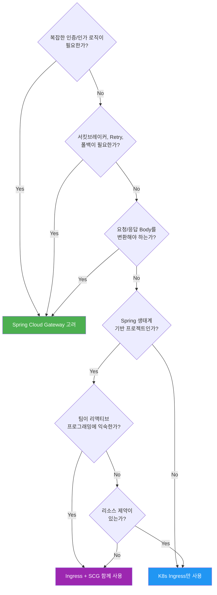

---

### 5.5 Rummikub 서비스에서의 선택 기준

| 요구사항 | K8s Ingress | Spring Cloud Gateway |
|---------|-------------|---------------------|
| `/` → frontend 라우팅 | ✅ 충분 | ✅ 가능 |
| `/api` → game-server | ✅ 충분 | ✅ 가능 |
| `/ws` WebSocket | ✅ (설정 필요) | ✅ 기본 지원 |
| `/admin` 관리자 접근 | ⚠️ IP 제한만 | ✅ 역할 기반 세밀 제어 |
| 게임 세션 토큰 검증 | ❌ | ✅ |
| 게임방 상태 기반 라우팅 | ❌ | ✅ |
| 동시 접속 Rate Limiting | ⚠️ 단순 RPS만 | ✅ 사용자별 세밀 제어 |
| 서버 점검 폴백 | ❌ | ✅ |

**환경별 권장 구성:**

```
로컬 개발:    NodePort (포트 직접 접근) 또는 K3s Traefik Ingress
스테이징:     Traefik Ingress + SCG (현재 ingress.yaml 구조)
클라우드 운영: ALB/AGIC Ingress + SCG (TLS·WAF는 클라우드에, 인증·로직은 SCG에)
```

**결론**: Rummikub처럼 실시간 게임 서비스는 **Ingress + SCG 병행 사용**이 적합합니다.  
TLS 종료·외부 노출은 Ingress가, 인증·게임 로직 라우팅은 SCG가 담당합니다.

---

## Part 6. 함께 사용하는 패턴 — Ingress + SCG

실제 프로덕션 환경에서는 두 기술을 **역할에 따라 계층적으로 결합**하는 것이 엔터프라이즈 표준입니다.

### 6.1 권장 아키텍처와 역할 분담

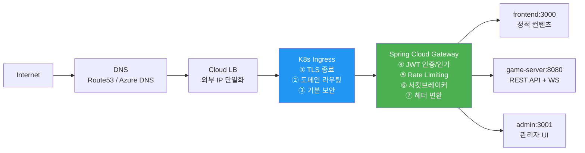

| 책임 | 담당 | 이유 |
|------|------|------|
| TLS/HTTPS 종료 | K8s Ingress | 인프라 레벨에서 인증서 중앙 관리 효율 |
| 도메인/경로 기반 외부 라우팅 | K8s Ingress | 선언적 YAML, 운영팀 독립적 관리 |
| DDoS 기본 방어, WAF | K8s Ingress (클라우드 ALB/AGIC) | 클라우드 관리형 서비스 활용 |
| JWT 토큰 검증 | Spring Cloud Gateway | 비즈니스 로직, 개발팀이 코드로 관리 |
| 사용자 컨텍스트 주입 | Spring Cloud Gateway | 다운스트림에 사용자 정보 전달 |
| 서킷브레이커/Retry | Spring Cloud Gateway | 서비스 복원력 패턴 |
| 세밀한 Rate Limiting | Spring Cloud Gateway | 사용자/역할별 제어 |
| BFF 패턴 응답 집계 | Spring Cloud Gateway | 코드로만 구현 가능 |

---

### 6.2 완전한 예시 YAML

```yaml
# K8s Ingress: TLS 종료 + 모든 트래픽을 SCG로 전달
apiVersion: networking.k8s.io/v1
kind: Ingress
metadata:
  name: rummikub-ingress
  namespace: rummikub
  annotations:
    traefik.ingress.kubernetes.io/router.entrypoints: websecure
    traefik.ingress.kubernetes.io/router.tls: "true"
spec:
  ingressClassName: traefik
  tls:
    - hosts:
        - rummikub.localhost
      secretName: rummikub-tls
  rules:
    - host: rummikub.localhost
      http:
        paths:
          - path: /
            pathType: Prefix
            backend:
              service:
                name: api-gateway    # Spring Cloud Gateway
                port:
                  number: 8090
```

```yaml
# Spring Cloud Gateway: application.yml — 내부 라우팅 및 비즈니스 로직
spring:
  cloud:
    gateway:
      routes:
        # WebSocket — SCG에서 직접 game-server로 (필터 최소화)
        - id: game-websocket
          uri: ws://game-server:8080
          predicates:
            - Path=/ws/**

        # API — JWT 인증 후 game-server로
        - id: game-api
          uri: http://game-server:8080
          predicates:
            - Path=/api/**
          filters:
            - name: AuthenticationFilter   # JWT 검증
            - name: CircuitBreaker
              args:
                name: gameServerCB
                fallbackUri: forward:/fallback/game

        # 관리자 — ROLE_ADMIN 확인 후 admin으로
        - id: admin
          uri: http://admin:3001
          predicates:
            - Path=/admin/**
          filters:
            - name: AdminAuthFilter        # ROLE_ADMIN 검증

        # 프론트엔드 — 인증 없이
        - id: frontend
          uri: http://frontend:3000
          predicates:
            - Path=/**
```

---

### 6.3 전체 트래픽 흐름

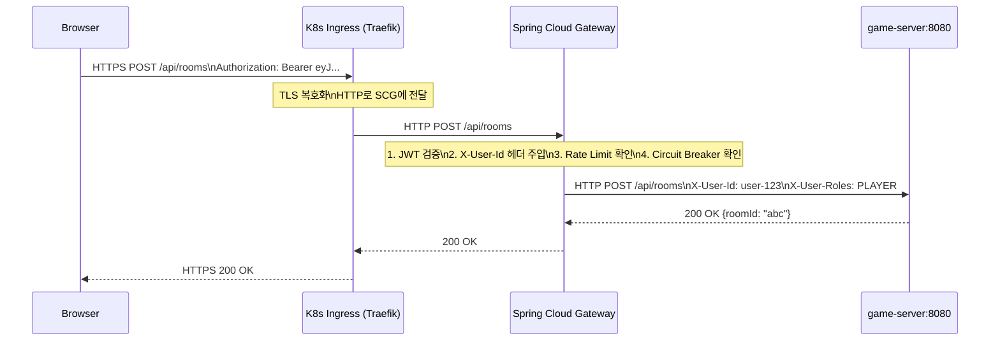

---

## Part 7. 대안과 미래 방향

### 7.1 Gateway API — 차세대 K8s 표준

Kubernetes는 Ingress의 한계를 극복하기 위해 **Gateway API**를 개발했습니다 (GA: v1.0, 2023년).  
F5 NGINX Gateway Fabric도 이 Gateway API 기반으로 구축됩니다.

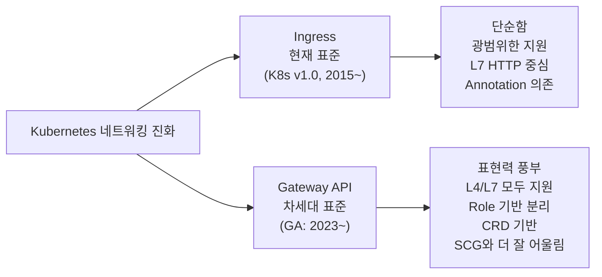

```yaml
# Gateway API 예시 (Ingress를 대체하는 미래 방향)
apiVersion: gateway.networking.k8s.io/v1
kind: HTTPRoute
metadata:
  name: rummikub-route
spec:
  parentRefs:
    - name: rummikub-gateway
  hostnames:
    - rummikub.example.com
  rules:
    - matches:
        - path:
            type: PathPrefix
            value: /api
      backendRefs:
        - name: api-gateway    # SCG로 전달
          port: 8090
    - matches:
        - path:
            type: PathPrefix
            value: /
      backendRefs:
        - name: frontend
          port: 3000
```

> **참고**: Spring Cloud Gateway 4.x부터 Gateway API(HTTPRoute)를 직접 지원합니다.

---

### 7.2 Service Mesh — Istio와의 비교

| 항목 | Ingress | Spring Cloud Gateway | Service Mesh (Istio) |
|------|---------|---------------------|---------------------|
| **역할** | 외부 진입점 | 앱 레벨 게이트웨이 | 서비스 간 통신 제어 |
| **트래픽 방향** | North-South | North-South | East-West |
| **주요 기능** | 라우팅, TLS 종료 | 인증, 서킷브레이커 | mTLS, 트레이싱 |
| **복잡도** | 낮음 | 중간 | 높음 (사이드카) |
| **함께 사용** | ✅ | ✅ | ✅ (Ingress → SCG → Mesh) |

---

### 7.3 진화 로드맵

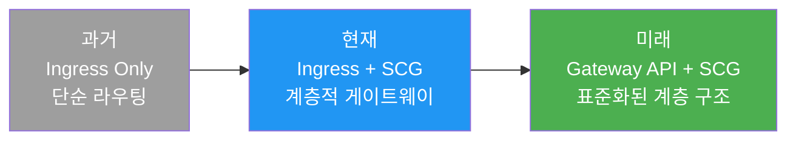

---

## Part 8. Best Practices

### 8.1 Ingress 보안

```yaml
# 관리자 경로 IP 화이트리스트 (Nginx)
metadata:
  annotations:
    nginx.ingress.kubernetes.io/whitelist-source-range: "192.168.1.0/24,10.0.0.0/8"

# HSTS 및 보안 헤더 추가
nginx.ingress.kubernetes.io/configuration-snippet: |
  more_set_headers "Strict-Transport-Security: max-age=31536000; includeSubDomains";
  more_set_headers "X-Frame-Options: DENY";
  more_set_headers "X-Content-Type-Options: nosniff";
  more_set_headers "Referrer-Policy: strict-origin-when-cross-origin";
```

---

### 8.2 WebSocket 안정성

WebSocket은 장기 연결을 유지하기 때문에 **타임아웃 설정**이 가장 중요합니다.

```yaml
# Nginx — WebSocket 장기 연결 설정
annotations:
  nginx.ingress.kubernetes.io/proxy-read-timeout: "3600"
  nginx.ingress.kubernetes.io/proxy-send-timeout: "3600"
  nginx.ingress.kubernetes.io/configuration-snippet: |
    proxy_set_header Upgrade $http_upgrade;
    proxy_set_header Connection "Upgrade";

# AWS ALB — idle timeout 연장
alb.ingress.kubernetes.io/load-balancer-attributes: |
  idle_timeout.timeout_seconds=3600

# OpenShift HAProxy
haproxy.router.openshift.io/timeout: 1h
```

```yaml
# Spring Cloud Gateway — WebSocket 라우트 최적화
- id: game-websocket
  uri: ws://game-server:8080
  predicates:
    - Path=/ws/**
  # ⚠️ WebSocket 라우트에는 필터를 최소화할 것
  # Body 변환 필터, 버퍼링 필터 등은 WebSocket 연결을 끊을 수 있음
```

---

### 8.3 SCG 성능 튜닝

```yaml
# application.yml — 연결 풀 및 타임아웃 설정
spring:
  cloud:
    gateway:
      httpclient:
        connect-timeout: 2000          # 연결 타임아웃 2초
        response-timeout: 30s          # 응답 타임아웃 30초
        pool:
          type: elastic
          max-idle-time: 15s
          max-life-time: 60s
      filter:
        request-rate-limiter:
          deny-empty-key: false

# JVM 튜닝 (컨테이너 환경)
# JAVA_OPTS: "-XX:+UseContainerSupport -XX:MaxRAMPercentage=75.0"
```

---

### 8.4 모니터링

**Ingress 모니터링:**
```bash
# Nginx Ingress 메트릭 확인 (Prometheus 연동)
kubectl get pods -n ingress-nginx
kubectl exec -n ingress-nginx <pod> -- nginx -T | grep upstream

# Traefik 대시보드 (포트포워딩)
kubectl port-forward -n kube-system svc/traefik 8080:8080
# 브라우저에서 http://localhost:8080/dashboard 접속
```

**Spring Cloud Gateway 모니터링:**
```yaml
# Prometheus + Grafana 연동
management:
  endpoints:
    web:
      exposure:
        include: health,gateway,prometheus,info
  metrics:
    tags:
      application: rummikub-gateway
    export:
      prometheus:
        enabled: true

# 유용한 SCG 메트릭
# spring_cloud_gateway_requests_seconds_count — 요청 수
# spring_cloud_gateway_requests_seconds_sum  — 응답 시간 합계
# spring_cloud_gateway_routes_count          — 등록된 라우트 수
```

```bash
# 런타임 라우트 확인
curl http://api-gateway:8090/actuator/gateway/routes | jq .

# 특정 라우트 삭제
curl -X DELETE http://api-gateway:8090/actuator/gateway/routes/{routeId}
```

---

### 8.5 멀티 네임스페이스 전략

```yaml
# 각 팀/서비스마다 별도 Ingress 리소스 사용
# namespace: rummikub → ingress: rummikub-ingress → SCG: api-gateway
# namespace: billing  → ingress: billing-ingress  → SCG: billing-gateway
# namespace: auth     → ingress: auth-ingress

# 단, 모든 Ingress는 동일한 Ingress Controller(외부 IP)를 공유
# SCG는 namespace별로 독립 배포 (서로 다른 인증/라우팅 로직)
```

---

### 8.6 Helm 환경별 설정 분리

```yaml
# values.yaml (로컬/개발)
ingress:
  enabled: true
  className: traefik
  host: rummikub.localhost
  tls:
    enabled: true
    secretName: rummikub-tls
  annotations:
    traefik.ingress.kubernetes.io/router.entrypoints: websecure

gateway:
  enabled: true          # 로컬에서는 SCG 옵셔널
  replicas: 1
  image: rummikub/api-gateway:dev
```

```yaml
# values-prod.yaml (운영)
ingress:
  className: nginx
  host: rummikub.example.com
  annotations:
    nginx.ingress.kubernetes.io/ssl-redirect: "true"
    cert-manager.io/cluster-issuer: letsencrypt-prod

gateway:
  enabled: true
  replicas: 3            # HA 구성
  image: rummikub/api-gateway:1.2.0
  resources:
    requests:
      memory: "512Mi"
      cpu: "500m"
    limits:
      memory: "1Gi"
      cpu: "1000m"
```

---

### 8.7 GraalVM Native Image로 SCG 콜드 스타트 개선

JVM 기동 시간은 SCG의 대표적인 단점입니다. GraalVM Native Image로 이를 크게 개선할 수 있습니다.

```dockerfile
# Dockerfile — GraalVM Native Image 빌드
FROM ghcr.io/graalvm/native-image:22 AS builder
WORKDIR /app
COPY . .
RUN ./mvnw -Pnative native:compile -DskipTests

FROM ubuntu:22.04
WORKDIR /app
COPY --from=builder /app/target/api-gateway .
EXPOSE 8090
ENTRYPOINT ["./api-gateway"]
# 결과: JVM 기동 수 초 → Native 수십 밀리초
# 메모리: JVM 512MB+ → Native ~80MB
```

---

## 요약 마인드맵

```mermaid
mindmap
  root(("API Gateway<br/>전략"))
    K8s Ingress
      필요성
        비용 절감 LB 1개
        중앙 TLS 관리
        유연한 라우팅
      핵심 개념
        Ingress Resource
        Ingress Controller
        IngressClass
      플랫폼별
        K3s Traefik 예시
        순수 K8s Nginx EOL
        OpenShift Route
        AWS ALB Controller
        Azure AGIC
      TLS 처리
        Edge Termination
        Passthrough
        Re-encryption
    Spring Cloud Gateway
      필요성
        인증/인가 로직
        서킷브레이커
        동적 라우팅
        응답 변환 BFF
      핵심 개념
        Route
        Predicate
        Filter GlobalFilter
      주요 기능
        JWT 검증
        Rate Limiting Redis
        Resilience4j
        동적 라우트 변경
      운영
        Actuator 모니터링
        GraalVM Native
    함께 사용
      역할 분담
        Ingress TLS 종료
        SCG 앱 로직
        Ops팀 Dev팀 분리
      SCG 단독 가능
        LoadBalancer Service
        트레이드오프 존재
    미래 방향
      Gateway API
        HTTPRoute
        SCG 4x 지원
      Service Mesh Istio
        East-West 트래픽
```

---

*이 문서는 `helm/templates/ingress.yaml` 예시 기반으로 작성되었습니다.*  
*Kubernetes v1.29+ · Traefik v3.x · Spring Cloud Gateway 4.x 기준*
