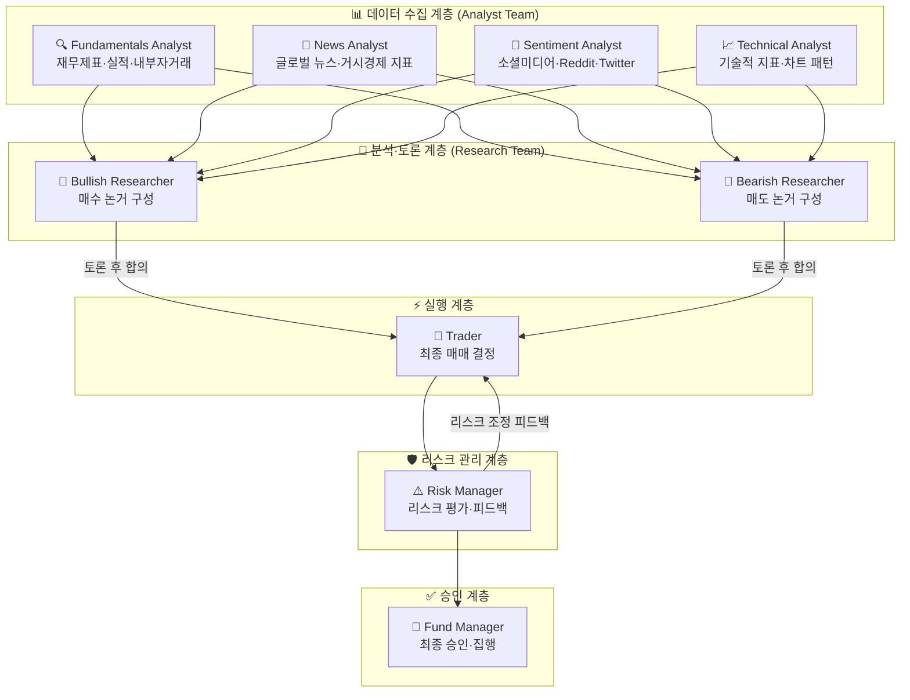
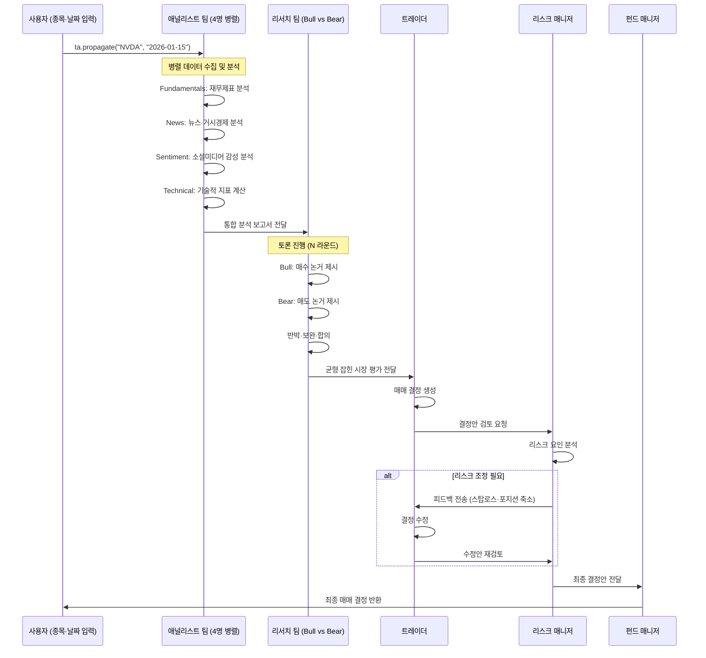
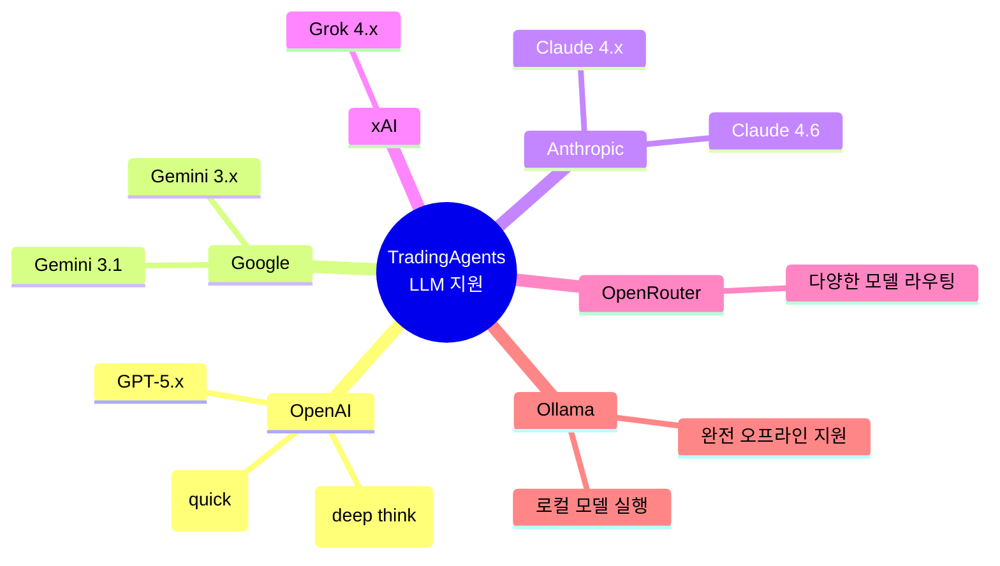
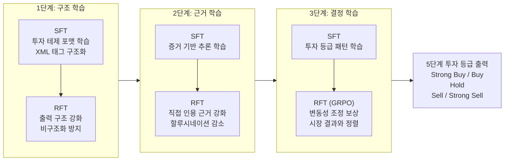

> **작성일**: 2026년 3월 23일  
> **출처**: [GitHub - TauricResearch/TradingAgents](https://github.com/TauricResearch/TradingAgents) | arXiv:2412.20138 | arXiv:2509.11420  
> **현재 버전**: v0.2.2 (2026년 3월 기준)

---

## 목차

1. [개요: 무엇이 특별한가?](#1-개요)
2. [배경: 왜 멀티에이전트인가?](#2-배경)
3. [시스템 아키텍처: 7개 에이전트의 분업 구조](#3-아키텍처)
4. [의사결정 흐름: 분석에서 실행까지](#4-의사결정-흐름)
5. [기술 스택: LangGraph와 LLM 생태계](#5-기술-스택)
6. [Trading-R1: 강화학습으로 만든 금융 추론 모델](#6-trading-r1)
7. [성능 지표와 실험 결과](#7-성능)
8. [설치 및 사용법](#8-설치-및-사용법)
9. [한계와 주의사항](#9-한계)
10. [멀티에이전트 시대의 의미](#10-의미-및-전망)

---

## 1. 개요

TradingAgents는 UCLA 출신 연구진이 중심이 된 Tauric Research가 공개한 오픈소스 멀티에이전트 금융 트레이딩 프레임워크다. 이 프로젝트의 핵심 아이디어는 단순하지만 강력하다. "실제 헤지펀드가 일하는 방식을 그대로 AI 에이전트로 재현하자."

실제 금융 투자 회사에는 다양한 전문가가 존재한다. 기업의 재무제표를 분석하는 펀더멘털 애널리스트, 뉴스의 시장 영향을 평가하는 뉴스 애널리스트, 차트와 기술적 지표를 분석하는 테크니컬 애널리스트, 소셜 미디어 여론을 읽는 센티멘트 애널리스트, 이들의 분석을 종합해 포지션을 취하는 트레이더, 그리고 리스크를 관리하는 리스크 매니저가 서로 정보를 교환하고 토론하며 최종 매매 결정을 내린다. TradingAgents는 이 구조를 LLM(대형 언어 모델) 에이전트들의 협업 시스템으로 구현했다.

논문은 2024년 12월 처음 arXiv에 공개되었고, 커뮤니티의 폭발적 관심 속에 전체 코드가 오픈소스로 공개되었다. 이후 빠르게 버전을 올리며 2026년 3월 현재 v0.2.2까지 출시된 상태다. GPT-5.4, Gemini 3.1, Claude 4.6 등 최신 모델 지원과 Anthropic의 effort control, OpenAI Responses API 통합까지 이루어졌다.

---

## 2. 배경

### 기존 AI 트레이딩 시스템의 한계

AI를 금융 트레이딩에 적용하려는 시도는 오래전부터 있었다. 초기 접근방식은 주로 두 가지였다. 하나는 LSTM, Transformer 기반의 시계열 예측 모델로, 주가 패턴을 학습해 다음 가격을 예측하는 방식이다. 다른 하나는 특정 작업(예: 뉴스 감성 분석, 재무제표 파싱)에 특화된 단일 LLM 에이전트를 활용하는 방식이다.

그러나 이 두 방식 모두 근본적인 한계를 가지고 있었다. 시계열 모델은 수치 패턴은 잘 학습하지만 뉴스, 감성, 거시경제 이벤트 같은 비정형 정보를 통합하지 못한다. 반면 단일 LLM 에이전트는 이러한 다양한 데이터를 이해하는 능력은 갖고 있지만, 전문 분야 깊이가 부족하고 모든 분석을 혼자 처리하려다 보니 각 영역에서의 품질이 낮아지는 경향이 있었다.

### 멀티에이전트 협업 접근법의 등장

TradingAgents의 연구진은 이 문제를 해결하기 위해 역할 분업이라는 개념을 도입했다. LLM에 특정 역할, 목표, 제약조건, 그리고 전용 도구를 부여하면 해당 영역에서 훨씬 깊이 있는 분석을 수행한다는 관찰에서 출발했다. 마치 기업 조직에서 전문화가 전체 성과를 높이는 것처럼, AI 에이전트도 역할을 분리하면 더 나은 집단 지성을 발휘할 수 있다는 것이다.

특히 Bull(강세론) 연구원과 Bear(약세론) 연구원이 서로 반대 입장에서 토론하는 구조는 실제 투자은행의 리서치 팀이 내부적으로 상반된 뷰를 경쟁시키는 방식을 모방한 것이다. 이 토론 메커니즘을 통해 시스템은 단순히 낙관적 분석만 생산하거나 편향된 결론에 빠지는 것을 방지한다.

---

## 3. 아키텍처

TradingAgents의 전체 시스템은 크게 5개 계층으로 구성된다: 애널리스트 팀 → 리서치 팀 → 트레이더 → 리스크 관리 팀 → 펀드 매니저. 이 계층을 구성하는 핵심 에이전트는 총 7개 역할로 구분된다.



### 3.1 애널리스트 팀 (Analyst Team)

애널리스트 팀은 4개의 전문 에이전트로 구성되며, 이들은 병렬로 동시에 시장 데이터를 수집하고 분석한다. 각 에이전트는 자신의 역할에 특화된 도구 세트를 부여받는다.

**펀더멘털 애널리스트(Fundamentals Analyst)** 는 기업의 내재 가치를 평가하는 전통적인 기본적 분석을 담당한다. 손익계산서, 대차대조표, 현금흐름표 같은 재무제표를 분석하고, 분기별 실적 보고서, 내부자 거래 정보, 그리고 기타 기업 관련 데이터를 종합해 해당 주식이 현재 저평가되어 있는지 혹은 고평가되어 있는지를 판단한다. FinnHub API를 통해 실시간 금융 데이터에 접근한다.

**뉴스 애널리스트(News Analyst)** 는 글로벌 뉴스 흐름과 거시경제 지표를 모니터링한다. 중앙은행 정책 결정, 지정학적 이벤트, 산업 규제 변화, 경제 지표 발표 등 시장 전체에 영향을 미치는 외부 요인들을 해석하고 그것이 특정 종목이나 섹터에 미치는 파급효과를 분석한다.

**센티멘트 애널리스트(Sentiment Analyst)** 는 소셜 미디어와 대중의 심리를 분석하는 에이전트다. Reddit, X(구 Twitter) 등의 플랫폼에서 특정 종목에 대한 언급을 수집하고 감성 점수 알고리즘을 통해 단기 시장 분위기를 정량화한다. 밈 주식 열풍이나 갑작스러운 여론 변화 같은 소셜 미디어 주도 가격 변동을 포착하는 데 특화되어 있다.

**테크니컬 애널리스트(Technical Analyst)** 는 차트 패턴과 기술적 지표를 분석한다. 이동평균선(MA), 상대강도지수(RSI), MACD, 볼린저 밴드 등 다양한 기술적 지표를 계산하고 코드를 직접 실행해 트레이딩 패턴을 식별하며 가격 방향성을 예측한다.

### 3.2 리서치 팀 (Research Team)

리서치 팀은 애널리스트 팀이 수집한 모든 정보를 넘겨받아 이를 심층적으로 평가하고 투자 논거를 구성하는 역할을 한다. 이 팀의 가장 독특한 특징은 **강세론(Bullish) 연구원과 약세론(Bearish) 연구원이 명시적으로 상반된 입장을 취한다**는 점이다.

불리시 리서처는 매수 기회를 지지하는 긍정적 지표, 성장 잠재력, 유리한 시장 조건을 부각시키는 논거를 구성한다. 반면 베어리시 리서처는 부정적 지표, 리스크 요인, 불리한 시장 조건을 강조하는 매도 논거를 구성한다. 두 연구원은 설정된 라운드 수만큼 토론을 진행하며, 이 과정에서 서로의 주장을 반박하고 보완한다. 이 토론 프로세스를 통해 최종적으로 균형 잡힌 시장 평가가 도출된다.

### 3.3 트레이더 (Trader)

트레이더 에이전트는 리서치 팀의 토론 결과와 애널리스트들의 분석, 그리고 과거 거래 데이터를 종합해 최종 매매 결정을 내린다. 단순히 매수/매도/보유를 결정하는 것이 아니라 포지션의 크기, 타이밍, 진입 가격 조건 등 실제 집행 가능한 수준의 의사결정을 수행한다. 트레이더는 다양한 리스크 프로파일을 가질 수 있으며, 공격적 트레이더와 보수적 트레이더로 구성해 서로 다른 성격의 포트폴리오 전략을 실험할 수 있다.

### 3.4 리스크 관리 팀 (Risk Management Team)

리스크 매니저는 트레이더의 결정을 독립적으로 검토하고 현재 시장 환경 대비 그 결정의 리스크를 평가하는 역할을 한다. 시장 변동성, 유동성, 상대방 리스크 등 다양한 리스크 요인을 분석하고, 필요 시 스탑로스 설정이나 포지션 축소 같은 리스크 완화 전략을 트레이더에게 피드백으로 전달한다. 이 피드백 루프를 통해 트레이더는 자신의 결정을 수정할 수 있다.

### 3.5 펀드 매니저 (Fund Manager)

펀드 매니저는 최종 승인권을 가진 에이전트로, 트레이더와 리스크 매니저의 합의가 이루어지면 최종적으로 거래를 승인하고 집행 명령을 내린다. 포트폴리오 전체 수준에서 해당 거래가 전략적 목표와 리스크 허용 범위에 부합하는지를 검토하는 최후의 검문소 역할을 한다.

---

## 4. 의사결정 흐름



하나의 `propagate()` 호출이 실행되면, 내부적으로는 위 흐름에 따라 수십 번의 LLM API 호출이 연쇄적으로 일어난다. 각 에이전트는 이전 단계의 출력을 컨텍스트로 받아 자신의 분석을 수행하고, 그 결과를 다음 에이전트에게 전달한다. LangGraph는 이 복잡한 상태 전이와 메시지 라우팅을 관리하는 그래프 엔진 역할을 한다.

---

## 5. 기술 스택

### LangGraph 기반 설계

TradingAgents는 LangChain 생태계의 LangGraph를 핵심 오케스트레이션 엔진으로 사용한다. LangGraph는 에이전트들의 상태(State)를 그래프 노드로 모델링하고, 에이전트 간 메시지 전달을 엣지로 표현해 복잡한 멀티에이전트 워크플로를 체계적으로 관리할 수 있게 해준다. 단순한 체인(Chain)과 달리 조건부 분기, 루프, 병렬 실행이 모두 가능하기 때문에 Bull/Bear 토론 루프나 리스크 피드백 루프 같은 복잡한 상호작용을 자연스럽게 표현할 수 있다.

### 지원 LLM 프로바이더



시스템 내부적으로 LLM은 두 가지 역할로 구분되어 사용된다. **Deep Think LLM**은 복잡한 추론이 필요한 작업, 즉 Bull/Bear 토론이나 최종 매매 결정 같은 고차원 사고 작업에 사용된다. **Quick Think LLM**은 데이터 수집, 요약, 간단한 판단 같은 반복적인 작업에 사용된다. 이를 통해 비용을 최적화하면서도 중요한 판단의 품질을 유지한다.

### 데이터 소스

금융 데이터는 주로 FinnHub API(무료 티어 지원)와 Alpha Vantage를 통해 수집한다. 소셜 미디어 감성 분석을 위해서는 Reddit API와 X/Twitter API를 활용한다. 기술적 지표는 Python 코드 실행 환경에서 직접 계산된다.

### 설정 가능한 파라미터

```python
config = DEFAULT_CONFIG.copy()
config["llm_provider"] = "anthropic"      # LLM 프로바이더 선택
config["deep_think_llm"] = "claude-4-6"  # 심층 추론용 모델
config["quick_think_llm"] = "claude-4-haiku" # 빠른 작업용 모델
config["max_debate_rounds"] = 2           # Bull/Bear 토론 라운드 수
```

토론 라운드 수를 늘릴수록 분석의 깊이는 높아지지만 API 호출 비용과 응답 시간도 증가한다. 연구팀은 비용 효율성을 위해 테스트 시에는 `o4-mini`나 `gpt-4.1-mini` 같은 소형 모델을 권장한다.

---

## 6. Trading-R1

TradingAgents가 멀티에이전트 협업 시스템이라면, Trading-R1은 그 에이전트들이 더 잘 추론하도록 만들기 위한 금융 특화 언어 모델이다. 2025년 9월 기술 보고서가 arXiv(2509.11420)에 공개되었으며, 현재 터미널(Trading-R1 Terminal)이 GitHub에서 준비 중이다.

### 핵심 문제의식

일반 목적 LLM은 자연어 이해 능력은 뛰어나지만, 실제 트레이딩에 필요한 '훈련된 규율'이 부족하다. 즉, 분석 결과를 구체적이고 실행 가능한 매매 결정으로 연결하는 과정에서 일관성이 떨어지고, 증거에 근거하지 않은 주장을 생성하는 경향이 있다. Trading-R1은 이 문제를 해결하고자 설계된 금융 추론 특화 모델이다.

### 훈련 데이터: Tauric-TR1-DB

Trading-R1의 훈련에는 18개월 기간, 14개 종목, 5가지 이질적 금융 데이터 소스를 포함한 10만 개 샘플 규모의 Tauric-TR1-DB 코퍼스가 사용되었다. 이 데이터셋은 기술적 시장 데이터, 펀더멘털 데이터, 뉴스, 내부자 감성, 거시경제 지표 등 다양한 모달리티를 통합하고 있다. 단순히 데이터를 모아둔 것이 아니라, 역방향 추론 증류(Reverse Reasoning Distillation)라는 독자적 방법으로 고품질 추론 궤적을 생성해 학습 데이터로 활용했다.

### 3단계 커리큘럼 훈련



1단계(구조)에서는 전문 투자 테제의 체계적 형식을 학습한다. 2단계(주장)에서는 모든 비자명한 주장이 직접 인용이나 출처로 뒷받침되도록 훈련해 할루시네이션을 줄인다. 3단계(결정)에서는 변동성 조정 결과 보상을 통해 최종 결정을 시장 역학과 정렬시킨다.

강화학습 알고리즘으로는 GRPO(Group Relative Policy Optimization)를 사용했다. 이는 단순히 정답을 맞히는 것이 아니라, 여러 후보 출력물 중 상대적으로 더 나은 결정을 선호하도록 학습하는 방식이다.

### 백본 모델과 로컬 실행

Trading-R1 Terminal은 상업용 GPU에서 로컬 배포가 가능하도록 설계되었으며, 프라이버시 보존 워크플로를 지원한다. 백본 모델로는 Qwen3-4B가 사용되었는데, 이는 상대적으로 소형이면서도 추론 능력이 우수한 모델이다. 이를 통해 클라우드 API 없이 로컬 환경에서도 금융 추론 모델을 실행할 수 있다는 점이 주목할 만하다.

---

## 7. 성능

### TradingAgents 실험 결과

TradingAgents는 연간 누적 수익률 최대 30.5%를 달성했으며, 이는 전통적인 트레이딩 전략을 크게 상회하는 동시에 강건한 리스크 관리를 유지했다. 논문은 다음 지표들에서 기존 베이스라인 대비 우월한 성능을 보고하고 있다.

- **누적 수익률(Cumulative Returns)**: 기존 단일 에이전트 및 전통적 전략 대비 유의미한 초과 수익
- **샤프 지수(Sharpe Ratio)**: 리스크 대비 수익의 효율성 향상
- **최대 낙폭(Maximum Drawdown)**: 손실 구간 감소, 리스크 관리 개선

단, 이 결과들은 **백테스트** 기반이며, 실제 시장에서 동일한 성능이 보장되지 않는다는 점을 명확히 해야 한다.

### Trading-R1 실험 결과

6개 주요 주식 및 ETF를 대상으로 평가한 결과, Trading-R1은 오픈소스 및 독점 인스트럭션 팔로잉 모델과 추론 모델 모두와 비교해 개선된 리스크 조정 수익률과 낮은 낙폭을 보여주었다.

비교 대상 모델 군에는 GPT-4.1-nano, GPT-4.1-mini 같은 소형 LLM부터 GPT-4.1, LLaMA-3.3, Qwen3-32B 같은 대형 LLM, 그리고 DeepSeek, o3-mini, o4-mini 같은 강화학습 강화 모델(RLM)까지 포함되었다. Trading-R1은 특히 리스크 조정 성능(Sharpe Ratio)과 하방 리스크 제어(MDD) 측면에서 두각을 나타냈다.

---

## 8. 설치 및 사용법

### 기본 설치

```bash
# 저장소 클론
git clone https://github.com/TauricResearch/TradingAgents.git
cd TradingAgents

# 가상환경 생성 (Python 3.13 권장)
conda create -n tradingagents python=3.13
conda activate tradingagents

# 의존성 설치
pip install -r requirements.txt
```

### API 키 설정

```bash
# 금융 데이터 (필수 - 무료 티어 지원)
export FINNHUB_API_KEY=your_finnhub_key

# LLM 프로바이더 (하나 이상 선택)
export OPENAI_API_KEY=...       # OpenAI (GPT)
export ANTHROPIC_API_KEY=...    # Anthropic (Claude)
export GOOGLE_API_KEY=...       # Google (Gemini)
export XAI_API_KEY=...          # xAI (Grok)
export OPENROUTER_API_KEY=...   # OpenRouter
export ALPHA_VANTAGE_API_KEY=...# 추가 금융 데이터

# 로컬 모델 사용 시 (Ollama)
# config에서 llm_provider: "ollama" 설정
```

### CLI 실행

```bash
# 인터랙티브 CLI 실행
python -m cli.main

# 종목, 날짜, LLM, 분석 깊이 등을 선택하는 화면이 나타남
# 에이전트 진행 상황을 실시간으로 확인 가능
```

### Python 코드에서 사용

```python
from tradingagents.graph.trading_graph import TradingAgentsGraph
from tradingagents.default_config import DEFAULT_CONFIG

# 기본 설정으로 실행
ta = TradingAgentsGraph(debug=True, config=DEFAULT_CONFIG.copy())
_, decision = ta.propagate("NVDA", "2026-01-15")
print(decision)

# 커스텀 설정 예시
config = DEFAULT_CONFIG.copy()
config["llm_provider"] = "anthropic"
config["deep_think_llm"] = "claude-sonnet-4-6"
config["quick_think_llm"] = "claude-haiku-4-5"
config["max_debate_rounds"] = 3  # 토론 라운드 수 증가

ta = TradingAgentsGraph(debug=True, config=config)
_, decision = ta.propagate("AAPL", "2026-01-15")
print(decision)
```

---

## 9. 한계

### 연구용 목적의 시스템

연구팀은 문서에서 명확히 밝히고 있다. TradingAgents는 연구 목적으로 설계된 프레임워크이며, 실제 금융 투자나 트레이딩 조언으로 사용해서는 안 된다. 실제 트레이딩 성과는 선택한 LLM 모델, 모델 온도(temperature), 거래 기간, 데이터 품질, 그리고 기타 비결정론적 요인에 따라 크게 달라질 수 있다.

### 높은 API 비용

프레임워크는 하나의 매매 결정을 내리기 위해 수십 번의 LLM API 호출을 수행한다. 특히 GPT-5나 Claude 4 같은 최신 대형 모델을 Deep Think 용도로 사용할 경우, 단일 분석에 상당한 비용이 발생할 수 있다. 연구팀은 테스트 목적으로는 소형 모델(o4-mini, gpt-4.1-mini)을 사용할 것을 권장한다.

### 백테스트와 실전의 괴리

보고된 30.5% 연간 수익률 등의 성능 수치는 과거 데이터 백테스트 결과다. 실제 시장에서는 슬리피지, 시장 충격, 데이터 지연, 급변하는 시장 환경 등 백테스트에 반영되지 않는 수많은 변수가 존재한다. 따라서 백테스트 성과를 실전 성과의 예측치로 직접 사용하는 것은 위험하다.

### 비결정론적 특성

LLM의 비결정론적 특성상, 동일한 입력에 대해 매번 다른 출력이 나올 수 있다. 이는 시스템의 재현성을 제한하며, 백테스트 결과 자체도 실행마다 달라질 수 있다.

---

## 10. 의미 및 전망

### 멀티에이전트 분업 시대의 도래

TradingAgents가 주목받는 이유는 단순히 금융 분야에서의 성과 때문만이 아니다. 이 프로젝트는 **서브에이전트(Sub-agent) 아키텍처**가 실제로 어떻게 작동하는지를 보여주는 구체적 사례다. 단일 거대 모델이 모든 것을 처리하는 방식에서 벗어나, 전문화된 에이전트들이 역할을 분담하고 정보를 공유하며 협업하는 방식으로 패러다임이 이동하고 있다.

이 구조의 강점은 확장성과 유연성에 있다. 새로운 분석 역할이 필요하면 에이전트를 추가하면 되고, 특정 분야에 더 좋은 모델이 나오면 그 에이전트만 교체하면 된다. LLM 프로바이더가 교체되어도 전체 시스템 로직을 바꿀 필요가 없다.

### Bull/Bear 토론 메커니즘의 의미

Bull과 Bear 연구원이 명시적으로 반대 입장을 취하고 토론하는 구조는 인지 과학적으로도 흥미로운 설계다. 이는 이른바 '확증 편향(Confirmation Bias)'을 시스템적으로 완화하려는 시도다. AI 에이전트가 항상 낙관적이거나 항상 비관적인 방향으로 편향되는 것을 방지하고, 어떤 결론에든 반드시 반대 논거를 검토하게 만든다.

### Trading-R1과 금융 특화 모델의 방향성

Trading-R1의 등장은 금융 AI 모델 개발의 새로운 방향을 제시한다. 범용 LLM을 프롬프트 엔지니어링으로 금융 도메인에 적용하는 것의 한계를 인식하고, 금융 추론 데이터와 강화학습으로 직접 훈련된 특화 모델을 만드는 방향이다. 특히 Qwen3-4B 같은 소형 모델을 베이스로 하여 로컬 실행을 지원한다는 점은, 데이터 프라이버시를 중요시하는 금융 기관의 수요와 맞닿아 있다.

### 오픈소스 금융 AI 연구의 가능성

지금까지 금융 AI는 대형 투자은행과 헤지펀드가 독점적으로 보유한 기술이었다. TradingAgents의 오픈소스 공개는 이 분야의 연구 장벽을 낮추고, 더 많은 연구자와 개발자가 금융 AI 시스템을 실험하고 개선할 수 있는 생태계를 만든다. 물론 실제 시장에서의 운용까지는 여전히 많은 과제가 남아 있지만, 연구 인프라로서의 가치는 매우 높다.

---

## 참고 자료

| 자료 | 링크 |
|------|------|
| GitHub 저장소 | https://github.com/TauricResearch/TradingAgents |
| TradingAgents 논문 (arXiv) | https://arxiv.org/abs/2412.20138 |
| Trading-R1 논문 (arXiv) | https://arxiv.org/abs/2509.11420 |
| 공식 문서 사이트 | https://tauricresearch.github.io/TradingAgents/ |
| Tauric Research 홈페이지 | https://tauric.ai/ |
| Trading-R1 GitHub | https://github.com/TauricResearch/Trading-R1 |

---

> ⚠️ **면책 조항**: 본 문서는 정보 제공 및 연구 목적으로 작성되었습니다. TradingAgents 프레임워크는 연구용으로 설계되었으며, 실제 금융 투자 결정에 활용해서는 안 됩니다. 투자에는 항상 원금 손실의 위험이 있습니다.
