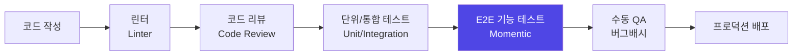
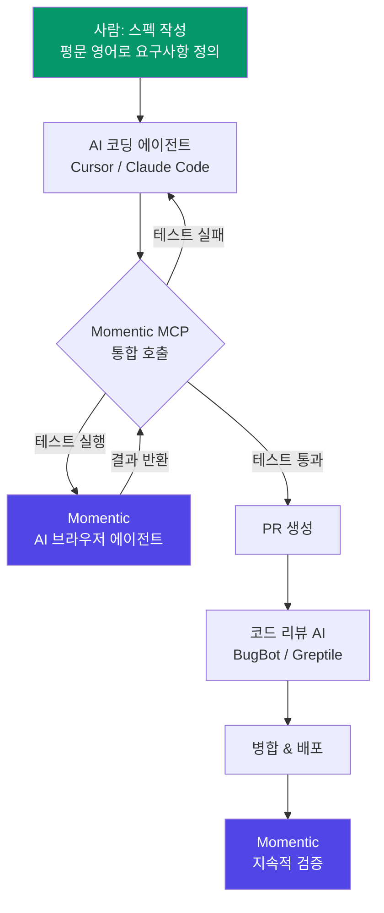
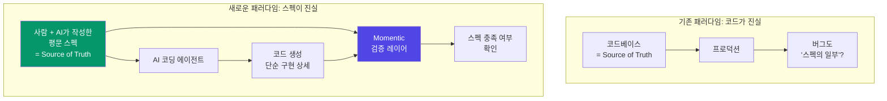
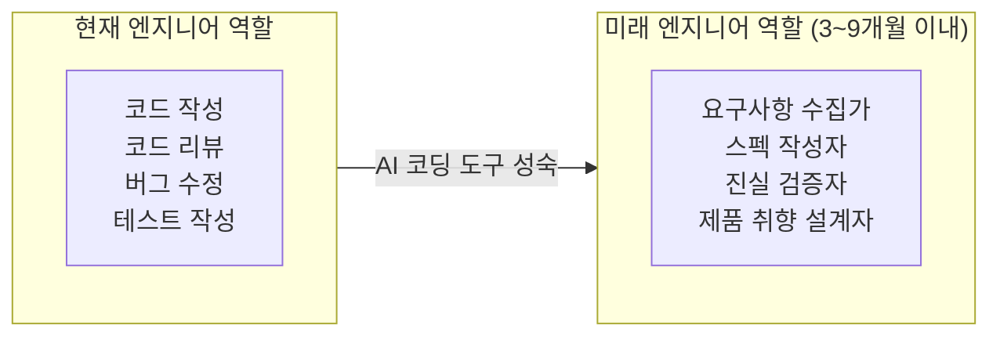
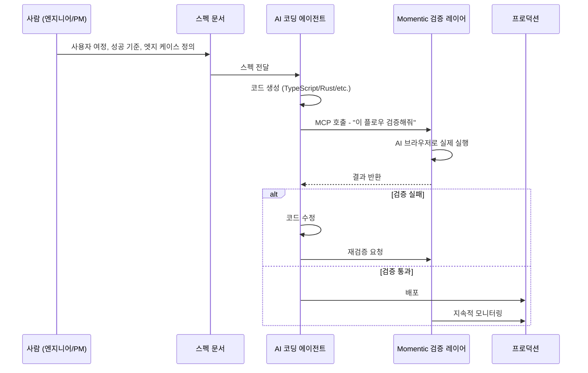

## YC Founder Firesides: "AI 코딩 시대의 QA 레이어"

> **출처**: Y Combinator Founder Firesides (2026년 3월 23일 공개)  
> **출연**: Weiwei Wu & Jeff An (Momentic 공동창업자), Harj Taggar (YC 매니징 파트너)  
> **영상**: https://www.youtube.com/watch?v=UpWNdSVWA7M  
> **회사 웹사이트**: https://momentic.ai

---

## 목차

1. [Momentic이란 무엇인가](#1-momentic이란-무엇인가)
2. [창업 배경과 팀 소개](#2-창업-배경과-팀-소개)
3. [소프트웨어 테스팅 101: 비개발자를 위한 해설](#3-소프트웨어-테스팅-101-비개발자를-위한-해설)
4. [AI 코드 생성 시대와 테스팅의 폭발적 수요](#4-ai-코드-생성-시대와-테스팅의-폭발적-수요)
5. [개발 워크플로우 속 Momentic의 위치](#5-개발-워크플로우-속-momentic의-위치)
6. [주요 고객 사례: Notion](#6-주요-고객-사례-notion)
7. ["Truth-Driven Development" 철학](#7-truth-driven-development-철학)
8. [Series A 투자 유치 및 성장 지표](#8-series-a-투자-유치-및-성장-지표)
9. [로드맵과 미래 전망](#9-로드맵과-미래-전망)
10. [엔지니어링 채용 철학 및 조직 문화](#10-엔지니어링-채용-철학-및-조직-문화)
11. [창업자들의 여정과 조언](#11-창업자들의-여정과-조언)
12. [경쟁 구도 및 리스크 분석](#12-경쟁-구도-및-리스크-분석)
13. [핵심 인사이트 요약](#13-핵심-인사이트-요약)

---

## 1. Momentic이란 무엇인가

Momentic은 **소프트웨어의 검증 레이어(Verification Layer)** 를 표방하는 AI 기반 테스팅 플랫폼이다. 한 마디로 정의하면, "AI가 실제 사용자처럼 앱을 직접 사용하면서 버그를 발견해주는 서비스"다.

### 핵심 가치 제안

기존의 소프트웨어 테스팅 도구(Selenium, Cypress, Playwright 등)는 엔지니어가 직접 복잡한 스크립트를 작성하고 유지보수해야 했다. 앱이 조금만 바뀌어도 수천 줄의 테스트 코드가 깨지는 "flakiness(불안정성)" 문제가 만연했다.

Momentic은 이 문제를 다음과 같이 해결한다:

- **자연어 기반**: "로그인 후 대시보드에서 새 프로젝트를 생성하고 멤버를 초대한다"처럼 **평범한 영어(plain English)** 로 테스트를 정의
- **AI 자동화**: 정의된 사용자 흐름(user flow)을 AI 에이전트가 실제 브라우저에서 실행
- **자동 복구(Auto-Heal)**: UI가 변경되어도 테스트가 스스로 적응
- **고속 처리**: 평균 테스트 스텝 실행 속도 **300밀리초 이하**
- **하루 100만 건 이상** 의 테스트 실행 처리

### 주요 고객사 (2025~2026 기준)

| 회사 | 분야 |
|------|------|
| Notion | 생산성 SaaS |
| Xero | 회계 SaaS |
| Bilt | 핀테크 |
| Webflow | 노코드 웹빌더 |
| Retool | 내부 툴 빌더 |
| Quora | 지식 커뮤니티 |
| Runway AI | AI 미디어 |
| Reducto | AI 문서 처리 |

---

## 2. 창업 배경과 팀 소개

### Weiwei Wu (공동창업자 & CEO)

- 오픈소스 Node.js 기여자로 잘 알려진 개발자 툴링 전문가
- 원래 전공은 약학(Pharmacy)이었으나, 고등학교 졸업 후 약학 캠프에서 극도의 지루함을 느끼고 컴퓨터 사이언스로 전향
- University of Minnesota에서 컴퓨터 사이언스 전공
- Qualtrics, WeWork 등에서 개발자 툴링 경험 쌓음
- "모든 팀에서 테스팅은 항상 가장 큰 고통이었다"는 경험을 바탕으로 Momentic 창업

### Jeff An (공동창업자 & CTO)

- 원래 영국 케임브리지 대학교에서 화학 전공 예정이었으나, 여름 인턴십에서 연구실 업무의 고립적인 특성을 경험하고 방향 전환
- "제품을 만들고 팀과 함께 일하는 것"에 대한 열망이 창업으로 이끌었다
- Robin Hood(로빈후드)에서 엔지니어로 재직 시 **300명 → 1,000명 이상** 으로 엔지니어가 성장하는 과정을 직접 경험
  - 당시 담당 업무: 8명 팀을 이끌며 나머지 1,000명 엔지니어들이 테스트를 작성·유지하도록 설득
  - 목표: 코드 커버리지 80%, 패스율 90% 유지
  - 현실: "기본적으로 불가능했다. 아무도 신경 쓰지 않았다"

### 두 사람의 만남

2023년 말, 전 Heap CTO인 Dan Robinson이 두 사람을 소개했다. Jeff는 당시 "QQ Bot"이라는 스타트업(일종의 단위 테스트용 커서)을 베타 테스팅 중이었고, Weiwei는 유사 공간에서 독자적인 프로토타입을 개발 중이었다. 짧은 줌 콜 이후 Jeff가 샌프란시스코 소파에서 일주일을 함께 지내며 팀을 합쳤다. 이후 2024년 초 Y Combinator Winter 2024 배치에 선발되었다.

---

## 3. 소프트웨어 테스팅 101: 비개발자를 위한 해설

### 테스팅이란 무엇인가?

소프트웨어 개발에서 "테스팅"이란 **내가 만든 앱이 제대로 작동하는지 확인하는 모든 활동**을 의미한다. 앱이 커지고 개발자가 늘어날수록, 누군가 새로운 기능을 추가할 때 기존 기능이 깨지지 않는다고 보장하기가 점점 어려워진다.

### 테스팅의 종류와 계층

```
┌─────────────────────────────────────────────────────────┐
│                  소프트웨어 품질 보증 계층                    │
├─────────────────────────────────────────────────────────┤
│  1. 린터 (Linter)                                        │
│     - 코드 스타일 및 패턴 검사                               │
│     - 코드가 "올바른 규칙"을 따르는지 정적 분석               │
│     - 예: ESLint, Pylint                                 │
├─────────────────────────────────────────────────────────┤
│  2. 코드 리뷰 (Code Review)                               │
│     - 사람 또는 AI가 코드 변경사항을 검토                    │
│     - 병합 전 논리적 오류, 보안 취약점 등을 확인              │
│     - 예: GitHub PR Review, Cursor BugBot, Greptile     │
├─────────────────────────────────────────────────────────┤
│  3. 단위·통합 테스트 (Unit/Integration Tests)              │
│     - 개별 함수나 모듈이 예상대로 동작하는지 확인              │
│     - 예: Jest, Pytest                                   │
├─────────────────────────────────────────────────────────┤
│  4. E2E 기능 테스트 (Functional / E2E Tests) ← Momentic   │
│     - 실제 사용자처럼 앱 전체를 클릭하며 사용자 흐름 검증      │
│     - 배포 전 실제 프로덕션과 동일한 환경에서 검증             │
│     - 예: Selenium, Playwright, Cypress, Momentic        │
├─────────────────────────────────────────────────────────┤
│  5. 수동 테스트 (Manual Testing)                          │
│     - 사람이 직접 앱을 클릭하며 확인                         │
│     - 가장 비싸고 느리지만 여전히 많이 사용됨                 │
└─────────────────────────────────────────────────────────┘
```

### 왜 개발자들은 테스트 작성을 싫어했는가?

Jeff An이 로빈후드에서 직접 경험한 이유:

1. **고객에게 보이지 않는다**: 테스트는 사용자에게 보이는 기능이 아니다
2. **성과 평가에 반영되지 않는다**: 개발자 성과 평가에서 테스트 코드는 주목받지 못한다
3. **플래시 데모로 보여줄 수 없다**: 기능 데모와 달리 테스트는 매력적이지 않다
4. **생산적인 일처럼 느껴지지 않는다**: 새 기능 개발보다 "귀찮은 후속 작업"으로 인식된다

결과적으로 테스트는 항상 뒷전이 되었고, 이것이 소프트웨어 품질과 안정성에 심각한 위협이 되었다.

---

## 4. AI 코드 생성 시대와 테스팅의 폭발적 수요

### 코드 생성량의 기하급수적 증가

2025~2026년 현재, AI 코딩 도구의 폭발적 성장으로 인해 하루에 생성되는 코드의 양이 이전과는 비교할 수 없을 정도로 늘었다.

주요 AI 코딩 도구들:
- **Cursor** (AI 코드 에디터)
- **Claude Code** (Anthropic의 CLI 기반 코딩 에이전트)
- **OpenAI Codex** (OpenAI의 코딩 에이전트)
- **GitHub Copilot**

이 도구들은 코드 생성 속도를 극적으로 높였지만, 동시에 **버그를 배포하는 속도도 높아졌다**. 기존 테스팅 도구들은 이 속도를 따라가지 못하고 있다.

### "코드 검증 병목" 문제

Jeff An의 설명에 따르면, AI가 코드를 생성하면 다음과 같은 문제가 발생한다:

> "AI 에이전트는 종종 자기가 한 것이 맞다고 확신하지만, 실제로는 틀리다. 그리고 이 에이전트들은 특히 테스팅 목적의 브라우저 사용에 최적화되어 있지 않다."

YC의 자체 엔지니어링 파이프라인에서도 Claude Code 사용이 급증하면서, CLAUDE.md 파일에 "PR 제출 전 테스트 실행 후 통과 여부 확인" 규칙을 추가했다는 사례가 인터뷰에서 언급되었다.

### Momentic이 이 흐름에서 더욱 중요해지는 이유

- 코드 생성량이 늘수록 검증해야 할 코드도 늘어난다
- AI는 자신이 생성한 코드를 스스로 검증하기에 신뢰도가 낮다
- **외부 독립적인 검증 시스템**의 필요성이 증가한다
- Momentic은 이 검증의 "외부 진실 원천(External Source of Truth)" 역할을 한다

---

## 5. 개발 워크플로우 속 Momentic의 위치

### 전통적인 개발 → 테스팅 파이프라인



### AI 코딩 에이전트 시대의 새로운 파이프라인



### MCP(Model Context Protocol) 통합

Momentic의 가장 혁신적인 특징 중 하나는 **MCP 통합**이다. 이를 통해:

- Cursor나 Claude Code 같은 AI 코딩 에이전트가 **개발 중** 실시간으로 Momentic을 도구로 호출
- 새 기능 개발 또는 기존 기능 수정 시, 에이전트가 자동으로 실제 브라우저를 구동하여 기능 검증
- 에이전트가 코드를 작성하는 것과 테스트를 실행하는 것이 하나의 루프로 통합

### 왜 AI 에이전트가 직접 테스트를 작성하면 안 되는가?

Jeff An은 이 질문에 대해 명확히 답했다:

1. **스스로 검증 불가**: AI 에이전트는 자신이 생성한 코드가 맞다고 착각하는 경향이 있다
2. **복잡한 UI 처리 한계**: Rich Text Editor, 드래그앤드롭, Canvas 기반 앱 등 복잡한 UI는 범용 에이전트가 처리하기 어렵다
3. **속도 문제**: 범용 에이전트의 브라우저 사용은 매우 느리다. Momentic은 평균 스텝당 **300ms 이하**로 처리
4. **유지보수 지옥**: Playwright 코드를 AI가 직접 생성하면 100,000줄이 금방 쌓이고, 기능 변경 시 50,000줄을 찾아 수정해야 한다
5. **진실 원천 유지 실패**: AI 에이전트는 시간이 지나면서 테스트의 진실 원천을 유지하지 못한다. Momentic은 이것을 **자동으로 유지**한다

---

## 6. 주요 고객 사례: Notion

### 도입 계기: Twitter DM으로 시작된 파트너십

2024년, Notion의 엔지니어 Simon Last가 Twitter에 글을 올렸다:

> "이걸 그냥 설명하면 자동으로 테스트해주는 서비스가 있으면 좋겠다."

수많은 팔로워들이 Momentic을 추천했고, Weiwei Wu는 그날 밤 10시에 San Francisco에서 Simon에게 DM을 보냈다. 당일 Notion 개인 워크스페이스에서 시연하는 Loom 영상을 보내고, 그날 밤 온보딩을 완료했다.

### Notion의 도입 전 상황

Notion이 Momentic을 도입하기 전에는 다음과 같은 방식으로 테스팅을 진행했다:

- **대규모 Selenium 테스트 스위트** 수동 유지보수 → 엄청난 엔지니어링 시간 소모
- **수동 테스트** 의존 → 릴리스마다 bug bash(수동 클릭 테스트) 진행
- Selenium의 고질적 문제: DOM 셀렉터 기반의 brittle 테스트, 잦은 flakiness

특히 Notion은 Rich Text Editor, 데이터베이스, 드래그앤드롭 등 복잡한 UI를 가지고 있어 Selenium으로는 안정적인 테스팅이 매우 어려웠다.

### 도입 후 성과

- 하루 **약 50만 건**의 테스트 실행
- **모든 엔지니어의 PR/머지/배포 전 Momentic 테스트 필수 통과** 정책 적용
- Selenium 대비 엔지니어링 시간 대폭 절감
- 프로덕션 레그레션(기능 퇴행) 발생률 감소

### ROI 측정 방식

Jeff An이 제시한 ROI 측정 렌즈:

1. **직접 비용 절감**: Selenium/Cypress 대비 테스트 작성·유지 시간 절약
2. **핵심 지표**: Momentic 테스트가 엔드 고객에게 도달하기 전에 막은 **레그레션 및 장애 건수**

---

## 7. "Truth-Driven Development" 철학

이 인터뷰에서 가장 중요한 개념 중 하나는 Jeff An이 제시한 **Truth-Driven Development(진실 주도 개발)** 또는 **Spec-Driven Development(스펙 주도 개발)** 다.

### 두 가지 진실 원천 패러다임



### 핵심 주장

Jeff An의 주장을 요약하면:

> "코드는 구현 상세(implementation detail)이고 일종의 상품(commodity)이다. 어떤 프론티어 모델이든 코드는 잘 생성할 것이다. 내가 진짜 신경 쓰는 것은 최종 사용자 여정과 성공 기준이다."

구체적으로 말하면:
- 미래에 엔지니어는 TypeScript나 React 코드를 리뷰하지 않을 것이다
- 대신 **스펙을 작성하고 엣지 케이스를 정의하는 것**이 주된 업무가 된다
- AI가 코드를 생성하고, Momentic이 그 코드가 스펙을 충족하는지 검증한다
- 코드가 TypeScript인지 Rust인지는 중요하지 않다

### 엔지니어 역할의 변화



그러나 Jeff An은 기술적 전문성이 여전히 필요한 영역도 언급했다:
- 시스템 통합 및 서드파티 의존성 설계
- 확장성(Scalability) 설계
- **제품 취향(Product Taste)**: AI는 아직 "Figma다운 UX"를 만들지 못한다
- 좋은 엔지니어는 항상 자신만의 PM이었고, 그 경향은 더욱 강화될 것이다

---

## 8. Series A 투자 유치 및 성장 지표

### 투자 현황

| 구분 | 내용 |
|------|------|
| YC 배치 | Winter 2024 (W24) |
| 시드 라운드 | $3.7M (2024년 3월) |
| 시드 투자사 | FundersClub(FCVC), Y Combinator, General Catalyst, AIGrant, Karman Ventures |
| Series A | $15M (2025년 11월 24일 발표) |
| Series A 리드 | Standard Capital |
| Series A 참여 | Dropbox Ventures, Y Combinator, FCVC, Transpose Platform, Karman Ventures |
| 총 누적 투자액 | $19.2M |

> **참고**: 영상 내에서는 $50M으로 언급되었으나, 공식 발표 및 TechCrunch 등 다수의 미디어 보도에 따르면 실제 Series A 규모는 **$15M**이다.

### 투자사 선택 이유: Standard Capital의 차별점

Jeff An이 Standard Capital을 선택한 이유:
- **빠른 프로세스**: YC 지원과 유사한 온라인 지원 방식
- **일반적인 이사회 구조 대신 피어 그룹(Peer Group)**: 같은 Series A 단계 회사들과 함께 이사회 미팅을 진행하며 서로 배우고 도움을 주고받는 구조

### 성장 지표 (2025년 기준)

| 지표 | 수치 |
|------|------|
| 일일 테스트 실행 건수 | 100만 건 이상 |
| Notion 일일 테스트 건수 | 약 50만 건 |
| 누적 테스트 스텝 수 | 20억 건 이상 (2024년 이후) |
| 고객사 수 | 2,600명 이상의 사용자 |
| 팀 규모 | 13명 |
| 모바일 테스팅 지원 | 2025년 8월 출시 |

---

## 9. 로드맵과 미래 전망

### 2025~2026년 로드맵

Jeff An과 Weiwei Wu가 밝힌 주요 로드맵:

**플랫폼 확장**
- Android, iOS, 데스크톱 앱 테스팅 지원 (이미 모바일 지원 시작)
- 접근성 테스팅(Accessibility Testing) 기능 추가
- AI 코딩 툴 및 에디터와의 통합 강화

**개발자 경험(DX) 극대화**
- "진입 장벽을 0 또는 음수로": 개발자들이 자연스럽게 성공의 함정에 빠지도록
- 기존 도구·워크플로우와의 더 긴밀한 통합
- 더 빠르고, 더 많은 기능 지원

**AI 에이전트 생태계 통합**
- Momentic MCP 서버를 통한 AI 코딩 에이전트와의 완전한 루프 구현
- 스펙 → 코드 생성 → 검증의 자동화 사이클 완성

### Momentic이 그리는 소프트웨어 개발의 미래



---

## 10. 엔지니어링 채용 철학 및 조직 문화

### 좋은 엔지니어의 조건 (AI 시대)

Jeff An의 견해:

> "솔직히 좋은 엔지니어는 여전히 좋은 엔지니어다. CodeEx(AI 코딩 도구)는 원래 10배 엔지니어가 아닌 사람을 10배 엔지니어로 만들어주지 않는다."

Momentic이 채용 시 가장 중시하는 자질:
- **적응력**: 빠르게 변하는 AI 트렌드에 유연하게 대응
- **모호함 탐색 능력**: 정답이 없는 상황에서도 방향을 찾아가는 힘
- **호기심과 열정**: 새로운 도구와 기술을 빠르게 흡수
- **강한 제품 직관**: 기술뿐 아니라 제품을 이해하는 능력
- **오너십**: 팀원 모두가 전체 도메인에 대한 책임감을 갖는 문화

### 채용 프로세스의 독특한 점

일반적인 코딩 인터뷰 대신:
- 채용 전 여러 차례 비공식 대화로 문화적 적합성 탐색
- 온사이트 인터뷰 전에 충분한 관계 형성
- **하루짜리 Work Trial(업무 체험)**: 실제 업무 환경에서 협업을 직접 경험

### 조직 문화

핵심 가치:
- **Radical Candor(근본적 솔직함)**: "직접적이고 명확한 피드백. 동료를 괴롭히지 않되, 서로가 최고의 버전이 되도록 솔직하게 피드백"
- **모든 목소리가 중요**: 팀원 모두가 제품 로드맵에 발언권을 가짐
- **고객 피드백 중심**: 고객의 모든 피드백을 로드맵에 반영
- 팀 규모 13명 (2026년 초 기준), Series A 자금으로 엔지니어링·영업·마케팅 채용 확대 예정

---

## 11. 창업자들의 여정과 조언

### YC 지원 결정의 뒷이야기

Weiwei Wu의 회고:
- 지원 당시 AI 에이전트의 품질이 매우 낮았고, 모델 컨텍스트 윈도우가 16K에 불과해 대부분의 웹사이트를 처리하지 못했다
- 시장 트랙션도 거의 없었고 "설마 받아주겠어?"라고 생각했다
- 그러나 6~7개의 파일럿 고객이 있었고, 이것이 합격의 핵심이었던 것으로 보인다

### 가장 어려웠던 순간들

**인재 채용의 어려움 (Jeff An)**
- 시드 단계 AI 스타트업이 너무 많았다 → "어디로 가야 할지 모르는" 엔지니어들
- 안트로픽, OpenAI 같은 대형 AI 기업의 강력한 채용 흡인력
- 해결책: 채용 프로세스에 대한 투자 (문화 중심 인터뷰, Work Trial), 입사 후 팀 레트로·리트릿 강화

**엔지니어가 영업을 배우는 어려움 (Weiwei Wu)**
> "그냥 해야 합니다. 처음에는 고객 코호트를 태울 것이고, 어떤 이들은 영원히 돌아오지 않을 것입니다. 하지만 그것이 최고의 학습입니다. 직접 해보지 않고 영업을 배울 수는 없습니다. 모두가 자신만의 커뮤니케이션 방식이 있습니다."

### 동기 부여의 원천

**Weiwei Wu**: 코드 검증 문제를 완전히 해결했을 때의 글로벌 생산성 향상. "전 세계 소프트웨어 개발의 근본적인 측면을 바꾸는 것"

**Jeff An**: "이기는 것, 단순히 이기는 게 아니라 경쟁자 모두를 제거하는 것. 그건 불가피합니다. 우리가 반드시 이룰 것입니다." (인터뷰 마무리 발언)

---

## 12. 경쟁 구도 및 리스크 분석

### 주요 경쟁자

| 유형 | 경쟁자 | 특징 |
|------|--------|------|
| 레거시 E2E 테스팅 | Selenium | 오픈소스, 복잡한 DOM 셀렉터 기반, 높은 flakiness |
| 모던 E2E 테스팅 | Playwright, Cypress | Microsoft/오픈소스, 여전히 스크립트 직접 작성 필요 |
| AI 테스팅 경쟁자 | Testim, Mabl, Reflect | AI 기반 유사 솔루션 |
| **최대 위협** | **OpenAI, Anthropic 자체 에이전트** | 범용 컴퓨터 사용 능력 확장 |

### 핵심 리스크: 파운데이션 모델 자체

TechCrunch의 분석에 따르면, Momentic의 가장 큰 경쟁자는 파운데이션 모델 회사들 자체일 수 있다. OpenAI와 Anthropic 모두 에이전트 테스팅 튜토리얼을 제공하고, 컴퓨터 사용 기능이 고도화될수록 엔터프라이즈 SaaS로서의 기회는 좁아질 수 있다.

### Momentic의 방어 해자(Moat)

그럼에도 불구하고 Momentic이 갖는 경쟁 우위:

1. **전문화된 UI 처리**: 리치 텍스트 에디터, 드래그앤드롭, Canvas 등 복잡한 인터페이스에 특화된 에이전트
2. **속도 최적화**: 범용 브라우저 에이전트보다 훨씬 빠른 300ms/스텝
3. **자동화된 진실 원천 유지**: 기능 변경 시 테스트를 자동으로 업데이트·제안
4. **디버그 UX**: 어떤 요소가 어떤 상태에서 어떻게 상호작용했는지 명확히 보여주는 UI
5. **2억 건 이상의 테스트 스텝 데이터**: 고품질 학습 데이터 축적
6. **기존 도구 생태계 통합**: CI/CD, PR 파이프라인과의 깊은 통합

---

## 13. 핵심 인사이트 요약

### Momentic이 제시하는 미래 소프트웨어 개발의 5가지 명제

1. **코드는 더 이상 진실 원천이 아니다**: 스펙(Spec)이 진실이고, 코드는 그것의 구현 상세일 뿐이다

2. **AI가 코드를 생성할수록 검증은 더 중요해진다**: 속도가 빨라진 만큼 버그 배포 속도도 빨라졌기 때문이다

3. **자체 검증의 신뢰도 문제**: AI 에이전트는 자기 자신의 결과물을 믿을 수 없다. 독립적인 외부 검증 레이어가 필수다

4. **엔지니어의 역할 변화**: 코드 작성자 → 요구사항 정의자 & 진실 검증자

5. **진입 장벽의 역전**: 테스팅은 "귀찮은 후속 작업"에서 "개발 루프의 핵심 자동화 요소"로 변한다

### 투자자 관점에서 Momentic의 매력 포인트

- **TAM(전체 시장 크기)**: "미래에 만들어질 모든 소프트웨어는 검증이 필요하다" — 사실상 무제한 시장
- **AI 코드 생성 붐의 직접 수혜자**: AI 코딩 도구가 성장할수록 Momentic의 필요성도 비례해서 증가
- **강력한 고객 사례**: Notion 같은 레퍼런스 고객의 깊은 활용도
- **네트워크 효과**: 테스트 데이터 누적 → AI 품질 향상 → 더 많은 고객 유치

---

*본 보고서는 YC Founder Firesides 인터뷰 영상 및 TechCrunch, SiliconANGLE, Momentic 공식 블로그 등 최신 외부 자료를 바탕으로 작성되었습니다.*

*최종 업데이트: 2026년 3월 26일*
