> **원문 출처**
> - [How I'm Productive with Claude Code](https://neilkakkar.com/productive-with-claude-code.html) — Neil Kakkar (2026. 3. 16.)
> - [Agentic Debt](https://neilkakkar.com/agentic-debt.html) — Neil Kakkar (2026. 2. 24.)
>
> Neil Kakkar는 스타트업 **Tano**에 합류한 개발자로, Claude Code를 활용한 AI 에이전트 기반 개발 방식을 6주간 실험하며 얻은 인사이트를 공유하였습니다. 이 문서는 그 두 편의 글을 한국어로 상세히 정리한 가이드입니다.

---

## 목차

1. [배경: 6주 만에 무슨 일이 일어났나](#1-배경-6주-만에-무슨-일이-일어났나)
2. [마인드셋의 전환: 구현자에서 관리자로](#2-마인드셋의-전환-구현자에서-관리자로)
3. [생산성 향상의 4단계 프레임워크](#3-생산성-향상의-4단계-프레임워크)
   - 3-1. [1단계: 반복 작업 자동화 — `/git-pr` 스킬](#3-1-1단계-반복-작업-자동화--git-pr-스킬)
   - 3-2. [2단계: 대기 시간 제거 — SWC 빌드 도구 전환](#3-2-2단계-대기-시간-제거--swc-빌드-도구-전환)
   - 3-3. [3단계: 검증 위임 — Claude Code 프리뷰 기능](#3-3-3단계-검증-위임--claude-code-프리뷰-기능)
   - 3-4. [4단계: 병렬 작업 — 워크트리 시스템](#3-4-4단계-병렬-작업--워크트리-시스템)
4. [제약 이론(Theory of Constraints)과 마찰 제거](#4-제약-이론theory-of-constraints과-마찰-제거)
5. [에이전틱 부채(Agentic Debt)란 무엇인가](#5-에이전틱-부채agentic-debt란-무엇인가)
   - 5-1. [기술적 부채와의 차이점](#5-1-기술적-부채와의-차이점)
   - 5-2. [에이전트 슬롭 피드백 루프](#5-2-에이전트-슬롭-피드백-루프)
   - 5-3. [컨텍스트 윈도우 함정](#5-3-컨텍스트-윈도우-함정)
6. [핵심 원칙: 인간이 이해할 수 있는 코드가 에이전트도 이해한다](#6-핵심-원칙-인간이-이해할-수-있는-코드가-에이전트도-이해한다)
7. [정원사 은유: 새로운 개발자의 역할](#7-정원사-은유-새로운-개발자의-역할)
8. [미래의 열린 질문들](#8-미래의-열린-질문들)
9. [실천 체크리스트](#9-실천-체크리스트)
10. [결론: 인프라가 AI보다 중요하다](#10-결론-인프라가-ai보다-중요하다)

---

## 1. 배경: 6주 만에 무슨 일이 일어났나

Neil Kakkar는 스타트업 Tano에 합류한 지 6주 만에 GitHub 커밋 히스토리에 극적인 변화를 경험했습니다. 커밋 수 자체가 생산성의 절대적 지표는 아니지만, 그것은 분명히 **작업 방식의 근본적인 변화**를 반영하는 신호였습니다.

아래 이미지에서 볼 수 있듯이, 2026년 1월에는 거의 없던 커밋이 2월, 3월로 갈수록 급격하게 증가했습니다. 그는 154건의 커밋과 77,154줄의 코드를 추가하며, 팀에서 #2 기여자가 되었습니다.

```
Jan '26  : ░░░░░░░░░░░░░  (거의 없음)
Feb '26  : ████████████   (~15-20/주)
Mar '26  : ████████████████████  (~30-50/주)
```

이 변화의 핵심은 단순히 "더 열심히 일한 것"이 아니라, **시스템과 인프라를 구축하여 마찰을 제거한 것**이었습니다.

---

## 2. 마인드셋의 전환: 구현자에서 관리자로

가장 중요한 변화는 기술적인 것이 아니라 **사고방식**의 변화였습니다.

> *"나는 더 이상 구현자가 아니다. 나는 구현을 담당하는 에이전트들의 관리자다. 그리고 좋은 관리자는 팀의 반복적인 작업을 자동화한다."*

이 관점의 전환은 매우 중요합니다. 과거에는 개발자가 직접 모든 코드를 작성하고, 모든 PR을 만들고, 모든 UI를 검증했습니다. 하지만 Claude Code 같은 AI 에이전트 도구가 등장하면서, 개발자의 역할은 **코드를 작성하는 사람**에서 **코드를 만드는 팀(에이전트)을 관리하는 사람**으로 바뀌었습니다.

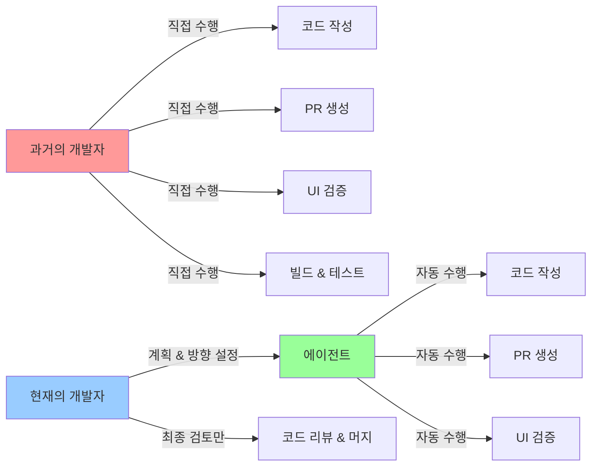

이 관점에서 중요한 점은, **좋은 관리자는 팀의 반복 작업을 자동화한다**는 것입니다. 개발자가 에이전트의 관리자라면, 에이전트가 효율적으로 일할 수 있는 환경(인프라)을 구축하는 것이 가장 중요한 업무가 됩니다.

---

## 3. 생산성 향상의 4단계 프레임워크

Neil은 6주 동안 네 가지 핵심 마찰을 순차적으로 제거하며 생산성을 끌어올렸습니다. 각 단계는 독립적이지 않고, 하나를 해결하면 다음 문제가 보이는 방식으로 연결되어 있습니다.

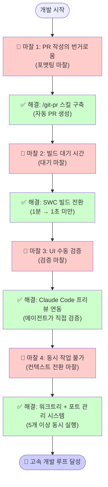

### 3-1. 1단계: 반복 작업 자동화 — `/git-pr` 스킬

**문제**: PR을 만들 때마다 수동으로 변경사항을 스테이징하고, 커밋 메시지를 작성하고, PR 설명을 작성하고, GitHub에 올리는 과정을 반복해야 했습니다. 그는 이 작업이 "그냥 일상적인 과정"이라고 너무 오래 당연하게 여겨왔기 때문에, 이것이 **반복적인 허드렛일(grunt work)** 임을 인식하는 데 시간이 걸렸습니다.

**해결책**: Claude Code의 커스텀 스킬 기능을 활용해 `/git-pr` 명령어를 만들었습니다. 이 스킬은 전체 diff를 읽고 변경 내용을 제대로 요약하기 때문에, 사람이 직접 쓰는 것보다 더 상세한 PR 설명을 자동으로 생성합니다.

**실제 효과**:

- **시간 절약**: 매 PR마다 걸리던 수분간의 수동 작업이 사라졌습니다.
- **품질 향상**: 전체 diff를 분석하므로 PR 설명이 더욱 포괄적이고 정확해졌습니다.
- **정신적 오버헤드 제거**: PR을 만들기 위해 "코드에 대해 생각하는 모드"에서 "코드를 설명하는 모드"로 전환하는 컨텍스트 스위칭이 없어졌습니다.

> **핵심 인사이트**: 시간 절약보다 더 중요한 것은 **정신적 오버헤드의 제거**였습니다. 작은 컨텍스트 스위칭이 누적되면 흐름(flow)을 깨뜨립니다.

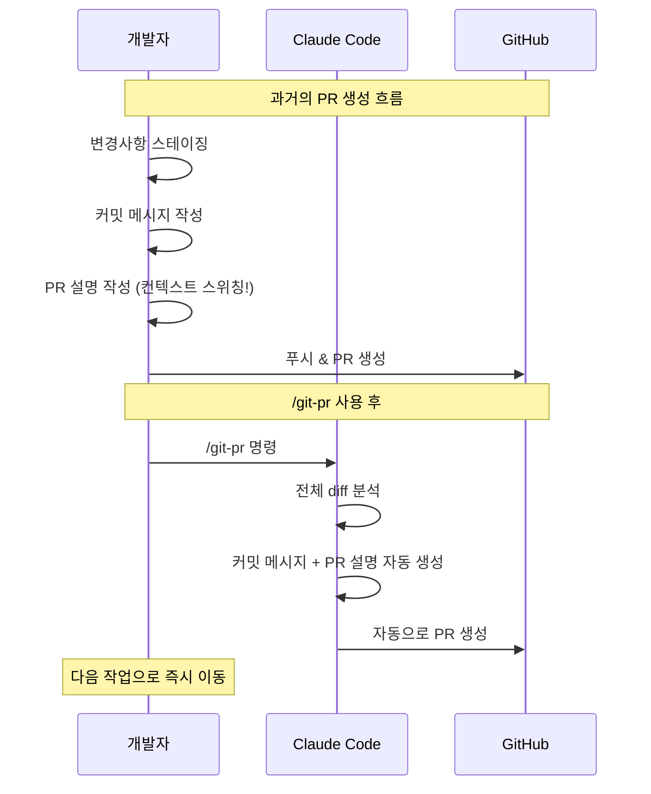

### 3-2. 2단계: 대기 시간 제거 — SWC 빌드 도구 전환

**문제**: 코드를 변경하고 결과를 확인하기 위해 로컬 개발 서버를 재시작할 때마다 약 **1분**의 빌드 시간이 필요했습니다. 1분은 "다른 유용한 일을 하기엔 너무 짧고, 집중을 유지하기엔 너무 긴" 애매한 시간이었습니다.

**해결책**: 빌드 도구를 **SWC(Speedy Web Compiler)** 로 전환했습니다. SWC는 Rust로 작성된 초고속 JavaScript/TypeScript 컴파일러로, 기존 Babel이나 TypeScript 컴파일러보다 훨씬 빠릅니다. 서버 재시작 시간이 **1분에서 1초 미만**으로 단축되었습니다.

**실제 효과**: 이 변화는 단순한 "시간 절약"이 아니었습니다. 1초 미만의 재시작 시간은 **개발자가 흐름(flow) 상태를 전혀 벗어나지 않아도 된다**는 것을 의미합니다. 파일 저장 → 서버 재시작 → 결과 확인이 하나의 끊김 없는 연속 동작이 됩니다.

> *"대화에서 어색한 침묵이 있는 것과 자연스럽게 흐르는 대화의 차이와 같다."*

```mermaid
gantt
    title 개발 작업 흐름 비교
    dateFormat X
    axisFormat %s초

    section 기존 (Babel/tsc)
    코드 수정          : 0, 10
    빌드 대기 (집중 깨짐) : 10, 70
    결과 확인          : 70, 80
    다음 수정          : 80, 90

    section SWC 전환 후
    코드 수정          : 0, 10
    빌드 (< 1초)       : 10, 11
    결과 확인          : 11, 21
    다음 수정          : 21, 31
```

### 3-3. 3단계: 검증 위임 — Claude Code 프리뷰 기능

**문제**: 모든 UI 변경 사항을 직접 눈으로 확인해야 했습니다. 로컬에서 프리뷰를 열고, 눈으로 확인하고, 기대한 대로인지 판단하는 과정이 개발자 본인에게 집중되어 있었기 때문에 **개발자가 병목**이 되었습니다.

**해결책**: Chrome 확장 프로그램이 계속 충돌하자, Claude Code의 내장 **프리뷰 기능**으로 전환했습니다. 이 기능은 에이전트가 프리뷰 환경을 직접 설정하고, 세션 데이터를 유지하며, UI가 실제로 어떻게 보이는지를 스스로 확인할 수 있게 해줍니다.

**워크플로 변화**: 핵심 규칙을 하나 추가했습니다. **"에이전트가 직접 UI를 검증하기 전까지는 작업이 완료된 것이 아니다."** 이 규칙 덕분에:

- 에이전트가 자신의 실수를 스스로 발견하고 수정합니다.
- 개발자는 최종 리뷰에만 관여하면 됩니다.
- 에이전트가 더 오랜 시간 감독 없이 자율적으로 작업할 수 있게 됩니다.

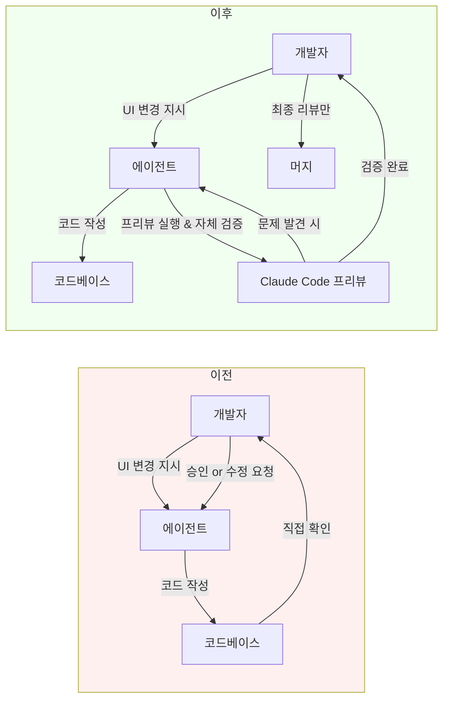

### 3-4. 4단계: 병렬 작업 — 워크트리 시스템

**문제**: 빠른 빌드와 자동화된 검증이 갖춰지자, 새로운 병목이 드러났습니다. 한 번에 하나의 작업만 편안하게 진행할 수 있었습니다.

다른 에이전트나 팀원의 PR을 검토하려면:
1. 현재 변경사항 stash
2. PR 브랜치로 checkout
3. 서버 재빌드
4. 테스트
5. 다시 원래 브랜치로 복귀
6. stash pop

더 심각한 문제는 **포트 충돌**이었습니다. 앱의 프론트엔드와 백엔드가 각각 별도의 포트를 사용하는데, 여러 워크트리가 동일한 환경 변수를 공유하다 보니 모두 같은 포트에 바인딩하려 했습니다.

**해결책**: 워크트리가 생성될 때마다 **고유한 포트 범위**를 자동으로 할당하는 시스템을 구축했습니다. 이로써 포트 충돌이 완전히 사라졌습니다.

**실제 변화**:

| 이전 | 이후 |
|------|------|
| 동시에 2개 브랜치도 벅참 | 동시에 5개 이상 워크트리 실행 |
| PR 검토마다 복잡한 수동 절차 | read → verify → merge → next |
| 순차적 에이전트 실행 | 여러 에이전트 병렬 실행 |
| 매 PR마다 재빌드 | 설정 없이 즉시 검토 |

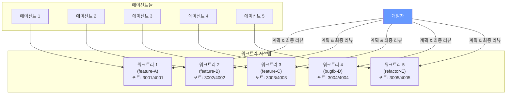

**개발 루프의 변화**: 기존에는 "에이전트 시작 → 감독 → 완료 → 다음 에이전트 시작"이었다면, 이제는 **"계획에 깊이 관여 → 여러 에이전트 동시 시작 → 자리 비움 → 코드 리뷰 시에만 복귀"** 가 되었습니다.

---

## 4. 제약 이론(Theory of Constraints)과 마찰 제거

Neil이 경험한 생산성 향상 과정은 경영학의 **제약 이론(Theory of Constraints, TOC)** 과 정확히 일치합니다. TOC는 엘리야후 골드랫이 제안한 이론으로, 시스템의 성과는 가장 약한 고리(제약, constraint)에 의해 결정된다는 것이 핵심입니다.

각 마찰 제거 단계가 다음 병목을 드러내는 과정:

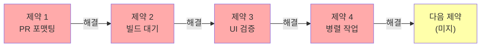

> *"하나를 고치면, 시스템은 즉시 다음 문제를 보여준다."*

이 접근법의 중요한 특징은:

1. **한 번에 하나씩 집중**합니다. 동시에 모든 문제를 해결하려 하지 않습니다.
2. **현재 가장 큰 마찰이 무엇인지 계속 묻습니다.** "지금 나를 가장 느리게 만드는 것은 무엇인가?"
3. **인프라 투자가 기능 개발보다 더 높은 레버리지**를 만들어냅니다.

---

## 5. 에이전틱 부채(Agentic Debt)란 무엇인가

두 번째 글 "Agentic Debt"는 AI 에이전트 기반 개발의 **어두운 면**을 다룹니다. Neil은 Tano에 합류한 지 2주째에 이 문제를 처음 발견했습니다.

### 발단 사례

간단한 기능을 추가하려 했지만, Claude가 예상과 다른 곳에 변경을 가했습니다. 알고 보니 코드베이스에 거의 동일한 프론트엔드 코드를 사용하면서 약간씩 다른 UI를 표시하는 **세 곳**이 있었습니다. Claude는 그 중 Neil이 인식하지 못하고 있던 한 곳을 수정했고, 그래서 로컬에서 실행했을 때 기대했던 곳에는 아무 변화가 없었습니다.

**결과**: 몇 주 전에 에이전트가 작성한 코드 약 **2,000줄을 삭제**하고, 세 곳의 중복 코드를 하나로 리팩토링했습니다. 그러자 에이전트가 해당 기능을 **원샷(one-shot)** 으로 구현해냈습니다.

### 5-1. 기술적 부채와의 차이점

**기술적 부채(Technical Debt)** 는 인간 개발자가 의식적으로 내리는 "빠르고 더러운" 결정의 누적입니다. 나중에 고칠 것을 알면서도 지금 당장의 편의를 위해 타협하는 것입니다.

**에이전틱 부채(Agentic Debt)** 는 다릅니다.

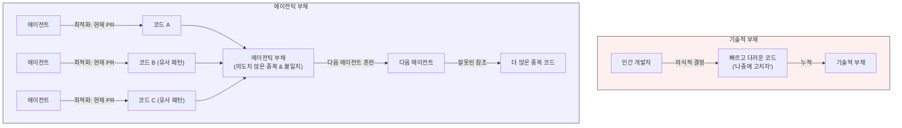

에이전틱 부채의 핵심 특징:

- **의도하지 않음**: 어떤 에이전트도 "세 가지 다른 UI를 만들자"고 결정하지 않았습니다. 각각은 자신의 임무에 최적화한 것일 뿐입니다.
- **전역적 맥락 부재**: 에이전트는 현재 작업(PR, 기능, 즉각적 요청)에 최적화합니다. 전체 코드베이스의 "큰 그림"을 인간처럼 파악하지 못합니다.
- **자기 강화**: 에이전틱 부채가 쌓이면 다음 에이전트도 더 혼란스러워져서 더 많은 에이전틱 부채를 생성합니다.

### 5-2. 에이전트 슬롭 피드백 루프

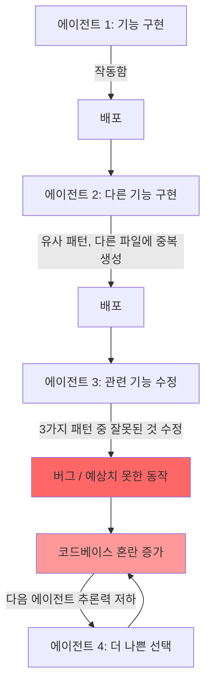

이것이 **에이전트 슬롭(agent slop) 피드백 루프**입니다. 한 에이전트의 코드가 다음 에이전트의 추론을 방해하고, 그 에이전트가 더 나쁜 코드를 생성하는 악순환입니다.

### 5-3. 컨텍스트 윈도우 함정

이에 대한 반론으로 흔히 제기되는 것은 "컨텍스트 윈도우가 충분히 크면, 전체 코드베이스를 넣어서 에이전트가 다 파악할 수 있지 않나?"입니다.

Neil의 답변:

> *"1~2년 후에는 가능할지도 모른다. 하지만 지금은 아니라고 생각한다. 무한한 컨텍스트가 있더라도, 노이즈와 불일치는 추론을 방해한다. 미묘한 차이가 있는 세 가지 중복 패턴은 컨텍스트가 많다고 해서 더 명확해지지 않는다. 오히려 세 배 더 혼란스러워진다."*

에이전트는 그 세 가지 패턴 중 어떤 것이 "올바른" 것인지, 혹은 각각 미묘하게 다른 이유가 있는 것인지, 아니면 이전 에이전트가 확인하지 않고 복사-붙여넣기한 것인지 판단해야 합니다. 이 모호함은 컨텍스트 크기와 무관하게 존재합니다.

---

## 6. 핵심 원칙: 인간이 이해할 수 있는 코드가 에이전트도 이해한다

이것이 두 번째 글의 가장 핵심적인 발견입니다. 직관에 반하는 것처럼 보이지만, 실험적으로 검증된 사실입니다.

> **"지금으로서는, 에이전트 성능을 향상시키는 가장 좋은 방법은 코드를 인간이 모델링할 수 있을 만큼 단순하게 만드는 것이다."**

Neil이 세 곳의 중복 프론트엔드를 하나의 깔끔한 패턴으로 통합했을 때, 그것은 에이전트를 위한 것이 아니었습니다. 그 파편화된 상태로는 코드베이스에 대한 명확한 멘탈 모델을 구축할 수 없었기 때문에 한 일이었습니다. 그런데 코드가 깔끔해지자, 에이전트도 더 잘 추론할 수 있게 되었습니다.

이것은 우연이 아닙니다. **에이전트는 인간과 동일한 것들을 어려워합니다**: 불일치, 암묵적 가정, 미묘한 차이가 있는 중복 로직. LLM이 작성했다는 사실이 코드를 유지보수하기 쉽게 만드는 속성을 바꾸지 않습니다.

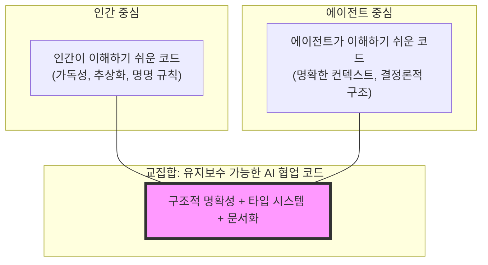

*(참고: 두 집합은 거의 완전히 겹칩니다)*

왜 그럴까요? Neil의 추측으로는, **모델이 인간이 작성한 코드와 인간의 설명으로 학습**했기 때문입니다. 모델의 "추론"은 인간의 추론 패턴을 반영합니다. 인간에게 가독적인 것이 모델에게도 가독적입니다.

### 실천 가이드: 에이전틱 부채를 줄이는 코드 품질

| 나쁜 패턴 (에이전틱 부채 증가) | 좋은 패턴 (에이전틱 부채 감소) |
|---|---|
| 유사한 UI 로직이 3곳에 분산 | 단일 컴포넌트로 통합 |
| 암묵적인 가정으로 가득한 코드 | 명시적이고 자명한 코드 |
| 미묘하게 다른 중복 패턴 | 일관된 하나의 패턴 |
| 건드리지 않는 "정글" 코드 방치 | 사용하지 않는 코드 삭제 |
| 반쯤만 구현된 추상화 | 완전히 구현되거나 아예 없거나 |

---

## 7. 정원사 은유: 새로운 개발자의 역할

Neil은 AI 에이전트 시대의 개발자 역할을 **정원사(gardener)** 에 비유합니다. 이 은유는 단순하지만 매우 정확합니다.

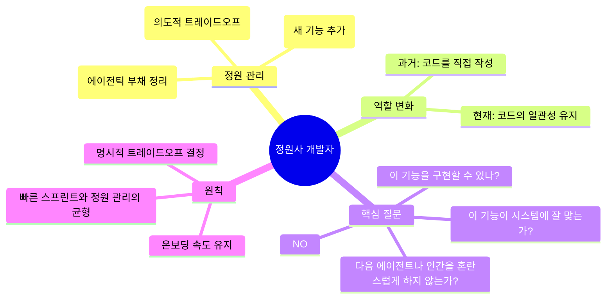

### 정원사 역할의 구체적 실천

**1. 스프린트와 정원 관리의 리듬 만들기**

스타트업에서는 빠른 배포가 종종 올바른 트레이드오프입니다. 에이전틱 부채를 쌓으며 빠르게 나아가는 것이 때로는 맞습니다. 중요한 것은 이것을 **의식적으로** 결정하는 것이지, 기본 설정으로 두는 것이 아닙니다.

> *"때로는 느린 것이 더 매끄럽고, 매끄러운 것이 더 빠르다."*

**2. 에이전트를 활용한 리팩토링**

일부 리팩토링은 에이전트를 통해 훨씬 쉬워졌습니다. 특히 **중복 제거(deduplication)** 는 이제 저렴한 작업이 되었습니다. 하지만 민첩성은 실제로 리팩토링을 하느냐에 달려 있지, 계속 스프린트만 하느냐에 달려 있지 않습니다.

**3. 온보딩 속도 유지**

깔끔한 코드베이스는 새로운 사람이 빠르게 온보딩할 수 있게 해줍니다. 그리고 빠른 온보딩은 그 사람이 에이전트를 더 잘 조종(steer)할 수 있게 합니다. 아직 우리는 에이전트를 완전히 자율에 맡길 수 있는 단계에 있지 않습니다.

---

## 8. 미래의 열린 질문들

Neil이 제기하는 미해결 질문들은 AI 에이전트 개발의 미래를 생각하는 데 중요한 프레임을 제공합니다.

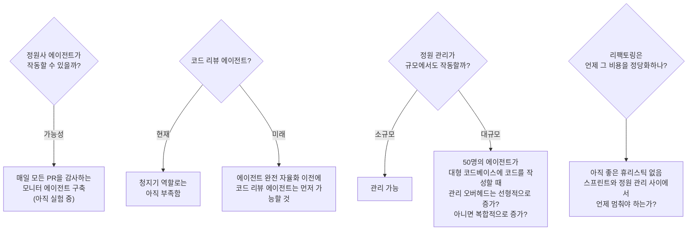

이 질문들은 단순히 기술적인 것이 아니라, **조직과 팀이 AI 에이전트를 도입할 때 반드시 마주하게 될 실질적인 문제들**입니다.

---

## 9. 실천 체크리스트

두 글의 내용을 바탕으로 만든 실천 가이드입니다.

### ✅ 생산성 인프라 구축

- [ ] **반복 작업 자동화**: 현재 수동으로 하고 있는 반복 작업이 있는가? (PR 생성, 배포, 테스트 등) Claude Code 스킬이나 스크립트로 자동화하라.
- [ ] **빌드 시간 최소화**: 개발 서버 재시작 시간이 1초를 초과하는가? SWC, esbuild 등 빠른 빌드 도구로 전환을 검토하라.
- [ ] **에이전트 자체 검증 설정**: "에이전트가 직접 검증하기 전까지는 완료가 아니다" 규칙을 워크플로에 도입하라.
- [ ] **병렬 작업 환경 구축**: Git worktree와 포트 관리 시스템으로 여러 기능을 동시에 진행할 수 있는 환경을 만들어라.

### ✅ 에이전틱 부채 관리

- [ ] **정기적인 중복 감사**: 코드베이스에 유사하지만 미묘하게 다른 패턴이 여러 곳에 있는지 주기적으로 확인하라.
- [ ] **리팩토링 시점 의식적으로 결정**: 에이전틱 부채를 쌓는 것을 기본값이 아닌 의식적인 선택으로 만들어라.
- [ ] **"인간 멘탈 모델" 테스트**: 새로 합류한 팀원이 코드베이스를 이해하는 데 어려움을 겪는 부분은 에이전트도 어려워할 부분이다.
- [ ] **사용하지 않는 코드 정리**: "정글" 코드(오래됐거나 건드리지 않는 코드)를 에이전트가 잘못 참조하지 않도록 정리하라.

### ✅ 마인드셋 전환

- [ ] **역할 재정의**: 나는 지금 코드를 구현하는 사람인가, 에이전트를 관리하는 사람인가?
- [ ] **인프라 투자 우선순위**: 새 기능 개발과 인프라 개선 중 어느 것이 더 높은 레버리지를 만드는가?
- [ ] **현재 병목 파악**: "지금 나를 가장 느리게 만드는 것은 무엇인가?"를 주기적으로 질문하라.

---

## 10. 결론: 인프라가 AI보다 중요하다

두 글을 관통하는 핵심 메시지는 다음과 같습니다.

> **"Tano에서 내가 한 가장 높은 레버리지 작업은 기능을 작성하는 것이 아니었다. 그것은 커밋의 흐름을 물줄기에서 홍수로 바꾼 인프라를 구축하는 것이었다."**

AI 에이전트 도구(Claude Code 등)는 강력합니다. 하지만 그 도구가 효과적으로 작동하려면, 그 도구를 둘러싼 **인프라**가 잘 갖춰져 있어야 합니다. 자동화된 PR 생성, 빠른 빌드, 에이전트 자체 검증, 병렬 작업 환경, 깔끔한 코드베이스 — 이 모든 것이 AI의 성능보다 더 중요한 요소입니다.

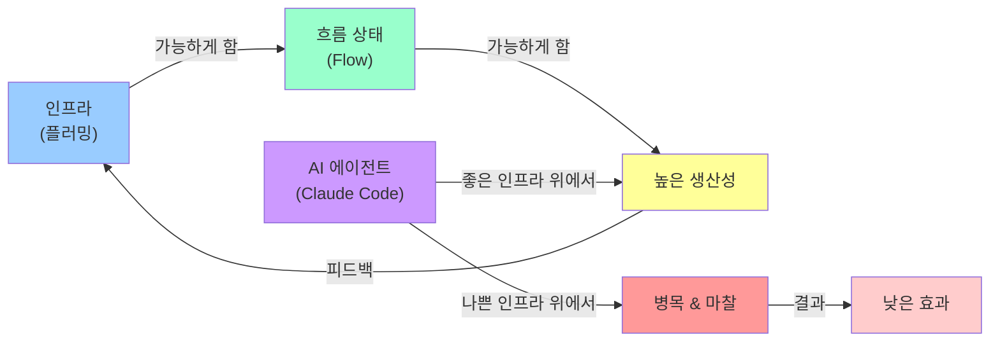

그리고 에이전틱 부채 관점에서는, **빠른 것이 항상 빠른 것이 아닙니다.** 에이전트가 빠르게 생성한 코드가 나중에 에이전트의 추론 능력을 저해한다면, 지금 느리게 정리하는 것이 결과적으로 더 빠릅니다.

개발의 즐거움이 바뀌었습니다. "복잡한 문제를 해결하는 즐거움"에서 **"더 빠르게 만드는 게임"** 으로. 피드백 루프가 충분히 빠를 때, 엔지니어링 자체가 엔터테인먼트가 됩니다.

---

## 참고 자료

- [How I'm Productive with Claude Code](https://neilkakkar.com/productive-with-claude-code.html) — Neil Kakkar (2026. 3. 16.)
- [Agentic Debt](https://neilkakkar.com/agentic-debt.html) — Neil Kakkar (2026. 2. 24.)
- [Claude Code 공식 문서](https://docs.claude.com) — Anthropic
- [SWC 공식 사이트](https://swc.rs) — 초고속 JavaScript/TypeScript 컴파일러
- [Git Worktree 문서](https://git-scm.com/docs/git-worktree) — 여러 워크트리 동시 사용
- 제약 이론 (Theory of Constraints) — Eliyahu M. Goldratt, *The Goal* (1984)

---

*이 문서는 Neil Kakkar의 블로그 글 두 편을 바탕으로 작성된 한국어 가이드입니다. 원문의 내용을 충실히 반영하되, 더 깊은 맥락과 시각적 설명을 추가했습니다.*
