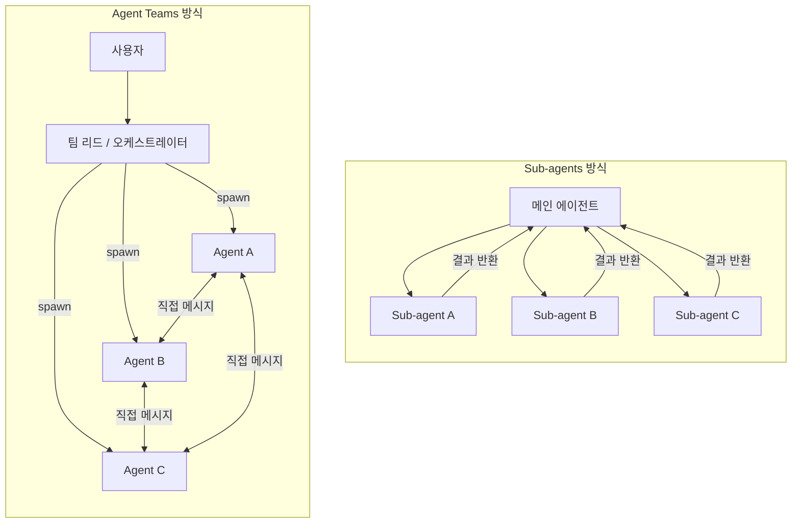
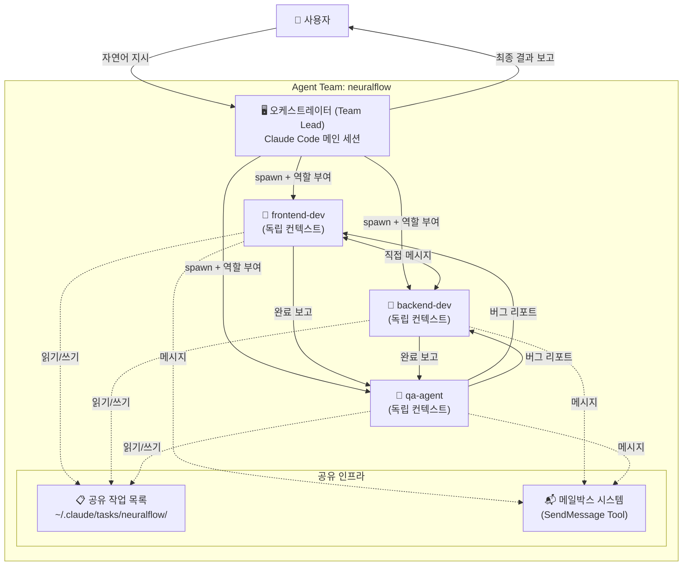
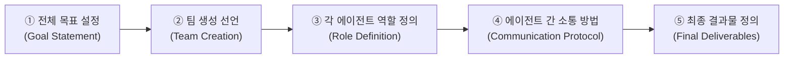
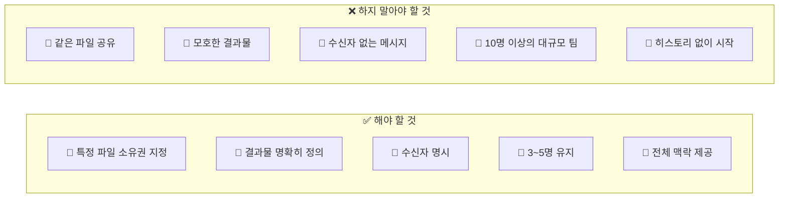
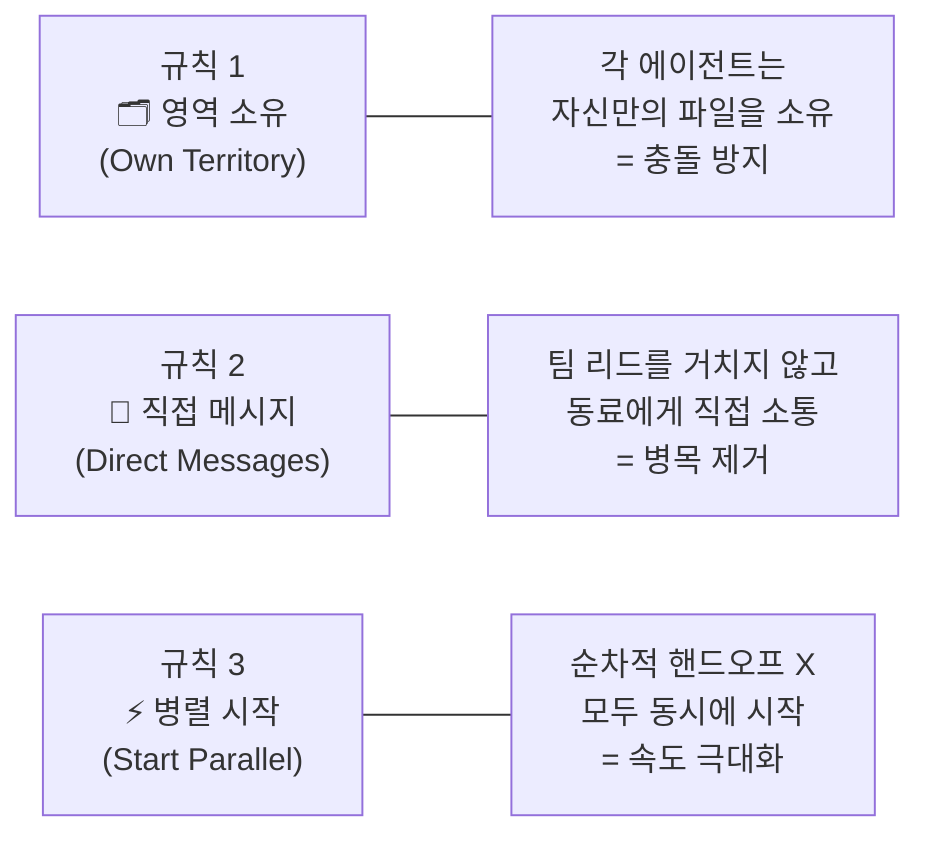
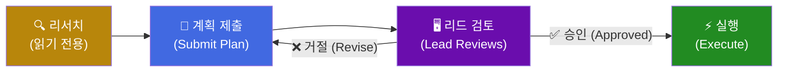
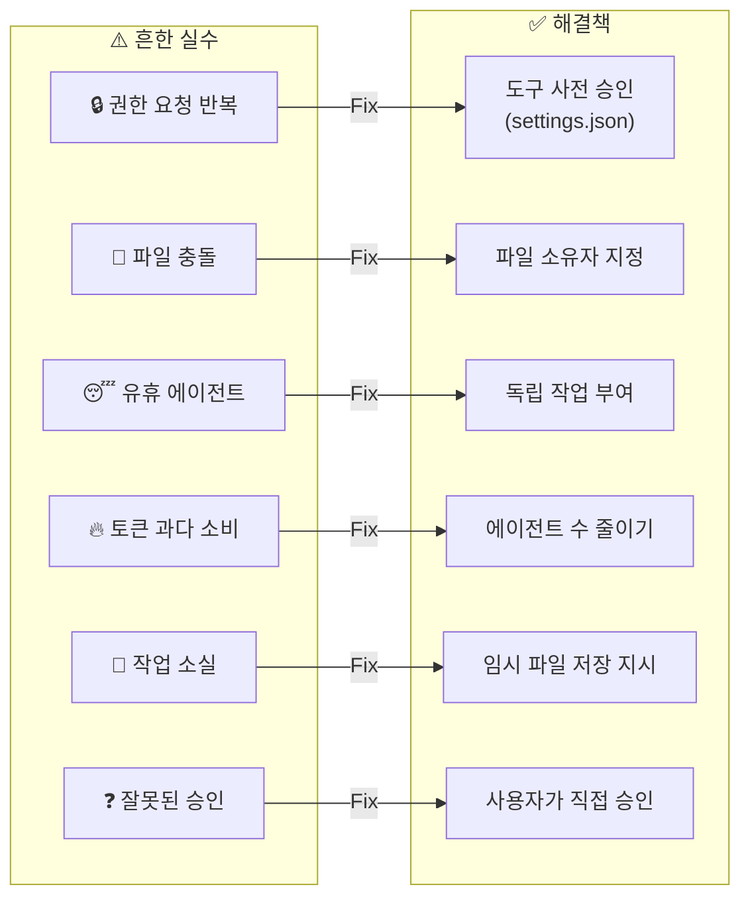
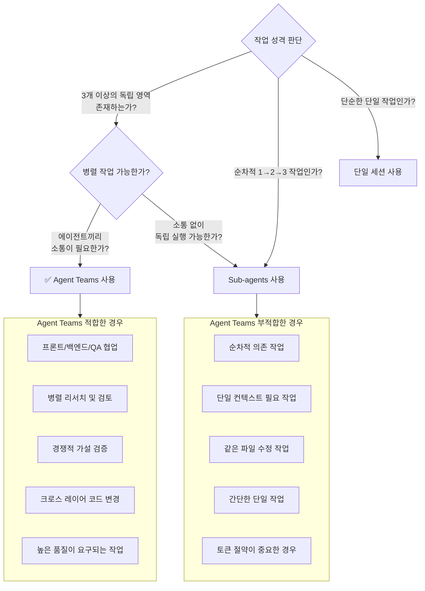
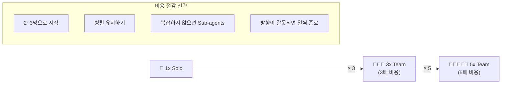
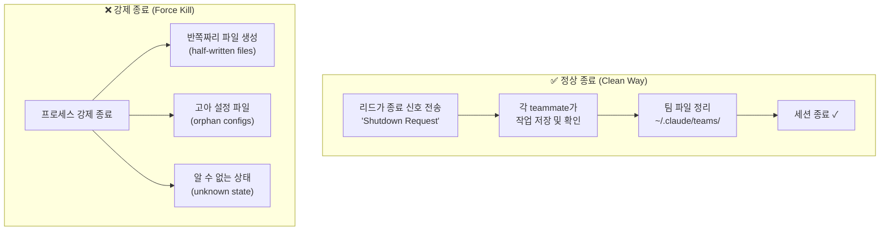

> **기준 버전**: Claude Code v2.1.32 이상 / Claude Opus 4.6 (2026년 2월 출시)  
> **참고 영상**: [How to Build Claude Agent Teams Better Than 99% of People](https://www.youtube.com/watch?v=vDVSGVpB2vc)  
> **공식 문서**: https://code.claude.com/docs/en/agent-teams  
> **작성일**: 2026년 3월

---

## 목차

1. [Agent Teams란 무엇인가](#1-agent-teams란-무엇인가)
2. [Sub-agents와의 차이점](#2-sub-agents와의-차이점)
3. [아키텍처 이해](#3-아키텍처-이해)
4. [설정 방법](#4-설정-방법)
5. [프롬프트 작성법](#5-프롬프트-작성법)
6. [DO & DON'T: 팀 구성 원칙](#6-do--dont-팀-구성-원칙)
7. [3가지 핵심 규칙](#7-3가지-핵심-규칙)
8. [Plan Approval Mode](#8-plan-approval-mode)
9. [Tmux 분할 화면 활용](#9-tmux-분할-화면-활용)
10. [일반적인 실수와 해결법](#10-일반적인-실수와-해결법)
11. [언제 Agent Teams를 쓰고, 언제 쓰지 말아야 하는가](#11-언제-agent-teams를-쓰고-언제-쓰지-말아야-하는가)
12. [비용 인식과 관리](#12-비용-인식과-관리)
13. [안전한 종료 방법 (Clean Shutdown)](#13-안전한-종료-방법-clean-shutdown)
14. [실전 예시 프롬프트 모음](#14-실전-예시-프롬프트-모음)
15. [알려진 제한 사항과 주의점](#15-알려진-제한-사항과-주의점)
16. [고급 패턴과 팁](#16-고급-패턴과-팁)

---

## 1. Agent Teams란 무엇인가

Agent Teams는 Claude Code에 내장된 다중 에이전트 오케스트레이션 시스템입니다. 하나의 Claude Code 세션이 "팀 리드(Team Lead)" 역할을 맡고, 이 리드가 여러 명의 독립적인 "teammate" 에이전트를 생성(spawn)하여 복잡한 작업을 병렬로 처리하게 합니다.

2026년 2월 5일, Claude Opus 4.6 출시와 함께 공개된 이 실험적 기능은 단순히 여러 AI가 동시에 돌아가는 것을 넘어서, 에이전트들이 서로 직접 소통하고, 공유 작업 목록을 통해 의존 관계를 조율하며, 결과물을 함께 검증하는 진정한 협업 환경을 제공합니다.

### 핵심 구성 요소

Agent Teams는 내부적으로 세 가지 핵심 메커니즘으로 작동합니다.

**공유 작업 목록 (Shared Task List)** 은 `~/.claude/tasks/{team-name}/` 경로에 저장되며, 각 작업은 상태(status), 소유자(owner), 의존 관계(dependency)를 가집니다. 어떤 teammate가 선행 작업을 완료하면, 의존하고 있던 후속 작업이 자동으로 잠금 해제(unblock)됩니다. 이것이 팀 전체의 조율 기반이 됩니다.

**메일박스 시스템 (Mailbox System)** 은 `SendMessage` 도구를 통해 teammate 간 직접 메시지 전송을 가능하게 합니다. 프론트엔드 에이전트가 백엔드 에이전트에게 API 스펙을 요청하거나, QA 에이전트가 개발 에이전트에게 버그 리포트를 보낼 때, 반드시 메인 세션을 거치지 않아도 됩니다.

**팀원 생명주기 관리 (Teammate Lifecycle)** 는 에이전트의 생성, 작업 할당, 종료까지의 전 과정을 리드 에이전트가 체계적으로 관리합니다. 각 teammate는 독립적인 컨텍스트 창(context window)을 가집니다.

---

## 2. Sub-agents와의 차이점

Agent Teams를 이해하는 데 가장 중요한 개념은 기존 Sub-agents와의 차이점입니다. 많은 사람들이 이 둘을 혼동하는데, 실제로는 근본적으로 다른 방식으로 작동합니다.



Sub-agents는 메인 세션 안에서 실행되며, 각 에이전트는 독립적으로 작업을 수행한 뒤 결과물만 메인 에이전트에게 보고합니다. 에이전트끼리는 직접 소통하지 못하고, 모든 정보 교환은 반드시 메인 에이전트를 통해야 합니다. 이는 마치 프리랜서 각각에게 별도의 심부름을 보내는 것과 같습니다.

반면에 Agent Teams에서는 각 teammate가 자신만의 독립적인 컨텍스트 창을 가지며, 공유 작업 목록과 직접 메시지를 통해 서로 실시간으로 소통합니다. 프론트엔드 에이전트가 백엔드 에이전트에게 "API 엔드포인트 정의 완료됐어?" 라고 직접 물어볼 수 있습니다. 또한 사용자도 개별 teammate에게 직접 메시지를 보낼 수 있습니다. 이는 전문가 팀이 프로젝트를 함께 진행하는 방식과 훨씬 가깝습니다.

| 비교 항목 | Sub-agents | Agent Teams |
|----------|-----------|-------------|
| 에이전트 간 소통 | 불가 (메인만 경유) | 직접 메시지 가능 |
| 실행 컨텍스트 | 메인 세션 내부 | 독립 컨텍스트 창 |
| 병렬 작업 | 제한적 | 완전한 병렬 실행 |
| 사용자 개입 | 메인 통해서만 | 개별 teammate 직접 가능 |
| 비용 | 단일 세션 수준 | 에이전트 수 × 단일 세션 |
| 적합한 작업 | 순차적, 단순 작업 | 복잡한 병렬 협업 작업 |

---

## 3. 아키텍처 이해



이 아키텍처에서 중요한 점은 각 teammate가 처음 깨어날 때 메인 세션의 대화 히스토리를 **물려받지 않는다**는 것입니다. teammate는 오직 리드 에이전트가 spawn 시 전달한 프롬프트만을 초기 컨텍스트로 가집니다. 그러나 프로젝트 내의 파일들(`CLAUDE.md`, MCP 서버, 스킬 등)은 자동으로 접근할 수 있으며, 메인 세션의 권한(permissions)도 그대로 상속됩니다.

### 내부 도구 (TeammateTool)

Agent Teams는 내부적으로 13가지 연산을 지원하는 `TeammateTool`을 통해 작동합니다. 주요 연산을 분류하면 다음과 같습니다.

**팀 생명주기**: `TeamCreate`(팀 생성 및 설정 파일 초기화), 팀 정리(cleanup)  
**멤버십 관리**: 팀원 참가 요청, 승인, 거절  
**조율**: 직접 메시지, 브로드캐스트, 계획 승인/거절  
**종료**: 승인 워크플로를 통한 우아한(graceful) 종료

---

## 4. 설정 방법

Agent Teams는 **기본적으로 비활성화**되어 있는 실험적 기능입니다. 사용하려면 다음 단계를 따르세요.

### 4.1 사전 요건 확인

먼저 Claude Code 버전이 v2.1.32 이상인지 확인합니다.

```bash
claude --version
```

버전이 낮다면 업데이트합니다.

```bash
npm install -g @anthropic-ai/claude-code
```

### 4.2 환경 변수 활성화

`settings.json`에 다음 항목을 추가합니다. 프로젝트 수준에서 설정하려면 `.claude/settings.local.json`을 사용하고, 전역적으로 설정하려면 `~/.claude/settings.json`을 수정합니다.

```json
{
  "env": {
    "CLAUDE_CODE_EXPERIMENTAL_AGENT_TEAMS": "1"
  }
}
```

Claude Code에 직접 이 설정을 요청하는 것도 좋은 방법입니다. 예를 들어 다음과 같이 메시지를 보낼 수 있습니다.

```
다음 JSON을 이 프로젝트의 로컬 설정(.claude/settings.local.json)에 넣어줘:
{
  "env": {
    "CLAUDE_CODE_EXPERIMENTAL_AGENT_TEAMS": "1"
  }
}
```

Claude Code가 파일을 생성하거나 수정해 줄 것입니다.

### 4.3 참고 문서 미리 학습시키기 (권장)

영상에서 소개된 실용적인 팁 중 하나는, 공식 Agent Teams 문서를 Claude Code에게 미리 읽히는 것입니다. 이렇게 하면 이후 팀을 구성할 때 Claude가 훨씬 더 효과적으로 작동합니다.

```
https://code.claude.com/docs/en/agent-teams 에 있는 공식 Agent Teams 문서를 읽고,
docs 폴더에 마스터 참고 가이드를 마크다운으로 저장해줘.
이 문서는 앞으로 더 나은 에이전트를 만드는 데 활용될 거야.
```

Claude Code는 문서를 읽고 로컬에 마크다운 파일로 저장합니다. 이후 팀 빌드 중 필요할 때 즉시 참조할 수 있어 속도와 품질 모두 향상됩니다.

### 4.4 tmux 설치 (선택 사항이지만 강력히 권장)

tmux를 설치하면 각 에이전트의 작업을 별도의 분할 화면(split pane)에서 실시간으로 볼 수 있습니다.

**macOS:**
```bash
brew install tmux
```

**Linux (Ubuntu/Debian):**
```bash
sudo apt-get install tmux
```

**Windows:** WSL2를 통해 사용하거나, iTerm2와 유사한 방식으로 설정합니다.

---

## 5. 프롬프트 작성법

Agent Teams를 최대한 활용하려면 프롬프트 구조가 매우 중요합니다. 각 teammate는 처음 시작할 때 컨텍스트가 없기 때문에, 메인 에이전트가 전달하는 spawn 프롬프트가 teammate의 모든 행동 기반이 됩니다.

### 5.1 기본 프롬프트 구조



### 5.2 프롬프트 템플릿

```
[목표 설명]
목표: [최종적으로 원하는 결과물을 구체적으로 서술. 예: REST API와 React 프론트엔드를 가진 풀스택 앱을 구축. 로컬호스트에서 실행 가능해야 하며, 사용자 및 게시물 기능, QA 테스트 보고서 포함]

[팀 생성]
Sonnet을 사용하는 3명의 teammates로 팀을 만들어줘:

1. [에이전트 이름]: [역할 설명]
   - 담당 파일: [해당 에이전트가 소유할 파일/디렉토리]
   - 할 일: [구체적인 작업 내용]
   - 완료 시: [완료 후 누구에게 무엇을 메시지로 보낼지]

2. [에이전트 이름]: [역할 설명]
   - 담당 파일: [해당 에이전트가 소유할 파일/디렉토리]
   - 할 일: [구체적인 작업 내용]
   - 대기 조건: [어떤 teammate의 메시지를 받은 후 시작할지]
   - 완료 시: [완료 후 무엇을 할지]

3. [에이전트 이름]: [역할 설명]
   - 담당 파일: [해당 에이전트가 소유할 파일/디렉토리]
   - 할 일: [구체적인 작업 내용]
   - 검토 기준: [어떤 기준으로 다른 에이전트 작업을 검토할지]

[최종 결과물]
- [원하는 결과물 1]
- [원하는 결과물 2]
- [원하는 결과물 3]
```

### 5.3 실제 예시: NeuralFlow 랜딩 페이지 + API

```
목표: "NeuralFlow"라는 가상의 AI 스타트업을 위한 풀스택 웹 애플리케이션을 구축한다.
결과물: 로컬호스트에서 실행 가능한 웹 앱, QA 통과 보고서, 실행 방법 문서.

Sonnet을 사용하는 3명의 teammates로 팀 "neuralflow"를 만들어줘:

1. frontend-dev: 랜딩 페이지 담당
   - 담당 파일: src/index.html, src/styles.css
   - 할 일: 히어로 섹션, 기능 그리드(3가지), 요금제(3가지), 문의 양식 포함.
     frontend-design 스킬을 활용해서 모던 다크 테마로 만들어줘.
   - 완료 시: QA에게 "frontend complete"라고 메시지 보내고 생성한 파일 목록 포함.

2. backend-dev: Express.js API 담당
   - 담당 파일: src/server.js, README.md
   - 할 일: npm init -y 실행 후 express 설치.
     GET /api/features (3개 AI 기능 반환), GET /api/pricing (3단계 요금제 반환),
     POST /api/contact (name, email, message 수신 및 로깅) 엔드포인트 생성.
     서버 실행 방법을 README.md에 작성.
   - 완료 시: QA에게 "backend complete"라고 메시지 보내고 엔드포인트 목록 포함.

3. qa: 품질 검증 담당
   - 담당 파일: tests/qa-report.md
   - 할 일: frontend-dev와 backend-dev 양쪽에서 완료 메시지 받은 후 시작.
     모든 파일을 검토하고, 링크·API·폼 동작·스타일 일관성 등을 확인.
     발견한 문제는 심각도(critical/major/minor)로 분류해서 보고.
     critical 이슈는 해당 에이전트에게 직접 메시지로 수정 요청.
   - 최종 결과: tests/qa-report.md에 통과/실패 결과 작성.

최종 결과물:
- 로컬호스트에서 실행 가능한 완성된 웹 앱
- tests/qa-report.md (QA 통과 보고서)
- README.md (설치 및 실행 방법)
```

### 5.4 목표를 먼저 선언하는 이유

각 teammate는 spawn 시 컨텍스트가 없기 때문에, 메인 에이전트가 설정하는 목표(goal)가 매우 중요합니다. 이 목표는 각 teammate가 자신의 역할을 더 넓은 그림 속에서 이해하도록 도와주며, "왜 이 팀원들이 내 옆에 있는지"를 파악하게 합니다. 목표 없이 역할만 설명하면, teammate들이 전체 프로젝트 방향을 놓치고 편협한 결과물을 낼 수 있습니다.

---

## 6. DO & DON'T: 팀 구성 원칙



### 파일 소유권을 반드시 지정해야 하는 이유

여러 에이전트가 같은 파일을 동시에 수정하면 한 에이전트의 작업이 다른 에이전트의 작업을 덮어쓰는 충돌이 발생합니다. 각 에이전트가 자신만의 파일 영역(territory)을 갖도록 명확히 분리해야 합니다. 예를 들어 프론트엔드 에이전트는 `src/` 폴더, 백엔드 에이전트는 `api/` 폴더, QA 에이전트는 `tests/` 폴더를 각각 소유하도록 지정하는 방식입니다.

### 결과물을 구체적으로 정의해야 하는 이유

"좋은 결과물 만들어줘"처럼 모호한 지시는 에이전트가 무엇을 완료 기준으로 삼아야 할지 모르게 만듭니다. "로컬호스트 3000번 포트에서 실행 가능한 앱", "pass/fail이 명시된 테스트 보고서 markdown 파일"처럼 구체적이고 검증 가능한 기준을 제시해야 합니다.

### 수신자를 명시해야 하는 이유

에이전트가 작업을 마쳤을 때 "누구에게 무엇을 보내야 하는지" 모르면 팀 전체의 흐름이 막힙니다. "완료 시 QA에게 'frontend complete' 메시지와 생성한 파일 목록을 보내라"처럼 명시적으로 지정해야 합니다.

### 팀 규모를 3~5명으로 유지해야 하는 이유

에이전트가 늘어날수록 비용도 선형적으로 증가합니다. 5명 팀은 단독 세션 대비 5배의 토큰을 소비합니다. 또한 팀이 너무 크면 조율 오버헤드가 커지고, 유휴(idle) 에이전트가 생기는 비효율이 발생합니다.

---

## 7. 3가지 핵심 규칙



### 규칙 1: 영역 소유 (Own Territory)

각 에이전트는 자신만의 파일 및 디렉토리를 가져야 합니다. 팀원이 자신의 영역 안에서만 작업하고, 다른 팀원의 영역은 읽기만 하거나 소통을 통해 협력하는 구조가 이상적입니다. 이는 코드 충돌을 방지하고 각 에이전트가 자신의 결과물에 대한 책임감을 갖게 합니다.

### 규칙 2: 직접 메시지 (Direct Messages)

Agent Teams의 가장 강력한 기능 중 하나는 에이전트 간 직접 소통입니다. 예를 들어 API 타입 정의가 완성되면, 백엔드 에이전트가 프론트엔드 에이전트에게 직접 타입 정보를 전달할 수 있습니다. 메인 리드 에이전트를 중간 다리로 쓸 필요가 없어 속도가 크게 향상됩니다.

### 규칙 3: 병렬 시작 (Start Parallel)

Agent Teams는 에이전트가 순차적으로 작업하도록 설계된 게 아닙니다. "에이전트 A가 끝나면 B 시작, B가 끝나면 C 시작"처럼 하나씩 핸드오프하는 방식이라면, 굳이 Agent Teams를 쓸 필요가 없습니다. 가능한 한 모든 에이전트가 동시에 시작해서 병렬로 작업하고, 필요한 시점에만 서로 소통하는 구조를 만들어야 합니다.

---

## 8. Plan Approval Mode

Plan Approval Mode는 에이전트가 실제 실행 전에 계획을 먼저 제출하고 승인을 받는 방식입니다. 비용이 많이 드는 작업에 들어가기 전에 방향성을 검증할 수 있어, 잘못된 방향으로 수백만 토큰을 낭비하는 사태를 방지합니다.



이 모드의 작동 방식은 다음과 같습니다. 먼저 각 teammate는 읽기 전용 모드로 프로젝트를 파악합니다. 이후 자신이 무엇을 어떻게 할지 계획을 작성해서 팀 리드에게 제출합니다. 팀 리드가 계획을 검토하고, 문제가 있으면 수정을 요청합니다. 승인이 떨어지면 비로소 전체 파일 접근 권한을 갖고 실행에 들어갑니다.

이 모드는 프롬프트에 명시적으로 지정하거나, 특정 teammate가 "계획 검토자 및 승인자" 역할을 맡도록 설정할 수 있습니다. 또는 사용자 자신이 모든 계획을 직접 승인하도록 설정하는 것도 가능합니다.

---

## 9. Tmux 분할 화면 활용

VS Code 확장 내에서 Agent Teams를 실행하면 각 에이전트의 상태를 요약해서 보여주지만, 에이전트가 실제로 무엇을 생각하고 어떤 도구를 사용하는지는 잘 보이지 않습니다. tmux를 사용하면 각 에이전트가 별도의 분할 화면에서 실시간으로 작업하는 모습을 볼 수 있습니다.

### 9.1 tmux 기본 사용법

```bash
# 새로운 tmux 세션 시작
tmux new-session -s agent-work

# Claude Code 실행
claude

# 에이전트 팀 생성 프롬프트 입력 후 실행
```

팀이 생성되면 각 teammate가 별도의 분할 창에 나타납니다. 색상으로 구분되어 어떤 에이전트가 무엇을 하는지 한눈에 볼 수 있습니다. 예를 들어 파란색은 프론트엔드 에이전트, 녹색은 백엔드 에이전트, 노란색은 QA 에이전트처럼 구분됩니다.

### 9.2 개별 에이전트와 직접 소통

tmux 환경에서는 `Shift+Down` 키로 각 teammate 창으로 이동할 수 있으며, 해당 창에 직접 메시지를 입력해서 특정 에이전트에게 지시를 내릴 수 있습니다. 이는 큰 장점인데, VS Code 확장에서는 모든 소통이 메인 세션을 통해야 하지만, tmux에서는 "QA 에이전트야, 이 특정 컴포넌트를 더 꼼꼼히 봐줘"처럼 직접 개입할 수 있습니다.

### 9.3 iTerm2 활용 (macOS)

macOS 사용자는 iTerm2를 통해서도 분할 화면 뷰를 이용할 수 있습니다. Claude Code가 iTerm2의 분할 창 기능을 감지하면 자동으로 각 teammate를 별도 창에 배치합니다.

---

## 10. 일반적인 실수와 해결법



### 권한 요청 반복 문제

에이전트들이 작업 중에 특정 명령이나 도구 사용 허가를 계속 물어보면 작업 흐름이 자주 끊깁니다. 이는 `settings.json`에서 특정 bash 명령이나 도구를 미리 허용(pre-approve)해 두어 해결할 수 있습니다.

```json
{
  "permissions": {
    "allow": [
      "Bash(npm:*)",
      "Bash(node:*)",
      "Bash(mkdir:*)",
      "Write(*)"
    ]
  }
}
```

### 파일 충돌 문제

여러 에이전트가 같은 파일에 동시 접근할 때 발생합니다. 프롬프트에서 각 에이전트의 파일 소유권을 명확하게 지정하고, 에이전트 간 파일 공유가 필요하다면 "읽기 전용으로 참조"하도록 명시합니다.

### 유휴 에이전트 문제

어떤 에이전트가 다른 에이전트의 결과물만 기다리며 아무것도 하지 않는다면, 프롬프트에서 "대기 중에는 [독립적 작업]을 수행하라"고 지정합니다. 예를 들어 QA 에이전트는 프론트엔드와 백엔드의 작업을 기다리는 동안 테스트 계획서를 미리 작성하도록 지시할 수 있습니다.

### 토큰 과다 소비 문제

3명 팀은 단독 세션 대비 약 3배, 5명 팀은 5배의 토큰을 소비합니다. 너무 많은 토큰이 소비된다면 에이전트 수를 줄이거나, 해당 작업이 정말 Agent Teams가 필요한지 재검토합니다.

### 작업 소실 문제

세션이 갑자기 종료되거나 에이전트가 충돌하면 진행 중이던 작업이 사라질 수 있습니다. 에이전트들에게 주요 중간 결과물을 임시 파일로 저장하도록 지시하면 이를 방지할 수 있습니다. "작업 중간에 `temp/[에이전트이름]-progress.md`에 현재까지의 결과를 저장해줘"처럼 지시합니다.

### 잘못된 승인 문제

팀 리드가 품질이 낮은 결과물을 승인해 버리는 경우, 초기에는 직접 사용자가 승인 과정에 개입하도록 설정하거나, QA 에이전트가 반드시 검토한 후에만 완료로 표시되도록 의존 관계를 설정합니다.

---

## 11. 언제 Agent Teams를 쓰고, 언제 쓰지 말아야 하는가



### Agent Teams를 써야 할 때

**3개 이상의 독립 영역이 있는 작업**이 가장 적합합니다. 프론트엔드, 백엔드, QA처럼 서로 다른 전문성이 필요한 영역이 동시에 발전해야 하는 경우입니다.

**병렬 리서치 및 검토**에도 효과적입니다. 예를 들어 새로운 기술 도입을 결정하기 위해 한 에이전트는 UX 관점, 다른 에이전트는 기술 아키텍처 관점, 또 다른 에이전트는 악마의 변호인(devil's advocate) 관점에서 동시에 분석하는 방식입니다.

**경쟁적 가설 디버깅**에서도 강력합니다. 버그의 원인이 여러 가능성 있을 때, 각 에이전트가 서로 다른 가설을 동시에 검증하고 가장 먼저 원인을 찾은 에이전트가 팀에 알리는 방식으로 디버깅 속도를 크게 높일 수 있습니다.

**크로스 레이어 코드 변경**—예를 들어 프론트엔드, 백엔드, 테스트 코드를 동시에 수정해야 하는 기능 추가—도 Agent Teams가 빛나는 영역입니다.

### Agent Teams를 쓰지 말아야 할 때

**순차적으로 하나씩 진행되는 작업**은 Agent Teams가 불필요합니다. 1단계가 완전히 끝나야 2단계를 시작할 수 있고, 각 단계가 서로 강하게 의존한다면 Sub-agents나 단일 세션이 더 효율적입니다.

**같은 파일을 수정해야 하는 작업**도 마찬가지입니다. 파일 소유권을 나눌 수 없다면 충돌만 발생합니다.

**단순한 작업**은 Agent Teams를 쓰면 오히려 오버킬이 됩니다. "이 함수의 버그를 고쳐줘" 같은 단순 요청에는 단일 세션이 훨씬 빠르고 저렴합니다.

**토큰 예산이 제한적인 경우**에도 Agent Teams는 신중하게 써야 합니다. 5명 팀은 단독 세션보다 약 5배 많은 토큰을 사용합니다.

---

## 12. 비용 인식과 관리



### 비용 계산 현실

에이전트 한 명이 추가될 때마다 비용은 선형으로 증가합니다. 실제 사례에서 4명의 Opus 에이전트로 19분 만에 47달러어치 토큰을 소비한 사례도 있습니다. 이는 무계획적으로 대형 팀을 구성했을 때 발생할 수 있는 일입니다.

### 비용 절감 전략

**Plan Mode로 먼저 계획하기**: 실행 전에 메인 세션에서 계획을 수립하는 단계(plan mode)를 거치면, 잘못된 방향으로 팀 전체가 달려가는 것을 방지할 수 있습니다. 계획 단계는 비교적 저렴한 반면, 실행 단계는 비쌉니다.

**모델 혼합 사용**: 팀 리드는 Opus를 사용하고, 팀원들은 더 저렴한 Sonnet을 사용하는 방식으로 비용을 줄일 수 있습니다. 대부분의 작업은 Sonnet으로도 충분히 높은 품질을 냅니다.

**조기 종료**: tmux에서 에이전트들을 모니터링하다가 잘못된 방향으로 가고 있음을 발견하면, 일찍 개입해서 중단하고 방향을 수정하는 것이 훨씬 경제적입니다.

**적정 팀 규모**: 영상에서 권장하는 2~5명 범위를 지키고, 정말 필요한 경우에만 확장합니다.

---

## 13. 안전한 종료 방법 (Clean Shutdown)

Agent Teams를 종료할 때는 강제로 종료하는 것보다 정리된 방식(clean shutdown)을 따르는 것이 중요합니다.



### 정상 종료 과정

메인 에이전트가 각 teammate에게 종료 신호를 보내면, 아직 작업이 끝나지 않은 teammate는 "아직 저장 중이니 잠시 기다려줘"라고 응답할 수 있습니다. 모든 teammate가 준비 완료 신호를 보내면, 팀 관련 설정 파일들(`~/.claude/teams/`)이 정리되고 세션이 깨끗하게 종료됩니다.

강제로 종료하면 반쪽짜리 파일, 고아 설정, 불명확한 상태 등 다양한 문제가 발생할 수 있습니다. 특히 다음 세션을 시작할 때 혼란을 야기하므로 반드시 정상 종료 절차를 따라야 합니다.

### 알려진 제한: 세션 재개 불가

현재 Agent Teams는 `/resume`이나 `/rewind` 명령으로 세션을 재개할 때 in-process teammate들을 복원하지 못합니다. 세션 재개 후 리드가 존재하지 않는 teammate에게 메시지를 보내려 할 수 있으므로, 이 경우 새 teammate를 spawn하도록 지시해야 합니다.

---

## 14. 실전 예시 프롬프트 모음

### 예시 1: 풀스택 앱 개발

```
목표: REST API(Express.js)와 React 프론트엔드를 갖춘 풀스택 앱 구축.
로컬호스트에서 실행 가능해야 하며, 사용자/게시물 기능과 QA 테스트 보고서가 포함되어야 함.

Sonnet을 사용하는 3명의 teammates 팀을 만들어줘:

1. backend-dev: Express.js REST API 담당
   - 담당 파일: api/, package.json, README.md
   - 할 일: npm init, express 설치, /users와 /posts 엔드포인트 생성, 인메모리 저장
   - 완료 시: frontend-dev에게 API 엔드포인트 목록과 "backend ready" 메시지 전송

2. frontend-dev: React 프론트엔드 담당
   - 담당 파일: src/, public/
   - 할 일: backend-dev의 "backend ready" 메시지 대기 후 시작.
     API 스펙 기반으로 사용자 목록, 게시물 목록, 새 게시물 작성 UI 구현
   - 완료 시: qa에게 "frontend ready" 메시지와 컴포넌트 목록 전송

3. qa: 품질 검증 담당
   - 담당 파일: tests/qa-report.md
   - 할 일: 양쪽 ready 메시지 받은 후 전체 코드 리뷰 및 테스트.
     API 엔드포인트 검증, UI 컴포넌트 확인, 에러 처리 검토
   - critical 이슈 발견 시: 해당 에이전트에게 직접 수정 요청

최종 결과물:
- 실행 가능한 풀스택 앱
- tests/qa-report.md
- README.md (실행 방법 포함)
```

### 예시 2: 코드베이스 리팩토링

```
목표: 레거시 JavaScript 코드베이스를 TypeScript로 마이그레이션하고 전체 테스트 커버리지를 80% 이상으로 높이기.

Sonnet 사용 3명 팀:

1. type-engineer: TypeScript 타입 정의 담당
   - 담당 파일: types/, tsconfig.json
   - 할 일: 코드베이스 분석 후 공통 인터페이스와 타입 정의 작성
   - 완료 시: api-migrator와 ui-migrator 모두에게 타입 파일 경로 전달

2. api-migrator: API 레이어 마이그레이션 담당
   - 담당 파일: src/api/, src/services/
   - 할 일: type-engineer의 메시지 받은 후 시작. JS → TS 변환, 타입 적용
   - 완료 시: qa-engineer에게 변환 완료 목록 전달

3. ui-migrator: UI 컴포넌트 마이그레이션 담당
   - 담당 파일: src/components/, src/pages/
   - 할 일: type-engineer의 메시지 받은 후 시작. React 컴포넌트 TS 변환
   - 완료 시: qa-engineer에게 변환 완료 목록 전달

최종 결과물:
- 완전히 TypeScript로 변환된 코드베이스
- 테스트 커버리지 리포트
- 마이그레이션 문서
```

### 예시 3: 리서치 팀 (탐색적 분석)

```
목표: 우리 팀이 새 프로젝트에 채택할 상태 관리 라이브러리를 결정하는 데 도움이 되는 분석 자료 준비.

Sonnet 사용 3명 팀:

1. researcher: 기술 리서치 담당
   - 담당 파일: docs/research-raw.md
   - 할 일: Redux Toolkit, Zustand, Jotai, Recoil의 최신 동향, 성능, 번들 크기, 커뮤니티 활성도 조사
   - 완료 시: strategist와 critic 모두에게 리서치 자료 전달

2. strategist: 전략 분석 담당
   - 담당 파일: docs/strategy.md
   - 할 일: researcher 자료 기반으로 우리 팀 상황(중형 SPA, TypeScript, 팀 규모 5명)에 최적화된 추천안 작성
   - 완료 시: critic에게 추천안 전달

3. critic: 비판적 검토 담당
   - 담당 파일: docs/final-report.md
   - 할 일: researcher와 strategist 양쪽 자료 받은 후 추천안의 맹점, 리스크, 놓친 대안 검토.
     최종 통합 보고서 작성 (추천, 근거, 리스크, 대안 포함)

최종 결과물:
- docs/final-report.md (상태 관리 라이브러리 선정 보고서)
```

---

## 15. 알려진 제한 사항과 주의점

2026년 3월 기준으로 Agent Teams는 여전히 실험적 기능이며, 다음과 같은 알려진 제한 사항이 있습니다.

**세션 재개 불가**: `/resume`이나 `/rewind`가 in-process teammate를 복원하지 못합니다. 세션 재개 후 새 teammate를 spawn해야 합니다.

**작업 상태 지연**: Teammate가 완료된 작업을 완료로 표시하지 못하는 경우가 있습니다. 이로 인해 의존 작업이 차단될 수 있습니다. 이런 경우 수동으로 작업 상태를 업데이트하거나 리드에게 해당 teammate를 촉구하도록 지시합니다.

**느린 종료**: Teammate가 현재 진행 중인 요청이나 도구 호출을 마친 후에야 종료되므로, 종료에 시간이 걸릴 수 있습니다.

**세션당 하나의 팀**: 리드 에이전트는 한 번에 하나의 팀만 관리할 수 있습니다. 새 팀을 시작하기 전에 현재 팀을 정리해야 합니다.

**중첩 팀 불가**: Teammate는 자신의 팀이나 새 teammate를 생성할 수 없습니다. 계층적 팀 구조는 지원되지 않습니다.

**초기 컨텍스트 없음**: Teammate는 메인 세션의 대화 히스토리를 상속하지 않습니다. Spawn 프롬프트에 충분한 컨텍스트를 포함해야 합니다.

**메시지 전달 실패**: 일부 경우 teammate가 다른 teammate로부터 메시지를 받지 못하는 현상이 보고되었습니다. 이런 경우 Claude Code와 개발 환경을 최신 버전으로 업데이트하는 것이 도움이 됩니다.

---

## 16. 고급 패턴과 팁

### 16.1 CLAUDE.md 활용

팀의 모든 에이전트는 프로젝트 루트의 `CLAUDE.md`를 자동으로 읽습니다. 이 파일에 팀 전체가 따라야 할 코딩 스타일, 파일 구조 규칙, 금지 사항 등을 미리 정의해 두면, 각 에이전트에게 반복적으로 같은 설명을 할 필요가 없습니다.

```markdown
# CLAUDE.md 예시

## 프로젝트 규칙
- 모든 함수는 JSDoc 주석 필수
- API 응답은 반드시 { data, error, status } 형식
- 커밋 메시지: [feat/fix/docs]: 설명
- 테스트 없이 PR 불가

## 파일 소유권
- frontend-dev: src/components/, src/pages/, src/styles/
- backend-dev: api/, services/, models/
- qa: tests/, docs/qa/
```

### 16.2 점진적 팀 빌드

Agent Teams를 처음 사용한다면, 처음부터 5명 팀을 만들기보다 2명 팀으로 시작해서 워크플로를 익히는 것을 권장합니다. 각 단계에서 학습한 내용을 바탕으로 점차 팀 규모와 복잡도를 높여 나가는 방식이 실수를 줄이고 비용을 통제하는 데 효과적입니다.

### 16.3 모델 혼합 전략

팀 리드에는 Opus, 실행 teammate에는 Sonnet을 사용하는 혼합 전략이 비용 대비 품질면에서 가장 효율적입니다. 리드는 복잡한 조율과 판단을 담당하므로 더 강력한 모델이 필요하지만, 실제 코드 작성이나 리서치는 Sonnet으로도 충분히 높은 품질을 낼 수 있습니다.

### 16.4 Anthropic의 C 컴파일러 사례

Anthropic의 엔지니어링 팀은 Agent Teams를 활용해 16개 에이전트 팀으로 C 컴파일러 전체를 구축하는 실험을 진행했습니다. 이 프로젝트는 약 2,000개의 세션, 20억 개의 입력 토큰, 1억 4,000만 개의 출력 토큰을 소비했으며, Linux 6.9 커널을 성공적으로 컴파일하는 10만 줄의 Rust 코드를 생산했습니다. 이 사례는 Agent Teams가 충분한 설계와 조율 하에 대규모 소프트웨어 엔지니어링에도 실용적으로 활용될 수 있음을 보여줍니다.

---

## 마치며

Claude Code Agent Teams는 AI 보조 개발의 패러다임을 크게 바꾸는 기능입니다. 단순히 "AI가 코드를 써주는" 수준을 넘어, 전문성을 가진 여러 AI 에이전트가 실제 팀처럼 협업하는 경험을 제공합니다.

다만 강력한 만큼 비용도 높고 설정도 더 복잡합니다. 영상과 이 가이드에서 다룬 핵심 원칙들—파일 소유권 명확화, 결과물 구체적 정의, 적정 팀 규모 유지, 정상 종료 절차—을 지키면 비용 대비 최대의 효율을 얻을 수 있습니다.

가장 좋은 시작 방법은 소규모 팀(2~3명)으로 익숙해진 뒤, 점차 더 복잡한 작업에 도전하는 것입니다. tmux를 설치해서 에이전트들이 실시간으로 작업하는 모습을 직접 관찰하는 것도 빠른 이해에 큰 도움이 됩니다.

---

*이 문서는 2026년 3월 기준 Claude Code v2.1.32+ 및 공식 Anthropic 문서를 바탕으로 작성되었습니다.*  
*공식 문서: https://code.claude.com/docs/en/agent-teams*
