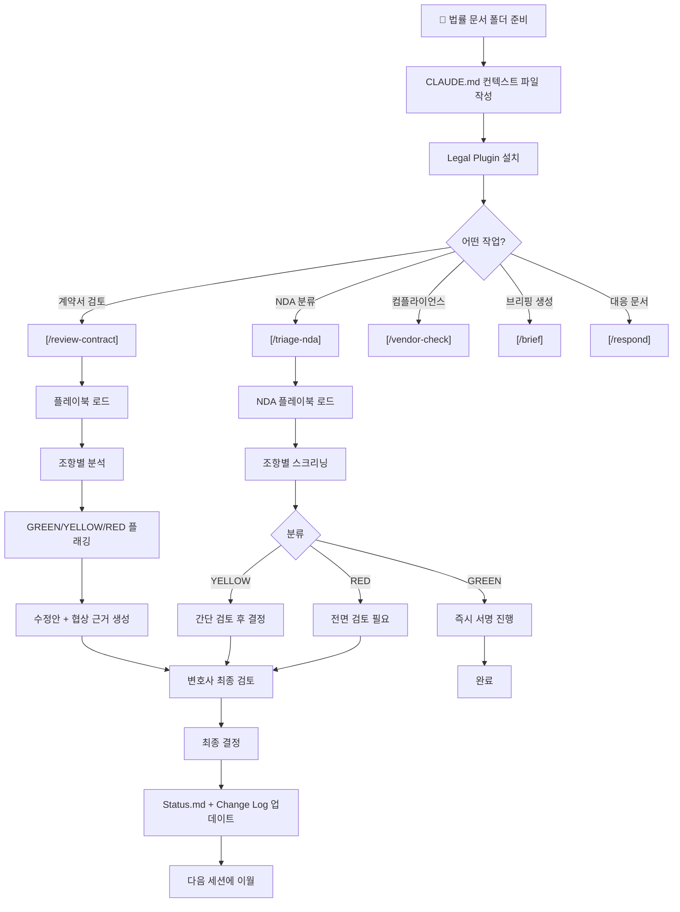
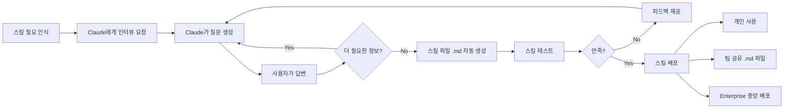
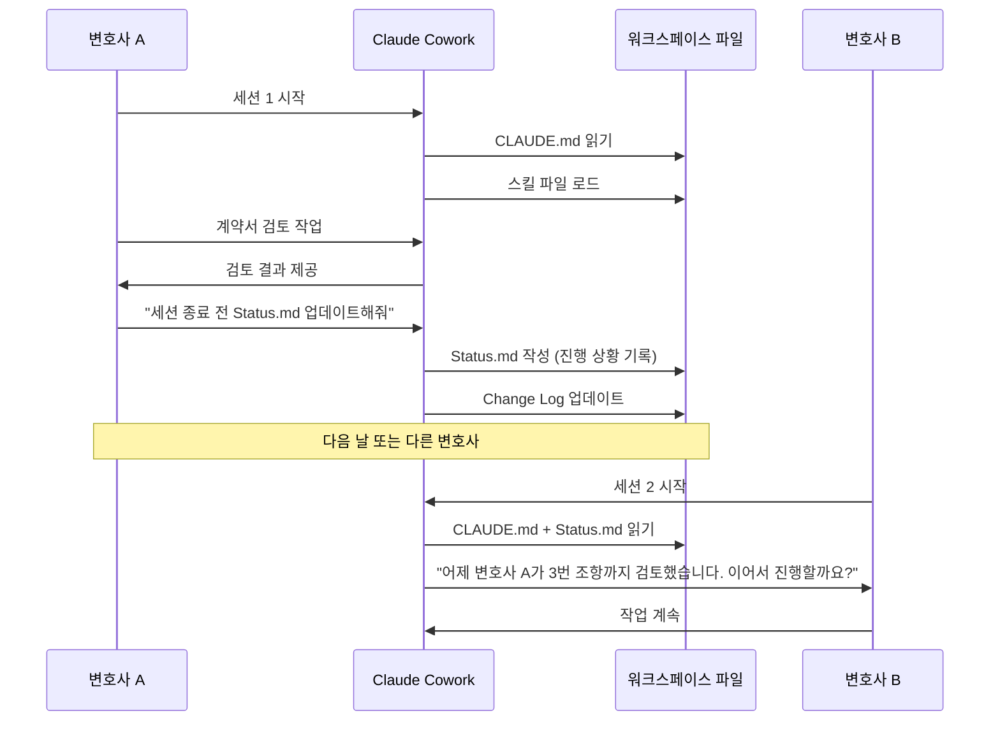
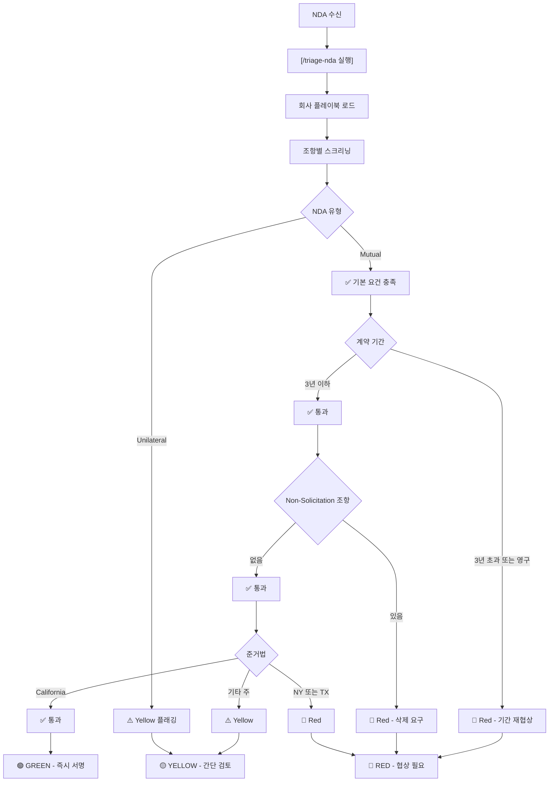

> **원본 영상**: "Claude Co-work for Lawyers: What Works (Beginner's Guide)"  
> **채널**: Liam Barnes | 공개일: 2026년 3월 24일  
> **URL**: https://www.youtube.com/watch?v=3qYINPcRrNQ  
> **작성 기준일**: 2026년 3월 26일 (최신 정보 반영)

---


## 목차

1. [Claude Cowork란 무엇인가?](#1-claude-cowork란-무엇인가)
2. [일반 Claude Chat과의 차이점](#2-일반-claude-chat과의-차이점)
3. [법률팀을 위한 핵심 기능](#3-법률팀을-위한-핵심-기능)
4. [실제 데모 시연: NDA 트리아지](#4-실제-데모-시연-nda-트리아지)
5. [Claude Legal Plugin 슬래시 명령어 전체 목록](#5-claude-legal-plugin-슬래시-명령어-전체-목록)
6. [스킬(Skill) 시스템: Cowork의 핵심 비밀 무기](#6-스킬skill-시스템-cowork의-핵심-비밀-무기)
7. [사용 전 반드시 해야 할 보안 설정](#7-사용-전-반드시-해야-할-보안-설정)
8. [Cowork의 한계점 및 주의사항](#8-cowork의-한계점-및-주의사항)
9. [실전 활용 팁 6가지](#9-실전-활용-팁-6가지)
10. [법률 업무별 ROI 분석](#10-법률-업무별-roi-분석)
11. [법률 시장에 미치는 충격](#11-법률-시장에-미치는-충격)
12. [요금제별 비교](#12-요금제별-비교)
13. [워크플로 다이어그램](#13-워크플로-다이어그램)
14. [핵심 요약 및 결론](#14-핵심-요약-및-결론)

---

## 1. Claude Cowork란 무엇인가?

### 개요

Claude Cowork는 Anthropic이 2026년 1월에 출시한 에이전틱(Agentic) AI 기능으로, **"Claude Code의 일반 업무 버전"** 이라고 공식적으로 포지셔닝하고 있다. 코딩 지식 없이도 복잡한 멀티스텝 작업을 AI가 자율적으로 실행할 수 있게 해주는 데스크탑 앱 전용 기능이다.

**핵심 차별점**: 단순히 질문에 답하는 것이 아니라, **결과물(Outcome)을 향해 자율적으로 작업을 수행**한다.

### 무엇을 할 수 있나?

- 로컬 파일을 직접 읽고, 편집하고, 생성
- 멀티스텝 태스크를 사람의 지속적인 개입 없이 실행
- 외부 앱 및 툴에 연결(MCP 서버 통해)
- 가상 머신 환경에서 안전하게 작동
- 슬래시(/) 커맨드로 특정 워크플로 즉시 호출

### 비유적 설명

> 일반 Claude Chat이 "질문에 답하는 조수"라면,  
> Claude Cowork는 **"폴더를 넘겨주면 알아서 처리하는 주니어 어소시에이트"** 다.  
> "플레이북 여기 있어. 폴더 여기 있어. 시작해." 라고 하면 혼자서 해낸다.

---

## 2. 일반 Claude Chat과의 차이점

| 구분 | 일반 Claude Chat | Claude Cowork |
|------|-----------------|---------------|
| **작동 방식** | 대화형 질답 | 목표 지향적 태스크 실행 |
| **파일 처리** | 업로드 후 분석 | 로컬 폴더 직접 읽기/쓰기/생성 |
| **작업 단위** | 단일 프롬프트 → 단일 응답 | 멀티스텝 자율 실행 |
| **메모리** | 대화 내 컨텍스트만 | 스킬 파일로 세션 간 지식 유지 |
| **외부 연동** | 제한적 | MCP 서버로 다양한 앱 연결 |
| **사용 플랫폼** | 웹/모바일/데스크탑 앱 | 데스크탑 앱 전용 |
| **토큰 소모** | 일반적 | 훨씬 많음 (멀티스텝 때문) |

---

## 3. 법률팀을 위한 핵심 기능

### Claude Legal Plugin

2026년 2월 2일 Anthropic이 공식 출시한 법률 전용 플러그인. 오픈소스로 GitHub에 공개되어 있으며, 완전히 커스터마이징 가능하다.

**플러그인 설치 방법**:
1. Claude Desktop 앱 → Cowork 탭
2. 좌측 사이드바 → "Customize" 메뉴
3. "Browse plugins" 클릭
4. Legal 플러그인 선택 → "Install"
5. 또는 [claude.com/plugins/legal](https://claude.com/plugins/legal) 직접 접속

**GitHub**: https://github.com/anthropics/knowledge-work-plugins

### 주요 기능 영역

#### ① 계약서 검토 (Contract Review)
- 조항별(clause-by-clause) 분석
- GREEN / YELLOW / RED 리스크 플래깅
- 구체적인 수정안(Redline) 언어 제시
- 협상 근거(Rationale) 포함
- 회사 플레이북 기반 맞춤 검토

#### ② NDA 트리아지 (NDA Triage)
- 수신 NDA 빠른 사전 분류
- GREEN(서명 진행) / YELLOW(간단 검토 필요) / RED(전면 검토 필요)
- 회사 NDA 플레이북 자동 로드
- 대량 NDA 처리 가능

#### ③ 컴플라이언스 모니터링 (Compliance Tracking)
- GDPR, CCPA, SOC 2 등 준수 여부 자동 체크
- 벤더 계약서 내 일탈 플래깅
- 갱신일 추적
- 컴플라이언스 갭 식별

#### ④ 법률 브리핑 생성 (/brief)
- 일일 요약(Daily Summary): 계류 중인 계약 요청, 임박한 마감일, 주의 필요 사항
- 특정 주제 리서치
- 인시던트 대응 브리핑

#### ⑤ 템플릿 응답 (/respond)
- DSAR(데이터 주체 접근 요청) 대응
- 디스커버리 홀드 통보
- 기타 표준 법무 대응 문서

---

## 4. 실제 데모 시연: NDA 트리아지

영상에서 보여준 실제 워크플로를 단계별로 재현한다.

### Step 1: 명령어 입력
Cowork 입력창에 `/triage-nda` 입력  
→ 자동완성으로 명령어 즉시 인식

### Step 2: NDA 제출 방식 선택 
```
How do you want to submit the NDA for triage?
1. Paste the NDA text directly
2. Upload an NDA file  
3. Describe the NDA and key terms
   [Something else]          [Skip]
```
→ "Skip" 선택하여 연결된 폴더에서 자동 탐색

### Step 3: 플레이북 로드 
Claude가 워크스페이스에서 자동으로:
1. NDA 트리아지 워크플로 스킬 로드
2. 회사 NDA 플레이북 파일 탐색 및 로드
3. 회사 표준 기준 확인

**로드된 회사 기준 예시**:
- Mutual NDA 선호; 일방적 NDA는 Yellow 플래깅
- 최대 계약 기간: 3년; 그 이상 또는 영구적이면 Red
- 모든 Non-Solicitation, Non-Compete 조항: Red (거부)
- 준거법: California 필수; 다른 주법이면 Yellow; NY 또는 TX이면 Red
- 기밀정보 정의 필수

### Step 4: 분석 결과 출력

**분류 결과: RED — 서명 불가**

세 가지 Red 이슈로 협상 전 서명 불가:

| 코드 | 이슈 | 내용 |
|------|------|------|
| RED ① | Non-Solicitation | 계약 종료 후 12개월 직원 비유인 조항이 NDA에 부적절. M&A 실사 맥락에서 Meridian 직원과 광범위한 접촉이 불가피하여 불합리하게 광범위한 제한. **완전 삭제 요구** |
| RED ② | New York 준거법 | 회사 플레이북이 NY를 Red로 분류. NY 법원은 광범위한 해석 경향. California 또는 Delaware LLC 준거법으로 교체 제안 |
| RED ③ | Confidentiality Survival | 3년을 초과하는 기간. 3년으로 단축, 영업비밀은 §4.3 조건 하에 예외 허용 |

**실제 생성된 NDA Triage Report (PDF) 포함**:
- 당사자, 유형, 발효일, 계약 기간 등 메타데이터
- 스크리닝 결과 표 (항목별 PASS / FAIL / FLAG)
- 준거법, 반환/파기 조항, 잔존 조항 등 세부 분석

---

## 5. Claude Legal Plugin 슬래시 명령어 전체 목록

| 명령어 | 기능 | 주요 활용 |
|--------|------|----------|
| `/review-contract` | 계약서 조항별 검토 + 수정안 제시 | 상업계약, SaaS 계약, 공급계약 |
| `/triage-nda` | NDA 신속 사전 분류 | 대량 NDA 처리, M&A 실사 |
| `/vendor-check` | 벤더 계약 상태 확인 | 벤더 관리, 갱신 추적 |
| `/brief` | 법무 브리핑 생성 | 일일 요약, 주제 리서치, 인시던트 대응 |
| `/respond` | 표준 법무 대응문 생성 | DSAR, 디스커버리 홀드, DSR |

---

## 6. 스킬(Skill) 시스템: Cowork의 핵심 비밀 무기

### 스킬이란?

스킬은 **"회사 표준과 워크플로를 Claude에게 한 번만 가르쳐 두면 매 세션마다 자동 적용되는 명령어 묶음"** 이다. Markdown 파일(.md) 형태로 저장된다.

### 스킬의 가치

> "새 어소시에이트가 합류할 때, 그들은 정책 바인더를 받는 것이 아니라 팀의 누적된 지식을 스킬을 통해 상속받는다. 이것이 실제로 지속되는 기관 기억이다."

- 매 세션마다 회사 기준을 재설명할 필요 없음
- 한 번 작성하면 Claude가 매번 자동 따름
- 신규 구성원 온보딩 자료로 활용 가능
- 기업 지식(Institutional Knowledge)의 디지털화

### 스킬 호출 방법

1. **슬래시 명령어**: `/스킬명` 직접 입력
2. **음성/텍스트 명시**: "이 계약서를 우리 리뷰 스킬로 검토해줘"
3. **자동 감지**: Claude가 컨텍스트를 파악해 적합한 스킬 자동 호출

### 스킬 만드는 방법: Claude와 인터뷰

영상에서 데모한 방법 — Claude가 사용자를 인터뷰하며 스킬을 구축:

**예시 입력 (음성 → 텍스트 변환 후 전송)**:
> "스킬을 하나 만들어줘. 우리는 부동산 로펌이고, 지급신청서 처리(Payment Application Processing) 스킬이 필요해. 금액 검증, 계약금액 대비 확인, 완공률 확인, 마스터 신청서 취합 기능이 포함되어야 해. 추가 정보가 필요하면 질문해줘."

**Claude의 후속 질문 예시**:
- 지급신청서 형식은 무엇인가? (AIA G702/G703, Textura, 자체 양식 등)
- 금액 검증 시 가장 중요한 체크 항목은? (과다청구, 변경지시 추적 등)
- 완공률 확인 방법은 어떻게 설정하나?

### 스킬 공유 방법

- **수동**: .md 파일 다운로드 → 이메일/슬랙 전송
- **Enterprise 플랜**: 관리자가 전직원 또는 특정 직원에게 배포
- **외부 스킬 사용 시 주의**: 공개 저장소 스킬은 반드시 별도 LLM으로 보안 취약점(악성코드, 프롬프트 인젝션) 점검 후 사용

---

## 7. 사용 전 반드시 해야 할 보안 설정

### ⚠️ 가장 중요한 설정: 데이터 학습 훈련 해제

**Pro/Max 플랜 기본값**: 대화 내용이 Anthropic 모델 훈련에 사용됨  
→ 클라이언트 계약서, NDA, 기밀문서를 업로드하면 훈련 데이터로 사용될 수 있음

**해제 방법**:
1. 프로필 → Settings 클릭
2. Privacy 메뉴로 이동
3. "Help improve Claude" 토글 → **OFF**

### Enterprise 플랜 권장 이유

- 계약상 보장: 데이터가 학습에 절대 사용되지 않음 (계약 의무)
- 규제 환경 법무팀에는 사실상 필수
- 관리자 중앙 관리, 플러그인 배포 가능
- 감사 로그 관련 별도 시스템 구축 필요 (현재 Cowork 자체 감사로그 없음)

### 폴더 접근 권한 설정

- **전체 폴더 절대 금지**: 특정 작업 폴더만 선택
- 권장 폴더 구조:
  ```
  /Legal-Cowork-Workspace/
  ├── /contracts/          # 검토할 계약서
  ├── /templates/          # 계약 템플릿
  ├── /outputs/            # 결과물
  ├── /playbooks/          # 회사 플레이북
  └── CLAUDE.md            # 컨텍스트 파일 (필수)
  ```
- 클라우드 동기화 (SharePoint, Google Drive) 권장
- **중요 파일은 반드시 복사본 생성**: AI가 예상치 못한 방향으로 동작할 수 있음

---

## 8. Cowork의 한계점 및 주의사항

영상 제작자가 2개월 실제 사용 후 정리한 한계점:

### ① 세션 간 메모리 없음
- 매 Cowork 세션은 완전히 새로 시작
- 이전 세션에서 한 작업을 기억하지 못함
- **해결책**: Change Log + Status.md 파일 활용 (세션 종료 시 작성, 다음 세션 시작 시 읽기)

### ② 빠른 토큰 소모
- 일반 Chat 대비 훨씬 많은 토큰 사용
  - 멀티스텝 실행 + 파일 읽기 + 검색 + 서브에이전트 조율
- Pro 플랜이라면 빠르게 한도 도달
- **해결책**: Max, Team, Enterprise 플랜 고려

### ③ Windows 앱 안정성 문제 (2026년 3월 기준)
- Windows 11에서 설치 실패 사례
- 사용 중 크래시 → 전체 재부팅 필요
- 백그라운드 가상 머신이 미사용 시에도 마우스 끊김 현상 발생
- **현재 권장**: macOS 앱 사용

### ④ 감사 로그 없음 (규제 대상 기업 주의)
- Cowork 활동이 Anthropic 감사 로그, 컴플라이언스 API, 데이터 내보내기에 기록되지 않음
- AI 사용 내역 추적이 필요한 규제 환경에서는 **심각한 갭**
- 별도 감사 시스템 구축 필요

### ⑤ 미국 법 중심 기본 플레이북
- 기본 제공 플레이북이 Delaware, New York, California 기준
- 한국, 영국, EU, 호주 법무팀은 **반드시 관할권 맞게 커스터마이징** 후 사용

### ⑥ AI가 이탈하면 새 세션 시작
- AI가 잘못된 방향으로 가기 시작하면 수정 시도 금지
- 이미 잘못된 추론 경로를 메모리에 유지하므로 악화됨
- **바로 새 세션 시작** → 이전 세션의 좋은 프롬프트 복사 → 재시작

---

## 9. 실전 활용 팁 6가지

### Tip 1: 워크스페이스 폴더 구조화
- 전체 Documents 폴더 절대 사용 금지
- contracts/, templates/, outputs/ 하위 폴더 분리
- 클라우드 동기화로 백업 유지

### Tip 2: CLAUDE.md 컨텍스트 파일 필수 작성
워크스페이스 루트에 `CLAUDE.md` 파일 생성 → Claude가 매 세션 자동으로 읽음

**포함 내용 예시**:
```markdown
# 회사 정보
- 법인명: [회사명]
- 주요 업무: [업무 영역]
- 관할권: 대한민국 (민법, 상법 기준)

# 계약 검토 기준
- 준거법: 대한민국
- 손해배상 한도: 계약금액의 [X]%
- 비밀유지 기간: 최대 [X]년

# 스타일 가이드
- 출력 언어: 한국어
- 보고서 형식: [형식 명시]
```

### Tip 3: 결과(Outcome) 중심으로 지시
| ❌ 하지 말 것 | ✅ 해야 할 것 |
|-------------|------------|
| "파일 열어, 3번째 단락 읽어, 7조와 비교해" | "이 계약서를 우리 플레이북과 비교해서 표준 기준 벗어난 것 플래깅해줘" |
| 단계별 지시 | 목표 중심 지시 |

### Tip 4: 배치 작업으로 처리
- NDA 3개 검토 → 3개 세션 ❌
- NDA 3개 검토 → 1개 세션에서 한꺼번에 ✅
- 토큰 절약 + 컨텍스트 일관성 유지

### Tip 5: Change Log + Status.md 파일 운영
- **Change Log**: 각 세션에서 무엇이 변경되었는지 기록
- **Status.md**: 현재 진행 상태 기록 → 다음 세션 시작 시 Claude에게 읽게 함
- 스킬 파일 생성 시 이 두 파일 자동 생성 요청하도록 명시

### Tip 6: AI 이탈 시 미련 없이 새 세션
- 잘못된 방향으로 가면 수정하려 하지 말 것
- 새 세션 시작 → 이전의 좋은 프롬프트 복붙 → 재시작
- **"매몰비용의 오류(Sunk Cost Fallacy)"** 에 빠지지 않기

---

## 10. 법률 업무별 ROI 분석

영상에 등장한 "The Billable Hour Gap" 대시보드 기반:

### 변호사 하루 시간 배분 현실

| 구분 | 시간 | 비율 |
|------|------|------|
| 청구 가능 시간 (Billable) | **2.9시간** | 36% |
| 비청구 시간 (Admin, Research, Formatting) | **5.1시간** | 64% |
| **업계 평균 활용률 (Utilization Rate)** | — | **37%** |

> 변호사가 8시간 중 실제로 청구되는 시간은 약 3시간뿐.  
> 나머지 5시간은 수익을 창출하지 못하는 업무에 소모된다.

### Cowork 도입 시 업무별 영향도

| 업무 분야 | 임팩트 | 상세 |
|-----------|--------|------|
| 계약서 1차 검토 | 🟢 **HIGH** | 80% 빠른 초안 작성 (3~6시간 → 수분) |
| NDA 트리아지 및 라우팅 | 🟢 **HIGH** | 처리 시간: 시간 → 분 단위 |
| 컴플라이언스 체크 | 🔵 **MEDIUM** | 변호사 최종 검토 여전히 필요 |
| 파일 정리 / 어드민 | 🟢 **HIGH** | 대량 일괄 처리 가능 |
| 복잡한 M&A / 증권 | 🔴 **LOW** | 아직 인간이 필요 |

### 구체적 시간 절감 효과

- **계약서 초안 검토**: 어소시에이트 3~6시간 → 수 분 (80% 완성도)
- **NDA 트리아지**: 팀 처리 업무량에 따라 패러리갈 주 1일 절약 가능
- **일일 브리핑**: 매일 아침 수동으로 정리하던 현황 파악 → 자동화

---

## 11. 법률 시장에 미치는 충격

### Anthropic의 전략적 의미

Anthropic은 처음으로 파운데이션 모델 회사가 API를 법률 기술 벤더에게 공급하는 것에 그치지 않고, 법률 워크플로 제품을 직접 플랫폼에 패키지화하여 법률 벤더를 우회하고 고객에게 직접 접근하는 전략을 취하고 있다.

이 플러그인은 본질적으로 고품질의 시스템 프롬프트와 워크플로 맵의 집합으로, 모두 GitHub에 공개되어 있으며 Claude의 기존 언어 모델 위에 레이어로 올려져 일관된 출력 형식과 리스크 플래깅을 제공하는 구조화된 경로를 만든다.

### 법률 기술 시장의 반응

- LexisNexis는 Claude Cowork Legal Plugin을 자사의 Protégé GenAI 스위트에 통합한다고 발표했으며, 이를 통해 수백 가지의 기존 AI 및 에이전틱 AI 법률 워크플로 역량을 강화할 것이라고 밝혔다.
- Pramata: 엔터프라이즈 계약 인텔리전스 통합 발표
- Reed Smith, 주요 로펌들: 플러그인 평가 착수

### 기존 법률 기술 시장 위협 요인

- "모델 + 래퍼 + 워크플로" 구조로 법률 AI 벤더를 구축해온 회사들이 위협받음
- Anthropic이 모델 공급자에서 애플리케이션 레이어와 워크플로 오너로 이동한다는 의미를 가진다.

---

## 12. 요금제별 비교

| 구분 | Pro ($20/월) | Max ($100/월) | Team | Enterprise |
|------|-------------|--------------|------|-----------|
| Cowork 접근 | ✅ | ✅ | ✅ | ✅ |
| 토큰 한도 | 낮음⚠️ | 높음 | 높음 | 높음 |
| 데이터 훈련 사용 | 기본 ON (수동 해제 필요) | 기본 ON | 기본 OFF | 계약상 절대 없음 |
| 플러그인 중앙 배포 | ❌ | ❌ | ✅ | ✅ |
| 감사 로그 | ❌ | ❌ | 제한적 | 별도 구성 필요 |
| 규제 환경 적합성 | ❌ | ❌ | 부분적 | ✅ (권장) |

---

## 13. 워크플로 다이어그램

### 전체 Claude Cowork 법률 워크플로



### 스킬 생성 프로세스



### 세션 간 메모리 관리 (핵심 운영 체계)



### NDA 트리아지 결정 트리



---

## 14. 핵심 요약 및 결론

### 한 줄 요약

> Claude Cowork + Legal Plugin = "주니어 어소시에이트를 24시간 고용한 것"  
> 단, **변호사의 최종 검토는 절대 생략 불가.**

### 무엇이 좋은가?

1. **계약서 1차 검토**의 80%를 수 분 만에 완성 (종전 3~6시간)
2. **대량 NDA 트리아지**를 자동화 → 패러리갈 주 1일 절약 가능
3. **스킬 시스템**으로 회사 표준을 한 번만 설정하면 영구 적용
4. **로컬 파일 직접 처리** → 웹 업로드 없이 안전하게 작업
5. **일일 브리핑 자동화** → 아침 업무 시작을 체계적으로

### 무엇이 아쉬운가?

1. 세션 간 메모리 없음 → Status.md로 보완 필요
2. Pro 플랜의 빠른 토큰 소모
3. Windows 앱 안정성 부족 (2026년 3월 현재)
4. 감사 로그 미지원 → 규제 환경에서는 별도 대응 필요
5. 기본 플레이북이 미국 법 중심 → 한국 로펌은 반드시 커스터마이징

### 도입 시 권장 순서

```
1단계: 보안 설정 (훈련 데이터 해제)
2단계: 워크스페이스 폴더 구조 설계
3단계: CLAUDE.md 컨텍스트 파일 작성
4단계: Legal Plugin 설치
5단계: 기존 플레이북을 스킬로 변환
6단계: NDA 트리아지부터 시범 운영
7단계: 계약서 검토로 확장
8단계: 전체 워크플로 자동화
```

### 비용 대비 효과 (ROI 계산)

무료 ROI 계산기: [legalairoi.com](https://legalairoi.com/tools/cowork-r...)

---

## 참고 자료

| 자료 | 링크 |
|------|------|
| Claude Legal Plugin 공식 페이지 | https://claude.com/plugins/legal |
| Legal Plugin GitHub (오픈소스) | https://github.com/anthropics/knowledge-work-plugins |
| Anthropic 개인정보 설정 | https://privacy.claude.com |
| Anthropic 법무팀 Claude 활용 사례 | https://claude.com/blog/how-anthropic-legal-team-uses-claude |
| 무료 ROI 계산기 | https://legalairoi.com |
| 영상 채널 | Liam Barnes (YouTube) |

---

*본 문서는 영상 트랜스크립트, 실제 스크린샷, 및 2026년 3월 기준 최신 검색 정보를 종합하여 작성되었습니다.*  
*Claude는 법률 조언을 제공하지 않으며, 모든 AI 출력물은 면허를 가진 변호사의 검토가 필요합니다.*
