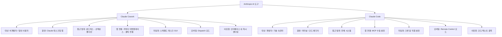
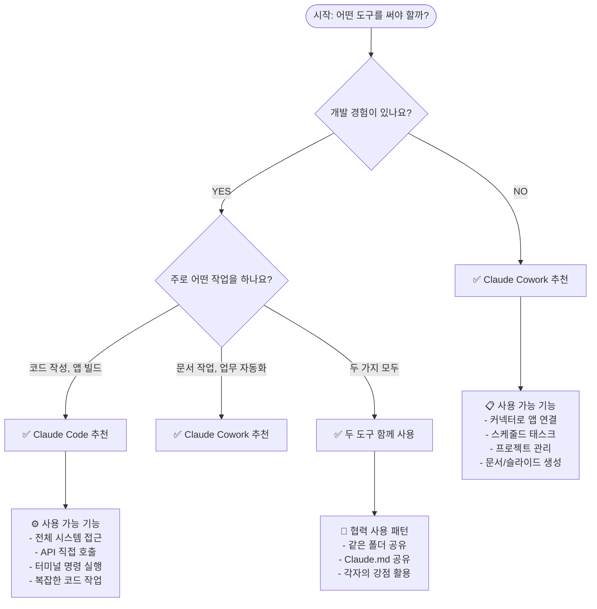
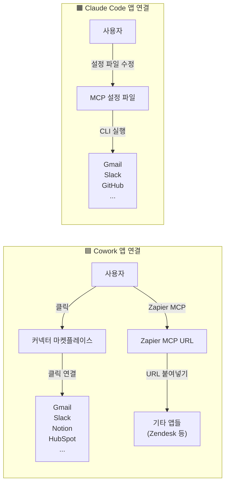
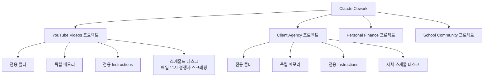
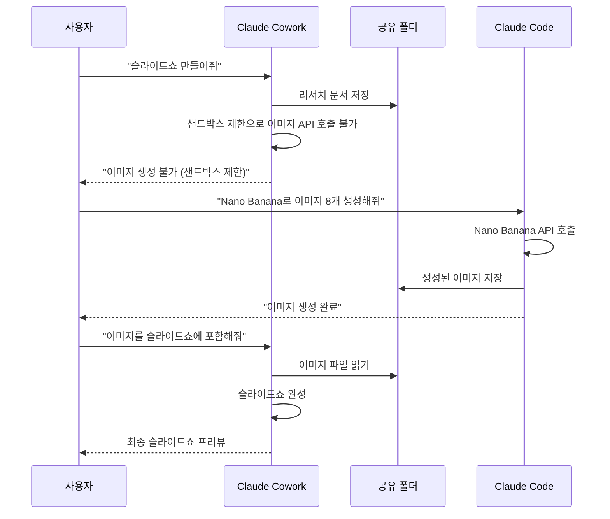

> 영상: ["Claude Code vs Cowork FINALLY Explained (which should you use?)"](https://www.youtube.com/watch?v=grh7CMl960s) — Brock (2026.03.26)  
> 최신 정보 반영 기준: 2026년 3월 26일

---

## 목차

1. [개요: 두 도구는 무엇인가?](#1-개요)
2. [핵심 개념: 어시스턴트 vs 엔지니어](#2-핵심-개념)
3. [Cowork의 샌드박스란 무엇인가?](#3-cowork-샌드박스)
4. [Claude Code란? 코드 에디터란?](#4-claude-code와-코드-에디터)
5. [Claude Code가 실행될 수 있는 5가지 장소](#5-claude-code-실행-장소)
6. [앱 연결 방식: 커넥터 vs MCP](#6-앱-연결-방식)
7. [Cowork 프로젝트 기능 심층 분석](#7-cowork-프로젝트)
8. [스킬(Skills): 양쪽 플랫폼에서의 작동 방식](#8-스킬)
9. [디스패치 모드 vs 리모트 컨트롤 모드](#9-모바일-접근)
10. [스케줄드 태스크 vs 크론 잡](#10-자동화-작업)
11. [두 도구를 함께 사용하는 실제 예시](#11-두-도구의-협력)
12. [나의 80/20 사용 분할](#12-80-20-사용-분할)
13. [나에게 맞는 도구는?](#13-어떤-도구를-써야-할까)
14. [2026년 3월 최신 업데이트](#14-최신-업데이트-2026년-3월)
15. [도식 요약](#15-도식-요약)
16. [최종 결론](#16-최종-결론)

---

## 1. 개요

Anthropic이 만든 두 가지 AI 에이전트 도구, **Claude Cowork**와 **Claude Code**는 표면적으로는 비슷해 보이지만 실제로는 완전히 다른 목적과 사용자를 위해 설계된 도구다. 많은 사람들이 두 도구의 이름이 비슷하고 둘 다 "Claude"를 기반으로 한다는 이유로 어떤 것을 사용해야 할지 혼란스러워한다.

영상 제작자인 Brock은 매일 두 도구를 모두 사용하면서, 각 도구의 강점과 차이점을 명확하게 구분하는 법을 터득했다. 그의 핵심 메시지는 단순하다: **이 두 도구는 경쟁 관계가 아니라 상호 보완적인 도구**다. 실제로 두 도구를 함께 사용할 때 가장 강력한 결과물을 얻을 수 있다.

### 두 도구의 가장 단순한 비유

| 도구 | 비유 | 대상 |
|------|------|------|
| Claude Cowork | 나의 어시스턴트(비서) | 비개발자, 일반 사용자 |
| Claude Code | 나의 전담 엔지니어 | 개발자, 기술 숙련자 |

---

## 2. 핵심 개념: 어시스턴트 vs 엔지니어

### Claude Cowork = 당신의 어시스턴트

Cowork는 Claude 데스크탑 앱 안에서 동작하는 AI 에이전트로, **코딩 지식이 전혀 없는 사람도** 바로 사용할 수 있다. 주요 기능은 다음과 같다.

- 다양한 애플리케이션과 연동하여 작업 수행
- 문서 생성, 파일 정리, 이메일 관리
- 스케줄에 따라 자동으로 태스크 실행
- 시각적으로 정돈된 인터페이스 제공 (마치 일반 ChatGPT처럼 보임)

Cowork의 인터페이스를 보면 왼쪽 사이드바에 프로젝트 목록이 있고, 오른쪽에는 스케줄된 태스크, 그리고 접근 가능한 파일(컨텍스트)들이 깔끔하게 구성되어 있다. 비기술적인 사람도 부담 없이 사용할 수 있는 구조다.

### Claude Code = 당신의 전담 엔지니어

Claude Code는 코드 에디터나 터미널에서 동작하는 AI 코딩 에이전트다. 다음과 같은 작업을 처리한다.

- 코드 작성 및 수정
- 앱 빌드
- 테스트 실행
- 패키지 설치, 터미널 명령어 실행

Claude Code의 인터페이스는 수많은 파일과 코드 텍스트로 가득 찬 코드 에디터 환경으로, 개발 경험이 없는 사람에게는 상당히 압도적으로 느껴질 수 있다.

---

## 3. Cowork 샌드박스

### 샌드박스(Sandbox)란?

Cowork를 처음 접하면 "샌드박스"라는 개념을 만나게 된다. 이를 아주 쉽게 설명하자면 다음과 같다.

> **Claude가 밀봉된 거품(bubble) 안에서 작업한다고 생각하라. 이 거품 바깥의 것은 건드릴 수 없다.**

즉, Cowork는 사용자가 명시적으로 허용한 폴더와 앱에만 접근할 수 있다. 이 샌드박스 안에서는:

- 선택된 폴더에 있는 파일 생성·수정
- 연동된 앱들(커넥터)을 통한 작업 수행
- 스케줄에 따른 태스크 자동 실행

이 모든 것이 **안전하게** 이루어진다.

### 샌드박스가 중요한 이유

만약 에이전트가 샌드박스 없이 동작한다면, 컴퓨터 전체의 파일, 시스템 설정, 다른 앱에 무제한으로 접근할 수 있게 된다. 이는 심각한 보안 위협이 될 수 있다. Cowork의 샌드박스는 이러한 위험을 차단하는 안전장치다.

반면 Claude Code는 머신 전체에 접근이 가능하므로, 더 강력하지만 그만큼 더 주의가 필요하다.

```
┌─────────────────────────────────┐
│         Cowork 샌드박스          │
│                                 │
│  ✅ 선택된 폴더                  │
│  ✅ 연동된 커넥터 앱              │
│  ✅ 스케줄 태스크                 │
│                                 │
│  ❌ 전체 시스템 접근 불가         │
│  ❌ 외부 API 직접 호출 제한       │
└─────────────────────────────────┘
```

---

## 4. Claude Code와 코드 에디터

### 코드 에디터란?

코드 에디터를 이해하기 위한 간단한 비유:

> **Google Docs가 글쓰기를 위한 앱이라면, 코드 에디터는 코딩을 위한 앱이다.**

Google Docs에서 에세이나 보고서를 쓰고, 맞춤법과 형식 지원을 받듯이, 코드 에디터에서는 코드를 작성하고, 색상 강조(신택스 하이라이팅), 오류 표시, 확장 프로그램 설치 등의 지원을 받는다.

### 주요 코드 에디터 종류

Brock이 개인적으로는 **Cursor**를 사용하지만, Claude Code는 다음 에디터들과 모두 호환된다.

| 에디터 | 특징 |
|--------|------|
| **Cursor** | AI 코딩 특화, Brock 추천 |
| **VS Code** | 가장 널리 사용되는 오픈소스 에디터 |
| **Windsurf** | AI 기능 내장 |
| **JetBrains** | 기업용, 다양한 언어 지원 |

---

## 5. Claude Code 실행 장소

Claude Code는 코드 에디터에서만 실행되는 것이 아니다. 총 **5가지 환경**에서 실행될 수 있다.

### ① 터미널(Terminal)

터미널은 마우스 클릭 없이 텍스트 명령어만으로 컴퓨터를 조작하는 환경이다. 개발자가 아니라면 상당히 무서워 보일 수 있지만, Claude Code는 이 환경에서 직접 실행되어 강력한 작업들을 처리할 수 있다.

```bash
# 터미널에서 Claude Code 실행 예시
claude "이 폴더의 모든 이미지를 썸네일로 변환해줘"
```

### ② 코드 에디터 확장 프로그램

Cursor나 VS Code 같은 IDE에 Claude Code 확장 프로그램을 설치하면, 사이드 패널에서 직접 프롬프트를 입력하고 파일 수정 작업을 지시할 수 있다.

### ③ Claude 데스크탑 앱

Claude 데스크탑 앱에서 Cowork와 Code를 전환할 수 있다. 다만 코드 에디터 안에서 사용하는 것보다는 기능이 제한적이다.

### ④ Claude 웹 앱

웹 브라우저에서도 Claude Code에 접근할 수 있지만, 주로 기존 코드를 수정하는 용도에 가깝고 전체 기능 활용은 제한적이다.

### ⑤ 모바일 앱 (리모트 컨트롤 모드)

Claude 모바일 앱에서 리모트 컨트롤 모드를 통해 Claude Code 세션을 원격으로 조작할 수 있다. 이는 데스크탑에서 시작한 작업을 외출 중에도 이어갈 수 있게 해주는 기능이다.

---

## 6. 앱 연결 방식

두 도구 모두 Gmail, Google Calendar, Slack, Notion, HubSpot 등의 외부 앱과 연동될 수 있다. 하지만 **연결 방식이 완전히 다르다.**

### Cowork: 커넥터 마켓플레이스 (쉬운 방법)

Cowork에서는 클릭 몇 번으로 앱을 연결할 수 있다.

1. Cowork 왼쪽 사이드바에서 **"Customize"** 클릭
2. **"Connectors"** 탭 선택
3. 연결하고 싶은 앱 검색 후 **"Connect"** 클릭
4. 로그인하면 끝

현재 연결 가능한 앱 예시:
- Gmail, Google Calendar, Google Drive
- Slack, Notion, HubSpot
- GitHub, Bit.ly
- Figma, Apple Notes
- Chrome 브라우저 제어
- Apify 등 수십 가지

### Claude Code: MCP 수동 설정 (기술적 방법)

Claude Code에서는 **MCP(Model Context Protocol)** 를 통해 앱을 연결한다. 이는 설정 파일을 직접 수정해야 하는 다소 복잡한 과정이다.

```json
// .claude/settings.json 예시
{
  "mcpServers": {
    "gmail": {
      "command": "npx",
      "args": ["-y", "@anthropic/mcp-gmail"]
    }
  }
}
```

### Zapier MCP: 비기술자를 위한 우회로

Cowork에서 직접 연결이 안 되는 앱의 경우, **Zapier MCP**를 활용할 수 있다. 방법은 다음과 같다.

1. Zapier MCP에서 새 MCP 서버 생성
2. 연결하고 싶은 앱(예: Zendesk) 선택 및 설정
3. 생성된 URL을 복사
4. Cowork의 커넥터 설정에서 Zapier 검색 후 URL 붙여넣기

이렇게 하면 Cowork에서도 사실상 무제한의 앱 연결이 가능해진다.

---

## 7. Cowork 프로젝트

### 프로젝트란?

Cowork에 최근 추가된 **Projects** 기능은 게임 체인저라 할 수 있다. 프로젝트란 관련 작업들을 하나의 독립된 공간으로 묶어주는 기능이다.

각 프로젝트는 다음을 독립적으로 가진다.
- **고유한 폴더**: 컴퓨터 내 별도 디렉토리
- **독립적인 메모리**: 다른 프로젝트의 컨텍스트와 혼재되지 않음
- **전용 지시사항(Instructions)**: 이 프로젝트에서 Claude가 어떻게 행동할지 설정
- **별도의 스케줄 태스크**: 프로젝트별 자동화 작업

### 실제 사용 예시

Brock의 경우 다음과 같은 프로젝트를 운영 중이다.

| 프로젝트 이름 | 주요 기능 |
|--------------|----------|
| YouTube Videos | 경쟁자 채널 자동 스크래핑, 썸네일 생성, 콘텐츠 작성 보조 |
| Client Agency | 인플루언서 마케팅 에이전시 업무 관리 |
| Personal Finances | 개인 재무 관련 작업 자동화 |
| School Community | 커뮤니티 가이드 및 관련 문서 작성 |

### 프로젝트 인터페이스 구성

Cowork 프로젝트 화면은 다음과 같이 구성된다.

```
┌─────────────────────────────────────────────────────┐
│ 왼쪽 사이드바        │ 메인 영역       │ 오른쪽 패널  │
│                     │                │             │
│ [프로젝트 목록]       │ [현재 채팅 및  │ [Instructions│
│ - YouTube Videos    │  아웃풋 표시]   │  지시사항]   │
│ - Client Agency     │                │             │
│ - Personal Finance  │                │ [Scheduled  │
│ - School Community  │                │  Tasks]     │
│                     │                │             │
│ [Context / Files]   │                │ [Context]   │
└─────────────────────────────────────────────────────┘
```

YouTube Videos 프로젝트의 스케줄 태스크 예시로, 매일 오전 11시에 경쟁자 YouTube 채널을 자동으로 스크래핑하여 대시보드에 업데이트하는 작업이 자동으로 실행된다.

---

## 8. 스킬(Skills)

### 스킬이란?

**스킬**은 Claude가 특정 워크플로우를 수행하는 방법을 담은 마크다운 파일이다. 쉽게 말하면 "이렇게 이렇게 해줘"라는 상세한 지시서를 미리 저장해둔 것이다.

예를 들어, 슬라이드쇼를 특정 형식으로 만드는 스킬을 한 번 설정해두면, 이후에는 단순히 "slideshow {주제}"라고 입력하는 것만으로도 동일한 형식의 슬라이드쇼가 자동 생성된다.

### Cowork에서의 스킬 사용

- Customize → Skills 탭에서 마크다운 파일로 관리
- 스킬 목록을 시각적으로 확인 가능
- 클릭 한 번으로 스킬 내용 열람
- 생성된 아웃풋(HTML 대시보드, 슬라이드쇼 등)을 인터페이스 내에서 바로 미리보기 가능

### Claude Code에서의 스킬 사용

- 동일한 마크다운 스킬 파일 활용 가능
- 프롬프트에서 스킬 이름을 언급하여 트리거
- 스킬 목록 시각화가 없어 파일 탐색기에서 직접 찾아야 함
- 아웃풋이 HTML 코드로 출력되어 별도로 열어야 함 (Cowork처럼 자동 프리뷰 없음)

### 두 플랫폼의 스킬 출력 비교

같은 스킬을 사용했을 때, 두 플랫폼의 결과물은 동일하다(동일한 마크다운 파일 사용). 차이는 **출력 방식**에 있다.

- **Cowork**: 생성된 슬라이드쇼가 인터페이스 내에서 바로 렌더링되어 보임
- **Claude Code**: HTML 코드가 생성되고, 브라우저에서 별도로 열어야 함

---

## 9. 모바일 접근: 디스패치 모드 vs 리모트 컨트롤 모드

### Cowork: 디스패치 모드(Dispatch Mode)

2026년 초 Cowork에 추가된 **Dispatch** 기능은 모바일 폰에서 Claude에게 태스크를 할당할 수 있게 해준다. 작동 방식은 다음과 같다.

- 모바일 Claude 앱에서 디스패치 모드 선택
- 채팅 인터페이스에서 작업 지시
- Cowork가 데스크탑 컴퓨터에서 해당 작업을 실행
- 사용자는 결과물을 나중에 확인

이제 **Computer Use** 기능과 결합되어, Claude가 키보드와 마우스를 직접 제어하여 화면 상의 작업까지 자동화할 수 있다 (2026년 3월 24일 출시).

### Claude Code: 리모트 컨트롤 모드(Remote Control)

Claude Code의 리모트 컨트롤은 다음과 같이 작동한다.

- 데스크탑에서 Claude Code 세션 시작
- 모바일 앱에서 해당 세션에 접속
- Claude가 코드 작업을 계속 진행하는 동안 외출 중에도 제어 가능
- 큰 프로젝트나 오래 걸리는 코딩 작업에 유용

---

## 10. 자동화 작업: 스케줄드 태스크 vs 크론 잡

### Cowork: 스케줄드 태스크 (쉬운 방법)

Cowork의 스케줄드 태스크는 일상의 반복 업무를 자동화해준다. Brock의 실제 사용 예:

- **매일 오전 7시**: 이메일과 Slack을 확인하고 오늘의 우선순위, 긴급 메일, AI 뉴스, 캘린더 일정을 담은 대시보드 생성 ("모닝 브리핑")
- **매일 오전 11시**: YouTube 경쟁자 채널 자동 스크래핑 및 대시보드 업데이트
- **매주 월요일**: Google Calendar에서 주간 회의 일정 가져와 미팅 준비 사항 정리

스케줄드 태스크 설정 방법:
1. Cowork 왼쪽 사이드바에서 "Add New Task" 클릭
2. 수행할 작업 내용 입력
3. 실행 빈도(매일, 매주, 특정 시간 등) 설정

또는 기존 채팅에서 "이 작업을 스케줄 태스크로 전환해줘"라고 요청하면 자동으로 등록된다.

### Claude Code: 크론 잡 (기술적 방법)

Claude Code에서도 자동화가 가능하지만, **크론 잡(Cron Job)** 이라는 방법을 직접 설정해야 한다. 터미널에 다음과 같은 형식으로 입력한다.

```
# 크론 잡 문법 예시
# 분 시 일 월 요일 명령어
0 7 * * * /path/to/script.sh    # 매일 오전 7시 실행
0 11 * * * /path/to/scraper.sh  # 매일 오전 11시 실행
0 9 * * 1 /path/to/weekly.sh    # 매주 월요일 오전 9시 실행
```

이 문법을 모른다면 크론 잡을 설정하기 어렵기 때문에, 비개발자에게는 Cowork의 스케줄드 태스크가 훨씬 접근하기 쉬운 대안이다.

---

## 11. 두 도구의 협력: 실제 사용 사례

### Claude.md 파일 공유

두 도구 모두 **Claude.md** 파일을 활용한다. 이 파일은 Claude가 특정 폴더 안에서 어떻게 작동해야 하는지를 담은 지시 파일로, **Cowork와 Code 간에 공유 가능**하다. 즉, 같은 폴더를 두 도구가 함께 바라보며 작업할 때 동일한 컨텍스트를 공유할 수 있다.

### 실제 영상 제작 사례

Brock이 이 영상을 만들 때 두 도구를 어떻게 함께 사용했는지 예시:

**문제 상황**: 슬라이드쇼에 들어갈 인포그래픽 이미지를 Cowork에서 생성하려 했으나, Cowork의 **샌드박스가 이미지 생성 API(Nano Banana Pro)의 외부 호출을 차단**했다.

**해결책**:
1. 같은 폴더를 Claude Code도 바라보도록 설정
2. Claude Code를 통해 Nano Banana Pro API를 호출하여 8개의 인포그래픽 이미지 생성
3. Claude Code가 생성한 이미지들이 공유 폴더에 저장됨
4. Cowork가 그 이미지들을 활용하여 최종 슬라이드쇼 완성

이처럼 두 도구는 **서로의 한계를 보완**하며 함께 사용될 수 있다.

```
[공유 폴더]
    │
    ├── Cowork: 리서치, 문서 작성, 슬라이드 조합
    │
    └── Claude Code: 이미지 생성, 코드 실행, API 호출
```

### 두 도구가 공통으로 지원하는 기능

| 기능 | Cowork | Claude Code |
|------|--------|-------------|
| Claude.md 파일 | ✅ | ✅ |
| 앱 연결 | ✅ 커넥터(쉬움) | ✅ MCP(복잡) |
| 플러그인 | ✅ | ✅ |
| 폴더 접근 | ✅ | ✅ |
| AI 모델(Claude 4.6, Opus 4.6) | ✅ | ✅ |
| 모바일 접근 | ✅ Dispatch | ✅ Remote Control |
| 스킬 사용 | ✅ | ✅ |

---

## 12. 80/20 사용 분할

Brock은 자신의 사용 패턴을 **Cowork 80%, Claude Code 20%** 로 표현한다.

### Cowork (80%)로 하는 일

- 슬라이드쇼 및 영상 관련 에셋 생성
- 경쟁자 채널 리서치 및 보고서 작성
- 이메일 및 Slack 관리
- 커뮤니티 가이드 및 문서 작성
- 스케줄 태스크를 통한 자동화 (인터넷 스크래핑, 앱 간 작업)
- 연동된 앱들을 활용한 반복 업무 처리

### Claude Code (20%)로 하는 일

- **썸네일 생성**: Nano Banana API를 통한 이미지 생성 (Cowork에서 불가능)
- 특정 터미널 명령어 실행
- 컴퓨터 내 로우 파일 직접 접근 (예: 영상 파일 트랜스크립트 추출)

---

## 13. 어떤 도구를 써야 할까?

### 나에게 맞는 도구 선택 가이드

```
질문 1: 코딩/개발 경험이 있나요?
│
├── YES → Claude Code 사용 가능. 더 강력한 기능 활용 가능.
│          (Cowork도 병행 사용 시 효율↑)
│
└── NO  → Claude Cowork부터 시작하세요.
           코딩 없이도 강력한 자동화 가능.
```

### 비개발자에게 Cowork를 추천하는 이유

코드 에디터의 복잡한 파일 구조, 터미널, 패키지 설치 등의 개념이 낯설고 부담스럽다면 Cowork가 훨씬 좋은 선택이다. Cowork는 마치 일반 AI 채팅 앱처럼 직관적이면서도 강력한 자동화와 앱 연동 기능을 제공한다.

### 개발자에게 Claude Code를 추천하는 이유

이미 코드 에디터와 터미널에 익숙한 개발자라면 Claude Code가 제공하는 정밀한 제어와 전체 시스템 접근 권한이 훨씬 효율적이다. 코드베이스 전체를 컨텍스트로 삼아 작업할 수 있다는 점에서 특히 강력하다.

### Brock의 미래 전망

Brock은 향후 3~12개월 안에 Cowork가 Claude Code와의 격차를 빠르게 좁힐 것으로 예측한다. Anthropic의 Cowork 업데이트 속도를 보면, 이 도구가 최종적으로는 **누구나 사용할 수 있는 올인원 AI 에이전트**가 될 것임을 알 수 있다. 장기적으로는 기술자들도 Claude Code 없이 Cowork만으로 대부분의 작업을 처리할 수 있게 될 것이라는 예측이다.

---

## 14. 최신 업데이트 (2026년 3월)

영상 공개 시점인 2026년 3월 26일을 기준으로, 두 도구에는 중요한 신기능들이 추가되었다.

### Claude Cowork 최신 업데이트

**Computer Use (컴퓨터 직접 제어) — 2026년 3월 24일 출시**

이제 Cowork는 macOS 데스크탑에 대한 직접적인 키보드-마우스 제어 기능을 갖추었다. 지원되는 서비스(Google Workspace, Slack 등)의 경우 커넥터를 우선 활용하고, 커넥터가 없을 경우 화면을 직접 조작하는 방식으로 대응한다.

사용자가 폰에서 미팅에 늦었다고 메시지를 보내며 "피치 덱을 PDF로 내보내서 회의 초대장에 첨부해줘"라고 요청하면, Claude가 이를 실행하는 방식의 데모가 공개됐다.

**Dispatch 기능 개선**

Dispatch는 데스크탑과 모바일 앱을 하나의 세션으로 연결하여, Claude가 컴퓨터 사용 작업을 실행할 때 이전 지시사항의 컨텍스트를 유지할 수 있게 해준다.

**Projects (프로젝트) 기능 출시**

프로젝트 기능으로 관련 작업들을 독립된 워크스페이스로 구성할 수 있게 되었다. 각 프로젝트는 고유한 파일, 링크, 지시사항, 메모리를 가져 반복적이거나 장기 진행 중인 업무에 Cowork를 더 강력하게 활용할 수 있다.

### Claude Code 최신 업데이트

**Auto Mode (자동 모드) — 2026년 3월 24일 출시**

Claude Code의 Auto Mode는 AI 안전 분류기를 추가하여 일상적인 개발자 작업을 자동 승인한다. 또한 처리 중인 콘텐츠에 악성 지시가 삽입되어 Claude가 의도치 않은 행동을 할 수 있는 프롬프트 인젝션 공격도 차단한다.

**Claude Code Channels**

개발자들이 Discord와 Telegram을 통해 코딩 에이전트를 제어할 수 있는 Claude Code Channels가 출시되었다. 이는 오픈소스 프로젝트 OpenClaw의 대안으로 제공되는 공식 관리형 서비스다.

**수익 성장**

Claude Code는 2026년 1월 초 10억 달러에서 현재 연환산 기준 25억 달러(약 3.5조 원)의 매출을 돌파했다.

### 보안 관련 주의사항

Cowork 활동은 현재 Audit Logs, Compliance API, Data Exports에 기록되지 않아 규제가 엄격한 업무에는 적합하지 않다는 점을 주의해야 한다.

Cowork 대화 내역은 Anthropic 서버가 아닌 사용자의 로컬 기기에 저장된다.

---

## 15. 도식 요약

### 두 도구의 전체 구조 비교



### 도구 선택 플로우차트



### 앱 연결 방식 비교



### Cowork 프로젝트 구조



### 두 도구의 협력 구조



---

## 16. 최종 결론

이 영상의 핵심 메시지를 한 문장으로 요약하면:

> **Cowork는 누구나 사용할 수 있는 AI 어시스턴트이고, Claude Code는 개발자를 위한 AI 엔지니어다. 둘은 경쟁자가 아니라 팀이다.**

### 최종 권장사항 요약

| 상황 | 권장 도구 |
|------|----------|
| 처음 시작하는 비개발자 | Claude Cowork |
| 기존 개발자 | Claude Code (+ Cowork 병행) |
| 업무 자동화, 이메일/앱 관리 | Claude Cowork |
| 코드 작성, 앱 빌드 | Claude Code |
| 이미지 생성, API 직접 호출 | Claude Code |
| 문서, 슬라이드, 리서치 | Claude Cowork |
| 두 가지 복합 작업 | 공유 폴더로 함께 사용 |

### 요금제 정보

두 도구 모두 Claude 유료 플랜에 포함되어 있다.

- **Pro 플랜**: 월 $20 — 두 도구 모두 포함, 시작점으로 충분
- **Max 플랜**: 더 많은 사용량 포함 — 헤비 유저에게 적합
- **Team / Enterprise 플랜**: 팀/기업용

> ⚠️ 참고: Cowork는 일반 Chat보다 토큰을 더 빠르게 소모한다. 복잡하거나 오래 걸리는 작업이 많다면 Max 플랜으로 업그레이드를 고려하라.

---

*이 문서는 2026년 3월 26일 기준으로 작성되었습니다. Anthropic은 빠른 속도로 두 도구를 업데이트하고 있으므로, 공식 문서(claude.com/product/cowork, docs.claude.com)를 통해 최신 정보를 확인하는 것을 권장합니다.*
