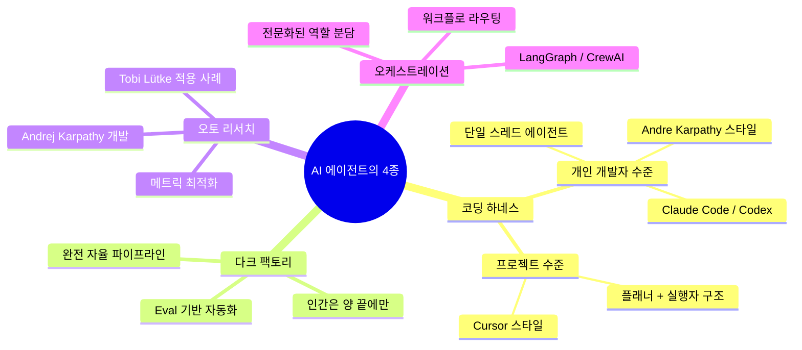
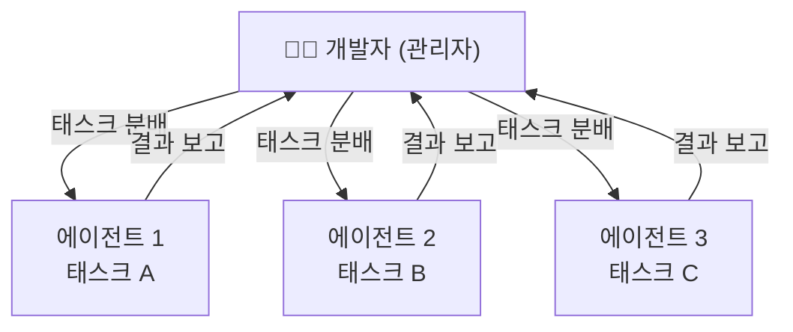
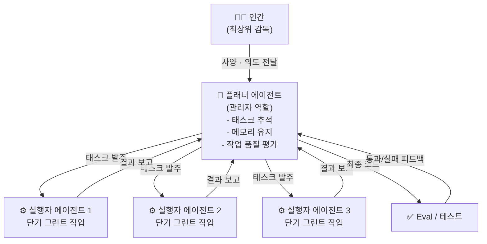
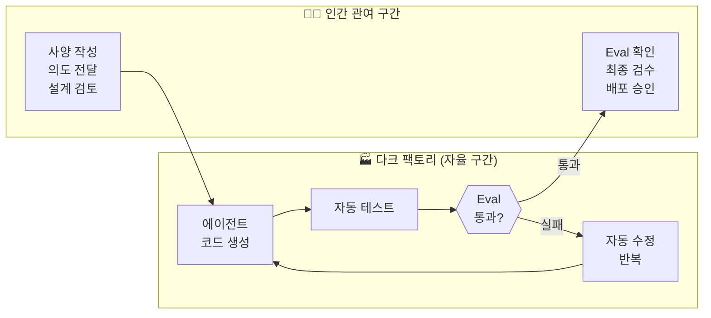
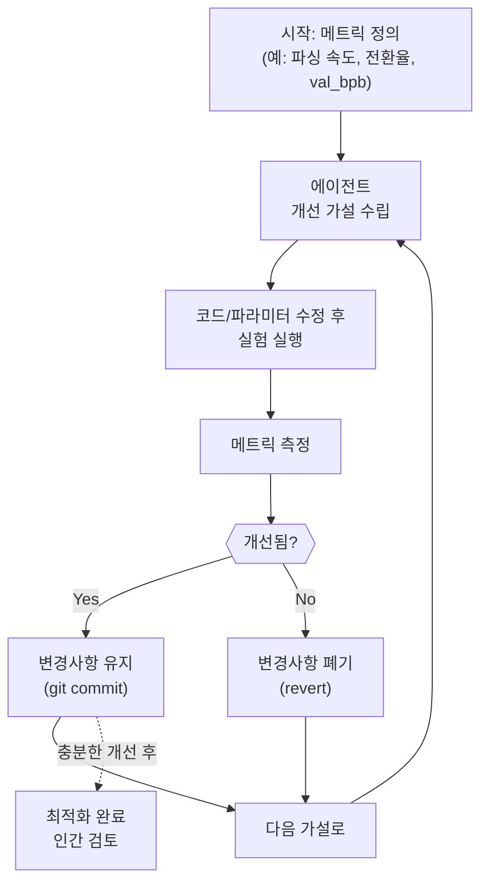
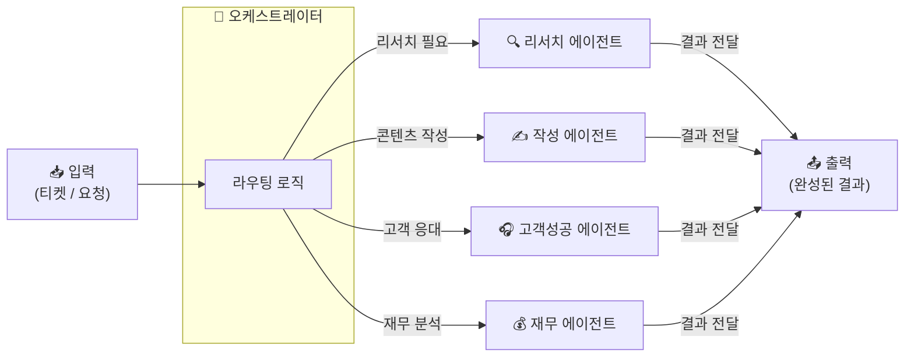
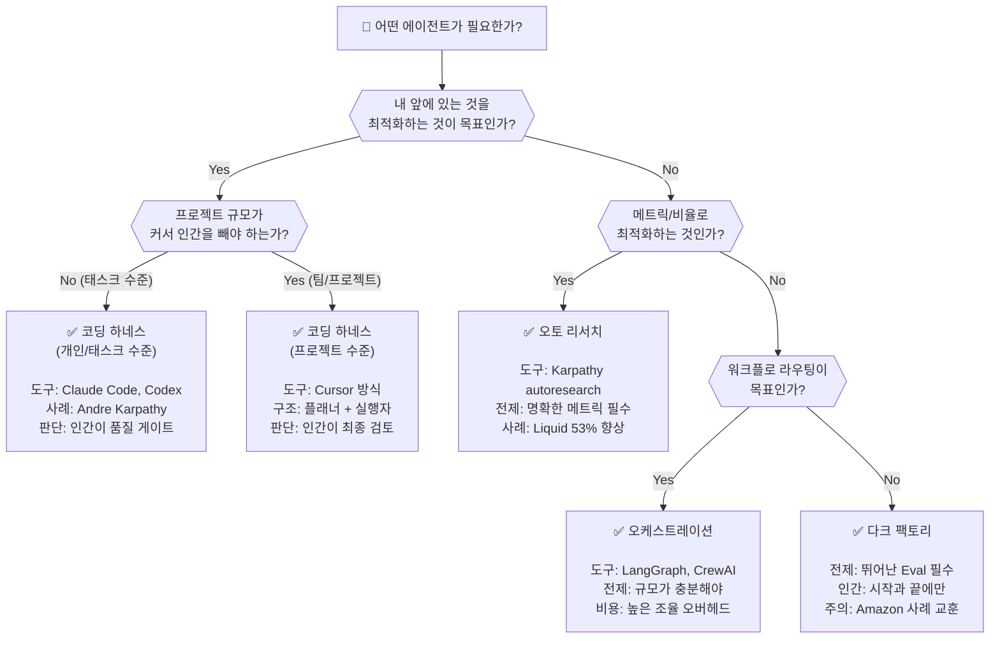

> **원본 영상**: [Tobi Lütke Made a 20-Year-Old Codebase 53% Faster Overnight. Here's How.](https://www.youtube.com/watch?v=YpPcDHc3e9U)  
> **제작자**: Nate Jones (natebjones.com)  
> **공개일**: 2026년 3월 25일  
> **최신 정보 기준**: 2026년 3월 26일

---

## 들어가며: 우리는 에이전트를 원하지만, 정작 무엇을 원하는지 모른다

AI 에이전트에 대한 이야기가 넘쳐난다. 그런데 막상 "에이전트가 무엇인가?"라고 물으면 대부분의 사람들은 이렇게 답한다. *"LLM에 도구를 붙이고, 루프를 돌리는 것이요."* 틀린 말은 아니다. 그러나 이 정의는 지나치게 단순해서 핵심을 놓친다.

실제 현장에서 에이전트를 구축하고 운영하는 사람들을 들여다보면, 에이전트는 **최소 4가지의 뚜렷이 구별되는 종(種, species)** 으로 분화되어 있다는 사실을 알 수 있다. 그리고 이 종들을 혼동하면 — 엉뚱한 문제에 엉뚱한 에이전트를 투입하면 — 몇 달을 낭비하고 프로젝트가 실패한다. 이 문서는 그 혼동을 막기 위한 안내서다.

이 문서에서 특정 LLM 모델 이야기(Claude가 좋다, GPT가 좋다 같은)는 하지 않는다. 그보다 한 레벨 위, **에이전트 시스템을 어떻게 설계하고 구성하느냐**의 이야기를 한다. 어떤 LLM을 사용하든 에이전트 시스템에 꽂아 넣을 수 있다. 중요한 것은 시스템의 구조다.

---

## 에이전트의 4가지 종: 전체 지도

에이전트를 구성하는 방식의 세부적인 차이가 각 종을 만들어낸다. 4가지 종은 다음과 같다.

이 4종이 공통적으로 갖는 것은 단 하나다: **LLM + 도구**. 그래서 넓은 의미에서 모두 "에이전트"라고 부를 수 있다. 그러나 왜 다른지, 어떻게 다른지를 이해하지 못하면 잘못된 종을 잘못된 일에 투입하게 된다.

---

## 종 1: 코딩 하네스 (Coding Harness)

### 개념: 개발자를 대체하는 에이전트

코딩 하네스는 4가지 종 중 **가장 단순한 형태**다. 터미널을 열고 Claude Code나 Codex를 사용할 때 만나는 바로 그것이다. 본질적으로, 에이전트가 **개발자의 자리를 대신해서 엔지니어링 프로세스에 참여**하는 구조다.

에이전트에게는 개발자가 쓰는 도구들이 주어진다:
- 코드 작성
- 파일 읽기/쓰기
- 파일 조합 및 관리
- 검색 도구 사용

이 모든 것이 에이전트의 컨텍스트 안에 들어오면, 에이전트는 효과적으로 일할 수 있게 된다.

### 단일 스레드 방식: 개인 개발자 수준

가장 기본적인 코딩 하네스는 **단일 스레드(single-threaded)** 다. 하나의 에이전트가 하나의 태스크를 맡아서 처리한다.

Andrej Karpathy(전 Tesla AI 책임자, OpenAI 공동창업자)가 자신의 코딩 프로젝트에서 쓰는 방식이 바로 이것이다. 2026년 현재, 에이전트를 하루 16시간씩 돌리는 개발자들이 드물지 않다. 에이전트를 '자신을 대신하는 엔지니어'로 생각하면 이해하기 쉽다. 인간은 이제 **관리자(manager) 역할**을 하고, 에이전트가 **코딩 역할**을 한다.

#### 여러 단일 스레드 에이전트를 동시에 운영하기

여러 개의 단일 스레드 에이전트를 동시에 돌리는 개발자들도 있다. Peter Steinberger가 Open Claw를 개발할 때 이 방식을 썼다. 그는 Codex 에이전트들을 여러 개 동시에 돌렸고, 각 에이전트는 약 20분마다 특정 태스크를 완료하고 그에게 보고했다. 하루 대부분을 **에이전트 관리자**로 보내는 셈이었다.

### 핵심 열쇠: 분해(Decomposition)

단일 스레드 코딩 하네스를 작동시키는 핵심은 **작업의 분해**다. 큰 문제를 잘게 쪼개서 명확하게 정의된 청크(chunk)로 만들 수 있다면, 각 청크를 에이전트에게 줄 수 있고 큰 진전을 이룰 수 있다.

많은 개발자들이 이 과정을 즐긴다. 복잡한 문제를 해체하는 지적 도전 자체를 좋아하기 때문이다. 2026년의 전형적인 개발 흐름은 이렇다:

1. 개발자가 LLM 플래너 보조도구와 함께 프로젝트의 전체 모양을 파악한다.
2. LLM이 제안하는 작업 분해 방안을 개발자가 검토·확인한다.
3. 개발자가 "좋아, 이제 이 작업을 나눠보자"고 결정한다.
4. 각 청크를 개별 에이전트 태스크로 배분한다.

이 단계에 이르면 이미 "채팅창에서 에이전트와 대화해서 결과물을 뽑는" 수준을 벗어난 것이다. 코드의 다른 버전이나 다른 섹션을 동시에 작업하거나, 작업 트리(work tree) 접근 방식을 쓰는 것이 일반적이다.

### 프로젝트 수준 코딩: Cursor의 플래너-실행자 모델

작업 규모가 커지면 어떻게 될까? 여기서 코딩 하네스의 더 복잡한 변형이 등장한다. **프로젝트 규모를 위해 설계된 코딩 하네스**다.

전통적인 사고방식은 "큰 프로젝트 = 더 많은 엔지니어"였다. 하지만 이는 점점 틀린 공식이 되고 있다. 이제는 에이전트 측에서 먼저 바라봐야 한다: **에이전트가 이 큰 작업을 이해하고 올바른 방향을 찾도록 어떻게 지원할까?**

Cursor는 이 부분에서 많은 것을 공개적으로 문서화했다. 브라우저부터 컴파일러까지, 여러 대형 실제 프로젝트에서 수백만 줄의 코드를 작성하며 검증된 방식이다.

Cursor의 핵심 인사이트는 이렇다: 개별 코딩 하네스(Andre Karpathy식)는 **개별 개발자의 머릿속**에 맞게 만들어져 있다. 하지만 8명, 16명, 20명이 함께 작업하는 팀 규모의 프로젝트라면, 방 안의 복잡성이 너무 커서 Cursor가 사용한 것 같은 코딩 하네스 없이는 감당이 안 된다. **프로젝트 레벨의 코딩 아키텍처**가 필요하다.

> **Cursor가 배운 교훈**: 관리 레이어를 3단계로 늘려봤더니 오히려 효과가 나빴다. 에이전트에서는 **단순함이 곧 확장성**이다. 하네스 전체 시스템을 최대한 단순하게 유지해야 효과적으로 확장된다.

### 개인 수준 vs. 팀 수준: 언제 전환해야 하나?

많은 기업들이 이런 상황에 처해 있다: AI 보조도구를 쓰면서 엄청난 속도 향상을 경험한다. 개별 엔지니어들이 4~5개의 코딩 보조도구와 함께 일한다. 놀라운 생산성이다. 그런데 여기서 Nate는 불편한 질문을 던진다.

*"모든 것을 '인간 중심'으로 설계하는 대신, '에이전트가 일하기 쉬운 구조'로 설계하면 어떨까요?"*

이 질문에 많은 사람들이 당황한다. 개별 에이전트 보조도구로 이미 큰 속도 향상을 경험했기 때문이다. 하지만 사실 이렇게 하면 **인간의 작업 속도만 높이는 것**이고, 이전에 존재했던 모든 병목(bottleneck)은 그대로 남는다. 오히려 코드 리뷰가 더 늘어나고, 인간들은 4가지 일을 동시에 처리하려 더 바빠진다.

**팀 수준으로 전환해야 하는 신호:**
- 대규모 프로젝트에서 병렬화가 힘들어질 때
- 많은 개발자들이 동시에 큰 프로젝트 조각을 머릿속에 담아야 할 때
- 개별 기여자들이 관리자 역할을 겸하면서 혼란이 생길 때

---

## 종 2: 다크 팩토리 (Dark Factory)

### 개념: 인간은 양 끝에만 존재한다

다크 팩토리는 **사양(specification)을 넣으면 소프트웨어가 나오는, 거의 완전 자율적인 시스템**이다. 핵심은 시작점에서 완료점 사이의 중간 과정에 인간이 거의 관여하지 않는다는 것이다.

이름의 유래는 중국의 실제 다크 팩토리(불 꺼진 공장)에서 왔다. 조명이 꺼진 채 자동화 로봇들이 처음부터 끝까지 생산을 수행한다. 에이전트 시스템에서도 같은 비전이다.

### 다크 팩토리의 핵심 요소

다크 팩토리가 작동하려면 몇 가지 전제 조건이 있다.

**1. 탁월한 비기능 요구사항(Non-functional Requirements)**
에이전트가 지켜야 할 "도로 위의 규칙"들을 매우 잘 정의해야 한다. 단순히 무엇을 만들지가 아니라, 어떻게 만들어야 하는지의 제약과 기준들이 명확하고 강제 가능한(enforceable) 형태로 존재해야 한다.

**2. 평가(Eval) 또는 테스트**
다크 팩토리의 심장은 소프트웨어가 배포되기 전에 반드시 통과해야 하는 평가 혹은 테스트다. 에이전트는 이 테스트를 통과할 때까지 자동으로 반복하며 개선한다.

**3. 완전 자율 파이프라인**
에이전트들이 프로세스를 너무 빠르게 밀어붙이기 때문에, 중간에 인간이 끼어들면 오히려 병목이 된다. 다크 팩토리는 이를 해결하기 위해 설계된 것이다.

### 다크 팩토리의 현실: Amazon의 교훈

Nate는 여기서 중요한 경고를 한다. 아무리 담대한 다크 팩토리라도, **실제 기업들은 코드를 그냥 프로덕션에 바로 던지는 것에 대부분 불편함을 느낀다**.

Amazon이 최근 시니어 엔지니어와 프린시플 엔지니어들을 시애틀에 불러 모은 사례가 있다. 주니어 엔지니어들이 AI가 생성한 코드로 인한 프로덕션 사고들을 논의하기 위해서였다. **정교한 엔지니어링 눈이 최종 코드를 확인해주는 것이 여전히 중요하다**는 교훈이다.

### 다크 팩토리의 스펙트럼

다크 팩토리는 이진법적 개념이 아니라 **스펙트럼**이다.

| 수준 | 인간 관여 위치 | 특징 |
|------|---------------|------|
| 개인 수준 | 태스크 레벨 자율성 | 에이전트에게 태스크를 주고 커피 한 잔 |
| 조직 수준 | 시작 + 끝 + 중간 약간 | 프로젝트 레벨 에이전트 엔지니어링 |
| 완전 다크 팩토리 | 시작과 끝에만 | Eval 통과 후 프로덕션 배포 |

**Nate의 추천**: 중간 부분은 다크 팩토리로 운영하되, 끝에서 인간이 Eval을 확인하는 하이브리드 방식. 이렇게 하면 중간 과정의 효율성과 최종 판단의 신뢰성을 모두 얻을 수 있다.

---

## 종 3: 오토 리서치 (Auto Research)

### 개념: 소프트웨어 생산이 아닌 메트릭 최적화

오토 리서치는 **완전히 다른 성격의 에이전트 종**이다. 코딩 하네스나 다크 팩토리가 모두 작동하는 소프트웨어를 만드는 데 초점을 맞춘다면, 오토 리서치는 **메트릭(지표)을 최적화하는 데 초점**을 맞춘다.

이것은 고전적인 머신러닝 기법에서 내려온 개념이다. 머신러닝에서 모델을 훈련시킬 때 하는 일이란 결국 목표에 대해 점점 더 잘 최적화되도록 만드는 것이다. LLM 시대의 오토 리서치도 같은 원리로 작동하는데, 단지 그 대상이 훨씬 더 다양하다.

### Andrej Karpathy의 Autoresearch 프로젝트

2026년 3월 초, Andrej Karpathy가 오토 리서치 개념을 오픈소스로 공개했다. 그의 `autoresearch` 레포지토리는 단 630줄의 Python 코드로 이루어져 있지만, 공개 직후 **42,000개 이상의 GitHub 스타**를 받고 **860만 뷰**를 기록했다.

작동 방식은 이렇다:
- 인간은 `program.md`(마크다운 파일)에 고수준의 연구 방향을 적는다.
- AI 에이전트가 `train.py`(수정 가능한 유일한 파일)를 편집한다.
- GPU에서 5분짜리 훈련 실험을 실행한다.
- 결과가 좋으면 git commit, 나쁘면 revert.
- 이 사이클을 무한 반복한다.
- 시간당 약 12번의 실험, 하룻밤에 약 100번의 실험이 가능하다.

Karpathy는 2일 동안 700번의 실험을 실행해 20개의 최적화를 발견했고, 이를 통해 GPT-2 수준 LLM 훈련 시간을 11% 단축했다.

### Tobi Lütke의 Liquid 코드베이스 사례: 20년 된 코드를 이틀 만에 53% 빠르게

이것이 이 영상의 제목에 등장하는 바로 그 사례다. Shopify의 CEO **Tobi Lütke**가 Karpathy의 오토 리서치 패턴을 자신들의 Ruby 템플릿 엔진 **Liquid**에 적용했다.

**Liquid란?** 2005년 Tobi가 직접 만든 오픈소스 Ruby 템플릿 엔진으로, Shopify의 모든 상점(570만 개 이상의 활성 상점)에서 상품 페이지, 컬렉션 페이지, 체크아웃 화면을 렌더링한다. 즉, 하루에 수십억 번 실행되는 코드다.

**과정:**
1. `autoresearch.md` 프롬프트 파일과 `autoresearch.sh` 스크립트(벤치마크 실행 및 점수 보고용) 작성
2. 974개의 유닛 테스트가 있는 코드베이스에 오토 리서치 적용
3. 120번의 자동화된 실험 진행
4. 93개의 커밋 생성

**결과:**
- **파싱+렌더링 시간 53% 단축**
- **객체 할당 61% 감소**
- Shopify 규모에서 한 자릿수 개선도 수백만 달러 절감인데, 이건 두 자릿수 개혁이다.

**주요 발견된 최적화들:**
- `StringScanner` 토크나이저를 `String#byteindex`로 교체 → 단일 바이트 검색 약 40% 빠름
- 정수 0~999의 frozen string 사전 계산 → 렌더링당 267개 할당 제거

Tobi의 솔직한 코멘트: *"아마 약간 오버피팅된 것 같지만, 정말 놀라운 아이디어들이 들어 있다."*

> **Simon Willison의 분석**: 견고한 테스트 스위트(974개의 유닛 테스트)가 있었기 때문에 가능했다. 이런 테스트 없이는 에이전트가 코딩 변경을 독립적으로 검증할 수 없다. CEO들도 다시 코딩할 수 있게 됐다!

### 오토 리서치의 다양한 적용 영역

오토 리서치가 혁명적인 이유는 **측정 가능한 모든 것**에 적용할 수 있다는 점이다.

| 적용 영역 | 메트릭 | 사례 |
|-----------|-------|------|
| LLM 훈련 최적화 | val_bpb (검증 비트-퍼-바이트) | Karpathy의 nanochat |
| 코드 성능 | 파싱/렌더링 속도, 메모리 할당 | Tobi Lütke의 Liquid |
| 모델 품질+속도 | 검증 점수 | Tobi의 쿼리 확장 모델 (0.8B가 1.6B 능가) |
| 전환율 최적화 | 랜딩 페이지 전환율 | 마케팅 팀 적용 사례 |
| 프롬프트 최적화 | 품질 점수 | 41% → 92% (4라운드 만에) |
| 마케팅 실험 | 긍정적 응답률 | Eric Siu: 연간 30개 → 36,500개+ 실험 |

### 오토 리서치의 핵심 원칙

메트릭이 없으면 오토 리서치가 아니다. **메트릭 없이 오토 리서치를 하려는 것은 산 없이 언덕 오르기를 하려는 것**과 같다. 이것이 오토 리서치와 다른 에이전트 종의 가장 근본적인 차이다.

**"내 문제는 소프트웨어 형태인가, 아니면 메트릭 형태인가?"**

이 질문에 명확히 답할 수 있어야 올바른 에이전트 종을 선택할 수 있다. Nate는 이 질문을 직접 해보면 대부분 직관적으로 알 수 있다고 말한다: 대개 "아, 내 것은 소프트웨어야" 또는 "아, 내 것은 메트릭이야"가 명확하게 떠오른다.

---

## 종 4: 오케스트레이션 (Orchestration)

### 개념: 전문화된 역할들의 협업

오케스트레이션은 4가지 종 중 **가장 복잡하게 설정하고 관리해야 하는 것**이다. 이 분야에 많은 스타트업들이 몰리는 이유도 그 복잡성을 대신 처리해주려는 것이다.

핵심 아이디어는 간단하다: **여러 가지 다른 작업을 에이전트가 해야 하는데, 그 에이전트들이 전문화된 역할을 갖는 것**이다.

### 오케스트레이션 vs. Cursor의 플래너-실행자

여기서 중요한 구분이 있다. Cursor의 플래너-실행자 구조도 에이전트 간 핸드오프가 있는데, 이것도 오케스트레이션이 아닌가?

**차이점:**
- **Cursor(코딩 하네스)**: 하나의 통합된 목표(소프트웨어 개발)를 위해 여러 에이전트가 협력. 플래너가 일시적인 그런트 작업들을 발주한다.
- **오케스트레이션**: 에이전트들이 **진정으로 전문화된 역할**을 갖는다. 마케팅 에이전트, 카피라이팅 에이전트, 재무 에이전트처럼.

에이전트에게 다른 역할을 부여하는 것에 흥미를 느꼈다면, 당신은 오케스트레이션에 흥미를 느끼는 것이다. 이것은 에이전트가 할 수 있는 일의 작은 부분집합이다.

### 대표 도구들

- **LangGraph**: 여러 다른 작업을 에이전트들에게 배분해야 할 때 — 티켓 수령, 티켓 리서치, 다른 처리, 티켓 종료, 중간 코멘트 등
- **Crew AI**: 다양한 역할을 가진 에이전트들을 조율하는 플랫폼

### 오케스트레이션의 부담

오케스트레이션은 사람들로부터 많은 작업을 요구한다. 핸드오프를 어떻게 할지, 무엇을 넘길지, 컨텍스트는 어떻게 유지할지, 프롬프트들을 어떻게 최적화할지 등을 모두 신중하게 다루어야 한다.

현실적으로, 오케스트레이션 방식에서는 에이전트에게 맡기지 않고 **인간이 확인해야 하는 조인(joint) 포인트가 많다**. 이것이 많은 오케스트레이션 접근 방식을 다소 무겁게 만드는 요인이다.

### 오케스트레이션이 가치 있는 경우: 규모의 문제

오케스트레이션 얘기를 할 때 Nate가 반드시 묻는 것이 있다: **규모가 어느 정도인가?**

| 규모 | 오케스트레이션 가치 |
|-----|------------------|
| 100개 티켓 | 아마 구축 비용 가치 없음 |
| 1,000개 티켓 | 경계선 |
| 10,000개 티켓 | 확실히 가치 있음 |
| 수백만 개 티켓 | 필수 |

모든 프롬프트와 컨텍스트 관리에 투자한 작업이 규모에서 보상받지 못한다면, 해볼 이유가 없다.

---

## 치트 시트: 어떤 에이전트를 선택해야 하는가?

### 한눈에 보는 4종 비교

| 구분 | 코딩 하네스 | 다크 팩토리 | 오토 리서치 | 오케스트레이션 |
|-----|-----------|-----------|-----------|-------------|
| **핵심 목표** | 코드 생산 | 코드 생산 | 메트릭 최적화 | 워크플로 라우팅 |
| **인간 관여** | 지속적 감독 | 양 끝에만 | 결과 검토 | 핸드오프 관리 |
| **복잡성** | 낮음~중간 | 중간~높음 | 중간 | 높음 |
| **필수 요건** | 작업 분해 능력 | 뛰어난 Eval | 명확한 메트릭 | 전문 역할 설계 |
| **대표 도구** | Claude Code, Codex | 커스텀 파이프라인 | karpathy/autoresearch | LangGraph, CrewAI |
| **대표 사례** | Andre Karpathy | Amazon/StrongDM | Tobi Lütke / Liquid | 고객 성공 플랫폼 |
| **적합한 규모** | 개인~소팀 | 팀~조직 | 어떤 규모든 (메트릭 있으면) | 대규모 (수만 건+) |

---

## 혼동하면 안 되는 것들: 실제 실수 사례

### 실수 1: 오토 리서치로 소프트웨어를 만들려는 것
오토 리서치는 메트릭을 최적화하는 것이지, 작동하는 소프트웨어를 만드는 것이 아니다. 메트릭 없는 오토 리서치는 의미가 없다.

### 실수 2: 장기 실행 코딩 하네스로 소설을 쓰려는 것
소설 쓰기는 오케스트레이션 문제이거나, 솔직히 말하면 인간이 해야 하는 일이다. 코딩 하네스는 코드 생산을 위한 것이다.

### 실수 3: 단일 태스크 에이전트를 다크 팩토리로 바꾸려는 것
하나의 생산적 태스크를 위한 에이전트를 여러 대형 프로젝트를 처리하는 완전 다중 에이전트 코딩 하네스로 만들려는 것. 작동하지 않는다.

### 실수 4: 오케스트레이션에만 집착하는 것
에이전트에게 다른 역할을 부여하는 아이디어에 흥분한 많은 사람들이 오케스트레이션만 생각한다. 하지만 이것은 에이전트가 할 수 있는 것의 아주 작은 부분에 불과하다.

---

## 2026년 현재: 에이전트 생태계의 최전선

### 현장의 숫자들

이 영상과 관련된 최신 데이터들이 2026년 3월 현재 업계에서 화제가 되고 있다.

- **Uber**: 개발자의 84%가 에이전트 코딩 사용자. Claude Code 사용률이 3개월 만에 32%에서 63%로 거의 2배 성장.
- **StrongDM**: 세 명의 인간이 AI 에이전트들을 관리하는 프로덕션 소프트웨어 파이프라인 구축. 규칙: "코드는 인간이 작성해서는 안 된다" + "코드는 인간이 리뷰해서는 안 된다." 각 엔지니어가 하루에 약 $1,000어치의 토큰을 소비.
- **AMD**: Claude Code와 Cursor가 대형 훈련 클러스터를 자율적으로 디버깅. 23% 처리량 저하를 24개 노드 중 4개의 RDMA 저하 문제로 추적.
- **Karpathy autoresearch**: GitHub 스타 42,000개 이상. Fortune지가 "Karpathy Loop"라고 명명.

### SkyPilot의 병렬 실험: 오토 리서치의 다음 단계

SkyPilot 팀이 Karpathy의 autoresearch를 16개 GPU 클러스터에서 병렬로 실행한 결과:
- 8시간 동안 약 910번의 실험 실행
- 단일 GPU에서는 불가능했던 상호 효과(interaction effects) 발견
- val_bpb를 1.003에서 0.974로 개선

단일 GPU 방식은 그리디 힐 클라이밍(하나씩 시도)에 갇히지만, 16개 GPU로 실행하면 한 번에 10~13개의 실험을 동시에 돌려 파라미터 간 상호 효과를 즉시 포착할 수 있다.

### Karpathy의 비전: 연구 공동체로서의 에이전트

Karpathy는 오토 리서치의 다음 단계를 이렇게 묘사한다: *"목표는 단일 박사 학생을 에뮬레이션하는 것이 아니라, 그들의 연구 공동체를 에뮬레이션하는 것이다."* 에이전트들이 비동기적으로, 대규모로 협업하는 환경을 만드는 것이다. SETI@home 스타일의 분산 에이전트 협업이 그가 꿈꾸는 미래다.

---

## 결론: 종(種)을 혼동하지 마라

2026년은 **에이전트 엔지니어링(agentic engineering)의 시대**다. Karpathy가 말한 것처럼, 인간이 코드를 직접 작성하는 일은 99%의 경우 사라지고 있다. 우리는 에이전트들을 지휘하고, 감독하고, 조율하는 역할을 맡게 됐다.

하지만 이 새로운 역할을 잘 수행하려면 **에이전트들이 무엇을 잘하고 어떻게 구성되어 있는지**를 정확히 이해해야 한다.

> 겉으로는 단순해 보이는 "LLM + 도구 + 루프"라는 아이디어를, 실제 작업 구성으로 변환하는 방법이 바로 4가지 에이전트 종의 차이에 담겨 있다.

다시 한번 정리하자:

1. **코딩 하네스**: 내 앞의 코딩 작업을 위한 것. 인간의 판단이 품질 기준.
2. **다크 팩토리**: 인간을 중간 과정에서 빼내어 빠른 자율 실행을 위한 것. Eval이 품질 기준.
3. **오토 리서치**: 메트릭이 있을 때, 그 메트릭을 자동으로 최적화하기 위한 것.
4. **오케스트레이션**: 충분한 규모에서 전문화된 역할을 분담시키기 위한 것.

---

## 참고 자료

- [원본 영상: YouTube - Nate Jones](https://www.youtube.com/watch?v=YpPcDHc3e9U)
- [Nate Jones 뉴스레터 (전체 스토리 + 프롬프트)](https://natesnewsletter.substack.com/)
- [Andrej Karpathy autoresearch GitHub](https://github.com/karpathy/autoresearch)
- [Shopify Liquid PR - 53% 성능 개선](https://github.com/Shopify/liquid)
- [Simon Willison의 분석](https://simonwillison.net/2026/Mar/13/liquid/)
- [DataCamp: Autoresearch 완전 가이드](https://www.datacamp.com/tutorial/guide-to-autoresearch)
- [VentureBeat: Karpathy autoresearch 분석](https://venturebeat.com/technology/andrej-karpathys-new-open-source-autoresearch-lets-you-run-hundreds-of-ai)
- [SkyPilot: 병렬 Autoresearch 실험](https://blog.skypilot.co/scaling-autoresearch/)
- [NextBigFuture: Karpathy on Code Agents & AutoResearch](https://www.nextbigfuture.com/2026/03/andrej-karpathy-on-code-agents-autoresearch-and-the-self-improvement-loopy-era-of-ai.html)

---

*문서 작성 기준일: 2026년 3월 26일*  
*이 문서는 Nate Jones의 영상 내용과 2026년 3월 최신 업계 정보를 종합하여 작성되었습니다.*
