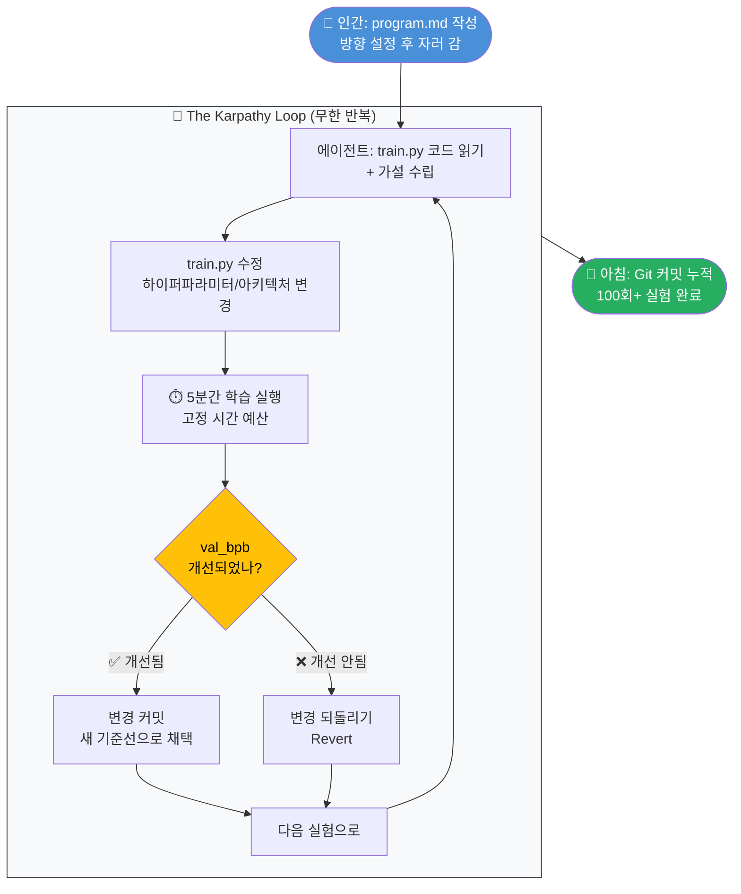
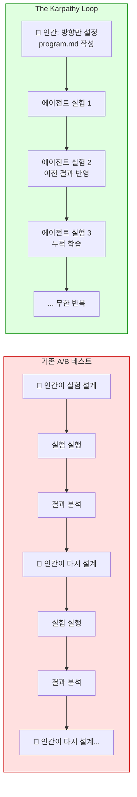
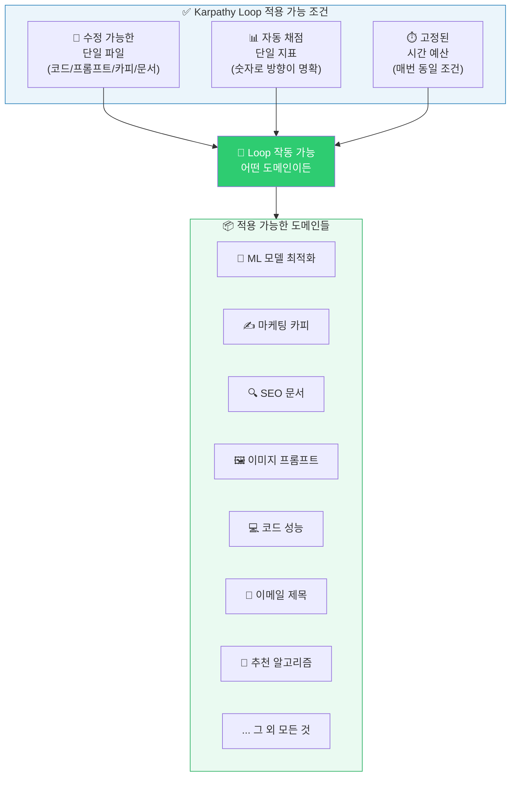
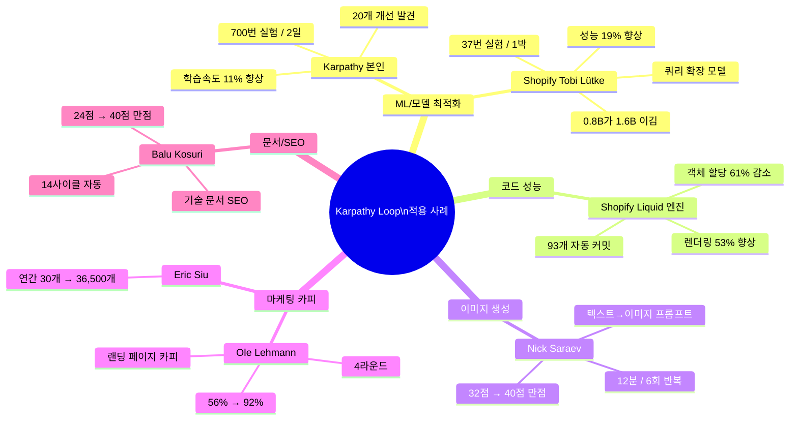
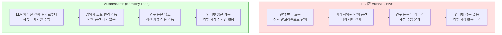
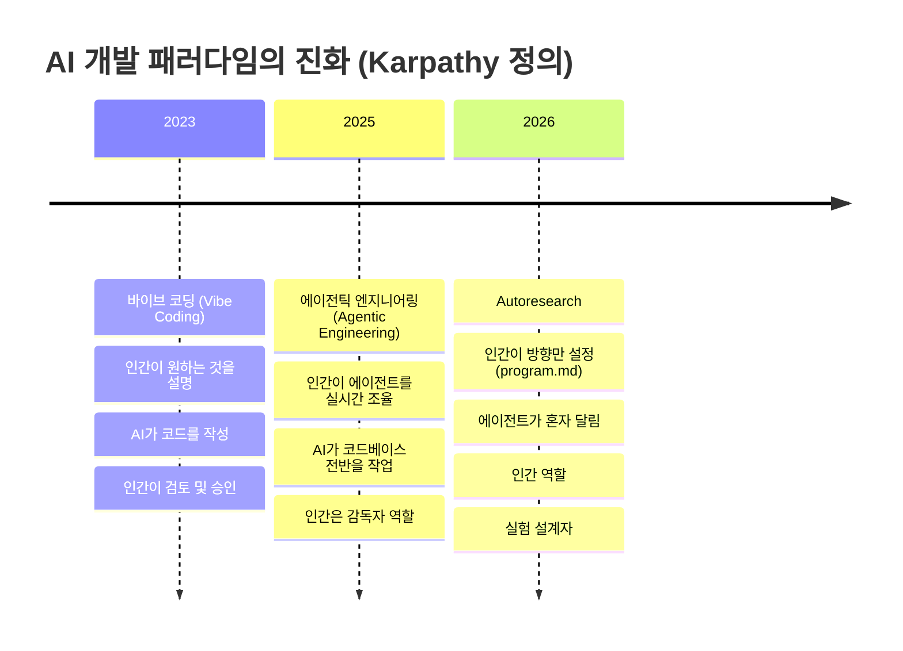
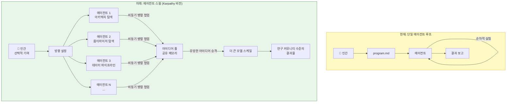
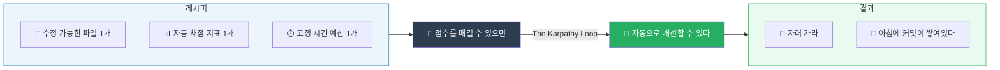

> *"점수를 매길 수 있으면, 자동으로 개선할 수 있다."*
> — Andrej Karpathy

---

## 목차

1. [배경: Andrej Karpathy는 누구인가](#1-배경-andrej-karpathy는-누구인가)
2. [탄생의 순간: 2026년 3월 7일 밤](#2-탄생의-순간-2026년-3월-7일-밤)
3. [Autoresearch의 구조와 작동 원리](#3-autoresearch의-구조와-작동-원리)
4. [The Karpathy Loop: 왜 이 이름인가](#4-the-karpathy-loop-왜-이-이름인가)
5. [Karpathy 본인의 실험 결과](#5-karpathy-본인의-실험-결과)
6. [ML을 넘어: 세 가지 범용 조건](#6-ml을-넘어-세-가지-범용-조건)
7. [실제 적용 사례들](#7-실제-적용-사례들)
8. [기존 방법론과의 차이: AutoML과의 비교](#8-기존-방법론과의-차이-automl과의-비교)
9. [AI 개발 패러다임의 진화: Vibe Coding → Agentic Engineering → Autoresearch](#9-ai-개발-패러다임의-진화)
10. [안전성과 한계](#10-안전성과-한계)
11. [다음 단계: 에이전트 스웜과 연구 커뮤니티의 재탄생](#11-다음-단계-에이전트-스웜과-연구-커뮤니티의-재탄생)
12. [사회적 함의: 연구자의 역할은 어떻게 바뀌는가](#12-사회적-함의-연구자의-역할은-어떻게-바뀌는가)
13. [결론: "Final Boss Battle"](#13-결론-final-boss-battle)
14. [참고 자료](#14-참고-자료)

---

## 1. 배경: Andrej Karpathy는 누구인가

Andrej Karpathy는 AI 업계에서 가장 영향력 있는 연구자 중 한 명이다. OpenAI의 공동창업 멤버로 출발해 Tesla에서 자율주행 AI를 총괄했으며, 현재는 독립 AI 연구자이자 교육 스타트업 Eureka Labs의 창업자로 활동 중이다. X(구 트위터)에서만 190만 명의 팔로워를 보유하고 있으며, 그가 무언가를 발표하면 AI 커뮤니티 전체가 즉시 반응한다고 해도 과언이 아니다.

그는 이미 AI 분야에 여러 용어를 직접 만들어 유통시켰다. 2025년에는 "바이브 코딩(Vibe Coding)"이라는 개념을 제시했는데, 이는 개발자가 원하는 것을 자연어로 설명하면 AI가 코드를 작성해 주는 방식을 가리킨다. 2026년 2월에는 "에이전틱 엔지니어링(Agentic Engineering)"이라는 용어를 선보이며, 이제 인간은 코드를 직접 쓰는 것이 아니라 AI 에이전트를 조율하는 역할로 전환되고 있다고 주장했다. 그리고 2026년 3월, 그는 또 한 번 새로운 지평을 열었다. 이번에는 그 이름이 "autoresearch"였다.

Karpathy는 자신의 대표적인 오픈소스 프로젝트인 nanochat(소형 LLM 학습 프레임워크)를 연구하는 과정에서 반복적인 실험의 고통을 절감하고 있었다. 학습 스크립트를 조금 수정하고, 실험을 돌리고, 결과를 확인하고, 개선되면 유지하고, 그렇지 않으면 되돌리고, 다시 수정하는 이 지루하고 반복적인 사이클은 아무리 뛰어난 연구자라도 하루에 수십 번 이상 진행하기 어렵다는 본질적인 한계가 있었다. Karpathy는 이 한계를 기술적으로 타파하고 싶었다.

---

## 2. 탄생의 순간: 2026년 3월 7일 밤

2026년 3월 7일 밤, Karpathy는 GitHub에 630줄 분량의 Python 스크립트를 올리고 잠자리에 들었다. 스크립트의 이름은 autoresearch였다. 아침에 일어났을 때, 에이전트는 이미 50개의 실험을 자율적으로 수행하고, 더 나은 학습률(learning rate)을 발견해 Git에 커밋까지 마쳐놓은 상태였다. 사람이 개입한 횟수는 0번이었다.

이 소식이 X에 퍼지자 반응은 폭발적이었다. 공개 며칠 만에 GitHub 스타가 21,000개를 넘었고, Karpathy의 발표 포스트 조회수는 8,600만 뷰를 기록했다. Fortune 매거진은 이 시스템에 "The Karpathy Loop"라는 이름을 붙이며 특집 기사를 냈고, Shopify CEO를 비롯한 업계 리더들이 즉각 자신들의 환경에 적용하기 시작했다. 현재 GitHub 스타는 42,000개를 넘어섰다.

---

## 3. Autoresearch의 구조와 작동 원리

Autoresearch의 기술적 구조는 놀랍도록 단순하다. 저장소는 세 개의 핵심 파일로 구성된다.

**train.py**는 에이전트가 유일하게 수정할 수 있는 파일이다. GPT 모델 전체, 옵티마이저(Muon + AdamW) 설정, 학습 루프가 이 파일 하나에 담겨 있다. 에이전트는 아키텍처, 하이퍼파라미터, 옵티마이저, 배치 사이즈 등 이 파일 안의 모든 것을 자유롭게 수정할 수 있다.

**prepare.py**는 상수 정의, 데이터 준비, 런타임 유틸리티를 담당하는 파일로, 에이전트가 수정할 수 없는 영역이다.

**program.md**는 에이전트에게 내리는 지시서다. Python 코드가 아니라 평문 마크다운으로 작성된다. 에이전트가 무엇을 탐색해야 하는지(지시), 무엇을 바꿔서는 안 되는지(제약), 언제 멈추고 결과를 보고해야 하는지(종료 기준)가 담겨 있다. The New Stack의 분석에 따르면, 이 파일이 autoresearch에서 가장 과소평가된 파일이라고 할 수 있다. YAML은 구조는 담지만 추론을 담지 못하고, Python은 실행 가능하지만 전략으로 읽히지 않으며, JSON은 서사가 없다. 평문 마크다운만이 지시, 제약, 서사를 동시에 담을 수 있는 유일한 형식이다.

루프의 작동 방식은 다음과 같다. 에이전트가 train.py 코드를 읽고 무엇을 변경할지 가설을 세운다. 변경 사항을 적용한 뒤 정확히 5분간 학습을 실행한다(시작/컴파일 시간 제외). 검증 지표(val_bpb, 즉 validation bits per byte)를 읽어 성능이 개선되었는지 확인한다. 개선되었으면 변경 사항을 커밋하고 새로운 기준선(baseline)으로 삼는다. 개선되지 않았으면 되돌리고(revert) 다음 실험으로 넘어간다. 이 과정이 무한히 반복된다.

5분이라는 고정 시간 예산 설계에는 중요한 철학이 담겨 있다. 첫째, 아키텍처를 바꾸든 배치 사이즈를 바꾸든 매번 동일한 조건에서 실험을 비교할 수 있다. 둘째, 에이전트가 "이 플랫폼에서 5분 안에 가장 최적화된 모델"을 자동으로 찾아낸다는 의미다. 시간당 약 12번, 하룻밤이면 100번의 실험이 가능하다.

평가 지표로 사용되는 val_bpb(validation bits per byte)는 어휘 크기(vocabulary size)에 독립적으로 설계된 지표다. 덕분에 에이전트가 어휘 크기를 자유롭게 실험하더라도 공정한 비교가 가능하다.

---

## 4. The Karpathy Loop: 왜 이 이름인가

"The Karpathy Loop"라는 이름은 Fortune이 붙인 것이지만, 정식으로 이 패턴을 명명하고 세 가지 구성 요소로 정의한 것은 Janakiram & Associates의 수석 분석가 Janakiram MSV가 The New Stack에 기고한 글에서였다. 그는 autoresearch의 핵심 패턴이 ML에만 국한되지 않는 범용적 설계 원리라고 주장하며 "Karpathy Loop"라는 이름을 처음 사용했다.

이 루프가 기존 자동화 방법론과 근본적으로 다른 이유는 학습의 누적 방식에 있다. 전통적인 A/B 테스트는 한 번의 실험을 설계하고, 돌리고, 승자를 고른 뒤 끝난다. 다음 실험은 사람이 다시 설계해야 한다. 각각의 실험은 독립적이며, 이전 실험의 결과가 다음 실험의 설계에 자동으로 반영되지 않는다.

Karpathy Loop는 다르다. 한 실험의 결과가 곧바로 다음 실험의 입력이 된다. 에이전트는 이전 실험들에서 무엇이 작동했고 무엇이 실패했는지를 학습하면서 다음에 무엇을 시험해볼지 스스로 결정한다. 그리고 멈추지 않는다. 사람이 방향을 설정하면, 에이전트는 그 방향을 향해 혼자 달린다.

Karpathy 자신은 이 세 가지 단계를 명확하게 구분해 설명한다.

- **바이브 코딩(Vibe Coding)**: 인간이 원하는 것을 설명하면 AI가 코드를 작성하고, 인간이 검토한다. 인간이 주도하고 AI가 보조한다.
- **에이전틱 엔지니어링(Agentic Engineering)**: 인간이 에이전트를 실시간으로 조율한다. 인간은 코드 대신 에이전트를 감독한다.
- **Autoresearch**: 인간이 방향만 잡고, 에이전트가 혼자 달린다. 인간의 역할은 "실험자"에서 "실험 설계자"로 완전히 전환된다.

---

## 5. Karpathy 본인의 실험 결과

Karpathy가 autoresearch를 자신의 nanochat 코드에 적용한 결과는 인상적이었다. 2일 동안 700번의 실험을 돌렸으며, 이미 상당히 최적화된 상태였던 자기 자신의 코드에서 20개의 개선 사항을 발견했다. 이 20개의 변경 사항을 적용하자 학습 속도가 11% 향상되었고, 이 개선 효과는 더 큰 모델(depth 24)에도 전이(transfer)되었다.

특히 주목할 만한 발견이 있었다. QK-Norm 구현에서 스칼라 곱셈기가 누락되어 있었던 것이다. 이 버그는 어텐션(attention)이 헤드 전체에 지나치게 넓게 퍼지는 문제를 일으키고 있었다. 꼼꼼한 연구자라면 언젠가는 발견했을 내용이지만, 에이전트는 인지 피로도도 없고 맥락 전환(context switching)의 부담도 없기 때문에 이런 미묘한 버그를 체계적으로 탐색하는 과정에서 찾아낼 수 있었다. 그 외에도 Value Embedding에서의 정규화(regularization) 효과, 밴드 어텐션(banded attention) 튜닝, AdamW 베타 파라미터, 가중치 감쇠(weight decay) 스케줄링 등에서 구조적 코드 변경이 이루어졌다.

에이전트가 발견한 것들은 단순한 하이퍼파라미터 랜덤 탐색이 아니었다. 에이전트는 이전 AI 연구 논문들을 읽고, 가설을 세우고, 코드를 직접 수정하는 방식으로 작동했다. Karpathy는 이를 두고 "실제 LLM이 임의의 코드를 작성하고, 이전 실험들로부터 학습하며, 인터넷에 접근할 수 있다"고 설명했다.

Mac Mini M4에서 autoresearch를 돌린 커뮤니티 사용자의 사례도 흥미롭다. 35번의 실험 중 26번이 실패하거나 크래시가 났지만, 성공한 7번의 실험에서 도출된 핵심 인사이트는 "모델이 단순해지면서 더 나아졌다"는 것이었다. 인간의 개입은 없었지만, 이 "덜 복잡할수록 좋다"는 반직관적 통찰은 에이전트가 스스로 이끌어낸 결론이었다.

---

## 6. ML을 넘어: 세 가지 범용 조건

Karpathy Loop가 단순한 ML 도구를 넘어 폭발적인 관심을 받은 이유는, 이 패턴이 기계학습에 특화된 것이 아니라 훨씬 보편적인 구조를 가지고 있기 때문이다. Janakiram MSV가 The New Stack에서 정리한 세 가지 범용 조건은 다음과 같다.

**첫 번째 조건: 수정 가능한 단일 파일(Editable Asset)**
에이전트가 수정할 수 있는 파일이 딱 하나여야 한다. 코드일 수도 있고, 프롬프트일 수도 있고, 마케팅 카피일 수도 있고, 문서일 수도 있다. 파일이 하나로 제한되면 탐색 공간(search space)이 해석 가능해지고, 모든 가설이 diff 형태로 검토 가능해진다.

**두 번째 조건: 자동으로 측정되는 단일 지표(Scalar Metric)**
사람의 판단이 아닌 자동 채점으로 나오는 숫자 하나가 있어야 한다. 이 지표는 방향이 명확해야 한다(높을수록 좋거나, 낮을수록 좋거나). 사람이 해석해야 하거나 위원회의 합의가 필요한 지표는 작동하지 않는다. Goodhart의 법칙 — "측정이 목표가 되는 순간, 그것은 좋은 측정 지표가 아니다" — 이 여기서 극도로 날카롭게 작동한다. 하룻밤에 100번 실험을 돌리는 에이전트 앞에서 잘못 설계된 지표는 빠르게 착취된다.

**세 번째 조건: 고정된 시간 예산(Time-Boxed Cycle)**
매번 동일한 조건에서 실험이 비교되어야 한다. 시간 예산이 고정되면 에이전트가 무엇을 바꾸든 공정한 비교가 가능해진다.

이 세 가지 조건은 ML과 전혀 관계없는 사람들도 Karpathy Loop를 도입할 수 있게 만들어 준다. 코드 한 줄 없이 프롬프트 파일 하나, 자동 채점 기준, 시간 제한만 있으면 루프를 돌릴 수 있다.

---

## 7. 실제 적용 사례들

이론적 가능성이 현실화된 사례들은 이미 다양한 분야에서 등장하고 있다.

### 7-1. Shopify CEO Tobi Lütke: 0.8B 모델이 1.6B를 이기다

Shopify의 공동창업자이자 CEO인 Tobi Lütke는 autoresearch가 공개된 직후 자신의 내부 쿼리 확장(query expansion) 모델에 이를 적용했다. 에이전트에게 "모델의 품질과 속도를 개선하라"는 지시를 내리고 하룻밤을 보냈다. 아침에 결과를 확인하니 37번의 실험이 완료되어 있었고, 검증 점수가 19% 향상되었다.

특히 놀라운 것은 결과의 반직관성이었다. 에이전트가 찾아낸 최적 설정에서는 0.8B(8억 개 파라미터) 크기의 작은 모델이 Lütke가 직접 튜닝한 1.6B(16억 개 파라미터) 모델을 성능에서 앞섰다. 파라미터 수가 절반인데 성능이 더 높았다. 에이전트가 하드웨어 특성에 맞춰 모델 구조를 최적화했기 때문이다. "크면 무조건 좋다"는 기존 ML의 통념을 에이전트가 하룻밤 만에 뒤집은 것이다.

Lütke는 같은 루프를 재랭커(reranker) 모델에도 적용했고, 역시 성능 향상을 확인했다. 나아가 Shopify의 Liquid 템플릿 엔진에도 autoresearch를 적용한 결과, 93개의 자동 커밋이 생성되었으며 렌더링 속도가 53% 빨라지고 객체 할당(object allocation)이 61% 감소했다.

### 7-2. Ole Lehmann: 랜딩 페이지 카피를 56%에서 92%로

Ole Lehmann은 마케팅 카피 최적화에 Karpathy Loop를 적용했다. 랜딩 페이지의 카피를 에이전트가 수정 가능한 단일 파일로 삼고, 카피 품질 평가 기준을 자동 채점 지표로 설정했다. 4라운드의 반복 실험 끝에 점수가 56%에서 92%로 향상되었다. 에이전트는 변경 사항 4개 중 3개를 유지하고 1개를 자동으로 되돌렸다. Lehmann은 이 결과를 자신의 구독자 34,000명 뉴스레터에 공개했다.

### 7-3. Nick Saraev: 12분 만에 만점

유튜버 Nick Saraev는 텍스트-투-이미지 프롬프트 최적화에 이 패턴을 적용했다. 화이트보드 스타일 다이어그램 생성을 위한 프롬프트를 최적화하는 것이 목표였다. 매 반복마다 10장의 이미지를 생성하고, 4가지 기준으로 채점해 최대 40점의 점수를 냈다. 시작 점수는 32점이었다. 6번의 반복, 12분이 지나자 40점 만점이 나왔다.

### 7-4. Balu Kosuri: 기술 작가의 SEO 자동화

기술 작가 Balasubramanyam Kosuri는 autoresearch를 문서 SEO 최적화에 적용했다. 메타 설명 길이, 제목 최적화, 이미지 alt 텍스트 개선, 내부 링크 추가 등을 자동으로 반복 실험했다. 14사이클이 자동으로 실행되었고, 시작 점수 24/40에서 최종 40/40 만점을 달성했다.

그는 이 경험을 기록하며 이렇게 적었다. "나는 스타트업을 만든 것도 아니고 모델을 학습시킨 것도 아니다. 그냥 내 업무인 문서 작성에 적용했을 뿐이다." 특히 흥미로운 것은 에이전트가 어떤 변경 연산자(mutation operator)가 효과적인지 스스로 파악했다는 점이다. `add_counterexample`은 2번 시도해 2번 성공(100%), `tighten_language`는 3번 시도해 2번 성공(67%)한 반면, `restructure`와 `remove_bloat`은 각각 한 번도 채택되지 않았다.

### 7-5. Eric Siu: 마케팅 실험의 규모를 연간 30개에서 36,500개로

마케팅 에이전시 Single Grain의 창업자 Eric Siu는 Karpathy Loop를 마케팅 실험 루프로 확장하며 더 거시적인 함의를 제시했다. 그는 X에 이렇게 썼다. "지금 마케팅팀은 연간 30개 실험을 합니다. 잘하면 52개. 다음 세대는 36,500개를 돌릴 겁니다. 자는 동안 실험을 돌리면서요. 지금 랜딩 페이지, 광고 크리에이티브, 이메일 제목 테스트가 '데이터 기반 마케팅'으로 불립니다. 그런데 다음 세대 마케팅 시스템은 연간 36,500개 이상의 실험을 돌릴 겁니다." 그의 프레임워크에서는 학습 스크립트 대신 마케팅 자산(랜딩 페이지, 광고 크리에이티브, 콜드 이메일)이 수정 가능한 파일이 되고, 긍정 응답률(positive reply rate)이 측정 지표가 된다.

---

## 8. 기존 방법론과의 차이: AutoML과의 비교

autoresearch가 공개된 이후 일부 비판적인 반응도 있었다. ML 분야 전문가들 중 일부는 이것이 구글, 마이크로소프트 등 대형 AI 연구소에서 수년간 사용해온 AutoML의 재발견에 불과하다고 지적했다. AutoML도 최적화 루프와 연속적인 실험으로 데이터, 모델 아키텍처, 하이퍼파라미터를 자동으로 튜닝한다.

이에 대해 Karpathy는 직접 반박했다. "신경망 아키텍처 탐색(Neural Architecture Search, NAS)은 내 autoresearch에 비해 너무 약한 버전이라 아예 다른 카테고리다. 비교 자체가 무의미하다. 이건 임의의 코드를 작성하고, 이전 실험들로부터 학습하고, 인터넷에 접근할 수 있는 실제 LLM이다. 비교가 되지 않는다."

차이를 구체적으로 살펴보면 다음과 같다.

핵심 차이는 "가설 수립 능력"이다. 기존 AutoML은 수학적으로 정의된 탐색 공간 안에서 무작위 또는 알고리즘적으로 변이를 만들지만, Karpathy Loop의 에이전트는 AI 연구 논문을 읽고, 실험 결과를 해석하고, 그로부터 의미 있는 가설을 세워 다음 실험을 설계한다. 인터넷에 접근해 최신 연구 동향을 반영할 수도 있다. 이것은 임의 탐색(random search)이 아니라 지식 기반 연구(knowledge-based research)다.

DataCamp의 분석에 따르면, autoresearch는 LLM의 일반 지식을 활용해 좋은 실험을 제안하는 방식에 베팅하며, 수학적 보장이 있는 탐색 공간을 제약하는 대신 에이전트의 창의성에 탐색 범위를 맡긴다.

---

## 9. AI 개발 패러다임의 진화

Karpathy는 2026년 2월에 "에이전틱 엔지니어링"이라는 용어를 정의하며 이렇게 말했다. "당신은 99%의 시간 동안 코드를 직접 작성하지 않습니다. 당신은 코드를 작성하는 에이전트를 조율하고 감독하는 역할을 합니다." 그는 Claude Code, OpenAI Codex 등의 도구가 2025년 12월을 전후로 일관성(coherence) 임계점을 넘었다고 보며, 이후 자신의 수동 코딩 역량이 서서히 퇴화하고 있다는 느낌을 받는다고 솔직하게 말했다.

autoresearch는 이 진화의 다음 단계다.

인간의 역할이 "실험자(experimenter)"에서 "실험 설계자(experimental designer)"로 전환된다는 것이 핵심이다. 에이전트가 무엇을 테스트할지, 어떻게 변경할지, 결과를 어떻게 해석할지를 스스로 결정한다. 인간은 목표와 제약 조건, 방향을 정의하는 고수준의 의사 결정자로 남는다.

DataCamp는 이 진화를 이렇게 정리했다. "바이브 코딩은 인간이 AI에게 프롬프트를 주고 AI가 코드를 쓰며 인간이 검토하는 방식이다. 에이전틱 엔지니어링은 인간이 에이전트를 실시간으로 조율하는 방식이다. 완전 자율 연구는 인간이 마크다운 파일에 좋은 연구가 어떤 것인지 묘사하고 자리를 비우는 방식이다. 각 단계마다 인간의 역할이 작가에서 감독으로, 감독에서 연구 자문으로 줄어든다."

---

## 10. 안전성과 한계

autoresearch는 흥분을 불러일으키는 동시에 여러 현실적 한계와 안전성 문제를 안고 있다.

### 10-1. 재귀적 자기 개선(Recursive Self-Improvement)과의 관계

autoresearch가 처음 공개되었을 때 많은 사람들이 SF적 공포를 연상했다. "재귀적 자기 개선(recursive self-improvement)" — AI가 자신의 코드와 학습 과정을 스스로 최적화하는 루프를 통해 인간의 통제를 벗어난다는 AI 안전 연구자들의 우려 시나리오 — 와 유사해 보였기 때문이다.

그러나 autoresearch는 이와 다르다. 에이전트는 자신의 목표를 재정의하거나, 평가 기준을 스스로 바꾸거나, 자율적으로 자원을 획득하지 않는다. 에이전트가 수정하는 것은 자신이 아니라 훨씬 작고 단순한 별개의 모델의 학습 코드다. Kingy.ai의 분석에 따르면, autoresearch의 참신함은 SF적 의미의 "자기 개선"에 있지 않으며, 명시적이고 지속적인 최적화 압력이 제약된 하네스 안에 패키징되어 있다는 점에 있다.

### 10-2. 실제 신뢰성 문제

Karpathy 본인도 일부 AI 코딩 에이전트들이 "절대 멈추지 마라"는 지시를 무시한다는 점을 명시적으로 지적했다. 예를 들어 "Codex doesn't seem to work"라는 언급이 GitHub 이슈에 남아 있는데, 이는 에이전트의 행동 신뢰성이 도구마다 다르다는 것을 의미한다. Mac Mini M4 사례에서도 35번 실험 중 26번이 실패하거나 크래시가 났다. 에이전트의 루프가 끊임없이 돌아간다는 아이디어와 실제 안정성 사이에는 여전히 간극이 있다.

### 10-3. Goodhart의 법칙 문제

하룻밤에 100번 실험을 자율적으로 돌리는 에이전트 앞에서 잘못 설계된 평가 지표는 극도로 빠르게 착취된다. "측정이 목표가 되는 순간, 그것은 더 이상 좋은 측정 지표가 아니다"라는 Goodhart의 법칙은 autoresearch 환경에서 특히 강력하게 작동한다. 에이전트는 인간의 실제 의도가 아니라 수치 지표만을 최적화하기 때문에, 지표 설계가 잘못되면 보기에는 수치가 올라가지만 실제로는 악화되는 결과를 낳을 수 있다.

### 10-4. 플랫폼 특수성 문제

실험 시간이 고정 5분 wall-clock으로 설정되어 있기 때문에, H100 GPU에서 나온 결과와 Mac Mini에서 나온 결과는 직접 비교가 불가능하다. 각 플랫폼의 성능에 맞춰 "최적화된" 모델이 서로 다르게 나올 수 있다. 커뮤니티에서는 더 작은 하드웨어를 위한 포크(fork)들이 등장하고 있으며, Karpathy 본인도 작은 플랫폼에서의 설정 권장사항을 문서화하고 있다.

### 10-5. 프롬프트 인젝션 위험

에이전트가 외부 소스(인터넷, 논문, 코드 출력)를 자신의 컨텍스트로 읽어들일 때 프롬프트 인젝션(prompt injection) 공격에 노출될 수 있다는 신뢰 경계(trust boundary) 문제가 있다. 에이전트가 읽어들인 악의적 콘텐츠가 에이전트의 행동을 의도치 않게 변경할 위험이 있다.

---

## 11. 다음 단계: 에이전트 스웜과 연구 커뮤니티의 재탄생

Karpathy는 autoresearch의 미래를 단일 에이전트의 선형적 실험 루프를 훨씬 넘어서는 곳에서 보고 있다. 그는 X에서 이렇게 밝혔다. "autoresearch의 다음 단계는 에이전트들이 비동기적으로, 대규모로 협업해야 한다는 것이다. 목표는 PhD 학생 한 명을 흉내내는 게 아니라, 그들의 연구 커뮤니티를 흉내내는 것이다."

그의 비전은 이렇다. 에이전트 스웜(swarm of agents)이 서로 다른 최적화 방향을 병렬로 탐색한다. 가장 유망한 아이디어들이 점점 더 큰 규모의 모델로 승격(promote)된다. 인간은 선택적으로 가장자리에서 기여한다. 이것은 단순히 한 사람의 연구 속도를 높이는 것이 아니라, AI 연구 자체가 새로운 형태의 조직으로 재편되는 것을 의미한다.

그는 또 다음과 같이 말했다. "합리적으로 빠르게 평가할 수 있는 어떤 지표든 — 혹은 더 효율적인 프록시 지표(예: 더 작은 네트워크를 학습시키는 것)가 있다면 — 에이전트 스웜으로 autoresearch할 수 있다. 당신의 문제가 이 범주에 해당하는지 생각해볼 가치가 있다."

현재 autoresearch를 지원하는 에코시스템도 성장하고 있다. DarkMatter, Optimization Arena, NanoClaw 등의 도구들이 이 스웜 비전을 지원하기 위해 등장하고 있다. Karpathy 자신도 tmux 그리드에서 에이전트 팀을 실시간으로 운영하는 실험을 하고 있으며, 에이전트를 지속적으로 루프에 유지하는 워처 스크립트(watcher scripts)를 구축하고 있다고 밝혔다.

---

## 12. 사회적 함의: 연구자의 역할은 어떻게 바뀌는가

autoresearch가 제기하는 가장 심오한 질문은 기술적 질문이 아니라 사회적 질문이다. 연구자, 엔지니어, 마케터, 작가의 역할이 어떻게 바뀌는가?

VentureBeat는 autoresearch의 함의를 이렇게 요약했다. "연구 도메인에서 인간의 역할이 '실험자'에서 '실험 설계자'로 전환된다는 것을 시사한다." 사람이 해야 하는 일은 무엇을 최적화할지, 어떤 제약 조건을 두어야 할지, 어떤 방향으로 나아가야 할지를 결정하는 것이다. 실험 자체를 수행하는 것은 에이전트가 한다.

이것은 연구자에게 좋은 소식일 수도 있고 나쁜 소식일 수도 있다. 좋은 소식은 인지 피로도 없이, 맥락 전환 비용 없이, 24시간 멈추지 않고 탐색 공간을 뒤지는 에이전트를 갖게 된다는 것이다. Karpathy가 꼼꼼한 연구자라면 결국 찾았을 QK-Norm 버그를 에이전트가 발견했듯이, 많은 잠재적 개선점들이 인간의 인지적 한계 때문에 발견되지 못한 채 묻혀 있다. 나쁜 소식은 방대한 탐색 공간을 뒤지는 단순 반복 실험이 더 이상 연구자의 역할이 아니게 된다는 것이다.

가장 중요한 역량은 "무엇을 최적화할 것인가를 정의하는 능력"이 된다. 올바른 지표를 설계하고, 올바른 제약을 정의하고, 올바른 방향을 설정하는 인간의 역할이 핵심이다. 이것은 더 높은 수준의 추상화 작업이다.

---

## 13. 결론: "Final Boss Battle"

Fortune은 기사를 마치며 Karpathy의 말을 인용했다. "모든 LLM 프론티어 랩들이 이것을 할 것이다. 이것은 최종 보스전이다."

그는 스케일 문제를 솔직하게 인정했다. 그의 autoresearcher는 630줄의 Python 코드를 다루었지만, 프론티어 AI 모델의 학습 코드베이스는 그보다 수십 배 이상 거대하다. 그러나 그는 이것이 "그냥 엔지니어링 문제"이고, 해결될 것이라고 보았다. "에이전트 스웜을 올리고, 작은 모델들을 튜닝하는 협업을 시키고, 가장 유망한 아이디어들을 점점 더 큰 스케일로 승격시키고, 인간은 가장자리에서 선택적으로 기여한다."

autoresearch의 핵심 통찰은 단순하면서도 강력하다.

> **점수를 매길 수 있으면, 자동으로 개선할 수 있다.**

코드든, 카피든, 렌더링 속도든, SEO든, 이미지 프롬프트든. 수정 가능한 파일 하나, 자동 채점 지표 하나, 고정된 시간 예산 하나. 체크리스트를 만들고, 에이전트를 돌리고, 자러 가라. 아침에 Git에 커밋이 쌓여 있을 것이다.

Fortune이 "The Karpathy Loop"라고 이름 붙인 이 패턴은, ML 연구자의 실험 루프를 자동화하려던 630줄의 스크립트에서 시작해, 이제 마케터와 작가와 제품 매니저와 CEO의 업무 방식을 바꾸는 범용 원리로 확장되고 있다. 그리고 Karpathy가 예언하듯, 이것은 아직 시작에 불과하다.

---

## 14. 참고 자료

- **GitHub 저장소**: [github.com/karpathy/autoresearch](https://github.com/karpathy/autoresearch) — GitHub 42,000+ Stars
- **Fortune 원문 기사**: [The Karpathy Loop: 700 experiments, 2 days](https://fortune.com/2026/03/17/andrej-karpathy-loop-autonomous-ai-agents-future/) — Jeremy Kahn, 2026년 3월 17일
- **VentureBeat**: [Andrej Karpathy's new open source 'autoresearch'](https://venturebeat.com/technology/andrej-karpathys-new-open-source-autoresearch-lets-you-run-hundreds-of-ai) — Carl Franzen, 2026년 3월 10일
- **The New Stack**: [Karpathy Autonomous Experiment Loop](https://thenewstack.io/karpathy-autonomous-experiment-loop/) — Darryl K. Taft, 2026년 3월 14일
- **DataCamp**: [Guide to Andrej Karpathy's AutoResearch](https://www.datacamp.com/tutorial/guide-to-autoresearch)
- **Medium (Balu Kosuri)**: [I Turned Andrej Karpathy's Autoresearch Into a Universal Skill](https://medium.com/@k.balu124/i-turned-andrej-karpathys-autoresearch-into-a-universal-skill-1cb3d44fc669)
- **NextBigFuture**: [Andrej Karpathy on Code Agents, AutoResearch and the Self Improvement Loopy Era](https://www.nextbigfuture.com/2026/03/andrej-karpathy-on-code-agents-autoresearch-and-the-self-improvement-loopy-era-of-ai.html)

---

*문서 작성일: 2026년 3월 27일*
*최신 정보 기준: Fortune, VentureBeat, The New Stack, DataCamp, GitHub autoresearch 저장소*
