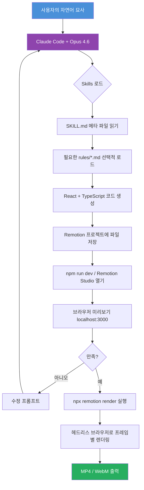
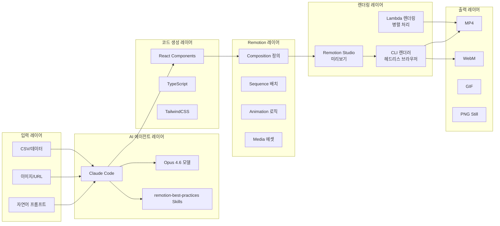
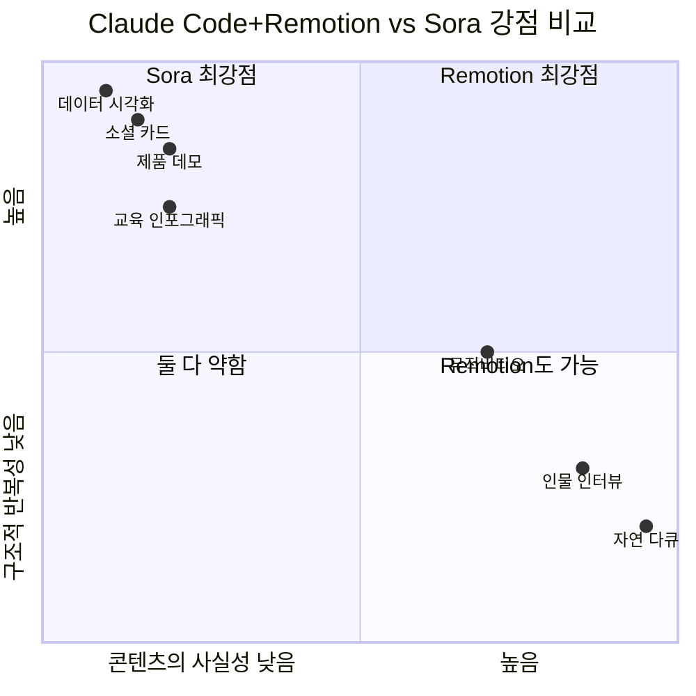

## 자연어로 영상을 만드는 시대 — 코드가 곧 영상이다

> **작성 기준:** 2026년 3월 28일  
> **대상 독자:** Claude Code 사용자, 영상 콘텐츠 제작자, 개발자, AI 도구 탐구자

---

## 목차

1. [왜 지금 이 조합이 주목받는가](#1-왜-지금-이-조합이-주목받는가)
2. [Remotion이란 무엇인가](#2-remotion이란-무엇인가)
3. [Claude Code Skills 시스템이란](#3-claude-code-skills-시스템이란)
4. [remotion-best-practices 스킬 상세 분석](#4-remotion-best-practices-스킬-상세-분석)
5. [전체 작동 구조 이해](#5-전체-작동-구조-이해)
6. [환경 셋업 완전 가이드](#6-환경-셋업-완전-가이드)
7. [기본 사용법 — 첫 영상 만들기](#7-기본-사용법--첫-영상-만들기)
8. [실전 프롬프트 패턴 5가지](#8-실전-프롬프트-패턴-5가지)
9. [Opus 4.6이 결과물 퀄리티를 바꾼 이유](#9-opus-46이-결과물-퀄리티를-바꾼-이유)
10. [고급 기능 심층 탐구](#10-고급-기능-심층-탐구)
11. [실전 활용 시나리오](#11-실전-활용-시나리오)
12. [한계와 주의사항](#12-한계와-주의사항)
13. [생태계 현황과 수치](#13-생태계-현황과-수치)
14. [Sora와의 근본적 차이](#14-sora와의-근본적-차이)
15. [앞으로의 방향](#15-앞으로의-방향)

---

## 1. 왜 지금 이 조합이 주목받는가

2026년 1월 20일, Remotion 팀이 Claude Code용 Agent Skill을 공개했다. 공개 48시간 만에 AI 개발자 커뮤니티 전체가 데모 영상으로 넘쳐났다. "ChatGPT의 등장과 같은 순간"이라는 표현이 소셜미디어에서 반복됐다. 그리고 8주 후, 이 스킬은 skills.sh 플랫폼 전체 5위권에 진입했다.

그러나 단순히 새로운 도구가 등장했기 때문만은 아니다. Claude Code가 Opus 4.6 모델로 업그레이드되면서 복잡한 React 코드를 생성하는 능력이 비약적으로 향상됐고, 이것이 Remotion이라는 이미 검증된 프레임워크와 맞물려 결과물의 퀄리티를 수직 상승시켰다는 것이 현장의 반응이다.

이 가이드는 그 조합의 구조를 처음부터 끝까지 해부한다.

---

## 2. Remotion이란 무엇인가

### 2.1 핵심 개념

Remotion은 2021년 처음 공개된 오픈소스 비디오 프레임워크다. 핵심 아이디어는 단순하면서도 혁명적이다. **영상의 각 프레임을 React 컴포넌트로 정의한다.** 타임라인을 드래그하거나 키프레임을 클릭하는 GUI가 아니라, TypeScript/React 코드로 영상을 기술한다.

전통적인 영상 편집 도구(Premiere Pro, After Effects, DaVinci Resolve)는 시간 축을 따라 클립을 배치하고 시각적으로 조작하는 방식이다. Remotion은 그 반대다. "프레임 번호가 30일 때 이 텍스트는 불투명도 0.8이어야 한다"는 식으로 수식으로 기술한다.

### 2.2 프레임 결정론(Frame Determinism)

Remotion의 가장 중요한 기술적 특성은 **프레임 결정론**이다. 같은 프레임 번호를 입력하면 항상 동일한 이미지가 출력되어야 한다. `Date.now()`나 `Math.random()`처럼 실행 시점마다 달라지는 값을 쓰면 렌더링이 깨진다. 이 제약이 CSS 애니메이션이나 일반적인 웹 애니메이션과 근본적으로 다른 점이다.

이 특성 덕분에 Remotion은 다음이 가능하다.

- 영상을 일시정지하고 특정 프레임으로 이동해도 정확한 화면이 표시된다.
- 서버에서 병렬로 여러 프레임을 동시에 렌더링할 수 있다(Lambda 렌더링).
- 변수 하나만 바꿔 수백 개의 변형 영상을 자동 생성할 수 있다.

### 2.3 Remotion의 핵심 API

Remotion이 제공하는 주요 API들은 애니메이션 제작의 기반이 된다.

```typescript
import { useCurrentFrame, interpolate, spring, useVideoConfig } from 'remotion';

const MyAnimation = () => {
  const frame = useCurrentFrame();
  const { fps } = useVideoConfig();

  // interpolate: 프레임을 값의 범위로 매핑
  const opacity = interpolate(frame, [0, 30], [0, 1]);

  // spring: 물리 기반 스프링 애니메이션
  const scale = spring({ frame, fps, config: { mass: 0.5, stiffness: 200 } });

  return (
    <div style={{ opacity, transform: `scale(${scale})` }}>
      Hello World
    </div>
  );
};
```

`useCurrentFrame()`은 현재 렌더링 중인 프레임 번호를 반환한다. `interpolate()`는 프레임 범위를 임의의 값 범위로 선형 또는 비선형 보간한다. `spring()`은 질량, 강성, 감쇠 계수로 제어되는 물리 기반 애니메이션을 만든다. 이 세 가지 API가 Remotion 애니메이션의 99%를 구성한다.

---

## 3. Claude Code Skills 시스템이란

### 3.1 Skills의 등장 배경

Claude Code는 범용 코딩 에이전트다. 그런데 특정 프레임워크, 라이브러리, 도메인에는 매우 구체적인 best practice와 흔히 저지르는 실수들이 존재한다. 이것을 AI 에이전트에게 실시간으로 전달하는 메커니즘이 바로 **Skills**다.

Skills는 본질적으로 `.claude` 폴더 안에 저장되는 마크다운 형태의 규칙 파일 모음이다. Claude Code는 작업을 시작하기 전에 이 규칙 파일들을 읽고, 해당 도메인에 특화된 지식을 컨텍스트에 담아 코드를 생성한다.

### 3.2 Skills의 기술적 작동 방식

```
프로젝트 루트/
├── .claude/
│   └── skills/
│       └── remotion/
│           ├── SKILL.md          ← 스킬의 메타 정보 및 사용 지침
│           └── rules/
│               ├── animations.md ← 애니메이션 규칙
│               ├── audio.md      ← 오디오 처리 규칙
│               ├── 3d.md         ← Three.js 통합 규칙
│               └── ...           ← 30+ 개의 규칙 파일
```

Claude Code는 SKILL.md를 먼저 읽어 어떤 규칙 파일이 필요한지 판단한다. 예를 들어 "자막을 추가해줘"라는 요청이 오면 `rules/subtitles.md`를 로드하고, "오디오 스펙트럼 시각화"가 필요하면 `rules/audio-visualization.md`를 가져온다. 필요한 규칙 파일만 선택적으로 로드하기 때문에 컨텍스트 윈도우를 효율적으로 사용한다.

### 3.3 Skills.sh 플랫폼

Skills.sh는 Claude Code Skills의 레지스트리 플랫폼이다. npm처럼 패키지를 검색하고 설치할 수 있다.

```bash
# 특정 스킬 설치
npx skills add remotion-dev/skills --skill remotion-best-practices

# 전체 스킬 패키지 설치
npx skills add https://github.com/remotion-dev/skills
```

---

## 4. remotion-best-practices 스킬 상세 분석

### 4.1 스킬 개요

`remotion-best-practices`는 Remotion 공식 팀이 직접 관리하는 공식 스킬이다. 2026년 1월 19일 최초 등록 이후, 현재 주간 설치 수 162,600회를 기록하고 있다. Claude Code, Cursor, Gemini CLI, opencode, Codex 등 여러 AI 에이전트에 설치되어 있으며, GitHub 저장소는 2,300개 이상의 스타를 보유하고 있다.

### 4.2 30개 이상의 규칙 파일 완전 분석

다음은 스킬이 제공하는 모든 규칙 파일을 영역별로 분류한 것이다.

#### 애니메이션 & 타이밍 영역

| 파일 | 내용 |
|------|------|
| `rules/animations.md` | Remotion의 근본 애니메이션 패턴. interpolate, spring, useCurrentFrame의 올바른 사용법 |
| `rules/timing.md` | 보간 커브 상세. 선형, 이징(easing), 스프링의 차이와 적합한 상황 |
| `rules/sequencing.md` | 여러 애니메이션의 시간 배치. 딜레이, 트림, 지속 시간 제한 패턴 |
| `rules/transitions.md` | 씬(scene) 전환 패턴. fade, slide, wipe, flip 등 |
| `rules/trimming.md` | 애니메이션의 앞뒤를 자르는 패턴 |
| `rules/text-animations.md` | 텍스트 등장/퇴장 애니메이션. 타이포그래피 모션 디자인 |

#### 미디어 & 에셋 영역

| 파일 | 내용 |
|------|------|
| `rules/assets.md` | 이미지, 비디오, 오디오, 폰트 임포트 방법 |
| `rules/images.md` | `` 컴포넌트 사용. staticFile() 올바른 경로 처리 |
| `rules/videos.md` | `<Video>` 컴포넌트. 트림, 볼륨, 속도, 루프, 피치 조절 |
| `rules/audio.md` | `<Audio>` 컴포넌트. 오디오 임포트, 트림, 볼륨, 속도, 피치 |
| `rules/gifs.md` | GIF를 Remotion 타임라인에 동기화하는 방법 |
| `rules/fonts.md` | Google Fonts 및 로컬 폰트 로딩 방법 |

#### 오디오 분석 & 시각화 영역

| 파일 | 내용 |
|------|------|
| `rules/audio-visualization.md` | 오디오 스펙트럼 바, 웨이브폼, 베이스 리액티브 이펙트 |
| `rules/sound-effects.md` | 사운드 이펙트 사용 패턴 |
| `rules/get-audio-duration.md` | Mediabunny를 사용한 오디오 파일 길이 조회 |

#### 미디어 메타데이터 & 인스펙션 영역

| 파일 | 내용 |
|------|------|
| `rules/get-video-duration.md` | Mediabunny로 비디오 파일 길이(초) 조회 |
| `rules/get-video-dimensions.md` | Mediabunny로 비디오 파일의 너비/높이 조회 |
| `rules/can-decode.md` | Mediabunny로 브라우저가 해당 비디오를 디코딩할 수 있는지 확인 |
| `rules/extract-frames.md` | Mediabunny로 특정 타임스탬프의 프레임 추출 |

#### 컴포지션 & 구조 영역

| 파일 | 내용 |
|------|------|
| `rules/compositions.md` | 컴포지션 정의, Still(정지 이미지), 폴더, 기본 props, 동적 메타데이터 |
| `rules/calculate-metadata.md` | 컴포지션의 길이, 해상도, props를 동적으로 계산 |
| `rules/parameters.md` | Zod 스키마로 영상을 파라미터화. 재사용 가능한 템플릿 제작 |
| `rules/measuring-dom-nodes.md` | DOM 요소의 실제 크기 측정 |
| `rules/measuring-text.md` | 텍스트 치수 측정, 컨테이너에 맞게 텍스트 조절, 오버플로우 감지 |

#### 고급 기능 영역

| 파일 | 내용 |
|------|------|
| `rules/3d.md` | Three.js와 React Three Fiber로 3D 콘텐츠 제작 |
| `rules/charts.md` | 바 차트, 파이 차트, 라인 차트, 주식 차트 패턴 |
| `rules/lottie.md` | Lottie 애니메이션 임베딩 |
| `rules/light-leaks.md` | `@remotion/light-leaks`를 이용한 렌즈 플레어 오버레이 효과 |
| `rules/transparent-videos.md` | 투명 배경 비디오(알파 채널) 렌더링 |
| `rules/tailwind.md` | Remotion에서 TailwindCSS 사용 |

#### 외부 서비스 통합 영역

| 파일 | 내용 |
|------|------|
| `rules/maps.md` | Mapbox와 연동하여 지도 애니메이션 |
| `rules/voiceover.md` | ElevenLabs TTS로 AI 보이스오버 생성 및 동기화 |
| `rules/ffmpeg.md` | FFmpeg를 이용한 비디오 트림, 무음 구간 감지 등 |

#### 자막 영역

| 파일 | 내용 |
|------|------|
| `rules/subtitles.md` | 자막/캡션 생성. 단어별 하이라이트, 애니메이션 자막 |

---

## 5. 전체 작동 구조 이해

### 5.1 파이프라인 다이어그램



### 5.2 기술 스택 전체 그림



### 5.3 Sora와의 근본적 차이 (먼저 이해해야 할 것)

많은 사람들이 이 조합을 Sora 같은 AI 영상 생성 모델과 혼동한다. 둘은 완전히 다르다.

| 구분 | Sora / AI 영상 생성 | Claude Code + Remotion |
|------|---------------------|------------------------|
| **생성 방식** | 픽셀을 직접 생성 (확산 모델) | 코드를 생성 → 코드가 영상 렌더링 |
| **수정 방법** | 재생성 (결과 예측 불가) | 코드 편집 (정밀 제어 가능) |
| **반복 가능성** | 같은 프롬프트도 다른 결과 | 완전히 동일한 결과 보장 |
| **데이터 연동** | 불가 | CSV → 차트 애니메이션 등 가능 |
| **대량 생성** | 비용/시간 선형 증가 | 하나의 템플릿으로 수천 개 생성 |
| **버전 관리** | 불가 | Git으로 완전한 버전 관리 |
| **강점** | 사실적 영상, 자연물, 인물 | 구조적 반복 콘텐츠, 데이터 시각화, 제품 데모 |

---

## 6. 환경 셋업 완전 가이드

### 6.1 사전 준비

**필수 요건**

- Node.js 18 이상 (`node -v`로 확인)
- Claude Code 설치 및 로그인 (`npm install -g @anthropic-ai/claude-code`)
- Claude Pro 또는 Max 구독 (Claude Code 사용에 필요)
- Chrome 또는 Chromium 브라우저 (Remotion 렌더링에 사용)

### 6.2 방법 1: 공식 권장 방법 (가장 간단)

Remotion 공식 문서가 권장하는 방법은 단 하나의 명령어로 시작하는 것이다.

```bash
# 새 Remotion 프로젝트 생성 (Skills 자동 포함)
npx create-video@latest
```

이 명령어를 실행하면 인터랙티브 프롬프트가 나타난다.

```
? What would you like to name your project? › my-video
? Which template would you like to use? › Blank (빈 프로젝트 권장)
? Would you like to use TailwindCSS? › Yes (권장)
? Would you like to install Skills? › Yes (꼭 Yes 선택)
```

"Install Skills"를 Yes로 선택하면 `.claude/skills/remotion` 폴더가 자동으로 생성되고 `remotion-best-practices` 스킬이 설치된다. 이후 의존성 설치 및 개발 서버 실행이다.

```bash
cd my-video
npm install
npm run dev
```

`http://localhost:3000`에서 Remotion Studio가 열린다.

### 6.3 방법 2: 기존 프로젝트에 스킬만 추가

이미 Remotion 프로젝트가 있고 스킬만 추가하려면 다음처럼 한다.

```bash
# npx를 통한 직접 설치
npx skills add remotion-dev/skills --skill remotion-best-practices

# 또는 전체 스킬 패키지 설치
npx skills add https://github.com/remotion-dev/skills
```

### 6.4 방법 3: Claude Code 안에서 자동 설치

Claude Code를 열고 자연어로 요청해도 된다.

```
> Remotion 스킬을 설치하고 새 비디오 프로젝트를 셋업해줘
```

Claude Code가 웹을 검색하여 공식 설치 명령을 찾고 자동으로 실행한다.

### 6.5 Claude Code 실행

별도의 터미널 창을 열고 프로젝트 폴더에서 실행한다.

```bash
cd my-video
claude
```

이제 자연어로 영상을 묘사할 준비가 됐다.

### 6.6 프로젝트 폴더 구조

```
my-video/
├── .claude/
│   └── skills/
│       └── remotion/           ← Skills 파일들
│           ├── SKILL.md
│           └── rules/
│               ├── animations.md
│               ├── audio.md
│               └── ... (30개 이상)
├── src/
│   ├── Root.tsx                ← 컴포지션 등록
│   └── MyComposition.tsx       ← Claude가 생성하는 메인 컴포넌트
├── public/                     ← 이미지, 오디오 에셋 저장 위치
├── remotion.config.ts          ← Remotion 설정
└── package.json
```

---

## 7. 기본 사용법 — 첫 영상 만들기

### 7.1 가장 단순한 시작

Claude Code 터미널에서 다음을 입력한다.

```
> 검정 배경에 흰색 텍스트로 "Hello, World"가 페이드인되는 10초짜리 영상 만들어줘
```

Claude Code는 Skills를 로드하고, 올바른 Remotion 패턴으로 코드를 생성한다. 잘못된 CSS 애니메이션이나 Date.now() 사용 같은 흔한 실수를 Skills가 방지한다.

생성되는 코드는 대략 이런 구조다.

```tsx
import { AbsoluteFill, useCurrentFrame, interpolate } from 'remotion';

export const HelloWorld: React.FC = () => {
  const frame = useCurrentFrame();

  // 0~30 프레임(1초)에 걸쳐 페이드인
  const opacity = interpolate(frame, [0, 30], [0, 1], {
    extrapolateRight: 'clamp',
  });

  return (
    <AbsoluteFill
      style={{ backgroundColor: 'black', justifyContent: 'center', alignItems: 'center' }}
    >
      <div style={{ opacity, color: 'white', fontSize: 80, fontWeight: 'bold' }}>
        Hello, World
      </div>
    </AbsoluteFill>
  );
};
```

### 7.2 Remotion Studio에서 미리보기

`npm run dev`로 이미 Studio가 실행 중이라면 브라우저에서 즉시 변경 사항을 확인할 수 있다. 코드를 저장하는 순간 미리보기가 업데이트된다.

Remotion Studio는 다음 기능을 제공한다.

- 재생/일시정지 및 프레임 단위 탐색
- 시간 표시자를 드래그해 특정 프레임으로 이동
- 컴포지션 목록에서 여러 씬 전환
- Props 패널에서 파라미터 실시간 조정 (Zod 스키마 사용 시)

### 7.3 반복적 수정

첫 결과물이 마음에 들지 않으면 같은 세션에서 계속 수정 프롬프트를 입력한다.

```
> 텍스트 크기를 더 크게 하고, 페이드인 후에 살짝 바운스 효과를 넣어줘
> 배경에 미묘한 그라데이션 추가해줘 (검정에서 네이비로)
> 마지막에 2초 동안 텍스트가 페이드아웃되게 해줘
```

각 요청마다 Claude는 기존 코드를 유지하면서 요청한 부분만 수정한다.

### 7.4 MP4로 최종 렌더링

```bash
npx remotion render src/index.ts MyComposition out/video.mp4
```

또는 Claude Code에게 요청한다.

```
> Remotion Studio를 열어서 최종 렌더링해줘
```

---

## 8. 실전 프롬프트 패턴 5가지

실제 커뮤니티에서 검증된 5가지 사용 패턴을 소개한다. 각 패턴은 복사해서 바로 사용할 수 있도록 프롬프트 템플릿을 포함한다.

### 8.1 교육용 설명 영상

```
Use the Remotion best practices skill.

Create an educational explainer video (1080x1920, 30fps, 30 seconds) 
that teaches "AI 에이전트가 작동하는 방법".

SAFE ZONE: 
- 상단 150px, 하단 170px, 좌우 60px 안에 중요 콘텐츠 배치
- 플랫폼 UI에 가려지는 영역 피하기

MINIMUM FONT SIZES: 
- 헤드라인 56px+, 본문/자막 36px+, 레이블/소문자 최소 28px

STYLE:
- 진한 배경 (Navy #0D1B2A)
- 강조색 Cyan (#00D4FF)
- 단계별 순서로 내용 등장
- 각 포인트마다 애니메이션 아이콘 (SVG로 직접 생성)

Zero 외부 에셋 — 모든 그래픽은 SVG로 코드에서 생성할 것
```

이 패턴의 특징은 Claude가 직접 웹 검색을 통해 주제를 조사하고, 스크립트를 작성하고, 씬을 설계하고, 모든 것을 애니메이션화한다는 것이다. 외부 이미지 없이 SVG만으로 구성하면 렌더링 오류가 없다.

### 8.2 제품 데모 & 런치 영상

```
Use the Remotion best practices skill.

Create a 25-second product demo and launch video (1080x1920, 30fps) 
for the product at [제품 URL].

SAFE ZONE: 상단 150px, 하단 170px, 좌우 60px 최소
MINIMUM FONT SIZES: 헤드라인 56px+, 본문 36px+

Claude should:
1. URL에서 실제 브랜딩(색상, 폰트, 로고 설명)을 추출할 것
2. 제품의 핵심 기능 3가지를 각 씬으로 구성할 것
3. 각 기능마다 UI 시뮬레이션 애니메이션 포함
4. 클로징 CTA 슬라이드 추가

Visual controls: 
- 슬라이드별 타이밍을 조절할 수 있는 파라미터 노출할 것
```

### 8.3 데이터 시각화 대시보드

```
Use the Remotion best practices skill.

public/ 폴더의 data.csv 파일을 분석하여 30초 데이터 시각화 영상을 만들어줘.
해상도: 1920x1080 (유튜브/프레젠테이션용), 30fps

Requirements:
- 데이터의 핵심 인사이트를 3-4개 씬으로 구성
- 씬 1: 핵심 수치 카운트업 애니메이션
- 씬 2: 메인 트렌드를 보여주는 라인 차트 (차트가 그려지는 애니메이션)
- 씬 3: 카테고리 비교 바 차트 (순서대로 등장)
- 씬 4: 요약 및 결론 텍스트

Color palette: 회사 느낌의 전문적인 색상 (Navy + Gold 계열)
```

### 8.4 소셜 증거 & 리뷰 영상

```
Use the Remotion best practices skill.

Create a 20-second testimonial/social proof video (1080x1920, 30fps) 
for the business at this Google Business Profile: [구글 비즈니스 URL]

Claude should:
1. URL에서 실제 리뷰, 별점, 비즈니스 정보 스크래핑
2. 실제 고객 인용문을 별점 애니메이션과 함께 표시
3. 소셜 프루프 카운터 애니메이션 (리뷰 수, 평균 별점)
4. 각 리뷰마다 자연스러운 카드 전환 효과

SAFE ZONE: 상단 150px, 하단 170px, 좌우 60px
```

### 8.5 코드/터미널 데모 영상

```
Use the Remotion best practices skill.

Create a 20-second developer demo video (1920x1080, 30fps) 
showing terminal animation.

Concept:
- 다크 터미널 배경 (VSCode 같은 느낌)
- 명령어가 타이핑되는 모션 (글자 하나씩 등장)
- 실행 결과가 순서대로 나타남
- 중간에 코드 하이라이트 효과

Commands to animate:
$ npx create-video@latest
→ Remotion project created successfully!
$ npx skills add remotion-dev/skills
→ ✓ remotion-best-practices installed
$ claude
→ Claude Code ready. Describe your video...

End with: "Made with Claude Code + Remotion"
```

이 패턴은 개발자 도구 소개, 오픈소스 라이브러리 홍보에 특히 효과적이다.

---

## 9. Opus 4.6이 결과물 퀄리티를 바꾼 이유

### 9.1 Opus 4.6의 기술적 특성

2026년 2월 5일 출시된 Claude Opus 4.6은 이전 Opus 4.5와 동일한 가격($5/$25 per MTok)을 유지하면서 여러 핵심 역량이 향상됐다. Claude Code 컨텍스트에서 특히 중요한 변화는 다음과 같다.

**1M 토큰 컨텍스트 윈도우 (베타):** Remotion 프로젝트가 커질수록 여러 컴포넌트 파일, 에셋, 설정 파일이 늘어난다. 1M 토큰 컨텍스트는 전체 프로젝트를 한 번에 파악하고 일관성 있는 코드를 생성할 수 있게 한다.

**적응형 사고(Adaptive Thinking):** 복잡한 애니메이션 로직을 짤 때 얼마나 깊이 생각할지를 자동으로 결정한다. 간단한 수정 요청에는 빠르게 응답하고, 복잡한 3D 씬 설계에는 더 오래 추론한다.

**에이전트 작업의 안정성 향상:** 여러 파일에 걸친 수정 작업을 중간에 멈추지 않고 완수하는 능력이 향상됐다. 기존 모델은 복잡한 Remotion 프로젝트에서 일관성이 깨지거나 중간에 작업을 멈추는 경우가 있었다.

**자기 실수 감지 강화:** 코드 리뷰 중 자신이 생성한 코드의 오류를 스스로 감지하고 수정하는 능력이 향상됐다. CSS 애니메이션을 쓰려다가 스스로 잡아내거나, 프레임 결정론을 위반하는 코드를 생성 전에 수정한다.

### 9.2 Skills와 Opus 4.6의 시너지

Skills는 방어선(guardrails)이고, Opus 4.6은 그 방어선 안에서 더 정교한 코드를 짜는 역할을 한다. 이전 모델에서는 Skills가 막아주지 못한 엣지 케이스에서 오류가 발생했다면, Opus 4.6은 그 엣지 케이스 자체를 더 잘 인식한다.

구체적인 예를 들면, Remotion에서 텍스트 오버플로우를 처리하는 방식은 일반 웹 개발과 다르다. 일반 CSS의 `overflow: hidden`은 렌더링 과정에서 예측 불가능하게 작동할 수 있다. Skills의 `rules/measuring-text.md`는 이를 방지하는 패턴을 가르치고, Opus 4.6은 그 패턴을 더 정확하게 적용한다.

---

## 10. 고급 기능 심층 탐구

### 10.1 3D 콘텐츠 (Three.js + React Three Fiber)

Remotion은 Three.js와 React Three Fiber를 통해 3D 씬을 영상 안에 렌더링할 수 있다.

```
> 회전하는 3D 큐브를 중심으로 제품 설명 텍스트가 공전하는 15초 영상 만들어줘
```

Claude는 `rules/3d.md`를 로드하고, `@react-three/fiber`와 `@react-three/drei`를 활용하는 코드를 생성한다. 3D 씬 전체가 Remotion의 타임라인에 종속되므로 정확한 프레임 제어가 가능하다.

### 10.2 오디오 시각화

음악이나 오디오에 반응하는 시각화는 크리에이터 콘텐츠에서 수요가 높다.

```
> public/music.mp3 파일을 분석해서 베이스에 반응하는 스펙트럼 바 시각화 영상 만들어줘
  - 배경: 진한 보라색에서 블루 그라데이션
  - 바 색상: 금색, 위로 솟아오르는 애니메이션
  - 오디오 길이에 맞게 영상 길이 자동 설정
```

`rules/audio-visualization.md`와 `rules/get-audio-duration.md`가 함께 로드되어 오디오 분석부터 시각화까지 완성된 코드를 생성한다.

### 10.3 자막 & 캡션

영상 위에 자막을 올리는 것은 소셜 미디어 콘텐츠의 핵심이다.

```
> public/voiceover.mp3의 자막을 만들어줘
  - 단어 단위로 하이라이트되는 active word 효과
  - 하단 safe zone 안에 배치
  - 폰트: Bold, 흰색 텍스트 + 검정 그림자
```

Whisper 등의 STT 도구로 생성한 자막 파일(SRT, JSON)을 입력으로 받아 애니메이션 자막을 생성할 수 있다.

### 10.4 ElevenLabs AI 보이스오버

```
> 다음 스크립트로 ElevenLabs 보이스오버를 생성하고 영상에 싱크를 맞춰줘:
  "AI가 영상 제작의 패러다임을 바꾸고 있습니다.
   Claude Code와 Remotion의 조합이 그 중심에 있습니다."
  
  ElevenLabs API Key: [키 입력]
  Voice: Rachel (차분하고 전문적인 톤)
```

`rules/voiceover.md`가 ElevenLabs API 연동 방법과 생성된 오디오를 Remotion 타임라인에 동기화하는 방법을 Claude에게 가르친다.

### 10.5 Mapbox 지도 애니메이션

데이터 저널리즘, 물류, 여행 콘텐츠에서 지도 애니메이션 수요가 높다.

```
> 서울에서 부산까지 이동하는 경로를 Mapbox 지도로 애니메이션화해줘
  - 카메라가 자연스럽게 이동하는 플라이스루 효과
  - 경로가 선으로 그려지는 애니메이션
  - 핵심 도시마다 마커와 텍스트 등장
  Mapbox Token: [토큰 입력]
```

### 10.6 Lottie 애니메이션 통합

LottieFiles.com에서 무료 Lottie JSON 파일을 다운로드하여 Remotion 씬에 통합할 수 있다.

```
> public/celebration.json (LottieFiles 다운로드)을 15초 지점에서 3초간 재생해줘
  영상 전체 타임라인에 맞게 Lottie 속도를 조절할 것
```

### 10.7 파라미터화된 영상 템플릿

Zod 스키마를 사용하면 영상을 재사용 가능한 템플릿으로 만들 수 있다.

```
> 이 영상을 파라미터화해줘. 다음 값을 외부에서 주입할 수 있어야 해:
  - title: 영상 제목 (string)
  - primaryColor: 주요 색상 (hex color)
  - logoUrl: 로고 URL (string)
  - duration: 영상 길이 (number, 초 단위)
```

생성된 파라미터 스키마를 사용하면 CLI에서 다양한 변형을 자동 생성할 수 있다.

```bash
# 파라미터를 JSON으로 전달하여 렌더링
npx remotion render src/index.ts MyComposition out/brand-a.mp4 \
  --props='{"title":"Brand A","primaryColor":"#FF6B6B","duration":30}'
```

---

## 11. 실전 활용 시나리오

### 11.1 인디 개발자 / 오픈소스 홍보

오픈소스 프로젝트를 GitHub README나 Product Hunt에 소개할 때 영상 데모가 있으면 전환율이 크게 달라진다. 이전에는 화면 녹화 후 편집기에서 수작업이 필요했다. 이제는 Claude Code에게 "내 GitHub 리포의 README를 읽고 30초짜리 소개 영상 만들어줘"라고 하면 된다.

### 11.2 마케터 / 소셜 미디어 크리에이터

제품의 특정 기능이 업데이트될 때마다 동일한 형식의 소개 영상을 반복적으로 만들어야 하는 마케터에게 이 조합은 특히 강력하다. 하나의 Remotion 템플릿을 만들어두면 내용만 바꿔서 수십 개의 변형 영상을 자동 생성할 수 있다.

실제로 Sabrina Ramonov는 제품 URL만 입력하면 브랜드 색상을 스크래핑하고, 기능 스크린샷을 캡처하고, 완성된 프로모션 영상을 생성하는 파이프라인을 구축했다고 보고했다. 여기에 Claude in Chrome(브라우저 자동화)을 결합하면 실제 제품 스크린샷을 캡처하여 영상에 포함할 수도 있다.

### 11.3 데이터 과학자 / 리서처

연구 결과를 영상으로 전달하는 것은 학술 커뮤니케이션에서 점점 중요해지고 있다. CSV 데이터를 업로드하면 데이터의 의미를 분석하고 가장 적합한 시각화 방식을 선택하여 애니메이션 영상을 생성하는 워크플로가 가능하다.

### 11.4 컨텐츠 자동화 파이프라인

AppyDave 같은 콘텐츠 크리에이터들은 Claude Code + Remotion을 콘텐츠 캘린더 자동화에 활용한다. 기본 패턴은 다음과 같다.


GitHub Actions나 CI/CD 파이프라인에 통합하면 새 데이터가 들어올 때마다 자동으로 영상이 생성된다.

### 11.5 개발팀 / 스프린트 리뷰

digitalsamba의 Claude Code Video Toolkit는 팀의 스프린트 리뷰 영상을 자동화하는 실제 사용 사례를 보여준다. 스프린트 이슈 목록을 입력하면 각 기능의 변경 사항을 설명하는 영상을 자동 생성한다.

---

## 12. 한계와 주의사항

### 12.1 기술적 한계

**렌더링 성능:** Remotion은 헤드리스 브라우저로 프레임을 하나씩 렌더링한다. 1920x1080, 30fps, 1분짜리 영상이면 1,800개의 개별 프레임을 렌더링해야 한다. 일반 편집 소프트웨어보다 느릴 수 있다. Lambda 렌더링을 사용하면 병렬 처리로 속도를 높일 수 있지만 추가 비용이 발생한다.

**복잡도 한계:** Claude Code로 생성할 수 있는 Remotion 코드의 복잡도에는 현실적인 상한이 있다. 단순한 모션 그래픽(텍스트 등장, 기본 차트, 단순 전환)에서는 매우 잘 작동한다. 하지만 여러 오디오 트랙이 복잡하게 얽히거나, 수십 개의 씬이 정교하게 연결되는 경우에는 여전히 사람의 직접 코딩이 더 효율적일 수 있다.

**CSS 애니메이션 제약:** Skills가 방지하려고 하지만, 가끔 Claude가 CSS `animation` 키워드나 `transition` 속성을 사용하는 코드를 생성할 수 있다. CSS 애니메이션은 Remotion의 프레임 결정론을 위반하기 때문에 반드시 제거해야 한다. 항상 `interpolate()`나 `spring()`으로 대체해야 한다.

**브라우저 디코딩 제약:** 모든 비디오 형식이 헤드리스 Chrome에서 디코딩되는 것은 아니다. H.265/HEVC 코덱 영상이나 특정 오디오 형식은 문제가 될 수 있다. `rules/can-decode.md` 규칙이 이를 사전에 확인하는 방법을 알려준다.

### 12.2 학습 곡선과 사전 지식

실제 사용자들의 경험에 따르면, 완전히 새로운 영상을 만들 때는 결과물의 퀄리티가 제각각이다. 특히 복잡한 레이아웃이나 여러 레이어가 겹치는 경우 위치가 어긋나거나 타이밍이 맞지 않는 경우가 생긴다. 더 나은 결과를 위해서는 React와 Remotion에 대한 기본적인 이해가 있으면 수정 프롬프트를 더 정확하게 줄 수 있다.

**권장 접근법:** 처음에는 단순하게 시작한다. 터미널 타이핑 애니메이션, 텍스트 등장 슬라이드처럼 구조가 명확한 것부터 시작해서 점점 복잡도를 높인다.

### 12.3 라이선스 고려사항

Remotion은 오픈소스이지만 **커스텀 라이선스**를 사용한다. 4명 이상의 직원이 있는 회사에서 상업적으로 사용하려면 라이선스를 구매해야 한다. 개인 프로젝트, 4명 미만의 소규모 팀, 비영리 목적은 무료다.

### 12.4 Claude Code 비용

Claude Code는 Pro 또는 Max 구독이 필요하다. Remotion 영상 생성 작업은 여러 파일을 읽고, 코드를 생성하고, 수정하는 과정에서 상당한 토큰을 소비한다. 복잡한 영상 프로젝트를 여러 개 작업한다면 Max 플랜이 더 경제적일 수 있다.

---

## 13. 생태계 현황과 수치

### 13.1 skills.sh 플랫폼 현황

2026년 3월 기준 `remotion-best-practices` 스킬의 통계는 다음과 같다.

| 지표 | 수치 |
|------|------|
| 주간 설치 수 | **162,600회** |
| GitHub 스타 | **2,300개** |
| 최초 등록일 | 2026년 1월 19일 (약 8주 경과) |
| skills.sh 전체 순위 | **상위 5위** |

**플랫폼별 설치 현황**

| 플랫폼 | 설치 수 |
|--------|---------|
| Gemini CLI | 118,000 |
| Claude Code | 116,900 |
| Cursor | 103,200 |
| opencode | 102,800 |
| Codex | 101,700 |
| Antigravity | 79,500 |

흥미로운 점은 Gemini CLI가 Claude Code보다 설치 수가 약간 높다는 것이다. 이는 이 스킬이 Claude 생태계를 넘어 범용 AI 코딩 에이전트 생태계 전체에 채택되었음을 의미한다.

### 13.2 보안 감사 현황

`remotion-best-practices` 스킬은 다음 보안 감사를 통과했다.

- **Gen Agent Trust Hub**: Pass
- **Socket**: Pass  
- **Snyk**: Warning (크리티컬 이슈는 없음, 일부 의존성 업데이트 권고)

공식 Remotion 팀이 직접 관리하는 스킬이므로 신뢰도가 높다.

### 13.3 Claude Code 전체 생태계 맥락

2026년 2월 기준, 공개 GitHub 커밋의 약 4%(일일 약 135,000건)가 Claude Code에 의해 작성됐다. Anthropic 자체 코드의 90%가 AI로 작성됐다. Claude Code가 단순한 코딩 도구를 넘어 생산성 플랫폼으로 진화하는 과정에서 Remotion Skills는 "비디오 제작"이라는 완전히 새로운 버티컬을 열었다.

---

## 14. Sora와의 근본적 차이

앞서 표로 정리했지만, 이 부분은 충분히 강조할 가치가 있다.

### 14.1 코드가 영상이다

Sora를 포함한 확산 모델 기반 AI 영상 생성은 픽셀 수준에서 이미지를 생성한다. 각 프레임이 신경망이 "그린" 그림이다. 그래서 사실적이고 유기적인 장면 묘사에 강하지만, 수정이 어렵다. "텍스트를 5px 왼쪽으로 이동"하려면 전체를 다시 생성해야 한다.

Claude Code + Remotion에서는 영상이 코드다. "텍스트를 5px 왼쪽으로 이동"은 `left: 100`을 `left: 95`로 바꾸는 것이다. 즉각적이고 정확하다.

### 14.2 이 조합이 강한 영역



이 조합이 가장 강력한 영역은 **구조가 반복되는 콘텐츠**다. 제품 데모, 데이터 시각화, 소셜 카드, 교육 인포그래픽처럼 동일한 형식으로 내용만 바뀌는 경우에 코드 기반 접근이 압도적으로 유리하다.

---

## 15. 앞으로의 방향

### 15.1 기술적 진화 방향

Remotion 생태계는 계속 확장 중이다. 현재 Skills에서 지원하는 기능들이 더 고도화될 것으로 보인다. 특히 AI 보이스오버(ElevenLabs)와의 통합, 자막 자동 생성 파이프라인, 그리고 더 정교한 3D 씬 생성이 커뮤니티의 관심을 받고 있다.

Remotion의 Lambda 렌더링이 더 저렴해지고 빨라질수록, 이 파이프라인을 SaaS 제품의 영상 생성 백엔드로 활용하는 사례가 늘어날 것이다. 이미 "Prompt to Motion Graphics" SaaS 템플릿이 Remotion 공식 생태계에서 제공되고 있다.

### 15.2 Claude Code의 역할 변화

Remotion Skills의 성공은 Claude Code가 코딩 도구에서 크리에이티브 프로덕션 도구로 확장될 수 있음을 보여준다. 비슷한 패턴으로 음악 생성(MIDI/Audio 라이브러리), 3D 모델링(Three.js), 게임 개발(Phaser.js) 등 다른 크리에이티브 도메인으로 확장이 예상된다.

### 15.3 크리에이터 경제에서의 위치

이 조합의 등장은 영상 제작의 진입 장벽을 낮추는 방향으로 작용한다. 비개발자도 Claude Code의 자연어 인터페이스를 통해 프로그래매틱 영상의 혜택을 누릴 수 있게 되었다. 단, "프롬프트만 잘 쓰면 된다"는 단순화는 실제와 다르다. 반복적인 수정과 결과물 평가, 그리고 어느 정도의 기술적 이해가 여전히 중요하다.

실제로 잘 활용하는 사람들의 공통점은 이 도구를 **출발점(first draft generator)** 으로 활용하고, 이후 세밀한 조정은 코드 수준에서 직접 하는 방식이다. Claude Code가 80%를 만들고, 나머지 20%는 직접 손보는 워크플로가 현실적이고 효율적이다.

---

## 빠른 참조 — 체크리스트

### 초기 셋업 체크리스트

- [ ] Node.js 18+ 설치 확인 (`node -v`)
- [ ] Claude Code 설치 (`npm install -g @anthropic-ai/claude-code`)
- [ ] Claude Pro/Max 로그인
- [ ] `npx create-video@latest` 실행
- [ ] 템플릿: Blank, TailwindCSS: Yes, Skills: Yes 선택
- [ ] `npm install` 실행
- [ ] `npm run dev`로 Remotion Studio 실행 (localhost:3000)
- [ ] 별도 터미널에서 `claude` 실행

### 첫 번째 영상 체크리스트

- [ ] 간단하게 시작 (텍스트 등장 → 복잡한 씬으로)
- [ ] 프롬프트에 해상도 명시 (1080x1920 또는 1920x1080)
- [ ] 프롬프트에 fps 명시 (30fps 권장)
- [ ] 소셜 미디어용이면 safe zone 지정
- [ ] 외부 에셋 없을 때: "SVG로 직접 생성할 것" 명시
- [ ] 외부 이미지 사용 시: public/ 폴더에 미리 배치

### 프롬프트 작성 체크리스트

- [ ] 항상 "Use the Remotion best practices skill"로 시작
- [ ] 해상도와 fps 명시
- [ ] 길이(초) 명시
- [ ] 색상 팔레트 또는 스타일 방향 제시
- [ ] 각 씬의 순서와 타이밍 설명
- [ ] 복잡한 경우 씬을 번호로 나눠서 설명

---

## 참고 링크

- **Remotion 공식 AI 가이드**: https://www.remotion.dev/docs/ai/claude-code
- **remotion-best-practices 스킬**: https://skills.sh/remotion-dev/skills/remotion-best-practices
- **Remotion GitHub Skills**: https://github.com/remotion-dev/skills
- **Remotion 공식 문서**: https://www.remotion.dev/docs
- **Claude Code Video Toolkit**: https://github.com/digitalsamba/claude-code-video-toolkit
- **Skills.sh 플랫폼**: https://skills.sh

---

*이 문서는 2026년 3월 28일 기준으로 작성되었습니다. Remotion과 Claude Code는 빠르게 발전하고 있으므로 공식 문서를 함께 참조하시기 바랍니다.*
