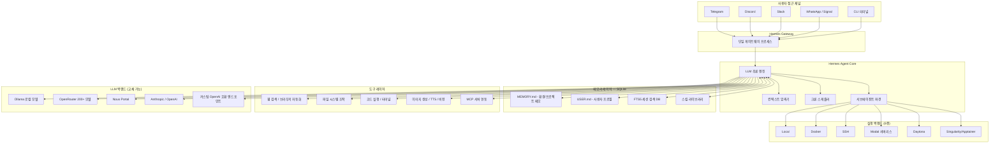
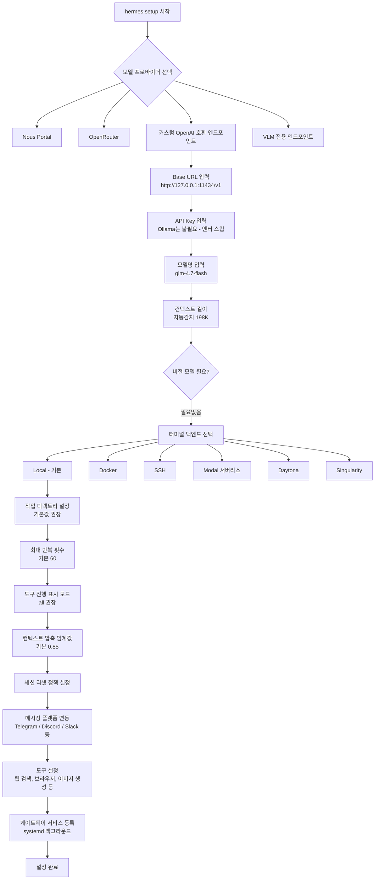
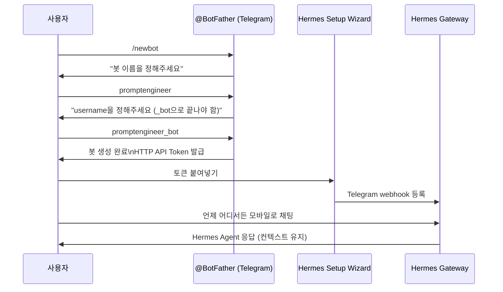
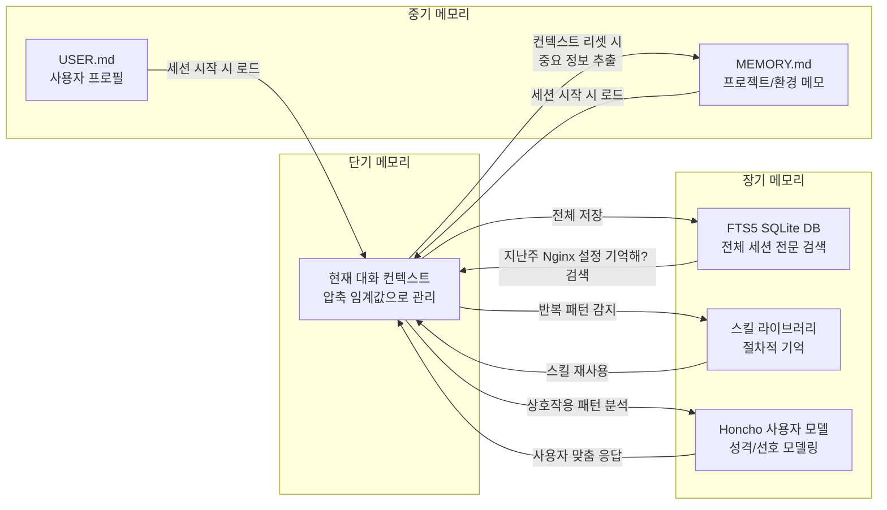
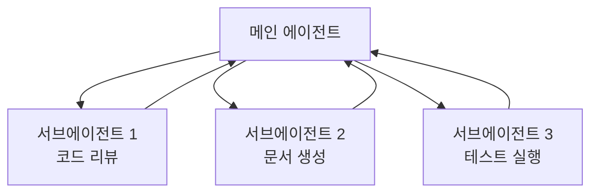
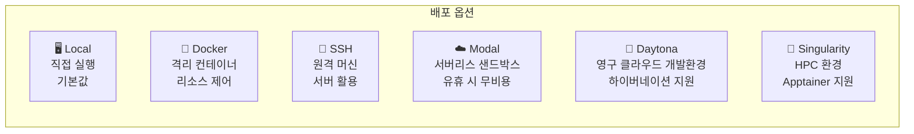
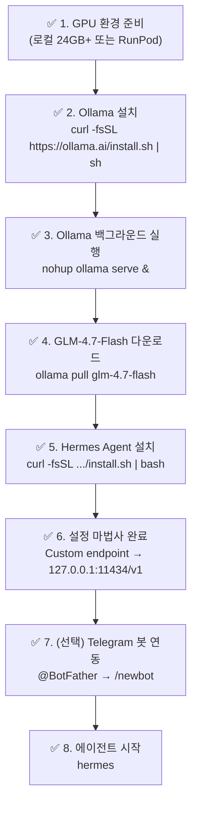

## API 키 없이 로컬에서 자기개선형 AI 에이전트 구동하기

> **출처**: YouTube — [*"Run a Powerful AI Agent Locally — Hermes Agent + Ollama (No API Key Required)"*](https://www.youtube.com/watch?v=UTaXIzhXoxI) (Prompt Engineer, 2026년 3월 24일)  
> **GitHub**: https://github.com/NousResearch/hermes-agent  
> **공식 문서**: https://hermes-agent.nousresearch.com/docs  
> **최신 버전**: v0.3.0 (v2026.3.17, 2026년 3월 17일 릴리즈)

---

## 목차

1. [Hermes Agent란 무엇인가](#1-hermes-agent란-무엇인가)
2. [왜 지금 주목받는가 — 기존 AI와의 차별점](#2-왜-지금-주목받는가--기존-ai와의-차별점)
3. [핵심 아키텍처 — 자기개선 루프의 작동 원리](#3-핵심-아키텍처--자기개선-루프의-작동-원리)
4. [전체 시스템 구성도](#4-전체-시스템-구성도)
5. [설치 환경 준비 — RunPod vs. 로컬 GPU](#5-설치-환경-준비--runpod-vs-로컬-gpu)
6. [Ollama 설치 및 GLM-4.7-Flash 모델 준비](#6-ollama-설치-및-glm-47-flash-모델-준비)
7. [GLM-4.7-Flash 모델 상세 분석](#7-glm-47-flash-모델-상세-분석)
8. [Hermes Agent 설치 — 원라인 인스톨러](#8-hermes-agent-설치--원라인-인스톨러)
9. [초기 설정 마법사 완전 해설](#9-초기-설정-마법사-완전-해설)
10. [Telegram 봇 연동 절차](#10-telegram-봇-연동-절차)
11. [지원 모델 및 프로바이더 생태계](#11-지원-모델-및-프로바이더-생태계)
12. [내장 도구 및 스킬 카탈로그](#12-내장-도구-및-스킬-카탈로그)
13. [메모리 시스템의 3계층 구조](#13-메모리-시스템의-3계층-구조)
14. [OpenClaw과의 비교 — 그리고 마이그레이션](#14-openclaw과의-비교--그리고-마이그레이션)
15. [실전 활용 — 크론 자동화, 서브에이전트, 병렬 처리](#15-실전-활용--크론-자동화-서브에이전트-병렬-처리)
16. [배포 아키텍처 옵션 6가지](#16-배포-아키텍처-옵션-6가지)
17. [주요 명령어 레퍼런스](#17-주요-명령어-레퍼런스)
18. [트러블슈팅](#18-트러블슈팅)
19. [Hermes Agent의 한계와 유의사항](#19-hermes-agent의-한계와-유의사항)
20. [마치며 — AI 에이전트 시대의 패러다임 전환](#20-마치며--ai-에이전트-시대의-패러다임-전환)

---

## 1. Hermes Agent란 무엇인가

Hermes Agent는 NousResearch가 2026년 2월 26일에 오픈소스(MIT 라이선스)로 공개한 자율 AI 에이전트 프레임워크다. 한 줄로 정의하자면 **"대화가 끝나도 기억이 사라지지 않고, 사용할수록 더 똑똑해지는 AI 에이전트"** 다.

NousResearch는 그동안 Hermes, Nomos, Psyche 등 오픈소스 파인튜닝 모델로 유명한 AI 연구 집단이었다. 이들이 모델 웨이트(weights)를 공개하는 것을 넘어, 이번에는 그 모델을 실제로 '에이전트'로 운용하는 프레임워크 자체를 공개한 것이다. 이는 단순히 API를 래핑한 챗봇 수준이 아니라, 파일 시스템 조작, 웹 브라우징, 코드 실행, 스케줄 자동화, 서브에이전트 파견까지 가능한 운영 수준의 에이전트 인프라다.

공식 슬로건은 **"The agent that grows with you"** — 사용자와 함께 성장하는 에이전트다.

### 탄생 배경

오늘날 ChatGPT나 Claude 같은 AI 어시스턴트가 직면한 가장 근본적인 한계는 **상태 무결성(statelessness)** 이다. 매 대화를 처음부터 시작하고, 어제 나눈 맥락을 오늘 모른다. 이 구조적 망각을 해결하기 위해 설계된 것이 Hermes Agent다. 내부적으로는 FTS5(Full-Text Search 5) 기반 SQLite 데이터베이스에 모든 과거 세션을 저장하고, 에이전트 스스로가 필요할 때 그 기억을 검색하고 요약한다.

---

## 2. 왜 지금 주목받는가 — 기존 AI와의 차별점

### ChatGPT / Claude와의 근본적 차이

| 비교 항목 | ChatGPT / Claude | Hermes Agent |
|---|---|---|
| **메모리** | 세션 종료 시 초기화 | SQLite에 영구 보존, FTS5 검색 |
| **스킬 생성** | 불가능 (정적) | 경험에서 자동 생성, 자기개선 |
| **실행 환경** | 클라우드 전용 | 로컬, VPS, GPU 클러스터, 서버리스 |
| **접근 채널** | 웹/앱 한정 | Telegram, Discord, Slack, WhatsApp, CLI |
| **모델 종속성** | 특정 모델 고정 | 200+ 모델 자유 교체 |
| **자동화** | 수동 | 내장 크론 스케줄러 |
| **비용** | 월정액 구독 | 인프라 + LLM API 비용만 |
| **데이터 주권** | 클라우드 서버 저장 | 완전 로컬, 텔레메트리 없음 |

### OpenClaw과의 차이

Hermes Agent는 종종 OpenClaw과 비교된다. 두 프로젝트 모두 CLI 기반의 자율 에이전트 프레임워크지만, 결정적 차이가 있다. OpenClaw의 스킬은 **인간이 작성하고 관리**한다. Hermes Agent의 스킬은 **에이전트 자신이 경험에서 작성하고, 사용하면서 스스로 개선**한다. 또한 Hermes는 OpenClaw 사용자를 위한 자동 설정 마이그레이션 도구(`hermes claw migrate`)를 제공해 기존 자산을 그대로 가져올 수 있다.

---

## 3. 핵심 아키텍처 — 자기개선 루프의 작동 원리

Hermes Agent의 자기개선은 세 가지 메커니즘이 맞물려 작동한다.

### 3-1. 에피소딕 메모리와 FTS5 세션 검색

에이전트는 모든 대화를 SQLite의 FTS5(Full-Text Search 5) 인덱스에 저장한다. 단순한 로그가 아니라 LLM 요약을 거친 구조화된 형태로 보존된다. "지난주 Nginx 설정 논의 기억해?" 같은 질문에 에이전트는 과거 세션을 검색해 관련 맥락을 불러온다. 며칠 전 대화, 몇 주 전 프로젝트 내용까지 검색 가능하다.

### 3-2. Honcho 사용자 모델링

단순히 "무슨 말을 했는지" 기억하는 것을 넘어, **"이 사람이 어떤 사람인지"** 를 모델링한다. Honcho는 사용자의 작업 스타일, 도메인 지식, 선호도, 커뮤니케이션 패턴을 추적하는 변증법적(dialectic) 사용자 모델이다. `USER.md` 파일에 이름, 시간대, 커뮤니케이션 스타일이 지속적으로 업데이트된다.

### 3-3. 자율 스킬 생성과 자기개선

에이전트가 복잡한 작업을 반복적으로 수행하면, 그 과정에서 **절차적 스킬(procedural skill)** 을 자동으로 작성한다. "매주 월요일 프로그레스 리포트 생성"을 여러 번 처리하면, 해당 작업 흐름이 재사용 가능한 스킬로 저장된다. 이후 실행 중에 스킬의 특정 부분이 구식임을 감지하면 스스로 수정한다. OpenClaw은 이 메커니즘이 없다.

---

## 4. 전체 시스템 구성도



---

## 5. 설치 환경 준비 — RunPod vs. 로컬 GPU

영상 제작자는 로컬 GPU가 없어 **RunPod**를 활용했다. RunPod는 GPU를 시간 단위로 임대하는 클라우드 서비스로, 모델 추론 및 에이전트 구동에 충분한 성능을 저렴하게 제공한다.

### RunPod 설정 절차

영상에서는 **RTX PRO 6000** (96GB VRAM, 188GB RAM, 16 vCPU)을 선택했다. 설정 시 다음 포트를 외부에 노출했다.

- 포트 `8888` — Jupyter Notebook 접근용 (선택)
- 포트 `9` — 일반 서비스용
- 포트 `11434` — **Ollama API 전용 포트**

RunPod를 사용하면 초기 가입 시 $10 결제에 $5~$500의 크레딧 보너스가 제공된다 (영상 기준).

### 로컬 GPU 요건

GLM-4.7-Flash 모델을 로컬에서 구동하려면 최소 **24GB VRAM**이 필요하다 (4비트 양자화 기준). RTX 3090/4090 수준의 GPU라면 충분하다. Apple Silicon M-시리즈는 16GB 통합 메모리로도 4비트 양자화 실행이 가능하다.

---

## 6. Ollama 설치 및 GLM-4.7-Flash 모델 준비

### Ollama 설치 (Linux)

```bash
# apt 업데이트 및 의존성 설치
apt-get update && apt-get upgrade -y
apt-get install -y zstd

# Ollama 설치
curl -fsSL https://ollama.ai/install.sh | sh

# 백그라운드 서비스로 실행
nohup ollama serve > /tmp/ollama.log 2>&1 &

# Ollama 동작 확인
ollama list
```

### GLM-4.7-Flash 모델 다운로드

```bash
# 모델 풀
ollama pull glm-4.7-flash

# 또는 즉시 실행 (자동 다운로드)
ollama run glm-4.7-flash
```

### Ollama API 엔드포인트 확인

Ollama가 실행되면 `http://127.0.0.1:11434`에서 OpenAI 호환 API를 제공한다. Hermes Agent에서 이 주소를 그대로 사용한다.

```bash
# API 동작 확인
curl http://localhost:11434/api/tags
```

---

## 7. GLM-4.7-Flash 모델 상세 분석

이 영상에서 선택한 로컬 모델은 Z.AI(智谱AI)의 **GLM-4.7-Flash**다. 2026년 1월에 공개된 이 모델은 30B 클래스에서 가장 강력한 로컬 모델 중 하나로 평가받는다.

### 핵심 스펙

| 항목 | 수치 |
|---|---|
| **전체 파라미터** | 30B (300억) |
| **활성 파라미터** | ~3B (MoE, 실제 추론 시 활성화) |
| **아키텍처** | MoE (Mixture of Experts) |
| **컨텍스트 윈도우** | 최대 200K 토큰 |
| **최소 VRAM** | ~15GB (Q4), ~22GB (Q8), ~30GB (FP8) |
| **Ollama 권장 최소** | 24GB VRAM |
| **SWE-bench 성능** | 59.2% |
| **추론 속도 (RTX 4090 4비트)** | 120~220 tok/s |

### MoE 아키텍처의 의미

일반적인 Dense 모델이 모든 파라미터를 매 토큰 추론마다 활성화하는 것과 달리, MoE 모델은 30B 전체 파라미터 중 실제로는 ~3B만 활성화해 추론한다. 이것이 GLM-4.7-Flash가 30B 규모임에도 소비 전력과 속도 면에서 훨씬 효율적인 이유다.

### Claude Code와의 연동

Ollama 공식 라이브러리 페이지에 흥미로운 점이 있다 — GLM-4.7-Flash 페이지의 "Applications" 섹션에 **Claude Code**와 **Codex**가 연동 앱으로 등재되어 있다.

```bash
# Claude Code에서 GLM-4.7-Flash 사용
ollama launch claude --model glm-4.7-flash

# Codex에서 GLM-4.7-Flash 사용
ollama launch codex --model glm-4.7-flash
```

Jiyo가 진행 중인 게임 프로젝트에서 Claude Code의 백엔드 모델을 GLM-4.7-Flash로 교체하는 실험을 해볼 수 있는 지점이다.

---

## 8. Hermes Agent 설치 — 원라인 인스톨러

### 설치 명령어 (Linux / macOS / WSL2)

```bash
curl -fsSL https://raw.githubusercontent.com/NousResearch/hermes-agent/main/scripts/install.sh | bash
```

이 명령어 하나로 다음이 모두 자동 처리된다.

- uv (Python 패키지 매니저) 설치
- Python 3.11 설치
- 레포지토리 클론
- Node.js 설치
- Playwright / Chrome (브라우저 자동화용) 설치
- `hermes` CLI 명령어 등록
- 스킬 허브(agentskills.io) 동기화

설치 완료 후에는 `source ~/.bashrc`(또는 `source ~/.zshrc`) 명령으로 터미널을 새로고침해야 `hermes` 명령이 활성화된다.

> **주의**: Windows 네이티브는 지원하지 않는다. WSL2를 통해 실행해야 한다.

### 설치 후 구조 확인

```
~/.hermes/
├── config.yaml          # 주 설정 파일
├── MEMORY.md            # 에이전트 메모리 (환경/프로젝트)
├── USER.md              # 사용자 프로필
├── sessions/            # SQLite FTS5 세션 DB
├── skills/              # 자동 생성된 스킬 라이브러리
└── plugins/             # 커스텀 Python 플러그인 (drop-in)
```

---

## 9. 초기 설정 마법사 완전 해설

설치 완료 직후 설정 마법사가 자동 실행된다. 또는 `hermes setup`으로 언제든 재실행할 수 있다. 마법사는 다음 단계를 순서대로 안내한다.



### 주요 설정 항목 상세

**터미널 백엔드 선택 (영상 이미지 5 참조)**

```
Select terminal backend:
  Local          - run directly on this machine (default)
  Docker         - isolated container with configurable resources
  Modal          - serverless cloud sandbox
  SSH            - run on a remote machine
  Daytona        - persistent cloud development environment
  Singularity    - HPC-friendly container
→ Keep current (local)
```

**Tool Progress Display 모드**

- `off` — 최종 응답만 표시 (조용)
- `new` — 도구가 바뀔 때만 이름 표시
- `all` — 모든 도구 호출과 미리보기 표시 **(권장)**
- `verbose` — 전체 인자, 결과, 디버그 로그

**컨텍스트 압축 (Context Compression)**

대화가 길어지면 오래된 메시지를 자동으로 요약해 토큰 소비를 억제한다. 임계값 0.85는 컨텍스트 창의 85%가 찼을 때 압축을 시작한다는 의미다.

**세션 리셋 정책**

Telegram 등 메시징 플랫폼에서의 대화는 시간이 지날수록 컨텍스트가 쌓여 API 비용이 증가한다. 세 가지 옵션이 있다.

- `inactivity + daily reset` — 비활성 N분 후 또는 매일 특정 시각에 리셋 **(권장)**
- `inactivity only` — 10분 무응답 시만 리셋
- `never` — 자동 리셋 없음

리셋 시 에이전트는 중요한 정보를 영구 메모리에 저장한 후 대화 컨텍스트를 초기화한다. 언제든 `/reset`으로 수동 리셋 가능.

---

## 10. Telegram 봇 연동 절차

Hermes Agent의 큰 장점 중 하나는 Telegram 봇으로 어디서든 에이전트에 접근할 수 있다는 점이다.



**사용자 ID 접근 제어**

설정 시 특정 Telegram 사용자 ID만 접근을 허용할 수 있다. `@userinfobot`에 메시지를 보내면 자신의 사용자 ID를 확인할 수 있다. 비워두면 공개 접근이 허용된다.

---

## 11. 지원 모델 및 프로바이더 생태계

`hermes model` 명령으로 언제든 모델을 교체할 수 있으며, 코드 변경은 전혀 필요 없다.

### 로컬 (API Key 불필요)

| 모델 | 실행 방법 | VRAM 요건 |
|---|---|---|
| GLM-4.7-Flash | `ollama run glm-4.7-flash` | 24GB (Q4: ~15GB) |
| GLM-4.7 | `ollama run glm-4.7` | 48GB+ |
| Llama 3.3 70B | `ollama run llama3.3` | 48GB+ |
| Qwen3 30B | `ollama run qwen3:30b` | 24GB |

### 클라우드 (API Key 필요)

| 프로바이더 | 주요 모델 | 특징 |
|---|---|---|
| **Nous Portal** | 자체 Claude, GPT-5, Gemini | OAuth, 프롬프트 캐싱 지원 |
| **OpenRouter** | 200+ 모델 | 단일 API Key로 전체 접근 |
| **Z.AI/GLM** | Kimi K2, GLM 5 Turbo | 장문 컨텍스트 특화 |
| **Anthropic** | Claude Opus 4.6, Sonnet 4.6 | v0.3.0에서 네이티브 지원 |
| **OpenAI** | GPT-5, GPT-5.4 Mini | 기본 OpenAI 호환 |
| **Vercel AI Gateway** | Vercel 카탈로그 전체 | v0.3.0 신규 추가 |

---

## 12. 내장 도구 및 스킬 카탈로그

영상의 이미지 8에서 확인된 Hermes Agent의 실제 도구 및 스킬 목록이다 (v0.3.0 기준 30 도구, 90 스킬).

### 도구셋 (Toolsets)

```
clarify        → clarify
code_execution → execute_code
cronjob        → cronjob
delegation     → delegate_task
file           → patch, read_file, search_files, write_file
homeassistant  → ha_call_service, ha_get_state, ...
honcho         → honcho_conclude, honcho_context, ...
(그 외 12개 도구셋)
```

### 스킬 카탈로그 (카테고리별)

| 카테고리 | 스킬 예시 |
|---|---|
| autonomous-ai-agents | claude-code, codex, hermes-agent-spawning, open... |
| creative | ascii-art, ascii-video, excalidraw |
| data-science | jupyter-live-kernel |
| email | himalaya |
| gaming | minecraft-modpack-server, pokemon-player |
| github | codebase-inspection, github-auth, github-code-r... |
| leisure | find-nearby |
| mcp | mcporter, native-mcp |
| media | gif-search, heartmula, songsee, youtube-content |
| mlops | audiocraft-audio-generation, axolotl, chroma, c... |
| note-taking | obsidian |
| productivity | google-workspace, linear, nano-pdf, notion, ocr... |
| research | arxiv, blogwatcher, domain-intel, duckduckgo-se... |
| smart-home | openhue |
| social-media | xitter |
| software-development | code-review, plan, requesting-code-review, suba... |

`agentskills.io` 커뮤니티를 통해 외부 스킬을 설치하거나 직접 기여할 수 있다.

---

## 13. 메모리 시스템의 3계층 구조



이 3계층 구조가 Hermes Agent를 진정한 의미의 '장기 기억을 가진 에이전트'로 만든다. 특히 FTS5 세션 검색은 몇 주 전 대화도 키워드로 찾을 수 있어, 장기 프로젝트를 다루는 개발자나 연구자에게 매우 유용하다.

---

## 14. OpenClaw과의 비교 — 그리고 마이그레이션

### 상세 비교

| 항목 | OpenClaw | Hermes Agent |
|---|---|---|
| **스킬 작성 주체** | 인간 | 에이전트 자신 |
| **스킬 개선** | 수동 | 자동 (사용 중 자기개선) |
| **메모리 구조** | 단순 컨텍스트 | 3계층 (단기/중기/장기) |
| **세션 검색** | 없음 | FTS5 전문 검색 |
| **사용자 모델링** | 없음 | Honcho 변증법 모델 |
| **병렬 처리** | 제한적 | ThreadPoolExecutor 최대 8 워커 |
| **배포 유연성** | 주로 로컬 | 6가지 백엔드 옵션 |
| **마이그레이션** | — | OpenClaw → Hermes 자동 지원 |

### OpenClaw에서 마이그레이션

```bash
# 자동 감지 및 마이그레이션 (설정, 메모리, 스킬, API Key)
hermes claw migrate

# 미리보기 (실제 변경 없음)
hermes claw migrate --dry-run

# 시크릿 제외 마이그레이션
hermes claw migrate --preset user-data

# 충돌 파일 덮어쓰기
hermes claw migrate --overwrite
```

---

## 15. 실전 활용 — 크론 자동화, 서브에이전트, 병렬 처리

### 크론 자동화

Hermes Agent에는 내장 크론 스케줄러가 있다. 자연어로 스케줄을 지정할 수 있다.

```
# 예: Telegram에서 에이전트에게 전송
"매주 월요일 오전 9시에 GitHub 이슈 현황 요약해서 보내줘"
"매일 자정 서버 리소스 사용량 점검하고 이상 시 알림 보내"
```

### 서브에이전트 파견

`delegate_task` 도구를 통해 독립적인 서브에이전트를 생성할 수 있다. 각 서브에이전트는 고유한 대화 컨텍스트, 터미널, Python RPC 스크립트를 가진다. 이를 통해 병렬 워크스트림이 가능하다.



### Programmatic Tool Calling (PTC)

`execute_code`를 통한 프로그래매틱 도구 호출은 멀티스텝 파이프라인을 단일 추론 호출로 압축한다. 예를 들어 웹 스크래핑 → 데이터 정제 → DB 저장 → 알림 발송까지의 파이프라인을 코드로 작성해 한 번에 실행할 수 있다.

---

## 16. 배포 아키텍처 옵션 6가지



서버리스 옵션인 Modal과 Daytona는 에이전트가 유휴 상태일 때 환경을 하이버네이션시켜 비용을 거의 0으로 유지할 수 있다. 개인 프로젝트에 $5/월 VPS로도 충분히 운영 가능하다.

---

## 17. 주요 명령어 레퍼런스

```bash
# 에이전트 시작
hermes

# 모델 설정/변경
hermes model

# 설정 마법사 재실행
hermes setup

# 게이트웨이 관리
hermes gateway           # 게이트웨이 시작
hermes gateway setup     # 게이트웨이 설정 마법사
hermes gateway install   # systemd 서비스 등록

# 업데이트
hermes update            # 최신 버전으로 업데이트

# OpenClaw 마이그레이션
hermes claw migrate
hermes claw migrate --dry-run

# 대화 내 주요 슬래시 커맨드
/reset     # 세션 컨텍스트 초기화 (메모리는 보존)
/help      # 전체 명령어 목록
/skills    # 사용 가능한 스킬 목록
```

---

## 18. 트러블슈팅

### Ollama가 GLM-4.7-Flash를 찾지 못할 때

```bash
# Ollama 버전 확인 (0.14.3 이상 필요)
ollama --version

# 강제 재다운로드
ollama rm glm-4.7-flash
ollama pull glm-4.7-flash
```

### Hermes가 claude-opus-4.6으로 기동될 때

초기 설정 없이 `hermes`를 바로 실행하면 기본 모델(claude-opus-4.6)로 시작될 수 있다. 이때는:

```bash
# 모델 설정 변경
hermes model
# → Custom endpoint 선택
# → Base URL: http://127.0.0.1:11434/v1
# → Model: glm-4.7-flash
```

### VRAM 부족 오류

```bash
# 더 낮은 양자화 사용
ollama pull glm-4.7-flash:q4_K_M   # Q4 양자화, ~15GB

# 컨텍스트 길이 줄이기 (Modelfile 수정)
# num_ctx 4096 으로 설정
```

### Ollama API 연결 불가

```bash
# Ollama 프로세스 확인
ps aux | grep ollama

# 재시작
pkill ollama
nohup ollama serve > /tmp/ollama.log 2>&1 &

# 포트 확인
curl http://localhost:11434/api/tags
```

---

## 19. Hermes Agent의 한계와 유의사항

Hermes Agent는 빠르게 성장하는 프로젝트지만, 아직 초기 단계이므로 몇 가지 실용적 한계를 인지해야 한다.

**문서화 부족**: 일부 고급 기능은 문서가 미흡하거나 README와 실제 동작이 다를 수 있다.

**모델 의존성**: 자기개선 및 스킬 생성 품질은 선택한 LLM 백엔드에 크게 의존한다. 약한 모델을 사용하면 스킬 생성이 불안정할 수 있다.

**Windows 미지원**: 네이티브 Windows는 실험적으로만 지원된다. WSL2를 사용해야 한다.

**GLM-4.7-Flash Ollama 호환성 주의**: 일부 GGUF 구현에서 채팅 템플릿 호환성 이슈가 보고된 바 있다. Unsloth 팀은 Ollama 대신 llama.cpp 직접 사용을 권고하기도 했으나, Ollama 공식 라이브러리에 등재된 현재는 개선된 상태다.

**커뮤니티 규모**: 아직 커뮤니티가 작아 트러블슈팅 자료가 제한적이다. Discord와 GitHub Issues가 주요 지원 채널이다.

---

## 20. 마치며 — AI 에이전트 시대의 패러다임 전환

Hermes Agent가 보여주는 것은 단순한 도구 하나의 출시가 아니다. 이것은 AI 어시스턴트의 본질에 관한 질문을 제기한다.

지금까지의 AI는 **무국적(stateless) 도우미**였다. 매 대화는 새로운 시작이고, AI는 당신이 누구인지, 당신이 무슨 프로젝트를 하는지 모른다. 이 구조적 망각은 단순한 불편함이 아니라, AI와의 진정한 협업을 막는 근본적 장벽이었다.

Hermes Agent가 제안하는 것은 **상태가 있는(stateful) AI 파트너**다. 당신의 프로젝트를 기억하고, 당신의 스타일을 학습하고, 당신이 반복하는 작업을 스킬로 저장해 다음번엔 더 잘한다. 이것은 단순한 메모리 기능이 아니라, AI와 인간의 관계 자체를 재정의하는 시도다.

특히 API 키 없이 완전 로컬에서 구동 가능하다는 점은 중요하다. 모든 데이터가 자신의 인프라에 머문다. 클라우드 서비스 약관 변경이나 가격 인상에 종속되지 않는다. 이것은 단순한 기능의 문제가 아니라 **데이터 주권의 문제**다.

Hermes Agent는 현재 v0.3.0이다. 아직 거칠고 문서도 완전하지 않다. 하지만 이 방향성 — 기억하고, 학습하고, 자기 자신을 개선하는 AI 에이전트 — 이 AI의 다음 단계임은 분명하다. 지금 이 순간 직접 설치하고, 사용하고, 그 성장을 지켜보는 것이 가장 좋은 방법이다.

---

## 빠른 시작 체크리스트



---

*작성일: 2026년 3월 29일*  
*참조: NousResearch/hermes-agent (v0.3.0), Ollama GLM-4.7-Flash, YouTube — Prompt Engineer (2026.03.24)*  
*라이선스: MIT (Hermes Agent), Open Weights (GLM-4.7-Flash)*
