## 오픈소스 에이전트 오케스트레이터 완전 해설

> **출처**: The Startup Ideas Podcast — Greg Isenberg × Dotta (Paperclip 공동창업자)  
> **영상**: [Paperclip: Hire AI Agents Like Employees (Live Demo)](https://www.youtube.com/watch?v=C3-4llQYT8o)  
> **작성일**: 2026년 3월 29일  
> **GitHub**: [github.com/paperclipai/paperclip](https://github.com/paperclipai/paperclip) — ⭐ 36,000+  
> **공식 사이트**: [paperclip.ing](https://paperclip.ing/)

---

## 목차

1. [왜 Paperclip인가: 탄생 배경](#1-왜-paperclip인가-탄생-배경)
2. [Paperclip의 핵심 개념](#2-paperclip의-핵심-개념)
3. [아키텍처 개요](#3-아키텍처-개요)
4. [Memento Man 모델: AI 에이전트의 본질](#4-memento-man-모델-ai-에이전트의-본질)
5. [라이브 데모 해설: Moola 스타트업 세우기](#5-라이브-데모-해설-moola-스타트업-세우기)
6. [에이전트 설정과 페르소나 구성](#6-에이전트-설정과-페르소나-구성)
7. [스킬 시스템: 에이전트의 역량 확장](#7-스킬-시스템-에이전트의-역량-확장)
8. [에이전틱 디자인 패턴](#8-에이전틱-디자인-패턴)
9. [토큰 비용 관리와 거버넌스](#9-토큰-비용-관리와-거버넌스)
10. [루틴: 반복 작업의 자동화](#10-루틴-반복-작업의-자동화)
11. [회사 임포트/익스포트: Aqua-hire의 시대](#11-회사-임포트익스포트-aqua-hire의-시대)
12. [Maximizer Mode: 다가오는 미래](#12-maximizer-mode-다가오는-미래)
13. [누가 Paperclip을 쓰는가](#13-누가-paperclip을-쓰는가)
14. [Paperclip vs 경쟁 도구 비교](#14-paperclip-vs-경쟁-도구-비교)
15. [취향(Taste)이 마지막 인간의 해자(垓字)다](#15-취향taste이-마지막-인간의-해자垓字다)
16. [기술적 설치 및 운영 가이드](#16-기술적-설치-및-운영-가이드)
17. [결론: 에이전트 오케스트레이션 시대의 도래](#17-결론-에이전트-오케스트레이션-시대의-도래)

---

## 1. 왜 Paperclip인가: 탄생 배경

Paperclip의 창업자 Dotta(가명, 온라인 페르소나)는 원래 NFT 프로젝트에서 활동하던 익명의 개발자다. 그가 Paperclip을 만든 계기는 지극히 실용적인 좌절에서 비롯됐다.

Claude Code로 여러 프로젝트를 동시에 진행하던 Dotta는 어느 순간 20~30개의 Claude Code 창을 동시에 열어두고 있는 자신을 발견했다. 문제는 그 창들이 무엇을 하고 있는지, 주말 동안 무슨 일이 벌어졌는지 전혀 파악할 수 없다는 점이었다. 에이전트들은 토큰을 소진했고, 어떤 작업이 완료됐는지도 불분명했으며, 같은 일을 중복으로 처리하는 경우도 빈번했다.

"내가 무엇을 시켰는지 기억할 수 없었고, 에이전트들이 내 돈을 다 써버렸으며, 실제로 뭔가 이뤄졌는지도 알 수 없었습니다."

이 경험에서 탄생한 Paperclip은 2026년 3월 초에 GitHub에 공개되었고, 불과 **3주 만에 30,000개의 GitHub 스타**를 돌파하며 커뮤니티의 폭발적인 반응을 이끌어냈다. 2026년 3월 28일 기준 **36,131개의 스타**와 5,214개의 포크를 기록 중이다.

---

## 2. Paperclip의 핵심 개념

Paperclip의 태그라인은 이 도구의 철학을 한 문장으로 요약한다.

> **"OpenClaw(Claude Code)가 직원이라면, Paperclip은 회사다."**
> *"If OpenClaw is an employee, Paperclip is the company."*

이 비유는 Paperclip이 무엇을 하는지 정확히 설명한다. 개별 AI 에이전트(Claude Code, Codex, Cursor 등)가 각각의 작업자라면, Paperclip은 그 작업자들을 고용하고, 목표를 부여하고, 작업을 할당하고, 예산을 관리하고, 성과를 검토하는 **회사 운영 체제(Company OS)** 다.

### Paperclip의 세 가지 포지셔닝

Dotta는 현재 AI 에이전트 도구의 스펙트럼을 다음과 같이 정의한다.

```
완전 자율 ←——————————————→ 완전 수동
    Pulsy          Paperclip        Claude Code(개별 창)
   (자동화)      (균형점 · 거버넌스)   (직접 관리)
```

- **Pulsy** 같은 도구: 신용카드만 연결하면 AI가 알아서 비즈니스 아이디어를 찾고 실행한다. 완전 자율적이지만 통제권이 없다.
- **개별 AI 코딩 도구**: 탭을 수십 개 열어놓고 직접 PR을 관리한다. 통제권은 있지만 확장이 불가능하다.
- **Paperclip**: 비즈니스 목표를 정의하고, 에이전트 팀을 고용하고, 작업을 승인하며, 지출을 추적한다. 책임감 있는 자율화.

### Zero Human Company

Paperclip의 공식 태그라인은 "**Zero Human Companies를 위한 오픈소스 오케스트레이션**"이다. 다만 Dotta 본인도 이것이 현 시점에서는 다소 야망적인 표현임을 인정한다. 현재는 "인간이 이사회 역할을 하면서 AI 에이전트 팀을 운영하는 구조"가 더 정확한 묘사다.

---

## 3. 아키텍처 개요

Paperclip은 기술적으로 **Node.js 서버 + React UI**의 조합으로 구성된다. 별도의 외부 의존성 없이 단일 프로세스로 실행되며, 내장 PostgreSQL 데이터베이스가 자동으로 생성된다.

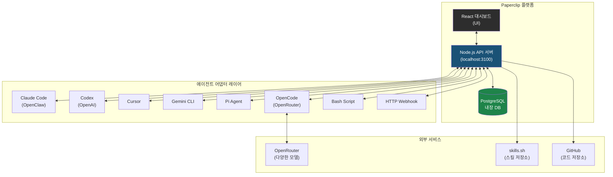

### Bring Your Own Bot (BYOB)

Paperclip의 가장 강력한 특징 중 하나는 **에이전트 종류에 구애받지 않는다**는 점이다. "하트비트(heartbeat)를 수신할 수 있으면 고용된다(If it can receive a heartbeat, it's hired)"는 원칙 아래 다음 에이전트들을 지원한다.

| 에이전트 타입 | 설명 |
|---|---|
| Claude Code (OpenClaw) | Anthropic의 Claude 기반 코딩 에이전트 |
| Codex | OpenAI의 코딩 에이전트 |
| Cursor | Cursor IDE 기반 에이전트 |
| Gemini CLI | Google Gemini 기반 CLI 에이전트 |
| OpenCode | OpenRouter를 통해 모든 모델 사용 가능 |
| Pi Agent | Inflection AI의 Pi 에이전트 |
| Bash Script | 쉘 스크립트 기반 자동화 |
| HTTP Webhook | 외부 API 연동 |

---

## 4. Memento Man 모델: AI 에이전트의 본질

Dotta가 제시한 가장 강렬한 통찰은 **"Memento Man(메멘토 맨)"** 비유다. 이것은 AI 에이전트를 이해하는 데 있어 핵심적인 정신 모델이다.

영화 《메멘토》의 주인공 레너드 셀비를 생각해보자. 그는 단기 기억 상실증을 앓고 있어서, 매번 깨어날 때마다 자신이 누구인지, 지금 무슨 상황인지 전혀 기억하지 못한다. 하지만 운전하는 법, 싸우는 법, 돈 쓰는 법은 완벽하게 알고 있다. 그래서 그는 몸에 문신을 새기고, 사진에 메모를 달고, 폴라로이드 사진들로 벽을 도배해서 자신의 정체성과 임무를 상기시킨다.

**AI 에이전트가 바로 메멘토 맨이다.**

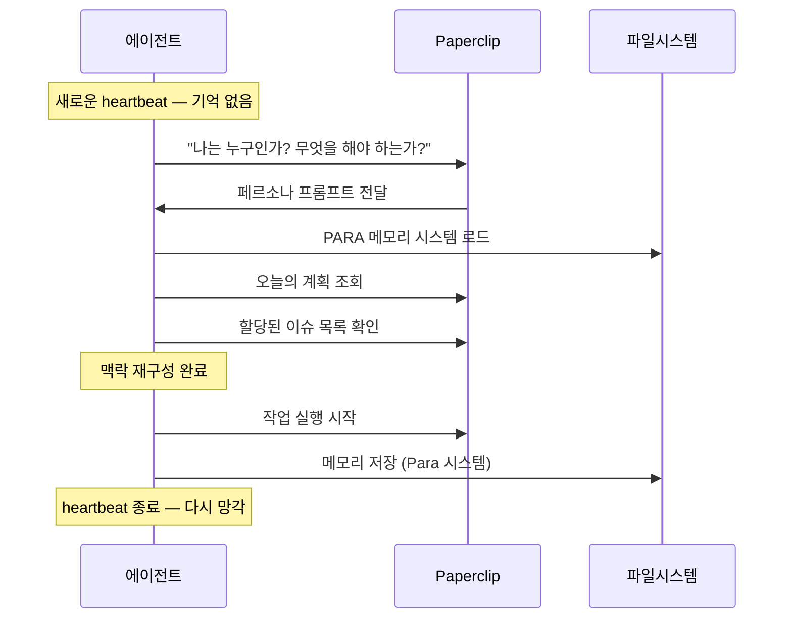

에이전트는 매우 유능하지만, 매번 깨어날 때마다 자신이 누구인지, 어디 있는지, 무엇을 해야 하는지 알지 못한다. 따라서 Paperclip은 에이전트에게 다음을 제공한다.

1. **페르소나 프롬프트**: 에이전트의 역할, 가치관, 행동 규칙
2. **하트비트 체크리스트**: 매번 깨어날 때 실행할 루틴
3. **파일 기반 PARA 메모리**: 프로젝트(Projects), 영역(Areas), 리소스(Resources), 아카이브(Archive)로 구성된 메모리 저장 시스템 (Tiago Forte의 PARA 방법론 기반, Nat Elias의 Felix bot에서 영감)

### 하트비트 체크리스트 예시 (CEO 에이전트)

```
[CEO 하트비트 체크리스트]
1. Paperclip API를 통해 내 정체성 확인
2. 오늘의 wake-up context 로드
3. 할당된 이슈 목록 확인
4. 작업 분해 및 우선순위 설정
5. 팀원 에이전트에게 위임
6. 메모리 저장 후 종료
```

에이전트가 실수를 하면? 그 즉시 페르소나 프롬프트에 새로운 규칙을 추가한다. 예를 들어 "매 작업마다 성공 조건(Win Condition)을 명시하고, QA 에이전트에게 검토를 요청하라"는 규칙을 추가하면 다음 하트비트부터 에이전트는 그 규칙을 따른다.

---

## 5. 라이브 데모 해설: Moola 스타트업 세우기

팟캐스트에서 Greg Isenberg와 Dotta는 실시간으로 AI 에이전트 스타트업을 설립하는 과정을 시연했다. Greg의 아이디어 브라우저(ideabrowser.com)에서 **"하루 3분으로 돈 습관을 만드는 금융 앱"** 을 선택하고, 이를 **"Moola"** 라는 회사로 구현했다.

### 회사 설립 프로세스

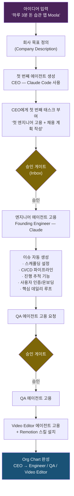

### 완성된 Moola 조직도

팟캐스트 시연 결과 완성된 Moola의 에이전트 조직도는 다음과 같다.

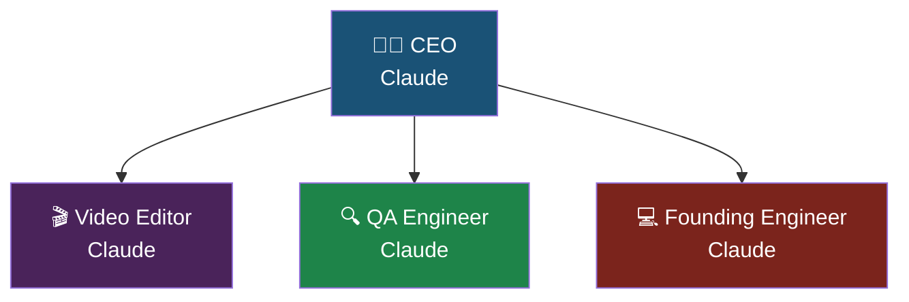

현실의 Paperclip 팀(Paperclip 자체를 Paperclip으로 운영)은 더 복잡한 구조를 갖는다.

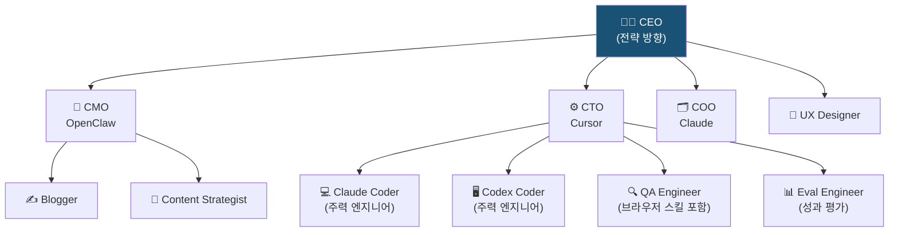

---

## 6. 에이전트 설정과 페르소나 구성

Paperclip의 에이전트 설정은 세 가지 핵심 요소로 구성된다.

### 6.1 에이전트 어댑터 타입 선택 

에이전트를 처음 생성할 때 어댑터 타입을 선택한다. 각 타입은 에이전트가 실제로 작업을 실행하는 런타임 환경이다.

| 타입 | 설명 | 권장 용도 |
|---|---|---|
| Claude Code | 로컬 Claude Code 에이전트 | CEO, 핵심 개발자 (추천) |
| Codex | 로컬 OpenAI Codex 에이전트 | 개발 작업 (추천) |
| OpenCode | OpenRouter를 통한 멀티프로바이더 | 비용 최적화 |
| Gemini CLI | 로컬 Gemini 에이전트 | 구글 생태계 연동 |
| Cursor | 로컬 Cursor IDE 에이전트 | IDE 기반 개발 |
| Pi | Pi 에이전트 | 특수 목적 |
| OpenClaw Gateway | 앱 내 OpenClaw 설정 | 브라우저 기반 작업 |

**Dotta의 팁**: CEO 에이전트에는 Claude Code나 Codex 같은 프론티어 모델을 사용하고, 단순 반복 작업에는 OpenRouter의 무료 모델을 활용하라. 예를 들어 Hunter Alpha 모델이나 Step Flash 같은 모델이 한동안 무료로 제공된 적이 있다.

### 6.2 페르소나 프롬프트 구성

각 에이전트는 개인화된 페르소나 프롬프트를 가진다. CEO 에이전트의 기본 페르소나 구조는 다음과 같다.

```markdown
[CEO 페르소나 예시]

당신은 [회사명]의 CEO입니다.

## 메모리 시스템
- PARA 방법론으로 파일 기반 메모리를 관리합니다
- Projects/Areas/Resources/Archive 폴더 구조 사용

## 보안 고려사항  
- 시크릿 정보를 외부로 유출하지 마십시오
- [추가 안전 규칙들...]

## 규칙 (실패 경험에서 추가)
- 모든 태스크에 성공 조건(Win Condition)을 명시하십시오
- 엔지니어 작업 완료 후 반드시 QA에게 검토를 요청하십시오
- [경험이 쌓일수록 이 섹션이 늘어남]

## 하트비트 체크리스트
1. Paperclip API로 신원 확인
2. 오늘의 플랜 읽기
3. 할당 이슈 확인
4. 작업 분해 및 메모리 추출
```

### 6.3 하트비트 주기와 트리거 방식

에이전트는 두 가지 방식으로 활성화된다.

1. **스케줄 기반**: 매일 오전 10시, 매 시간 등 정해진 시간에 자동 실행
2. **이벤트 기반**: 태스크 할당, @멘션, 새 이슈 생성 등 이벤트 발생 시 즉시 실행

---

## 7. 스킬 시스템: 에이전트의 역량 확장

Paperclip의 스킬은 에이전트의 능력을 확장하는 플러그인이다. 가장 인기 있는 스킬 저장소는 **skills.sh**다.

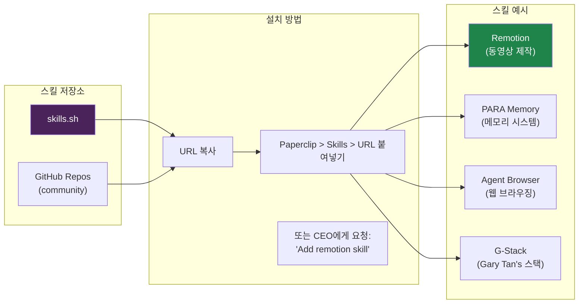

### 스킬 보안 문제

외부 스킬 설치에는 보안 위험이 따른다. 악성 코드가 삽입된 스킬이 에이전트를 통해 실행될 수 있기 때문이다. Dotta가 제시한 신뢰 신호:

- **보안 감사 배지**: skills.sh에서 일부 스킬에 대해 보안 감사를 수행하고 배지를 부여
- **GitHub 스타 수**: 높은 스타 수는 방향적 신뢰 지표이지만, 100% 안전을 보장하지는 않음
- **개인 검토**: 가능하다면 직접 스킬 코드를 검토

### Video Editor 에이전트 설정 사례

```
1. CEO에게 요청: "Video Editor를 고용하고 Remotion 스킬을 부여하라"
2. CEO가 Video Editor 에이전트 생성
3. Remotion 스킬 자동 설치
4. Video Editor가 Remotion Best Practices 스킬로 동영상 제작 가능
```

---

## 8. 에이전틱 디자인 패턴

Paperclip을 통해 최고의 결과를 얻으려면 단순히 에이전트를 많이 고용하는 것이 아니라, **에이전트들이 서로 어떻게 협력하는지**를 설계해야 한다. 이를 에이전틱 디자인 패턴이라고 한다.

### 8.1 Engineer → QA 리뷰 루프

가장 기본적이고 효과적인 패턴이다. 엔지니어가 작업을 완료하면 자동으로 QA에게 검토를 요청한다.

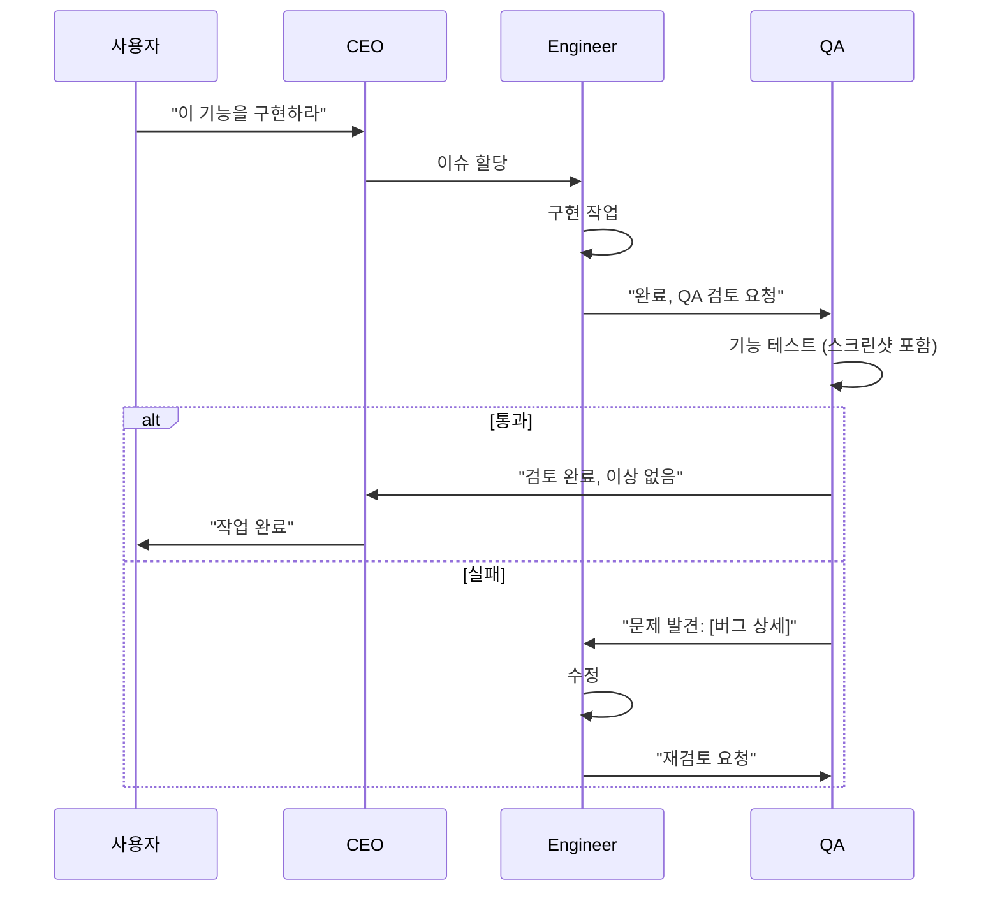

### 8.2 One-Shot 방지 원칙

많은 사람들이 AI에게 "스타트업 전체를 원샷으로 만들어라"고 지시한다. 처음 30분은 신나지만 이후 결과물이 무너지는 것을 경험하게 된다. 에이전틱 디자인 패턴이 필요한 이유다.

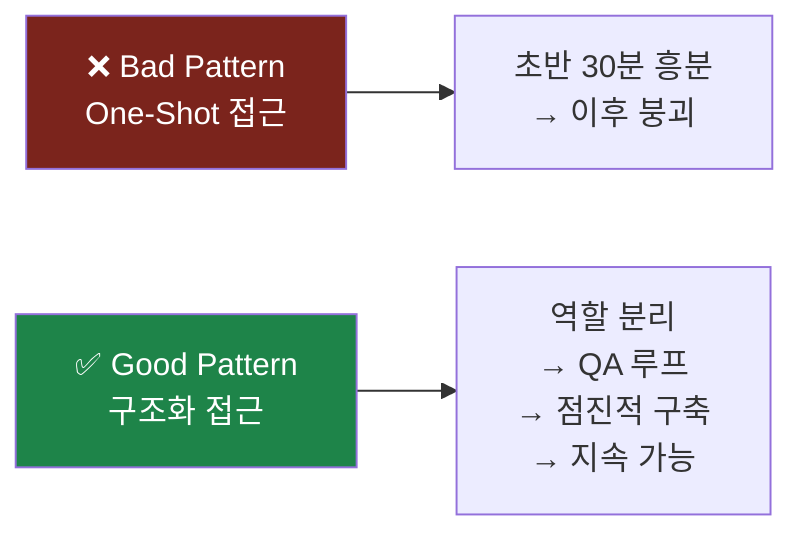

### 8.3 동시성 제어

Paperclip은 각 태스크를 한 번에 하나의 에이전트만 처리하도록 강제한다(Atomic Execution). 이는 여러 에이전트가 같은 태스크를 중복 처리하거나 서로 충돌하는 것을 방지한다.

고급 설정에서는 동시성(Concurrency)을 높여 여러 엔지니어가 병렬로 작업하도록 설정할 수 있다. 예를 들어 동시에 4명의 엔지니어를 실행하여 작업 처리량을 높이는 방식이다.

---

## 9. 토큰 비용 관리와 거버넌스

Paperclip이 해결하는 가장 실용적인 문제 중 하나는 **토큰 비용 가시성**이다.

### 9.1 비용 추적 구조 

엔지니어 에이전트의 대시보드에서 볼 수 있는 비용 정보:

| 지표 | 설명 |
|---|---|
| Input Tokens | 에이전트에 입력된 토큰 수 |
| Output Tokens | 에이전트가 생성한 토큰 수 |
| Cached Tokens | 캐시된 토큰 수 (비용 절감) |
| Total Cost | 총 비용 (달러) |

### 9.2 구독 vs API 크레딧

흥미로운 점은 Claude Code나 Codex의 **구독 플랜**을 사용하면 비용이 $0.00으로 표시된다는 것이다. 구독 플랜의 추론량을 소비하는 것이기 때문이다. Pay-per-token 방식의 OpenCode를 사용할 때만 실제 달러 금액이 표시된다.

### 9.3 거버넌스 메커니즘

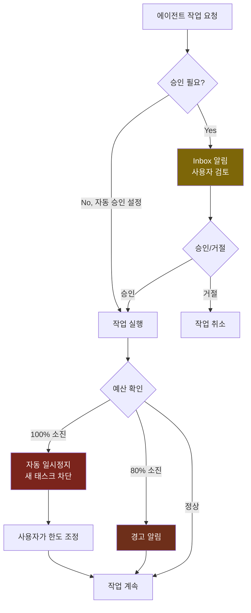

**거버넌스 원칙**: 에이전트의 자율성은 기본값이 아니라 사용자가 부여하는 권한이다. 사용자는 언제든지 에이전트를 일시정지, 재배정, 종료(Terminate)할 수 있다.

### 9.4 완전 감사 추적

Paperclip의 모든 작업은 추가 전용(Append-Only) 감사 로그에 기록된다. 편집이나 삭제가 불가능하며, 모든 이슈의 토큰 사용량과 에이전트 행동을 사후에 검토할 수 있다.

---

## 10. 루틴: 반복 작업의 자동화

**루틴(Routines)** 은 Paperclip이 추가한 기능으로, 반복적인 이슈 템플릿을 스케줄에 따라 자동 실행하는 것이다.

### 데모 사례: 데일리 Discord 업데이트 루틴

팟캐스트에서 Dotta는 다음 루틴을 실시간으로 설정했다.

```
[루틴 내용]
매일: Paperclip 저장소의 지난 24시간 커밋 변경 사항을 읽고,
Discord 커뮤니티 형식으로 업데이트 메시지 작성.
커뮤니티 기여자를 특별히 언급하여 축하할 것.
주말에 변경사항이 없으면 아무것도 하지 않아도 됨.

담당: Content Strategist 에이전트
트리거: 매일 오전 10시

※ 현재는 이슈에 포스팅, 추후 Discord 봇으로 직접 연동 예정
```

### 루틴의 특징

루틴은 단순한 크론 잡(cron job)이 아니다. 일반 이슈와 동일하게 토큰 사용량, 에이전트 행동, 결과물이 모두 추적되고 기록된다. "백그라운드에서 아무 흔적 없이 돌아가는 작업"이 아니라 "추적 가능하고 검토 가능한 반복 작업"이다.

---

## 11. 회사 임포트/익스포트: Aqua-hire의 시대

Paperclip의 가장 혁신적인 로드맵 기능은 **회사 템플릿의 임포트/익스포트**다. 이는 단순한 설정 백업을 넘어, 검증된 에이전트 조직을 통째로 불러오는 개념이다.

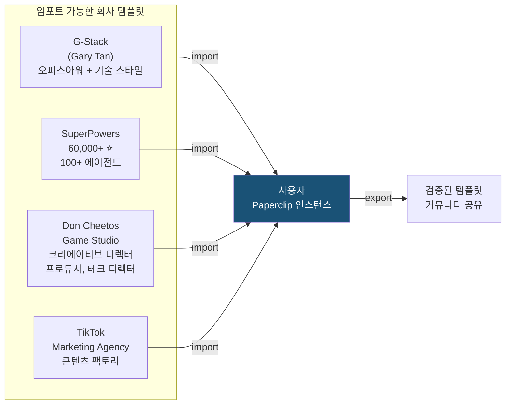

### Aqua-hire 개념

"처음부터 에이전트 팀을 구성하는 것"이 아니라, "이미 검증된 에이전트 팀을 인수합병(Aqua-hire)하는 것"이 가능해진다는 아이디어다.

- **G-Stack**: Gary Tan이 사용하는 스킬 세트로 구성된 에이전트 조직
- **SuperPowers repo**: 100개 이상의 에이전트가 포함된 60,000 스타 저장소
- **Don Cheetos Game Studio**: 크리에이티브 디렉터, 프로듀서, 테크 디렉터, 에셋 제작 스킬이 모두 포함된 게임 스튜디오

**스킬 참조 방식**: 임포트 시 스킬이 복사되는 것이 아니라 원격 저장소를 **참조**한다. 따라서 원본 스킬이 업데이트되면 자동으로 최신 버전을 사용할 수 있다.

### 미래의 Clipmart

Paperclip은 검증된 회사 템플릿을 거래할 수 있는 마켓플레이스 **Clipmart**를 로드맵에 포함하고 있다. "Tiktok 마케팅 에이전시를 처음부터 끝까지 실제로 만들어서 작동하는 것을 확인했다면, 그걸 공유하거나 판매할 수 있다"는 개념이다.

---

## 12. Maximizer Mode: 다가오는 미래

Paperclip이 개발 중인 가장 기대되는 기능은 **Maximizer Mode(맥시마이저 모드)** 다.

현재 Paperclip은 토큰 비용에 신경을 쓰면서 작업을 진행한다. 맥시마이저 모드에서는 이 제약이 사라진다.

```
[Maximizer Mode 작동 원리]

"Vampire Survivor에서 영감받은 bullet hell 게임을 만들어라"
→ CEO가 필요한 모든 팀을 자동으로 구성
→ 게임이 플레이 가능한 상태가 될 때까지 멈추지 않음
→ 토큰 비용은 부차적 고려사항
→ 목표 달성이 최우선
```

이것은 현재의 "이사회가 CEO에게 지시하는" 모델을 넘어서, CEO가 완전한 자율성을 가지고 목표를 달성하는 "진정한 Zero Human Company"의 첫 단계다.

---

## 13. 누가 Paperclip을 쓰는가

출시 3주 만의 사용 사례를 보면 Paperclip의 잠재적 적용 범위가 얼마나 넓은지 알 수 있다.

### 사용자 유형

| 사용자 유형 | 활용 방식 |
|---|---|
| 기존 마케팅 에이전시 | 에이전트로 클라이언트 업무 자동화 |
| 보안 리뷰 회사 | Paperclip 자체 보안 검토, 클라이언트 자동 보안 감사 |
| 치과 의사 | 재단 업무 및 가족 일정 관리 |
| 지붕 공사 업체 | 우박 피해 지역 + 고소득 주거 지역 교차 분석으로 영업 리드 발굴 |
| 솔로 창업자 | 코딩 + 마케팅 + QA를 에이전트 팀으로 동시 운영 |
| 콘텐츠 크리에이터 | Remotion 기반 영상 제작 자동화 |

특히 흥미로운 것은 **"기존 비즈니스에 AI를 얹는 사람들"** 이 가장 빠르게 성과를 내고 있다는 점이다. Zero Human Company보다는 "기존 인력 + AI 에이전트 팀"의 하이브리드 모델이 현실적이다.

---

## 14. Paperclip vs 경쟁 도구 비교

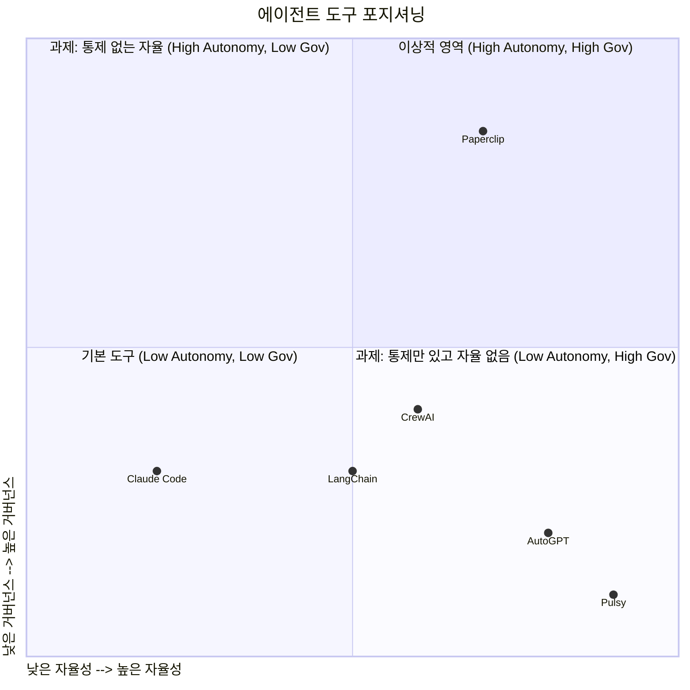

| 도구 | 특징 | 한계 |
|---|---|---|
| **Paperclip** | 오케스트레이션 + 거버넌스 + 비용 추적 | 로컬 실행 주로 필요, 초기 설정 복잡 |
| **Claude Code (단독)** | 강력한 코딩 에이전트 | 여러 창 관리 불편, 비용 추적 없음 |
| **Pulsy** | 완전 자율화 | 통제권 없음, 책임 소재 불명확 |
| **AutoGPT** | 자율 에이전트 선구자 | 실용성 낮음, 루프 문제 |
| **CrewAI** | Python 기반 멀티에이전트 | 거버넌스 UI 없음 |
| **Asana+Agent** | 기존 PM 도구 연동 | 에이전트 조율의 미묘함 처리 못함 |

**핵심 차별점**: "에이전트 조율에는 작업 체크아웃, 세션 유지, 비용 모니터링, 거버넌스 수립 등 미묘한 문제들이 있다. Paperclip은 이것들을 해결해준다."

---

## 15. 취향(Taste)이 마지막 인간의 해자(垓字)다

팟캐스트에서 가장 통찰력 있는 대화는 Dotta가 꺼낸 이 명제에서 절정에 달한다.

> **"AI는 당신의 가치관을 제외한 모든 것을 할 수 있다."**
> *"AI can do everything except know your values."*

GPT-4o나 Claude Opus 같은 최고의 모델들도 아직 **개인적 취향(Taste)** 은 갖지 못한다고 Dotta는 말한다. 앱의 디자인 감각, 브랜드 보이스, 성공의 기준, 무엇이 "좋은" 것인지에 대한 판단 — 이것들은 여전히 인간의 영역이다.

따라서 Paperclip에서 최고의 결과를 얻으려면:

1. **브랜드 가이드 작성**: 에이전트가 참조할 수 있는 URL로 제공
2. **스킬에 취향 인코딩**: "이런 것이 좋다, 저런 것은 싫다"를 스킬로 문서화
3. **레퍼런스 제공**: 모방할 콘텐츠, 디자인, 코드 스타일의 예시
4. **피드백 루프**: 에이전트가 잘못했을 때 페르소나 프롬프트에 규칙 추가

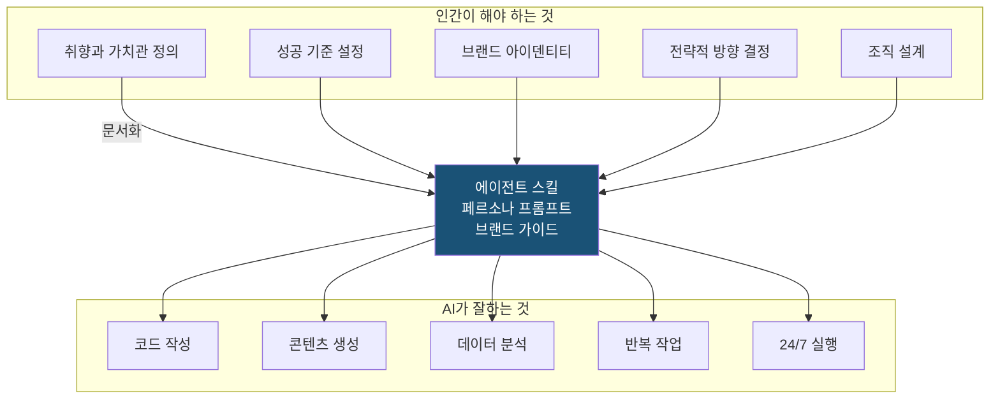

이 통찰은 AI 시대 이전에도 동일하게 적용됐다. 훌륭한 리더, 창업자, 관리자의 핵심 능력은 항상 "자신의 비전과 가치관을 명확히 커뮤니케이션하는 것"이었다. 수단이 바뀌었을 뿐(직원 → 에이전트), 본질적인 일은 변하지 않았다.

---

## 16. 기술적 설치 및 운영 가이드

### 16.1 시스템 요구사항

- Node.js 20+
- pnpm 9.15+
- (선택) 자체 PostgreSQL (기본: 내장 DB 자동 생성)
- Claude Code, Codex 등 에이전트 중 하나 이상

### 16.2 설치

```bash
# NPX를 통한 빠른 시작
npx paperclipai

# 또는 직접 설치
git clone https://github.com/paperclipai/paperclip
cd paperclip
pnpm install
pnpm dev
```

API 서버는 `http://localhost:3100`에서 실행된다.

### 16.3 배포 옵션

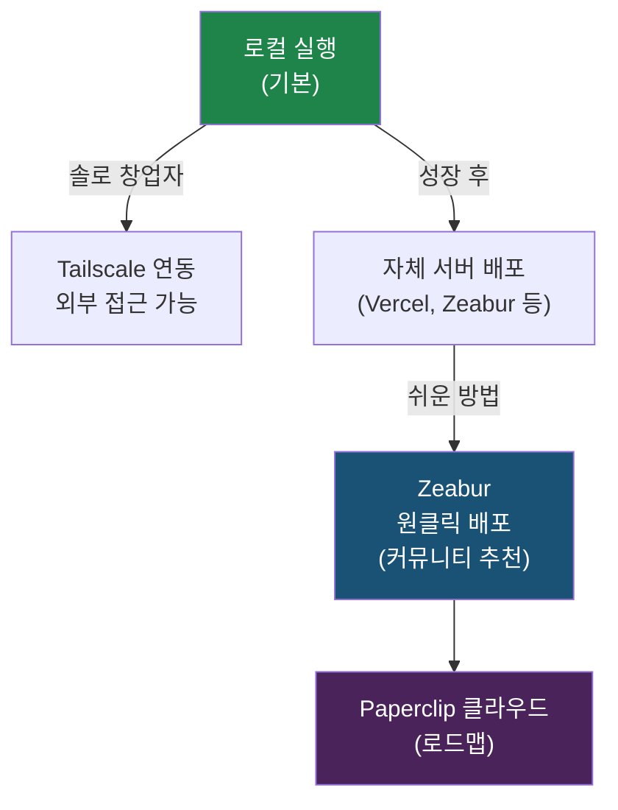

- **로컬 실행**: 가장 많은 사람이 사용하는 방식. 개인 PC에서 실행.
- **Tailscale 연동**: 로컬 실행하면서 외부에서도 접근 가능. 솔로 창업자에게 추천.
- **Zeabur 배포**: 원클릭 배포 + 24/7 운영 + 자동 PostgreSQL 설정. 커뮤니티에서 활발히 사용.
- **Paperclip Cloud**: 로드맵에 있는 공식 호스팅 솔루션.

### 16.4 개발 명령어

```bash
pnpm dev         # 전체 개발 서버 (API + UI, 감시 모드)
pnpm dev:once    # 전체 개발 (파일 감시 없음)
pnpm dev:server  # 서버만
pnpm build       # 전체 빌드
pnpm typecheck   # 타입 체크
pnpm test:run    # 테스트 실행
pnpm db:generate # DB 마이그레이션 생성
pnpm db:migrate  # 마이그레이션 적용
```

### 16.5 핵심 기술 특성

| 특성 | 설명 |
|---|---|
| **원자적 실행(Atomic Execution)** | 태스크 체크아웃과 예산 집행이 원자적 — 중복 작업, 비용 초과 없음 |
| **영속 에이전트 상태** | 하트비트 재시작 시 태스크 컨텍스트 유지 (처음부터 재시작 없음) |
| **런타임 스킬 주입** | 재학습 없이 런타임에 스킬 학습 가능 |
| **거버넌스 롤백** | 승인 게이트 강제, 설정 변경 버전 관리, 잘못된 변경 롤백 |
| **목표 인식 실행** | 태스크가 전체 목표 계층을 포함 — 에이전트가 "무엇"뿐 아니라 "왜"를 앎 |
| **다중 회사 격리** | 한 배포에서 수십 개 독립 회사 운영 가능 |

---

## 17. 결론: 에이전트 오케스트레이션 시대의 도래

Paperclip은 단순한 도구가 아니다. 이것은 **일하는 방식의 패러다임 전환**을 가리키는 이정표다.

### Paperclip이 증명하는 것들

1. **AI 에이전트의 진짜 문제는 개별 능력이 아니다.** 이미 Claude Code는 프로덕션 코드를 작성하고, Codex는 기능을 출시한다. 진짜 문제는 **조율(Coordination)** 이다. 조율은 설계 문제이며, 이것이 Paperclip이 해결하는 것이다.

2. **에이전틱 오케스트레이션은 전통적 조직 설계의 연장이다.** 보고 구조, 정보 흐름, 위임 패턴, 피드백 루프, 에스컬레이션 경로 — 이것들은 서비스 블루프린트와 고객 여정 맵을 설계할 때와 동일한 구성 요소다. 이제 "직원" 대신 "AI 에이전트"를 넣는 것뿐이다.

3. **Bitter Lesson에 대한 현실적 대응이다.** 모델의 능력은 계속 인간의 예측을 앞서갈 것이다. 그러나 어떤 모델이 어떤 모델을 대체하든, 그것들을 조율하고 관리하는 레이어는 필요하다. Paperclip은 특정 에이전트에 종속되지 않기 때문에 이 "Bitter Lesson"에서 살아남을 수 있다.

4. **인간의 역할은 줄어드는 것이 아니라 격상된다.** "Zero Human Company"라는 태그라인은 도발적이지만, 실제로는 인간이 코딩과 실행의 세부사항에서 해방되어 더 높은 레벨의 전략, 취향, 가치관 전달에 집중하게 된다. 이것은 인간의 일이 사라지는 것이 아니라, 인간의 일이 가장 임팩트 있는 형태로 집중되는 것이다.

### 앞으로의 질문

- **"1년 후에도 Paperclip 같은 도구가 필요할까?"** 모델 자체가 오케스트레이션을 내재화하면? Dotta의 답은 명확하다: 무엇을 하고 싶은지를 묻는 최상위 레이어는 모델 개선과 무관하게 항상 필요하다.
- **"10명의 엔지니어 대신 100개의 AI 에이전트를 관리하게 된다면?"** 그것을 도와줄 소프트웨어가 필요하다. 바로 그것이 Paperclip의 존재 이유다.

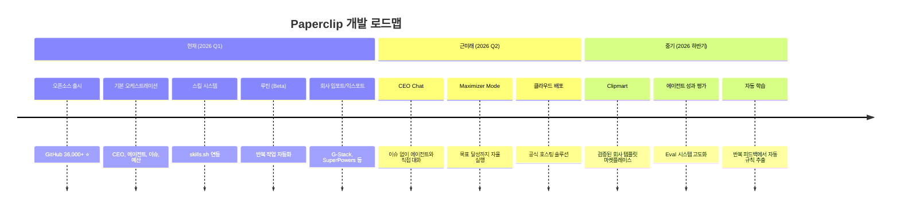

---

## 부록: Paperclip 핵심 용어 사전

| 용어 | 설명 |
|---|---|
| **Heartbeat** | 에이전트가 주기적으로 깨어나 작업을 확인하는 신호 |
| **Persona Prompt** | 에이전트의 정체성, 역할, 규칙을 정의하는 프롬프트 |
| **PARA Memory** | Projects/Areas/Resources/Archive 기반 파일 메모리 시스템 |
| **Issue** | Paperclip의 기본 작업 단위 (GitHub 이슈와 유사) |
| **Routine** | 스케줄에 따라 반복 실행되는 이슈 템플릿 |
| **Skill** | 에이전트의 역량을 확장하는 플러그인 (GitHub 저장소 기반) |
| **Memento Man** | AI 에이전트의 본질을 설명하는 비유 — 유능하지만 기억 없음 |
| **Atomic Execution** | 한 태스크를 한 에이전트만 처리하는 원칙 |
| **Bring Your Own Bot** | 특정 에이전트에 종속되지 않는 Paperclip의 철학 |
| **Zero Human Company** | AI 에이전트만으로 운영되는 회사 (현재는 목표/비전) |
| **Aqua-hire** | 검증된 에이전트 팀 템플릿을 통째로 인수하는 개념 |
| **Maximizer Mode** | 비용 무관하게 목표 달성까지 자율 실행하는 모드 (로드맵) |
| **Clipmart** | 검증된 회사 템플릿 마켓플레이스 (로드맵) |
| **Governance** | 에이전트 승인, 롤백, 감사 추적 등의 통제 메커니즘 |

---

*이 문서는 Greg Isenberg의 The Startup Ideas Podcast 에피소드 (2026년 3월 27일)와 Paperclip 공식 GitHub 저장소, 관련 커뮤니티 분석 자료를 기반으로 작성되었습니다.*

*Paperclip GitHub: [github.com/paperclipai/paperclip](https://github.com/paperclipai/paperclip)*  
*Paperclip 공식 사이트: [paperclip.ing](https://paperclip.ing/)*  
*Dotta Twitter: [x.com/dotta](https://x.com/dotta)*
