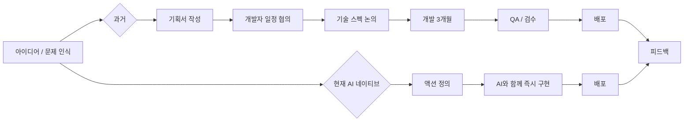
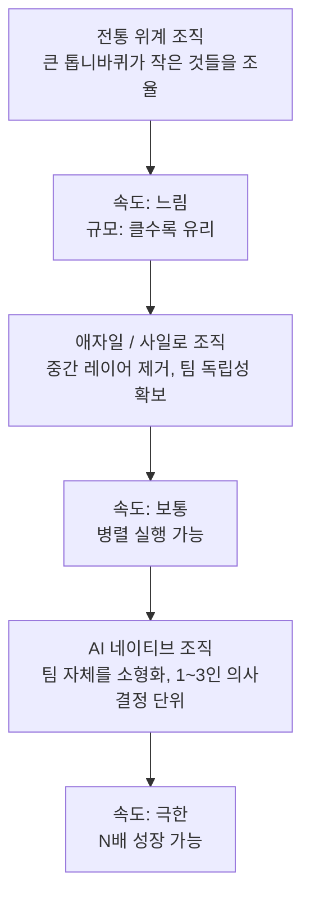
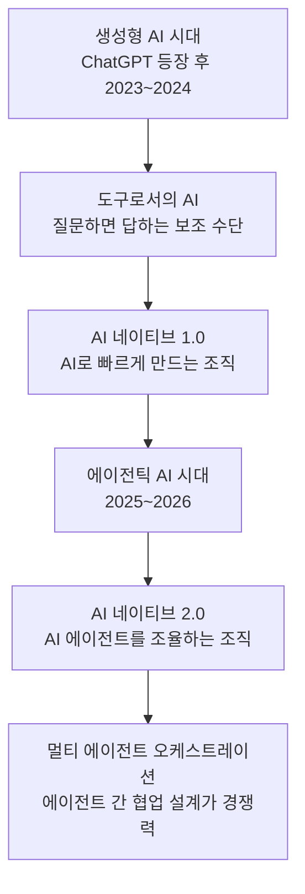

### — 슬로건이 아닌 생존 전략으로서의 AI 네이티브를 다시 읽는다

> 원문: [Brunch @jiyo — AI 네이티브를 외치는 조직](https://brunch.co.kr/@103ab3ed4f1f4f6/94)  
> 작성일: 2026년 3월 29일  
> 분류: AI 조직론 / 실무 전략 / 생존 전략

---

## 들어가며 — 유행어가 된 슬로건, 그 이면의 진짜 이유

"우리 조직도 AI 네이티브로 가야 합니다."

회의실에서, 사내 공지에서, 전략 발표 자리에서 이 문장을 들어보지 못한 사람은 아마 없을 것이다. 2023년 ChatGPT의 등장 이후 불과 2년이 채 되지 않아, AI 네이티브라는 개념은 거의 모든 조직의 핵심 키워드가 되어버렸다. 문제는 이 단어를 외치는 사람의 수와, 그 단어가 실제로 무엇을 의미하는지 이해하는 사람의 수 사이에 엄청난 간극이 존재한다는 점이다.

이 글은 그 간극을 직시하는 데서 출발한다. 조직이 AI 네이티브를 외치는 이유는 단 하나다. **돈이다.** 속도가 곧 수익이고, N배의 성장이 오늘의 더 큰 이익을 만들어 낸다는 단순하고도 냉정한 경제적 논리. 그런데 실무자들은 그 논리를 정확히 이해하지 못한 채, 유행어처럼 따라 외치는 경우가 너무 많다. 생존 전략이 아니라 슬로건으로 소비되는 것이다.

이 글은 그 이유를 가능한 한 명확하게 풀어내고자 한다. AI 네이티브가 왜 필요한지, 그것이 실제로 무엇을 의미하는지, 그리고 입으로만 외치는 것과 진짜 하는 것 사이에 어떤 차이가 있는지를 구체적으로 서술한다.

---

## 1장. 구현의 제약이 사라진 세계 — AI가 바꾼 본질

AI가 세상에 가져온 변화 중 가장 핵심적인 것은, 생각보다 눈에 잘 띄지 않는 곳에 있다. 그것은 화려한 이미지 생성도, 인간을 능가하는 언어 능력도 아니다. 진짜 핵심은 단 하나다. **기능을 구현하는 데 걸리는 시간과 비용이 거의 사라졌다.**

예전에는 "이 기능 만들려면 3개월이요"라는 대답이 합리적이었다. 그 3개월은 개발자가 필요하고, 기획서가 필요하고, QA가 필요하고, 릴리즈 파이프라인이 필요한 전체 프로세스를 포함한 말이었다. "리소스 상 다음 분기에요"라는 판단은 정당한 것이었다. 구현 자체가 병목이었으니까.

지금은 다르다. 2026년 현재, 누구든 만들 수 있다. 누구든 자동화할 수 있다. GitHub에 따르면 2025년은 소프트웨어 개발 활동이 사상 최고치를 기록한 해였는데, 매달 평균 4,320만 건의 풀 리퀘스트가 병합되어 전년 대비 23%가 증가했고 커밋 수도 10억 건으로 25%가 늘었다. 이 성장의 상당 부분은 AI가 코드 작성, 검토, 유지보수 전 과정에 개입했기 때문이다. 기능을 만들어내는 주체가 '전문 개발자'에서 '생각하는 사람'으로 이동한 것이다.

이 변화가 조직에 가져오는 함의는 엄청나다. 과거에 존재했던 병목, 즉 "이 아이디어를 실행 가능한 제품으로 만드는 데 필요한 기술적 역량"이라는 장벽이 낮아지거나 사라졌다. 그 결과, 조직 내 아이디어와 실행 사이의 거리가 급격히 줄어든다.

회의하고, 커뮤니케이션하고, 싱크를 맞추고, 기술 스펙을 논의하고, 합의하는 이 모든 과정이 줄어든다고 생각해 보자. 누군가 생각한다. 오늘 필요한 액션을 정의한다. 바로 실행한다. 끝. 유저들이 일주일, 이주일 단위로 받던 업데이트를 매일, 시간 단위로 받을 수 있게 된다. 거기에 내가 하던 반복 업무를 자동화까지 더한다. 내 워크플로를 내가 제일 잘 아니까, AI를 통해 내 손으로 직접 자동화할 수 있다.

이것이 AI 네이티브를 외치는 첫 번째 이유다. **속도.** 그리고 그 속도는 단순히 빠른 것이 아니라, 구현의 제약이 사라진 세계에서 비로소 가능해진 질적으로 다른 종류의 속도다.

---

## 2장. 속도가 왜 돈인가 — BEP의 논리와 시장의 격차

속도가 돈이라는 말은 추상적으로 들릴 수 있다. 그러나 이것을 구체적인 숫자로 풀어보면 이야기는 달라진다.

각자의 연봉을 12로 나누고, 그것을 다시 근무일수로 나누고, 다시 근무시간으로 나누면 시간당 비용이 나온다. 팀 전체에 곱하면, 오늘 하루의 비용이 나온다. 그 비용만큼의 가치를 만들어내지 못한 하루가 쌓일수록 BEP(손익분기점)는 올라간다. 아무리 매출이 생겨도 적자 구조를 벗어나기 어려운 순간이 온다. 월급이 통장에 꽂히니까 이걸 인지하기 쉽지 않다. 하지만 그 월급은 어딘가에서 매일 타고 있는 비용이다.

그런데 여기서 끝이 아니다. 시장은 오늘도 커지고 있다. 내일도. 모레도. 매일매일 격차가 벌어지고 있다. 글로벌 AI 투자 규모가 연간 50% 이상의 성장세를 기록하는 지금, 어딘가에서 누군가는 더 빠르게 움직이고 있다. 에이전틱 AI 시장은 2025년 약 2조 원 규모에서 2030년 61조 원으로 연평균 175% 성장이 전망되는 상황이다. 이 시장에서 느리다는 것은 단순히 성장이 더딘 것이 아니다. 매일 상대적으로 뒤처지고 있다는 것이다.

여기서 시간을 소비한다는 것, 속도가 느리다는 것은 이 시장에서 살아남겠다는 의지가 없는 것과 같다. 이것이 AI 네이티브를 외치는 두 번째 이유다. **생존.** 계속된 생존은 결국 성공을 뜻하기도 한다.

맥킨지가 2025년에 발표한 'AI의 현주소' 보고서에 따르면, 105개국 기업 종사자 1,993명을 대상으로 한 설문에서 88%가 한 개 이상의 비즈니스 기능에서 AI를 정기적으로 활용한다고 답했다. 2024년의 78%와 비교해 10%포인트가 증가한 수치다. 이것이 의미하는 것은, AI를 쓰는 것 자체는 이제 경쟁 우위가 아니라는 것이다. AI를 얼마나, 어떻게, 얼마나 깊이 활용하느냐가 차별화의 기준이 됐다.

---

## 3장. 조직 진화의 역사와 AI — 사일로에서 1인 팀으로

조직의 역사를 돌아보면, AI 네이티브가 왜 필연적인 다음 단계인지 더 명확하게 이해된다.

전통적인 위계 조직을 생각해 보자. 작은 톱니바퀴들이 모여서 돌아갔다. 사이사이에 큰 톱니바퀴, 즉 중간 관리자와 의사결정자가 있어서 작은 톱니바퀴들을 조율했다. 조직의 성장 속도는 큰 톱니바퀴가 얼마나 빨리 도느냐에 달려 있었다. 규모의 경제는 가능했지만, 속도의 경제는 구조적으로 어려웠다.

애자일이 등장했다. 그리고 사일로(Silo) 조직이 나왔다. 이 흐름의 본질은 전부 같다. **의사결정을 가장 빠르게, 가장 작은 단위로.** 사일로 조직은 중간 레이어를 잘라냈다. 더 많은 중간 규모의 톱니바퀴들이 생기고, 각각이 독립적으로 돌아갔다. 동시다발적으로 커지니까 단시간 내에 성장할 수 있었다.

AI는 이 진화의 다음 단계다. 사일로가 의사결정 단위를 팀 수준으로 작게 만들었다면, AI는 팀 단위 자체를 더 작게 만든다. 2명 팀. 3명 팀. 극단적으로는 1명 팀. 가트너는 2026년을 AI 네이티브 개발 플랫폼이 기업 경쟁력의 필수 요소로 자리 잡는 해로 규정하며, 이를 통해 소규모·민첩한 팀 중심의 개발이 가능해진다고 전망한다.

의견을 수렴하고, 조율하고, 정렬하는 커뮤니케이션 비용이 0에 수렴한다. 한 사람이 생각하고, AI가 구현하고, 바로 검증한다. 맞춰줄 사람이 줄어들수록 속도는 올라간다. 이것이 N배 성장이 가능해지는 구조다. 마이크로소프트의 케이스처럼, 소수 인원으로 구성된 팀도 AI의 지원을 통해 며칠 만에 글로벌 캠페인을 기획하고 실행할 수 있는 환경이 되는 것이다.

---

## 4장. "AI 오면 편해지는 거 아니에요?" — 불편한 진실

여기서 많은 사람이 가지는 오해를 직접 다뤄야 한다.

"AI가 다 해주니까 우리는 편해지겠다." "AI가 대체해 줄 테니 놀게 되겠다." 이런 말들은 틀리지 않을 수 있다. 먼 미래 어느 시점에는. 하지만 지금은 아니다.

솔직히 AI 세상이 오면서 사람만 더 피곤해졌다. 배워야 하는 것과 알아야 하는 것은 엄청나게 많아졌다. 이것은 단순히 도구 사용법을 익히는 것이 아니다. 사고 방식 자체가 바뀌어야 한다.

**프론트엔드 개발자를 예로 들어 보자.** AI가 코드를 짜주는 세상에서, 코드만 잘 짜는 사람의 가치는 내려간다. 이제 그들에게 필요한 것은 UI/UX가 어떻게 동작해야 하는지, 사람들의 심리는 어떤 건지, 사업은 어떻게 흘러가는지를 이해하는 능력이다. 비즈니스를 공부하기 시작하라는 신호다.

**PM, 기획자, 사업 담당자의 경우를 보자.** 요구사항을 정리해서 개발자에게 전달하면 끝이었던 세상은 지났다. 커뮤니케이션을 잘 하면 개발자들이 알아서 해줬던 시대는 끝났다. 본인 손으로 만들어내야 하는 세상이 온 것이다. 노코드, 로우코드 환경이 확장되면서 전문 개발자가 아니어도 에이전트를 직접 만들고 자동화할 수 있는 시대가 이미 시작됐다.

**공통적으로 요구되는 것은 논리적 사고다.** 이걸 왜 하는지 알아야 한다. 그것을 어떻게 구현하고 어떻게 풀어낼 수 있는지를 아는 사람이 살아남는 세상이다. AI는 도구다. 그 도구를 어떤 문제에, 어떤 방식으로, 어떤 목적으로 사용할지를 결정하는 인간의 판단력이 핵심 역량으로 부상한다.

이투데이가 분석한 대로, AI 네이티브 조직으로 전환하려면 새로운 문제를 만났을 때 가장 먼저 묻게 되는 질문이 바뀌어야 한다. "이 일은 이미 존재하는 AI 도구로 해결할 수 있는가?" 이 질문이 자연스럽게 나오지 않는 조직은, 아직 AI 네이티브가 아니다.

---

## 5장. "나만 아는 것"이라는 착각 — 개인 가치의 재정의

여기서 냉정하게 짚어야 할 부분이 있다.

AI에게 "너는 10년차 PM이야"라고 하면 한다. "너는 10년차 사업개발자야"라고 하면 한다. 경우에 따라서는 나보다 더 잘 할 수도 있다. 이것이 불편한 사실이다.

그렇다면 나의 가치는 무엇인가?

내가 알고 있는 것 자체가 아니다. **내가 알고 있는 것을 얼마나 효율적으로 만들어내서, 오늘의 생산성으로 뽑아내느냐.** 이것이 2026년 현재, 개인의 가치를 결정하는 기준이다.

내가 쌓아 온 것을 누군가가 침범해서 바꾸거나 무너뜨릴까 봐 경계심을 가지는 순간, 그것은 입으로만 AI 네이티브를 외치는 것이다. 기존과 다를 바가 없다. 내 영역을 지키는 데 에너지를 쓰는 사람은 AI 네이티브 팀에서 살아남지 못한다. 내 영역을 열고, 더 빠르게 더 많이 만들어내는 사람만 살아남는다.

이것은 역할에 대한 재정의이기도 하다. 딜로이트는 '테크 트렌드 2026' 보고서에서 에이전틱 엔터프라이즈(Agentic Enterprise)라는 개념을 제시하며, 이것이 단순히 새로운 솔루션을 추가하는 문제가 아니라 기업이 일하는 방식 전반을 다시 설계하는 일이라고 말한다. 업무 권한과 책임 구조, 데이터 접근 방식 등 조직 운영의 기본 체계가 재정비되는 것이다.

개인도 마찬가지다. 내가 가진 도메인 지식, 경험, 판단력은 유효하다. 하지만 그것이 AI와 결합되지 않는 한, 그 가치의 절반은 사라진다. 반대로, AI와 결합된다면 그 가치는 기하급수적으로 증폭된다. 이것이 역설이자 기회다.

---

## 6장. 경력직의 존재 이유가 바뀌었다 — 시니어의 새로운 미션

누구든 만들 수 있는 세상이 됐다. 주니어도 만든다. PM도 만든다. AI가 짜준다. 코드도, 문서도, 캠페인도, 분석 리포트도.

그렇다면 경력직, 특히 시니어는 무엇을 해야 하는가?

**빠르게 만들어진 것을 안정적인 구조로 만드는 것이다.** 누구든 만든 것이 무너지지 않게 하는 것이다. 이것이 시니어의 미션이다.

이 관점에서 시니어의 역할은 더 좁아진 것이 아니라, 더 명확해진 것이다. AI가 속도를 제공한다면, 시니어는 품질과 구조를 제공한다. AI가 빠르게 만들어낸 것들을 장기적으로 지속 가능하게 만드는 아키텍처적 판단, 시스템적 사고, 실패에서 배운 경험들이 핵심 자산이 된다.

반대로, 이 역할을 해내지 못한다면 어떻게 되는가? 퀄리티를 고려하지 않은 1~3년차와 생산성이 비슷해질 수 있다. AI가 코드를 짜주는 세상에서 경험의 가치가 오직 '더 빠르게 코드를 짜는 것'에만 있었다면, 그 차이는 사라진다. 경험의 가치는 이제 '더 좋은 판단을 내리는 것'에 있다.

가트너는 2026년의 핵심 경쟁력으로 설계자(The Architect), 융합자(The Synthesist), 선도자(The Vanguard)라는 세 가지 역할을 제시한다. 이 세 가지 모두 AI가 만들어낸 것들을 어떻게 조합하고, 평가하고, 방향을 잡을지를 아는 역량에 관한 것이다. 이것은 결국 경험과 판단의 이야기다.

---

## 7장. 수레에 바퀴 하나만 달지 마라 — 포맷 자체를 바꿔야 한다

바퀴가 발명됐다고 생각해 보자. 기존에 물건을 운반하던 것은 수레 같은 것이었다. 바퀴가 만들어졌으니 수레를 업그레이드해야 한다. 그런데 수레 한쪽에만 바퀴를 달면 동작할까? 안 된다. 기존 것도 안 되고, 새로운 것도 안 된다. 새 바퀴를 다 갈아 끼워야 한다.

지금 AI도 마찬가지다. **조직이 움직이는 방식, 일하는 포맷, 의사결정의 구조 — 통째로 바꿔야 한다.** 기존에 쌓아 온 지식과 경험은 유효하다. 하지만 포맷 자체를 바꾸지 않으면서 AI 네이티브하게 일하고 있다고 착각하면 안 된다.

이것이 '도입형 조직'과 'AI 네이티브 조직'의 차이다. 이투데이의 분석에 따르면, 이 두 조직의 차이는 단순한 도구 활용도나 효율의 문제가 아니라, 미래의 경쟁력이 어디에서 결정되는가에 대한 선택에 가깝다.

단순히 기능 하나에 AI를 붙여서 코드를 짜고 있다면, 이 수준으로는 AI 네이티브가 아니다. 일하는 방식 자체가 AI 위에 올라가야 한다. 포브스 코리아가 정리한 '에이전틱 엔터프라이즈'의 개념처럼, 데이터 구조와 IT 운영 모델이 AI에 최적화된 형태로 재구축될 때, 그것이 조직의 새로운 DNA처럼 자리 잡을 때, 비로소 AI 네이티브라고 부를 수 있다.

구체적으로 어떤 것들이 바뀌어야 하는가?

**의사결정 구조.** 기존에 5단계를 거쳐야 했던 의사결정이, AI 네이티브 팀에서는 1~2단계로 줄어들어야 한다. 그러기 위해서는 각 개인이 더 많은 자율성과 더 높은 책임감을 동시에 가져야 한다.

**업무 할당 방식.** "이 업무는 사람이 해야 한다"는 전제 자체를 의심해야 한다. AI로 먼저 해결할 수 있는지를 묻는 것이 기본이 되어야 한다. 적절한 도구가 없다면 직접 만들어보는 단계가 뒤따른다.

**측정 지표.** AI 도입의 성과를 어떻게 측정할 것인가도 바뀌어야 한다. "AI를 몇 번 사용했는가"가 아니라, "AI를 통해 우리의 BEP가 얼마나 개선됐는가", "Time-to-Market이 얼마나 단축됐는가"가 기준이 되어야 한다.

**조직 문화.** 가장 바꾸기 어렵고 가장 중요한 것이다. 내 영역을 방어하는 문화에서, 함께 더 빠르게 만들어내는 문화로. 이것이 바뀌지 않으면 나머지는 의미가 없다.

---

## 8장. 100등 보면서 안도하지 마라 — 진짜 경쟁자는 따로 있다

50~300인 규모의 중소·중견 기업들. 지금 되게 공격적으로 움직이고 있다. 이미 몇 달 전부터 개발 스펙 확인, 코드 리뷰, 의사결정 보조, 워크플로 자동화를 전방위적으로 AI로 처리하고 있다. 단순히 "AI 활용해서 코드 짜고 있다" 수준이 아니다.

목표가 무엇인가. 1등이 되겠다는 것 아닌가.

"우리도 AI 쓰고 있으니까 괜찮아"라고 말하는 순간, 그것은 100등을 보면서 안심하는 것이다. 1등이 되고 싶으면 1등이 뭘 하는지를 봐야 한다. 그리고 그 1등의 수준이 현재 우리 조직과 비교했을 때 10분의 1도 못 하고 있다면, 그 거리를 직시해야 한다.

이것은 자책을 위한 말이 아니다. 현재의 위치를 정확히 알아야 다음 방향이 보인다는 말이다.

CIO Korea의 2026 IT 전망 조사에서, AI 도입에 대한 해법으로 기업의 45.2%가 "AI 중심의 디지털 전환 가속화"를, 45.1%가 "IT 인재 역량 강화와 조직 문화 혁신"을 선택했다. 그런데 여전히 많은 기업에서 현업 부서의 AI 참여도가 낮다는 점이 함께 지적됐다. 이것이 바로 "입으로만 외치는 것"과 "진짜 하는 것"의 차이다. 전략 문서에 AI 네이티브가 적혀 있어도, 현업 실무자들이 매일 AI와 함께 일하지 않는다면 그것은 슬로건일 뿐이다.

---

## 9장. 2026년의 맥락 — 에이전틱 AI 시대와 AI 네이티브의 다음 단계

이 글이 쓰인 2026년의 맥락에서, AI 네이티브는 이미 새로운 국면으로 접어들고 있다.

생성형 AI가 "질문하면 답해주는" 수동적 도구였다면, 에이전틱 AI는 스스로 목표를 이해하고 계획을 세우며 실행까지 완수하는 자율적 문제 해결사다. SK AX의 분석에 따르면, 에이전틱 AI는 '목표-결과'를 직접 연결하는 자율성과 목표 지향성을 핵심으로 한다. 마케팅 영역에서는 "다음 주 캠페인 실행해"라는 한마디면 이메일 발송, SNS 광고 집행, 성과 분석까지 자동으로 처리할 수 있다. 개발 영역에서는 시스템 장애가 발생하면 AI가 코드 오류를 진단하고 수정하며 스스로 복구하는 식이다.

OpenAI는 GPT-5를 '에이전트 네이티브 모델'로 설계하며 외부 도구를 호출하고, 중간 결과를 평가하며, 다음 행동을 결정하는 능력을 모델 자체에 내장했다. Anthropic의 Claude는 실제 소프트웨어 UI를 인식하고 조작하는 컴퓨터 사용 기능을 이미 제공하고 있다. AI 기술의 중심축이 생성에서 행동으로 이동하고 있는 것이다.

이 흐름은 AI 네이티브 조직에 대한 요구 수준을 더 높인다. 이제는 AI를 활용해 더 빠르게 만드는 것만으로는 부족하다. AI 에이전트들을 어떻게 조율하고, 어떻게 신뢰하고, 어떻게 통제할 것인가가 새로운 역량으로 요구된다.

포브스 코리아가 정의한 '멀티 에이전트 오케스트레이션'이 2026년의 핵심 키워드다. "어떤 에이전트를 보유하는가"보다 "여러 에이전트가 어떻게 역할을 나누고 협력하도록 설계돼 있는가"에 경쟁력이 달려 있다. 이것은 기술 문제이기도 하지만, 조직 설계 문제이기도 하다.

---

## 10장. 입으로만 외치는 것과 진짜 하는 것의 차이 — 체크리스트

아래는 "우리 조직이 진짜 AI 네이티브인가"를 점검하는 기준이다. 이것은 체크리스트가 아니라, 스스로에게 던지는 질문들이다.

**제약을 먼저 말하는가, 방법을 먼저 찾는가?**
"이건 AI로 안 됩니다", "우리 시스템에는 맞지 않아요"가 첫 반응으로 나온다면, 아직 AI 네이티브가 아니다. "이걸 AI로 어떻게 해결할 수 있을까"가 첫 반응이 되어야 한다.

**영역을 지키려 하는가, 열려 하는가?**
내 도메인 지식을 공유하고, AI와 함께 더 빠르게 더 많이 만들어내는 방향으로 가고 있는가. 아니면 "그건 내 영역이니까"라는 방어적 태도를 취하고 있는가.

**포맷이 바뀌었는가, 도구만 추가됐는가?**
보고서 작성, 회의 방식, 의사결정 프로세스가 근본적으로 바뀌었는가. 아니면 기존 방식에 AI 도구 하나가 추가된 것인가.

**100등을 보고 있는가, 1등을 보고 있는가?**
"우리도 AI 쓰고 있어"라는 안도감이 어디에서 오는가. 정말 앞서가는 조직과 비교해서도 괜찮은 수준인가.

**오늘도 나태한 하루를 보냈는가?**
매일 타고 있는 비용을 인식하고 있는가. 그 비용만큼의 가치를 오늘 만들어냈는가.

이 질문들에 솔직하게 답할 수 있는 조직이, 그리고 개인이, 진짜 AI 네이티브를 향해 가고 있는 것이다.

---

## 결론 — 다시 처음으로, 그리고 다음으로

조직은 왜 자꾸 AI 네이티브를 외치는가.

속도 때문이다. 구현의 제약이 사라지면서, 생각에서 실행까지의 시간이 압도적으로 줄었다. 이 속도를 활용하지 못하는 조직은 매일 뒤처진다.

돈 때문이다. 매일 비용은 타고 있고, 느린 만큼 BEP는 올라간다. 글로벌 AI 투자가 연 50% 이상 폭발적으로 성장하는 이 시장에서, 느림은 곧 적자다.

성장 때문이다. 1~2명이 의사결정하고 바로 실행하는 구조가 4배, 10배의 성장을 가능하게 한다. 이것은 가능성이 아니라, 이미 일어나고 있는 현실이다.

생존 때문이다. 시장은 매일 벌어지고 있고, 여기서 멈추면 끝이다. AI 네이티브 문화는 기술보다 더 강력한 생산성의 기반이 되어가고 있다.

그런데 대부분의 조직은 이것을 입으로만 외치고 있다. 제약을 먼저 말하면서, 영역을 지키면서, 포맷은 그대로 두면서, 100등을 보면서 안도하면서, 나태한 날을 보내면서.

바꿔야 한다. 완전히, 통째로.

가트너가 2026년에 제시한 미래 조직 구성원의 역할 — 설계자, 융합자, 선도자 — 은 결국 AI가 만들어내는 것들을 어떻게 조합하고, 어떤 방향으로 이끌고, 어떤 판단을 내릴지를 아는 사람에 관한 이야기다. 코드를 짜는 사람이 아니라, 방향을 잡는 사람. 도구를 쓰는 사람이 아니라, 도구를 설계하는 사람. 지식을 쌓는 사람이 아니라, 지식을 실행으로 연결하는 사람.

AI 네이티브 조직의 하루는, 그런 사람들이 모여서 만들어진다.

---

## 부록 — AI 네이티브 조직으로 전환하기 위한 실천 가이드

### 개인 수준에서 시작할 수 있는 것들

**지금 당장의 반복 업무 하나를 자동화하라.** 내 워크플로를 내가 제일 잘 안다. 오늘 반복하고 있는 일 중 하나를 골라 AI로 자동화해 보자. 완벽하지 않아도 된다. 시작하는 것 자체가 중요하다.

**새로운 문제를 만났을 때 첫 번째 질문을 바꿔라.** "이걸 누구에게 부탁하지"가 아니라 "이걸 AI로 어떻게 해결할 수 있지"가 첫 반응이 되어야 한다.

**도메인 지식을 AI와 결합하는 연습을 하라.** 내가 가진 경험과 지식을 AI 프롬프트로 표현하는 능력이, 2026년의 핵심 역량이다.

### 팀 수준에서 변화해야 하는 것들

**의사결정 단계를 줄여라.** 5단계 승인이 필요한 것을 2단계로 줄이는 실험을 해라. AI가 만들어준 초안을 바로 검증하고 배포하는 사이클을 만들어라.

**성과 측정 기준을 바꿔라.** "AI 도입율"이 아니라 "Time-to-Market 단축율", "BEP 개선율"로 측정하라.

**서로의 영역을 열어라.** 개발자, PM, 사업 담당자가 서로의 AI 활용 방식을 공유하고, 함께 워크플로를 설계하는 시간을 만들어라.

### 조직 수준에서 재설계해야 하는 것들

**AI를 전제로 한 조직 구조를 설계하라.** 기존 역할 정의를 그대로 두면서 AI를 얹는 것이 아니라, AI를 전제로 역할 자체를 새로 정의하라.

**데이터와 지식의 흐름을 재구성하라.** AI가 효과적으로 작동하려면, 조직의 지식이 접근 가능하고 구조화된 형태로 존재해야 한다.

**실패를 허용하는 문화를 만들어라.** AI 네이티브 조직은 빠르게 만들고 빠르게 실패하고 빠르게 배우는 사이클을 전제로 한다.

---

*이 문서는 Brunch @jiyo의 원고를 바탕으로, 2026년 3월 기준 최신 AI 산업 동향 및 연구 자료를 추가하여 상세히 재구성한 것입니다.*

*참고 자료: SK AX 인사이트, 마이크로소프트 2026 AI 트렌드, 포브스 코리아 2026 AI 트렌드 TOP 7, 가트너 2026년 10대 전략 기술 트렌드, NIA 2026 AI 전망 보고서, CIO Korea 2026 IT 전망 조사, 딜로이트 테크 트렌드 2026, 이투데이 AI 네이티브 조직 전환 분석*
