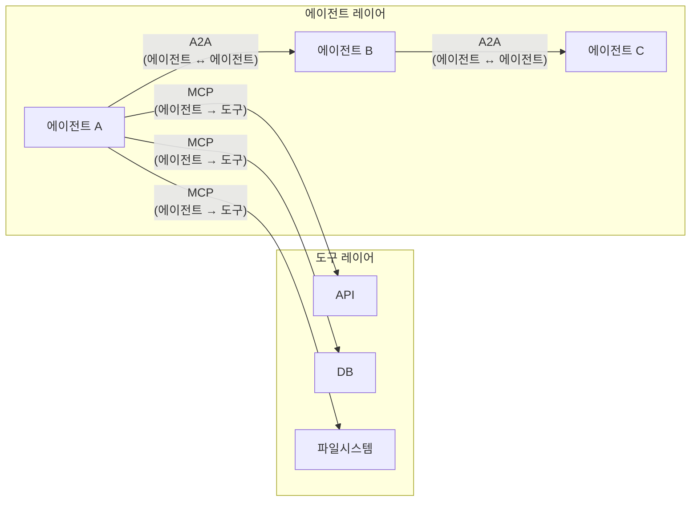
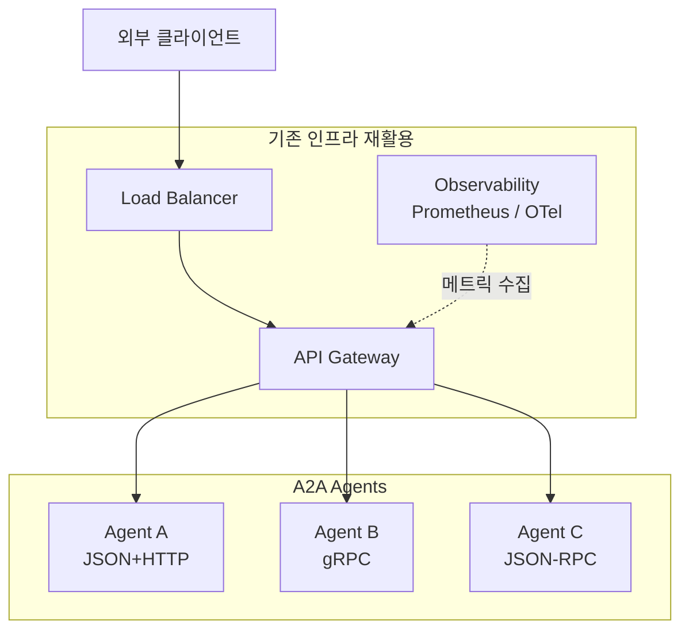
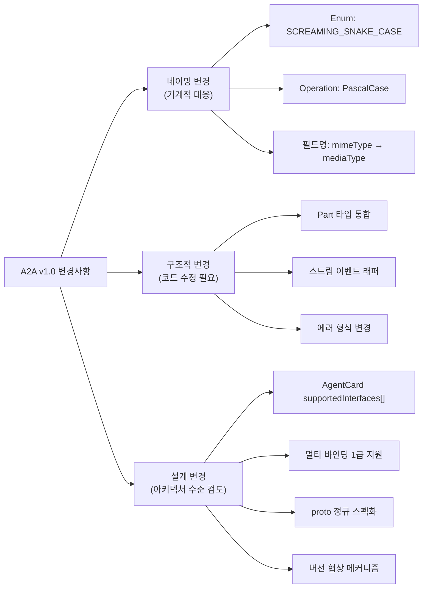
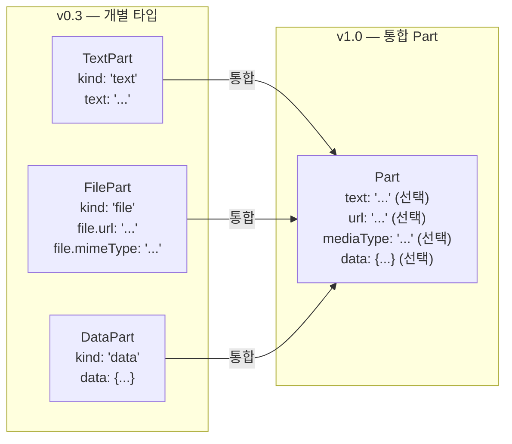
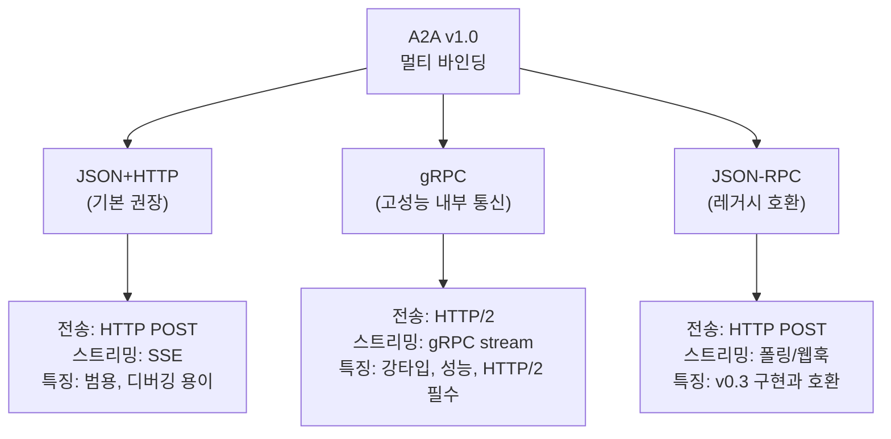
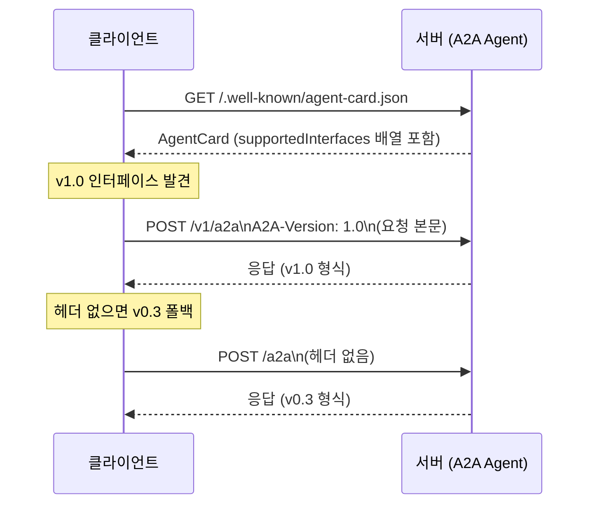
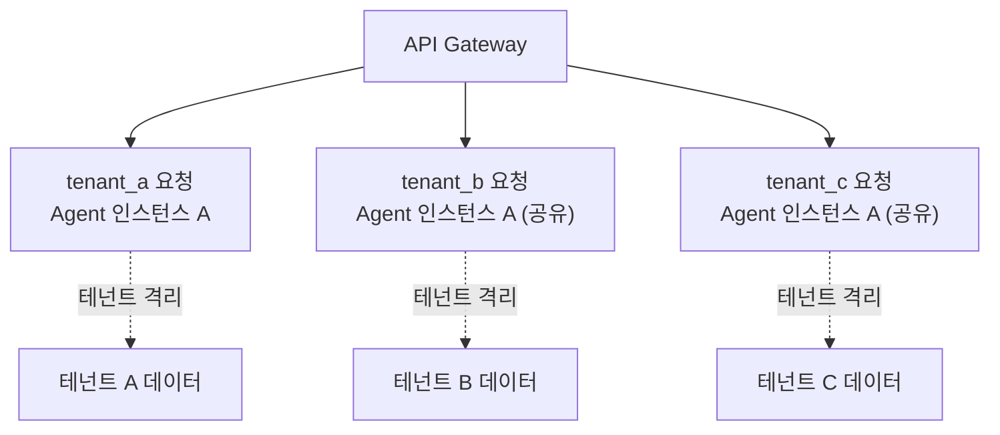
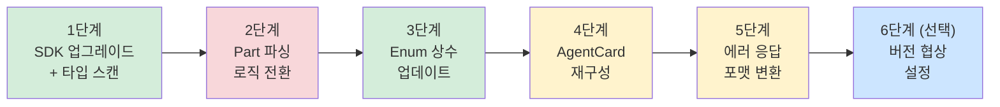
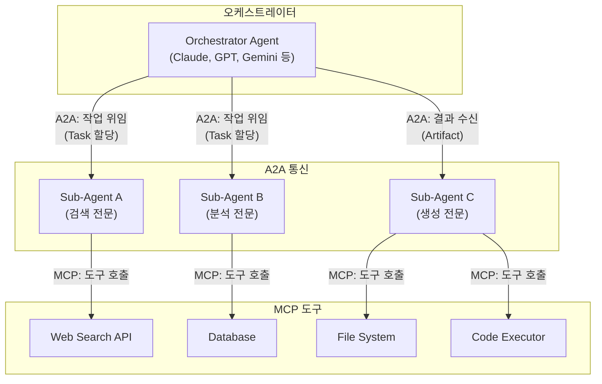

> **작성 기준**: 2026년 3월 31일  
> **참고 원문**: [neocode24 블로그 — A2A Protocol이 1.0이 되면서 바뀐 것들](https://blog.neocode24.com/blog/a2a-protocol-v1-spec-migration/)  
> **공식 스펙**: https://a2a-protocol.org/latest/specification/

---

## 목차

1. [A2A Protocol이란 무엇인가](#1-a2a-protocol이란-무엇인가)
2. [이미지 도식 상세 해설: 기존 인프라 재활용 아키텍처](#2-이미지-도식-상세-해설-기존-인프라-재활용-아키텍처)
3. [v1.0이 탄생한 배경: v0.3의 구조적 한계](#3-v10이-탄생한-배경-v03의-구조적-한계)
4. [v1.0 변경사항 분류 및 개요](#4-v10-변경사항-분류-및-개요)
5. [메시지 구조 변경: Enum, Part, Operations](#5-메시지-구조-변경-enum-part-operations)
6. [스트리밍 이벤트 판별 방식 변경](#6-스트리밍-이벤트-판별-방식-변경)
7. [아키텍처 변경: proto 정규 스펙화와 멀티 바인딩](#7-아키텍처-변경-proto-정규-스펙화와-멀티-바인딩)
8. [AgentCard 재설계](#8-agentcard-재설계)
9. [에러 처리 및 인증 변경](#9-에러-처리-및-인증-변경)
10. [v1.0 신규 기능: Multi-Tenancy, 서명, 타임스탬프](#10-v10-신규-기능-multi-tenancy-서명-타임스탬프)
11. [v0.3 → v1.0 마이그레이션 가이드](#11-v03--v10-마이그레이션-가이드)
12. [MCP와 A2A: 역할 분담의 완성](#12-mcp와-a2a-역할-분담의-완성)
13. [정리 및 결론](#13-정리-및-결론)

---

## 1. A2A Protocol이란 무엇인가

AI 에이전트 생태계는 단일 에이전트가 모든 일을 처리하는 구조에서, 여러 에이전트가 역할을 나누어 협업하는 멀티 에이전트 구조로 빠르게 전환되고 있다. 이 흐름은 마치 단일 서버로 모든 것을 처리하던 모놀리스(Monolith) 시대에서 마이크로서비스(Microservice) 시대로의 전환과 닮아있다.

문제는 에이전트마다 사용하는 프레임워크가 다르고, 내부 상태 관리 방식도 다르다는 점이다. LangChain으로 만든 에이전트와 AutoGen으로 만든 에이전트, CrewAI로 만든 에이전트가 서로 협업하려면 "공통 언어"가 필요하다. 이 공통 언어를 정의하는 것이 바로 **A2A(Agent-to-Agent) Protocol**이다.

A2A는 Google이 주도하고 있으며, 2025년 4월에 초안(draft)이 발표된 이후 약 1년 만인 **2026년 3월 12일에 v1.0.0이 릴리스**되었다. HTTP 기반의 표준 프로토콜로서, 에이전트가 자신의 능력을 **AgentCard**로 광고하고, 클라이언트가 이를 발견(discovery)하여 메시지를 주고받는 구조를 정의한다. 내부 구현이 무엇이든 A2A 인터페이스만 맞추면 상호운용이 가능하다는 것이 핵심 철학이다.

### A2A와 MCP의 관계

A2A를 이해하는 가장 빠른 방법은 MCP(Model Context Protocol)와의 관계를 파악하는 것이다.



MCP는 에이전트가 외부 도구(API, DB, 파일시스템)를 호출하는 표준이다. 반면 A2A는 에이전트끼리 대화하는 표준이다. 둘은 경쟁 관계가 아니라 보완 관계다. 흔히 쓰이는 비유로 표현하자면, "MCP가 에이전트의 손이라면, A2A는 에이전트의 입"이다. 손으로 도구를 집고, 입으로 동료와 소통한다.

---

## 2. 이미지 도식 상세 해설: 기존 인프라 재활용 아키텍처

이 문서의 시작에 첨부된 이미지는 A2A v1.0 아키텍처의 핵심 철학을 한 장으로 압축한 다이어그램이다. 이 도식을 완전히 이해하면 A2A v1.0의 설계 의도가 명확해진다.

### 도식의 구조 분석

도식은 크게 두 개의 영역(박스)으로 구성되어 있다.

**첫 번째 영역: 기존 인프라 재활용**

상단 노란색 박스는 "기존 인프라 재활용"이라는 레이블을 달고 있으며, 다음 세 컴포넌트를 포함한다.

- **Load Balancer**: 외부에서 들어오는 트래픽을 수신하여 API Gateway로 분산하는 역할을 담당한다. 에이전트 시스템이라고 해서 특별한 로드밸런서가 필요하지 않다. 기존에 웹 서비스에서 사용하던 Nginx, HAProxy, AWS ALB 등을 그대로 쓸 수 있다.

- **Observability (Prometheus / OTel)**: 메트릭 수집 및 관측 도구다. 도식에서 점선 화살표로 API Gateway와 연결되어 있으며, "메트릭 수집"이라는 레이블이 붙어 있다. Prometheus와 OpenTelemetry(OTel)는 현재 클라우드 네이티브 관측성의 사실상 표준(de facto standard)으로 자리잡고 있다. A2A 에이전트 시스템도 이 도구들을 그대로 활용할 수 있다.

- **API Gateway**: 중앙 허브 역할을 한다. 로드밸런서로부터 트래픽을 받고, 그것을 적절한 에이전트로 라우팅한다. 인증, 속도 제한(rate limiting), 요청/응답 변환 등 API Gateway가 제공하는 모든 기능을 에이전트 통신에도 그대로 적용할 수 있다.

**두 번째 영역: A2A Agents**

하단 노란색 박스는 "A2A Agents"라는 레이블을 달고 있으며, API Gateway로부터 각각 독립적으로 연결된 세 에이전트를 포함한다.

- **Agent A (JSON+HTTP)**: JSON을 페이로드로 사용하고 HTTP POST 방식으로 통신하는 에이전트다. 가장 범용적이고 디버깅이 쉬운 바인딩 방식이다.
- **Agent B (gRPC)**: Google이 만든 고성능 RPC 프레임워크인 gRPC를 사용하는 에이전트다. HTTP/2 기반으로 동작하며, 타입 안전성과 성능이 뛰어나 마이크로서비스 내부 통신에 적합하다.
- **Agent C (JSON-RPC)**: JSON-RPC 방식의 에이전트다. v0.3과의 하위 호환성을 유지하기 위한 레거시 지원 방식으로도 활용된다.

### 도식이 전달하는 핵심 메시지

이 도식의 핵심은 도식 하단 텍스트에 명시된 설계 철학에 있다:

> "아키텍처 철학은 **Stateless, Layered Architecture**를 지향한다. 기존 웹 인프라(로드밸런서, API Gateway, 관측성 도구)를 에이전트 시스템에 그대로 적용할 수 있다."

이것은 A2A를 도입하기 위해 인프라를 처음부터 다시 구축할 필요가 없다는 의미다. 이미 웹 서비스 운영에서 검증된 인프라 패턴—로드밸런서로 트래픽을 분산하고, API Gateway에서 인증/라우팅을 처리하며, Prometheus/OTel로 관측성을 확보하는 구조—을 에이전트 시스템에도 그대로 적용할 수 있다.

**Stateless** 설계를 지향한다는 것은, 각 에이전트가 요청 간 상태를 자체적으로 보유하지 않도록 설계되어 수평 확장(horizontal scaling)이 용이함을 의미한다. 각 에이전트 인스턴스는 동일하게 동작하므로, 로드밸런서가 어느 인스턴스로 요청을 보내도 일관된 결과를 얻을 수 있다.

**Layered Architecture**는 각 계층이 독립적으로 진화할 수 있음을 의미한다. 에이전트의 내부 로직을 바꾸더라도 API Gateway 설정을 건드릴 필요가 없고, 관측 도구를 교체하더라도 에이전트 코드를 수정할 필요가 없다.

Mermaid로 도식을 재현하면 다음과 같다:



---

## 3. v1.0이 탄생한 배경: v0.3의 구조적 한계

v1.0을 제대로 이해하기 위해서는 이전 버전인 v0.3이 무엇을 해결하지 못했는지를 먼저 이해해야 한다.

v0.3까지의 A2A는 **JSON-RPC 단일 바인딩**에 의존했다. JSON-RPC는 JSON 형식으로 원격 함수를 호출하는 프로토콜로, 구현이 단순하고 디버깅이 쉽다는 장점이 있지만, 멀티 에이전트 환경에서 요구되는 다양한 통신 패턴을 수용하기에는 한계가 있었다.

**첫째**, 고성능이 필요한 마이크로서비스 내부 에이전트 통신에서 gRPC의 타입 안전성과 HTTP/2 스트리밍 성능을 활용하려면 스펙 외부에서 별도로 처리해야 했다. A2A 표준 내에서 공식적으로 지원되지 않았기 때문에, gRPC를 사용하는 구현체는 A2A 호환을 선언하기 어려웠다.

**둘째**, AgentCard 구조가 멀티 프로토콜 환경을 고려하지 않았다. 에이전트가 여러 바인딩을 동시에 지원하더라도 이를 표현할 표준 방법이 없었다. 단일 `url`, `protocolVersion`, `preferredTransport` 필드로는 "이 에이전트는 JSON-RPC도 지원하고, gRPC도 지원한다"는 사실을 표현할 수 없었다.

**셋째**, 스펙의 진실의 원천(source of truth)이 명확하지 않았다. v0.3에서 `a2a.proto` 파일은 gRPC 바인딩을 위한 구현 파일 중 하나였을 뿐, 프로토콜의 정규 스펙이 아니었다. 이로 인해 서로 다른 구현체 간 미묘한 불일치가 발생할 수 있었다.

v1.0은 이 세 가지 구조적 한계를 모두 해결하면서, 동시에 프로토콜의 거의 모든 표면을 재설계했다.

---

## 4. v1.0 변경사항 분류 및 개요

v1.0의 변경사항은 성격에 따라 세 가지로 분류할 수 있다. 이 분류를 먼저 이해하면 마이그레이션 우선순위를 정하는 데 도움이 된다.



**네이밍 변경**은 Enum 상수, Operation 이름, 특정 필드명 등이 바뀐 부분이다. 양은 많지만 검색/치환으로 기계적으로 대응할 수 있다. SDK를 업그레이드하면 타입 체커(mypy, tsc)가 대부분 자동으로 찾아준다.

**구조적 변경**은 파싱 로직을 전면 수정해야 하는 부분이다. 특히 Part 구조의 통합은 메시지를 주고받는 모든 코드에 영향을 미치므로, 마이그레이션에서 가장 주의가 필요한 부분이다.

**설계 변경**은 코드 수준이 아닌 아키텍처 수준에서 검토가 필요한 부분이다. AgentCard의 구조가 바뀌고, 멀티 바인딩과 버전 협상이 1급으로 지원되면서, 에이전트 디스커버리와 라우팅 로직을 다시 설계해야 할 수 있다.

---

## 5. 메시지 구조 변경: Enum, Part, Operations

### 5.1 Enum 컨벤션 변경

v0.3에서 Enum 값은 소문자 혹은 케밥케이스(kebab-case)로 표현되었다. v1.0에서는 모든 Enum이 `SCREAMING_SNAKE_CASE`에 타입 접두사를 붙이는 형태로 통일되었다.

이 변경은 단순한 미학적 선택이 아니다. `a2a.proto`가 정규 스펙으로 격상되면서, Protobuf의 네이밍 규칙이 프로토콜 전체로 확산된 결과다. proto 기반으로 코드를 생성했을 때 자연스럽게 올바른 구조가 나오도록 설계된 것이다.

```
# v0.3
"submitted", "completed", "input-required"
"user", "agent"

# v1.0
"TASK_STATE_SUBMITTED", "TASK_STATE_COMPLETED", "TASK_STATE_INPUT_REQUIRED"
"ROLE_USER", "ROLE_AGENT"
```

중요한 점은 JSON 직렬화할 때도 이 이름을 그대로 사용한다는 것이다. 즉, REST API 응답에서도 `"state": "TASK_STATE_COMPLETED"`와 같은 형식으로 표현된다.

Python SDK에서의 변경을 보면 영향이 명확해진다:

```python
# v0.3
from a2a.types import TaskState
state = TaskState.completed        # lowercase enum member
role = "user"                      # 문자열 직접 사용

# v1.0
from a2a.types import TaskState, Role
state = TaskState.TASK_STATE_COMPLETED   # SCREAMING_SNAKE_CASE
role = Role.ROLE_USER                    # 문자열에서 Enum 타입으로 변경
```

### 5.2 Part 구조 통합

이것이 구조적 변경 중 가장 영향이 큰 부분이다. v0.3에서는 `TextPart`, `FilePart`, `DataPart`가 각각 독립된 타입이었으며, `kind` 필드로 타입을 판별했다. v1.0에서는 이 세 타입이 **하나의 통합 `Part` 구조체**로 합쳐졌다.



JSON 표현 비교:

```json
// v0.3 — 별도 타입, kind 판별자
{"kind": "text", "text": "안녕하세요"}
{"kind": "file", "file": {"url": "https://...", "mimeType": "image/png"}}

// v1.0 — 통합 Part, 필드 존재 여부로 판별
{"text": "안녕하세요"}
{"url": "https://...", "mediaType": "image/png"}
{"data": {"key": "value"}}
```

눈에 띄는 변경 사항이 두 가지 더 있다. 첫째, `file` 중첩 객체가 제거되고 평탄화(flatten)되었다. v0.3에서는 `part.file.url`이었던 것이 v1.0에서는 `part.url`이 되었다. 둘째, `mimeType`이 `mediaType`으로 이름이 바뀌었다.

Python SDK 코드에서의 차이:

```python
# v0.3 — 타입별 생성자, kind 기반 판별
from a2a.types import TextPart, FilePart
parts = [TextPart(kind="text", text="Hello")]

def process_part(part):
    if part.kind == "text":
        return part.text
    elif part.kind == "file":
        return download(part.file.url)   # 중첩 객체

# v1.0 — 통합 Part, 필드 존재 여부 판별
from a2a.types import Part
parts = [Part(text="Hello")]

def process_part(part: Part):
    if part.text is not None:
        return part.text
    elif part.url is not None:
        return download(part.url)        # 평탄화된 필드
    elif part.data is not None:
        return process_data(part.data)
```

`kind` 기반 분기문이 모두 필드 존재 확인(`is not None`)으로 바뀌어야 한다. 이 패턴은 proto의 `oneof` 패턴과 직접 대응한다. proto에서 `oneof`는 여러 필드 중 하나만 설정될 수 있음을 보장하는 구조인데, v1.0의 통합 Part가 이 패턴을 JSON 레이어에서도 구현한 것이다.

### 5.3 Operations 이름 변경

Operation(RPC 메서드) 이름이 슬래시 기반 경로 형태에서 PascalCase 형태로 바뀌었다.

| v0.3 | v1.0 | 비고 |
|------|------|------|
| `message/send` | `SendMessage` | 동기/비동기 선택 가능 |
| `message/stream` | `SendStreamingMessage` | SSE(Server-Sent Events) 기반 |
| `tasks/get` | `GetTask` | |
| `tasks/cancel` | `CancelTask` | |
| — | `ListTasks` | v1.0 신규 추가 |

`ListTasks`는 v1.0에서 처음 추가된 Operation이다. 주목할 점은 페이지네이션 방식도 함께 바뀌었다는 것이다. v0.3의 오프셋 기반(`page`/`perPage`)에서 **커서 기반**(`cursor`/`nextCursor`)으로 전환되었다.

커서 기반 페이지네이션은 오프셋 방식에 비해 실시간으로 데이터가 추가·삭제되는 환경에서 더 안정적이다. 오프셋 방식은 페이지를 넘기는 사이에 새 항목이 추가되면 같은 항목이 두 번 보이거나 항목을 건너뛰는 문제가 있는 반면, 커서 방식은 이러한 문제를 방지한다.

```python
# v1.0 — 커서 기반 페이지네이션
response = await client.list_tasks(limit=20)
while response.next_cursor:
    response = await client.list_tasks(limit=20, cursor=response.next_cursor)
```

`SendMessage`에는 `returnImmediately` 옵션도 추가되었다. 이 옵션을 `true`로 설정하면 서버가 작업을 완료하기를 기다리지 않고 즉시 Task 참조(reference)를 반환한다. 클라이언트는 이후 `GetTask`로 폴링하거나, 웹훅 엔드포인트를 등록하여 결과를 받을 수 있다.

v0.3에서는 동기/비동기 처리 방식이 서버 구현에 따라 결정되었다. v1.0에서는 **클라이언트가 주도권**을 갖는다. 이는 클라이언트의 요구사항에 맞게 더 유연하게 에이전트를 활용할 수 있음을 의미한다. 다만 비동기 모드를 프로덕션에서 사용하려면 폴링 주기 설계, 타임아웃 정책, 클라이언트 재접속 처리 같은 운영 고려사항이 수반된다. 특히 네트워크 재전송으로 인한 중복 Task 생성을 방어하려면 **Idempotency Key**를 요청에 포함하는 설계가 필요하다.

---

## 6. 스트리밍 이벤트 판별 방식 변경

에이전트가 실시간으로 처리 상태나 결과를 스트리밍으로 전송할 때 사용하는 SSE(Server-Sent Events) 이벤트의 판별 방식이 크게 바뀌었다.

v0.3에서는 이벤트 객체에 `kind` 필드를 포함시켜 클라이언트가 이 값을 읽고 분기했다. v1.0에서는 이벤트가 **래퍼 객체(wrapper object)**로 감싸지며, 래퍼 키의 존재 여부로 이벤트 타입을 판별한다.

```json
// v0.3 — kind 필드로 판별
{"kind": "status-update", "taskId": "...", "state": "completed"}
{"kind": "artifact-update", "taskId": "...", "artifact": {...}}

// v1.0 — 래퍼 객체로 판별
{"taskStatusUpdate": {"taskId": "...", "state": "TASK_STATE_COMPLETED"}}
{"taskArtifactUpdate": {"taskId": "...", "artifact": {...}}}
```

또한 v0.3에서 스트림의 마지막 이벤트를 나타내던 `final` boolean 필드가 v1.0에서는 **완전히 제거**되었다. 스트림이 닫히는 것 자체가 처리 완료를 의미하도록 설계가 바뀌었다. 이는 HTTP/2와 gRPC의 스트림 종료 시맨틱스에 맞추기 위한 변경으로 볼 수 있다.

Python SDK에서의 클라이언트 코드 변경:

```python
# v0.3 — kind 문자열로 분기, final로 완료 판별
async for event in stream:
    if event.kind == "status-update":
        handle_status(event.state)
    elif event.kind == "artifact-update":
        handle_artifact(event.artifact)
    if event.final:          # final 필드로 완료 판별
        break

# v1.0 — 래퍼 키 존재로 분기, 스트림 종료가 곧 완료
async for event in stream:
    if event.task_status_update is not None:
        handle_status(event.task_status_update.state)
    elif event.task_artifact_update is not None:
        handle_artifact(event.task_artifact_update.artifact)
# 스트림이 닫히면 완료 — final 체크 불필요
```

SSE 이벤트를 파싱하는 클라이언트 코드에서 `kind` 기반 분기문과 `final` 체크를 모두 제거해야 한다.

---

## 7. 아키텍처 변경: proto 정규 스펙화와 멀티 바인딩

### 7.1 proto 파일이 진실의 원천이 된다

v1.0의 가장 근본적인 변화다. `a2a.proto`가 gRPC 구현을 위한 부속 파일에서 **프로토콜의 정규 스펙(normative specification)**으로 격상되었다. JSON Schema나 문서가 아닌 proto 파일이 진실의 원천(source of truth)이다.

이 결정의 의미는 다음과 같다. proto 파일로부터 코드를 자동 생성(`protoc` 컴파일러 사용)하면 타입 안전성과 멀티 언어 지원을 자동으로 확보할 수 있다. Python, Java, Go, Rust 등 어느 언어로 구현하더라도 동일한 proto 파일에서 생성된 코드를 사용하므로, 구조적 불일치가 원천 차단된다.

그러나 이 결정에는 트레이드오프가 있다:

| 장점 | 단점 |
|------|------|
| 타입 안전성 자동 확보 | Protobuf 툴체인 의존 발생 |
| 멀티 언어 코드 생성 | 바이너리 포맷 디버깅 불편 |
| proto 진화 규칙으로 스키마 안정성 | 필드 번호 관리 등 새로운 운영 규칙 |
| gRPC 네이티브 지원 | 빌드 파이프라인 통합 학습 필요 |

다만 JSON 바인딩도 1급으로 지원되므로, proto 툴체인을 반드시 사용해야 하는 것은 아니다. 팀 규모가 작거나(5인 이하) 단일 언어로 운영하며 외부 에이전트 연동이 없다면, JSON-only 전략이 더 현실적이다.

### 7.2 세 가지 바인딩이 모두 1급 시민

v1.0에서는 세 가지 프로토콜 바인딩이 모두 공식적으로 동등하게 지원된다.



**바인딩 선택 가이드**는 다음과 같다. 대부분의 경우 하나의 바인딩만 선택하면 충분하다. JSON+HTTP가 가장 범용적이고 디버깅도 쉬워서, 특별한 이유가 없다면 여기서 시작하는 것을 권장한다.

gRPC가 정당화되는 경우는 내부 마이크로서비스 간 고빈도 통신에서 강타입 보장과 스트리밍 성능이 실제로 필요할 때다. HTTP/2 인프라가 이미 갖춰져 있고 팀이 proto 툴체인에 익숙한 경우라면 gRPC가 유리하다.

JSON-RPC는 기존 v0.3 구현체와의 하위 호환을 유지하면서 단계적으로 전환하는 전략에서 활용된다.

멀티 바인딩을 **동시에 운영**하면 복잡도가 상당히 올라간다. 바인딩마다 모니터링 포인트가 늘고(로그 포맷, 메트릭 태그 분리), rate limiting과 인증 정책을 이중으로 관리해야 하며, 장애 시 디버깅 표면적이 넓어진다. 운영팀 규모와 observability 성숙도를 먼저 평가한 후 결정해야 한다.

---

## 8. AgentCard 재설계

AgentCard는 에이전트의 "명함"에 해당하는 개념으로, 에이전트가 자신의 능력과 통신 방법을 외부에 광고하는 문서다. v1.0에서 AgentCard의 구조가 근본적으로 재설계되었다.

### 8.1 supportedInterfaces[] 배열의 도입

v0.3에서는 에이전트가 단 하나의 엔드포인트와 프로토콜을 최상위 필드로 선언했다. v1.0에서는 이 정보가 `supportedInterfaces` 배열 안으로 들어갔다.

```json
// v0.3 — 단일 엔드포인트, 최상위 필드
{
  "name": "My Agent",
  "url": "https://agent.example.com/a2a",
  "protocolVersion": "0.3.0",
  "preferredTransport": "JSONRPC",
  "capabilities": {"streaming": true}
}

// v1.0 — 복수 인터페이스, 배열 구조
{
  "name": "My Agent",
  "supportedInterfaces": [
    {
      "url": "https://agent.example.com/a2a",
      "protocolBinding": "jsonrpc+http",
      "protocolVersion": "1.0"
    },
    {
      "url": "https://agent.example.com/grpc",
      "protocolBinding": "grpc",
      "protocolVersion": "1.0"
    }
  ],
  "capabilities": {"extendedAgentCard": true}
}
```

최상위에 있던 `url`, `protocolVersion`, `preferredTransport` 필드가 사라지고, `supportedInterfaces` 배열 안에 인터페이스별로 포함되었다. 이 구조 덕분에 하나의 에이전트가 JSON-RPC와 gRPC를 동시에 지원하거나, v0.3과 v1.0 인터페이스를 함께 광고할 수 있다.

이것이 **점진적 마이그레이션의 핵심 메커니즘**이다. 서버를 v1.0으로 업그레이드하면서도 여전히 v0.3 클라이언트를 지원할 수 있고, 클라이언트들이 모두 전환을 완료했을 때 비로소 v0.3 인터페이스를 제거할 수 있다.

### 8.2 Discovery와 버전 협상

AgentCard의 Discovery 경로는 `.well-known/agent-card.json`으로 v0.3과 동일하다. 클라이언트가 에이전트를 발견하는 방법은 변경되지 않았다.

다만 버전 협상 방식이 추가되었다. 클라이언트는 HTTP 요청 시 `A2A-Version` 헤더를 포함하여 원하는 프로토콜 버전을 명시한다. 이 헤더가 없으면 서버는 v0.3으로 간주한다. 따라서 v1.0 클라이언트라면 반드시 `A2A-Version: 1.0` 헤더를 포함해야 한다.



---

## 9. 에러 처리 및 인증 변경

### 9.1 에러 처리 형식 변경

에러 응답 형식이 웹 표준인 RFC 9457(Problem Details for HTTP APIs)에서 Google의 `google.rpc.Status`로 변경되었다.

| 항목 | v0.3 | v1.0 |
|------|------|------|
| 형식 | RFC 9457 Problem Details | `google.rpc.Status` + `ErrorInfo` |
| Content-Type | `application/problem+json` | `application/json` |

```json
// v0.3 — RFC 9457 Problem Details
{"type": "about:blank", "title": "Unauthorized", "status": 401}

// v1.0 — google.rpc.Status
{
  "code": 16,
  "message": "Unauthorized",
  "details": [
    {
      "@type": "type.googleapis.com/google.rpc.ErrorInfo",
      "reason": "AUTH_REQUIRED"
    }
  ]
}
```

`google.rpc.Status`는 구조화된 에러 정보(에러 코드, 상세 원인, 메타데이터)를 체계적으로 전달할 수 있다는 장점이 있다. 단, RFC 9457에 비해 응답이 장황해져 별도 도구 없이 빠르게 디버깅하기에는 불편할 수 있다. gRPC 생태계에서는 이미 `google.rpc.Status`가 표준으로 자리잡혀 있으므로, 멀티 바인딩 환경에서의 일관성을 위한 선택으로 볼 수 있다.

### 9.2 인증 변경

OAuth 2.0 기반은 유지되지만, 지원하는 플로우(flow) 목록이 달라졌다.

**제거(deprecated)**:
- `ImplicitOAuthFlow` — 보안 취약점(access token이 URL에 노출)으로 인해 RFC 6749에서도 더 이상 권장되지 않는 방식
- `PasswordOAuthFlow` — 사용자 자격증명을 클라이언트가 직접 처리하는 방식으로, 보안상 위험

**추가**:
- `DeviceCodeOAuthFlow` (RFC 8628) — 브라우저가 없는 환경(CLI 도구, IoT 디바이스 등)에서 에이전트 인증이 가능하도록 하는 플로우

또한 `pkce_required` 필드가 추가되어, PKCE(Proof Key for Code Exchange) 강제 여부를 AgentCard에서 선언할 수 있게 되었다. PKCE는 인증 코드 가로채기 공격을 방지하는 메커니즘으로, 외부 에이전트와 연동할 때 상호 신뢰를 강화하는 수단이다.

---

## 10. v1.0 신규 기능: Multi-Tenancy, 서명, 타임스탬프

### 10.1 Multi-Tenancy

모든 요청에 `tenant` 필드가 추가되었다. 하나의 A2A 엔드포인트에서 여러 테넌트의 에이전트를 호스팅할 수 있다. SaaS 형태로 에이전트 서비스를 제공하는 시나리오에서 필수적인 기능이다.

이전에는 테넌트별로 별도의 엔드포인트를 운영하거나 애플리케이션 레이어에서 커스텀 구현으로 처리해야 했다. v1.0에서는 이것이 프로토콜 레벨에서 표준화되었다.



### 10.2 AgentCard 서명

JWS(JSON Web Signature)와 JSON Canonicalization(RFC 8785)을 사용해 AgentCard의 무결성을 암호학적으로 검증할 수 있게 되었다.

이 기능은 신뢰할 수 없는 외부 에이전트와 협업할 때 중간자(man-in-the-middle) 변조를 방지하는 수단이다. 클라이언트가 `.well-known/agent-card.json`을 통해 AgentCard를 받았을 때, 그 내용이 에이전트 발행자가 서명한 것과 동일한지 검증할 수 있다.

단, 이 기능을 도입하려면 서명/검증 로직 구현과 키 관리 인프라가 추가로 필요하다. 초기 단계의 내부 시스템에서는 불필요한 복잡성을 추가할 수 있으므로, 실제로 신뢰할 수 없는 외부 에이전트와 연동이 필요한 시점에 도입하는 것이 적절하다.

### 10.3 타임스탬프 및 기타

Task 객체에 `createdAt`과 `lastModified` 필드가 추가되었다. ISO 8601 UTC 형식에 밀리초 정밀도를 지원한다. 디버깅과 감사 로그(audit log) 작성에 유용하며, Task의 처리 시간을 정확히 추적할 수 있다.

이 모든 v1.0 신규 기능들은 선택적(optional)이다. 초기 구현에서 권장하는 기본값은 JSON+HTTP 단일 바인딩, 단일 테넌트, AgentCard 서명 미도입이다. 필요하지 않은 기능을 미리 구현하면 운영 복잡도만 올라간다.

---

## 11. v0.3 → v1.0 마이그레이션 가이드

이미 v0.3 기반으로 A2A 서버나 클라이언트를 운영하고 있는 경우, 다음 단계로 마이그레이션을 진행할 수 있다.

### 전체 마이그레이션 흐름



### 1단계: SDK 업그레이드 + 타입 스캔

2026년 3월 기준으로 Python `a2a-sdk`의 PyPI 최신 버전은 0.3.25이며, Java SDK(`a2a-java-sdk`)도 1.0.0.Alpha1 단계다. SDK v1.0이 아직 정식 출시되지 않은 상황에서 두 가지 경로를 선택할 수 있다.

**경로 A (권장)**: v1.0 스펙을 먼저 숙지하고, SDK 정식 릴리스 후 적용한다. 아래 마이그레이션 체크리스트로 변경 범위를 사전에 파악해둔다.

**경로 B**: GitHub 소스에서 직접 설치하여 선행 테스트한다.

```bash
pip install git+https://github.com/a2aproject/a2a-python-sdk@main
```

SDK 1.0이 릴리스되면 다음과 같이 업그레이드하고 타입 체커로 변경점을 확인한다:

```bash
# pyproject.toml 의존성 업데이트
# "a2a-sdk>=0.3.10" → "a2a-sdk>=1.0.0"

pip install -U "a2a-sdk>=1.0.0"
mypy --strict src/    # 정적 타입 체커로 변경점 자동 식별
```

타입 체커가 잡아주는 변경이 대부분이다. mypy가 보고하는 타입 오류들이 곧 마이그레이션 작업 목록이 된다.

### 2단계: Part 파싱 로직 전환 (난이도: 높음)

가장 영향이 크고 꼼꼼하게 처리해야 하는 부분이다. `kind` 기반 분기 로직을 모두 찾아서 필드 존재 확인 방식으로 전환해야 한다.

```python
# v0.3 — kind 기반 분기
def process_part(part):
    if part.kind == "text":
        return part.text
    elif part.kind == "file":
        return download(part.file.url)   # 중첩 객체 주의

# v1.0 — 필드 존재 확인
def process_part(part: Part):
    if part.text is not None:
        return part.text
    elif part.url is not None:
        return download(part.url)        # file 중첩 제거, 평탄화
    elif part.data is not None:
        return process_data(part.data)
```

주요 함정은 두 가지다. 첫째, `kind` 분기 로직이 여러 파일에 분산되어 있을 수 있으므로 코드베이스 전체를 검색해야 한다. 둘째, `file` 중첩 객체의 평탄화를 놓치기 쉽다. `part.file.url`을 `part.url`로 바꾸는 것뿐만 아니라, `part.file.mimeType`을 `part.mediaType`으로 바꾸는 것도 필요하다.

### 3단계: Enum 상수 업데이트 (난이도: 낮음)

```python
# 주요 TaskState 변경
TaskState.submitted      → TaskState.TASK_STATE_SUBMITTED
TaskState.completed      → TaskState.TASK_STATE_COMPLETED
TaskState.failed         → TaskState.TASK_STATE_FAILED
TaskState.canceled       → TaskState.TASK_STATE_CANCELED
TaskState.input_required → TaskState.TASK_STATE_INPUT_REQUIRED

# Role 변경
"user"  → Role.ROLE_USER
"agent" → Role.ROLE_AGENT

# 스트리밍 이벤트 래퍼 키 변경
"status-update"   → task_status_update (래퍼 객체 키)
"artifact-update" → task_artifact_update (래퍼 객체 키)
```

JSON 직렬화에서도 `SCREAMING_SNAKE_CASE` 형태를 그대로 사용한다는 점을 주의해야 한다. API 응답을 파싱하는 클라이언트 코드와 서버에서 응답을 생성하는 코드 모두를 확인해야 한다.

### 4단계: AgentCard 재구성 (난이도: 중간)

```python
# v0.3
AgentCard(
    url="https://example.com/a2a",
    protocol_version="0.3.0",
    preferred_transport="JSONRPC",
    capabilities={"streaming": True}
)

# v1.0
AgentCard(
    supported_interfaces=[
        AgentInterface(
            url="https://example.com/a2a",
            protocol_binding="jsonrpc+http",
            protocol_version="1.0",
        )
    ],
    capabilities={"extendedAgentCard": True}
)
```

최상위 `url`, `protocol_version`, `preferred_transport` 필드가 제거되고 `supported_interfaces` 배열 안으로 들어갔다는 점을 주의해야 한다. AgentCard를 파싱하는 클라이언트 코드도 모두 갱신이 필요하다.

### 5단계: 에러 응답 포맷 변환 (난이도: 중간)

```python
# v0.3 — RFC 9457 Problem Details
{"type": "about:blank", "title": "Unauthorized", "status": 401}

# v1.0 — google.rpc.Status
{
  "code": 16,
  "message": "Unauthorized",
  "details": [
    {
      "@type": "type.googleapis.com/google.rpc.ErrorInfo",
      "reason": "AUTH_REQUIRED"
    }
  ]
}
```

클라이언트 측에서 에러를 파싱하는 코드와 서버 측에서 에러를 생성하는 코드 모두를 변경해야 한다. `google.rpc.Status` 코드와 HTTP 상태 코드의 매핑 테이블을 참고하여 올바른 코드를 사용하는지 확인이 필요하다.

### 6단계: 버전 협상 설정 (선택, 난이도: 중간)

모든 클라이언트를 동시에 전환하기 어렵다면, AgentCard에 두 버전을 동시에 광고하는 방식으로 점진적 마이그레이션을 진행할 수 있다.

```json
{
  "supportedInterfaces": [
    {
      "url": "/a2a",
      "protocolBinding": "jsonrpc+http",
      "protocolVersion": "0.3.0"
    },
    {
      "url": "/v1/a2a",
      "protocolBinding": "jsonrpc+http",
      "protocolVersion": "1.0"
    }
  ]
}
```

서버에서는 경로별로 v0.3/v1.0 핸들러를 분리하면 된다. 클라이언트는 `A2A-Version: 1.0` 헤더를 포함하여 원하는 버전을 명시한다. 이 헤더가 없으면 서버는 v0.3으로 간주한다.

**운영 시 주의사항**: 이중 스키마 유지 기간은 6개월 이내로 제한하고 **sunset date**를 명시하는 것이 좋다. 장기간 두 버전을 공존시키면 분석 파이프라인 복잡도와 팀 온보딩 비용이 누적된다. 롤링 배포 기간 중에는 canary 배포로 일부 트래픽만 v1.0으로 전환하면서 모니터링하는 것을 권장한다.

### 마이그레이션 요약 체크리스트

| 단계 | 작업 | 난이도 | 주요 함정 |
|------|------|--------|-----------|
| 1 | SDK 업그레이드 + 타입 스캔 | 낮음 | SDK 1.0 미출시 시 경로 A/B 선택 필요 |
| 2 | Part 파싱 로직 전환 | **높음** | `kind` 분기 → 필드 존재 확인, `file` 중첩 평탄화 누락 |
| 3 | Enum 상수 업데이트 | 낮음 | JSON 직렬화에서도 `SCREAMING_SNAKE_CASE` 사용 필수 |
| 4 | AgentCard 재구성 | 중간 | `supportedInterfaces[]` 배열 구조, `url` 위치 변경 |
| 5 | 에러 응답 포맷 변환 | 중간 | `google.rpc.Status` 코드 매핑, 클라이언트 파싱 로직 |
| 6 | 버전 협상 설정 | 중간 | `A2A-Version` 헤더 누락 시 v0.3 폴백, sunset date 설정 |

---

## 12. MCP와 A2A: 역할 분담의 완성

멀티 에이전트 시스템 설계에서 MCP와 A2A의 역할 분담을 이해하는 것은 매우 중요하다.



MCP는 에이전트가 외부 도구와 상호작용하는 인터페이스를 표준화한다. A2A는 에이전트들이 서로 협력하는 프로토콜을 표준화한다. 두 프로토콜이 함께 사용될 때 비로소 완전한 멀티 에이전트 시스템의 토대가 완성된다.

현재 AI 에이전트 생태계에서 두 프로토콜의 지위는 다음과 같이 정리할 수 있다:

- **MCP**: Anthropic 주도, Claude와 함께 적극적으로 채택 중. 다수의 프레임워크(LangChain, AutoGen 등)에서 지원 추가 중
- **A2A**: Google 주도, 2026년 3월 v1.0 릴리스로 안정화 단계 진입. 엔터프라이즈 멀티 에이전트 시스템에서 사실상 표준으로 자리잡을 가능성이 높음

---

## 13. 정리 및 결론

A2A v1.0은 단순한 점진적 개선(incremental update)이 아니다. proto 파일이 정규 스펙으로 격상되고, 멀티 바인딩이 1급으로 지원되며, AgentCard 구조가 근본적으로 재설계되었다. 메시지 구조(Part, Enum, Operations), 스트리밍 이벤트 판별, 에러 처리, 인증 방식 등 프로토콜의 거의 모든 표면이 재설계된 메이저 버전이다.

v0.3 구현체를 운영하고 있다면 지금 당장 해야 할 일은 SDK를 1.0으로 올려보고 `mypy`/`tsc`로 breaking point를 확인하는 것이다. 전면 전환이 부담되면 AgentCard에 두 버전을 동시 광고하고, 클라이언트가 모두 전환된 시점에 0.3 경로를 제거하면 된다.

**v1.0의 핵심 메시지를 다섯 가지로 정리하면:**

1. **proto 중심 스펙**: `a2a.proto`가 진실의 원천. 코드 생성 기반 접근이 유리하지만, JSON 바인딩만으로도 충분하다.
2. **멀티 바인딩**: JSON+HTTP, gRPC, JSON-RPC 모두 1급 지원. 환경과 운영 역량에 맞게 선택한다. 멀티 바인딩은 필요한 경우에만 도입한다.
3. **버전 협상**: AgentCard에서 여러 버전을 동시 광고. 급한 마이그레이션은 불필요하다. sunset date를 명시하고 6개월 이내에 완료한다.
4. **기존 인프라 활용**: Stateless, Layered Architecture 지향. 로드밸런서, API Gateway, 관측성 도구를 그대로 쓸 수 있다.
5. **마이그레이션 핵심**: Part 구조 평탄화와 Enum 네이밍이 가장 영향이 크다. SDK 기반이면 타입 체커가 대부분 잡아준다.

멀티 에이전트 시스템을 설계하고 있다면, A2A는 선택이 아닌 필수가 되어가고 있다. MCP와 A2A가 함께 완성하는 에이전트 생태계의 언어를 이해하는 것이 아키텍처 설계의 출발점이다.

---

*참고 링크*
- 공식 스펙: https://a2a-protocol.org/latest/specification/
- Python SDK: https://github.com/a2aproject/a2a-python-sdk
- neocode24 원문: https://blog.neocode24.com/blog/a2a-protocol-v1-spec-migration/
