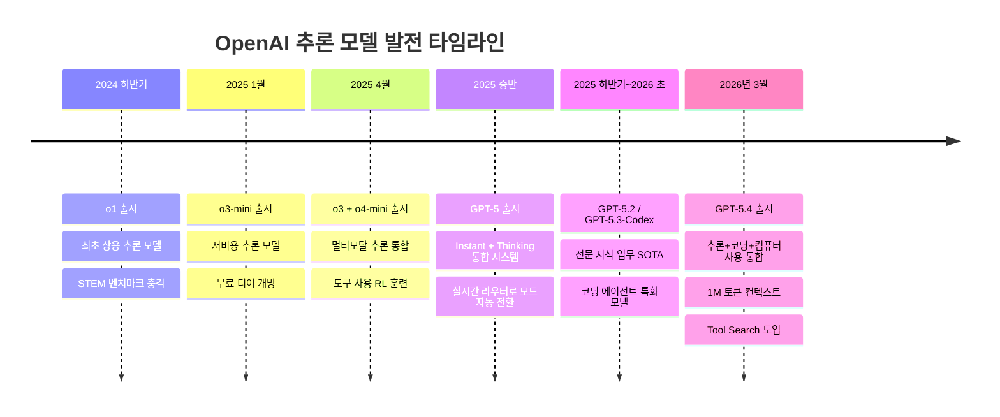
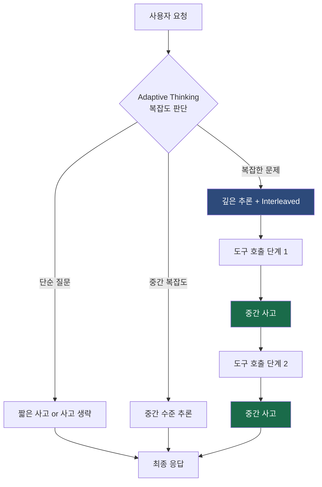
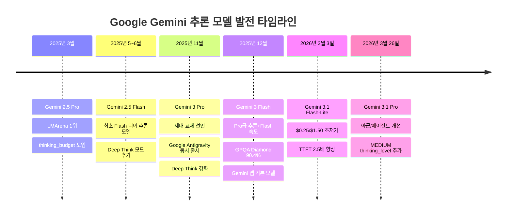
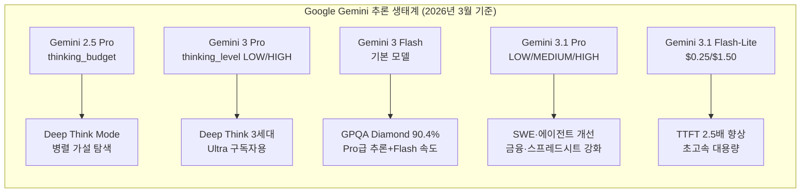
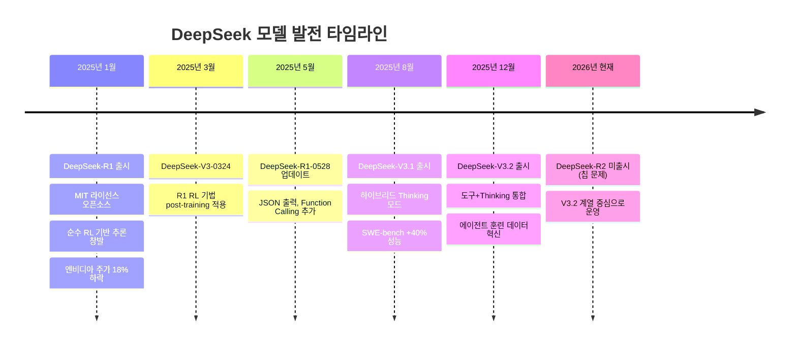
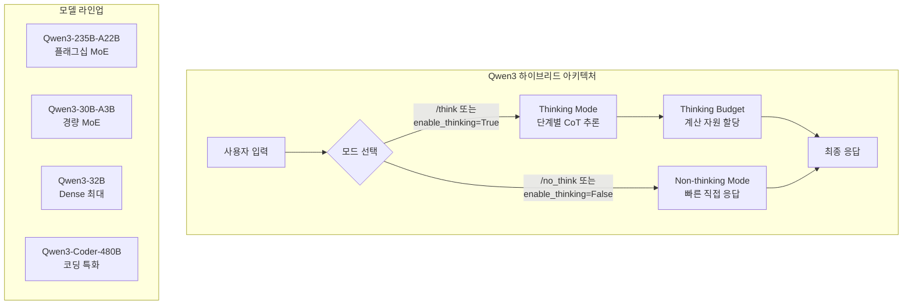
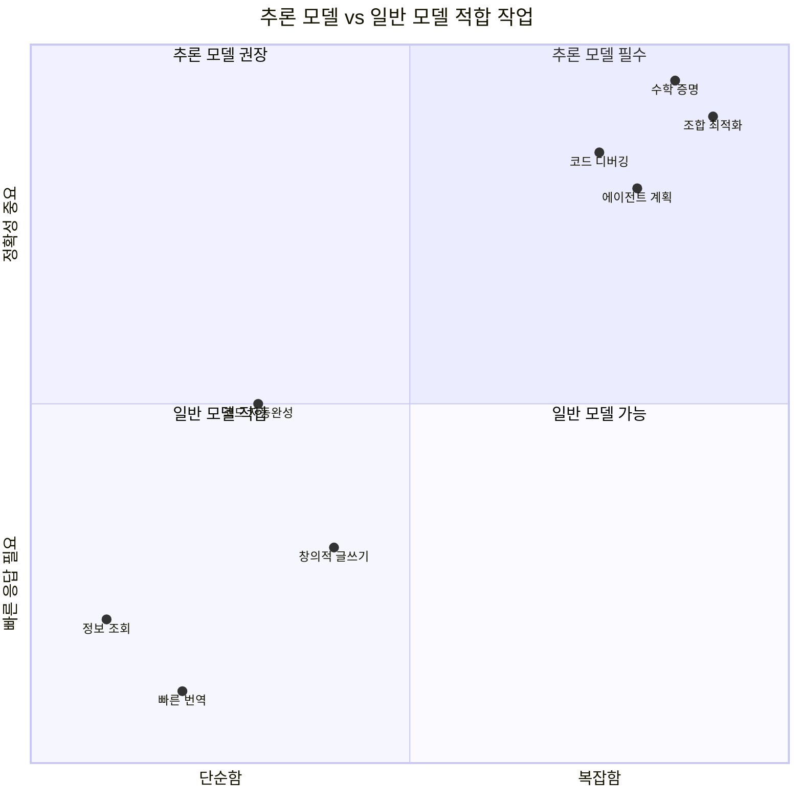
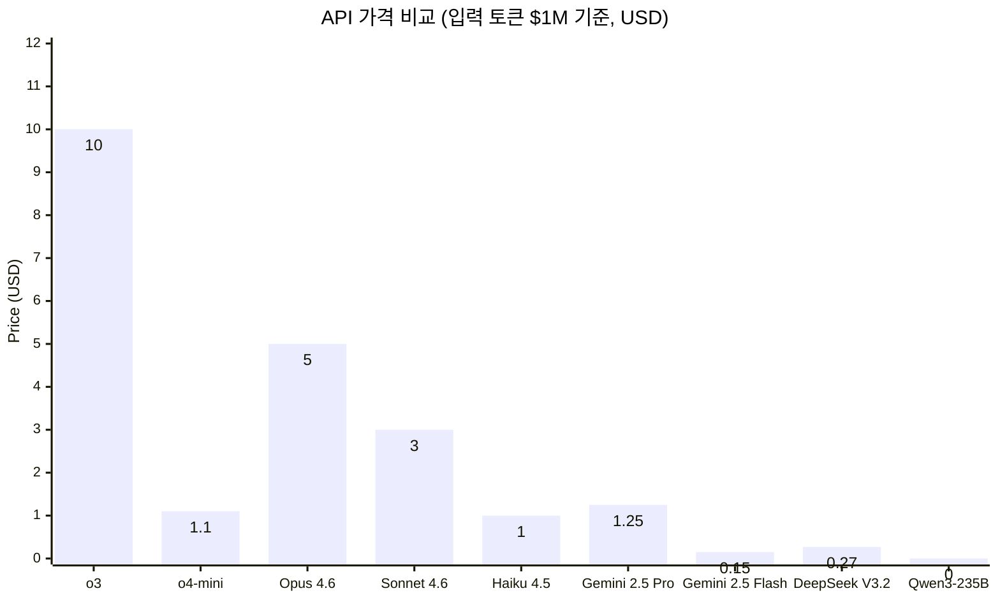
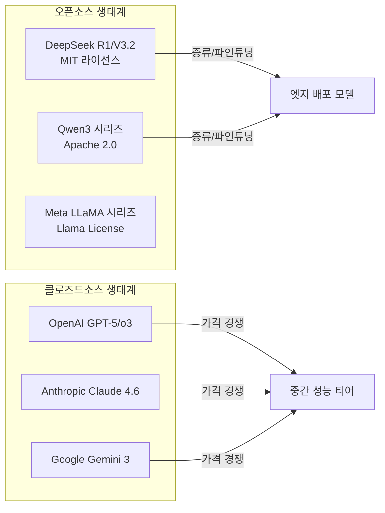

**OpenAI / Anthropic Claude / Google Gemini / DeepSeek / Qwen**

> 작성일: 2026-04-01 | 기준 시점: 2026년 3월 말 (GPT-5.4, Gemini 3.1 Pro/Flash-Lite 포함)

---

## 1. 추론 모델이란 무엇인가

인공지능 언어 모델의 발전에서 2025년은 "추론(Reasoning)"이 핵심 키워드로 떠오른 해였다. 기존의 언어 모델은 입력을 받으면 즉각적으로 출력을 생성하는 방식으로 작동했다. 이 방식은 빠르고 효율적이지만, 수학 문제를 단계별로 풀거나 복잡한 코드의 버그를 추적하거나, 여러 변수가 얽힌 의사결정 문제를 체계적으로 분석하는 작업에서는 한계를 드러냈다.

추론 모델은 이 한계를 극복하기 위해 탄생했다. 핵심 개념은 간단하다. 모델이 최종 답변을 내놓기 전에 **내부적으로 사고 과정(thinking process)** 을 먼저 수행하도록 훈련하는 것이다. 인간이 어려운 수학 문제를 풀 때 계산 과정을 종이에 적으며 중간 단계를 검토하듯, 추론 모델은 "reasoning token"이라 불리는 내부 사고 블록을 생성한 뒤 그 결론을 바탕으로 최종 응답을 작성한다.

이 접근법은 크게 두 가지 계보로 나뉜다. 하나는 **강화학습(Reinforcement Learning) 기반**으로, 모델이 수많은 시행착오를 통해 스스로 올바른 추론 경로를 학습하도록 하는 방식이다. DeepSeek-R1이 대표적이다. 다른 하나는 **파라미터 또는 API 레벨에서 사고 기능을 활성화**하는 방식으로, 동일 모델을 기반으로 사고 모드의 온/오프 또는 예산을 조절할 수 있다. Anthropic의 Adaptive Thinking, Google의 Thinking Budget, Qwen3의 Thinking/Non-thinking 모드가 이 계열에 해당한다.

"추론모델"과 "Extended Thinking 지원 모델"은 엄밀히 다른 개념이다. OpenAI의 o-시리즈처럼 모델 자체가 추론 전용으로 훈련된 경우가 전자이고, 기존 모델에 API 파라미터를 추가하여 사고 기능을 부여한 경우가 후자다. 다만 2025~2026년을 거치며 이 경계가 점점 희미해지고 있으며, 대부분의 주요 모델들은 두 특성을 혼합하는 방향으로 수렴하고 있다.

---

## 2. OpenAI: o-시리즈와 GPT-5 계열

### 2-1. 추론 모델의 시작: o1에서 o4-mini까지

OpenAI는 추론 모델 분야에서 시장의 기준을 먼저 세운 회사다. 2024년 출시된 **o1**은 reasoning token을 활용한 최초의 상용 추론 모델로, 수학·과학·코딩 벤치마크에서 기존 GPT-4o를 큰 폭으로 상회하며 업계에 충격을 안겼다. 그러나 응답 속도가 느리고 비용이 높다(입력 $15/M, 출력 $60/M)는 단점이 뚜렷했다.

2025년 1월 출시된 **o3-mini**는 이 단점을 보완하기 위해 등장했다. 소형이지만 STEM 분야에서 o1에 준하는 성능을 보여주었고, Low/Medium/High 세 단계의 Reasoning Effort를 API로 제어할 수 있어 개발자 친화적이었다. 무료 사용자에게도 처음으로 추론 모델을 개방한 사례이기도 하다.

결정적인 도약은 2025년 4월에 동시 출시된 **o3**와 **o4-mini**였다. o3는 당시 기준으로 코딩(Codeforces ELO 2727), 과학 추론(GPQA Diamond 87.7%), 소프트웨어 엔지니어링(SWE-bench Verified 71.7%) 등 주요 벤치마크에서 최고 수준을 기록했다. 특히 이 세대부터는 추론 과정에서 이미지를 직접 분석할 수 있는 멀티모달 추론 기능이 추가되었다. o4-mini는 o3 대비 약 10분의 1의 비용(입력 $1.10/M, 출력 $4.40/M)으로 경쟁력 있는 성능을 제공하며, 고빈도 프로덕션 환경을 겨냥한 포지셔닝을 취했다.

두 모델 모두 강화학습을 통해 도구 사용(Python, 웹 브라우징, 이미지 분석)을 스스로 판단하고 선택하도록 훈련되었다는 점이 중요하다. 단순히 도구를 쓸 수 있는 것이 아니라, **언제 어떤 도구를 써야 하는지 추론하는 능력**이 강화된 것이다.

### 2-2. GPT-5 계열: 추론과 일반 능력의 통합

2026년 현재 OpenAI의 API 문서에는 GPT-5 계열(gpt-5.4, gpt-5.4-mini, gpt-5.4-nano)이 기본 추천 모델로 등장한다. 이는 추론 모델과 일반 언어 모델이 별도로 공존하던 구도에서, 추론 능력이 일반 모델에 통합되는 방향으로 진화가 이루어졌음을 시사한다. 한편 o3-pro는 가장 깊은 추론이 필요한 연구·분석 작업을 위해 별도 유지되고 있다.

**GPT-5**는 2025년 중반에 출시되어 업계의 패러다임 전환을 이끌었다. 이전까지 Instant 모델(빠른 응답)과 Thinking 모델(깊은 추론)이 별도 제품으로 분리되어 있었던 것과 달리, GPT-5는 두 능력을 단일 통합 시스템으로 묶었다. 내부적으로 실시간 라우터(router)가 대화 유형, 복잡도, 도구 필요 여부, 사용자의 명시적 의도를 종합적으로 판단하여 Instant 모드와 Thinking 모드 중 자동으로 최적 경로를 선택한다. 사용자는 단순히 "think"라고 언급하는 것만으로도 모델에게 더 깊이 추론하도록 유도할 수 있다. 이 통합 방식은 이후 Claude의 Adaptive Thinking, Gemini의 동적 thinking_level과 개념적으로 수렴한다.

**GPT-5.2**는 전문 지식 업무 벤치마크인 GDPval(44개 직종의 지식 업무 능력 측정)에서 업계 전문가를 능가하는 수준을 달성한다고 발표되었다. 코딩, 스프레드시트 작업, 이미지 처리, 장문 컨텍스트 이해, 도구 사용, 복잡한 멀티스텝 프로젝트 처리 능력이 향상되었으며, Thinking 수준을 Standard/Extended로 수동 선택하는 토글 기능도 이 시기에 도입되었다. GPT-5.2 Thinking과 GPT-5.2 Pro가 각각 일반 추론과 최고 성능 요구 작업을 담당하는 구조로 운용되었다.

**GPT-5.3-Codex**는 코딩 에이전트에 특화된 모델로, GPT-5.3 계열의 코드 생성 능력과 일반 추론 능력을 하나로 통합했다. 기존 GPT-5.1-Codex 대비 약 25% 빠르며, 코드 생성을 넘어 전체 코드베이스를 자율적으로 계획·실행·검증하는 범용 코딩 에이전트로 진화했다는 평가를 받는다.

**GPT-5.4**는 2026년 3월 5일에 출시된 현재 OpenAI의 최신 플래그십 모델로, "전문 업무를 위한 가장 유능하고 효율적인 프론티어 모델"로 소개되었다. GPT-5.3-Codex의 코딩 역량을 흡수하면서 범용 추론, 에이전트 워크플로우, **네이티브 컴퓨터 사용(Computer Use)** 능력까지 단일 모델로 통합했다. 주요 특징은 다음과 같다.

첫째, API에서 최대 **1M 토큰 컨텍스트**를 지원한다. 이는 OpenAI 역사상 최대 규모로, 대형 코드베이스 전체나 방대한 문서 컬렉션을 단일 프롬프트로 처리할 수 있게 되었다. 둘째, **Tool Search** 기능을 도입하여 에이전트가 방대한 도구 생태계에서 필요한 도구를 동적으로 검색·선택할 수 있게 했다. 기존에는 시스템 프롬프트에 모든 도구 정의를 미리 나열해야 했기 때문에 도구 수가 늘수록 토큰 소모가 급증했는데, Tool Search는 이 문제를 근본적으로 해결한다. 셋째, **Upfront Planning** 기능으로 Thinking 모드에서 모델이 본격적인 처리 전에 먼저 계획을 제시하고, 사용자가 중간에 방향을 수정할 수 있다. 넷째, GPT-5.2 대비 개별 주장(claim) 오류가 33%, 전체 응답 오류가 18% 감소하여 환각 문제를 크게 줄였다. 투자은행 분석 업무 내부 벤치마크에서는 GPT-5.2(68.4%) 대비 87.3%의 평균 점수를 기록했다. 다섯째, chain-of-thought의 정직성을 검증하는 새로운 안전성 평가(Safety Evaluation)를 도입하여, Thinking 버전에서 사고 과정을 숨기는 기만적 행동이 더 드물다는 것을 실증했다.

GPT-5.4는 GPT-5.4 Thinking, GPT-5.4 Pro의 세 가지 변형으로 제공된다. Thinking은 ChatGPT Plus/Team/Pro 사용자를 대상으로 GPT-5.2 Thinking을 대체하며, Pro는 가장 복잡한 작업을 위한 최고 성능 버전이다. 2026년 3월 11일부로 GPT-5.1 전 계열이 ChatGPT에서 종료되었고, 해당 대화는 자동으로 GPT-5.3/5.4 계열로 이관되었다.

### 2-3. Reasoning Effort: 비용과 성능의 균형 조절

OpenAI 추론 모델의 주요 API 특성 중 하나는 `reasoning_effort` 파라미터다. Low, Medium, High 세 단계로 설정 가능하며, High로 설정할수록 더 많은 reasoning token을 소비하고 성능이 높아진다. AIME 2024 기준으로 Low에서 High로 올릴 때 수학 정확도가 10~30%p 향상되는 것으로 보고된다. 이 메커니즘은 Claude의 Adaptive Thinking effort, Gemini의 thinking_budget과 개념적으로 동일하다.

---

## 3. Anthropic Claude: Extended Thinking과 Adaptive Thinking

### 3-1. 추론 기능의 도입: Claude 3.7 Sonnet

Anthropic이 추론 기능을 처음 도입한 것은 2025년 2월, **Claude 3.7 Sonnet**을 통해서였다. Extended Thinking이라는 이름으로 API를 통해 thinking 블록을 명시적으로 활성화할 수 있었으며, 수학·과학·복잡한 코딩 작업에서 큰 폭의 성능 향상이 확인되었다. 다만 이 시기에는 API 파라미터로 사고 기능을 "켜는" 방식이었기 때문에, 모델 자체가 추론을 위해 설계된 DeepSeek-R1이나 o1과는 성격이 달랐다.

### 3-2. Claude 4 세대: Extended Thinking의 일반화

2025년 5월 출시된 **Claude 4 세대(Opus 4, Sonnet 4)** 부터는 Extended Thinking이 모든 Claude 4 계열 모델로 확장되었다. API에서 `thinking: {type: "enabled", budget_tokens: N}`을 지정하여 최대 N 토큰까지 사고에 사용하도록 예산을 설정할 수 있었다. 여기서 중요한 구분점이 있다. Opus 4나 Sonnet 4를 옵션 없이 호출하면 추론 과정 없이 즉각 응답을 생성한다. 즉, Extended Thinking은 **API 파라미터로 활성화해야 하는 기능**이지, 모델이 항상 자동으로 수행하는 것이 아니다.

이로 인해 실제 애플리케이션에서는 맹점이 생기기 쉽다. 루미큐브 게임 AI처럼 조합 탐색이 필요한 작업에서 Opus 4를 단순 호출하면 복잡한 경우의 수를 제대로 탐색하지 못하고 "안전하게 드로우"를 선택하는 경향이 생긴다. Extended Thinking 옵션을 활성화해야만 단계적 추론을 통한 최적 플레이가 가능해진다.

### 3-3. Claude 4.5~4.6: Adaptive Thinking으로의 전환

2025년 후반기~2026년 초에 걸쳐 출시된 **Claude Opus 4.5, Sonnet 4.5**, 그리고 2026년 2월 출시된 **Claude Opus 4.6, Sonnet 4.6**은 추론 방식에서 근본적인 변화를 가져왔다.

기존의 Extended Thinking은 개발자가 `budget_tokens`를 직접 설정해야 했다. 이는 유연성은 있지만, 작업의 복잡도에 따라 매번 적절한 예산을 튜닝해야 한다는 부담을 낳았다. **Adaptive Thinking**은 이를 대체한다. `thinking: {type: "adaptive"}`와 effort 레벨(low/medium/high)만 지정하면, 모델이 스스로 각 작업의 복잡도를 판단하여 필요한 만큼의 사고를 수행한다. 단순한 질문에는 짧게, 복잡한 문제에는 깊게 생각하는 것이다.

또한 **Interleaved Thinking**이 도입되면서 아키텍처적 도약이 이루어졌다. 기존 방식은 "한 번 길게 생각하고 답변"이었다면, Interleaved Thinking은 "도구를 사용하는 각 단계마다 사고"하는 방식이다. 즉, 중간 결과를 확인하고, 그에 따라 다음 행동을 재계획하는 진정한 의미의 에이전트형 추론이 가능해진 것이다. Opus 4.6에서는 이것이 기본값으로 자동 활성화된다.

### 3-4. Claude 4.6 세대의 현재 상태 (2026년 3월 기준)

**Claude Opus 4.6**은 Anthropic의 플래그십 모델로, 1M 토큰 컨텍스트 윈도우(표준 요금 포함), 128K 최대 출력 토큰, Adaptive Thinking 자동 활성화, Agent Teams(병렬 멀티에이전트 협업)를 지원한다. SWE-bench Verified 80.8%, GPQA Diamond 91.3%의 성능을 보이며, 코딩과 과학적 추론에서 최상위 수준을 유지한다. 요금은 입력 $5/M, 출력 $25/M이다.

**Claude Sonnet 4.6**은 놀랍게도 Opus 4.6과의 격차가 역사상 가장 좁다. SWE-bench에서 79.6%로 Opus 4.6(80.8%)과 단 1.2%p 차이다. 입력 $3/M, 출력 $15/M의 요금으로 대부분의 프로덕션 워크로드에서 최선의 선택이 된다. Sonnet 4.6도 Adaptive Thinking, 1M 컨텍스트를 지원하며, 최대 출력은 64K 토큰이다.

**Claude Haiku 4.5**는 $1/$5/M의 최저가 티어로, 단순 파일 읽기·라우팅·빠른 응답 작업에 사용된다.

---

## 4. Google Gemini: 생태계 통합형 추론

### 4-1. 생각하는 모델로의 전환: Gemini 2.5

Google DeepMind는 2025년 3월 **Gemini 2.5 Pro Experimental**을 발표하며 추론 모델 경쟁에 본격 참전했다. 가장 큰 특징은 추론 기능이 모델에 내장되어 있다는 점이다. Gemini 2.5부터 Google은 "thinking 기능을 모든 모델에 통합한다"는 방향을 천명했다.

Gemini 2.5 Pro는 LMArena 리더보드에서 1위를 기록하며 인간 선호도에서 높은 평가를 받았다. 특히 웹 개발(WebDev Arena 세계 1위), 코딩, 멀티모달 추론에서 강점을 보였다. GPQA Diamond 등 전문 과학 벤치마크에서도 경쟁력 있는 수치를 기록했다.

**Gemini 2.5 Flash**는 속도와 비용을 최우선으로 하는 "워크호스" 모델이다. 최초의 Flash 티어 추론 모델로, `thinking_budget` 파라미터로 0부터 24,576 토큰까지 사고 예산을 세밀하게 조절할 수 있다. thinking_budget을 0으로 설정하면 이전 세대 Flash 수준의 속도로 응답하면서도, budget을 높일수록 추론의 깊이가 선형적으로 증가한다. 이 가격 대비 성능 비율은 당시 업계 최고 수준으로 평가받았다.

### 4-2. Gemini 3 세대: 차세대 멀티모달 추론의 완성

2025년 5~6월에는 **Gemini 2.5 Pro Deep Think** 모드가 등장했다. 단순히 더 오래 생각하는 것이 아니라, 복수의 가설을 병렬로 탐색한 뒤 최선을 선택하는 새로운 추론 기법을 적용했다. IMO(국제수학올림피아드) 수준의 수학 문제와 고난도 코딩 과제를 겨냥한 기능이다.

**Gemini 3 Pro**(2025년 11월 공개)는 Google이 "AGI를 향한 또 다른 큰 걸음"이라고 표현할 만큼 세대 교체를 선언한 모델이다. 멀티모달 이해 분야의 최강 모델이자 Google의 가장 강력한 에이전트·바이브코딩 모델로 자리 잡았다. 특히 JetBrains 평가에서 Gemini 2.5 Pro 대비 해결된 벤치마크 과제 수가 50% 이상 증가했다는 보고가 있으며, Cline·Cursor·Figma Make 등 주요 개발 도구들이 즉각 Gemini 3 통합을 선언했다. 또한 Gemini 3 Pro 출시와 동시에 **Google Antigravity**라는 새로운 에이전트 개발 플랫폼이 공개되었다. Gemini 3의 고급 추론·도구 사용·에이전트 코딩 능력을 기반으로, 에디터·터미널·브라우저에 직접 접근하는 에이전트가 복잡한 엔드투엔드 소프트웨어 작업을 병렬로 자율 처리하는 환경을 제공한다. **Gemini 3 Deep Think** 모드는 Gemini 2.5의 Deep Think보다 한층 강화된 추론을 제공하며, 일반에 공개하기 전에 안전 테스터를 거치는 신중한 출시 프로세스를 밟았다.

API 레벨에서 Gemini 3는 `thinking_level` 파라미터(MINIMAL/LOW/MEDIUM/HIGH)를 도입해 이전 세대의 `thinking_budget` 수치 설정보다 단순하고 직관적인 인터페이스를 제공한다. 또한 멀티모달 함수 응답(이미지·PDF를 포함한 응답), 스트리밍 함수 호출, thought signature 강화 검증, `media_resolution` 파라미터로 멀티모달 입력의 처리 해상도를 조절하는 기능이 새로 추가되었다.

**Gemini 3 Flash**(2025년 12월)는 "Flash 속도로 Pro급 추론"을 표방한다. Gemini 3의 차세대 지능을 Flash 수준의 지연시간과 비용에서 제공하며, GPQA Diamond 90.4%, HLE(Humanity's Last Exam) 33.7%(도구 미사용)를 기록해 이전 세대 최강 모델인 Gemini 2.5 Pro를 여러 벤치마크에서 상회한다. 2026년 초부터 Gemini 앱의 기본 모델로 채택되었으며, Google 검색의 AI Mode에도 기본 탑재되어 전 세계 수억 명의 사용자에게 도달하게 되었다.

**Gemini 3.1 Pro**(2026년 3월 26일)는 Gemini 3 Pro 이후 빠른 피드백 사이클로 나온 업그레이드 버전이다. 복잡한 문제 해결 벤치마크에서 의미 있는 성능 향상이 확인되었으며, 특히 소프트웨어 엔지니어링 및 에이전트 작업, 금융·스프레드시트 응용 분야에서 개선이 두드러진다. 추론 제어 파라미터로는 MEDIUM 단계가 새로 추가되어 LOW와 HIGH 사이의 중간 최적점을 선택할 수 있게 되었다. 현재 Vertex AI, AI Studio, Antigravity, Gemini CLI, NotebookLM 등에서 프리뷰로 제공된다.

**Gemini 3.1 Flash-Lite**(2026년 3월 3일)는 고빈도 대용량 워크로드를 겨냥한 최저가 티어다. 입력 $0.25/M, 출력 $1.50/M의 가격에 GPQA Diamond 86.9%, MMMU Pro 76.8%를 달성하여 동일 티어 경쟁 모델(GPT-5 mini, Claude Haiku 4.5)을 벤치마크 6개 항목에서 상회했다. 특히 응답 첫 토큰 생성 시간(TTFT)이 Gemini 2.5 Flash 대비 2.5배 빠르고 출력 속도는 45% 향상되었다. 1M 토큰 컨텍스트를 표준 지원하며, 64K 토큰의 최대 출력을 제공한다. Gemini 3.1 Flash-Lite는 기반 아키텍처로 Gemini 3 Pro의 MoE(Mixture-of-Experts) 구조를 활용하여, 추론 시 일부 파라미터만 활성화하는 방식으로 비용 효율을 달성한다.

### 4-3. Gemini만의 차별점: 생태계 통합

Google Gemini의 핵심 경쟁력은 단순히 모델 성능이 아니라 **구글 생태계와의 통합**에 있다. Grounding with Google Search(실시간 웹 검색 기반 답변), URL Context(URL 직접 분석), Code Execution(코드 실행 샌드박스)이 기본 도구로 내장되어 있으며, MCP(Model Context Protocol)를 통해 외부 시스템과도 연결된다. Vertex AI를 통한 엔터프라이즈 배포, Firebase AI Logic을 통한 모바일 앱 통합, Google Cloud의 컴플라이언스 인프라 위에서 동작한다는 점은 기업 고객에게 큰 이점이다.

---

## 5. DeepSeek: 오픈소스 추론 혁명

### 5-1. DeepSeek-R1의 충격

2025년 1월, 중국 항저우에 본사를 둔 헤지펀드 High-Flyer 산하 스타트업 DeepSeek이 **DeepSeek-R1**을 발표하며 AI 업계에 지진을 일으켰다. R1은 OpenAI o1에 필적하는 추론 성능을 단 600만 달러의 훈련 비용으로 달성했다고 주장했다. 비교 대상인 GPT-4의 훈련 비용(약 1억 달러 이상)에 비하면 압도적인 비용 효율성이었다. 더욱 충격적인 것은 모델 가중치 전체를 MIT 라이선스(상업적 이용, 파생 모델 허용)로 공개했다는 점이다. 발표 직후 DeepSeek 앱은 미국 App Store에서 ChatGPT를 제치고 1위를 기록했고, 엔비디아 주가는 하루 만에 18% 하락했다.

R1의 기술적 핵심은 **순수 강화학습(RL)** 이다. 기존 추론 모델들이 수백만 건의 인간 작성 chain-of-thought 예시로 감독 학습(SFT)을 거친 후 RL을 적용하는 방식과 달리, R1-Zero는 규칙 기반 보상(수학 정답 여부, 코드 통과 여부)만으로 RL을 적용해 자기반성(self-reflection), 검증(verification), 전략 수정(dynamic adaptation) 같은 고급 추론 패턴이 자발적으로 출현했다. 사람이 가르치지 않아도 추론 능력이 창발(emergent)한다는 것을 실증한 것이다.

R1은 671B 파라미터의 전체 모델 외에도, 더 작은 Qwen/LLaMA 기반 모델에 R1의 추론 능력을 증류(distillation)한 소형 버전들을 함께 공개했다. 이 덕분에 개인 연구자나 스타트업도 로컬 환경에서 R1 수준의 추론 모델을 실행할 수 있게 되었다.

### 5-2. R1 이후의 DeepSeek: V3 계열의 진화

R1이 전용 추론 모델이었다면, 이후 DeepSeek는 범용 성능과 추론 능력을 동시에 갖춘 **하이브리드 모델** 방향으로 전략을 전환했다.

**DeepSeek-V3-0324**(2025년 3월)는 기존 V3의 기반 위에 R1의 RL 기법을 post-training에 적용해 추론 능력을 대폭 향상시켰다. **DeepSeek-V3.1**(2025년 8월)은 Thinking/Non-thinking 모드를 모두 지원하는 하이브리드 아키텍처를 채택했으며, SWE-bench와 Terminal-bench에서 전작 대비 40% 이상의 성능 향상을 기록했다. **DeepSeek-V3.2**(2025년 12월)는 에이전트 훈련 데이터 합성 방법을 새로 개발(1,800개 이상의 환경, 85K 이상의 복잡한 지시)하여 도구 사용 중에도 thinking을 통합한 최초의 DeepSeek 모델이 되었다.

주목할 점은 R1의 직접 후계자로 예고되었던 **DeepSeek-R2**가 2026년 초 현재까지 출시되지 않았다는 것이다. 2025년 내내 데이터 레이블링 지연과 화웨이 Ascend 칩 관련 안정성 문제가 보고되었다. 반면 V3 계열은 꾸준히 발전하며 R1의 역할까지 대부분 흡수하는 방향으로 진화하고 있다.

### 5-3. DeepSeek의 의의와 한계

DeepSeek의 가장 큰 의의는 **AI 개발의 비용 패러다임을 바꾸었다**는 데 있다. 막대한 자본력을 가진 BigTech만이 프론티어 모델을 개발할 수 있다는 상식에 도전했다. MoE(Mixture-of-Experts) 아키텍처를 활용해 활성화 파라미터를 전체의 일부로만 유지하면서 효율적인 추론을 달성한 것도 중요한 기여다.

반면 주요 한계도 존재한다. 중국 정부 방침에 맞춰 특정 주제에 대한 검열이 적용되며, 사실 정확도와 안전성 면에서 서구 모델 대비 우려가 제기된다. 또한 2026년 2월에는 Anthropic이 DeepSeek가 수천 개의 가짜 계정으로 Claude와 대화를 생성해 훈련 데이터로 활용했다는 의혹을 제기하기도 했다.

---

## 6. Qwen(阿里云): 알리바바의 오픈소스 추론 전략

### 6-1. QwQ-32B: 소형 추론 모델의 기준

알리바바 클라우드의 Qwen 팀이 DeepSeek-R1에 응답한 것이 **QwQ-32B**다. 320억 파라미터라는 상대적으로 작은 규모에도 불구하고, AIME·GPQA 등 주요 수학·과학 추론 벤치마크에서 DeepSeek-R1과 OpenAI o1-mini에 필적하는 성능을 달성했다. 로컬 배포 비용이 낮아 개인 연구자와 스타트업 사이에서 인기가 높다.

### 6-2. Qwen3: 통합 하이브리드 추론 모델

2025년 4월 출시된 **Qwen3**는 QwQ로 대표되는 추론 모델과 Qwen2.5로 대표되는 일반 언어 모델을 단일 프레임워크로 통합한 것이 핵심이다. 사용자는 동일한 모델에서 **Thinking Mode**(복잡한 단계별 추론)와 **Non-thinking Mode**(빠른 직접 응답) 사이를 자유롭게 전환할 수 있다. 프롬프트에 `/think` 또는 `/no_think` 명령어를 포함하거나, API의 `enable_thinking` 파라미터로 제어한다.

Qwen3 플래그십인 **Qwen3-235B-A22B**는 MoE 구조로, 전체 2,350억 파라미터 중 220억만 활성화하여 실제 추론 비용은 220B 모델 수준이다. DeepSeek-R1, o1, Gemini 2.5 Pro와 경쟁하는 수준의 성능을 오픈소스(Apache 2.0 라이선스)로 제공한다는 점에서 의미가 크다. 코딩 특화 버전인 **Qwen3-Coder-480B-A35B**는 256K 토큰 컨텍스트 윈도우와 에이전트 코딩 능력을 갖추고 있다.

학습 데이터 면에서도 주목할 만하다. Qwen3는 약 36조 토큰으로 훈련되었는데, 이는 전작 Qwen2.5(18조 토큰)의 두 배다. 119개 언어와 방언을 지원하며, Qwen2.5-VL로 PDF 텍스트를 추출하고, Qwen2.5-Math/Coder로 수학·코드 합성 데이터를 생성하는 자체 생태계를 구축했다.

### 6-3. Qwen3.5: 2026년의 최신 동향

2025년 8월에는 **Qwen3 2507 업데이트**가 이루어져 1M 토큰 입력 처리가 가능해졌다. 이후 **Qwen3.5** 시리즈도 HuggingFace에 등장하며 멀티모달 능력 강화, 201개 언어 지원 확대, RL 기반 에이전트 훈련 개선 등이 이루어졌다. Qwen은 현재 중국 오픈소스 AI의 대표 시리즈로, 글로벌 오픈소스 모델 경쟁에서 Meta LLaMA와 함께 중요한 축을 형성하고 있다.

---

## 7. 추론 방식 비교: 기술적 관점

### 7-1. 핵심 추론 메커니즘 비교

각 진영의 추론 접근 방식을 기술 관점에서 정리하면 다음과 같다.

| 진영 | 추론 방식 | 활성화 방법 | 특징 |
|------|----------|------------|------|
| OpenAI o-시리즈 | 모델 자체가 추론용 RL 훈련 | 모델 선택(o3, o4-mini) | reasoning_effort 파라미터로 강도 조절 |
| OpenAI GPT-5.4 | 통합 시스템 (Instant + Thinking 자동 라우팅) | Thinking/Pro 변형 선택 | Upfront Planning, Tool Search, 1M 컨텍스트 |
| Claude 4.6 | Adaptive Thinking (내장형 RL) | thinking: adaptive + effort | Interleaved Thinking으로 도구 사용 간 재계획 |
| Gemini 2.5 | 내장 Thinking (모든 모델 기본) | thinking_budget (0~24576) | 세밀한 예산 조절, Deep Think 병렬 가설 탐색 |
| Gemini 3/3.1 | 내장 Thinking (모든 모델 기본) | thinking_level (LOW/MEDIUM/HIGH) | 직관적 단계 제어, Google Antigravity 통합 |
| DeepSeek-R1 | 순수 RL(규칙 기반 보상)로 추론 창발 | 모델 자체가 추론 모델 | 비용 혁신, 오픈소스 |
| DeepSeek-V3.2 | 하이브리드 (thinking/non-thinking) | API 파라미터 | 도구+thinking 통합 |
| Qwen3 | 하이브리드 (thinking/non-thinking) | /think, /no_think, enable_thinking | 단일 모델, 모드 전환 |

### 7-2. 추론 모델과 일반 모델의 핵심 차이

추론 모델이 일반 언어 모델보다 유리한 작업과 불리한 작업을 구분하는 것이 실용적 선택의 핵심이다.

**추론 모델이 빛나는 상황**: 수학 증명과 복잡한 수식 계산, 여러 파일에 걸친 버그 추적, 알고리즘 설계와 시간·공간 복잡도 분석, 조합 탐색(바로 루미큐브 타일 배치 같은 문제), 멀티스텝 에이전트 태스크, 전략 계획과 의사결정.

**일반 모델로 충분한 상황**: 빠른 정보 조회, 창의적 글쓰기, 번역, 요약, 단순 Q&A, 코드 자동완성, 짧은 대화.

---

## 8. 성능 벤치마크 비교

아래 수치는 각 회사의 공개 자료와 독립 벤치마크를 기반으로 정리한 것이며, 측정 방법과 시점에 따라 달라질 수 있다.

### 8-1. 주요 벤치마크 비교 (2025년 하반기 ~ 2026년 3월 기준)

| 모델 | GPQA Diamond | AIME 2025 | SWE-bench Verified | GDPval / 기타 |
|------|-------------|-----------|-------------------|----------------|
| OpenAI o3 | 87.7% | 98.4% (pass@1) | 71.7% | Codeforces ELO 2727 |
| OpenAI o4-mini | - | 99.5% (pass@1) | - | - |
| **OpenAI GPT-5.4** | **92.8%** | - | - | **GDPval 83%, 투자은행 모델링 87.3%** |
| Claude Opus 4.6 | 91.3% | - | 80.8% | - |
| Claude Sonnet 4.6 | 74.1% | - | 79.6% | - |
| Gemini 2.5 Pro | ~84% (MMMU) | 강세 | 63.8% | LMArena 1위 |
| **Gemini 3 Flash** | **90.4%** | - | - | **HLE 33.7%, LMArena 상위** |
| **Gemini 3.1 Pro** | - | - | - | **SWE·에이전트 대폭 개선** |
| **Gemini 3.1 Flash-Lite** | **86.9%** | - | - | **MMMU Pro 76.8%** |
| DeepSeek-R1 | - | o1 수준 | SWE+40% (V3.1 대비) | - |
| Qwen3-235B-A22B | 경쟁력 있음 | Gemini보다 낮음 | - | Codeforces ELO 상위권 |

**해석 주의사항**: 이 수치들은 각 회사가 자사에 유리한 조건에서 측정한 경우가 많다. 독립 기관의 평가(LMArena, ArtificialAnalysis.ai)를 함께 참조하는 것이 바람직하다.

### 8-2. 비용 비교 (2026년 3월 기준)

| 모델 | 입력 ($/1M 토큰) | 출력 ($/1M 토큰) | 비고 |
|------|----------------|----------------|------|
| OpenAI o3 | $10 | $40 | 강력하지만 고가 |
| OpenAI o4-mini | $1.10 | $4.40 | o3 대비 10배 저렴 |
| **OpenAI GPT-5.4** | **미공개(API 기준)** | - | **1M 컨텍스트, Tool Search, 컴퓨터 사용** |
| Claude Opus 4.6 | $5 | $25 | 1M 컨텍스트 포함 |
| Claude Sonnet 4.6 | $3 | $15 | 가성비 최강 프론티어 |
| Claude Haiku 4.5 | $1 | $5 | 경량 작업용 |
| Gemini 2.5 Pro | ~$1.25 | ~$10 | Google AI Studio 기준 |
| Gemini 2.5 Flash | ~$0.15 | ~$0.60 | 초저가 추론 |
| **Gemini 3.1 Pro** | **$2** | **$18** | **최신 플래그십, MEDIUM 추론 레벨 지원** |
| **Gemini 3.1 Flash-Lite** | **$0.25** | **$1.50** | **초저가, TTFT 2.5배 향상** |
| DeepSeek V3.2 | $0.27 | $1.10 | 오픈소스 모델 API |
| Qwen3-235B (SiliconFlow) | $0.40 | $0.60 | 오픈소스 추론 |

---

## 9. 오픈소스 vs 클로즈드소스: 전략적 분기점

2025~2026년의 AI 추론 모델 경쟁에서 가장 중요한 지형 변화 중 하나는 **오픈소스 모델의 부상**이다. DeepSeek-R1, Qwen3가 그 선봉에 서 있으며, Meta LLaMA도 같은 방향에 있다.

오픈소스 모델의 강점은 명확하다. 데이터가 외부로 나가지 않는 완전한 프라이버시, 자체 인프라에서의 무제한 커스터마이징, 장기 운용 시 극적으로 낮은 비용이 그것이다. 반면 약점도 분명하다. 초기 인프라 구축 비용, 전문 엔지니어링 역량 요구, 최신 클로즈드소스 모델 대비 일반적으로 낮은 정점 성능이 그것이다.

클로즈드소스 진영의 전략적 반응은 두 가지 방향이다. 첫째, 오픈소스가 도달할 수 없는 성능의 상한선을 지속적으로 올리는 것(Claude Opus 4.6, GPT-5, Gemini 3). 둘째, 가격을 낮추어 오픈소스 대비 비용 차이를 좁히는 것(Gemini 2.5 Flash, o4-mini, Claude Haiku).

---

## 10. 에이전트 시대의 추론 모델

추론 모델의 진화는 단순히 "더 잘 생각하는 AI"를 만드는 것에서 멈추지 않는다. 2025~2026년의 핵심 트렌드는 추론 능력과 **에이전트 실행(agentic execution)** 의 결합이다.

에이전트 AI는 단일 응답으로 끝나지 않는다. 여러 단계에 걸쳐 도구를 호출하고, 중간 결과를 반영하여 계획을 수정하고, 때로는 수십 분~수 시간에 걸친 작업을 자율적으로 수행한다. 이 과정에서 추론 능력은 단순한 성능 향상을 넘어 **작업 완료율과 오류 복구 능력**을 결정하는 핵심 인자가 된다.

OpenAI의 o3/o4-mini는 RL을 통해 도구 사용 타이밍과 방법을 학습했다. Anthropic의 Interleaved Thinking은 각 도구 호출 사이에 재계획을 가능하게 한다. Google Gemini의 Project Mariner는 컴퓨터 사용(Computer Use) 에이전트에 추론을 통합했다. DeepSeek-V3.2는 에이전트 훈련 데이터 합성에 1,800개 이상의 환경을 활용했다. Qwen3-Coder는 전체 저장소 수준의 에이전트 코딩을 목표로 한다.

앞서 언급한 Terraform 프로덕션 DB 삭제 사건처럼, 에이전트 AI에서 추론 능력이 뛰어날수록 자율성이 높아지는 만큼 **불가역적 작업에 대한 인간 감독**의 필요성도 함께 강조되어야 한다. 추론 깊이가 깊어질수록 AI가 스스로 "합리적"이라 판단하는 행동의 범위가 넓어지기 때문이다.

---

## 11. 결론: 어떤 모델을 선택할 것인가

2026년 현재, 주요 AI 모델의 추론 능력은 모두 상당한 수준에 도달했다. 선택의 기준은 이제 단순한 성능이 아니라 **비용, 속도, 오픈소스 여부, 생태계 통합, 사용 목적**의 조합으로 결정된다.

**최고 성능이 필요하다면**: Claude Opus 4.6(코딩·과학 추론 최상위, GPQA 91.3%), OpenAI GPT-5.4(전문 업무·에이전트 통합, GDPval 83%), Gemini 3.1 Pro(멀티모달·SWE 개선, Deep Think)를 고려할 수 있다.

**비용 효율성이 중요하다면**: Claude Sonnet 4.6(프론티어급 성능, Opus의 60% 비용), OpenAI o4-mini(o3의 1/10 비용), Gemini 3.1 Flash-Lite(초저가 $0.25/M 입력, TTFT 최고 속도), Gemini 2.5 Flash(검증된 초저가 추론)가 유력하다.

**오픈소스·프라이버시가 필수라면**: DeepSeek-R1/V3.2(MIT 라이선스, 로컬 배포 가능), Qwen3-235B-A22B(Apache 2.0, 최강 오픈소스 추론)를 검토해야 한다.

**한국어 기업 환경을 고려한다면**: Claude와 Gemini 모두 한국어 성능이 우수하다. 데이터 주권이 중요한 금융·공공 분야는 오픈소스 로컬 배포(Qwen3, DeepSeek 증류 모델)가 현실적 대안이 될 수 있다.

추론 모델은 더 이상 특수한 도구가 아니다. 2026년을 기점으로 추론은 주요 AI 모델의 기본 기능으로 자리잡았으며, 앞으로의 경쟁은 "얼마나 깊이 생각하는가"가 아니라 "언제 어디서 어떻게 생각하는가"를 최적화하는 방향으로 펼쳐질 것이다.

---

*본 문서는 공개된 자료, 각사 API 문서, 독립 벤치마크 리포트를 종합하여 작성되었습니다. 수치와 요금은 변경될 수 있으므로 최신 정보는 각 공식 문서를 참조하시기 바랍니다.*

*작성일: 2026-04-01*
