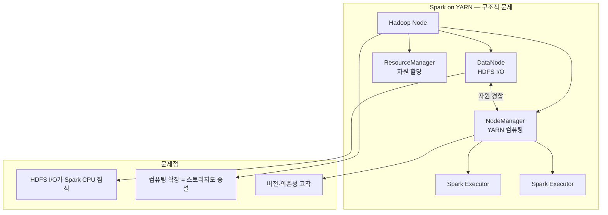
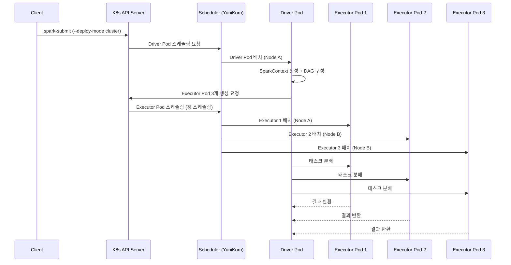
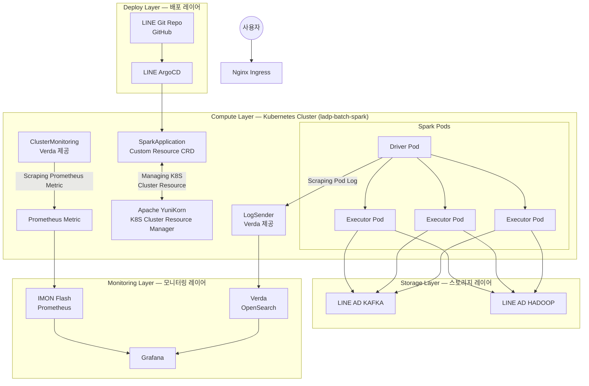
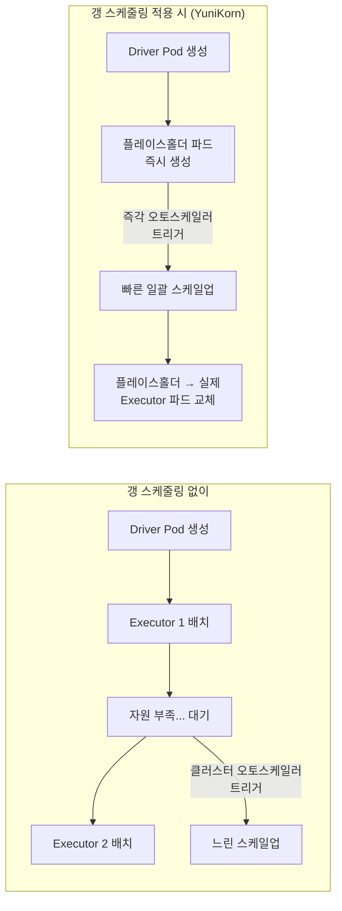
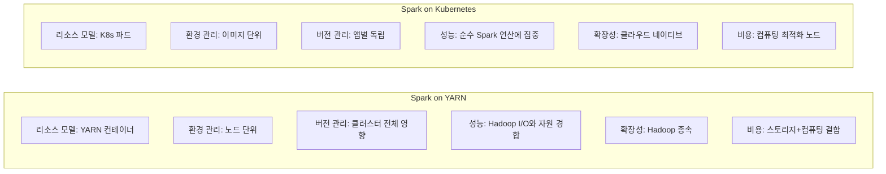

> **원문 출처**: LY Corporation Tech Blog — [LINE 서비스의 대규모 광고 데이터를 처리하기 위한 Spark on Kubernetes 적용기](https://techblog.lycorp.co.jp/ko/processing-large-scale-data-with-spark-on-kubernetes) (2026-03-31)  
> **저자**: 박민재, 손정호, 정창권 (LINE Ads 데이터 파이프라인 팀)  
> **분석 작성일**: 2026-04-01

---

## 목차

1. [배경과 문제 인식](#1-배경과-문제-인식)
2. [LINE Ads 데이터 파이프라인의 규모와 요구사항](#2-line-ads-데이터-파이프라인의-규모와-요구사항)
3. [기존 Spark on YARN 환경의 구조적 한계](#3-기존-spark-on-yarn-환경의-구조적-한계)
4. [Spark on Kubernetes의 작동 원리](#4-spark-on-kubernetes의-작동-원리)
5. [클러스터 모드 vs 클라이언트 모드](#5-클러스터-모드-vs-클라이언트-모드)
6. [LINE Ads가 구축한 전체 시스템 아키텍처](#6-line-ads가-구축한-전체-시스템-아키텍처)
7. [Apache YuniKorn — 갱 스케줄링의 핵심](#7-apache-yunikorn--갱-스케줄링의-핵심)
8. [트러블슈팅 — 현장에서 마주한 문제들](#8-트러블슈팅--현장에서-마주한-문제들)
9. [도입 효과와 성과](#9-도입-효과와-성과)
10. [Spark on YARN vs Spark on Kubernetes 비교 요약](#10-spark-on-yarn-vs-spark-on-kubernetes-비교-요약)
11. [향후 방향과 시사점](#11-향후-방향과-시사점)

---

## 1. 배경과 문제 인식

LINE Ads는 일본·아시아 전역의 LINE 서비스를 기반으로 운영되는 대규모 디지털 광고 플랫폼이다. 하루에 수십억 건 이상의 광고를 송출하며, 내부적으로는 천억 건에 준하는 데이터를 수집·가공하는 규모를 자랑한다. 이 글의 저자들은 바로 이 플랫폼의 데이터 파이프라인 팀 소속으로, 광고 효율을 높이기 위한 실시간 데이터 수집·가공·저장·전송 전 과정을 책임지고 있다.

문제의 시작은 광고 시스템의 고도화에서 비롯됐다. 머신러닝 알고리즘이 정교해질수록 각 광고 이벤트에 붙어야 하는 피처(feature)의 수가 기하급수적으로 늘어났고, 그 결과 데이터 파이프라인이 처리해야 할 연산량도 급증했다. 실제로 팀 내에서 가장 많이 활용되는 테이블의 크기는 2022년 12월 대비 2025년 12월 기준으로 약 **2.91배** 증가했다. 이는 단순한 데이터 볼륨 증가가 아니라, 각 레코드의 컬럼 수(피처 수)가 늘어남으로써 연산 복잡도까지 함께 폭발적으로 증가했음을 의미한다.

이 압박 속에서 기존에 활용하던 **Hadoop 기반 YARN 환경**이 더 이상 버티지 못하는 임계점에 도달하게 됐다. 팀은 구조적 해결책을 찾아야 했고, 그 결과물이 바로 **Spark on Kubernetes** 도입이다.

---

## 2. LINE Ads 데이터 파이프라인의 규모와 요구사항

LINE Ads 데이터 파이프라인 팀은 단순한 ETL(Extract-Transform-Load) 조직이 아니다. 이 팀이 생산하는 데이터는 머신러닝 모델 학습, 실시간 알고리즘 피드, 광고주 리포트 집계, 각종 내부 시스템 간 데이터 연계 등 거의 모든 광고 기능의 근간이 된다.

이러한 역할을 안정적으로 수행하기 위해서 팀이 정의한 핵심 요구사항은 다음과 같다.

**처리 규모**: 하루에 수백억 건 이상, 초당 수십만 건 이상의 이벤트를 실시간으로 소화해야 한다. 이 수치는 중견 규모 데이터 플랫폼이 일간으로 처리하는 총량을 초 단위로 소화해야 함을 의미하는 것으로, 극히 높은 처리량 요구사항이다.

**탄력적 확장성**: 플랫폼 성장에 맞춰 더 많은 데이터를 처리해야 할 때 인프라가 유연하게 대응할 수 있어야 한다. 피처 수 증가와 같은 구조적 변화에도 시스템이 수용 가능해야 한다.

**최소 지연**: 광고 실시간성의 특성상 데이터 지연은 직접적인 광고 효율 저하로 이어진다. 따라서 지연 시간을 최소화하는 것이 핵심 SLA(Service Level Agreement)다.

**고가용성**: 장애 발생 시 서비스 영향을 최소화하고 빠른 복구가 가능해야 한다. 광고 플랫폼은 24/7 운영되므로 다운타임은 직접적인 광고주 손실로 연결된다.

---

## 3. 기존 Spark on YARN 환경의 구조적 한계

### YARN이 합리적인 선택이었던 이유

처음부터 YARN이 잘못된 선택이었던 것은 아니다. 대용량 데이터 보관을 위해 Hadoop HDFS를 구축해야 했고, YARN은 그 Hadoop 클러스터 내의 유휴 컴퓨팅 자원을 Spark 실행에 재활용할 수 있었다. 데이터가 저장된 노드에서 바로 연산을 수행하는 **데이터 지역성(data locality)** 을 활용할 수 있다는 점에서도 합리적인 구성이었다.

### 그러나 구조적 한계가 드러나다

광고 시스템이 정교해지면서 세 가지 핵심 문제가 수면 위로 떠올랐다.

**첫째, 자원 경합(Resource Contention) 문제**다. YARN은 Hadoop 스토리지와 컴퓨팅 자원이 단일 노드에 결합된 환경에서 자원을 할당한다. 이 구조에서는 Spark 연산에 필요한 CPU·메모리·네트워크·디스크 I/O가 HDFS 및 다른 Hadoop 컴포넌트와 끊임없이 경합한다. Hadoop의 ResourceManager가 Linux cgroup을 이용해 자원을 격리·관리하지만, 데이터 노드로서 발생하는 방대한 네트워크 및 디스크 I/O는 Spark 잡이 사용할 수 있는 순수 CPU 성능을 잠식한다. 컨텍스트 스위칭과 시스템 콜 오버헤드가 쌓이면서 단일 코어의 실질적인 Spark 연산 처리량이 눈에 띄게 저하된다.

**둘째, 스케일 아웃의 비효율** 문제다. YARN 리소스를 추가하려면 Hadoop 노드를 증설해야 한다. 그런데 스토리지가 충분히 남아 있는 상태에서 컴퓨팅 자원만 부족하다면, Hadoop 노드를 추가하는 것은 불필요한 스토리지 자원까지 함께 구입하는 셈이 된다. 컴퓨팅과 스토리지가 강결합된 구조가 운영 비용과 자원 효율 모두에서 비효율을 유발한다.

**셋째, 환경 의존성과 버전 고착** 문제다. YARN 환경에서는 JVM 버전, Spark 버전, 각종 라이브러리 의존성을 자유롭게 설정하기 어렵다. Hadoop 노드 전체에 걸쳐 라이브러리 환경을 통일해야 하기 때문에, 최신 Spark 버전의 기능을 적극 활용하거나 특정 앱에만 다른 의존성 환경을 구성하는 것이 구조적으로 매우 어렵다.



---

## 4. Spark on Kubernetes의 작동 원리

### 이미지 1: 기본 아키텍처 다이어그램 설명

첨부된 첫 번째 이미지(Apache 공식 문서 출처)는 Spark on Kubernetes의 가장 기본적인 실행 구조를 시각화한 것이다. 이미지의 구성 요소를 하나씩 설명하면 다음과 같다.

**Client(클라이언트)**: 외부에 위치한 사용자 또는 자동화 시스템으로, `spark-submit` 명령을 통해 Spark 잡을 쿠버네티스 클러스터에 제출한다. 이 역할은 이전에 YARN 클라이언트가 수행하던 것과 동일하다.

**Kubernetes Cluster 내부**의 구성:
- **apiserver**: 모든 쿠버네티스 요청의 진입점으로, Spark 드라이버가 익스큐터 파드 생성 등을 요청할 때 이 API 서버와 통신한다.
- **scheduler**: 파드를 어떤 노드에 배치할지 결정하는 스케줄러다. LINE Ads 사례에서는 기본 스케줄러 대신 Apache YuniKorn이 이 역할을 담당한다.
- **spark driver (node A)**: 클러스터 모드에서 드라이버 자체가 쿠버네티스 파드로 실행된다. 드라이버는 DAG(Directed Acyclic Graph)를 구성하고, 스테이지를 분리하며, 각 태스크를 익스큐터에 분배하는 오케스트레이터 역할을 한다.
- **executor 1, 2, 3**: 실제 데이터 연산을 수행하는 파드들이다. 드라이버의 지시에 따라 태스크를 실행하며, 각각 독립적인 파드로 CPU와 메모리를 할당받는다. 이미지에서 파란 화살표는 드라이버와 익스큐터 간의 통신 흐름을 나타낸다.

이 구조의 핵심은 **쿠버네티스가 클러스터 매니저 역할을 전담**한다는 점이다. 기존 YARN이 하던 자원 관리, 스케줄링, 파드 생명주기 관리를 모두 쿠버네티스 에코시스템이 처리한다.



### spark-submit 실행 예시

클러스터 모드로 Spark 잡을 제출하는 명령어는 다음과 같은 형태다.

```bash
spark-submit \
    --master k8s://https://<k8s-apiserver> \
    --deploy-mode cluster \
    --name spark-app \
    --class com.example.Main \
    --conf spark.executor.instances=3 \
    local:///app.jar
```

이 명령이 실행되면 쿠버네티스 API 서버를 통해 드라이버 파드 스펙이 생성되고, 스케줄러가 적절한 노드에 드라이버를 배치한다. 드라이버 컨테이너가 기동되면 SparkContext가 초기화되고 DAG가 구성된 뒤, 익스큐터 파드 생성을 API 서버에 요청한다. 각 익스큐터는 독립적인 파드로 실행되며, 파드 단위로 CPU와 메모리가 할당된다.

파드 계층 구조는 다음과 같다.

```
Driver Pod
     ├── Executor Pod 1  (CPU/메모리 독립 할당)
     ├── Executor Pod 2  (CPU/메모리 독립 할당)
     └── Executor Pod 3  (CPU/메모리 독립 할당)
```

셔플(shuffle) 데이터는 외부 셔플 서비스 없이 기본적으로 익스큐터 파드의 생명주기에 종속되며, 이 점은 익스큐터 장애 시나리오에서 중요한 의미를 갖는다(8장 트러블슈팅 참조).

---

## 5. 클러스터 모드 vs 클라이언트 모드

Spark on Kubernetes는 두 가지 실행 모드를 지원한다. LINE Ads는 클러스터 모드를 선택했는데, 그 이유를 비교표를 통해 살펴보자.

| 관점 | 클라이언트 모드 | 클러스터 모드 |
|------|----------------|--------------|
| 드라이버 실행 위치 | 외부 클라이언트 머신 | 쿠버네티스 파드 내부 |
| 익스큐터 실행 위치 | 쿠버네티스 파드 | 쿠버네티스 파드 |
| 실행 환경 관리 | 사용자가 드라이버 환경 직접 관리 | 쿠버네티스/오퍼레이터가 생명주기 통합 관리 |
| 리소스 관리 | 드라이버는 K8s 외부, 익스큐터만 K8s | 드라이버·익스큐터 모두 K8s 리소스로 통합 |
| 스케줄링 | 익스큐터만 K8s 스케줄러 대상 | 드라이버·익스큐터 모두 K8s 스케줄러 대상 |
| 로그 통합 | 드라이버 로그는 외부, 익스큐터 로그는 K8s | 드라이버·익스큐터 모두 K8s 로깅 체계로 통합 |
| 네트워크 안정성 | 외부↔K8s 통신 필요 (NAT, 방화벽 이슈 가능) | K8s 내부 네트워크만 사용 (안정적) |
| 주요 용도 | 개발·테스트 | **운영** |

LINE Ads가 클러스터 모드를 선택한 핵심 이유는 **오퍼레이터 및 쿠버네티스에 권한이 위임**되어 있어 드라이버를 포함한 전체 Spark 생명주기를 쿠버네티스 에코시스템 안에서 통합 관리할 수 있기 때문이다. 네트워크 통신이 K8s 내부에서만 이루어지므로 드라이버-익스큐터 간 통신도 안정적이다.

---

## 6. LINE Ads가 구축한 전체 시스템 아키텍처

### 이미지 2: LINE Ads Spark on Kubernetes 전체 구성도

두 번째 이미지는 LINE Ads 팀이 실제로 구축한 시스템의 전체 아키텍처를 보여준다. 이 다이어그램은 네 개의 레이어로 구성되어 있다.



### 배포 레이어 (Deploy Layer)

배포 레이어는 코드베이스 기반의 빠른 배포를 실현하기 위한 층이다. **GitHub Actions**를 활용해 코드를 지속적으로 통합하며, 리포지터리 이벤트를 기반으로 다양한 워크플로를 자동 실행한다. 여기에 더해 **ArgoCD**를 도입해 GitHub Actions의 단점—리포지터리 이벤트가 있어야만 워크플로가 실행된다는 제약—을 보완한다. ArgoCD는 배포된 애플리케이션의 현재 상태를 지속적으로 모니터링하고, 문제 발생 시 롤백 등 복구 작업을 손쉽게 지원하는 GitOps 기반 CD 도구다.

이 조합으로 팀은 코드 변경이 발생했을 때 신뢰할 수 있는 자동화 파이프라인을 통해 Spark 애플리케이션을 빠르고 안전하게 배포할 수 있다. 전통적인 Hadoop YARN 환경에서 Spark 배포가 수동적이고 노드별 환경 관리에 의존적이었던 것과 비교하면 큰 변화다.

### 컴퓨팅 레이어 (Kubernetes Layer)

컴퓨팅 레이어는 이 아키텍처의 핵심으로, Spark 애플리케이션의 실제 실행 환경과 자원을 제공한다.

**SparkApplication (Custom Resource)**: Kubeflow에서 제공하는 Spark Operator 기반의 Kubernetes 커스텀 리소스 정의(CRD)다. Spark 앱을 쿠버네티스 네이티브 방식으로 선언적으로 배포할 수 있게 해준다. YAML로 Spark 잡 스펙을 정의하면, Spark Operator가 이를 해석해 드라이버 및 익스큐터 파드를 자동으로 생성·관리한다.

**Apache YuniKorn**: K8S 클러스터의 리소스를 전략적으로 관리하는 커스텀 스케줄러다. 기본 쿠버네티스 스케줄러를 대체하며, 갱 스케줄링과 계층적 자원 큐를 제공한다. 다음 7장에서 상세히 다룬다.

**LogSender (Verda 제공)**: 각 파드 내부에서 출력되는 로그를 Verda(LINE의 사내 클라우드 서비스) OpenSearch, 즉 ElasticSearch 호환 검색 엔진에 적재하는 사이드카 혹은 독립 컴포넌트다. 쿠버네티스 환경에서 파드 로그는 파드 종료 시 유실될 수 있으므로, 이를 별도 저장소로 수집·보존하는 것이 운영 모니터링의 핵심이다.

**ClusterMonitoring (Verda 제공)**: 파드에 노출된 Prometheus 메트릭을 IMON(사내 Prometheus 시스템)으로 전송하는 컴포넌트다. Spark 잡의 연산 지표, JVM 메모리, 네트워크 I/O 등 다양한 지표를 수집해 Grafana 대시보드에서 가시화한다.

### 스토리지 레이어 (Storage Layer)

**Apache Kafka**: 높은 처리량과 낮은 지연 시간을 특징으로 하는 분산 이벤트 스트리밍 플랫폼이다. LINE 서비스 사용자의 광고 클릭, 노출, 전환 등의 이벤트를 실시간으로 수집하고 처리하기 위한 핵심 저장소다. Spark Structured Streaming은 Kafka를 소스(source)이자 싱크(sink)로 활용해 실시간 데이터 파이프라인을 구성한다.

**Hadoop HDFS**: Hadoop 분산 파일 시스템으로, 장기 분석 데이터와 대용량 배치 처리 데이터를 저장한다. Spark on Kubernetes 전환 이후에도 HDFS는 스토리지 레이어로 유지된다. 중요한 변화는 이제 HDFS가 순수한 **스토리지** 역할에만 집중하고, 컴퓨팅은 쿠버네티스 환경에서 완전히 분리되어 수행된다는 점이다.

### 모니터링 레이어 (Monitoring Layer)

**Verda OpenSearch**: LogSender를 통해 수집된 파드 로그를 조회·검색할 수 있는 플랫폼이다. Spark 잡 실행 중 발생하는 예외, 경고, 디버그 정보를 실시간으로 추적할 수 있다.

**IMON Flash**: ClusterMonitoring이 수집한 Prometheus 메트릭을 저장·조회하는 사내 시스템이다. 노드의 CPU·메모리 사용률, 네트워크, 디스크 I/O 현황을 실시간으로 파악할 수 있다.

**Grafana 대시보드**: IMON Flash의 지표와 Apache YuniKorn의 큐 사용 현황 지표 등을 통합해 시각적인 대시보드로 제공한다. 운영자는 Grafana를 통해 클러스터 전체의 자원 사용률과 Spark 잡의 성능을 한눈에 파악할 수 있다.

---

## 7. Apache YuniKorn — 갱 스케줄링의 핵심

### 이미지 3: YuniKorn 갱 스케줄링 다이어그램 설명

세 번째 이미지(Apache YuniKorn 공식 문서 출처)는 YuniKorn의 계층적 자원 큐(Resource Queues) 구조를 보여준다. ROOT 노드에서 하위 큐들이 계층적으로 연결되며, 각 큐에는 여러 잡(Job1, Job2, Job3...)이 대기한다. "Used/Max capacity" 바는 현재 큐에서 사용 중인 자원과 최대 허용 자원을 나타낸다. Job4와 JobN은 점선으로 표시되어 있는데, 이는 자원이 확보될 때까지 대기 중인 상태임을 의미한다.

이 구조의 핵심은 테넌트(팀·서비스)별로 자원을 세밀하게 제어할 수 있다는 점이다. 각 큐에 최소(min)·최대(max) 자원을 설정하면, 특정 팀의 잡이 클러스터 자원을 독점하는 것을 방지하면서도 보장된 최소 자원을 확보할 수 있다.

### YuniKorn의 핵심 기능

**갱(Gang) 스케줄링의 원리와 필요성**

갱 스케줄링은 하나의 잡에 필요한 모든 자원을 "전부 할당하거나, 전부 할당하지 않거나" 방식으로 처리하는 스케줄링 알고리즘이다. Spark 잡에서 익스큐터 수가 충분히 확보되지 않으면 드라이버는 존재하지만 연산을 제대로 수행하지 못하는 **좀비(zombie) 상태**가 발생할 수 있다. 일부 익스큐터만 배치된 상태에서 다른 익스큐터를 기다리며 클러스터 자원을 점유하는 것은 자원 낭비이기도 하다.

YuniKorn은 이 문제를 **플레이스홀더 파드(placeholder pod)** 방식으로 해결한다. 실제 익스큐터 파드를 생성하기 전에, 필요한 자원 규모와 동일한 플레이스홀더 파드를 먼저 생성해 자원을 예약한다. 모든 플레이스홀더가 성공적으로 스케줄링되면(즉, 필요한 자원이 전부 확보되면) 실제 익스큐터 파드로 교체된다. 자원이 부족하면 잡은 큐에서 대기하며 자원을 점유하지 않는다.



클라우드 오토스케일러와의 연동에서도 갱 스케줄링은 특히 효과적이다. 플레이스홀더 파드가 즉시 생성되어 오토스케일러를 단번에 트리거하므로, 드라이버가 먼저 기동되고 나서야 익스큐터를 요청하는 기존 방식보다 훨씬 빠르게 클러스터가 원하는 크기로 확장된다.

**계층적 자원 큐 (Hierarchical Resource Queues)**

YuniKorn은 계층 구조의 큐를 제공해 조직의 팀 구조나 서비스 단위로 자원을 세밀하게 배분할 수 있다. Kubernetes ConfigMap으로 설정 가능하며, 각 큐에는 최소(guaranteed) 자원과 최대 자원을 정의할 수 있다. 이로써 한 팀의 배치 잡이 클러스터 전체 자원을 과점하는 것을 방지하면서도, 각 팀이 최소한의 자원을 항상 보장받을 수 있다.

**애플리케이션 인식(Application-Aware) 스케줄링**

YuniKorn은 단순히 파드 단위로 스케줄링하는 것이 아니라 "애플리케이션"이라는 개념을 인식한다. 사용자, 애플리케이션, 큐별로 공정(fair) 방식, FIFO, 우선순위 큐 등 다양한 정책을 적용할 수 있다. 이는 기본 쿠버네티스 스케줄러가 파드 단위로만 처리하는 것과 차별화되는 핵심 강점이다.

**중앙 관리 웹 UI**

YuniKorn은 테넌트별 큐 사용 현황, 잡 대기 상태, 자원 사용률 등을 실시간으로 확인할 수 있는 웹 UI를 기본 제공한다. 이 UI가 Grafana 대시보드와 연동되어 LINE Ads 팀의 모니터링 레이어를 구성한다.

### YARN의 ApplicationMaster와의 비교

YARN에서는 ApplicationMaster가 익스큐터를 요청하는 방식이었다. 이 방식은 익스큐터 요청이 점진적으로 이루어지기 때문에 자원이 부족한 상황에서 일부 익스큐터만 배치된 채로 잡이 실행될 수 있다. YuniKorn의 갱 스케줄링은 "전부 아니면 전무(all-or-nothing)" 원칙으로 이 문제를 근본적으로 차단한다.

---

## 8. 트러블슈팅 — 현장에서 마주한 문제들

Spark on Kubernetes는 YARN과 자원 가상화 방식이 달라 프로덕션 배포 초기에 예상치 못한 문제들이 발생했다. 팀은 두 가지 주요 이슈를 해결해야 했다.

### 메모리 오버헤드 이슈

**문제 발생**: 프로덕션 환경에 첫 배포했을 때, JVM OOM이 아닌 **컨테이너 수준의 OOM Kill**이 지속적으로 발생했다.

**원인 분석**: Spark 메모리 오버헤드는 익스큐터 JVM의 온 힙(on-heap) 메모리 외에 컨테이너에 추가로 요청하는 오프 힙(off-heap) 메모리다. Python 프로세스, Netty, Apache Parquet 등의 서드파티 라이브러리가 JVM 바깥의 오프 힙 영역을 사용한다. 기본값은 익스큐터 메모리의 10%(최소 384MB)인데, Spark on Kubernetes 환경에서는 세 가지 이유로 이 기본값이 부족했다.

첫째, YARN 환경보다 컨테이너 오버헤드로 JVM 밖에서 소모되는 메모리 연산량이 많다. 둘째, Apache Parquet 직렬화·역직렬화 과정에서 JVM 외부의 오프 힙 메모리를 추가로 사용한다. 셋째, 쿠버네티스가 컨테이너 상태를 유지하기 위한 내부적인 메모리도 추가로 소모된다.

**해결책**: `spark.executor.memoryOverhead` 설정값을 기존 익스큐터 메모리의 **0.1(10%)** 에서 **0.2(20%) 이상**으로 상향했다. 컨테이너 레벨의 OOM Kill이 사라졌다.

```
# 기존 설정 (YARN 기준)
spark.executor.memoryOverhead = executor_memory * 0.1  (최소 384MB)

# Spark on Kubernetes 권장 설정
spark.executor.memoryOverhead = executor_memory * 0.2 이상
```

### 노드 및 파드 실패 이슈

Kubernetes 환경에서는 노드 교체, 파드 강제 종료, OOM 등 다양한 이유로 파드가 종료될 수 있다. 이때의 동작 방식은 어떤 파드가 종료되었느냐, 어떤 볼륨을 사용하고 있었느냐에 따라 크게 달라진다.

**드라이버 파드 종료**: Spark 구조상 드라이버는 반드시 하나만 존재해야 하므로, 드라이버 파드가 어떤 이유로든 종료되면 전체 Spark 앱이 함께 종료된다. 드라이버의 고가용성은 별도의 재시작 정책이나 오퍼레이터 설정으로 관리해야 한다.

**익스큐터 파드 종료**: 익스큐터 파드 종료 시의 동작은 사용한 볼륨 종류에 따라 아래 표와 같이 달라진다.

| 종료 시나리오 | emptyDir: 1Gi | PVC-BlockStorage: 50Gi | emptyDir: 50Gi |
|---|---|---|---|
| OOM 외 이유로 종료 | 잡 재시도 (새 익스큐터, 실패 스테이지 재수행) | 잡 재시도 (PVC 데이터 재사용 가능) | 잡 재시도 (새 익스큐터, 실패 스테이지 재수행) |
| OOM으로 종료 (캐시 없는 잡) | 잡 재시도 후 성공 | 잡 재시도 후 성공 | 잡 재시도 후 성공 |
| OOM으로 종료 (캐시된 잡) | **잡 실패** (캐시된 파티션 소실) | **잡 실패** (파드 강제 종료로 PVC 손상) | **잡 실패** (캐시된 파티션 소실) |
| 디스크 스필(disk spill) | **잡 실패** (1Gi 제한으로 스필 불가) | 잡 성공 (50Gi까지 스필 허용) | 잡 성공 (50Gi까지 스필 허용) |

이 표에서 얻을 수 있는 실용적인 교훈은 다음과 같다. 캐시를 적극적으로 활용하는 Spark 잡이라면 OOM 발생 시 잡 실패를 피할 수 없으므로, 메모리 오버헤드 설정을 충분히 높이는 것이 선행되어야 한다. 디스크 스필이 발생하는 대규모 연산 잡은 emptyDir의 크기 제한(1Gi)으로는 대응이 불가하므로, 충분한 용량의 볼륨(PVC 또는 대용량 emptyDir)을 사전에 구성해야 한다.

---

## 9. 도입 효과와 성과

### 연산 성능: 226% 향상

가장 인상적인 수치는 스트리밍 잡의 성능 향상이다. 소스와 타깃 모두 Kafka인 Spark Structured Streaming 앱을 기준으로 두 환경을 직접 비교했다.

| 항목 | Spark on YARN | Spark on Kubernetes |
|------|---------------|---------------------|
| 인스턴스 수 | 50개 | 50개 |
| 코어 수 (per instance) | 4코어 | **2코어** |
| 총 코어 수 | 200코어 | **100코어** |
| 메모리 (per instance) | 4G | 4G |
| 평균 처리량 (records/sec) | 200K | **653K** |
| 성능 변화 | 기준 | **+226%** |

놀라운 점은 Spark on Kubernetes 환경에서 **코어 수를 절반으로 줄였음에도** 처리량이 3배 이상 향상됐다는 것이다. 이는 Hadoop YARN 환경에서 Hadoop의 데이터 노드 역할(대규모 네트워크·디스크 I/O)이 Spark 연산 코어의 실질적인 성능을 얼마나 잠식하고 있었는지를 여실히 보여준다.

HDFS 파일을 읽고 쓰는 배치 작업에서도 전반적인 성능이 유지되거나 일부 연산에서는 오히려 향상됐다. Kubernetes 클러스터와 Hadoop이 동일 데이터센터 네트워크에 위치한다는 가정 하에 테스트했을 때, 읽기·쓰기 성능은 유사했으나 파싱이나 집계(aggregation) 같은 순수 연산 구간에서는 성능이 눈에 띄게 향상됐다.

### 비용: 연간 컴퓨팅 자원 40% 이상 절감

정확한 수치는 대외비이나, 내부 지표 기준으로 Spark 잡 수행을 위한 **컴퓨팅 자원 연간 비용을 40% 이상 절감**했다. 비용 절감의 핵심 메커니즘은 다음과 같다.

상대적으로 비용이 높은 Hadoop 전용 노드(스토리지+컴퓨팅 결합) 대신, 컴퓨팅에 최적화된 일반 노드를 사용했다. 컴퓨팅 노드가 Hadoop I/O 부담 없이 오롯이 Spark 연산에만 집중하므로 동일한 자원으로 더 높은 처리량을 달성할 수 있어, 필요 노드 수 자체를 줄일 수 있었다. 단, 이 수치는 운영 비용이나 Hadoop 라이선스 비용을 제외하고 순수 컴퓨팅 자원만을 기준으로 한 수치임을 유의해야 한다.

### 다양한 연산 환경 확보

YARN 환경의 버전 고착 문제에서 완전히 자유로워졌다. Docker 이미지 단위로 의존성을 관리하므로, 기존 앱은 저버전 Spark를 유지하면서도 신규 앱은 최신 Spark 버전을 바로 사용할 수 있게 됐다. 특히 최신 Spark 버전에서 지원하는 **Spark Connect** 기능을 통해 다양한 환경에서 Spark 연산을 호출하고 그 결과를 애플리케이션에서 직접 활용하는 것도 가능해졌다.

---

## 10. Spark on YARN vs Spark on Kubernetes 비교 요약



| 관점 | Spark on YARN | Spark on Kubernetes |
|------|--------------|---------------------|
| 리소스 모델 | YARN 컨테이너 | K8s 파드 |
| 환경 관리 | 노드 단위 (클러스터 전체 공유) | 이미지 단위 (앱별 독립) |
| 버전 관리 | 클러스터 전체에 영향 | 앱별 독립적으로 관리 |
| 성능 | Hadoop I/O와 CPU 자원 경합 | Spark 잡에만 CPU 완전 집중 |
| 확장성 | Hadoop 종속 (스토리지도 함께 증설) | 클라우드 네이티브 오토스케일링 |
| 거버넌스 | YARN 큐 (비교적 단순) | K8s RBAC + 네임스페이스 + YuniKorn 계층 큐 |
| DevOps 연동 | 제한적 | GitOps, ArgoCD, Helm 등 완전 통합 |
| 의존성 유연성 | 낮음 (노드 환경 고착) | 높음 (이미지 기반 완전 분리) |
| 멀티 워크로드 | Hadoop 에코시스템 전용에 가까움 | Spark, ML, API 서버 등 통합 운영 가능 |
| 모니터링 통합 | YARN 자체 UI + 별도 구성 필요 | Prometheus + Grafana + K8s 로깅 통합 |

---

## 11. 향후 방향과 시사점

### LINE Ads 팀의 향후 계획

팀은 전사적으로 YARN 컴퓨팅 자원 부족 상황에 대비하는 한편, Spark on Kubernetes 클러스터를 광고 조직 내에서 지속 운영·확장할 계획이다. 특히 Kubernetes 환경의 의존성 자유로움을 활용해 **Apache Iceberg**와 같은 오픈 테이블 형식 도입을 검토하고 있다. Iceberg는 ACID 트랜잭션, 스키마 진화, 타임 트래블 쿼리 등을 지원해 대규모 데이터 레이크 운영의 복잡성을 크게 낮출 수 있는 기술이다. YARN 환경에서는 의존성 변경이 어려워 이런 신기술 시도 자체가 제약됐지만, 이미지 기반 의존성 관리가 가능한 Kubernetes 환경에서는 훨씬 자유롭게 실험할 수 있다.

### 이 사례가 가지는 산업적 시사점

LINE Ads의 사례는 대규모 데이터 파이프라인 분야에서 진행 중인 두 가지 거대한 흐름을 잘 보여준다.

**첫째, 스토리지와 컴퓨팅의 분리(Disaggregation)** 트렌드다. 전통적인 Hadoop 아키텍처는 스토리지와 컴퓨팅을 단일 노드에서 결합함으로써 데이터 지역성의 이점을 추구했다. 하지만 네트워크 속도가 비약적으로 향상된 현재 환경에서는, 스토리지(HDFS, S3, GCS)와 컴퓨팅(Kubernetes, Spark)을 분리해 각각 독립적으로 스케일링하는 것이 훨씬 효율적임이 증명되고 있다.

**둘째, 인프라의 쿠버네티스 일원화** 흐름이다. 빅데이터 처리, 머신러닝 학습, 스트리밍, API 서비스 등 이질적인 워크로드들이 모두 쿠버네티스라는 하나의 플랫폼 위에서 운영되는 시대가 열리고 있다. Apache YuniKorn, Volcano, Kueue 같은 배치 스케줄러들이 쿠버네티스의 배치 워크로드 처리 능력을 보완하면서, 전통적으로 YARN이 담당하던 영역까지 쿠버네티스가 흡수하고 있다.

LINE Ads의 성공적인 전환기는 이 흐름이 이론이 아닌 실제 대규모 프로덕션 환경에서 검증됐음을 보여주는 중요한 사례 연구로서 의미를 갖는다.

---

## 참고 자료

- LY Corporation Tech Blog 원문: https://techblog.lycorp.co.jp/ko/processing-large-scale-data-with-spark-on-kubernetes
- Apache Spark on Kubernetes 공식 문서: https://spark.apache.org/docs/latest/running-on-kubernetes.html
- Apache YuniKorn 공식 문서: https://yunikorn.apache.org/
- Apache YuniKorn 갱 스케줄링 가이드: https://yunikorn.apache.org/docs/user_guide/gang_scheduling/
- AWS — Apache YuniKorn 배포 가이드 (Amazon EMR on EKS): https://aws.amazon.com/blogs/big-data/deploy-apache-yunikorn-batch-scheduler-for-amazon-emr-on-eks/
- Kubernetes 배치 스케줄러 비교 (YuniKorn, Volcano, Kueue): https://www.infracloud.io/blogs/batch-scheduling-on-kubernetes/

---

*이 문서는 LY Corporation Tech Blog의 원문 기사와 첨부 이미지 3장(Spark on Kubernetes 기본 아키텍처, LINE Ads 전체 시스템 구성도, YuniKorn 갱 스케줄링 큐 다이어그램)을 기반으로 작성되었습니다.*
