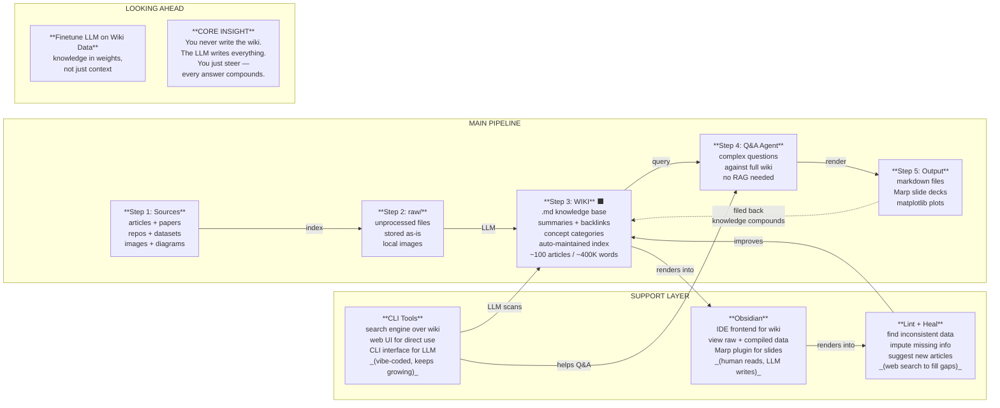

**작성 기준일:** 2026년 4월 3일  
**원출처:** [Andrej Karpathy X 포스트](https://x.com/karpathy/status/2039805659525644595) + [@jumperz X 포스트](https://x.com/jumperz/status/2039826228224430323)  
**분석 관점:** 아키텍처 이해 + 에이전트 AI 함의 + 최신 동향 연계

---

## 들어가며: 하나의 아키텍처가 말하는 것

Andrej Karpathy는 X(구 트위터)에 "LLM Knowledge Bases"라는 제목으로 자신의 개인 연구 워크플로우를 텍스트로 상세히 공유했다. 이에 @jumperz가 Karpathy의 글을 읽고 그 구조를 한눈에 파악할 수 있도록 "How LLMs Turn Raw Research Into a Living Knowledge Base"라는 제목의 아키텍처 도식으로 시각화하여 리트윗했다. 이 도식은 Karpathy의 글이 커뮤니티에 확산되는 데 결정적인 역할을 했다.

실상은 2026년 현재 AI 엔지니어링의 가장 핵심적인 패러다임 전환 중 하나를 압축한 내용이다. LLM을 단순한 대화 도구가 아니라 **지식을 스스로 조직하고 성장시키는 자율적 시스템**의 엔진으로 바라보는 새로운 시각이다.

핵심 메시지는 단 세 줄이다.

> "Collect sources. Let the LLM organize them. Ask questions."
> "Every answer makes the wiki smarter."

수집하고, 조직하고, 질문하면, 그 답이 다시 지식 기반을 풍부하게 만든다. 지식이 복리처럼 불어난다. 이 문서는 해당 아키텍처와 Karpathy의 상세 설명을 바탕으로, 이 시스템의 작동 원리를 깊이 분석하고, 현재 AI 생태계에서 어떤 의미를 지니는지를 서술적으로 풀어낸다.

아래는 @jumperz의 도식을 기반으로 재구성한 전체 아키텍처다.

이 문서는 해당 아키텍처의 각 구성 요소를 순서대로 분해하고, 배경 맥락, 커뮤니티 반응, 최신 동향까지 연결하여 분석한다.

---

## 1부: Karpathy는 누구인가, 왜 이 발언이 중요한가

Andrej Karpathy는 슬로바키아 출신의 캐나다-미국 AI 연구자로, 현대 딥러닝의 가장 중요한 실천가이자 교육자 중 한 명이다. OpenAI의 공동창립자이자 초창기 멤버로 활동했고, 이후 Tesla의 AI 및 오토파일럿 비전 총괄 디렉터로 일했다. 2024년에는 AI 교육 플랫폼인 Eureka Labs를 창립하여, 인간과 AI가 함께 협력하는 새로운 교육 모델을 실험하고 있다.

그가 특히 개발자 커뮤니티에서 갖는 영향력은, 단순히 연구자로서의 이력에서만 비롯되지 않는다. 그는 복잡한 개념을 명료하게 언어화하는 탁월한 능력이 있다. 2025년 초 그가 "바이브 코딩(Vibe Coding)"이라는 용어를 만들어냈을 때, 업계는 즉각적으로 그 개념을 흡수했다. 2026년 초에는 스스로 바이브 코딩이 이미 구시대적이라고 선언하며 "에이전틱 엔지니어링(Agentic Engineering)"이라는 새로운 개념을 제시했다. 이처럼 그의 발언 하나하나가 산업 전체의 어휘와 방향성에 영향을 미친다.

이번 "LLM Knowledge Bases" 포스트 역시 마찬가지다. 그는 자신이 최근 개인적으로 사용하면서 유용하다고 느낀 작업 방식을 텍스트로 상세히 공유했고, @jumperz가 이를 아키텍처 도식으로 시각화하면서 급속도로 확산되었다. 그 내용이 에이전트 AI 시스템 설계, 개인 지식 관리, RAG(검색 증강 생성) 아키텍처에 이르는 다양한 주제에 즉각적으로 반향을 일으켰다.

---

## 2부: 메인 파이프라인 — 왼쪽에서 오른쪽으로

### Step 1: Sources (소스)

가장 왼쪽에 위치한 첫 번째 박스는 "Sources"다. 여기에는 articles + papers, repos + datasets, images + diagrams 등이 포함된다. 즉, 사람이 연구 과정에서 마주치는 모든 형태의 원자료다.

Karpathy가 설명한 방식에 따르면, 그는 이 소스들을 `raw/`라는 디렉토리에 인덱싱한다. 웹 기사를 마크다운 파일로 변환할 때는 Obsidian Web Clipper 확장 프로그램을 즐겨 사용하며, 관련 이미지도 로컬에 저장해 LLM이 쉽게 참조할 수 있도록 한다. 이 단계에서 중요한 점은, 사람이 하는 일은 오직 "수집"뿐이라는 것이다. 데이터를 어떻게 구조화할지, 어떻게 분류할지는 LLM의 몫이다.

이것은 기존의 개인 지식 관리 시스템(PKM, Personal Knowledge Management)이 요구하던 방식과 근본적으로 다르다. Notion, Roam Research, Obsidian을 사용하는 사람들 대부분은 태그를 붙이고, 폴더를 만들고, 링크를 연결하는 데 상당한 시간과 에너지를 소비했다. Karpathy의 방식에서는 그 인지적 부담을 LLM에 완전히 위임한다.

### Step 2: raw/ (원본 저장소)

두 번째 스텝은 수집된 데이터가 처음 저장되는 공간, 즉 `raw/` 디렉토리다. 다이어그램에는 "unprocessed files stored as-is, local images"라고 적혀 있다. 파일들은 가공되지 않은 상태로 그대로 보관된다. 여기서 LLM이 "컴파일" 작업을 수행하며, 이 처리 화살표에 "LLM"이라는 레이블이 붙어 있다.

이 설계의 핵심은 원본의 불변성이다. `raw/`에 있는 파일들은 건드리지 않는다. LLM이 원본을 변형하는 것이 아니라, 원본을 읽고 새로운 지식 산출물인 위키를 생성한다. 이는 감사 추적성(auditability)과 재현성(reproducibility) 측면에서 중요하다. 원본 소스가 살아있기 때문에 언제든 위키의 내용을 원본과 대조하거나, 전혀 다른 방식으로 재컴파일할 수 있다.

### Step 3: WIKI (핵심 허브)

다이어그램에서 가장 두드러진 빨간색 박스가 Step 3, 즉 WIKI다. 이것은 전체 시스템의 중심이자 가장 중요한 구성 요소다. 다이어그램에도 이 박스가 유독 크고 강조되어 있는데, 그 이유가 있다. 위키는 단순한 정보 저장소가 아니라, 시스템 전체가 상호작용하는 **살아있는 지식 기반**이기 때문이다.

위키의 구성 요소를 도식에서 살펴보면 다음과 같다:

- `.md knowledge base` — 모든 내용이 마크다운 파일로 저장된다
- `summaries + backlinks` — 각 문서의 요약과, 관련 문서로의 역방향 링크
- `concept categories` — 개념별로 정리된 카테고리 구조
- `auto-maintained index` — LLM이 자동으로 유지하는 인덱스

그리고 주목할 만한 규모 표시가 있다: "~100 articles / ~400K words". 이것은 Karpathy 자신의 실제 사용 사례에서 나온 수치다. 약 100개의 기사, 약 40만 단어로 구성된 위키가 이미 복잡한 질의 응답을 처리할 수 있는 충분한 규모라는 것을 의미한다.

위키가 마크다운 파일들의 집합이라는 점도 전략적으로 중요하다. 마크다운은 인간이 읽기 쉬우면서도 LLM이 처리하기에 최적화된 형식이다. Obsidian 같은 도구에서 시각적으로 렌더링할 수 있고, 버전 관리 시스템(git)으로 추적할 수 있으며, 어떤 텍스트 에디터에서도 열어볼 수 있다. 특정 벤더나 포맷에 종속되지 않는다.

### Step 4: Q&A Agent (질의 응답 에이전트)

Step 3에서 충분히 성숙한 위키가 구축되면, Step 4의 Q&A 에이전트가 활성화된다. 다이어그램에는 "complex questions against full wiki, no RAG needed"라고 적혀 있다.

"no RAG needed"라는 문구는 의미심장하다. 일반적으로 대용량 지식 기반을 다룰 때 사람들은 벡터 데이터베이스를 구축하고, 임베딩 모델을 활용하여 관련 청크를 검색하는 RAG 파이프라인을 구성한다. 그런데 Karpathy는 이 수준의 규모(~100개 기사, ~40만 단어)에서는 LLM이 스스로 자동 유지하는 인덱스 파일과 요약본 덕분에 RAG 없이도 충분히 관련 정보를 찾아낼 수 있다고 말한다.

이것이 가능한 이유는, 위키 자체에 이미 구조화된 메타데이터가 포함되어 있기 때문이다. LLM이 자동으로 유지하는 인덱스 파일은 전체 위키의 지형도(topography)를 제공하며, 에이전트는 이 지형도를 바탕으로 어느 파일을 읽어야 하는지를 효율적으로 결정할 수 있다. 즉, 위키의 구조 자체가 검색 기능을 내재하고 있는 셈이다.

### Step 5: Output (출력)

마지막 스텝은 출력이다. 다이어그램에는 markdown files, Marp slide decks, matplotlib plots가 나열되어 있다. Karpathy는 텍스트/터미널에 답변을 받는 것보다, 마크다운 파일이나 슬라이드(Marp 형식), 시각화 이미지 형태로 출력을 받는 것을 선호한다고 말한다. 그리고 이 출력물들은 다시 Obsidian에서 열어볼 수 있다.

### 피드백 루프: "filed back — knowledge compounds"

도식에서 가장 중요한 화살표 중 하나는 Step 5(Output)에서 Step 3(WIKI)로 되돌아가는 피드백 루프다. "filed back — knowledge compounds"라는 레이블이 붙어 있다. 이것이 이 시스템을 단순한 검색 도구와 구분 짓는 결정적 특성이다.

Q&A를 통해 생성된 출력물 — 마크다운 보고서, 슬라이드, 분석 이미지 — 은 다시 위키에 편입된다. 이렇게 하면 사용자가 위키에 질문을 던진 행위 자체가 위키를 더 풍부하게 만드는 과정이 된다. 지식이 단선적으로 소비되는 것이 아니라, 순환하며 축적되는 것이다. 이것이 다이어그램 우상단의 핵심 메시지인 "Every answer makes the wiki smarter"의 의미다.

---

## 3부: 서포트 레이어 — 위키를 지탱하는 세 기둥

메인 파이프라인 아래에는 "SUPPORT LAYER: all connected to the wiki"라는 레이블과 함께 세 가지 보조 시스템이 그려져 있다. @jumperz는 이 층위를 메인 파이프라인과 분리하여 표현함으로써, 각 도구가 독립적이면서도 위키를 중심으로 모두 연결되어 있음을 효과적으로 시각화했다.

### Obsidian: 인간을 위한 IDE

Obsidian은 이 시스템에서 "IDE frontend"로 기능한다. 도식에 적힌 설명처럼, Obsidian은 raw 데이터와 컴파일된 위키, 그리고 파생 시각화 결과물을 한 곳에서 볼 수 있게 해준다. "human reads, LLM writes"라는 설명이 이 역할 분담을 완벽하게 요약한다. Obsidian은 인간이 위키를 탐색하고, 시각적으로 이해하고, 새로운 질문을 형성하는 공간이다. 반면 실제 위키 내용의 생성과 유지는 전적으로 LLM의 영역이다.

Karpathy는 Marp 플러그인을 활용해 마크다운을 슬라이드로 렌더링하는 것도 즐긴다고 밝혔다. Obsidian의 강점은 플러그인 생태계의 풍부함에 있으며, 이를 통해 다양한 방식으로 위키의 내용을 시각화하고 상호작용할 수 있다.

흥미롭게도, Obsidian은 기본적으로 로컬 마크다운 파일을 기반으로 작동한다. 이는 클라우드 의존도를 낮추고, 개인 데이터를 로컬에 보관하며, LLM이 파일 시스템에 직접 접근하기 쉬운 환경을 만들어준다.

### Lint + Heal: 지식 기반의 자가 치유

두 번째 서포트 레이어는 "Lint + Heal"이다. 도식에는 "find inconsistent data, impute missing info, suggest new articles, web search to fill gaps"라고 설명되어 있으며, "improves" 화살표로 위키와 연결된다.

소프트웨어 개발에서 "린트(lint)"는 코드의 품질을 검사하고, 일관성 없는 부분이나 잠재적 문제를 찾아내는 도구를 말한다. Karpathy는 이 개념을 지식 기반에 적용했다. LLM이 위키 전체를 주기적으로 순회하며 "건강 검진"을 수행하는 것이다.

이 과정에서 LLM이 하는 일들은 다음과 같다. 첫째, 위키 내에서 서로 모순되거나 불일치하는 정보를 발견한다. 예를 들어, 한 문서에서는 어떤 기술이 2024년에 등장했다고 쓰여 있는데, 다른 문서에서는 2023년이라고 기술되어 있을 수 있다. 둘째, 누락된 정보를 웹 검색을 통해 보완한다. 셋째, 기존 내용들 사이의 흥미로운 연결고리를 발견하고, 이를 다루는 새로운 기사를 제안한다. 이처럼 Lint + Heal은 위키의 내적 일관성과 완전성을 능동적으로 높여가는 기제다.

### CLI Tools: LLM을 위한 도구

세 번째 서포트 레이어는 "CLI Tools"다. 도식에는 "search engine over wiki, web UI for direct use, CLI interface for LLM, vibe-coded, keeps growing"이라고 적혀 있다. "LLM scans"와 "helps Q&A"라는 화살표로 나머지 요소들과 연결된다.

Karpathy는 위키를 처리하기 위한 추가 도구들을 직접 개발한다고 밝혔다. 특히 위키에 대한 간단한 검색 엔진을 바이브 코딩으로 만들었는데, 이 도구를 웹 UI로 직접 사용하기도 하고, 더 큰 규모의 질의를 처리할 때는 LLM에게 CLI 도구로 넘겨준다고 설명한다. 즉, CLI 도구는 인간과 LLM 모두가 사용하는 인터페이스다.

이 층위가 "keeps growing"이라고 표현된 것은, 필요에 따라 도구들이 계속 추가된다는 것을 의미한다. 시스템이 진화함에 따라 새로운 요구가 생기고, 그때마다 새로운 도구가 바이브 코딩을 통해 빠르게 추가된다. 이것은 아키텍처의 확장성을 보여주는 동시에, Karpathy 자신이 이 시스템을 얼마나 실용적이고 반복적인 방식으로 발전시키고 있는지를 보여준다.

---

## 4부: Looking Ahead — 미래를 향한 두 가지 시선

Karpathy의 글과 @jumperz의 도식 하단에는 "LOOKING AHEAD"라는 섹션이 있고, 두 가지 요소가 제시된다.

### 파인튜닝: 지식을 가중치에 담다

왼쪽의 점선 박스에는 "Finetune LLM on Wiki Data — knowledge in weights, not just context"라고 적혀 있다. 이것은 이 시스템의 자연스러운 진화 방향이다.

현재 시스템에서 LLM은 위키의 내용을 컨텍스트 윈도우로 읽어서 처리한다. 위키가 충분히 커지면, 파인튜닝을 통해 그 지식을 모델의 가중치 안에 직접 내재화할 수 있다. 이렇게 되면 LLM은 매번 파일을 읽지 않아도 위키의 내용을 "알고 있는" 상태가 된다. 컨텍스트 창의 한계를 넘어서는 지식을 처리할 수 있게 되고, 추론 속도와 효율성도 높아진다.

이것은 단순한 기술적 개선이 아니라, 지식 관리의 철학적 전환이기도 하다. 외부 데이터베이스에 의존하는 RAG 방식과 달리, 파인튜닝된 모델은 그 자체가 지식 저장소가 된다. 지식이 파일 시스템이 아니라 모델의 파라미터 속에 살아있게 되는 것이다.

### 코어 인사이트: 사용자는 조종만 한다

오른쪽의 빨간 박스, "CORE INSIGHT" 섹션에는 이런 문장이 적혀 있다.

> "You never write the wiki. The LLM writes everything. You just steer — every answer compounds."

이 한 문장이 전체 시스템의 철학을 담고 있다. 사용자의 역할은 콘텐츠 생산자가 아니라 방향 설정자다. 어떤 소스를 수집할지, 어떤 질문을 던질지를 결정하는 것이 사람의 일이며, 실제로 지식을 조직하고 글을 쓰고 연결하는 것은 LLM이 한다. 그리고 질문을 할 때마다 그 답이 위키를 더 풍부하게 만드는 과정이 반복되며, 지식은 복리처럼 불어난다.

---

## 5부: 커뮤니티의 반응 — 왜 이것이 중요한가

Karpathy의 텍스트 포스트를 도식으로 시각화하고 해석한 @jumperz의 반응이 원문에 인용되어 있는데, 이 분석이 이 시스템의 함의를 매우 예리하게 짚어낸다. @jumperz는 단순히 구조를 그린 것을 넘어, 이 시스템의 본질적 의미를 독자적으로 해석했다.

> "karpathy is showing one of the simplest AI architectures that actually works.. dump research into a folder, let the model organise it into a wiki, ask questions, then file the answers back in. the real insight is the loop...every query makes the wiki better. it compounds.. now thats a second brain building itself."

"second brain building itself", 즉 스스로 자라나는 세컨드 브레인이라는 표현은 이 시스템의 본질을 잘 포착한다. 기존의 세컨드 브레인 개념(Tiago Forte의 Building a Second Brain 방법론 등)은 항상 사람이 능동적으로 노트를 작성하고, 링크를 만들고, 정보를 구조화해야 했다. Karpathy의 시스템에서는 이 모든 과정이 자동화된다. 사람은 소스를 넣고 질문만 하면 되고, 나머지는 시스템이 알아서 한다.

또한 @jumperz는 이 아키텍처의 에이전트 AI에 대한 함의를 지적한다.

> "instead of pulling from shared memory every session, they build a living knowledge base that stays. your coordinator is not just coordinating tasks anymore.. it is maintaining institutional knowledge so every execution adds something back to the base."

이것은 에이전트 AI 시스템 설계에서 매우 중요한 통찰이다. 대부분의 AI 에이전트는 세션이 끝나면 상태가 리셋된다. 매번 새로운 대화를 시작할 때마다 컨텍스트를 다시 제공해야 한다. 그런데 Karpathy의 접근법처럼 영속적인 지식 파일을 유지하는 에이전트는, 세션을 넘나들면서 지식을 축적할 수 있다.

그리고 가장 중요한 지적은 다음이다.

> "agents that own their own knowledge layer do not need infinite context windows, they need good file organisation and the ability to read their own indexes. way cheaper, way more scalable, and way more inspectable than stuffing everything into one giant prompt."

무한한 컨텍스트 창이 필요하지 않다. 잘 조직된 파일과 자신의 인덱스를 읽는 능력이 필요하다. 이것은 현재 AI 업계에서 컨텍스트 창 크기를 늘리는 데 막대한 투자가 이루어지고 있는 현실과 대비되는 접근법이다. Karpathy의 아키텍처는 훨씬 저렴하고, 확장 가능하며, 검사 가능한 대안을 제시한다.

---

## 6부: Karpathy 루프와 Autoresearch의 연결

이 시스템을 이해하면, Karpathy가 2026년 3월에 공개한 또 다른 프로젝트 **autoresearch**와의 연결이 선명하게 드러난다.

Autoresearch는 AI 에이전트에게 소규모 LLM 학습 환경을 제공하고, 에이전트가 밤새 자율적으로 실험을 반복하도록 하는 시스템이다. 에이전트는 코드를 수정하고, 5분 동안 훈련시키고, 결과가 개선되었는지 확인하고, 개선되면 유지하고 그렇지 않으면 버리는 과정을 반복한다. 사람이 잠든 사이에 약 100회의 실험이 이루어진다.

이 두 시스템의 공통점은 **"마크다운이 사람과 에이전트 사이의 인터페이스"** 라는 점이다. LLM Knowledge Base에서는 마크다운 위키가 지식의 저장소이자 에이전트가 읽고 쓰는 파일이다. Autoresearch에서는 `program.md`라는 마크다운 파일이 에이전트에게 무엇을 할지 지시하는 "프로그램"이 된다. 사람은 마크다운을 작성하고, AI는 그 마크다운을 실행한다. 마크다운이 사실상 에이전트를 위한 새로운 프로그래밍 언어가 되는 것이다.

Autoresearch는 공개 직후 21,000개 이상의 GitHub 스타와 수백만 뷰를 기록했다. 이것은 커뮤니티가 이 패턴의 보편적 가능성을 즉각 인식했음을 보여준다. ML 학습에만 국한되지 않고, 측정 가능한 지표가 있는 모든 영역에 적용할 수 있는 패턴이기 때문이다.

---

## 7부: 기존 접근법과의 비교 — RAG, 벡터 DB, 그리고 이 시스템

이 시스템을 가장 잘 이해하는 방법 중 하나는, 기존의 대안들과 비교해보는 것이다.

### RAG(Retrieval-Augmented Generation)와의 비교

RAG는 현재 엔터프라이즈 AI에서 가장 널리 사용되는 지식 통합 방식이다. 대용량 문서를 작은 청크로 분할하고, 벡터 임베딩을 생성하여 벡터 데이터베이스에 저장한다. 질의가 들어오면 유사한 청크를 검색하여 LLM의 컨텍스트에 제공한다.

RAG의 장점은 대용량 데이터 처리에 있다. 수백만 개의 문서도 처리할 수 있고, 실시간으로 업데이트된 정보를 반영할 수 있다.

그러나 단점도 있다. 청크 분할이 문서의 의미적 연속성을 끊을 수 있다. 검색된 청크들이 서로 다른 맥락에서 온 것이기 때문에 일관성이 부족할 수 있다. 그리고 무엇보다, 벡터 DB 구축과 유지에 상당한 엔지니어링 비용이 든다.

Karpathy의 LLM Knowledge Base 방식은 이와 다르다. 위키 자체가 이미 LLM에 의해 구조화되고 인덱싱되어 있기 때문에, 별도의 벡터 DB 없이도 에이전트가 효율적으로 정보를 탐색할 수 있다. 규모가 작은 경우(~100개 기사 수준)에는 이 방식이 더 단순하고, 더 저렴하며, 더 투명하다.

단, 이 방식은 규모에 한계가 있다. 위키가 수천, 수만 개의 기사로 성장하면 컨텍스트 창의 한계에 부딪힌다. 이 경우 RAG나 파인튜닝과의 결합이 필요해진다. 즉, 두 접근법은 상호 배타적이 아니라 상호 보완적이다.

### Notion, Roam, Logseq 같은 PKM 도구와의 비교

기존의 개인 지식 관리 도구들은 사람이 직접 노트를 작성하고, 연결을 만들어야 한다. Karpathy의 시스템에서는 이 모든 과정이 LLM에 의해 자동화된다. 인지적 부담이 극적으로 줄어들며, 위키의 성장이 수집하는 소스의 양에 비례해 거의 자동으로 이루어진다.

물론 단점도 있다. LLM이 생성한 내용의 품질과 정확성에 의존해야 하며, 그 내용을 사람이 능동적으로 검토하지 않으면 오류가 누적될 수 있다. 이것이 Lint + Heal 레이어가 존재하는 이유이기도 하다.

---

## 8부: 아키텍처의 원칙 — 이 시스템이 잘 작동하는 이유

Karpathy의 LLM Knowledge Base가 실제로 잘 작동하는 데는 몇 가지 중요한 설계 원칙이 있다.

**첫째, 단일 진실의 소스(Single Source of Truth).** 모든 지식은 마크다운 파일로 표현되며, 하나의 디렉토리 구조 안에 존재한다. 이는 인간과 LLM 모두가 같은 파일을 읽고 쓴다는 것을 의미하며, 동기화 문제나 데이터 불일치를 방지한다.

**둘째, 인간과 LLM의 역할 분리.** "human reads, LLM writes"라는 원칙은 각자가 잘하는 일에 집중하게 한다. 인간은 어떤 소스를 수집할지, 어떤 질문을 던질지에 대한 높은 수준의 판단을 담당한다. LLM은 정보의 정리, 연결, 요약, 인덱싱이라는 반복적이고 지루한 작업을 담당한다.

**셋째, 복리 구조(Compounding Structure).** 매 질의가 위키를 개선한다는 것은, 시스템이 사용할수록 더 좋아진다는 것을 의미한다. 이것은 전통적인 도구들과 근본적으로 다른 가치 구조다. 기존 도구들은 사용한다고 해서 저절로 더 좋아지지 않는다. Karpathy의 시스템은 사용 자체가 투자다.

**넷째, 검사 가능성(Inspectability).** 모든 내용이 마크다운 파일로 저장되기 때문에, 사람이 언제든 직접 열어보고 확인할 수 있다. 블랙박스가 아니다. 이것은 AI 생성 콘텐츠에 대한 신뢰 문제를 해결하는 데 중요하다.

**다섯째, 도구 불가지론(Tool Agnosticism).** 마크다운이라는 범용 형식을 사용하기 때문에, 특정 AI 모델이나 도구에 종속되지 않는다. 오늘은 Claude로 위키를 컴파일하고, 내일은 GPT-4o나 Gemini를 쓸 수 있다. 어떤 LLM을 쓰든 마크다운을 읽고 쓸 수 있으면 된다.

---

## 9부: 에이전트 AI의 더 큰 그림

이 시스템을 에이전트 AI의 맥락에서 바라보면, 더 큰 함의가 드러난다.

현재 대부분의 AI 에이전트는 무상태(stateless)다. 각 세션이 독립적으로 시작되고 끝난다. 에이전트가 이전 세션에서 배운 것을 다음 세션에 활용하려면, 외부 메모리 시스템이 필요하다. Karpathy의 위키는 바로 이 영속적 메모리의 역할을 한다.

더 나아가, @jumperz가 지적했듯이, 이런 방식으로 지식 레이어를 소유한 에이전트는 무한한 컨텍스트 창이 필요하지 않다. 잘 조직된 파일 시스템과 자신의 인덱스를 읽는 능력만 있으면 된다. 이것은 현재 AI 업계의 컨텍스트 창 경쟁이 유일한 해법이 아닐 수 있음을 시사한다.

Karpathy는 포스트 말미에 이런 상상을 덧붙인다.

> "you could imagine that every question to a frontier grade LLM spawns a team of LLMs to automate the whole thing: iteratively construct an entire ephemeral wiki, lint it, loop a few times, then write a full report. Way beyond a `.decode()`."

이것은 2026년 현재 실제로 구현되고 있는 Deep Research 류의 시스템을 정확하게 예언한다. 사용자가 복잡한 질문을 던지면, 여러 LLM이 병렬로 소스를 수집하고, 임시 지식 기반을 구축하고, 품질을 검사하고, 최종 보고서를 작성하는 것이다. Karpathy의 개인적 워크플로우가 대규모 멀티에이전트 시스템의 청사진이 되는 셈이다.

---

## 10부: 실용적 적용 — 누가, 어떻게 이 방식을 쓸 수 있는가

이 시스템은 특정 분야의 연구자나 지식 작업자라면 누구든 적용해볼 수 있다.

**연구자:** 논문, 학술지 기사, 실험 보고서를 raw/ 디렉토리에 수집하고, LLM이 개념 중심의 위키를 구축하게 한다. 서로 다른 논문들 사이의 방법론적 유사성이나 모순을 LLM이 자동으로 찾아내게 할 수 있다.

**언론인 및 콘텐츠 창작자:** 특정 주제를 커버하기 위해 수집한 기사, 인터뷰, 데이터를 LLM이 구조화된 지식 기반으로 전환하게 한다. 기사를 쓸 때 이 위키에 질문을 던지면, LLM이 관련 소스와 인용문을 찾아 답변해준다.

**기업 컨설턴트 및 분석가:** 산업 보고서, 경쟁사 분석, 시장 데이터를 지속적으로 위키에 쌓아간다. 새로운 클라이언트 프로젝트가 시작될 때마다, 이미 축적된 위키에서 관련 인사이트를 즉각 끌어낼 수 있다.

**개발자:** 기술 문서, API 참조, 커뮤니티 포럼 토론을 위키로 구조화하여, 특정 기술 스택에 대한 개인화된 지식 기반을 구축할 수 있다. 팀 단위로 확장하면, 조직의 제도적 지식(institutional knowledge)을 자동으로 축적하는 시스템이 된다.

시작하는 방법은 단순하다. Obsidian을 설치하고, `raw/` 디렉토리를 만든다. 관심 있는 주제의 기사들을 Obsidian Web Clipper로 저장한다. Claude Code나 유사한 LLM 에이전트에게 `raw/`의 내용을 바탕으로 마크다운 위키를 구축하도록 지시한다. 이것이 시작이다.

---

## 마치며: 가장 단순한 아키텍처가 작동하는 이유

Karpathy의 LLM Knowledge Base 시스템이 주목받는 이유는, 그것이 복잡하기 때문이 아니다. 오히려 그것이 놀랍도록 단순하기 때문이다.

벡터 데이터베이스가 없다. 복잡한 파이프라인이 없다. 수십 개의 마이크로서비스가 없다. 그저 마크다운 파일들, Obsidian, LLM 에이전트, 그리고 피드백 루프가 있을 뿐이다.

그런데 이 단순함이 실제로 작동한다. 이것이 핵심 통찰이다. 현재의 LLM들은 파일을 읽고, 구조화된 마크다운을 작성하고, 인덱스를 유지하는 데 충분히 유능하다. 그리고 시스템이 단순할수록 검사하기 쉽고, 수정하기 쉽고, 신뢰하기 쉽다.

Karpathy는 이 시스템을 "해킹들의 모음(hacky collection of scripts)"이라고 겸손하게 표현하며, 여기서 훌륭한 제품이 나올 여지가 있다고 말한다. 실제로 2026년 현재 이 아이디어에서 영감을 받은 다양한 도구와 서비스들이 등장하고 있다.

그러나 가장 중요한 것은 제품이 아니라 패턴이다. 수집하고, LLM이 조직하고, 질문하고, 답을 다시 집어넣는다. 지식이 복리로 자란다. 사용자는 조종만 한다. 이 루프가 올바르게 작동할 때, 당신의 컴퓨터 안에 스스로 자라나는 세컨드 브레인이 탄생한다.

---

*문서 끝.*

**참고 출처**
- Andrej Karpathy X 포스트 (원문 텍스트): https://x.com/karpathy/status/2039805659525644595
- @jumperz X 포스트 (아키텍처 도식화 및 해설): https://x.com/jumperz/status/2039826228224430323
- Karpathy autoresearch GitHub: https://github.com/karpathy/autoresearch
- Karpathy 2025 LLM Year in Review: https://karpathy.bearblog.dev/year-in-review-2025/
- DataCamp autoresearch 가이드 (2026): https://www.datacamp.com/tutorial/guide-to-autoresearch
