> **⚠️ 면책 조항 (Disclaimer)**
> 이 문서는 TradingAgents 프로젝트의 기술적 구조와 연구적 의미를 탐구하기 위해 작성된 분석 문서입니다. 특정 자산에 대한 투자를 권유하거나 금융 투자 조언을 제공하려는 목적으로 작성된 것이 아닙니다. TradingAgents는 연구 목적으로 설계된 시뮬레이션 프레임워크이며, 실제 금융 거래에 직접 활용해서는 안 됩니다.

---
## 관련글

[**TradingAgents: AI 멀티에이전트 헤지펀드 시뮬레이션 완전 분석**](https://k82022603.github.io/posts/tradingagents-ai-%EB%A9%80%ED%8B%B0%EC%97%90%EC%9D%B4%EC%A0%84%ED%8A%B8-%ED%97%A4%EC%A7%80%ED%8E%80%EB%93%9C-%EC%8B%9C%EB%AE%AC%EB%A0%88%EC%9D%B4%EC%85%98-%EC%99%84%EC%A0%84-%EB%B6%84%EC%84%9D/)

## 목차

1. [들어가며: 왜 TradingAgents인가](#1-들어가며-왜-tradingagents인가)
2. [프로젝트 개요](#2-프로젝트-개요)
3. [전체 아키텍처 해설](#3-전체-아키텍처-해설)
4. [애널리스트 팀 상세 분석](#4-애널리스트-팀-상세-분석)
5. [리서처 팀: Bullish vs Bearish 토론](#5-리서처-팀-bullish-vs-bearish-토론)
6. [트레이더 에이전트의 의사결정](#6-트레이더-에이전트의-의사결정)
7. [리스크 관리 팀과 포트폴리오 매니저](#7-리스크-관리-팀과-포트폴리오-매니저)
8. [에이전트 간 커뮤니케이션 프로토콜](#8-에이전트-간-커뮤니케이션-프로토콜)
9. [기술 스택: LangGraph와 LLM 생태계](#9-기술-스택-langgraph와-llm-생태계)
10. [성능 실험 결과](#10-성능-실험-결과)
11. [설치 및 사용법](#11-설치-및-사용법)
12. [다중 에이전트 설계 철학과 시사점](#12-다중-에이전트-설계-철학과-시사점)
13. [LxM(Ludus Ex Machina) 관점에서의 비교 분석](#13-lxmludus-ex-machina-관점에서의-비교-분석)
14. [한계와 향후 과제](#14-한계와-향후-과제)
15. [참고 자료](#15-참고-자료)

---

## 1. 들어가며: 왜 TradingAgents인가

금융 시장은 인간의 인지 능력이 한계를 드러내는 가장 극단적인 정보 처리 환경 중 하나다. 매일 수천 개의 기업이 재무 데이터를 공개하고, 글로벌 뉴스는 실시간으로 시장 심리를 바꾸며, 소셜 미디어는 대중의 집단 감정을 증폭시킨다. 전통적인 퀀트 트레이딩은 이러한 데이터를 수치화하고 규칙 기반 알고리즘으로 처리해왔지만, 정성적 판단과 맥락 이해가 필요한 영역에서는 명확한 한계를 보여왔다.

바로 이 지점에서 대규모 언어 모델(LLM, Large Language Model)이 등장한다. LLM은 자연어로 된 뉴스를 읽고, 재무 보고서를 해석하며, 심지어 소셜 미디어의 감정 흐름을 파악하는 능력을 가지고 있다. 그러나 초기의 LLM 기반 금융 연구들은 대부분 단일 에이전트가 모든 것을 처리하는 방식을 택했다. 이는 마치 한 명의 애널리스트에게 기술 분석, 기본적 분석, 뉴스 분석, 심리 분석을 동시에 수행하도록 요구하는 것과 같다. 인간 조직이 역할을 분담하듯, AI 에이전트도 전문화될 때 더 나은 성과를 낼 수 있다는 아이디어가 바로 **TradingAgents**의 출발점이다.

### 단일 에이전트의 인지 과부하 문제

단일 LLM 에이전트가 금융 의사결정을 담당할 때 발생하는 근본적인 문제는 **인지 과부하(Cognitive Overload)** 다. 복잡한 시장 분석에는 서로 다른 데이터 유형(구조화된 수치 데이터, 비구조화된 텍스트, 시계열 패턴 등)에 대한 전문적 해석이 동시에 필요하다. 단일 에이전트가 이 모든 것을 처리하면 각 영역에서의 분석 깊이가 얕아지고, 한 영역의 강한 신호가 다른 영역의 약한 신호를 압도하는 **정보 비대칭 문제**가 발생한다.

TradingAgents는 이를 해결하기 위해 실제 트레이딩 회사의 조직 구조를 그대로 AI 에이전트 네트워크로 구현했다. 각 에이전트는 자신이 가장 잘 할 수 있는 분석에 집중하고, 그 결과를 체계적인 프로토콜을 통해 다음 단계 에이전트에게 전달한다.

---

## 2. 프로젝트 개요

### 기본 정보

| 항목 | 내용 |
|------|------|
| **프로젝트명** | TradingAgents: Multi-Agents LLM Financial Trading Framework |
| **개발 주체** | Tauric Research |
| **연구 기관** | UCLA + MIT |
| **주요 저자** | Yijia Xiao, Edward Sun, Di Luo, Wei Wang |
| **논문** | arXiv:2412.20138 (2024년 12월 공개) |
| **라이선스** | Apache-2.0 (상업적 이용 가능) |
| **GitHub 스타** | 약 30,000개 (2026년 4월 기준) |
| **최신 버전** | v0.2.0 (2026년 2월 릴리스) |
| **백본 프레임워크** | LangGraph |
| **지원 언어** | Python 3.13 |

### 핵심 아이디어

TradingAgents의 핵심 아이디어는 단순하지만 강력하다: **"실제 투자 회사처럼 조직화된 AI 에이전트들이 서로 토론하고 협력하여 투자 결정을 내린다."**

이 접근법은 두 가지 핵심 원리를 기반으로 한다. 첫째, **역할 전문화(Role Specialization)**: 복잡한 금융 분석 과제를 세분화하여 각 에이전트가 자신의 전문 영역에만 집중하도록 한다. 둘째, **구조화된 토론(Structured Debate)**: 강세(Bullish) 관점과 약세(Bearish) 관점을 가진 에이전트들이 체계적인 토론을 통해 균형 잡힌 시장 분석을 수행한다.

---

## 3. 전체 아키텍처 해설

TradingAgents의 전체 파이프라인은 데이터 수집부터 거래 실행까지 6단계를 거친다. 왼쪽의 원시 데이터 소스에서 시작하여 오른쪽의 실행 단계로 흐르는 선형 파이프라인이되, 각 단계 내부에서는 에이전트 간 토론이 활발하게 이루어진다.

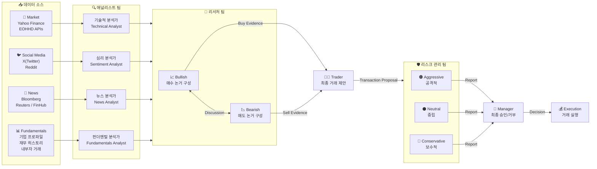

### 3.1 데이터 입력 레이어: 4가지 데이터 소스

파이프라인의 시작점에는 4종류의 외부 데이터 소스가 각 전문 애널리스트에게 연결된다.

**① 시장 데이터 (Market)**: Yahoo Finance, EOHDH APIs 등의 금융 데이터 플랫폼에서 주가, 거래량, 기술적 지표 등 정량적 시장 데이터를 수집한다.

**② 소셜 미디어 (Social Media)**: X(구 Twitter), Reddit 등 소셜 플랫폼에서 특정 종목에 대한 대중의 반응과 감정 데이터를 수집한다. 소셜 미디어는 제도적 투자자들이 반응하기 전 대중의 심리 변화를 포착하는 선행 지표로 활용된다.

**③ 뉴스 (News)**: Bloomberg, Reuters, FinHub 등 전문 금융 뉴스 소스에서 거시 경제 지표, 정책 변화, 기업 이벤트 등을 수집한다.

**④ 기업 펀더멘털 (Fundamentals)**: 기업 프로파일, 재무 히스토리, 내부자 거래 정보 등 기업의 본질적 가치를 평가하는 데 필요한 데이터를 수집한다.

### 3.2 에이전트 계층 구조

전체 시스템은 5개 계층으로 구성된다.

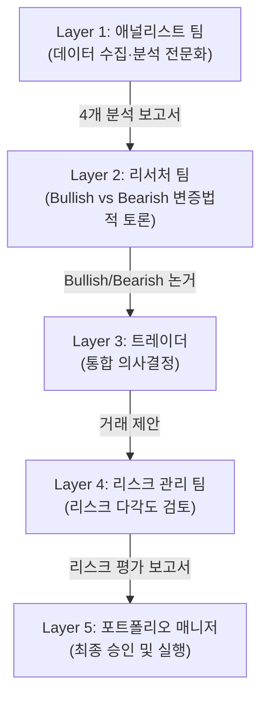

---

## 4. 애널리스트 팀 상세 분석

4명의 전문화된 애널리스트 에이전트가 각자 담당 영역에서 독립적으로 분석을 수행하고 보고서를 생성한다. Apple Inc.(AAPL)의 2024년 11월 분석 사례를 통해 각 에이전트의 작동 방식을 살펴본다.

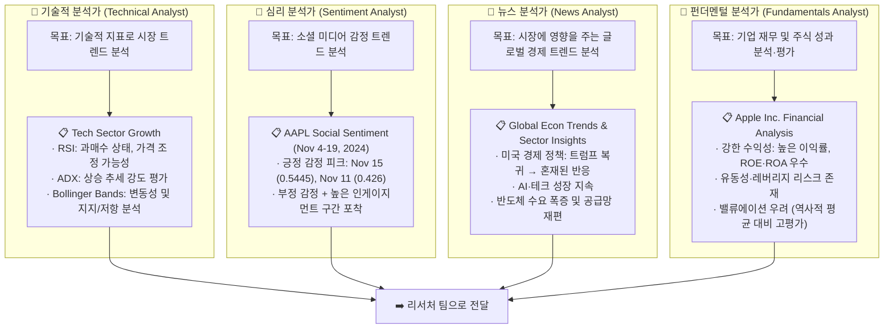

### 4.1 기술적 분석가 (Technical Analyst)

이 에이전트는 주가 차트와 기술적 지표를 집중적으로 분석한다. RSI(Relative Strength Index)를 통해 과매수 상태와 가격 조정 가능성을 경고하고, ADX(Average Directional Index)로 추세 강도를 측정하며, 볼린저 밴드로 가격 변동성과 지지/저항 구간을 분석한다. 단기 트레이딩 타이밍 결정에 가장 직접적인 영향을 미치는 에이전트다.

### 4.2 심리 분석가 (Sentiment Analyst)

소셜 플랫폼의 방대한 비정형 텍스트를 처리하여 대중의 심리적 흐름을 수치화한다. AAPL 분석 사례에서 11월 15일 긍정 감정 점수 0.5445라는 피크를 포착했다. 소셜 미디어 감정 분석의 가치는 제도권 투자자들이 반응하기 전에 대중의 기대나 불안을 선제적으로 포착할 수 있다는 데 있다.

### 4.3 뉴스 분석가 (News Analyst)

Bloomberg, Reuters, FinHub 등의 전문 뉴스 소스를 종합하여 거시 경제적 맥락을 제공한다. 단순한 뉴스 요약이 아니라 특정 이벤트가 분석 대상 종목에 미치는 구체적 영향을 연결 짓는 추론 능력이 핵심이다. 트럼프 복귀로 인한 정책 불확실성, AI 칩 수요 폭증 등 거시적 흐름과 AAPL의 연결 고리를 분석한다.

### 4.4 펀더멘털 분석가 (Fundamentals Analyst)

기업의 본질적 가치를 재무적 수치로 평가한다. 높은 이익률과 ROE·ROA는 긍정적으로 평가하면서도, 높은 부채 비율과 역사적 평균 대비 고평가된 밸류에이션을 리스크 요인으로 지적했다.

---

## 5. 리서처 팀: Bullish vs Bearish 토론

TradingAgents에서 가장 독창적인 설계 요소는 **구조화된 변증법적 토론(Structured Dialectical Debate)** 이다. 강세(Bullish)와 약세(Bearish) 두 입장의 연구팀이 서로의 주장을 검토하고 반박하며 균형 잡힌 시장 평가를 도출한다.

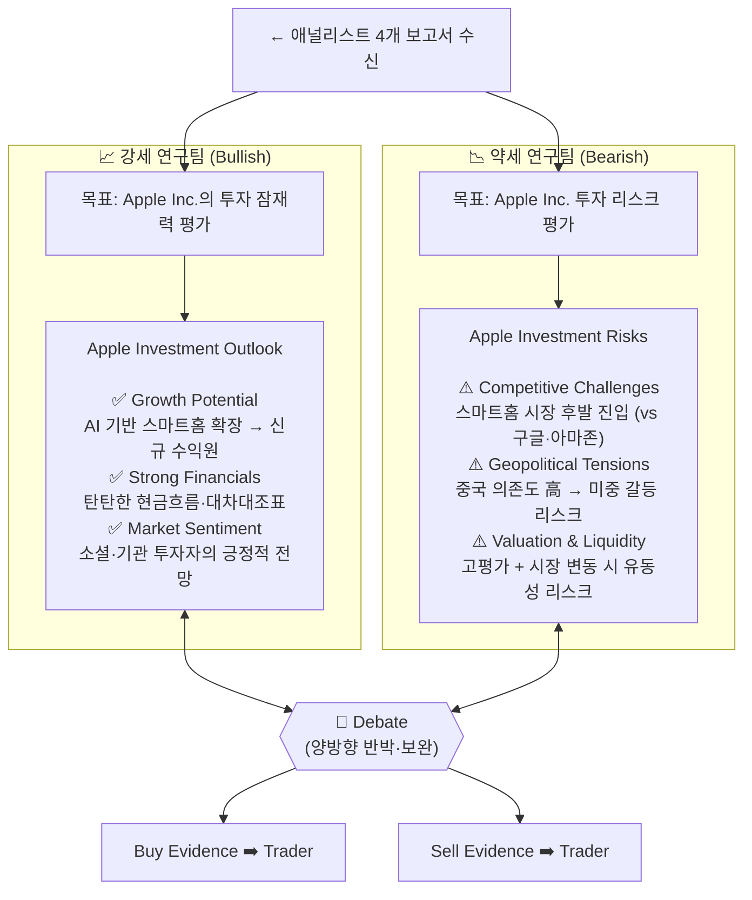

### 5.1 강세 연구팀 (Bullish Researchers)

강세 연구팀은 애널리스트 팀의 데이터에서 긍정적 신호를 선별하여 매수 논거를 구성한다. AI 기반 스마트홈 확장이 새로운 수익원을 창출하고, 강한 재무 상태가 장기 안전성을 보장하며, 긍정적 시장 심리가 상승 모멘텀을 지지한다는 논거를 전개한다.

### 5.2 약세 연구팀 (Bearish Researchers)

약세 연구팀은 동일한 데이터에서 부정적 신호와 잠재적 위험 요소를 발굴한다. 스마트홈 시장 후발 진입에 따른 경쟁 열위, 중국 시장 의존도와 지정학적 긴장, 과도한 밸류에이션과 유동성 리스크를 매도 논거로 제시한다.

### 5.3 토론 구조의 의미: 확증 편향 방지

이 설계의 핵심 가치는 **확증 편향(Confirmation Bias) 방지**에 있다. 단일 에이전트나 동질적인 그룹은 초기에 형성된 관점을 강화하는 방향으로 정보를 해석하는 경향이 있다. 강제적으로 반대 관점을 취하는 에이전트를 배치함으로써 더 균형 잡힌 분석이 가능해진다. 이는 실제 투자 세계에서 "악마의 변호인(Devil's Advocate)" 기법과 본질적으로 같은 원리다.

---

## 6. 트레이더 에이전트의 의사결정

리서처 팀의 토론 결과를 받아 실제 거래 결정을 내리는 트레이더 에이전트는 파이프라인에서 가장 복잡한 통합 추론을 수행한다.

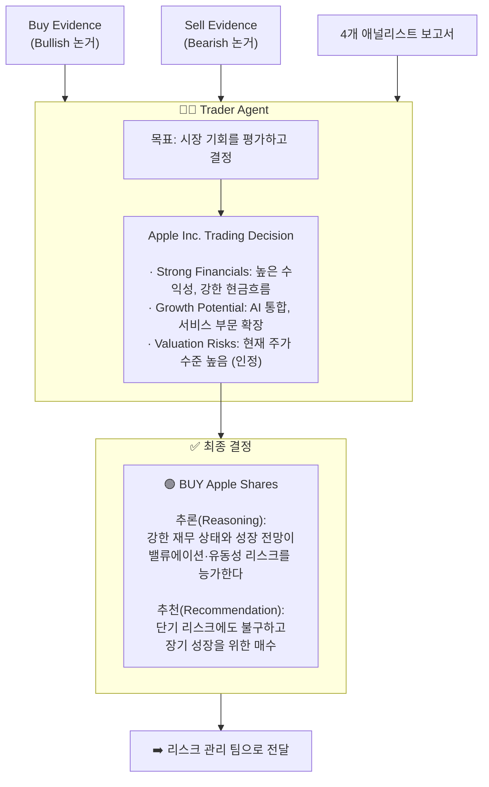

### 6.1 트레이더의 역할

트레이더 에이전트는 단순히 "매수" 또는 "매도"를 결정하는 것이 아니라, 얼마를, 언제, 왜 거래해야 하는지를 구체적으로 제안한다. 애널리스트와 리서처의 추천을 종합 평가하고, 거래 타이밍과 포지션 크기를 결정하며, 시장 변화에 따른 포트폴리오 조정 방향을 제시한다.

### 6.2 설명 가능한 의사결정

TradingAgents의 중요한 특징은 트레이더의 모든 결정이 자연어로 된 추론 과정과 함께 제공된다는 점이다. 전통적인 딥러닝 트레이딩 모델의 블랙박스 문제를 해결하여, 왜 그 결정을 내렸는지 검토하고 감사(Audit)할 수 있다. 이는 향후 AI 기반 금융 시스템의 규제 준수 측면에서 중요한 장점이다.

### 6.3 Deep Thinking 모델 선택적 활용

복잡한 추론이 필요한 트레이더 단계에는 OpenAI o1처럼 더 강력한 추론 모델(Deep Think LLM)을 선택적으로 배치할 수 있다. 이는 비용과 성능의 균형을 최적화하는 전략으로, 단순한 데이터 처리에는 가벼운 모델을, 핵심 의사결정에는 강력한 모델을 투입하는 방식이다.

---

## 7. 리스크 관리 팀과 포트폴리오 매니저

트레이더의 거래 제안이 최종 실행되기 전에 거치는 마지막 관문으로, 세 가지 다른 리스크 철학을 가진 에이전트들이 동일한 제안을 다각도로 검토한다.

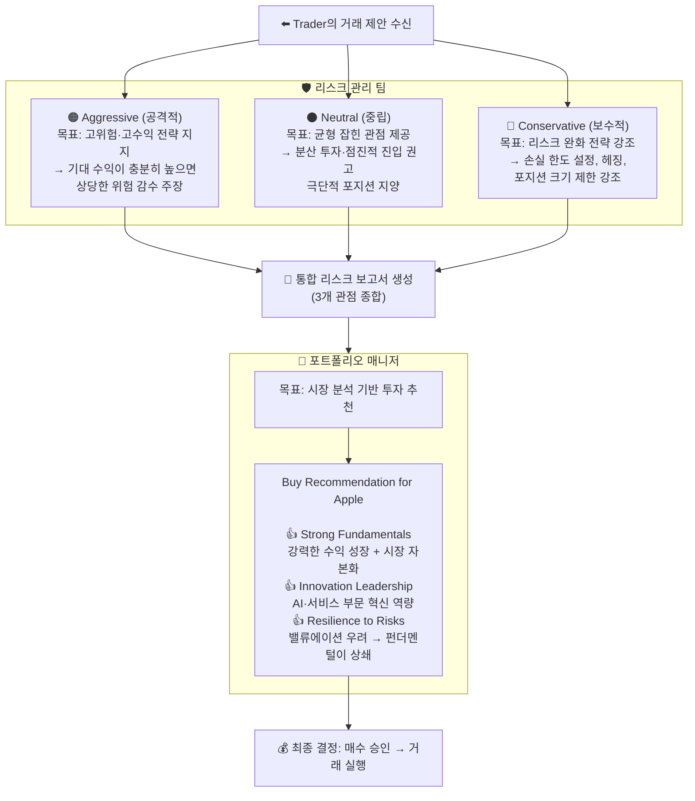

### 7.1 세 가지 리스크 프로파일의 역할

리스크 관리 팀은 동일한 거래 제안을 세 가지 전혀 다른 철학으로 평가한다. 공격적 에이전트는 모멘텀과 성장 스토리를 강조하며 적극적 진입을 지지한다. 중립 에이전트는 리스크와 수익의 균형을 유지하며 분산 투자를 권고한다. 보수적 에이전트는 최악의 시나리오를 항상 고려하며 손실 한도 설정과 헤징을 강조한다.

이 세 관점의 충돌과 합의가 리스크 관리의 실질적 효과를 만들어낸다. 실험 결과에서 TradingAgents의 최대 낙폭(MDD)이 AAPL 기준 0.91%로 매우 낮게 유지된 것은 이 구조가 효과적으로 작동했음을 보여준다.

### 7.2 포트폴리오 매니저의 최종 결정

포트폴리오 매니저는 트레이더의 제안과 리스크 팀의 보고서를 종합하여 최종 승인 또는 거부를 결정한다. AAPL 사례에서는 강한 펀더멘털과 혁신 역량이 밸류에이션 우려를 상쇄한다고 판단하여 매수를 최종 승인했다. 승인된 거래는 시뮬레이션 거래소로 전달되어 실행된다.

---

## 8. 에이전트 간 커뮤니케이션 프로토콜

TradingAgents의 기술적 차별점 중 하나는 에이전트들이 어떻게 소통하는지에 관한 **커뮤니케이션 프로토콜 설계**다.

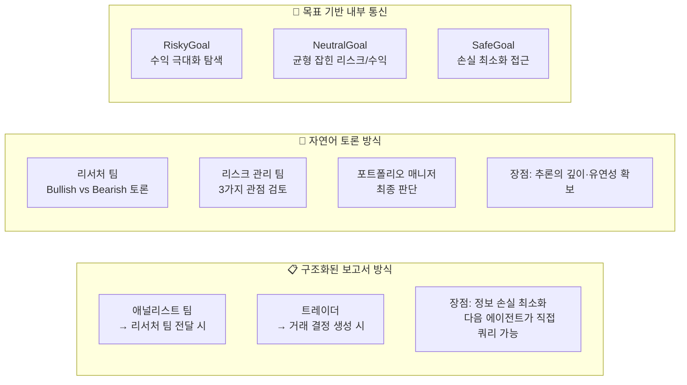

### 8.1 구조화된 출력 + 자연어 대화의 혼합

기존 다중 에이전트 프레임워크들은 대부분 에이전트 간 소통을 완전히 비구조화된 자연어 대화에 의존했다. 이 방식은 유연하지만 대화가 길어질수록 컨텍스트 손실이 발생하고 핵심 정보가 희석될 위험이 있다. TradingAgents는 이를 해결하기 위해 **목적에 따라 두 가지 커뮤니케이션 모드를 선택적으로 활용**한다.

구조화된 보고서 방식은 애널리스트 팀이 리서처 팀에게 분석 결과를 전달할 때, 그리고 트레이더가 거래 결정을 생성할 때 사용된다. 명확한 포맷과 키-밸류 구조로 정보를 압축하여 전달함으로써 정보 손실을 최소화한다.

자연어 토론 방식은 리서처 팀의 Bullish-Bearish 토론, 리스크 관리 팀의 다각도 검토, 포트폴리오 매니저의 최종 판단 과정에서 사용된다. 추론의 깊이와 유연성이 중요한 단계다.

### 8.2 ReAct 프롬프팅 프레임워크

모든 에이전트는 **ReAct(Reasoning + Acting)** 프롬프팅 프레임워크를 활용한다. 에이전트가 행동(Action)을 취하기 전에 추론(Reasoning) 단계를 명시적으로 거치도록 강제하는 기법으로, 의사결정 과정이 투명하게 기록되고 중간 추론 단계를 검토하여 오류를 조기에 발견할 수 있다.

---

## 9. 기술 스택: LangGraph와 LLM 생태계

### 9.1 전체 기술 스택 구성

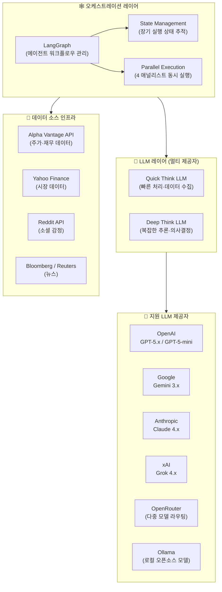

### 9.2 LangGraph가 선택된 이유

LangGraph는 복잡한 다단계 AI 파이프라인을 그래프 구조로 정의하고 관리할 수 있게 해준다. 상태 관리(State Management)를 통해 장기 실행되는 워크플로우에서 각 에이전트의 상태를 체계적으로 추적하고, 에이전트 출력에 따라 다음 에이전트로 유연하게 분기하는 조건부 라우팅이 가능하다. 또한 4명의 애널리스트 에이전트를 병렬로 실행하여 처리 속도를 높이고, 그래프 구조로 시각화된 워크플로우를 통해 각 단계의 동작을 추적할 수 있다.

### 9.3 Quick Think vs Deep Think LLM 분리 전략

TradingAgents는 에이전트의 역할에 따라 두 종류의 LLM을 선택적으로 배치한다.

| 구분 | 활용 단계 | 특성 |
|-----|----------|------|
| **Quick Think LLM** | 데이터 수집, 간단한 분류, 요약 | 빠른 처리, 비용 효율적 |
| **Deep Think LLM** | 복잡한 분석, 토론, 최종 의사결정 | 강력한 추론, 높은 품질 |

이 전략은 실제 조직에서 간단한 업무는 주니어 직원에게, 복잡한 판단은 시니어 전문가에게 맡기는 것과 같은 원리다.

### 9.4 지원 LLM 제공자

| LLM 제공자 | 모델 예시 | 주요 활용 시나리오 |
|-----------|---------|----------------|
| **OpenAI** | GPT-5.x, GPT-5-mini | 복잡한 추론, 빠른 처리 |
| **Google** | Gemini 3.x | 대용량 컨텍스트 처리 |
| **Anthropic** | Claude 4.x | 긴 문서 분석, 복잡한 추론 |
| **xAI** | Grok 4.x | 실시간 정보 처리 |
| **OpenRouter** | 다양한 모델 라우팅 | 비용 최적화 |
| **Ollama** | 로컬 오픈소스 모델 | 프라이버시, 비용 절감 |

---

## 10. 성능 실험 결과

TradingAgents 논문(arXiv:2412.20138)에서는 2024년 6~11월 기간 동안 AAPL(애플), GOOGL(구글), AMZN(아마존) 세 종목을 대상으로 실시한 시뮬레이션 백테스트 결과를 제시한다.

### 10.1 비교 기준선 전략

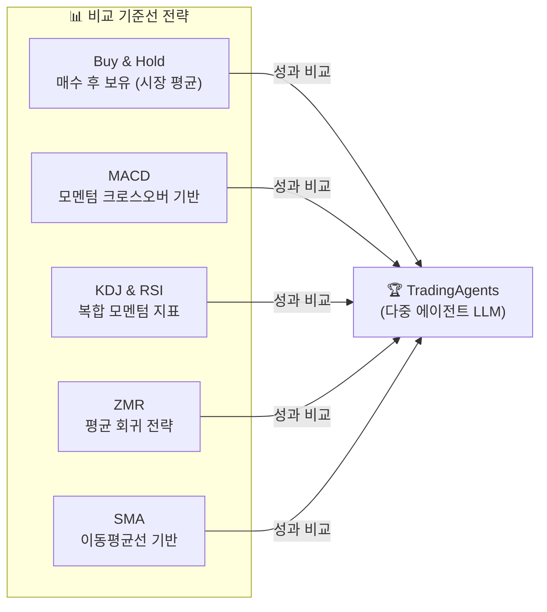

### 10.2 주요 성과 지표

| 종목 | 전략 | 누적 수익률(CR%) | 연환산 수익률(ARR%) | 샤프 비율(SR) | 최대 낙폭(MDD%) |
|-----|-----|:-----------:|:-----------:|:--------:|:----------:|
| AAPL | Buy & Hold | -5.23 | -5.09 | -1.29 | 11.90 |
| AAPL | MACD | -1.49 | -1.48 | -0.81 | 4.53 |
| AAPL | KDJ & RSI | 2.05 | 2.07 | 1.64 | 1.09 |
| AAPL | ZMR | 0.57 | 0.57 | 0.17 | 0.86 |
| AAPL | SMA | -3.20 | -2.97 | -1.72 | 3.67 |
| **AAPL** | **TradingAgents** | **26.62** | **30.50** | **8.21** | **0.91** |
| GOOGL | Buy & Hold | 7.78 | 8.09 | 1.35 | 13.04 |
| GOOGL | 최고 기준선 | 6.23 | 6.43 | 2.31 | 1.22 |
| **GOOGL** | **TradingAgents** | **24.36** | **27.58** | **6.39** | **1.69** |
| AMZN | Buy & Hold | 17.10 | 17.60 | 3.53 | 3.80 |
| AMZN | 최고 기준선 | 11.01 | 11.60 | 2.22 | 3.97 |
| **AMZN** | **TradingAgents** | **23.21** | **24.90** | **5.60** | **2.11** |

### 10.3 결과 해석

TradingAgents는 모든 종목에서 모든 기준선 전략을 상회하는 성과를 달성했다. 세 가지 특히 주목할 만한 결과가 있다.

첫째, **압도적인 샤프 비율**이다. AAPL에서 샤프 비율 8.21을 달성했다. 일반적으로 샤프 비율 2.0 이상이면 우수한 투자 전략으로 평가받는다는 점을 고려하면, 8.21은 리스크 대비 수익 효율성 측면에서 탁월한 수치다.

둘째, **낮은 최대 낙폭(MDD)** 이다. AAPL에서 최대 낙폭이 0.91%에 불과했다. Buy & Hold의 11.90%나 MACD의 4.53%에 비해 현저히 낮다. 높은 수익을 내면서도 리스크를 최소화했다는 것은 리스크 관리 팀의 설계가 효과적으로 작동했음을 보여준다.

셋째, **세 종목에 걸친 일관된 성과**다. 특정 종목이나 기간에 과적합(Overfitting)되지 않았음을 시사한다.

---

## 11. 설치 및 사용법

### 11.1 설치 과정

```bash
# 1. 저장소 클론
git clone https://github.com/TauricResearch/TradingAgents.git
cd TradingAgents

# 2. 가상환경 생성 및 활성화
conda create -n tradingagents python=3.13
conda activate tradingagents

# 3. 의존성 설치
pip install -r requirements.txt
# 또는
pip install .
```

### 11.2 API 키 설정

```bash
# LLM 제공자 키 (원하는 제공자 선택)
export OPENAI_API_KEY="your-openai-key"
export ANTHROPIC_API_KEY="your-anthropic-key"
export GOOGLE_API_KEY="your-google-key"
export XAI_API_KEY="your-xai-key"
export OPENROUTER_API_KEY="your-openrouter-key"

# 시장 데이터 키 (필수)
export ALPHA_VANTAGE_API_KEY="your-alpha-vantage-key"

# 또는 .env 파일 활용
cp .env.example .env
```

### 11.3 CLI 사용법

```bash
# 인터랙티브 CLI 실행
python -m cli.main
```

CLI를 실행하면 분석할 종목 심볼, 날짜, 사용할 LLM, 분석 깊이 등을 대화형으로 설정할 수 있다. 분석이 진행되는 동안 각 에이전트의 실행 상태가 실시간으로 표시된다.

### 11.4 Python 코드에서 직접 사용

```python
from tradingagents.graph.trading_graph import TradingAgentsGraph
from tradingagents.default_config import DEFAULT_CONFIG

# 기본 설정으로 초기화
ta = TradingAgentsGraph(debug=True, config=DEFAULT_CONFIG.copy())

# NVDA 주식에 대한 2026-01-15 기준 분석 실행
_, decision = ta.propagate("NVDA", "2026-01-15")
print(decision)
```

### 11.5 고급 설정: LLM 커스터마이징

```python
config = DEFAULT_CONFIG.copy()

# LLM 제공자 및 모델 설정
config["llm_provider"] = "anthropic"
config["deep_think_llm"] = "claude-sonnet-4-6"   # 복잡한 추론용
config["quick_think_llm"] = "claude-haiku-4-5"   # 빠른 처리용

# 토론 깊이 설정 (많을수록 더 깊은 분석, API 비용 증가)
config["max_debate_rounds"] = 3
config["online_tools"] = True

ta = TradingAgentsGraph(debug=True, config=config)
_, decision = ta.propagate("AAPL", "2024-11-15")
print(decision)
```

---

## 12. 다중 에이전트 설계 철학과 시사점

### 12.1 현실 세계 조직 모방의 가치

TradingAgents의 설계에서 가장 주목할 만한 점은 단순히 기술적 성능을 최적화한 것이 아니라 **실제 인간 조직의 의사결정 구조를 AI 시스템으로 이식**했다는 것이다.

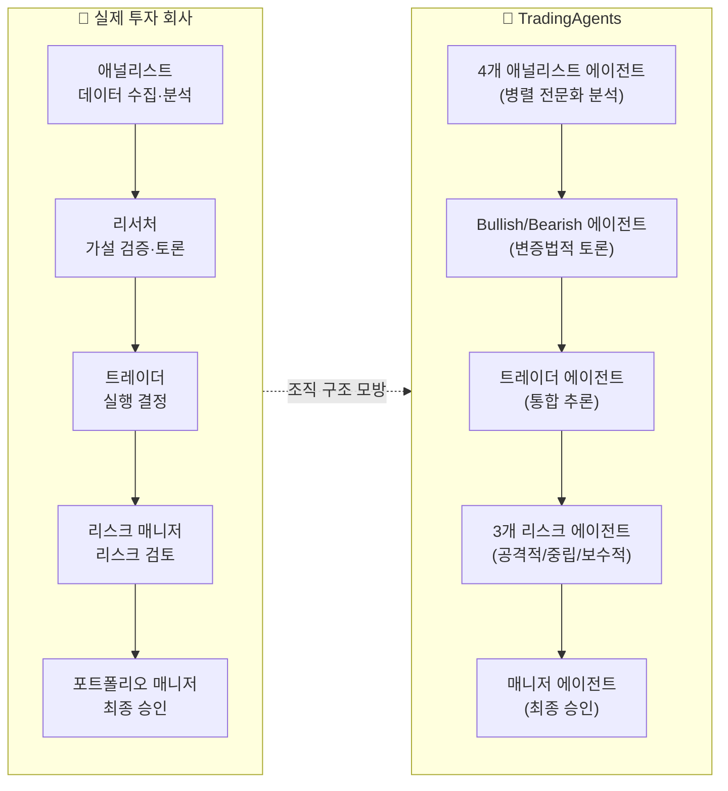

인간 투자 회사에서 좋은 투자 결정이 나오는 이유는 개인 천재의 직관보다는 **다양한 전문성을 가진 팀의 구조화된 협업** 덕분이다. TradingAgents는 수십 년에 걸쳐 금융 산업이 진화시킨 이 집단 지성 구조를 LLM 에이전트 네트워크로 재현했다.

### 12.2 단일 LLM에서 멀티 에이전트 LLM으로의 패러다임 전환

이 프로젝트는 AI 시스템 설계의 더 넓은 패러다임 전환을 반영한다. 단일 초대형 모델이 모든 것을 처리하는 접근법에서, **전문화된 에이전트들의 협업 네트워크**로의 전환이다.

이 전환의 핵심 인사이트는 복잡한 문제는 분해(Decomposition)를 통해 더 효과적으로 해결된다는 것, 서로 다른 관점(Bullish/Bearish)의 충돌이 더 균형 잡힌 결론을 낸다는 것, 그리고 체계적인 검증과 승인 프로세스가 오류를 줄인다는 것이다.

### 12.3 설명 가능한 AI (XAI)의 실용적 구현

금융 분야에서 AI 의사결정의 최대 걸림돌 중 하나는 **블랙박스 문제**다. 딥러닝 기반 트레이딩 모델은 왜 그 결정을 내렸는지 설명할 수 없기 때문에 규제 기관의 승인을 받기 어렵고, 실패 시 원인 분석도 불가능하다. TradingAgents는 모든 에이전트가 자연어로 추론 과정을 명시함으로써 이 문제를 해결하는 XAI의 실용적 구현 사례다.

---

## 13. LxM(Ludus Ex Machina) 관점에서의 비교 분석

TradingAgents와 LxM(Ludus Ex Machina) 프로젝트는 표면적으로 다른 도메인—금융 트레이딩과 게임 플레이—을 다루지만, 다중 에이전트 AI 시스템 설계라는 공통 기반을 공유한다.

### 13.1 구조적 유사성

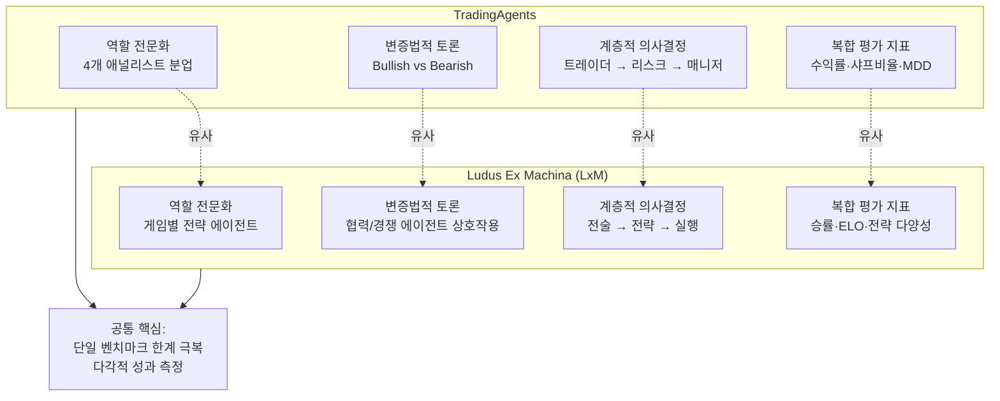

### 13.2 TradingAgents에서 LxM이 가져올 수 있는 설계 인사이트

**① 역할 전문화 원칙**: TradingAgents에서 4명의 애널리스트가 각자 전문 도메인을 담당하는 것처럼, LxM에서도 게임의 각 측면(예: 포커의 핸드 평가, 베팅 패턴 분석, 블러핑 탐지)을 담당하는 전문화 에이전트 구조를 고려할 수 있다.

**② 변증법적 토론 구조**: Bullish-Bearish 토론 방식은 Avalon이나 포커처럼 정보 비대칭 상황에서 최적 전략을 도출하는 데 직접 적용 가능하다. "이 플레이어는 특정 역할을 맡고 있다/아니다"를 두고 에이전트들이 토론하는 구조가 가능하다.

**③ 리스크 관리 철학**: 공격적/중립/보수적 세 가지 관점에서 각 행동의 리스크와 보상을 평가하는 방식은 게임에서의 기대값(EV) 계산 에이전트로 변환될 수 있다.

**④ Quick/Deep Think LLM 분리**: 빠른 패턴 인식과 깊은 전략적 추론을 다른 모델로 처리하는 방식을 LxM에서도 채택할 수 있다.

### 13.3 단일 벤치마크 평가의 한계 극복이라는 공통 문제의식

LxM 프로젝트의 핵심 문제의식은 현재 AI 평가 방법론이 단일 벤치마크에 지나치게 의존한다는 것이다. TradingAgents는 실제 시장에서의 성과(수익률, 샤프 비율, MDD)라는 복합적 척도로 AI 시스템을 평가함으로써 단순 정확도 벤치마크의 한계를 우회한다. 두 프로젝트 모두 **"단일 숫자로 AI를 평가하는 것은 충분하지 않다"** 는 같은 문제의식을 공유한다.

---

## 14. 한계와 향후 과제

### 14.1 현재 한계

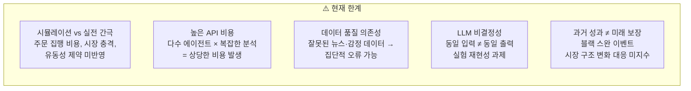

**① 시뮬레이션과 실전의 간극**: 현재는 역사적 데이터 기반 시뮬레이션 환경에서만 작동한다. 실제 시장에서는 주문 집행 비용, 시장 충격(Market Impact), 유동성 제약 등 시뮬레이션이 포착하지 못하는 현실적 요인들이 존재한다.

**② API 비용**: 다수의 LLM 에이전트가 복잡한 분석을 수행하는 만큼 상당한 API 호출 비용이 발생한다. 분석 깊이를 높일수록 비용이 기하급수적으로 증가하여 실시간 트레이딩 적용에 제약이 있다.

**③ 데이터 품질 의존성**: 잘못된 뉴스, 조작된 소셜 미디어 감정, 부정확한 재무 데이터가 입력되면 에이전트들이 집단적으로 잘못된 결론에 도달할 수 있다.

**④ LLM 비결정성**: 동일한 입력에 대해 LLM이 항상 동일한 출력을 내놓지 않아 실험 재현성과 시스템 안정성 측면에서 도전 과제가 된다.

### 14.2 향후 계획

| 방향 | 내용 |
|-----|-----|
| **실시간 트레이딩** | 실시간 시장 데이터 기반 즉각적 분석·결정 |
| **에이전트 역할 확장** | 옵션·선물·외환 전담 에이전트 추가 |
| **Trading-R1** | 트레이딩 특화 추론 모델 개발 (arXiv:2509.11420) |
| **포트폴리오 최적화** | 단일 종목 → 다자산 포트폴리오 전체 관리 |

---

## 15. 참고 자료

### 공식 자료

- **공식 홈페이지**: https://tradingagents-ai.github.io
- **GitHub 저장소**: https://github.com/TauricResearch/TradingAgents
- **논문 (arXiv)**: https://arxiv.org/abs/2412.20138
- **Trading-R1 기술 보고서**: https://arxiv.org/abs/2509.11420
- **Discord 커뮤니티**: https://discord.com/invite/hk9PGKShPK
- **PyTorch 한국 사용자 모임 소개**: https://discuss.pytorch.kr/t/tradingagents-llm/9459

### 관련 기술 자료

- **LangGraph 공식 문서**: https://langchain-ai.github.io/langgraph/
- **Alpha Vantage API**: https://www.alphavantage.co/

### 관련 프로젝트

- **AI-Trader**: AI 모델이 자율적 의사결정으로 주식 거래를 수행하는 오픈소스 프로젝트
- **AI Hedge Fund**: 교육적 목적의 AI 헤지 펀드 시뮬레이션 프로젝트
- **TinyTroupe**: Microsoft의 LLM 기반 다중 에이전트 시뮬레이션 라이브러리
- **SmolAgents**: HuggingFace의 경량 에이전트 구현 라이브러리
- **IntellAgent**: 대화형 AI 시스템 평가를 위한 다중 에이전트 프레임워크

---

## 마치며

TradingAgents는 단순한 금융 트레이딩 도구를 넘어, **다중 에이전트 AI 시스템이 복잡한 실세계 문제를 어떻게 해결할 수 있는지**를 보여주는 설득력 있는 데모다. 역할 전문화, 구조화된 토론, 계층적 의사결정 구조는 금융 도메인을 넘어 법률, 의학, 과학 연구 등 다양한 분야에 적용될 수 있는 범용적 설계 원칙이다.

특히 Bullish-Bearish 토론 구조와 Risky-Neutral-Safe 리스크 평가 구조는 AI 에이전트 설계에서 **의도적인 다양성(Intentional Diversity)** 을 확보하는 방법으로, 단일 관점의 편향을 방지하고 더 강건한 의사결정을 가능하게 한다. GitHub 스타 3만개에 가까운 이 프로젝트의 폭발적 관심은 멀티 에이전트 AI 아키텍처의 가능성에 대한 커뮤니티의 높은 기대를 반영한다.

---

*이 문서는 연구 및 교육 목적으로 작성되었습니다. 실제 투자 결정에 활용하지 마십시오.*

*작성 기준일: 2026년 4월 3일*
*주요 참고: [TradingAgents 공식 홈페이지](https://tradingagents-ai.github.io/), [GitHub 저장소](https://github.com/TauricResearch/TradingAgents), [arXiv 논문(2412.20138)](https://arxiv.org/abs/2412.20138), [PyTorch 한국 사용자 모임](https://discuss.pytorch.kr/t/tradingagents-llm/9459)*
