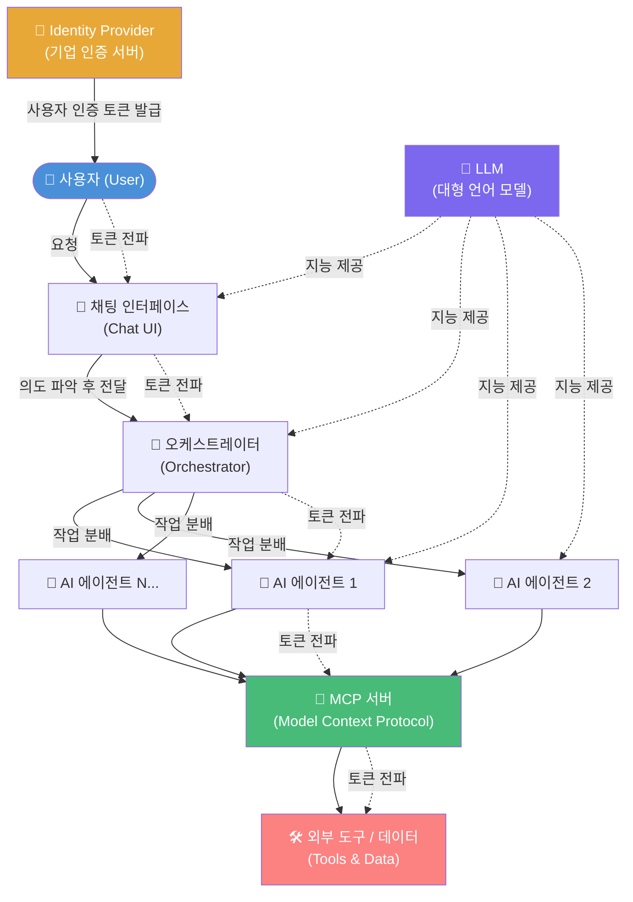
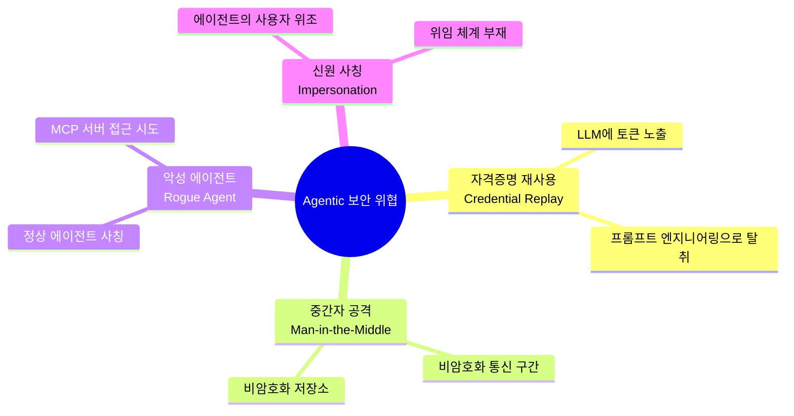
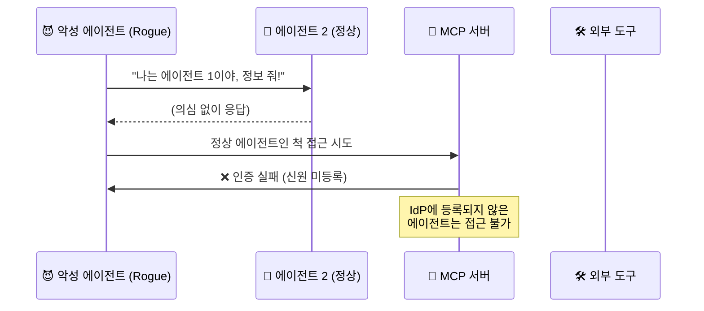
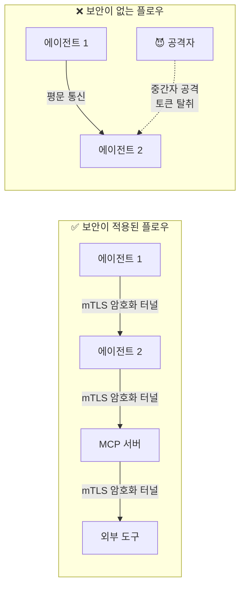
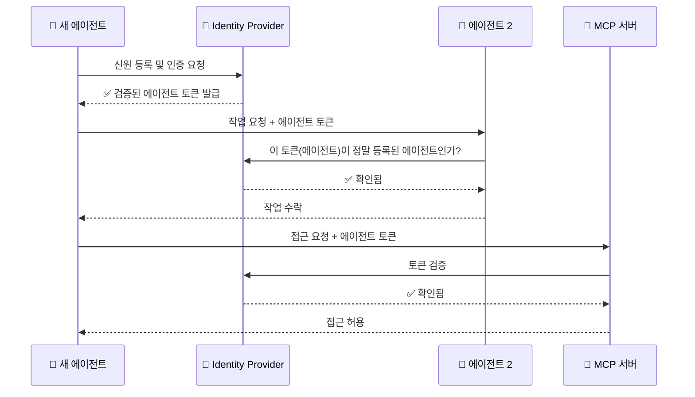
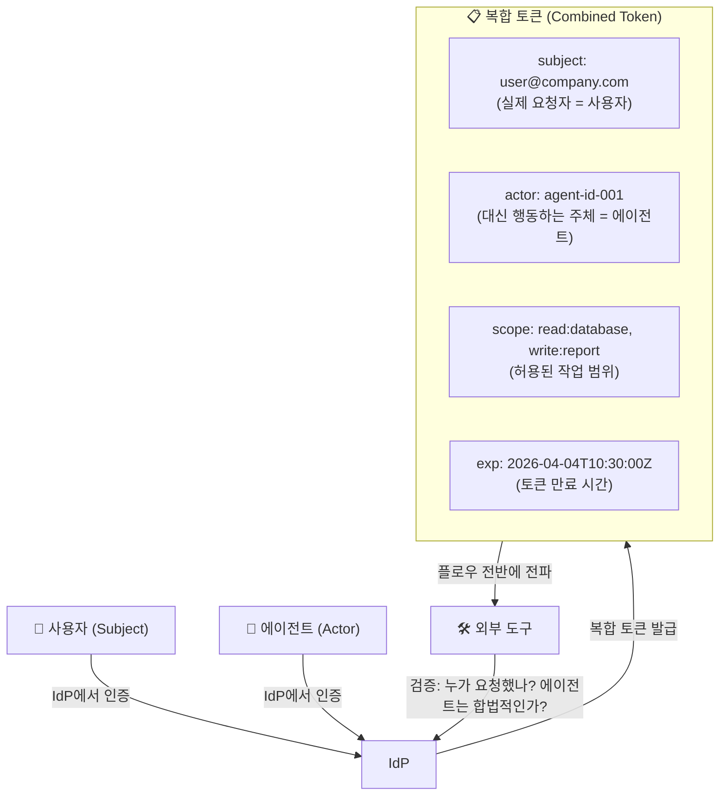
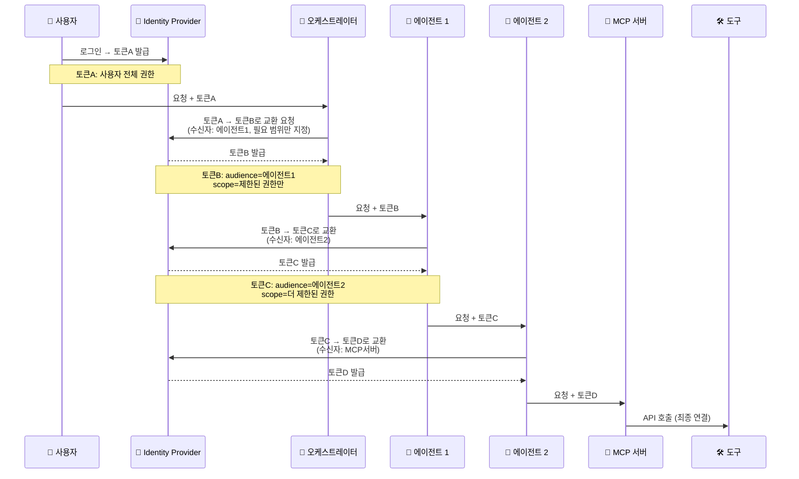
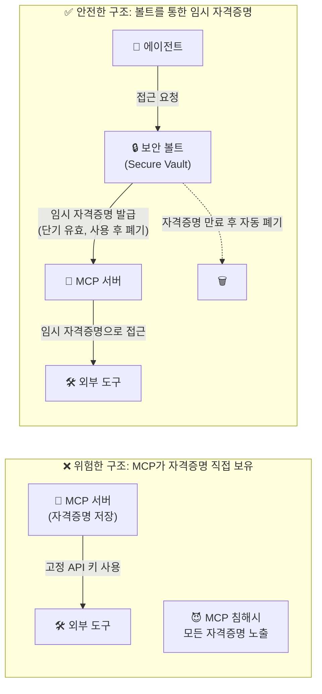
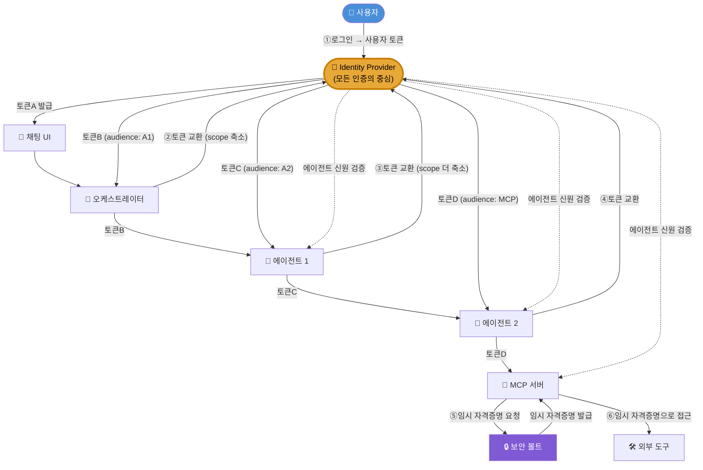
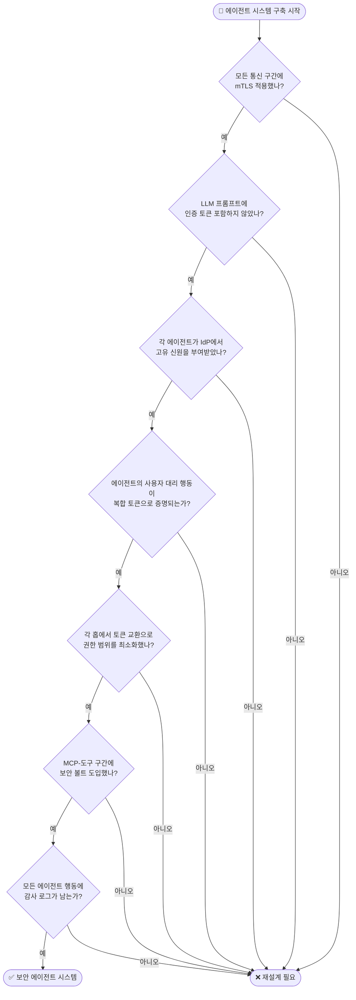

> IBM Technology 영상 심층 분석 | *Agentic Trust: Securing AI Interactions with Tokens & Delegation*  
> 발표자: Grant Miller (IBM) | 2026년 4월

---

## 들어가며 — 왜 지금 "에이전트 보안"이 중요한가

소프트웨어 시스템의 보안 표준은 1985년에 처음 체계화되기 시작했다. 그 이후 40년에 걸쳐 기업 IT 환경은 방화벽, PKI(공개키 인프라), OAuth, Zero Trust 등의 개념으로 무장해 왔다. 그런데 2024~2026년을 기점으로 완전히 새로운 유형의 소프트웨어 주체(主體)가 기업 환경 안으로 밀려들고 있다. 바로 **Agentic AI(에이전트형 인공지능)** 다.

에이전트형 AI란 단순히 질문에 답하는 챗봇이 아니다. 사용자의 지시를 받아 스스로 계획을 세우고, 다른 AI 에이전트를 호출하며, 외부 도구와 데이터베이스에 접속해 실제 행동을 수행하는 자율적 소프트웨어 개체다. 회의 일정을 잡고, 보고서를 생성하고, 인프라를 변경하며, 심지어 금융 거래를 승인하는 것까지 할 수 있다.

이 강력함이 곧 위험이다. 2026년 현재 기업 환경에서 비인간(non-human) 기계 정체성의 수는 인간 직원 대비 무려 **82대 1**의 비율로 존재하며, IBM의 2026 X-Force 위협 인텔리전스 보고서에 따르면 공개 애플리케이션을 노린 공격이 전년 대비 44% 급증했다. 이 모든 공격의 상당수가 AI 지원 취약점 스캐닝에 의해 가속되고 있다. 사이버보안 전문가의 48%는 Agentic AI를 2026년 최대 공격 벡터로 꼽는다.

Grant Miller는 이 영상에서 에이전트 시스템의 전형적인 구조를 해부하고, 어디에서 신뢰가 무너지는지, 그리고 어떻게 그 신뢰를 다시 구축하는지를 체계적으로 설명한다.

---

## 1. 전형적인 에이전트 플로우(Agentic Flow)의 구조

### 1-1. 기본 구성 요소

에이전트 시스템의 전형적인 흐름은 다음과 같은 구성 요소들로 이루어진다.

### 1-2. 각 구성 요소의 역할

**사용자(User)** 는 전체 흐름의 출발점이다. 자연어로 요청을 입력하면 시스템이 이를 처리한다.

**채팅 인터페이스(Chat)** 는 사용자의 자연어 입력을 받아 의도를 파악하고, 적절한 처리를 위해 오케스트레이터로 전달하는 역할을 한다.

**오케스트레이터(Orchestrator)** 는 전체 작업 흐름을 설계하는 두뇌다. 어떤 에이전트를 어떤 순서로 호출할지, 어떤 도구에 접근해야 할지를 결정한다. LLM이 이 판단을 뒷받침하기도 한다.

**AI 에이전트들**은 실제로 작업을 수행하는 주체들이다. 하나일 수도 있고, 수십 개가 병렬로 작동할 수도 있다. 각 에이전트는 특정 역할(검색, 분석, 작성, 실행 등)을 분담한다.

**MCP 서버(Model Context Protocol Server)** 는 에이전트와 외부 도구 사이의 표준화된 연결 레이어다. 2024년부터 본격적으로 등장한 이 프로토콜은 에이전트가 외부 시스템과 안전하고 구조화된 방식으로 소통할 수 있도록 한다.

**외부 도구와 데이터(Tools & Data)** 는 실제로 작업이 수행되는 목적지다. 데이터베이스, API, 파일 시스템, 외부 서비스 등이 여기에 해당한다.

**LLM(대형 언어 모델)** 은 시스템 전반에 지능을 제공하는 엔진이다. 채팅의 자연어 이해, 오케스트레이터의 작업 계획 수립, 각 에이전트의 응답 생성 등 다양한 지점에서 활용된다.

**Identity Provider(IdP)** 는 기업의 인증 서버다. 사용자가 처음 로그인할 때 신원을 확인하고 토큰을 발급하며, 이 토큰이 전체 플로우를 따라 전파된다.

---

## 2. 에이전트 시스템의 신뢰 위협(Trust Threats)

에이전트 플로우의 구조를 이해했다면, 이제 어디에서 신뢰가 무너질 수 있는지를 살펴볼 차례다. Grant Miller는 네 가지 핵심 위협을 제시한다.

### 2-1. 자격증명 재사용 공격 (Credential Replay)

첫 번째이자 가장 고전적인 위협은 **자격증명 재사용 공격**이다. 이는 공격자가 정당한 사용자의 인증 정보(토큰, 쿠키, 세션키 등)를 탈취하여 그 사람인 척 행동하는 공격이다.

에이전트 시스템에서 이 공격이 발생하는 경로는 두 가지다.

첫째는 **LLM을 통한 토큰 유출**이다. 개발자가 에이전트를 구현할 때 실수로 인증 토큰을 LLM과의 통신 페이로드에 포함시키는 경우가 있다. LLM은 입력된 모든 정보를 내부적으로 처리하기 때문에 이 토큰이 사실상 LLM에 "임베딩"되어 버린다. 나중에 공격자가 정교하게 설계된 프롬프트로 LLM을 조작하면 이 토큰을 추출할 수 있다.

둘째는 **중간자 공격(Man-in-the-Middle)** 이다. 에이전트 간, 에이전트와 MCP 서버 간, MCP와 도구 간의 통신이 암호화되지 않은 채 이루어진다면, 공격자는 그 사이에 끼어들어 토큰을 가로챌 수 있다. 또한 자격증명이 평문으로 저장되어 있는 경우에도 마찬가지 위험이 존재한다.

### 2-2. 악성 에이전트 (Rogue Agent)

두 번째 위협은 **악성 에이전트**의 등장이다. 이는 외부 공격자 또는 내부 악의적 행위자가 정상적인 에이전트인 척 시스템에 침투하는 시나리오다.

악성 에이전트가 위험한 이유는 시스템 내부에서 신뢰받는 에이전트처럼 행동하기 때문이다. "나는 에이전트 1이다, 나에게 접근을 허용해라"고 주장하지만, 실제로는 인증되지 않은 가짜 에이전트다. 이들이 MCP 서버나 다른 에이전트와 통신에 성공하면 민감한 데이터나 시스템 자원에 무단 접근할 수 있다.

2026년 현재 독립적인 연구에 따르면 7,000개 이상의 MCP 서버를 스캔한 결과 36.7%가 취약점을 보유하고 있었으며, MCP 통합 환경에서 비통합 환경 대비 공격 성공률이 23~41% 높은 것으로 나타났다. 악성 에이전트의 위협은 단순한 이론적 위험이 아닌 현실적 위협임이 확인되고 있다.

### 2-3. 에이전트에 의한 신원 사칭 (Impersonation)

세 번째 위협은 보다 미묘하다. 에이전트 자체는 정상적으로 인증되었지만, 그 에이전트가 "자신이 특정 사용자를 대신해서 일하고 있다"고 **스스로 주장**하는 경우다.

이 경우 외부 도구는 그 주장이 사실인지 검증할 방법이 없다. 에이전트가 "나는 홍길동 씨의 요청으로 이 작업을 수행하고 있다"고 말해도, 실제로 홍길동 씨가 그 작업을 승인했는지를 확인하는 메커니즘이 없다면 이는 사칭이 될 수 있다.

---

## 3. 신뢰 구축의 네 가지 핵심 전략

이러한 위협들에 대응하기 위해 Grant Miller는 네 가지 핵심 전략을 제시한다. 이는 단순한 방어 기법이 아니라, 에이전트 시스템 전체에 **검증 가능한 신뢰 체계**를 구축하는 아키텍처적 접근이다.

### 3-1. 전략 1: 안전한 통신 채널 확보 (TLS / mTLS)

첫 번째 전략은 모든 통신 구간에 **TLS(Transport Layer Security)** 또는 **mTLS(Mutual TLS)** 를 적용하는 것이다. TLS는 일반적인 HTTPS처럼 서버의 신원만 검증하는 단방향 암호화이지만, mTLS는 클라이언트(에이전트)와 서버 양측이 서로의 신원을 인증서로 검증하는 양방향 암호화다.

이를 통해 중간자 공격을 원천 차단할 수 있다. 통신 내용 자체가 암호화되어 있을 뿐 아니라, 통신 상대방의 신원도 검증되기 때문이다.

또한 자격증명이나 토큰을 저장해야 하는 경우, 반드시 암호화된 형태로 보관해야 한다. 평문 상태로 데이터베이스나 설정 파일에 저장된 자격증명은 공격자에게 손쉬운 먹잇감이 된다.

**아울러 절대로 인증 토큰을 LLM에 전달해서는 안 된다.** LLM은 태스크를 이해하고 실행 계획을 수립하는 역할만 하면 충분하다. 누가 요청하고 있는지를 LLM이 알 필요는 없다. 인증 정보는 오케스트레이터 또는 전용 인증 레이어에서만 처리되어야 한다.

### 3-2. 전략 2: 에이전트 신원 검증 (Verifiable Agent Identity)

두 번째 전략은 **에이전트를 사람처럼 인증하는 것**이다. 기업의 Identity Provider를 통해 각 에이전트에게 고유한 신원을 부여하고, 에이전트가 시스템에 참여할 때마다 "당신이 누구인지 증명하라"고 요구한다.

이렇게 하면 악성 에이전트는 IdP에 등록되어 있지 않으므로 자신을 인증할 수 없다. 반면 정당한 에이전트는 토큰을 통해 자신의 신원을 언제든지 증명할 수 있다. 검증은 플로우의 모든 노드에서 수행될 수 있다 — 에이전트 1이 에이전트 2에 접근할 때, 에이전트가 MCP 서버에 접근할 때 등 각 단계마다 신원을 재확인할 수 있다.

현재 업계에서는 이 목적으로 **SPIFFE(Secure Production Identity Framework For Everyone)** 와 같은 워크로드 신원 표준이 주목받고 있다. SPIFFE는 에이전트가 실행되는 환경(Kubernetes 파드, VM, 컨테이너 등)에 기반하여 암호화된 신원 증명서(SVID)를 자동으로 발급한다. 이 접근은 API 키나 비밀번호와 달리 유출 위험이 낮고 자동 갱신이 가능하다.

### 3-3. 전략 3: 위임과 복합 토큰 (Delegation & Combined Tokens)

세 번째 전략은 에이전트 사칭(Impersonation) 문제를 해결하기 위한 **위임(Delegation)** 메커니즘이다.

핵심 아이디어는 다음과 같다. 에이전트가 "나는 사용자 A를 대신해서 일한다"고 주장하는 것을 허용하되, 그 주장을 에이전트 스스로가 아닌 **독립적인 제3자(Identity Provider)** 가 검증하고 서명하도록 하는 것이다.

이를 위해 두 가지 인증이 합쳐진 **복합 토큰(Combined Token)** 을 사용한다. 이 토큰에는 `subject`(실제 요청을 한 사람 = 사용자)와 `actor`(대신 행동하는 주체 = 에이전트)가 모두 명시된다. 따라서 외부 도구는 이 토큰 하나만 보고도 "어떤 사용자의 요청을, 어떤 에이전트가 대신 처리하고 있다"는 사실을 신뢰할 수 있다.

이 모델은 OAuth 2.0의 "Token Exchange (On-Behalf-Of)" 표준을 기반으로 하며, 에이전트가 스스로 아무것도 주장할 수 없다. 모든 위임 관계는 IdP가 암호화적으로 서명한 토큰을 통해서만 성립된다.

### 3-4. 전략 4: 토큰 교환과 최소 권한 (Token Exchange & Least Privilege)

네 번째이자 가장 정교한 전략은 **각 홉(hop)마다 토큰을 교환하고, 그때마다 권한 범위(scope)를 최소화하는 것**이다.

토큰 교환이란 플로우의 각 노드에서 이전 토큰을 IdP에 제시하고, 다음 단계에서만 유효한 새 토큰으로 교환받는 것이다. 이때 핵심은 토큰의 `audience`(수신자)와 `scope`(허용 범위)가 점점 좁아진다는 점이다.

예를 들어, 사용자 토큰은 수십 가지 도구에 접근할 권한을 가질 수 있다. 하지만 이번 요청에서 에이전트 1이 에이전트 2와 통신할 때는 그 특정 통신에만 필요한 권한만 담긴 토큰이 사용된다. 에이전트 2가 MCP를 통해 특정 데이터베이스에 접근할 때는 그 데이터베이스 접근에만 필요한 최소한의 권한만 담긴 토큰이 사용된다.

이것이 **최소 권한 원칙(Principle of Least Privilege)** 의 에이전트 적용판이다. 각 단계에서 필요 이상의 권한을 갖는 토큰이 유통되지 않음으로써, 어느 한 단계가 침해되더라도 피해 범위가 제한된다.

---

## 4. 마지막 구간 문제 — 보안 볼트(Secure Vault)

에이전트 플로우의 마지막 구간, 즉 MCP 서버와 외부 도구 사이의 연결에는 별도의 특별한 위험이 존재한다.

이 구간에서는 지금까지 설명한 토큰 기반의 신뢰 전파가 끊긴다. MCP 서버가 외부 도구(예: 외부 SaaS API, 레거시 데이터베이스 등)를 호출할 때는 REST API 키나 비밀번호 같은 전통적인 자격증명이 필요한 경우가 많기 때문이다. 이 자격증명을 MCP 서버 내에 직접 보관하면 MCP가 침해될 경우 모든 도구에 대한 접근 권한이 한꺼번에 노출된다.

이 문제를 해결하기 위해 **보안 볼트(Secure Vault)** 를 도입한다. HashiCorp Vault, AWS Secrets Manager, Azure Key Vault 등이 대표적인 구현체다. 볼트는 외부 도구의 자격증명을 중앙에서 안전하게 관리하고, 요청이 있을 때마다 단기 유효한 임시 자격증명을 발급한다. 이 임시 자격증명은 사용 후 또는 짧은 시간이 지나면 자동으로 무효화된다.

이로써 설령 MCP 서버가 침해되더라도 공격자는 이미 만료된 자격증명밖에 얻지 못하며, 장기적인 자격증명은 볼트 내에 안전하게 보호된다.

---

## 5. 전체 보안 아키텍처 — 통합 조망

지금까지 설명한 모든 전략을 통합하면 다음과 같은 완성된 보안 아키텍처가 된다.

### 핵심 원칙 요약

이 아키텍처는 세 가지 핵심 원칙으로 요약된다.

**① 신뢰(Trust)**: 사용자와 모든 에이전트의 신원을 IdP를 통해 검증 가능하게 한다. 아무도, 어떤 에이전트도 스스로 자신의 신원을 주장할 수 없으며, 반드시 독립적인 제3자(IdP)의 검증을 통해서만 신뢰를 얻는다.

**② 권한 부여(Authorization)**: 각 홉에서 토큰을 교환하며 권한 범위를 최소화한다. 최소 권한 원칙을 플로우 전체에 걸쳐 동적으로 적용한다. 에이전트가 필요한 것만, 필요한 시간 동안만, 필요한 대상에게만 접근할 수 있다.

**③ 전파(Propagation)**: 신뢰 정보(사용자 신원, 에이전트 신원, 위임 관계, 권한 범위)가 플로우 전체를 따라 안전하게 전달된다. 어느 단계에서도 이 정보가 위·변조되거나 손실되지 않는다.

---

## 6. 2026년 현재의 업계 동향과 최신 발전

이 영상이 다루는 주제는 현재 업계 전반에서 가장 뜨거운 화두 중 하나다.

### 6-1. RSAC 2026에서의 핵심 의제

2026년 4월 개최되는 RSAC(RSA Conference) 2026에서 에이전트 AI 보안은 중심 주제로 자리 잡았다. Microsoft는 RSAC 2026에서 Zero Trust 아키텍처를 AI 전체 수명 주기에 걸쳐 확장하는 새로운 참조 아키텍처를 발표했으며, 에이전트를 관찰·보안·거버넌스하는 컨트롤 플레인인 **Agent 365**를 공개했다.

IBM과 Yubico는 하드웨어 기반의 Human-in-the-Loop 에이전트 인증 모델을 공동 시연하였고, Yubico의 하드웨어 보증 역할 위임 토큰(RDT)이 Delinea 플랫폼과 통합되어 AI 에이전트의 모든 고위험 행동을 검증된 인간 결정으로 소급 추적하는 체계를 구축했다.

### 6-2. 실제 사고 사례 — Salesloft Drift 침해

2025년 8월, AI 챗 에이전트인 **Drift**가 수백 개 기업에 Salesforce 접근을 위해 배포한 OAuth 토큰이 침해되는 사고가 발생했다. 공격자들은 이 토큰을 이용해 **700개 이상의 독립적인 신뢰 도메인**에 걸쳐 데이터를 탈취했다. 각 기업의 IdP는 Drift의 토큰을 독립적으로 신뢰하고 있었기 때문에, 한 곳에서 침해가 발생했을 때 다른 도메인들은 이를 전혀 감지하지 못했다. 이 사건은 토큰 폐기(revocation) 신호가 도메인 간에 실시간으로 전파되는 체계의 필요성을 극명하게 드러냈다.

### 6-3. 새로운 표준의 등장

업계는 이러한 도전에 대응하기 위해 새로운 표준들을 개발하고 있다.

**OAuth 2.0 Token Exchange (On-Behalf-Of Profile)** 는 에이전트(actor)를 위임자(delegator)에게 암호화적으로 바인딩하여 책임 체계를 보존하는 방식이다. 이 문서에서 설명한 복합 토큰 개념의 기술적 기반이 된다.

**draft-ietf-oauth-identity-chaining**은 토큰이 도메인 경계를 넘을 때 위임 제약 조건(예: "읽기 전용", "최대 2홉")이 토큰과 함께 이동하도록 하는 표준안이다.

**OpenID Foundation의 에이전트 AI 신원 백서(2025년 10월)** 는 검증 가능한 위임, 운영 봉투(operational envelopes), 도메인 간 폐기 신호의 세 가지 기반이 에이전트 신뢰 패브릭에 반드시 포함되어야 한다고 명시했다.

**OWASP Agentic AI Top 10**은 에이전트 특화 취약점 목록으로, 도구 호출 하이재킹, 오케스트레이터 조작, 메모리 포이즈닝 등을 최상위 위험으로 분류하고 있다.

### 6-4. ARIA (에이전트 관계 기반 신원 및 권한 부여)

가장 주목할 만한 새로운 아키텍처 패턴은 **ARIA(Agent Relationship-based Identity and Authorization)** 다. ARIA는 모든 위임 관계를 명시적이고 추적 가능한 그래프(graph)로 관리한다. 사람에서 에이전트로, 에이전트에서 서브에이전트로 이어지는 모든 위임 관계가 고유한 암호화 검증 가능한 레코드로 기록된다. 이 레코드는 실시간으로 모니터링되며, 이상 징후가 감지되거나 더 이상 필요하지 않을 때 즉시 폐기될 수 있다.

---

## 7. 개발자와 아키텍트를 위한 실무 체크리스트

이 모든 내용을 실제 시스템 구축에 적용하기 위한 핵심 점검 항목을 정리하면 다음과 같다.

### 즉시 적용 가능한 조치들

**통신 보안**: 에이전트 간, 에이전트-MCP 간, MCP-도구 간 모든 통신에 TLS 1.3 이상 또는 mTLS를 적용한다. 인증서는 SPIFFE/SPIRE 같은 워크로드 신원 프레임워크를 통해 자동 발급 및 갱신한다.

**LLM 분리**: LLM에 전달되는 프롬프트에서 인증 토큰, API 키, 사용자 PII(개인식별정보)를 완전히 제거한다. LLM은 태스크 내용만 알면 충분하다.

**에이전트 신원 등록**: 새로운 에이전트를 배포하기 전에 반드시 IdP에 등록하고 인증서 또는 클라이언트 자격증명을 발급받는다. 등록되지 않은 에이전트는 시스템의 어떤 구성 요소와도 통신할 수 없도록 정책을 수립한다.

**토큰 수명 단축**: 발급되는 모든 토큰의 유효 기간을 가능한 한 짧게 유지한다. 에이전트 간 통신에 사용되는 토큰은 수분 이내로 제한하고, 각 홉에서 새로 교환하도록 한다.

**볼트 도입**: HashiCorp Vault, AWS Secrets Manager, Azure Key Vault 등을 도입하여 외부 도구 자격증명을 중앙 관리하고, MCP 서버에는 임시 자격증명만 제공한다.

**감사 로그 완비**: 에이전트가 수행한 모든 행동, 접근한 모든 리소스, 교환한 모든 토큰에 대한 감사 로그를 남긴다. 이는 사고 발생 시 포렌식의 기반이 되며, 규제 요건 충족에도 필수적이다.

---

## 마치며 — 에이전트 시대의 신뢰는 설계에서 시작된다

Grant Miller의 이 영상이 전달하는 핵심 메시지는 단순하지만 강력하다. **에이전트 시스템에서 신뢰는 가정(assumption)이 아니라 검증(verification)이어야 한다.**

전통적인 소프트웨어 환경에서는 "일단 네트워크 안에 들어왔으면 신뢰한다"는 경계 기반 보안 모델이 어느 정도 통했다. 하지만 에이전트 시스템에서는 이 모델이 완전히 무너진다. 에이전트는 경계를 넘나들고, 자율적으로 결정하며, 다른 에이전트를 호출하고, 실제 자원을 변경한다. 이 환경에서는 매 단계, 매 홉, 매 토큰에서 신뢰를 새롭게 검증해야 한다.

이것이 바로 Zero Trust의 에이전트 적용판이며, 2026년 현재 업계 전반이 이 방향으로 빠르게 수렴하고 있다.

에이전트 AI를 도입하거나 구축하는 모든 개발자, 아키텍트, 보안 담당자에게 이 영상과 그 배경의 원칙들은 필수 지식이 되고 있다. 기술의 강력함은 그것을 통제하는 능력에 비례한다. 에이전트의 자율성이 커질수록, 신뢰 체계의 정교함도 함께 성장해야 한다.

---

## 참고 자료

- IBM Technology YouTube: [Agentic Trust: Securing AI Interactions with Tokens & Delegation](https://www.youtube.com/watch?v=lUQ2NKkCW_Q) (2026.04.04)
- Strata: [8 Strategies for AI Agent Security](https://www.strata.io/blog/agentic-identity/8-strategies-for-ai-agent-security/) (2026)
- Cloud Security Alliance: [AI Security Across Domains: Who Vouches?](https://cloudsecurityalliance.org/blog/2026/03/11/ai-security-when-your-agent-crosses-multiple-independent-systems-who-vouches-for-it) (2026.03.11)
- Red Hat: [Zero Trust for Autonomous Agentic AI Systems](https://next.redhat.com/2026/02/26/zero-trust-for-autonomous-agentic-ai-systems-building-more-secure-foundations/) (2026.02.26)
- Microsoft Security Blog: [Secure Agentic AI End-to-End](https://www.microsoft.com/en-us/security/blog/2026/03/20/secure-agentic-ai-end-to-end/) (2026.03.20)
- ISACA: [The Looming Authorization Crisis: Why Traditional IAM Fails Agentic AI](https://www.isaca.org/resources/news-and-trends/industry-news/2025/the-looming-authorization-crisis-why-traditional-iam-fails-agentic-ai) (2025)
- Insight Partners: [Securing the Autonomous Future](https://www.insightpartners.com/ideas/securing-agentic-ai/) (2025.10.29)
- Biometric Update: [AI Agent Identity and Next-Gen Enterprise Authentication at RSAC 2026](https://www.biometricupdate.com/202603/ai-agent-identity-and-next-gen-enterprise-authentication-prominent-at-rsac-2026) (2026.03)
- VentureBeat: [Nvidia's Agentic AI Stack Security Analysis](https://venturebeat.com/security/nvidia-gtc-2026-agentic-ai-security-five-vendor-governance-framework) (2026)

---
*본 문서는 IBM Technology의 영상 내용과 2025~2026년 최신 업계 연구를 종합하여 작성된 심층 분석 자료입니다.*
