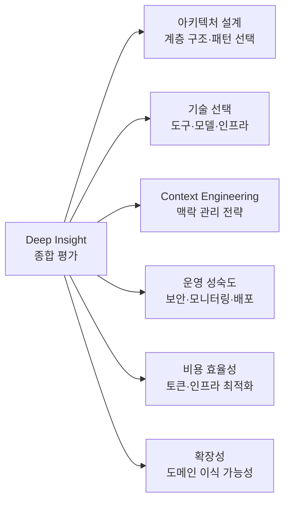
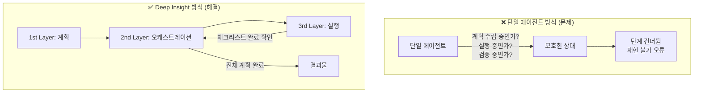
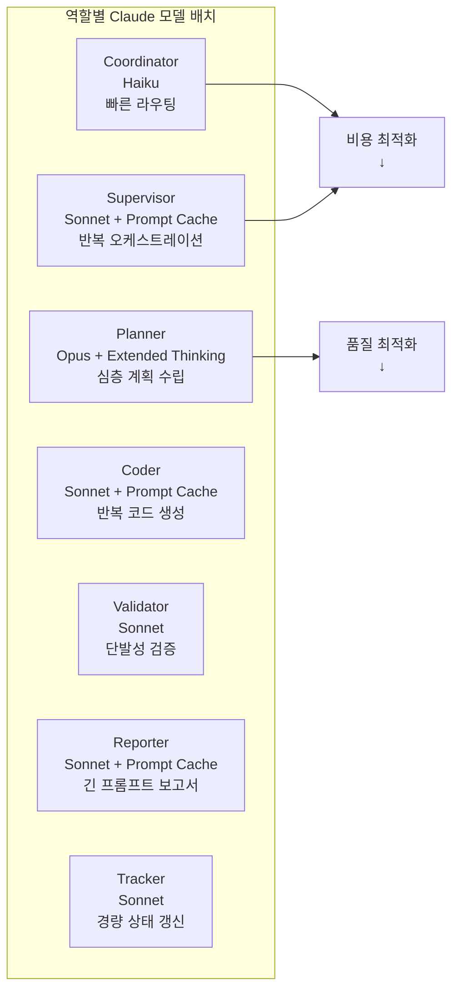
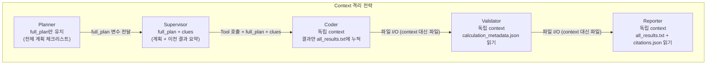
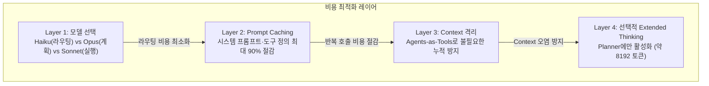
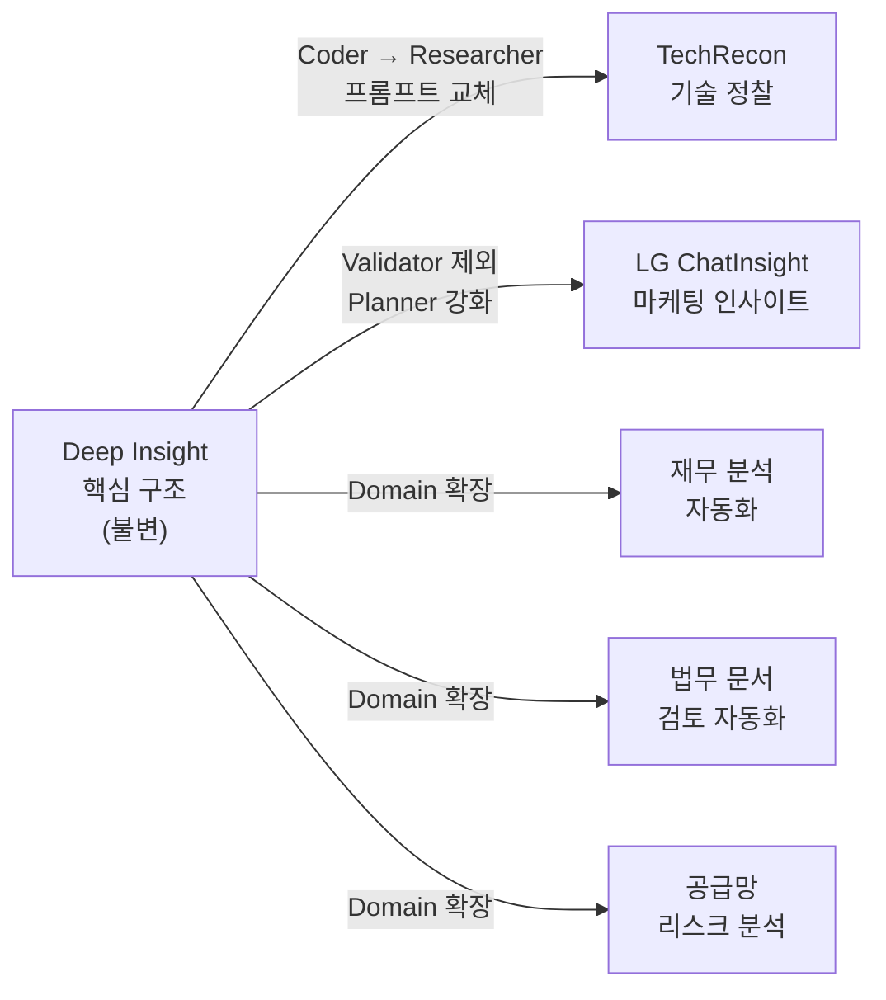
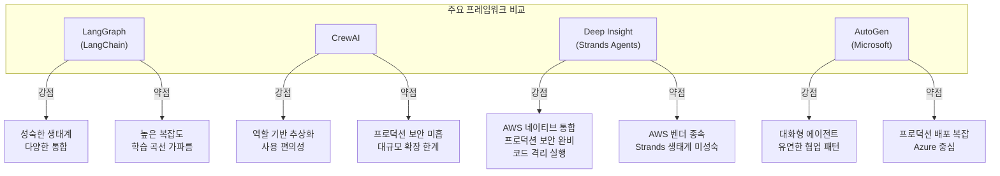
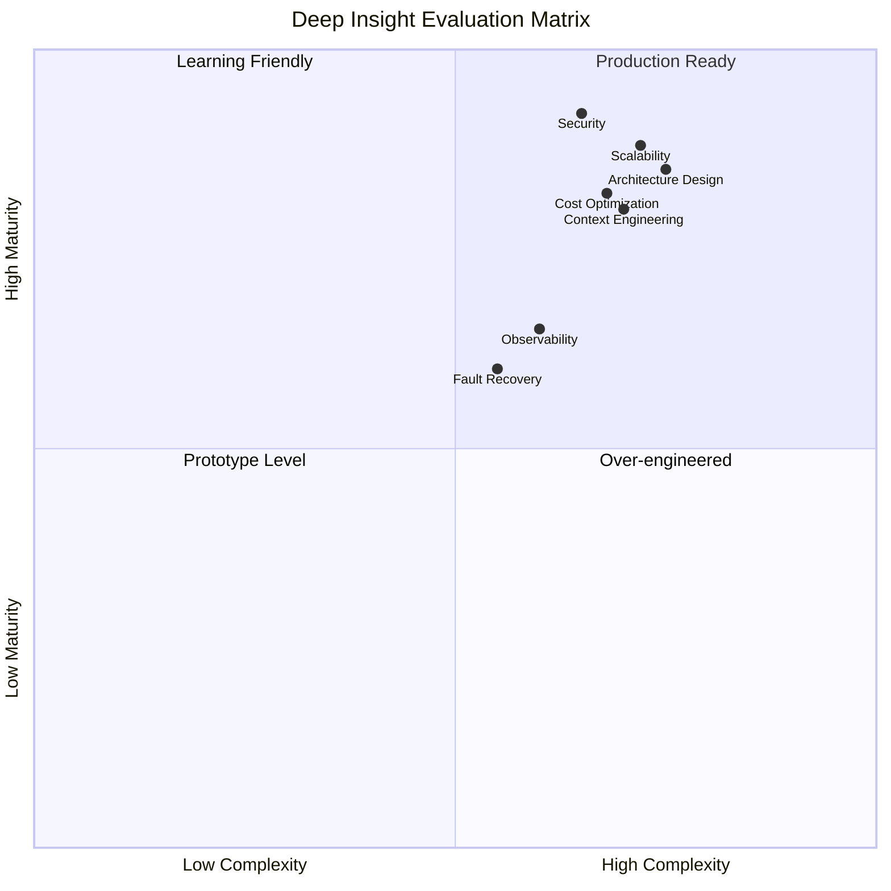

> AWS Korea SA Team의 프로덕션급 Multi-Agent 시스템에 대한 기술적·실용적 종합 평가  
> 평가 기준일: 2026년 4월

---
## 관련글

[**Deep Insight: 프로덕션 Multi-Agent 시스템 완전 분석**](https://k82022603.github.io/posts/deep-insight-%ED%94%84%EB%A1%9C%EB%8D%95%EC%85%98-multi-agent-%EC%8B%9C%EC%8A%A4%ED%85%9C-%EC%99%84%EC%A0%84-%EB%B6%84%EC%84%9D/)
## 목차

1. [평가 개요 및 방법론](#1-평가-개요-및-방법론)
2. [아키텍처 설계 평가](#2-아키텍처-설계-평가)
3. [기술 선택 평가](#3-기술-선택-평가)
4. [Context Engineering 관점 평가](#4-context-engineering-관점-평가)
5. [프로덕션 운영 성숙도 평가](#5-프로덕션-운영-성숙도-평가)
6. [비용 효율성 평가](#6-비용-효율성-평가)
7. [확장성 및 범용성 평가](#7-확장성-및-범용성-평가)
8. [한계와 개선 과제](#8-한계와-개선-과제)
9. [경쟁 아키텍처와의 비교](#9-경쟁-아키텍처와의-비교)
10. [종합 평가 및 권고사항](#10-종합-평가-및-권고사항)

---

## 1. 평가 개요 및 방법론

### 평가 목적

이 문서는 AWS Korea SA Team이 공개한 프로덕션급 Multi-Agent 시스템 Deep Insight를 기술 설계, 운영 성숙도, 비즈니스 적용 가능성의 세 축에서 종합적으로 평가한다. 단순한 기능 나열이나 마케팅 자료를 넘어서, 아키텍처가 실제로 어떤 문제를 풀고 어떤 트레이드오프를 감수하는지를 분석적으로 해부한다.

### 평가 대상

- **시스템명**: Deep Insight (AWS Korea SA Team 개발)
- **공개 형태**: 오픈소스 (GitHub: aws-samples/sample-deep-insight)
- **기반 기술**: Strands Agents SDK, Amazon Bedrock (Claude), Bedrock AgentCore, AWS Fargate, ALB
- **검토 자료**: AWS Tech Blog Part 1 (2026.04.01), LG전자 사례 블로그 (2025.08.28), 첨부 아키텍처 다이어그램 3종

### 평가 기준

각 항목은 **설계 의도의 타당성**, **실제 구현 완성도**, **현업 적용 시의 현실성** 세 가지 기준으로 세분화하여 평가한다.

---

## 2. 아키텍처 설계 평가

### 2.1 계층적 분리의 타당성 ★★★★★

Deep Insight의 가장 돋보이는 설계 결정은 에이전트를 **기능이 아니라 인지 단계별로 계층 분리**했다는 점이다. 1st Layer(요청 이해·계획 수립), 2nd Layer(오케스트레이션), 3rd Layer(전문 실행)의 3단 구조는 소프트웨어 공학에서 오래 검증된 관심사 분리(Separation of Concerns) 원칙을 LLM 에이전트에 적용한 것이다.

이 분리가 왜 중요한가. 단일 에이전트로 "데이터 분석 + 계획 수립 + 보고서 작성"을 모두 처리하면, 에이전트는 현재 자신이 계획 단계에 있는지 실행 단계에 있는지를 context 내에서 추론해야 한다. 그 과정에서 단계 전환이 암묵적이 되고, 검증·롤백이 어려워진다. Deep Insight는 각 계층의 경계를 명시적인 코드(Graph 패턴의 조건부 엣지)로 강제함으로써 에이전트의 인지 부담을 줄이고 워크플로우의 예측 가능성을 높인다.

### 2.2 Agents-as-Tools 패턴의 효과 ★★★★☆

Supervisor가 Coder, Validator, Reporter, Tracker를 Tool로 등록하여 호출하는 패턴은 현재 멀티에이전트 설계에서 가장 실용적인 선택 중 하나다. 이 패턴의 핵심 이점은 **각 전문 에이전트가 독립적인 context에서 실행**된다는 것이다. Supervisor의 context에는 각 에이전트의 전체 실행 내용이 누적되지 않고, 압축된 결과만 반환된다.

다만 이 패턴의 한계도 분명히 존재한다. Tool로 래핑된 에이전트는 Supervisor의 판단에 전적으로 의존하므로, Supervisor의 시스템 프롬프트가 잘못 설계되면 전체 워크플로우가 무너진다. Deep Insight는 이를 엄격한 필수 실행 순서(Coder → Tracker → Validator → Tracker → Reporter → Tracker)와 섹션 완료 규칙으로 보완하는데, 이는 영리한 해결책이지만 동시에 Supervisor 프롬프트를 매우 정교하게 유지해야 한다는 운영 부담을 수반한다.

### 2.3 Human-in-the-Loop 설계의 완성도 ★★★★★

Plan Reviewer의 HITL 구현은 특히 주목할 만하다. 단순히 "사용자 입력을 기다린다"는 수준이 아니라, 다음 세 가지 메커니즘을 갖추고 있다.

첫째, **최대 수정 횟수 제한**(MAX_PLAN_REVISIONS)으로 무한 루프를 방지한다. 둘째, **카운트다운 타이머**(300초)로 미응답 시 자동 승인 처리한다. 셋째, **Graph 패턴의 양방향 조건부 엣지**로 수정 요청 시 Planner로, 승인 시 Supervisor로의 분기를 코드 수준에서 강제한다.

이 세 가지를 모두 갖춘 HITL 구현은 실제 프로덕션에서 요구되는 안전망을 충분히 갖추고 있다고 평가할 수 있다. 특히 카운트다운 자동 승인은 사용자가 자리를 비운 상황에서도 시스템이 멈추지 않고 진행되게 한다는 점에서 현실적인 운영 요구를 잘 반영한 설계다.

---

## 3. 기술 선택 평가

### 3.1 Strands Agents SDK 선택 ★★★★☆

AWS가 자체 개발한 Strands Agents SDK는 Graph 패턴과 Agents-as-Tools 패턴을 모두 지원하는 경량 프레임워크다. LangGraph에 비해 덜 알려져 있지만, Deep Insight의 유스케이스에서는 몇 가지 이점이 있다.

Graph 패턴이 명시적인 DAG(방향 비순환 그래프)로 에이전트 흐름을 정의하기 때문에, 코드를 보는 것만으로 어떤 에이전트가 어떤 조건에서 다음으로 넘어가는지 파악할 수 있다. 이는 유지보수와 디버깅에서 중요한 장점이다. 반면 LangGraph처럼 생태계가 성숙하지 않아 커뮤니티 지원이나 서드파티 통합이 상대적으로 부족하다. AWS 환경에 강하게 결합된다는 점은 벤더 락인 리스크이기도 하다.

### 3.2 역할별 Claude 모델 선택 ★★★★★

에이전트별 모델 선택 전략은 이 시스템에서 가장 정교하게 설계된 부분이다.

Coordinator에 Haiku를 배치한 결정은 명확하다. 라우팅은 추론 능력이 거의 필요 없는 단순 분류 작업이므로, 가장 저렴한 모델로 처리하는 것이 합리적이다. Planner에 Extended Thinking이 활성화된 Opus를 배치한 것도 마찬가지다. 분석 계획의 품질이 이후 모든 에이전트의 실행 품질을 결정하므로, 초기 계획 수립에서만 최고 품질 모델을 사용하는 것은 비용 대비 효과가 높은 선택이다.

Prompt Caching의 선택적 적용도 주목할 만하다. Supervisor, Coder, Reporter는 시스템 프롬프트와 도구 정의가 반복 호출 시에도 변하지 않으므로 캐싱 효과가 크다. 반면 Validator와 Tracker는 매번 다른 데이터 컨텍스트로 호출되므로 캐싱 효과가 낮다. 이 판단을 각 에이전트의 호출 패턴을 분석한 후 적용했다는 점에서, 단순히 "가능하니까 캐싱"이 아닌 **의도적인 아키텍처 결정**으로 평가한다.

### 3.3 Custom Code Interpreter (Fargate + ALB) ★★★★★

LLM이 생성한 코드의 격리 실행 문제는 프로덕션 AI 시스템에서 가장 간과되기 쉬운 보안 영역이다. Deep Insight가 Fargate 컨테이너와 ALB를 조합하여 세션별 임시 샌드박스를 구현한 것은 이 문제에 대한 가장 완성도 높은 오픈소스 참조 구현 중 하나다.

특히 **2-step 실행**(base64 인코딩 → HTTP 전송 → 파일 쓰기 → subprocess 실행)과 **ALB Sticky Session**을 조합하여 세션 친화성을 보장한 것은 실제 운영 경험에서 나온 설계다. 코드를 직접 RPC로 전달하는 것이 아니라 base64로 인코딩하여 HTTP로 전송함으로써 전송 과정의 이스케이프 문제를 원천 차단한다.

단, 이 구조는 **컨테이너 초기화 시간**이라는 지연을 수반한다. Fargate 컨테이너 스핀업은 통상 수십 초가 소요되므로, 첫 번째 코드 실행 요청의 응답 시간이 증가한다. 이에 대한 워밍업 전략이나 사전 프로비저닝 메커니즘은 공개된 자료에서 명시되지 않았다.

---

## 4. Context Engineering 관점 평가

### 4.1 계층적 Context 격리 ★★★★★

Deep Insight의 Context Engineering 전략에서 가장 독창적인 부분은 **에이전트 계층별 context를 의도적으로 격리**하는 방식이다.

Supervisor는 각 도구 에이전트를 호출할 때 full_plan과 clues를 전달하지만, 각 에이전트의 내부 실행 결과 전체를 자신의 context에 누적하지는 않는다. 이는 **context 오염을 방지하는 동시에 필요한 맥락만 전달**하는 정교한 균형이다.

특히 `all_results.txt` 파일 기반의 누적 공유 메커니즘은 LLM context의 한계를 파일 시스템으로 우회하는 실용적인 해결책이다. 이는 Anthropic이 제안한 Context Engineering 기법 중 "외부 저장소를 통한 맥락 보존"을 구체적으로 구현한 사례이기도 하다.

### 4.2 체크리스트 기반 진행 관리 ★★★★☆

`[ ]` / `[x]` 형식의 체크리스트로 진행 상태를 추적하는 방식은 단순하지만 효과적이다. Tracker가 LLM 추론만으로 체크리스트를 갱신하고, Supervisor가 이를 읽어 완료 여부를 판단하는 구조는 **상태 관리를 자연어 형식으로 유지**한다는 장점이 있다. 복잡한 상태 머신을 코드로 구현하지 않아도 LLM이 체크리스트를 읽고 현재 상태를 파악할 수 있다.

그러나 이 방식의 한계도 있다. 체크리스트 항목이 많아질수록 Tracker의 정확도가 떨어질 수 있고, 동시에 여러 항목을 처리하는 경우 누락이 발생할 가능성이 있다. 또한 체크리스트 갱신 실패가 Supervisor의 판단 오류로 이어지는 연쇄 실패 시나리오도 존재한다. `set_max_node_executions(25)` 같은 안전장치가 있지만, 근본적인 신뢰성 보장을 위해서는 외부 상태 저장소(예: DynamoDB)와의 연계가 더 적합할 수 있다.

### 4.3 누적 파일 기반 정보 공유 ★★★★☆

`all_results.txt`에 분석 결과를 단계별로 누적하고, Reporter가 이 전체 파일을 읽어 보고서를 생성하는 방식은 **에이전트 간 컨텍스트 손실을 최소화**하는 실용적인 해결책이다. LG전자 ChatInsight에서도 동일한 패턴이 채택되어 실효성이 검증됐다.

단, 이 방식은 파일이 커질수록 Reporter의 입력 토큰이 증가한다는 구조적 한계를 갖는다. 분석 단계가 많거나 데이터가 방대한 경우, `all_results.txt` 자체가 수십만 토큰에 달할 수 있다. 이에 대한 압축·요약 전략이나 인덱싱 메커니즘은 현재 공개된 자료에서 명시되지 않아, Part 2 블로그에서 다뤄질 Context Engineering 기법에서 보완될 것으로 기대된다.

---

## 5. 프로덕션 운영 성숙도 평가

### 5.1 보안 아키텍처 ★★★★★

보안 측면에서 Deep Insight는 프로덕션 AI 시스템으로서 높은 완성도를 보여준다.

| 보안 영역 | 구현 방식 | 평가 |
|---|---|---|
| **코드 격리** | Fargate 컨테이너 + Private VPC 서브넷 | ✅ 강력 |
| **네트워크 격리** | VPC 내부 통신, 직접 인터넷 접근 차단 | ✅ 강력 |
| **세션 격리** | 사용자별 독립 컨테이너 + ALB Sticky Session | ✅ 강력 |
| **관리자 접근** | Cognito JWT 인증 Ops 대시보드 | ✅ 적절 |
| **아티팩트 관리** | S3 업로드 후 컨테이너 1시간 자동 종료 | ✅ 적절 |
| **모델 접근** | Bedrock AgentCore를 통한 제어된 접근 | ✅ 강력 |

특히 LLM이 생성한 코드가 프로덕션 서버의 파일 시스템에 직접 접근하지 못하도록 컨테이너 경계를 통해 원천 차단한 것은 AI 보안의 핵심 원칙을 올바르게 적용한 사례다.

### 5.2 관찰 가능성(Observability) ★★★☆☆

DynamoDB를 통한 작업 메트릭 기록, SNS를 통한 장애 알림, Bedrock AgentCore의 OpenTelemetry Observability 지원은 기본적인 운영 가시성을 제공한다. 그러나 몇 가지 관찰 가능성 요소가 부재하거나 명시되지 않았다.

에이전트별 실행 시간 추적이나 토큰 사용량의 에이전트별 분해가 얼마나 세밀하게 이루어지는지는 명확하지 않다. 분산 추적(distributed tracing)을 통해 하나의 분석 요청이 8개 에이전트를 거치는 전체 경로를 추적할 수 있는지도 불명확하다. 실제 프로덕션 운영에서는 "왜 이 분석이 실패했는가"를 디버깅하기 위해 에이전트 단위의 세밀한 로깅이 필수적이며, 이 부분이 Part 3 블로그에서 보완될 것으로 기대된다.

### 5.3 장애 복구 및 재시도 전략 ★★★☆☆

`set_max_node_executions(25)`로 무한 루프를 방지하고, Plan Reviewer의 타이머로 미응답 시 자동 승인 처리하는 것은 기본적인 장애 안전장치다. 그러나 더 세밀한 장애 시나리오에 대한 처리가 명시되지 않았다.

예를 들어 Coder가 작업 도중 실패했을 때 체크리스트의 부분 완료 항목을 어떻게 처리하는지, Fargate 컨테이너가 중간에 종료되었을 때 작업을 재개할 수 있는지, 그리고 Validator가 수치 불일치를 탐지했을 때 Coder를 재호출하는 자동 수정 루프가 있는지에 대한 설계가 공개 자료에서 확인되지 않는다. 이러한 엣지 케이스 처리는 실제 프로덕션에서 빈번하게 발생하는 문제임을 고려할 때, 현재 공개된 설계에서는 아직 개선 여지가 있다.

---

## 6. 비용 효율성 평가

### 6.1 토큰 비용 최적화 전략 ★★★★★

Deep Insight의 비용 최적화 전략은 다층적으로 구현되어 있다.

특히 Prompt Caching의 선택적 적용과 Extended Thinking의 Planner 전용 활성화는 단순히 비용을 줄이는 것을 넘어, **각 에이전트의 역할에 최적화된 추론 수준을 부여**한다는 철학적 일관성을 갖는다.

### 6.2 인프라 비용 고려사항 ★★★☆☆

토큰 비용의 최적화와 달리, 인프라 비용 측면에서는 몇 가지 고려할 점이 있다. 세션별로 독립적인 Fargate 컨테이너를 생성하는 방식은 보안과 격리를 보장하지만, 동시 사용자 수가 많아지면 컨테이너 수가 선형적으로 증가한다. 컨테이너 초기화 오버헤드와 1시간 유지 비용이 누적될 경우, 특히 짧은 분석 작업이 많은 환경에서는 비용 효율이 낮아질 수 있다.

또한 S3에 분석 결과물을 저장하고 1시간 후 컨테이너를 종료하는 전략은 스토리지 관리 정책(라이프사이클 규칙, 버전 관리 등)이 함께 설계되지 않으면 S3 비용이 예상치 못하게 증가할 수 있다. 대규모 도입 전에 워크로드 특성에 맞는 컨테이너 풀링이나 워밍업 전략을 추가로 검토할 것을 권장한다.

---

## 7. 확장성 및 범용성 평가

### 7.1 도메인 이식 가능성 ★★★★★

Deep Insight의 아키텍처가 단순히 "데이터 분석 시스템"이 아니라 **범용 멀티에이전트 오케스트레이션 프레임워크**로 기능한다는 것은 LG전자 ChatInsight와 TechRecon 사례가 입증한다.

세 가지 도메인 적용 사례에서 공통적으로 변경된 부분은 에이전트의 역할 정의와 시스템 프롬프트뿐이었다. Graph 패턴의 실행 순서, Agents-as-Tools 패턴, HITL 구조, 누적 파일 기반 정보 공유 메커니즘은 모두 그대로 재사용됐다. 이는 Deep Insight가 **도메인에 종속되지 않는 설계 패턴**을 구현했다는 강력한 증거다.

### 7.2 코드베이스 확장성 ★★★★☆

오픈소스로 공개된 코드베이스는 세 가지 배포 옵션(Self-Hosted CLI, Web 버전, Managed AgentCore)을 동일한 Multi-Agent 아키텍처 위에서 지원한다. 개발 환경에서 검증한 에이전트를 프로덕션에 그대로 배포할 수 있다는 점은 DevOps 관점에서 높은 가치를 갖는다.

다만 외부 시스템 통합 측면에서는 현재 CSV 파일과 자연어 프롬프트라는 단일 입력 형식에 최적화되어 있다. 데이터베이스 직접 연결, API를 통한 실시간 데이터 수집, 또는 스트리밍 데이터 처리가 필요한 경우 추가적인 아키텍처 수정이 필요하다.

### 7.3 팀 규모별 적합성

Deep Insight의 적합성은 조직 규모와 기술 성숙도에 따라 차별화된다.

| 조직 유형 | 적합성 | 이유 |
|---|---|---|
| **대기업 데이터 분석팀** | ★★★★★ | 프로덕션 보안 요구사항을 충족, 엔터프라이즈급 인프라 활용 가능 |
| **AI 스타트업** | ★★★★☆ | 빠른 프로토타이핑과 프로덕션 이식이 동일 코드베이스로 가능 |
| **중견기업 IT팀** | ★★★☆☆ | Web 버전으로 비개발자도 활용 가능하나, AgentCore 운영에 AWS 전문성 필요 |
| **개인 개발자** | ★★★☆☆ | Self-Hosted 버전으로 학습과 실험에 적합, 프로덕션 운영은 복잡할 수 있음 |
| **비IT 부서** | ★★★★☆ | Web 버전의 UI가 충분히 직관적이며 LG전자 사례가 이를 입증 |

---

## 8. 한계와 개선 과제

### 8.1 단일 워크플로우에 대한 최적화

현재 Deep Insight는 **선형적 단계 실행**(Coder → Validator → Reporter)에 최적화되어 있다. 병렬 분석이 필요한 경우, 예를 들어 여러 데이터셋을 동시에 분석하거나 서로 독립적인 분석 작업을 병렬 실행하는 시나리오는 현재 아키텍처에서 자연스럽게 지원되지 않는다. Supervisor가 Tool Use를 순차적으로 호출하는 구조이므로, 병렬 실행을 위해서는 추가적인 설계 변경이 필요하다.

### 8.2 에이전트 실패의 부분 복구 한계

Coder가 10개의 분석 항목 중 7개를 완료하고 실패한 경우, 현재 구조에서는 완료된 7개의 결과를 보존한 채 나머지 3개만 재실행하는 메커니즘이 명시되지 않았다. 최대 노드 실행 횟수(25회)를 초과하면 전체 워크플로우가 종료되는데, 이 경우 사용자는 처음부터 재시작해야 할 수 있다. 체크포인팅(checkpointing) 메커니즘의 부재는 장시간 실행되는 복잡한 분석 작업에서 치명적인 단점이 될 수 있다.

### 8.3 다국어 및 인코딩 대응

한글 폰트 사전 설치를 언급하고 있어 한국어를 의식한 설계임을 알 수 있지만, 한국어 이외의 언어 환경에서의 완성도나 멀티바이트 인코딩 처리의 세부 구현이 공개 자료에서 충분히 다루어지지 않았다. 글로벌 배포를 고려한다면 로케일별 폰트 관리와 인코딩 처리의 표준화가 필요하다.

### 8.4 `all_results.txt` 파일 크기 문제

앞서 언급한 바와 같이, `all_results.txt`의 무한 누적 구조는 장기 실행 분석에서 파일 크기가 LLM의 최대 입력 토큰을 초과할 위험이 있다. 이 문제는 본질적으로 **외부 저장소로 Context 한계를 우회하는 방식 자체의 한계**를 드러낸다. 분석 단계가 늘어날수록 Reporter가 읽어야 할 파일이 커지고, 결국 토큰 한계에 도달하거나 비용이 급증하는 시점이 온다. 적응형 요약이나 중요도 기반 필터링 메커니즘이 필요하다.

### 8.5 Validator의 0.01 오차 기준 고정

Validator가 수치 검증 시 0.01 오차 범위를 기준으로 사용한다는 것이 명시되어 있다. 이 기준이 모든 분석 도메인에서 적절한지는 도메인에 따라 다르다. 금융 분석에서는 소수점 이하 4자리까지의 정밀도가 요구될 수 있고, 마케팅 분석에서는 ±5% 정도의 오차가 허용될 수 있다. 오차 기준이 하드코딩되어 있다면 도메인별 맞춤 설정이 어려울 수 있으며, 이를 Planner의 분석 계획에 포함시키거나 시스템 설정으로 외부화하는 것이 바람직하다.

---

## 9. 경쟁 아키텍처와의 비교

### 9.1 주요 멀티에이전트 프레임워크 비교

### 9.2 Deep Insight의 차별화 포인트

다른 멀티에이전트 프레임워크들과 비교했을 때 Deep Insight가 명확하게 앞서는 영역은 세 가지다.

**첫째, 프로덕션 보안의 완성도**다. LangGraph나 CrewAI 기반의 대부분의 오픈소스 구현은 코드 실행 격리를 별도로 처리해야 하는 번거로움이 있다. Deep Insight는 Fargate 기반의 코드 격리를 아키텍처의 핵심 구성 요소로 포함시켜 보안 설계를 시스템 레벨에서 강제한다.

**둘째, 비용 최적화의 세밀함**이다. 에이전트별 모델 선택, Prompt Caching의 선택적 적용, Extended Thinking의 제한적 활성화를 조합한 비용 최적화 전략은 다른 프레임워크의 레퍼런스 구현에서 찾아보기 어려운 수준이다.

**셋째, 검증된 실제 사례**다. LG전자 ChatInsight라는 구체적인 프로덕션 배포 사례와 정량적 성과(3일 → 30분)가 공개되어 있다는 것은 단순한 데모 수준을 넘어선 실전 검증의 결과다.

반면 Deep Insight가 약세를 보이는 영역은 **AWS 환경 외 이식성**이다. Bedrock AgentCore, Fargate, ALB, Cognito 등 AWS 고유 서비스에 강하게 결합된 아키텍처는 AWS 환경을 사용하지 않는 조직에서는 그대로 적용하기 어렵다. 이는 기술적 한계이기도 하지만, AWS 생태계 내에서의 완성도를 높이기 위한 의도적 선택이기도 하다.

---

## 10. 종합 평가 및 권고사항

### 10.1 항목별 종합 평가

| 평가 항목 | 점수 | 요약 |
|---|---|---|
| **아키텍처 설계** | ★★★★★ | 3계층 분리, HITL, Graph 패턴의 조합이 프로덕션 요구를 잘 충족 |
| **기술 선택** | ★★★★☆ | 역할별 모델 선택과 Prompt Caching 전략이 우수. AWS 벤더 종속이 유일한 약점 |
| **Context Engineering** | ★★★★☆ | 파일 기반 누적 공유는 실용적이나 스케일 한계 존재 |
| **프로덕션 보안** | ★★★★★ | 코드 격리, VPC 격리, 세션 격리의 3중 보안 구조 |
| **운영 관찰 가능성** | ★★★☆☆ | 기본 메트릭은 확보되나 에이전트 단위 분산 추적 불명확 |
| **장애 복구** | ★★★☆☆ | 기본 안전장치는 존재하나 부분 복구·체크포인팅 미흡 |
| **비용 효율성** | ★★★★☆ | 토큰 최적화는 우수. 인프라 비용(Fargate)은 워크로드 특성에 따라 변동 |
| **확장성/범용성** | ★★★★★ | 3개 도메인에서 검증된 범용 패턴 |
| **문서화/오픈소스 완성도** | ★★★★☆ | 블로그 시리즈와 GitHub, Workshop까지 제공. Part 2, 3 발행 대기 중 |
| **종합** | **★★★★☆** | 프로덕션급 멀티에이전트 시스템의 가장 완성도 높은 오픈소스 참조 구현 중 하나 |

### 10.2 Deep Insight가 제시하는 가장 중요한 교훈

이 시스템이 단순히 "AWS 서비스 조합의 시연"이 아니라 **멀티에이전트 시스템 설계의 실전 교과서**로서 가치를 갖는 이유는, 좋은 시스템이 맞닥뜨리는 실제 문제들과 그에 대한 구체적인 해답을 동시에 제시하기 때문이다.

"에이전트가 단계를 건너뛴다" → **체크리스트 기반 섹션 완료 규칙으로 해결**  
"생성된 코드가 위험하다" → **Fargate 샌드박스 격리로 해결**  
"에이전트가 맥락을 잃는다" → **all_results.txt 누적 파일로 해결**  
"비용이 통제되지 않는다" → **역할별 모델 선택 + 선택적 Prompt Caching으로 해결**  
"사용자가 진행 상황을 모른다" → **SSE 스트리밍 + HITL Plan Reviewer로 해결**

### 10.3 도입 권고사항

**즉시 도입 권장하는 경우**: AWS 환경을 이미 사용 중이고, 반복적인 데이터 분석 보고서 생성이 필요하며, 비개발자도 사용해야 하는 조직. LG전자 사례가 이를 정확히 대변한다.

**신중한 검토 후 도입 권장하는 경우**: AWS 외 클라우드를 사용하거나 멀티 클라우드 전략을 취하는 조직. Strands Agents SDK와 Bedrock AgentCore를 대체하는 서비스로의 이식이 필요하며, 이는 상당한 추가 개발 비용을 수반한다.

**직접 도입보다 학습 자료로 활용 권장하는 경우**: 소규모 팀이나 개인 개발자. Self-Hosted 버전으로 멀티에이전트 설계 패턴을 직접 경험하고, 자체 프로젝트에 설계 원칙만 차용하는 것이 더 효율적일 수 있다.

### 10.4 최종 평가 의견

Deep Insight는 2026년 현재 공개된 멀티에이전트 시스템 오픈소스 구현 중에서, **실제 프로덕션 환경의 요구사항을 가장 종합적으로 고려한 레퍼런스 아키텍처**다. 단순한 데모나 컨셉 증명을 넘어, 보안·비용·운영·확장성의 네 축에서 균형 잡힌 설계 결정을 내리고 이를 실제 기업 배포 사례로 검증한 점이 특히 가치 있다.

아직 해결되지 않은 과제들, 특히 부분 복구·병렬 실행·파일 크기 확장성 문제는 Part 2, 3 블로그가 발행되면서 보완될 가능성이 있다. 현재 발행된 Part 1만으로도, 멀티에이전트 시스템을 프로덕션에 적용하려는 모든 팀이 참고해야 할 설계 교훈을 충분히 담고 있다.

---

## 부록: 평가 요약 레이더 차트

> **매트릭스 해설**: X축은 구현 복잡도(낮음 → 높음), Y축은 완성도(낮음 → 높음)를 나타낸다. 아키텍처 설계·보안·확장성은 높은 복잡도임에도 높은 완성도를 달성한 반면, 장애 복구·관찰 가능성은 상대적으로 완성도가 낮아 개선 여지가 있음을 보여준다.

---

*본 평가 문서는 공개된 AWS Tech Blog (2026.04.01, 2025.08.28)와 첨부 다이어그램을 기반으로 작성되었으며, 비공개 내부 구현 세부 사항은 포함하지 않습니다. Part 2, 3 블로그 발행 후 Context Engineering 및 배포 운영 항목의 재평가가 권장됩니다.*
