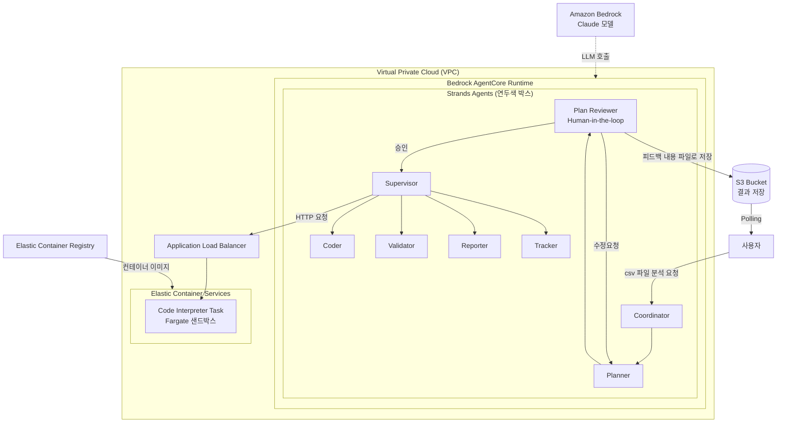
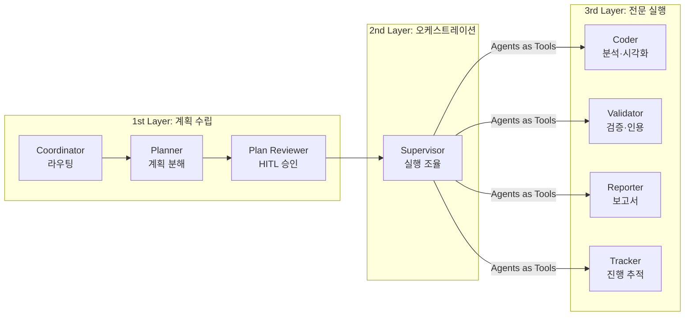
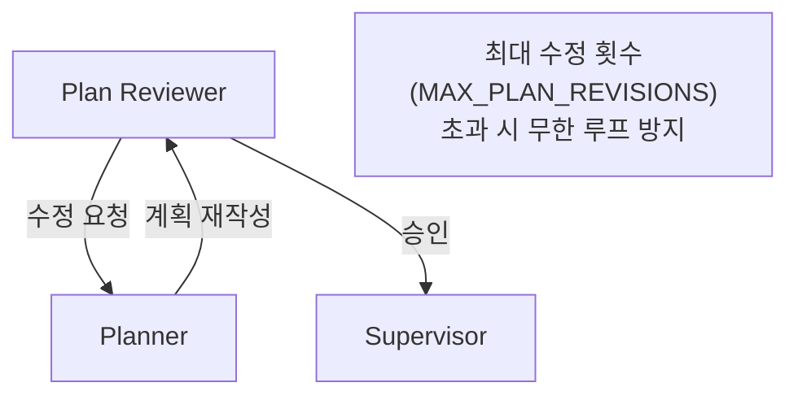
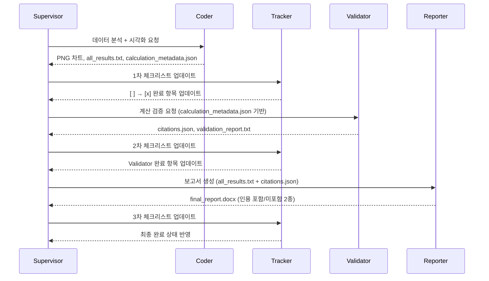
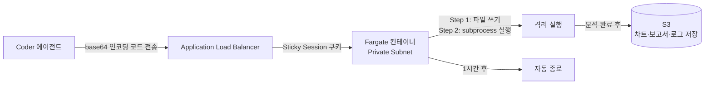
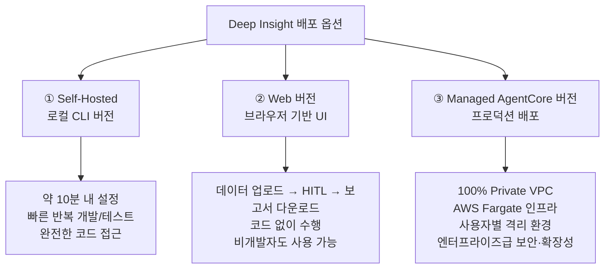
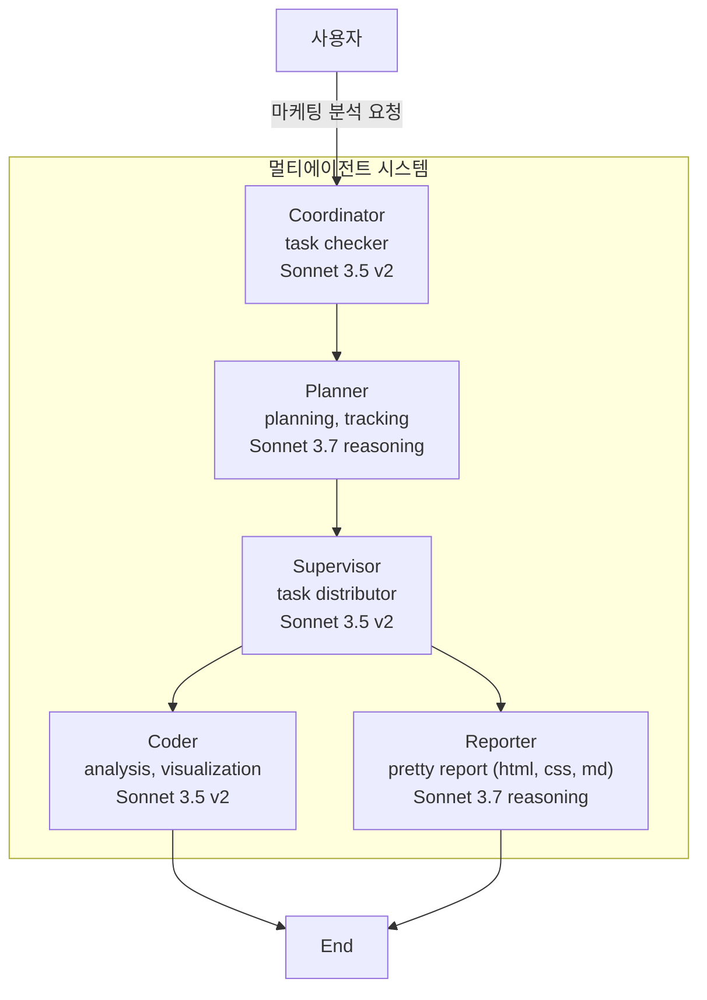
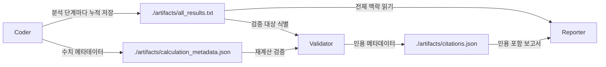
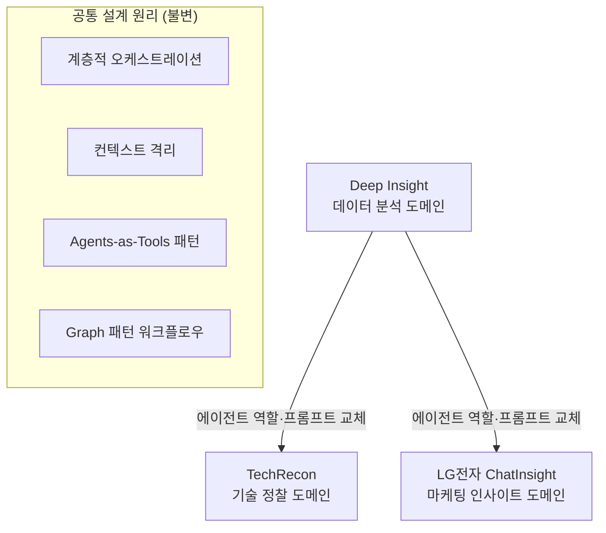
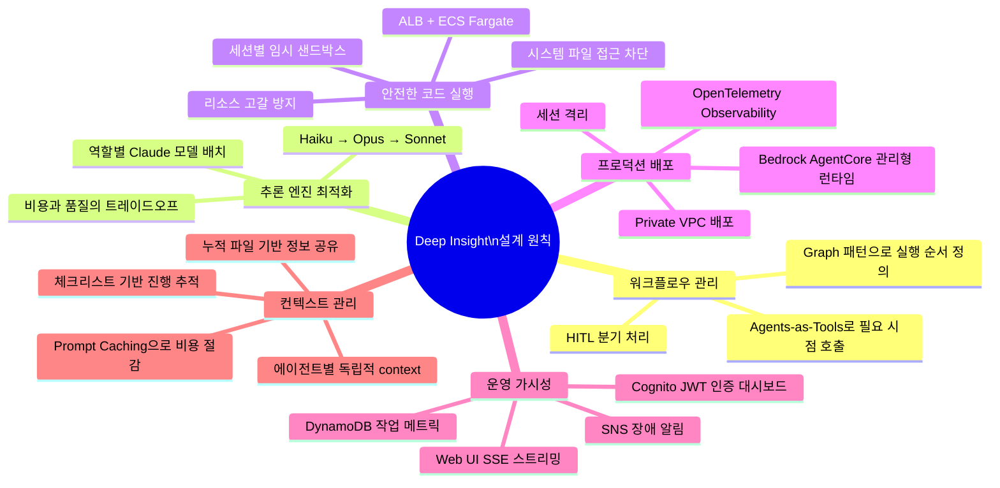

> AWS Korea SA Team이 개발한 프로덕션급 멀티에이전트 데이터 분석 시스템  
> 출처: AWS Tech Blog (2026.04.01) | LG전자 사례 블로그 (2025.08.28)

---

## 목차

1. [개요: 왜 지금 Multi-Agent인가](#1-개요-왜-지금-multi-agent인가)
2. [Deep Insight란 무엇인가](#2-deep-insight란-무엇인가)
3. [전체 아키텍처 구조](#3-전체-아키텍처-구조)
4. [5가지 프로덕션 문제와 해결 전략](#4-5가지-프로덕션-문제와-해결-전략)
5. [멀티에이전트 시스템 설계 상세](#5-멀티에이전트-시스템-설계-상세)
   - 5.1 [1st Layer: Coordinator → Planner → Plan Reviewer](#51-1st-layer-coordinator--planner--plan-reviewer)
   - 5.2 [2nd Layer: Supervisor (오케스트레이터)](#52-2nd-layer-supervisor-오케스트레이터)
   - 5.3 [3rd Layer: 전문 실행 에이전트](#53-3rd-layer-전문-실행-에이전트)
   - 5.4 [에이전트별 LLM 모델 구성 전략](#54-에이전트별-llm-모델-구성-전략)
6. [프로덕션 배포 및 운영 인프라](#6-프로덕션-배포-및-운영-인프라)
7. [배포 옵션 3가지](#7-배포-옵션-3가지)
8. [LG전자 사례: Agentic AI 기반 마케팅 인사이트 추출 시스템](#8-lg전자-사례-agentic-ai-기반-마케팅-인사이트-추출-시스템)
   - 8.1 [문제 정의: 데이터는 있지만 인사이트가 없다](#81-문제-정의-데이터는-있지만-인사이트가-없다)
   - 8.2 [해결 전략: Agentic AI 접근법](#82-해결-전략-agentic-ai-접근법)
   - 8.3 [에이전트 간 정보 공유 메커니즘](#83-에이전트-간-정보-공유-메커니즘)
   - 8.4 [실제 성과와 비즈니스 임팩트](#84-실제-성과와-비즈니스-임팩트)
9. [TechRecon: 기술 정찰 에이전트 (re:Invent 2025)](#9-techrecon-기술-정찰-에이전트-reinvent-2025)
10. [핵심 설계 원칙 종합](#10-핵심-설계-원칙-종합)
11. [시리즈 예고: Part 2, 3](#11-시리즈-예고-part-2-3)

---

## 1. 개요: 왜 지금 Multi-Agent인가

AI 에이전트를 만드는 것 자체는 이제 어렵지 않다. 오픈소스 프레임워크와 클라우드 서비스 덕분에 에이전트 구축은 수일 내에 가능해졌고, 툴 호출 몇 개와 프롬프트 몇 줄이면 그럴듯한 에이전트를 만들 수 있다. 그러나 파일럿을 넘어 실제 비즈니스에 적용하려는 순간, 많은 팀들이 비슷한 벽에 부딪힌다.

현장에서 반복되는 질문들은 이렇다.

- "왜 에이전트가 우리 비즈니스 로직대로 처리하지 않을까?"
- "왜 필수 검증 단계를 건너뛸까?"
- "왜 예외 상황을 감지하지 못할까?"

프롬프트를 수정하고, 예시를 추가하고, 모델을 교체해봐도 비슷한 문제가 계속 반복된다. 에이전트는 정해진 순서가 아니라 **맥락에 따라 스스로 판단**하기 때문에, 지시사항만으로는 부족하다. 어떻게 생각하고, 언제 확인하고, 실패하면 어떻게 할지 **판단하는 방식 자체를 설계**해야 한다. 이것이 단순한 프롬프트 엔지니어링을 넘어, 에이전트의 인지 구조와 실행 흐름 전체를 설계하는 일이 중요해진 이유다.

AWS Korea SA Team은 이러한 과제를 직접 풀기 위해 **'Deep Insight'** 라는 프로덕션급 Multi-Agent 시스템을 개발했다. 이 문서는 그 설계 결정들을 분해하여 분석한다.

---

## 2. Deep Insight란 무엇인가

Deep Insight는 **복잡한 데이터 분석 작업을 자동화된 인사이트로 전환하는 Multi-Agent 시스템**이다.

### 입출력 구조

| 항목 | 내용 |
|---|---|
| **Input** | CSV 데이터 파일 + 컬럼 정의 JSON |
| **예시 프롬프트** | "세일즈 및 마케팅 관점으로 분석하고, 차트 생성 및 인사이트도 뽑아서 docx 파일로 만들어줘" |
| **Output** | DOCX 보고서 (인용 포함/미포함 2종) + 차트 그래프 파일 (PNG) |

### 내부 처리 흐름

CSV와 자연어 프롬프트가 입력되면, Coordinator, Planner, Supervisor, 그리고 Coder, Validator, Reporter, Tracker 등 전문화된 에이전트들이 계층적으로 협력하여 다음을 순차 수행한다.

1. 데이터 로드 및 구조 파악
2. 분석 코드 작성 및 실행
3. 차트 및 시각화 생성
4. 계산 결과 독립 검증
5. 인용이 포함된 전문 보고서(.docx) 자동 생성

---

## 3. 전체 아키텍처 구조

아래 다이어그램은 Deep Insight의 전체 AWS 인프라 아키텍처를 표현한다. VPC 내에서 Strands Agents 멀티에이전트 구조가 Amazon Bedrock AgentCore Runtime 위에 동작하고, 생성된 코드는 ECS Fargate 샌드박스에서 격리 실행된다.



### 계층 구조 정리



---

## 4. 5가지 프로덕션 문제와 해결 전략

프로덕션 Multi-Agent 시스템 구축에는 "좋은 프롬프트"만으로는 부족하다. 각 문제를 해결하는 올바른 기술 스택과 인프라가 필요하다.

| # | 해결해야 할 문제 | 활용 기술 | 방법 요약 |
|---|---|---|---|
| **1** | 멀티에이전트 간 실행 흐름을 어떻게 제어할까? | **Strands Agents SDK** | Graph 패턴으로 실행 순서 정의, HITL 분기 구현; Agents-as-Tools 패턴으로 Supervisor가 전문 에이전트를 필요 시점에만 호출 |
| **2** | 에이전트가 어떤 LLM 모델을 사용해야 할까? | **Amazon Bedrock** | 역할별 Claude 모델 선택 (Haiku: 간단 라우팅, Opus: 계획 수립, Sonnet: 실행) |
| **3** | 완성한 에이전트를 프로덕션에서 어떻게 안정적으로 운영하지? | **Amazon Bedrock AgentCore** | 관리형 런타임 및 모니터링, 세션 격리, Private VPC 배포 |
| **4** | AI가 생성한 코드 실행 시의 보안 위험을 어떻게 방지할까? | **AWS Fargate + ALB** | 세션별 임시 샌드박스 컨테이너 구현 (Custom Code Interpreter) |
| **5** | 시스템을 어떻게 모니터링하고 관리하지? | **DynamoDB + Amazon SNS + Cognito** | 관리자 대시보드 및 장애 알림 시스템 구현 |

---

## 5. 멀티에이전트 시스템 설계 상세

Deep Insight는 총 **8개의 에이전트** 간 협업을 통해 하나의 완성도 높은 결과물을 만드는 멀티에이전트 아키텍처를 채택했다. 각 에이전트는 독립적인 context에서 전문 영역의 작업만 수행하고, 압축된 결과만 다음 에이전트에게 전달한다.

이 멀티에이전트들의 실행 흐름 제어에는 Strands Agents SDK가 제공하는 **두 가지 핵심 패턴**이 조합된다.

- **Graph 패턴**: 에이전트들의 실행 순서와 흐름을 방향 그래프로 정의. 조건부 분기를 통해 HITL이나 에러 처리 같은 복잡한 워크플로우를 유연하게 구현
- **Agents-as-Tools 패턴**: Supervisor가 Coder, Validator, Reporter, Tracker 같은 전문 에이전트들을 마치 도구처럼 필요한 시점에만 호출. 독립적인 context에서 작업 후 결과만 반환하므로 전체 context 사용량 최소화

---

### 5.1 1st Layer: Coordinator → Planner → Plan Reviewer

#### Coordinator (라우팅): 모든 요청에 비싼 오케스트레이션이 필요하지는 않다

Coordinator는 사용자 요청의 진입점이다. 핵심 설계 결정은 **모델 선택**이다. 빠른 분류만 수행하므로 가장 경량인 **Claude Haiku** 모델을 사용한다. 단순 인사말에 Opus급 비용을 지출하는 낭비를 방지하고 빠른 응답을 제공한다.

- 단순한 인사말, 자기소개 질문 → 직접 처리
- 데이터 분석 같은 복잡한 작업 → `handoff_to_planner` 마커를 포함하여 Planner에게 라우팅

```python
# builder.py — 조건부 엣지로 라우팅 결정
builder.set_entry_point("coordinator")
builder.add_edge("coordinator", "planner", condition=should_handoff_to_planner)
```

#### Planner (계획 수립): 복잡한 분석은 실행 전에 분해가 필요하다

Planner는 **Extended Thinking이 활성화된 Claude Opus** 모델로 분석 계획을 수립한다. 큰 작업을 5~10개의 작은 단계로 분해하고, 체크리스트(`[ ]`) 형식으로 각 에이전트에게 배정할 작업을 명시하여 `full_plan` 변수로 저장한다.

계획 수립의 실제 예시는 다음과 같다.

```markdown
## title
Yummy Food 소비자 구매 패턴 및 광고 효과 분석 보고서

## steps
### 1. Coder: 종합 데이터 분석 및 인사이트 도출
- [ ] './data/*' 경로의 모든 데이터 파일 로드 및 구조 파악
- [ ] 소비자 구매 이력 데이터 분석 (구매 패턴, 선호도, 고객 세그먼트)
- [ ] 매체별 광고 데이터 분석 (비용, 효과, 채널 비교)
- [ ] 핵심 비즈니스 지표 계산 (전환율, CPA, ROAS 등)
- [ ] 시각화 생성 (차트 5개 이상)
- [ ] 마케팅 관점의 전략적 인사이트 도출
- [ ] 계산 메타데이터 생성 (검증용)

### 2. Validator: 계산 검증 및 인용 메타데이터 생성
- [ ] 검증 대상 식별 및 필터 계산 추출
- [ ] 데이터 파일을 직접 로드하여 재계산 수행
- [ ] 인용 메타데이터 생성

### 3. Reporter: 마케팅 분석 보고서 생성
- [ ] 검증된 분석 결과를 활용하여 구조화된 보고서 작성
- [ ] 시각화 자료 삽입 및 분석 섹션 포함
- [ ] 전문적인 마케팅 보고서 형식의 DOCX 생성
```

계획 없이 작업하면 에이전트가 즉석에서 모든 것을 결정해야 하고, 중간에 방향 전환이 필요하면 이전 작업이 무효화된다. 또한 사용자는 진행 상황을 파악할 수 없다. Planner와 Plan Reviewer를 통해 이 문제를 해결한다.

#### Plan Reviewer (Human-in-the-Loop): 사용자가 계획을 검토하고 승인한다

Plan Reviewer는 HITL 노드로, 생성한 계획을 사용자에게 보여주고 승인 또는 수정 피드백을 받는다.



```python
# builder.py — Plan Reviewer의 양방향 조건부 엣지
builder.add_edge("plan_reviewer", "planner", condition=should_revise_plan)
builder.add_edge("plan_reviewer", "supervisor", condition=should_proceed_to_supervisor)
builder.set_max_node_executions(25)
```

Web 버전에서는 모달 창에 계획이 표시되고, 카운트다운 타이머(300초)가 작동한다. 시간 내에 응답이 없으면 자동 승인된다.

---

### 5.2 2nd Layer: Supervisor (오케스트레이터)

Supervisor는 Planner가 생성한 `full_plan`의 체크리스트를 순서대로 실행하는 오케스트레이터다. 3rd Layer의 전문 에이전트들을 **Tool Use로 호출**한다는 것이 핵심 특징이다.

```python
# nodes.py — Supervisor 에이전트에 Sub Agent를 Tool로 등록
agent = strands_utils.get_agent(
    agent_name="supervisor",
    system_prompts=apply_prompt_template(prompt_name="supervisor", prompt_context={}),
    model_id=os.getenv("SUPERVISOR_MODEL_ID"),
    prompt_cache_info=(True, "default"),
    tool_cache=True,
    tools=[coder_agent_tool, reporter_agent_tool, tracker_agent_tool, validator_agent_tool],
    streaming=True,
)
```

Supervisor의 시스템 프롬프트는 세 가지 엄격한 규칙을 정의한다.

1. **필수 실행 순서**: `Coder → Tracker → Validator → Tracker → Reporter → Tracker`. 각 에이전트 실행 후 반드시 Tracker를 호출하여 진행 상태를 추적한다.
2. **섹션 완료 규칙**: 현재 에이전트의 모든 체크리스트가 `[x]`가 될 때까지 다음 에이전트로 넘어가지 않는다.
3. **컨텍스트 보존**: 각 도구 에이전트에게 `clues` 변수와 `full_plan` 변수를 전달하여 전체 컨텍스트를 유지하고 맥락 손실을 방지한다.

---

### 5.3 3rd Layer: 전문 실행 에이전트

Layer 3의 각 전문 에이전트는 `PythonAgentTool`로 래핑되어 Supervisor의 Tool Use 호출을 받는다. 각자 독립된 `Agent()` 인스턴스로 생성되며, 자체적인 시스템 프롬프트와 모델 ID, 도구 세트를 갖는다.

| 에이전트 | 역할 | 보유 도구 | 주요 출력물 |
|---|---|---|---|
| **Coder** | 데이터 분석, 차트 생성, 인사이트 도출 | write_and_execute_tool, bash_tool, file_read, skill_tool | `*.png` 차트, `calculation_metadata.json` |
| **Validator** | 수치 계산 재검증, 인용 생성 | write_and_execute_tool, bash_tool, file_read | `citations.json`, `validation_report.txt` |
| **Reporter** | DOCX 보고서 생성 | write_and_execute_tool, bash_tool, file_read | `final_report.docx`, `final_report_with_citations.docx` |
| **Tracker** | 체크리스트 진행 상태 업데이트 | 없음 (LLM 추론만 사용) | 업데이트된 `full_plan` |

#### 전체 실행 시퀀스



**Coder**는 분석 결과를 `all_results.txt`에 상세히 누적해 기록한다. **Validator**는 `calculation_metadata.json`을 읽고 소스 데이터에서 재계산하여 비교한다. 0.01 오차 범위 내 일치 시 검증 통과, 불일치 시 오류를 플래그한다. 검증된 계산은 `citations.json`에 저장된다. **Reporter**는 `all_results.txt`와 `citations.json`을 읽어 DOCX 보고서를 인용 포함/미포함 2종으로 생성한다. **Tracker**가 매 에이전트 실행 후 반복 실행되는 이유는, Supervisor가 현재 완료 상태를 정확히 파악하고 섹션 완료 규칙을 강제하기 위해서다. Tracker는 도구 없이 LLM 추론만으로 체크리스트를 갱신하는 경량 에이전트이므로, 오버헤드를 최소화한다.

---

### 5.4 에이전트별 LLM 모델 구성 전략

에이전트별 모델 선택은 단순한 기술적 결정이 아니라 **비용과 품질을 최적화하는 아키텍처적 결정**이다.

| 에이전트 | 모델 | Extended Thinking | Prompt Caching | 역할 및 이유 |
|---|---|---|---|---|
| Coordinator | **Haiku** | 비활성화 | No | 빠른 라우팅 — 비용 최소화 |
| Planner | **Opus** | 활성화 (~8192 토큰) | No | 심층 사고 — 최고 품질 계획 수립 |
| Supervisor | **Sonnet** | 비활성화 | **Yes** | 실행 오케스트레이션 — 캐싱으로 비용 절감 |
| Coder | **Sonnet** | 비활성화 | **Yes** | 코드 생성/실행 — 반복 호출에 캐싱 효과적 |
| Validator | **Sonnet** | 비활성화 | No | 수치 검증 — 매번 다른 데이터로 캐싱 불필요 |
| Reporter | **Sonnet** | 비활성화 | **Yes** | 보고서 생성 — 긴 프롬프트에 캐싱 효과적 |
| Tracker | **Sonnet** | 비활성화 | No | 상태 업데이트 — 경량 작업으로 캐싱 불필요 |

Prompt Cache가 활성화된 Supervisor, Coder, Reporter 에이전트는 시스템 프롬프트와 도구 정의를 캐싱하여 반복 호출 시 입력 토큰 비용을 **최대 90%까지** 절감한다. 이러한 선택적 캐싱 전략은 의도적인 비용/성능 트레이드오프다.

---

## 6. 프로덕션 배포 및 운영 인프라

멀티에이전트 시스템 설계가 "무엇을 하는가"를 정의한다면, 인프라 설계는 "**어디서, 어떻게 안전하게 실행하는가**"를 정의한다.

### 코드 실행: LLM이 생성한 코드에는 안전한 실행 환경이 필요하다

Coder 에이전트가 생성한 Python 코드를 프로덕션 서버에서 직접 실행하면 다음과 같은 보안 위험이 발생할 수 있다.

- LLM이 의도치 않게 **시스템 파일을 삭제**하는 코드 생성
- **무한 루프**로 서버 리소스 고갈
- 다른 사용자의 분석 데이터가 저장된 **디렉토리에 접근**

Deep Insight는 **AWS Fargate 컨테이너 + ALB**를 활용해 세션별 임시 컨테이너를 제공하여 이 문제를 해결한다.



설계의 주요 포인트는 다음과 같다.

- **커스텀 도커 이미지**: 한글 폰트, 시스템 라이브러리, Python 패키지가 사전 설치된 최적화된 샌드박스 환경
- **컨테이너 격리**: 각 분석 세션마다 독립적인 Fargate 컨테이너 생성. Private VPC 서브넷에서 실행되며 직접적인 인터넷 접근 없음
- **2-step 실행**: 코드는 base64로 인코딩되어 HTTP로 전송. 컨테이너 내에서 파일 쓰기(Step 1) 후 subprocess 실행(Step 2)
- **세션 친화성**: ALB Sticky Session 쿠키를 사용해 동일 세션은 항상 같은 컨테이너로 라우팅
- **아티팩트 관리**: 분석 완료 후 차트, 보고서, 로그가 S3에 업로드. 컨테이너는 1시간 후 자동 종료

### 운영과 모니터링: 팀에게는 가시성이 필요하다

프로덕션 시스템은 코드만으로 완성되지 않는다. Deep Insight는 Web UI와 Ops 대시보드를 제공한다.

**Web UI (deep-insight-web)**
- FastAPI 기반의 웹 인터페이스
- AgentCore Native Protocol(`boto3.invoke_agent_runtime()`)을 통해 백엔드와 통신
- SSE(Server-Sent Events) 스트리밍으로 실시간 분석 진행 상황 표시
- 분석 계획 승인/수정 모달 창 (HITL)
- 완료 후 보고서 직접 다운로드
- 한국어/영어 다국어 지원

**Ops 대시보드 (deep-insight-web/ops)**
- **작업 추적**: DynamoDB에 상태, 토큰 사용량, 소요 시간 등 모든 분석 작업 메트릭 기록
- **장애 알림**: 분석 실패 시 Amazon SNS를 통해 관리자에게 즉시 이메일 발송
- **관리자 대시보드**: Amazon Cognito의 JWT 인증으로 보호된 관리자 전용 대시보드

---

## 7. 배포 옵션 3가지

Deep Insight는 세 가지 배포 옵션을 제공하며, **모두 동일한 Multi-Agent 아키텍처를 사용**하기 때문에 개발 환경에서 검증한 에이전트를 프로덕션에 그대로 배포할 수 있다.



---

## 8. LG전자 사례: Agentic AI 기반 마케팅 인사이트 추출 시스템

LG전자 한국영업본부는 Deep Insight와 동일한 멀티에이전트 아키텍처를 채택한 **ChatInsight** 시스템을 구축했다. 이 사례는 Deep Insight의 설계 원리가 데이터 분석 보고서 생성이라는 단일 도메인을 넘어 **범용적으로 적용 가능한 패턴**임을 보여준다.

### 8.1 문제 정의: 데이터는 있지만 인사이트가 없다

LG전자 한국영업본부는 한국시장 전체의 마케팅 및 영업을 총괄하는 핵심 조직으로, 2천만 고객 각각의 다양한 취향과 니즈에 맞춘 개인화된 솔루션을 제공하는 것이 핵심 목표다. 그러나 데이터 드리븐 마케팅 현장에서는 세 가지 구조적 문제가 반복됐다.

#### 문제 1: 데이터 과학자 의존 체계의 비효율성

마케터가 "지난 분기 30대 여성 고객의 구매 패턴을 분석해달라"고 요청해도, 마케팅 도메인 지식과 데이터 분석 기술 간의 언어적 차이로 인해 요구사항 전달 과정에서 핵심 정보가 손실된다. 이로 인해 요구사항 정의부터 결과 해석까지 평균 2~3주의 긴 리드타임이 발생하며, 빠르게 변화하는 마케팅 환경에서는 분석이 완료되는 시점에 이미 시의성을 잃는다.

#### 문제 2: 도구 접근성과 비용 확장성의 모순

SaaS형 CDP와 In-House CDP를 순차적으로 도입했지만 근본적인 접근성 문제가 해결되지 않았다. SaaS 솔루션은 사용자 수와 데이터량 증가에 따라 기하급수적으로 비용이 증가하고, In-House CDP 구축 후에도 데이터 스키마 이해 부족과 SQL 기술 요구 때문에 이용률이 낮다.

#### 문제 3: 인사이트 추출 방법론의 추상성

효과적인 데이터 분석을 위해서는 "어떤 질문을 해야 할지"를 먼저 정의해야 하지만, 이는 도메인 지식과 분석적 사고가 결합된 고도의 전문성을 요구한다. 고객 데이터는 시간, 지역, 연령, 제품 카테고리 등 수십 개의 차원을 가지고 있으며, 이들의 조합은 기하급수적으로 증가한다. 결과적으로 마케터는 **"Data Rich, Insight Poor"** 상황에 빠진다.

---

### 8.2 해결 전략: Agentic AI 접근법

LG전자의 Agentic AI 마케팅 인사이트 추출 시스템은 Deep Insight와 동일한 계층 구조를 채택한다. 아키텍처 차이는 에이전트의 역할과 프롬프트뿐이며, 계층적 오케스트레이션과 컨텍스트 격리라는 설계 원리는 동일하다.



#### 에이전트별 역할 상세

**Coordinator (작업 복잡도 판단)**
단순한 데이터 조회나 기본 통계 분석은 단일 모델로 처리하고, 복잡한 다단계 분석이 필요한 경우에만 다중 에이전트 시스템을 활성화한다. 이를 통해 시스템 리소스를 효율적으로 사용한다.

복잡도 평가 기준:
- 다중 분석 기법 필요 여부
- 다양한 시각화 요구 여부
- 고품질 리포트 생성 필요 여부
- 데이터 특성에 따른 추가 분석 가능성

**Planner (분석 계획 수립 및 작업 추적)**
주어진 데이터와 분석 목표를 바탕으로 구체적인 분석 전략을 수립한다. 각 에이전트의 작업 완료 후 Task Tracking을 통해 계획된 분석이 올바르게 수행되었는지 검증하고, 필요시 추가 분석이나 수정 작업을 지시한다.

**Supervisor (전체 프로세스 관리)**
Planner의 계획에 따라 에이전트에게 작업을 분배하고, 각 단계별 결과의 품질을 검증하며 워크플로우를 조율한다.

**Coder (데이터 분석 및 시각화)**
Python REPL과 Bash Tool을 사용해 데이터 분석 코드를 생성하고 실행한다. 탐색적 데이터 분석, 시각화 생성(막대차트, 선그래프, 히트맵, 산점도 등), 통계 분석, 고급 분석(세그먼트 분석, 클러스터링, 이상치 분석)을 자동 수행한다.

**Reporter (인사이트 및 리포트 생성)**
분석 결과를 종합하여 HTML, CSS, Markdown 등 다양한 형태의 보고서를 작성한다. 단순 데이터 요약이 아닌 실행 가능한 마케팅 제언과 전략적 시사점을 포함한 고품질 리포트를 자동 생성한다.

---

### 8.3 에이전트 간 정보 공유 메커니즘

멀티에이전트 시스템 구현의 가장 중요한 과제 중 하나는 **에이전트 간 효과적인 정보 공유**다.

#### 기존 방식의 한계: 요약 기반 정보 전달

일반적으로 멀티에이전트 시스템에서는 각 에이전트의 작업이 완료되면 결과를 요약하여 다음 에이전트에게 전달한다. 그러나 이 방식은 다음 문제를 야기한다.

- **세부 정보의 손실**: 요약 과정에서 중요한 세부 사항들이 누락
- **맥락 정보의 부재**: 이전 에이전트의 사고 과정과 의사결정 근거가 전달되지 않음
- **누적 오류 효과**: 여러 에이전트를 거치면서 정보 손실이 누적되어 최종 결과물의 품질 저하

#### 해결 방안: 누적 파일 기반 정보 공유

각 에이전트의 중간 결과물을 파일에 지속적으로 누적시키는 방식을 도입했다. Coder 에이전트는 분석 결과를 `./artifacts/all_results.txt`에 누적 저장하고, Reporter는 이 파일을 읽어 전체 작업 맥락을 파악한 후 보고서를 생성한다.



파일 구조는 다음과 같은 구분자로 분리된다.

```
==================================================
## Analysis Stage: {단계명}
## Execution Time: {실행 시각}
--------------------------------------------------
Result Description: 
{분석 결과 상세 설명}
--------------------------------------------------
Generated Files:
- ./artifacts/{파일경로} : {파일 설명}
==================================================
```

이 접근법의 주요 장점은 다음과 같다.

- **완전한 맥락 보존**: 후속 에이전트가 이전 에이전트의 전체 작업 과정을 상세히 파악 가능
- **품질 향상**: 이전 결과의 누락된 부분을 식별하고 개선 가능
- **연속성 확보**: 전체 작업 흐름의 일관성과 연속성 유지

---

### 8.4 실제 성과와 비즈니스 임팩트

#### 주요 활용 사례

LG전자 한국영업본부에서 실제 업무에 활용된 분석 보고서들의 사례는 다음과 같다.

| 분석 유형 | 내용 | 활용 효과 |
|---|---|---|
| **제품별 고객 분석** | 워시콤보 사용 이력 기반 기기 사용 패턴 및 고객 세그별 특징 도출 | 제품 개발팀 기능 개선점 파악, 마케팅팀 맞춤형 전략 수립 |
| **식기세척기 분석** | CDP 내부 데이터 활용 채널별/제품별/다품목 구매 고객 특징 심층 분석 | 효과적인 타겟 고객 식별, 제품 포지셔닝 전략 수립 |
| **제품 수익성 분석** | 월마감 및 일일실적 데이터 분석, 영업이익 등 수익성 지표 모니터링 | 즉각적인 의사결정, 수익성 악화 요인 사전 식별 |
| **캠페인 성과 비교** | CRM 캠페인 A/B 비교, 고객 세그먼트별 반응도, 환경 요인 종합 평가 | 캠페인 ROI 향상, 효과적인 메시지-고객층 매핑 |
| **온라인 채널 분석** | 세션·유입경로·클릭·상품 조회 행동 정보와 고객 데이터 결합 분석 | UX 개선점 발견, 전환율 향상 최적화 포인트 식별 |

#### 핵심 성과 지표

```
기존 데이터 분석 소요 시간:  3일
Agentic AI 도입 후:          30분

생산성 향상:  288배 ↑
```

이러한 시간 단축은 단순한 자동화를 넘어선 혁신이다. Agentic AI는 데이터를 수집하고 처리하며, 패턴을 식별하여 실행 가능한 인사이트를 제공한다. 마케팅 팀은 반복적인 데이터 분석 작업에서 벗어나 창의적이고 전략적인 업무에 집중할 수 있게 되었다.

#### 조직 역량의 근본적 변화

Agentic AI 도입으로 마케팅 실무자의 역할이 확장됐다. 일반 마케팅 및 영업 기획 담당자들은 이제 AI를 활용해 **정보 수집 → 분석 → 전략 수립 → 실행**의 완전한 워크플로우를 독립적으로 수행할 수 있게 됐다.

데이터 활용 범위도 내부 데이터에서 웹 전역으로 확장됐다. 뉴스·언론(시장 동향), 블로그·커뮤니티(고객 관심사), 리뷰·평점(제품 만족도), 커머스 플랫폼(경쟁사 모니터링), SNS·소셜미디어(감정 분석)까지 다차원 데이터 통합 분석이 가능해졌다.

---

## 9. TechRecon: 기술 정찰 에이전트 (re:Invent 2025)

AWS re:Invent 2025 세션 SNR203에서 발표된 **TechRecon**은 Deep Insight의 아키텍처를 **기술 전략 도메인**에 적용한 사례다.

회사명과 산업 분야를 입력하면, Researcher 에이전트가 Tavily 검색과 웹 크롤링으로 신기술 동향을 수집하고, Coder가 데이터를 분석하며, Validator가 검증한 뒤, Reporter가 두 종류의 결과물을 생성한다.

1. **Landscape Analysis**: 신기술 전체 분석
2. **Technical Position Paper**: 특정 기술 심층 분석

아키텍처는 Deep Insight와 거의 동일하다. Router Planner → Supervisor → Tool Agents (Researcher, Coder, Reporter, Tracker, Validator) 구조를 Strands Agents SDK의 GraphBuilder로 구현하고, Extended Thinking과 Prompt Caching을 적용했다. 핵심적인 차이는 **Coder 대신 Researcher가 주요 실행 에이전트**라는 점뿐이며, 계층적 오케스트레이션과 컨텍스트 격리라는 설계 원리는 그대로 유지된다.



이 두 사례는 Deep Insight의 아키텍처가 특정 유스케이스에 종속된 것이 아니라, **도메인을 교체해도 동작하는 범용적인 설계 패턴**임을 보여준다. 에이전트의 역할과 프롬프트만 교체하면, 동일한 오케스트레이션 구조 위에서 전혀 다른 문제를 해결할 수 있다.

---

## 10. 핵심 설계 원칙 종합

프로덕션에서 동작하는 에이전트를 만든다는 것은 **모델의 능력이 아니라, 아키텍처의 문제**다.



### 실전 교훈 요약

1. **모든 요청에 비싼 오케스트레이션이 필요하지는 않다** — Coordinator가 라우팅을 담당하고 Haiku로 분류하면 비용을 크게 줄일 수 있다.

2. **계획 없이 실행하면 방향 전환이 불가능하다** — Planner가 초기에 전체 작업을 분해하고, Plan Reviewer가 사용자 승인을 받는 구조가 필수다.

3. **전문화가 완성도를 만든다** — Coder, Validator, Reporter, Tracker가 각자의 전문 역할만 수행하고 결과를 누적 전달함으로써 전체 품질이 보장된다.

4. **LLM이 생성한 코드는 반드시 격리 실행되어야 한다** — 프로덕션에서 직접 실행은 보안 위협이다. Fargate 샌드박스가 필수 인프라다.

5. **설계 패턴은 도메인에 종속되지 않는다** — 에이전트의 역할과 프롬프트만 교체하면, 데이터 분석부터 마케팅 인사이트, 기술 정찰까지 동일한 구조가 동작한다.

---

## 11. 시리즈 예고: Part 2, 3

이 블로그 시리즈는 3회에 걸쳐 공개된다.

| Part | 제목 | 주요 내용 |
|---|---|---|
| **Part 1** (발행 완료) | 프로덕션 Multi-Agent 시스템이 해결해야 할 5가지 문제 | 아키텍처 설계, 에이전트 구조, AWS 인프라 |
| **Part 2** (발행 예정) | Context Window 한계를 넘어서 – Context Engineering 실전 기법 | LLM Context Window 극복을 위한 4가지 계층의 핵심 기법, Anthropic의 엔지니어링 리서치와 비교 |
| **Part 3** (발행 예정) | 개발에서 운영까지 – Deep Insight를 AWS에 안전하게 배포하는 방법 | 로컬 개발에서 Private VPC 배포까지, AgentCore 버전 상세 배포 방법, 운영 노하우 |

Part 2에서는 아키텍처 수준의 격리부터 프롬프트 설계, 도구 최적화, 검증 안전장치까지 각 계층이 어떻게 context를 효율적으로 관리하는지를 다룬다.

---

## 참고 자료

- **Deep Insight GitHub**: https://github.com/aws-samples/sample-deep-insight
- **Deep Insight Workshop**: https://catalog.workshops.aws/deep-insight/
- **AWS Tech Blog (Part 1)**: https://aws.amazon.com/ko/blogs/tech/practical-design-lessons-from-the-deep-insight-arch/
- **LG전자 사례 블로그**: https://aws.amazon.com/ko/blogs/tech/lge-agentic-report-automation/
- **TechRecon GitHub**: (AWS re:Invent SNR203 세션 자료)
- **Deep Insight 데모 영상**: https://youtu.be/zYDGI6X0UhY

---

*본 문서는 AWS Tech Blog (2026.04.01, 2025.08.28)의 내용을 종합·분석하여 작성되었습니다.*
