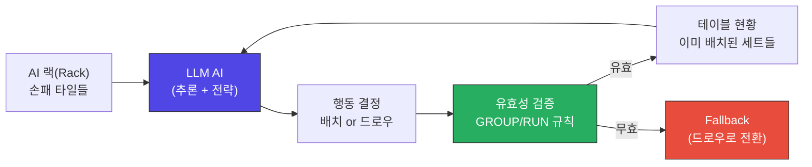
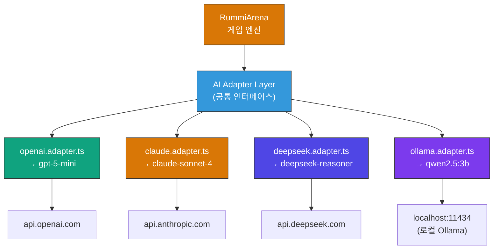
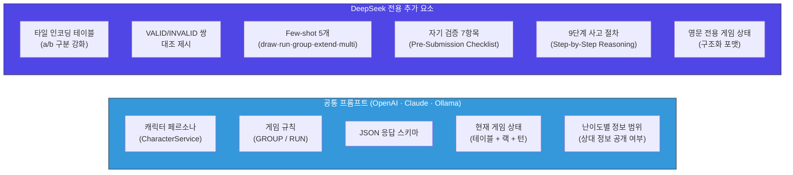
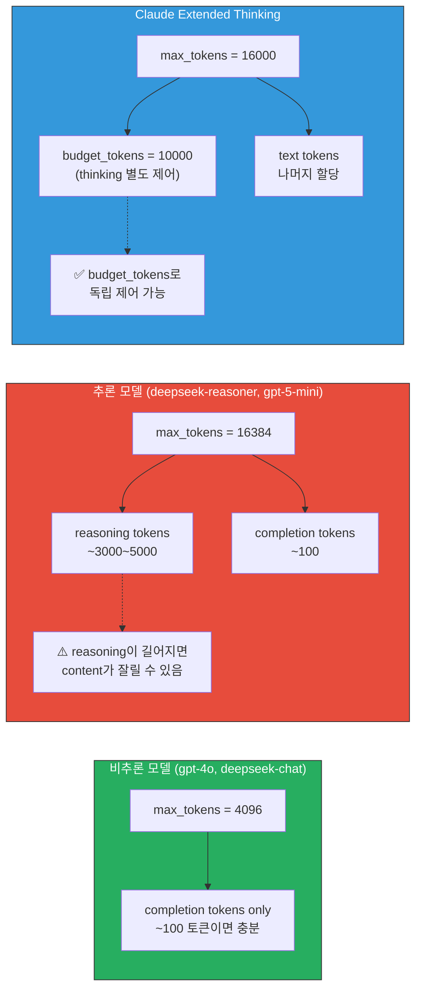
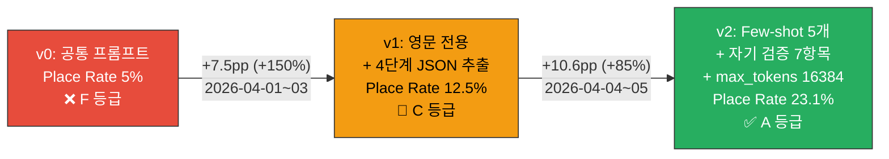
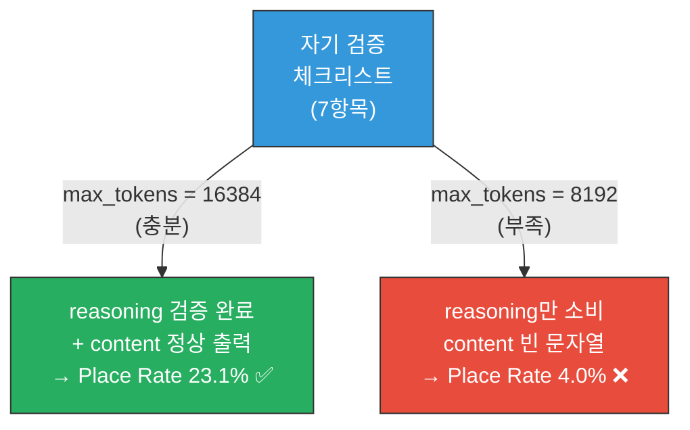
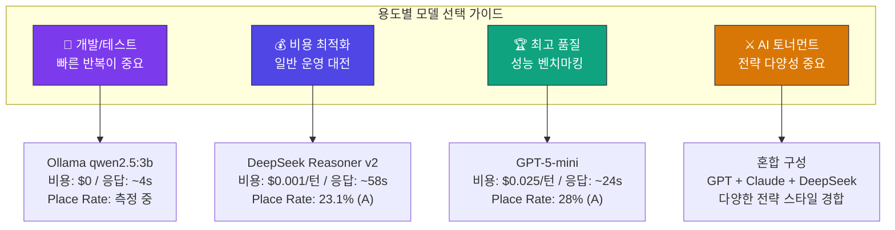

> **원본 문서**: [GitHub — k82022603/RummiArena](https://github.com/k82022603/RummiArena/blob/main/docs/02-design/18-model-prompt-policy.md)  


---

## 목차

1. [문서의 목적과 배경](#1-문서의-목적과-배경)
2. [RummiArena란 무엇인가](#2-rummiarena란-무엇인가)
3. [4종 LLM 통합 아키텍처 개요](#3-4종-llm-통합-아키텍처-개요)
4. [프롬프트 파이프라인 구조 심층 분석](#4-프롬프트-파이프라인-구조-심층-분석)
5. [모델별 프롬프트 전략 상세 해설](#5-모델별-프롬프트-전략-상세-해설)
6. [핵심 설정 파라미터 해설](#6-핵심-설정-파라미터-해설)
7. [대전 결과 데이터 심층 분석](#7-대전-결과-데이터-심층-분석)
8. [DeepSeek 최적화 여정 해설](#8-deepseek-최적화-여정-해설)
9. [프롬프트 최적화 5대 교훈](#9-프롬프트-최적화-5대-교훈)
10. [운영 권장 설정 해설](#10-운영-권장-설정-해설)
11. [캐릭터-모델 매핑 전략](#11-캐릭터-모델-매핑-전략)
12. [향후 로드맵 분석](#12-향후-로드맵-분석)
13. [종합 결론 및 시사점](#13-종합-결론-및-시사점)

---

## 1. 문서의 목적과 배경

이 문서(`18-model-prompt-policy.md`)는 **RummiArena** 프로젝트에서 실제로 운용 중인 4종의 LLM(Large Language Model, 대형 언어 모델)에 대한 프롬프트 전략, 설정 파라미터, 대전 성능 결과, 그리고 최적화 과정에서 얻은 실전 교훈을 하나의 문서로 통합한 **운영 기준 참조 문서**이다.

문서가 작성된 2026년 4월 5일은 DeepSeek 모델의 프롬프트 최적화 Round 4가 완료된 날로, 4종의 LLM이 각자 고유한 설정과 프롬프트 전략을 갖게 된 시점이다. 이 문서는 단순한 기술 명세서를 넘어, 약 5주간에 걸친 실제 게임 대전 데이터와 실험적 최적화 과정이 응축된 **실험 보고서**에 가깝다.

선행 문서로는 `04-ai-adapter-design.md`(AI 어댑터 전체 설계), `08-ai-prompt-templates.md`(프롬프트 템플릿 7레이어 상세 설계), `15-deepseek-prompt-optimization.md`(DeepSeek 전용 최적화 설계)가 있으며, 이 문서는 그 모든 설계 결정이 실제 대전 성능으로 어떻게 이어졌는지를 보여주는 **최종 집대성 문서**이다.

---

## 2. RummiArena란 무엇인가

RummiArena는 보드게임 **루미큐브(Rummikub)** 를 AI가 대전하는 플랫폼이다. 루미큐브는 1~13까지의 숫자가 적힌 4가지 색상의 타일을 조합하여 테이블 위에 배치하는 게임으로, 다음 두 가지 규칙에 따라 유효한 세트(Set)를 구성해야 한다.

- **GROUP(그룹)**: 같은 숫자, 서로 다른 색상 3~4개 조합 (예: 빨강-7, 파랑-7, 검정-7)
- **RUN(런)**: 같은 색상, 연속된 숫자 3개 이상 (예: 파랑-5, 파랑-6, 파랑-7)

이 게임에서 AI가 강력한 성능을 발휘하려면 단순한 패턴 매칭이 아니라, 현재 테이블 위의 타일 배치와 자신의 랙(rack, 손패)을 동시에 분석하여 **조합론적 탐색(combinatorial search)** 을 수행해야 한다. 이것이 일반적인 텍스트 생성 AI에게는 극도로 어려운 과제이다.

**Place Rate**는 이 문서에서 핵심 성능 지표로 사용되는데, AI가 자신의 차례에 타일을 테이블에 배치하는 데 성공한 비율을 의미한다. Place Rate가 높을수록 AI가 더 잘 게임을 하고 있다는 의미이다.



---

## 3. 4종 LLM 통합 아키텍처 개요

RummiArena는 하나의 AI 모델만 사용하지 않고, **4종의 서로 다른 LLM**을 동시에 지원한다. 각 모델은 개발 목적, 비용, 성능, 응답 속도에서 뚜렷한 차이를 가진다.

| 모델 | 구분 | 제공사 | 특성 |
|------|------|--------|------|
| **gpt-5-mini** | 추론 모델 | OpenAI | 빠른 추론, 높은 Place Rate, 중간 비용 |
| **claude-sonnet-4** | Extended Thinking | Anthropic | 깊은 전략 분석, 높은 비용, 긴 컨텍스트 |
| **deepseek-reasoner** | 추론 모델 | DeepSeek | 극저비용, 영문 전용, 최적화 필요 |
| **qwen2.5:3b** | 로컬 소형 모델 | Alibaba (Ollama) | 무료, 빠름, 개발/테스트 전용 |

이 4종의 모델을 하나의 공통 인터페이스로 통합하는 것이 **AI Adapter** 레이어이며, 각 모델은 `src/ai-adapter/src/adapter/` 디렉터리 아래에 개별 어댑터 파일로 구현되어 있다.



---

## 4. 프롬프트 파이프라인 구조 심층 분석

### 4.1 공통 프롬프트 파이프라인 (PromptBuilderService)

4종의 LLM 중 OpenAI, Claude, Ollama는 **공통 프롬프트 파이프라인**을 공유한다. 이 공통 파이프라인은 `PromptBuilderService`라는 서비스 클래스가 담당하며, 아래 3개의 레이어(Layer)로 구성된다.

**Layer 1 — System Prompt (시스템 프롬프트)**

시스템 프롬프트는 LLM에게 "너는 어떤 존재이고, 어떤 규칙에 따라 행동해야 하는가"를 알려주는 최상위 지시문이다. RummiArena의 시스템 프롬프트에는 루미큐브 게임 규칙(GROUP, RUN 규칙 전체)과 AI 캐릭터의 페르소나(예: Shark는 공격적, Fox는 기만적)가 모두 포함된다. 한국어와 영문이 혼합되어 있으며 약 3000 토큰(token) 분량이다.

**Layer 2 — User Prompt (유저 프롬프트)**

유저 프롬프트는 매 턴마다 생성되는 동적 정보를 담는다. 현재 테이블 위의 타일 배치 상황, AI의 랙(손패) 상태, 현재 턴 번호, 그리고 AI가 반환해야 하는 응답 형식(JSON 스키마)이 포함된다. 분량은 약 300~500 토큰 수준이다.

**Layer 3 — Retry Context (재시도 컨텍스트, 조건부)**

AI가 유효하지 않은 응답을 반환했을 때, 다음 시도에서 어떤 오류가 발생했는지 피드백을 포함하는 특수 레이어이다. 재시도 시에만 활성화된다.

### 4.2 DeepSeek의 전용 프롬프트 파이프라인

DeepSeek Reasoner 모델은 공통 파이프라인을 사용하지 않고 **완전히 별도의 전용 프롬프트**를 사용한다. 이는 DeepSeek 모델의 특성상 공통 프롬프트로는 올바른 성능을 낼 수 없었기 때문이다(자세한 이유는 섹션 8에서 설명).

DeepSeek 전용 프롬프트에는 다음 요소들이 추가로 포함된다.

- **타일 인코딩 테이블**: 같은 숫자의 두 타일을 구분하기 위한 a/b 접미사 체계를 명시적으로 설명
- **VALID/INVALID 쌍**: 올바른 세트와 잘못된 세트를 명시적으로 대조하여 제시
- **Few-shot 예시 5개**: draw(드로우), run(런 배치), group(그룹 배치), extend(기존 세트 확장), multi(복합 행동) 각각의 실제 응답 예시
- **자기 검증 체크리스트 7항목(Pre-Submission Checklist)**: 응답을 제출하기 전 AI가 스스로 확인해야 할 7가지 검증 항목
- **9단계 사고 절차(Step-by-Step)**: 분석부터 배치 결정까지의 구조화된 사고 순서



---

## 5. 모델별 프롬프트 전략 상세 해설

### 5.1 OpenAI gpt-5-mini

gpt-5-mini는 OpenAI의 **추론 모델(reasoning model)** 계열이다. 추론 모델이란 외부에 보이는 최종 응답을 생성하기 전에 내부적으로 "사고 과정(reasoning)"을 먼저 수행하는 모델을 말한다. 이 내부 사고는 `reasoning_tokens`로 소비되며, 사용자에게는 보이지 않는다.

RummiArena에서 gpt-5-mini를 다루는 핵심 포인트는 두 가지다. 첫째, 일반 모델이 `max_tokens`를 사용하는 것과 달리, **추론 모델은 `max_completion_tokens`를 사용**한다. 이는 내부 reasoning 토큰과 최종 응답 토큰을 합산한 상한이다. 둘째, **JSON 구조를 API 수준에서 강제**(`response_format: json_object`)할 수 있어, 파싱 실패율이 극히 낮다.

어댑터 코드에서는 `this.defaultModel.startsWith('gpt-5')`로 추론 모델 여부를 감지하고, 자동으로 `max_completion_tokens` 파라미터를 사용하도록 분기한다. temperature 파라미터는 추론 모델에서 지원되지 않으므로 아예 전송하지 않는다.

### 5.2 Claude claude-sonnet-4

Claude Sonnet 4는 Anthropic의 **Extended Thinking** 기능을 활성화하여 사용한다. Extended Thinking이란 Claude가 최종 응답 전에 별도의 "사고 블록(thinking block)"을 생성하여 깊이 있는 분석을 수행하는 기능이다. 이 thinking 블록은 API 응답의 `contentBlocks`에서 `type: 'thinking'`으로 구분되며, 실제 게임 응답은 `type: 'text'` 블록에서 추출한다.

Claude의 특이사항은 `budget_tokens: 10000`으로 thinking에 쓸 수 있는 토큰 수를 별도로 제어한다는 점이다. 전체 `max_tokens: 16000` 중 최대 10000 토큰을 thinking에 쓸 수 있고, 나머지가 실제 텍스트 응답에 할당된다. thinking 모드가 활성화되면 temperature는 자동으로 비활성화된다.

API 호출 시 `anthropic-version: '2023-06-01'` 헤더가 반드시 필요하며, `system` 프롬프트는 메시지 배열이 아닌 body 최상위 필드로 전달해야 한다는 API 구조적 특이사항도 어댑터에 구현되어 있다.

### 5.3 DeepSeek deepseek-reasoner

DeepSeek Reasoner는 OpenAI 호환 API(`api.deepseek.com/v1/chat/completions`)를 사용하는 **추론 모델**이다. gpt-5-mini와 달리 `response_format: json_object`를 지원하지 않으므로, JSON 출력을 보장하기 위한 별도 전략이 필요하다.

가장 복잡한 부분은 **4단계 JSON 추출 로직**이다. 모델이 반환한 응답에서 유효한 JSON을 추출하기 위해 다음 순서로 시도한다.

1. **content 직접 파싱**: 응답의 content 필드를 그대로 JSON으로 파싱 시도
2. **content 정규식 추출**: content 내에서 `{...}` 패턴을 정규식으로 찾아 추출
3. **reasoning 마지막 JSON**: 내부 추론(reasoning_content)의 마지막 부분에서 JSON 탐색
4. **원본 그대로 반환(fallback)**: 모든 추출 실패 시 원본 반환 후 재시도

또한 **JSON 수리(repair)** 로직도 포함되어 있는데, trailing comma 제거, 코드블록 마크다운(``` ` ``` 기호) 제거, 중괄호 매칭 보정 등을 자동으로 처리한다.

재시도 프롬프트도 공통 프롬프트를 쓰지 않고 `buildReasonerRetryPrompt()`라는 전용 함수를 사용하며, 오류 유형별로 구체적인 가이드를 제공한다.

### 5.4 Ollama qwen2.5:3b

Ollama는 GPU 없이 로컬 CPU에서 실행되는 오픈소스 LLM 실행 환경이며, qwen2.5:3b는 Alibaba의 Qwen 시리즈 중 30억(3B) 파라미터 소형 모델이다. 개발 환경(WSL2)에서는 응답이 약 4초, Kubernetes 배포 환경에서는 약 25초가 소요된다.

`format: 'json'`으로 API 수준 JSON 강제가 가능하며, 소형 모델 특성상 JSON 파싱 오류율이 높아 `maxRetries`를 5로(다른 모델은 3) 높게 설정한다. Qwen3 모델의 thinking 모드에 대응하여, content가 비어 있을 때 thinking 필드에서 JSON을 추출하는 특수 로직도 포함한다. stop token으로 ` ``` `를 지정하여 마크다운 코드블록이 출력되면 중단하도록 한다.

---

## 6. 핵심 설정 파라미터 해설

### 6.1 max_tokens 파라미터의 의미 차이

`max_tokens`는 모든 LLM API에서 공통으로 사용하는 파라미터처럼 보이지만, **추론 모델에서는 전혀 다른 의미**를 가진다.

비추론 모델(예: gpt-4o, deepseek-chat)에서 `max_tokens`는 단순히 출력 텍스트의 최대 토큰 수를 의미한다. 루미큐브 응답은 JSON 형태로 약 100 토큰이면 충분하므로, 이 모델들에게는 max_tokens가 특별히 중요하지 않다.

반면 **추론 모델에서 max_tokens는 `reasoning_tokens + completion_tokens`의 합계 상한**이다. 프롬프트가 복잡해질수록 모델이 내부적으로 더 많은 reasoning 토큰을 소비하고, 그만큼 실제 응답(content)에 할당되는 토큰이 줄어든다. max_tokens가 부족하면 reasoning이 중간에 잘리거나, 더 심각하게는 reasoning만 소비하고 content가 빈 문자열이 되어버리는 `finish_reason: "length"` 상황이 발생한다.



Claude의 Extended Thinking은 `budget_tokens: 10000`으로 thinking 토큰을 별도로 제어할 수 있어, 이 문제에서 상대적으로 안전하다. DeepSeek Reasoner는 이런 별도 제어 메커니즘이 없어 max_tokens를 넉넉하게 확보하는 것이 필수이다.

### 6.2 temperature 파라미터의 한계

temperature는 LLM 응답의 창의성과 무작위성을 조절하는 파라미터로, 0에 가까울수록 결정적(deterministic)이고, 1에 가까울수록 다양한 응답을 생성한다. 일반적으로 게임 AI에서는 난이도에 따라 temperature를 조절하여 행동 다양성을 만들어낸다.

그러나 **추론 모델과 Extended Thinking 모드에서는 temperature 파라미터가 동작하지 않는다.** OpenAI gpt-5-mini는 추론 모델로서 temperature가 내부적으로 고정되어 있고, DeepSeek Reasoner는 temperature를 0으로 고정하며, Claude의 thinking 모드는 temperature를 비활성화한다.

이것은 중요한 설계 제약을 의미한다. "초급(beginner) 난이도에서는 AI가 실수를 많이 해야 한다"는 요구사항을 temperature로 구현할 수 없으므로, **캐릭터 페르소나와 정보 공개 범위를 프롬프트로 조절**하여 난이도 차이를 구현한다. 예를 들어 초급 난이도에서는 상대방의 타일 정보를 AI에게 더 많이 제공하지 않거나, 캐릭터를 "실수가 잦은 초보자" 페르소나로 설정하는 방식이다.

### 6.3 타임아웃 설정의 의미

각 모델별 타임아웃은 실측 응답 시간을 기반으로 설정되어 있다. 특히 DeepSeek Reasoner의 **150초** 타임아웃이 눈에 띄는데, 이는 평균 응답 시간이 58.6초이고 복잡한 게임 상태에서는 90초 이상 소요될 수 있기 때문이다. 웹소켓(WebSocket) 기반의 실시간 게임에서 타임아웃이 발생하면 fallback(드로우)으로 처리되어 AI의 실질적 성능이 저하되므로, 충분한 여유를 둔 설정이다.

---

## 7. 대전 결과 데이터 심층 분석

### 7.1 라운드별 진행 배경

대전은 총 4개의 라운드(Round)에 걸쳐 진행되었다.

- **Round 1**: 초기 테스트 (문서에서 결과가 명시되지 않음, 기준선 수립 목적)
- **Round 2 (2026-03-31)**: 4종 모델 첫 공식 비교 대전. gpt-5-mini, Claude Sonnet 4, DeepSeek Reasoner, Ollama 각각 80턴을 진행
- **Round 3 (2026-04-03)**: DeepSeek 집중 최적화 대전. v1 프롬프트(영문 전용, 4단계 JSON 추출) 적용
- **Round 4 (2026-04-05)**: DeepSeek v2 프롬프트(few-shot 5개, 자기 검증 7항목, max_tokens 16384) 적용. 단 WS 타임아웃으로 28턴에서 조기 종료

### 7.2 성능 지표 해석

**Place Rate**는 AI가 담당한 전체 턴 중 타일 배치에 성공한 비율이다. Place Rate가 높다는 것은 AI가 단순히 드로우(패스)하는 대신 적극적으로 타일을 배치한다는 의미이다.

Round 2 기준으로 gpt-5-mini가 28%, Claude Sonnet 4가 23%를 기록한 것은 이미 "A" 등급 수준의 성능이다. 반면 초기 DeepSeek는 5%에 불과하여 "F" 등급이었다. 이는 DeepSeek가 JSON 형식의 응답을 제대로 생성하지 못하거나, 게임 규칙을 올바르게 이해하지 못해 유효하지 않은 배치를 시도하는 경우가 많았기 때문이다.

**평균 배치 타일/회** 지표도 흥미롭다. Round 4에서 DeepSeek의 평균 배치 타일이 4.7개로 gpt-5-mini(2.5개)보다 높은 것은, DeepSeek가 한 번 배치할 때 더 많은 타일을 한꺼번에 처리한다는 것을 의미한다. 이는 추론 과정에서 더 복잡한 조합을 찾아냈기 때문으로 해석된다.

```mermaid
xychart-beta
    title "모델별 Place Rate 추이 (Round 2~4)"
    x-axis ["Round 2 (03/31)", "Round 3 (04/03)", "Round 4 (04/05)"]
    y-axis "Place Rate (%)" 0 --> 35
    bar [28, 28, 28]
    bar [23, 23, 23]
    bar [5, 12.5, 23.1]
```



### 7.3 비용 효율 분석

비용 효율 지표인 **Place per Dollar**(1달러당 타일 배치 성공 횟수)는 가장 극적인 차이를 보인다.

- gpt-5-mini: $1.00/판, Place/Dollar = 11
- Claude Sonnet 4: $2.96/판, Place/Dollar = 3 (성능 대비 가장 비효율적)
- DeepSeek Round 4: $0.013/판, Place/Dollar = 231 (gpt-5-mini의 **21배** 효율)

이 수치가 의미하는 것은, **DeepSeek v2 프롬프트가 성능 면에서 gpt-5-mini와 거의 동등(23.1% vs 28%)하면서 비용은 1/77 수준**이라는 점이다. 프로덕션 환경에서 일반 대전에 DeepSeek를 권장하는 이유가 바로 여기에 있다.

Claude Sonnet 4가 비용 효율 면에서 가장 낮은 이유는 Extended Thinking으로 인한 높은 토큰 소비 때문이다. 그러나 Claude는 200K 토큰의 긴 컨텍스트 윈도우와 깊은 전략적 사고 능력이 있어, 순수 비용 효율로만 평가할 수 없는 질적 가치가 있다.

---

## 8. DeepSeek 최적화 여정 해설

DeepSeek Reasoner의 최적화 여정은 이 문서에서 가장 핵심적인 내용이다. v0에서 v2까지 3단계에 걸쳐 Place Rate가 5% → 12.5% → 23.1%로 향상된 과정을 상세히 해설한다.

### 8.1 v0: 기본 프롬프트 (Round 2, 2026-03-31) — Place Rate 5% (F)

초기 DeepSeek는 OpenAI, Claude와 동일한 공통 프롬프트(한국어+영문 혼합, 약 3000 토큰)를 그대로 사용했다. 결과는 참담했다. Place Rate 5%는 40번의 AI 턴 중 단 2번만 타일을 배치했다는 의미이다.

실패 원인으로는 두 가지가 지목되었다. 첫째, DeepSeek Reasoner는 OpenAI 형 API를 사용하지만 JSON 모드(`response_format: json_object`)를 지원하지 않아 응답 형식이 일관되지 않았다. 둘째, DeepSeek 모델의 주요 학습 데이터가 영어 중심이라 한국어+영문 혼합 프롬프트에서 게임 규칙 이해도가 낮았다.

### 8.2 v1: 영문 전용 + 4단계 JSON 추출 (Round 3, 2026-04-03) — Place Rate 12.5% (C)

v1에서는 다음 세 가지를 변경했다.

**① 영문 전용 프롬프트**: 한국어가 섞인 공통 프롬프트 대신, 영문으로만 작성된 전용 프롬프트를 사용했다. 이것만으로도 DeepSeek의 게임 규칙 이해도가 크게 향상되었다.

**② 4단계 JSON 추출 로직**: 응답에서 유효한 JSON을 추출하지 못하는 경우가 많았으므로, 여러 방법을 순차적으로 시도하는 4단계 추출 로직을 구현했다.

**③ temperature 제거**: Reasoner 모델에서 temperature가 무의미하므로 파라미터 전송 자체를 제거했다.

이 변경으로 Place Rate가 5% → 12.5%로 **150% 상승**했다. 하지만 여전히 목표인 15%에 미치지 못했고, 무엇보다 gpt-5-mini(28%)와 Claude(23%)에 비해 크게 뒤처지는 상황이었다.

### 8.3 v2: Few-shot + 자기 검증 + max_tokens 확대 (Round 4, 2026-04-05) — Place Rate 23.1% (A)

v2에서는 세 가지 핵심 변경이 이루어졌다.

**① Few-shot 예시 5개 추가**: DeepSeek에게 올바른 응답이 어떤 모습인지 구체적인 예시를 5개 제공했다. draw(드로우), run(런), group(그룹), extend(확장), multi(복합) 각각에 대한 VALID/INVALID 쌍 예시이다.

**② 자기 검증 체크리스트 7항목**: 응답을 제출하기 전 DeepSeek가 스스로 확인해야 할 7가지 항목을 프롬프트에 포함했다. "배치하려는 타일이 내 랙에 실제로 있는가?", "GROUP은 3~4개인가?", "RUN은 연속된 숫자인가?" 등의 항목이다.

**③ max_tokens 8192 → 16384**: v2 프롬프트 적용 후 첫 번째 실행(Run 1)에서 예상치 못한 문제가 발생했다. 더 복잡해진 프롬프트로 인해 DeepSeek의 내부 reasoning이 길어지면서 기존 8192 토큰 한도 내에서 실제 응답(content)까지 도달하지 못하는 현상이었다. `finish_reason: "length"` 오류와 함께 content가 빈 문자열이 되어 Place Rate가 4.0%(F 등급)까지 폭락했다. max_tokens를 16384로 두 배 늘린 후 정상적으로 reasoning ~3000~5000 토큰 + content ~100 토큰이 출력되어 Place Rate 23.1%(A 등급)을 달성했다.



---

## 9. 프롬프트 최적화 5대 교훈

### 교훈 1: Few-shot은 JSON mode가 없는 모델에서 핵심 무기이다

OpenAI와 Ollama는 API 수준에서 JSON 구조를 강제할 수 있어 파싱 실패가 거의 발생하지 않는다. 그러나 DeepSeek Reasoner처럼 이 기능을 지원하지 않는 모델에서는, 프롬프트 수준에서 모델에게 "정확히 이런 형태의 JSON을 출력하라"는 것을 직접 보여주어야 한다. Few-shot 예시는 이 역할을 수행한다. Round 4에서 few-shot 5개 추가 후 Place Rate가 12.5%에서 23.1%로 대폭 개선된 것이 이를 증명한다.

이 원칙은 DeepSeek뿐 아니라 JSON mode를 지원하지 않는 모든 LLM에 일반화될 수 있다. Ollama에서도 few-shot이 "중간 효과"를 내는 것으로 기록되어 있다.

### 교훈 2: 자기 검증 체크리스트는 양날의 검이다

자기 검증 체크리스트는 AI가 유효하지 않은 배치를 제출하기 전에 스스로 오류를 걸러내도록 유도하는 강력한 기법이다. 실제로 DeepSeek v2에서 유효 배치율이 향상된 데 기여했다. 그러나 이 기법에는 중요한 부작용이 있다: **체크리스트가 reasoning을 더 길게 만든다.**

추론 모델이 7개 항목을 하나하나 검토하는 reasoning을 수행하면, reasoning 토큰 소비가 크게 증가한다. max_tokens가 충분하지 않으면 reasoning 도중에 토큰이 소진되어 content가 잘리거나 비어버린다. 이것이 Round 4 Run 1의 실패 원인이었다. 자기 검증 체크리스트는 반드시 **충분한 max_tokens와 함께** 사용해야 한다.



### 교훈 3: max_tokens는 추론 모델의 가장 중요한 파라미터이다

이 교훈은 특히 DeepSeek Reasoner 같은 추론 모델을 사용할 때 반드시 기억해야 한다. 프롬프트가 복잡해질수록(few-shot 추가, 자기 검증 추가 등) reasoning이 길어지고, 그에 비례하여 더 많은 max_tokens가 필요하다. 비용 절감을 위해 max_tokens를 낮추면 오히려 성능이 급락하는 역설이 발생한다.

Claude의 Extended Thinking이 `budget_tokens`로 thinking 토큰을 독립적으로 제어할 수 있는 것은 이 문제에 대한 설계적 해결책이다. DeepSeek에는 이런 메커니즘이 없으므로 max_tokens를 충분히 크게 설정하는 것이 유일한 대응책이다.

### 교훈 4: 루미큐브처럼 조합론적 탐색이 필요한 게임에는 추론 모델이 필수이다

Round 2에서 Claude Opus(비추론 모델)가 5%에 불과한 반면, Claude Sonnet + Extended Thinking은 23%를 달성했다. gpt-5-mini(추론 모델)도 28%를 기록했다. 단순히 더 큰 모델이 아니라 **추론(reasoning) 능력 자체**가 루미큐브 게임 성능의 핵심이다.

루미큐브에서 AI가 해결해야 하는 문제는 기본적으로 조합 최적화 문제이다. 랙에 있는 N개의 타일 중 어떤 부분집합을 선택하여, 테이블의 어떤 세트와 조합하면 유효한 배치가 될 수 있는가를 탐색해야 한다. 이 탐색 공간은 지수적으로 커지므로, 단순한 패턴 매칭 모델로는 한계가 있다.

### 교훈 5: 프롬프트 언어는 모델의 학습 데이터에 맞춰야 한다

OpenAI와 Anthropic의 모델들은 다국어 학습 데이터가 풍부하여 한국어+영문 혼합 프롬프트에서도 안정적인 성능을 보인다. 그러나 DeepSeek Reasoner는 주로 영어와 중국어 데이터로 학습된 모델로, 한국어가 섞인 프롬프트에서 규칙 이해도가 저하된다. 영문 전용 프롬프트로 전환하는 것만으로 Place Rate가 5%에서 12.5%로 향상된 것은, 이 원칙의 강력한 증거이다.

이는 다국어 환경에서 LLM을 선택할 때 모델의 학습 언어 분포를 반드시 고려해야 한다는 실무적 교훈이다.

---

## 10. 운영 권장 설정 해설

### 10.1 ConfigMap 핵심값

프로덕션 배포에서의 권장 설정값이다. Helm chart의 `values.yaml`에 반영되며, DeepSeek의 v2 프롬프트는 코드에 내장되어 있어 ConfigMap 오버라이드가 불필요하다.

```yaml
env:
  OPENAI_DEFAULT_MODEL: "gpt-5-mini"
  CLAUDE_DEFAULT_MODEL: "claude-sonnet-4-20250514"
  CLAUDE_EXTENDED_THINKING: "true"
  DEEPSEEK_DEFAULT_MODEL: "deepseek-reasoner"
  OLLAMA_DEFAULT_MODEL: "qwen2.5:3b"
  DAILY_COST_LIMIT_USD: "20"
```

일일 비용 한도를 $20로 설정한 것은, 예상치 못한 비용 급증(예: 무한 루프, 비정상적으로 많은 대전 요청)을 방지하기 위한 안전장치이다.

### 10.2 시나리오별 모델 선택 가이드

**개발/테스트 환경**: Ollama qwen2.5:3b를 사용한다. 비용이 $0이고 응답이 빠르며, 게임 흐름과 UI를 검증하기에 충분하다. AI 성능은 낮지만 개발 단계에서는 중요하지 않다.

**비용 최적화 일반 대전**: DeepSeek Reasoner v2를 사용한다. 턴당 $0.001이라는 극저 비용으로 gpt-5-mini와 동등한 23.1% Place Rate를 달성한다. 응답이 약 58초로 느린 것이 유일한 단점이다.

**최고 품질 실험**: GPT-5-mini를 사용한다. 현재 가장 높은 Place Rate(28%)와 빠른 응답(~24초)을 제공한다. 전략 비교 실험이나 AI 성능 벤치마킹에 적합하다.

**AI 토너먼트**: GPT + Claude + DeepSeek 혼합 구성을 권장한다. 각 모델이 서로 다른 전략 스타일을 보여주어 대전이 더 다양하고 흥미로워진다.



---

## 11. 캐릭터-모델 매핑 전략

RummiArena의 독특한 설계 중 하나는 **AI 캐릭터 페르소나**이다. 각 AI 플레이어는 단순히 "AI 1", "AI 2"가 아니라, 고유한 전략 스타일을 가진 캐릭터로 표현된다. 그리고 각 캐릭터의 성격에 맞는 LLM을 권장 모델로 매핑한다.

**Rookie (루키)** 는 실수가 잦고 단순한 행동 패턴을 가진 초보 캐릭터이다. Ollama qwen2.5:3b의 낮은 성능이 오히려 이 캐릭터와 자연스럽게 일치한다. 무료이면서도 게임 흐름에 참여할 수 있다.

**Calculator (계산기)** 는 확률과 최적화를 중시하는 분석형 캐릭터이다. DeepSeek Reasoner의 추론 능력과 비용 효율이 이 캐릭터와 잘 맞는다. 조합 탐색에 강하면서도 운영 비용이 낮다.

**Shark (상어)** 는 공격적이고 빠른 배치를 선호하는 캐릭터이다. gpt-5-mini의 빠른 응답 시간(~24초)과 높은 Place Rate(28%)가 이 캐릭터의 "빠른 의사결정" 스타일과 잘 맞는다.

**Fox (여우)** 는 기만과 심리전을 구사하는 캐릭터이다. Claude Sonnet 4의 200K 컨텍스트 윈도우는 게임 전체 히스토리를 분석하여 상대의 패턴을 파악하고 심리전 전략을 구상하는 데 이상적이다.

**Wall (벽)** 은 수비 중심의 버티기 전략을 사용하는 캐릭터이다. 마찬가지로 Claude Sonnet 4의 긴 컨텍스트와 Extended Thinking이 게임 전체 흐름을 기억하며 방어 전략을 세우는 데 적합하다.

**Wildcard (와일드카드)** 는 예측 불가능한 무작위 행동을 보이는 캐릭터이다. DeepSeek Reasoner의 다양한 응답 패턴과 비용 효율이 이 캐릭터에 잘 맞는다.

---

## 12. 향후 로드맵 분석

### 12.1 즉시 과제 (Sprint 5 Week 2)

가장 시급한 과제는 **3모델 Round 4 비교 대전**이다. 현재 DeepSeek의 Round 4 결과는 28턴 조기 종료(WS 타임아웃)로 인해 통계적 신뢰도가 낮다. gpt-5-mini, Claude Sonnet 4, DeepSeek Reasoner 세 모델이 동일한 조건(80턴 완주)에서 대전해야 공정한 비교가 가능하다.

또한 Round 4에서 발생한 **INVALID_MOVE 5건의 상세 분석**이 필요하다. 어떤 유형의 규칙 위반이었는지 분류하고, 이를 v3 프롬프트에 반영하면 Place Rate를 더욱 개선할 수 있다.

### 12.2 중기 과제 (Sprint 6)

DeepSeek에서 검증된 few-shot과 자기 검증 전략을 OpenAI, Claude에도 적용하는 것을 검토한다. 현재 두 모델은 v1(공통 프롬프트)에 머물고 있으며, 전용 최적화 프롬프트를 적용하면 Place Rate가 더 높아질 가능성이 있다.

**max_tokens 동적 조정**도 중요한 과제이다. 게임 상태가 단순(초반, 타일이 적음)할 때와 복잡(후반, 테이블에 많은 세트)할 때 필요한 reasoning 토큰 양이 다르다. 게임 상태의 복잡도를 측정하여 max_tokens를 16384~32768 범위에서 자동 조절하면 비용을 절감하면서 성능을 유지할 수 있다.

### 12.3 장기 과제 (Phase 6)

**AI 토너먼트 정기 실행**은 프로젝트의 최종 목표 중 하나이다. 4종 모델이 Round Robin(리그전) 형식으로 대전하고 ELO 점수를 누적하면, 각 모델의 장기적 강점과 약점을 체계적으로 파악할 수 있다.

**프롬프트 A/B 테스트 자동화 프레임워크**는 향후 프롬프트 개선 작업의 효율성을 높이기 위한 인프라이다. 동일한 게임 상태에서 두 버전의 프롬프트를 병렬로 실행하고, 결과를 자동 집계하면 인간이 수동으로 대전 결과를 분석하는 수고를 크게 줄일 수 있다.

---

## 13. 종합 결론 및 시사점

이 문서는 단순한 기술 명세서가 아니라, **LLM을 게임 AI로 활용하는 전 과정에서 얻은 실전 경험의 집대성**이다. 몇 가지 핵심 시사점을 정리하면 다음과 같다.

### 13.1 추론 능력의 결정적 중요성

루미큐브처럼 조합론적 탐색이 필요한 문제에서, 단순히 더 큰 파라미터 수의 모델이 아니라 내부 추론(reasoning) 능력을 가진 모델이 결정적으로 우월하다. Claude Opus(비추론)의 5% vs Claude Sonnet + Thinking의 23%가 이를 증명한다. AI 도입 시 모델 선택 기준에 "추론 능력"을 명시적으로 포함해야 한다.

### 13.2 비용과 성능의 트레이드오프는 프롬프트 최적화로 해소 가능하다

초기에는 "비용을 낮추면 성능이 낮아진다"는 것이 당연한 상식이었다. DeepSeek v0의 5% Place Rate가 이를 뒷받침하는 것처럼 보였다. 그러나 적절한 프롬프트 엔지니어링(영문 전용화, few-shot, 자기 검증, max_tokens 조정)을 통해 DeepSeek v2는 gpt-5-mini와 동등한 성능을 1/77의 비용으로 달성했다. 모델 자체의 능력과 프롬프트 전략은 별개의 축이며, 프롬프트 최적화는 비용 효율을 극적으로 향상시킬 수 있다.

### 13.3 모델별 특성에 맞는 차별화된 접근이 필수이다

하나의 공통 프롬프트로 모든 모델을 처리하려는 시도는 효과적이지 않다. 각 모델의 학습 언어, JSON 강제 지원 여부, 추론 방식, max_tokens 의미 차이를 정확히 이해하고 모델별로 최적화된 전략을 적용해야 한다. 이 문서가 보여주는 OpenAI(공통+JSON mode), Claude(공통+Extended Thinking), DeepSeek(전용+4단계 파싱), Ollama(공통+format+높은 재시도)의 차별화된 전략이 그 실천적 표본이다.

### 13.4 데이터 기반 최적화의 중요성

모든 결정이 실제 대전 데이터(Place Rate, 비용, 응답 시간, 오류 건수)를 기반으로 이루어졌다. "이 프롬프트가 더 좋아 보인다"는 주관적 판단이 아니라, 80턴 대전의 실측 결과가 의사결정의 근거이다. 자동화된 A/B 테스트 프레임워크를 향한 로드맵은 이 원칙을 더 체계적으로 실천하려는 방향이다.

---

## 부록: 모델별 API 스펙 요약

| 항목 | OpenAI gpt-5-mini | Claude Sonnet 4 | DeepSeek Reasoner | Ollama qwen2.5:3b |
|------|:-----------------:|:---------------:|:-----------------:|:-----------------:|
| 엔드포인트 | api.openai.com | api.anthropic.com | api.deepseek.com | localhost:11434 |
| 프롬프트 | 공통 | 공통 | **전용** | 공통 |
| JSON 강제 | response_format | 프롬프트 지시 | 프롬프트 지시 | format:'json' |
| max_tokens | 8192 (completion) | 16000 (total) | **16384** (total) | 4096 (predict) |
| temperature | 고정 (미전송) | 비활성 (thinking) | 0 (고정) | min(val, 0.7) |
| timeout | 120s | 120s | **150s** | 120s |
| maxRetries | 3 | 3 | 3 | **5** |
| 비용/턴 | ~$0.025 | ~$0.074 | ~$0.001 | $0 |
| Place Rate | 28% (A) | 23% (B+) | 23.1% (A) | 미측정 |

---

> **참고 원본 문서**: https://github.com/k82022603/RummiArena/blob/main/docs/02-design/18-model-prompt-policy.md  
> **해설 작성일**: 2026-04-05
