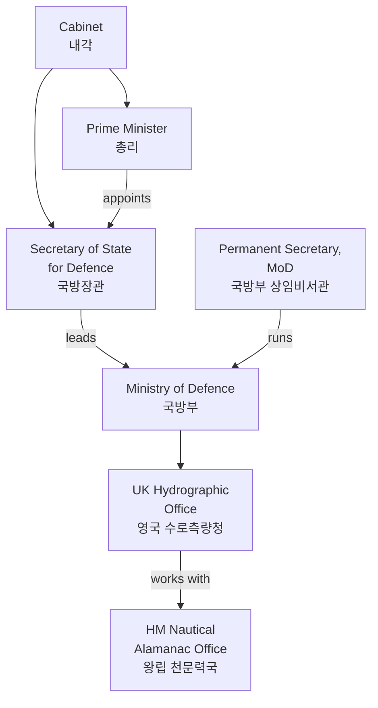
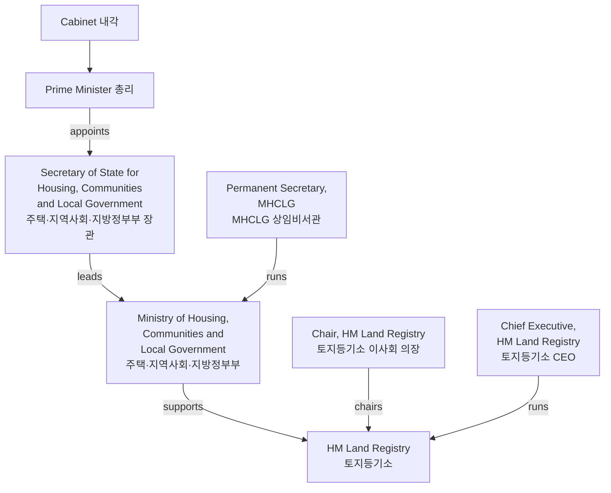

> **원문 출처**: 2026년 4월 4일 X(구 트위터)에서 Andrej Karpathy가 인용한 트윗 스레드  
> **핵심 키워드**: AI, 정부 투명성, 시빅 테크(Civic Tech), 영국 정부 조직도, 민주주의 책임성

---

## 1. 트윗 스레드의 전체 맥락 — 무슨 이야기인가?

이 자료는 두 개의 트윗이 연결된 형태로 구성되어 있다. 첫 번째는 [Karpathy가 작성한 긴 에세이 형식의 트윗](https://x.com/karpathy/status/2040549459193704852)이고, 두 번째는 해리 러시워스(Harry Rushworth, @hrushworth)가 직접 만든 **"Machinery of Government"** 라는 **영국 정부 조직도 시각화 도구를 소개**하는 [트윗](https://x.com/hrushworth/status/2040406616806179001)이다. 이 두 트윗은 서로를 자연스럽게 보완하는 방식으로 연결되어 있다 — 하나는 거시적인 아이디어를 제시하고, 다른 하나는 그 아이디어가 실제로 구현된 사례를 보여준다.

다섯 장의 이미지는 모두 두 번째 트윗(@hrushworth)에서 가져온 것으로, Machinery of Government 도구의 실제 화면을 담고 있다.

---

## 2. 첫 번째 트윗: "AI가 정부 가시성의 방향을 역전시킨다"

### 2-1. 핵심 주장

첫 번째 트윗에서 인용을 통해 Karpathy는 다음과 같은 강력한 명제를 제시한다.

> _"나는 AI의 도움을 받은 시민들이 자신의 정부를 더 잘 보고, 더 잘 이해하고, 더 강하게 책임을 묻는 방향으로 나아갈 것이라고 낙관한다."_

이것은 단순한 기술 낙관론이 아니다. 그 뒤에는 역사적으로 매우 중요한 통찰이 숨어 있다.

### 2-2. 역사적 배경 — "Seeing Like a State"의 역전

Karpathy는 제임스 C. 스콧(James C. Scott)의 1998년 고전 저작 **《Seeing Like a State: How Certain Schemes to Improve the Human Condition Have Failed》(국가처럼 보기)** 를 핵심 참조 프레임으로 사용한다.

스콧의 책에서 핵심 개념은 **레지빌리티(legibility, 가독성/가시성)** 이다. 스콧은 역사적으로 국가가 시민 사회를 자신의 관점에서 "읽기 쉽게(legible)" 만들기 위해 다양한 수단을 동원해 왔다고 분석한다.

- 성씨(姓) 제도의 도입 (세금 징수와 병역을 위해)
- 인구 조사(census)
- 표준어와 표준 도량형의 통일
- 지적도(cadastral map)와 토지 등록

이러한 과정들은 표면적으로는 행정 효율화를 목표로 하지만, 실질적으로는 국가가 시민을 더 잘 파악하고 통제하기 위한 수단이었다. 스콧은 이를 "국가가 사회를 본다(Seeing Like a State)"라고 표현했다.

**Karpathy의 통찰은 이 관계를 역전시킨다.** 역사적으로 국가만이 사회를 "읽는" 주체였다면, AI 시대에는 **시민이 국가를 "읽는" 주체**가 될 수 있다는 것이다. 이것이 바로 "Seeing Like a State"의 역전이다.

```
역사적 흐름:   국가 → 사회를 가시화(legibility)
AI 시대의 흐름: 시민 → 정부를 가시화(reverse legibility)
```

### 2-3. 왜 지금까지 이것이 불가능했는가? — 접근성이 아닌 지능의 병목

Karpathy는 중요한 구분을 한다. 정부는 이미 방대한 양의 데이터를 공개하고 있다. 문제는 **접근성(access)** 이 아니라 **지능(intelligence)** , 즉 그 데이터를 처리하고, 도메인 전문 지식과 결합하며, 의미 있는 통찰을 도출하는 능력이었다.

그 예로 언급된 것이 **4,000페이지짜리 예산안(omnibus bill)** 이다. 이 문서는 법적으로 완전히 공개되어 있고, 누구나 접근할 수 있다. 하지만 이것이 실질적으로 "투명"하다고 할 수 있는가? 일반 시민은 물론이고 대부분의 전문가도 이 문서 전체를 읽고 이해하는 것은 현실적으로 불가능하다.

**역사적으로 이 병목을 돌파할 수 있었던 사람들은 극소수의 고도로 훈련된 탐사 저널리스트들뿐이었다.** AI는 이 병목을 녹여버릴 수 있다. 전문가들은 더욱 강력해지고, 더 많은 일반 시민들이 이 과정에 참여할 수 있게 된다.

### 2-4. AI가 가능하게 하는 정부 투명성의 구체적 사례들

Karpathy는 다음과 같은 구체적인 응용 사례들을 열거한다.

| 분야 | 구체적인 활용 |
|------|--------------|
| **예산 및 지출** | 지출 항목별 상세 회계, 예산서 가시화 |
| **입법** | 법안 수정 이력 추적(diff tracking), 조항 간 변화 비교 |
| **의원 활동** | 발언/공약과 실제 투표 기록의 일관성 분석 |
| **로비 및 영향력** | 로비스트 → 로펌 → 의뢰인 → 의원 → 위원회 → 투표 → 규제로 이어지는 그래프 분석 |
| **조달 및 계약** | 정부 조달 계약의 패턴 분석 |
| **규제 포획** | 특정 산업이 규제 기관을 장악하는 경고 신호 탐지 |
| **사법 패턴** | 판사별 판결 성향, 법적 패턴 분석 |
| **선거 자금** | 캠페인 파이낸싱의 출처와 흐름 추적 |
| **지방 정부** | 시의회 회의록, 구획 조정(zoning), 치안, 학교, 공공 시설 관련 결정 |

특히 **지방 정부**는 더 흥미로운 영역으로 꼽힌다. 관할 인구가 적기 때문에 전국적인 미디어 취재가 상대적으로 부족하고, 그만큼 AI 기반 시민 감시가 실질적인 효과를 발휘할 수 있는 공간이 넓다.

### 2-5. 양날의 검 — 낙관과 경계 사이

Karpathy는 이 도구들이 반대 방향으로 쉽게 사용될 수 있다는 점도 명시적으로 경고한다. 정부 투명성을 높이는 것과 동일한 기술이 **시민 감시, 정치적 조작, 허위 정보 유포**에도 활용될 수 있다. 그럼에도 불구하고 그는 최종적으로 낙관적인 입장을 취한다. 더 많은 참여, 더 높은 투명성, 더 강한 책임성이 자유민주주의 사회를 개선할 것이라는 믿음이다.

---

## 3. 두 번째 트윗: Machinery of Government — 영국 정부 조직도의 탄생

### 3-1. 문제 인식: "영국 정부에는 조직도가 없었다"

해리 러시워스(@hrushworth)는 두 번째 트윗에서 영국 정부를 다음과 같이 묘사한다.

> _"영국 정부는 복잡한 짐승이다. 수십 개의 부처, 수백 개의 공공 기관, 셀 수 없는 공기업들... 그 복잡성 때문에 조직도가 존재하지 않는다. 아니, 존재하지 않았다."_

이 한 문장이 프로젝트의 탄생 배경을 설명한다. 세계 최오래된 민주주의 국가 중 하나인 영국은 방대하고 복잡한 정부 구조를 가지고 있음에도 불구하고, 그 전체 구조를 한눈에 볼 수 있는 통합적 시각화 도구가 존재하지 않았다.

### 3-2. 도구가 답하는 질문들

러시워스는 이 도구가 다음과 같은 질문들에 답할 수 있다고 소개한다.

- 수로측량청(Hydrographic Office)은 무엇을 하는 기관인가?
- 국립공원관리청(National Park Authorities)은 몇 개나 있는가?
- 지난해 법무부(Ministry of Justice)의 지출은 얼마였는가?
- 토지등기소(Land Registry)의 직원 수는 몇 명인가?

이 질문들은 사소해 보이지만, 이전까지는 대답하기 위해 여러 공식 사이트를 탐색하거나 자유정보공개법(FOIA) 요청을 해야 했던 것들이다.

### 3-3. 영감의 원천과 감사

러시워스는 이 프로젝트를 만드는 데 영감을 준 사람들을 명시적으로 언급한다.

- **@lfg_uk**: 다양한 공개 정보 캠페인
- **@state_britain**: 온라인 데이터 그래프
- **@m_atoms**: 샌프란시스코 정부 차트 프로젝트

이는 이 프로젝트가 고립된 개인의 작업이 아니라, 성장하고 있는 **시빅 테크(Civic Tech) 생태계**의 일부임을 보여준다.

---

## 4. 이미지 상세 분석 — Machinery of Government 실제 화면

### 4-1. 이미지 1: 전체 조직도 — 동심원 방사형 시각화


첫 번째 이미지는 Machinery of Government의 메인 화면을 보여준다. 화면 전체를 채운 **동심원 방사형(concentric radial) 다이어그램**이 영국 정부의 전체 구조를 시각화하고 있다.

#### 시각화 구조의 의미

가장 안쪽 원부터 바깥쪽 원으로 갈수록 위계가 낮아지는 구조다. 각 원 위에 배치된 도형들은 색상과 형태로 기관의 종류를 구분한다.

**범례(Legend)에 따른 분류 체계:**

*관료(Officials)*
- 🔴 **총리(Prime Minister)** — 진한 빨간색 원
- 🔴 **장관(Cabinet Minister)** — 중간 빨간색 원
- 🔴 **차관(Junior Minister)** — 연한 분홍색 원
- 🔵 **고위 공무원(Civil Servant)** — 파란색 원
- 🟢 **독립 관료(Independent Official)** — 녹색 원

*부처(Departments)*
- 🟥 **장관급 부처(Ministerial Dept)** — 빨간색 사각형
- 🟥 **국/과(Division/Directorate)** — 연분홍 사각형
- 🟦 **비장관급 부처(Non-Ministerial)** — 파란색 사각형
- 🟧 **집행청(Executive Agency)** — 주황색 사각형

*공공 기관(Public Bodies)*
- 💚 **집행 비부처 공공 기관(Executive NDPB)** — 초록색 다이아몬드
- 💛 **자문 비부처 공공 기관(Advisory NDPB)** — 노란색 다이아몬드
- 🟣 **심판소(Tribunal)** — 보라색 다이아몬드
- 🟡 **공기업(Public Corporation)** — 황금색 다이아몬드
- 🔷 **왕실 헌장 기관(Royal Charter Body)** — 보라색 사각형
- ⬜ **기타 기관(Other Body)** — 회색 다이아몬드

*그룹(Groups)*
- 🟥 **내각(Cabinet)** — 빨간색 테두리 그룹

#### 시각적 특징

화면에서 볼 수 있듯이, 영국 정부는 **수백 개의 기관**으로 구성되어 있음을 한눈에 확인할 수 있다. 동심원 사이를 연결하는 수많은 선들은 기관 간의 관계와 보고 체계를 나타낸다. 이 선들이 교차하는 복잡성만 보아도 "영국 정부에 조직도가 없었다"는 말이 왜 사실인지 이해가 된다.

우측 상단에는 **Focus** 모드와 **Legend** 토글이 있으며, 마우스 스크롤로 확대/축소가 가능하다. 이는 이 시각화가 단순한 정적 그림이 아니라 **인터랙티브 탐색 도구**임을 보여준다.

---

### 4-2. 이미지 2: 기관 상세 보기 — UK 수로측량청(UK Hydrographic Office)


두 번째 이미지는 특정 기관을 클릭했을 때 나타나는 상세 정보 패널과, 해당 기관의 관계도를 동시에 보여준다.

#### 좌측 패널: UK 수로측량청 정보

- **기관명**: UK Hydrographic Office (영국 수로측량청)
- **유형**: 집행청(Executive Agency) — 톱니바퀴 아이콘으로 표시
- **기능 설명**: "해양 항법을 위한 수로 데이터를 생산하고 공급한다"
- **특수 지위**: Trading Fund (자체 수익으로 운영되는 기관)
- **관련 정책 분야**: Transport (교통), Defence (국방)
- **탭 구성**: Info, Powers, Budget, Staff(97명 표시)

**계층 관계:**
- **IS CHILD OF**: 국방부(Ministry of Defence) — Ministerial Department
- **WORKS WITH**: HM Nautical Almanac Office — Other Body

#### 우측 패널: 관계 다이어그램

우측에 표시된 관계도는 해당 기관의 거버넌스 구조를 시각화한다.



이 관계도에서 몇 가지 흥미로운 점이 드러난다. 영국 수로측량청은 국방부 산하 집행청이지만, 동시에 Transport(교통) 분야와도 연결되어 있다. 해양 항법 데이터가 국방과 민간 항법 모두에 사용되기 때문이다. 또한 "HM Nautical Almanac Office"와 협력 관계를 맺고 있는데, 이 기관은 천문 데이터를 기반으로 한 항법 보조 자료를 생산하는 기관이다. 두 기관의 협력이 해양 안전과 항법에 어떤 시너지를 만드는지가 한눈에 보인다.

---

### 4-3. 이미지 3: 카테고리 필터 — 국립공원관리청(National Park Authority)


세 번째 이미지는 특정 태그(카테고리)를 선택했을 때의 결과 화면이다. "National Park Authority(국립공원관리청)"라는 태그를 선택하자 **총 10개의 기관**이 목록으로 나타난다.

#### 화면 구성

상단에 녹색 태그 버튼으로 "National Park Authority"가 선택되어 있고, 그 아래 "Type tag"라는 검색창이 있어 다른 태그를 검색/추가할 수 있다. 결과로 10개의 조직이 리스트 형태로 표시된다.

#### 표시된 조직들 (일부)

**Broads Authority (브로즈 관리청)**
> "이스트 앵글리아에 위치한 독특한 습지 국립공원인 노퍽·서퍽 브로즈를 관리한다."

**Dartmoor National Park Authority (다트무어 국립공원관리청)**
> "다트무어 국립공원의 자연미를 보전하고 향상시키며 공중 향유 기회를 증진한다."

이 화면이 시사하는 바는 단순하지만 강력하다. 영국에 국립공원관리청이 몇 개인지 아는 사람은 많지 않다. 공식 정부 웹사이트에서 이를 확인하려면 여러 페이지를 탐색해야 한다. 이 도구는 단 한 번의 클릭으로 그 답을 제시한다.

---

### 4-4. 이미지 4: 예산 시각화 — 법무부(Ministry of Justice)의 지출 분석


네 번째 이미지는 가장 데이터 집약적인 화면으로, 법무부(Ministry of Justice)의 **프로그램별 지출(Expenditure by Programme)** 데이터를 도넛 차트와 목록으로 보여준다.

#### 지출 내역 (단위: 영국 파운드)

| 기관/프로그램 | 지출액 |
|--------------|--------|
| HM Prison and Probation Service (교도소·보호관찰청) | **£6.7bn** (약 11.6조 원) |
| Policy, Corporate Services and Associated Offices | **£2.6bn** (약 4.5조 원) |
| Legal Aid Agency (법률 지원청) | **£2.3bn** (약 4.0조 원) |
| HM Courts and Tribunals Service (법원·심판청) | **£1.8bn** (약 3.1조 원) |
| Criminal Injuries Compensation Authority | **£330.2m** (약 5,700억 원) |
| Higher Judiciary Judicial Salaries (고위 사법부 급여) | **£193.4m** (약 3,340억 원) |
| Children and Family Court Advisory and Support Service (ALB)(Net) | **£185.6m** (약 3,200억 원) |

#### 우측 관계도

우측에는 법무부가 관할하는 수많은 하위 기관들이 화살표로 연결된 관계도가 표시된다. 특히 법무부로 향하는 수십 개의 화살표가 인상적인데, 이는 법무부가 얼마나 많은 하위 기관을 감독하고 있는지를 한눈에 보여준다. 상단에는 "Lord Chancellor and Secretary of State for Justice(법무장관 겸 국새상서)"의 존재가 표시되며, 점선 화살표로 법무부를 지시하고 있다.

#### 예산 탭과 수입 탭

"Expenditure by Programme"과 "Income by Programme" 두 개의 탭이 있어, 지출뿐만 아니라 수입 구조도 확인할 수 있다. 이는 단순한 지출 추적을 넘어 기관의 재정 전체를 조망할 수 있게 한다.

---

### 4-5. 이미지 5: 직원 현황 — 토지등기소(HM Land Registry)


다섯 번째 이미지는 HM Land Registry(여왕 폐하 토지등기소)의 상세 페이지 중 **Staff(직원)** 탭을 열었을 때의 화면이다.

#### 기관 기본 정보

- **기관명**: HM Land Registry
- **유형**: Non-Ministerial Department (비장관급 독립 부처)
- **총 직원 수**: 6,865명 (headcount, 2024-25 기준)

#### 직업군(Profession)별 분류

| 직업군 | 인원 | 비율 |
|--------|------|------|
| Operational Delivery (운영 전달) | 5,195명 | 75.7% |
| Digital and Data (디지털·데이터) | 695명 | 10.1% |
| Project Delivery (프로젝트 관리) | 250명 | 3.6% |
| Other (기타) | 250명 | 3.6% |
| Legal (법무) | 135명 | 2.0% |
| Human Resources (인사) | 85명 | 1.2% |
| Finance (재무) | 45명 | 0.7% |
| Operational Research (운영 연구) | 40명 | 0.6% |
| Commercial (상업) | 35명 | 0.5% |
| Communications (홍보) | 30명 | 0.4% |

By Grade(직급별) 탭도 있어 직급 구조도 확인할 수 있다.

#### 우측 관계도: 거버넌스 구조



이 다이어그램에서 주목할 점은 HM Land Registry가 "Non-Ministerial Department"임에도 불구하고 주택·지역사회·지방정부부(MHCLG)의 "supports" 관계 하에 있다는 것이다. 완전한 독립 기관이 아니라 연결고리가 존재한다는 점이 명확하게 드러난다. 이사회 의장(Chair)이 별도로 존재하여 CEO를 감독하는 이중 구조도 시각적으로 확인된다.

---

## 5. Machinery of Government 도구의 기술적 특성

### 5-1. 데이터 기반

이 도구는 **오픈 데이터(Open Data)** 를 기반으로 구축되었다. 영국 정부는 GOV.UK를 통해 방대한 양의 공식 데이터를 공개하고 있으며, 러시워스는 이를 통합하여 하나의 탐색 가능한 인터페이스로 재구성했다. 활용된 데이터 출처에는 다음이 포함된다.

- **GOV.UK Departments, Agencies and Public Bodies** — 조직 구조
- **Civil Service Statistics** — 직원 현황
- **Supplementary Estimates / Main Estimates** — 예산 데이터
- **Public Bodies Report (Cabinet Office)** — 공공 기관 현황

### 5-2. 기술 스택

도구는 **Vercel** 플랫폼에서 호스팅되며(`machinery-of-government.vercel.app`), 무료로 접근 가능하다. 인터랙티브 그래프 시각화와 검색·필터 기능, 상세 정보 패널, 관계도 자동 생성 기능을 갖추고 있다.

### 5-3. 탐색 방식

사용자는 세 가지 방식으로 정보를 탐색할 수 있다.

1. **방사형 다이어그램에서 직접 클릭** — 동심원 위의 도형을 클릭하면 해당 기관 상세 정보 표시
2. **카테고리(Categories) 버튼** — 기관 유형별 필터링
3. **검색(Search) 버튼** — 기관명 직접 검색

---

## 6. 더 넓은 맥락 — AI와 시빅 테크의 글로벌 흐름

### 6-1. Civic Tech의 부상

UNDP, Open Government Partnership, Accountability Lab 등의 기관들이 협력하여 아시아·태평양 지역에서 청년 주도 시빅 테크 혁신 챌린지를 운영했으며, 30개국에서 251개의 신청이 접수될 만큼 높은 관심을 받았다. 이는 정부 투명성을 위한 기술 도구에 대한 글로벌 수요가 실재함을 보여준다.

OECD는 AI가 정보 분류, 필터링, 요약 능력을 통해 정보 공개의 장벽을 낮추고, 정부가 공중에게 더 투명해질 수 있게 만들 수 있다고 분석한다.

### 6-2. "Machinery of Government" 프로젝트의 위상

해리 러시워스의 "Machinery of Government" 프로젝트는 수십 개의 부처와 수백 개의 공공 기관을 포함하는 탐색 가능한 조직도를 구성함으로써, 구조화된 데이터와 AI가 복잡한 국가를 공중에게 가시적으로 만들 수 있음을 보여주는 사례로 주목받고 있다.

### 6-3. 미국의 사례: FiscalNote와 Palantir

FiscalNote는 AI를 활용해 입법을 추적하고 정책 결과를 예측하는 서비스를 제공하며, Palantir의 Gotham 플랫폼은 2011년부터 정부 계약에서 지출과 규제 패턴을 분석하는 데 사용되고 있다.

---

## 7. 비판적 시각 — 낙관의 이면

### 7-1. 감시와 통제의 역설

트윗 작성자 스스로가 인정하듯, 동일한 도구들은 반대 방향으로도 작동할 수 있다. 시민이 정부를 더 잘 볼 수 있게 되는 동시에, 정부가 시민을 더 정교하게 프로파일링하고 통제하는 것도 가능해진다. AI가 생산하는 것은 "투명성"이 아니라 "가시성"이며, 가시성의 권력은 항상 그것을 소유한 주체에게 유리하게 작동할 수 있다.

### 7-2. 알고리즘 편향과 프레이밍

정부 부처들이 점점 더 자율적인 AI 시스템을 활용함에 따라, 알고리즘 공정성, 투명성, 책임성, 개인정보 보호에 관한 질문들이 핵심 우려 사항으로 부상하고 있다. 시민이 사용하는 AI 분석 도구도 마찬가지다. 데이터를 어떻게 선택하고, 어떤 관계를 부각시키며, 어떤 프레임으로 제시하느냐에 따라 같은 데이터도 전혀 다른 이야기를 만들 수 있다.

### 7-3. 디지털 격차

AI 기반 시빅 테크 도구들이 실질적으로 혜택을 주는 대상이 이미 정치적으로 참여도가 높고 기술에 능숙한 계층에 집중될 위험이 있다. 디지털 접근성이 낮거나 데이터 리터러시가 부족한 집단은 오히려 더 소외될 수 있다.

---

## 8. 한국적 시사점

### 8-1. 유사한 시도들

한국에서도 유사한 흐름이 관찰된다. 국회의원 의정 활동 데이터를 시각화하는 서비스들, 예산안을 분석하는 시민 단체들, FOIA(정보공개청구)를 체계적으로 활용하는 저널리즘 프로젝트들이 존재한다. 하지만 영국의 Machinery of Government와 같은 수준의 통합적 시각화 도구는 아직 미흡하다.

### 8-2. AI-Orchestrated Civic Tech의 가능성

AI를 단순히 정보 검색 도구로 사용하는 것을 넘어, 구조화된 공공 데이터를 탐색·분석·연결하는 에이전트로 배치하는 방식은 한국의 공공 데이터 생태계에도 적용 가능하다. 공공데이터포털(data.go.kr), 열린재정(openfiscaldata.go.kr), 국회 의안정보시스템 등이 이미 상당한 데이터를 공개하고 있다.

### 8-3. 참여 민주주의의 새로운 가능성

AI는 과거에는 고도로 훈련된 전문가만 수행할 수 있었던 정부 데이터 분석을 일반 시민, 지역 활동가, 소규모 언론에도 가능하게 한다. 이것은 민주주의의 정보적 기반을 근본적으로 바꿀 수 있는 변화다.

---

## 9. 정리 — "Seeing Like a Society"의 시대

제임스 C. 스콧이 분석한 "국가처럼 보기(Seeing Like a State)"의 시대에 국가는 사회를 가시화하는 유일한 주체였다. 그러나 AI와 오픈 데이터, 시빅 테크의 결합은 새로운 가능성을 열고 있다.

**"사회처럼 보기(Seeing Like a Society)"** — 시민들이 집합적으로, AI의 도움을 받아, 자신들의 국가를 읽어내는 능력을 갖추는 것. 이것이 Machinery of Government가 시각화하는 미래이자, 두 트윗이 함께 그리는 민주주의의 새로운 가능성이다.

영국 정부가 "복잡한 짐승"이라고 불렸던 이유는 그것이 실제로 복잡하기 때문이다. 하지만 복잡성은 불가해성과 다르다. 올바른 도구, 올바른 데이터, 그리고 충분한 지능이 결합되면, 복잡성은 탐색 가능한 구조가 된다. 그 구조를 탐색하는 주체가 국가 관료만이 아닌 시민 모두가 되는 것 — 그것이 이 프로젝트의, 그리고 이 트윗 스레드의 진정한 의미다.

---

*이 문서는 2026년 4월 기준 [X(구 트위터)의 트윗 스레드](https://x.com/hrushworth/status/2040406616806179001)와 Machinery of Government 도구의 스크린샷 이미지를 분석하여 작성되었습니다.*  
*Machinery of Government 도구: [machinery-of-government.vercel.app](https://machinery-of-government.vercel.app)*  
*참고 원저작: James C. Scott, "Seeing Like a State" (1998)*
