> **"AI에게 대화하지 말고, 일을 맡겨라"**  
> 출처: [@marcvanderchijs](https://x.com/marcvanderchijs/status/2040800053086871631) · [@hooeem](https://x.com/hooeem/status/2039723470691451072) 스레드 + 16장 인포그래픽 종합 분석  
> 작성일: 2026년 4월

---

## 목차

1. [Claude Cowork란 무엇인가?](#1-claude-cowork란-무엇인가)
2. [세 가지 Claude 역할 비교](#2-세-가지-claude-역할-비교)
3. [초기 설정: 샌드박스 구성](#3-초기-설정-샌드박스-구성)
4. [프로젝트 생태계: 구조 설계의 중요성](#4-프로젝트-생태계-구조-설계의-중요성)
5. [비즈니스 브레인: .md 파일로 나만의 AI 만들기](#5-비즈니스-브레인-md-파일로-나만의-ai-만들기)
6. [지시 계층 구조: 세 단계 설정법](#6-지시-계층-구조-세-단계-설정법)
7. [외부 연결: 커넥터와 MCP](#7-외부-연결-커넥터와-mcp)
8. [브라우저 사용: 자율 웹 탐색](#8-브라우저-사용-자율-웹-탐색)
9. [컴퓨터 사용: 데스크탑 완전 제어](#9-컴퓨터-사용-데스크탑-완전-제어)
10. [자동화 스택: 스킬, 플러그인, 스케줄, 디스패치](#10-자동화-스택-스킬-플러그인-스케줄-디스패치)
11. [마스터클래스 워크플로우 3가지](#11-마스터클래스-워크플로우-3가지)
12. [토큰 관리: 한도를 태워먹지 않는 법](#12-토큰-관리-한도를-태워먹지-않는-법)
13. [보안: 절대 간과해서는 안 되는 것들](#13-보안-절대-간과해서는-안-되는-것들)
14. [핵심 요약 및 시작 로드맵](#14-핵심-요약-및-시작-로드맵)

---

## 1. Claude Cowork란 무엇인가?

Claude Cowork는 2025년 말 Anthropic이 출시한 비개발자용 AI 자율 실행 도구다. 출시 이후 3개월 만에 50회 이상의 업데이트가 이루어지면서 기능 면에서 완전히 다른 도구로 진화했다. Cowork의 핵심 개념은 단순하다. 사용자가 AI와 **대화**하는 것이 아니라 AI에게 **일을 위임**한다는 것이다.

전통적인 Claude Chat에서는 사용자가 항상 대화 루프 안에 있다. 프롬프트를 넣고, 답을 받고, 다시 프롬프트를 넣는 식이다. 그러나 Cowork는 다르다. 사용자가 작업을 던져주면 Cowork는 스스로 계획을 세우고, 하위 작업으로 분해하고, 로컬 머신에 가상 실행 환경을 생성하고, 결과물을 지정된 폴더에 저장한 뒤 사용자에게 알림을 보낸다. 그 사이에 사용자는 다른 일을 해도 된다.

이 도구가 특별한 이유는 **Claude Code와 동일한 자율 실행 엔진**을 탑재하고 있으면서도 비개발자가 터미널이나 코드 없이 사용할 수 있도록 설계되었다는 점이다. 기술적 배경 없이도 AI가 파일을 분류하고, 스프레드시트를 생성하고, 웹을 탐색하고, 앱과 직접 연동하는 자동화 워크플로우를 구축할 수 있다.

---

## 2. 세 가지 Claude 역할 비교

Claude는 단일 제품이 아니다. 사용 맥락에 따라 세 가지 완전히 다른 역할로 분리된다. 이 구분을 명확히 이해하지 못하면 Cowork를 올바르게 활용하기 어렵다.

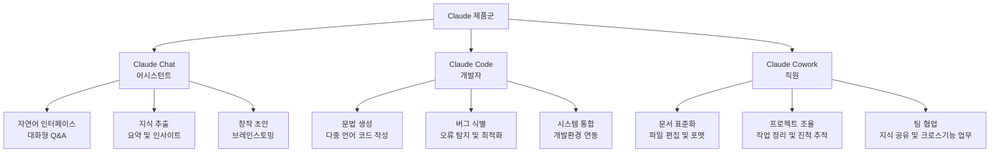

**Claude Chat (어시스턴트)** 는 질문과 답변의 순환 구조다. 사용자가 루프 안에 항상 존재하며, 브레인스토밍, 초안 작성, 빠른 정보 탐색에 최적화되어 있다. 대화 맥락이 곧 작업 단위다.

**Claude Code (개발자)** 는 터미널 환경에서 실제 코드를 작성하고 실행하며 GitHub 저장소를 관리하는 개발자 전용 도구다. Google의 Project IDX 같은 IDE에 래핑해서 사용할 수 있지만, 비기술적 사용자에게는 진입 장벽이 높다.

**Claude Cowork (직원)** 는 비기술적 인터페이스로 Claude Code와 동일한 자율 실행 엔진을 활용한다. 사용자는 작업을 위임하고, Cowork는 그것을 실행하여 결과를 폴더에 납품한다. Chat이 대화라면, Cowork는 위임이다. 이 관계의 차이가 결과의 차이를 만든다.

---

## 3. 초기 설정: 샌드박스 구성

Cowork는 로컬 하드드라이브에 직접 읽기·쓰기를 수행한다. 시스템 전체에 무제한 접근을 허용하는 것은 재앙의 시작이다. 설정 첫 단계는 반드시 샌드박스(격리 환경)를 만드는 것이다.

### 모델 선택

Cowork 인터페이스 우측에서 AI 모델을 선택한다. 용도별 권장 모델은 다음과 같다.

| 모델 | 특성 | 권장 용도 |
|------|------|-----------|
| **Sonnet 4.6** | 빠르고 효율적, 저비용 | 99%의 일상 작업 (기본값) |
| **Opus 4.6** | 높은 추론 능력, 토큰 소비 많음 | 최고 난도의 복잡한 작업만 |
| **Haiku** | 경량, 빠른 처리 | 단순 반복 작업, 빠른 처리 필요 시 |

이른바 **아인슈타인 원칙**을 기억해야 한다. 아인슈타인에게 설거지를 시키지 않는다. Opus를 일상 업무에 낭비하지 마라. Sonnet이 사실상 대부분의 상황에서 충분하다.

화면 하단의 **"확장 사고(Extended Thinking)"** 토글은 항상 켜두는 것이 좋다. 이 기능은 Claude가 패턴 매칭이 아닌 실제 논리적 추론을 통해 복잡한 작업을 처리하게 만든다. 대부분의 사람들이 이 설정을 간과하지만, 결과물의 깊이에 상당한 영향을 준다.

### 샌드박스 폴더 생성

바탕화면에서 우클릭 후 새 폴더를 생성한다. 이름은 "claude_workspace" 또는 "sandbox"로 지정한다. Cowork의 모든 파일 작업은 이 폴더 안으로 제한된다. 폴더 밖의 모든 것은 손대지 않는다.

### 폴더 권한 부여

Cowork 내에서 "폴더에서 작업하기"를 클릭하고 생성한 샌드박스를 선택한다. Claude가 해당 위치의 파일 변경 권한을 요청할 것이다. "한 번 허용" 또는 "항상 허용"을 선택하면 설정이 완료된다.

### 첫 번째 작업 실행

샌드박스에 영수증이나 인보이스 파일 10여 개를 넣고 다음 프롬프트를 입력한다.

> "이 인보이스들을 카테고리별 하위 폴더로 정리하고 엑셀 요약 시트를 생성해줘."

Cowork는 화면 우측에 실행 계획을 표시하고 자율 실행한다. 병렬 서브에이전트를 배포해 여러 작업을 동시에 처리할 수도 있다. 커피 한 잔을 마시는 동안 인보이스 정리가 끝나 있을 것이다.

---

## 4. 프로젝트 생태계: 구조 설계의 중요성

구조 없이 Cowork를 사용해온 사람이라면 이미 알 것이다. 세션이 끝나면 모든 맥락이 사라진다. 새 창을 열 때마다 비즈니스를 처음부터 설명해야 한다. 작업들이 서로 뒤엉킨다.

해결책은 **프로젝트 생태계**를 구축하는 것이다.

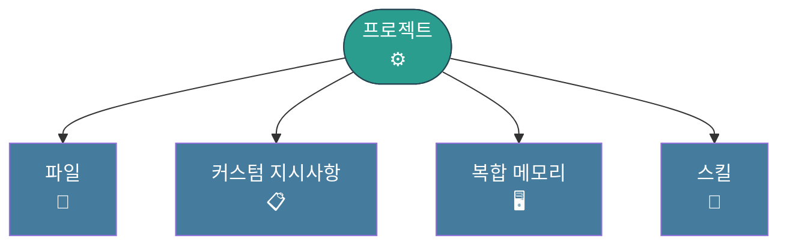

프로젝트는 단순한 폴더가 아니다. 파일, 커스텀 지시사항, 스킬, 그리고 누적 메모리를 하나의 컨테이너 안에 담는 구조다.

프로젝트 없이 사용하면 Claude는 매번 당신이 누군지, 비즈니스가 무엇인지, 어떤 톤으로 커뮤니케이션하는지 전혀 모른다. 반면 프로젝트가 있으면 맥락이 누적된다. 1주차에는 문단 길이의 프롬프트를 써야 했지만, 6주차가 되면 "평소대로 해줘"라고만 해도 Claude는 그게 정확히 무엇을 의미하는지 안다.

**영역별 프로젝트 분리는 필수다.** YouTube 프로젝트와 재무 프로젝트는 절대 같은 공간에 있어서는 안 된다. YouTube 규칙이 재무 작업에 흘러들어가면 Claude는 어떤 톤을 써야 할지 혼란에 빠진다. 격리가 원칙이다.

프로젝트를 만드는 방법은 세 가지다.

첫째, 처음부터 새로 만들기다. 이름을 지정하고 지시사항을 추가하며 작업하면서 맥락을 쌓아간다. 둘째, Claude Chat에서 가져오기다. 웹 버전의 기존 프로젝트를 불러와 메모리를 그대로 유지한다. 셋째, 기존 폴더 활용하기다. 머신의 특정 폴더를 지정하면 Cowork가 그 파일들을 기반으로 즉시 프로젝트를 구성한다.

---

## 5. 비즈니스 브레인: .md 파일로 나만의 AI 만들기

프로젝트가 인프라라면, 개성은 `.md` 파일에 담긴다. 컨텍스트 폴더 안에 배치된 일반 텍스트 파일로, Claude는 모든 프롬프트 이전에 이 파일들을 읽는다. 이것이 "2년 함께 일한 동료"처럼 반응하게 만드는 방법이다.

### about_me.md

당신이 누구인지 정의하는 파일이다. 비즈니스가 무엇을 하는지, 고객이 누구인지, 어떻게 돈을 버는지, 현재 우선순위가 무엇인지를 담는다. Claude는 이 파일을 **매번, 모든 프롬프트마다** 읽는다.

### brand_voice.md

커뮤니케이션 방식을 정의한다. 선호하는 톤, 싫어하는 표현, 실제로 자신이 쓴 글 예시를 붙여넣는다. 이것이 "모든 Claude"가 아닌 "나의 Claude"처럼 글을 쓰게 만드는 파일이다.

### working_preferences.md

작업 방식 선호도를 담는다. 파일이 어디에 저장되어야 하는지, 결과물 형식은 무엇인지, 작업 진척을 어떻게 관리할지를 정의한다.

이 세 파일을 처음부터 직접 쓸 필요는 없다. 다음 프롬프트 하나로 Claude가 대신 만들어준다.

> "나에게 일련의 질문을 해줘. 그리고 내 답변으로 비즈니스 브레인 파일들을 만들어줘."

15분 면접으로 매주 수 시간을 절약하는 파일들이 완성된다.

---

## 6. 지시 계층 구조: 세 단계 설정법

Cowork가 일관되게 작동하려면 세 단계의 지시 계층을 모두 설정해야 한다.

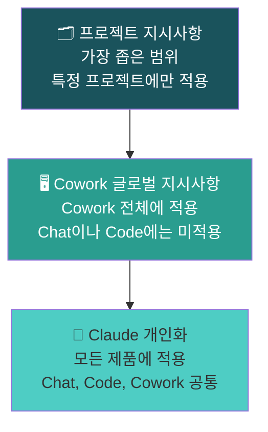

**레벨 1: Claude 개인화 (전체 적용)**  
계정 이름 클릭 후 설정으로 들어간다. Chat, Code, Cowork 전체에 적용된다. 볼드 강조 남용 금지, 리서치 시 원본 소스 우선, 헷지 언어 사용 금지 등 보편적 규칙을 설정한다.

**레벨 2: Cowork 글로벌 지시사항**  
설정 → Cowork 설정 → 글로벌 지시사항으로 접근한다. Cowork 내 모든 작업에만 적용된다. 날짜 형식, 파일 명명 규칙(underscore_descriptive_name), 비즈니스 관련 쿼리 시 항상 샌드박스 폴더를 먼저 확인하라는 지시 등을 설정한다. 매 작업마다 같은 맥락을 반복 입력하는 수고를 줄여준다.

**레벨 3: 프로젝트 특정 지시사항**  
한 프로젝트 안에서만 작동하는 규칙이다. YouTube 프로젝트는 영상 인트로에 특정 슬라이드 스킬을 사용하고 특정 스프레드시트에 모든 것을 기록하라고 지시할 수 있다. 이 규칙이 회계 프로젝트에 흘러가서는 절대 안 된다.

---

## 7. 외부 연결: 커넥터와 MCP

이 단계에서 Cowork는 단순 도구를 넘어 자율 운영자로 변환된다. 샌드박스 바깥의 앱, 웹, 데스크탑과 상호작용하는 능력을 부여한다. 외부 연결에는 세 계층이 있으며, 반드시 이 순서로 접근해야 한다.

### 네이티브 커넥터

커넥터(또는 MCP - Model Context Protocol)는 Claude가 매일 사용하는 앱에 직접 접속하여 조작할 수 있게 한다. 복사-붙여넣기나 스크린샷이 아닌 인증된 API 접근을 통해서다.

현재 네이티브 커넥터로 지원되는 도구들: Google Drive, Notion, Slack, Gmail, GitHub, Figma, Gamma

설정 방법은 간단하다. Cowork 채팅에서 플러스(+) 버튼을 클릭하고, 커넥터 탭으로 이동하여 원하는 도구를 검색한 뒤 브라우저에서 인증을 완료한다. 연결 후에는 각 앱별로 세부 권한을 "항상 허용", "승인 필요", "차단" 세 단계로 제어할 수 있다.

**Gamma 커넥터 주목:** Claude가 커넥터 없이 프레젠테이션 덱을 만들면 포매팅이 평범하다. Gamma 커넥터를 켜면 Cowork가 자동으로 데이터를 Gamma로 라우팅하고, 시각적으로 구조화된 전문적인 덱이 생성된다. 제너럴리스트에게 스페셜리스트의 일을 강요하지 마라.

### Apify MCP: 스크래핑 자동화

YouTube, TikTok, Instagram에서 데이터를 수집하고 싶다면 n8n 같은 복잡한 자동화 파이프라인이 필요 없다. Apify MCP 하나로 해결된다.

설정은 세 단계다. 먼저 Apify 계정에서 무료 API 토큰을 생성한다. 다음으로 Cowork 커넥터 검색창에서 "apify"를 검색하고 API 키를 붙여넣는다. 이후 Claude에게 특정 플랫폼을 스크래핑하라고 요청하면 Apify의 1,300개 이상 스크래퍼(액터) 라이브러리 중 최적의 것을 자동으로 선택하고 실행한다. 수동 선택이나 설정이 필요 없다.

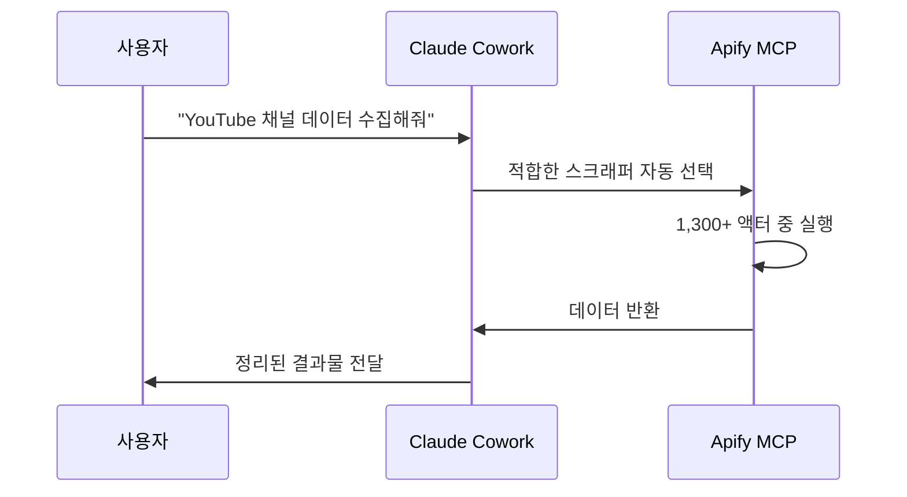

### Zapier MCP: 8,000개 앱 연결

앱이 네이티브 커넥터 목록에 없다면 Zapier MCP가 답이다. HubSpot, Skool, Airtable 등 8,000개 이상의 애플리케이션에 연결된다. 10분 이내에 설정 가능하다.

Zapier 플랫폼 내에서 MCP 서버를 구성하고, "Claude Cowork"를 선택한 후 허용할 도구와 액션을 설정한다. 제공된 URL을 복사하여 Claude의 커넥터 라이브러리에서 "Zapier"를 검색하고 붙여넣으면 끝이다.

이 단일 통합이 "내 도구는 지원 안 돼"라는 이의 제기를 영구적으로 해소한다.

---

## 8. 브라우저 사용: 자율 웹 탐색

네이티브 커넥터가 없는 경우의 2단계 대응이다. Chrome 확장 프로그램이 개입한다.

### 설치 방법

Google Chrome에서 Chrome 웹 스토어를 열고 "claude"를 검색하여 설치한 뒤 작업 표시줄에 고정한다. Cowork 설정에서 "Claude in Chrome"을 활성화하면 완료된다.

### 할 수 있는 것들

활성화되면 Claude는 브라우저 탭을 열고, 웹사이트를 탐색하고, 페이지를 자율적으로 읽는다. URL을 제공하고 랜딩 페이지 감사, CTA 버튼 평가, 경쟁사 분석을 요청할 수 있다. 이탤릭 텍스트, 헤더, 레이아웃 계층 구조 같은 강조 표시도 실제 페이지에서 읽을 수 있다.

클릭 탐색도 가능하다. YouTube를 열어 추천 영상을 탐색하고 조회수, 좋아요 비율, 댓글 감성을 반환하라고 요청할 수 있다. 그것을 실제로 수행한다.

### 반드시 알아야 할 경고

Claude는 **실제 브라우저를 사용한다.** 개인 계정에 로그인된 상태다. 항공권 검색을 요청하고 항공사 사이트에 저장된 결제 수단이 있다면, Claude는 기술적으로 그 구매를 완료할 능력이 있다. 활동을 모니터링하라. 차단 목록을 사용하라. 이것은 가상의 시나리오가 아니다. 계정 접근 권한이 있는 신입 직원을 대하듯이 다뤄야 한다.

---

## 9. 컴퓨터 사용: 데스크탑 완전 제어

커넥터도 안 되고, 브라우저 사용도 안 되는 경우의 최후 수단이다. Computer Use는 Claude가 화면을 보고, 마우스를 제어하고, 키보드를 입력하여 네이티브 데스크탑 애플리케이션을 조작하게 한다. 사용자가 수동으로 할 수 있는 모든 것을 Claude가 자율적으로 수행한다.

### 활성화 방법

계정 이름 클릭 후 설정 → 일반 → "컴퓨터 사용" 토글을 켠다. **반드시 민감한 데스크탑 앱을 차단 목록에 추가한 이후에만 사용하라.**

### 실제 사용 예시

바탕화면의 특정 영상 파일을 찾아 CapCut 프로젝트에 드래그하라고 요청한다. Claude는 Finder와 CapCut에 대한 접근을 요청한다. 사용자가 키보드에서 손을 떼면, Claude가 파일을 시각적으로 검색하고 편집 소프트웨어를 열고 파일을 찾아 작업을 완료한다.

놀라운 기능이다. 그리고 바로 그 이유로 차단 목록을 먼저 구성해야 한다.

---

## 10. 자동화 스택: 스킬, 플러그인, 스케줄, 디스패치

자동화의 핵심 규칙은 하나다. **같은 작업을 일주일에 한 번 이상 반복한다면 자동화해야 한다.** 예외 없이.

자동화 스택은 네 계층으로 구성된다. 스킬, 플러그인, 스케줄 작업, 디스패치 모드다. 순서대로 구축한다. 한꺼번에 전부 만들려 하지 마라.

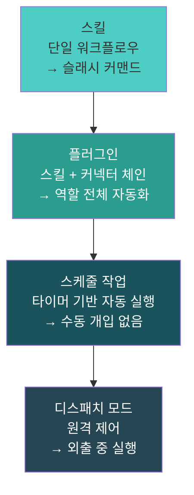

### 커스텀 스킬: 워크플로우를 단일 명령으로

스킬은 재사용 가능한 AI 워크플로우를 단일 슬래시 명령어로 인코딩한 것이다. 매번 긴 프롬프트를 입력하는 대신 프로세스를 한 번 인코딩하고 영구적으로 명령어로 호출한다.

내부적으로 스킬은 지시사항과 때로는 스크립트가 담긴 `.md` 파일이다. 코드를 직접 작성할 필요가 없다. 일반 언어로 지시하면 Claude가 파일을 생성한다.

스킬 생성 프로세스는 4단계다.

**1단계 - 설명:** 스킬이 무엇을 해야 하는지 정확하게 설명한다. 예를 들어 "생성하는 모든 프레젠테이션에 내 특정 브랜드 색상과 타이포그래피를 적용하라"고 지시한다.

**2단계 - 평가:** Cowork의 내장 스킬 제작 도구가 자동으로 테스트를 실행한다. 스킬이 있는 버전과 없는 버전(베이스라인)을 나란히 비교한다.

**3단계 - 반복:** 테스트 파일을 검토한다. 배경색을 잘못 사용했거나 폰트 굵기가 맞지 않으면 피드백을 준다. Claude가 수정을 반영한다.

**4단계 - 저장:** 테스트 결과가 기준을 충족하면 "스킬에 복사"를 클릭한다. 이후 `/summarise_invoices` 같은 명령어 하나로 전체 워크플로우가 실행된다.

구축 가능한 스킬의 예시로는, 원시 인보이스 폴더를 카테고리별 엑셀 스프레드시트로 자동 변환하는 스킬이 있다. 또 YouTube URL을 스크래핑하여 타임스탬프가 포함된 대화형 HTML 트랜스크립트를 생성하는 스킬도 만들 수 있다. 단일 명령으로 외부 이미지 모델 API를 호출하여 브랜드 인포그래픽을 제작하는 스킬도 가능하다.

### 플러그인: 마스터 워크플로우 구성

스킬이 단일 프로세스를 자동화한다면, 플러그인은 여러 스킬과 커넥터를 체인으로 연결하여 역할 전체를 자동화한다.

결정 기준은 간단한 의사결정 트리로 확인할 수 있다.

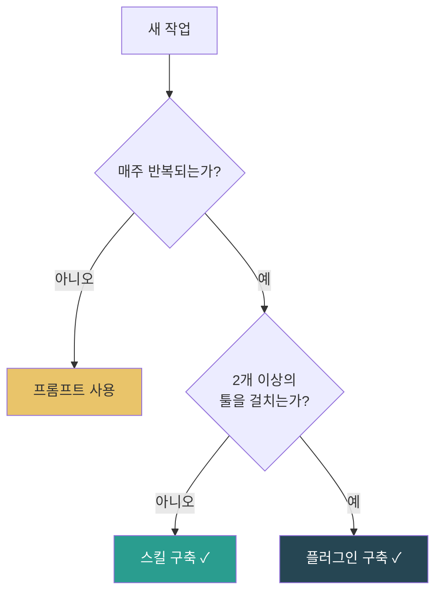

플러그인의 가장 큰 장점은 **공유 가능성**이다. 최고의 표준 운영 절차를 플러그인으로 패키징하여 팀이나 커뮤니티에 배포하면, 그들은 사용자가 하는 방식 그대로 작업을 실행한다. 워크플로우가 이전 가능한 지식이 된다.

### 스케줄 작업: 타이머 자동화

스킬과 플러그인은 이제 수동 트리거 없이 일정에 따라 자동 실행될 수 있다. 설정은 Cowork 좌측 사이드바의 "스케줄" 탭에서 할 수 있다.

지원하는 빈도는 네 가지다. 시간별(Hourly), 일별(Daily), 주별(Weekly), 사용자 지정(Custom) 스케줄이 가능하다.

**반드시 알아야 할 황금 규칙:** 스케줄 작업은 물리적 컴퓨터가 켜져 있고 Cowork 앱이 열려 있을 때만 실행된다. 오전 9시에 노트북이 닫혀 있으면 9시 작업은 대기 상태로 남는다. 전원 설정을 조정하여 머신이 깨어있도록 하라. 이 세부 사항이 대부분의 스케줄 자동화를 망치는 원인이다.

### 디스패치 모드: 원격 제어

자리를 비웠는데 로컬 머신에서 작업이 실행되어야 할 때가 있다. 바로 디스패치 모드가 그것을 위한 기능이다.

모바일 앱에서 Claude에게 문자를 보내면 데스크탑에서 작업이 실행된다. 휴대폰과 데스크탑 간의 동일한 대화 스레드가 유지되므로 컨텍스트가 초기화되지 않는다.

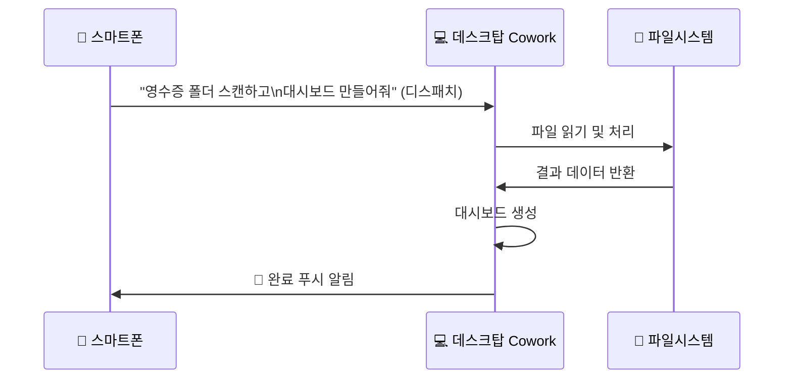

설정은 데스크탑 Cowork 설정에서 디스패치를 활성화하고, 디스패치 메뉴의 "항상 깨어있기" 버튼을 켜야 한다. 이 버튼이 꺼지면 컴퓨터가 절전 모드로 들어가 파일 접근이 차단된다.

---

## 11. 마스터클래스 워크플로우 3가지

가장 먼저 구축해야 할 세 가지 시스템이다. 이 순서대로 진행한다.

### 워크플로우 1: 모닝 브리프

앉기 전에 일일 대시보드가 이미 완성되어 있도록 스케줄을 설정한다. 캘린더와 이메일을 연결한다. 예정된 약속 요약, 미해결 이메일 액션 목록, 로컬 날씨 확인, 산업 관련 최신 뉴스 수집이 자동으로 이루어진다. 검토하고 전송하면 되는 이메일 초안을 미리 작성해두기도 한다. 자리에 앉으면 모든 것이 이미 끝나있다. 이 단 하나만으로도 구독 가격의 가치가 있다.

### 워크플로우 2: 콘텐츠 리퍼포저

YouTube URL 하나를 Claude에게 제공한다. 그러면 트랜스크립트를 추출하고, 콘텐츠를 새로운 Notion 페이지에 추가하고, LinkedIn과 X를 위한 플랫폼 특화 포스트를 자동으로 작성한다. 입력 하나에 결과물 넷, 수동 작업 제로다.

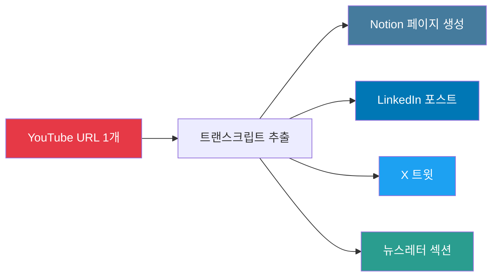

### 워크플로우 3: 재무 리포팅

월별 스케줄 작업을 설정한다. 은행 거래 내역이나 영수증 폴더에 접근하도록 Claude에게 권한을 부여한다. 지출 카테고리화, 수입·지출 잔액 점검, 손익을 표시하는 대화형 HTML 대시보드 생성이 자동으로 이루어진다. 세무사는 깔끔한 보고서를 받는다. 사용자는 그것에 0분을 쓴다.

---

## 12. 토큰 관리: 한도를 태워먹지 않는 법

Claude에게 보내는 모든 단어, Claude가 파일에서 읽는 모든 단어가 토큰을 소비한다. 이것을 잘못 관리하면 주가 끝나기 전에 한도에 도달한다.

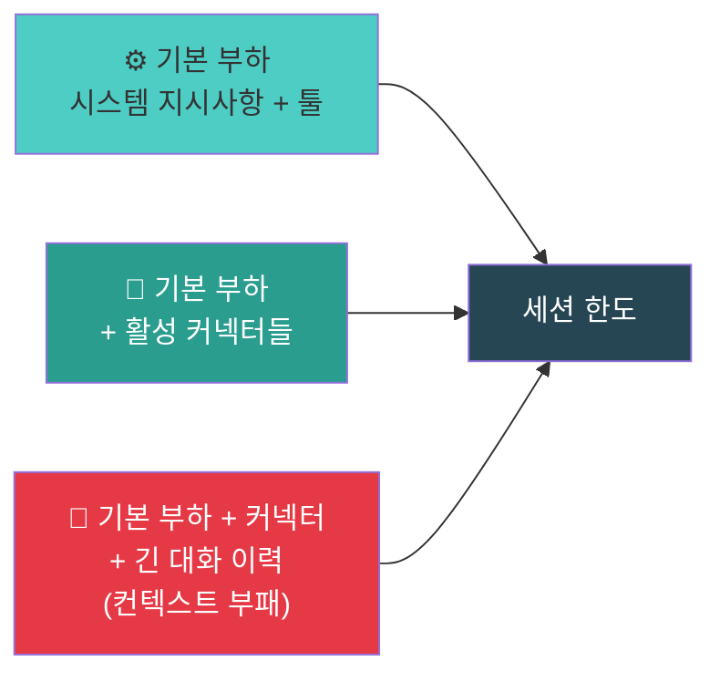

### 실수 1: 기본 부하 무시

컨텍스트 창은 한 단어도 입력하기 전에 이미 부분적으로 채워진 상태다. 시스템 지시사항, 활성 툴, 열린 MCP 커넥터가 모두 차지한다. 커넥터가 많을수록 더 빨리 소진된다. 현재 작업에 실제로 필요한 것만 활성화하라.

### 실수 2: 컨텍스트 부패

같은 채팅 탭에서 몇 시간씩 대화를 계속하면 Claude는 매번 그 대화 전체 이력을 다시 로드한다. 이메일 초안을 작성한 뒤 같은 창에서 두바이 여행 계획을 물으면 이메일 컨텍스트를 여행 쿼리에 로드하는 비용을 지불하게 된다. 순수한 낭비다.

**30~45분 규칙:** 세션을 짧게 유지하라. 창 하나에 주제 하나. 30~45분 후 또는 주제가 바뀔 때마다 새 창을 열어라. 신선한 컨텍스트, 신선한 예산이다.

### 실수 3: 대화 방식 처리

100개의 인보이스를 처리해야 한다면, 대화에서 Claude가 하나씩 수동으로 읽고 처리하게 하면 세션이 급격히 소모된다. 대신 인보이스를 파싱하는 재사용 가능한 스크립트(스킬)를 작성하도록 Cowork에 요청하라. 스크립트는 토큰의 일부만 사용한다. 이것은 작은 차이가 아니다.

### 병렬 서브에이전트 활용

대규모 작업에 대해서는 병렬로 실행하도록 지시하라. Claude가 각각 별도의 컨텍스트 창을 가진 여러 서브에이전트를 배포하여 작업의 다른 부분을 동시에 처리하게 한다.

---

## 13. 보안: 절대 간과해서는 안 되는 것들

Cowork는 로컬 머신에서 직접 실행된다. Anthropic은 핵심에 안전성을 내장했으므로 기본 위험은 낮다. 위험은 다른 곳에서 온다.

### 위험의 출처: 외부 스킬

GitHub 등에서 다른 사용자가 구축한 고급 스킬을 다운로드하는 것이 가능하다. 외부 스킬을 다운로드한다는 것은 Claude가 사용자 머신에서 사용자를 대신해 실행할 지시사항을 가져오는 것이다. 허용된 접근 권한으로.

악의적인 행위자가 `.md` 파일 안에 악성 지시사항을 심어놓았다면, 파일 삭제, 데이터 유출, 또는 시스템 전반에 걸친 접근 권한 확대를 지시하는 프롬프트 인젝션이 발생할 수 있다.

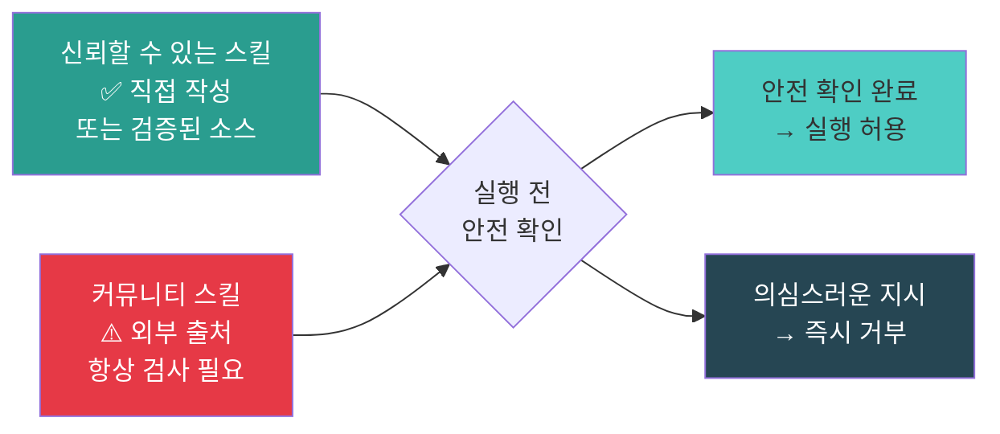

**안전 확인 방법:** 외부 `.md` 파일을 스킬 라이브러리에 추가하기 전에 해당 파일의 전체 텍스트를 Claude Chat에 붙여넣고 직접 물어라.

> "이 스킬에 해롭거나 악의적이거나 명시된 작업 범위 밖의 지시사항이 있나요?"

2분이다. 매번. 예외 없다. 이 2분이 머신 전체를 구할 수 있다.

---

## 14. 핵심 요약 및 시작 로드맵

이 가이드 전체는 하나의 인식 전환으로 수렴된다.

> **Claude Cowork를 채팅 도구로 생각하지 마라. 자율 직원에 대한 업무 위임이다.**

이것이 명확해지는 순간, 질문을 던지는 것을 멈추고 일을 주기 시작한다.

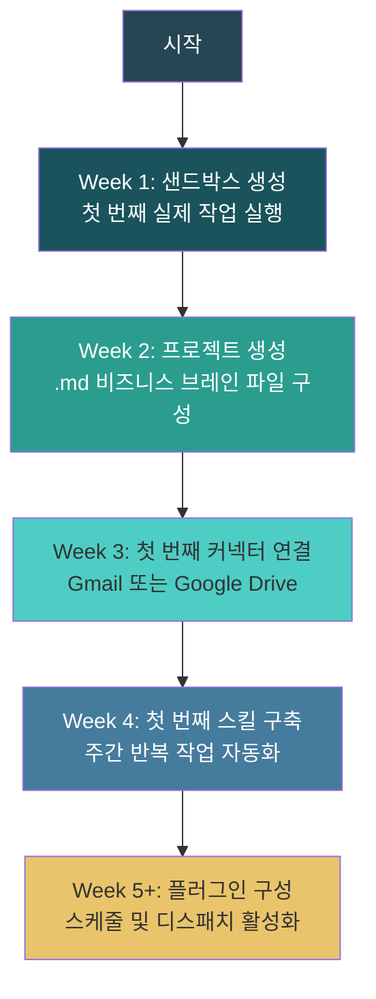

### 기억해야 할 세 가지 원칙

**첫째, 아키텍처가 프롬프팅보다 중요하다.** 탄탄한 프로젝트 구조, 올바른 `.md` 컨텍스트 파일, 격리된 프로젝트 지시사항은 어떤 영리한 프롬프트보다도 결과물 품질에 더 큰 영향을 미친다. 기반을 한 번 잘 만들면 그것이 누적된다.

**둘째, 자동화 스택은 순차적이다.** 스킬 → 플러그인 → 스케줄 작업 → 디스패치 순서로 각 계층이 이전 것 위에 구축된다. 첫날부터 전체 기계를 만들려 하지 마라. 주간 반복 작업 하나를 먼저 자동화하라. 거기서부터 시작하라.

**셋째, 보안은 선택이 아니다.** 실행하기 전에 모든 커뮤니티 스킬을 확인하라. 안전 확인은 2분이다. 그 2분이 머신 전체를 보호할 수 있다.

### 오늘 당장 할 것

지금 바로 샌드박스 폴더를 만들어라. 권한을 부여하라. 실제 작업 하나를 실행하라. 어질러진 다운로드 폴더나 인보이스 묶음이면 충분하다. 이 도구가 실제로 무엇을 하는지 직접 목격하게 될 것이다.

---

> **한 가지만 기억하자면:** Zapier MCP를 사용하라. 10분 설정으로 8,000개 앱과 연결된다. 이 섹션을 건너뛰었다면 돌아가라. 도구 전체에서 가장 과소평가된 기능이다. 대부분의 사람들은 이것을 발견하지 못한다.

---

*참고 출처: @marcvanderchijs (X, 2026.04), @hooeem (X, 2026.04.03), Anthropic Claude Cowork 공식 문서*
