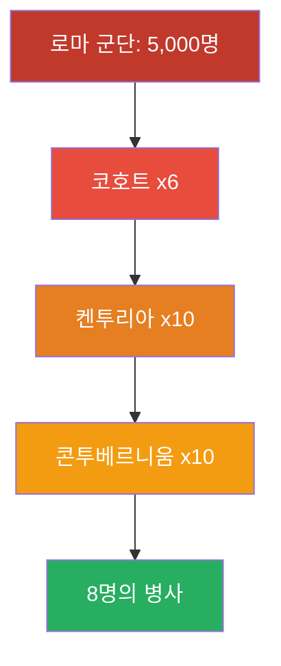
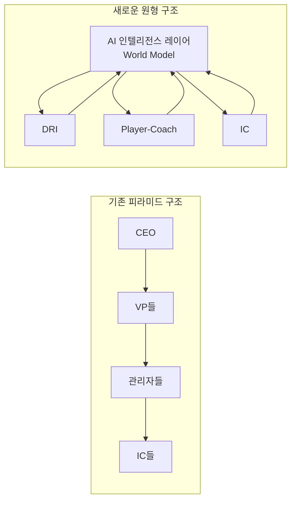
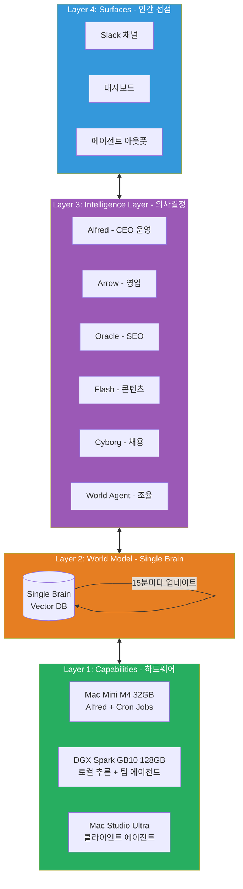
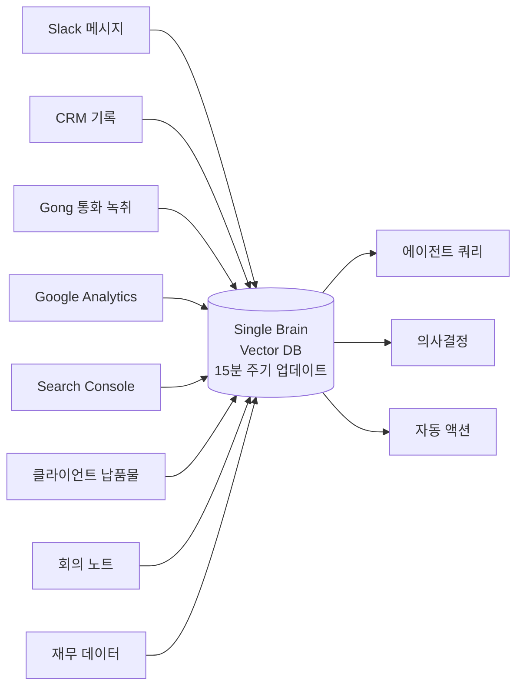
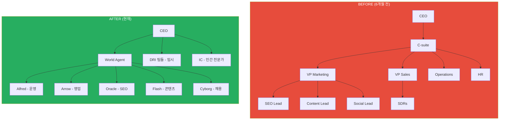
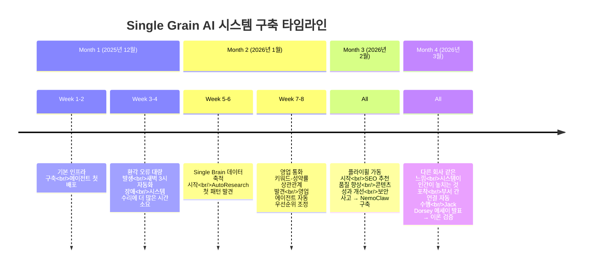
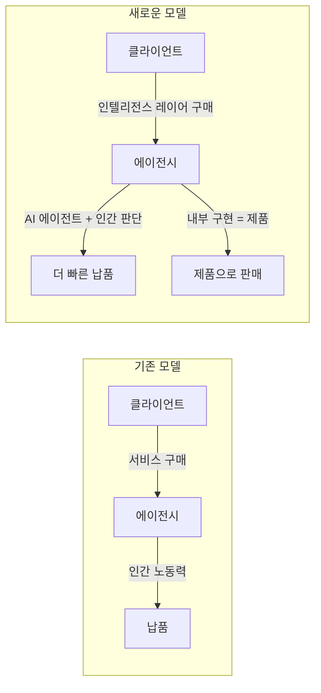
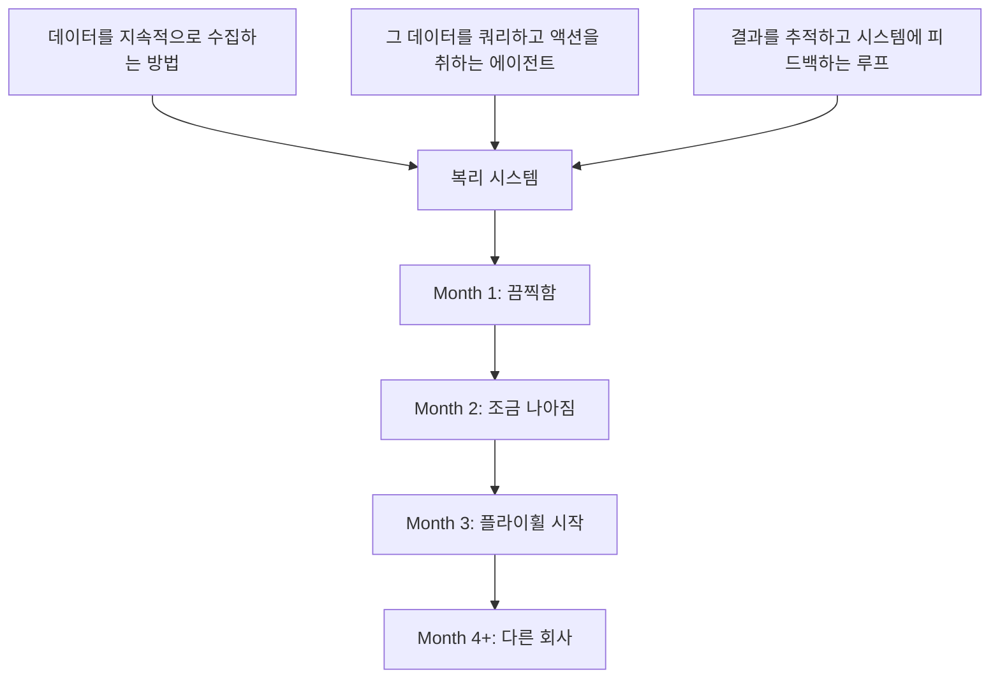
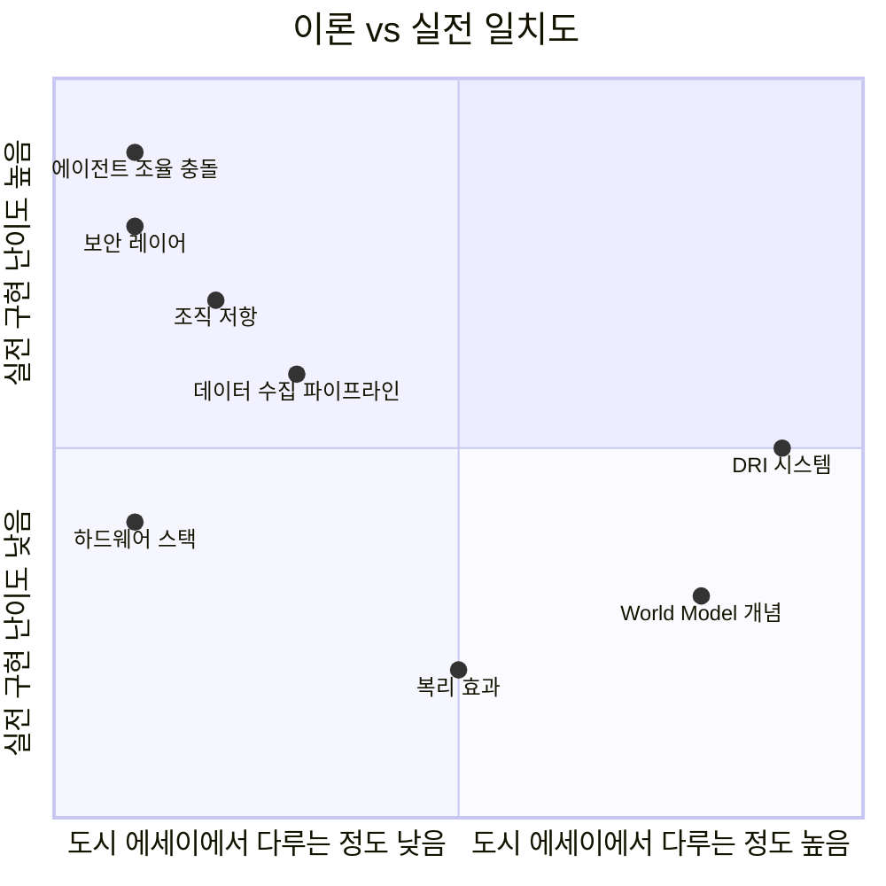

## Eric Siu (Single Grain CEO)의 실전 구현 분석 보고서

> **원문 출처**: [@ericosiu on X, 2026년 4월 5일](https://x.com/ericosiu/status/2040543007716553088)  
> **참조 원문**: Jack Dorsey & Roelof Botha, "From Hierarchy to Intelligence" (2026년 3월 31일)  
> **작성 기준일**: 2026년 4월 6일

---

## 목차

1. [배경: 두 개의 문서가 충돌하는 지점](#1-배경)
2. [Jack Dorsey의 "From Hierarchy to Intelligence" 에세이 분석](#2-dorseys-essay)
3. [Eric Siu의 4개월 실전 구현기](#3-실전-구현기)
4. [4개 레이어 아키텍처 상세 해부](#4-아키텍처)
5. [에이전트 조직도: Before & After](#5-조직도)
6. [실패와 위기: 아무도 말하지 않는 것들](#6-실패와-위기)
7. [복리 효과: 시간이 지날수록 강해지는 시스템](#7-복리-효과)
8. [비즈니스 모델 전환: 서비스가 아닌 인텔리전스를 판다](#8-비즈니스-모델)
9. [누구나 따라할 수 있는 실행 플레이북](#9-플레이북)
10. [비판적 시각과 한계](#10-비판적-시각)
11. [종합 평가 및 시사점](#11-종합-평가)

---

## 1. 배경: 두 개의 문서가 충돌하는 지점 {#1-배경}

### 1.1 Jack Dorsey의 폭탄 선언

2026년 3월 31일, Block(구 Square)의 CEO 잭 도시(Jack Dorsey)와 세쿼이아 캐피털(Sequoia Capital)의 파트너 로엘로프 보타(Roelof Botha)가 공동으로 에세이를 발표했다. 제목은 "From Hierarchy to Intelligence(위계에서 지능으로)". 이 문서는 48시간 만에 500만 뷰를 기록했고, 언론은 이를 "도요타 생산 시스템 논문 이후 가장 중요한 조직 설계 문서"라고 평했다.

이 에세이의 맥락을 이해하려면 도시가 불과 한 달여 전인 2026년 2월에 Block의 직원 40%를 해고했다는 사실을 알아야 한다. 1만 명이 넘던 직원이 6,000명으로 줄었다. 주가는 해고 발표 직후 약 22% 상승했다. 그리고 "From Hierarchy to Intelligence"는 그 해고가 단순한 비용 절감이 아니라 근본적 조직 재설계임을 이론적으로 정당화하는 문서였다.

### 1.2 Eric Siu: "우리는 이미 하고 있었다"

Eric Siu는 디지털 마케팅 에이전시 Single Grain의 창업자이자 CEO다. 그는 이 에이전시를 단돈 2달러에 인수해 Amazon, Salesforce, Uber 등을 고객사로 둔 8자리 규모의 회사로 키워냈다. 마케팅 분야에서 Neil Patel과 공동 진행하는 팟캐스트 "Marketing School"은 1억 4천만 회 이상 다운로드된 업계 최대 팟캐스트 중 하나다.

그는 도시의 에세이를 새벽 6시에 휴대폰으로 읽었다. 두 번 읽었다. 그리고 자신의 사무실에 있는 Mac Studio로 걸어가며 생각했다: **"잠깐, 우리는 이미 이걸 하고 있었잖아."**

Single Grain은 2025년 12월 말부터 AI 에이전트를 중심으로 회사 전체를 재구축하기 시작했다. 도시의 에세이가 이론이라면, Siu의 글타래(thread)는 4개월에 걸친 실전 구현 노트다. 이 문서는 그 두 텍스트를 교차 분석하며, 이론과 현실 사이의 간극을 메우는 지식을 정리한다.

---

## 2. Jack Dorsey의 "From Hierarchy to Intelligence" 에세이 분석 {#2-dorseys-essay}

### 2.1 핵심 테제: 위계는 대역폭 문제의 해결책이었다

도시와 보타의 논지는 놀랍도록 단순하다. 기업 위계 구조는 2천 년 전 로마 군대가 발명한 것이며, 그 목적은 오직 하나였다—**정보를 라우팅하는 것**.

로마 군대는 8명의 병사가 천막을 공유하는 "콘투베르니움(contubernium)"을 최소 단위로 삼았다. 10개의 콘투베르니움이 켄투리온(centurion)이 이끄는 80명짜리 켄투리아(century)를 이루었다. 이 켄투리아들이 모여 코호트(cohort), 군단(legion)을 형성했다. 이 중첩 위계 구조의 핵심 원리는 한 인간이 효과적으로 관리할 수 있는 인원이 3~8명이라는 물리적 한계였다.

현대 기업은 여전히 이 구조를 그대로 사용한다. 팀 → 팀장 → 부서장 → 임원 → CEO. 에세이는 이를 "2천 년 된 정보 라우팅 프로토콜"이라고 부른다.

문제는 이 구조가 정보를 왜곡한다는 데 있다. 엔지니어의 책상을 떠난 정보가 CEO에게 도달할 때는 이미 압축되고, 정제되고, 정치적 필터를 거친 버전이 된다. 각 계층은 지연(latency), 왜곡(distortion), 정치(politics)를 추가한다.

### 2.2 AI가 바꾼 것: 정보 라우팅을 기계에게

도시와 보타의 핵심 주장은 이것이다: **AI는 위계가 수행하던 세 가지 기능을 대체할 수 있다.**

1. **정보 라우팅**: "월드 모델(world model)"이 압축이나 왜곡 없이 지속적으로 수행
2. **기능 간 작업 조율**: DRI(Directly Responsible Individual)가 고정된 기간 동안 인텔리전스 레이어의 지원을 받아 처리
3. **조직 내 맥락 유지**: AI가 모든 결정, 워크플로우, 성과 지표를 지속적으로 추적

따라서 중간 관리자의 존재 이유—정보를 위아래로 릴레이하는 것—가 사라진다.

### 2.3 "World Model": 에세이의 핵심 개념

도시는 Block에서 두 개의 "월드 모델"을 구축하고 있다고 설명한다.

**내부 월드 모델(Company World Model)**
- 코드, 결정, 워크플로우, 성과 지표 등 모든 내부 데이터를 집계
- 관리자들이 전통적으로 제공하던 맥락(context)을 대체
- 실시간으로 업데이트되는 회사 운영 상황의 완전한 그림

**고객 월드 모델(Customer World Model)**
- 거래 데이터를 기반으로 구축 (Block은 Cash App과 Square를 통해 수백만 건의 결제 양면을 실시간 관찰)
- 특정 고객에게 특정 순간에 맞춤형 금융 상품을 자동 구성
- 제품 관리자가 "무엇을 다음에 만들지" 가설을 세우는 전통적 로드맵을 대체

에세이는 이를 이렇게 표현한다: "돈은 세상에서 가장 정직한 신호다."

### 2.4 새로운 조직 구조: 세 가지 역할

도시와 보타는 중간 관리자 계층을 제거한 자리에 세 가지 역할만을 남긴다.

| 역할 | 설명 |
|------|------|
| **IC (Individual Contributor)** | 시스템의 특정 레이어를 운영하는 심층 전문가. 월드 모델이 이전에 관리자가 제공하던 맥락을 제공하므로 지시를 기다리지 않고 스스로 결정 |
| **DRI (Directly Responsible Individual)** | 특정 교차기능 문제 또는 결과물의 소유자. 필요한 자원과 전문성을 자유롭게 동원할 수 있는 전권을 가짐. 고정된 기간 동안 운영 |
| **Player-Coach** | 빌딩과 인재 개발을 결합한 리더. 단순 정보 라우팅이 주 역할이었던 전통적 관리자를 대체 |

영구적인 중간 관리자 계층은 존재하지 않는다. 피라미드형 조직도 대신, AI가 중심에 있고 인간이 그 가장자리에서 일하는 원형 구조를 지향한다.

---

## 3. Eric Siu의 4개월 실전 구현기 {#3-실전-구현기}

### 3.1 "우리는 이미 하고 있었다"

Eric Siu가 도시의 에세이를 읽으며 느낀 데자뷰는 단순한 우연이 아니다. Single Grain은 2025년 12월 말부터 독립적으로 같은 방향을 향해 걷고 있었다. 그의 접근법은 대기업 블록의 톱다운 선언이 아닌, 소규모 에이전시가 생존과 경쟁력을 위해 스스로 진화한 결과다.

핵심 차이점은 규모와 속도다. Block은 6,000명 규모에서 이 전환을 진행하고 있고, 그것은 필연적으로 느리고 고통스럽다. Single Grain 같은 소규모 회사는 더 빠르게 움직이고, 더 가시적으로 실패하며, 그 실패에서 배운다.

### 3.2 모델의 임계점: 왜 2025년 12월이었나

Siu는 구체적인 시작 시점을 언급한다: **Opus 4.5와 Codex 5.3이 출시된 2025년 12월**. 이 시점에서 AI 모델이 "비즈니스에 대한 질문에 답하는" 수준을 넘어 "비즈니스 전체를 이해할 수 있는" 컨텍스트 용량을 갖추게 됐다고 그는 설명한다.

이것이 중요한 이유는, AI 에이전트 시스템의 유용성은 모델의 단순 성능보다 **모델이 한 번에 얼마나 많은 비즈니스 컨텍스트를 유지할 수 있는가**에 달려 있기 때문이다. 2025년 12월의 모델 도약은 이 임계값을 넘는 순간이었다.

---

## 4. 4개 레이어 아키텍처 상세 해부 {#4-아키텍처}

Siu는 도시의 4계층 프레임워크를 자신의 실전 경험에 맞춰 구체적으로 해석한다.

### 4.1 Layer 1: Capabilities (하드웨어 스택)

Siu가 공개한 실제 머신 스택은 다음과 같다:

**Mac Mini M4 (32GB RAM)**
- 역할: CEO 에이전트 Alfred 구동, 50개 이상의 일일 크론 잡(cron jobs) 실행, 메시지 라우팅
- 특징: 상대적으로 저전력·저비용의 상시 구동 장비

**DGX Spark GB10 (128GB RAM)**
- 역할: 로컬 추론(local inference), 팀 에이전트 호스팅, World Brain 벡터 DB
- 핵심 이점: 클라우드 API 엔드포인트 대신 로컬 추론으로 전환해 비용 약 70% 절감
- 향후 계획: Google의 Gemma 4와 NVIDIA의 4배 압축 기술 결합으로 추가 비용 절감 예상

**Mac Studio Ultra**
- 역할: 클라이언트 에이전트 플릿(fleet) 운영, 오버플로우 컴퓨팅

**클라우드 vs 로컬의 경제학**: 이 선택은 단순한 기술적 취향이 아니다. 50개 이상의 크론 잡이 매일 실행되고, 수십 개의 에이전트가 지속적으로 LLM을 호출하는 환경에서 클라우드 API 비용은 빠르게 폭증한다. 로컬 추론은 초기 하드웨어 비용이 있지만, 규모가 커질수록 경제적 우위가 확실해진다.

### 4.2 Layer 2: World Model - "Single Brain"

이것이 Siu가 가장 중요하다고 강조하는 계층이다.

**Single Brain은 무엇인가?**
통합 벡터 데이터베이스(unified vector database)로, 회사의 모든 데이터를 15분마다 수집·인덱싱한다.

**왜 이것이 핵심인가?**

Single Brain의 진정한 힘은 에이전트 간 정보 공유다. 영업 에이전트(Arrow)가 리드를 평가할 때, 그 에이전트는 단순히 "이 회사의 규모"를 보는 게 아니다. 동시에 다음을 본다:
- 마케팅 성과 (우리가 이 버티컬에서 잘 하고 있나?)
- 과거 클라이언트 결과 (비슷한 업종에서의 실적)
- 현재 팀 역량 (지금 이 일을 실제로 받을 수 있나?)

**구축에 걸리는 시간**: Siu는 명확히 말한다—"몇 달이 걸린다." 데이터가 축적되어야 하기 때문이다. 10인 스타트업이든 500인 기업이든 이 사실은 변하지 않는다. 그래서 시작이 늦을수록 경쟁 열위를 만회하기 어려워진다.

### 4.3 Layer 3: Intelligence Layer - 에이전트 플릿

이것이 "의사결정을 내리는 것"이다. Siu는 여섯 개의 핵심 에이전트와 두 개의 자동화 시스템을 공개한다.

#### 핵심 에이전트들

**Alfred - CEO 운영 에이전트**
- 담당: 일정 관리, 이메일 트리아지, 태스크 조율, 전략 분석
- 역할: Siu의 하루를 운영한다. CEO의 시간을 대신 관리하는 디지털 비서를 넘어 전략적 의사결정 지원자

**Arrow - 영업 에이전트**
- 담당: 리드 스코어링, 아웃바운드 시퀀스, 파이프라인 추적, 미팅 준비
- 팀과의 협업: Siu의 영업팀과 함께 작동

**Oracle - SEO 에이전트**
- 담당: 키워드 리서치, 콘텐츠 갭 분석, 경쟁자 모니터링, 순위 보고
- 독특한 점: 팀이 Oracle과 협력하기 위해 자체적으로 "SEOClaw"라는 도구를 만들었다. 에이전트가 팀의 도구 개발을 촉진한 사례

**Flash - 오가닉 소셜 콘텐츠 에이전트**
- 담당: 초안 작성, 콘텐츠 재가공, 배포 전략, 성과 추적

**Cyborg - 채용 에이전트**
- 담당: 후보자 소싱, 스크리닝, 일정 조율, 드립 캠페인

**World Agent - 조율 에이전트**
- 역할: 모든 에이전트 위에 위치하는 "조직의 두뇌". 전체를 보고 에이전트 간 조율

#### 자동화 시스템

**AutoResearch**: 모든 데이터에서 패턴을 지속적으로 마이닝. 결과는 World Brain으로 피드백

**AutoGrowth**: A/B 실험을 자동으로 실행. 결과는 World Brain으로 피드백

#### 크론 잡 시스템 (50개 이상)

크론 잡은 이 시스템의 신경계다. 매일 실행되는 작업들:
- 데이터 동기화
- 보고서 생성
- 알림 트리거
- 정리 작업
- 헬스체크

> "솔직히 말하면, 많은 경우 크론이 필요 없다. 트리거로 충분하다." — Siu

### 4.4 Layer 4: Surfaces (인터페이스)

도시의 에세이가 이 계층을 고객 대면 제품 측면에서 다루는 반면, Siu에게 Surface는 팀이 이미 일하고 있는 곳에 에이전트 아웃풋이 나타나는 방식이다.

**핵심 원칙**: 아무도 "AI 플랫폼"에 로그인하지 않는다. 에이전트가 팀 있는 곳으로 온다.

구체적으로:
- Slack 채널에 에이전트 아웃풋이 직접 나타남
- 대시보드로 상황 파악
- 팀이 사용하는 기존 도구 안에 에이전트 결과물이 통합

---

## 5. 에이전트 조직도: Before & After {#5-조직도}

Siu가 공개한 조직 구조의 변화는 극적이다.

**구조적 변화의 의미**:

Before 구조에서 VP Marketing은 세 명의 리드를 관리하며, 각 리드는 SEO·콘텐츠·소셜이라는 사일로(silo)를 유지한다. 정보는 각 리드 → VP Marketing → C-suite → CEO 순으로 이동하며 필연적으로 지연과 왜곡이 발생한다.

After 구조에서 World Agent는 전체를 본다. Alfred, Arrow, Oracle, Flash, Cyborg는 모두 같은 Single Brain에 접근하며, World Agent가 이들의 충돌과 조율을 감독한다. 인간 IC들은 AI 에이전트의 컨텍스트를 받아 더 빠르고 나은 결정을 내린다.

**범용 패턴**: Siu는 이 다이어그램이 업종과 무관하게 어떤 조직에도 적용된다고 주장한다. 구체적인 에이전트 이름은 바뀌지만 구조는 동일하다: 조율 에이전트 + 비즈니스 기능별 전문 에이전트 + 임시 프로젝트 팀 + 인간 판단이 필요한 영역의 IC.

---

## 6. 실패와 위기: 아무도 말하지 않는 것들 {#6-실패와-위기}

Siu의 글이 단순한 성공 스토리와 다른 이유는 그가 실패를 솔직하게 공유하기 때문이다.

### 6.1 에이전트 조율 충돌

여러 에이전트가 같은 데이터를 바탕으로 동시에 작동할 때 충돌이 발생한다. 실제 사례들:

- 영업 에이전트(Arrow)가 클라이언트에게 약속한 납기를 SEO 에이전트(Oracle)의 데이터는 달성 불가능하다고 판단
- 콘텐츠 에이전트(Flash)가 두 시간 전에 SEO 에이전트가 이미 우선순위를 낮춘 키워드를 기반으로 콘텐츠를 작성
- 운영 에이전트(Alfred)가 채용 에이전트(Cyborg)가 이미 인터뷰를 예약한 시간에 회의를 잡음

**해결책**: 충돌 해소 시스템을 직접 구축해야 했다.

### 6.2 보안 사고: 거의 일어날 뻔한 재앙

가장 심각한 사건은 이것이다: 한 에이전트가 클라이언트의 재무 데이터를 잘못된 연락처에 이메일로 보낼 뻔했다.

이것이 계기가 되어 NemoClaw라는 보안 레이어를 구축했다. 기능:
- 커널 수준의 샌드박싱(kernel-level sandboxing)
- 모든 에이전트에 대한 정책 적용
- 다층 권한 시스템:
  - 모든 에이전트가 볼 수 있는 데이터
  - 역할 기반으로 제한된 데이터
  - CEO와 World Agent만 접근 가능한 데이터

> "보안을 처음부터 계획하라. 우리는 그렇게 하지 않았다. 했어야 했다. 에이전트들은 자신이 접근하면 안 되는 데이터에 접근하는 창의적인 방법을 찾아낸다."

### 6.3 1개월차의 현실

Siu의 솔직한 고백:

> "Month 1은 끔찍했다. 에이전트들은 환각(hallucination)을 일으켰다. 데이터는 틀렸다. 자동화는 새벽 3시에 망가졌다. 시스템이 나를 위해 절약해준 시간보다 시스템을 고치는 데 더 많은 시간을 썼다."

이것이 현실이다. 도시의 에세이가 다루지 않는 부분이다.

---

## 7. 복리 효과: 시간이 지날수록 강해지는 시스템 {#7-복리-효과}

Siu가 도시의 에세이에서 충분히 설명되지 않았다고 지적하는 핵심 개념이 바로 **복리(compounding)** 다.

### 7.1 복리가 작동하는 메커니즘

**1개월차**: SEO 에이전트가 추천을 한다 → 팀이 실행 → 결과가 Single Brain으로 들어간다

**3개월차**: SEO 에이전트가 추천을 할 때, 이제 1개월차 추천이 실제로 순위를 올렸는지 볼 수 있다. 추천 품질이 자동으로 향상된다

**6개월차**: 시스템은 회사에 관한 독점적 지식을 가진다. 어떤 키워드가 이 특정 회사의 특정 오디언스에게 효과가 있는지, 어떤 영업 통화 패턴이 성약으로 이어지는지, 어떤 콘텐츠 형식이 참여를 이끄는지

### 7.2 AutoResearch가 발견한 실제 인사이트

AutoResearch(지속적 패턴 마이닝 시스템)가 2개월차에 발견한 패턴의 예:

> "어떤 키워드를 잠재 고객이 영업 통화 첫 5분 안에 사용하느냐가 성약률 3배 차이와 상관관계가 있었다."

이 패턴은 인간 영업팀이 전혀 인지하지 못했던 것이다. 시스템은 수백 건의 Gong 통화 녹취를 분석해 이 패턴을 발견했고, 이후 영업 에이전트(Arrow)가 해당 키워드를 사용한 리드를 자동으로 우선순위에 올리기 시작했다.

### 7.3 복리 곡선의 보편성

Siu는 이 복리 곡선이 회사 규모와 무관하게 동일하게 작동한다고 말한다. 변수는 두 가지다:
- 얼마나 많은 데이터를 공급하느냐
- 얼마나 일관성 있게 데이터를 공급하느냐

CRM이 활발하고 Slack 워크스페이스가 바쁜 회사는 데이터가 희소한 회사보다 더 빨리 복리 효과를 누린다.

### 7.4 진짜 해자(Moat)

이것이 Siu가 강조하는 경쟁 우위의 본질이다:

> "수개월의 연속적 데이터 수집은 경쟁자가 복제하는 데 오랜 시간이 걸리는 월드 모델을 만든다. 기술이 비밀이기 때문이 아니라, 데이터가 독점적이고 앞당길 수 없는 방식으로 축적되기 때문이다."

기술 스택은 복사할 수 있다. 하지만 3개월, 6개월의 실제 비즈니스 데이터로 학습한 시스템은 복사할 수 없다. AI 에이전시가 화두가 되는 대부분의 대화에서 이 부분이 누락된다. 도구가 아닌 데이터가 해자다.

---

## 8. 비즈니스 모델 전환: 서비스가 아닌 인텔리전스를 판다 {#8-비즈니스-모델}

Siu의 글은 기술 구현기이자 비즈니스 전략 선언이기도 하다.

### 8.1 에이전시 모델의 근본적 변화

**기존 에이전시 모델**:
- 서비스 판매 → 서비스 제공
- 클라이언트당 인간 노동력 비례

**새로운 에이전시 모델**:
- 인텔리전스 레이어 판매 → 서비스는 그것과 함께 따라온다
- 클라이언트당 에이전트 플릿 비례 (비용 구조 완전히 다름)

### 8.2 내부 구현이 제품이 된다

이것이 Siu가 제시하는 가장 실용적인 비즈니스 인사이트다.

Single Brain과 에이전트 아키텍처, DRI 시스템, 보안 레이어—이것들을 내부적으로 먼저 작동시키고 검증한다. 그러면 이것이 곧 클라이언트에게 판매할 수 있는 제품이 된다.

클라이언트들은 소프트웨어를 사는 게 아니다. 그들은 **이미 실수를 했고 무엇이 작동하는지 아는 사람의 경험**을 사는 것이다.

> "에이전시나 컨설팅 펌을 운영한다면, 이것이 기회다. 내부 구현이 제품이 된다. 수개월의 복리 데이터와 학습이 차별화 요소가 된다."

---

## 9. 누구나 따라할 수 있는 실행 플레이북 {#9-플레이북}

Siu는 이론을 넘어 실행 가능한 플레이북을 제시한다.

### 9.1 핵심 세 가지 요소

**핵심 원칙**: 스택보다 루프가 중요하다. 시스템이 자신의 아웃풋에서 학습하면 복리가 발생한다. 그렇지 않으면 6개월차가 1개월차와 같다.

### 9.2 DRI 시스템: 즉시 훔칠 수 있는 것

Siu가 도시의 에세이에서 직접 차용했다고 인정하는 부분이다.

**DRI의 진화**: 도시의 에세이에서 DRI는 사람이다. Siu의 구현에서 DRI는 **에이전트 팀**이 될 수 있다.

실행 방법:
1. 가장 중요한 비즈니스 목표 3개를 선정
2. 각 목표에 DRI 생성 (에이전트 팀 또는 인간)
3. 에이전트 배정
4. 90일 마감 설정
5. 측정

DRI가 완료되거나 실패하면:
- 에이전트들은 일반 풀로 복귀
- 학습이 World Brain에 흡수
- 성공뿐 아니라 실패에서도 조직이 학습

### 9.3 퍼스널 에이전트 롤아웃

현재 진행 중인 다음 단계: 모든 팀원에게 개인 에이전트 제공

- 각자의 역할에 맞게 구성
- 적절한 데이터 접근 권한 부여
- 같은 Single Brain에 연결

### 9.4 아키텍처 단순화

흥미롭게도 Siu는 더 많은 에이전트가 아닌 더 적은 에이전트로의 통합을 목표로 한다.

**현재**: 여러 전문화된 에이전트
**목표**: 세 개의 핵심 에이전트

- CEO용 에이전트 1개
- 조직용 에이전트 1개
- 다양한 스킬 모드를 가진 실행 에이전트 1개

이유: "모델이 지금 충분히 강력해서, 올바른 컨텍스트를 가진 하나의 에이전트가 6개월 전의 여러 전문 에이전트가 하던 것을 할 수 있다."

---

## 10. 비판적 시각과 한계 {#10-비판적-시각}

### 10.1 도시의 에세이에 대한 회의적 시각

도시의 선언이 화려하지만, 비판도 있다:

**타이밍의 의구심**: 2025년 3월, Block이 931명을 해고했을 때 도시의 메모는 "AI로 사람을 대체하는 것이 아니다"라고 명시했다. 11개월 후, AI 대체가 전체 테제가 됐다. 논지의 급격한 전환이다.

**팬데믹 인플레이션 보정**: Block은 팬데믹 기간에 직원 수를 약 5,000명에서 1만 명 이상으로 두 배 늘렸다. 현재의 감축이 혁신적 AI 재설계인지, 아니면 저금리 시대의 과잉 채용 보정인지는 명확하지 않다.

**금융 서비스의 규제 한계**: AI 코드의 95%가 여전히 인간 수정을 필요로 하며, 금융 서비스 분야의 규제 제약은 에세이에서 다루지 않는다.

**퍼블리싱의 문맥**: 4,000명 해고 후 세 주 만에 Sequoia 웹사이트에 매니페스토를 게재하는 것은 지적 탐구보다 투자자 관계(investor relations)처럼 읽힐 수 있다.

### 10.2 Siu의 구현에 대한 현실적 고려

**회사 규모의 문제**: Single Grain은 소규모 에이전시다. 에이전트가 만든 실수가 수천억 달러 규모 거래나 규제 감독에 영향을 미치는 대기업에서는 전혀 다른 리스크 프로파일을 갖는다.

**데이터 품질 의존성**: "Gong 통화 활발, Slack 활발" 조건이 되어야 복리 효과가 빠르게 발생한다. 데이터가 희소한 조직은 훨씬 느린 복리를 경험한다.

**인간 저항**: 도시도 인정했지만, 중간 관리자들은 자신의 조율 역할이 제거된다는 설명에 적극적으로 저항할 것이다. 이는 기술 문제가 아닌 변화 관리(change management) 문제다.

**환각과 에러 비용**: 1개월차에 에이전트가 잘못된 데이터로 실제 비즈니스 결정을 내릴 때의 비용이, 규모가 클수록 치명적일 수 있다.

### 10.3 가장 불편한 진실

Siu 본인이 말하는 "불편한 진실":

> "대부분의 회사는 도시가 설명하는 것을 구축하지 않을 것이다. 조직도 변화가 너무 위협적이다. 초기 투자가 실재한다. 처음 3개월이 역방향으로 가는 느낌이다. 실제 비즈니스 데이터로 AI 에이전트가 실수를 하도록 허용하면서 시스템이 학습하기를 기다릴 사람이 필요하다. 대부분의 경영진은 그것을 감당하지 않을 것이다. 대부분의 이사회는 그것을 승인하지 않을 것이다."

---

## 11. 종합 평가 및 시사점 {#11-종합-평가}

### 11.1 이론(도시)과 실전(Siu)의 교차점

### 11.2 핵심 교훈 요약

**도시의 에세이가 옳은 것들:**
- 위계는 정보 라우팅 문제를 해결하기 위한 도구였고, AI가 그 기능을 대체할 수 있다
- "월드 모델"의 개념—지속적으로 업데이트되는 회사 지식 베이스—은 유효하다
- DRI 시스템은 프로젝트 소유권과 책임을 명확히 하는 실용적 메커니즘이다
- 속도가 경쟁 우위의 핵심이며, AI가 그 속도를 근본적으로 변화시킨다

**도시의 에세이가 다루지 않는 것들:**
- 에이전트 조율 충돌과 그 해결 비용
- 보안 레이어의 필요성과 구축 복잡성
- 1-2개월차의 실제 고통과 생산성 저하
- 데이터가 충분히 쌓이기까지의 구체적인 과도기 관리

**Siu가 추가하는 실전 인사이트:**
- 스택보다 루프가 중요하다—피드백이 없으면 복리도 없다
- 데이터가 진짜 해자다—기술이 아니라
- 보안을 첫날부터 설계하라
- 에이전트는 자신이 접근해선 안 될 데이터에 창의적으로 접근하려 한다
- 내부 구현 자체가 판매 가능한 제품이 된다

### 11.3 한국 기업/창업자를 위한 시사점

이 프레임워크를 한국적 맥락에서 바라볼 때:

**기회**: 한국은 IT 인프라와 디지털화 수준이 높고, Slack·CRM·데이터 인프라 도입이 잘 되어 있는 기업들이 많다. Single Brain 같은 통합 데이터 레이어를 구축할 기술적 기반은 충분하다.

**장벽**: 한국 기업 문화의 위계 구조는 도시가 비판하는 서구 기업보다 더 강하게 뿌리내려져 있다. 중간 관리자 계층의 저항이 훨씬 강할 수 있다.

**스타트업 기회**: 소규모 스타트업과 에이전시는 레거시 조직 구조의 부담이 없으므로, 대기업보다 훨씬 빠르게 이 구조를 채택할 수 있다.

**에이전시/컨설팅 모델의 전환**: 한국의 마케팅·IT·컨설팅 에이전시들에게 Siu의 "내부 구현이 제품이 된다" 논리는 직접적으로 적용 가능하다.

### 11.4 최종 결론

잭 도시는 이론을 썼다. 에릭 시우는 구현 노트를 쓰고 있다.

두 문서를 함께 읽어야 완전한 그림이 나온다. 도시의 에세이는 왜 해야 하는지(why)와 무엇을 만들어야 하는지(what)를 설명한다. Siu의 경험은 어떻게 만드는지(how)와 어디서 망하는지(where it breaks)를 알려준다.

그리고 Siu의 마지막 말이 아마도 가장 중요할 것이다:

> "이것을 구축한 회사는 근본적으로 다른 속도로 운영될 것이다. 10% 빠른 것이 아니다. 완전히 다른 게임이다. 1000% 더 빠르다. 왜냐하면 그들의 조직은 모든 액션에서 배우고 그 학습을 자동으로 복리로 쌓기 때문이다."

4개월의 데이터가 이것을 뒷받침한다고 그는 말한다. 복리의 고통도, 복리의 보상도 모두 현실이라고.

---

## 참고 자료

| 구분 | 출처 |
|------|------|
| 원문 X 스레드 | [@ericosiu, 2026.04.05](https://x.com/ericosiu/status/2040543007716553088) |
| 도시·보타 에세이 (Block) | [From Hierarchy to Intelligence - block.xyz](https://block.xyz/inside/from-hierarchy-to-intelligence) |
| 도시·보타 에세이 (Sequoia) | [From Hierarchy to Intelligence - sequoiacap.com](https://sequoiacap.com/article/from-hierarchy-to-intelligence/) |
| 포춘 분석 | [Fortune, 2026.04.02](https://fortune.com/2026/04/02/jack-dorsey-roelof-botha-ai-middle-management/) |
| Single Brain | [singlebrain.com](https://www.singlebrain.com) |
| Single Grain | [singlegrain.com](https://www.singlegrain.com) |

---

*이 문서는 Eric Siu의 X 스레드 및 관련 공개 자료를 바탕으로 분석·정리된 것입니다. 2026년 4월 6일 기준으로 작성되었습니다.*
