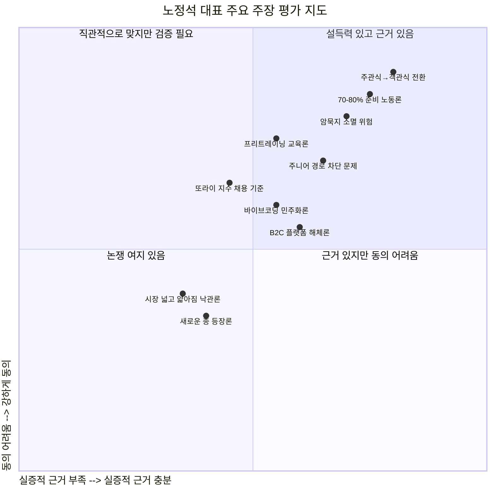
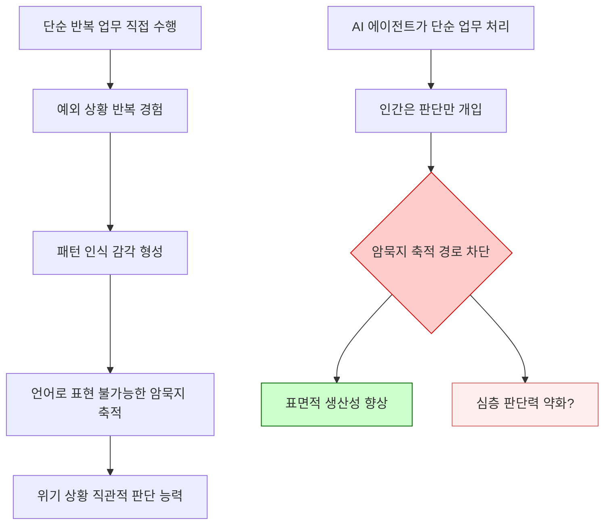
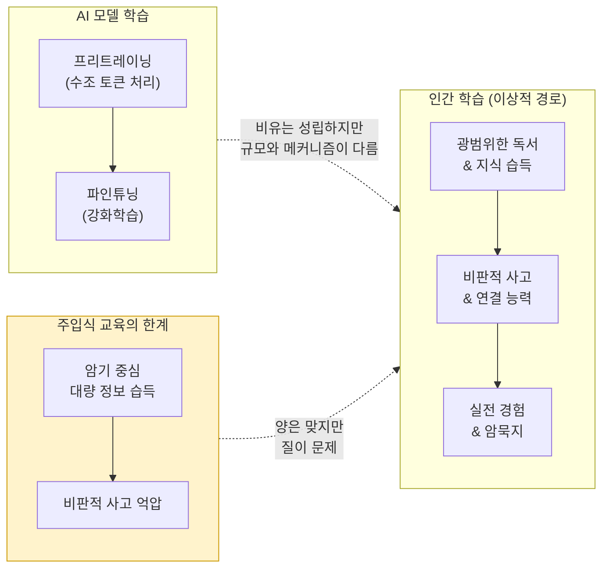
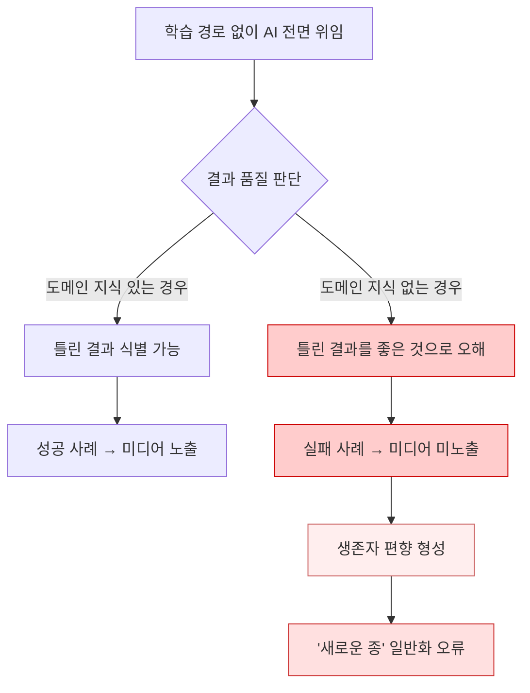
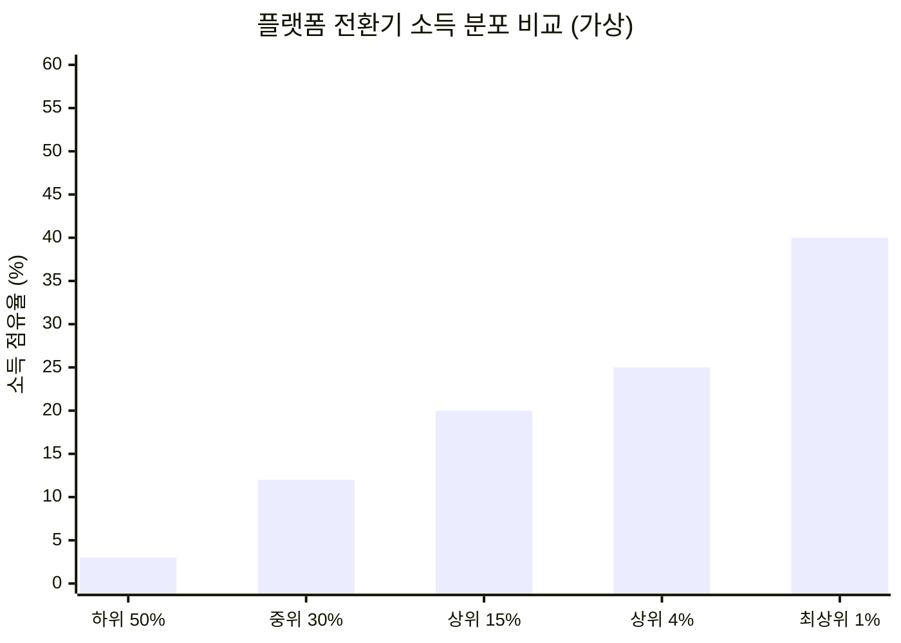
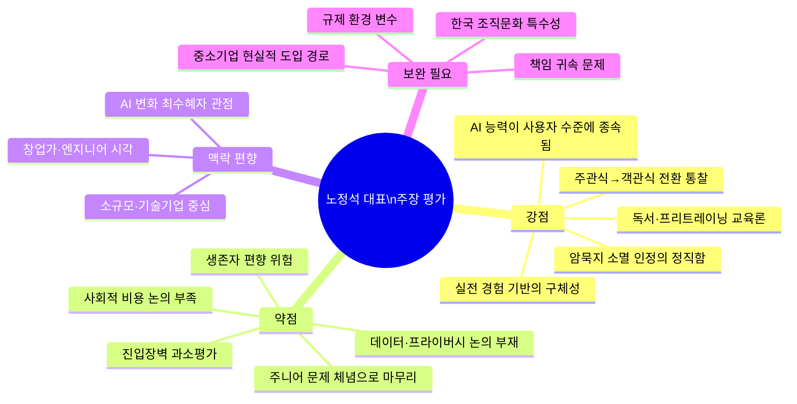

## — Claude의 시각에서

> 이 문서는 노정석 비팩토리 대표가 *손에 잡히는 경제* 팟캐스트(2026.04.02)에서 밝힌 주장들을 항목별로 검토하고, 동의하는 부분과 이의를 제기하고 싶은 부분, 그리고 보완이 필요한 관점들을 솔직하게 서술한 것이다.

---
## 관련글

[**🦾 AI 네이티브 기업에서 실제로 벌어지고 있는 일**](https://k82022603.github.io/posts/ai-%EB%84%A4%EC%9D%B4%ED%8B%B0%EB%B8%8C-%EA%B8%B0%EC%97%85%EC%97%90%EC%84%9C-%EC%8B%A4%EC%A0%9C%EB%A1%9C-%EB%B2%8C%EC%96%B4%EC%A7%80%EA%B3%A0-%EC%9E%88%EB%8A%94-%EC%9D%BC/)

## 목차

1. [전체적인 인상](#1-전체적인-인상)
2. [강하게 동의하는 주장들](#2-강하게-동의하는-주장들)
3. [유보적으로 동의하는 주장들](#3-유보적으로-동의하는-주장들)
4. [의문을 제기하고 싶은 주장들](#4-의문을-제기하고-싶은-주장들)
5. [명시적으로 빠진 관점들](#5-명시적으로-빠진-관점들)
6. [종합 평가](#6-종합-평가)

---

## 1. 전체적인 인상

노정석 대표의 이야기는 전반적으로 **실전에서 직접 부딪혀온 사람의 언어**로 되어 있다. 관념적이거나 추상적인 AI 담론이 아니라, 실제로 에이전트를 만들고 직원들을 교육하면서 겪은 마찰, 성과, 실패가 촘촘히 박혀 있다. 그 점에서 이 인터뷰는 대부분의 AI 낙관론자 혹은 비관론자의 발언보다 훨씬 질이 높다.

그러나 이 인터뷰는 동시에 특정한 편향을 내포하고 있다. 그는 기술에 깊은 이해가 있고, 엔지니어 백그라운드를 가지고 있으며, 연쇄 창업가이고, 이미 구글에 회사를 팔아본 사람이다. 즉, **AI라는 변화에서 가장 유리한 위치에 있는 사람의 시각**이다. 이 사실을 전제로 두고 그의 주장을 읽어야 한다.

아래에서는 그의 주장을 크게 세 범주로 나눠 검토한다.

---

## 2. 강하게 동의하는 주장들

### 2-1. "업무의 70~80%는 준비 노동이다"

이것은 단순한 관찰이 아니라 **지식 노동의 구조적 진실**이다. 경영학에서 말하는 '비핵심 업무(non-core activity)'의 과잉은 오래된 문제다. 피터 드러커가 수십 년 전에 지적했고, 린(Lean) 방법론이 제조업에서 낭비를 제거하려 했던 것과 같은 맥락이다. 노정석 대표는 이것을 AI로 해결하려 한다는 점에서 방향은 옳다.

특히 그가 구체적으로 묘사한 장면, 즉 마케터가 마케팅보다 엑셀 정리, 파워포인트 제작, 자료 수집에 더 많은 시간을 쓰는 현실은 대부분의 한국 직장인이 공감할 것이다. 이것이 AI로 해소된다면, 생산성의 향상은 분명히 실재한다.

다만 한 가지 주의할 점이 있다. 이 "준비 노동"이 완전히 무가치한 것이 아니라는 것이다. 엑셀을 정리하면서 데이터의 흐름을 감각적으로 이해하고, 파워포인트를 만들면서 논리 구조를 다듬는 과정이 이미 사고의 일부다. 이것을 제거했을 때 결과물의 깊이가 줄어들 가능성도 있다. 준비 노동의 제거가 항상 순수한 이득인지는 좀 더 정교하게 따져봐야 한다.

### 2-2. "주관식을 객관식으로 바꿔주는 것이 핵심이다"

이것은 탁월한 통찰이다. AI의 역할을 "무에서 유를 창조하는 것"이 아니라 **"선택지의 품질을 높이는 것"** 으로 정의하는 것은 현실적이고 실용적이다.

인간의 의사결정 연구에서도 이와 유사한 발견이 있다. 완전히 빈 캔버스 앞에서 창의적 결정을 내리는 것보다, 잘 구조화된 선택지를 주었을 때 더 나은 결정이 나온다는 것이다. 노벨 경제학상을 받은 행동경제학의 '선택 설계(Choice Architecture)' 개념과도 연결된다.

신제품 기획에 한 달이 걸리던 것이 한 시간으로 줄어든다는 주장도, 실제로 데이터 수집·정리·초안 작성이 AI로 처리된다면 충분히 가능한 이야기다. 이 부분에서는 방법론의 타당성을 의심할 이유가 없다.

### 2-3. "암묵지가 소멸한다"는 우려

이것은 그의 발언 중 가장 솔직하고 진지한 부분이다. AI 도입의 이점을 열정적으로 설명하다가 스스로 이 부작용을 꺼낸 것에서 그의 지적 정직함이 느껴진다.

암묵지(tacit knowledge)는 마이클 폴라니가 제안한 개념으로, 경험을 통해서만 전달되고 언어로 명시적으로 표현하기 어려운 지식이다. 의사가 X레이를 보고 직관적으로 이상을 감지하는 능력, 숙련된 기계공이 소리만 듣고 이상을 알아채는 능력 같은 것들이다. 직장에서의 암묵지는 "이 거래처는 이런 방식으로 접근해야 한다", "이 시장은 이런 특성이 있다" 같은 종류의 것들이다.

단순 업무를 직접 수행하지 않으면 이런 암묵지를 쌓을 기회 자체가 사라진다. 그 결과가 어떻게 나타날지는 아직 누구도 모른다. 이것은 AI 시대의 가장 중요한 미지수 중 하나다.

### 2-4. "AI의 능력은 그 사람의 질문 수준에 의해 제한된다"

이것은 AI를 실제로 사용해본 사람이라면 피부로 느끼는 진실이다. 같은 AI 도구를 써도 결과물의 질이 사람마다 극명하게 다른 이유가 바로 이것이다. "AI의 능력이 그 사람의 능력에 컨스트레인드(constrained)된다"는 표현은 매우 정확하다.

이것은 단순히 프롬프트 기술의 문제가 아니다. 어떤 질문을 해야 하는지를 아는 것은 그 도메인에 대한 깊은 이해에서 나온다. 의사가 AI에게 의학적 질문을 할 때와 의학 지식이 없는 사람이 같은 질문을 할 때, 결과가 같을 수 없다. 이것이 그가 교육론에서 "먼저 많이 배워야 한다"고 강조하는 이유이기도 하고, 매우 설득력 있는 논리다.

---

## 3. 유보적으로 동의하는 주장들

### 3-1. "프리트레이닝처럼 사람도 먼저 대량 학습해야 한다"

방향은 맞다. 그러나 이 비유는 조심해서 받아들여야 한다.

AI 모델의 프리트레이닝은 사실상 인터넷의 거의 모든 텍스트를 수조 토큰 단위로 처리하는 과정이다. 인간이 독서를 통해 지식을 쌓는 것과 규모와 속도에서 차원이 다르다. 따라서 "AI처럼 프리트레이닝하라"는 비유가 "무조건 많이 배워라"는 조언으로 단순화될 위험이 있다.

더 정확한 질문은 **무엇을, 어떤 방식으로 배워야 하는가**다. 단순히 많은 양의 정보를 접하는 것과, 그것들 사이의 연결을 이해하고 패턴을 추상화하는 것은 다른 학습이다. 독서의 양보다 **독서의 방식과 이후의 사유**가 더 중요할 수 있다.

한국의 주입식 교육에 대해 "나쁘지 않다"고 한 발언도 동의하기 어렵다. 대량의 지식을 밀어 넣는다는 측면에서는 맞지만, 주입식 교육의 진짜 문제는 **지식의 양이 아니라 비판적 사고와 자기주도 학습 능력의 억압**이다. AI에게 좋은 질문을 하려면 지식의 양만큼이나 "왜?"라고 묻는 습관이 중요하다.

### 3-2. "또라이 지수(불굴의 의지)가 채용 기준이다"

이 주장은 창업가로서의 경험에서 나온 통찰로, 그 맥락에서는 이해가 된다. 실제로 창업의 성공 요인 연구에서도 끈기(grit)와 회복탄력성(resilience)이 지능보다 더 강한 예측 변수라는 결과들이 있다.

그러나 이것을 **일반적인 채용 기준으로 확장**하는 데는 몇 가지 주의가 필요하다.

첫째, "또라이 지수"는 측정이 매우 어렵다. 면접에서 의지를 강하게 표현하는 사람이 실제로 불굴의 의지를 가진 사람인지, 단순히 면접을 잘 보는 사람인지 구별하기 어렵다. 이것은 채용 편향(hiring bias)으로 이어질 수 있다.

둘째, 조직에서 "또라이 지수"가 높은 사람들만 모이면 어떤 일이 벌어질까. 협업보다 자기 확신이 강한 개인들의 충돌이 빈번해질 수 있다. 스타트업 초기에는 유효하지만, 조직이 커질수록 다른 종류의 인재가 필요해진다.

셋째, 이 기준은 특정 문화적 배경과 계층에 유리하게 작동할 수 있다. 가정적 안정이나 경제적 여유가 "또라이처럼" 밀어붙이는 의지를 가능하게 하는 경우도 많기 때문이다.

### 3-3. "민첩한 소규모 기업이 대기업보다 유리하다"

이것은 맞는 말이지만, 반은 틀렸다.

소규모 기업의 민첩함은 분명히 AI 도입에서 유리하다. 의사결정 단계가 적고, 실험-학습-수정의 사이클이 빠르다. 이 부분은 사실이다.

그러나 AI 도입에는 **자본과 기술 인프라**가 필요하다. 노정석 대표처럼 구글에 회사를 팔고, 30년 가까이 창업을 해온 사람이 이끄는 3~4인 회사와, 자본도 기술 이해도 부족한 3~4인 자영업은 다르다. 소규모라는 조건이 동일해도 출발점이 완전히 다르다. AI 민첩성의 수혜가 소규모 기업 **일반**에 돌아가는 것이 아니라, **소규모이면서 기술적으로 준비된 기업**에 한정될 수 있다는 점을 명시하지 않으면 왜곡이 생긴다.

---

## 4. 의문을 제기하고 싶은 주장들

### 4-1. "새로운 종"의 등장 — 학습 경로 없이 결과만으로 판단한다?

고등학생이나 대학 중퇴자가 학습 과정 없이 AI에 전면 위임하고 결과만으로 판단해 시니어를 능가한다는 관찰은 분명히 일부 존재한다. 하지만 이것을 **일반적인 성공 패턴**으로 제시하는 것은 위험하다.

**생존자 편향(survivorship bias)** 의 전형적인 함정이다. 우리는 그렇게 해서 성공한 사례를 보지만, 같은 방식으로 실패한 훨씬 더 많은 사례는 보지 못한다. AI를 아무것도 모르고 전면 위임했다가 완전히 엉터리 결과를 내고 망한 케이스는 미디어에 나오지 않는다.

더 심각한 문제는, 이 주장이 **"깊이 배우지 않아도 된다"는 잘못된 신호**를 줄 수 있다는 것이다. AI가 틀린 결과를 냈을 때 그것이 틀렸다는 것을 알아채려면, 그 도메인에 대한 어느 정도의 지식이 반드시 있어야 한다. 지식 없이 결과만으로 판단한다는 것은, 종종 "잘 만들어진 쓰레기를 좋은 것으로 오해하는 것"으로 끝난다.

### 4-2. "B2C 플랫폼의 매체력이 사라진다" — 과도한 단선적 예측

AI 에이전트가 고객과 플랫폼 사이에 개입하면 기존 플랫폼들의 매체력이 소멸한다는 주장은 방향성으로는 흥미롭지만, 몇 가지 복잡한 요인을 무시한다.

첫째, **AI 에이전트 자체가 새로운 플랫폼 권력**이 된다. 구글의 검색 광고가 강력했던 것처럼, 어떤 AI 에이전트가 소비자의 곁에 자리 잡느냐에 따라 그 에이전트를 통제하는 기업이 새로운 게이트키퍼가 된다. 플랫폼의 해체가 아니라 **플랫폼의 이동**이다.

둘째, 소비자는 항상 합리적으로만 행동하지 않는다. 브랜드, 감성, 경험에 의한 구매는 AI가 매개해도 사라지지 않는다. "AI가 추천한 제품"을 항상 구매한다는 보장이 없다.

셋째, 규제의 문제가 있다. 개인정보, 독과점, 알고리즘 투명성에 대한 규제가 강화되는 방향으로 전 세계가 움직이고 있다. AI 에이전트가 모든 소비 의사결정을 매개하는 세상은 엄청난 규제 압력을 받을 것이다.

### 4-3. "시장은 넓고 얇아질 것이다" — 유튜브 비유의 한계

유튜브 비유는 직관적이고 설득력 있지만, 몇 가지 반론이 있다.

유튜브로 인해 콘텐츠 시장의 총량이 늘어난 것은 사실이지만, **실제로 생계를 유지할 수 있는 창작자의 수는 매우 제한적**이다. 유튜브 크리에이터 중 광고 수익으로 최저 임금 이상을 버는 사람은 전체의 극히 일부다. 시장은 넓어졌지만 승자독식의 정도는 더 심해졌다는 분석도 있다.

AI 노동 시장도 마찬가지일 수 있다. AI를 잘 활용하는 소수가 생산성을 수십 배 높이는 반면, 그렇지 못한 다수는 그 경쟁에서 밀려난다. "총량이 커진다"는 것이 "더 많은 사람이 더 잘 살게 된다"를 의미하지 않는다.

*(위 차트는 AI 전환기 승자독식 심화 가능성을 가상으로 표현한 것이다. 실제 수치와 다를 수 있다.)*

### 4-4. "주니어에 대한 대안이 없다"는 체념

이것은 그가 스스로 "대안을 갖고 있지 않다"고 인정한 부분이다. 그 솔직함은 높이 평가하지만, 이것이 그냥 넘어가기엔 너무 중요한 문제다.

주니어의 성장 경로 차단 문제는 단순히 개인의 커리어 문제가 아니다. 이것은 **사회 전체의 인적 자본 재생산 경로**의 문제다. 시니어들이 쌓아온 조직적 통찰, 도메인 지식, 판단력은 결국 "주니어로 시작해서 시니어가 되는 과정"을 통해 재생산된다. 이 파이프라인이 끊기면, 10~20년 후에는 진정한 의미의 시니어 자체가 없어질 수 있다.

기업 입장에서는 단기적으로는 이익이지만, 사회 전체 입장에서는 지식의 세대 간 전수 메커니즘이 붕괴하는 것이다. 이것을 "안타깝지만 어쩔 수 없다"고 마무리하기에는 파급력이 너무 크다.

---

## 5. 명시적으로 빠진 관점들

### 5-1. AI 에이전트의 오류와 책임 귀속 문제

노정석 대표는 에이전트가 실수할 수 있다는 것을 언급하지만, **그 실수에 대한 책임이 어디로 가는가**에 대해서는 이야기하지 않는다. 에이전트가 잘못된 시장 분석을 내놓고, 그것을 바탕으로 신제품을 출시했다가 실패했을 때 누가 책임지는가. 직원인가, 에이전트인가, 대표인가. 이 질문은 법적·윤리적으로 점점 중요해지고 있다.

### 5-2. 에이전트 구축의 진입장벽

"데이터 커넥터 + 정교한 프롬프트 + 모델"로 에이전트를 만든다는 설명은 기술적으로 이해가 있는 사람에게는 타당하게 들린다. 그러나 **대다수의 중소기업에게 이것은 현실적으로 매우 높은 장벽**이다. 어떤 데이터를 어떻게 연결해야 하는지를 이해하고, 정교한 프롬프트를 작성하고, 에이전트 프레임워크를 구성하는 것은 노정석 대표 같은 엔지니어링 배경이 있는 사람에게는 자연스럽지만, 그렇지 않은 대부분의 기업주에게는 시작조차 하기 어렵다.

"AI 네이티브 경영"이 진짜 보편화되려면, 이 진입장벽을 현실적으로 어떻게 낮출 것인가에 대한 논의가 반드시 따라와야 한다.

### 5-3. 데이터 보안과 프라이버시

직원들의 이메일, 슬랙 메시지, 문서를 모두 에이전트가 순회하며 분석한다는 '익스플로러 에이전트' 이야기가 나온다. 이것은 매우 강력한 도구지만, **직원 프라이버시와 감시의 경계**라는 심각한 윤리적 질문을 제기한다. 직원들이 회사 내 모든 커뮤니케이션이 AI에 의해 분석된다는 것을 알고 동의했는가. 그 데이터는 어디에 저장되고, 누가 접근할 수 있는가.

노정석 대표의 인터뷰에서 이 부분은 완전히 빠져 있다. 기술적 가능성에 대한 흥분 속에서 간과되기 쉬운, 그러나 매우 중요한 부분이다.

### 5-4. 한국 특유의 노동·조직 문화와의 충돌

그는 한국에서 고용의 경직성 때문에 미국처럼 대규모 해고가 어렵다고 언급한다. 그러나 이것이 단순히 "변화를 느리게 하는 장애물"로만 제시된다. 반대로, 고용 보호가 약한 곳에서 AI 도입이 빠를수록 그 사회적 비용은 더 높아진다는 관점도 있다.

또한 한국의 조직 문화, 특히 위계적 의사결정 구조, 집단주의적 합의 문화가 AI 에이전트 기반 조직으로 전환할 때 어떤 마찰을 만드는지에 대한 논의가 없다. 실리콘 밸리 사례를 그대로 한국에 이식할 수 있는가라는 질문은 여전히 열려 있다.

---

## 6. 종합 평가

노정석 대표의 이야기는 **AI 네이티브 경영의 현장에서 나온 드문 수준의 실증적 발언**이다. 추상적 낙관론이나 반사적 비관론이 아니라, 실제로 해보면서 겪은 것들을 솔직하게 나눈다는 점에서 귀중하다.

특히 다음 세 가지는 특별히 기억할 만한 통찰이다.

- **"주관식을 객관식으로 바꾸는 것"**: AI의 역할을 창조가 아닌 선택지 품질 향상으로 정의한 것은 매우 정확하고 실용적이다.
- **"AI 능력은 사용자의 질문 수준에 의해 제한된다"**: 이것은 AI 도구를 도입하는 모든 조직이 가슴에 새겨야 할 원칙이다.
- **"암묵지 소멸과 주니어 경로 차단"**: 이익을 말하면서 손실도 솔직히 말하는 균형이 신뢰를 만든다.

그러나 동시에 그의 시각에는 구조적 편향이 있다. 그는 AI 변화에서 가장 유리한 위치에 있는 사람이고, 그 위치에서 세상을 보고 있다. **AI 슈트를 입을 수 있는 조건 자체가 평등하게 분배되어 있지 않다**는 것, 그리고 슈트 없이 경쟁에서 밀려나는 사람들의 현실에 대한 논의는 상대적으로 얕다.

결국 그의 발언을 제대로 읽으려면 이렇게 해야 한다. **그가 말하는 가능성과 방향성은 받아들이되, 그 가능성이 실현되는 조건과 비용에 대한 질문은 스스로 추가해야 한다.** 아이언맨 슈트가 있어도 누가 입느냐가 중요하다고 그는 말했다. 그 슈트를 입을 기회 자체가 공평하게 열려 있는가라는 질문은, 이 인터뷰가 다루지 않은 가장 중요한 질문이다.

---

*작성: Claude (Anthropic) — 2026년 4월*
*분석 대상: 손에 잡히는 경제 팟캐스트, 노정석 비팩토리 대표 인터뷰 (2026.04.02)*
