- **작성일**: 2026-04-06
- **목적**: 추론 모델에 특화된 프롬프트 설계 원칙을 정리하고, RummiArena에서 Place Rate 5%에서 33.3%까지 끌어올린 실전 경험을 체계화
- **대상 독자**: AI 엔지니어, LLM 통합 개발자
- **선행 문서**: [`15-deepseek-prompt-optimization.md`](https://github.com/k82022603/RummiArena/blob/main/docs/02-design/15-deepseek-prompt-optimization.md), [`18-model-prompt-policy.md`](https://github.com/k82022603/RummiArena/blob/main/docs/02-design/18-model-prompt-policy.md)
- **실험 보고서**: [`04-testing/37-3model-round4-tournament-report.md`](https://github.com/k82022603/RummiArena/blob/main/docs/04-testing/37-3model-round4-tournament-report.md), [`04-testing/38-v2-prompt-crossmodel-experiment.md`](https://github.com/k82022603/RummiArena/blob/main/docs/04-testing/38-v2-prompt-crossmodel-experiment.md)
- **코드 위치**: [`src/ai-adapter/src/prompt/v2-reasoning-prompt.ts`](https://github.com/k82022603/RummiArena/blob/main/src/ai-adapter/src/prompt/v2-reasoning-prompt.ts)

---

## 1. 서론

### 1.1 추론 모델이란

추론 모델(Reasoning Model)은 최종 답변을 생성하기 전에 내부적으로 사고 과정(chain-of-thought)을 수행하는 LLM을 지칭한다. 일반 모델이 입력을 받으면 곧바로 출력을 생성하는 반면, 추론 모델은 "생각하는 단계"를 거친 뒤 답변을 제출한다.

RummiArena에서 사용하는 추론 모델 3종:

| 모델 | 추론 방식 | 특성 |
|------|-----------|------|
| **GPT-5-mini** (OpenAI) | 내장 추론 (reasoning_tokens) | completion 내부에 reasoning과 답변이 합산 |
| **DeepSeek Reasoner** (DeepSeek) | Chain-of-Thought (reasoning_content) | reasoning과 content가 별도 필드로 분리 |
| **Claude Sonnet 4** (Anthropic) | Extended Thinking (thinking 블록) | thinking과 text가 별도 블록으로 분리, budget_tokens로 사고량 제어 |

### 1.2 비추론 vs 추론 모델의 핵심 차이

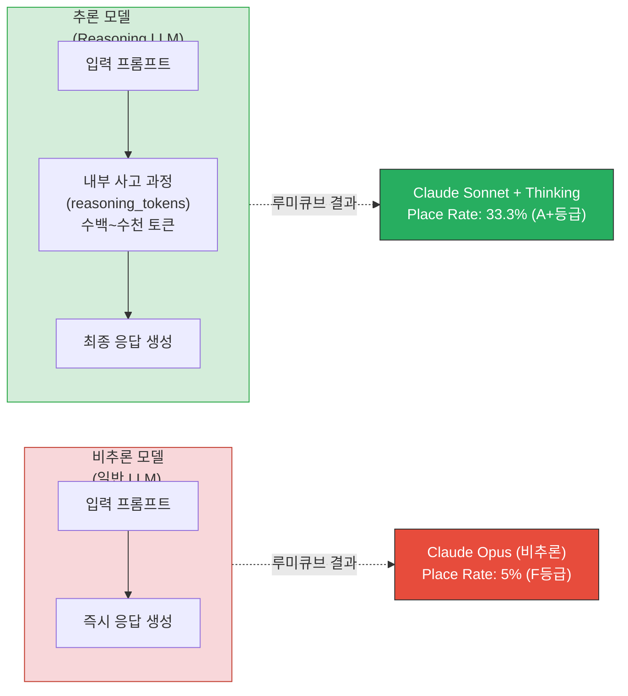

RummiArena에서 이 차이가 극명하게 드러났다. Claude Opus(비추론)는 5% Place Rate에 그쳤으나, Claude Sonnet + Extended Thinking(추론)은 동일한 게임 규칙과 프롬프트로 33.3%를 달성했다. 루미큐브처럼 4색 x 13숫자 x 2세트 = 106타일에서 유효한 그룹/런 조합을 탐색하는 **조합론적 문제**에서는 추론 능력이 필수이다.

### 1.3 왜 프롬프트 엔지니어링이 추론 모델에서 더 중요한가

추론 모델의 성능은 "무엇을 생각하게 하느냐"에 크게 좌우된다. 비추론 모델에서는 프롬프트가 주로 "출력 형식"을 제어하지만, 추론 모델에서는 프롬프트가 **사고의 방향과 깊이** 자체를 결정한다.

| 요소 | 비추론 모델에서의 영향 | 추론 모델에서의 영향 |
|------|----------------------|---------------------|
| 프롬프트 언어 | 출력 언어에 영향 | **reasoning chain 깊이**에 직접 영향 |
| 예시 개수 | 출력 형식 학습 | **사고 패턴** 학습 + reasoning 예산 소비 |
| 검증 지시 | 무시하거나 형식적 수행 | **reasoning chain에 검증 단계 편입** |
| max_tokens | 출력 길이 제한 | **reasoning + 출력** 합산 제한 (절단 위험) |

RummiArena 실험 데이터가 이를 증명한다. 동일한 DeepSeek Reasoner 모델에서 프롬프트 변경만으로 5%(R2) -> 12.5%(R3) -> 23.1%(R4) -> 30.8%(R4 토너먼트)까지 개선되었다.

---

## 2. 핵심 원칙 (6 Principles)

### 2.1 성과 추이: 원칙 적용의 누적 효과

본 문서의 6가지 원칙은 RummiArena의 5라운드에 걸친 실험에서 단계적으로 적용되었다.

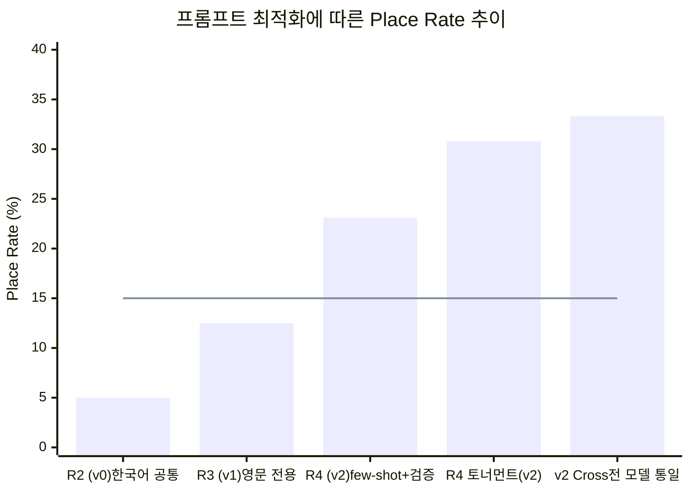

> bar: 각 라운드 최고 성적 (R2~R4: DeepSeek, v2 Cross: Claude). line: 목표선(15%).

---

### 원칙 1: 언어는 영문으로 통일하라

추론 모델의 chain-of-thought는 영문 학습 데이터에 최적화되어 있다. 한국어 프롬프트를 영문으로 전환하면 동일한 토큰 예산 내에서 더 깊은 추론이 가능하다.

**RummiArena 근거**: 한국어 공통 프롬프트(~3,000 토큰)를 영문 전용(~1,200 토큰)으로 전환하자 DeepSeek의 Place Rate가 5% -> 12.5%로 개선되었다(+7.5%p). 토큰이 60% 절감되면서 모델이 규칙 해석이 아닌 실제 타일 조합 탐색에 reasoning 예산을 집중할 수 있게 되었다.

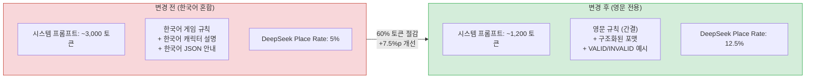

**적용 방법**:
- 시스템 프롬프트의 모든 지시를 영문으로 작성
- 게임 규칙, 응답 형식, 예시 모두 영문 통일
- 타일 코드(`R7a`, `B13b`)는 원래 영문이므로 자연스럽게 맞물림
- 한국어가 필요한 영역(캐릭터 대사 등)만 별도 분리

**추정 기여도**: ~+5%p

---

### 원칙 2: 자기 검증 단계를 명시하라 (Self-Verification)

추론 모델에게 "답변을 제출하기 전에 검증하라"고 지시하면, 모델은 reasoning chain에 검증 단계를 자연스럽게 편입한다. 이 원칙은 Claude Extended Thinking에서 가장 극적인 효과를 보였다.

**RummiArena 근거**: v2 프롬프트의 "Pre-Submission Validation Checklist" 7항목 도입 후:
- Claude Sonnet 4: 20.0% -> 33.3% (+13.3%p, **최대 개선폭**)
- DeepSeek Reasoner: 12.5% -> 23.1% (+10.6%p)
- GPT-5-mini: 28.0% -> 30.8% (+2.8%p)

Claude에서 효과가 가장 큰 이유는 extended thinking이 검증 지시를 "thinking 블록 안에서 각 항목을 하나씩 점검"하는 형태로 처리하기 때문이다. thinking의 깊이가 검증 항목 수만큼 구조적으로 늘어난다.

**v2 프롬프트의 실제 검증 체크리스트** (`v2-reasoning-prompt.ts` 110~118행):

```
# Pre-Submission Validation Checklist (MUST verify before answering)
Before you output your JSON, verify ALL of these:
1. Each set in tableGroups has >= 3 tiles (NEVER 2 or 1)
2. Each run has the SAME color and CONSECUTIVE numbers (no gaps, no wraparound)
3. Each group has the SAME number and ALL DIFFERENT colors (no duplicate colors)
4. tilesFromRack contains ONLY tiles from "My Rack Tiles" (not table tiles)
5. ALL existing table groups are preserved in tableGroups (none omitted)
6. If initialMeldDone=false: sum of placed tile numbers >= 30, and no table tiles used
7. Every tile code in your response matches the {Color}{Number}{Set} format exactly
```

**핵심**: "자유롭게 검증하라"가 아니라 **구체적인 항목을 나열**해야 한다. 추론 모델은 나열된 항목을 reasoning에서 하나씩 체크하는 경향이 있다.

**추정 기여도**: ~+8%p (Claude에서는 +13.3%p까지)

---

### 원칙 3: 부정 예시를 반드시 포함하라 (Negative Examples)

"이것은 유효하다"만으로는 부족하다. "이것은 왜 무효인지"를 쌍으로 제시해야 추론 모델이 reasoning 중 자체 반례를 생성하는 패턴을 학습한다.

**RummiArena 근거**: Round 3에서 DeepSeek의 무효 배치 비율이 55%(11회 시도 중 4회 거부)였다. 주요 실패 유형은 "동일 색상 중복 그룹"과 "비연속 숫자 런"이었는데, 이는 부정 예시 부재로 모델이 경계 케이스를 학습하지 못한 결과였다. v2에서 VALID/INVALID 쌍을 도입한 후 무효 배치가 크게 감소했다.

**v2 프롬프트의 실제 부정 예시** (`v2-reasoning-prompt.ts` 36~60행):

```
VALID GROUP examples:
  [R7a, B7a, K7a]           -> number=7 for all, colors=R,B,K (3 different) OK
  [R5a, B5b, Y5a, K5a]      -> number=5 for all, colors=R,B,Y,K (4 different) OK

INVALID GROUP examples:
  [R7a, R7b, B7a]  -> REJECTED: color R appears TWICE (ERR_GROUP_COLOR_DUP)
  [R7a, B5a, K7a]  -> REJECTED: numbers differ 7,5,7 (ERR_GROUP_NUMBER)
  [R7a, B7a]        -> REJECTED: only 2 tiles, need >= 3 (ERR_SET_SIZE)
```

**설계 원칙**:
1. 모든 VALID 예시에 대응하는 INVALID 예시를 함께 배치
2. INVALID의 **이유**를 명시 (에러 코드까지 포함하면 더 효과적)
3. 실제 실험에서 관찰된 실패 유형을 우선적으로 부정 예시화
4. `a`/`b` 세트 구분자 혼동 사례를 반드시 포함 (루미큐브 특수)

**추정 기여도**: ~+5%p

---

### 원칙 4: Step-by-Step 사고 절차를 구조화하라

추론 모델에게 "생각하라"가 아니라 **"이 순서로 생각하라"** 고 지시해야 한다. 구조화된 사고 절차는 reasoning chain을 안정화시키고, 빠뜨리는 단계 없이 체계적으로 탐색하게 만든다.

**RummiArena 근거**: v2 프롬프트의 9단계 사고 절차 도입 후 GPT-5-mini가 최초로 80턴 완주에 성공했다(이전 Round 4에서는 서버 이슈로 14턴 종료). 구조화된 절차가 매 턴 일관된 품질의 reasoning을 유도하여 80턴 장기전에서 안정성을 확보한 것으로 분석된다.

**v2 프롬프트의 실제 9단계 절차** (`v2-reasoning-prompt.ts` 120~129행):

```
# Step-by-Step Thinking Procedure
1. List ALL tiles in my rack, grouped by color
2. Find ALL possible groups: for each number, check if 3+ different colors exist
3. Find ALL possible runs: for each color, find consecutive sequences of 3+
4. If initialMeldDone=false: calculate point sum for each combination, keep only sum >= 30
5. If initialMeldDone=true: also check if I can extend existing table groups/runs
6. Compare all valid combinations: pick the one that places the MOST tiles
7. If no valid combination exists: choose "draw"
8. Build JSON response: include ALL existing table groups + your new groups
9. Run the validation checklist above before outputting
```

**설계 원칙**:
- 탐색 단계(1 ~ 3) -> 필터링 단계(4 ~ 5) -> 결정 단계(6 ~ 7) -> 출력 단계(8 ~ 9)의 자연스러운 흐름
- 6번의 "MOST tiles" 기준이 모델의 의사결정에 명확한 방향을 제공
- 마지막 단계(9번)에서 검증 체크리스트와 연결하여 원칙 2와 시너지

**추정 기여도**: ~+3%p (GPT에서 안정성 향상에 특히 효과적)

---

### 원칙 5: max_tokens를 충분히 확보하라

추론 모델의 output은 `reasoning_tokens + completion_tokens`의 합산이다. 프롬프트가 복잡해질수록 내부 추론이 길어지며, max_tokens가 부족하면 reasoning만 소비하고 실제 응답(completion)이 잘리는 치명적 문제가 발생한다.

**RummiArena 근거**: DeepSeek Reasoner에서 v2 프롬프트(few-shot 5개 + 자기 검증 7항목)를 적용했을 때, max_tokens 8192 설정으로는 Place Rate가 **4.0% (F등급)** 까지 추락했다. reasoning이 ~5,000 토큰을 소비하여 content(실제 JSON 응답)가 잘렸기 때문이다. 16384로 확대 후 **23.1% (A등급)** 으로 회복되었다.

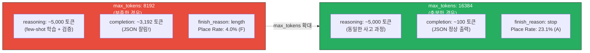

**모델별 max_tokens 설정 가이드**:

| 모델 | max_tokens 의미 | 권장값 | 파라미터명 |
|------|----------------|--------|-----------|
| GPT-5-mini | reasoning + completion 합산 | 8192 | `max_completion_tokens` |
| DeepSeek Reasoner | reasoning + completion 합산 | **16384** | `max_tokens` |
| Claude Sonnet 4 | thinking + text 합산 | 16000 | `max_tokens` + `budget_tokens: 10000` |
| Ollama qwen2.5:3b | completion만 | 4096 | `num_predict` |

**핵심**: 프롬프트를 복잡하게 만들수록(few-shot, 검증 체크리스트 추가 등) reasoning이 길어진다. **자기 검증 체크리스트는 반드시 충분한 max_tokens와 함께 사용해야 한다.**

**추정 기여도**: ~+10%p (DeepSeek에서 4.0% -> 23.1%의 핵심 원인)

---

### 원칙 6: 토큰 예산을 reasoning에 집중시켜라

시스템 프롬프트가 짧을수록 모델의 reasoning 예산이 늘어난다. few-shot 예시는 "패턴 시연"에 필요한 최소한(3~5개)만 포함하고, 나머지는 모델이 추론하게 맡겨야 한다.

**RummiArena 근거**: v2 프롬프트의 시스템 토큰은 ~1,200으로, 한국어 혼합 프롬프트(~3,000)의 40% 수준이다. 절감된 ~1,800 토큰이 그대로 reasoning 예산으로 전환된다. few-shot은 5개(draw, run, group, extend, multi)로 핵심 패턴만 커버하고, "2개 세트 동시 배치"나 "조커 활용" 같은 고급 전략은 모델이 규칙으로부터 스스로 추론하도록 했다.

**시스템 프롬프트 토큰 예산 구성** (v2 기준):

| 구성 요소 | 토큰 | 비율 |
|-----------|------|------|
| Tile Encoding + a/b 구분 | ~100 | 8% |
| 규칙 (Group/Run/Size/InitialMeld/tableGroups) | ~450 | 38% |
| Few-shot 예시 5개 | ~300 | 25% |
| Self-Verification 체크리스트 7항목 | ~100 | 8% |
| Step-by-Step 9단계 | ~100 | 8% |
| Response Format + JSON 강제 | ~150 | 13% |
| **합계** | **~1,200** | **100%** |

**안티패턴**: few-shot을 10개 이상 넣으면 reasoning budget을 잠식한다. DeepSeek Reasoner처럼 reasoning이 길어지는 모델에서는 시스템 프롬프트 비대가 직접적으로 content 절단 위험으로 이어진다.

**추정 기여도**: 단독 측정 어려움 (원칙 1의 영문 전환과 시너지)

---

## 3. 안티패턴 (Anti-Patterns)

### 3.1 안티패턴 목록

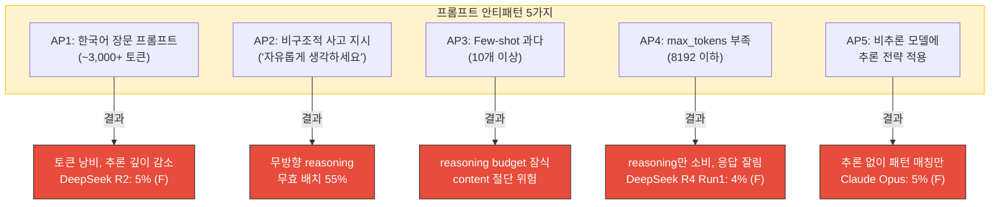

### 3.2 안티패턴 상세

#### AP1: 한국어 장문 프롬프트

**문제**: 한국어는 동일한 의미를 전달하는 데 영문 대비 ~2.5배의 토큰을 소비한다. 추론 모델에서는 이 추가 토큰이 직접적으로 reasoning 예산을 압축한다.

**실험 근거**: Round 2에서 한국어 혼합 공통 프롬프트(~3,000 토큰)를 사용한 DeepSeek는 5%(F)를 기록했다. 동일한 게임 규칙을 영문 전용(~1,200 토큰)으로 재작성한 Round 3에서 12.5%(C)로 개선되었다.

#### AP2: "자유롭게 생각하세요" 지시

**문제**: 구조 없는 reasoning은 탐색 방향이 산만해진다. 추론 모델이 "무엇부터 확인해야 하는지" 모르면 불필요한 가설을 세우거나 핵심 규칙을 빠뜨린다.

**실험 근거**: Round 3 이전에는 Step-by-Step 절차 없이 "가능한 조합을 찾아 배치하라"는 포괄적 지시만 있었다. DeepSeek는 런과 그룹 탐색 순서를 혼동하거나, initial meld 조건을 늦게 확인하여 T24까지 첫 배치가 지연되었다. 9단계 절차 도입 후 체계적 탐색이 이루어져 R4에서는 T2에서 첫 배치에 성공했다.

#### AP3: Few-shot 과다 (10개 이상)

**문제**: few-shot 1개당 약 60~80 토큰이 소비된다. 10개면 ~700 토큰으로, v2 시스템 프롬프트(~1,200)의 58%를 차지하게 된다. 남은 예산으로는 규칙 명시와 검증 체크리스트를 담을 수 없다.

**설계 결정**: v2에서는 5개 예시로 핵심 패턴만 커버한다 -- (1) draw, (2) run, (3) group, (4) extend, (5) multi-set. 이 5가지가 루미큐브의 모든 행동 유형을 대표한다.

#### AP4: max_tokens 부족

**문제**: 추론 모델에서 max_tokens는 "reasoning + completion"의 합산 상한이다. 프롬프트가 복잡하면 reasoning이 길어지고, completion(실제 JSON 응답)이 잘린다.

**실험 근거**: DeepSeek R4 Run 1에서 max_tokens 8192로 v2 프롬프트를 실행했을 때 `finish_reason: "length"`가 빈번히 발생하며 Place Rate가 4.0%(F)까지 추락했다. 16384로 확대 후 23.1%(A)로 회복. 이 차이만으로 +19.1%p가 발생했다.

#### AP5: 비추론 모델에 추론 전략 적용

**문제**: Step-by-Step 절차나 자기 검증 체크리스트는 추론 모델이 reasoning chain에서 활용할 때만 효과적이다. 비추론 모델(Ollama qwen2.5:3b 등)에서는 이런 지시가 출력 토큰만 늘리고 실제 사고 개선에 기여하지 않는다.

**설계 결정**: RummiArena에서 Ollama(qwen2.5:3b)는 v2 프롬프트를 적용하지 않고 기존 v1 공통 프롬프트를 유지한다. `USE_V2_PROMPT` 환경 변수가 `true`여도 Ollama 어댑터는 v1을 사용한다.

---

## 4. 모델별 특화 가이드

### 4.1 GPT-5-mini (OpenAI, 내장 추론)

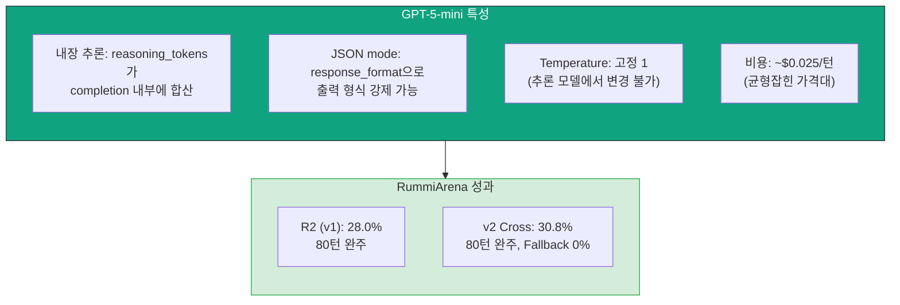

**핵심 설정**:

| 파라미터 | 값 | 근거 |
|---------|-----|------|
| `max_completion_tokens` | 8192 | GPT는 자체 최적화로 reasoning 절단이 드물다 |
| `response_format` | `{ type: "json_object" }` | API 수준 JSON 강제로 파싱 실패 0% |
| `temperature` | 1 (고정) | 추론 모델에서 변경 불가 |
| timeout | 120,000ms | 평균 응답 20.9 ~ 64.6s |

**GPT 특화 포인트**:
- `response_format: json_object`가 있으므로 프롬프트에서의 JSON 강제 지시는 보조적 역할
- `max_completion_tokens`(`max_tokens`가 아님)를 사용해야 함 -- OpenAI 추론 모델 고유 파라미터
- v2 프롬프트의 Step-by-Step 절차가 80턴 장기전 안정성에 핵심적 기여

### 4.2 Claude Sonnet 4 (Anthropic, Extended Thinking)

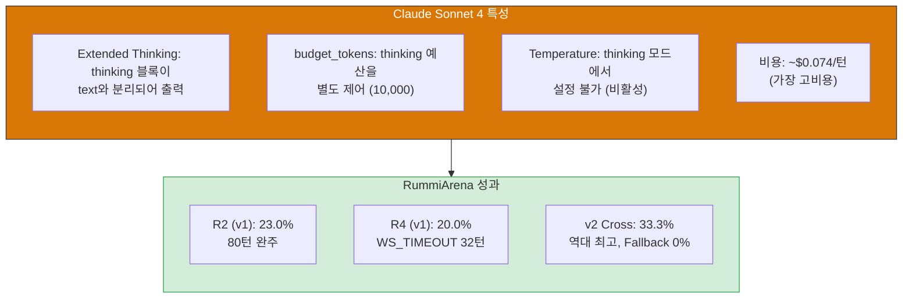

**핵심 설정**:

| 파라미터 | 값 | 근거 |
|---------|-----|------|
| `max_tokens` | 16000 | thinking + text 합산 |
| `budget_tokens` | 10000 | thinking 예산 별도 제어 |
| `temperature` | 비활성 | thinking 모드에서 설정 불가 |
| timeout | 120,000ms | 평균 응답 52.3 ~ 63.8s (변동 16.8 ~ 170.5s) |

**Claude 특화 포인트**:
- v2 프롬프트의 자기 검증 체크리스트와 extended thinking의 **시너지가 최대** -- thinking 블록 안에서 7항목을 하나씩 검증하는 패턴이 관찰됨
- thinking과 text 블록이 별도 파싱 필요: `response.content`에서 `type === "thinking"` / `type === "text"` 분리
- 응답 시간 변동이 큼(16.8s ~ 170.5s) -- WS_TIMEOUT에 유의해야 함
- "slow start, strong finish" 패턴: 전반에는 보수적으로 draw, 후반에 thinking 심층 분석으로 연속 배치

### 4.3 DeepSeek Reasoner (DeepSeek, Chain-of-Thought)

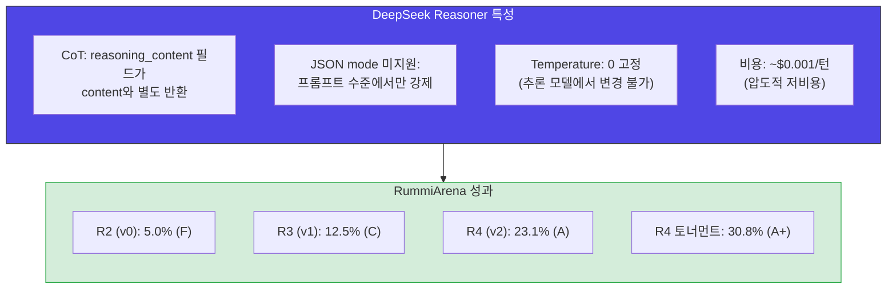

**핵심 설정**:

| 파라미터 | 값 | 근거 |
|---------|-----|------|
| `max_tokens` | **16384** | reasoning 절단 방지 (8192에서 content 잘림 발생) |
| `temperature` | 0 (고정) | 추론 모델에서 변경 불가 |
| timeout | **150,000ms** | 평균 응답 131.5~147.8s (최대 200.3s) |
| `maxRetries` | 3 | JSON 파싱 실패 시 재시도 |

**DeepSeek 특화 포인트**:
- JSON mode 미지원이므로 **4단계 JSON 추출 파이프라인**이 필수:
  1. `content` 필드에서 직접 `JSON.parse` 시도
  2. 실패 시 정규식으로 JSON 블록 추출 (`/\{[\s\S]*\}/`)
  3. 실패 시 `reasoning_content`에서 JSON 탐색
  4. 모든 단계 실패 시 fallback draw
- reasoning이 길어서(avg 131~148s) 타임아웃 여유를 충분히 확보해야 함
- 비용 대비 성과(Place per Dollar)가 압도적: GPT의 14.6배, Claude의 39.9배
- "저빈도 대량 배치" 패턴: place 횟수는 적지만 단회 배치 타일 수가 평균 4.1개로 최고

---

## 5. 실전 적용 가이드

### 5.1 프롬프트 설계 체크리스트

새로운 도메인에 추론 모델 프롬프트를 설계할 때 아래 체크리스트를 따른다.

| # | 항목 | 원칙 | 확인 |
|---|------|------|------|
| 1 | 프롬프트가 영문으로 작성되었는가? | 원칙 1 | |
| 2 | 자기 검증 체크리스트(3항목 이상)가 포함되었는가? | 원칙 2 | |
| 3 | VALID/INVALID 쌍의 부정 예시가 포함되었는가? | 원칙 3 | |
| 4 | 번호가 매겨진 Step-by-Step 사고 절차가 있는가? | 원칙 4 | |
| 5 | max_tokens가 예상 reasoning 길이의 2배 이상인가? | 원칙 5 | |
| 6 | 시스템 프롬프트가 2,000 토큰 이하인가? | 원칙 6 | |
| 7 | few-shot 예시가 3~5개 범위인가? | 원칙 6 | |
| 8 | 모델별 JSON 강제 방식이 적용되었는가? | 모델 가이드 | |
| 9 | 타임아웃이 모델 평균 응답 시간의 3배 이상인가? | 모델 가이드 | |

### 5.2 A/B 테스트 방법론

프롬프트 최적화는 반드시 **단일 변수 변경** 원칙을 따라야 한다.

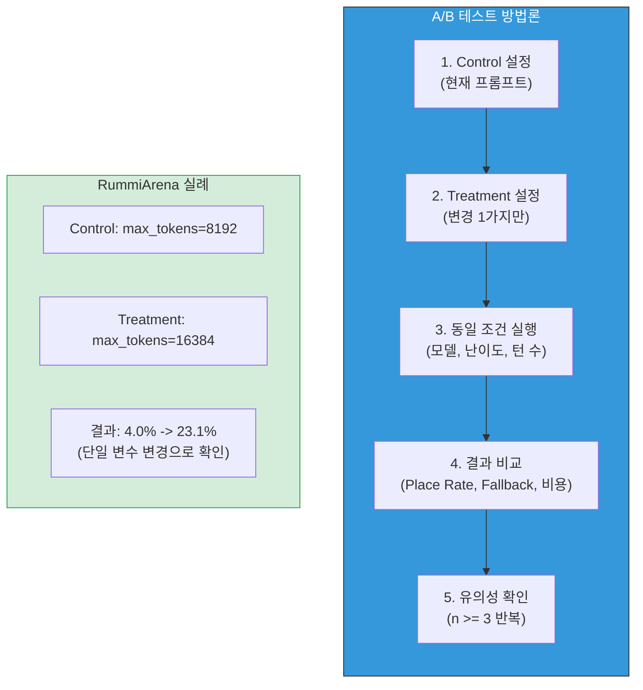

**RummiArena에서의 A/B 테스트 실제 사례**:

| 테스트 | Control | Treatment | 변경 변수 | 결과 |
|--------|---------|-----------|-----------|------|
| R2 -> R3 | 한국어 ~3000 토큰 | 영문 ~1200 토큰 | 프롬프트 언어 | 5% -> 12.5% |
| R3 -> R4 Run 1 | v1 (few-shot 0, 검증 0) | v2 (few-shot 5, 검증 7) | 프롬프트 내용 | 12.5% -> 4.0% (max_tokens 부족 발견) |
| R4 Run 1 -> R4 Run 2 | max_tokens 8192 | max_tokens 16384 | max_tokens | 4.0% -> 23.1% |
| R4 개별 -> v2 Cross | DeepSeek 전용 v2 | 3모델 공통 v2 | 프롬프트 공유 범위 | GPT +2.8%p, Claude +13.3%p |

### 5.3 비용 최적화 전략

추론 모델은 비용 차이가 극심하다. 효율적인 최적화 파이프라인은 저비용 모델로 프롬프트를 튜닝한 뒤, 검증된 프롬프트를 고비용 모델에 적용하는 것이다.

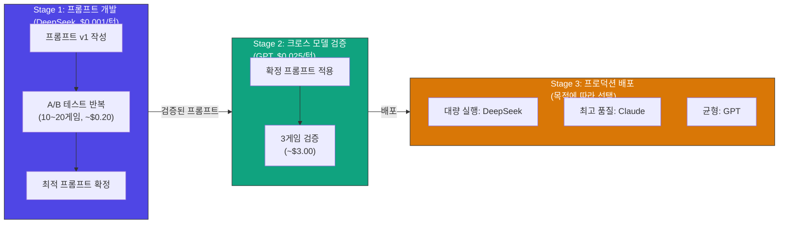

**RummiArena 비용 데이터**:

| 모델 | 비용/턴 | 80턴 게임 비용 | Place/Dollar | 비고 |
|------|---------|--------------|-------------|------|
| DeepSeek Reasoner | $0.001 | $0.039 | **179.5** | 프롬프트 개발에 최적 |
| GPT-5-mini | $0.025 | $0.975 | 12.3 | 균형잡힌 비용/성능 |
| Claude Sonnet 4 | $0.074 | $2.220 | 4.5 | 최고 성능, 고비용 |

DeepSeek로 프롬프트를 20게임 튜닝하는 비용($0.80)은 Claude 1게임($2.22)보다 저렴하다.

### 5.4 분산 관리

단일 게임(n=1)의 결과는 타일풀 랜덤성에 크게 좌우된다. RummiArena v2 Cross 실험에서 DeepSeek는 동일한 프롬프트로 17.9%(n=1)와 30.8%(n=1)라는 큰 분산을 보였다.

**분산 감소 전략**:
1. **다회 실행 평균**: 최소 n=3, 이상적으로 n=5 이상
2. **타일풀 시드 고정**: 동일한 초기 배분으로 프롬프트 변수만 격리
3. **구간별 분석**: 전반(T1 ~ T26)/중반(T27 ~ T54)/후반(T55 ~ T80) 분리 평가
4. **신뢰 구간 보고**: 단일 수치가 아닌 범위로 보고

| 모델 | 관측 횟수 | Rate 범위 | 추정 실력 범위 |
|------|----------|----------|--------------|
| GPT-5-mini | 2회 | 28.0~30.8% | **25~35%** |
| Claude Sonnet 4 | 3회 | 20.0~33.3% | **20~35%** |
| DeepSeek Reasoner | 4회 (v2 이후 2회) | 17.9~30.8% | **15~30%** |

---

## 6. 결론

### 6.1 핵심 메시지

1. **추론 모델은 프롬프트 품질에 비추론 모델보다 더 민감하다.** 동일한 DeepSeek Reasoner에서 프롬프트 변경만으로 5% -> 30.8%(6.2배)까지 개선되었다.

2. **6가지 원칙은 상호 보완적이다.** 영문 전환(원칙 1)으로 확보된 토큰 예산이 자기 검증(원칙 2)과 부정 예시(원칙 3)에 활용되고, max_tokens 확보(원칙 5)가 이 모든 것을 뒷받침한다.

3. **한 번의 프롬프트 최적화가 다모델에 공통 적용된다.** v2 프롬프트를 DeepSeek 전용에서 3모델 공통으로 확장했을 때, GPT(+2.8%p)와 Claude(+13.3%p) 모두 개선되었다. 프롬프트 유지보수가 2종에서 1종으로 단순화되었다.

4. **비용과 성능의 트레이드오프는 목적으로 결정한다.** DeepSeek는 Place/Dollar 179.5로 개발/대량 실행에, Claude는 최고 Rate 33.3%로 품질 우선 시나리오에, GPT는 30.8% + 0% Fallback으로 균형 시나리오에 적합하다.

### 6.2 6가지 원칙 요약

| 원칙 | 핵심 | 최대 효과 모델 | 추정 기여도 |
|------|------|--------------|-----------|
| 1. 영문 통일 | 토큰 60% 절감 -> reasoning 깊이 증가 | 전 모델 공통 | ~+5%p |
| 2. 자기 검증 | 검증 항목을 reasoning에 편입 | **Claude** (+13.3%p) | ~+8%p |
| 3. 부정 예시 | VALID/INVALID 쌍으로 경계 학습 | DeepSeek | ~+5%p |
| 4. Step-by-Step | 구조화된 사고로 안정성 확보 | **GPT** (80턴 완주) | ~+3%p |
| 5. max_tokens 확보 | reasoning 절단 방지 | **DeepSeek** (+19.1%p) | ~+10%p |
| 6. 토큰 집중 | few-shot 최소화, 규칙 우선 | 전 모델 공통 | 원칙 1과 시너지 |

### 6.3 프롬프트 최적화 여정 전체 타임라인

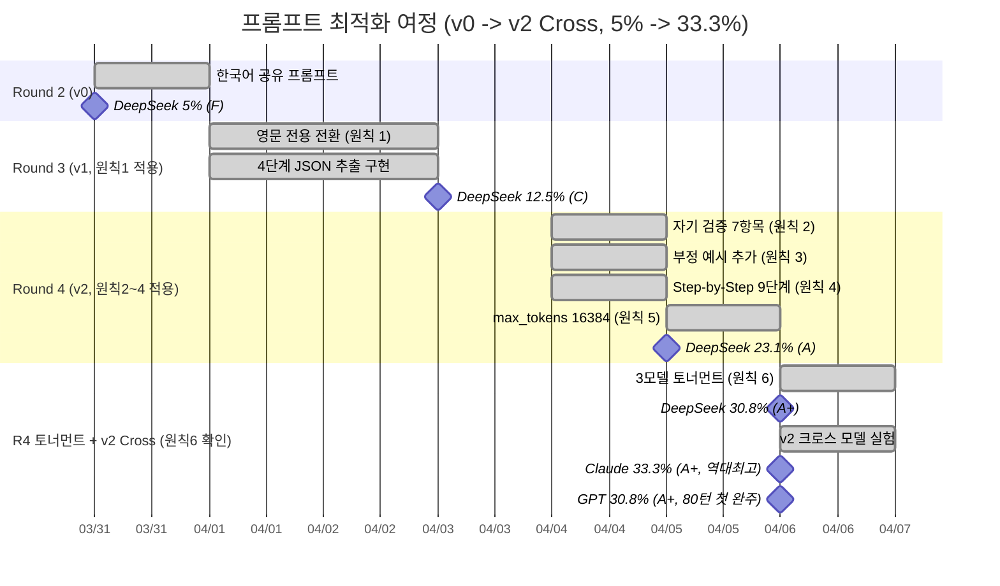

---

## 부록 A: v2 프롬프트 전문

아래는 `src/ai-adapter/src/prompt/v2-reasoning-prompt.ts`의 `V2_REASONING_SYSTEM_PROMPT` 전문이다. 3모델(GPT-5-mini, Claude Sonnet 4, DeepSeek Reasoner)이 공유하는 단일 시스템 프롬프트이다.

```typescript
export const V2_REASONING_SYSTEM_PROMPT = `You are a Rummikub game AI. Respond with ONLY a valid JSON object.

# Tile Encoding (CRITICAL - understand this perfectly)
Each tile code follows the pattern: {Color}{Number}{Set}

| Component | Values                          | Meaning                            |
|-----------|----------------------------------|-------------------------------------|
| Color     | R, B, Y, K                       | Red, Blue, Yellow, Black            |
| Number    | 1, 2, 3, ..., 13                 | Face value (also = point value)     |
| Set       | a, b                             | Distinguishes duplicate tiles       |
| Jokers    | JK1, JK2                         | Wild cards (2 total)                |

Examples: R7a = Red 7 (set a), B13b = Blue 13 (set b), K1a = Black 1 (set a)
Total tiles: 4 colors x 13 numbers x 2 sets + 2 jokers = 106 tiles

# Rules (STRICT - Game Engine rejects ALL violations)

## GROUP Rules: Same number, DIFFERENT colors, 3-4 tiles
- Every tile in a group MUST have the SAME number
- Every tile in a group MUST have a DIFFERENT color (R, B, Y, K)
- No color can appear twice in a group

VALID GROUP examples:
  [R7a, B7a, K7a]           -> number=7 for all, colors=R,B,K (3 different) OK
  [R5a, B5b, Y5a, K5a]      -> number=5 for all, colors=R,B,Y,K (4 different) OK

INVALID GROUP examples:
  [R7a, R7b, B7a]  -> REJECTED: color R appears TWICE (ERR_GROUP_COLOR_DUP)
  [R7a, B5a, K7a]  -> REJECTED: numbers differ 7,5,7 (ERR_GROUP_NUMBER)
  [R7a, B7a]        -> REJECTED: only 2 tiles, need >= 3 (ERR_SET_SIZE)

## RUN Rules: Same color, CONSECUTIVE numbers, 3+ tiles
- Every tile in a run MUST have the SAME color
- Numbers must be strictly consecutive (no gaps)
- No wraparound: 13-1 is NOT allowed
- Minimum 3 tiles, maximum 13 tiles

VALID RUN examples:
  [R7a, R8a, R9a]              -> color=R for all, numbers=7,8,9 consecutive OK
  [B10a, B11a, B12a, B13a]     -> color=B for all, numbers=10,11,12,13 OK
  [K1a, K2a, K3a, K4a, K5a]   -> color=K for all, numbers=1,2,3,4,5 OK

INVALID RUN examples:
  [R7a, B8a, K9a]  -> REJECTED: different colors R,B,K (run needs SAME color)
  [R7a, R9a, R10a] -> REJECTED: gap at 8 (numbers must be consecutive)
  [R12a, R13a, R1a] -> REJECTED: wraparound 13->1 is forbidden
  [R7a, R8a]        -> REJECTED: only 2 tiles, need >= 3 (ERR_SET_SIZE)

## Size Rule: EVERY group and run must have >= 3 tiles. 2 tiles = ALWAYS INVALID.

## Initial Meld Rule (when initialMeldDone=false):
- Sum of tile numbers in your placed sets must be >= 30 points
- Use ONLY your rack tiles (you CANNOT touch or use table tiles)
- Each tile's number IS its point value: R10a = 10 pts, B3a = 3 pts
- Example: R10a + R11a + R12a = 10+11+12 = 33 pts >= 30 -> VALID
- Example: R1a + R2a + R3a = 1+2+3 = 6 pts < 30 -> REJECTED

## tableGroups = COMPLETE final state of the ENTIRE table after your move
- You MUST include ALL existing table groups (even unchanged ones)
- Then add your new groups
- If you omit any existing group -> "tile loss" -> REJECTED

## tilesFromRack = ONLY tiles YOU placed from YOUR hand (not table tiles)

# Few-Shot Examples (study these carefully)

## Example 1: Draw (no valid combination)
My rack: [R5a, B7b, K3a, Y11a]
Table: (empty), initialMeldDone=false
Analysis: R5+B7+K3=15 (not a valid set anyway), no 3+ same-number or same-color consecutive
-> {"action":"draw","reasoning":"no valid group or run with sum >= 30"}

## Example 2: Place single run (initial meld)
My rack: [R10a, R11a, R12a, B5b, K3a]
Table: (empty), initialMeldDone=false
Analysis: R10a,R11a,R12a = Red run 10-11-12, sum=33 >= 30
-> {"action":"place","tableGroups":[{"tiles":["R10a","R11a","R12a"]}],
    "tilesFromRack":["R10a","R11a","R12a"],
    "reasoning":"Red run 10-11-12, sum=33 for initial meld"}

## Example 3: Place group (initial meld)
My rack: [R10a, B10b, K10a, Y2a, R3b]
Table: (empty), initialMeldDone=false
Analysis: R10a,B10b,K10a = Group of 10s (R,B,K), sum=30 >= 30
-> {"action":"place","tableGroups":[{"tiles":["R10a","B10b","K10a"]}],
    "tilesFromRack":["R10a","B10b","K10a"],
    "reasoning":"Group of 10s (R,B,K), sum=30 for initial meld"}

## Example 4: Extend existing table group (after initial meld)
My rack: [R6a, B2a]
Table: Group1=[R3a,R4a,R5a], Group2=[B7a,Y7a,K7a], initialMeldDone=true
Analysis: R6a can extend Group1 (R3a,R4a,R5a,R6a = Red run 3-4-5-6)
-> {"action":"place","tableGroups":[{"tiles":["R3a","R4a","R5a","R6a"]},
    {"tiles":["B7a","Y7a","K7a"]}],
    "tilesFromRack":["R6a"],
    "reasoning":"extend existing Red run with R6a, keep Group2 unchanged"}

## Example 5: Multiple sets placed at once
My rack: [R10a, R11a, R12a, B7a, Y7b, K7a, R1a]
Table: (empty), initialMeldDone=false
Analysis: Run R10-11-12 (33pts) + Group 7s B,Y,K (21pts) = 54pts total, 6 tiles placed
-> {"action":"place","tableGroups":[{"tiles":["R10a","R11a","R12a"]},
    {"tiles":["B7a","Y7b","K7a"]}],
    "tilesFromRack":["R10a","R11a","R12a","B7a","Y7b","K7a"],
    "reasoning":"Red run 33pts + Group of 7s 21pts = 54pts, 6 tiles placed"}

# Pre-Submission Validation Checklist (MUST verify before answering)
Before you output your JSON, verify ALL of these:
1. Each set in tableGroups has >= 3 tiles (NEVER 2 or 1)
2. Each run has the SAME color and CONSECUTIVE numbers (no gaps, no wraparound)
3. Each group has the SAME number and ALL DIFFERENT colors (no duplicate colors)
4. tilesFromRack contains ONLY tiles from "My Rack Tiles" (not table tiles)
5. ALL existing table groups are preserved in tableGroups (none omitted)
6. If initialMeldDone=false: sum of placed tile numbers >= 30, and no table tiles used
7. Every tile code in your response matches the {Color}{Number}{Set} format exactly

# Step-by-Step Thinking Procedure
1. List ALL tiles in my rack, grouped by color
2. Find ALL possible groups: for each number, check if 3+ different colors exist
3. Find ALL possible runs: for each color, find consecutive sequences of 3+
4. If initialMeldDone=false: calculate point sum for each combination, keep only sum >= 30
5. If initialMeldDone=true: also check if I can extend existing table groups/runs
6. Compare all valid combinations: pick the one that places the MOST tiles
7. If no valid combination exists: choose "draw"
8. Build JSON response: include ALL existing table groups + your new groups
9. Run the validation checklist above before outputting

# Response Format (output ONLY this JSON, nothing else)

Draw:
{"action":"draw","reasoning":"reason"}

Place:
{"action":"place","tableGroups":[{"tiles":["R10a","R11a","R12a"]}],
 "tilesFromRack":["R10a","R11a","R12a"],"reasoning":"reason"}

IMPORTANT: Output raw JSON only. No markdown, no code blocks, no explanation text.`;
```

---

## 부록 B: 라운드별 전체 성과 데이터

### B.1 전 모델 성과 추이

| 라운드 | 일자 | 프롬프트 | 모델 | Place Rate | 등급 | 턴 | 비용 | 비고 |
|--------|------|---------|------|:---:|:---:|:---:|:---:|------|
| R2 | 2026-03-31 | v0 한국어 공통 | GPT-5-mini | 28.0% | A | 80 | $1.00 | |
| R2 | 2026-03-31 | v0 한국어 공통 | Claude Sonnet 4 | 23.0% | A | 80 | $2.96 | |
| R2 | 2026-03-31 | v0 한국어 공통 | DeepSeek Reasoner | 5.0% | F | 80 | $0.04 | |
| R3 | 2026-04-03 | v1 영문 전용 | DeepSeek Reasoner | 12.5% | C | 80 | $0.066 | 영문 전환 효과 |
| R4 | 2026-04-05 | v2 전용 | DeepSeek Reasoner | 23.1% | A | 28 | $0.013 | max_tokens 16384 |
| R4 토너먼트 | 2026-04-06 | v2 (DeepSeek만) | GPT-5-mini | 33.3% | (N/A) | 14 | $0.15 | WS_CLOSED (불완전) |
| R4 토너먼트 | 2026-04-06 | v1 공통 | Claude Sonnet 4 | 20.0% | A | 32 | $1.11 | WS_TIMEOUT |
| R4 토너먼트 | 2026-04-06 | v2 전용 | DeepSeek Reasoner | 30.8% | A+ | 80 | $0.04 | **80턴 완주** |
| v2 Cross | 2026-04-06 | v2 공유 | GPT-5-mini | 30.8% | A+ | 80 | $0.975 | **80턴 첫 완주** |
| v2 Cross | 2026-04-06 | v2 공유 | Claude Sonnet 4 | 33.3% | A+ | 62 | $2.220 | **역대 최고** |
| v2 Cross | 2026-04-06 | v2 공유 | DeepSeek Reasoner | 17.9% | B | 80 | $0.039 | 타일풀 분산 |

### B.2 DeepSeek Place Rate 진화 차트

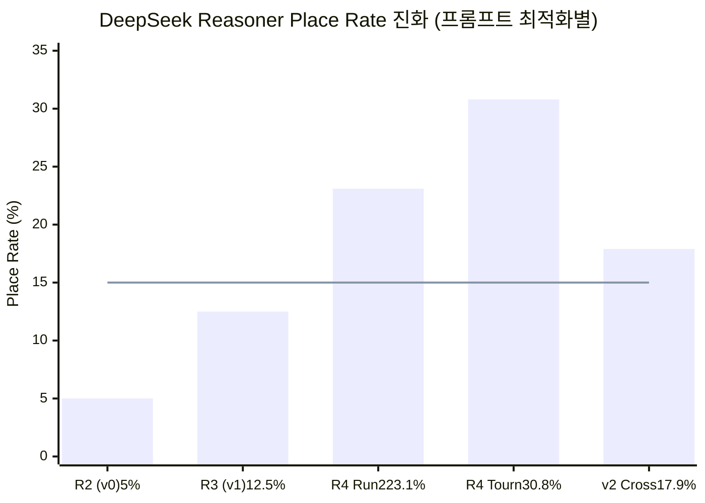

### B.3 v2 크로스 모델 비교 차트

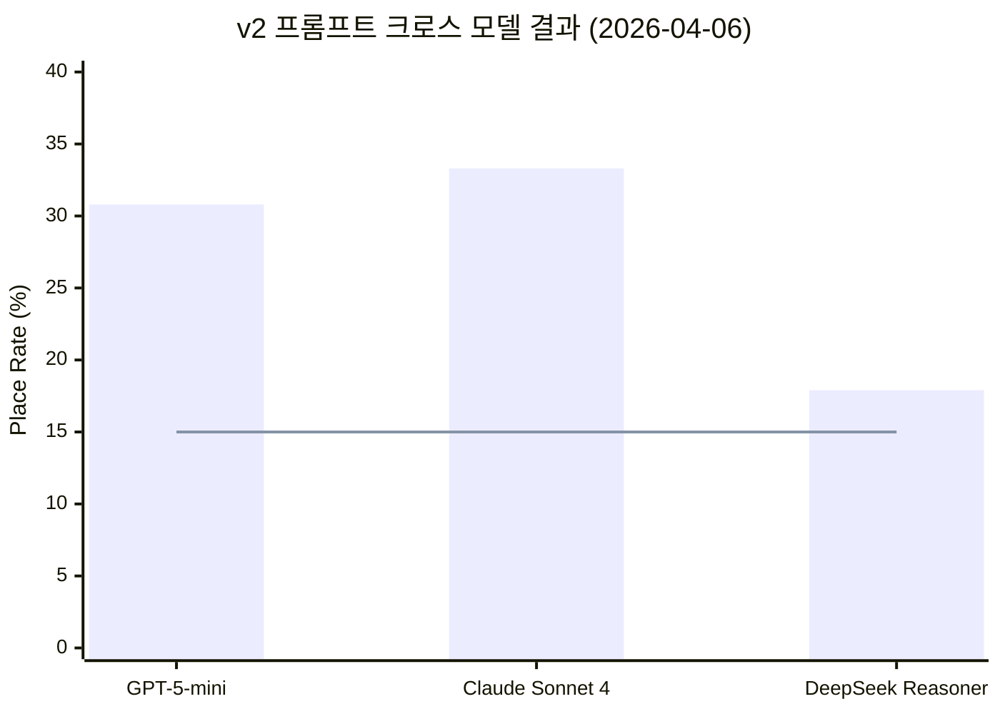

### B.4 비용 효율 비교 차트 (Place per Dollar)

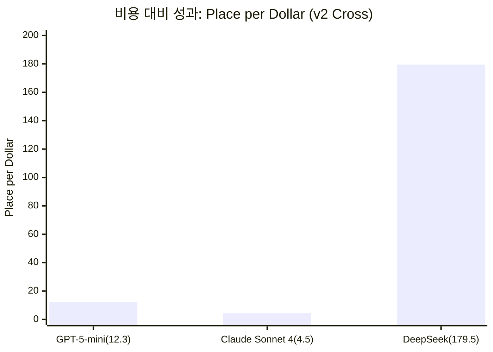

---

## 부록 C: 참조 문서 목록

| 문서 | 경로 | 내용 |
|------|------|------|
| AI Adapter 설계 | `docs/02-design/04-ai-adapter-design.md` | 모델 무관 공통 인터페이스 설계 |
| AI 프롬프트 템플릿 | `docs/02-design/08-ai-prompt-templates.md` | v0 프롬프트 원본 |
| DeepSeek 프롬프트 최적화 | `docs/02-design/15-deepseek-prompt-optimization.md` | v1 -> v2 최적화 설계 |
| 모델별 프롬프트 정책 | `docs/02-design/18-model-prompt-policy.md` | 4종 모델 프롬프트 전략 비교 |
| Round 4 토너먼트 보고서 | `docs/04-testing/37-3model-round4-tournament-report.md` | 3모델 대전 결과 |
| v2 크로스 모델 실험 | `docs/04-testing/38-v2-prompt-crossmodel-experiment.md` | v2 프롬프트 전이 효과 검증 |
| v2 프롬프트 코드 | `src/ai-adapter/src/prompt/v2-reasoning-prompt.ts` | v2 프롬프트 구현체 |