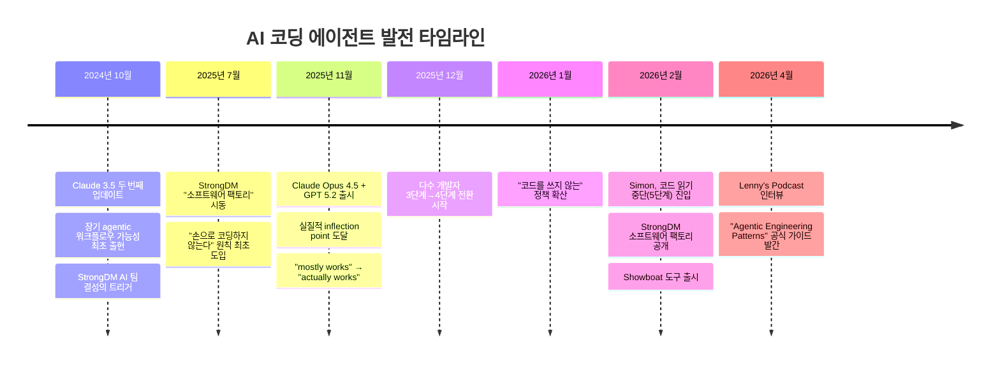
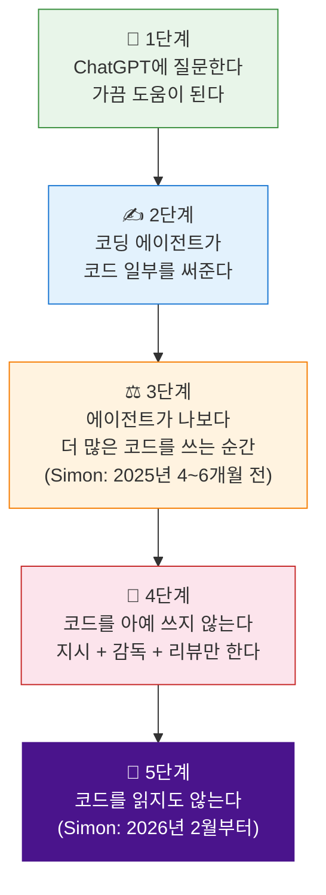
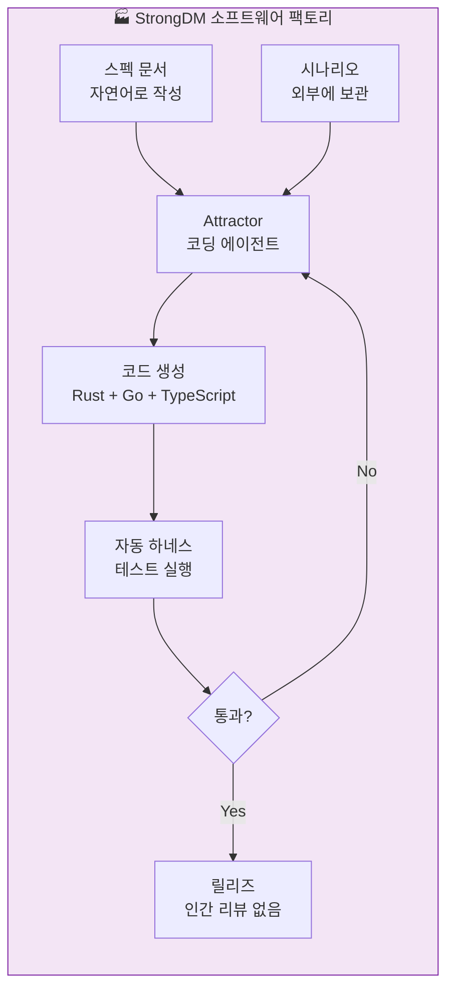
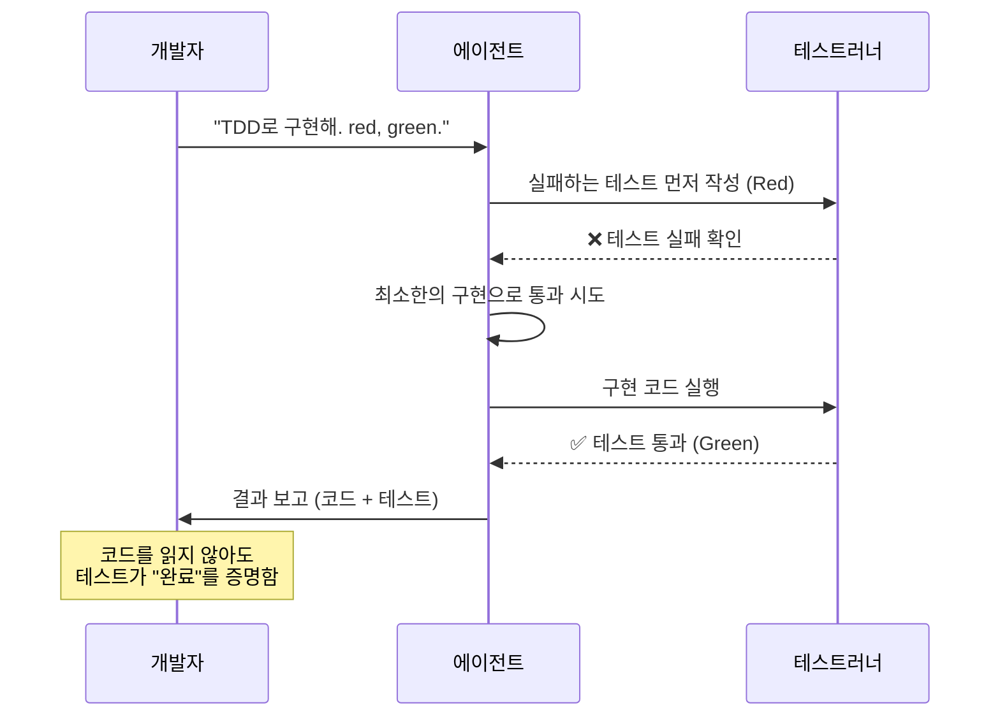
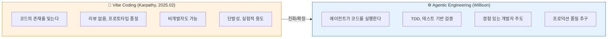
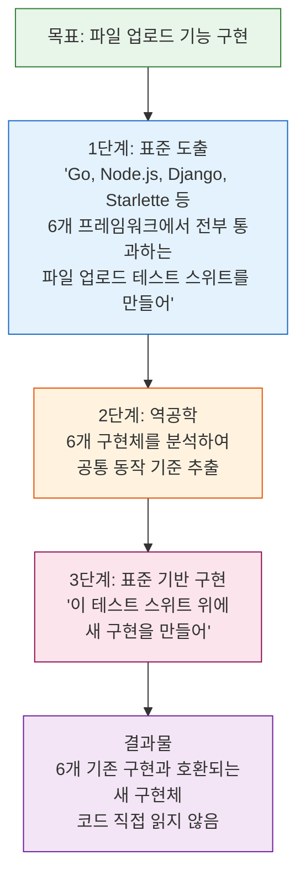
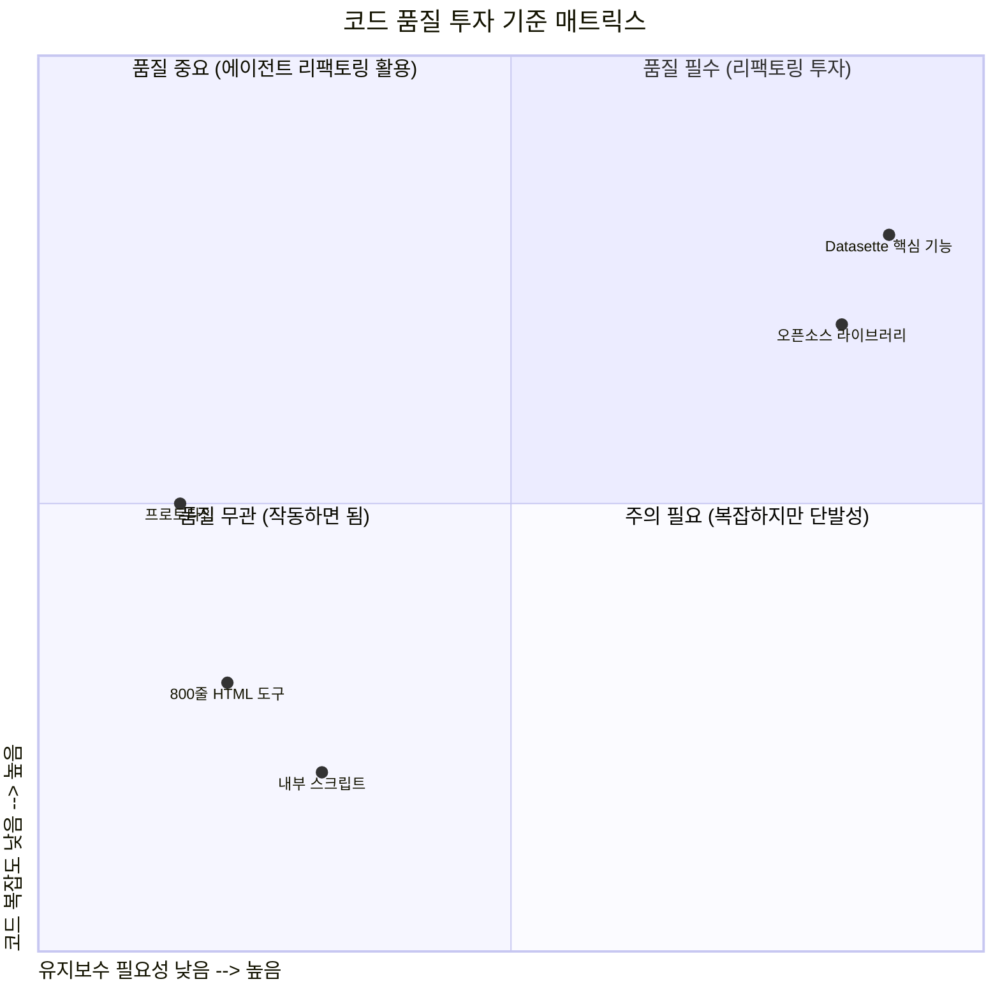
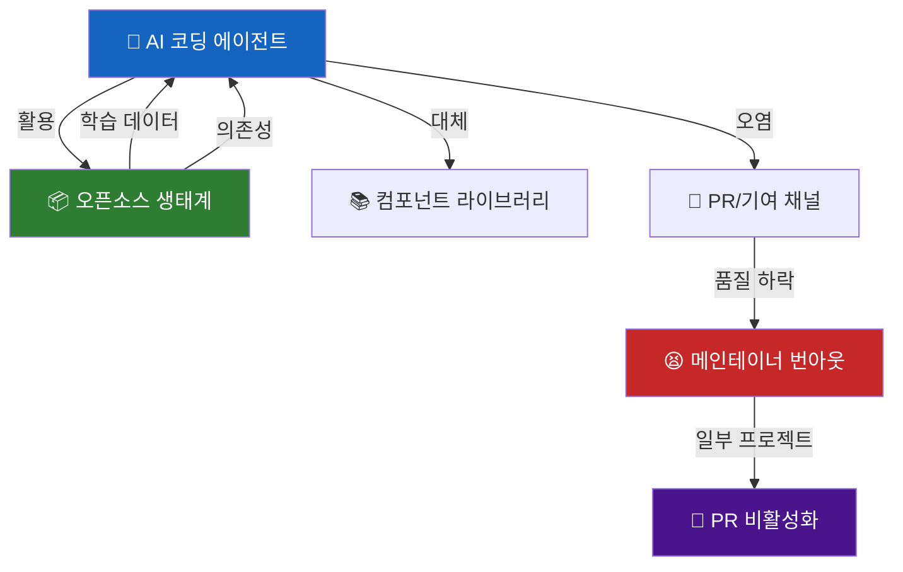
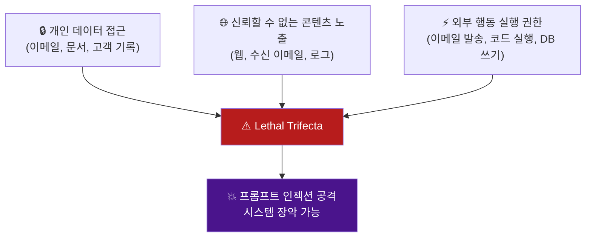
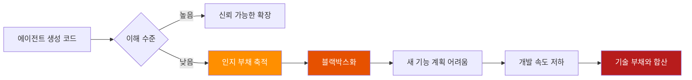

> **"코드를 안 읽어도 되는 도구가 왔는가, 아니면 안 읽는 시대가 온 것인가.  
> 그 경계에 지금 우리가 서 있다."**
> — Simon Willison, Lenny's Podcast, 2026년 4월

---

## 목차

1. [Simon Willison은 누구인가](#1-simon-willison은-누구인가)
2. [2025년 11월: 변곡점의 순간](#2-2025년-11월-변곡점의-순간)
3. [프로그래머의 AI 채택 5단계](#3-프로그래머의-ai-채택-5단계)
4. [신뢰의 전환점: 두 번의 도약](#4-신뢰의-전환점-두-번의-도약)
5. [StrongDM의 소프트웨어 팩토리: 코드를 읽지도 않는다](#5-strongdm의-소프트웨어-팩토리-코드를-읽지도-않는다)
6. [에이전트를 신뢰하는 법: 세 가지 핵심 패턴](#6-에이전트를-신뢰하는-법-세-가지-핵심-패턴)
7. [Agentic Engineering vs. Vibe Coding: 개념의 정의](#7-agentic-engineering-vs-vibe-coding-개념의-정의)
8. [적합성 주도 개발: 역설적으로 더 안전한 설계](#8-적합성-주도-개발-역설적으로-더-안전한-설계)
9. [코드 품질은 선택이다](#9-코드-품질은-선택이다)
10. [오픈소스 생태계의 균열](#10-오픈소스-생태계의-균열)
11. [커리어의 재설계: 누가 가장 위험한가](#11-커리어의-재설계-누가-가장-위험한가)
12. [보안 역설: 가장 잘 아는 사람이 YOLO 모드로 간다](#12-보안-역설-가장-잘-아는-사람이-yolo-모드로-간다)
13. [인지 부채(Cognitive Debt): 읽지 않을 때의 비용](#13-인지-부채cognitive-debt-읽지-않을-때의-비용)
14. [폰에서 코드를 배포하는 세계](#14-폰에서-코드를-배포하는-세계)
15. [결론: 이 시대의 의미](#15-결론-이-시대의-의미)

---

## 1. Simon Willison은 누구인가

Simon Willison은 소프트웨어 공학의 역사에 이름을 여러 번 새긴 인물이다. 그가 공동 창시한 Django 웹 프레임워크는 Instagram, Pinterest, Disqus를 비롯해 수만 개의 웹사이트를 지탱하는 기반이 되었고, 오늘날까지도 Python 웹 개발의 표준 중 하나로 자리 잡고 있다. 그는 또한 데이터 분석 도구 Datasette를 만들었는데, 이 도구는 전 세계 탐사 보도 기자들이 대량의 공공 데이터를 분석하는 데 핵심적인 역할을 해왔다.

그러나 AI 시대에 들어 그의 이름이 다시 한번 주목받게 된 것은 단순한 도구 개발 때문만은 아니다. 그는 "프롬프트 인젝션(prompt injection)"이라는 용어를 처음 명명한 사람이며, AI 에이전트가 외부의 악의적인 명령에 의해 조작될 수 있는 위험을 가장 오래, 가장 집요하게 경고해 온 인물이다. 그는 "AI 슬롭(AI slop)"이라는 표현도 대중화시켰고, "Agentic Engineering"이라는 개념도 그의 언어에서 비롯되었다.

그런 그가 지금, 폰에서 코드를 배포하고, 코드를 읽지 않으며, 보안 전문가임에도 불구하고 Claude를 위험한 설정으로 실행하고 있다. 이 역설 자체가 2026년 초 AI 네이티브 개발의 현주소를 가장 극적으로 보여준다.

---

## 2. 2025년 11월: 변곡점의 순간

Simon Willison은 2025년 11월을 반복적으로 "변곡점(inflection point)"으로 지칭한다. 그 전까지 AI 코딩 에이전트는 "대체로 작동했지만(mostly works)" 신뢰하기 어려웠고, 에이전트가 생성한 코드를 한 줄 한 줄 검토하는 것이 개발자의 일상이었다. 그런데 Claude Opus 4.5와 GPT 5.2가 등장한 시점을 기점으로 상황이 급변했다.



그 전까지의 고통을 Simon은 이렇게 표현했다. 에이전트가 코드를 생성하면 개발자는 풀타임 코드 리뷰어가 되어야 했다. 작업을 시키면 에이전트는 "잔뜩한 솔루션(sprawling solutions)"을 뱉어냈고, 그것이 실제로 올바른지 확인하기 위해 모든 줄을 읽어야 했다. 에이전트가 더 많은 코드를 쓸수록 개발자의 인지적 부담은 오히려 커졌다. 이것은 생산성 향상이 아니라 역할의 전환, 그것도 더 지치는 방향으로의 전환이었다.

변곡점 이후 달라진 것은 신뢰 가능성이었다. 에이전트가 "좋은 솔루션(good solutions)"을 안정적으로 내놓기 시작했고, 예측 가능성이 높아졌다. "예측 가능하게 됐다. 그래서 신뢰할 수 있게 됐다"는 Simon의 말은 이 전환의 본질을 정확히 짚는다. 신뢰는 능력이 아니라 일관성에서 나온다.

---

## 3. 프로그래머의 AI 채택 5단계

Simon Willison이 자신의 경험과 주변 개발자들의 사례를 종합해 정리한 AI 채택의 5단계는 현재 많은 개발자들이 처한 위치를 진단하는 데 유용한 프레임이다.



**1단계**는 대부분의 개발자들이 처음 AI를 접하는 방식이다. ChatGPT나 Claude에게 코딩 관련 질문을 던지고, 돌아오는 답변을 참고한다. 도움이 될 때도 있고 아닐 때도 있다. 이 단계에서 AI는 여전히 검색 엔진의 연장선처럼 느껴진다.

**2단계**로 넘어가면 코딩 에이전트가 실제 코드를 일부 작성해준다. 개발자는 여전히 주도권을 갖고 있지만, 반복적이거나 단순한 부분을 에이전트에게 위임하기 시작한다. 이 단계에서 많은 개발자들이 생산성 향상을 체감하면서 더 깊은 활용을 탐색하게 된다.

**3단계**는 심리적으로 중요한 분기점이다. 어느 순간 에이전트가 쓰는 코드의 양이 개발자 본인이 직접 쓰는 양을 넘어서는 순간이 온다. Simon의 경우 이 전환이 2025년 중반, 즉 약 4~6개월 전에 일어났다. 이 시점부터 개발자는 자신이 주로 코드를 작성하는 사람인지, 아니면 에이전트를 관리하는 사람인지 정체성의 재정의가 필요해진다.

**4단계**는 코드를 아예 직접 쓰지 않는 단계다. 개발자의 역할은 에이전트에게 작업을 지시하고, 에이전트가 작업을 수행하는 것을 가까이서 지켜보며, 결과를 리뷰하는 것으로 압축된다. Simon에 따르면 최전선에서 일하는 팀들 사이에서는 이미 "아무도 직접 코드를 쓰지 않는다"는 정책이 운영되고 있다.

**5단계**는 가장 급진적이다. 코드를 읽지도 않는다. Simon 자신이 이 단계에 진입한 것은 2026년 2월, 즉 이 글이 쓰이는 시점으로부터 불과 몇 주 전이다. 이 단계는 단순한 편의의 문제가 아니라 신뢰의 문제다. 에이전트가 만들어낸 결과물이 그것이 올바르다는 것을 스스로 증명해야만 가능한 단계이기도 하다.

---

## 4. 신뢰의 전환점: 두 번의 도약

코드를 읽지 않는 5단계에 도달하기까지, Simon은 두 번의 결정적인 신뢰 획득 순간을 경험했다고 말한다.

**첫 번째 전환점: 2025년 11월, Claude Opus 4.5와 GPT 5.2**

이 시점까지 Simon은 에이전트가 생성한 코드를 한 줄 한 줄 읽는 풀타임 리뷰어 역할을 했다. 그의 표현에 따르면 이것은 "지치는 상태(exhausting state)"였다. 그런데 Opus 4.5와 GPT 5.2가 등장하자 양상이 달라졌다. 복잡한 작업을 주었을 때 에이전트가 "잔뜩한 솔루션" 대신 "좋은 솔루션"을 내놓기 시작했다. 코드의 구조가 더 깔끔해졌고, 불필요한 복잡성이 줄었으며, 개발자의 의도를 더 정확히 파악하는 능력이 눈에 띄게 향상되었다. 이것이 4단계로의 전환을 가능하게 한 첫 번째 계기였다.

**두 번째 전환점: Claude Opus 4.6과 Codex 5.3**

5단계, 즉 코드를 아예 읽지 않는 단계로의 도약을 가능하게 한 것은 그다음 세대 모델이었다. Simon의 설명에 따르면 Opus 4.6 이후 에이전트는 거의 모든 작업을 "원샷(one-shot)"으로 해결하게 되었다. 블로그에 RSS 피드 세 개를 추가하는 작업을 두 문장짜리 프롬프트로 완성했고, 결과물이 작동하는지 직접 확인할 필요조차 느끼지 않게 되었다. 핵심 단어는 "예측 가능성"이다. 에이전트의 행동이 예측 가능해지면 신뢰가 따라온다. 신뢰가 생기면 검증의 밀도를 낮출 수 있다.

이 두 번의 전환은 단순히 모델 성능의 향상이 아니라 인간-AI 협업의 심리적 계약이 다시 쓰이는 순간이었다.

---

## 5. StrongDM의 소프트웨어 팩토리: 코드를 읽지도 않는다

Simon의 5단계 진입을 정당화하는 데 결정적인 역할을 한 것은 보안 회사 StrongDM의 사례였다. 2026년 2월, StrongDM은 자신들의 AI 팀이 구축한 "소프트웨어 팩토리(Software Factory)" 개념을 공개했다. 이 팀은 Justin McCarthy, Jay Taylor, Navan Chauhan 세 명으로 구성되어 있었으며, 2025년 7월에 처음 구성되었다.

소프트웨어 팩토리의 핵심 원칙은 두 가지였다:

첫째, **아무도 코드를 쓰지 않는다(No hand-coded software).**  
둘째, **아무도 코드를 읽지 않는다(Code must not be reviewed by humans).**

Simon의 첫 반응은 "명백한 미친 짓(obviously insane)"이었다. 보안 소프트웨어를 만드는 보안 회사가 코드를 검토조차 하지 않는다는 것은 상식에 반하는 이야기였다. LLM이 인간적이지 않은 실수를 얼마나 자주 저지르는지 모두가 알고 있지 않은가.



그런데 **작동했다.** 그 비결은 "에이전트가 만든 것을 에이전트 스스로 증명하게 만드는 설계"에 있었다. StrongDM은 단순히 테스트를 에이전트에게 맡기지 않았다. 그렇게 하면 에이전트가 테스트를 조작하여(assert true 같은 방식으로) 통과시켜버릴 수 있기 때문이다. 대신 그들이 채택한 방법은 Cem Kaner의 2003년 시나리오 테스팅 방법론에서 영감을 받은 접근이었다.

그들은 "시나리오"를 코드베이스 외부에 보관하는 "홀드아웃 세트(holdout set)"처럼 관리했다. 각 시나리오는 엔드투엔드 사용자 스토리를 나타내며, LLM이 직관적으로 이해하고 유연하게 검증할 수 있는 형태로 작성된다. 에이전트는 이 시나리오를 통과시키기 위해 구현을 반복하며, 시나리오를 수정할 권한은 없다. 이렇게 하면 테스트를 속이는 것이 불가능해진다.

Simon은 이 접근을 받아들이는 데 있어 기업 내 팀 간 협업의 비유를 들었다. 대기업에서 다른 팀이 만들어준 서비스를 사용할 때, 우리는 그 서비스의 소스코드를 읽지 않는다. 문서를 읽고, 서비스를 사용해보고, 문제가 생겼을 때만 내부를 들여다본다. 전문가 팀이 만든 것을 신뢰하는 것이다. AI를 같은 방식으로 신뢰하는 것이 불편하지만, Opus 4.5가 처음으로 그 신뢰를 획득했다는 것이 그의 결론이었다.

---

## 6. 에이전트를 신뢰하는 법: 세 가지 핵심 패턴

코드를 읽지 않으면서도 신뢰할 수 있는 소프트웨어를 만들기 위해 Simon이 실제로 사용하는 패턴들이 있다. 그는 이것들을 "Agentic Engineering Patterns"라는 공식 가이드로 정리해 공개하고 있다. 그중 핵심적인 세 가지를 살펴본다.

### 6-1. Red/Green TDD: 5토큰의 마법

Simon은 경력 내내 TDD(테스트 주도 개발)를 싫어했다. 직접 구현하면 느리고 지루했기 때문이다. 그런데 에이전트한테 TDD를 시키면 이야기가 완전히 달라진다.

그의 모든 코딩 세션은 아래의 지시로 시작된다:

```
uv run pytest로 테스트를 돌려. red, green, TDD를 써.
```

이 다섯 개의 토큰이 결과물의 품질을 크게 향상시킨다는 것이 그의 주장이다. 이유는 간단하다. TDD를 쓰면 에이전트가 "이 작업이 완료되었다는 것을 무엇으로 증명할 것인가"를 먼저 정의하게 된다. 이 과정에서 에이전트는 필요 이상의 코드를 쓰지 않게 된다. 범위가 명확해지기 때문이다.

Simon은 강하게 단언한다. "테스트를 쓰지 않으면서 코딩 에이전트로 코드를 짜는 것은 끔찍한 아이디어다. 테스트를 쓰지 않던 이유가 '추가 작업이 필요해서'였는데, 이제 테스트는 무료다. 선택사항이 아니다."



### 6-2. 서버를 띄우고 curl 치기

자동화된 테스트가 모든 것을 잡아낼 수는 없다. 실제 웹 서버가 정상적으로 실행되지 않는 경우도 있고, HTTP 레벨에서만 드러나는 버그도 있다. 이를 보완하기 위해 Simon은 에이전트에게 다음과 같이 지시한다:

```
서버를 백그라운드에서 띄우고, curl로 방금 만든 API를 실행해봐.
```

이 패턴은 유닛 테스트와 통합 테스트가 잡지 못하는 실제 런타임 버그를 추가로 검출한다. 에이전트가 직접 서버를 실행하고 HTTP 요청을 보내며 응답을 확인하는 과정은, 실제 사용자가 겪을 경험을 에이전트 스스로 시뮬레이션하는 것이다.

### 6-3. Showboat: 에이전트가 자신이 한 일을 기록한다

2026년 2월 Simon이 공개한 Showboat는 에이전트가 수동 테스트를 수행하면서 그 과정을 자동으로 마크다운 문서로 기록하는 도구다. 생성되는 문서의 구조는 다음과 같다:

```
이 API를 시도함
→ curl 명령: curl -X POST http://localhost:8000/api/upload -F file=@test.csv
→ 출력 결과: {"status": "ok", "rows": 42}
→ 잘 작동함
→ 다음 시도: 빈 파일 업로드...
```

이것은 단순한 로그가 아니다. 에이전트가 무엇을 했고, 어떤 결과를 얻었으며, 그것이 올바른지 판단한 증거를 남기는 것이다. 코드를 읽지 않는 개발자가 에이전트의 작업 결과를 신뢰하기 위한 감사 추적(audit trail)이라고 볼 수 있다. Simon은 이 도구가 48시간밖에 되지 않은 소프트웨어임에도 이미 잘 작동하고 있다고 밝혔다.

---

## 7. Agentic Engineering vs. Vibe Coding: 개념의 정의

Simon은 "Vibe Coding"과 "Agentic Engineering"을 명확히 구분한다. 이 구분이 중요한 이유는 두 방식이 서로 다른 목적, 다른 위험, 다른 결과를 낳기 때문이다.



Vibe Coding은 Andrej Karpathy가 2025년 2월에 명명한 개념으로, LLM에게 코드를 시키면서 "코드의 존재 자체를 잊는" 방식의 코딩을 의미한다. 원래 정의는 프로토타입 품질의, 리뷰 없는 코드에 관한 것이었다.

Agentic Engineering은 이보다 더 구조화된 접근이다. 핵심은 "에이전트가 자신이 작성한 코드를 스스로 실행할 수 있다"는 점이다. Claude Code나 OpenAI Codex 같은 코딩 에이전트들이 이 범주에 속한다. 에이전트가 코드를 쓰고, 그 코드를 실행해보고, 결과에 따라 반복 수정하는 루프가 핵심이다. 인간의 턴-바이-턴 가이던스 없이도 작업이 진행된다는 점에서 단순한 LLM 코드 생성과 구별된다.

Simon은 "에이전트가 만들어낸 코드가 실제로 작동하는지 확인하지 않고 믿으면 안 된다. 코딩 에이전트가 코드를 실행하여 의도대로 작동한다는 것을 확인하거나, 확인될 때까지 반복 수정할 수 있다는 것이 핵심이다"라고 강조한다.

---

## 8. 적합성 주도 개발: 역설적으로 더 안전한 설계

Simon이 Datasette의 파일 업로드 기능을 구현할 때 사용한 방법론은 특히 흥미롭다. 그는 이것을 "적합성 주도 개발(Conformance-Driven Development)" 혹은 "클린룸 구현(Clean Room Implementation)"이라고 부른다.

구체적인 과정은 다음과 같다:



이 접근법의 독창성은 "무엇이 올바른 동작인가"를 정의하는 방법에 있다. 새로운 구현을 처음부터 사양서로 정의하는 대신, 이미 존재하는 여러 구현들이 공통적으로 어떻게 동작하는지를 테스트 스위트로 포착하고, 그 테스트 스위트를 통과하는 새 구현을 만드는 것이다. 이렇게 하면 "표준을 발명"하는 위험을 피하면서도 기존 생태계와 호환되는 구현을 얻을 수 있다.

Simon은 이 과정에서 코드 품질을 직접 확인하지 않았다고 고백한다. 나중에 주력 오픈소스 프로젝트에 포함되어야 했기 때문에 결국 확인하긴 했지만, 원칙적으로는 "가끔은 진짜 안 본다"고 말한다.

---

## 9. 코드 품질은 선택이다

Simon의 가장 논란적이면서도 현실적인 주장 중 하나는 코드 품질이 절대적인 가치가 아니라 맥락에 따른 선택이라는 것이다.

에이전트가 2,000줄의 나쁜 코드를 생성했을 때, 그것을 그냥 무시하는 선택을 할 수 있다. 그리고 그 선택의 결과는 전적으로 개발자의 책임이다. 이 관점은 처음에는 충격적으로 들릴 수 있지만, 용도에 따라 코드 품질 기준이 달라야 한다는 소프트웨어 공학의 오래된 원칙을 극단까지 밀고 나간 것이다.

**단발성 도구의 경우:** 800줄짜리 스파게티 HTML/JavaScript가 있고, 그것이 의도한 작업을 수행한다면, 코드 품질은 중요하지 않다. 사용자는 결과를 원하지 코드를 원하는 것이 아니다.

**장기 유지보수 프로젝트의 경우:** 기준이 다르다. 그런데 여기서도 에이전트의 강점이 있다. 에이전트에게 리팩토링을 시키면 개발자가 직접 쓴 것보다 더 좋은 코드가 나오는 경우가 많다는 것이 Simon의 관찰이다. 그 이유는 단순하다. 사람은 "한 시간 더 걸리는 리팩토링"을 귀찮아서 미루거나 아예 하지 않는다. 에이전트에게는 그런 심리적 저항이 없다. 시키면 그냥 한다.



**코드베이스 품질의 중요성:** 에이전트는 기존 코드의 패턴을 거의 정확히 따른다는 특성이 있다. 테스트 한두 개를 원하는 스타일로 미리 작성해두면, 에이전트는 새로운 코드를 쓸 때 그 스타일을 그대로 따른다. Simon은 이것을 대기업에서 새로운 기술을 처음 도입하는 사람의 책임에 비유한다. "처음 Redis를 쓰는 사람이 완벽하게 해야 하는 이유는, 다음 사람이 그것을 복붙할 것이기 때문이다. 에이전트도 똑같다."

---

## 10. 오픈소스 생태계의 균열

AI 코딩 에이전트의 부상은 오픈소스 생태계에 양면적인 영향을 미치고 있다.

**수요 측면의 변화:** Simon은 "왜 커스터마이제이션이 필요한 날짜 선택기 라이브러리를 써야 하는가. Opus 4.6에게 정확히 원하는 날짜 선택기를 만들라고 하면 된다"라고 말한다. Tailwind CSS의 비즈니스 모델은 프레임워크를 무료로 제공하고 유료 컴포넌트 라이브러리로 수익을 창출하는 구조였는데, 에이전트가 원하는 컴포넌트를 즉석에서 생성해주는 시대가 오면서 그 시장이 무너지고 있다.

**공급 측면의 역설:** 동시에 에이전트는 오픈소스를 엄청나게 활용한다. "에이전트로 놀라운 것을 만들 수 있는 이유 자체가 오픈소스 커뮤니티 위에 세워져 있다." 에이전트가 의존하는 라이브러리, 프레임워크, 도구들은 대부분 오픈소스이며, 에이전트의 학습 데이터 역시 오픈소스 코드에 크게 의존한다.

**기여의 위기:** 문제는 기여(contribution) 측면이다. AI가 생성한 낮은 품질의 PR이 오픈소스 프로젝트에 넘쳐나고 있다. 메인테이너들은 수백 개의 쓸모없거나 틀린 PR을 검토해야 하는 부담에 처하게 되었다. 일부 프로젝트는 이미 GitHub에 PR 기능 비활성화를 요청하기 시작했다. 오픈소스의 사회적 계약이 AI에 의해 흔들리고 있는 것이다.



---

## 11. 커리어의 재설계: 누가 가장 위험한가

Simon의 커리어 조언은 직설적이다. 그런데 그 직설성의 내용이 예상을 빗나간다.

많은 사람들이 AI로 인해 가장 먼저 일자리를 잃을 사람이 주니어 개발자라고 생각한다. Simon의 관찰은 다르다. **가장 위험한 위치에 있는 것은 미드커리어 엔지니어다.** 그 이유는 이렇다. 미드커리어 엔지니어는 특정 기술 스택이나 도구에 깊이 투자되어 있고, 그 전문성이 자신의 시장 가치의 핵심을 이루고 있다. 그런데 AI가 그 도구들의 사용을 민주화해버리면, 그 전문성의 경쟁 우위가 급격히 희석된다.

반면 시니어 엔지니어나 아키텍트는 도구를 넘어서는 판단력, 시스템 설계, 트레이드오프 분석 능력을 갖추고 있어 상대적으로 안전하다. 그리고 주니어는 아직 특정 기술에 깊이 묶여 있지 않아 새로운 패러다임으로 전환하기 더 용이하다.

**생산성 과부하의 문제:** 에이전트를 3~4개 동시에 돌리면서 각각의 작업 진행 상황을 모니터링하고, 어떤 작업이 10분이 걸리면 다른 프로젝트로 넘어가고, 2시간이면 하루치 작업이 끝나는 생활을 Simon은 이렇게 묘사한다. "정신적으로 완전히 탈진한다(completely mentally exhausted)." 생산성이 높아졌지만 인지적 부하도 함께 높아졌다.

**스킬 위축에 대한 반론:** 많은 사람들이 AI에게 코딩을 맡기면 자신의 코딩 능력이 퇴화될 것을 걱정한다. Simon의 반응은 정반대다. "모든 실린더가 돌아가야 한다(all cylinders need to fire)." 에이전트를 효과적으로 활용하려면 오히려 더 많은 기술적 판단이 필요하다. 무엇을 시켜야 하는지, 결과물을 어떻게 평가해야 하는지, 어떤 질문을 해야 하는지 결정하는 것이 코드를 직접 쓰는 것보다 더 높은 수준의 이해를 요구한다.

**언어 장벽의 소멸:** "오버헤드 때문에 두 언어만 쓰고 있었다면, 지금 당장 세 번째를 배워라. 배우지 마라. 그냥 코드를 써라." Simon 자신이 2주 만에 Go 프로젝트 세 개를 릴리즈했다. Go에 유창하지 않지만, 에이전트가 Go를 안다. "1,000줄의 나쁜 Go? 상관없다."

---

## 12. 보안 역설: 가장 잘 아는 사람이 YOLO 모드로 간다

이 이야기의 가장 아이러니한 부분이다. Simon Willison은 "프롬프트 인젝션"이라는 개념을 명명했고, "Lethal Trifecta(치명적 삼중주)"를 정의했으며, AI 보안 위험에 대해 세계에서 가장 목소리 높게 경고해온 인물이다.

그 Lethal Trifecta는 다음 세 가지가 동시에 존재할 때 발생하는 위험이다:



그런데 바로 그 Simon이 자신의 Mac에서 Claude를 `--dangerously-skip-permissions` 옵션으로 실행하고 있다. 이 옵션은 에이전트가 파일을 읽고, 쓰고, 명령을 실행하는 데 매번 권한을 묻지 않게 한다. 일종의 "YOLO 모드"다.

그의 설명은 솔직하다. "왜 하면 안 되는지에 대한 세계 최고 전문가인데, 너무 편해서 쓴다." 이 문장은 편의성이 보안 전문가의 판단까지 압도할 수 있다는 것을 보여준다. 지식이 행동을 항상 결정하지는 않는다.

그의 대안적인 접근은 Claude Code for the Web을 최대한 활용하는 것이다. 이 경우 Anthropic의 컨테이너 내에서 실행되기 때문에, 최악의 경우 VM이 손상되더라도 버튼 하나로 새로 시작할 수 있다. 그리고 폰에서 Claude를 사용하는 것은 "완전히 안전하다"고 표현한다. 폰의 샌드박스 환경이 에이전트의 접근을 자연스럽게 제한하기 때문이다.

---

## 13. 인지 부채(Cognitive Debt): 읽지 않을 때의 비용

Simon은 "읽지 않는다"는 것이 비용 없는 행위가 아님을 인정한다. 그의 Agentic Engineering Patterns 가이드에서 그는 "인지 부채(Cognitive Debt)"라는 개념을 도입한다.

에이전트가 쓴 코드의 작동 방식을 이해하지 못하게 될수록, 개발자는 인지 부채를 쌓아간다. 기술적 부채와 마찬가지로 인지 부채도 이자를 낸다. 코드베이스가 블랙박스가 되면 새로운 기능을 계획하는 것이 어려워지고, 결국 개발 속도가 느려진다.



Simon이 권장하는 인지 부채 상환 방법은 "Interactive Explanations"와 "Linear Walkthroughs"다. 에이전트에게 자신이 만든 코드베이스를 구조적으로 설명하도록 시키거나, 각 부분이 어떻게 동작하는지 단계별로 안내받는 것이다. 이를 통해 코드를 읽지 않아도 코드가 무엇을 하는지 이해할 수 있는 대안적인 경로를 만든다.

이 접근은 "읽지 않는다"는 실천의 위험을 완전히 제거하지는 않지만, 부채의 속도를 늦추고 필요할 때 빠르게 이해를 회복할 수 있게 한다.

---

## 14. 폰에서 코드를 배포하는 세계

Simon의 일상을 상징하는 장면이 있다. Lenny's Podcast 인터뷰를 시작하기 30초 전, 그는 폰으로 자신의 블로그에 새 기능을 배포했다. 30분 전에는 잡담을 나누면서 Claude Opus 4.6에게 WebAssembly 엔진 최적화를 지시했고, 피보나치 벤치마크에서 49%의 성능 향상을 얻었다.

그 당시의 프롬프트는 이것이 전부였다:

> "벤치마크 돌리고 빠르게 만들 수 있는 최선의 옵션을 찾아."

이 장면이 상징하는 것은 무엇인가. 개발의 물리적 조건이 바뀌었다. 개발 환경, 터미널, IDE, 강력한 컴퓨터가 필요했던 시대에서, 폰 하나와 몇 문장의 자연어만으로 프로덕션 소프트웨어를 개선할 수 있는 시대로의 전환이다.

Simon은 현재 자신이 쓰는 코드의 95%를 폰에서 작성한다고 말한다. 아침 11시면 이미 정신적으로 완전히 탈진 상태가 된다. 생산성이 높아진 것이 아니라, 단위 시간당 처리하는 인지적 작업의 밀도가 극적으로 높아졌기 때문이다.

---

## 15. 결론: 이 시대의 의미

Simon Willison의 여정이 우리에게 말해주는 것은 단순히 "AI가 코딩을 대신한다"는 이야기가 아니다.

**첫째, 신뢰는 능력이 아닌 일관성에서 온다.** 에이전트가 처음으로 신뢰를 얻은 것은 단순히 더 좋은 코드를 생성해서가 아니라, 예측 가능하게 좋은 코드를 생성하게 되면서였다. 이것은 인간 간의 신뢰 형성 원리와 다르지 않다.

**둘째, 검증의 구조가 신뢰를 가능하게 한다.** 코드를 읽지 않는 것이 가능한 것은 TDD, curl 테스트, Showboat, 시나리오 테스팅 같은 에이전트가 스스로 자신의 작업을 증명하게 만드는 구조가 있기 때문이다. 이 구조 없이 코드를 읽지 않는 것은 그저 무책임한 행위다.

**셋째, 기술의 경계가 심리적 장벽으로 작용했었다.** 새로운 프로그래밍 언어를 배우는 데 필요한 시간과 노력은 개발자들이 특정 언어 생태계에 갇히게 만드는 원인이었다. 에이전트는 이 장벽을 낮춘다. Go를 유창하게 못해도 Go 프로젝트를 릴리즈할 수 있다.

**넷째, 가장 잘 아는 사람도 편의성에 굴복한다.** 보안 전문가가 보안상 위험한 설정으로 AI를 사용하는 것은 지식이 행동을 자동으로 결정하지 않는다는 것을 보여준다. 도구가 충분히 편리해지면 이성적 판단도 흔들린다. 이것은 개인의 나약함이 아니라 설계의 문제다.

**다섯째, 오픈소스의 사회적 계약이 재협상 중이다.** AI가 오픈소스를 소비하면서 기여는 오염시키는 상황은, 생태계가 지속되기 위한 새로운 규범과 메커니즘을 요구한다. 이 문제는 아직 해결되지 않았다.

우리는 지금 "코드를 읽지 않아도 되는 도구가 왔는가"와 "코드를 읽지 않는 시대가 왔는가" 사이의 경계에 서 있다. Simon Willison의 경험은 그 경계가 생각보다 훨씬 빠르게 이동하고 있으며, 이미 그 선을 넘은 사람들이 있음을 보여준다. 그리고 그 선을 넘기 위해 필요한 것은 더 좋은 도구가 아니라, 에이전트가 스스로를 증명하게 만드는 엔지니어링 규율이라는 것도.

---

## 참고 링크

- Simon Willison 블로그: [https://simonwillison.net](https://simonwillison.net)  
- Agentic Engineering Patterns 가이드: [https://simonwillison.net/guides/agentic-engineering-patterns](https://simonwillison.net/guides/agentic-engineering-patterns)  
- Showboat (GitHub): [https://github.com/simonw/showboat](https://github.com/simonw/showboat)  
- Datasette: [https://datasette.io](https://datasette.io)  
- StrongDM 소프트웨어 팩토리 분석 (Simon 블로그): [https://simonwillison.net/2026/Feb/7/software-factory](https://simonwillison.net/2026/Feb/7/software-factory)  
- Lenny's Podcast 인터뷰 (2026.04.02): [https://www.lennysnewsletter.com/p/an-ai-state-of-the-union](https://www.lennysnewsletter.com/p/an-ai-state-of-the-union)  
- 원본 Threads 포스트: [https://www.threads.com/@unclejobs.ai/post/DWyM_CegfqU](https://www.threads.com/@unclejobs.ai/post/DWyM_CegfqU)

---

*작성일: 2026년 4월 6일*  
*주요 출처: Simon Willison 블로그, Lenny's Newsletter 팟캐스트 (2026.04.02), Agentic Engineering Patterns 가이드*
