### Neo4j + FastAPI + Next.js | 온톨로지 | Microsoft Graph

```prompt
어떤 내용인지 아주 상세하게 설명해주세요. 가급적 서술형으로 작성해주세요. 최신 정보 검색해주세요.  마크다운으로 만들어 다운로드 받을 수 있게 해주세요. 문서가 길어져도 돼요. 도식화 필요하면 mermaid 이용해주세요

1. 팔란티어 Gotham 스타일 수사 프로파일링 시스템 — Neo4j + FastAPI + Next.js
2. 온톨로지
3. Microsoft Graph

```

---

> **작성 목적**: 인텔리전스·수사 분야에서 실제 사용되는 팔란티어 Gotham 플랫폼의 핵심 아키텍처를 분석하고, 동일한 철학을 Neo4j 그래프 DB, FastAPI 백엔드, Next.js 프론트엔드 오픈소스 스택으로 재현하는 방법과, 그 기반을 이루는 온톨로지 개념 및 Microsoft Graph와의 통합 방안을 심층적으로 서술합니다.

---

## 목차

1. [팔란티어 Gotham이란 무엇인가](#1-팔란티어-gotham이란-무엇인가)
2. [Gotham의 핵심 기능 해부](#2-gotham의-핵심-기능-해부)
3. [POLE 데이터 모델](#3-pole-데이터-모델)
4. [온톨로지(Ontology): 지식의 뼈대](#4-온톨로지ontology-지식의-뼈대)
5. [Neo4j: 그래프 데이터베이스 선택 이유](#5-neo4j-그래프-데이터베이스-선택-이유)
6. [FastAPI: 수사 플랫폼 백엔드](#6-fastapi-수사-플랫폼-백엔드)
7. [Next.js: Gotham 스타일 프론트엔드](#7-nextjs-gotham-스타일-프론트엔드)
8. [Microsoft Graph: M365 생태계와의 연결](#8-microsoft-graph-m365-생태계와의-연결)
9. [전체 시스템 통합 아키텍처](#9-전체-시스템-통합-아키텍처)
10. [보안과 접근 제어](#10-보안과-접근-제어)
11. [AI/ML 레이어 통합](#11-aiml-레이어-통합)
12. [윤리적 고려사항과 설계 원칙](#12-윤리적-고려사항과-설계-원칙)
13. [구현 로드맵](#13-구현-로드맵)

---

## 1. 팔란티어 Gotham이란 무엇인가

팔란티어 테크놀로지스(Palantir Technologies)가 2008년에 공개한 **Gotham**은 국방, 정보기관, 법 집행 기관을 위한 엔터프라이즈급 수사·분석 플랫폼이다. 이름은 배트맨의 가상 도시 고담(Gotham)에서 따온 것으로, 창설자 피터 틸(Peter Thiel)과 알렉스 카프(Alex Karp)는 "감시의 도시에서 데이터로 진실을 찾는다"는 메타포를 의도했다.

플랫폼의 핵심 철학은 놀랍도록 단순하다. **기관이 이미 보유한 데이터를 가져다 가장 작은 단위로 분해하고, 그 점들을 연결하는 것**이다. Gotham은 단순한 데이터베이스가 아니다. 다양한 기관에 분산되어 있고 서로 다른 형식으로 저장된 파편화된 데이터를 하나의 통합된, 검색 가능한 지식망으로 변환한다.

### 1.1 실제 사용 사례

2025년 11월, 영국 베드퍼드셔 경찰은 팔란티어의 도구(Nectar)를 사용해 £80만 파운드를 훔친 범죄 조직을 검거했다. 시스템은 루마니아어로 된 10만 건 이상의 문자 메시지를 영어로 번역·분석하고, 피의자들의 동선을 추적하며, 연루된 인물 간의 연결 차트를 자동으로 생성했다. 덴마크 경찰은 2017년부터 Gotham 기반의 POL-INTEL 예측 치안 프로젝트를 운영 중이며, 범죄율이 높은 지역을 식별하는 히트맵 시스템을 구축했다. 유럽 사법기관인 유로폴(Europol)도 이 시스템을 활용한다.

노르웨이 세관은 Gotham을 이용해 승객과 차량을 스크리닝한다. 입력 데이터로는 사전 화물 서류, 승객 명단, 국가 외환 거래 데이터베이스, 노르웨이 노동복지청 고용주·피고용인 등록부, 주주 등록부, InfoTorg를 통한 30개 이상의 공공 데이터베이스가 활용된다.

### 1.2 Gotham의 전략적 의의

Gotham이 강력한 이유는 기술 자체가 아니라 **데이터 통합 철학** 때문이다. 기존 정보기관 시스템들은 각기 다른 형식, 분류 체계, 접근 권한을 가진 수십 개의 사일로(silo)에 데이터를 저장했다. 수사관이 특정 인물에 대한 완전한 그림을 그리려면 수십 개의 시스템을 따로 조회해야 했고, 이 과정에서 중요한 연결 고리가 놓치는 경우가 많았다. Gotham은 이 과정을 몇 주에서 몇 시간으로 단축시킨다.

---

## 2. Gotham의 핵심 기능 해부

팔란티어 Gotham이 제공하는 분석 기능들은 다음의 핵심 모듈로 구성된다.

### 2.1 Object Explorer (객체 탐색기)

시스템의 모든 데이터는 '객체(Object)'로 표현된다. 사람, 장소, 사건, 물체, 보고서 등 모든 것이 명시적으로 정의된 타입을 가진 객체다. 수사관은 특정 인물, 차량, 전화번호, 주소 등 어떤 객체든 검색하고, 그것과 연결된 모든 관련 엔티티를 즉시 탐색할 수 있다. 이 시스템은 기관이 한 사람에 대해 아는 모든 것을 한 곳에 중앙집중화한다.

### 2.2 Graph (그래프 분석)

네트워크 분석 도구로, 수사관은 의심되는 갱단 구성원의 네트워크를 체포 기록과 번호판 리더 데이터를 사용해 매핑하거나, 특정 지역의 특정 신분 상태를 가진 인물을 식별하는 등의 작업을 할 수 있다. 그래프 시각화는 숨겨진 연결 고리를 발견하는 데 핵심적이다.

### 2.3 Dossier (도시에)

수사관이 동적 인텔리전스 제품을 생성하는 도구다. 노트를 작성하고, 다른 Gotham 애플리케이션의 주요 엔티티와 시각화 자료를 드래그 앤 드롭으로 조합해 맞춤형 프로파일 시트와 요약 보고서를 생성할 수 있다. 도시에에 삽입된 모든 데이터는 소스로의 동적 링크를 유지하며, 기반 데이터가 변경되면 자동으로 업데이트된다.

### 2.4 Map (지리공간 분석)

사건, 인물, 자산 등의 지리적 분포를 시각화하고, 이동 패턴을 추적하며, 특정 지역과 연관된 활동을 분석한다. 실시간 지도 위에 이벤트를 겹쳐 보여주는 기능이 포함된다.

### 2.5 Timeline (타임라인)

특정 인물이나 사건과 관련된 활동을 시간 순서대로 시각화한다. 알리바이 검증, 공모 패턴 발견, 사건 재구성 등에 활용된다.

### 2.6 접근 제어와 감사 로그

Gotham의 접근 통제 메커니즘은 여러 레이어에서 동시에 작동한다. 사용자는 전체 데이터셋에 대한 포괄적인 권한이 아니라, 분류 수준, 필요-알아야-할(need-to-know) 요건, 시간 제한 접근 창에 기반한 세분화된 제한을 받는다. 민감한 정보에 대한 모든 상호작용은 감사 로그로 기록되어 책임성을 확보하지만, 동시에 조직이 저장하고 주기적으로 검토해야 하는 방대한 양의 메타데이터를 생성한다.

---

## 3. POLE 데이터 모델

Gotham의 데이터 구조를 이해하는 핵심은 **POLE 모델**이다. POLE은 경찰 및 보안 관련 사용 사례에서 표준으로 사용되는 네 가지 기본 엔티티 유형을 정의한다.

```
POLE = Person + Object + Location + Event
```

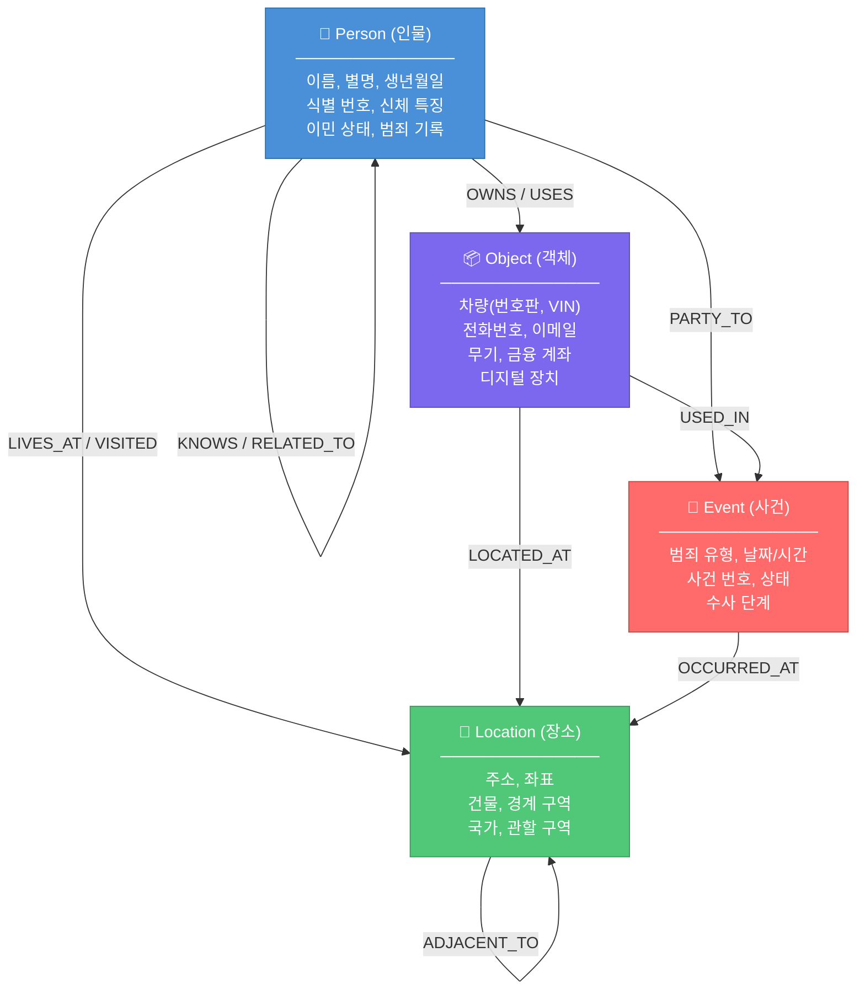

### 3.1 POLE 모델의 실제 적용

실제 범죄 수사에서 POLE 모델은 다음과 같이 적용된다. 마약 밀매 사건을 예로 들면, 용의자(Person)들은 서로 알고 있거나(KNOWS) 가족 관계(FAMILY_OF)일 수 있다. 그들이 사용하는 차량(Object)은 특정 주소(Location)에 등록되어 있으며, 특정 마약 거래 사건(Event)에서 목격된다. 전화(Object)들 간의 통화 기록(CDR)은 또 다른 연결망을 형성한다. 이 모든 관계가 그래프로 연결되었을 때, 수사관은 자신이 아직 몰랐던 공범의 존재를 자동으로 발견할 수 있다.

---

## 4. 온톨로지(Ontology): 지식의 뼈대

### 4.1 온톨로지의 정의

온톨로지는 특정 도메인에 대한 공유된 개념화(shared conceptualization)의 형식적이고 명시적인 명세(formal, explicit specification)이다. 개별 사실을 표현하는 것이 아니라, 지식이 어떻게 구조화되는지를 설명하는 엔티티의 유형, 관계, 제약 조건, 규칙을 정의한다. 온톨로지는 일관성, 명확성, 공유 이해를 보장하는 **의미적 청사진**으로 기능한다.

온톨로지를 한마디로 표현하면 "지식 그래프의 문법"이다. 지식 그래프가 실제 데이터를 담는 그릇이라면, 온톨로지는 그 그릇의 모양과 규칙을 정의한다.

### 4.2 온톨로지 vs 데이터베이스 스키마

온톨로지는 데이터베이스 스키마와 유사하지만, 훨씬 더 풍부한 의미론(semantics)을 제공한다.

| 비교 항목 | 데이터베이스 스키마 | 온톨로지 |
|---|---|---|
| **표현 방식** | 테이블, 컬럼, 키 | 클래스, 프로퍼티, 관계 |
| **의미론** | 구조적 제약만 | 논리적 추론 지원 |
| **추론** | 불가능 | 가능 (새로운 사실 도출) |
| **표준** | SQL DDL (벤더 종속) | OWL, RDF (W3C 표준) |
| **재사용성** | 낮음 | 높음 (공개 온톨로지 활용) |
| **상호운용성** | 어려움 | 설계 목표 |

### 4.3 OWL과 RDF: 온톨로지의 언어

온톨로지는 W3C(World Wide Web Consortium)가 표준화한 언어로 표현된다.

**RDF (Resource Description Framework)** 는 정보를 주어-서술어-목적어(Subject-Predicate-Object)의 트리플(Triple) 구조로 표현한다. 예를 들어 `홍길동 -- 근무처 --> 서울경찰청`이라는 문장이 하나의 트리플이다. RDF는 웹상의 리소스들 간의 관계를 기계가 읽을 수 있는 형태로 표현하는 기반 프레임워크다.

**OWL (Web Ontology Language)** 은 RDF를 기반으로 하지만 더 강력한 표현 능력과 논리적 형식주의를 제공한다. W3C가 개발한 시맨틱 웹 표준으로, OWL을 사용하면 "모든 수사관은 공무원이다"와 같은 공리(axiom)를 정의하고, 추론 엔진(reasoner)이 이로부터 새로운 지식을 자동으로 도출할 수 있다.

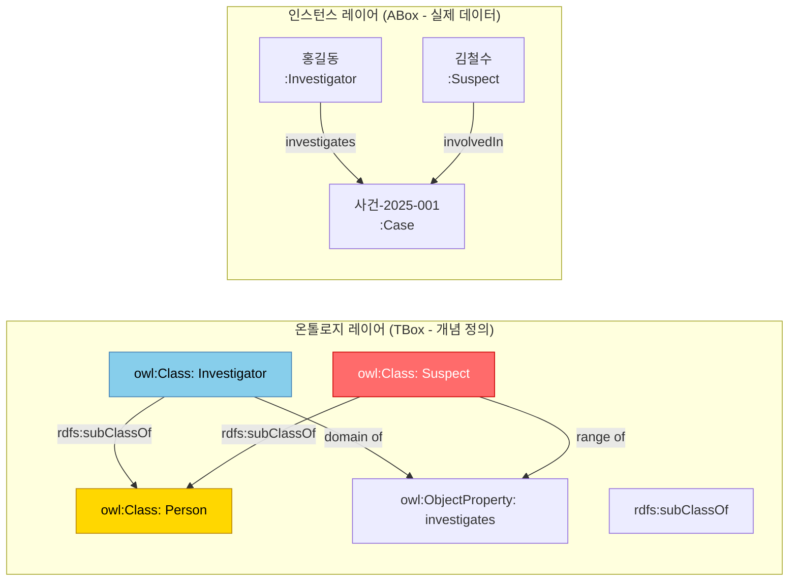

### 4.4 수사 도메인 온톨로지 예시 (OWL/Turtle 표기)

```turtle

# 클래스 정의
:Person a owl:Class .
:Suspect a owl:Class ;
    rdfs:subClassOf :Person .
:Victim a owl:Class ;
    rdfs:subClassOf :Person .
:Investigator a owl:Class ;
    rdfs:subClassOf :Person .

:Organization a owl:Class .
:CriminalOrganization a owl:Class ;
    rdfs:subClassOf :Organization .

:Event a owl:Class .
:Crime a owl:Class ;
    rdfs:subClassOf :Event .
:DrugCrime a owl:Class ;
    rdfs:subClassOf :Crime .

# 프로퍼티 정의
:knows a owl:ObjectProperty ;
    rdfs:domain :Person ;
    rdfs:range :Person .

:memberOf a owl:ObjectProperty ;
    rdfs:domain :Person ;
    rdfs:range :Organization .

:partOf a owl:ObjectProperty ;
    rdfs:domain :Event ;
    rdfs:range :Event .

# 제약 조건: 수사관은 범죄자일 수 없다
:Investigator owl:disjointWith :Suspect .
```

### 4.5 Palantir Ontology (팔란티어 온톨로지)

팔란티어는 자사 플랫폼 전반에 걸쳐 **Ontology**를 핵심 개념으로 채택했다. 팔란티어 Foundry와 AIP(Artificial Intelligence Platform)에서 온톨로지는 "운영 중인 비즈니스/도메인의 디지털 트윈"으로 기능한다. 실제 세계의 객체(Object), 행동(Action), 링크(Link)를 형식적으로 정의하고, AI 에이전트가 이 구조를 이해하고 안전하게 행동할 수 있는 기반을 제공한다.

팔란티어 Gotham에서 온톨로지는 다음과 같은 역할을 한다.

- **Object Type 정의**: Person, Vehicle, PhoneNumber, Address 등 모든 엔티티의 스키마를 중앙 레지스트리에서 관리한다
- **Link Type 정의**: KNOWS, OWNS, PARTY_TO 등 관계의 의미와 방향성을 명시적으로 정의한다
- **Action Type 정의**: 어떤 데이터에 어떤 작업을 수행할 수 있는지를 선언적으로 정의한다
- **접근 제어와의 통합**: 온톨로지 레벨에서 누가 어떤 Object Type에 접근할 수 있는지를 제어한다

### 4.6 온톨로지와 지식 그래프의 관계

온톨로지와 지식 그래프는 흔히 혼용되지만 서로 다른 개념이다. 온톨로지는 "어떤 종류의 것들이 존재하고 어떻게 개념적으로 관련되는가"를 정의하는 추상적·개념적 층이다. 지식 그래프는 온톨로지가 정의한 구조에 따라 실제 인스턴스 데이터를 담는 층이다. 현대 시스템에서 지식 그래프는 전반적인 프레임워크로 기능하며, 온톨로지는 지원하지만 필수적인 역할을 한다. 온톨로지는 개념적 스키마와 의미적 일관성을 제공하고, 지식 그래프는 확장 가능한 데이터 통합, 실세계 엔티티 모델링, 실용적 애플리케이션에 집중한다.

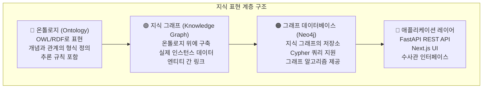

---

## 5. Neo4j: 그래프 데이터베이스 선택 이유

### 5.1 관계형 DB와 그래프 DB의 근본적 차이

수사 프로파일링에서 핵심 질문은 "이 두 사람이 어떻게 연결되어 있는가?" "이 범죄 조직의 구성원은 누구인가?"와 같은 **관계에 관한 질문**이다. 관계형 데이터베이스에서 이런 질문에 답하려면 수십 개의 테이블을 JOIN해야 하며, 데이터가 커질수록 성능이 급격히 저하된다.

Neo4j와 같은 그래프 데이터베이스는 관계를 일급 시민(first-class citizen)으로 취급한다. 연결은 저장소에 명시적인 엣지(Edge)로 저장되며, 쿼리 실행 시 관계를 계산하는 것이 아니라 이미 저장된 연결을 따라가기만 하면 된다. 이 덕분에 "A와 B 사이의 6단계 연결 경로 찾기" 같은 쿼리가 수억 건의 데이터에서도 밀리초 단위로 응답할 수 있다.

### 5.2 POLE 모델과 Neo4j

Neo4j의 레이블 속성 그래프(Labeled Property Graph) 모델은 POLE 데이터 모델과 자연스럽게 매핑된다.

```cypher
// Person 노드 생성
CREATE (p:Person {
    id: 'P-2025-001',
    name: '홍길동',
    dob: '1985-03-15',
    nationality: 'KR',
    riskScore: 7.5
})

// Vehicle Object 노드 생성
CREATE (v:Vehicle:Object {
    id: 'V-2025-001',
    plate: '서울12가3456',
    model: '현대 소나타',
    color: '검정'
})

// Location 노드 생성
CREATE (l:Location {
    id: 'L-2025-001',
    address: '서울시 마포구 합정동 123',
    lat: 37.5496,
    lng: 126.9139
})

// Crime Event 노드 생성
CREATE (c:Crime:Event {
    id: 'C-2025-001',
    type: '마약 밀매',
    reportedAt: datetime('2025-08-15T22:30:00'),
    status: '수사중'
})

// 관계 생성
MATCH (p:Person {id: 'P-2025-001'})
MATCH (v:Vehicle {id: 'V-2025-001'})
MATCH (l:Location {id: 'L-2025-001'})
MATCH (c:Crime {id: 'C-2025-001'})
CREATE (p)-[:OWNS {since: '2024-01-01'}]->(v)
CREATE (p)-[:PARTY_TO {role: '주범', arrestedAt: datetime()}]->(c)
CREATE (c)-[:OCCURRED_AT]->(l)
CREATE (v)-[:SEEN_AT {timestamp: datetime('2025-08-15T22:15:00')}]->(l)
```

### 5.3 핵심 Cypher 수사 쿼리

**경로 분석 (Path Analysis)**: 용의자 A와 피해자 B 사이의 연결 경로

```cypher
MATCH path = shortestPath(
    (suspect:Person {name: $suspectName})-[*..6]-(victim:Person {name: $victimName})
)
RETURN path, length(path) AS hops
ORDER BY hops ASC
LIMIT 5
```

**공범 네트워크 식별 (Community Detection)**:

```cypher
// 삼각형 분석으로 범죄 조직 핵심 멤버 식별
CALL gds.triangleCount.stream('crimeGraph')
YIELD nodeId, triangleCount
WHERE triangleCount > 0
MATCH (p:Person) WHERE id(p) = nodeId
RETURN p.name, triangleCount
ORDER BY triangleCount DESC
LIMIT 10
```

**유사 범행 수법 탐지 (Pattern Matching)**:

```cypher
MATCH (c1:Crime)-[:HAS_MO]->(mo:ModusOperandi)<-[:HAS_MO]-(c2:Crime)
WHERE c1 <> c2
  AND mo.weaponType = $weaponType
  AND mo.entryMethod = $entryMethod
  AND abs(duration.between(c1.occurredAt, c2.occurredAt).days) < 30
RETURN c1, c2, mo
ORDER BY c1.occurredAt DESC
```

**중심성 분석 (Betweenness Centrality)**: 범죄 네트워크의 핵심 연결자 식별

```cypher
CALL gds.betweenness.stream('suspectGraph')
YIELD nodeId, score
MATCH (p:Person) WHERE id(p) = nodeId
RETURN p.name, score AS centralityScore
ORDER BY centralityScore DESC
LIMIT 10
```

### 5.4 Neo4j GDS (Graph Data Science) 라이브러리

Neo4j의 Graph Data Science 라이브러리는 수사 분석에 직접 활용 가능한 알고리즘들을 제공한다.

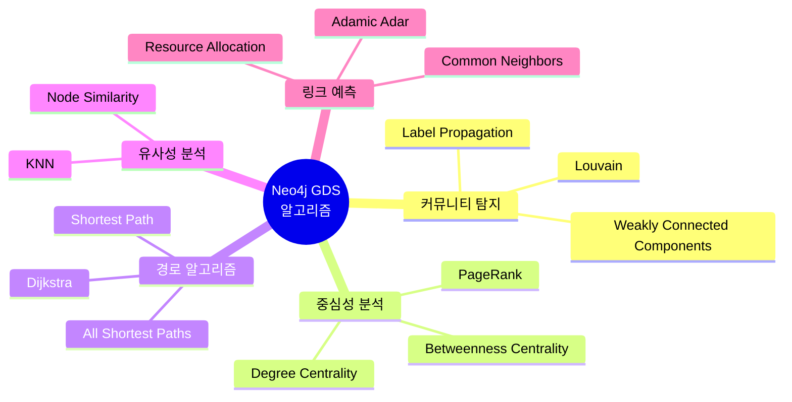

---

## 6. FastAPI: 수사 플랫폼 백엔드

### 6.1 FastAPI를 선택하는 이유

FastAPI는 Python 기반의 현대적인 웹 프레임워크로, 자동 OpenAPI 문서 생성, Pydantic을 통한 강력한 데이터 검증, 비동기(async/await) 지원을 제공한다. 수사 플랫폼에서 FastAPI가 적합한 이유는 복잡한 데이터 스키마를 명확하게 정의하고, 고성능 비동기 I/O로 Neo4j와의 대용량 그래프 쿼리를 효율적으로 처리할 수 있기 때문이다.

### 6.2 프로젝트 구조

```
investigation-platform/
├── app/
│   ├── api/
│   │   ├── v1/
│   │   │   ├── endpoints/
│   │   │   │   ├── persons.py        # 인물 CRUD
│   │   │   │   ├── cases.py          # 사건 관리
│   │   │   │   ├── graph.py          # 그래프 분석
│   │   │   │   ├── search.py         # 통합 검색
│   │   │   │   └── intelligence.py   # AI 인텔리전스
│   │   │   └── router.py
│   ├── core/
│   │   ├── config.py                 # 환경 설정
│   │   ├── security.py               # JWT / RBAC
│   │   └── logging.py                # 감사 로그
│   ├── db/
│   │   ├── neo4j.py                  # Neo4j 연결
│   │   └── redis.py                  # 캐시 레이어
│   ├── models/
│   │   ├── person.py                 # Pydantic 모델
│   │   ├── case.py
│   │   └── graph.py
│   ├── services/
│   │   ├── graph_service.py          # 그래프 분석 서비스
│   │   ├── ontology_service.py       # 온톨로지 관리
│   │   └── ms_graph_service.py       # Microsoft Graph 통합
│   └── main.py
├── tests/
├── docker-compose.yml
└── requirements.txt
```

### 6.3 핵심 API 엔드포인트 구현

```python
# app/api/v1/endpoints/graph.py
from fastapi import APIRouter, Depends, HTTPException
from app.db.neo4j import get_neo4j_session
from app.core.security import require_role
from app.models.graph import PathAnalysisRequest, NetworkAnalysisResponse
from neo4j import AsyncSession
import logging

router = APIRouter(prefix="/graph", tags=["Graph Analysis"])
audit_logger = logging.getLogger("audit")

async def find_connection_path(
    request: PathAnalysisRequest,
    session: AsyncSession = Depends(get_neo4j_session),
    current_user = Depends(require_role(["INVESTIGATOR", "ANALYST"]))
):
    """
    두 엔티티 간의 최단 연결 경로를 분석합니다.
    감사 로그: 모든 쿼리는 사용자 ID, 대상, 타임스탬프와 함께 기록됩니다.
    """
    audit_logger.info(
        f"PATH_ANALYSIS | user={current_user.id} | "
        f"source={request.source_id} | target={request.target_id}"
    )
    
    query = """
    MATCH path = shortestPath(
        (source {id: $source_id})-[*..%d]-(target {id: $target_id})
    )
    RETURN 
        [node IN nodes(path) | {
            id: node.id,
            labels: labels(node),
            name: coalesce(node.name, node.plate, node.address),
            properties: properties(node)
        }] AS nodes,
        [rel IN relationships(path) | {
            type: type(rel),
            properties: properties(rel)
        }] AS relationships,
        length(path) AS hops
    ORDER BY hops ASC
    LIMIT 5
    """ % request.max_hops
    
    result = await session.run(query, 
        source_id=request.source_id,
        target_id=request.target_id
    )
    
    paths = []
    async for record in result:
        paths.append({
            "nodes": record["nodes"],
            "relationships": record["relationships"],
            "hops": record["hops"]
        })
    
    if not paths:
        raise HTTPException(
            status_code=404, 
            detail=f"{request.max_hops}단계 이내에 연결 경로를 찾을 수 없습니다"
        )
    
    return {"paths": paths, "analyzed_by": current_user.id}


async def get_criminal_community(
    person_id: str,
    depth: int = 2,
    min_connections: int = 3,
    session: AsyncSession = Depends(get_neo4j_session),
    current_user = Depends(require_role(["INVESTIGATOR"]))
):
    """
    특정 인물을 중심으로 한 범죄 네트워크 커뮤니티를 분석합니다.
    """
    query = """
    MATCH (center:Person {id: $person_id})
    CALL gds.bfs.stream('crimeGraph', {
        sourceNode: id(center),
        maxDepth: $depth
    })
    YIELD path
    WITH nodes(path) AS communityNodes
    UNWIND communityNodes AS member
    WITH DISTINCT member
    MATCH (member)-[r]-(connected:Person)
    WHERE connected IN communityNodes
    WITH member, count(r) AS connectionCount
    WHERE connectionCount >= $min_connections
    RETURN member {
        .id, .name, .riskScore,
        connectionCount: connectionCount
    }
    ORDER BY connectionCount DESC
    """
    
    result = await session.run(query,
        person_id=person_id,
        depth=depth,
        min_connections=min_connections
    )
    
    members = [record["member"] async for record in result]
    return {"community_members": members, "center_id": person_id}
```

### 6.4 온톨로지 서비스

```python
# app/services/ontology_service.py
from typing import Dict, List, Any
from pydantic import BaseModel

class ObjectTypeDefinition(BaseModel):
    """온톨로지에서 정의된 객체 타입"""
    name: str
    parent_type: str | None = None
    properties: Dict[str, str]  # property_name -> type
    allowed_link_types: List[str]

class OntologyService:
    """
    Gotham 스타일 온톨로지 관리 서비스.
    객체 타입, 링크 타입, 액션 타입을 중앙에서 관리합니다.
    """
    
    INVESTIGATION_ONTOLOGY = {
        "object_types": {
            "Person": ObjectTypeDefinition(
                name="Person",
                properties={
                    "id": "string",
                    "name": "string",
                    "dob": "date",
                    "nationality": "string",
                    "riskScore": "float"
                },
                allowed_link_types=["KNOWS", "RELATED_TO", "PARTY_TO", "OWNS", "LIVES_AT"]
            ),
            "Suspect": ObjectTypeDefinition(
                name="Suspect",
                parent_type="Person",
                properties={
                    "criminalRecord": "boolean",
                    "aliases": "list[string]",
                    "threatLevel": "enum[LOW, MEDIUM, HIGH, CRITICAL]"
                },
                allowed_link_types=["KNOWS", "PARTY_TO", "MEMBER_OF", "USES"]
            ),
            "Vehicle": ObjectTypeDefinition(
                name="Vehicle",
                properties={
                    "plate": "string",
                    "model": "string",
                    "color": "string",
                    "registeredTo": "string"
                },
                allowed_link_types=["SEEN_AT", "USED_IN", "OWNED_BY"]
            ),
        },
        "link_types": {
            "KNOWS": {"symmetric": True, "properties": {"since": "date"}},
            "PARTY_TO": {"symmetric": False, "properties": {"role": "string", "confidence": "float"}},
            "MEMBER_OF": {"symmetric": False, "properties": {"joinedAt": "date", "rank": "string"}},
        }
    }
    
    def validate_entity(self, entity_type: str, properties: Dict) -> bool:
        """엔티티가 온톨로지 정의에 부합하는지 검증"""
        type_def = self.INVESTIGATION_ONTOLOGY["object_types"].get(entity_type)
        if not type_def:
            return False
        # 필수 프로퍼티 검증
        required = {k for k, v in type_def.properties.items() if "required" in v}
        return required.issubset(properties.keys())
    
    def get_allowed_relationships(self, source_type: str, target_type: str) -> List[str]:
        """두 엔티티 유형 간에 허용된 관계 타입 목록 반환"""
        source_def = self.INVESTIGATION_ONTOLOGY["object_types"].get(source_type)
        if not source_def:
            return []
        return source_def.allowed_link_types
```

---

## 7. Next.js: Gotham 스타일 프론트엔드

### 7.1 UI 아키텍처 철학

팔란티어 Gotham의 UI는 "분석가가 데이터를 탐험하는 도구"다. 단순한 CRUD 인터페이스가 아니라, 복잡한 관계망을 시각적으로 탐색하고, 가설을 수립하며, 인텔리전스 제품을 생성하는 워크스페이스다. Next.js를 선택하는 이유는 서버 사이드 렌더링(SSR)으로 초기 로딩 성능을 확보하고, App Router로 복잡한 분석 워크플로우를 표현하며, React Server Components로 무거운 그래프 데이터를 효율적으로 처리할 수 있기 때문이다.

### 7.2 핵심 컴포넌트 구조

```
src/
├── app/
│   ├── workspace/              # 메인 분석 워크스페이스
│   │   ├── graph/             # 그래프 탐색 뷰
│   │   ├── map/               # 지리공간 뷰
│   │   ├── timeline/          # 타임라인 뷰
│   │   ├── dossier/           # 도시에(프로파일) 뷰
│   │   └── search/            # 통합 검색
│   ├── cases/                 # 사건 관리
│   └── admin/                 # 시스템 관리
├── components/
│   ├── graph/
│   │   ├── GraphCanvas.tsx    # vis.js / D3 기반 그래프
│   │   ├── NodePanel.tsx      # 노드 상세 정보 패널
│   │   └── EdgeInspector.tsx  # 엣지(관계) 검사기
│   ├── map/
│   │   └── IntelligenceMap.tsx # Mapbox/Leaflet 지도
│   ├── timeline/
│   │   └── EventTimeline.tsx  # 이벤트 타임라인
│   └── dossier/
│       └── ProfileDossier.tsx # 개인 프로파일 문서
└── lib/
    ├── api/                   # FastAPI 클라이언트
    └── graph/                 # 그래프 유틸리티
```

### 7.3 그래프 시각화 컴포넌트

```tsx
// components/graph/GraphCanvas.tsx
'use client';

import { useEffect, useRef, useCallback } from 'react';
import * as d3 from 'd3';
import { GraphData, GraphNode, GraphEdge } from '@/types/graph';

interface GraphCanvasProps {
    data: GraphData;
    onNodeClick: (node: GraphNode) => void;
    onEdgeClick: (edge: GraphEdge) => void;
    highlightPaths?: string[][];
}

export function GraphCanvas({ data, onNodeClick, onEdgeClick, highlightPaths }: GraphCanvasProps) {
    const svgRef = useRef<SVGSVGElement>(null);
    
    const NODE_COLORS: Record<string, string> = {
        Person: '#4A90D9',
        Suspect: '#FF6B6B',
        Vehicle: '#7B68EE',
        Location: '#50C878',
        Crime: '#FF8C00',
        Organization: '#FFD700',
    };
    
    useEffect(() => {
        if (!svgRef.current || !data.nodes.length) return;
        
        const svg = d3.select(svgRef.current);
        const width = svgRef.current.clientWidth;
        const height = svgRef.current.clientHeight;
        
        svg.selectAll('*').remove();
        
        // 힘 방향 레이아웃 시뮬레이션
        const simulation = d3.forceSimulation(data.nodes as any)
            .force('link', d3.forceLink(data.edges)
                .id((d: any) => d.id)
                .distance(100)
            )
            .force('charge', d3.forceManyBody().strength(-300))
            .force('center', d3.forceCenter(width / 2, height / 2))
            .force('collision', d3.forceCollide().radius(40));
        
        // 엣지(관계) 렌더링
        const link = svg.append('g')
            .selectAll('line')
            .data(data.edges)
            .join('line')
            .attr('stroke', (d) => {
                // 하이라이트된 경로인지 확인
                const isHighlighted = highlightPaths?.some(path => 
                    path.includes(d.source as string) && path.includes(d.target as string)
                );
                return isHighlighted ? '#FFD700' : '#94a3b8';
            })
            .attr('stroke-width', (d) => d.weight ? Math.sqrt(d.weight) : 1.5)
            .attr('marker-end', 'url(#arrowhead)')
            .on('click', (event, d) => onEdgeClick(d));
        
        // 관계 레이블
        const linkLabel = svg.append('g')
            .selectAll('text')
            .data(data.edges)
            .join('text')
            .text(d => d.type)
            .attr('font-size', '10px')
            .attr('fill', '#64748b')
            .attr('text-anchor', 'middle');
        
        // 노드 렌더링
        const node = svg.append('g')
            .selectAll('circle')
            .data(data.nodes)
            .join('circle')
            .attr('r', (d) => d.riskScore ? 10 + d.riskScore : 15)
            .attr('fill', (d) => NODE_COLORS[d.primaryLabel] || '#94a3b8')
            .attr('stroke', '#fff')
            .attr('stroke-width', 2)
            .style('cursor', 'pointer')
            .on('click', (event, d) => onNodeClick(d))
            .call(d3.drag<SVGCircleElement, any>()
                .on('start', (event, d) => { 
                    if (!event.active) simulation.alphaTarget(0.3).restart(); 
                    d.fx = d.x; d.fy = d.y; 
                })
                .on('drag', (event, d) => { d.fx = event.x; d.fy = event.y; })
                .on('end', (event, d) => { 
                    if (!event.active) simulation.alphaTarget(0); 
                    d.fx = null; d.fy = null; 
                })
            );
        
        // 노드 레이블
        const nodeLabel = svg.append('g')
            .selectAll('text')
            .data(data.nodes)
            .join('text')
            .text(d => d.name || d.id)
            .attr('font-size', '12px')
            .attr('fill', '#1e293b')
            .attr('dy', '2.5em')
            .attr('text-anchor', 'middle');
        
        simulation.on('tick', () => {
            link
                .attr('x1', (d: any) => d.source.x)
                .attr('y1', (d: any) => d.source.y)
                .attr('x2', (d: any) => d.target.x)
                .attr('y2', (d: any) => d.target.y);
            
            linkLabel
                .attr('x', (d: any) => (d.source.x + d.target.x) / 2)
                .attr('y', (d: any) => (d.source.y + d.target.y) / 2);
            
            node
                .attr('cx', (d: any) => d.x)
                .attr('cy', (d: any) => d.y);
            
            nodeLabel
                .attr('x', (d: any) => d.x)
                .attr('y', (d: any) => d.y);
        });
        
        return () => simulation.stop();
    }, [data, highlightPaths]);
    
    return (
        <div className="relative w-full h-full bg-slate-950 rounded-lg overflow-hidden">
            {/* Gotham 스타일 어두운 배경 */}
            <svg ref={svgRef} className="w-full h-full" />
            
            {/* 범례 */}
            <div className="absolute bottom-4 left-4 bg-slate-900/90 rounded-lg p-3 text-xs">
                {Object.entries(NODE_COLORS).map(([type, color]) => (
                    <div key={type} className="flex items-center gap-2 mb-1">
                        <div className="w-3 h-3 rounded-full" style={{ backgroundColor: color }} />
                        <span className="text-slate-300">{type}</span>
                    </div>
                ))}
            </div>
        </div>
    );
}
```

---

## 8. Microsoft Graph: M365 생태계와의 연결

### 8.1 Microsoft Graph란 무엇인가

Microsoft Graph는 Microsoft 클라우드 서비스의 게이트웨이다. 단일 엔드포인트(`https://graph.microsoft.com`)를 통해 Microsoft 365, Windows, Enterprise Mobility + Security 전반의 데이터와 인사이트에 접근할 수 있다. "Graph"라는 이름은 수학의 그래프 이론(Graph Theory)에서 유래했다. Microsoft 365의 모든 엔티티(사용자, 그룹, 파일, 메일, 캘린더 등)와 그들 간의 관계를 그래프로 표현하는 데이터 모델에서 비롯된 것이다.

Microsoft Graph API는 REST API와 클라이언트 라이브러리로 다음 서비스에 접근한다.

- **Microsoft 365 핵심 서비스**: Bookings, Calendar, Excel, OneDrive, OneNote, Outlook/Exchange, Planner, SharePoint, Teams, To Do
- **보안 서비스**: Advanced Threat Protection, Microsoft Entra(구 Azure AD), Identity Manager, Intune
- **Windows 서비스**: Activities, Devices, Notifications, Universal Print

### 8.2 Microsoft Graph의 데이터 모델

Microsoft Graph는 OData(Open Data Protocol) 기반의 데이터 모델을 사용한다. 메타데이터 문서(`$metadata`)는 서비스 루트에 게시되며, 리소스와 관계의 데이터 모델 전체를 이해하는 데 활용된다. 모든 엔티티는 `id` 프로퍼티를 가지며, 관계(NavigationProperty)를 통해 연관 리소스로 이동할 수 있다.

```
GET https://graph.microsoft.com/v1.0/users/{user-id}
GET https://graph.microsoft.com/v1.0/users/{user-id}/manager
GET https://graph.microsoft.com/v1.0/users/{user-id}/directReports
GET https://graph.microsoft.com/v1.0/users/{user-id}/memberOf
GET https://graph.microsoft.com/v1.0/users/{user-id}/messages
GET https://graph.microsoft.com/v1.0/users/{user-id}/drive/root/children
```

이 관계 기반 내비게이션 구조가 Microsoft Graph를 단순한 API 집합이 아닌 **진정한 그래프**로 만들어 주는 특성이다.

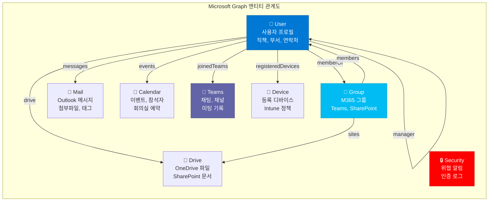

### 8.3 수사 플랫폼과 Microsoft Graph 통합 시나리오

기업 내부 수사 또는 내부 위협(Insider Threat) 탐지 시나리오에서 Microsoft Graph는 강력한 데이터 소스가 된다. 예를 들어 "퇴사 예정 직원이 대량의 파일을 외부로 전송하고 있는가?"를 탐지하려면 OneDrive 활동 로그, 메일 발신 패턴, Teams 메시지 등 여러 M365 서비스의 데이터를 통합 분석해야 한다.

```python
# app/services/ms_graph_service.py
import httpx
from azure.identity.aio import ClientSecretCredential
from typing import Dict, List, Any

class MicrosoftGraphService:
    """
    Microsoft Graph API 통합 서비스.
    M365 데이터를 Neo4j 수사 그래프와 연결합니다.
    """
    
    GRAPH_BASE_URL = "https://graph.microsoft.com/v1.0"
    
    def __init__(self, tenant_id: str, client_id: str, client_secret: str):
        self.credential = ClientSecretCredential(
            tenant_id=tenant_id,
            client_id=client_id,
            client_secret=client_secret
        )
    
    async def get_access_token(self) -> str:
        token = await self.credential.get_token(
            "https://graph.microsoft.com/.default"
        )
        return token.token
    
    async def get_user_profile(self, user_id: str) -> Dict:
        """사용자의 M365 프로파일 정보 조회"""
        token = await self.get_access_token()
        async with httpx.AsyncClient() as client:
            response = await client.get(
                f"{self.GRAPH_BASE_URL}/users/{user_id}",
                headers={
                    "Authorization": f"Bearer {token}",
                    "Content-Type": "application/json"
                },
                params={
                    "$select": "id,displayName,jobTitle,department,"
                               "officeLocation,mail,mobilePhone,"
                               "userPrincipalName,accountEnabled"
                }
            )
            response.raise_for_status()
            return response.json()
    
    async def get_user_org_chart(self, user_id: str) -> Dict:
        """사용자의 조직도 (매니저, 직속 부하) 조회"""
        token = await self.get_access_token()
        headers = {"Authorization": f"Bearer {token}"}
        
        async with httpx.AsyncClient() as client:
            # 배치 요청으로 한 번에 조회
            batch_payload = {
                "requests": [
                    {
                        "id": "1",
                        "method": "GET",
                        "url": f"/users/{user_id}/manager"
                    },
                    {
                        "id": "2",
                        "method": "GET",
                        "url": f"/users/{user_id}/directReports"
                    },
                    {
                        "id": "3",
                        "method": "GET",
                        "url": f"/users/{user_id}/memberOf?$top=50"
                    }
                ]
            }
            
            response = await client.post(
                f"{self.GRAPH_BASE_URL}/$batch",
                headers=headers,
                json=batch_payload
            )
            return response.json()
    
    async def get_user_drive_activities(
        self, 
        user_id: str, 
        start_date: str,
        end_date: str
    ) -> List[Dict]:
        """
        사용자의 OneDrive 파일 활동 기록 조회.
        대량 파일 다운로드, 공유 등의 이상 행동 탐지에 활용.
        """
        token = await self.get_access_token()
        async with httpx.AsyncClient() as client:
            response = await client.get(
                f"{self.GRAPH_BASE_URL}/users/{user_id}/drive/activities",
                headers={"Authorization": f"Bearer {token}"},
                params={
                    "$filter": f"startDateTime ge {start_date} and endDateTime le {end_date}",
                    "$top": 1000,
                    "$select": "action,actor,driveItem,times"
                }
            )
            return response.json().get("value", [])
    
    async def sync_to_neo4j(self, user_data: Dict, neo4j_session) -> None:
        """
        Microsoft Graph 데이터를 Neo4j 수사 그래프에 동기화.
        M365 사용자 → Person 노드로 매핑.
        """
        cypher = """
        MERGE (p:Person:M365User {id: $id})
        SET 
            p.name = $displayName,
            p.email = $mail,
            p.jobTitle = $jobTitle,
            p.department = $department,
            p.office = $officeLocation,
            p.accountEnabled = $accountEnabled,
            p.lastSyncedAt = datetime(),
            p.source = 'Microsoft Graph'
        RETURN p
        """
        
        await neo4j_session.run(cypher, **user_data)
```

### 8.4 Microsoft Graph Connectors와 Microsoft Copilot

2025년 현재 Microsoft Graph는 단순한 데이터 API를 넘어서 **Microsoft 365 Copilot의 데이터 기반**이 되고 있다. Microsoft 365 Copilot 커넥터(구 Graph 커넥터)는 외부 데이터를 Microsoft Graph 서비스와 앱으로 전달하여 Microsoft Search 및 Microsoft 365 경험을 향상시킨다. 수사 플랫폼 관점에서 이는 내부 수사 DB의 데이터를 Graph 커넥터를 통해 M365 Copilot에 노출시켜, 수사관이 Copilot에게 "이 사람과 연관된 최근 사건 요약해줘"라고 자연어로 질의할 수 있게 됨을 의미한다.

### 8.5 GraphRAG: 지식 그래프 + LLM

Microsoft는 GraphRAG(Graph Retrieval-Augmented Generation)를 오픈소스로 공개했다. GraphRAG는 텍스트에서 모든 엔티티, 관계, 핵심 주장을 추출한 뒤, Leiden 기법을 사용한 계층적 클러스터링을 수행하고, 각 커뮤니티의 요약을 생성한다. 수사 문서(수사 보고서, 증언 기록, 법원 판결문 등)에 GraphRAG를 적용하면, LLM이 단순 검색을 넘어 "이 사건에서 가장 중요한 연결 고리는 무엇인가?"와 같은 전체적 질문에 답할 수 있게 된다.

---

## 9. 전체 시스템 통합 아키텍처

### 9.1 레이어별 아키텍처 개요

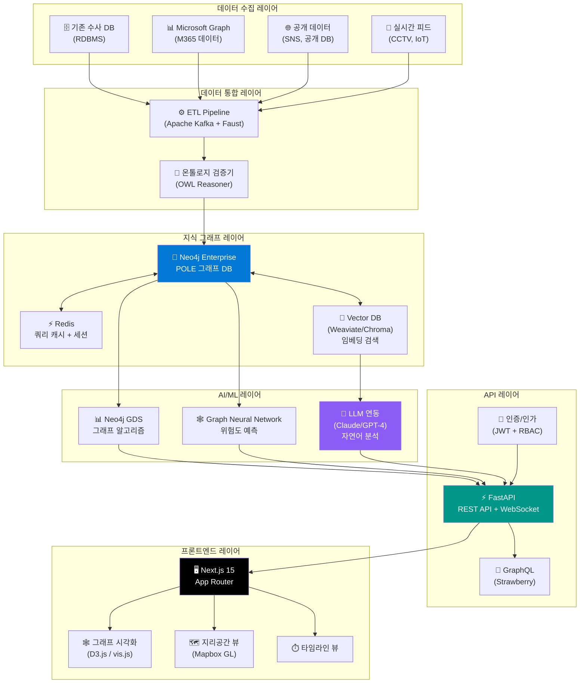

### 9.2 데이터 플로우 상세

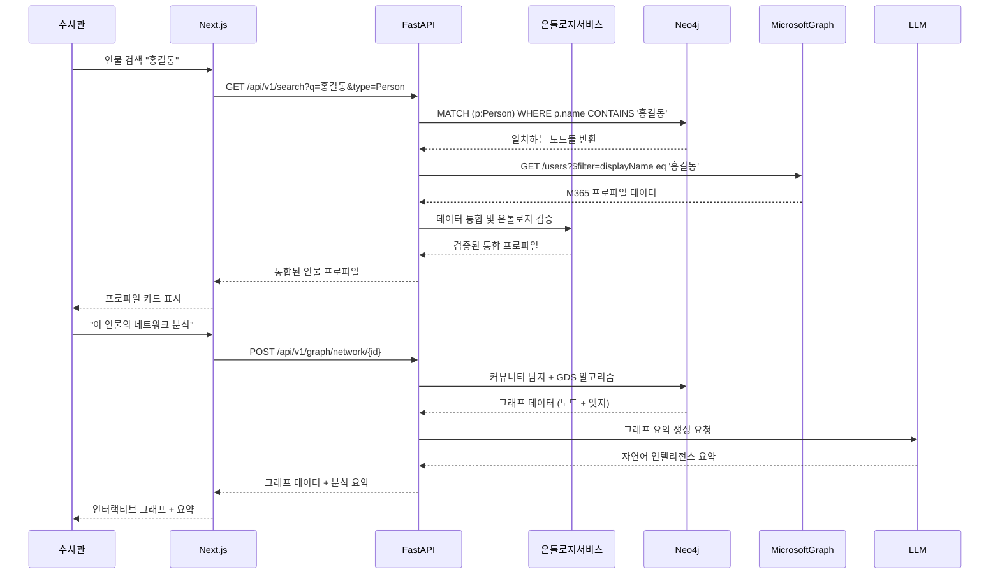

### 9.3 Docker Compose 구성

```yaml
# docker-compose.yml
version: '3.9'

services:
  neo4j:
    image: neo4j:5.18-enterprise
    environment:
      - NEO4J_AUTH=neo4j/${NEO4J_PASSWORD}
      - NEO4J_PLUGINS=["graph-data-science", "apoc"]
      - NEO4J_dbms_security_procedures_unrestricted=gds.*,apoc.*
      - NEO4J_ACCEPT_LICENSE_AGREEMENT=yes
    volumes:
      - neo4j_data:/data
      - neo4j_logs:/logs
    ports:
      - "7474:7474"  # Web UI
      - "7687:7687"  # Bolt Protocol
    networks:
      - investigation-net

  fastapi:
    build: ./backend
    environment:
      - NEO4J_URI=bolt://neo4j:7687
      - NEO4J_USER=neo4j
      - NEO4J_PASSWORD=${NEO4J_PASSWORD}
      - REDIS_URL=redis://redis:6379
      - MS_GRAPH_TENANT_ID=${MS_TENANT_ID}
      - MS_GRAPH_CLIENT_ID=${MS_CLIENT_ID}
      - MS_GRAPH_CLIENT_SECRET=${MS_CLIENT_SECRET}
      - JWT_SECRET_KEY=${JWT_SECRET}
    depends_on:
      - neo4j
      - redis
    ports:
      - "8000:8000"
    networks:
      - investigation-net

  nextjs:
    build: ./frontend
    environment:
      - NEXT_PUBLIC_API_URL=http://fastapi:8000
      - NEXTAUTH_SECRET=${NEXTAUTH_SECRET}
      - AZURE_AD_CLIENT_ID=${MS_CLIENT_ID}
      - AZURE_AD_CLIENT_SECRET=${MS_CLIENT_SECRET}
      - AZURE_AD_TENANT_ID=${MS_TENANT_ID}
    depends_on:
      - fastapi
    ports:
      - "3000:3000"
    networks:
      - investigation-net

  redis:
    image: redis:7-alpine
    volumes:
      - redis_data:/data
    networks:
      - investigation-net

  kafka:
    image: confluentinc/cp-kafka:7.6.0
    environment:
      - KAFKA_ZOOKEEPER_CONNECT=zookeeper:2181
      - KAFKA_ADVERTISED_LISTENERS=PLAINTEXT://kafka:9092
    depends_on:
      - zookeeper
    networks:
      - investigation-net

volumes:
  neo4j_data:
  neo4j_logs:
  redis_data:

networks:
  investigation-net:
    driver: bridge
```

---

## 10. 보안과 접근 제어

### 10.1 다계층 보안 아키텍처

팔란티어 Gotham의 핵심 보안 철학은 **세분화된 접근 제어**다. 사용자는 전체 데이터셋에 대한 포괄적인 권한이 아니라, 분류 수준, 필요-알아야-할(need-to-know) 요건, 시간 제한 창에 기반한 세분화된 제한을 받는다.

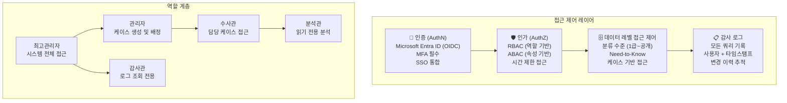

### 10.2 Neo4j 레벨 보안

```cypher
// 케이스 기반 접근 제어 (Row-Level Security 구현)
// 수사관은 자신이 배정된 케이스의 데이터만 조회 가능
MATCH (u:SystemUser {id: $currentUserId})-[:ASSIGNED_TO]->(c:Case)<-[:PART_OF]-(entity)
RETURN entity

// 분류 수준 기반 데이터 필터링
MATCH (entity)
WHERE entity.classificationLevel <= $userClearanceLevel
RETURN entity
```

---

## 11. AI/ML 레이어 통합

### 11.1 다중 에이전트 수사 시스템

2026년 현재의 최신 아키텍처는 단일 AI 모델이 아닌 **전문화된 에이전트의 오케스트레이션**으로 진화하고 있다. CRIS(Criminal Intelligence System)와 같은 오픈소스 구현 사례를 보면, 각 에이전트가 특정 분석 유형에 최적화되어 협력하는 구조가 효과적임을 알 수 있다.

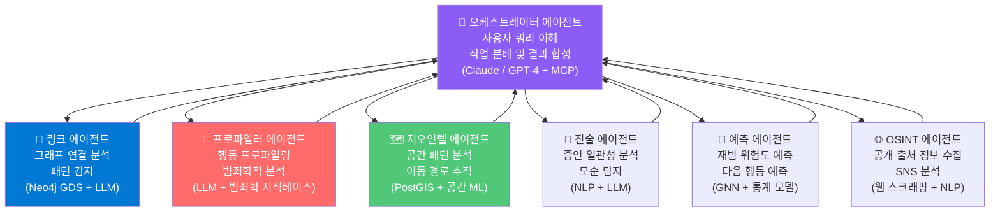

### 11.2 위험도 스코어링 (Risk Scoring)

```python
# services/risk_scoring_service.py
from dataclasses import dataclass
from typing import List, Dict
import numpy as np

class RiskFactors:
    prior_crimes: int
    network_centrality: float       # 범죄 네트워크 내 중심성
    criminal_associates: int        # 범죄 연루 지인 수
    recency_of_activity: float     # 최근 활동 정도 (0-1)
    geographic_risk: float          # 고위험 지역 거주/활동 여부
    financial_anomalies: int        # 이상 금융 거래 건수

class RiskScoringService:
    """
    복합 위험도 스코어링 엔진.
    그래프 분석 결과와 ML 모델을 결합합니다.
    """
    
    WEIGHTS = {
        'prior_crimes': 0.30,
        'network_centrality': 0.25,
        'criminal_associates': 0.20,
        'recency_of_activity': 0.10,
        'geographic_risk': 0.08,
        'financial_anomalies': 0.07
    }
    
    def calculate_risk_score(self, factors: RiskFactors) -> Dict:
        """
        0-10 척도의 종합 위험도 점수 계산.
        각 요소의 기여도와 근거를 함께 반환합니다.
        """
        normalized = {
            'prior_crimes': min(factors.prior_crimes / 10, 1.0),
            'network_centrality': factors.network_centrality,
            'criminal_associates': min(factors.criminal_associates / 20, 1.0),
            'recency_of_activity': factors.recency_of_activity,
            'geographic_risk': factors.geographic_risk,
            'financial_anomalies': min(factors.financial_anomalies / 5, 1.0),
        }
        
        weighted_score = sum(
            normalized[k] * self.WEIGHTS[k] 
            for k in self.WEIGHTS
        ) * 10
        
        # 위험 레벨 분류
        if weighted_score >= 8.0:
            level = "CRITICAL"
        elif weighted_score >= 6.0:
            level = "HIGH"
        elif weighted_score >= 4.0:
            level = "MEDIUM"
        else:
            level = "LOW"
        
        return {
            "score": round(weighted_score, 2),
            "level": level,
            "factors": {k: round(normalized[k] * self.WEIGHTS[k] * 10, 2) 
                       for k in self.WEIGHTS},
            "explanation": self._generate_explanation(factors, level)
        }
    
    def _generate_explanation(self, factors: RiskFactors, level: str) -> str:
        reasons = []
        if factors.prior_crimes > 5:
            reasons.append(f"전과 {factors.prior_crimes}건")
        if factors.criminal_associates > 10:
            reasons.append(f"범죄 연루 지인 {factors.criminal_associates}명")
        if factors.network_centrality > 0.7:
            reasons.append("범죄 네트워크 내 핵심 연결자")
        return ", ".join(reasons) if reasons else "복합적 위험 요소"
```

---

## 12. 윤리적 고려사항과 설계 원칙

팔란티어 Gotham의 실제 사용 이력은 강력한 기능과 함께 심각한 윤리적 우려를 동반한다. 로스앤젤레스 경찰국(LAPD)은 Gotham을 사용해 160개의 데이터 소스를 기반으로 주민들에게 점수를 부여하는 "만성 범죄자 게시판" 프로그램(Operation LASER)을 운영했다. 뉴올리언스도 유사한 "갱단원 스코어카드"를 만들었다. 두 프로그램 모두 법원이 헌법적 보호 위반과 인종적 편향 강화를 이유로 중단시켰다. 이런 선례는 수사 AI 시스템을 설계할 때 반드시 고려해야 할 핵심 원칙들을 시사한다.

### 12.1 책임 있는 설계를 위한 7가지 원칙

| 원칙 | 설명 | 구현 방안 |
|---|---|---|
| **투명성** | 알고리즘이 왜 특정 연결을 강조하는지 설명 가능해야 함 | XAI(설명 가능한 AI) 모듈 필수, 모든 추론에 근거 표시 |
| **데이터 최소화** | 수사 목적에 필요한 최소한의 데이터만 수집 | 온톨로지에 데이터 필요성 명시, 주기적 감사 |
| **편향 탐지** | 인종, 성별, 국적 등에 기반한 편향 알고리즘 탐지 | 정기적 fairness 메트릭 측정 및 보고 |
| **법적 근거** | 모든 데이터 수집과 접근은 법적 권한에 기반 | 데이터 계보(lineage) 추적, 법적 근거 메타데이터 필수 |
| **최소 권한** | 사용자는 업무에 필요한 최소한의 데이터에만 접근 | RBAC + ABAC + 케이스 기반 접근 제어 |
| **감사 가능성** | 모든 데이터 접근과 쿼리는 감사 로그에 기록 | 불변(immutable) 감사 로그, 정기 검토 |
| **적법 절차** | 알고리즘 결과는 수사의 출발점이지 결론이 아님 | UI에서 "알고리즘 추천"과 "확인된 사실" 명확히 구분 |

### 12.2 "예측적 치안(Predictive Policing)"의 위험

알고리즘이 도출한 패턴에 기반해 아직 발생하지 않은 범죄에 대해 선제적으로 행동하는 "예측적 치안"은 전통적인 법적 보호, 즉 처벌 전에 증거가 필요하다는 원칙을 침식할 수 있다. 시스템을 설계할 때는 알고리즘이 수사관의 판단을 **보조**하는 도구이지 **대체**하는 도구가 되어서는 안 된다는 원칙을 코드 레벨에서도 명확히 구현해야 한다.

```python
# 설계 원칙: 알고리즘 결과에 항상 불확실성과 근거를 표시

class IntelligenceInsight(BaseModel):
    finding: str
    confidence: float        # 0.0 - 1.0
    evidence_strength: str   # "CONFIRMED" | "LIKELY" | "POSSIBLE" | "SPECULATIVE"
    data_sources: List[str]  # 근거 데이터 소스 목록
    human_review_required: bool  # 사람 검토 필요 여부
    legal_basis: str         # 데이터 접근의 법적 근거
    
    # CRITICAL: 예측 결과는 법적 조치의 직접적 근거가 될 수 없음을 명시
    disclaimer: str = (
        "이 분석은 수사관의 판단을 보조하기 위한 참고 자료입니다. "
        "알고리즘 결과만으로 법적 조치를 취할 수 없습니다."
    )
```

---

## 13. 구현 로드맵

### 13.1 단계별 개발 계획

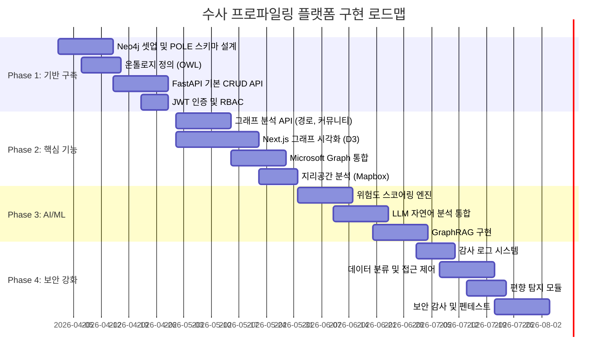

### 13.2 기술 스택 요약

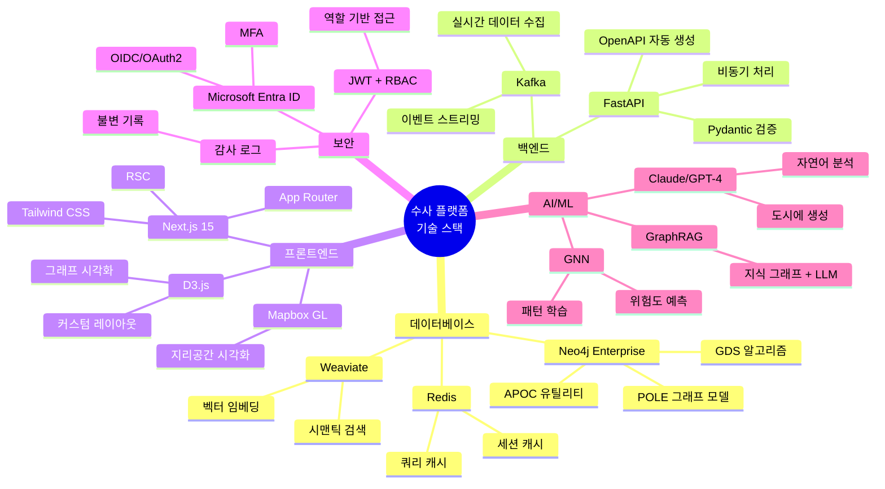

---

## 결론

팔란티어 Gotham은 수사 인텔리전스 분야에서 "데이터 통합과 관계 시각화"의 패러다임을 정의한 플랫폼이다. 이 문서에서 살펴본 오픈소스 스택(Neo4j + FastAPI + Next.js)은 Gotham의 핵심 철학, 즉 **분산된 데이터를 POLE 온톨로지로 통합하고 그래프로 연결하여 숨겨진 관계를 발견한다**는 원칙을 동일하게 구현할 수 있다.

온톨로지는 이 시스템의 지적 뼈대로, "어떤 것이 존재하고 어떻게 관련되는가"를 형식적으로 정의하여 데이터의 의미론적 일관성을 보장한다. Microsoft Graph는 기업 환경에서 M365 생태계의 풍부한 조직·커뮤니케이션 데이터를 수사 그래프로 가져오는 강력한 통합 채널이 된다.

그러나 무엇보다 중요한 것은 **윤리적 설계 원칙**이다. 알고리즘은 수사관의 판단을 보조하는 도구여야 하며, 모든 분석 결과는 투명하고 설명 가능해야 하며, 데이터 접근은 법적 근거와 필요-알아야-할 원칙에 엄격히 따라야 한다. 강력한 기술과 책임 있는 운용이 함께할 때, 이 플랫폼은 진정으로 정의를 위한 도구가 될 수 있다.

---

*작성 일자: 2026-04-06*  
*참고: 이 문서의 기술 아키텍처와 코드 예시는 교육적·연구적 목적으로 작성되었습니다. 실제 수사 시스템 구축 시에는 관련 법률 전문가 및 윤리 위원회와의 검토가 필수적입니다.*
