### 방법론 · 구현 절차 · 이행 전략 완전 가이드

> **작성일**: 2026-04-07  
> **전제**: 팔란티어 Gotham을 구매하지 않고 오픈소스 스택으로 동일한 기능을 사내 구축한다  
> **대상 독자**: 플랫폼 기획자, 아키텍트, 팀 리더

---
## 관련글

[**팔란티어 Gotham 스타일 수사 프로파일링 시스템**](https://k82022603.github.io/posts/%ED%8C%94%EB%9E%80%ED%8B%B0%EC%96%B4-gotham-%EC%8A%A4%ED%83%80%EC%9D%BC-%EC%88%98%EC%82%AC-%ED%94%84%EB%A1%9C%ED%8C%8C%EC%9D%BC%EB%A7%81-%EC%8B%9C%EC%8A%A4%ED%85%9C/)

## 목차

1. [먼저 솔직하게 — 무엇이 가능하고 무엇이 어려운가](#1-먼저-솔직하게--무엇이-가능하고-무엇이-어려운가)
2. [방법론: 어떤 방식으로 접근해야 하는가](#2-방법론-어떤-방식으로-접근해야-하는가)
3. [도메인 정의 및 온톨로지 설계](#3-도메인-정의-및-온톨로지-설계)
4. [기술 스택 선정](#4-기술-스택-선정)
5. [팀 구성](#5-팀-구성)
6. [구현 단계별 절차](#6-구현-단계별-절차)
7. [데이터 수집 및 통합 전략](#7-데이터-수집-및-통합-전략)
8. [보안 · 접근 제어 · 감사](#8-보안--접근-제어--감사)
9. [AI/LLM 레이어 통합](#9-aillm-레이어-통합)
10. [이행 전략 (Adoption)](#10-이행-전략-adoption)
11. [실패 패턴과 대응 전략](#11-실패-패턴과-대응-전략)
12. [예산 및 일정 추정](#12-예산-및-일정-추정)

---

## 1. 먼저 솔직하게 — 무엇이 가능하고 무엇이 어려운가

사내 구축을 시작하기 전에 현실적인 기대치를 설정해야 한다. 팔란티어 Gotham은 20년간 수천 명의 엔지니어가 만들어온 플랫폼이다.

### 1.1 오픈소스 스택으로 충분히 구현 가능한 것

| 기능 | 오픈소스 대안 | 완성도 |
|---|---|---|
| POLE 데이터 모델 기반 그래프 저장 | Neo4j / Memgraph | ✅ 완전 구현 가능 |
| 인물·조직·사건 간 관계 탐색 | Cypher 쿼리 + Neo4j Browser | ✅ 완전 구현 가능 |
| REST API 레이어 | FastAPI | ✅ 완전 구현 가능 |
| 그래프 시각화 | D3.js / Sigma.js / Gephi | ✅ 완전 구현 가능 |
| 역할 기반 접근 제어 (RBAC) | 자체 구현 | ✅ 완전 구현 가능 |
| 감사 로그 | 자체 구현 | ✅ 완전 구현 가능 |
| 자연어 쿼리 (AI 연동) | LLM + Cypher 변환 | ✅ 구현 가능 |

### 1.2 구현이 어렵거나 상당한 추가 노력이 필요한 것

| 기능 | 이유 | 현실적 대안 |
|---|---|---|
| Bloom 수준의 네이티브 시각화 UX | 수년간의 UX 투자 결과물 | D3.js 커스텀 개발 (3~6개월) |
| 실시간 다중 소스 데이터 연합 | 각 소스별 커넥터 개발 필요 | Kafka + ETL 파이프라인 |
| 군사·정보기관급 보안 분류 | 특수 인프라 필요 | 일반 기업 수준까지 가능 |
| 자동 논리 추론 (OWL Reasoner) | 별도 추론 엔진 통합 필요 | 애플리케이션 레이어에서 수동 처리 |

### 1.3 핵심 판단 기준

```
팔란티어 Gotham 구매 vs 사내 구축

구매가 나은 경우                    사내 구축이 나은 경우
─────────────────────               ─────────────────────
• 수개월 내 운영이 필요              • 데이터 주권이 최우선
• 보안 인증 요건이 매우 높음          • 예산이 제한적 (연간 수억 이하)
• 내부 개발 역량이 없음              • 커스터마이징 자유도가 중요
• 대규모 다기관 데이터 통합 필요      • 장기적으로 자체 기술 자산화
```

---

## 2. 방법론: 어떤 방식으로 접근해야 하는가

### 2.1 Domain-First, Data-Second 원칙

가장 흔한 실패 패턴은 "데이터부터 모아서 나중에 구조를 잡겠다"는 접근이다. Gotham 스타일 플랫폼에서는 반드시 **도메인 정의가 먼저, 데이터 수집이 나중**이어야 한다.

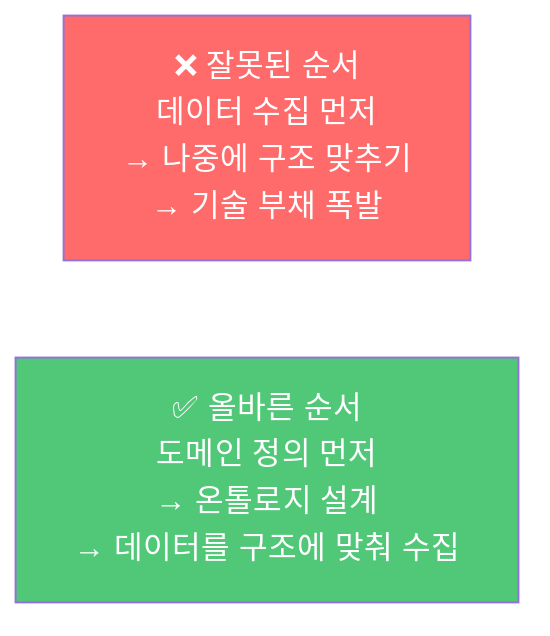

### 2.2 Incremental Ontology 방법론

한 번에 완전한 온톨로지를 만들려 하면 프로젝트가 6개월 분석 단계에서 멈춘다. 대신 **핵심 유즈케이스 하나로 시작해 점진적으로 확장**한다.

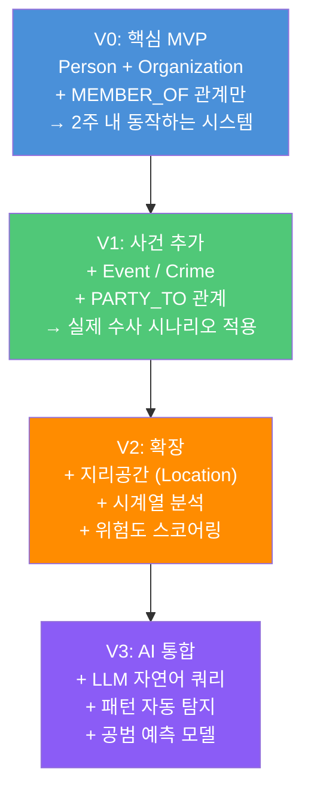

### 2.3 Use-Case Driven 개발

추상적인 기능 목록이 아닌 **실제 분석관이 매일 묻는 질문**에서 출발한다.

```
좋은 출발점 질문 예시:
  "이 용의자와 3단계 이내로 연결된 조직원은 누구인가?"
  "이번 달 발생한 마약 관련 사건의 지역 분포는?"
  "A 조직과 B 조직 간의 연결 고리가 있는가?"
  "이 사건에 관여된 차량의 등록지 주소는?"

나쁜 출발점:
  "모든 데이터를 통합한 완전한 지식 그래프를 만들자"
```

---

## 3. 도메인 정의 및 온톨로지 설계

### 3.1 도메인 워크숍 (필수 선행 작업)

기술 팀이 혼자 온톨로지를 설계하면 반드시 실패한다. **실제 분석관·수사관과 함께** 진행해야 한다.

**워크숍 진행 방식:**

```
Day 1 — 엔티티 정의 (Entity Discovery)
  • 포스트잇으로 "업무에서 다루는 모든 대상" 적기
  • 그룹핑 → Person / Organization / Event / Object / Location

Day 2 — 관계 정의 (Relationship Mapping)
  • 엔티티 간 "어떤 행동/관계가 있는가" 화살표로 연결
  • 관계에 이름 붙이기: KNOWS / MEMBER_OF / PARTY_TO 등

Day 3 — 규칙 정의 (Constraint Discovery)
  • "절대 있어서는 안 되는 상황"을 찾기
  • 예: 수사관은 동시에 피의자가 될 수 없다 (disjointWith)

Day 4 — 시나리오 검증
  • 실제 과거 케이스에 온톨로지를 대입해보기
  • "이 케이스를 이 구조로 표현할 수 있는가?"
```

### 3.2 수사 도메인 기준 핵심 온톨로지 (출발점)

```
클래스 계층
────────────────────────────────────────
Person
├── Suspect (피의자)
├── Victim (피해자)
├── Witness (목격자)
├── Informant (정보원)
└── Investigator (수사관)

Organization
├── CriminalOrganization (범죄조직)
├── LegalEntity (법인)
└── GovernmentAgency (수사기관)

Object
├── Vehicle (차량)
├── Device (통신기기)
├── Weapon (무기)
└── FinancialAccount (금융계좌)

Location
├── Address (주소)
├── Region (지역)
└── Venue (장소)

Event
├── Crime (범죄)
│   ├── DrugCrime (마약)
│   ├── Fraud (사기)
│   └── Violence (폭력)
└── Meeting (접촉 이벤트)

핵심 관계
────────────────────────────────────────
KNOWS          Person → Person
MEMBER_OF      Person → Organization
OWNS / USES    Person → Object
LIVES_AT       Person → Location
PARTY_TO       Person → Event
OCCURRED_AT    Event → Location
SEEN_AT        Object → Location (시간 포함)
PART_OF        Event → Event (사건 계층)
```

### 3.3 온톨로지 버전 관리

온톨로지는 코드처럼 버전으로 관리해야 한다. 변경 시 하위 호환성을 반드시 고려한다.

```bash
# 온톨로지 파일 구조
ontology/
├── v1/
│   ├── core.ttl          # 핵심 클래스·프로퍼티
│   ├── constraints.ttl   # disjointWith 등 제약
│   └── CHANGELOG.md
├── v2/
│   └── ...
└── current -> v2/        # 심볼릭 링크
```

---

## 4. 기술 스택 선정

### 4.1 레이어별 기술 선택지

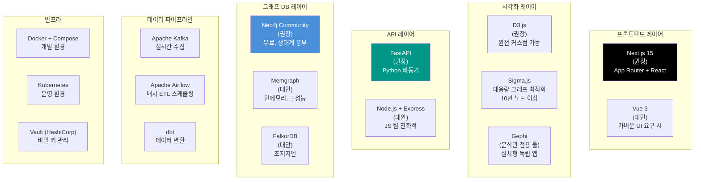

### 4.2 규모별 추천 스택

```
소규모 (팀 3~5명, 데이터 100만 건 이하)
──────────────────────────────────────────
  • Neo4j Community Edition (무료)
  • FastAPI + Uvicorn
  • Next.js
  • Docker Compose (단일 서버)
  • 예상 인프라 비용: 월 20~50만 원

중규모 (팀 5~15명, 데이터 1000만 건 이하)
──────────────────────────────────────────
  • Neo4j Enterprise (유료) 또는 Memgraph
  • FastAPI + Celery (비동기 작업)
  • Next.js + Redis (캐싱)
  • Kubernetes (3-node 클러스터)
  • Kafka (실시간 수집)
  • 예상 인프라 비용: 월 100~300만 원

대규모 (팀 15명+, 데이터 1억 건 이상)
──────────────────────────────────────────
  • Neo4j Enterprise Cluster (샤딩)
  • 멀티 서비스 마이크로서비스
  • Spark (대용량 ETL)
  • 전용 ML 서버 (GPU)
  • 예상 인프라 비용: 월 500만 원+
```

---

## 5. 팀 구성

### 5.1 최소 실행 가능 팀 (MVP 단계)

팔란티어는 "Forward Deployed Engineer(FDE)"를 현장에 파견해 고객사 데이터를 직접 다루며 온톨로지를 설계한다. 사내 구축에서도 **도메인 전문가와 기술 팀의 밀착 협업**이 핵심이다.

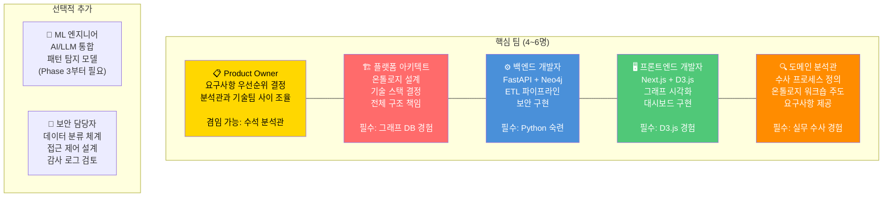

### 5.2 역할별 핵심 책임

| 역할 | 주요 산출물 | 필수 역량 |
|---|---|---|
| Product Owner | 유즈케이스 목록, 우선순위 백로그 | 도메인 이해 + 요구사항 정리 |
| 플랫폼 아키텍트 | 온톨로지 설계서, 기술 아키텍처 문서 | Neo4j, 시스템 설계, OWL 기초 |
| 백엔드 개발자 | FastAPI 서버, ETL 파이프라인, 보안 | Python, 비동기, SQL/Cypher |
| 프론트엔드 개발자 | 그래프 UI, 대시보드, 검색 인터페이스 | Next.js, D3.js, TypeScript |
| 도메인 분석관 | 워크숍 진행, 시나리오 검증, UAT | 수사/분석 실무, 데이터 리터러시 |

---

## 6. 구현 단계별 절차

### 6.1 전체 로드맵

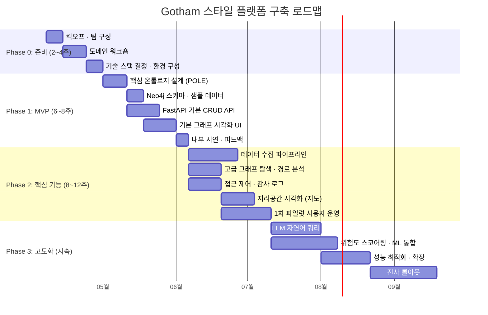

### 6.2 Phase 0: 준비 단계 (2~4주)

**목표**: 프로젝트의 방향과 범위를 확정한다.

```
체크리스트:
□ 스폰서(예산 결정권자) 확보
□ 핵심 팀원 4~5명 확정
□ 도메인 워크숍 일정 및 참석자 확정
□ 개발 환경 (Docker, Git 레포지토리) 구성
□ 기존 데이터 소스 목록 및 접근 권한 파악
□ 보안 요건 사전 협의 (정보보안팀 참여)

산출물:
• 프로젝트 헌장 (1페이지)
• 유즈케이스 목록 (초안)
• 데이터 소스 인벤토리
```

### 6.3 Phase 1: MVP 구축 (6~8주)

**목표**: 실제로 동작하는 가장 단순한 버전을 6~8주 내에 만든다.

**핵심 원칙**: MVP는 완성도가 아니라 **"동작 여부"** 가 기준이다.

```
Week 1~2: 온톨로지 설계
  - Person / Organization / Event 3개 클래스만 시작
  - MEMBER_OF / KNOWS / PARTY_TO 3개 관계만
  - Neo4j에 스키마 구성 + 샘플 데이터 20~30개 입력

Week 3~4: API 구축
  - POST /persons/register
  - GET /organizations/{name}/members
  - GET /analysis/path?from=&to=
  - Swagger UI 자동 문서 확인

Week 5~6: UI 구축
  - 기본 그래프 시각화 (D3.js)
  - 인물 검색 화면
  - 관계 탐색 화면

Week 7~8: 내부 시연
  - 실제 도메인 분석관에게 시연
  - 피드백 수집
  - Phase 2 우선순위 확정

MVP 완료 기준:
  ✅ 인물을 등록할 수 있다
  ✅ 조직 구성원을 조회할 수 있다
  ✅ 두 인물 간 연결 경로를 찾을 수 있다
  ✅ 분석관이 실제로 유용하다고 판단한다
```

### 6.4 Phase 2: 핵심 기능 구현 (8~12주)

```
데이터 파이프라인
  - 기존 DB (RDBMS) → Neo4j ETL 구성
  - Kafka로 실시간 이벤트 수신
  - 데이터 정제 · 중복 제거 로직

고급 분석 기능
  - 커뮤니티 탐지 (범죄 조직 자동 식별)
  - 중심성 분석 (핵심 연결자 탐지)
  - 타임라인 뷰 (사건 시간 순서)
  - 지도 위 사건 분포

보안
  - JWT 인증 + RBAC 구현
  - 케이스별 데이터 접근 제어
  - 모든 쿼리 감사 로그 기록

파일럿 운영
  - 실제 분석관 3~5명에게 제공
  - 주 1회 피드백 세션
  - 버그 수정 + 기능 보완
```

### 6.5 Phase 3: 고도화 (지속적 개선)

```
AI/LLM 통합
  - "강두식과 연결된 차량 알려줘" → Cypher 자동 변환
  - GraphRAG: 수사 보고서에서 자동 그래프 구성
  - 위험도 자동 산정 (GNN 기반)

성능 최적화
  - Neo4j 인덱스 튜닝
  - 자주 쓰는 쿼리 캐싱 (Redis)
  - 대용량 그래프 페이지네이션

확장
  - 멀티 테넌시 (케이스별 분리)
  - 외부 시스템 연동 API
  - 모바일 뷰 (태블릿)
```

---

## 7. 데이터 수집 및 통합 전략

### 7.1 데이터 소스 유형과 수집 방법

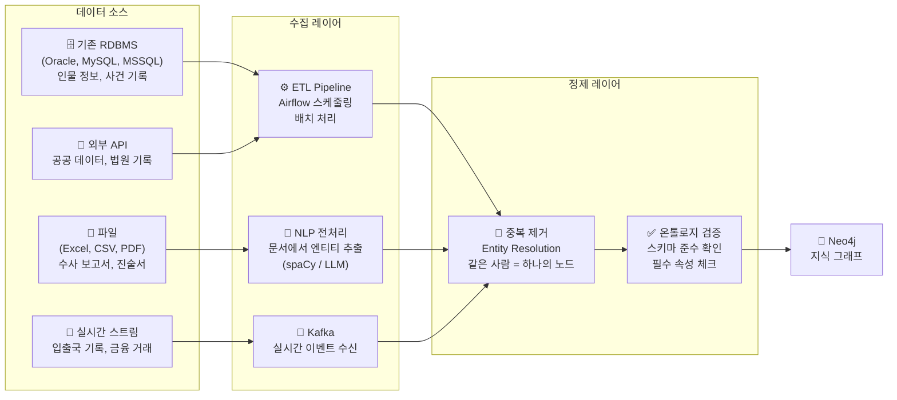

### 7.2 Entity Resolution — 가장 어려운 문제

같은 사람이 여러 데이터 소스에 다르게 기록되는 문제다. 이것이 실제 구현에서 가장 많은 시간을 잡아먹는다.

```
문제 예시:
  소스 A: "홍길동, 1985-03-15, 서울"
  소스 B: "洪吉童, 850315, Seoul"
  소스 C: "H. Gil-dong, Male, 41세"

→ 세 개가 같은 사람인지 판단해야 함

해결 방법 (난이도 순):
  1. 주민번호·여권번호 등 고유 ID 기반 매칭 (가장 정확)
  2. 이름 + 생년월일 퍼지 매칭 (Levenshtein Distance)
  3. ML 기반 Entity Resolution (대규모 데이터)

Neo4j에서의 처리:
  MERGE (p:Person {nationalId: $id})   ← 고유 ID로 MERGE
  ON CREATE SET p.name = $name
  ON MATCH SET p.aliases = p.aliases + [$name]  ← 별명으로 추가
```

### 7.3 데이터 계보 (Lineage) 추적

모든 데이터는 출처를 기록해야 한다. 법적 증거 능력과 직결된다.

```cypher
// 각 노드/관계에 출처 메타데이터 기록
CREATE (p:Person {
    name: '홍길동',
    _source: 'Seoul_Police_DB',      // 원천 시스템
    _ingestedAt: datetime(),          // 수집 시간
    _ingestedBy: 'etl-job-2026-001', // 수집 주체
    _confidence: 0.95                 // 데이터 신뢰도
})
```

---

## 8. 보안 · 접근 제어 · 감사

### 8.1 보안 설계 원칙

팔란티어 Gotham의 핵심 강점 중 하나가 세분화된 접근 제어다. 사내 구축에서도 이를 반드시 구현해야 한다.

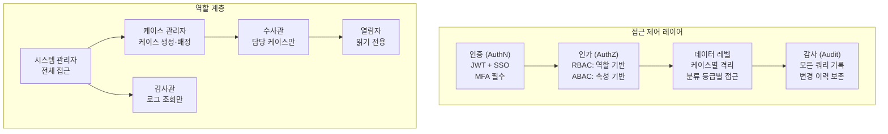

### 8.2 케이스 기반 데이터 격리

```cypher
// 수사관은 자신이 배정된 케이스의 데이터만 볼 수 있음
MATCH (u:User {id: $userId})-[:ASSIGNED_TO]->(case:Case)
     <-[:PART_OF]-(entity)
RETURN entity
```

### 8.3 불변 감사 로그

```python
# 모든 API 요청에 자동으로 감사 로그 기록
async def audit_log(
    user_id: str,
    action: str,          # READ / WRITE / DELETE
    target: str,          # 조회 대상 (노드 ID 등)
    query: str,           # 실행된 Cypher 쿼리
    result_count: int,    # 반환 결과 수
):
    # 감사 로그는 수정·삭제 불가 (append-only)
    # Elasticsearch 또는 별도 감사 DB에 저장
    await audit_store.append({
        "timestamp": datetime.utcnow().isoformat(),
        "user_id": user_id,
        "action": action,
        "target": target,
        "query": query,
        "result_count": result_count,
        "ip_address": request.client.host,
    })
```

---

## 9. AI/LLM 레이어 통합

### 9.1 통합 아키텍처

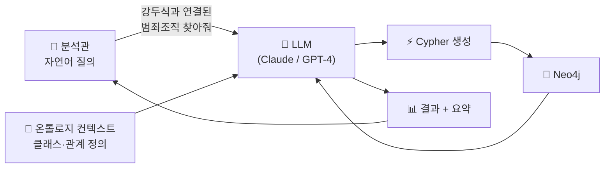

### 9.2 Text-to-Cypher 구현

```python
SYSTEM_PROMPT = """
당신은 수사 인텔리전스 시스템의 Cypher 쿼리 생성 전문가입니다.

온톨로지 스키마:
노드: Person (name, age, riskScore), Organization (name), Crime (type, status), Location (address)
관계: KNOWS, MEMBER_OF, PARTY_TO, INVESTIGATES, OCCURRED_AT

규칙:
1. 반드시 유효한 Cypher만 반환하세요
2. LIMIT는 항상 포함하세요 (최대 100)
3. 개인정보 보호를 위해 전체 목록보다 집계를 우선하세요
4. 결과는 JSON으로만 반환하세요: {"cypher": "...", "explanation": "..."}
"""

async def natural_language_to_cypher(query: str) -> dict:
    response = await llm.complete(
        system=SYSTEM_PROMPT,
        user=f"질의: {query}"
    )
    result = json.loads(response)
    # 반드시 화이트리스트 검증 후 실행
    validate_cypher_safety(result["cypher"])
    return result
```

### 9.3 GraphRAG — 수사 문서에서 자동 그래프 구성

수사 보고서, 진술서, 법원 판결문 등 비정형 텍스트에서 자동으로 엔티티와 관계를 추출한다.

```python
# 수사 보고서 → 그래프 자동 생성
async def extract_graph_from_document(text: str) -> dict:
    prompt = f"""
    다음 수사 보고서에서 엔티티와 관계를 추출하세요.
    
    반환 형식:
    {{
      "entities": [
        {{"id": "...", "type": "Person/Organization/Crime", "name": "...", "attributes": {{}}}}
      ],
      "relationships": [
        {{"from": "id1", "type": "KNOWS/MEMBER_OF/...", "to": "id2", "confidence": 0.0~1.0}}
      ]
    }}
    
    보고서:
    {text}
    """
    
    result = await llm.complete(prompt)
    graph_data = json.loads(result)
    
    # confidence 0.7 이상만 그래프에 추가
    filtered = filter_by_confidence(graph_data, threshold=0.7)
    await import_to_neo4j(filtered)
    return filtered
```

---

## 10. 이행 전략 (Adoption)

### 10.1 사용자 저항 극복

새로운 플랫폼 도입에서 가장 큰 장벽은 기술이 아니라 **사람의 변화 저항**이다.

```
흔한 저항 패턴:
  "기존 Excel이 더 편해요"
  "배우는 데 시간이 없어요"
  "보안이 걱정돼요"
  "이게 실제로 수사에 도움이 되나요?"

대응 전략:
  ① 먼저 얼리어답터(Early Adopter) 2~3명을 공략
     → 그들의 성공 사례를 내부에 전파

  ② 기존 워크플로우와 병행 허용
     → 초반에는 Excel과 함께 써도 됨을 명시

  ③ 빠른 win을 만들어 보여줌
     → "이 케이스, 기존 방식으로 3일 걸렸는데 30분 만에 해결"
     → 구체적 수치로 효과 증명
```

### 10.2 단계적 롤아웃 전략

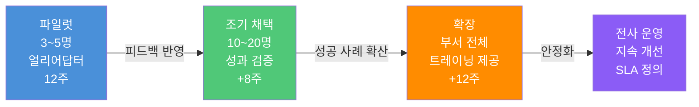

### 10.3 트레이닝 프로그램

| 대상 | 내용 | 방식 | 시간 |
|---|---|---|---|
| 분석관 | 검색, 그래프 탐색, 경로 분석 | 실습 워크숍 | 4시간 |
| 수사관 | 케이스 등록, 인물 프로파일 | 1:1 온보딩 | 2시간 |
| 관리자 | 대시보드, 통계 조회 | 동영상 튜토리얼 | 1시간 |
| 개발자 | API 활용, 커스텀 쿼리 | 기술 문서 + 실습 | 1일 |

### 10.4 성과 측정 지표 (KPI)

```
정량 지표:
  • 케이스 분석 소요 시간 (목표: 기존 대비 50% 단축)
  • 신규 연결 관계 발견 건수 (월간)
  • 플랫폼 일간 활성 사용자 수 (DAU)
  • 쿼리 응답 시간 (p95 < 2초)
  • 데이터 정확도 (온톨로지 위반 비율 < 1%)

정성 지표:
  • 분석관 만족도 (분기별 설문)
  • 시스템이 직접 기여한 케이스 해결 사례 수
```

---

## 11. 실패 패턴과 대응 전략

현장에서 반복적으로 나타나는 실패 패턴들이다. 사전에 인지하고 있어야 한다.

### 11.1 "빅뱅 온톨로지" 함정

```
증상: 6개월 동안 완벽한 온톨로지를 설계하느라 아무것도 만들지 못함

원인: "모든 케이스를 커버하는 완전한 모델을 만들고 시작하자"

대응:
  → 3개 클래스, 3개 관계로 시작
  → 2주 안에 동작하는 것을 만들고
  → 실제 사용하면서 점진적으로 확장
```

### 11.2 "데이터 먼저" 함정

```
증상: 데이터를 일단 다 모아놓고 나중에 구조화하려 함
      → 구조 없는 데이터 더미만 남음

원인: 온톨로지 설계를 기술적 작업으로만 봄

대응:
  → 도메인 워크숍을 첫 번째 마일스톤으로 설정
  → 데이터 수집 전에 스키마 확정
  → "이 데이터가 온톨로지의 어느 클래스에 들어가는가?"를 먼저 결정
```

### 11.3 "기술 과잉" 함정

```
증상: 필요하지 않은 기술을 너무 많이 도입
      → Kubernetes, Kafka, Spark, ML 파이프라인을 Day 1부터 구성
      → 운영 복잡성 폭발

원인: 팔란티어 수준을 처음부터 목표로 함

대응:
  → Phase 1은 Docker Compose + SQLite 수준으로 시작
  → 실제 병목이 생겼을 때 복잡도를 추가
  → "지금 필요한가?"를 항상 먼저 물을 것
```

### 11.4 "Entity Resolution 과소평가" 함정

```
증상: 같은 인물이 수십 개의 중복 노드로 존재
      → 분석 결과를 신뢰할 수 없음

원인: 초반에 "나중에 정제하면 된다"는 생각

대응:
  → MERGE 기반 수집 파이프라인을 처음부터 구현
  → 고유 ID (주민번호, 여권번호 등) 기반 매칭 우선
  → 중복 탐지 쿼리를 주기적으로 실행
```

---

## 12. 예산 및 일정 추정

### 12.1 인건비 추정 (한국 시장 기준, 2026년)

| 역할 | 월 인건비 추정 | Phase 1 참여 기간 | Phase 1 비용 |
|---|---|---|---|
| 플랫폼 아키텍트 | 700~900만 원 | 2개월 | 1,400~1,800만 원 |
| 백엔드 개발자 | 500~700만 원 | 2개월 | 1,000~1,400만 원 |
| 프론트엔드 개발자 | 500~700만 원 | 2개월 | 1,000~1,400만 원 |
| 도메인 분석관 | 겸임 가능 | — | 추가 비용 최소 |
| **Phase 1 합계** | | | **약 3,400~4,600만 원** |

### 12.2 인프라 비용 추정

| 단계 | 구성 | 월 비용 |
|---|---|---|
| Phase 1 (MVP) | 클라우드 VM 2대 + DB | 20~50만 원 |
| Phase 2 (운영) | VM 4~6대 + 스토리지 + CDN | 80~150만 원 |
| Phase 3 (확장) | K8s 클러스터 + Neo4j Enterprise | 200~500만 원 |

### 12.3 현실적 일정

```
팔란티어 Gotham 수준까지 가는 데는 수년이 필요하다.
그러나 "실제로 쓸 수 있는 MVP"는 2개월 안에 가능하다.

2개월: 분석관이 그래프로 인물 관계를 볼 수 있다
4개월: 실제 케이스 데이터가 연동되고 경로 분석을 쓴다
8개월: 부서 단위로 일상 업무에서 사용한다
12개월: AI 자연어 쿼리로 비개발자도 분석할 수 있다
24개월: 조직의 핵심 인프라로 자리잡는다
```

---

## 정리: 시작하려면 지금 당장 해야 할 것 3가지

```
1. 도메인 워크숍 일정 잡기
   → 실제 수사·분석 업무를 하는 사람 3~5명과 이틀짜리 워크숍
   → 이것이 전체 프로젝트의 성패를 결정한다

2. 아키텍트 확보
   → Neo4j 경험이 있는 사람이 1명만 있으면 시작할 수 있다
   → 없다면 외부 컨설팅 2~4주를 먼저 고려

3. MVP 범위 고정
   → "Person + Organization + MEMBER_OF" 딱 이것만으로 시작
   → 2주 안에 동작하는 시스템을 목표로
   → 범위를 넓히려는 유혹을 반드시 차단
```

---

*작성 일자: 2026-04-07*  
*연관 문서: 수사 온톨로지 기반 지식 그래프 시스템 구축 가이드 (기술 구현 상세)*

---

## 별첨: OWL Reasoner (자동 논리 추론) 상세 해설

> **이 별첨의 목적**  
> 섹션 1.2에서 "자동 논리 추론(OWL Reasoner)"을 구현이 어려운 항목으로 분류했다.  
> 그것이 정확히 무엇이고, LLM(Claude 등)과는 어떤 관계인지 상세히 설명한다.

---

### B.1 OWL Reasoner란 무엇인가

OWL Reasoner는 OWL 온톨로지에 정의된 **논리 규칙으로부터 명시되지 않은 사실을 자동으로 유추하는 소프트웨어 엔진**이다. 기반 수학은 **Description Logic(기술 논리)** 으로, 1980년대부터 발전해온 형식 논리학의 한 분야다.

쉽게 말하면: **"A이면 B다"라는 규칙이 있고, A가 참이면 컴퓨터가 스스로 B도 참이라고 결론낸다.**

#### 구체적 예시

온톨로지에 다음 규칙이 있다고 가정한다.

```turtle
# 규칙 1: Suspect는 Person의 하위 클래스다
:Suspect rdfs:subClassOf :Person .

# 규칙 2: Investigator와 Suspect는 겹칠 수 없다
:Investigator owl:disjointWith :Suspect .

# 규칙 3: CriminalOrganization은 Organization의 하위 클래스다
:CriminalOrganization rdfs:subClassOf :Organization .
```

그리고 데이터를 이렇게 입력한다.

```turtle
:홍길동 a :Suspect .                  # 홍길동은 피의자다
:박문수 a :Investigator .              # 박문수는 수사관이다
:BlackShark a :CriminalOrganization .  # BlackShark는 범죄조직이다
:홍길동 :memberOf :BlackShark .        # 홍길동은 BlackShark 소속이다
```

OWL Reasoner가 자동으로 **유추**하는 것들:

```
① :홍길동 a :Person          → Suspect는 Person이므로, 홍길동도 Person이다
② :BlackShark a :Organization → CriminalOrganization은 Organization이므로 자동 분류
③ :박문수가 :Suspect로 등록되면 → 즉시 "논리 모순!" 오류 발생 (disjointWith 위반)
```

이 모든 결론을 **개발자가 코드로 짜지 않아도** 추론 엔진이 스스로 도출한다.

---

### B.2 대표적인 OWL Reasoner 종류

| Reasoner | 라이선스 | 특징 | 주 사용처 |
|---|---|---|---|
| **HermiT** | LGPL (무료) | 가장 표준적, Protégé 기본 탑재 | 학계, OWL 개발 |
| **Pellet / Openllet** | AGPL (무료) | Java 기반, 설명 생성 가능 | 학계, 기업 |
| **ELK** | Apache 2.0 (무료) | OWL EL 프로파일만 지원, 초고속 | 의료 온톨로지 (SNOMED) |
| **FaCT++** | LGPL (무료) | C++ 기반, 빠름 | 학계 |
| **Stardog** | 상용 | 그래프 DB + 추론 통합 | 기업 |
| **GraphDB** | 상용 (무료 버전 있음) | RDF 저장소 + 추론 통합 | 기업 |

Protégé를 설치하면 HermiT가 기본으로 포함되어 있어 바로 사용해볼 수 있다.

---

### B.3 추론의 종류

OWL Reasoner가 수행하는 추론 유형은 크게 4가지다.

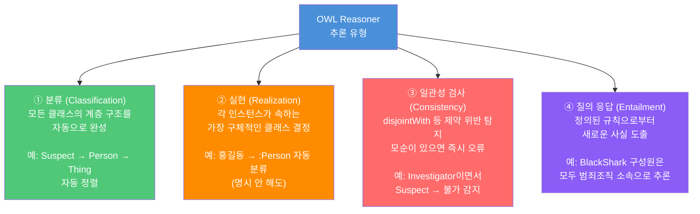

---

### B.4 OWL Reasoner와 LLM(Claude)은 어떻게 다른가

이것이 핵심 질문이다. **결론부터: 둘은 근본적으로 다른 종류의 "추론"이다.**

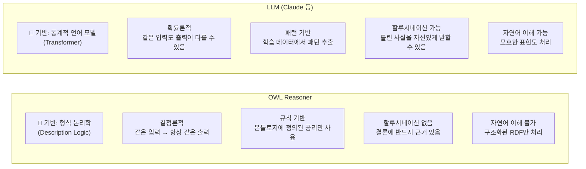

| 비교 항목 | OWL Reasoner | LLM (Claude 등) |
|---|---|---|
| **기반 원리** | 형식 논리 (공리·규칙) | 통계적 패턴 (확률 모델) |
| **결과 일관성** | 항상 동일 (결정론적) | 매번 다를 수 있음 (확률론적) |
| **추론 근거** | 항상 추적 가능 (설명 가능) | 블랙박스 (추적 어려움) |
| **거짓말(할루시네이션)** | 없음. 결론에 반드시 근거 있음 | 가능. 그럴듯한 틀린 답 생성 가능 |
| **자연어 처리** | ❌ 불가 | ✅ 가능 |
| **새 규칙 추가** | 온톨로지 수정 필요 | 프롬프트 수정으로 가능 |
| **대용량 데이터** | 수백만 트리플에서 느려짐 | 컨텍스트 창 제한 |
| **비용** | 무료 오픈소스 다수 | API 호출 비용 발생 |

#### 핵심 비유

```
OWL Reasoner = 법원 판사
  → 법전(온톨로지 규칙)에 근거해서만 판결
  → 법에 없는 것은 판단 불가
  → 같은 사건에 항상 같은 판결
  → 판결 근거를 반드시 명시

LLM = 경험 많은 형사
  → 수많은 과거 사례에서 패턴을 학습
  → 법에 없는 상황도 상식으로 판단
  → 같은 사건도 컨디션에 따라 다른 의견
  → 때로 자신있게 틀린 말을 할 수 있음
```

---

### B.5 그렇다면 LLM은 "논리 추론"을 못 하는가?

완전히 그렇지는 않다. LLM, 특히 Claude의 최신 모델들은 **Chain-of-Thought(사고 연쇄)** 방식으로 논리적 단계를 밟아 결론에 이르는 능력이 있다.

```
사용자: "홍길동은 Suspect이고, Suspect는 Person의 하위 클래스입니다.
         홍길동은 Person인가요?"

Claude: "네, 홍길동은 Person입니다. Suspect는 Person의 하위 클래스이므로,
         모든 Suspect는 Person에 속합니다. 따라서 홍길동(Suspect)은
         Person이기도 합니다."
```

이것은 논리적으로 맞다. 그러나 OWL Reasoner와 결정적으로 다른 점이 있다.

```
OWL Reasoner의 추론:
  → 수백만 개의 트리플에 동시에 적용 가능
  → 오류 없이 일관성 보장
  → 결론에 항상 명확한 근거

LLM의 "추론":
  → 컨텍스트 창 한계로 대규모 적용 불가
  → 복잡한 논리 체인에서 실수 가능
  → "그럴듯한 답"을 생성하는 것이지 논리 엔진이 아님
```

---

### B.6 Neo4j에는 OWL Reasoner가 없다

이것이 섹션 1.2에서 "구현이 어렵다"고 분류한 이유다.

Neo4j는 그래프 탐색에 최적화된 데이터베이스이지, 논리 추론 엔진이 아니다.

```
OWL Reasoner가 하는 것          Neo4j로 대신 하려면
──────────────────────────       ──────────────────────────
Suspect → Person 자동 분류  →   CREATE (p:Person:Suspect ...) 로 직접 두 레이블 부여
disjointWith 자동 감지      →   API에서 수동 검사 로직 구현
subClassOf 자동 전파        →   Cypher 쿼리에서 명시적으로 상위 클래스 포함
```

neosemantics(n10s) 플러그인을 쓰면 OWL/RDF를 Neo4j로 가져올 수 있지만, **추론 엔진 자체는 포함되지 않는다.** 추론 결과를 Neo4j에 저장하려면 외부 Reasoner를 돌린 뒤 그 결과를 Neo4j에 주입하는 방식을 써야 한다.

---

### B.7 2026년 최신 트렌드: Neuro-Symbolic AI

OWL Reasoner와 LLM은 서로 다른 단점을 가지고 있다.

- OWL Reasoner: 자연어 이해 불가, 규칙 밖의 상황 처리 불가
- LLM: 할루시네이션, 대규모 형식 논리 처리 불가

이 둘을 결합하는 **Neuro-Symbolic AI** 연구가 2025~2026년에 활발하다.

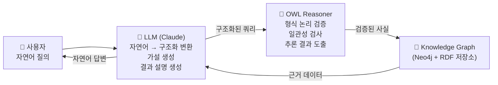

**실제 적용 패턴 3가지:**

**① LLM이 가설 생성 → Reasoner가 검증**
```
LLM: "홍길동이 BlackShark 조직과 연관된 것 같다" (가설)
Reasoner: 온톨로지 규칙으로 형식적으로 검증 → 참/거짓 판정
```

**② Reasoner가 컨텍스트 제공 → LLM이 자연어로 설명**
```
Reasoner: 추론 결과 = {홍길동 → Person, 홍길동 → CriminalOrganization 소속}
LLM: "홍길동은 BlackShark 범죄조직 소속으로, 이번 마약 밀매 사건의 주범으로..."
     (구조화된 사실을 자연어 보고서로 변환)
```

**③ LLM이 온톨로지 초안 작성 → Reasoner로 일관성 검증**
```
LLM: 업무 설명을 보고 OWL 온톨로지 초안 자동 생성
Reasoner: 논리적 모순 검사 → 수정 필요 부분 피드백
LLM: 피드백 반영해 재작성
```

---

### B.8 사내 구축 시 현실적 선택

완전한 OWL Reasoner 통합은 상당한 기술적 복잡도를 수반한다. 규모와 요건에 따라 다음 중 선택한다.

| 선택지 | 적합한 경우 | 구현 난이도 | 비용 |
|---|---|---|---|
| **애플리케이션 레이어 수동 처리** | 제약 규칙이 단순한 경우 | 낮음 | 없음 |
| **Apache Jena (Python rdflib)** | OWL 검증만 필요한 경우 | 중간 | 무료 |
| **GraphDB / Stardog 도입** | 추론이 핵심 요건인 경우 | 높음 | 유료 |
| **LLM으로 대체** | 엄밀성보다 편의성 우선인 경우 | 낮음 | API 비용 |
| **Neuro-Symbolic 하이브리드** | 고도화 단계에서 | 매우 높음 | 고비용 |

**대부분의 사내 구축 프로젝트에서 현실적 선택은 "애플리케이션 레이어 수동 처리"다.** Phase 1~2에서는 FastAPI 코드로 제약 검사를 구현하고, 규모와 요건이 커질 때 전용 Reasoner 도입을 검토하면 충분하다.

```python
# 애플리케이션 레이어에서 disjointWith 수동 처리 예시
VALID_ROLES = {"Suspect", "Victim", "Investigator"}
DISJOINT_PAIRS = {("Investigator", "Suspect")}  # 온톨로지의 disjointWith 규칙

async def validate_ontology_constraints(person_id: str, new_role: str, session):
    """OWL Reasoner 없이 애플리케이션 코드로 제약 검사"""
    result = await session.run(
        "MATCH (p:Person {id: $id}) RETURN labels(p) AS labels",
        id=person_id
    )
    record = await result.single()
    existing_labels = set(record["labels"]) - {"Person"}

    for existing in existing_labels:
        if (existing, new_role) in DISJOINT_PAIRS or (new_role, existing) in DISJOINT_PAIRS:
            raise HTTPException(
                status_code=409,
                detail=f"온톨로지 제약 위반: {existing}와 {new_role}는 동시에 부여 불가"
            )
```

---

### B.9 요약: 한 문장으로 정리

| 개념 | 한 문장 정리 |
|---|---|
| **OWL Reasoner** | 온톨로지에 정의된 논리 규칙을 기계적으로 적용해 새로운 사실을 유추하는 형식 논리 엔진 |
| **LLM (Claude 등)** | 방대한 텍스트에서 패턴을 학습해 확률적으로 답변을 생성하는 언어 모델 |
| **둘의 관계** | 근본적으로 다른 기술이지만, 각자의 약점을 보완하기 위해 결합(Neuro-Symbolic)하는 연구가 진행 중 |
| **사내 구축 현실** | OWL Reasoner는 초기에 생략하고 애플리케이션 코드로 핵심 규칙만 수동 구현하는 것이 합리적 |
