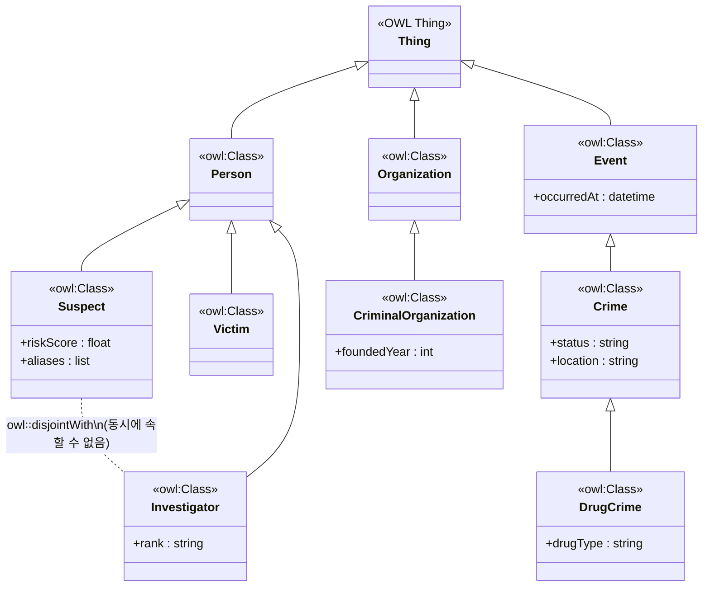
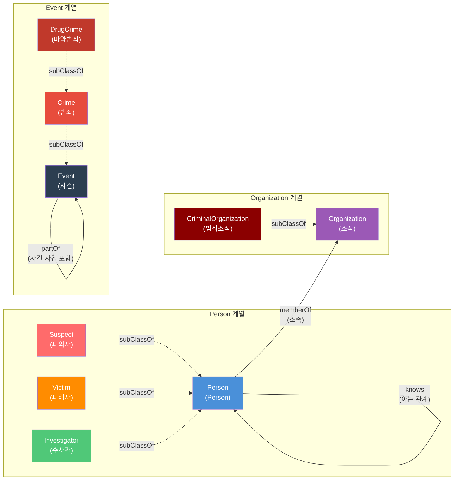
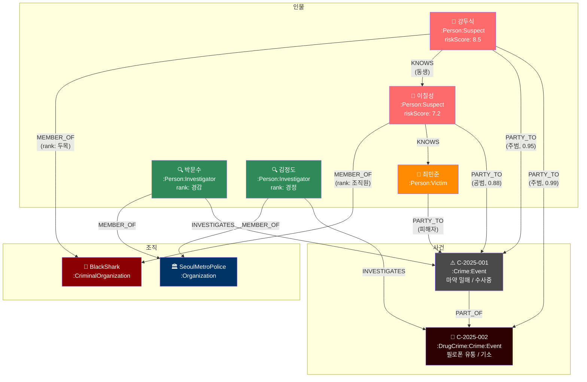
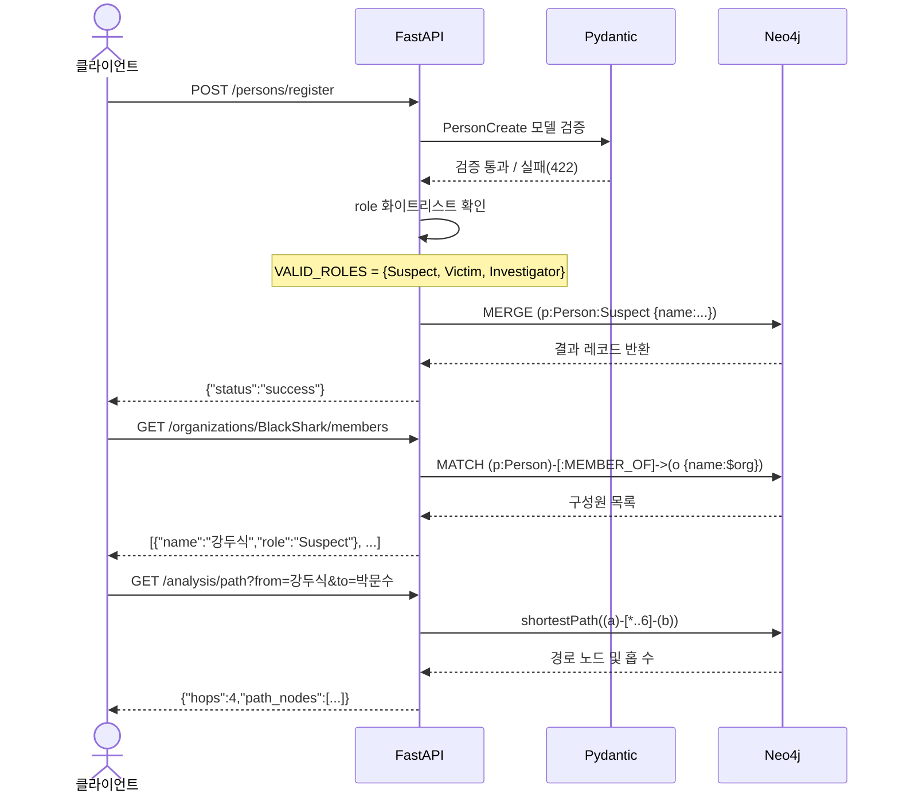
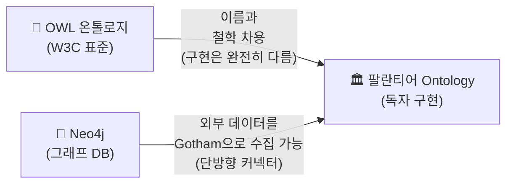
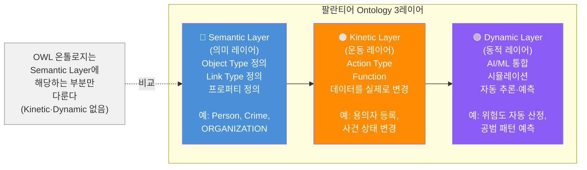
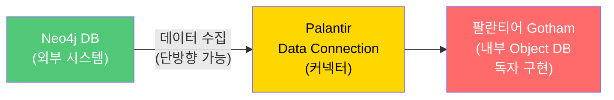
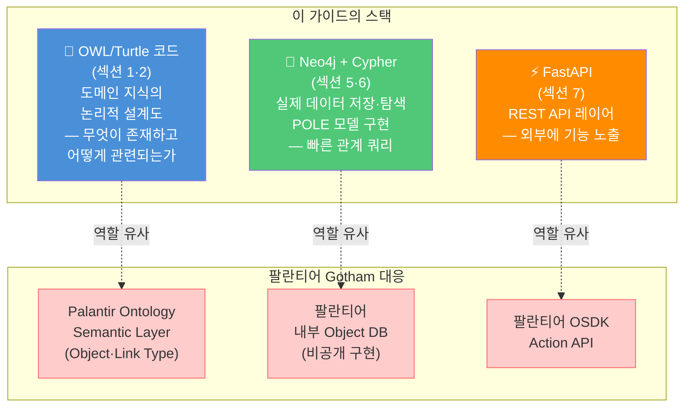

### OWL 온톨로지 · Neo4j · FastAPI · Python 완전 실습

> **작성일**: 2026-04-07  
> **대상**: Python 기초 이상, Neo4j 입문자  
> **목표**: Turtle 형식의 OWL 온톨로지를 이해하고, Neo4j 그래프 DB에 구현하며, FastAPI로 REST API를 구축한다

---
## 관련글

[**팔란티어 Gotham 스타일 수사 프로파일링 시스템**](https://k82022603.github.io/posts/%ED%8C%94%EB%9E%80%ED%8B%B0%EC%96%B4-gotham-%EC%8A%A4%ED%83%80%EC%9D%BC-%EC%88%98%EC%82%AC-%ED%94%84%EB%A1%9C%ED%8C%8C%EC%9D%BC%EB%A7%81-%EC%8B%9C%EC%8A%A4%ED%85%9C/)

## 목차

1. [OWL/Turtle 온톨로지 코드 해설](#1-owlturtle-온톨로지-코드-해설)
2. [온톨로지 다이어그램 (Mermaid)](#2-온톨로지-다이어그램-mermaid)
3. [온톨로지 시각화 및 실행 방법](#3-온톨로지-시각화-및-실행-방법)
4. [Neo4j 개요 및 UI 소개](#4-neo4j-개요-및-ui-소개)
5. [Neo4j에서 온톨로지 구현하기 (Cypher)](#5-neo4j에서-온톨로지-구현하기-cypher)
6. [주요 Cypher 조회 쿼리 모음](#6-주요-cypher-조회-쿼리-모음)
7. [FastAPI + Neo4j 애플리케이션 구축](#7-fastapi--neo4j-애플리케이션-구축)
8. [Docker Compose로 전체 환경 구성](#8-docker-compose로-전체-환경-구성)
9. [테스트 및 실행 방법](#9-테스트-및-실행-방법)

**별첨**
- [A.1 세 개념의 공통 뿌리와 분기](#a1-세-개념의-공통-뿌리와-분기)
- [A.2 팔란티어 Gotham의 "Ontology"란 무엇인가](#a2-팔란티어-gotham의-ontology란-무엇인가)
- [A.3 두 "온톨로지"의 결정적 차이](#a3-두-온톨로지의-결정적-차이)
- [A.4 팔란티어 Gotham은 Neo4j와 관련이 있나?](#a4-팔란티어-gotham은-neo4j와-관련이-있나)
- [A.5 이 가이드 문서의 기술 스택 포지션](#a5-이-가이드-문서의-기술-스택-포지션)
- [A.6 "온톨로지를 Neo4j로 구현한다" — 맞는 말인가?](#a6-온톨로지를-neo4j로-구현한다--맞는-말인가)

---

## 1. OWL/Turtle 온톨로지 코드 해설

### 1.1 이 코드는 무엇인가?

다음 코드는 **시맨틱 웹(Semantic Web)** 기술에서 사용하는 **온톨로지(Ontology)** 다. 형식은 **Turtle(Terse RDF Triple Language)** 이고, **OWL(Web Ontology Language)** 로 작성되어 있다.

쉽게 표현하면, "컴퓨터가 데이터 간의 **관계와 의미를 논리적으로** 이해할 수 있도록 정의한 지식의 지도"다. 일반 데이터베이스 스키마와의 차이는 단순한 구조 정의를 넘어 **추론(Reasoning)** 이 가능하다는 점이다.

```turtle

# ─────────────────────────────────────────────
# 클래스(Class) 정의 — "어떤 종류의 존재가 있는가"
# ─────────────────────────────────────────────

# 사람(Person)이라는 최상위 클래스
:Person a owl:Class .

# Suspect(피의자)는 Person의 하위 클래스
:Suspect a owl:Class ;
    rdfs:subClassOf :Person .

# Victim(피해자)는 Person의 하위 클래스
:Victim a owl:Class ;
    rdfs:subClassOf :Person .

# Investigator(수사관)는 Person의 하위 클래스
:Investigator a owl:Class ;
    rdfs:subClassOf :Person .

# 조직(Organization) 최상위 클래스
:Organization a owl:Class .

# CriminalOrganization(범죄조직)은 Organization의 하위 클래스
:CriminalOrganization a owl:Class ;
    rdfs:subClassOf :Organization .

# 사건(Event) 최상위 클래스
:Event a owl:Class .

# Crime(범죄)은 Event의 하위 클래스
:Crime a owl:Class ;
    rdfs:subClassOf :Event .

# DrugCrime(마약범죄)은 Crime의 하위 클래스
:DrugCrime a owl:Class ;
    rdfs:subClassOf :Crime .

# ─────────────────────────────────────────────
# 프로퍼티(Property) 정의 — "어떤 관계가 있는가"
# ─────────────────────────────────────────────

# knows: Person과 Person 사이의 "알고 있다" 관계
:knows a owl:ObjectProperty ;
    rdfs:domain :Person ;
    rdfs:range  :Person .

# memberOf: Person이 Organization에 속한다
:memberOf a owl:ObjectProperty ;
    rdfs:domain :Person ;
    rdfs:range  :Organization .

# partOf: Event가 다른 Event에 속한다 (사건-사건 계층)
:partOf a owl:ObjectProperty ;
    rdfs:domain :Event ;
    rdfs:range  :Event .

# ─────────────────────────────────────────────
# 논리적 제약 (Constraint)
# ─────────────────────────────────────────────

# Investigator와 Suspect는 서로 겹칠 수 없다 (disjoint)
# → 수사관이 동시에 피의자일 수 없음
:Investigator owl:disjointWith :Suspect .
```

### 1.2 코드 구조 분석

```
클래스 계층도 (subClassOf 관계)
────────────────────────────────────
Thing (모든 개념의 최상위)
├── Person          ← 사람
│   ├── Suspect     ← 피의자 (Person의 하위)
│   ├── Victim      ← 피해자 (Person의 하위)
│   └── Investigator← 수사관 (Person의 하위, Suspect와 disjoint)
├── Organization    ← 조직
│   └── CriminalOrganization ← 범죄조직
└── Event           ← 사건
    └── Crime       ← 범죄
        └── DrugCrime ← 마약범죄
```

### 1.3 Turtle 문법 핵심 요소

| 문법 요소 | 의미 | 예시 |
|---|---|---|
| `@prefix` | 네임스페이스 약칭 정의 | `@prefix : <http://...#>` |
| `a` | `rdf:type`의 축약형, "~이다" | `:Person a owl:Class` |
| `;` | 같은 주어(Subject)에 서술 추가 | `:Crime a owl:Class ; rdfs:subClassOf :Event` |
| `.` | 트리플(문장) 종료 | `:Person a owl:Class .` |
| `rdfs:subClassOf` | 하위 클래스 관계 | `:Suspect rdfs:subClassOf :Person` |
| `owl:disjointWith` | 겹칠 수 없는 클래스 관계 | `:Investigator owl:disjointWith :Suspect` |

---

## 2. 온톨로지 다이어그램 (Mermaid)

### 2.1 클래스 계층도 (Class Hierarchy)

OWL의 `rdfs:subClassOf` 관계와 `owl:disjointWith` 제약을 표현합니다.



### 2.2 프로퍼티(관계) 다이어그램

OWL `ObjectProperty`의 `domain`과 `range`를 표현합니다.



### 2.3 인스턴스 데이터 예시 (Neo4j 샘플 데이터 기준)

실제 데이터가 어떤 구조로 저장되는지 보여줍니다.



### 2.4 API 엔드포인트 흐름도

FastAPI 요청 처리 흐름을 나타냅니다.



---

## 3. 온톨로지 시각화 및 실행 방법

### 방법 A: Protégé (권장, 무료)

스탠퍼드 대학교가 개발한 가장 널리 쓰이는 온톨로지 편집기다.

**설치 및 실행 순서:**

1. [https://protege.stanford.edu/](https://protege.stanford.edu/) 에서 다운로드
2. 위 코드를 메모장에 복사하여 `investigation.ttl`로 저장
3. Protégé 실행 → `File > Open` → `investigation.ttl` 선택
4. **Entities** 탭: 클래스 계층 구조 확인
5. **OntoGraf** 탭 (또는 OWLViz): 그래프 시각화 확인
6. **Reasoner > Start Reasoner**: 논리 검증 및 추론 실행

추론(Reasoning) 실행 시, `disjointWith` 제약에 따라 Investigator이면서 동시에 Suspect인 데이터가 있으면 **"Ontology is inconsistent"** 오류를 자동으로 감지한다.

### 방법 B: Python rdflib (개발 환경)

```bash
pip install rdflib
```

```python
# owl_loader.py
from rdflib import Graph, Namespace, RDF, RDFS, OWL

# 온톨로지 파일 로드
g = Graph()
g.parse("investigation.ttl", format="turtle")

# -----------------------------------------
# 예시 1: 모든 클래스 출력
# -----------------------------------------
print("=== 정의된 클래스 목록 ===")
for cls in g.subjects(RDF.type, OWL.Class):
    print(f"  클래스: {cls}")

# -----------------------------------------
# 예시 2: 상속 관계(subClassOf) 조회
# -----------------------------------------
print("\n=== 상속 관계 ===")
for child, _, parent in g.triples((None, RDFS.subClassOf, None)):
    print(f"  {child} → subClassOf → {parent}")

# -----------------------------------------
# 예시 3: disjoint 관계 확인
# -----------------------------------------
print("\n=== Disjoint(상호 배타) 관계 ===")
for s, _, o in g.triples((None, OWL.disjointWith, None)):
    print(f"  {s} ⊕ {o}  (동시에 속할 수 없음)")
```

실행 결과 예시:
```
=== 정의된 클래스 목록 ===
  클래스: http://investigation.gov.kr/ontology#Person
  클래스: http://investigation.gov.kr/ontology#Suspect
  ...

=== 상속 관계 ===
  http://.../Suspect → subClassOf → http://.../Person
  http://.../DrugCrime → subClassOf → http://.../Crime
  ...

=== Disjoint(상호 배타) 관계 ===
  http://.../Investigator ⊕ http://.../Suspect
```

### 방법 C: 온라인 검증 도구

별도 설치 없이 문법 검증 시:
- **RDFShape**: [https://rdfshape.weso.es/](https://rdfshape.weso.es/)
- 코드 붙여넣기 → Format: `Turtle` 선택 → Validate

---

## 4. Neo4j 개요 및 UI 소개

### 4.1 OWL vs Neo4j — 심층 비교

OWL과 Neo4j는 모두 데이터를 '연결'된 형태로 다루지만, 설계 철학과 사용 목적에서 큰 차이가 있다. 쉽게 비유하면 **OWL은 "법전(규칙)"**, **Neo4j는 "지도 시스템(탐색)"** 에 해당한다.

#### 핵심 개념 비교표

| 비교 항목 | OWL (온톨로지) | Neo4j (그래프 DB) |
|---|---|---|
| **핵심 모델** | Triple (주어-서술어-목적어) | LPG (Labeled Property Graph) |
| **주요 목적** | 데이터의 **의미(Semantics)** 와 논리 정의 | 데이터 간 연결성과 빠른 탐색 |
| **추론** | Reasoning: 명시되지 않은 사실을 유추 | Querying: 정의된 경로를 따라 데이터 조회 |
| **제약 조건** | `disjointWith`로 논리적 무결성 강제 | 앱 레이어 또는 트리거로 처리 |
| **스키마** | 엄격함 (논리 무결성 중시) | 유연함 (데이터 구조 변경이 쉬움) |
| **쿼리 언어** | SPARQL | Cypher |
| **시각화** | Protégé, OntoGraf | Neo4j Browser, Bloom |
| **데이터 표현 예** | "모든 수사관은 사람이다" (지식 체계) | "박문수는 서울경찰청 소속이다" (실제 데이터) |

#### OWL의 강점: 똑똑한 추론

OWL은 컴퓨터가 스스로 논리적 결론을 도출하게 만든다.

- **자동 분류**: "A는 B파 조직원이다"와 "B파는 범죄 조직이다"라는 정보가 있으면, 별도 입력 없이 A를 `CriminalOrganization` 구성원으로 자동 분류한다.
- **일관성 검사**: `disjointWith` 제약처럼 "수사관은 피의자가 될 수 없다"는 규칙을 위반하는 데이터가 입력되면 즉시 논리적 모순(Inconsistency) 오류를 반환한다.

#### Neo4j의 강점: 압도적인 성능과 시각화

Neo4j는 복잡하게 얽힌 관계 속에서 답을 찾는 데 최적화되어 있다.

- **패턴 매칭**: "피의자 A와 3단계 이내로 연결된 모든 수사관을 찾아라" 같은 쿼리를 수 밀리초(ms) 안에 처리한다.
- **직관적인 UI**: 데이터를 노드와 엣지로 즉시 시각화하여 수사망·조직도를 한눈에 파악할 수 있다.
- **대용량 처리**: RDF 기반 트리플 스토어(Triple Store)보다 수백만~수천만 건의 관계 탐색을 빠르게 처리한다.

#### 언제 무엇을 써야 할까?

**OWL을 선택해야 하는 경우**

- 데이터의 정의와 규칙이 매우 복잡하고 중요할 때
- 서로 다른 기관의 데이터를 통합하면서 용어의 의미를 통일해야 할 때
- AI가 데이터 간의 숨겨진 논리적 관계를 스스로 찾아내야 할 때

**Neo4j를 선택해야 하는 경우**

- 실시간으로 대규모 관계 데이터를 조회·분석해야 할 때
- 추천 시스템, 사기 탐지(Fraud Detection), 소셜 네트워크 분석(SNA) 등을 구현할 때
- FastAPI 같은 웹 서비스와 연동해 사용자에게 빠른 응답을 줘야 할 때

#### 💡 현실적인 솔루션: Hybrid 접근

최근에는 두 기술을 함께 쓰는 방식이 주류다.

```
1. OWL로 도메인의 지식 구조와 규칙을 설계한다.   → 설계도(논리 뼈대)
2. 이 구조를 Neo4j로 옮겨 실제 데이터를 넣고 운영한다. → 구현체(실제 건물)
3. neosemantics(n10s) 플러그인이 두 세계를 이어주는 다리 역할을 한다.
```

이 가이드의 수사 온톨로지 코드는 **"데이터가 갖춰야 할 논리적 뼈대"** 로 유지하고, 실제 애플리케이션의 **"데이터 저장 및 조회"** 는 Neo4j로 처리하는 것이 가장 효율적인 개발 방향이다.

---

### 4.2 Neo4j 주요 UI 도구

```
Neo4j Browser   → http://localhost:7474
                  Cypher 쿼리 입력 + 그래프 시각화
                  노드 클릭 시 속성 상세 확인
                  가장 기본적이고 많이 쓰이는 도구

Neo4j Bloom     → 자연어 기반 데이터 탐색
                  "Show all Suspects connected to Crime A"
                  비개발자(분석관 등)를 위한 시각화 도구

Neo4j Desktop   → 로컬 DB 프로젝트 관리
                  플러그인(APOC, n10s 등) 버튼 클릭 설치
                  Windows/Mac 데스크톱 앱
```

### 4.3 오픈소스 대안 (Cypher 호환)

| 도구 | 특징 | 도커 실행 |
|---|---|---|
| **Memgraph** | C++ 기반, 고성능 인메모리, Lab UI 제공 | `docker run -p 7687:7687 -p 3000:3000 memgraph/memgraph-platform` |
| **Apache AGE** | PostgreSQL 확장, SQL+Cypher 혼용 | `docker run -p 5432:5432 apache/age` |
| **FalkorDB** | 초저지연, Redis 계승 | `docker run -p 6379:6379 falkordb/falkordb` |

---

## 5. Neo4j에서 온톨로지 구현하기 (Cypher)

Neo4j Browser(`http://localhost:7474`)에서 순서대로 실행한다.

### 5.1 기존 데이터 초기화 (테스트 시작 전)

```cypher
// ⚠️ 전체 데이터 삭제 — 테스트 환경에서만 사용!
MATCH (n) DETACH DELETE n;
```

### 5.2 샘플 데이터 생성

온톨로지 구조에 따라 인물, 조직, 사건을 생성한다.  
Neo4j에서는 `:Person:Suspect`처럼 **다중 레이블**로 `subClassOf` 계층을 표현한다.

```cypher
// ──────────────────────────────────────────
// 1. 범죄 조직 및 수사 기관 생성
// ──────────────────────────────────────────
CREATE (o1:CriminalOrganization:Organization {name: 'BlackShark', foundedYear: 2010})
CREATE (o2:Organization {name: 'SeoulMetroPolice'});

// ──────────────────────────────────────────
// 2. 인물 생성 (Person + 역할 레이블 동시 부여)
//    :Person:Suspect  → 온톨로지의 Suspect subClassOf Person 구현
//    :Person:Investigator → Investigator subClassOf Person 구현
// ──────────────────────────────────────────
MATCH (o1:CriminalOrganization {name: 'BlackShark'})
MATCH (o2:Organization {name: 'SeoulMetroPolice'})

CREATE (p1:Person:Suspect {name: '강두식', age: 45, nationality: 'KR', riskScore: 8.5})
CREATE (p2:Person:Suspect {name: '이칠성', age: 38, nationality: 'KR', riskScore: 7.2})
CREATE (p3:Person:Victim   {name: '최민준', age: 29, nationality: 'KR'})
CREATE (p4:Person:Investigator {name: '박문수', age: 32, rank: '경감'})
CREATE (p5:Person:Investigator {name: '김정도', age: 41, rank: '경정'})

// ──────────────────────────────────────────
// 3. 사건 생성
// ──────────────────────────────────────────
CREATE (c1:Crime:Event {
    id: 'C-2025-001',
    type: '마약 밀매',
    occurredAt: datetime('2025-08-15T22:30:00'),
    status: '수사중',
    location: '서울 마포구'
})
CREATE (c2:DrugCrime:Crime:Event {
    id: 'C-2025-002',
    type: '필로폰 유통',
    occurredAt: datetime('2025-09-01T03:00:00'),
    status: '기소',
    location: '인천 남동구'
})

// ──────────────────────────────────────────
// 4. 관계(Relationship) 설정
// ──────────────────────────────────────────

// 조직 소속
CREATE (p1)-[:MEMBER_OF {joinedAt: date('2018-03-01'), rank: '두목'}]->(o1)
CREATE (p2)-[:MEMBER_OF {joinedAt: date('2020-06-15'), rank: '조직원'}]->(o1)
CREATE (p4)-[:MEMBER_OF {assignedAt: date('2024-01-01')}]->(o2)
CREATE (p5)-[:MEMBER_OF {assignedAt: date('2022-05-01')}]->(o2)

// 인물 간 아는 관계
CREATE (p1)-[:KNOWS {since: date('2015-01-01'), relationshipType: '동생'}]->(p2)
CREATE (p2)-[:KNOWS {since: date('2023-06-01'), relationshipType: '알게 된 사이'}]->(p3)

// 사건 연루
CREATE (p1)-[:PARTY_TO {role: '주범', confidence: 0.95}]->(c1)
CREATE (p2)-[:PARTY_TO {role: '공범', confidence: 0.88}]->(c1)
CREATE (p1)-[:PARTY_TO {role: '주범', confidence: 0.99}]->(c2)
CREATE (p3)-[:PARTY_TO {role: '피해자', confidence: 1.0}]->(c1)

// 수사관 담당 사건
CREATE (p4)-[:INVESTIGATES {assignedAt: date('2025-08-16')}]->(c1)
CREATE (p5)-[:INVESTIGATES {assignedAt: date('2025-09-02')}]->(c2)

// 사건 간 연관
CREATE (c1)-[:PART_OF]->(c2);
```

### 5.3 데이터 생성 확인

```cypher
// 전체 그래프 확인 (25개 이하 노드에서만 권장)
MATCH (n)-[r]-(m) RETURN n, r, m LIMIT 50;
```

---

## 6. 주요 Cypher 조회 쿼리 모음

### 6.1 특정 클래스 전체 조회

```cypher
// 피의자(Suspect) 전체 — 이름, 나이, 위험도 점수 순 정렬
MATCH (s:Suspect)
RETURN s.name AS 이름, s.age AS 나이, s.riskScore AS 위험도점수
ORDER BY s.riskScore DESC;
```

```cypher
// 수사관 전체 — 이름과 계급
MATCH (i:Investigator)
RETURN i.name AS 수사관명, i.rank AS 계급;
```

### 6.2 관계 탐색 — 인물 네트워크

```cypher
// 특정 피의자가 알고 있는 모든 사람 (1단계)
MATCH (s:Suspect {name: '강두식'})-[:KNOWS]->(connected)
RETURN s.name AS 기준인물, labels(connected) AS 역할, connected.name AS 연결인물;
```

```cypher
// 수사관과 피의자 사이의 간접 연결 고리
MATCH (i:Investigator)-[:KNOWS*1..3]-(s:Suspect)
RETURN i.name AS 수사관, s.name AS 피의자;
```

### 6.3 경로 탐색 — 범죄 조직 연결고리

```cypher
// 두 인물 사이의 최단 경로 찾기 (최대 6단계)
MATCH path = shortestPath(
    (a:Person {name: '강두식'})-[*..6]-(b:Person {name: '김정도'})
)
RETURN path, length(path) AS 거리;
```

```cypher
// 특정 인물과 범죄 조직 사이의 모든 연결 경로 (최대 3단계)
MATCH path = (p:Person {name: '이칠성'})-[*1..3]-(o:CriminalOrganization)
RETURN path;
```

### 6.4 논리 추론 — 계층 구조 활용

```cypher
// DrugCrime은 Crime의 하위 클래스 → 두 레이블을 동시에 가짐
// Crime 레이블만으로 DrugCrime 포함 조회
MATCH (p:Person)-[:PARTY_TO]->(c:Crime)
RETURN p.name AS 연루인물,
       labels(c) AS 사건유형,
       c.type AS 사건명,
       c.occurredAt AS 발생일시
ORDER BY c.occurredAt;
```

```cypher
// 특정 범죄 조직의 모든 구성원과 그들이 연루된 사건
MATCH (p:Person)-[:MEMBER_OF]->(o:CriminalOrganization {name: 'BlackShark'})
OPTIONAL MATCH (p)-[:PARTY_TO]->(c:Crime)
RETURN p.name AS 구성원,
       p.riskScore AS 위험도,
       collect(c.type) AS 연루사건목록;
```

### 6.5 무결성 검사 — disjoint 위반 탐지

```cypher
// 온톨로지 제약 위반: 수사관이면서 동시에 피의자인 노드 찾기
// 정상 데이터라면 결과가 비어 있어야 한다
MATCH (n:Investigator)
WHERE n:Suspect
RETURN n.name AS 오류노드명, labels(n) AS 레이블목록, '논리 위반!' AS 상태;
```

```cypher
// 위반 테스트용 데이터 삽입 후 위 쿼리로 탐지해보기
// (테스트 후 아래 쿼리로 삭제할 것)
CREATE (:Person:Investigator:Suspect {name: '오류인물_테스트'});
```

### 6.6 중심성 분석 (Neo4j GDS 플러그인 필요)

```cypher
// Neo4j GDS가 설치된 경우: 범죄 네트워크 내 핵심 인물 분석
// GDS 없이는 실행 불가 — 참고용 코드
CALL gds.degree.stream({
    nodeQuery: 'MATCH (n:Person) RETURN id(n) AS id',
    relationshipQuery: 'MATCH (a:Person)-[:KNOWS]-(b:Person) RETURN id(a) AS source, id(b) AS target'
})
YIELD nodeId, score
MATCH (p) WHERE id(p) = nodeId
RETURN p.name AS 인물, score AS 연결수
ORDER BY score DESC
LIMIT 5;
```

---

## 7. FastAPI + Neo4j 애플리케이션 구축

### 7.1 디렉토리 구조

```
investigation-api/
├── main.py          ← FastAPI 메인 애플리케이션
├── database.py      ← Neo4j 드라이버 설정
├── models.py        ← Pydantic 데이터 모델
├── requirements.txt ← 의존성 목록
└── docker-compose.yml ← 전체 환경 구성
```

### 7.2 의존성 설치

```bash
# 가상환경 생성 및 활성화 (권장)
python -m venv .venv
source .venv/bin/activate        # Linux/macOS
# .venv\Scripts\activate         # Windows

# 패키지 설치
pip install fastapi uvicorn "neo4j>=5.0,<6.0" pydantic
```

**requirements.txt**:
```text
fastapi>=0.111.0
uvicorn[standard]>=0.29.0
neo4j>=5.0,<6.0
pydantic>=2.0
```

### 7.3 database.py — Neo4j 드라이버 설정

```python
# database.py
"""
Neo4j 비동기 드라이버 설정 모듈.
드라이버는 FastAPI lifespan에서 생성·종료되며,
앱 전역에서 app.state.driver로 접근한다.
"""
from neo4j import AsyncGraphDatabase, AsyncDriver

# Neo4j 접속 정보 — 실제 운영 시 환경 변수로 분리할 것
NEO4J_URI  = "bolt://localhost:7687"
NEO4J_USER = "neo4j"
NEO4J_PASS = "password"  # 실제 비밀번호로 변경


def create_driver() -> AsyncDriver:
    """
    AsyncGraphDatabase.driver()로 비동기 드라이버를 생성한다.
    bolt:// 스킴은 암호화 없는 직접 연결(로컬 개발용).
    운영 환경에서는 neo4j+ssc:// 또는 neo4j+s:// 사용.
    """
    return AsyncGraphDatabase.driver(
        NEO4J_URI,
        auth=(NEO4J_USER, NEO4J_PASS),
        # 커넥션 풀 최대 크기 (기본 100, 필요시 조정)
        max_connection_pool_size=50,
    )
```

### 7.4 models.py — Pydantic 데이터 모델

```python
# models.py
"""
온톨로지의 클래스 구조를 Pydantic 모델로 매핑한다.
Pydantic v2 문법을 사용한다.
"""
from pydantic import BaseModel, Field, field_validator
from typing import Optional, List
from enum import Enum


class PersonRole(str, Enum):
    """
    온톨로지에서 정의한 Person 하위 클래스를 Enum으로 표현.
    FastAPI가 Swagger UI에서 드롭다운으로 표시해준다.
    """
    SUSPECT     = "Suspect"      # 피의자
    VICTIM      = "Victim"       # 피해자
    INVESTIGATOR = "Investigator" # 수사관


class PersonCreate(BaseModel):
    """인물 등록 요청 모델"""
    name: str = Field(..., min_length=1, max_length=50,  description="인물 이름")
    role: PersonRole               = Field(..., description="역할: Suspect/Victim/Investigator")
    age:  Optional[int]            = Field(None, ge=0, le=150, description="나이")
    rank: Optional[str]            = Field(None, description="계급 (수사관일 때)")
    risk_score: Optional[float]    = Field(None, ge=0.0, le=10.0, description="위험도 점수 (0~10)")
    organization: Optional[str]    = Field(None, description="소속 조직명")

    @field_validator("rank")
    @classmethod
    def rank_only_for_investigator(cls, v, info):
        """계급 정보는 수사관에게만 의미 있음 — 경고용 검증"""
        return v


class PersonResponse(BaseModel):
    """인물 조회 응답 모델"""
    name:  str
    role:  str
    age:   Optional[int]   = None
    rank:  Optional[str]   = None
    risk_score: Optional[float] = None


class OrganizationMember(BaseModel):
    """조직 구성원 응답 모델"""
    name: str
    role: str
    age:  Optional[int] = None


class RelationCreate(BaseModel):
    """인물 간 관계 등록 요청 모델"""
    from_name:         str = Field(..., description="관계 출발 인물")
    to_name:           str = Field(..., description="관계 도착 인물")
    relationship_type: str = Field(..., description="관계 유형: KNOWS / PARTY_TO")
    metadata:          Optional[dict] = Field(default_factory=dict, description="추가 속성")


class PathResult(BaseModel):
    """경로 분석 결과 모델"""
    source:  str
    target:  str
    hops:    int
    path_nodes: List[str]
```

### 7.5 main.py — FastAPI 메인 애플리케이션

```python
# main.py
"""
수사 인텔리전스 시스템 — FastAPI REST API
"""

from contextlib import asynccontextmanager
from typing import List

from fastapi import FastAPI, HTTPException, Depends, Request
from neo4j import AsyncSession

from database import create_driver
from models import (
    PersonCreate, PersonResponse,
    OrganizationMember, RelationCreate, PathResult
)


# ─────────────────────────────────────────────
# 1. 라이프스팬 (Lifespan) — 앱 시작·종료 관리
# ─────────────────────────────────────────────
async def lifespan(app: FastAPI):
    """
    FastAPI 0.95.0+ 권장 방식.
    yield 이전 = 앱 시작 시 실행 (드라이버 생성)
    yield 이후 = 앱 종료 시 실행 (드라이버 닫기)

    드라이버를 app.state에 저장하면
    엔드포인트에서 request.app.state.driver로 접근 가능.
    """
    driver = create_driver()
    app.state.driver = driver
    print("✅ Neo4j 드라이버 연결 완료")
    yield
    await driver.close()
    print("🔒 Neo4j 드라이버 종료 완료")


# ─────────────────────────────────────────────
# 2. FastAPI 앱 인스턴스 생성
# ─────────────────────────────────────────────
app = FastAPI(
    title="수사 인텔리전스 시스템",
    description="OWL 온톨로지 기반 수사 프로파일링 REST API",
    version="1.0.0",
    lifespan=lifespan,  # ← lifespan 파라미터에 등록
)


# ─────────────────────────────────────────────
# 3. 의존성 주입 — 세션 제공자
# ─────────────────────────────────────────────
async def get_session(request: Request) -> AsyncSession:
    """
    요청마다 Neo4j 세션을 열고, 요청 완료 후 자동으로 닫는
    의존성 주입 함수. FastAPI의 Depends()와 함께 사용한다.
    """
    async with request.app.state.driver.session() as session:
        yield session


# ─────────────────────────────────────────────
# 4. 허용된 역할 목록 (온톨로지 클래스와 일치)
# ─────────────────────────────────────────────
VALID_ROLES = {"Suspect", "Victim", "Investigator"}


# ═════════════════════════════════════════════
# API 엔드포인트
# ═════════════════════════════════════════════

# ─────────────────────────────────────────────
# [POST] /persons/register — 인물 등록
# ─────────────────────────────────────────────
async def register_person(
    person: PersonCreate,
    session: AsyncSession = Depends(get_session),
):
    """
    인물을 Neo4j에 등록한다.

    **핵심 설계 포인트:**
    - 레이블(역할)을 파라미터로 동적 처리할 경우,
      Cypher에서는 $param으로 레이블을 지정할 수 없다.
      (Neo4j의 파라미터는 값에만 사용 가능, 스키마 요소에 불가)
    - 따라서 역할을 화이트리스트로 검증한 뒤, 
      f-string으로 쿼리에 삽입한다. (SQL 인젝션 방어 완료)
    - APOC 플러그인 없이도 동작한다.

    **온톨로지 구현:**
    - MERGE (p:Person:Suspect {...}) 처럼 다중 레이블로
      'Suspect subClassOf Person' 관계를 물리적으로 표현.

    **FOREACH 트릭:**
    - 조직명(org)이 NULL일 때 MERGE를 실행하지 않으려고
      FOREACH (_ IN CASE ... END | ...) 패턴을 사용한다.
      이것이 Neo4j에서 IF/ELSE를 흉내 내는 관용 표현이다.
    """
    # 역할 검증 — 온톨로지 클래스에 없는 값 차단
    if person.role.value not in VALID_ROLES:
        raise HTTPException(
            status_code=400,
            detail=f"유효하지 않은 역할입니다. 허용값: {VALID_ROLES}"
        )

    role_label = person.role.value  # "Suspect" / "Victim" / "Investigator"

    # f-string으로 레이블을 쿼리에 삽입 (화이트리스트 검증 완료이므로 안전)
    # MERGE로 중복 생성 방지
    query = f"""
    MERGE (p:Person:{role_label} {{name: $name}})
    SET p.age       = $age,
        p.riskScore = $risk_score,
        p.rank      = $rank
    WITH p
    FOREACH (_ IN CASE WHEN $org IS NOT NULL THEN [1] ELSE [] END |
        MERGE (o:Organization {{name: $org}})
        MERGE (p)-[:MEMBER_OF]->(o)
    )
    RETURN p.name AS name
    """

    try:
        result = await session.run(
            query,
            name=person.name,
            age=person.age,
            risk_score=person.risk_score,
            rank=person.rank,
            org=person.organization,
        )
        record = await result.single()
        return {
            "status":  "success",
            "message": f"'{person.name}' 등록 완료",
            "name":    record["name"] if record else person.name,
        }
    except Exception as e:
        raise HTTPException(status_code=500, detail=str(e))


# ─────────────────────────────────────────────
# [GET] /persons/{name} — 특정 인물 조회
# ─────────────────────────────────────────────
async def get_person(
    name: str,
    session: AsyncSession = Depends(get_session),
):
    """
    이름으로 인물을 조회한다.
    labels() 함수로 다중 레이블에서 Person을 제외한 역할을 추출한다.
    """
    query = """
    MATCH (p:Person {name: $name})
    RETURN p.name      AS name,
           p.age       AS age,
           p.rank      AS rank,
           p.riskScore AS risk_score,
           [lbl IN labels(p) WHERE lbl <> 'Person'][0] AS role
    """
    result = await session.run(query, name=name)
    record = await result.single()

    if not record:
        raise HTTPException(status_code=404, detail=f"'{name}' 인물을 찾을 수 없습니다.")

    return PersonResponse(
        name=record["name"],
        role=record["role"] or "Unknown",
        age=record["age"],
        rank=record["rank"],
        risk_score=record["risk_score"],
    )


# ─────────────────────────────────────────────
# [GET] /organizations/{org_name}/members — 조직 구성원 조회
# ─────────────────────────────────────────────
    "/organizations/{org_name}/members",
    response_model=List[OrganizationMember],
    summary="조직 구성원 전체 조회"
)
async def get_organization_chart(
    org_name: str,
    session: AsyncSession = Depends(get_session),
):
    """
    특정 조직에 속한 모든 인물을 조회한다.

    [Cypher 설명]
    - MATCH: 조직명으로 Organization 노드를 찾고,
             MEMBER_OF 역방향으로 Person들을 탐색
    - [lbl IN labels(p) WHERE lbl <> 'Person'][0]:
             다중 레이블에서 'Person'을 제외한 첫 번째가 역할
    """
    query = """
    MATCH (p:Person)-[:MEMBER_OF]->(o:Organization {name: $org_name})
    RETURN p.name AS name,
           p.age  AS age,
           [lbl IN labels(p) WHERE lbl <> 'Person'][0] AS role
    ORDER BY p.name
    """
    result = await session.run(query, org_name=org_name)
    members = []
    async for record in result:
        members.append(OrganizationMember(
            name=record["name"],
            role=record["role"] or "Unknown",
            age=record["age"],
        ))

    if not members:
        raise HTTPException(
            status_code=404,
            detail=f"'{org_name}' 조직을 찾을 수 없거나 구성원이 없습니다."
        )
    return members


# ─────────────────────────────────────────────
# [GET] /suspects — 피의자 전체 목록
# ─────────────────────────────────────────────
async def list_suspects(session: AsyncSession = Depends(get_session)):
    """
    위험도 점수 내림차순으로 피의자 전체를 반환한다.
    """
    query = """
    MATCH (s:Suspect)
    RETURN s.name      AS name,
           s.age       AS age,
           s.riskScore AS risk_score,
           'Suspect'   AS role
    ORDER BY s.riskScore DESC
    """
    result = await session.run(query)
    suspects = []
    async for record in result:
        suspects.append(PersonResponse(
            name=record["name"],
            role=record["role"],
            age=record["age"],
            risk_score=record["risk_score"],
        ))
    return suspects


# ─────────────────────────────────────────────
# [POST] /relations — 인물 간 관계 등록
# ─────────────────────────────────────────────
async def create_relation(
    relation: RelationCreate,
    session: AsyncSession = Depends(get_session),
):
    """
    두 인물 사이에 KNOWS 또는 PARTY_TO 관계를 생성한다.

    온톨로지에서 정의한 'knows' objectProperty를 Neo4j 관계로 구현한다.
    화이트리스트로 허용 관계 유형을 제한한다.
    """
    VALID_RELATIONS = {"KNOWS", "PARTY_TO", "INVESTIGATES"}
    if relation.relationship_type not in VALID_RELATIONS:
        raise HTTPException(
            status_code=400,
            detail=f"허용 관계 유형: {VALID_RELATIONS}"
        )

    rel_type = relation.relationship_type

    # f-string 사용: 관계 유형(relationship type)도 파라미터화 불가
    query = f"""
    MATCH (a:Person {{name: $from_name}})
    MATCH (b:Person {{name: $to_name}})
    MERGE (a)-[r:{rel_type}]->(b)
    SET r += $metadata
    RETURN a.name AS from_name, b.name AS to_name, type(r) AS rel_type
    """
    try:
        result = await session.run(
            query,
            from_name=relation.from_name,
            to_name=relation.to_name,
            metadata=relation.metadata or {},
        )
        record = await result.single()
        if not record:
            raise HTTPException(status_code=404, detail="인물을 찾을 수 없습니다.")
        return {
            "status": "success",
            "from":   record["from_name"],
            "to":     record["to_name"],
            "type":   record["rel_type"],
        }
    except HTTPException:
        raise
    except Exception as e:
        raise HTTPException(status_code=500, detail=str(e))


# ─────────────────────────────────────────────
# [GET] /analysis/path — 두 인물 간 최단 경로 분석
# ─────────────────────────────────────────────
async def find_path(
    from_name: str,
    to_name: str,
    max_hops: int = 6,
    session: AsyncSession = Depends(get_session),
):
    """
    두 인물 사이의 최단 경로를 찾는다.

    [Cypher 설명]
    - shortestPath(): 두 노드 사이의 최단 경로를 효율적으로 탐색
    - [*..max_hops]: 최대 탐색 깊이 제한 (성능 보호)
    - nodes(path): 경로 상의 모든 노드 리스트 반환
    - length(path): 경로의 관계(엣지) 수 = 단계 수
    """
    if max_hops < 1 or max_hops > 10:
        raise HTTPException(status_code=400, detail="max_hops는 1~10 사이여야 합니다.")

    query = f"""
    MATCH (a:Person {{name: $from_name}}), (b:Person {{name: $to_name}})
    MATCH path = shortestPath((a)-[*..{max_hops}]-(b))
    RETURN [n IN nodes(path) | coalesce(n.name, n.id, 'unknown')] AS path_nodes,
           length(path) AS hops
    LIMIT 1
    """
    try:
        result = await session.run(query, from_name=from_name, to_name=to_name)
        record = await result.single()
        if not record:
            return {
                "status":  "not_found",
                "message": f"{max_hops}단계 이내에 '{from_name}'과 '{to_name}'의 연결 경로가 없습니다."
            }
        return {
            "status":     "found",
            "from":       from_name,
            "to":         to_name,
            "hops":       record["hops"],
            "path_nodes": record["path_nodes"],
        }
    except Exception as e:
        raise HTTPException(status_code=500, detail=str(e))


# ─────────────────────────────────────────────
# [GET] /analysis/integrity — 무결성 검사
# ─────────────────────────────────────────────
async def check_integrity(session: AsyncSession = Depends(get_session)):
    """
    온톨로지의 disjointWith 제약 위반을 탐지한다.
    수사관(Investigator)이면서 동시에 피의자(Suspect)인 노드를 찾는다.
    """
    query = """
    MATCH (n:Investigator)
    WHERE n:Suspect
    RETURN n.name AS name, labels(n) AS labels, '논리 위반 (disjointWith)' AS violation
    """
    result = await session.run(query)
    violations = []
    async for record in result:
        violations.append({
            "name":      record["name"],
            "labels":    record["labels"],
            "violation": record["violation"],
        })

    return {
        "status":     "ok" if not violations else "violations_found",
        "violations": violations,
        "count":      len(violations),
    }


# ─────────────────────────────────────────────
# [POST] /setup-sample-data — 샘플 데이터 일괄 생성
# ─────────────────────────────────────────────
async def setup_sample_data(session: AsyncSession = Depends(get_session)):
    """
    기존 데이터를 모두 삭제하고 테스트용 샘플 데이터를 생성한다.
    ⚠️ 개발·테스트 환경에서만 사용할 것!
    """
    setup_query = """
    // 1. 기존 데이터 전체 삭제
    MATCH (n) DETACH DELETE n;
    """
    await session.run(setup_query)

    # 개별 CREATE 실행 (단일 쿼리 길이 제한 회피)
    data_query = """
    CREATE (o1:CriminalOrganization:Organization {name: 'BlackShark', foundedYear: 2010})
    CREATE (o2:Organization {name: 'SeoulMetroPolice'})
    CREATE (p1:Person:Suspect {name: '강두식', age: 45, riskScore: 8.5})
    CREATE (p2:Person:Suspect {name: '이칠성', age: 38, riskScore: 7.2})
    CREATE (p3:Person:Victim  {name: '최민준', age: 29})
    CREATE (p4:Person:Investigator {name: '박문수', age: 32, rank: '경감'})
    CREATE (p5:Person:Investigator {name: '김정도', age: 41, rank: '경정'})
    CREATE (c1:Crime:Event {id: 'C-001', type: '마약 밀매',   status: '수사중'})
    CREATE (c2:DrugCrime:Crime:Event {id: 'C-002', type: '필로폰 유통', status: '기소'})
    CREATE (p1)-[:MEMBER_OF {rank: '두목'}]->(o1)
    CREATE (p2)-[:MEMBER_OF {rank: '조직원'}]->(o1)
    CREATE (p4)-[:MEMBER_OF]->(o2)
    CREATE (p5)-[:MEMBER_OF]->(o2)
    CREATE (p1)-[:KNOWS {relationshipType: '동생'}]->(p2)
    CREATE (p2)-[:KNOWS]->(p3)
    CREATE (p1)-[:PARTY_TO {role: '주범', confidence: 0.95}]->(c1)
    CREATE (p2)-[:PARTY_TO {role: '공범', confidence: 0.88}]->(c1)
    CREATE (p3)-[:PARTY_TO {role: '피해자'}]->(c1)
    CREATE (p1)-[:PARTY_TO {role: '주범', confidence: 0.99}]->(c2)
    CREATE (p4)-[:INVESTIGATES]->(c1)
    CREATE (p5)-[:INVESTIGATES]->(c2)
    CREATE (c1)-[:PART_OF]->(c2)
    """
    await session.run(data_query)
    return {"status": "success", "message": "샘플 데이터 생성 완료"}
```

---

## 8. Docker Compose로 전체 환경 구성

개발 환경에서 Neo4j와 FastAPI를 한 번에 띄우는 방법이다.

```yaml
# docker-compose.yml
version: "3.9"

services:
  # ─────────────────────────────────
  # Neo4j 데이터베이스
  # ─────────────────────────────────
  neo4j:
    image: neo4j:5.18-community   # Community Edition (무료)
    container_name: investigation-neo4j
    environment:
      # 초기 비밀번호 설정 — 최초 접속 시 변경 요구 없이 바로 사용
      - NEO4J_AUTH=neo4j/password1234!
      # 메모리 설정 (개발 환경용 최솟값)
      - NEO4J_server_memory_heap_initial__size=512m
      - NEO4J_server_memory_heap_max__size=1g
    ports:
      - "7474:7474"   # Neo4j Browser (웹 UI)
      - "7687:7687"   # Bolt 프로토콜 (드라이버 접속)
    volumes:
      - neo4j_data:/data
      - neo4j_logs:/logs
    healthcheck:
      test: ["CMD", "cypher-shell", "-u", "neo4j", "-p", "password1234!", "RETURN 1"]
      interval: 15s
      timeout: 10s
      retries: 5

  # ─────────────────────────────────
  # FastAPI 애플리케이션
  # ─────────────────────────────────
  fastapi:
    build:
      context: .
      dockerfile: Dockerfile
    container_name: investigation-api
    environment:
      - NEO4J_URI=bolt://neo4j:7687   # 도커 내부 네트워크 이름 사용
      - NEO4J_USER=neo4j
      - NEO4J_PASS=password1234!
    ports:
      - "8000:8000"
    depends_on:
      neo4j:
        condition: service_healthy   # Neo4j 준비 완료 후 시작
    volumes:
      - .:/app                       # 소스 코드 마운트 (핫 리로드)
    command: uvicorn main:app --host 0.0.0.0 --port 8000 --reload

volumes:
  neo4j_data:
  neo4j_logs:
```

```dockerfile
# Dockerfile
FROM python:3.11-slim

WORKDIR /app

COPY requirements.txt .
RUN pip install --no-cache-dir -r requirements.txt

COPY . .

CMD ["uvicorn", "main:app", "--host", "0.0.0.0", "--port", "8000"]
```

---

## 9. 테스트 및 실행 방법

### 8.1 로컬 직접 실행 (Docker 없이)

```bash
# 1. Neo4j 별도 실행 (Docker 사용)
docker run -d \
  --name neo4j-local \
  -p 7474:7474 -p 7687:7687 \
  -e NEO4J_AUTH=neo4j/password1234! \
  neo4j:5.18-community

# 2. FastAPI 실행
cd investigation-api
pip install -r requirements.txt
uvicorn main:app --reload

# 접속 주소
# API 서버:    http://localhost:8000
# Swagger UI:  http://localhost:8000/docs
# Neo4j UI:    http://localhost:7474
```

### 8.2 Docker Compose 실행

```bash
# 전체 환경 시작
docker compose up -d

# 로그 확인
docker compose logs -f fastapi

# 전체 종료
docker compose down
```

### 9.1 API 테스트 순서

브라우저에서 `http://localhost:8000/docs`에 접속하면 Swagger UI가 표시된다.

**① 샘플 데이터 생성**

```
POST /setup-sample-data
→ {"status": "success", "message": "샘플 데이터 생성 완료"}
```

**② 새 인물 등록**

```json
POST /persons/register
Body:
{
  "name": "홍길동",
  "role": "Suspect",
  "age": 35,
  "risk_score": 6.5,
  "organization": "BlackShark"
}
→ {"status": "success", "message": "'홍길동' 등록 완료"}
```

**③ 조직 구성원 조회**

```
GET /organizations/BlackShark/members
→ [
    {"name": "강두식", "role": "Suspect", "age": 45},
    {"name": "이칠성", "role": "Suspect", "age": 38},
    {"name": "홍길동", "role": "Suspect", "age": 35}
  ]
```

**④ 피의자 전체 목록 (위험도 순)**

```
GET /suspects
→ 위험도 점수 내림차순 정렬 목록
```

**⑤ 인물 간 경로 분석**

```
GET /analysis/path?from_name=강두식&to_name=박문수&max_hops=6
→ {
    "status": "found",
    "hops": 4,
    "path_nodes": ["강두식", "이칠성", "최민준", ..., "박문수"]
  }
```

**⑥ 무결성 검사**

```
GET /analysis/integrity
→ {"status": "ok", "violations": [], "count": 0}

# 위반 데이터 삽입 테스트 (Neo4j Browser에서):
# CREATE (:Person:Investigator:Suspect {name: '오류_테스트'})
# → violations에 해당 노드가 나타남
```

### 9.2 curl 명령어로 테스트

```bash
# 샘플 데이터 생성
curl -X POST http://localhost:8000/setup-sample-data

# 인물 등록
curl -X POST http://localhost:8000/persons/register \
  -H "Content-Type: application/json" \
  -d '{"name": "홍길동", "role": "Suspect", "age": 35, "risk_score": 6.5, "organization": "BlackShark"}'

# 조직 구성원 조회
curl http://localhost:8000/organizations/BlackShark/members

# 경로 분석
curl "http://localhost:8000/analysis/path?from_name=강두식&to_name=박문수"

# 무결성 검사
curl http://localhost:8000/analysis/integrity
```

---

## 부록: 핵심 개념 요약

### Cypher 관용 패턴 정리

| 패턴 | 설명 | 예시 |
|---|---|---|
| `MERGE` | 없으면 생성, 있으면 그대로 (중복 방지) | `MERGE (p:Person {name: $name})` |
| `DETACH DELETE` | 노드와 연결된 관계 모두 삭제 | `MATCH (n) DETACH DELETE n` |
| `shortestPath()` | 두 노드 간 최단 경로 탐색 | `shortestPath((a)-[*..6]-(b))` |
| `labels(n)` | 노드의 레이블 목록 반환 | `[l IN labels(n) WHERE l <> 'Person'][0]` |
| `FOREACH ... IN CASE` | 조건부 실행 (IF/ELSE 대안) | `FOREACH (_ IN CASE WHEN $x THEN [1] ELSE [] END \| ...)` |
| `coalesce(a, b)` | null 대신 기본값 | `coalesce(n.name, 'unknown')` |
| `collect()` | 여러 값을 리스트로 집계 | `collect(c.type) AS 사건목록` |

### 전체 아키텍처 흐름

```
클라이언트 (브라우저/curl)
        ↓  HTTP 요청
FastAPI (main.py)
    ├── Pydantic 모델 검증 (models.py)
    ├── lifespan → Neo4j 드라이버 관리 (database.py)
    └── Cypher 쿼리 실행
              ↓  Bolt 프로토콜
Neo4j 데이터베이스
    ├── Person:Suspect, Person:Investigator ... (다중 레이블)
    ├── Organization, CriminalOrganization
    ├── Crime:Event, DrugCrime:Crime:Event
    └── 관계: KNOWS, MEMBER_OF, PARTY_TO, INVESTIGATES, PART_OF
```

---

*작성 일자: 2026-04-07*

---

## 별첨: OWL · 팔란티어 Ontology · Neo4j — 세 개념의 관계 해설

> **이 별첨이 필요한 이유**  
> "OWL 온톨로지"와 "팔란티어 Ontology"는 같은 단어를 쓰지만 전혀 다른 개념이다.  
> Neo4j 역시 그래프 구조를 사용하지만 앞의 두 개념과 기술적으로 무관하다.  
> 이 문서에서 세 기술을 함께 다루는 이유와 각각의 위치를 정확히 이해하기 위한 보충 설명이다.

---

### A.1 세 개념의 실제 관계

세 기술은 서로 독립적으로 존재한다. 각각이 무엇인지, 그리고 실제로 어떤 관계가 있는지만 정확히 짚는다.

#### 각자 무엇인가

| | OWL 온톨로지 | 팔란티어 Ontology | Neo4j |
|---|---|---|---|
| **기원** | 1980년대 AI 지식 표현 연구 → Description Logic → Semantic Web | OWL의 이름·철학 차용 후 독자 개발 | 수학 그래프 이론 → 네트워크 DB → 그래프 DB |
| **정체** | W3C 국제 표준 언어 | 팔란티어가 만든 독자 플랫폼 개념 | 오픈소스 그래프 데이터베이스 |
| **데이터 모델** | RDF 트리플 (주어-서술어-목적어) | Object + Link + Action (독자 모델) | LPG (Labeled Property Graph) |
| **쿼리 언어** | SPARQL | 팔란티어 독자 API | Cypher |
| **핵심 기능** | 논리 추론 (없는 사실을 유추) | 운영 실행 (데이터를 변경·조작) | 그래프 탐색 (관계를 빠르게 조회) |

#### 실제로 존재하는 관계



정리하면 두 가지 관계만 실재한다.

**① OWL → 팔란티어**: 팔란티어가 "Ontology"라는 이름과 "개념을 정의한다"는 철학을 OWL에서 빌렸다. 그러나 구현 기술(RDF, SPARQL, 추론 엔진)은 전혀 채택하지 않았다. OWL을 원재료로 보면, 팔란티어는 그 원재료로 전혀 다른 제품을 만든 것이다.

**② Neo4j → 팔란티어**: Neo4j에 저장된 데이터를 Gotham/Foundry로 가져오는 커넥터가 공식 지원된다. Neo4j가 Gotham의 엔진이 아니라, 외부 데이터 소스 중 하나다.

**OWL과 Neo4j 사이**: 아무 관계가 없다. 출발점 자체가 다르다. OWL은 "컴퓨터가 세상의 논리를 이해하게 만들자"는 AI 연구에서 나왔고, Neo4j는 "연결된 데이터를 빠르게 찾자"는 데이터베이스 성능 문제에서 나왔다. 풀려는 문제가 달랐고, 기술도 달리 발전했다.

#### 혼란이 생기는 이유: 같은 단어, 다른 세계

그럼에도 세 기술이 함께 언급되어 헷갈리는 이유가 있다. 모두 비슷한 단어를 다른 의미로 쓰기 때문이다.

| 단어 | OWL 진영이 쓸 때 | Neo4j 진영이 쓸 때 | 팔란티어가 쓸 때 |
|---|---|---|---|
| **Knowledge Graph** | RDF/OWL 기반 지식 그래프 | LPG 기반 연결 데이터 그래프 | (잘 안 씀) |
| **Ontology** | W3C OWL 표준 | (잘 안 씀) | 독자 운영 플랫폼 레이어 |
| **Graph** | RDF 그래프 (트리플) | Property Graph (노드+관계) | Object+Link 구조 |

같은 단어가 진영마다 다른 기술을 가리킨다. 이것이 세 개념이 뒤섞여 보이는 근본 원인이다.

---

### A.2 팔란티어 Gotham의 "Ontology"란 무엇인가

팔란티어 Gotham/Foundry에서 Ontology는 **조직을 위한 운영 레이어(Operational Layer)** 다. 데이터셋·모델 같은 디지털 자산 위에 자리잡아 이를 실세계 개념(인물, 장비, 사건 등)에 연결하는 추상화 계층으로, W3C의 OWL/RDF 표준과는 구현 방식이 완전히 다르다.

팔란티어 Ontology는 3개 레이어로 구성된다.



---

### A.3 두 "온톨로지"의 결정적 차이

같은 단어를 쓰지만 목적과 구현이 전혀 다르다.

| 비교 항목 | OWL 온톨로지 (학문 표준) | 팔란티어 Ontology (독자 구현) |
|---|---|---|
| **표준화** | W3C 국제 표준 | 팔란티어 독점 비공개 |
| **쿼리 언어** | SPARQL | 팔란티어 독자 API |
| **데이터 형식** | RDF 트리플 (주어-서술어-목적어) | Object + Link + Action |
| **추론 방식** | 논리 추론 엔진 (자동 유추) | 사용자 정의 Function + AI |
| **행동(Action)** | 없음 (읽기 전용 지식 표현) | 핵심 기능 (데이터 변경 가능) |
| **주 사용처** | 학계, 의료(SNOMED), 생물정보학 | 국방, 정보기관, 대기업 운영 |
| **Lock-in** | 없음 (표준 기반, 이식 가능) | 강함 (팔란티어 플랫폼 종속) |
| **비용** | 무료 (오픈 표준) | 연간 수억~수십억 원 |

**핵심 비유:**

- OWL 온톨로지 = **법전** (규칙과 의미를 엄밀하게 정의)
- 팔란티어 Ontology = **운영 매뉴얼** (정의 + 실행 + AI까지 통합)
- Neo4j = **지도 시스템** (연결 관계를 빠르게 탐색)

---

### A.4 팔란티어 Gotham은 Neo4j와 관련이 있나?

기술적으로 Gotham은 Neo4j 위에서 동작하지 않는다. 팔란티어는 자체 독점 데이터 저장소와 인덱싱 시스템을 사용한다.

단, **단방향 연결은 존재한다.** 팔란티어 공식 문서에 따르면, Palantir Data Connection이 지원하는 NoSQL 외부 소스 목록에 Neo4j가 포함되어 있다. 즉 Neo4j에 저장된 데이터를 Gotham/Foundry로 **가져오는** 것은 가능하지만, Neo4j가 Gotham의 내부 엔진인 것은 아니다.



팔란티어 개발자 커뮤니티에는 "Foundry 생태계 안에서 Neo4j와 같은 진정한 지식 그래프 기능을 원한다"는 기능 요청이 올라온 적도 있는데, 이 자체가 팔란티어가 Neo4j를 내부적으로 사용하지 않는다는 방증이다.

---

### A.5 이 가이드 문서의 기술 스택 포지션

이 문서에서 세 기술을 함께 다루는 이유와 각각의 역할을 정리하면 다음과 같다.



**결론:** 이 가이드는 팔란티어 Gotham의 기술적 클론이 아니라 **개념적 오마주(inspired-by)** 다.

- OWL은 "설계 언어" 역할
- Neo4j는 "구현 도구" 역할
- 팔란티어 Gotham은 이 두 역할을 독자 기술로 통합한 올인원 독점 플랫폼

오픈소스 스택으로 팔란티어와 동일한 문제를 풀되, 각 레이어를 표준 기술로 투명하게 구현하는 것이 이 가이드의 방향이다.

---

### A.6 "온톨로지를 Neo4j로 구현한다" — 맞는 말인가?

이 가이드를 읽다 보면 자연스럽게 드는 의문이다. 결론부터 말하면 **절반은 맞고 절반은 틀리다.**

#### 맞는 부분

OWL로 정의한 개념 구조 — 어떤 클래스가 있고 어떤 관계가 있는지 — 를 Neo4j 데이터 모델의 설계 근거로 삼는 것은 유효하다. 이 가이드가 실제로 하는 일이 그것이다.

```
OWL 설계:  :Suspect  rdfs:subClassOf  :Person
Neo4j 구현: CREATE (p:Person:Suspect {...})  ← 다중 레이블로 표현
```

#### 틀린 부분

OWL 온톨로지가 가진 기능 전체를 Neo4j로 옮길 수는 없다. Neo4j로 이전하는 순간 소실되는 것들이 있다.

| OWL 기능 | Neo4j에서 |
|---|---|
| 논리 추론 — "Suspect는 Person이다"를 자동 유추 | ❌ 불가. 개발자가 두 레이블을 직접 모두 부여해야 함 |
| `disjointWith` 제약 자동 강제 | ❌ 불가. 애플리케이션 코드에서 별도 구현 필요 |
| SPARQL 쿼리 | ❌ 불가. Cypher로 직접 작성해야 함 |
| 표준 상호운용성 (RDF로 외부 시스템과 데이터 교환) | ❌ 불가 (neosemantics 플러그인 별도 설치 시 부분 가능) |

이 가이드의 무결성 검사 쿼리(섹션 6.5)가 이 한계를 잘 보여준다.

```cypher
-- OWL에서는 disjointWith 위반 시 추론 엔진이 자동으로 감지
-- Neo4j에서는 개발자가 직접 쿼리를 작성해서 수동으로 검사해야 함
MATCH (n:Investigator) WHERE n:Suspect RETURN n
```

#### 그렇다면 뭐라고 말하는 게 정확한가

| 표현 | 정확도 |
|---|---|
| "온톨로지 그래프를 Neo4j로 **구현**한다" | ⚠️ 부정확. OWL의 일부만 옮겨지고 추론·제약은 소실됨 |
| "온톨로지로 **설계한** 개념 구조를 Neo4j **그래프 모델로 표현**한다" | ✅ 정확 |
| "OWL 온톨로지를 **설계도**로 삼아 Neo4j 데이터 모델을 만든다" | ✅ 정확 |

설계도를 건물로 짓는 과정에서 설계도의 모든 논리적 규칙이 건물 자재로 그대로 옮겨지지 않는 것과 같다. 일부 규칙(추론, 제약)은 건물 관리 규정(애플리케이션 코드)으로 따로 운영해야 한다.

---

*작성 일자: 2026-04-07*
