### 전선(戰線)에서 IDE까지 — 두 회사가 만드는 AI 개발 생태계의 해부

> **작성일**: 2026-04-06  
> **범위**: Palantir Frontend Engineering 블로그 시리즈 + Claude/Anthropic 기술 통합 사례 전체 분석  
> **독자**: Palantir AIP를 다루는 개발자, AI 플랫폼 아키텍트, 기술 전략 의사결정자

---

## 목차

1. [두 회사가 왜 만났는가 — 관계의 기원](#1-두-회사가-왜-만났는가--관계의-기원)
2. [통합의 4개 레이어 — 전체 구조 이해](#2-통합의-4개-레이어--전체-구조-이해)
3. [레이어 1: 개발 도구 — Palantir MCP × Claude Code](#3-레이어-1-개발-도구--palantir-mcp--claude-code)
4. [레이어 2: AIP 플랫폼 내 Claude 모델 로드맵](#4-레이어-2-aip-플랫폼-내-claude-모델-로드맵)
5. [레이어 3: 보안 인프라 — FedRAMP × IL5 × IL6](#5-레이어-3-보안-인프라--fedramp--il5--il6)
6. [레이어 4: 프론트엔드 엔지니어링 — 현장 기술 블로그 분석](#6-레이어-4-프론트엔드-엔지니어링--현장-기술-블로그-분석)
7. [Palantir Ontology와 Claude의 결합 — AIP 아키텍처 심층 분석](#7-palantir-ontology와-claude의-결합--aip-아키텍처-심층-분석)
8. [Ontology MCP × Claude Skills — 선언적 AI 개발의 실제](#8-ontology-mcp--claude-skills--선언적-ai-개발의-실제)
9. [Claude CoWork vs Palantir AIP — 경쟁인가 공존인가](#9-claude-cowork-vs-palantir-aip--경쟁인가-공존인가)
10. [2026년 3월 펜타곤 사태 — 파트너십의 균열과 지속](#10-2026년-3월-펜타곤-사태--파트너십의-균열과-지속)
11. [프론트엔드 개발자가 얻는 실질적 이점](#11-프론트엔드-개발자가-얻는-실질적-이점)
12. [미래 방향성과 전망](#12-미래-방향성과-전망)

---

## 1. 두 회사가 왜 만났는가 — 관계의 기원

### 1.1 서로 다른 곳에서 온 두 철학

팔란티어와 Anthropic은 어울리지 않아 보이는 조합이다. 팔란티어는 2003년 CIA의 자금 지원을 받아 설립됐고, 국방·정보기관을 위한 감시 플랫폼으로 성장했다. Anthropic은 2021년 OpenAI 출신 연구자들이 AI 안전성을 최우선으로 내세우며 창업했다. 한쪽은 "데이터로 전쟁에서 이기는 것"을 목표로 하고, 다른 쪽은 "AI가 인류에게 해를 끼치지 않도록 하는 것"을 목표로 한다.

그러나 2024년부터 두 회사는 파트너십을 체결했다. 이유는 명확하다. **팔란티어는 세계 최고의 LLM을 자사 플랫폼에 필요로 했고, Anthropic은 미국 정부 시장 진출을 위한 보안 인프라를 필요로 했다.** 팔란티어가 가진 FedRAMP High, DoD Impact Level 5/6 인증 환경은 Anthropic이 수년간 독자적으로 구축하기 어려운 자산이었다.

### 1.2 프론트엔드 엔지니어링 블로그 시리즈의 등장

2026년 3월, 팔란티어는 공식 블로그에 "Frontend Engineering at Palantir" 시리즈를 시작했다. 이 시리즈의 첫 두 편이 이 문서의 출발점이다.

- **1편** (2026-03-03): "Drawing Circles on Maps" — 극지방 지도 렌더링 문제
- **2편** (2026-03-?): "Redefining Real-Time Map Collaboration" — Gaia Follow Along Mode

이 시리즈가 흥미로운 이유는 팔란티어가 그동안 블랙박스처럼 유지해온 내부 기술 구현을 처음으로 공개하기 시작했기 때문이다. 그리고 그 배경에는 엔지니어 채용이라는 실용적 목적이 있다. Claude와의 통합은 바로 이 엔지니어링 문화 안에서 개발자의 일상적 도구로 녹아 있다.

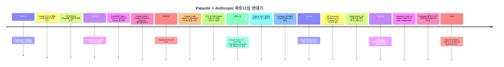

---

## 2. 통합의 4개 레이어 — 전체 구조 이해

팔란티어와 Claude의 통합은 단일 지점이 아니라 **4개의 독립적 레이어**에서 동시에 발생한다.

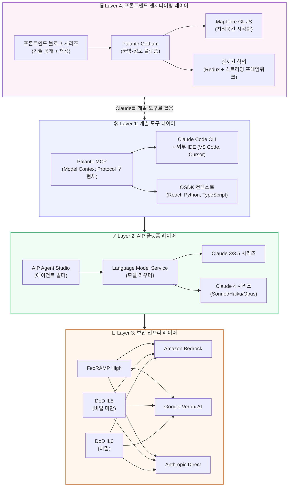

---

## 3. 레이어 1: 개발 도구 — Palantir MCP × Claude Code

### 3.1 Palantir MCP란

Palantir MCP(Model Context Protocol)는 팔란티어가 Anthropic의 MCP 표준을 구현한 서버로, AI IDE와 AI 에이전트가 Foundry 플랫폼 전체를 자율적으로 탐색하고 조작할 수 있게 해준다. 단순히 코드 자동완성을 제공하는 것이 아니라, **데이터 통합에서 온톨로지 설정, 애플리케이션 개발까지 전 과정을 IDE를 벗어나지 않고 수행**할 수 있다.

팔란티어 공식 문서에는 **Claude Code Agent가 AIP Agent Studio 연동 방법에 대한 컨텍스트를 제공하는 스크린샷**이 실려 있다. 이것은 팔란티어가 자사 플랫폼의 공식 개발 워크플로우에 Claude를 명시적으로 채택했음을 의미한다.

### 3.2 Claude Code + Palantir MCP 설치

팔란티어 공식 문서에는 Claude Code CLI에 Palantir MCP를 설치하는 방법이 직접 명시되어 있다.

```bash
# 환경 변수 설정
export FOUNDRY_HOST="<your-foundry-hostname>"
export FOUNDRY_TOKEN=<token>

# Claude Code에 Palantir MCP 추가 (프로젝트 스코프 권장)
claude mcp add palantir-mcp \
  --scope project \
  -e FOUNDRY_TOKEN='${FOUNDRY_TOKEN}' \
  -- npx "-y" "palantir-mcp" "--foundry-api-url" "https://$FOUNDRY_HOST"
```

프로젝트 스코프로 설치하면 MCP 서버 설정이 현재 프로젝트에만 적용된다. 이는 팀 간에 서로 다른 Foundry 환경을 사용할 때 격리를 보장한다.

### 3.3 Palantir MCP가 제공하는 도구들

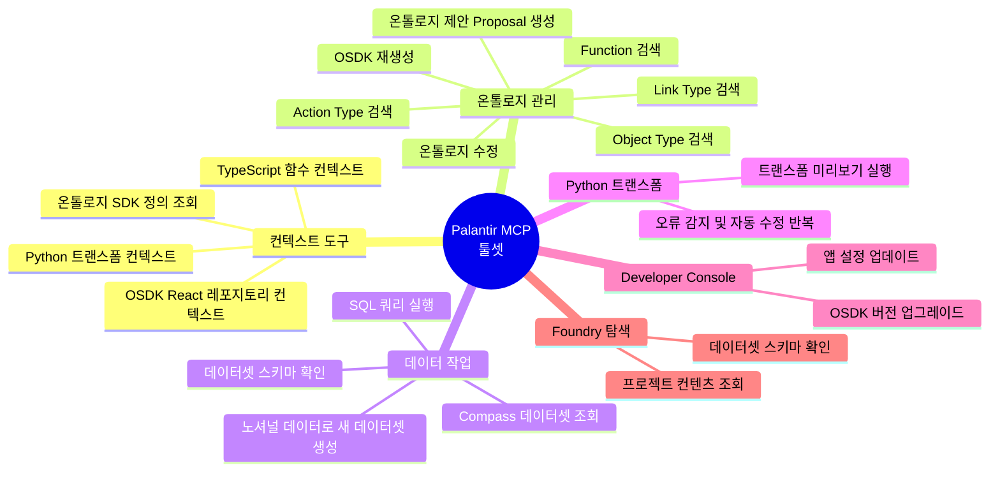

### 3.4 실제 개발 워크플로우: Claude Code + Palantir MCP

팔란티어 프론트엔드 개발자가 React 기반 OSDK 앱을 개발하는 일상적 시나리오를 추적해보면 다음과 같다.

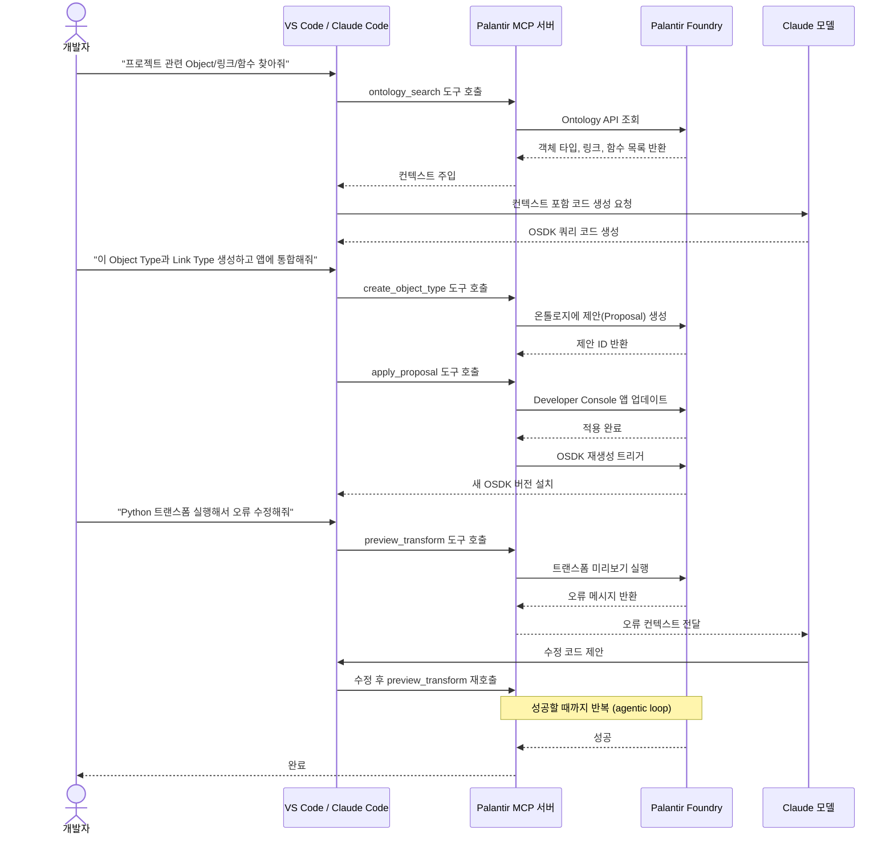

### 3.5 MCP가 인식하는 레포지토리 유형

Palantir MCP는 현재 레포지토리를 자동으로 인식하고 맞춤 컨텍스트를 주입한다.

| 레포지토리 타입 | MCP 제공 컨텍스트 | 주요 활용 |
|---|---|---|
| **React OSDK** | OSDK API, 타입 정의, 컴포넌트 패턴 | 프론트엔드 앱 개발 |
| **Python Transform** | 트랜스폼 API, 실행 환경, 오류 수정 루프 | 데이터 파이프라인 |
| **TypeScript Function** | 함수 정의, OSDK 쿼리 패턴 | 백엔드 로직 |
| **Python Function (v2)** | OSDK for Python, 외부 API 호출 패턴 | 서버리스 함수 |

---

## 4. 레이어 2: AIP 플랫폼 내 Claude 모델 로드맵

### 4.1 모델 진화 타임라인

팔란티어 AIP 공식 릴리즈 노트를 기반으로 재구성한 Claude 모델 통합 이력이다.

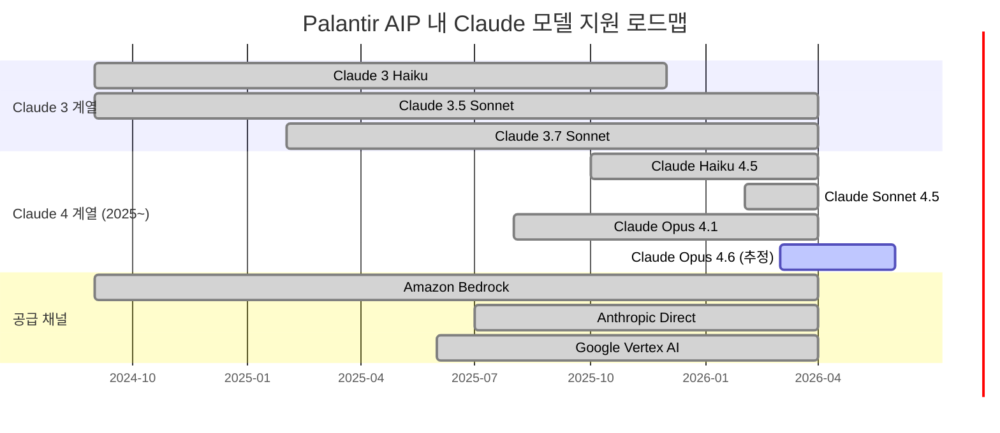

### 4.2 AIP 내 모델 선택 아키텍처

AIP의 Language Model Service는 Claude를 포함한 여러 LLM을 동일한 인터페이스로 접근할 수 있게 해주는 **모델 라우터** 역할을 한다.

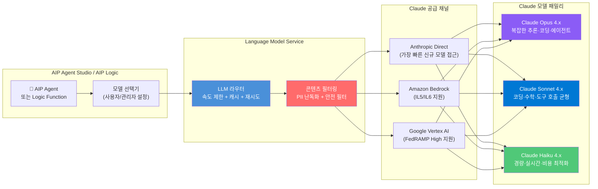

### 4.3 모델별 활용 시나리오

| 모델 | 특성 | Palantir AIP 내 최적 사용 사례 |
|---|---|---|
| **Claude Opus 4.x** | 200K 컨텍스트, 고급 추론, 멀티스텝 | 복잡한 수사 분석, 군사 작전 계획 지원, 긴 문서 분석 |
| **Claude Sonnet 4.x** | 코딩·수학·추론·도구 호출 균형 | AIP Agent 기본 모델, OSDK 코드 생성, 데이터 추출 |
| **Claude Haiku 4.x** | 고속·저비용·실시간 | 지도 위 실시간 라벨링, 대화형 UI 보조, 배치 분류 |

---

## 5. 레이어 3: 보안 인프라 — FedRAMP × IL5 × IL6

### 5.1 미국 정부 클라우드 보안 등급 체계

팔란티어와 Claude의 통합이 특별한 이유는 **가장 엄격한 보안 등급 환경에서 동작한다**는 점이다.

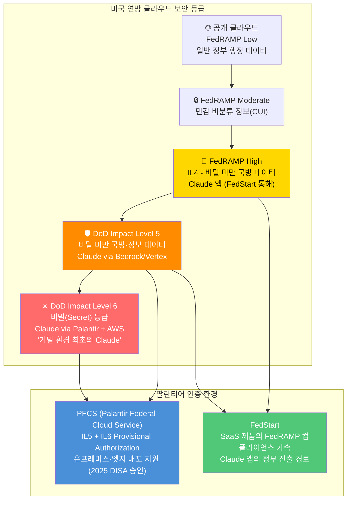

### 5.2 멀티클라우드 전략

Claude 앱은 단일 클라우드에 묶여 있지 않다. 팔란티어 FedStart 구조는 여러 클라우드 추론 서비스를 동시에 지원한다.

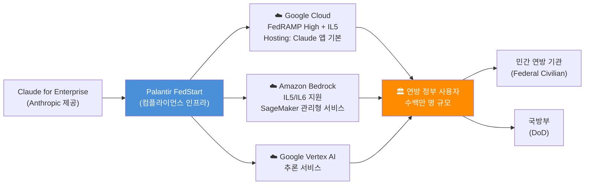

---

## 6. 레이어 4: 프론트엔드 엔지니어링 — 현장 기술 블로그 분석

### 6.1 "Drawing Circles on Maps" (2026-03-03)

팔란티어 프론트엔드 블로그의 첫 번째 글은 극지방에서 해군 함정의 타격 범위를 지도에 정확하게 표시하는 문제를 다룬다. 이 글의 기술적 핵심은 다음과 같다.

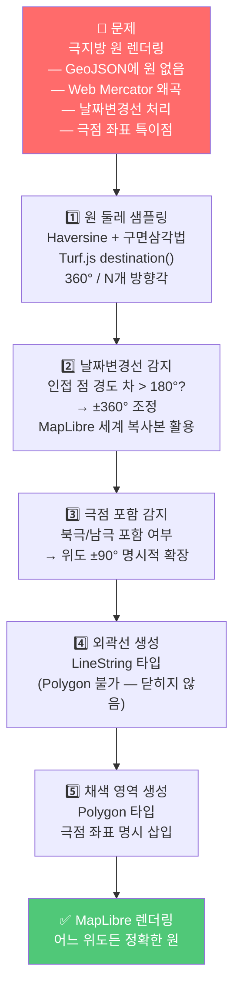

**Claude와의 연결점**: 이 블로그가 존재하는 이유 자체가 Claude와 간접 연결된다. 팔란티어 프론트엔드 엔지니어들이 일상적으로 Claude Code + Palantir MCP를 사용해 OSDK 기반 앱을 개발하는 환경에서, 이러한 복잡한 지리공간 로직을 구현할 때 Claude가 Haversine 공식 적용, GeoJSON 구조 생성, TypeScript 타입 정의 등에 직접 관여한다.

### 6.2 "Redefining Real-Time Map Collaboration" (2026-03-?)

두 번째 블로그는 Palantir Gotham의 **Gaia Follow Along Mode**를 다룬다. 이 기능은 군사 훈련 중 여러 분석관이 같은 지도 뷰를 실시간으로 공유하고 따라갈 수 있게 해주는 협업 도구다.

핵심 기술 도전 과제들을 정리하면 다음과 같다.

| 도전 과제 | 해결 방법 | 사용 기술 |
|---|---|---|
| **공유 상태 동기화** | 내부 공유 상태 스트리밍 프레임워크 + Redux | Redux, WebSocket |
| **순서 보장** | 단조 증가 업데이트 인덱스 (monotonically increasing index) | 커서 이벤트 정렬 |
| **팔로워 체이닝 방지** | 순환 팔로우 감지 알고리즘 | 그래프 사이클 탐지 |
| **권한 기반 참여** | 아티팩트 레벨 구독 + 권한 확인 | Palantir 마킹 시스템 |
| **실시간 커서 동기화** | 이벤트 인덱스 기반 순서화 | 분산 상태 동기화 |

**결과**: 단일 사용자의 요청으로 군사 훈련에서 시범 도입 → 해당 훈련의 "#1 기술적 성과"로 선정 → 전사 공유 → 다른 팀들의 데모 요청 쇄도

이것은 팔란티어 프론트엔드 엔지니어링의 특성을 압축적으로 보여준다. 사용자가 명시적으로 요청하지 않은 기능을 현장의 pain point에서 역으로 설계하고, 실제 전투 환경에서 검증받는 방식이다.

---

## 7. Palantir Ontology와 Claude의 결합 — AIP 아키텍처 심층 분석

### 7.1 Ontology-Centric 아키텍처

팔란티어 AIP의 가장 중요한 설계 결정은 **LLM이 아닌 온톨로지(Ontology)를 플랫폼의 중심에 두는 것**이다. 이것이 단순히 LLM을 데이터 스택에 연결한 경쟁 플랫폼들과 근본적으로 다른 점이다.

Motley Fool(2026-04-03)의 분석에 따르면, AIP의 핵심은 "지저분한 데이터 사일로를 단일 지식 그래프로 매핑하는 온톨로지 시각화"이며, 이것이 Claude 같은 범용 AI와 차별화되는 지점이다.

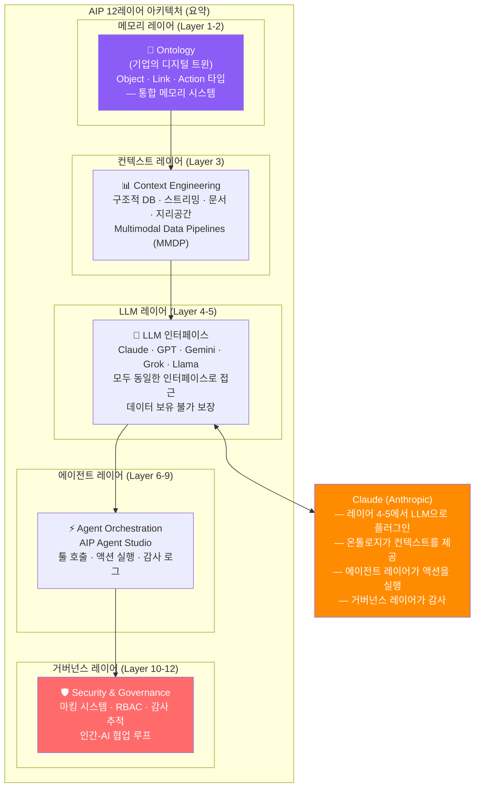

### 7.2 Claude가 온톨로지에 연결될 때 달라지는 것

Claude를 단독으로 사용할 때와 Palantir AIP를 통해 온톨로지에 연결해 사용할 때의 차이를 구체적으로 살펴보면 다음과 같다.

**단독 Claude**: "이 데이터를 분석해줘" → 일반적 분석 제공, 세션 종료 시 기억 소실

**온톨로지 연결 Claude**: "이 공급망 Object들의 리스크를 분석해" → 실제 Object 타입·속성·링크를 조회하고, 회사의 정의된 Action Type으로 실제 데이터를 업데이트하며, 모든 조회와 수정이 감사 로그에 기록되고, 다음 세션에도 동일한 온톨로지 컨텍스트가 유지된다.

이 차이가 팔란티어가 Claude를 "원자재(raw LLM)"로 받아 가공하는 방식의 핵심이다.

---

## 8. Ontology MCP × Claude Skills — 선언적 AI 개발의 실제

### 8.1 Claude Skills와 Ontology MCP의 통합

팔란티어 공식 문서는 **Claude Skills(재사용 가능한 명령 세트)를 Ontology MCP 툴과 통합**하는 방법을 명시적으로 지원한다. 이것은 Claude를 단순한 코드 생성 도구가 아니라, 온톨로지 레벨에서 복잡한 비즈니스 로직을 인코딩하는 에이전트로 활용하는 접근이다.

팔란티어 문서에 실린 실제 예시 Skill:

```yaml
# Palantir Ontology MCP용 Claude Skill 예시
---
name: get-or-create-task
description: >
  프로젝트 내에서 제목으로 Task를 검색하고,
  있으면 반환하고 없으면 새로 생성합니다.
---

# Get or Create Task

특정 프로젝트 내에서 제목으로 Task를 찾거나,
없으면 새 Task를 생성합니다.

## Instructions

1. 검색 툴로 Task 제목 검색:
   - Tool: `search-osdk-todo-task`
   - `project_id`가 주어졌으면 필터 적용

2. 결과 평가:
   - 매치 발견: 기존 Task 반환
   - 복수 매치: 첫 번째 반환
   - 없으면: 새 Task 생성으로 진행

3. 새 Task 생성 (없는 경우만):
   - Tool: `create-osdk-todo-task`
   - 필수: `title`, `project_id`
   - 선택: `description`, `status`, `assigned_to`, `start_date`, `due_date`

4. Task 상세정보 반환 (ID, 제목, 프로젝트, 상태, 담당자 포함)
```

### 8.2 MCP 서버 설명과 에이전트 지시 패턴

팔란티어 문서에 따르면 Claude 같은 일부 MCP 클라이언트는 서버 설명을 읽어 에이전트 컨텍스트에 주입한다. 이 서버 레벨 지시를 통해 에이전트의 행동 패턴을 사전에 정의할 수 있다.

```
[MCP 서버 설명 예시]
이 서버는 물류 관리 온톨로지에 접근합니다.
주요 규칙:
- Action 호출 전에 항상 search 툴로 기본 키를 먼저 확인할 것
- 배송 Order Object 수정 시 반드시 현재 상태를 조회한 후 진행
- 고객 PII(개인식별정보)가 포함된 필드는 로그에 기록하지 말 것
```

이 패턴은 팔란티어 프론트엔드 개발자가 Claude를 통해 온톨로지를 수정할 때 중복 생성이나 잘못된 상태 전환 같은 오류를 사전에 방지하는 데 직접 활용된다.

---

## 9. Claude CoWork vs Palantir AIP — 경쟁인가 공존인가

### 9.1 Claude CoWork의 등장

2026년 초, Anthropic이 출시한 **Claude CoWork**는 Claude가 로컬 파일, 애플리케이션, 브라우저에 접근해 복잡한 멀티스텝 워크플로우를 단일 대화 인터페이스로 압축하는 에이전틱 제품이다.

일부 투자자들은 범용 AI 에이전트가 결국 특수 구독 도구를 대체할 것이라는 우려를 제기했다. Palantir AIP가 그 위협 대상이 될 수 있다는 분석이 나왔다.

### 9.2 두 제품의 실질적 차이

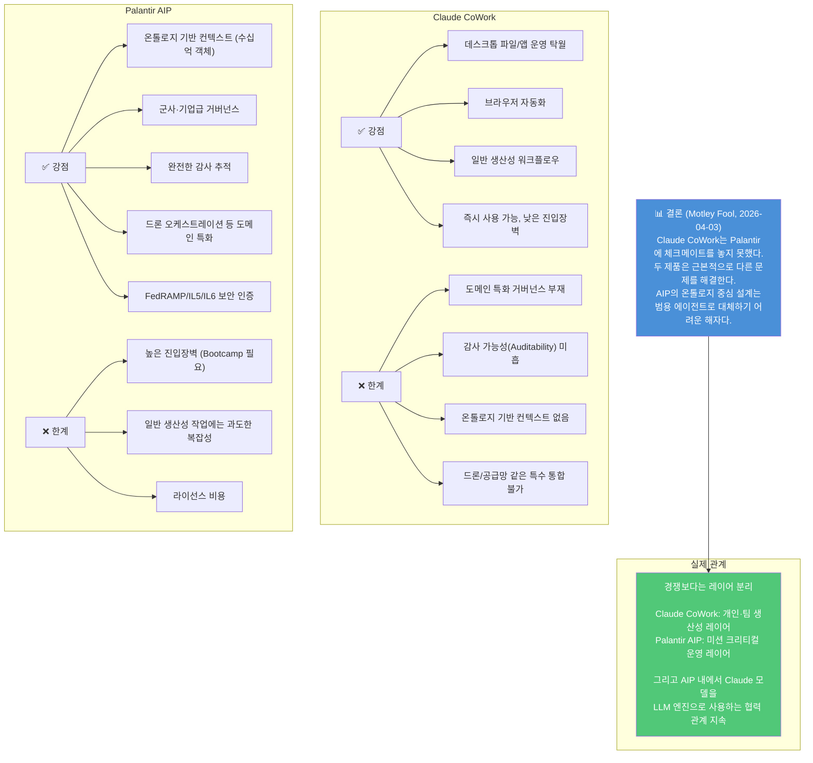

### 9.3 공존의 구체적 형태

실제로 두 제품은 서로 다른 레이어에서 공존한다. 팔란티어 개발자가 Palantir MCP + Claude Code로 OSDK 앱을 개발하고(Layer 1), 완성된 앱이 AIP Agent Studio에서 Claude Sonnet을 LLM으로 사용해 운영되며(Layer 2), 일상적인 문서 작업이나 이메일 처리에는 Claude CoWork를 사용하는(별도 레이어) 형태가 병렬 운영된다.

---

## 10. 2026년 3월 펜타곤 사태 — 파트너십의 균열과 지속

### 10.1 사태의 배경

2026년 2월, 미국 특수부대가 베네수엘라 대통령 니콜라스 마두로를 체포하는 작전에서 Claude가 활용됐다는 보도가 나왔다. 이후 Anthropic이 사용 제한 조건을 두고 국방부(DoD)와 충돌했다.

Anthropic이 거부한 두 가지 조건은 다음과 같다.
- **미국인에 대한 대규모 국내 감시** 허용
- **인간 감독 없는 완전 자율 무기** 운용 허용

DoD는 Anthropic을 "공급망 위험"으로 지정했다.

### 10.2 팔란티어의 입장

2026년 3월, AIPcon 9에서 Alex Karp CEO는 명확한 입장을 밝혔다.

> "국방부는 Anthropic을 단계적으로 퇴출할 계획이지만, 현재는 아직 퇴출되지 않았습니다. 우리 제품은 Anthropic과 통합되어 있으며, 미래에는 다른 LLM과도 통합될 것입니다."

이것이 팔란티어의 **모델 불가지론(Model Agnosticism)** 전략의 진가를 보여주는 순간이었다. Claude가 퇴출되더라도 AIP 아키텍처는 다른 LLM으로 즉시 대체할 수 있도록 설계되어 있다.

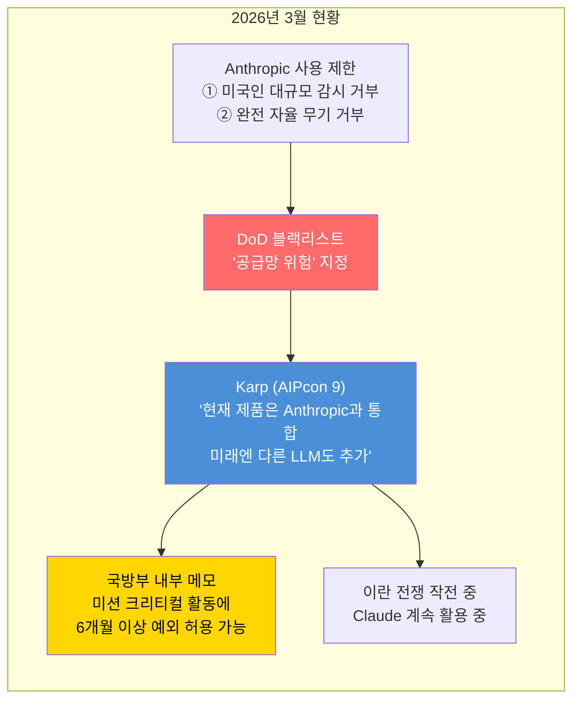

### 10.3 프론트엔드 엔지니어링 블로그와의 관계

흥미롭게도 팔란티어의 프론트엔드 블로그 시리즈는 이 사태와 거의 같은 시기에 시작됐다. 정치적 불확실성 속에서도 팔란티어가 기술 블로그를 통해 엔지니어 채용과 기술 신뢰도 구축에 집중하는 전략적 선택은 의미심장하다. 플랫폼의 기술적 가치는 어떤 LLM을 쓰느냐와 무관하게 온톨로지와 아키텍처에 있다는 메시지이기도 하다.

---

## 11. 프론트엔드 개발자가 얻는 실질적 이점

### 11.1 Claude Code + Palantir MCP로 달라지는 개발 경험

팔란티어 프론트엔드 개발자 관점에서 Claude 통합이 가져오는 구체적 변화를 정리하면 다음과 같다.

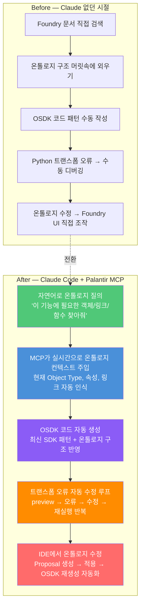

### 11.2 AIP Document Intelligence — Claude 기반 문서 추출

2026년 2월 GA(정식 출시)된 **AIP Document Intelligence**는 Claude를 백엔드로 활용한 문서 추출 워크플로우다. 프론트엔드 개발자 관점에서 이것이 의미하는 바는 다음과 같다.

```
사용자 시나리오:
- 수백 페이지 유지보수 매뉴얼 PDF → 구조화된 Markdown으로 변환
- 규제 신청서 → 표 형태 데이터 추출
- 인보이스 컬렉션 → 정형 데이터로 배치 처리
- 다중 컬럼 레이아웃, 혼합 언어 콘텐츠 지원

추출 전략:
1. Raw Text (기본 OCR)
2. OCR (레이아웃 인식)
3. Layout-aware OCR + Vision LLM (Claude 활용) ← 복잡한 문서
4. 전략 평가: 품질·속도·토큰 비용 메트릭 비교
5. 최적 전략 선택 → Python Transform 자동 생성
6. 전체 문서 컬렉션 배치 처리
```

이전에 수일이 걸리던 문서 컬렉션 추출이 수 시간으로 단축된다.

---

## 12. 미래 방향성과 전망

### 12.1 통합의 심화 방향

현재 확인된 트렌드와 팔란티어·Anthropic의 공개 발언을 기반으로 향후 통합 방향을 전망한다.

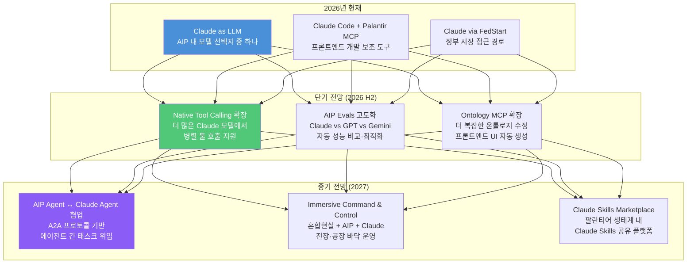

### 12.2 프론트엔드 엔지니어를 위한 핵심 시사점

팔란티어 프론트엔드 엔지니어링 + Claude 통합에서 개발자가 실질적으로 가져가야 할 인사이트를 정리하면 다음과 같다.

**"MCP는 단순한 툴 연결이 아니다"**
Palantir MCP는 IDE와 플랫폼 사이의 의미적 다리다. Claude가 온톨로지 구조를 실시간으로 이해하고 코드를 생성한다는 것은, 일반적인 코드 자동완성과 질적으로 다른 경험이다. 개발자는 "내 회사의 데이터 모델을 아는 AI 페어 프로그래머"와 함께 일하는 셈이다.

**"모델 불가지론은 개발자에게도 유효하다"**
팔란티어가 Claude, GPT, Gemini를 동일한 인터페이스로 추상화한 것처럼, 개발자도 특정 모델에 종속되지 않는 프롬프트·워크플로우 설계 역량이 중요해진다. 2026년 3월의 펜타곤 사태가 보여줬듯, LLM 공급자는 바뀔 수 있다.

**"프론트엔드 엔지니어링은 이제 AI 거버넌스 설계다"**
Drawing Circles on Maps와 Real-Time Collaboration 블로그가 공통으로 보여주는 것은 "정확성"과 "신뢰성"에 대한 집착이다. 미사일 방어 범위가 1% 틀리거나, 군사 훈련 중 지도 뷰가 동기화되지 않으면 인명 피해로 이어질 수 있다. 이 맥락에서 Claude가 생성한 코드의 감사 가능성, 온톨로지 기반 데이터 정확성, 그리고 실패 시나리오 설계는 "좋은 UX" 수준이 아닌 "운영 요건"이다.

---

## 부록: 빠른 참조 — Claude 모델 × Palantir AIP 접근 방법

| Claude 모델 | 공급 채널 | 보안 등급 | AIP 내 권장 사용처 |
|---|---|---|---|
| Claude Opus 4.x | Direct / Bedrock / Vertex | IL5/IL6 | 복잡한 수사 분석, 작전 계획 |
| Claude Sonnet 4.x | Direct / Bedrock / Vertex | IL5/IL6 | AIP Agent 기본, OSDK 생성 |
| Claude Haiku 4.x | Direct / Bedrock / Vertex | IL5/IL6 | 실시간 UI, 배치 분류 |

| 통합 방식 | 대상 | 설치/설정 |
|---|---|---|
| Claude Code + Palantir MCP | 프론트엔드·백엔드 개발자 | `claude mcp add palantir-mcp --scope project` |
| AIP Agent Studio 내 모델 선택 | 에이전트 빌더 | Control Panel → Model Family 활성화 |
| Ontology MCP + Claude Skills | 도메인 전문가·개발자 | Ontology Manager → Agent tool description |
| FedStart (Claude 앱) | 연방정부 사용자 | FedRAMP High / DoD IL5 환경 |

---

*작성 일자: 2026-04-06*  
*참고: 본 문서는 Palantir 공식 블로그, 팔란티어 공식 문서(palantir.com/docs), 공개 보도자료를 기반으로 작성되었습니다. 일부 전망은 공개된 정보를 근거로 한 추론을 포함합니다.*
