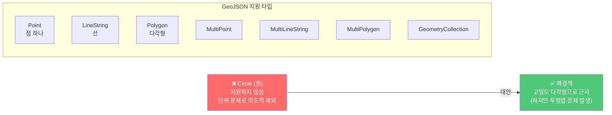
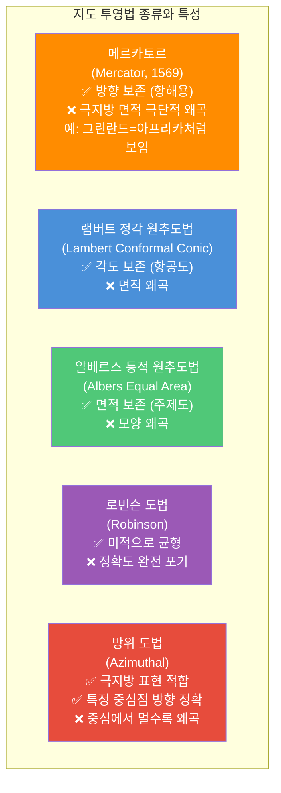
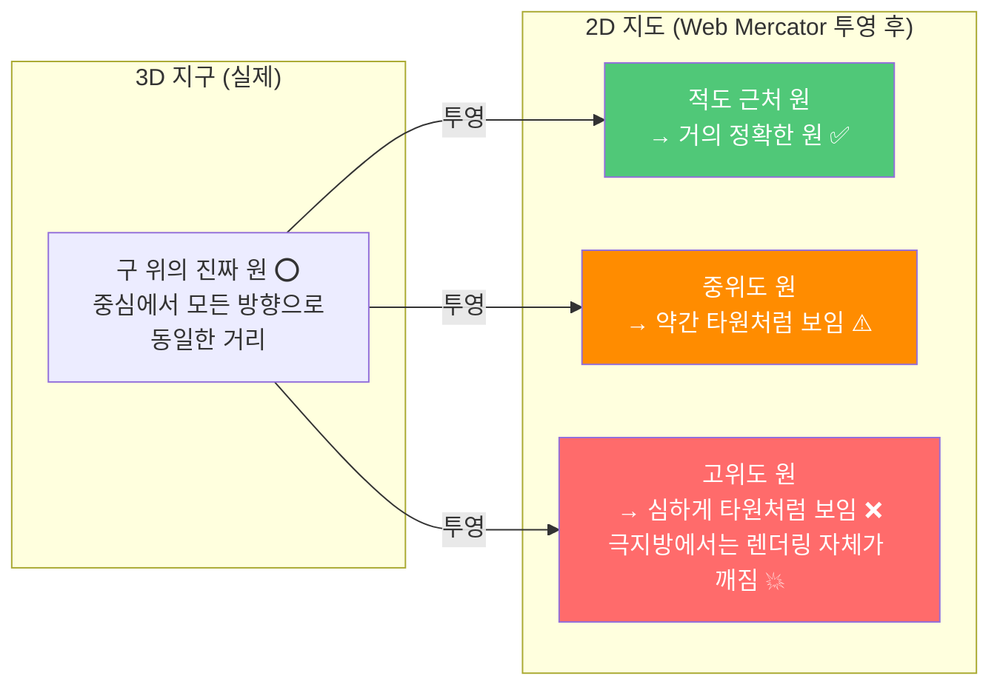
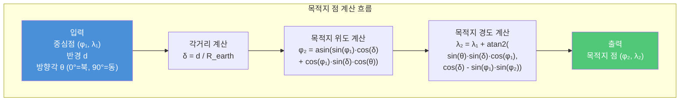
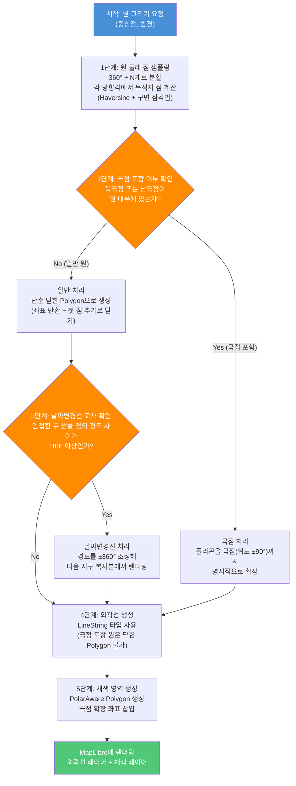
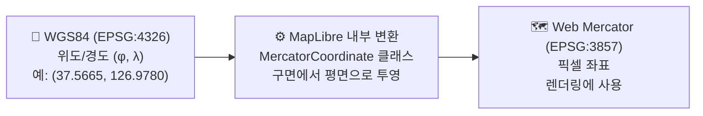
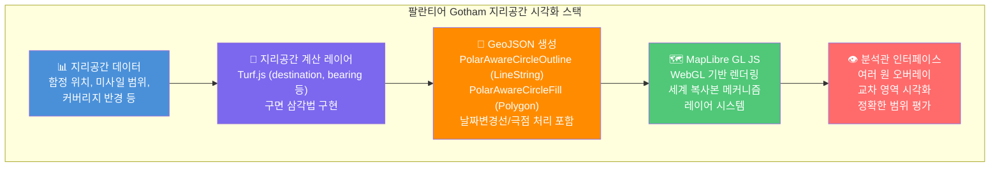
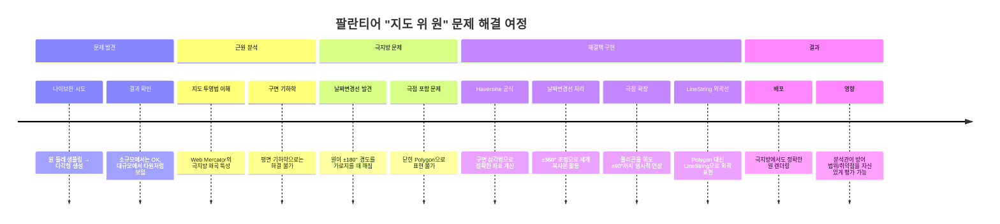

### 극지방 작전과 미사일 방어 범위를 위한 정밀 지리공간 시각화

> **원문**: [Frontend Engineering at Palantir: Drawing Circles on Maps](https://blog.palantir.com/frontend-engineering-at-palantir-drawing-circles-on-maps-237f8b455443)  
> **저자**: Nikita (워싱턴 D.C. 소재 팔란티어 프론트엔드 엔지니어)  
> **발행일**: 2026년 3월 3일

---

## 목차

1. [글의 배경과 시리즈 소개](#1-글의-배경과-시리즈-소개)
2. [왜 원(Circle)이 중요한가 — 실제 사용 사례](#2-왜-원이-중요한가--실제-사용-사례)
3. [GeoJSON: 웹 지도의 표준 포맷과 그 한계](#3-geojson-웹-지도의-표준-포맷과-그-한계)
4. [지도 투영법(Map Projection): 모든 문제의 근원](#4-지도-투영법map-projection-모든-문제의-근원)
5. [Web Mercator와 극지방 문제](#5-web-mercator와-극지방-문제)
6. [구면 삼각법과 Haversine 공식](#6-구면-삼각법과-haversine-공식)
7. [핵심 구현 전략: 단계별 해결 과정](#7-핵심-구현-전략-단계별-해결-과정)
8. [날짜변경선(Antimeridian) 처리](#8-날짜변경선antimeridian-처리)
9. [극점 처리: 폴리곤의 재정의](#9-극점-처리-폴리곤의-재정의)
10. [MapLibre GL JS 라이브러리 심층 분석](#10-maplibre-gl-js-라이브러리-심층-분석)
11. [Turf.js: 지리공간 계산 라이브러리](#11-turfjs-지리공간-계산-라이브러리)
12. [팔란티어 Gotham과의 연결: 실제 운영 가치](#12-팔란티어-gotham과의-연결-실제-운영-가치)
13. [전체 기술 흐름 요약](#13-전체-기술-흐름-요약)

---

## 1. 글의 배경과 시리즈 소개

이 글은 팔란티어(Palantir Technologies)가 운영하는 공식 엔지니어링 블로그의 "팔란티어 프론트엔드 엔지니어링" 시리즈의 일부다. 시리즈의 목적은 팔란티어의 프론트엔드 작업이 단순한 웹 애플리케이션 개발을 훨씬 뛰어넘는다는 것을 보여주는 데 있다.

팔란티어 프론트엔드 엔지니어들은 임무 수행에 중대한 영향을 미치는 의사결정 인터페이스를 설계하고, 인사이트를 실제 행동으로 전환하는 운영 애플리케이션을 구축하며, 방대한 데이터셋을 처리하는 시스템을 만든다. 이 과정에서 단순히 "사용자가 무엇을 원하는가"를 넘어, "네트워크가 불안정하고, 위험 부담이 크며, 오류 허용 범위가 0에 가까운 상황에서 사용자가 무엇을 필요로 하는가"를 설계한다.

이번 글의 저자인 Nikita는 워싱턴 D.C.에 근무하는 프론트엔드 엔지니어로, 자신이 겪은 기술적 난관을 솔직하게 공유한다. 요청은 단순했다. **극지방에서 작전 중인 해군 함정의 타격 범위를 시각화해달라**는 것. 즉, 지도 위에 원을 그리는 일이었다. 그런데 이 "단순한" 작업이 지도 투영법, 구면 삼각법, 날짜변경선 처리라는 수학적 여정으로 이어졌다.

---

## 2. 왜 원이 중요한가 — 실제 사용 사례

지도 위의 원은 단순한 시각적 장식이 아니다. 팔란티어가 구축하는 국방·정보 소프트웨어인 **Palantir Gotham** 플랫폼에서 원은 실제 운영상의 의사결정 도구다. 잘못 그려진 원은 잘못된 정보를 기반으로 한 의사결정으로 직결된다.

원이 사용되는 구체적 맥락은 다음과 같다.

- **미사일 방어 시스템의 방어 범위**: 특정 지점에서 미사일 방어망이 커버하는 실제 반경을 정확히 시각화해야 한다. 1%의 오차도 방어 공백으로 이어질 수 있다.
- **셀 타워 네트워크 커버리지**: 통신 인프라의 실제 신호 도달 범위를 표시한다.
- **폭발물 위협의 피해 반경(Blast Radius)**: 위협 평가 시 정확한 피해 구역 시각화가 필수적이다.
- **해군 함정의 작전 범위**: 특정 항구를 출발한 함정이 재급유 없이 도달할 수 있는 최대 범위를 나타낸다.

모든 경우에서 시각화의 **정확성은 선택이 아닌 필수**다.

---

## 3. GeoJSON: 웹 지도의 표준 포맷과 그 한계

### 3.1 GeoJSON이란

팔란티어는 지리공간 데이터 시각화에 **MapLibre**라는 오픈소스 매핑 라이브러리를 활용한다. MapLibre에 선, 다각형, 점 등의 도형을 그리기 위해서는 **GeoJSON** 형식으로 데이터를 공급해야 한다.

GeoJSON은 웹 애플리케이션을 위한 완벽한 포맷이다. 순수한 JSON이므로 JavaScript에서 변환 없이 그대로 사용할 수 있고, 사람이 읽을 수 있으며, 가볍고, 웹 지도의 사실상 표준(de facto standard)이다. MapLibre의 API는 GeoJSON을 중심으로 설계되었다.

### 3.2 GeoJSON에 원이 없는 이유

문제는 **GeoJSON 스펙이 원(Circle)을 지원하지 않는다**는 것이다. 스펙은 LineString, Polygon, Point와 이들의 컬렉션만 지원하며, 의도적으로 원을 제외했다.

이유가 있다. 다각형은 좌표 꼭짓점만으로 완전히 정의되지만, 원은 **반지름(radius)** 이 필요하다. 반지름의 단위를 무엇으로 할지 선택해야 하는데, 미터? 마일? 위도의 각도? 각 선택마다 다른 결과가 나온다. GeoJSON은 이런 단위 결정을 스펙에 인코딩하지 않고, 좌표 기반의 보편적 형태를 유지하기로 했다. 거리 계산과 단위는 애플리케이션 레이어의 몫으로 남겨진 것이다.

하지만 더 근본적인 문제가 있다. **지도 투영법이 원이라는 개념 자체를 왜곡한다.**



---

## 4. 지도 투영법(Map Projection): 모든 문제의 근원

### 4.1 투영의 근본적 불가능성

지도학(Cartography)에서 **지도 투영법**은 구의 곡면을 2차원 평면으로 표현하려는 시도다. 여기에는 수학적으로 해결할 수 없는 근본적인 문제가 있다. **구를 왜곡 없이 평면으로 펼치는 것은 불가능하다.** 마치 오렌지 껍질을 찢지 않고 완전히 평평하게 펼칠 수 없는 것과 같다.

모든 투영법은 필연적으로 다음 중 하나 이상을 왜곡한다.

- **넓이(Area)**: 실제 면적 비율이 달라진다
- **모양(Shape)**: 지역의 형태가 변한다
- **거리(Distance)**: 두 점 사이의 거리 비율이 달라진다
- **방향(Direction)**: 나침반 방향이 달라진다

이는 트레이드오프의 문제다. 모든 지도 투영법은 무언가를 희생한다.

### 4.2 주요 지도 투영법 비교



### 4.3 메르카토르 투영법이 지배적이 된 이유

메르카토르 투영법은 1569년 게라르두스 메르카토르(Gerardus Mercator)가 만든 이후 세계 지도의 표준이 되었다. 이유는 단순하다. **항해에 극도로 유용**하기 때문이다. 메르카토르 지도에서 어떤 직선이든 일정한 나침반 방향(rhumb line)을 나타내므로, 선원들이 항로를 설정하고 따라가기 쉬웠다. 이 실용적 장점 덕분에 수 세기 동안 표준으로 유지되었다.

그러나 이 투영법은 적도에서 멀어질수록, 즉 극지방에 가까워질수록 넓이를 극단적으로 과장한다. 가장 유명한 예는 그린란드와 아프리카다. 메르카토르 지도에서 두 지역은 비슷한 크기로 보이지만, 실제로 아프리카는 그린란드의 약 **14배** 크기다.

> **ThetrueSize.com**: 이 왜곡을 직관적으로 체험할 수 있는 온라인 도구. 나라를 드래그해서 실제 크기를 비교할 수 있다.

---

## 5. Web Mercator와 극지방 문제

### 5.1 Web Mercator(EPSG:3857)

오늘날 대부분의 온라인 지도 서비스(Google Maps, OpenStreetMap, MapLibre 등)는 메르카토르의 디지털 최적화 버전인 **Web Mercator(EPSG:3857)** 를 사용한다. 연산 효율이 높고 지역 형태를 잘 보존하기 때문이다. 동네 지도가 구글 맵에서 "올바르게" 보이는 이유가 여기 있다.

그러나 Web Mercator는 이론적으로 **북위/남위 85.05°까지만** 지원한다. 극점(±90°)에서 투영값이 수학적으로 무한대(infinity)로 발산하기 때문에 극점 자체를 표현할 수 없다. 더불어 고위도 지역의 넓이 왜곡은 메르카토르의 모든 단점을 고스란히 계승한다.

### 5.2 원이 타원으로 보이는 이유

처음에 나이브하게 접근하면, "원은 점이 많은 다각형이다"라고 생각하게 된다. 원의 둘레에서 점들을 샘플링하고 연결하면 원이 된다.

작은 반경(몇 킬로미터 정도)에서는 이 방법이 잘 동작한다. 그러나 반경이 수천 킬로미터로 커지면 심각한 문제가 생긴다. **평면 지도에서 원이 타원처럼 보인다.**

이것은 오류가 아니다. 3D 지구본에서 보면 정확한 원이다. 문제는 Web Mercator 투영법이 적도에서 멀어질수록 동서 방향을 과장 확대하는데, 원의 중심이 고위도에 있을 경우 북쪽 부분(더 고위도)과 남쪽 부분(더 저위도)이 투영법에서 서로 다른 비율로 확대되기 때문이다. 그 결과 구 위에서는 원이지만 평면 지도에서는 타원처럼 렌더링된다.



### 5.3 극지방에서 원 렌더링이 완전히 깨지는 이유

더 심각한 문제는 북극점을 포함하는 원을 그리려 할 때 발생한다. 나이브한 샘플링 + 연결 방식으로 북극점을 포함하는 원을 렌더링하면 세 가지 문제가 동시에 발생한다.

**첫째**, 북극점이 결과 도형에 포함되지 않는다. 원의 상단이 잘려 나간다.

**둘째**, 지도의 왼쪽과 오른쪽 가장자리에서 원이 반복(repeat)되어 나타난다. 원의 가장 왼쪽 점과 가장 오른쪽 점이 지구를 반 바퀴 이상 떨어져 있기 때문이다.

**셋째**, 원의 가장 왼쪽 점과 오른쪽 점을 직접 연결하면 안 된다. 이 두 점은 날짜변경선(International Date Line, 경도 ±180°)을 건너 연결되어야 한다.

결론적으로, **Mercator 투영법에서 북극점을 포함하는 원은 닫힌 다각형이 아니다.** 지구를 빙 둘러가는 정현파(sinusoidal line)다.

---

## 6. 구면 삼각법과 Haversine 공식

### 6.1 왜 평면 기하학이 아닌 구면 기하학인가

지구 표면은 구(球, sphere)다. 구 위에서의 거리와 방향을 계산할 때 고등학교에서 배운 평면 피타고라스 정리를 그대로 적용할 수 없다. 구면 삼각법(Spherical Trigonometry)이 필요하다.

구면 기하학의 몇 가지 특이한 특성이 있다. 평행선이 존재하지 않는다. 두 직선(대권, Great Circle)은 항상 두 점에서 만난다. 두 직선 사이의 각도는 대응하는 대권 평면 사이의 각도로 정의된다.

### 6.2 Haversine 공식

**Haversine 공식**은 구 위의 두 점 사이의 대권 거리(Great-Circle Distance)를 위도·경도로부터 계산하는 공식이다. 항해에서 핵심적으로 사용되었으며, 1801년 호세 데 멘도사 이 리오스(José de Mendoza y Ríos)가 처음 사용했고 1835년 제임스 인맨(James Inman)이 "haversine"이라는 이름을 붙였다.

Haversine이라는 이름은 "half-versed sine(반 버시드 사인)"의 줄임말로, `hav(θ) = sin²(θ/2)`로 정의된다.

두 점 사이의 대권 거리를 구하는 Haversine 공식:

```
a = sin²(Δφ/2) + cos(φ₁) · cos(φ₂) · sin²(Δλ/2)
c = 2 · atan2(√a, √(1-a))
d = R · c
```

여기서 φ는 위도(radians), λ는 경도(radians), R은 지구 반지름(≈6,371 km), d는 두 점 사이의 거리다.

### 6.3 목적지 점 계산 (Destination Point)

원의 둘레 위의 점들을 샘플링하려면 "중심점, 거리(반경), 방향각(bearing)이 주어졌을 때 목적지 점은 어디인가?"를 계산해야 한다. 이 역시 구면 삼각법으로 풀어야 한다.

방향각 θ로 거리 d만큼 이동한 후의 목적지 위도·경도:

```
φ₂ = asin(sin(φ₁)·cos(δ) + cos(φ₁)·sin(δ)·cos(θ))
λ₂ = λ₁ + atan2(sin(θ)·sin(δ)·cos(φ₁), cos(δ) - sin(φ₁)·sin(φ₂))
```

여기서 δ = d/R (각거리, angular distance)이다.

이 수식을 구현한 것이 바로 글에서 언급한 **Turf.js의 `destination` 함수**다.



### 6.4 구면 법칙의 한계

Haversine 공식은 지구를 완전한 구(perfect sphere)로 가정한다. 실제 지구는 타원체(ellipsoid)로, 극지방에서의 반지름(6,356.752 km)이 적도에서의 반지름(6,378.137 km)보다 약간 작다. 따라서 Haversine 공식은 0.5% 이내의 오차를 가질 수 있다. 더 높은 정밀도가 필요한 경우 **Vincenty 공식** 또는 **Karney의 GeographicLib** 같은 타원체 기반 알고리즘을 사용한다.

---

## 7. 핵심 구현 전략: 단계별 해결 과정

### 7.1 전체 접근법 개요



### 7.2 1단계: 원 둘레 점 샘플링

```javascript
/**
 * 구면 삼각법을 사용해 원의 둘레 위 점들을 샘플링합니다.
 * Turf.js의 destination 함수를 내부적으로 사용합니다.
 */
function getSampledCirclePoints(center, radius, numPoints) {
  const coordinates = [];
  
  for (let i = 0; i < numPoints; i++) {
    // GeoJSON Polygon 스펙: 반시계 방향(counter-clockwise)
    // 따라서 -360을 곱해 반시계 방향으로 순회
    const bearing = (i * -360) / numPoints;
    
    // destination(): 중심점에서 radius 거리, bearing 방향의 좌표 계산
    // 내부적으로 Haversine 공식을 역산한 구면 삼각법 사용
    coordinates.push(
      destination(center, radius, bearing)
    );
  }
  
  return coordinates;
}
```

**샘플링 포인트 수의 트레이드오프**: 포인트 수가 많을수록 원이 부드럽게 보이지만, 렌더링 성능이 저하된다. 반경이 클수록 더 많은 포인트가 필요하다. 실무에서는 반경에 비례하여 동적으로 포인트 수를 조정하는 방식을 사용한다.

---

## 8. 날짜변경선(Antimeridian) 처리

### 8.1 날짜변경선이란

**날짜변경선(International Date Line)** 은 태평양 한가운데를 지나는 경도 ±180° 선이다. 지구를 동반구와 서반구로 나누는 기준선으로, 경도 -180°와 +180°는 같은 선이다. 이 선을 기준으로 날짜가 바뀐다(하루 앞서거나 뒤처진다).

웹 지도에서 날짜변경선은 렌더링의 복잡한 경계다. 경도 값이 -180°와 +180° 사이를 뛰어넘을 때(예: -170°에서 +170°로), 지도는 어느 쪽 방향으로 연결해야 할지 알 수 없다.

### 8.2 날짜변경선 감지 로직

```javascript
/**
 * 두 인접 점이 날짜변경선을 가로질러야 하는지 판단합니다.
 * 핵심 원리: 두 점의 경도 차이가 180°를 초과하면
 *            짧은 방향이 아닌 날짜변경선을 건너는 방향이 맞습니다.
 */
function shouldCrossAntimeridian(lon1, lon2) {
  return Math.abs(lon1 - lon2) > 180;
}
```

이 함수의 논리는 우아하다. 구 위에서 두 점 사이의 최단 경로는 절대 180° 이상의 경도 차이를 가로지르지 않는다. 만약 두 인접 샘플 점의 경도 차이가 180°를 넘는다면, 그것은 지구 반대편을 빙 돌아가는 것이 아니라 날짜변경선을 바로 건너는 것이 더 짧다는 의미다.

### 8.3 MapLibre의 "세계 복사본(World Copy)" 기능 활용

MapLibre는 경도 값의 -180°~+180° 범위 제한을 강제하지 않는다. 예를 들어 경도 200°는 동쪽으로 한 바퀴 더 간 위치, 즉 "다음 세계 복사본"에 렌더링된다. 이것이 날짜변경선 처리의 핵심 트릭이다.

```javascript
/**
 * 극지방을 인식하는 원 외곽선(LineString) 생성.
 * 날짜변경선을 건너는 경우 경도를 ±360° 조정합니다.
 */
function createPolarAwareCircleOutline(sampledPoints) {
  const lineCoordinates = [sampledPoints[0]];
  
  for (let i = 1; i < sampledPoints.length; i++) {
    const point = sampledPoints[i];
    const prevPoint = sampledPoints[i - 1];
    
    if (shouldCrossAntimeridian(point.lon, prevPoint.lon)) {
      // 날짜변경선을 건너야 하는 경우:
      // 경도를 ±360° 조정해 MapLibre가 "다음 지구 복사본"에 렌더링하도록 유도
      const adjustedLon = point.lon + (point.lon < 0 ? 360 : -360);
      lineCoordinates.push([adjustedLon, point.lat]);
    } else {
      lineCoordinates.push([point.lon, point.lat]);
    }
  }
  
  // 극점을 포함하는 원은 닫힌 Polygon이 아닌 LineString을 사용해야 함
  return {
    type: "LineString",
    coordinates: lineCoordinates
  };
}
```

**왜 외곽선에 Polygon 대신 LineString을 쓰는가?** 극점을 포함하는 원은 메르카토르 투영법에서 닫힌 다각형을 형성할 수 없다. 날짜변경선에서 끊어졌다가 반대쪽에서 다시 이어지는 열린 선(open line)이기 때문이다. GeoJSON의 LineString이 이 형태를 정확히 표현한다.

---

## 9. 극점 처리: 폴리곤의 재정의

### 9.1 채색 영역의 특별한 문제

외곽선은 LineString으로 처리할 수 있지만, **채색된 내부 영역(fill)** 은 반드시 닫힌 Polygon이어야 한다. 극점을 포함하는 원에서 폴리곤이 올바르게 닫히려면, 폴리곤을 극점(위도 ±90°)까지 명시적으로 확장해야 한다.

### 9.2 북극점 포함 원의 채색 처리

```javascript
/**
 * 극점을 포함하는 원의 채색 영역 생성.
 * 핵심: 날짜변경선을 가로지르는 지점에서 극점 좌표를 명시적으로 삽입합니다.
 */
function createPolarAwareCircleFill(sampledPoints) {
  let coordinates = [...sampledPoints];
  
  if (includesNorthPole(sampledPoints)) {
    // 날짜변경선을 가로질러야 하는 점의 인덱스를 찾음
    const crossingIndex = findAntimeridianCrossingIndex(sampledPoints);
    const point = sampledPoints[crossingIndex];
    
    coordinates = [
      ...coordinates.slice(0, crossingIndex),
      // 날짜변경선 건너편에서 같은 위도로 이동
      [point.lon + 360, point.lat],
      // 북극점(위도 90°)까지 올라감 - 두 번 (양쪽 날짜변경선 커버)
      [point.lon, 90],
      [point.lon + 360, 90],
      ...coordinates.slice(crossingIndex),
    ];
  }
  
  if (includesSouthPole(sampledPoints)) {
    const crossingIndex = findAntimeridianCrossingIndex(sampledPoints);
    const point = sampledPoints[crossingIndex];
    
    coordinates = [
      ...coordinates.slice(0, crossingIndex),
      // 남극점(위도 -90°)까지 내려감
      [point.lon, -90],
      [point.lon + 360, -90],
      [point.lon + 360, point.lat],
      ...coordinates.slice(crossingIndex),
    ];
  }
  
  return {
    type: "Polygon",
    coordinates: [coordinates]  // Polygon은 좌표 배열의 배열
  };
}
```

### 9.3 시각적으로 이해하는 극점 처리

```
메르카토르 지도에서 북극점을 포함하는 원:

경도: -180°                    0°                    +180°
      ┌──────────────────────────────────────────────┐
   90°│      ████████████████████████████████        │ ← 지도 상단 (북극)
      │   ████                              ████      │
      │ ████    "날짜변경선 건너"                ████ │
      │ ██ <-- 왼쪽 끝점                오른쪽 끝점 -> ██│
      │                                              │
      ...

올바른 처리:
1. 오른쪽 끝점에서 경도 +360 조정 (→ 동쪽 복사본에 렌더링)
2. 위도 90°(북극)까지 직선 추가
3. 폴리곤을 "지도 상단"을 감싸도록 확장
```

---

## 10. MapLibre GL JS 라이브러리 심층 분석

### 10.1 MapLibre란

**MapLibre GL JS**는 Mapbox GL JS의 오픈소스 포크(fork)다. Mapbox가 2021년 라이선스를 독점 소유권으로 변경하자, 커뮤니티가 마지막 오픈소스 버전을 포크하여 MapLibre 프로젝트를 시작했다.

팔란티어가 MapLibre를 선택한 이유는 명확하다. 라이선스 제약 없이 상업적으로 자유롭게 사용할 수 있고, WebGL 기반의 고성능 렌더링을 지원하며, 활성화된 커뮤니티가 지속적으로 개선하고 있기 때문이다.

### 10.2 MapLibre의 좌표 시스템

MapLibre Native는 기본 좌표 시스템으로 **EPSG:3857(Pseudo-Mercator Coordinate System)** 을 사용한다. 지리 데이터는 일반적으로 **EPSG:4326(WGS84)** 위도/경도 좌표로 제공되며, MapLibre가 내부적으로 렌더링을 위한 변환을 처리한다.



### 10.3 MapLibre의 세계 복사본(World Copy) 메커니즘

MapLibre가 날짜변경선 처리를 위해 경도 ±180° 밖의 좌표를 허용하는 이유는 **세계 복사본(World Copy)** 메커니즘 덕분이다. 지도를 동서로 무한히 스크롤할 수 있도록, MapLibre는 기본 지구 타일을 동서 방향으로 복사해 배치한다. 경도 200°는 "기본 지구의 동쪽 복사본에서 경도 -160°에 해당하는 위치"를 의미한다. 이 덕분에 날짜변경선을 건너는 도형을 "경도를 ±360° 조정"하는 간단한 방법으로 처리할 수 있다.

### 10.4 MapLibre v5와 Globe 프로젝션

2025년 출시된 **MapLibre GL JS v5**는 글로브(Globe) 프로젝션을 공식 지원하기 시작했다. 이제 몇 줄의 코드로 3D 지구본 뷰를 활성화할 수 있다.

```javascript
map.on('style.load', () => {
  map.setProjection({ type: 'globe' });
});
```

글로브 프로젝션을 사용하면 메르카토르의 극지방 왜곡 문제를 원천적으로 회피할 수 있다. 그러나 방어·정보 분야에서는 여전히 평면 지도가 필수적이다. 거리 측정, 격자 표시, 다른 시스템과의 데이터 오버레이 등이 평면 지도를 기반으로 하기 때문이다. 따라서 극지방 원 문제는 여전히 유효하고 중요한 도전과제다.

---

## 11. Turf.js: 지리공간 계산 라이브러리

### 11.1 Turf.js란

**Turf.js**는 브라우저와 Node.js에서 실행되는 고급 지리공간 분석 라이브러리다. 복잡한 구면 삼각법 수식을 직접 구현하지 않고도 지리공간 계산을 수행할 수 있게 해준다.

### 11.2 팔란티어 구현에서의 역할

글에서 명시적으로 언급된 `destination` 함수가 Turf.js의 핵심 활용 사례다.

```javascript
import * as turf from '@turf/turf';

// 서울에서 동쪽으로 100km 지점 계산
const seoul = turf.point([126.978, 37.566]);  // [경도, 위도]
const distance = 100;  // km
const bearing = 90;    // 동쪽

const destination = turf.destination(seoul, distance, bearing, {
  units: 'kilometers'
});

console.log(destination.geometry.coordinates);
// → [128.07..., 37.53...]  (인천 동쪽, 경기도 부근)
```

### 11.3 원 샘플링에서의 Turf.js 활용

```javascript
function getSampledCirclePoints(center, radius, numPoints = 64) {
  const coordinates = [];
  
  for (let i = 0; i < numPoints; i++) {
    const bearing = (i * -360) / numPoints;  // 반시계 방향 (GeoJSON 스펙)
    
    const dest = turf.destination(
      turf.point([center.lng, center.lat]),
      radius,
      bearing,
      { units: 'kilometers' }  // 또는 'miles', 'meters' 등
    );
    
    coordinates.push(dest.geometry.coordinates);
  }
  
  return coordinates;
}
```

Turf.js의 `destination` 함수는 내부적으로 구면 삼각법을 정확히 구현해, 어떤 위도에서든 정확한 목적지 좌표를 반환한다.

---

## 12. 팔란티어 Gotham과의 연결: 실제 운영 가치

### 12.1 기술적 성취의 실제 의미

이 글을 단순히 "지도에 원 그리기" 기술 트릭으로 보면 본질을 놓친다. 팔란티어 Gotham 플랫폼에서 이 기능이 실제로 가능하게 한 것들을 생각해보면 그 가치가 명확해진다.

**before** (구현 전): 극지방에서 작전하는 해군 함정의 타격 범위를 지도에 표시하면, 타원처럼 보이거나 아예 깨진 형태로 나타난다. 분석관은 이것이 실제 범위인지, 시각화 오류인지 확신할 수 없다.

**after** (구현 후): 극점을 가로지르는 원도 정확하게 렌더링된다. 분석관은 여러 원을 겹쳐보고, 교차 지점을 확인하며, 커버리지와 취약 지점을 자신 있게 평가할 수 있다.

### 12.2 "마진 포 에러 제로" 철학

팔란티어 시리즈 소개에서 강조하는 "오류 허용 범위가 0에 가까운 상황"이라는 문구가 이 프로젝트에서 구체적 의미를 갖는다. 미사일 방어 시스템의 커버리지가 10% 작게 표시된다면, 방어 공백이 있는 것처럼 보여 전략적 판단에 영향을 미칠 수 있다. 셀 타워 커버리지가 부정확하면 통신 인프라 계획이 잘못될 수 있다.

이것이 팔란티어가 "완전한 버전의 문제"를 풀어야 했던 이유다. 단순히 "대부분의 경우에서 동작하는 원"이 아니라, "어떤 위도에서든, 어떤 반경으로든, 심지어 극점을 가로지를 때도 정확한 원"을 구현해야 했다.

### 12.3 기술 스택 전체 그림



---

## 13. 전체 기술 흐름 요약

### 13.1 문제 해결 여정 요약



### 13.2 핵심 인사이트 정리

이 기술적 여정에서 배울 수 있는 핵심 교훈들을 정리하면 다음과 같다.

첫째, **"단순해 보이는 기능"에는 숨겨진 복잡성이 있다.** 지도 위에 원을 그리는 것은 GeoJSON 스펙의 부재, 지도 투영법의 왜곡, 날짜변경선 처리, 극점 좌표의 수학적 특이점이라는 네 가지 독립적인 기술 문제를 포함한다.

둘째, **도메인 요건을 완전히 이해해야 완전한 해결책이 나온다.** "대부분의 경우"가 아닌 "모든 경우"를 요구하는 국방·정보 분야의 특성이, 극지방 처리라는 추가 복잡성을 해결하도록 이끌었다.

셋째, **오픈소스 도구의 내부 동작을 이해하는 것이 중요하다.** MapLibre의 세계 복사본 메커니즘, GeoJSON 스펙의 설계 철학, Turf.js의 구면 삼각법 구현을 이해했기 때문에 날짜변경선 처리라는 우아한 해결책이 가능했다.

넷째, **수학과 컴퓨터 과학의 만남.** 1835년에 이름 붙여진 Haversine 공식이 2026년 현재 미사일 방어 범위 시각화에 핵심적으로 활용된다. 기초 수학의 힘은 시간을 초월한다.

---

## 부록: 관련 기술 용어 사전

| 용어 | 설명 |
|---|---|
| **GeoJSON** | 지리공간 데이터를 JSON으로 표현하는 웹 표준 포맷. RFC 7946 |
| **Web Mercator (EPSG:3857)** | 온라인 지도에서 표준으로 사용되는 투영법. 극지방 왜곡 심함 |
| **WGS84 (EPSG:4326)** | GPS에서 사용하는 세계 측지계. 위도/경도 좌표 기준 |
| **Great Circle** | 구면 위의 두 점을 잇는 최단 경로 (대권) |
| **Haversine Formula** | 위도/경도로부터 대권 거리를 계산하는 구면 삼각법 공식 |
| **Bearing** | 정북 방향을 기준으로 시계 방향으로 측정한 방향각 (0°=북, 90°=동) |
| **Antimeridian** | 경도 ±180°의 날짜변경선. 렌더링에서 특별 처리 필요 |
| **MapLibre GL JS** | WebGL 기반 오픈소스 웹 지도 라이브러리. Mapbox GL JS의 오픈소스 포크 |
| **Turf.js** | 브라우저/Node.js용 고급 지리공간 분석 라이브러리 |
| **World Copy** | MapLibre에서 지도 타일을 동서로 복사해 무한 스크롤을 지원하는 메커니즘 |
| **Rhumb Line** | 메르카토르 지도에서 직선으로 나타나는 일정 방위각 항로 (등각 항선) |
| **Vincenty Formula** | 타원체를 가정한 더 정밀한 거리 계산 공식. Haversine보다 정확 |

---

*작성 일자: 2026-04-06*
